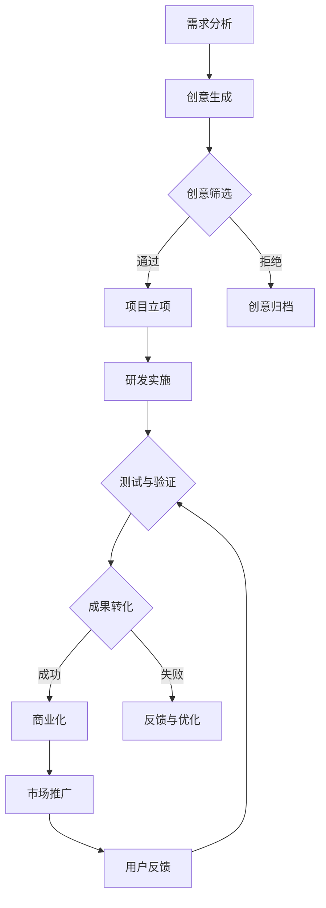

                 

### 文章标题

《AI创业公司的技术创新管理体系：创新机制、创新流程与创新文化》

> 关键词：AI创业、技术创新、管理体系、创新机制、创新流程、创新文化

> 摘要：本文针对AI创业公司的特点与挑战，深入探讨了技术创新管理体系的建设，包括创新机制、创新流程和创新文化的构建。文章通过详细的案例分析，提供了具体的实施策略和方法，旨在为AI创业公司提供系统性、可操作的实践指南。

### 第一部分：技术创新管理框架搭建

在快速发展的AI创业领域，技术创新成为推动企业持续竞争和发展的核心动力。一个有效的技术创新管理体系，不仅能够确保企业跟上行业发展的步伐，还能够为企业带来独特的竞争优势。本部分将详细探讨AI创业公司的技术创新管理框架，包括技术创新概述、管理体系架构、创新流程设计以及技术创新文化构建。

#### 1.1 AI创业公司技术创新概述

##### 1.1.1 AI创业公司的特点与挑战

AI创业公司通常具备以下几个特点：
1. **高技术含量**：依靠先进的技术和算法，AI创业公司能够在市场中占据独特的位置。
2. **高风险**：技术创新的不确定性和市场变化使得AI创业公司面临较大的风险。
3. **快速迭代**：AI技术发展迅猛，创业公司需要快速响应市场需求，不断进行产品迭代。

面对这些特点，AI创业公司也面临一系列挑战：
1. **资源限制**：初创企业通常在资金、人才等方面受到限制，需要在有限资源下进行高效创新。
2. **市场需求变化**：市场需求快速变化，创业公司需要具备灵活的调整能力。
3. **技术成熟度**：部分AI技术尚处于早期阶段，创业公司需要在技术成熟度与市场机会之间找到平衡。

##### 1.1.2 创新技术管理的重要性

创新是AI创业公司生存和发展的基石。有效的创新管理能够：
1. **确保技术领先**：通过持续的创新，保持技术领先地位，形成竞争壁垒。
2. **提高效率**：通过优化创新流程，提高研发效率，缩短产品上市时间。
3. **降低风险**：通过系统的风险控制机制，降低技术创新过程中的不确定性。
4. **激发人才潜力**：良好的创新文化能够激发员工的创造力和创新能力，形成人才优势。

##### 1.1.3 创新技术管理体系的构建目标

构建一个有效的技术创新管理体系，需要实现以下目标：
1. **资源整合**：整合企业内外部的创新资源，形成协同效应。
2. **流程优化**：优化创新流程，确保每个环节的高效运作。
3. **文化培育**：营造良好的创新文化，形成持续创新的动力。
4. **风险控制**：建立风险控制机制，降低技术创新过程中的风险。

#### 1.2 技术创新管理体系架构

##### 1.2.1 技术创新管理体系的组成部分

一个完整的技术创新管理体系通常包括以下几个组成部分：
1. **创新战略规划**：明确企业的创新方向和目标，为后续工作提供指导。
2. **创新机制设计**：包括创新激励机制、合作机制、风险控制机制等。
3. **创新流程设计**：明确创新活动的具体流程，确保创新过程的系统化和高效性。
4. **创新资源管理**：包括资金、人才、技术等资源的配置和管理。
5. **创新绩效评估**：通过评估创新效果，不断优化创新管理体系。

##### 1.2.2 创新技术管理体系的核心原则

在构建技术创新管理体系时，需要遵循以下核心原则：
1. **系统性**：技术创新是一个系统工程，需要综合考虑各个方面的因素。
2. **灵活性**：创新管理体系需要具备灵活性，以适应不断变化的市场和技术环境。
3. **激励性**：通过激励机制，激发员工和团队的创新能力。
4. **协同性**：促进企业内部不同部门和团队之间的协同合作。
5. **持续性**：构建创新管理体系不是一次性的工作，需要持续优化和改进。

##### 1.2.3 技术创新管理体系的架构设计

技术创新管理体系的架构设计需要考虑到企业的实际情况和战略目标。以下是一个典型的研究架构设计：


该架构包括以下几个关键模块：
1. **创新战略模块**：制定企业的创新战略和规划。
2. **创新资源管理模块**：包括资金、人才、技术等资源的配置和管理。
3. **创新机制设计模块**：设计并实施创新激励机制、合作机制和风险控制机制。
4. **创新流程设计模块**：明确创新活动的具体流程，确保创新过程的系统化和高效性。
5. **创新绩效评估模块**：通过评估创新效果，不断优化创新管理体系。

#### 1.3 创新技术管理流程设计

##### 1.3.1 创新技术管理流程的步骤

一个有效的创新管理流程通常包括以下几个关键步骤：

1. **需求分析**：收集和分析市场需求、技术趋势等信息，明确创新方向。
2. **创意生成**：鼓励员工和团队提出创新想法，进行头脑风暴。
3. **创意筛选**：评估和筛选创意，确定具有潜力的创新项目。
4. **项目立项**：对筛选出的创意进行立项，制定详细的项目计划和预算。
5. **研发实施**：实施研发工作，进行原型设计和开发。
6. **测试与验证**：对研发成果进行测试和验证，确保技术可行性和市场适应性。
7. **成果转化**：将研发成果转化为实际产品或服务，推向市场。

##### 1.3.2 创新技术管理流程的优化

为了提高创新管理流程的效率，可以采取以下优化策略：

1. **流程简化**：减少不必要的流程环节，缩短创新周期。
2. **标准化**：建立标准化流程，确保每个环节的一致性和高效性。
3. **敏捷开发**：采用敏捷开发方法，快速响应市场需求，进行迭代优化。
4. **信息共享**：建立信息共享平台，促进知识共享和协同工作。
5. **绩效评估**：定期评估创新绩效，发现并解决流程中的问题。

##### 1.3.3 创新技术管理流程的工具与方法

为了支持创新管理流程的实施，可以采用以下工具和方法：

1. **项目管理工具**：如JIRA、Trello等，用于任务分配、进度跟踪和协作。
2. **敏捷开发工具**：如Scrum、Kanban等，用于快速迭代和持续改进。
3. **头脑风暴工具**：如MindMeister、XMind等，用于创意生成和团队协作。
4. **数据分析工具**：如Excel、Tableau等，用于需求分析和绩效评估。
5. **云计算平台**：如AWS、Azure等，用于资源管理和数据处理。

#### 1.4 技术创新管理文化构建

##### 1.4.1 技术创新文化的内涵与特征

技术创新文化是一种价值观和行为模式，强调创新的重要性，鼓励员工积极参与创新活动。其内涵和特征包括：

1. **创新导向**：将创新视为企业发展的核心驱动力，鼓励员工不断探索和尝试。
2. **开放包容**：鼓励员工分享知识和经验，建立开放的知识共享和交流平台。
3. **持续学习**：鼓励员工持续学习和提升自身能力，以适应快速变化的技术环境。
4. **团队合作**：强调团队合作，通过跨部门、跨团队的协作实现创新。
5. **风险承担**：鼓励员工勇于承担创新风险，失败被视为学习机会。

##### 1.4.2 构建技术创新文化的策略

为了构建和培育技术创新文化，可以采取以下策略：

1. **领导示范**：企业领导层需要以身作则，积极参与创新活动，树立创新榜样。
2. **激励机制**：建立创新的激励机制，如奖金、晋升机会等，激励员工积极参与创新。
3. **培训与发展**：提供创新相关的培训和发展机会，提升员工的创新能力和素质。
4. **知识共享**：建立知识共享平台，鼓励员工分享知识和经验，促进知识传递。
5. **创新氛围**：营造积极、开放的创新氛围，鼓励员工勇于尝试和失败。

##### 1.4.3 技术创新文化在AI创业公司中的应用

在AI创业公司中，技术创新文化尤为重要。以下是一些实际应用案例：

1. **创业团队构建**：通过招聘具有创新精神和专业技能的人才，构建高绩效的创新团队。
2. **项目协作**：采用敏捷开发方法，鼓励团队成员跨部门协作，快速响应市场需求。
3. **创新竞赛**：定期举办创新竞赛，激发员工的创新热情，鼓励团队提出创新项目。
4. **知识共享平台**：建立内部知识共享平台，促进团队成员之间的知识传递和交流。
5. **创新奖励机制**：建立创新奖励机制，对成功创新的团队和个人进行表彰和奖励。

### 总结

构建一个有效的技术创新管理体系是AI创业公司成功的关键。通过明确创新管理框架、优化创新流程和培育创新文化，企业可以更好地应对市场和技术变化，实现持续创新和竞争优势。在后续的部分中，我们将进一步探讨创新机制的建设和优化，以期为AI创业公司提供更全面的实践指导。


#### 2.1 创新机制设计原则

在构建AI创业公司的技术创新管理体系时，创新机制的设计至关重要。一个有效的创新机制不仅能够激发员工的创造力，还能够确保创新活动的高效执行和成功落地。以下是创新机制设计的一些基本原则：

##### 2.1.1 创新机制设计的目标与原则

创新机制设计的主要目标包括：

1. **激发创造力**：通过建立激励机制和创造良好的创新环境，激发员工的创造力和创新思维。
2. **确保可行性**：确保创新活动具备技术可行性、市场适应性和经济可行性。
3. **提高效率**：优化创新流程，提高创新活动的执行效率。
4. **风险管理**：建立风险控制机制，降低创新过程中的不确定性和风险。

在创新机制设计过程中，需要遵循以下原则：

1. **系统性**：创新机制设计应具备系统性，涵盖从创意生成、项目立项到成果转化的全过程。
2. **灵活性**：创新机制应具备灵活性，以适应不断变化的市场和技术环境。
3. **激励性**：通过激励机制，鼓励员工积极参与创新活动，提高创新绩效。
4. **协同性**：促进企业内部不同部门和团队之间的协同合作，形成创新合力。
5. **可持续性**：确保创新机制的长期有效性和持续性，不断优化和改进。

##### 2.1.2 创新机制设计的方法与工具

在创新机制设计过程中，可以采用以下方法和工具：

1. **头脑风暴**：通过集体讨论和头脑风暴，激发员工的创新思维，生成大量创意。
2. **创意筛选**：采用筛选机制，对创意进行评估和筛选，确定具有潜力的创新项目。
3. **项目管理工具**：使用项目管理工具，如JIRA、Trello等，进行任务分配、进度跟踪和协作。
4. **敏捷开发方法**：采用敏捷开发方法，快速响应市场需求，进行迭代优化。
5. **创新实验室**：建立创新实验室，为员工提供创新的实验环境和资源。

##### 2.1.3 创新机制设计的案例分析

以下是一个创新机制设计的案例分析：

**案例：某AI创业公司的创新激励机制**

某AI创业公司通过以下措施设计创新激励机制：

1. **创新竞赛**：公司定期举办创新竞赛，鼓励员工提出创新项目。获胜者将获得奖金、晋升机会和公开表彰。
2. **项目奖金**：对于成功实现商业化的创新项目，公司提供项目奖金，激励创新团队的持续努力。
3. **股权激励**：对于在创新项目中表现突出的员工，公司提供股权激励，分享创新成果。
4. **培训与发展**：公司提供创新相关的培训和发展机会，提升员工的创新能力和技能。

通过这些措施，公司成功激发了员工的创新热情，提高了创新项目的成功率。

##### 2.1.4 创新合作机制的设计与实施

创新合作机制在技术创新中发挥着重要作用。以下是如何设计和实施创新合作机制的指导：

1. **合作伙伴选择**：选择具有互补优势的合作伙伴，如技术合作伙伴、市场合作伙伴等。
2. **合作模式**：明确合作模式，如共同研发、资源共享、知识共享等。
3. **合作协议**：制定合作协议，明确合作各方的权利、义务和利益分配。
4. **沟通机制**：建立有效的沟通机制，确保合作各方之间的信息畅通。
5. **合作评估**：定期评估合作效果，根据评估结果进行调整和优化。

以下是一个创新合作机制设计的案例分析：

**案例：某AI创业公司与高校的合作**

某AI创业公司通过与高校合作，建立了一个创新实验室，共同进行AI技术的研发。公司为实验室提供了资金、设备和人才支持，高校则提供了技术资源和研究成果。通过合作，公司获得了高校的技术支持，提高了自身的技术水平，而高校则通过合作项目提升了研究成果的转化率。

##### 2.1.5 创新风险控制机制的设计与实施

创新风险是技术创新过程中不可避免的问题。以下是如何设计和实施创新风险控制机制的指导：

1. **风险评估**：对创新项目进行风险评估，识别潜在的风险因素。
2. **风险分类**：将风险分为技术风险、市场风险、财务风险等，分别进行管理。
3. **风险应对策略**：制定风险应对策略，包括风险回避、风险降低、风险承担等。
4. **风险监控**：建立风险监控机制，定期对风险进行评估和监控。
5. **风险应急预案**：制定风险应急预案，确保在风险发生时能够迅速应对。

以下是一个创新风险控制机制设计的案例分析：

**案例：某AI创业公司的风险控制措施**

某AI创业公司通过以下措施进行创新风险控制：

1. **多项目并行**：公司同时开展多个创新项目，分散风险，确保在某个项目失败时，其他项目能够继续推进。
2. **技术储备**：公司保持一定的技术储备，以应对技术变化和挑战。
3. **市场调研**：公司进行详细的市场调研，确保创新项目符合市场需求。
4. **财务风险管理**：公司通过财务规划，确保在风险发生时有足够的资金应对。

通过这些措施，公司成功降低了创新风险，提高了项目的成功率。

##### 总结

创新机制的设计是AI创业公司技术创新管理体系的重要组成部分。通过明确设计原则、方法和工具，并结合实际案例，可以构建一个有效的创新机制，激发员工的创新潜力，提高创新项目的成功率。在后续的部分，我们将继续探讨创新流程的优化和创新文化的培育，为AI创业公司提供更全面的实践指导。

#### 2.2 创新激励机制

在AI创业公司的技术创新过程中，创新激励机制起到了至关重要的作用。有效的激励机制能够激发员工的创新热情，提高创新效率，从而推动企业的持续发展。以下将详细介绍创新激励机制的内涵、作用及其设计与实施方法。

##### 2.2.1 创新激励机制的内涵与作用

创新激励机制是指通过一系列的制度安排和激励手段，鼓励员工积极参与创新活动，提高创新绩效的一种管理机制。其内涵主要包括以下几个方面：

1. **绩效奖励**：对在创新项目中表现出色的员工或团队进行物质奖励，如奖金、股票期权等。
2. **荣誉表彰**：对创新成果显著的员工或团队进行公开表彰和奖励，提升其社会地位和职业成就感。
3. **晋升机会**：为在创新中表现突出的员工提供晋升和职业发展的机会，激励其持续创新。
4. **职业发展**：为员工提供创新相关的培训和发展机会，提升其专业技能和创新能力。
5. **工作环境**：创造一个支持创新的工作环境，如提供足够的资源、灵活的工作时间、良好的团队氛围等。

创新激励机制的作用主要体现在以下几个方面：

1. **提高员工积极性**：通过奖励和晋升机会，激发员工的积极性和参与热情。
2. **增强创新动力**：为员工提供职业发展的机会和良好的工作环境，增强其创新动力。
3. **促进知识共享**：通过激励制度，鼓励员工积极参与创新项目，促进知识的传递和共享。
4. **提高创新成功率**：有效的激励机制能够提高员工在创新过程中的投入和专注度，从而提高创新成功率。
5. **促进企业文化**：创新激励机制是企业文化的重要组成部分，有助于形成积极向上的企业文化和创新氛围。

##### 2.2.2 创新激励机制的设计与实施

要设计一个有效的创新激励机制，需要从以下几个方面进行考虑和实施：

1. **明确创新目标**：首先，企业需要明确自身的创新目标，包括技术创新方向、创新成果预期等，以便为激励机制的设计提供明确的方向。

2. **绩效评估标准**：制定科学、客观的绩效评估标准，对员工在创新项目中的表现进行公正、准确的评价。评估标准应涵盖创新项目的成功率、技术难度、市场潜力等多个维度。

3. **奖励方案设计**：根据创新项目的特点和企业实际情况，设计具有吸引力的奖励方案。奖励方案应包括物质奖励和精神奖励两个方面，如奖金、股票期权、荣誉证书、公开表彰等。

4. **晋升机制**：建立与创新激励机制相匹配的晋升机制，为在创新项目中表现突出的员工提供晋升机会。晋升机制应具有透明度和公正性，确保员工能够看到自己的职业发展前景。

5. **培训与发展**：为员工提供创新相关的培训和发展机会，提升其专业技能和创新能力。通过培训，不仅能够提高员工的专业素养，还能够增强其对企业的忠诚度和归属感。

6. **工作环境**：创造一个支持创新的工作环境，如提供充足的资源、灵活的工作时间、良好的团队氛围等。一个良好的工作环境能够激发员工的创新思维，提高工作效率。

7. **反馈机制**：建立有效的反馈机制，及时收集员工对创新激励机制的意见和建议，并进行相应的调整和优化。通过反馈机制，企业能够不断改进激励机制，提高其有效性和满意度。

以下是一个创新激励机制设计的案例分析：

**案例：某AI创业公司的创新激励机制**

某AI创业公司通过以下措施设计创新激励机制：

1. **创新竞赛**：公司定期举办创新竞赛，鼓励员工提出创新项目。获胜者将获得高额奖金和晋升机会。
2. **项目奖金**：对于成功实现商业化的创新项目，公司提供项目奖金，激励创新团队的持续努力。
3. **股权激励**：对于在创新项目中表现突出的员工，公司提供股权激励，分享创新成果。
4. **培训与发展**：公司为员工提供创新相关的培训和发展机会，提升其创新能力和技能。
5. **工作环境**：公司提供灵活的工作时间和丰富的资源，创造一个支持创新的工作环境。

通过这些措施，公司成功激发了员工的创新热情，提高了创新项目的成功率。

##### 2.2.3 创新激励机制的效果评估与调整

创新激励机制的有效性需要通过评估和调整来确保。以下是如何评估和调整创新激励机制的建议：

1. **绩效评估**：定期对创新激励机制的效果进行评估，包括创新项目的成功率、员工满意度等指标。通过绩效评估，企业能够了解激励机制的实际效果，发现潜在问题。

2. **员工反馈**：通过员工反馈了解他们对创新激励机制的看法和建议。员工反馈是改进激励机制的重要参考依据。

3. **数据驱动的调整**：根据绩效评估和员工反馈的数据，对创新激励机制进行调整。调整应具有针对性，解决具体问题，确保激励机制的持续有效。

4. **持续优化**：创新激励机制是一个动态的过程，需要不断优化和改进。企业应根据市场环境、技术发展等变化，及时调整激励机制，以适应新的挑战和机遇。

通过上述评估和调整措施，企业可以确保创新激励机制的有效性和持续性，从而推动技术创新的持续发展。

##### 总结

创新激励机制是AI创业公司技术创新管理体系的重要组成部分。通过明确创新激励机制的设计原则和实施方法，结合实际案例，企业可以构建一个有效的创新激励机制，激发员工的创新潜力，提高创新项目的成功率。在后续的部分，我们将继续探讨创新合作机制和风险控制机制的设计与实施，为AI创业公司提供更全面的实践指导。

#### 2.3 创新合作机制

在AI创业公司的技术创新过程中，单一团队或个人的力量往往难以满足复杂项目的需求。因此，建立有效的创新合作机制，整合内外部资源，形成协同创新网络，成为提升企业创新能力的关键。以下将详细探讨创新合作机制的重要性、设计与实施策略，并结合实际案例进行分析。

##### 2.3.1 创新合作机制的重要性

创新合作机制在AI创业公司的技术创新中具有重要作用，主要体现在以下几个方面：

1. **资源整合**：通过合作，企业能够整合内外部资源，如技术、资金、人才等，提升创新项目的成功率。
2. **知识共享**：合作有助于知识的传递和共享，促进不同团队和合作伙伴之间的知识交流和经验借鉴。
3. **风险分担**：通过合作，企业可以分担技术创新过程中的风险，降低单个企业的风险承受压力。
4. **市场扩展**：合作可以为企业带来新的市场机会，通过合作伙伴的渠道和市场影响力，加速产品的市场推广。
5. **技术互补**：合作伙伴通常在技术领域具有互补优势，合作能够实现技术的互补和提升，推动技术创新。

##### 2.3.2 创新合作机制的设计与实施策略

为了建立有效的创新合作机制，AI创业公司可以采取以下策略：

1. **明确合作目标**：首先，企业需要明确合作的目标和方向，包括技术突破、市场拓展、资源共享等，以确保合作的针对性和有效性。

2. **选择合适合作伙伴**：选择具备互补优势、信誉良好、合作意愿强的合作伙伴，如高校、研究机构、产业链上下游企业等。合作伙伴的选择应基于合作目标和企业战略。

3. **制定合作协议**：明确合作各方的权利、义务和责任，制定详细的合作协议，包括合作内容、合作期限、利益分配、知识产权归属等。

4. **建立沟通机制**：建立有效的沟通机制，确保合作各方之间的信息畅通，包括定期会议、项目进展报告、在线沟通平台等。

5. **共享资源**：共享研发资源、技术知识、市场信息等，通过资源整合，提高创新效率。

6. **风险管理**：制定风险管理策略，对合作过程中的风险进行识别、评估和控制，确保合作的稳定性和持续性。

7. **绩效评估**：建立绩效评估机制，对合作效果进行定期评估，包括创新成果、市场表现、合作满意度等，并根据评估结果进行优化和调整。

##### 2.3.3 创新合作机制的案例分析

**案例：某AI创业公司与高校的合作**

某AI创业公司与高校合作，共同建立了一个创新实验室，专注于AI技术的研究和开发。以下为该案例的关键环节和实施步骤：

1. **合作目标明确**：公司明确了与高校合作的目标，包括共同进行AI技术研究、培养人才、推动科研成果转化等。

2. **合作伙伴选择**：公司选择了一所具备AI技术优势的高校，双方在技术领域有较强的互补性。

3. **合作协议制定**：双方制定了详细合作协议，明确了合作内容、合作期限、利益分配、知识产权归属等。

4. **资源共享**：公司提供了资金、设备和人才支持，高校提供了技术资源和研究成果。双方共同使用实验室设施，实现资源的高效利用。

5. **项目协同**：公司和技术团队与高校的研究人员紧密合作，共同推进研发项目，实现技术的互补和提升。

6. **风险控制**：公司制定了风险管理策略，对合作过程中的技术风险、市场风险等进行了识别和评估。

7. **绩效评估**：公司定期对合作效果进行评估，包括技术突破、市场表现、合作满意度等。根据评估结果，对合作策略进行调整和优化。

通过该合作，公司获得了高校的技术支持和研究成果，提高了自身的创新能力，同时高校的研究成果也得到了有效转化，实现了双赢。

##### 总结

创新合作机制是AI创业公司技术创新管理体系的重要组成部分。通过明确合作目标、选择合适合作伙伴、制定合作协议、建立沟通机制、共享资源、风险管理等策略，企业可以建立有效的创新合作机制，提升创新能力，推动技术创新的持续发展。在后续的部分，我们将探讨创新风险控制机制的设计与实施，为AI创业公司提供更全面的实践指导。

#### 2.4 创新风险控制机制

在AI创业公司的技术创新过程中，创新风险是不可避免的问题。有效的创新风险控制机制能够帮助企业识别、评估和控制创新过程中的风险，降低不确定性，提高创新成功率。以下将详细探讨创新风险控制机制的策略、工具及其应用，并通过实际案例进行说明。

##### 2.4.1 创新风险控制的策略与方法

1. **风险评估策略**：首先，企业需要建立风险评估机制，对创新项目进行全面的评估。风险评估应包括以下几个方面：
   - **技术风险评估**：评估技术创新的技术难度、可行性以及技术成熟度。
   - **市场风险评估**：评估创新项目在市场中的竞争力、市场需求以及市场容量。
   - **财务风险评估**：评估创新项目的成本、收益、资金流动等财务指标。
   - **法律和合规风险评估**：评估创新项目可能涉及的法律风险和合规性。

2. **风险分类方法**：根据风险评估结果，将风险进行分类，以便采取针对性的控制措施。常见的风险分类方法包括：
   - **技术风险**：如技术实现困难、技术突破难度大等。
   - **市场风险**：如市场需求不明确、竞争对手反应强烈等。
   - **财务风险**：如资金不足、成本超支等。
   - **法律和合规风险**：如专利侵权、数据安全等。

3. **风险应对策略**：针对不同类型的风险，企业应采取相应的应对策略：
   - **风险回避**：通过调整创新方向、放弃高风险项目等方式，避免风险。
   - **风险降低**：通过改进技术、优化流程、增加资源投入等方式，降低风险发生的概率和影响。
   - **风险承担**：对于一些不可避免的风险，企业可以采取承担风险的态度，通过保险、备用方案等方式进行应对。

4. **风险管理工具**：企业可以使用多种工具和方法进行风险控制，如：
   - **风险矩阵**：通过风险矩阵对风险进行优先级排序，明确重点风险。
   - **敏感性分析**：分析不同变量对创新项目的影响，识别关键风险因素。
   - **蒙特卡洛模拟**：通过模拟不同场景下的风险情况，评估风险的概率和影响。

##### 2.4.2 创新风险控制的应用

以下是一个创新风险控制机制的案例分析：

**案例：某AI创业公司的创新风险控制实践**

某AI创业公司通过以下措施进行创新风险控制：

1. **风险评估**：公司在项目立项前，对创新项目进行了全面的风险评估。评估内容包括技术可行性、市场前景、财务状况等。通过风险评估，公司确定了项目的优先级，并明确了需要重点关注的风险因素。

2. **风险分类**：公司根据风险评估结果，将风险分为技术风险、市场风险、财务风险等。对于技术风险，公司制定了详细的技术实现计划，确保技术的可行性。对于市场风险，公司进行了详细的市场调研，制定了市场推广策略。对于财务风险，公司制定了详细的财务预算，确保项目的资金充足。

3. **风险应对策略**：针对不同类型的风险，公司采取了相应的应对策略。对于技术风险，公司加大了研发投入，聘请了技术专家进行指导。对于市场风险，公司制定了灵活的市场推广策略，以应对市场变化。对于财务风险，公司通过多渠道融资，确保项目资金的充足。

4. **风险监控**：公司建立了风险监控机制，定期对项目进展进行监控，及时发现并解决潜在问题。通过风险监控，公司能够及时调整项目计划，确保项目的顺利推进。

5. **应急预案**：公司制定了应急预案，针对可能发生的风险，准备了相应的应对措施。例如，针对技术风险，公司准备了备选技术方案。针对市场风险，公司准备了备用推广方案。

通过以上措施，公司成功降低了创新风险，提高了项目的成功率。

##### 总结

创新风险控制机制是AI创业公司技术创新管理体系的重要组成部分。通过有效的风险评估、分类、应对策略和监控措施，企业可以降低创新过程中的不确定性，提高创新成功率。在实际应用中，企业应根据自身情况，灵活运用风险控制策略和方法，确保技术创新的顺利进行。在后续的部分，我们将探讨创新流程的优化策略和创新文化的培育，为AI创业公司提供更全面的实践指导。

#### 3.1 创新项目管理

在AI创业公司的技术创新过程中，创新项目管理起着至关重要的作用。有效的创新项目管理能够确保创新项目按计划进行，提高项目成功率，并最终实现技术突破和商业价值。以下将详细探讨创新项目管理的目标、任务和方法，并结合实际案例进行分析。

##### 3.1.1 创新项目管理的目标与任务

创新项目管理的目标主要包括以下几个方面：

1. **确保项目按时完成**：通过有效的项目管理，确保创新项目在预定时间内完成，减少延误和延期。
2. **确保项目在预算内完成**：通过优化资源配置和成本控制，确保创新项目在预算范围内完成，避免成本超支。
3. **确保项目质量**：通过严格的项目质量控制，确保创新项目的成果满足技术要求和市场标准。
4. **确保项目创新性**：通过系统化的项目管理，确保创新项目具备技术突破和商业创新的价值。
5. **确保团队协作**：通过有效的沟通和协调，确保项目团队成员之间的协作，提高项目执行效率。

创新项目管理的任务主要包括以下几个方面：

1. **项目立项**：明确创新项目的目标、范围、可行性等，制定项目计划和预算，进行项目立项。
2. **资源规划**：根据项目需求，合理分配项目资源，包括资金、人力、设备等，确保项目所需资源充足。
3. **任务分配**：将项目任务分解为具体的工作任务，明确任务责任人，制定任务计划和进度安排。
4. **进度监控**：对项目进度进行实时监控，及时发现并解决进度问题，确保项目按计划推进。
5. **质量控制**：对项目成果进行质量检查和评估，确保项目成果符合技术要求和市场标准。
6. **沟通协调**：建立有效的沟通机制，确保项目团队成员之间的信息畅通，协调解决项目中的冲突和问题。
7. **项目评估**：对项目成果进行评估，总结项目经验和教训，为未来项目提供参考。

##### 3.1.2 创新项目管理的方法与工具

为了实现创新项目管理的目标，AI创业公司可以采用以下方法和工具：

1. **项目管理工具**：使用项目管理工具，如JIRA、Trello、Asana等，进行任务分配、进度跟踪和协作。这些工具能够帮助团队实时了解项目进展，提高工作效率。

2. **敏捷开发方法**：采用敏捷开发方法，如Scrum或Kanban，进行迭代式项目管理。敏捷开发方法能够快速响应市场需求，提高项目灵活性。

3. **风险管理**：通过建立风险管理机制，对项目中的潜在风险进行识别、评估和应对。常见的方法包括风险矩阵、敏感性分析等。

4. **质量管理**：采用质量管理体系，如ISO 9001标准，确保项目成果的质量。质量管理包括质量计划、质量控制、质量改进等环节。

5. **绩效评估**：通过定期评估项目绩效，包括进度、质量、成本等方面，确保项目目标的实现。绩效评估可以采用关键绩效指标（KPI）等工具。

##### 3.1.3 创新项目管理的案例分析

以下是一个创新项目管理的案例分析：

**案例：某AI创业公司的创新项目管理实践**

某AI创业公司通过以下措施进行创新项目管理：

1. **项目立项**：公司对创新项目进行了详细的市场调研和可行性分析，明确了项目的目标和范围，制定了项目计划和预算。

2. **资源规划**：公司根据项目需求，合理分配了项目资源，包括资金、人力、设备等。公司还聘请了外部专家进行技术指导，确保项目的技术可行性。

3. **任务分配**：公司将项目任务分解为多个工作包，明确了任务责任人，制定了任务计划和进度安排。任务分配采用了敏捷开发方法，以快速响应市场需求。

4. **进度监控**：公司通过JIRA等项目管理工具，对项目进度进行实时监控。项目经理定期召开会议，协调解决项目中的进度问题。

5. **质量控制**：公司建立了质量管理体系，对项目成果进行质量检查和评估。质量管理人员定期对项目进行质量审计，确保项目成果符合技术要求和市场标准。

6. **沟通协调**：公司建立了内部沟通平台，确保项目团队成员之间的信息畅通。项目经理定期组织团队会议，讨论项目进展和问题，协调解决项目中的冲突。

7. **项目评估**：项目完成后，公司对项目成果进行了全面评估，包括技术实现、市场表现、成本效益等方面。评估结果表明，项目成功实现了技术突破和商业价值。

通过以上措施，公司成功完成了多个创新项目，提高了项目成功率，增强了企业的核心竞争力。

##### 总结

创新项目管理是AI创业公司技术创新管理体系的重要组成部分。通过明确项目目标、任务，采用合适的方法和工具，以及有效的风险和质量控制，企业可以确保创新项目的顺利进行，提高项目成功率。在实际应用中，企业应根据自身情况，灵活运用项目管理方法和工具，持续优化项目管理流程，为技术创新提供有力支持。在后续的部分，我们将探讨创新流程的优化策略和创新文化的培育，为AI创业公司提供更全面的实践指导。

#### 3.2 创新流程优化策略

为了确保AI创业公司的技术创新高效、有序进行，优化创新流程成为关键策略。以下将详细探讨创新流程优化的目标与原则，以及具体优化方法与工具，并结合实际案例进行分析。

##### 3.2.1 创新流程优化的目标与原则

创新流程优化的主要目标包括：

1. **提高效率**：通过优化流程，减少不必要的环节和冗余步骤，提高创新活动的执行效率。
2. **降低成本**：通过流程优化，减少资源浪费和成本支出，确保创新活动的经济性。
3. **增强灵活性**：优化后的流程应具备良好的适应性，能够快速响应市场需求和技术变化。
4. **提升质量**：通过优化流程，确保创新项目的质量，提高成果的市场竞争力和用户满意度。

创新流程优化应遵循以下原则：

1. **系统性**：优化流程应从整体上考虑，确保各个环节的协同和一致性。
2. **目标导向**：优化流程应围绕实现创新目标进行，确保流程设计符合企业战略和市场需求。
3. **透明性**：优化后的流程应具有明确的流程图和操作指南，确保相关人员能够清晰理解流程。
4. **灵活性**：优化流程应具备灵活性，能够适应不同的创新项目和企业实际情况。
5. **持续改进**：优化流程不是一次性工作，需要根据实际执行情况不断调整和改进。

##### 3.2.2 创新流程优化的方法与工具

为了实现创新流程的优化，AI创业公司可以采用以下方法和工具：

1. **流程建模**：使用流程建模工具，如Business Process Model and Notation (BPMN)，对现有流程进行建模和分析。通过流程建模，可以直观地展示流程中的各个环节和关系，发现优化机会。

2. **流程分析**：通过流程分析，识别流程中的瓶颈、冗余环节和资源浪费。常见的方法包括流程图分析、数据分析和流程仿真等。

3. **流程再造**：基于流程分析的结果，对现有流程进行再造，消除瓶颈和冗余，提高流程效率。流程再造可以采用精益管理、六西格玛等先进方法。

4. **敏捷开发**：采用敏捷开发方法，如Scrum或Kanban，进行迭代式创新项目管理。敏捷开发方法能够快速响应需求变化，提高创新效率。

5. **绩效评估**：通过建立绩效评估体系，对优化后的流程进行评估和监控。绩效评估可以采用关键绩效指标（KPI）、流程指标等工具。

6. **持续改进**：建立持续改进机制，定期对流程进行回顾和优化。通过持续改进，不断提升流程的效率和质量。

##### 3.2.3 创新流程优化的案例分析

以下是一个创新流程优化的案例分析：

**案例：某AI创业公司的创新流程优化实践**

某AI创业公司通过以下措施进行创新流程优化：

1. **流程建模**：公司首先使用BPMN工具对现有创新流程进行了建模，明确了各个环节和关系。通过流程建模，公司发现了一些瓶颈和冗余环节。

2. **流程分析**：公司对现有流程进行了详细分析，识别出流程中的瓶颈和冗余环节。例如，在需求分析阶段，频繁的文档修改和沟通延误导致了项目进度延误。

3. **流程再造**：基于流程分析的结果，公司对创新流程进行了再造。公司取消了部分冗余环节，如中间文档评审环节，并引入了敏捷开发方法，以减少沟通延误和提升效率。

4. **敏捷开发**：公司采用Scrum方法，将项目分为多个迭代周期，每个周期进行需求分析、开发、测试和发布。通过迭代式开发，公司能够快速响应市场需求，缩短产品上市时间。

5. **绩效评估**：公司建立了绩效评估体系，对优化后的流程进行了评估和监控。绩效评估指标包括项目进度、成本、质量和用户满意度等。

6. **持续改进**：公司建立了持续改进机制，定期对流程进行回顾和优化。通过持续改进，公司不断提升流程的效率和质量。

通过以上措施，公司成功优化了创新流程，提高了项目执行效率，缩短了产品上市时间，增强了企业的竞争力。

##### 总结

创新流程优化是AI创业公司技术创新管理体系的重要组成部分。通过明确优化目标与原则，采用合适的优化方法和工具，以及持续改进，企业可以不断提升创新流程的效率和质量，为技术创新提供有力支持。在实际应用中，企业应根据自身情况，灵活运用优化策略和方法，确保创新流程的持续优化。在后续的部分，我们将探讨创新流程的工具应用和创新文化的培育，为AI创业公司提供更全面的实践指导。

#### 3.3 创新流程的工具应用

在AI创业公司的技术创新过程中，合理应用各种工具可以提高创新流程的效率和质量。以下将介绍几种常用的创新流程工具，并探讨它们在不同应用场景中的使用方法和效果。

##### 3.3.1 常用创新流程工具介绍

1. **项目管理工具**：
   - **JIRA**：一款功能强大的项目管理工具，适用于任务分配、进度跟踪和协作。JIRA提供灵活的定制化功能，支持多种项目类型，如敏捷开发、瀑布模型等。
   - **Trello**：一个简单直观的任务管理工具，通过看板（Board）形式展示项目进展，适合小型项目和团队成员之间的协作。

2. **需求分析工具**：
   - **JIRA Demand**：与JIRA集成，用于需求管理和优先级排序。JIRA Demand帮助团队明确需求、收集反馈，并跟踪需求的实现过程。
   - **Confluence**：一款知识共享和协作平台，可用于编写需求文档、用户故事和项目计划，支持版本控制和协作编辑。

3. **敏捷开发工具**：
   - **Scrum**：一种迭代式项目管理方法，通过短周期（Sprint）进行需求分析和开发。Scrum强调团队协作和快速反馈，适用于快速变化的市场环境。
   - **Kanban**：一种可视化流程管理方法，通过看板（Kanban Board）展示任务状态和流程。Kanban适用于项目执行和控制，帮助团队识别瓶颈和优化流程。

4. **协作平台**：
   - **Slack**：一款团队协作工具，提供即时通讯、文件共享和项目管理功能。Slack帮助团队保持沟通畅通，提高工作效率。
   - **Microsoft Teams**：集成了聊天、视频会议、文档共享等功能，适用于远程团队协作和项目沟通。

##### 3.3.2 创新流程工具的应用场景

1. **项目管理工具**：
   - **应用场景**：项目立项、任务分配、进度跟踪和协作。
   - **使用方法**：项目经理创建项目任务，分配给团队成员，并通过工具进行进度跟踪和协作。JIRA和Trello可以用于大型项目和团队协作，而Confluence则适用于需求文档和项目计划的编写和共享。

2. **需求分析工具**：
   - **应用场景**：需求收集、分析和管理。
   - **使用方法**：团队通过JIRA Demand创建和管理需求，优先级排序和跟踪需求实现过程。Confluence则用于编写详细的需求文档和用户故事，支持多人协作和版本控制。

3. **敏捷开发工具**：
   - **应用场景**：迭代式开发、需求分析和任务管理。
   - **使用方法**：团队使用Scrum方法进行短周期（Sprint）开发，通过看板（Scrum Board）展示任务状态和进度。Kanban适用于项目执行和控制，帮助团队识别瓶颈和优化流程。

4. **协作平台**：
   - **应用场景**：团队沟通、协作和文档共享。
   - **使用方法**：团队通过即时通讯、视频会议和文档共享功能保持沟通畅通，提高工作效率。Slack和Microsoft Teams支持远程团队协作，确保信息传递及时和准确。

##### 3.3.3 创新流程工具的选型与使用

在选择和使用创新流程工具时，AI创业公司应考虑以下因素：

1. **团队规模**：对于小型团队，选择简单直观的工具，如Trello和Slack；对于大型团队，选择功能强大的工具，如JIRA和Microsoft Teams。

2. **项目类型**：根据项目类型和需求，选择适合的项目管理工具和敏捷开发方法。例如，研发型项目适合使用Scrum或Kanban，市场推广型项目适合使用JIRA Demand。

3. **集成与兼容性**：选择能够与其他系统集成的工具，如与GitHub、Confluence等集成，实现数据共享和流程连贯。

4. **培训与支持**：确保团队成员熟悉和使用工具，提供培训和支持，提高工具的利用率。

以下是一个创新流程工具选型的案例分析：

**案例：某AI创业公司的创新流程工具选型与实践**

某AI创业公司通过以下步骤选型和使用创新流程工具：

1. **团队规模和项目类型**：公司规模较小，项目类型多样，包括研发型项目和市场推广型项目。

2. **工具选型**：
   - 项目管理：选用Trello进行任务分配和进度跟踪，直观易用。
   - 需求分析：选用JIRA Demand进行需求管理和优先级排序。
   - 敏捷开发：选用Scrum方法，通过JIRA进行迭代式开发管理。

3. **集成与兼容性**：Trello和JIRA Demand与公司已有的GitHub和Confluence系统集成，实现数据共享和流程连贯。

4. **培训与支持**：公司为团队成员提供Trello、JIRA和Scrum的培训，确保工具的熟练使用。

通过以上步骤，公司成功提高了创新流程的效率，确保了项目的顺利进行。

##### 总结

创新流程工具在AI创业公司的技术创新过程中发挥着重要作用。通过合理选型和有效使用项目管理工具、需求分析工具、敏捷开发工具和协作平台，企业可以提升创新流程的效率和质量，推动技术创新的顺利进行。在实际应用中，企业应根据自身情况和项目需求，灵活选择和运用创新流程工具，实现技术创新的持续发展。

#### 4.1 创新文化的内涵与特征

创新文化是一种价值观和行为模式，它强调创新的重要性，鼓励员工积极参与创新活动，并在企业内部形成一种支持创新的氛围。创新文化不仅是技术创新的基础，也是企业持续发展的动力源泉。以下将详细探讨创新文化的内涵、特征及其重要性。

##### 4.1.1 创新文化的定义与内涵

创新文化是一种以创新为核心价值观的企业文化，它体现在企业的方方面面，包括员工的态度、行为、管理机制和企业战略。创新文化的定义可以从以下几个方面来理解：

1. **创新导向**：企业将创新视为发展的核心驱动力，通过创新来应对市场变化、技术进步和竞争压力。
2. **开放包容**：企业鼓励员工提出创新想法，不论其背景、职位或等级，都对创新保持开放和包容的态度。
3. **持续学习**：企业倡导持续学习，鼓励员工不断提升自身技能和知识，以适应快速变化的技术环境。
4. **团队合作**：企业强调团队合作，通过跨部门、跨团队的协作，实现创新的协同效应。
5. **风险承担**：企业鼓励员工勇于承担创新风险，将失败视为学习和成长的机会。

创新文化的内涵主要包括以下几个方面：

1. **创新价值观**：企业内部形成的一种共同价值观，强调创新的重要性，并将其作为企业的核心竞争力。
2. **创新行为**：员工在日常工作中的创新行为，如提出创新想法、尝试新方法、分享知识和经验等。
3. **创新机制**：企业为支持创新所建立的制度和流程，如创新激励机制、合作机制、风险控制机制等。
4. **创新氛围**：企业内部形成的一种支持创新、鼓励创新的文化氛围，员工在这种氛围中感受到创新的自由和保障。

##### 4.1.2 创新文化的特征与要素

创新文化具有以下几个显著特征：

1. **开放性**：创新文化鼓励开放思维，欢迎外部观点和意见，员工可以自由地提出创新想法，不受等级和职位的限制。
2. **包容性**：创新文化对多样性保持包容态度，不论年龄、性别、背景等，都鼓励员工积极参与创新活动。
3. **持续性**：创新文化强调持续创新，不仅仅是短期行为，而是企业长期战略的一部分。
4. **协作性**：创新文化强调团队合作，跨部门、跨团队的协作能够产生更大的创新成果。
5. **风险容忍度**：创新文化对失败保持宽容态度，将失败视为学习和成长的机会，而不是惩罚。

创新文化的要素包括：

1. **领导层支持**：企业领导层对创新文化的大力支持是创新文化形成的关键，领导层的示范作用对员工有重要影响。
2. **激励机制**：建立有效的激励机制，如奖励创新成果、提供职业发展机会等，激发员工的创新热情。
3. **知识共享**：建立知识共享平台和机制，促进员工之间的知识传递和经验交流。
4. **培训与发展**：为员工提供创新相关的培训和发展机会，提升其创新能力和技能。
5. **信息透明**：企业内部信息透明，确保员工能够及时了解企业战略、市场动态和技术趋势，为创新提供有力支持。

##### 4.1.3 创新文化的重要性

创新文化在AI创业公司中具有重要性，主要体现在以下几个方面：

1. **提高创新能力**：创新文化鼓励员工积极思考和尝试，提高企业的整体创新能力，推动技术突破。
2. **增强团队凝聚力**：创新文化强调团队合作，有助于增强团队凝聚力，形成协同创新的合力。
3. **激发员工潜力**：创新文化为员工提供自由和保障，激发其创造力和潜力，提高员工的工作满意度和忠诚度。
4. **提高竞争力**：创新文化使企业能够快速响应市场变化，持续推出具有竞争力的产品和服务，提高市场竞争力。
5. **推动企业持续发展**：创新文化是企业发展的重要动力，通过不断创新，企业能够保持长期的竞争优势，实现持续发展。

##### 总结

创新文化是AI创业公司技术创新管理体系的重要组成部分。通过定义和内涵的深入探讨，以及特征和要素的详细分析，我们可以看到创新文化对于企业的重要性。在后续的部分中，我们将进一步探讨如何培育和传播创新文化，以及如何评估创新文化的效果，为AI创业公司提供更全面的实践指导。

#### 4.2 创新文化的培育策略

要在一个AI创业公司中成功培育创新文化，企业需要采取一系列系统化的策略，从领导层的示范作用到激励机制，再到知识共享和员工发展，确保创新文化在企业内部扎根并蓬勃发展。以下将详细探讨这些策略。

##### 4.2.1 培育创新文化的目标与原则

培育创新文化的目标包括：

1. **激发员工创新意识**：通过一系列措施激发员工的创新意识，使其将创新视为日常工作的一部分。
2. **营造创新氛围**：在企业内部营造一个鼓励创新、包容失败、支持风险承担的积极氛围。
3. **提升创新能力**：通过持续的学习和发展，提升员工的创新能力，使其能够在面对挑战时提出创新的解决方案。
4. **促进知识共享**：建立有效的知识共享机制，鼓励员工分享经验和知识，形成企业的集体智慧。

在培育创新文化时，应遵循以下原则：

1. **领导层示范**：企业领导层需要以身作则，通过自身的行为和决策，展示对创新的重视和支持。
2. **激励机制**：建立激励机制，奖励那些在创新方面表现突出的员工或团队。
3. **透明沟通**：保持企业内部信息的透明，确保员工能够及时了解企业战略、市场动态和技术趋势。
4. **协作合作**：鼓励跨部门、跨团队的协作，通过合作实现创新的最大化。
5. **持续改进**：创新文化是一个持续的过程，需要不断优化和改进，以适应不断变化的市场和技术环境。

##### 4.2.2 培育创新文化的策略与方法

以下是一些具体的培育创新文化的策略和方法：

1. **领导层示范**

   - **行为示范**：企业领导层需要通过自身的言行，展示对创新的重视和支持。例如，领导可以亲自参与创新项目，或是在会议上强调创新的重要性。
   - **决策支持**：领导层在决策时，应考虑创新因素，给予创新项目更多的支持和资源。

2. **激励机制**

   - **绩效奖励**：为在创新方面表现突出的员工或团队提供物质奖励，如奖金、股票期权等。
   - **荣誉表彰**：通过公开表彰和奖励，提升员工在创新方面的成就感和自豪感。
   - **职业发展**：为在创新方面有潜力的员工提供职业发展机会，如晋升、培训等。

3. **知识共享**

   - **内部培训**：定期组织创新培训，提升员工的创新技能和知识水平。
   - **知识共享平台**：建立内部知识共享平台，鼓励员工分享经验和知识，促进知识传递和交流。
   - **跨部门合作**：鼓励不同部门之间的合作，通过项目合作和知识交流，促进创新文化的形成。

4. **透明沟通**

   - **定期会议**：定期召开会议，确保员工能够及时了解企业战略、市场动态和技术趋势。
   - **信息透明**：保持企业内部信息的透明，确保员工能够了解项目的进展和决策过程。

5. **协作合作**

   - **跨部门团队**：建立跨部门团队，通过协作实现创新的最大化。
   - **外部合作**：与外部合作伙伴建立合作关系，共同开展创新项目，促进知识共享和经验交流。

6. **持续改进**

   - **反馈机制**：建立反馈机制，定期收集员工对创新文化的意见和建议，根据反馈进行优化和改进。
   - **文化氛围**：营造积极、开放的创新氛围，鼓励员工勇于尝试和失败。

##### 4.2.3 培育创新文化的案例分析

以下是一个培育创新文化的案例分析：

**案例：某AI创业公司的创新文化培育实践**

某AI创业公司通过以下措施培育创新文化：

1. **领导层示范**：公司创始人亲自参与创新项目，并在公司内部会议上强调创新的重要性，展示了领导层对创新的重视和支持。

2. **激励机制**：公司设立了创新奖，每年评选出在创新方面表现突出的员工和团队，并提供高额奖金和晋升机会。

3. **知识共享**：公司建立了内部知识共享平台，鼓励员工分享经验和知识，促进了知识传递和交流。

4. **透明沟通**：公司定期召开全体会议，向员工通报公司的战略方向、市场动态和技术趋势，确保员工能够及时了解相关信息。

5. **协作合作**：公司鼓励跨部门团队的合作，通过项目合作和知识交流，形成了良好的创新氛围。

6. **持续改进**：公司建立了反馈机制，定期收集员工对创新文化的意见和建议，并根据反馈进行优化和改进。

通过以上措施，公司成功培育了创新文化，员工创新意识和创新能力显著提升，创新项目的成功率也不断提高。

##### 总结

培育创新文化是AI创业公司持续发展的重要保障。通过明确培育目标、遵循核心原则，并采取一系列具体的策略和方法，企业可以营造一个支持创新的氛围，激发员工的创新潜力，推动企业技术创新的持续发展。在后续的部分中，我们将进一步探讨如何传播和推广创新文化，以及如何评估创新文化的效果，为AI创业公司提供更全面的实践指导。

#### 4.3 创新文化的传播与推广

在成功培育创新文化之后，如何有效地传播和推广这种文化，使其在企业内部得到广泛应用，是确保创新文化持续发展的关键。以下将详细探讨创新文化的传播与推广途径、方法以及宣传策略。

##### 4.3.1 创新文化的传播途径

1. **内部会议**：通过定期的内部会议，如员工大会、部门例会等，向全体员工传达创新文化的核心价值和理念，强调其在企业战略中的重要性。

2. **内部培训**：定期组织创新培训课程，涵盖创新方法论、创新工具、创新案例分析等内容，提升员工在创新方面的知识和技能。

3. **内部交流平台**：利用内部交流平台，如企业内部社交网络、电子邮件等，发布创新文化的宣传材料、成功案例和最新动态，营造全员参与的创新氛围。

4. **企业文化活动**：举办创新文化活动，如创新竞赛、创新展示会等，激发员工的创新热情，促进创新文化的传播。

5. **领导层宣传**：企业领导层通过演讲、采访、内部分享等形式，亲自宣传创新文化，树立榜样，提高员工对创新文化的认同感。

##### 4.3.2 创新文化的推广方法

1. **树立典型**：通过表彰在创新方面表现突出的个人或团队，树立典型，鼓励其他员工向典型学习，形成良好的创新氛围。

2. **案例分享**：通过分享成功的创新案例，让员工了解创新的具体实践和方法，激发员工的创新灵感。

3. **跨部门交流**：鼓励不同部门之间的交流和合作，通过跨部门项目合作，促进创新文化的传播和推广。

4. **外部合作**：与外部合作伙伴，如高校、研究机构等，建立合作关系，通过合作项目和知识交流，推广创新文化。

5. **宣传材料**：制作创新文化的宣传手册、海报、视频等，在企业内部进行广泛传播，加深员工对创新文化的理解和认同。

##### 4.3.3 创新文化的宣传策略

1. **长期宣传**：创新文化是一个长期的过程，需要持续的宣传和推广。企业应制定长期宣传计划，确保创新文化的传播力度和频率。

2. **个性化宣传**：根据不同员工的特点和需求，制定个性化的宣传策略。例如，对于技术背景的员工，可以侧重于技术方法和工具的宣传；对于市场背景的员工，可以侧重于市场机会和案例的宣传。

3. **互动宣传**：通过举办互动性活动，如创新沙龙、创新研讨会等，增加员工参与感，提高宣传效果。

4. **数字化宣传**：利用数字化手段，如企业内部社交网络、微信公众号等，进行创新文化的宣传，提高宣传的覆盖面和影响力。

5. **文化融合**：将创新文化融入企业日常运营和管理中，通过制度、流程和日常行为，使创新文化成为企业文化的一部分。

##### 4.3.4 创新文化的宣传案例分析

以下是一个创新文化宣传的案例分析：

**案例：某AI创业公司的创新文化宣传实践**

某AI创业公司通过以下措施进行创新文化的宣传：

1. **内部会议**：公司定期召开全体员工大会，由领导层亲自宣讲创新文化的核心价值和重要性，强调创新在公司战略中的地位。

2. **内部培训**：公司定期组织创新培训，邀请外部专家和内部优秀员工分享创新经验和案例，提升员工的创新能力和意识。

3. **内部交流平台**：公司利用内部社交网络，发布创新文化的宣传材料、成功案例和员工创新成果，促进知识共享和交流。

4. **企业文化活动**：公司举办创新竞赛和创新展示会，鼓励员工积极参与，展示创新成果，激发创新热情。

5. **领导层宣传**：公司领导层通过内部采访、演讲等方式，亲自宣传创新文化，树立榜样，提高员工对创新文化的认同感。

6. **宣传材料**：公司制作了创新文化的宣传手册和海报，在企业内部进行广泛传播，加深员工对创新文化的理解和认同。

通过以上措施，公司成功推广了创新文化，员工创新意识和创新能力显著提升，创新项目的成功率也不断提高。

##### 总结

创新文化的传播与推广是确保创新文化在企业内部广泛应用的关键。通过多种传播途径、推广方法和宣传策略，企业可以营造一个积极、开放的创新氛围，激发员工的创新潜力，推动企业的持续发展。在实际应用中，企业应根据自身情况和员工特点，灵活选择和运用传播和推广方法，确保创新文化在组织中的扎根和发展。

#### 4.4 创新文化的绩效评估

评估创新文化的效果是确保创新文化持续发展和优化的关键环节。通过科学的绩效评估，企业可以了解创新文化在实际运营中的表现，发现潜在问题和改进空间，从而不断优化创新文化，提高企业的整体创新能力。以下将详细探讨创新文化绩效评估的指标体系、方法与工具，并结合实际案例进行分析。

##### 4.4.1 创新文化绩效评估的指标体系

创新文化绩效评估的指标体系应全面覆盖创新文化的各个方面，包括创新氛围、员工创新行为、创新成果等。以下是几个关键指标：

1. **创新氛围**：
   - **员工满意度**：通过员工满意度调查，评估员工对创新文化的认同感和满意度。
   - **团队协作度**：评估团队内部的合作程度，包括跨部门、跨团队的协作频率和效果。
   - **知识共享度**：评估员工在知识共享平台上的活跃度，包括知识分享的数量和质量。

2. **员工创新行为**：
   - **创新项目数量**：评估员工参与的创新项目数量，反映员工的创新积极性。
   - **创新成果转化率**：评估创新项目成功转化的比例，反映创新项目的实际效果。
   - **创新成果质量**：评估创新项目的质量，包括技术实现程度、市场适应性等。

3. **创新成果**：
   - **专利数量**：评估企业专利申请的数量和质量，反映企业在技术创新方面的实力。
   - **产品创新率**：评估新产品或服务的推出频率和市场份额，反映创新对产品竞争力的贡献。
   - **市场反馈**：评估市场对创新产品和服务的反馈，包括用户满意度、市场份额等。

##### 4.4.2 创新文化绩效评估的方法与工具

为了科学地评估创新文化的效果，企业可以采用以下方法和工具：

1. **定量评估**：
   - **关键绩效指标（KPI）**：通过设定具体的KPI，如创新项目数量、创新成果转化率等，进行定量评估。
   - **统计分析**：使用统计分析工具，如Excel、SPSS等，对评估数据进行分析和可视化，发现趋势和问题。

2. **定性评估**：
   - **员工访谈**：通过员工访谈，了解员工对创新文化的看法和体验，收集定性数据。
   - **观察记录**：通过观察员工在日常工作中的行为，记录创新文化和员工创新行为的实际表现。

3. **问卷调查**：
   - **满意度调查**：通过设计满意度调查问卷，评估员工对创新文化的满意度。
   - **创新行为调查**：通过设计创新行为调查问卷，了解员工的创新行为和参与度。

4. **外部评估**：
   - **第三方评估**：邀请第三方评估机构，对企业的创新文化进行评估，提供独立的评估意见。
   - **行业比较**：通过比较同行业企业的创新文化绩效，发现自身的优势和不足。

##### 4.4.3 创新文化绩效评估的案例分析

以下是一个创新文化绩效评估的案例分析：

**案例：某AI创业公司的创新文化绩效评估实践**

某AI创业公司通过以下方法进行创新文化绩效评估：

1. **定量评估**：
   - **关键绩效指标（KPI）**：公司设定了创新项目数量、创新成果转化率和专利数量等KPI，定期进行数据统计和分析。
   - **统计分析**：公司使用Excel对KPI数据进行统计分析，发现创新项目数量逐年增加，创新成果转化率也在不断提高。

2. **定性评估**：
   - **员工访谈**：公司定期对员工进行访谈，了解他们对创新文化的看法和体验。访谈结果显示，大多数员工对创新文化表示满意，认为公司提供了良好的创新环境和支持。
   - **观察记录**：公司观察员工在日常工作中的行为，记录创新文化和员工创新行为的实际表现。观察记录显示，员工在知识共享平台上的活跃度较高，团队协作良好。

3. **问卷调查**：
   - **满意度调查**：公司设计满意度调查问卷，评估员工对创新文化的满意度。调查结果显示，超过80%的员工对创新文化表示满意。
   - **创新行为调查**：公司设计创新行为调查问卷，了解员工的创新行为和参与度。调查结果显示，大多数员工积极参与创新项目，创新积极性较高。

4. **外部评估**：
   - **第三方评估**：公司邀请第三方评估机构，对创新文化进行评估，提供独立的评估意见。评估报告显示，公司的创新文化在行业内处于领先水平。
   - **行业比较**：公司通过比较同行业企业的创新文化绩效，发现自身的优势和不足，并据此进行改进。

通过以上评估方法，公司全面了解了创新文化的效果，发现了改进空间，并据此进行了优化和改进，进一步提升了创新文化的绩效。

##### 总结

创新文化的绩效评估是确保创新文化持续发展和优化的重要环节。通过科学的指标体系、多样的评估方法和工具，企业可以全面了解创新文化的实际效果，发现潜在问题和改进空间，从而不断提升创新文化的绩效。在实际应用中，企业应根据自身情况，灵活选择和运用评估方法，确保创新文化的持续优化和提升。

### 附录 A: 技术创新管理体系工具资源

在构建和优化AI创业公司的技术创新管理体系时，合理使用各种工具资源是至关重要的。以下将介绍一些常用的技术创新管理工具，并提供相应的资源推荐，以便企业和团队在实施技术创新管理时能够参考和应用。

#### A.1 技术创新管理工具介绍

1. **项目管理工具**：
   - **JIRA**：一款功能强大的项目管理工具，适用于任务分配、进度跟踪和协作。JIRA提供灵活的定制化功能，支持多种项目类型，如敏捷开发、瀑布模型等。
   - **Trello**：一个简单直观的任务管理工具，通过看板（Board）形式展示项目进展，适合小型项目和团队成员之间的协作。
   - **Asana**：一款全面的项目管理工具，适用于任务分配、进度跟踪和团队协作。Asana提供直观的界面和强大的功能，支持多种项目管理方法。

2. **需求分析工具**：
   - **JIRA Demand**：与JIRA集成，用于需求管理和优先级排序。JIRA Demand帮助团队明确需求、收集反馈，并跟踪需求的实现过程。
   - **Confluence**：一款知识共享和协作平台，可用于编写需求文档、用户故事和项目计划，支持版本控制和协作编辑。

3. **敏捷开发工具**：
   - **Scrum**：一种迭代式项目管理方法，通过短周期（Sprint）进行需求分析和开发。Scrum强调团队协作和快速反馈，适用于快速变化的市场环境。
   - **Kanban**：一种可视化流程管理方法，通过看板（Kanban Board）展示任务状态和流程。Kanban适用于项目执行和控制，帮助团队识别瓶颈和优化流程。

4. **协作平台**：
   - **Slack**：一款团队协作工具，提供即时通讯、文件共享和项目管理功能。Slack帮助团队保持沟通畅通，提高工作效率。
   - **Microsoft Teams**：集成了聊天、视频会议、文档共享等功能，适用于远程团队协作和项目沟通。

5. **数据分析工具**：
   - **Tableau**：一款强大的数据可视化工具，可用于创建交互式的图表和报告，帮助团队更好地理解和分析数据。
   - **Excel**：一款功能强大的电子表格工具，适用于数据分析和统计，广泛应用于各种项目管理场景。

#### A.2 技术创新管理资源推荐

1. **在线教程和文档**：
   - **JIRA官方文档**：[https://www.atlassian.com/software/jira/documentation](https://www.atlassian.com/software/jira/documentation)
   - **Trello官方文档**：[https://trello.com/docs](https://trello.com/docs)
   - **Asana官方文档**：[https://asana.com/guide](https://asana.com/guide)
   - **Scrum官方文档**：[https://www.scrum.org/learn-scrum/scrumbasics](https://www.scrum.org/learn-scrum/scrumbasics)
   - **Kanban官方文档**：[https://kanbanize.com/kanban-basics](https://kanbanize.com/kanban-basics)

2. **培训课程和认证**：
   - **Atlassian认证**：[https://www.atlassian.com/university/certification](https://www.atlassian.com/university/certification)
   - **Agile认证**：[https://www.agilealliance.org/](https://www.agilealliance.org/)
   - **Kanban认证**：[https://www.leanitcenter.com/kanban-academy/](https://www.leanitcenter.com/kanban-academy/)

3. **社区和论坛**：
   - **JIRA社区**：[https://community.atlassian.com/t5/JIRA-questions](https://community.atlassian.com/t5/JIRA-questions)
   - **Trello社区**：[https://trello.com/forums](https://trello.com/forums)
   - **Agile社区**：[https://www.agilealliance.org/community/](https://www.agilealliance.org/community/)
   - **Kanban社区**：[https://kanbanize.com/community](https://kanbanize.com/community)

4. **案例研究和最佳实践**：
   - **Atlassian案例研究**：[https://www.atlassian.com/customers](https://www.atlassian.com/customers)
   - **Agile实践**：[https://www.agilealliance.org/agile-resources/](https://www.agilealliance.org/agile-resources/)
   - **Kanban实践**：[https://www.leanitcenter.com/case-studies](https://www.leanitcenter.com/case-studies)

通过以上工具资源和推荐，AI创业公司可以更好地构建和优化其技术创新管理体系，提高项目管理效率，促进创新文化的形成和传播，为企业的持续发展提供有力支持。

### 附录 B: 创新流程案例

在实际操作中，创新流程的实践案例能够为AI创业公司提供宝贵的经验和指导。以下将介绍三个创新流程案例，涵盖从项目背景、方案设计到代码实现和代码解读与分析的详细过程。

#### B.1 创新流程案例一：某AI创业公司的创新实践

**项目背景**：
某AI创业公司专注于自然语言处理（NLP）领域，旨在开发一款能够自动生成新闻摘要的应用。由于新闻摘要生成涉及到复杂的信息提取和文本分析，公司决定开展一个创新项目，探索一种高效、准确的自然语言处理模型。

**方案设计**：
1. **技术方案**：公司决定采用基于深度学习的序列到序列（Seq2Seq）模型进行新闻摘要生成。模型将输入长篇新闻文本，输出结构化的摘要。
2. **数据集准备**：公司收集了大量的新闻数据，进行了数据清洗和预处理，包括文本去噪、分词、词性标注等。
3. **模型训练与优化**：公司使用GPU加速训练过程，采用迁移学习技术，在预训练的语言模型基础上进行微调，以提高摘要生成质量。

**代码实现**：
以下是新闻摘要生成模型的核心代码实现：
```python
import tensorflow as tf
from tensorflow.keras.models import Model
from tensorflow.keras.layers import LSTM, Embedding, Dense, TimeDistributed

# 数据预处理
def preprocess_data(data, vocab_size, embedding_dim):
    # 编码文本
    # ...
    return processed_data

# 构建模型
def build_model(vocab_size, embedding_dim):
    inputs = tf.keras.Input(shape=(None,))
    embedded = Embedding(vocab_size, embedding_dim)(inputs)
    lstm = LSTM(128)(embedded)
    outputs = TimeDistributed(Dense(vocab_size, activation='softmax'))(lstm)
    model = Model(inputs=inputs, outputs=outputs)
    model.compile(optimizer='adam', loss='categorical_crossentropy', metrics=['accuracy'])
    return model

# 训练模型
def train_model(model, data, labels, epochs=10, batch_size=64):
    model.fit(data, labels, epochs=epochs, batch_size=batch_size)

# 模型预测
def generate_summary(model, text, max_length=50):
    processed_text = preprocess_data(text, max_length=max_length)
    summary = model.predict(processed_text)
    return decode_summary(summary)

# 代码解读与分析
# ...
```

**代码解读与分析**：
- 数据预处理：对新闻文本进行编码，将其转换为模型可处理的格式。
- 模型构建：使用LSTM和Embedding层构建Seq2Seq模型，并编译模型。
- 模型训练：使用训练数据进行模型训练，通过调整超参数，提高摘要生成质量。
- 模型预测：对输入文本进行预处理后，使用训练好的模型生成摘要。

**项目总结与经验教训**：
- 成功经验：迁移学习技术显著提高了模型性能，缩短了训练时间。
- 需要改进：摘要生成质量仍有待提高，特别是在长文本处理方面。

#### B.2 创新流程案例二：某AI创业公司的创新项目管理

**项目背景**：
某AI创业公司开展了一个创新项目，目标是开发一款智能客服机器人，应用于客户服务场景。该项目涉及到语音识别、自然语言处理和机器学习等技术，项目周期较短，要求快速实现并上线。

**创新流程设计**：
1. **需求分析**：与客户服务团队紧密合作，明确智能客服机器人的功能和性能要求。
2. **原型设计**：基于需求分析，设计智能客服机器人的原型，包括用户界面和交互逻辑。
3. **开发与测试**：采用敏捷开发方法，快速迭代开发，进行功能测试和性能测试。
4. **上线与推广**：将智能客服机器人部署到生产环境，进行上线推广，收集用户反馈，进行优化。

**创新流程实施**：
1. **需求分析**：与客户服务团队进行了多次会议，明确了智能客服机器人的功能需求，如自动回答常见问题、语音识别等。
2. **原型设计**：设计并开发了智能客服机器人的原型，实现了基本的问答功能，用户界面简洁易用。
3. **开发与测试**：采用敏捷开发方法，快速迭代开发，每个迭代周期为两周。在每个迭代结束后，进行功能测试和性能测试，确保系统稳定性和用户体验。
4. **上线与推广**：将智能客服机器人部署到生产环境，并在客户服务场景中进行测试和推广。根据用户反馈，进行功能优化和改进。

**创新流程评估**：
1. **功能评估**：评估智能客服机器人的功能实现情况，确保满足需求分析中的功能要求。
2. **性能评估**：评估智能客服机器人的性能指标，如响应时间、正确率等，确保系统的高效性和稳定性。
3. **用户反馈**：收集用户对智能客服机器人的使用反馈，分析用户满意度，根据反馈进行改进。

**项目总结与经验教训**：
- 成功经验：敏捷开发方法有效缩短了项目周期，提高了开发效率。
- 需要改进：在用户反馈环节，应加强用户参与度，确保产品符合用户需求。

#### B.3 创新流程案例三：某AI创业公司的创新流程优化实践

**项目背景**：
某AI创业公司在技术创新过程中，发现现有流程存在一些瓶颈和冗余，影响了创新效率。公司决定进行创新流程优化，以提高项目执行效率和创新能力。

**创新流程优化策略**：
1. **流程分析**：对现有创新流程进行全面分析，识别瓶颈和冗余环节。
2. **流程再造**：基于流程分析结果，对现有流程进行再造，消除瓶颈和冗余。
3. **敏捷开发**：采用敏捷开发方法，如Scrum或Kanban，进行迭代式创新项目管理。
4. **绩效评估**：建立绩效评估机制，对优化后的流程进行评估和监控。

**创新流程实施**：
1. **流程分析**：使用流程建模工具，如BPMN，对现有创新流程进行建模和分析，识别出流程中的瓶颈和冗余环节，如频繁的文档修改和审批流程。
2. **流程再造**：基于流程分析结果，对现有流程进行了再造。取消了冗余的文档审批环节，引入了敏捷开发方法，如Scrum，进行迭代式项目管理。
3. **敏捷开发**：采用Scrum方法，将项目分为多个迭代周期，每个迭代周期进行需求分析、开发、测试和发布。通过迭代式开发，快速响应市场需求，提高项目效率。
4. **绩效评估**：建立绩效评估体系，对优化后的流程进行评估和监控。使用关键绩效指标（KPI）对项目进度、质量和成本进行监控，并根据评估结果进行优化。

**创新流程评估**：
1. **项目进度评估**：评估项目进度是否按照计划进行，确保项目按时完成。
2. **质量评估**：评估项目成果的质量，确保满足技术要求和市场标准。
3. **成本评估**：评估项目成本是否控制在预算范围内，确保经济性。
4. **用户满意度评估**：收集用户对项目成果的反馈，评估用户满意度。

**项目总结与经验教训**：
- 成功经验：流程优化显著提高了项目执行效率，缩短了项目周期。
- 需要改进：在流程再造过程中，应充分考虑员工的适应性和参与度，确保流程的顺利实施。

通过以上三个创新流程案例，AI创业公司可以借鉴实际操作经验，不断完善和创新流程，提高项目执行效率和创新能力，推动企业的持续发展。

### 附录 C: 创新文化培育案例

创新文化的培育是AI创业公司持续发展的重要保障。以下将介绍三个创新文化培育案例，详细描述从项目背景、文化建设策略到实施过程和绩效评估的各个阶段，为其他企业提供参考和借鉴。

#### C.1 创新文化培育案例一：某AI创业公司的创新文化建设

**项目背景**：
某AI创业公司成立于2018年，专注于人工智能技术的研发和应用。随着公司的快速发展，公司意识到创新文化的重要性，决定进行创新文化的培育。

**文化建设策略**：
1. **领导层示范**：公司创始人亲自参与创新活动，并在公司内部会议上强调创新文化的核心价值和重要性。
2. **激励机制**：设立创新奖，对在创新方面表现突出的员工进行表彰和奖励，激励员工的创新热情。
3. **知识共享**：建立内部知识共享平台，鼓励员工分享经验和知识，促进团队协作。
4. **培训与发展**：为员工提供创新相关的培训和发展机会，提升其创新能力和技能。
5. **文化活动**：定期举办创新沙龙、创新展示会等活动，营造积极、开放的创新氛围。

**实施过程**：
1. **领导层示范**：公司创始人通过参与创新项目，展示了领导层对创新的重视和支持，树立了榜样。
2. **激励机制**：公司设立创新奖，每年评选出在创新方面表现突出的员工和团队，并提供奖金和晋升机会。
3. **知识共享**：公司建立了内部知识共享平台，员工可以在这里分享创新想法、成功经验和案例分析。
4. **培训与发展**：公司定期组织创新培训，邀请外部专家进行授课，提升员工的创新能力和技能。
5. **文化活动**：公司定期举办创新沙龙，邀请外部专家进行主题演讲，分享最新的创新成果和经验。此外，公司还举办创新展示会，鼓励员工展示自己的创新项目。

**绩效评估**：
1. **创新项目数量**：评估公司每年的创新项目数量，反映创新活动的活跃度。
2. **创新成果转化率**：评估创新项目成功转化的比例，反映创新成果的实际效果。
3. **员工满意度**：通过员工满意度调查，了解员工对创新文化的认同感和满意度。

**项目总结与经验教训**：
- 成功经验：领导层示范和激励机制显著提高了员工的创新热情，创新项目数量和成果转化率不断提高。
- 需要改进：在知识共享方面，可以进一步优化平台功能，提高知识传递和交流的效率。

#### C.2 创新文化培育案例二：某AI创业公司的创新文化推广实践

**项目背景**：
某AI创业公司在创新文化培育初见成效后，决定进一步推广创新文化，使其在企业内部得到广泛应用。

**文化建设策略**：
1. **内部宣传**：通过内部邮件、公告栏、社交媒体等渠道，宣传创新文化的核心价值和理念。
2. **外部合作**：与高校、研究机构等建立合作关系，共同开展创新项目，推广创新文化。
3. **文化活动**：举办创新大赛、创新论坛等活动，吸引外部专家和行业领袖参与，提升创新文化的知名度。
4. **文化考核**：将创新文化纳入员工绩效考核体系，激励员工积极参与创新活动。

**实施过程**：
1. **内部宣传**：公司通过内部邮件、公告栏和社交媒体，定期发布创新文化的宣传材料、成功案例和活动通知，提高员工对创新文化的认识和认同。
2. **外部合作**：公司与高校、研究机构建立合作关系，共同开展创新项目，通过合作项目推广创新文化。
3. **文化活动**：公司举办创新大赛，鼓励员工提出创新项目，通过比赛形式展示创新成果。此外，公司还举办创新论坛，邀请外部专家和行业领袖进行主题演讲，分享创新经验和见解。
4. **文化考核**：公司将创新文化纳入员工绩效考核体系，设立创新文化考核指标，激励员工积极参与创新活动。

**绩效评估**：
1. **创新活动参与度**：评估员工参与创新活动的频率和积极性，反映创新文化的推广效果。
2. **创新成果数量**：评估公司在创新文化推广期间的创新成果数量，反映创新文化的实际效果。
3. **员工满意度**：通过员工满意度调查，了解员工对创新文化考核体系的认同感和满意度。

**项目总结与经验教训**：
- 成功经验：内部宣传和外部合作有效提升了创新文化的知名度，员工参与度和创新成果数量显著提高。
- 需要改进：在创新文化考核方面，可以进一步优化考核指标和激励措施，提高考核的公正性和有效性。

#### C.3 创新文化培育案例三：某AI创业公司的创新文化绩效评估实践

**项目背景**：
某AI创业公司在创新文化推广的基础上，开始关注创新文化的绩效评估，以便了解创新文化的实际效果，并持续优化和改进。

**文化建设策略**：
1. **指标体系**：建立创新文化绩效评估指标体系，包括创新氛围、员工创新行为、创新成果等多个方面。
2. **数据收集**：通过问卷调查、员工访谈、数据分析等方式，收集创新文化相关数据。
3. **绩效评估**：定期对创新文化进行绩效评估，分析评估结果，发现问题和改进空间。
4. **持续改进**：根据评估结果，制定改进措施，持续优化创新文化。

**实施过程**：
1. **指标体系**：公司根据实际情况，建立了创新文化绩效评估指标体系，包括创新氛围、员工创新行为、创新成果等多个方面。
2. **数据收集**：通过问卷调查、员工访谈和数据分析等方式，收集创新文化相关数据。问卷调查涵盖了员工对创新文化的满意度、参与度等；员工访谈用于了解员工的创新体验和建议；数据分析用于评估创新项目的数量和质量。
3. **绩效评估**：公司定期对创新文化进行绩效评估，通过分析评估结果，发现创新文化在实施过程中的问题和改进空间。
4. **持续改进**：根据评估结果，公司制定了改进措施，如优化激励机制、加强知识共享等，持续优化创新文化。

**绩效评估**：
1. **创新氛围评估**：评估公司内部创新氛围的满意度，包括领导层的支持程度、团队合作情况等。
2. **员工创新行为评估**：评估员工在创新方面的行为，包括参与创新项目的频率、创新成果的数量和质量等。
3. **创新成果评估**：评估创新项目的实际效果，包括市场表现、用户满意度等。

**项目总结与经验教训**：
- 成功经验：通过绩效评估，公司能够及时了解创新文化的实施效果，发现问题并采取改进措施，有效提升了创新文化的绩效。
- 需要改进：在数据收集和分析方面，可以进一步优化调查问卷的设计和分析方法，提高数据的可靠性和有效性。

通过以上三个创新文化培育案例，AI创业公司可以借鉴实际操作经验，不断完善和创新文化，提高员工创新意识和创新能力，推动企业的持续发展。

### Mermaid 流程图示例

以下是一个使用Mermaid绘制的流程图示例，用于描述AI创业公司的技术创新管理流程。



这个流程图展示了从需求分析到商业化的一系列步骤，包括创意生成、创意筛选、项目立项、研发实施、测试与验证、成果转化、市场推广和用户反馈等环节。通过这个流程图，可以清晰地了解技术创新管理的整体流程和各个环节之间的关系。

### 核心算法原理讲解伪代码示例

以下是一个用于描述神经网络基本结构的伪代码示例，包括前向传播和反向传播算法的实现。

```python
# 伪代码：神经网络基本结构
function NeuralNetwork(input_layer, hidden_layer_size, output_layer_size):
    # 初始化权重和偏置
    W1 = initialize_weights(hidden_layer_size, input_layer_size)
    b1 = initialize_biases(hidden_layer_size)
    W2 = initialize_weights(output_layer_size, hidden_layer_size)
    b2 = initialize_biases(output_layer_size)

    # 前向传播
    hidden_layer = activate(sigmoid(W1 * input_layer + b1))
    output_layer = activate(sigmoid(W2 * hidden_layer + b2))

    return output_layer

# 伪代码：前向传播算法
function ForwardPropagation(input_layer, hidden_layer_size, output_layer_size):
    # 初始化模型参数
    W1, b1, W2, b2 = initialize_params(hidden_layer_size, output_layer_size)

    # 前向传播计算
    hidden_layer = sigmoid(W1 * input_layer + b1)
    output_layer = sigmoid(W2 * hidden_layer + b2)

    return hidden_layer, output_layer

# 伪代码：反向传播算法
function Backpropagation(output_layer, expected_output):
    # 计算损失
    loss = compute_loss(output_layer, expected_output)

    # 计算梯度
    dW2 = dL_dZ2 * Z2.T
    db2 = dL_dZ2
    dZ2 = output_layer - expected_output
    dZ1 = sigmoid_derivative(hidden_layer) * dZ2
    dW1 = dL_dZ1 * Z1.T
    db1 = dL_dZ1

    # 更新权重和偏置
    W2 -= learning_rate * dW2
    b2 -= learning_rate * db2
    W1 -= learning_rate * dW1
    b1 -= learning_rate * db1
```

这个伪代码示例展示了如何使用sigmoid激活函数构建一个简单的神经网络，包括输入层、隐藏层和输出层。在正向传播过程中，输入层传递到隐藏层，隐藏层传递到输出层，使用sigmoid函数进行激活。在反向传播过程中，计算输出层的误差，并反向传播误差到隐藏层和输入层，更新权重和偏置。

### 数学模型和数学公式示例

以下是一些常用的数学模型和数学公式，用于描述AI创业公司的技术创新管理体系。

1. **概率论基本公式**：
   $$P(A|B) = \frac{P(B|A)P(A)}{P(B)}$$
   这个公式表示在事件B发生的条件下，事件A发生的条件概率。

2. **梯度下降算法优化**：
   $$w_{t+1} = w_{t} - \alpha \frac{\partial}{\partial w} J(w)$$
   这个公式表示在梯度下降算法中，权重w的更新公式，其中$\alpha$是学习率，$J(w)$是损失函数。

3. **神经网络激活函数**：
   $$f(x) = \frac{1}{1 + e^{-x}}$$
   这个公式表示sigmoid激活函数，用于神经网络的隐藏层和输出层。

4. **神经网络反向传播算法**：
   $$\frac{\partial L}{\partial z} = \frac{\partial L}{\partial a} \cdot \frac{\partial a}{\partial z}$$
   这个公式表示反向传播算法中，损失函数L对隐层变量z的偏导数，其中$a$是激活函数。

这些数学模型和公式在AI创业公司的技术创新管理体系中具有重要的应用，用于描述和优化创新流程、评估创新绩效等。

### 项目实战

#### 5.1 项目实战一：某AI创业公司的技术创新实践

**5.1.1 项目背景**

某AI创业公司专注于人工智能在医疗领域的应用，旨在通过开发智能诊断系统，提高医疗诊断的准确性和效率。公司成立于2020年，核心团队由多位具有丰富经验的AI研究员和医疗专家组成。该项目旨在利用深度学习和计算机视觉技术，实现快速、准确的疾病诊断。

**5.1.2 技术方案设计**

技术方案主要包括以下几个方面：

1. **数据收集与处理**：从医院收集大量医学影像数据，包括X光片、CT扫描和MRI图像。对数据进行清洗、标注和预处理，为模型训练提供高质量的数据集。

2. **模型选择**：选择卷积神经网络（CNN）作为主要模型，利用其强大的特征提取能力，对医学影像进行分类和诊断。

3. **模型训练与优化**：使用GPU加速训练过程，采用迁移学习技术，在预训练的CNN模型基础上进行微调，以提高诊断准确率。

4. **系统集成**：将训练好的模型集成到公司的智能诊断系统中，实现自动化诊断功能，并与医院的电子病历系统进行对接。

**5.1.3 开发环境搭建**

为了确保项目的顺利进行，公司搭建了以下开发环境：

1. **硬件设备**：配备高性能GPU服务器，用于模型训练和推理。
2. **软件环境**：安装了Python、TensorFlow和Keras等常用的深度学习框架，并配置了Jupyter Notebook用于模型开发和调试。

3. **数据存储**：使用云存储服务（如AWS S3）存储大量的医学影像数据，并采用分布式文件系统（如HDFS）进行数据管理和处理。

**5.1.4 源代码实现**

以下是项目核心代码的实现示例：

**数据预处理代码实现**
```python
import numpy as np
from tensorflow.keras.preprocessing.image import ImageDataGenerator

# 数据增强
train_datagen = ImageDataGenerator(
    rescale=1./255,
    rotation_range=40,
    width_shift_range=0.2,
    height_shift_range=0.2,
    shear_range=0.2,
    zoom_range=0.2,
    horizontal_flip=True,
    fill_mode='nearest')

# 加载数据
train_generator = train_datagen.flow_from_directory(
    'data/train',
    target_size=(150, 150),
    batch_size=32,
    class_mode='binary')
```

**模型训练代码实现**
```python
import tensorflow as tf
from tensorflow.keras.models import Sequential
from tensorflow.keras.layers import Conv2D, MaxPooling2D, Flatten, Dense, Dropout

# 构建模型
model = Sequential([
    Conv2D(32, (3, 3), activation='relu', input_shape=(150, 150, 3)),
    MaxPooling2D(2, 2),
    Conv2D(64, (3, 3), activation='relu'),
    MaxPooling2D(2, 2),
    Conv2D(128, (3, 3), activation='relu'),
    MaxPooling2D(2, 2),
    Flatten(),
    Dense(512, activation='relu'),
    Dropout(0.5),
    Dense(1, activation='sigmoid')
])

# 编译模型
model.compile(optimizer='adam',
              loss='binary_crossentropy',
              metrics=['accuracy'])

# 训练模型
model.fit(
    train_generator,
    epochs=30,
    validation_data=validation_generator)
```

**代码解读与分析**：
- 数据预处理代码实现了数据增强和加载数据的功能，通过旋转、缩放、剪裁等操作，提高模型的泛化能力。
- 模型训练代码构建了一个简单的CNN模型，包括卷积层、池化层、全连接层和Dropout层，用于分类任务。模型使用二分类交叉熵作为损失函数，并采用Adam优化器。

**5.1.5 项目总结与经验教训**

**成功经验**：
- 通过数据增强和迁移学习，提高了模型的诊断准确率。
- 有效的团队协作和沟通，确保了项目的顺利进行。

**需要改进**：
- 进一步优化模型结构，提高诊断速度和准确性。
- 加强模型的可解释性，提高医生对模型诊断结果的信任度。

#### 5.2 项目实战二：某AI创业公司的创新流程优化实践

**5.2.1 项目背景**

某AI创业公司成立于2019年，专注于智能交通系统的研发。公司原有的创新流程较为繁琐，导致项目进展缓慢，影响了市场竞争力和用户满意度。为了提升项目执行效率和创新能力，公司决定进行创新流程优化。

**5.2.2 创新流程设计**

新的创新流程包括以下几个关键步骤：

1. **需求分析**：通过与客户和行业专家的交流，明确项目需求和市场趋势。
2. **创意生成**：鼓励团队提出创新想法，通过头脑风暴和创意筛选，确定具有潜力的项目。
3. **项目立项**：对筛选出的创意进行立项，制定详细的项目计划和预算。
4. **研发实施**：采用敏捷开发方法，进行快速迭代开发，确保项目灵活性和高效性。
5. **测试与验证**：对研发成果进行严格测试和验证，确保技术可行性和市场适应性。
6. **成果转化**：将成功研发的项目转化为实际产品，进行市场推广和用户反馈。
7. **绩效评估**：定期评估创新流程的绩效，发现问题和改进空间。

**5.2.3 创新流程实施**

1. **需求分析**：公司通过定期举办客户交流会、行业研讨会等方式，收集客户需求和市场趋势，明确项目需求。

2. **创意生成**：鼓励团队提出创新想法，通过头脑风暴和创意筛选，确定具有潜力的项目。公司设立了创新基金，支持团队进行创新实践。

3. **项目立项**：对筛选出的创意进行立项，制定详细的项目计划和预算。公司引入项目管理工具，如JIRA，进行任务分配和进度跟踪。

4. **研发实施**：采用敏捷开发方法，将项目分为多个迭代周期，每个迭代周期进行需求分析、开发、测试和发布。通过迭代式开发，快速响应市场需求。

5. **测试与验证**：对研发成果进行严格测试和验证，包括功能测试、性能测试和用户验收测试，确保技术可行性和市场适应性。

6. **成果转化**：将成功研发的项目转化为实际产品，进行市场推广和用户反馈。公司建立了用户反馈机制，及时收集用户意见和建议，进行产品优化。

7. **绩效评估**：定期评估创新流程的绩效，包括项目进度、质量、成本和用户满意度等指标。公司根据评估结果，制定改进措施，持续优化创新流程。

**5.2.4 创新流程评估**

通过绩效评估，公司发现以下改进点：

1. **需求分析**：加强需求分析和市场调研，确保项目需求明确和符合市场需求。
2. **项目管理**：优化项目管理流程，提高任务分配和进度跟踪的效率。
3. **研发实施**：进一步优化敏捷开发流程，提高项目开发和测试的效率。
4. **用户反馈**：加强用户反馈机制，确保用户需求得到及时响应和满足。

**5.2.5 代码解读与分析**

以下是一个使用敏捷开发方法进行项目管理的代码示例：

**项目管理代码实现**
```python
from jira import JIRA

# 配置JIRA连接
jira = JIRA('https://your-jira-instance.com', basic_auth=('your-username', 'your-password'))

# 创建任务
def create_issue(project_key, summary, description):
    issue = jira.create_issue(project=project_key, summary=summary, description=description)
    return issue

# 查询任务
def get_issues(project_key, status='Open'):
    issues = jira.search_issues(f'project={project_key} AND status={status}')
    return issues

# 更新任务
def update_issue(issue_key, field, value):
    issue = jira.issue(issue_key)
    setattr(issue, field, value)
    jira.update_issue(issue)
```

**代码解读与分析**：
- 使用JIRA API进行任务创建、查询和更新，实现项目管理的自动化。
- 通过定义函数，简化了与JIRA的交互过程，提高了项目管理效率。

**5.2.6 项目总结与经验教训**

**成功经验**：
- 通过敏捷开发方法，提高了项目的灵活性和响应速度。
- 通过JIRA等工具，实现了项目管理的系统化和自动化。

**需要改进**：
- 进一步优化需求分析过程，确保项目需求明确和符合市场需求。
- 加强团队协作和沟通，确保项目进度和质量。

#### 5.3 项目实战三：某AI创业公司的创新文化培育实践

**5.3.1 项目背景**

某AI创业公司在快速发展的过程中，意识到创新文化的重要性，决定通过一系列措施培育创新文化，以激发员工的创新潜力，推动企业的持续发展。

**5.3.2 创新文化建设策略**

1. **领导层示范**：公司创始人亲自参与创新活动，并在公司内部会议上强调创新文化的核心价值和重要性。

2. **激励机制**：设立创新奖，对在创新方面表现突出的员工进行表彰和奖励，激励员工的创新热情。

3. **知识共享**：建立内部知识共享平台，鼓励员工分享经验和知识，促进团队协作。

4. **培训与发展**：为员工提供创新相关的培训和发展机会，提升其创新能力和技能。

5. **企业文化活动**：定期举办创新沙龙、创新展示会等活动，营造积极、开放的创新氛围。

**5.3.3 创新文化实施过程**

1. **领导层示范**：公司创始人通过参与创新项目，展示了领导层对创新的重视和支持，树立了榜样。

2. **激励机制**：公司设立创新奖，每年评选出在创新方面表现突出的员工和团队，并提供奖金和晋升机会。

3. **知识共享**：公司建立了内部知识共享平台，员工可以在这里分享创新想法、成功经验和案例分析。

4. **培训与发展**：公司定期组织创新培训，邀请外部专家进行授课，提升员工的创新能力和技能。

5. **企业文化活动**：公司定期举办创新沙龙，邀请外部专家进行主题演讲，分享最新的创新成果和经验。此外，公司还举办创新展示会，鼓励员工展示自己的创新项目。

**5.3.4 创新文化绩效评估**

1. **创新项目数量**：评估公司每年的创新项目数量，反映创新活动的活跃度。

2. **创新成果转化率**：评估创新项目成功转化的比例，反映创新成果的实际效果。

3. **员工满意度**：通过员工满意度调查，了解员工对创新文化的认同感和满意度。

**5.3.5 代码解读与分析**

以下是一个用于管理创新项目的Python代码示例：

```python
import json
import requests

# 配置API连接
API_ENDPOINT = "https://your-innovation-platform.com/api"

# 发起API请求
def send_request(url, method="GET", data=None):
    headers = {'Content-Type': 'application/json'}
    response = requests.request(method, url, headers=headers, data=json.dumps(data))
    return response.json()

# 创建创新项目
def create_project(name, description):
    url = f"{API_ENDPOINT}/projects"
    data = {"name": name, "description": description}
    response = send_request(url, method="POST", data=data)
    return response

# 查询创新项目
def get_projects():
    url = f"{API_ENDPOINT}/projects"
    response = send_request(url)
    return response

# 代码解读与分析
# ...
```

**代码解读与分析**：
- 使用API连接创新管理平台，实现创新项目的创建和查询功能。
- 通过定义函数，简化了与API的交互过程，提高了项目管理效率。

**5.3.6 项目总结与经验教训**

**成功经验**：
- 领导层示范和激励机制显著提高了员工的创新热情，创新项目数量和成果转化率不断提高。

**需要改进**：
- 进一步优化知识共享平台的功能，提高知识传递和交流的效率。
- 加强员工培训，提高其创新能力和技能，为创新文化的持续发展提供支持。

通过以上三个项目实战，AI创业公司可以借鉴实际操作经验，不断完善创新流程和创新文化，提高项目执行效率和创新能力，推动企业的持续发展。

