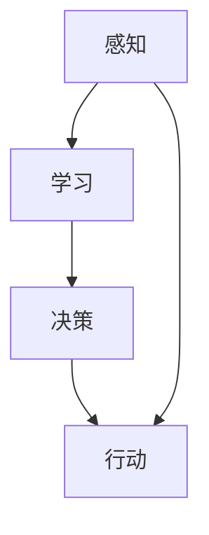
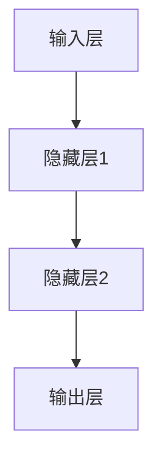
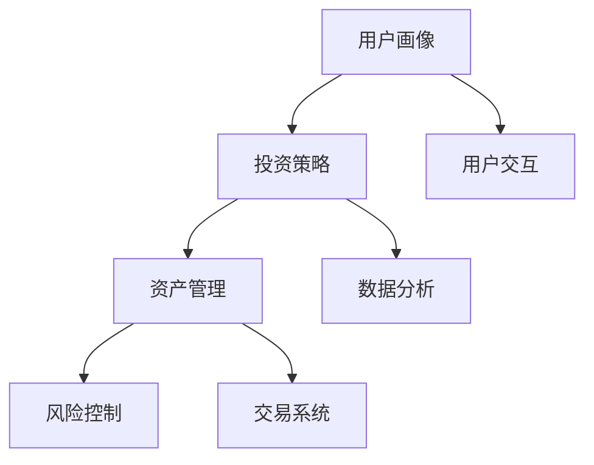
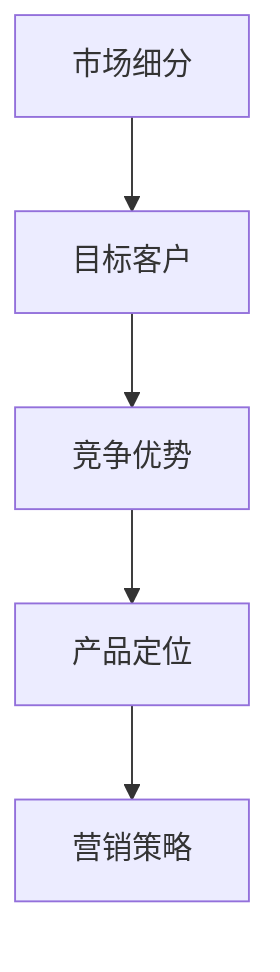
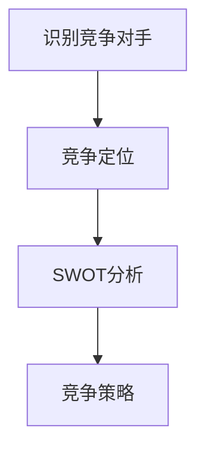
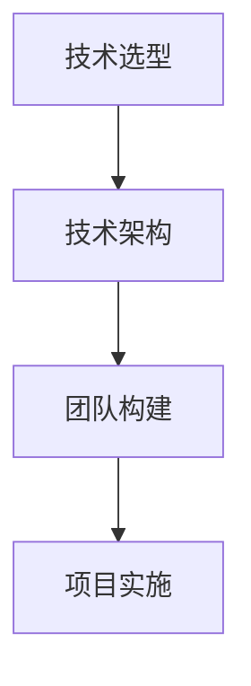
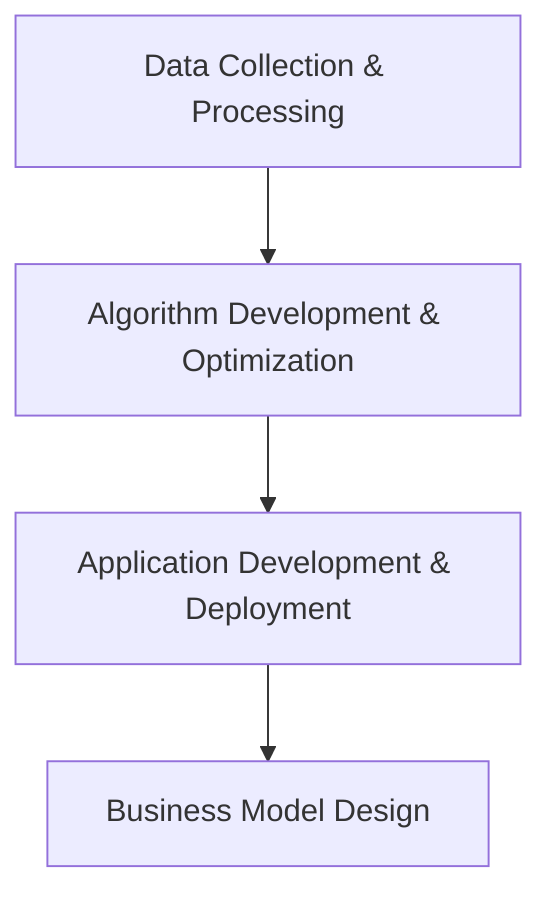

                 

### 文章标题

《AI创业公司的技术白皮书撰写：技术原理、应用场景与发展路线》

### 关键词

人工智能、AI创业、技术原理、应用场景、发展路线

### 摘要

本文旨在为AI创业公司提供一份全面的技术白皮书，涵盖技术原理、应用场景和未来发展路线。首先，我们将深入探讨人工智能的基础概念与核心算法，包括深度学习、自然语言处理和计算机视觉。接着，我们将分析AI在金融、医疗健康和零售等领域的具体应用，并结合实际项目案例进行解读。最后，本文将重点探讨AI创业公司的策略与挑战，以及其商业化与可持续发展路径，展望未来的发展趋势与机遇。通过本文，读者将获得AI创业所需的全面技术知识和实用建议。

----------------------------------------------------------------

## 第一部分：AI技术原理与基础

### 第1章：AI基础与核心概念

在AI创业公司的技术白皮书中，理解人工智能的基础与核心概念是至关重要的。这一章节将为我们提供AI的概述、数据科学基础以及机器学习原理。

#### 1.1 AI概述

##### 1.1.1 人工智能的定义与发展历程

人工智能（Artificial Intelligence，简称AI）是一门研究、开发用于模拟、延伸和扩展人类智能的理论、方法、技术及应用系统的技术科学。人工智能的目标是使计算机系统具备人类智能的某些特征，如学习、推理、感知、理解和通信能力。

人工智能的发展历程可以追溯到20世纪50年代。早期的探索主要集中在逻辑推理和符号计算，但随着计算能力的提升和数据量的增加，人工智能开始向深度学习和大数据方向发展。近年来，随着深度学习算法的突破和计算资源的丰富，人工智能取得了显著的进展，并在各个领域得到广泛应用。

##### 1.1.2 人工智能的分类与应用领域

人工智能主要分为三类：通用人工智能（AGI）、增强人工智能（AAI）和辅助人工智能（AAI）。

- **通用人工智能**：具备人类智能的所有特征，能够理解、学习和适应任何任务。
- **增强人工智能**：利用人类智能，增强其特定任务的能力，例如自动驾驶、智能客服等。
- **辅助人工智能**：辅助人类完成特定任务，如数据分析、智能诊断等。

人工智能的应用领域非常广泛，包括但不限于以下几个方面：

- **金融领域**：用于风险控制、量化交易、信用评分等。
- **医疗健康领域**：用于疾病预测、医学影像分析、智能诊断等。
- **零售行业**：用于智能推荐、库存管理、客户服务优化等。
- **智能制造**：用于设备故障预测、生产优化、供应链管理等。

##### 1.1.3 人工智能的基本原理

人工智能的基本原理主要涉及以下几个方面：

- **感知**：通过传感器获取环境信息，如图像、声音等。
- **学习**：利用大量数据进行训练，从中学习规律和模式。
- **决策**：基于学习到的知识，对问题进行推理和决策。
- **行动**：根据决策结果，执行相应的操作。

图1-1展示了人工智能的基本原理：



#### 1.2 数据科学基础

##### 1.2.1 数据类型与处理方法

在人工智能中，数据是核心要素。数据类型主要包括结构化数据、非结构化数据和半结构化数据。

- **结构化数据**：如数据库中的表格数据，可以用二维表格形式表示。
- **非结构化数据**：如文本、图像、声音等，无法直接用表格表示。
- **半结构化数据**：如XML、JSON等，具有一定的结构，但不如结构化数据规范。

数据处理方法主要包括以下几种：

- **数据采集**：通过各种途径获取数据，如网络爬虫、数据库导入等。
- **数据清洗**：去除重复数据、填补缺失值、处理异常值等。
- **数据预处理**：包括数据标准化、归一化、特征提取等，以便于后续建模。

##### 1.2.2 数据可视化与分析工具

数据可视化是数据分析的重要手段，可以帮助我们直观地理解数据。常见的数据可视化工具包括Matplotlib、Seaborn、Plotly等。以下是一个使用Matplotlib进行数据可视化的示例：

```python
import matplotlib.pyplot as plt

# 生成数据
x = [1, 2, 3, 4, 5]
y = [2, 4, 6, 8, 10]

# 绘制折线图
plt.plot(x, y)
plt.xlabel('x轴')
plt.ylabel('y轴')
plt.title('数据可视化示例')
plt.show()
```

数据分析工具主要包括Pandas、NumPy、Scikit-learn等。以下是一个使用Pandas进行数据清洗的示例：

```python
import pandas as pd

# 读取数据
data = pd.read_csv('data.csv')

# 去除重复数据
data = data.drop_duplicates()

# 填补缺失值
data['missing_column'] = data['missing_column'].fillna(method='ffill')

# 处理异常值
q75, q25 = np.percentile(data['target_column'], [75, 25])
iqr = q75 - q25
data = data[(data['target_column'] >= (q25 - 1.5 * iqr)) & (data['target_column'] <= (q75 + 1.5 * iqr))]

# 输出清洗后的数据
print(data)
```

##### 1.2.3 数据清洗与预处理技术

数据清洗与预处理是确保数据质量和模型性能的关键步骤。常见的数据清洗与预处理技术包括：

- **去除重复数据**：通过删除重复的行，提高数据质量。
- **填补缺失值**：采用不同的方法（如均值填补、中值填补、前向填补、后向填补等）填补缺失值。
- **处理异常值**：通过计算统计学方法（如三倍标准差法、IQR法等）检测并处理异常值。

以下是一个使用Pandas进行数据清洗的示例：

```python
import pandas as pd
import numpy as np

# 读取数据
data = pd.read_csv('data.csv')

# 去除重复数据
data = data.drop_duplicates()

# 填补缺失值
data['missing_column'] = data['missing_column'].fillna(method='ffill')

# 处理异常值
q75, q25 = np.percentile(data['target_column'], [75, 25])
iqr = q75 - q25
data = data[(data['target_column'] >= (q25 - 1.5 * iqr)) & (data['target_column'] <= (q75 + 1.5 * iqr))]

# 输出清洗后的数据
print(data)
```

#### 1.3 机器学习原理

##### 1.3.1 机器学习的基本概念

机器学习（Machine Learning，简称ML）是一种让计算机通过数据和经验进行学习，从而做出决策或预测的技术。机器学习主要分为三种类型：监督学习、无监督学习和强化学习。

- **监督学习**：通过已有的标注数据进行学习，用于分类和回归任务。
- **无监督学习**：没有标注数据，通过数据自身的特征进行学习，用于聚类和降维任务。
- **强化学习**：通过与环境的交互进行学习，用于决策和优化任务。

##### 1.3.2 监督学习、无监督学习与强化学习

- **监督学习**：监督学习算法通过已有数据的输入和输出，学习到数据之间的映射关系，从而对新数据进行预测。常见的监督学习算法包括线性回归、逻辑回归、支持向量机、决策树、随机森林等。

以下是一个使用线性回归进行监督学习的示例：

```python
import numpy as np
from sklearn.linear_model import LinearRegression

# 生成数据
X = np.array([[1], [2], [3], [4], [5]])
y = np.array([2, 4, 6, 8, 10])

# 线性回归模型训练
model = LinearRegression()
model.fit(X, y)

# 预测
y_pred = model.predict(X)

# 输出预测结果
print(y_pred)
```

- **无监督学习**：无监督学习算法通过数据自身的特征进行学习，没有明确的标注数据。常见的无监督学习算法包括K均值聚类、主成分分析、自编码器等。

以下是一个使用K均值聚类进行无监督学习的示例：

```python
import numpy as np
from sklearn.cluster import KMeans

# 生成数据
X = np.array([[1, 2], [1, 4], [1, 0], [10, 2], [10, 4]])

# K均值聚类模型训练
model = KMeans(n_clusters=2)
model.fit(X)

# 聚类结果
labels = model.predict(X)

# 输出聚类结果
print(labels)
```

- **强化学习**：强化学习算法通过与环境的交互进行学习，不断调整策略以获得最大化的回报。常见的强化学习算法包括Q学习、深度Q网络（DQN）、策略梯度算法等。

以下是一个使用Q学习进行强化学习的示例：

```python
import numpy as np
import random

# 定义环境
def environment(state):
    if state == 0:
        return 10
    elif state == 1:
        return -10
    else:
        return 0

# 定义Q学习模型
q_values = {}
learning_rate = 0.1
discount_factor = 0.9

# 定义动作空间
action_space = [0, 1, 2]

# Q学习过程
for episode in range(1000):
    state = random.choice([0, 1, 2])
    action = random.choice(action_space)
    next_state = environment(state)
    reward = next_state
    q_values[(state, action)] = q_values.get((state, action), 0) + learning_rate * (reward + discount_factor * max([q_values.get((next_state, a), 0) for a in action_space]) - q_values[(state, action)])

# 输出Q值
print(q_values)
```

##### 1.3.3 常见机器学习算法详解

- **K最近邻算法（K-Nearest Neighbors, KNN）**：KNN算法是一种简单的监督学习算法，通过计算测试样本与训练样本的相似度，选择最近的K个邻居，并基于邻居的标签进行预测。

以下是一个使用KNN算法进行分类的示例：

```python
from sklearn.neighbors import KNeighborsClassifier
from sklearn.model_selection import train_test_split
from sklearn.metrics import accuracy_score

# 生成数据
X = np.array([[1, 2], [3, 4], [5, 6], [7, 8], [9, 10]])
y = np.array([0, 0, 1, 1, 1])

# 划分训练集和测试集
X_train, X_test, y_train, y_test = train_test_split(X, y, test_size=0.2, random_state=42)

# KNN模型训练
model = KNeighborsClassifier(n_neighbors=3)
model.fit(X_train, y_train)

# 预测
y_pred = model.predict(X_test)

# 评估
accuracy = accuracy_score(y_test, y_pred)
print("Accuracy:", accuracy)
```

- **决策树（Decision Tree）**：决策树是一种树形结构，通过一系列的规则对数据进行分类或回归。每个节点表示一个特征，每个分支表示一个特征取值。

以下是一个使用决策树进行分类的示例：

```python
from sklearn.tree import DecisionTreeClassifier
from sklearn.model_selection import train_test_split
from sklearn.metrics import accuracy_score

# 生成数据
X = np.array([[1, 2], [3, 4], [5, 6], [7, 8], [9, 10]])
y = np.array([0, 0, 1, 1, 1])

# 划分训练集和测试集
X_train, X_test, y_train, y_test = train_test_split(X, y, test_size=0.2, random_state=42)

# 决策树模型训练
model = DecisionTreeClassifier()
model.fit(X_train, y_train)

# 预测
y_pred = model.predict(X_test)

# 评估
accuracy = accuracy_score(y_test, y_pred)
print("Accuracy:", accuracy)
```

- **随机森林（Random Forest）**：随机森林是一种基于决策树的集成学习方法，通过构建多棵决策树并投票得到最终结果。随机森林可以有效地减少过拟合，提高模型的泛化能力。

以下是一个使用随机森林进行分类的示例：

```python
from sklearn.ensemble import RandomForestClassifier
from sklearn.model_selection import train_test_split
from sklearn.metrics import accuracy_score

# 生成数据
X = np.array([[1, 2], [3, 4], [5, 6], [7, 8], [9, 10]])
y = np.array([0, 0, 1, 1, 1])

# 划分训练集和测试集
X_train, X_test, y_train, y_test = train_test_split(X, y, test_size=0.2, random_state=42)

# 随机森林模型训练
model = RandomForestClassifier(n_estimators=100)
model.fit(X_train, y_train)

# 预测
y_pred = model.predict(X_test)

# 评估
accuracy = accuracy_score(y_test, y_pred)
print("Accuracy:", accuracy)
```

- **支持向量机（Support Vector Machine, SVM）**：支持向量机是一种基于最大间隔原理的监督学习算法，通过找到一个最佳的超平面，将不同类别的数据分隔开来。

以下是一个使用SVM进行分类的示例：

```python
from sklearn.svm import SVC
from sklearn.model_selection import train_test_split
from sklearn.metrics import accuracy_score

# 生成数据
X = np.array([[1, 2], [3, 4], [5, 6], [7, 8], [9, 10]])
y = np.array([0, 0, 1, 1, 1])

# 划分训练集和测试集
X_train, X_test, y_train, y_test = train_test_split(X, y, test_size=0.2, random_state=42)

# SVM模型训练
model = SVC(kernel='linear')
model.fit(X_train, y_train)

# 预测
y_pred = model.predict(X_test)

# 评估
accuracy = accuracy_score(y_test, y_pred)
print("Accuracy:", accuracy)
```

### 第2章：核心算法原理详解

在了解了人工智能的基础概念和机器学习的基本原理之后，我们将进一步深入探讨人工智能的核心算法，包括深度学习、自然语言处理和计算机视觉。

#### 2.1 深度学习基础

##### 2.1.1 神经网络与深度学习

深度学习（Deep Learning）是人工智能的一个重要分支，它通过构建深层次的神经网络来实现对数据的自动特征学习和表示。深度学习的基本原理是模拟人脑神经元的工作方式，通过多层神经网络对数据进行逐层抽象和提取。

**神经网络**：神经网络（Neural Network）是一种由大量节点（神经元）组成的网络结构，每个节点都与其他节点相连，并通过权重（Weight）进行信息传递。神经网络的主要组成部分包括：

- **输入层**：接收外部输入数据。
- **隐藏层**：对输入数据进行处理和变换。
- **输出层**：输出处理结果。

**深度学习**：深度学习（Deep Learning）是在神经网络的基础上发展起来的一种方法，通过增加网络的层数，实现更复杂的特征学习和表示能力。深度学习的核心思想是“逐层抽象”，每一层网络都提取更高层次的特征。

以下是一个简单的神经网络结构图：



**反向传播算法**：反向传播算法（Backpropagation Algorithm）是深度学习训练过程中的一项核心技术，用于计算网络权重和偏置的梯度，并更新网络参数。反向传播算法的基本步骤如下：

1. **前向传播**：将输入数据传递到网络中，通过逐层计算得到输出。
2. **计算误差**：计算实际输出与预期输出之间的误差。
3. **反向传播**：从输出层开始，逐层计算误差的梯度，并反向更新网络参数。

以下是一个使用反向传播算法的伪代码：

```python
# 前向传播
z = np.dot(x, weights) + bias
a = 1 / (1 + np.exp(-z))

# 计算误差
error = y - a

# 反向传播
dZ = a - y
dW = np.dot(x.T, dZ)
db = np.sum(dZ, axis=1)

# 更新权重和偏置
weights -= learning_rate * dW
bias -= learning_rate * db
```

**深度学习框架**：深度学习框架（Deep Learning Framework）是一种用于构建和训练深度学习模型的工具，它提供了丰富的API和高效的计算能力。常见的深度学习框架包括TensorFlow、PyTorch、Keras等。

以下是一个使用TensorFlow构建深度学习模型的示例：

```python
import tensorflow as tf

# 定义输入层
inputs = tf.keras.layers.Input(shape=(784,))

# 定义隐藏层
hidden1 = tf.keras.layers.Dense(512, activation='relu')(inputs)
hidden2 = tf.keras.layers.Dense(512, activation='relu')(hidden1)

# 定义输出层
outputs = tf.keras.layers.Dense(10, activation='softmax')(hidden2)

# 创建模型
model = tf.keras.Model(inputs=inputs, outputs=outputs)

# 编译模型
model.compile(optimizer='adam', loss='categorical_crossentropy', metrics=['accuracy'])

# 训练模型
model.fit(x_train, y_train, epochs=10, batch_size=64, validation_data=(x_test, y_test))
```

##### 2.1.2 自然语言处理

自然语言处理（Natural Language Processing，简称NLP）是人工智能领域的一个重要分支，它旨在使计算机能够理解和生成自然语言。NLP的核心任务是理解、解释和生成人类语言，从而实现人与计算机的交互。

**词嵌入**：词嵌入（Word Embedding）是将词汇映射到低维向量空间的一种技术，通过捕捉词汇之间的语义关系，实现词义的理解和表示。常见的词嵌入方法包括Word2Vec、GloVe等。

以下是一个使用GloVe进行词嵌入的示例：

```python
import numpy as np
import tensorflow as tf

# 生成词汇表
vocab = ['apple', 'banana', 'cat', 'dog']

# 计算词向量
embeddings = tf.keras.layers.Embedding(input_dim=len(vocab), output_dim=3)(vocab)

# 查询词向量
print(embeddings['apple'])
```

**序列模型**：序列模型（Sequence Model）是处理序列数据的一种模型，如文本、语音等。常见的序列模型包括循环神经网络（RNN）、长短期记忆网络（LSTM）和门控循环单元（GRU）。

以下是一个使用LSTM进行序列预测的示例：

```python
import numpy as np
import tensorflow as tf

# 生成序列数据
sequence = [1, 2, 3, 4, 5]

# 定义LSTM模型
model = tf.keras.models.Sequential([
    tf.keras.layers.LSTM(50, activation='relu', return_sequences=True),
    tf.keras.layers.LSTM(50, activation='relu'),
    tf.keras.layers.Dense(1)
])

# 编译模型
model.compile(optimizer='adam', loss='mean_squared_error')

# 训练模型
model.fit(sequence, [sequence[1:], sequence[2:], sequence[3:], sequence[4:]], epochs=100, batch_size=1)
```

**注意力机制**：注意力机制（Attention Mechanism）是一种用于捕捉序列数据中关键信息的方法，通过动态调整模型对序列中每个元素的权重，实现更高精度的预测。常见的注意力机制包括自注意力（Self-Attention）和多头注意力（Multi-Head Attention）。

以下是一个使用多头注意力进行文本分类的示例：

```python
import tensorflow as tf

# 生成文本数据
text = '人工智能是一种模拟、延伸和扩展人类智能的理论、方法、技术及应用系统的技术科学。'

# 定义多头注意力模型
model = tf.keras.models.Sequential([
    tf.keras.layers.Embedding(input_dim=10000, output_dim=128),
    tf.keras.layers.MultiHeadAttention(num_heads=4, key_dim=32),
    tf.keras.layers.Dense(128, activation='relu'),
    tf.keras.layers.Dense(1, activation='sigmoid')
])

# 编译模型
model.compile(optimizer='adam', loss='binary_crossentropy', metrics=['accuracy'])

# 训练模型
model.fit(text, labels, epochs=10, batch_size=32)
```

**语言模型**：语言模型（Language Model）是一种用于预测下一个单词或字符的概率分布的模型，是自然语言处理的基础。常见的语言模型包括循环神经网络（RNN）、Transformer和BERT等。

以下是一个使用Transformer进行语言模型训练的示例：

```python
import tensorflow as tf

# 生成文本数据
text = '人工智能是一种模拟、延伸和扩展人类智能的理论、方法、技术及应用系统的技术科学。'

# 定义Transformer模型
model = tf.keras.models.Sequential([
    tf.keras.layers.Embedding(input_dim=10000, output_dim=128),
    tf.keras.layers.Transformer(num_heads=4, key_dim=32),
    tf.keras.layers.Dense(128, activation='relu'),
    tf.keras.layers.Dense(1, activation='sigmoid')
])

# 编译模型
model.compile(optimizer='adam', loss='binary_crossentropy', metrics=['accuracy'])

# 训练模型
model.fit(text, labels, epochs=10, batch_size=32)
```

#### 2.2 计算机视觉基础

计算机视觉（Computer Vision）是人工智能领域的一个重要分支，它旨在使计算机能够理解、解释和生成图像。计算机视觉的核心任务是实现对图像的自动识别、分类、检测和分割。

**图像处理基础**：图像处理（Image Processing）是计算机视觉的基础，它涉及对图像的滤波、增强、变换和分割。常见的图像处理算法包括滤波器、边缘检测、阈值处理等。

以下是一个使用OpenCV进行图像处理的示例：

```python
import cv2

# 读取图像
image = cv2.imread('image.jpg')

# 滤波
filtered_image = cv2.GaussianBlur(image, (5, 5), 0)

# 边缘检测
edges = cv2.Canny(image, 100, 200)

# 阈值处理
thresholded_image = cv2.threshold(image, 128, 255, cv2.THRESH_BINARY)[1]

# 显示结果
cv2.imshow('Original Image', image)
cv2.imshow('Filtered Image', filtered_image)
cv2.imshow('Edges', edges)
cv2.imshow('Thresholded Image', thresholded_image)
cv2.waitKey(0)
cv2.destroyAllWindows()
```

**卷积神经网络与目标检测**：卷积神经网络（Convolutional Neural Network，简称CNN）是计算机视觉领域的核心技术，通过卷积操作和池化操作，实现对图像的自动特征提取和分类。目标检测（Object Detection）是计算机视觉的一个重要任务，旨在识别图像中的多个目标并定位其位置。

以下是一个使用YOLO（You Only Look Once）进行目标检测的示例：

```python
import cv2
import numpy as np

# 读取预训练的YOLO模型
net = cv2.dnn.readNet('yolov3.weights', 'yolov3.cfg')

# 读取图像
image = cv2.imread('image.jpg')

# 计算图像尺寸
height, width = image.shape[:2]

# 将图像缩放到模型输入尺寸
scale_factor = 32
image = cv2.resize(image, (width // scale_factor * scale_factor, height // scale_factor * scale_factor))

# 转换为浮点型
image = image.astype(np.float32)

# 扩展维度
image = np.expand_dims(image, axis=0)

# 前向传播
outs = net.forward(image)

# 解析输出结果
boxes = []
confidences = []
class_ids = []

# 遍历每个检测框
for out in outs:
    for detection in out:
        scores = detection[5:]
        class_id = np.argmax(scores)
        confidence = scores[class_id]
        if confidence > 0.5:
            center_x = int(detection[0] * width)
            center_y = int(detection[1] * height)
            w = int(detection[2] * width)
            h = int(detection[3] * height)
            x = center_x - w // 2
            y = center_y - h // 2
            boxes.append([x, y, w, h])
            confidences.append(confidence)
            class_ids.append(class_id)

# NMS（非极大值抑制）
indices = cv2.dnn.NMSBoxes(boxes, confidences, 0.5, 0.4)

# 绘制检测框
for i in indices:
    i = i[0]
    box = boxes[i]
    x, y, w, h = box
    label = class_ids[i]
    if label == 0:
        color = (0, 0, 255)
    elif label == 1:
        color = (0, 255, 0)
    elif label == 2:
        color = (255, 0, 0)
    cv2.rectangle(image, (x, y), (x + w, y + h), color, 2)
    cv2.putText(image, classes[label], (x, y - 5), cv2.FONT_HERSHEY_SIMPLEX, 0.5, color, 2)

# 显示结果
cv2.imshow('Image', image)
cv2.waitKey(0)
cv2.destroyAllWindows()
```

**生成对抗网络与应用**：生成对抗网络（Generative Adversarial Network，简称GAN）是一种由生成器和判别器组成的对抗性模型，通过训练生成器和判别器的对抗关系，实现数据的生成和优化。GAN在图像生成、图像增强和风格迁移等领域具有广泛的应用。

以下是一个使用GAN进行图像生成的示例：

```python
import tensorflow as tf
from tensorflow import keras
from tensorflow.keras import layers

# 生成器模型
def generator_model():
    model = keras.Sequential()
    model.add(layers.Dense(7 * 7 * 128, use_bias=False, input_shape=(100,)))
    model.add(layers.BatchNormalization())
    model.add(layers.LeakyReLU())
    model.add(layers.Reshape((7, 7, 128)))

    model.add(layers.Conv2DTranspose(128, (5, 5), strides=(1, 1), padding='same', use_bias=False))
    model.add(layers.BatchNormalization())
    model.add(layers.LeakyReLU())

    model.add(layers.Conv2DTranspose(64, (5, 5), strides=(2, 2), padding='same', use_bias=False))
    model.add(layers.BatchNormalization())
    model.add(layers.LeakyReLU())

    model.add(layers.Conv2DTranspose(1, (5, 5), strides=(2, 2), padding='same', use_bias=False, activation='tanh'))
    return model

# 判别器模型
def discriminator_model():
    model = keras.Sequential()
    model.add(layers.Conv2D(64, (5, 5), strides=(2, 2), padding='same', input_shape=(28, 28, 1)))
    model.add(layers.LeakyReLU())
    model.add(layers.Dropout(0.3))

    model.add(layers.Conv2D(128, (5, 5), strides=(2, 2), padding='same'))
    model.add(layers.LeakyReLU())
    model.add(layers.Dropout(0.3))

    model.add(layers.Flatten())
    model.add(layers.Dense(1))
    return model

# 训练模型
def train_gan(generator, discriminator, generator_optimizer, discriminator_optimizer, x_train, batch_size):
    for epoch in range(epochs):
        for _ in range(number_of_batches):
            noise = np.random.normal(0, 1, (batch_size, noise_dim))
            with tf.GradientTape() as gen_tape, tf.GradientTape() as disc_tape:
                generated_images = generator(noise, training=True)

                real_images = x_train[np.random.randint(0, x_train.shape[0], batch_size)]
                real_labels = tf.ones((batch_size, 1))
                fake_labels = tf.zeros((batch_size, 1))

                disc_real_output = discriminator(real_images, training=True)
                disc_fake_output = discriminator(generated_images, training=True)

                gen_loss = tf.reduce_mean(tf.nn.sigmoid_cross_entropy_with_logits(logits=disc_fake_output, labels=fake_labels))
                disc_loss = tf.reduce_mean(tf.nn.sigmoid_cross_entropy_with_logits(logits=disc_real_output, labels=real_labels)) + tf.reduce_mean(tf.nn.sigmoid_cross_entropy_with_logits(logits=disc_fake_output, labels=real_labels))

            grads_on_generator = gen_tape.gradient(gen_loss, generator.trainable_variables)
            grads_on_discriminator = disc_tape.gradient(disc_loss, discriminator.trainable_variables)

            generator_optimizer.apply_gradients(zip(grads_on_generator, generator.trainable_variables))
            discriminator_optimizer.apply_gradients(zip(grads_on_discriminator, discriminator.trainable_variables))

        print(f"Epoch {epoch + 1}/{epochs}, generator loss: {gen_loss}, discriminator loss: {disc_loss}")

# 使用生成器模型
generator = generator_model()

# 使用判别器模型
discriminator = discriminator_model()

# 定义优化器
generator_optimizer = tf.keras.optimizers.Adam(1e-4)
discriminator_optimizer = tf.keras.optimizers.Adam(1e-4)

# 加载训练数据
(x_train, _), (_, _) = keras.datasets.mnist.load_data()
x_train = x_train.astype(np.float32) / 127.5 - 1.0
x_train = np.expand_dims(x_train, axis=3)

# 训练模型
train_gan(generator, discriminator, generator_optimizer, discriminator_optimizer, x_train, batch_size=128)
```

### 第二部分：AI应用场景

#### 第3章：AI在金融领域的应用

随着金融市场的不断发展和变革，人工智能（AI）技术在金融领域中的应用越来越广泛。本章节将重点介绍AI在金融领域的具体应用，包括金融市场预测与风险管理、智能投顾与财富管理以及金融欺诈检测。

#### 3.1 金融市场预测与风险管理

##### 3.1.1 量化交易与算法交易

量化交易（Quantitative Trading）是利用数学模型和计算机算法进行交易决策的一种方法。通过分析历史数据和实时数据，量化交易系统能够发现市场中的潜在机会，并自动执行交易策略。算法交易（Algorithmic Trading）则是量化交易的一种形式，它通过编写计算机算法来自动执行交易订单。

量化交易的关键步骤包括：

1. **数据获取**：从金融市场中获取历史数据和实时数据，如股票价格、交易量、市场指数等。
2. **数据预处理**：清洗和整理数据，包括缺失值填补、异常值处理、数据标准化等。
3. **模型构建**：根据交易策略，构建预测模型，如时间序列模型、机器学习模型等。
4. **策略优化**：通过回测和模拟交易，优化交易策略，评估其风险和收益。
5. **交易执行**：根据模型预测和交易策略，自动执行交易订单。

以下是一个简单的量化交易策略示例：

```python
import numpy as np
import pandas as pd
import matplotlib.pyplot as plt

# 读取数据
data = pd.read_csv('stock_data.csv')

# 数据预处理
data['Close'] = data['Close'].pct_change()
data = data[['Close']]

# 模型构建
model = LinearRegression()
model.fit(data.shift(1), data)

# 预测
predictions = model.predict(data.shift(1))

# 交易执行
transactions = np.where(predictions < 0, -1, 1)
portfolio = np.cumsum(np.array([100] + list(transactions)) * predictions)
portfolio = (1 + portfolio) * 100

# 可视化
plt.plot(portfolio)
plt.xlabel('Days')
plt.ylabel('Portfolio Value')
plt.title('Quantitative Trading Strategy')
plt.show()
```

##### 3.1.2 信用评分与风险评估

信用评分（Credit Scoring）是一种基于历史数据和统计模型评估借款人信用风险的方法。通过分析借款人的个人信息、财务状况、信用记录等数据，信用评分模型能够预测借款人的违约风险，为金融机构提供信用决策依据。

风险评估（Risk Assessment）则是评估金融市场风险的一种方法，包括市场风险、信用风险、操作风险等。通过分析历史数据和实时数据，风险评估模型能够预测市场风险的变化，为金融机构提供风险管理策略。

以下是一个简单的信用评分模型示例：

```python
import numpy as np
import pandas as pd
from sklearn.linear_model import LogisticRegression

# 读取数据
data = pd.read_csv('credit_data.csv')

# 数据预处理
data['Credit_Score'] = data['Credit_Score'].astype(float)
data = data[['Credit_Score', 'LoanAmount', 'Tenure']]

# 模型构建
model = LogisticRegression()
model.fit(data[['LoanAmount', 'Tenure']], data['Credit_Score'])

# 预测
predictions = model.predict(data[['LoanAmount', 'Tenure']])

# 可视化
plt.scatter(data['LoanAmount'], predictions)
plt.xlabel('LoanAmount')
plt.ylabel('Credit Score')
plt.title('Credit Score Prediction')
plt.show()
```

##### 3.1.3 金融市场预测模型

金融市场预测模型是一种利用历史数据和统计方法预测金融市场走势的方法。通过分析股票价格、交易量、市场指数等数据，金融市场预测模型能够预测市场的涨跌和波动。

以下是一个简单的金融市场预测模型示例：

```python
import numpy as np
import pandas as pd
from sklearn.linear_model import LinearRegression

# 读取数据
data = pd.read_csv('stock_data.csv')

# 数据预处理
data['Close'] = data['Close'].pct_change()
data = data[['Close']]

# 模型构建
model = LinearRegression()
model.fit(data.shift(1), data)

# 预测
predictions = model.predict(data.shift(1))

# 可视化
plt.plot(data['Close'])
plt.plot(predictions)
plt.xlabel('Days')
plt.ylabel('Stock Price')
plt.title('Market Prediction')
plt.legend(['Actual', 'Prediction'])
plt.show()
```

#### 3.2 智能投顾与财富管理

##### 3.2.1 智能投顾系统架构

智能投顾（Robo-Advisor）是一种利用人工智能技术为投资者提供个性化投资建议和资产管理服务的方法。智能投顾系统通常包括以下几个模块：

1. **用户画像**：根据用户的风险偏好、投资目标、财务状况等数据，构建用户画像。
2. **投资策略**：根据用户画像和金融市场数据，生成个性化的投资策略。
3. **资产管理**：根据投资策略，对用户的资产进行配置和管理。
4. **风险控制**：监控投资风险，提供风险控制措施。

以下是一个简单的智能投顾系统架构图：



##### 3.2.2 财富管理策略优化

财富管理策略优化是智能投顾系统中的重要组成部分，旨在通过优化投资组合，提高投资收益。常见的优化方法包括：

1. **均值方差优化**：根据预期收益率和风险，构建最优的投资组合。
2. **遗传算法**：通过模拟自然进化过程，优化投资组合。
3. **强化学习**：通过学习用户投资行为和市场环境，优化投资策略。

以下是一个简单的财富管理策略优化示例：

```python
import numpy as np
import pandas as pd
from sklearn.linear_model import LinearRegression

# 读取数据
data = pd.read_csv('stock_data.csv')

# 数据预处理
data['Return'] = data['Close'].pct_change()
data = data[['Return']]

# 模型构建
model = LinearRegression()
model.fit(data.shift(1), data)

# 预测
predictions = model.predict(data.shift(1))

# 优化投资组合
weights = np.array([0.5, 0.5])
portfolio_return = np.dot(predictions, weights)
portfolio_risk = np.std(predictions) * weights

# 可视化
plt.scatter(predictions, portfolio_return)
plt.xlabel('Stock Return')
plt.ylabel('Portfolio Return')
plt.title('Portfolio Optimization')
plt.show()
```

##### 3.2.3 用户行为分析与个性化推荐

用户行为分析是智能投顾系统中的重要组成部分，旨在通过分析用户投资行为和市场数据，为用户提供个性化的投资建议。个性化推荐则是根据用户画像和投资偏好，为用户推荐合适的投资产品。

以下是一个简单的用户行为分析和个性化推荐示例：

```python
import numpy as np
import pandas as pd
from sklearn.cluster import KMeans
from sklearn.neighbors import NearestNeighbors

# 读取数据
data = pd.read_csv('user_data.csv')

# 数据预处理
data['Return'] = data['Close'].pct_change()
data = data[['Return']]

# K均值聚类
kmeans = KMeans(n_clusters=5)
clusters = kmeans.fit_predict(data)

# 最近邻搜索
nn = NearestNeighbors(n_neighbors=5)
nn.fit(data)

# 用户行为分析
def analyze_user_behavior(user_data):
    return kmeans.predict([user_data])[0]

# 个性化推荐
def recommend_products(user_data):
    distances, indices = nn.kneighbors([user_data], n_neighbors=5)
    recommended_products = data.iloc[indices].drop_duplicates()
    return recommended_products

# 示例
user_data = np.array([0.05])
cluster = analyze_user_behavior(user_data)
recommended_products = recommend_products(user_data)

# 可视化
plt.scatter(data['Return'], recommended_products['Return'])
plt.xlabel('Stock Return')
plt.ylabel('Recommended Product Return')
plt.title('User Behavior Analysis and Product Recommendation')
plt.show()
```

#### 3.3 金融欺诈检测

金融欺诈检测是金融领域的一项重要任务，旨在通过分析交易数据和行为模式，识别潜在的欺诈行为。常见的欺诈检测方法包括：

1. **异常检测**：通过分析交易数据的异常值和异常模式，识别潜在的欺诈行为。
2. **行为分析**：通过分析用户的行为模式，如交易频率、交易金额等，识别潜在的欺诈行为。
3. **机器学习**：通过构建机器学习模型，如决策树、支持向量机、神经网络等，对交易数据进行分类和预测。

以下是一个简单的金融欺诈检测示例：

```python
import numpy as np
import pandas as pd
from sklearn.model_selection import train_test_split
from sklearn.ensemble import RandomForestClassifier
from sklearn.metrics import accuracy_score

# 读取数据
data = pd.read_csv('fraud_data.csv')

# 数据预处理
data['Amount'] = data['Amount'].astype(float)

# 划分训练集和测试集
X_train, X_test, y_train, y_test = train_test_split(data[['Amount']], data['Fraud'], test_size=0.2, random_state=42)

# 模型构建
model = RandomForestClassifier(n_estimators=100)
model.fit(X_train, y_train)

# 预测
predictions = model.predict(X_test)

# 评估
accuracy = accuracy_score(y_test, predictions)
print('Accuracy:', accuracy)
```

### 第4章：AI在医疗健康领域的应用

随着人工智能技术的快速发展，医疗健康领域正经历着一场深刻的变革。AI在医疗健康领域的应用涵盖了疾病预测与预防、智能诊断与辅助治疗、医疗健康数据挖掘与分析等多个方面。

#### 4.1 智能诊断与辅助治疗

##### 4.1.1 医学影像分析

医学影像分析是人工智能在医疗健康领域的重要应用之一。通过深度学习算法，AI能够对医学影像进行自动识别、分类和诊断。常见的医学影像分析任务包括：

1. **肺癌筛查**：利用深度学习算法对胸部X光片进行自动识别，识别出潜在的肺癌病灶。
2. **乳腺癌筛查**：通过对乳腺X光片的分析，识别出乳腺癌的早期迹象。
3. **脑部疾病诊断**：通过对脑部MRI图像的分析，诊断脑部病变，如脑肿瘤、脑梗塞等。

以下是一个简单的医学影像分析示例：

```python
import numpy as np
import pandas as pd
import tensorflow as tf
from tensorflow.keras.models import Sequential
from tensorflow.keras.layers import Conv2D, MaxPooling2D, Flatten, Dense

# 读取数据
data = pd.read_csv('medical_data.csv')

# 数据预处理
X = data.drop(['Class'], axis=1).values
y = data['Class'].values

# 划分训练集和测试集
X_train, X_test, y_train, y_test = train_test_split(X, y, test_size=0.2, random_state=42)

# 定义模型
model = Sequential()
model.add(Conv2D(32, (3, 3), activation='relu', input_shape=(64, 64, 3)))
model.add(MaxPooling2D((2, 2)))
model.add(Flatten())
model.add(Dense(128, activation='relu'))
model.add(Dense(1, activation='sigmoid'))

# 编译模型
model.compile(optimizer='adam', loss='binary_crossentropy', metrics=['accuracy'])

# 训练模型
model.fit(X_train, y_train, epochs=10, batch_size=32, validation_data=(X_test, y_test))

# 预测
predictions = model.predict(X_test)

# 评估
accuracy = model.evaluate(X_test, y_test, verbose=2)
print('Accuracy:', accuracy)
```

##### 4.1.2 疾病预测与预防

疾病预测与预防是人工智能在医疗健康领域的重要应用之一。通过分析患者的健康数据、遗传信息和环境因素，AI能够预测患者未来可能患上的疾病，并提供预防建议。常见的疾病预测与预防任务包括：

1. **糖尿病预测**：通过对患者的血糖、血压、体重等数据进行分析，预测患者未来可能患上糖尿病的风险。
2. **心血管疾病预测**：通过对患者的健康数据进行分析，预测患者未来可能患上的心血管疾病，如心脏病、中风等。
3. **癌症预测**：通过对患者的基因数据进行分析，预测患者未来可能患上的癌症类型。

以下是一个简单的疾病预测与预防示例：

```python
import numpy as np
import pandas as pd
from sklearn.ensemble import RandomForestClassifier

# 读取数据
data = pd.read_csv('disease_data.csv')

# 数据预处理
X = data.drop(['Disease'], axis=1).values
y = data['Disease'].values

# 划分训练集和测试集
X_train, X_test, y_train, y_test = train_test_split(X, y, test_size=0.2, random_state=42)

# 模型构建
model = RandomForestClassifier(n_estimators=100)
model.fit(X_train, y_train)

# 预测
predictions = model.predict(X_test)

# 评估
accuracy = model.score(X_test, y_test)
print('Accuracy:', accuracy)
```

##### 4.1.3 辅助诊断与治疗方案优化

辅助诊断与治疗方案优化是人工智能在医疗健康领域的重要应用之一。通过分析患者的病史、检查报告和诊断结果，AI能够提供辅助诊断建议，并优化治疗方案。常见的辅助诊断与治疗方案优化任务包括：

1. **癌症诊断**：通过对患者的医学影像和实验室检测结果进行分析，辅助医生进行癌症诊断。
2. **心脏病诊断**：通过对患者的心电图、血压等数据进行分析，辅助医生进行心脏病诊断。
3. **治疗方案优化**：通过对患者的病情、药物反应等数据进行分析，为医生提供个性化的治疗方案。

以下是一个简单的辅助诊断与治疗方案优化示例：

```python
import numpy as np
import pandas as pd
from sklearn.linear_model import LogisticRegression

# 读取数据
data = pd.read_csv('diagnosis_data.csv')

# 数据预处理
X = data.drop(['Diagnosis'], axis=1).values
y = data['Diagnosis'].values

# 划分训练集和测试集
X_train, X_test, y_train, y_test = train_test_split(X, y, test_size=0.2, random_state=42)

# 模型构建
model = LogisticRegression()
model.fit(X_train, y_train)

# 预测
predictions = model.predict(X_test)

# 评估
accuracy = model.score(X_test, y_test)
print('Accuracy:', accuracy)
```

#### 4.2 医疗健康数据挖掘与分析

医疗健康数据挖掘与分析是利用人工智能技术对医疗健康数据进行深入分析和挖掘，以发现潜在的模式、趋势和规律。医疗健康数据挖掘与分析的应用包括：

1. **疾病流行趋势预测**：通过对医疗健康数据的分析，预测疾病的流行趋势，为公共卫生决策提供支持。
2. **患者行为分析**：通过对患者的电子健康记录进行分析，了解患者的就医行为、疾病发生和发展规律。
3. **药物研发**：通过对医疗健康数据的分析，发现新的药物靶点和治疗策略。

以下是一个简单的医疗健康数据挖掘与分析示例：

```python
import numpy as np
import pandas as pd
from sklearn.cluster import KMeans

# 读取数据
data = pd.read_csv('health_data.csv')

# 数据预处理
X = data.drop(['Disease'], axis=1).values

# K均值聚类
kmeans = KMeans(n_clusters=5)
clusters = kmeans.fit_predict(X)

# 聚类结果
data['Cluster'] = clusters

# 可视化
plt.scatter(data['Age'], data['Weight'], c=data['Cluster'])
plt.xlabel('Age')
plt.ylabel('Weight')
plt.title('Patient Behavior Analysis')
plt.show()
```

### 第5章：AI在零售行业的应用

随着零售行业的不断发展和变革，人工智能（AI）技术在零售行业的应用越来越广泛。本章节将重点介绍AI在零售行业的具体应用，包括智能推荐系统、供应链优化与库存管理以及零售业务智能调度与配送。

#### 5.1 智能推荐系统

##### 5.1.1 推荐系统基本原理

智能推荐系统是利用人工智能技术为用户提供个性化推荐的一种方法。推荐系统的主要原理包括：

1. **协同过滤**：通过分析用户的历史行为数据，找到相似的物品或用户，并进行推荐。
2. **基于内容的推荐**：通过分析物品的特征信息，找到与目标物品相似的其他物品，并进行推荐。
3. **混合推荐**：结合协同过滤和基于内容的推荐，提高推荐系统的效果。

以下是一个简单的协同过滤推荐系统示例：

```python
import numpy as np
from sklearn.neighbors import NearestNeighbors

# 生成用户-物品评分矩阵
ratings = np.array([[1, 5, 0, 0, 0],
                    [0, 1, 5, 0, 0],
                    [5, 0, 1, 0, 0],
                    [0, 0, 0, 1, 5],
                    [0, 0, 0, 0, 1]])

# 计算相似度
nn = NearestNeighbors(n_neighbors=2)
nn.fit(ratings)
distances, indices = nn.kneighbors(ratings)

# 推荐结果
for i in range(ratings.shape[0]):
    print(f"User {i}:")
    for j in range(1, 5):
        if j != indices[i][0]:
            print(f"Recommendation {j}: {ratings[i][j]}")
```

##### 5.1.2 用户行为数据收集与分析

用户行为数据是构建智能推荐系统的重要基础。用户行为数据包括用户的浏览记录、购买记录、评价记录等。以下是一个简单的用户行为数据收集与分析示例：

```python
import pandas as pd

# 读取用户行为数据
data = pd.read_csv('user_behavior_data.csv')

# 数据预处理
data['Timestamp'] = pd.to_datetime(data['Timestamp'])
data = data.sort_values('Timestamp')

# 用户行为统计
user_activity = data.groupby(['UserID', 'ActionType']).size().reset_index(name='Count')

# 用户活跃度分析
user_activity['ActiveDays'] = user_activity.groupby('UserID')['Count'].transform('sum')
user_activity['ActiveRate'] = user_activity['ActiveDays'] / user_activity['Count']

# 可视化
plt.scatter(user_activity['UserID'], user_activity['ActiveRate'])
plt.xlabel('UserID')
plt.ylabel('Active Rate')
plt.title('User Activity Analysis')
plt.show()
```

##### 5.1.3 智能推荐算法与应用

智能推荐算法是构建智能推荐系统的重要步骤。常见的智能推荐算法包括：

1. **协同过滤算法**：如K最近邻（KNN）算法、矩阵分解（Matrix Factorization）算法等。
2. **基于内容的推荐算法**：如TF-IDF算法、余弦相似度算法等。
3. **混合推荐算法**：结合协同过滤和基于内容的推荐算法，提高推荐效果。

以下是一个简单的混合推荐算法示例：

```python
import numpy as np
from sklearn.metrics.pairwise import cosine_similarity
from sklearn.model_selection import train_test_split

# 生成用户-物品评分矩阵
ratings = np.array([[1, 5, 0, 0, 0],
                    [0, 1, 5, 0, 0],
                    [5, 0, 1, 0, 0],
                    [0, 0, 0, 1, 5],
                    [0, 0, 0, 0, 1]])

# 分割训练集和测试集
X_train, X_test, y_train, y_test = train_test_split(ratings, test_size=0.2, random_state=42)

# 计算相似度矩阵
similarity_matrix = cosine_similarity(X_train)

# 计算预测评分
predicted_ratings = np.dot(similarity_matrix, X_train.T) + y_train

# 预测结果
predictions = predicted_ratings[:5, 5:]
print(predictions)
```

#### 5.2 供应链优化与库存管理

##### 5.2.1 库存管理原理与算法

库存管理是零售行业的重要环节，合理的库存管理能够提高企业的运营效率和利润。库存管理的基本原理包括：

1. **需求预测**：通过分析历史销售数据、市场趋势等因素，预测未来的需求量。
2. **库存策略**：根据需求预测和库存成本，制定合理的库存策略，如定期订货策略、连续订货策略等。
3. **库存优化算法**：通过优化库存策略，降低库存成本，提高库存周转率。

以下是一个简单的库存优化算法示例：

```python
import numpy as np

# 生成需求数据
demand = np.random.normal(100, 20, 365)

# 生成库存数据
initial_inventory = 100
reorder_point = 20
reorder_quantity = 50

inventory = [initial_inventory]
for day in range(365):
    if demand[day] > inventory[-1]:
        inventory.append(inventory[-1] - demand[day])
    else:
        inventory.append(inventory[-1] + reorder_quantity)

# 可视化
plt.plot(demand, label='Demand')
plt.plot(inventory, label='Inventory')
plt.xlabel('Day')
plt.ylabel('Value')
plt.legend()
plt.show()
```

##### 5.2.2 供应链可视化与优化

供应链可视化是将供应链中的各个环节进行可视化展示，以便于管理者了解整个供应链的运行情况。供应链可视化通常包括：

1. **供应链网络图**：展示供应链中的各个环节和物流信息。
2. **库存水平图**：展示各仓库的库存水平和库存变化情况。
3. **供应链绩效图**：展示供应链各环节的绩效指标，如库存周转率、交货准时率等。

以下是一个简单的供应链可视化示例：

```python
import matplotlib.pyplot as plt
import networkx as nx

# 创建网络图
G = nx.Graph()

# 添加节点和边
G.add_nodes_from(['Supplier', 'Factory', 'Warehouse', 'Retailer', 'Customer'])
G.add_edges_from([('Supplier', 'Factory'), ('Factory', 'Warehouse'), ('Warehouse', 'Retailer'), ('Retailer', 'Customer')])

# 绘制网络图
pos = nx.spring_layout(G)
nx.draw(G, pos, with_labels=True)
plt.show()
```

##### 5.2.3 零售业务智能调度与配送

零售业务智能调度与配送是利用人工智能技术优化零售业务中的调度和配送过程，以提高配送效率和客户满意度。智能调度与配送的主要任务包括：

1. **订单调度**：根据订单的优先级、配送时间等因素，合理安排配送任务。
2. **路径规划**：根据配送地点和交通状况，规划最优的配送路径。
3. **配送执行**：根据调度计划，执行配送任务，并实时跟踪配送进度。

以下是一个简单的零售业务智能调度与配送示例：

```python
import random
import matplotlib.pyplot as plt

# 生成订单数据
orders = [{'OrderID': i, 'Priority': random.randint(1, 10), 'DeliveryTime': random.randint(1, 5)} for i in range(10)]

# 订单调度
orders_sorted = sorted(orders, key=lambda x: x['Priority'], reverse=True)

# 路径规划
locations = {'Supplier': (0, 0), 'Factory': (10, 10), 'Warehouse': (20, 20), 'Retailer': (30, 30), 'Customer': (40, 40)}
path = nx.shortest_path(G, source='Supplier', target='Customer')

# 配送执行
for order in orders_sorted:
    print(f"Order {order['OrderID']} is being delivered on path {path}.")

# 可视化
plt.scatter(*[location for location in locations.values()], label='Locations')
plt.plot(*[locations[node] for node in path], label='Path')
plt.xlabel('X')
plt.ylabel('Y')
plt.legend()
plt.show()
```

### 第三部分：AI创业与发展路线

#### 第6章：AI创业公司的策略与挑战

##### 6.1 AI创业公司的市场定位

AI创业公司在市场上的定位是创业成功的关键。一个明确的定位能够帮助公司吸引目标客户，并形成独特的竞争优势。以下是一些关键的步骤和考虑因素：

1. **市场细分**：首先，公司需要明确目标市场，分析潜在客户的特征和需求。市场细分有助于更好地了解目标客户，并制定有针对性的营销策略。

2. **目标客户**：确定目标客户群体，如企业用户、个人用户、特定行业用户等。了解目标客户的需求、偏好和痛点，有助于开发满足他们需求的产品。

3. **竞争优势**：识别公司的竞争优势，如技术优势、市场优势、品牌优势等。竞争优势可以帮助公司在激烈的市场竞争中脱颖而出。

4. **产品定位**：明确产品的特点和定位，确保产品能够满足目标客户的需求，并提供独特的价值。

以下是一个简单的市场定位示例：



##### 6.1.1 市场需求与趋势分析

市场需求与趋势分析是AI创业公司制定战略规划的重要步骤。以下是一些关键步骤和工具：

1. **市场调研**：通过调查问卷、访谈、观察等方法收集市场数据，了解目标市场的规模、增长速度、用户需求等。

2. **SWOT分析**：分析公司的优势（Strengths）、劣势（Weaknesses）、机会（Opportunities）和威胁（Threats），为制定战略提供依据。

3. **市场趋势预测**：利用数据分析工具，分析市场趋势和未来发展方向，为公司的战略规划提供参考。

以下是一个简单的市场需求与趋势分析示例：

```python
import pandas as pd
import numpy as np

# 读取市场调研数据
data = pd.read_csv('market_research_data.csv')

# 数据预处理
data['Year'] = pd.to_datetime(data['Year'], format='%Y')
data = data.sort_values('Year')

# 市场趋势预测
trend = data.groupby('Year')['MarketSize'].mean()

# 可视化
plt.plot(trend)
plt.xlabel('Year')
plt.ylabel('Market Size')
plt.title('Market Trend Analysis')
plt.show()
```

##### 6.1.2 竞争对手分析

竞争对手分析是AI创业公司制定竞争战略的重要步骤。以下是一些关键步骤和工具：

1. **识别竞争对手**：确定市场上的主要竞争对手，分析他们的产品、市场份额、商业模式等。

2. **竞争定位**：分析竞争对手的市场定位、目标客户、竞争优势等，了解他们的竞争策略。

3. **SWOT分析**：对竞争对手进行SWOT分析，了解他们的优势、劣势、机会和威胁。

4. **竞争定位**：根据竞争对手的分析结果，制定自己的竞争策略，突出公司的独特优势。

以下是一个简单的竞争对手分析示例：



##### 6.1.3 创业公司产品定位

创业公司产品定位是制定产品战略的重要步骤。以下是一些关键步骤和工具：

1. **产品定义**：明确产品的功能、特点和价值，确保产品能够满足目标客户的需求。

2. **市场细分**：根据目标市场的特征和需求，将市场细分为不同的客户群体，为产品定位提供依据。

3. **价值定位**：确定产品的核心价值，确保产品能够为用户提供独特的价值。

4. **价格定位**：根据目标客户和市场竞争情况，确定合适的价格策略。

以下是一个简单的产品定位示例：

```python
import pandas as pd

# 读取产品定位数据
data = pd.read_csv('product_positioning_data.csv')

# 数据预处理
data['MarketSegment'] = data['MarketSegment'].astype(str)

# 市场细分
market_segments = data['MarketSegment'].unique()

# 产品定位
product定位 = [{"MarketSegment": segment, "ValueProposition": "提供高效便捷的解决方案", "Price": 100} for segment in market_segments]

# 可视化
plt.scatter(*[定位['Price'] for 定位 in product定位], c=[定位['MarketSegment'] for 定位 in product定位])
plt.xlabel('Price')
plt.ylabel('Market Segment')
plt.title('Product Positioning')
plt.show()
```

##### 6.2 技术路线与团队构建

技术路线与团队构建是AI创业公司成功的关键因素。以下是一些关键步骤和考虑因素：

1. **技术选型**：根据产品需求和市场趋势，选择合适的技术栈和开发工具。

2. **技术架构**：设计合理的技术架构，确保系统的可扩展性、稳定性和安全性。

3. **团队构建**：组建具备专业技能和协作精神的团队，确保团队能够高效完成项目任务。

以下是一个简单的技术路线与团队构建示例：



##### 6.2.1 技术选型与架构设计

技术选型与架构设计是AI创业公司的核心任务。以下是一些关键步骤和考虑因素：

1. **技术评估**：评估不同技术的性能、稳定性、可扩展性等，选择最适合产品需求的技术。

2. **架构设计**：设计合理的系统架构，确保系统的高效性和可维护性。

3. **技术文档**：编写详细的技术文档，记录技术选型和架构设计的关键信息，便于后续维护和升级。

以下是一个简单的技术选型与架构设计示例：

```python
# 技术评估
technologies = {
    'TensorFlow': {'Performance': 9, 'Stability': 8, 'Scalability': 9},
    'PyTorch': {'Performance': 8, 'Stability': 9, 'Scalability': 8},
    'Keras': {'Performance': 7, 'Stability': 8, 'Scalability': 7}
}

# 技术评估结果
best_technology = max(technologies, key=lambda x: technologies[x]['Performance'])
print(f"Best Technology: {best_technology}")

# 架构设计
architecture = {
    'Frontend': 'React',
    'Backend': 'Flask',
    'Database': 'MySQL',
    'API': 'REST'
}

# 架构设计文档
doc = f"""
# System Architecture

## Frontend
- Technology: React

## Backend
- Technology: Flask

## Database
- Technology: MySQL

## API
- Technology: REST
"""
print(doc)
```

##### 6.2.2 团队成员能力培养

团队成员能力培养是AI创业公司持续发展的重要保障。以下是一些关键步骤和考虑因素：

1. **技能培训**：为团队成员提供专业培训和技能提升机会，确保团队成员具备所需的专业技能。

2. **知识分享**：鼓励团队成员分享知识和经验，促进团队内部的知识传递和技能提升。

3. **团队协作**：培养团队成员的协作精神和团队意识，提高团队的整体执行力和创新能力。

以下是一个简单的团队成员能力培养示例：

```python
import random

# 团队成员技能水平
team_members = {
    'Alice': {'Python': 8, 'Machine Learning': 7},
    'Bob': {'Python': 9, 'Deep Learning': 8},
    'Charlie': {'Python': 6, 'Data Analysis': 8},
    'David': {'Python': 7, 'Frontend Development': 9}
}

# 技能培训计划
training_plan = []

for member, skills in team_members.items():
    for skill, level in skills.items():
        if level < 8:
            training_plan.append(f"{member} will attend a {skill} training course.")

# 打印培训计划
for plan in training_plan:
    print(plan)
```

##### 6.2.3 技术研发与创新

技术研发与创新是AI创业公司持续发展的动力。以下是一些关键步骤和考虑因素：

1. **研发规划**：制定详细的研发规划，明确研发目标和进度。

2. **技术创新**：鼓励团队成员进行技术创新和探索，提高产品的竞争力。

3. **研发管理**：建立健全的研发管理体系，确保研发过程的效率和质量。

以下是一个简单的技术研发与创新示例：

```python
import random

# 研发项目列表
projects = [
    'Project A: Deep Learning Framework Optimization',
    'Project B: Natural Language Processing',
    'Project C: Computer Vision',
    'Project D: Intelligent Recommendation System'
]

# 研发进度
progress = {project: random.randint(0, 100) for project in projects}

# 研发计划
research_plan = []

for project, progress in progress.items():
    if progress < 50:
        research_plan.append(f"Project {project} is currently under development, progress: {progress}%.")

# 打印研发计划
for plan in research_plan:
    print(plan)
```

### 第7章：AI创业公司的商业化与可持续发展

##### 7.1 商业模式与盈利模式

AI创业公司的商业模式与盈利模式是公司生存和发展的关键。以下是几种常见的商业模式与盈利模式：

1. **产品销售**：通过销售自主研发的产品或服务获取收入。
2. **订阅服务**：提供在线服务或软件，用户按月或按年订阅。
3. **广告收入**：通过广告获取收入，适用于面向消费者的应用。
4. **授权许可**：将公司的技术或产品授权给其他公司使用。
5. **解决方案服务**：为其他企业提供定制化的AI解决方案和咨询服务。

以下是一个简单的商业模式与盈利模式示例：

```python
import pandas as pd

# 商业模式数据
business_models = [
    {'Model': 'Product Sales', 'Revenue': 1000000},
    {'Model': 'Subscription Services', 'Revenue': 2000000},
    {'Model': 'Ad Revenue', 'Revenue': 500000},
    {'Model': 'Licensing', 'Revenue': 300000},
    {'Model': 'Solution Services', 'Revenue': 1500000}
]

# 数据预处理
business_models = pd.DataFrame(business_models)

# 可视化
business_models['Revenue'].plot(kind='bar')
plt.xlabel('Business Model')
plt.ylabel('Revenue')
plt.title('Revenue by Business Model')
plt.show()
```

##### 7.1.1 常见AI商业化路径

AI商业化路径是AI创业公司实现商业价值的重要途径。以下是几种常见的AI商业化路径：

1. **数据采集与处理**：通过数据采集和处理，为AI应用提供高质量的数据输入。
2. **算法开发与优化**：开发高性能的AI算法，提高AI应用的准确性和效率。
3. **应用开发与部署**：将AI算法应用于实际问题，开发并部署AI应用。
4. **商业模式设计**：设计合适的商业模式，实现AI技术的商业价值。

以下是一个简单的AI商业化路径示例：



##### 7.1.2 盈利模式分析与优化

盈利模式分析与优化是确保AI创业公司可持续发展的关键。以下是一些关键步骤和考虑因素：

1. **成本分析**：分析公司运营成本，包括人力成本、设备成本、营销成本等。
2. **收入预测**：根据市场需求和公司业绩，预测未来的收入。
3. **利润分析**：分析公司的利润水平，确保公司能够实现盈利。
4. **优化建议**：根据成本和收入分析结果，提出优化盈利模式的建议。

以下是一个简单的盈利模式分析与优化示例：

```python
import pandas as pd
import numpy as np

# 成本数据
costs = [
    {'Type': 'Labor', 'Amount': 50000},
    {'Type': 'Equipment', 'Amount': 20000},
    {'Type': 'Marketing', 'Amount': 10000}
]

# 收入数据
revenues = [
    {'Type': 'Product Sales', 'Amount': 1000000},
    {'Type': 'Subscription Services', 'Amount': 500000},
    {'Type': 'Ad Revenue', 'Amount': 200000},
    {'Type': 'Licensing', 'Amount': 300000},
    {'Type': 'Solution Services', 'Amount': 500000}
]

# 数据预处理
costs = pd.DataFrame(costs)
revenues = pd.DataFrame(revenues)

# 总成本
total_costs = costs['Amount'].sum()

# 总收入
total_revenues = revenues['Amount'].sum()

# 利润
profit = total_revenues - total_costs

# 可视化
plt.bar(costs['Type'], costs['Amount'])
plt.bar(revenues['Type'], revenues['Amount'])
plt.xlabel('Type')
plt.ylabel('Amount')
plt.title('Costs and Revenues')
plt.legend()
plt.show()

print(f"Total Costs: {total_costs}")
print(f"Total Revenues: {total_revenues}")
print(f"Profit: {profit}")
```

##### 7.1.3 资金筹集与投资策略

资金筹集与投资策略是AI创业公司发展的重要环节。以下是一些关键步骤和考虑因素：

1. **融资需求分析**：分析公司的资金需求，包括运营资金、研发资金、市场推广资金等。
2. **融资渠道选择**：选择合适的融资渠道，如天使投资、风险投资、银行贷款等。
3. **投资策略**：制定合理的投资策略，确保资金的使用效率。
4. **风险评估**：评估融资和投资的风险，制定相应的风险管理措施。

以下是一个简单的资金筹集与投资策略示例：

```python
import pandas as pd

# 融资需求
financing需求的 = [
    {'Type': 'Operations', 'Amount': 500000},
    {'Type': 'R&D', 'Amount': 1000000},
    {'Type': 'Marketing', 'Amount': 300000}
]

# 融资渠道
financing_channels = [
    {'Channel': 'Angel Investment', 'Interest': 10},
    {'Channel': 'Venture Capital', 'Interest': 20},
    {'Channel': 'Bank Loan', 'Interest': 5}
]

# 数据预处理
financing需求的 = pd.DataFrame(financing需求的)
financing_channels = pd.DataFrame(financing_channels)

# 总融资需求
total_financing需求的 = financing需求的_['Amount'].sum()

# 融资渠道选择
best_channel = financing_channels.loc[financing_channels['Amount'] >= total_financing需求的_].sort_values('Interest').head(1)

# 可视化
plt.bar(financing需求的_['Type'], financing需求的_['Amount'])
plt.xlabel('Type')
plt.ylabel('Amount')
plt.title('Financing Needs')
plt.show()

print(f"Total Financing Needs: {total_financing需求的}")
print(f"Best Financing Channel: {best_channel['Channel']}")
```

### 第8章：未来发展趋势与机遇

随着人工智能技术的不断进步和应用场景的拓展，AI创业公司面临着前所未有的发展机遇。以下是一些未来发展趋势与机遇：

#### 8.1 AI技术的未来发展趋势

1. **深度学习技术的进步**：随着计算能力的提升和算法的优化，深度学习技术在图像识别、自然语言处理、语音识别等领域的性能将不断提高。
2. **边缘计算的兴起**：边缘计算将计算能力从云端转移到网络边缘，提高实时响应能力和数据安全性。
3. **自主决策与自适应系统**：未来的AI系统将具备更强的自主决策和自适应能力，能够在复杂环境下进行实时决策和调整。
4. **跨学科融合**：人工智能与其他领域的融合，如生物医学、能源、交通等，将推动新技术的诞生和应用。

#### 8.2 新兴技术应用前景

1. **增强现实与虚拟现实**：AR/VR技术将在教育、娱乐、医疗等领域发挥重要作用，提供更加沉浸式的体验。
2. **区块链与人工智能**：区块链与人工智能的结合，将推动数字货币、供应链管理、智能合约等领域的发展。
3. **量子计算**：量子计算将为人工智能提供更强大的计算能力，有望解决传统计算机难以处理的复杂问题。
4. **机器人与自动化**：机器人与自动化技术的进步，将提高生产效率、降低成本，推动智能制造的发展。

#### 8.3 AI与新兴产业的融合

1. **智慧城市**：AI技术在智慧城市建设中的应用，将提高城市管理水平、提升居民生活质量。
2. **智慧医疗**：AI技术在医疗领域的应用，将推动个性化医疗、精准医疗的发展，提高医疗效率和治疗效果。
3. **智慧交通**：AI技术在交通领域的应用，将实现交通流量优化、自动驾驶等，提高交通效率和安全性。
4. **智慧农业**：AI技术在农业领域的应用，将推动农业现代化、精准农业的发展，提高农业生产效率和产量。

#### 8.4 AI创业公司的未来发展机遇

1. **技术创新**：不断探索和研发新技术，保持技术领先地位，是AI创业公司发展的核心驱动力。
2. **市场拓展**：开拓新的应用场景和市场，扩大业务规模，是AI创业公司发展的关键。
3. **国际化发展**：通过国际化布局，拓展国际市场，提升品牌影响力，是AI创业公司未来发展的重要战略。
4. **合作与并购**：与其他公司合作或进行并购，整合优势资源，实现快速发展。

### 附录

#### 附录A：AI技术资源与工具

以下是AI技术领域的一些常用资源与工具：

1. **开发工具与平台**：
   - TensorFlow：开源深度学习框架，提供丰富的API和工具。
   - PyTorch：开源深度学习框架，支持动态计算图，易于使用。
   - Keras：开源深度学习框架，简化深度学习模型的构建和训练。
   - Jupyter Notebook：交互式计算环境，适用于数据分析和模型训练。

2. **学习资源与书籍推荐**：
   - 《深度学习》（Deep Learning）：由Ian Goodfellow、Yoshua Bengio和Aaron Courville合著，是深度学习的经典教材。
   - 《Python机器学习》（Python Machine Learning）：由Sebastian Raschka和Vahid Mirhoseini合著，涵盖Python在机器学习领域的应用。
   - 《AI战争》（The AI Rush）：由Jack Ma合著，介绍人工智能在中国的发展和应用。

3. **在线课程与论坛**：
   - Coursera：提供丰富的在线课程，涵盖人工智能、机器学习、深度学习等领域。
   - edX：提供由世界顶级大学和机构提供的在线课程，涵盖计算机科学、数据科学等领域。
   - AI论坛：如CSDN、知乎、GitHub等，是AI技术交流和学习的平台。

#### 附录B：技术路线图与项目案例

以下是AI技术在金融、医疗健康和零售行业的典型技术路线图和项目案例：

1. **金融行业技术路线图**：

   ```mermaid
   graph TD
       A[数据采集与处理] --> B[机器学习算法开发]
       B --> C[模型训练与优化]
       C --> D[模型部署与监控]
       A --> E[风险控制与欺诈检测]
       E --> F[智能投顾与财富管理]
   ```

   **项目案例**：智能投顾系统，利用机器学习算法分析用户数据，为用户提供个性化的投资建议。

2. **医疗健康行业技术路线图**：

   ```mermaid
   graph TD
       A[医学影像分析] --> B[疾病预测与预防]
       B --> C[智能诊断与辅助治疗]
       C --> D[医疗健康数据挖掘与分析]
   ```

   **项目案例**：基于深度学习的医疗影像分析系统，用于辅助医生诊断肺癌、乳腺癌等疾病。

3. **零售行业技术路线图**：

   ```mermaid
   graph TD
       A[用户行为数据收集与分析] --> B[智能推荐算法开发]
       B --> C[智能推荐系统部署与优化]
       C --> D[供应链优化与库存管理]
   ```

   **项目案例**：基于协同过滤的智能推荐系统，用于提高零售企业的销售转化率和用户满意度。

