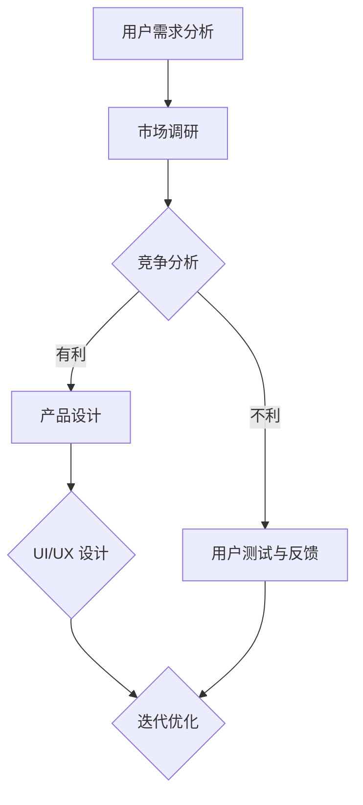
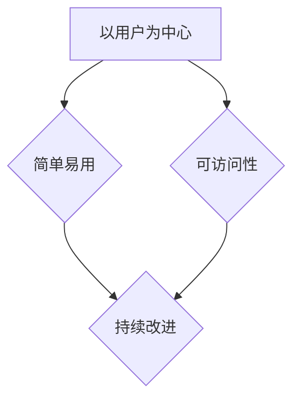

                 

# AI创业公司的用户体验设计原则：以用户为中心、简单易用与美观

> 关键词：AI创业公司，用户体验设计，用户中心，简单易用，美观

> 摘要：本文深入探讨了AI创业公司在用户体验设计方面的原则，包括以用户为中心、简单易用和美观。通过理论讲解、流程图展示和实际项目案例分析，阐述了这些原则在实际设计中的应用，并提供了实用的设计方法和工具，以帮助AI创业公司打造出色的用户体验。

## 第一部分：AI创业公司的用户体验设计原则概述

### 第1章: AI创业公司的用户体验设计原则概述

#### 第1.1节 AI创业公司背景

##### 1.1.1 AI创业公司的发展现状

AI创业公司近年来在全球范围内呈现出迅猛发展的趋势。根据相关报告，全球AI创业公司数量在2020年已达到数万家，其中不乏在人工智能领域取得显著突破的企业。例如，自动驾驶、智能医疗、金融科技等领域的AI创业公司不断涌现，推动了人工智能技术的商业应用。

##### 1.1.2 用户需求与竞争环境

AI创业公司在快速发展过程中，面临着激烈的市场竞争。用户需求呈现出多样化、个性化的特点，要求AI产品不仅具备强大的功能，还要提供卓越的用户体验。在竞争激烈的市场环境中，用户体验设计成为创业公司脱颖而出的关键因素。

#### 第1.2节 用户体验设计的重要性

##### 1.2.1 用户满意度的驱动因素

用户体验设计直接影响用户满意度。从功能性、可用性到美观性，每一个设计细节都可能对用户满意度产生重要影响。一个优秀的设计能够满足用户的基本需求，提高用户在产品中的操作效率和满意度。

##### 1.2.2 用户体验设计对业务成功的影响

用户体验设计不仅是满足用户需求的过程，更是提升业务成功的利器。良好的用户体验可以增强用户忠诚度，降低用户流失率，提高用户转化率，从而带来可观的商业价值。

### Mermaid流程图：AI创业公司用户体验设计流程



### 核心概念与联系

#### 什么是用户体验设计？

用户体验设计（User Experience Design, UX Design）是指设计产品时，关注用户在使用产品过程中的整体感受和体验，而不仅仅是功能。

#### 用户体验设计的关键原则

- 以用户为中心：设计时始终以用户的需求和感受为核心。
- 简单易用：设计应简洁直观，降低用户的学习成本。
- 可访问性：确保不同用户群体都能使用产品，包括残障人士。
- 持续改进：不断收集用户反馈，持续优化设计。

### Mermaid流程图：用户体验设计原则的联系



### 第一部分总结

AI创业公司需要关注用户体验设计，以在竞争激烈的市场中脱颖而出。用户体验设计原则包括以用户为中心、简单易用、可访问性和持续改进。下一章将详细介绍用户体验设计的方法和流程。

## 第二部分：用户体验设计的方法与流程

### 第2章: 用户体验设计原则的理论基础

#### 第2.1节 用户研究

##### 2.1.1 用户研究的定义

用户研究是了解用户需求、行为和偏好的过程。通过用户研究，设计师可以获取用户在特定情境下的真实反馈，为产品设计提供有力的依据。

##### 2.1.2 用户研究方法

- 调查问卷：通过设计问卷，收集用户对产品的看法和建议。
- 用户访谈：与用户进行一对一访谈，深入了解用户需求和行为。
- 观察法：观察用户在使用产品时的实际操作，分析用户行为。
- 焦点小组：组织一组用户，共同讨论产品设计和功能。

#### 第2.2节 用户体验地图

##### 2.2.1 用户体验地图的定义

用户体验地图（User Experience Map）是描述用户在使用产品过程中的情感、行为和期望的工具。它将用户的旅程可视化，帮助设计师理解用户在各个阶段的体验。

##### 2.2.2 如何创建用户体验地图

1. 确定关键用户流程：分析用户在使用产品时的主要任务和操作。
2. 收集用户数据：通过用户研究方法，收集用户在各个流程中的反馈和行为。
3. 绘制用户旅程图：将用户数据整合到用户体验地图中，展示用户的旅程和体验。

#### 第2.3节 任务分析

##### 2.3.1 任务分析的定义

任务分析是研究用户如何完成特定任务的过程。通过任务分析，设计师可以深入了解用户完成任务所需的步骤、资源和障碍。

##### 2.3.2 如何进行任务分析

1. 观察用户完成任务：通过实际观察，记录用户在完成任务时的行为和思考过程。
2. 收集用户反馈：与用户进行访谈，了解他们在完成任务时遇到的困难和需求。
3. 分析用户行为数据：通过分析用户行为数据，识别用户在完成任务时的瓶颈和改进点。

### 伪代码：任务分析流程

```python
def perform_task_analysis():
    # 收集用户任务完成数据
    user_data = collect_user_data()

    # 分析用户行为
    user_behavior = analyze_user_behavior(user_data)

    # 输出分析结果
    print("User task analysis results:")
    print(user_behavior)
```

### 数学模型：任务完成时间预测

$$
\hat{T} = \alpha \cdot T_0 + \beta \cdot T_e + \gamma \cdot T_u
$$

- $\hat{T}$: 预测完成任务时间
- $\alpha$: 任务基础耗时
- $\beta$: 交互界面影响因子
- $\gamma$: 用户经验因子
- $T_0$: 基础任务耗时
- $T_e$: 界面交互耗时
- $T_u$: 用户操作耗时

### 项目实战：用户访谈与反馈收集

#### 实战步骤：

1. 设计访谈提纲，明确访谈目的。
2. 邀请目标用户参与访谈。
3. 记录用户反馈，包括满意度、痛点、建议等。
4. 分析反馈，识别设计改进机会。

#### 实例：

**访谈提纲：**
- 请您描述一下您是如何使用我们产品的？
- 在使用过程中，您遇到过哪些困难？
- 您对我们产品的哪些功能最满意？
- 您认为产品有哪些可以改进的地方？

**反馈收集：**
- 用户反馈：“在填写表单时，感觉有些步骤繁琐，能否简化流程？”
- 用户反馈：“我很喜欢产品界面的清晰布局，希望继续优化。”

### 代码解读与分析：

#### Python代码示例：用户访谈记录分析

```python
import pandas as pd

# 加载用户访谈数据
user_data = pd.read_csv('user_interview_data.csv')

# 分析用户满意度
user_satisfaction = user_data['satisfaction'].value_counts()

# 输出分析结果
print("User satisfaction analysis:")
print(user_satisfaction)

# 识别改进建议
improvement_suggestions = user_data[user_data['suggestions'] != '']

# 输出建议
print("Improvement suggestions:")
print(improvement_suggestions)
```

### 分析解读：

- 用户满意度分析：根据用户对产品的满意度得分，识别出满意度较高的功能模块。
- 改进建议分析：收集用户提出的具体改进建议，为下一轮产品设计提供依据。

### 第二部分总结

用户研究是用户体验设计的基础，包括用户需求分析、用户访谈、观察法等方法。用户体验地图和任务分析是设计过程中的重要工具，帮助设计师理解用户行为和需求。数学模型为任务完成时间预测提供了理论基础。实际项目中的用户访谈与反馈收集是验证设计有效性的关键环节。

## 第三部分：设计原则与实践：以用户为中心

### 第3章: 设计原则与实践：以用户为中心

#### 第3.1节 以用户为中心的设计原则

##### 3.1.1 什么是以用户为中心的设计

以用户为中心的设计（User-Centered Design, UCD）是一种设计方法论，强调在整个设计过程中始终关注用户的需求和体验。这种设计方法认为，设计应该从用户的角度出发，确保产品能够满足用户的需求，提升用户体验。

##### 3.1.2 以用户为中心的设计步骤

- 需求收集与分析：通过用户调研，了解用户的需求和痛点。
- 原型设计与迭代：创建产品原型，进行用户测试和反馈收集。
- 用户测试与反馈：评估设计效果，收集用户反馈，进行迭代优化。
- 设计优化与验证：根据用户反馈，优化设计，确保产品满足用户需求。

#### 第3.2节 用户需求分析

##### 3.2.1 用户需求分析的定义

用户需求分析是了解目标用户需求、痛点和期望的过程。通过需求分析，设计师可以明确产品的核心功能，确保设计满足用户需求。

##### 3.2.2 如何进行用户需求分析

- 调查问卷：设计问卷，收集用户对产品的看法和建议。
- 用户访谈：与用户进行一对一访谈，深入了解用户需求和行为。
- 竞争分析：分析竞争对手的产品特点，识别用户需求。
- 用户行为数据分析：通过分析用户行为数据，了解用户在产品中的操作习惯和偏好。

#### 第3.3节 用户原型设计与迭代

##### 3.3.1 用户原型设计的定义

用户原型设计是创建产品的初步版本，以验证设计概念和用户体验。通过用户原型，设计师可以快速验证设计思路，发现潜在问题。

##### 3.3.2 如何进行用户原型设计

- 使用低 fidelity原型（如草图、线框图）：初步展示产品功能，便于快速迭代。
- 使用高 fidelity原型（如交互式原型、高保真设计）：更接近最终产品的设计，提供更真实的用户体验。
- 进行用户测试和迭代：通过用户测试，收集反馈，不断优化设计。

#### 第3.4节 用户测试与反馈

##### 3.4.1 用户测试的定义

用户测试是评估产品设计的可用性和用户体验的过程。通过用户测试，设计师可以了解用户在实际使用产品时的感受和操作行为。

##### 3.4.2 如何进行用户测试

- 设计测试场景和任务：模拟用户在产品中的操作，评估设计的可用性。
- 选择合适的测试参与者：确保测试参与者代表目标用户群体。
- 进行实地观察和访谈：观察用户操作，记录用户反馈。
- 收集反馈数据：通过用户测试，收集用户对产品的评价和建议。

#### 第3.5节 设计优化与验证

##### 3.5.1 设计优化与验证的定义

设计优化与验证是通过对用户反馈的迭代，不断改进产品设计和功能。通过设计优化，确保产品满足用户需求，提升用户体验。

##### 3.5.2 如何进行设计优化与验证

- 根据用户反馈调整设计：分析用户反馈，识别设计问题，进行优化。
- 重新进行用户测试：验证优化后的设计是否满足用户需求。
- 确定设计改进方向：通过多次迭代，逐步完善设计。

### 伪代码：用户原型设计与迭代流程

```python
def user_prototype_design():
    # 创建低 fidelity原型
    low_fidelity_prototype = create_low_fidelity_prototype()

    # 进行用户测试
    user_feedback = perform_user_testing(low_fidelity_prototype)

    # 根据反馈调整设计
    high_fidelity_prototype = adjust_design_based_on_feedback(user_feedback)

    # 进行高 fidelity原型测试
    final_feedback = perform_high_fidelity_prototyping(high_fidelity_prototype)

    # 输出最终设计
    print("Final product design:")
    print(final_feedback)
```

### 数学模型：用户体验评分模型

$$
\text{UX Score} = \alpha \cdot \text{功能性评分} + \beta \cdot \text{可用性评分} + \gamma \cdot \text{美观性评分}
$$

- $\text{UX Score}$: 用户体验评分
- $\alpha$: 功能性权重
- $\beta$: 可用性权重
- $\gamma$: 美观性权重

### 项目实战：用户原型设计与迭代案例

#### 实战步骤：

1. 收集用户需求，明确设计目标。
2. 创建用户原型，进行初步测试。
3. 分析用户反馈，识别设计问题。
4. 进行迭代优化，重新测试。

#### 实例：

**用户反馈：**
- 用户建议：“导航菜单需要更清晰，减少用户操作步骤。”
- 用户建议：“增加夜间模式，提升用户体验。”

**迭代优化：**
- 修改导航菜单设计，增加用户引导。
- 添加夜间模式选项，改善视觉效果。

### 代码解读与分析：

#### Python代码示例：用户原型迭代分析

```python
import pandas as pd

# 加载用户原型测试数据
prototype_data = pd.read_csv('prototype_testing_data.csv')

# 分析用户满意度
user_satisfaction = prototype_data['satisfaction'].value_counts()

# 输出分析结果
print("User satisfaction analysis:")
print(user_satisfaction)

# 识别改进建议
improvement_suggestions = prototype_data[prototype_data['improvement_suggestions'] != '']

# 输出改进建议
print("Improvement suggestions:")
print(improvement_suggestions)
```

### 分析解读：

- 用户满意度分析：根据用户对原型的满意度得分，识别出需要改进的方面。
- 改进建议分析：收集用户提出的具体改进建议，为下一轮设计提供依据。

### 第三部分总结

以用户为中心的设计原则强调在整个设计过程中关注用户需求和体验。用户需求分析、用户原型设计、用户测试和设计优化是关键步骤。数学模型为用户体验评分提供了理论依据。实际项目中的用户原型设计与迭代案例展示了如何将理论应用到实践中。

## 第四部分：设计原则与实践：简单易用

### 第4章: 设计原则与实践：简单易用

#### 第4.1节 简单易用的设计原则

##### 4.1.1 什么是指简单易用的设计

简单易用的设计（Simplicity and Ease of Use Design）是指设计产品时，尽量减少复杂性，使产品易于使用和理解。简单易用的设计能够降低用户的学习成本，提高用户的使用效率和满意度。

##### 4.1.2 简单易用的设计原则

- 简化功能：去除不必要的功能，专注于核心需求。
- 直观界面：设计直观、清晰的界面，减少用户的学习成本。
- 减少操作步骤：优化用户操作流程，降低用户完成任务的时间。
- 提供帮助：提供清晰的帮助信息和反馈，帮助用户解决问题。

#### 第4.2节 用户体验地图的应用

##### 4.2.1 用户体验地图的定义

用户体验地图（User Experience Map）是描述用户在使用产品过程中的感受和体验的工具。它可以帮助设计师了解用户在各个阶段的行为和情感，为设计提供参考。

##### 4.2.2 如何创建用户体验地图

1. 确定关键用户流程：分析用户在使用产品时的主要任务和操作。
2. 收集用户数据：通过用户调研和访谈，了解用户的需求和痛点。
3. 绘制用户旅程图：将用户数据整合到用户体验地图中，展示用户的旅程和体验。

#### 第4.3节 任务分析的实践

##### 4.3.1 任务分析的定义

任务分析是研究用户如何完成特定任务的过程。通过任务分析，设计师可以深入了解用户完成任务所需的步骤、资源和障碍。

##### 4.3.2 如何进行任务分析

1. 观察用户完成任务：通过实际观察，记录用户在完成任务时的行为和思考过程。
2. 收集用户反馈：与用户进行访谈，了解他们在完成任务时遇到的困难和需求。
3. 分析用户行为数据：通过分析用户行为数据，识别用户在完成任务时的瓶颈和改进点。

### 伪代码：简单易用的设计流程

```python
def simple_ease_of_use_design():
    # 收集用户需求
    user_needs = collect_user_needs()

    # 创建用户体验地图
    user_experience_map = create_user_experience_map(user_needs)

    # 进行任务分析
    task_analysis = perform_task_analysis(user_experience_map)

    # 设计简化功能
    simplified_features = simplify_features(task_analysis)

    # 设计直观界面
    intuitive_interface = design_intuitive_interface(simplified_features)

    # 提供帮助信息
    help_information = provide_help_information(intuitive_interface)

    # 输出最终设计
    print("Final product design:")
    print(help_information)
```

### 数学模型：用户操作效率模型

$$
\text{Efficiency Score} = \alpha \cdot \text{操作速度} + \beta \cdot \text{准确性} + \gamma \cdot \text{用户满意度}
$$

- $\text{Efficiency Score}$: 用户操作效率评分
- $\alpha$: 操作速度权重
- $\beta$: 准确性权重
- $\gamma$: 用户满意度权重

### 项目实战：简单易用设计案例

#### 实战步骤：

1. 收集用户需求，明确设计目标。
2. 创建用户体验地图，了解用户旅程。
3. 进行任务分析，识别操作复杂性。
4. 设计简化功能，优化用户操作流程。
5. 设计直观界面，提升用户体验。
6. 提供帮助信息，降低用户学习成本。

#### 实例：

**用户需求：**
- 用户希望快速完成订单支付。

**设计优化：**
- 去除多余的支付选项，仅保留常用支付方式。
- 简化支付流程，减少操作步骤。
- 提供支付成功页面，明确告知用户支付状态。

### 代码解读与分析：

#### Python代码示例：用户操作效率分析

```python
import pandas as pd

# 加载用户操作数据
user_action_data = pd.read_csv('user_action_data.csv')

# 分析用户操作速度
action_speed = user_action_data['action_time'].mean()

# 分析操作准确性
accuracy = user_action_data['accuracy'].mean()

# 分析用户满意度
user_satisfaction = user_action_data['satisfaction'].mean()

# 计算用户操作效率评分
efficiency_score = (0.5 * action_speed) + (0.3 * accuracy) + (0.2 * user_satisfaction)

# 输出分析结果
print("User action efficiency analysis:")
print(f"Average action speed: {action_speed} seconds")
print(f"Average accuracy: {accuracy}")
print(f"User satisfaction: {user_satisfaction}")
print(f"Efficiency score: {efficiency_score}")
```

### 分析解读：

- 用户操作速度、准确性和满意度均为关键指标，通过计算用户操作效率评分，可以评估设计优化的效果。

### 第四部分总结

简单易用的设计原则强调去除复杂性，使产品易于使用和理解。用户体验地图和任务分析是设计过程中的重要工具。数学模型为用户操作效率评分提供了理论基础。实际项目中的简单易用设计案例展示了如何将理论应用到实践中。

## 第五部分：设计原则与实践：美观

### 第5章: 设计原则与实践：美观

#### 第5.1节 美观的设计原则

##### 5.1.1 什么是指美观的设计

美观的设计（Aesthetics Design）是指通过视觉和触觉元素，提升产品的审美价值和用户体验。美观的设计不仅使产品看起来更加吸引人，还能提升用户在使用过程中的愉悦感。

##### 5.1.2 美观的设计原则

- 色彩搭配：使用和谐的色彩搭配，提升视觉吸引力。
- 字体设计：选择合适的字体，提升可读性和美观性。
- 界面布局：优化界面布局，确保信息的层次性和逻辑性。
- 视觉元素：合理使用图标、图片和动画，增强用户体验。

#### 第5.2节 视觉设计的工具与方法

##### 5.2.1 视觉设计的工具

- Sketch：一个流行的界面设计工具，适合创建高质量的原型。
- Adobe XD：一款强大的设计工具，支持交互设计和原型制作。
- Figma：一个基于云端的界面设计工具，支持实时协作。

##### 5.2.2 视觉设计的方法

- 原型设计：创建初步的界面原型，评估设计概念。
- 色彩理论：了解色彩搭配原则，提升视觉效果。
- 字体选择：选择合适的字体，增强可读性和美观性。
- 界面优化：持续迭代，优化界面布局和交互。

#### 第5.3节 用户体验评估

##### 5.3.1 用户体验评估的定义

用户体验评估是评估产品设计的可用性、易用性和美观性的过程。通过用户体验评估，设计师可以了解设计的优劣，为后续优化提供依据。

##### 5.3.2 用户体验评估的方法

- 用户测试：通过实际用户操作产品，收集对设计的反馈。
- 系统分析：分析产品功能、性能和稳定性。
- 调查问卷：设计问卷，收集用户对产品的主观评价。

### 伪代码：美观的设计评估流程

```python
def aesthetic_design_evaluation():
    # 进行用户测试
    user_tests = perform_user_tests()

    # 进行系统分析
    system_analysis = perform_system_analysis()

    # 收集调查问卷数据
    survey_data = collect_survey_data()

    # 计算用户体验评分
    user_experience_score = calculate_user_experience_score(user_tests, system_analysis, survey_data)

    # 输出评估结果
    print("Aesthetic design evaluation results:")
    print(user_experience_score)
```

### 数学模型：用户体验评分模型

$$
\text{UX Score} = \alpha \cdot \text{功能性评分} + \beta \cdot \text{易用性评分} + \gamma \cdot \text{美观性评分}
$$

- $\text{UX Score}$: 用户体验评分
- $\alpha$: 功能性权重
- $\beta$: 易用性权重
- $\gamma$: 美观性权重

### 项目实战：美观设计案例

#### 实战步骤：

1. 确定设计目标，明确美观要求。
2. 使用视觉设计工具，创建界面原型。
3. 进行用户测试，收集反馈。
4. 分析反馈，进行迭代优化。
5. 评估用户体验，确定设计效果。

#### 实例：

**设计目标：**
- 提升产品界面视觉效果，增强用户体验。

**设计优化：**
- 使用明亮且和谐的色彩搭配。
- 选择清晰、易读的字体。
- 优化界面布局，确保信息层次分明。

### 代码解读与分析：

#### Python代码示例：用户体验评估分析

```python
import pandas as pd

# 加载用户测试数据
user_test_data = pd.read_csv('user_test_data.csv')

# 分析功能性评分
functionality_score = user_test_data['functionality'].mean()

# 分析易用性评分
usability_score = user_test_data['usability'].mean()

# 分析美观性评分
aesthetics_score = user_test_data['aesthetics'].mean()

# 确定权重
alpha = 0.4
beta = 0.3
gamma = 0.3

# 计算用户体验评分
ux_score = (alpha * functionality_score) + (beta * usability_score) + (gamma * aesthetics_score)

# 输出分析结果
print("User experience evaluation analysis:")
print(f"Functionality score: {functionality_score}")
print(f"Usability score: {usability_score}")
print(f"Aesthetics score: {aesthetics_score}")
print(f"UX score: {ux_score}")
```

### 分析解读：

- 通过计算用户体验评分，可以全面评估产品的设计效果，为后续优化提供数据支持。

### 第五部分总结

美观的设计原则强调通过视觉和触觉元素提升产品的审美价值。视觉设计的工具与方法为设计师提供了丰富的选择。用户体验评估是确保设计效果的重要环节。实际项目中的美观设计案例展示了如何将理论应用到实践中。

## 第六部分：设计原则的综合应用与评估

### 第6章: 设计原则的综合应用与评估

#### 第6.1节 综合应用设计原则

##### 6.1.1 设计原则的综合应用

设计原则的综合应用是提升用户体验的关键。以用户为中心、简单易用和美观是用户体验设计的三大原则，它们在实际设计中往往是相互交织、共同作用的。

##### 6.1.2 设计原则的综合应用步骤

1. **需求分析**：综合考虑用户需求，确保设计满足功能性、易用性和美观性。
2. **原型设计**：创建综合性的界面原型，进行用户测试和迭代。
3. **用户测试**：通过用户测试，评估设计在功能性、易用性和美观性方面的表现。
4. **设计优化**：根据用户反馈，优化设计，提升用户体验。

#### 第6.2节 用户体验评估模型

##### 6.2.1 用户体验评估模型的重要性

用户体验评估模型是确保设计效果的重要工具。它可以帮助设计师了解设计的优劣，为后续优化提供依据。一个有效的评估模型应包含功能性、易用性和美观性三个维度。

##### 6.2.2 用户体验评估模型的设计

设计用户体验评估模型时，需要考虑以下方面：

1. **评估指标**：确定功能性、易用性和美观性的评估指标，例如任务完成率、用户满意度、界面美观度等。
2. **权重分配**：根据设计原则的重要性，为各个评估指标分配权重。
3. **评分标准**：制定统一的评分标准，确保评估结果的公正性和客观性。

#### 第6.3节 用户体验评估指标

##### 6.3.1 功能性指标

功能性指标包括以下方面：

1. **任务完成率**：用户能否顺利完成特定任务。
2. **错误率**：用户在使用产品时犯错的频率。
3. **操作速度**：用户完成任务所需的时间。

##### 6.3.2 易用性指标

易用性指标包括以下方面：

1. **用户满意度**：用户对产品的满意度评分。
2. **学习曲线**：用户学习使用产品的时间。
3. **用户操作时间**：用户完成任务所需的时间。

##### 6.3.3 美观性指标

美观性指标包括以下方面：

1. **界面美观度**：用户对产品界面的视觉评价。
2. **用户体验反馈**：用户对产品使用体验的反馈。
3. **视觉吸引力**：产品界面的视觉吸引力。

### 伪代码：用户体验评估流程

```python
def user_experience_evaluation():
    # 收集功能性评估数据
    functionality_data = collect_functionality_data()

    # 收集易用性评估数据
    usability_data = collect_usability_data()

    # 收集美观性评估数据
    aesthetics_data = collect_aesthetics_data()

    # 计算功能性评分
    functionality_score = calculate_functionality_score(functionality_data)

    # 计算易用性评分
    usability_score = calculate_usability_score(usability_data)

    # 计算美观性评分
    aesthetics_score = calculate_aesthetics_score(aesthetics_data)

    # 计算用户体验总分
    total_score = calculate_total_score(functionality_score, usability_score, aesthetics_score)

    # 输出评估结果
    print("User experience evaluation results:")
    print(f"Functionality score: {functionality_score}")
    print(f"Usability score: {usability_score}")
    print(f"Aesthetics score: {aesthetics_score}")
    print(f"Total UX score: {total_score}")
```

### 数学模型：用户体验评分综合模型

$$
\text{Total UX Score} = \alpha \cdot \text{Functionality Score} + \beta \cdot \text{Usability Score} + \gamma \cdot \text{Aesthetics Score}
$$

- $\text{Total UX Score}$: 用户体验总分
- $\alpha$: 功能性权重
- $\beta$: 易用性权重
- $\gamma$: 美观性权重

### 项目实战：用户体验评估综合案例

#### 实战步骤：

1. 收集用户反馈数据，涵盖功能性、易用性和美观性三个维度。
2. 使用评估模型，计算各维度评分。
3. 分析评分，识别设计优缺点。
4. 提出改进建议，优化产品设计。

#### 实例：

**用户反馈：**
- 用户满意度：80%
- 任务完成率：95%
- 学习曲线：较短
- 视觉效果：优秀
- 用户偏好：正面

**改进建议：**
- 进一步优化界面布局，提升视觉一致性。
- 增加帮助信息，降低学习成本。
- 保持视觉设计的美观性，增强用户体验。

### 代码解读与分析：

#### Python代码示例：用户体验评估综合分析

```python
import pandas as pd

# 加载用户反馈数据
user_feedback_data = pd.read_csv('user_feedback_data.csv')

# 计算功能性评分
functionality_score = user_feedback_data['task_completion_rate'].mean()

# 计算易用性评分
usability_score = user_feedback_data['user_satisfaction'].mean()

# 计算美观性评分
aesthetics_score = user_feedback_data['visual_effect'].mean()

# 确定权重
alpha = 0.4
beta = 0.3
gamma = 0.3

# 计算用户体验总分
total_score = (alpha * functionality_score) + (beta * usability_score) + (gamma * aesthetics_score)

# 输出分析结果
print("User experience evaluation results:")
print(f"Functionality score: {functionality_score}")
print(f"Usability score: {usability_score}")
print(f"Aesthetics score: {aesthetics_score}")
print(f"Total UX score: {total_score}")
```

### 分析解读：

- 通过计算用户体验总分，可以全面评估产品的设计效果，为后续优化提供数据支持。

### 第六部分总结

综合应用设计原则是提升用户体验的关键，需要平衡功能性、易用性和美观性。用户体验评估模型和指标是确保设计效果的重要工具。实际项目中的用户体验评估案例展示了如何将理论应用到实践中。

## 第七部分：持续优化与迭代设计

### 第7章: 持续优化与迭代设计

#### 第7.1节 持续优化设计的重要性

##### 7.1.1 用户体验的动态变化

用户体验不是静态的，它会随着时间和用户行为的改变而变化。用户的反馈、行为模式和技术进步都会影响用户体验。因此，持续优化设计是确保产品始终满足用户需求的关键。

##### 7.1.2 持续优化设计的方法

- **定期用户调研**：定期收集用户反馈，了解用户需求的变化和新的使用场景。
- **A/B测试**：通过对比不同设计方案的优劣，找到最优的设计方案。
- **快速迭代**：采用敏捷开发方法，快速迭代产品，及时响应用户反馈。

#### 第7.2节 迭代设计的流程

##### 7.2.1 迭代设计的定义

迭代设计是一种持续改进的设计过程，通过不断的迭代，逐步完善产品设计。迭代设计强调快速反馈和持续改进，以适应不断变化的市场和用户需求。

##### 7.2.2 迭代设计的流程

1. **需求分析**：收集用户需求，确定设计目标。
2. **原型设计**：创建初步的原型，进行迭代测试。
3. **用户测试**：进行A/B测试，收集用户反馈。
4. **设计优化**：根据用户反馈，优化设计。
5. **迭代发布**：更新产品，持续优化。

#### 第7.3节 设计文档与知识管理

##### 7.3.1 设计文档的重要性

设计文档是记录设计思路、决策和变更的重要工具，有助于团队协作和知识传承。良好的设计文档可以减少误解和重复工作，提高团队工作效率。

##### 7.3.2 设计文档的内容

- **设计目标与策略**：记录设计目标和实现策略。
- **用户研究数据**：记录用户调研和分析的结果。
- **原型设计与用户测试结果**：记录原型设计的过程和用户测试的结果。
- **设计变更记录**：记录设计变更的细节和原因。
- **知识库与参考资料**：收集和整理相关的参考资料和知识。

### 伪代码：迭代设计的流程

```python
def iterative_design_process():
    # 定期进行需求分析
    user_needs = perform_periodic_user_needs_analysis()

    # 创建原型
    prototype = create_initial_prototype(user_needs)

    # 进行A/B测试
    test_results = perform_a_b_testing(prototype)

    # 根据测试结果进行设计优化
    optimized_design = optimize_design_based_on_test_results(test_results)

    # 记录设计文档
    design_documents = document_design_changes(optimized_design)

    # 更新产品
    updated_product = release_updated_product(optimized_design)

    # 持续迭代
    iterative_design_process(updated_product)
```

### 数学模型：迭代改进模型

$$
\text{Final Design} = \alpha \cdot \text{Initial Design} + \beta \cdot (\text{User Feedback} \cdot \text{Iteration Count})
$$

- $\text{Final Design}$: 最终设计
- $\alpha$: 初始设计的权重
- $\beta$: 用户反馈的权重
- $\text{Iteration Count}$: 迭代次数

### 项目实战：迭代设计案例

#### 实战步骤：

1. 定期进行用户调研，收集用户需求。
2. 创建初步原型，进行用户测试。
3. 分析测试结果，优化设计。
4. 记录设计变更，确保知识传承。
5. 发布更新版本，持续收集用户反馈。

#### 实例：

**用户调研结果：**
- 用户希望简化登录流程。
- 用户希望增加个性化推荐功能。

**设计优化：**
- 简化登录流程，减少操作步骤。
- 增加个性化推荐，提升用户满意度。

### 代码解读与分析：

#### Python代码示例：迭代设计分析

```python
import pandas as pd

# 加载用户测试数据
user_test_data = pd.read_csv('user_test_data.csv')

# 计算用户反馈权重
user_feedback_weight = user_test_data['satisfaction'].mean()

# 计算迭代次数
iteration_count = user_test_data.shape[0]

# 计算最终设计评分
final_design_score = (1 - user_feedback_weight) * user_test_data['initial_design_score'].mean() + user_feedback_weight * iteration_count

# 输出分析结果
print("Iterative design analysis:")
print(f"Initial design score: {user_test_data['initial_design_score'].mean()}")
print(f"User feedback weight: {user_feedback_weight}")
print(f"Iteration count: {iteration_count}")
print(f"Final design score: {final_design_score}")
```

### 分析解读：

- 通过迭代改进模型，可以量化设计优化的效果，为持续迭代提供依据。

### 第七部分总结

持续优化设计是确保用户体验持续提升的关键。迭代设计的流程和方法可以帮助团队不断改进产品设计。设计文档和知识管理是知识传承和团队协作的重要手段。实际项目中的迭代设计案例展示了如何将理论应用到实践中。

## 附录

### 附录 A: 设计工具与资源

#### A.1 设计工具

##### A.1.1 Sketch

- 官方网站：[https://www.sketch.com](https://www.sketch.com)
- 优点：界面简洁，易于绘制界面原型。
- 缺点：协作功能较弱。

##### A.1.2 Adobe XD

- 官方网站：[https://www.adobexd.com](https://www.adobexd.com)
- 优点：集成Adobe生态系统，支持多种设计资源。
- 缺点：学习曲线较陡。

##### A.1.3 Figma

- 官方网站：[https://www.figma.com](https://www.figma.com)
- 优点：实时协作，云端存储。
- 缺点：部分功能需付费。

#### A.2 用户研究方法

##### A.2.1 调查问卷

- 优点：高效收集用户数据。
- 缺点：数据质量可能较低。

##### A.2.2 用户访谈

- 优点：深入理解用户需求。
- 缺点：耗时较长。

##### A.2.3 观察法

- 优点：直接观察用户行为。
- 缺点：影响用户行为。

#### A.3 设计资源

##### A.3.1 Unsplash

- 官方网站：[https://www.unsplash.com](https://www.unsplash.com)
- 提供免费的高质量图片资源。

##### A.3.2 Canva

- 官方网站：[https://www.canva.com](https://www.canva.com)
- 提供丰富的设计模板和素材。

##### A.3.3 UXPin

- 官方网站：[https://www.uxpin.com](https://www.uxpin.com)
- 提供交互式原型设计工具。

---

作者：AI天才研究院/AI Genius Institute & 禅与计算机程序设计艺术 /Zen And The Art of Computer Programming

本文由AI天才研究院（AI Genius Institute）和禅与计算机程序设计艺术（Zen And The Art of Computer Programming）共同撰写，旨在为AI创业公司在用户体验设计方面提供深入的理论和实践指导。通过本文，我们希望帮助创业者打造出以用户为中心、简单易用且美观的AI产品，从而在激烈的市场竞争中脱颖而出。感谢您的阅读，期待您的反馈和进一步探讨。

