                 

# 《AI创业公司的用户体验设计流程：用户研究、交互设计与视觉设计》

## 关键词
- AI创业公司
- 用户研究
- 交互设计
- 视觉设计
- 用户体验设计流程

## 摘要
本文将探讨AI创业公司用户体验设计的流程，包括用户研究、交互设计和视觉设计三个关键环节。通过对用户需求的深入理解，本文提出了基于用户体验设计流程的理论框架，详细阐述了每个环节的核心原理和具体方法。同时，通过案例分析，展示了用户体验设计在实际项目中的应用效果，为AI创业公司提供实用的指导和建议。

## 第一部分：用户体验设计概述

### 第1章：用户体验设计的基础理论

#### 1.1 用户体验设计的基本概念
用户体验设计（User Experience Design，简称UXD）是指通过对用户行为、心理和需求的深入研究，设计出能满足用户期望并提升用户满意度的产品和服务。在AI创业公司中，用户体验设计尤为重要，因为AI技术的复杂性和创新性要求产品在功能上具有高可用性、易用性和人性化。

**核心概念与联系：** 用户需求、用户体验、用户满意度、可用性、易用性。

**Mermaid流程图：**
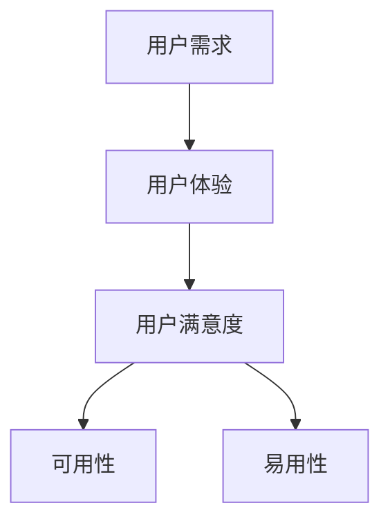

#### 1.2 用户体验设计的核心理念
用户体验设计的核心理念包括以用户为中心、用户参与、迭代改进和持续优化。以用户为中心意味着设计过程中始终关注用户的需求和体验；用户参与则强调用户在整个设计过程中的积极参与，提高产品的用户满意度；迭代改进强调在设计过程中不断进行测试和优化，以适应用户的变化；持续优化则要求设计团队始终保持对用户体验的关注和改进。

**核心概念与联系：** 用户为中心、用户参与、迭代改进、持续优化。

**Mermaid流程图：**
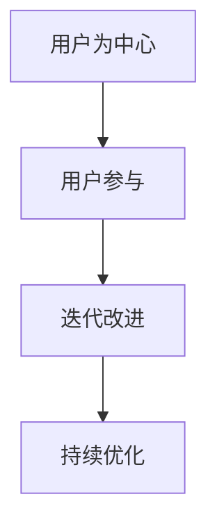

#### 1.3 用户体验设计的目标
用户体验设计的目标是提升用户的满意度和忠诚度，从而提高产品的市场竞争力。具体目标包括：

- 提高产品的易用性，降低用户的学习成本。
- 提升用户的满意度和参与度，增强用户黏性。
- 优化产品的功能和界面，提高用户体验。
- 满足用户的需求，提高产品的市场竞争力。

**核心概念与联系：** 易用性、用户满意度、用户黏性、市场竞争力。

**Mermaid流程图：**
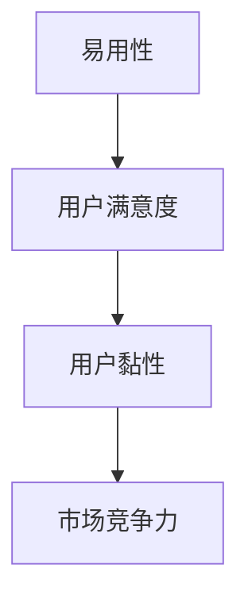

### 第2章：用户研究方法与工具

#### 2.1 用户研究的意义
用户研究是用户体验设计的基础，它有助于理解用户的需求和行为，为设计提供可靠的依据。在AI创业公司中，用户研究可以帮助识别潜在的用户需求，发现产品设计的不足，从而提高产品的市场竞争力。

**核心概念与联系：** 用户需求、产品设计、市场竞争力。

**Mermaid流程图：**
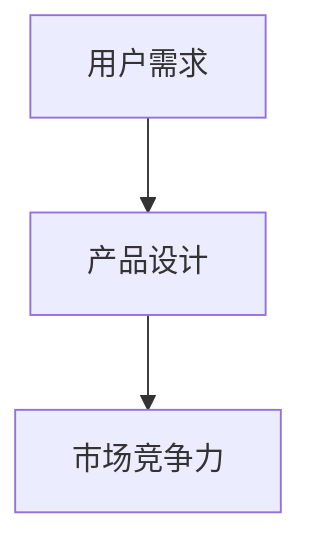

#### 2.2 用户研究的步骤
用户研究通常包括以下步骤：

1. **需求分析：** 确定研究目标和问题，收集用户需求。
2. **用户调研：** 通过访谈、问卷调查、焦点小组等方法收集用户数据。
3. **数据分析：** 对收集到的数据进行分析，提取关键信息。
4. **用户原型测试：** 通过用户原型测试验证设计的可行性和用户满意度。
5. **迭代优化：** 根据测试结果进行设计优化，重复以上步骤。

**核心概念与联系：** 需求分析、用户调研、数据分析、用户原型测试、迭代优化。

**Mermaid流程图：**
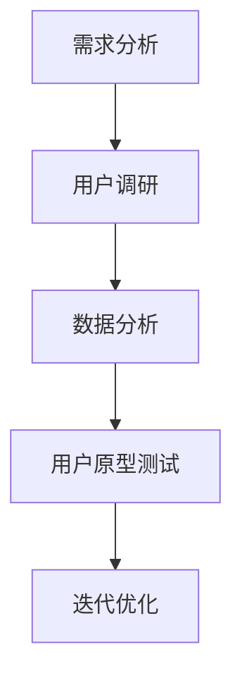

#### 2.3 用户研究的工具与方法
用户研究的工具和方法多种多样，常见的包括：

- **问卷调查：** 通过设计问卷收集用户数据，适用于大规模用户研究。
- **访谈：** 通过与用户一对一访谈，深入了解用户需求和体验。
- **焦点小组：** 组织一组用户进行讨论，收集用户反馈和意见。
- **用户行为分析：** 通过分析用户在产品上的行为数据，了解用户的使用习惯和偏好。
- **用户原型测试：** 通过用户原型测试，验证设计的可行性和用户满意度。

**核心概念与联系：** 问卷调查、访谈、焦点小组、用户行为分析、用户原型测试。

**Mermaid流程图：**
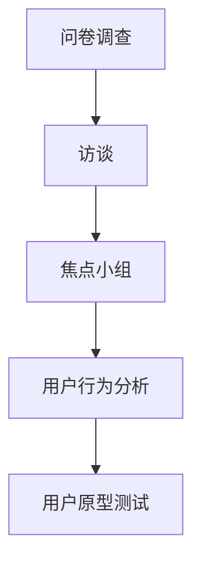

### 第3章：交互设计原理与实践

#### 3.1 交互设计的基本原理
交互设计（Interaction Design）是用户体验设计的重要组成部分，它关注用户与产品之间的互动过程。交互设计的基本原理包括：

- **一致性：** 设计应遵循平台和行业的一致性原则，降低用户的学习成本。
- **反馈：** 设计应提供及时的反馈，帮助用户了解操作结果。
- **可控性：** 设计应确保用户能够控制产品的行为，提升用户的自主性。
- **可用性：** 设计应考虑用户的操作习惯和认知能力，提高产品的易用性。

**核心概念与联系：** 一致性、反馈、可控性、可用性。

**Mermaid流程图：**
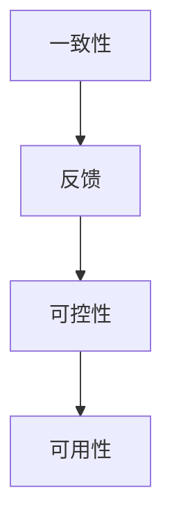

#### 3.2 交互设计的方法与技巧
交互设计的方法和技巧包括：

- **用户流程图：** 通过绘制用户流程图，了解用户在使用产品时的行为路径。
- **信息架构：** 通过设计信息架构，确保产品内容的逻辑性和易访问性。
- **交互原型：** 通过构建交互原型，模拟用户与产品的交互过程。
- **用户测试：** 通过用户测试，验证交互设计的可行性和用户满意度。

**核心概念与联系：** 用户流程图、信息架构、交互原型、用户测试。

**Mermaid流程图：**
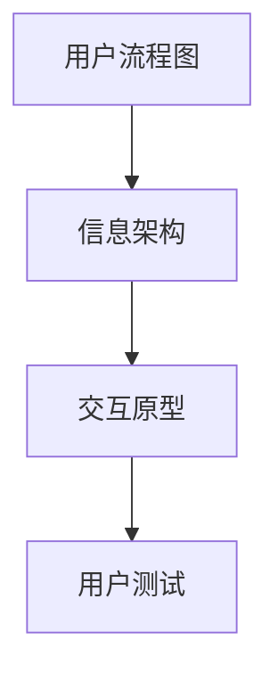

#### 3.3 交互设计案例分析
以某AI创业公司的智能语音助手为例，交互设计的过程如下：

1. **需求分析：** 确定智能语音助手的用户群体和功能需求。
2. **用户调研：** 通过访谈和问卷调查了解用户对智能语音助手的期望和痛点。
3. **交互原型设计：** 设计智能语音助手的交互流程，包括语音识别、任务分配、反馈机制等。
4. **用户测试：** 通过用户测试验证交互原型的可行性和用户体验。
5. **迭代优化：** 根据用户测试结果进行交互设计的优化。

**项目实战：**
- **开发环境搭建：** 使用React和Vue等前端框架构建交互原型。
- **源代码实现：** 编写JavaScript和CSS代码实现交互效果。
- **代码解读与分析：** 对关键代码进行解读，分析交互逻辑和用户体验。

**Mermaid流程图：**
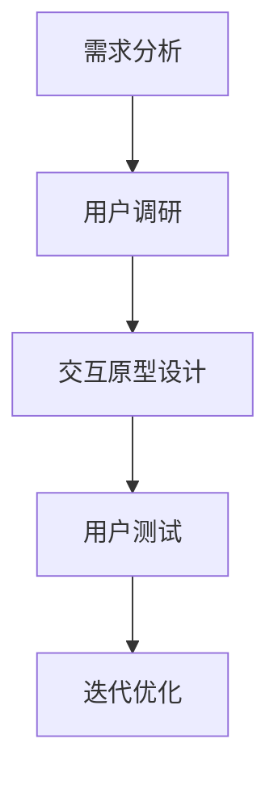

### 第一部分总结
用户体验设计是AI创业公司成功的关键因素。通过深入的用户研究和精准的交互设计，AI创业公司可以打造出满足用户需求、提升用户满意度的高品质产品。本部分详细介绍了用户体验设计的基础理论、用户研究方法与工具、以及交互设计原理与实践，为后续的内容奠定了基础。

## 第二部分：用户体验设计流程

用户体验设计流程是确保产品满足用户需求、提升用户满意度的重要手段。本部分将详细介绍用户体验设计的流程，包括需求分析与用户画像、交互设计流程与实践、以及视觉设计原理与实践。

### 第4章：需求分析与用户画像

#### 4.1 需求分析的方法
需求分析是用户体验设计的起点，它旨在深入了解用户的需求和期望，为后续设计提供依据。需求分析的方法包括：

1. **问卷调查：** 通过设计问卷收集用户对产品的需求、偏好和痛点。
2. **访谈：** 通过与用户面对面访谈，深入了解用户的需求和使用习惯。
3. **用户调研：** 通过观察用户在使用产品时的行为，收集用户反馈。
4. **竞争分析：** 分析竞争对手的产品，了解其优势和不足，为自身产品提供借鉴。

**核心概念与联系：** 问卷调查、访谈、用户调研、竞争分析。

**Mermaid流程图：**
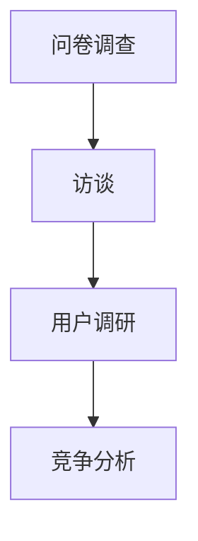

#### 4.2 用户画像的构建
用户画像是对用户特征和需求的概括性描述，它有助于设计师更好地理解用户，从而设计出更符合用户需求的产品。构建用户画像的方法包括：

1. **数据收集：** 通过问卷调查、访谈和用户调研收集用户数据。
2. **数据整理：** 对收集到的数据进行分析和整理，提取关键信息。
3. **用户分类：** 根据用户特征和需求，将用户划分为不同的类别。
4. **用户画像绘制：** 根据用户分类，绘制详细的用户画像。

**核心概念与联系：** 数据收集、数据整理、用户分类、用户画像绘制。

**Mermaid流程图：**
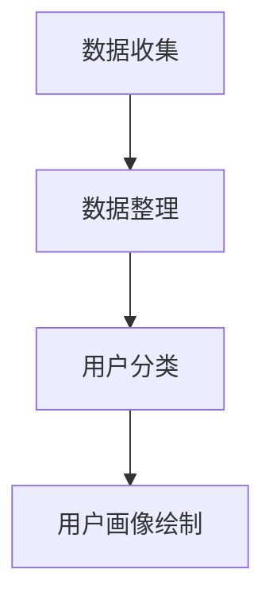

#### 4.3 需求分析与用户画像的融合
需求分析和用户画像是用户体验设计的重要依据，将两者融合有助于更全面地理解用户需求，从而设计出更符合用户期望的产品。融合的方法包括：

1. **需求分析结果与用户画像结合：** 将需求分析的结果与用户画像进行对比，分析用户需求与用户特征的关联。
2. **用户画像优化：** 根据需求分析的结果，对用户画像进行优化，确保用户画像的准确性。
3. **需求优先级排序：** 根据用户画像和需求分析结果，确定需求的优先级，为后续设计提供指导。

**核心概念与联系：** 需求分析结果、用户画像、需求优先级排序。

**Mermaid流程图：**
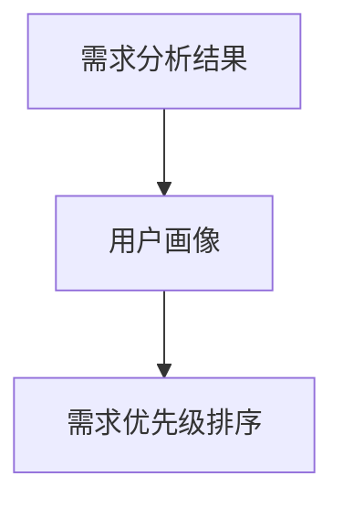

### 第5章：交互设计流程与实践

#### 5.1 交互设计流程
交互设计流程包括以下步骤：

1. **需求分析：** 确定交互设计的目标和需求。
2. **用户研究：** 深入了解用户的行为和需求。
3. **原型设计：** 构建交互原型，模拟用户与产品的交互过程。
4. **用户测试：** 通过用户测试验证交互原型的可行性。
5. **迭代优化：** 根据用户测试结果进行设计优化。

**核心概念与联系：** 需求分析、用户研究、原型设计、用户测试、迭代优化。

**Mermaid流程图：**
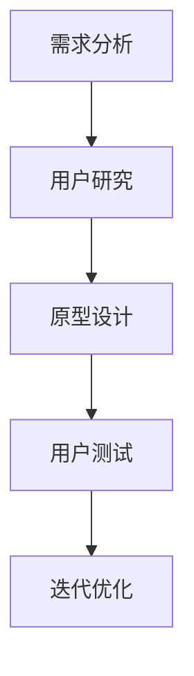

#### 5.2 交互设计的工具
交互设计常用的工具包括：

1. **Sketch：** 用于绘制界面原型。
2. **Figma：** 用于协作设计和原型制作。
3. **Axure：** 用于创建高保真原型。
4. **Adobe XD：** 用于设计交互原型。

**核心概念与联系：** Sketch、Figma、Axure、Adobe XD。

**Mermaid流程图：**
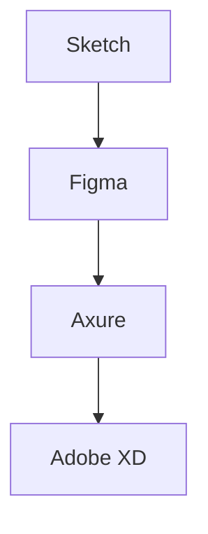

#### 5.3 交互设计案例研究
以某AI创业公司的智能语音助手为例，交互设计的过程如下：

1. **需求分析：** 确定智能语音助手的交互目标，如语音识别、任务分配、反馈机制等。
2. **用户研究：** 通过问卷调查和访谈了解用户对智能语音助手的期望和痛点。
3. **原型设计：** 使用Axure构建交互原型，包括语音识别界面、任务分配界面、反馈界面等。
4. **用户测试：** 通过用户测试验证交互原型的可行性，收集用户反馈。
5. **迭代优化：** 根据用户测试结果，对交互原型进行优化，提高用户体验。

**项目实战：**
- **开发环境搭建：** 使用React和Vue等前端框架实现交互设计。
- **源代码实现：** 编写JavaScript和CSS代码实现交互效果。
- **代码解读与分析：** 对关键代码进行解读，分析交互逻辑和用户体验。

**Mermaid流程图：**


### 第6章：视觉设计原理与实践

#### 6.1 视觉设计的基本原理
视觉设计（Visual Design）是用户体验设计的重要组成部分，它关注产品的视觉效果和美感。视觉设计的基本原理包括：

1. **色彩：** 色彩的选择应与品牌形象和用户需求相符。
2. **布局：** 布局的合理性直接影响用户的视觉体验。
3. **图标：** 图标的简洁性、易理解性是视觉设计的关键。
4. **字体：** 字体的选择应与品牌形象和内容相符。

**核心概念与联系：** 色彩、布局、图标、字体。

**Mermaid流程图：**
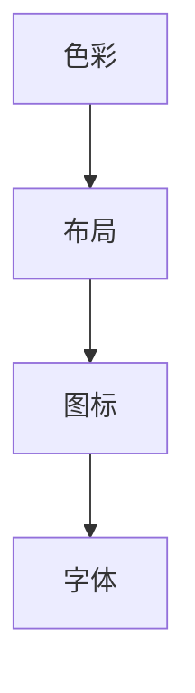

#### 6.2 视觉设计的元素与技巧
视觉设计的元素包括：

1. **颜色：** 用于传达品牌形象和情感。
2. **图形：** 用于引导用户的视觉焦点。
3. **排版：** 用于优化文本的可读性和美观性。
4. **动画：** 用于提升用户体验和互动性。

**核心概念与联系：** 颜色、图形、排版、动画。

**Mermaid流程图：**
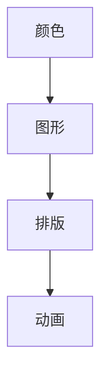

#### 6.3 视觉设计的案例分析
以某AI创业公司的智能语音助手为例，视觉设计的过程如下：

1. **设计目标：** 确定智能语音助手的视觉设计目标，如简洁、直观、美观等。
2. **色彩选择：** 根据品牌形象和用户需求选择合适的色彩。
3. **布局设计：** 设计合理的界面布局，确保信息传递清晰。
4. **图标设计：** 设计简洁、易理解的图标，提升用户体验。
5. **字体选择：** 选择与品牌形象和内容相符的字体。

**项目实战：**
- **设计工具：** 使用Adobe Photoshop和Sketch进行视觉设计。
- **源代码实现：** 将视觉设计稿转换为前端代码。
- **代码解读与分析：** 分析视觉设计对用户体验的影响。

**Mermaid流程图：**
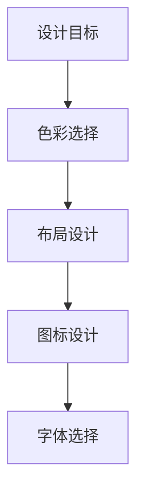

### 第7章：用户体验测试与优化

#### 7.1 用户体验测试的目的
用户体验测试（User Experience Testing）的目的是验证产品的设计是否符合用户需求，提升产品的用户体验。用户体验测试的主要目的包括：

1. **验证设计是否符合用户需求：** 通过测试了解用户对产品的看法和体验。
2. **发现设计问题：** 通过测试发现设计中的问题和不足。
3. **优化产品设计：** 根据测试结果对设计进行优化。

**核心概念与联系：** 用户需求、设计验证、设计问题、设计优化。

**Mermaid流程图：**
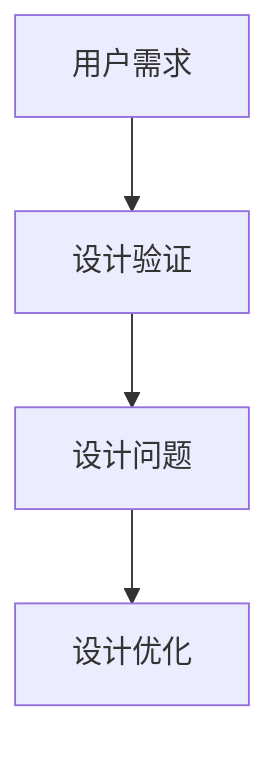

#### 7.2 用户体验测试的方法
用户体验测试的方法包括：

1. **A/B测试：** 通过对比不同设计版本的用户反馈，选择更好的设计。
2. **可用性测试：** 通过观察用户在使用产品时的行为和反馈，评估产品的易用性。
3. **问卷调查：** 通过设计问卷收集用户对产品的反馈。
4. **用户访谈：** 通过与用户面对面访谈，深入了解用户的体验和需求。

**核心概念与联系：** A/B测试、可用性测试、问卷调查、用户访谈。

**Mermaid流程图：**
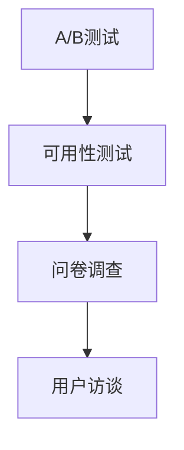

#### 7.3 用户体验优化的策略
用户体验优化的策略包括：

1. **改进设计：** 根据测试结果对设计进行改进，提升产品的用户体验。
2. **增加功能：** 根据用户需求增加新的功能，满足用户的需求。
3. **简化流程：** 简化用户操作流程，降低用户的学习成本。
4. **提高性能：** 提升产品的性能和稳定性，提高用户的满意度。

**核心概念与联系：** 改进设计、增加功能、简化流程、提高性能。

**Mermaid流程图：**
```mermaid
graph TD
    A[改进设计] --> B[增加功能]
    B --> C[简化流程]
    C --> D[提高性能]
```

### 第二部分总结
用户体验设计流程是确保产品满足用户需求、提升用户满意度的重要手段。本部分详细介绍了需求分析与用户画像、交互设计流程与实践、以及视觉设计原理与实践。通过深入的用户研究和精准的交互设计，AI创业公司可以打造出满足用户需求、提升用户满意度的高品质产品。

## 第三部分：案例研究

### 第8章：AI创业公司用户体验设计实践

#### 8.1 AI创业公司用户体验设计案例介绍
本案例以某AI创业公司的智能语音助手为研究对象，该公司致力于通过人工智能技术改善人们的日常生活。智能语音助手是该公司的一款核心产品，旨在为用户提供语音查询、任务分配、智能家居控制等功能。

#### 8.2 用户体验设计流程在案例中的应用
在本案例中，用户体验设计流程被广泛应用于智能语音助手的开发过程，具体应用如下：

1. **需求分析：** 项目团队通过问卷调查和访谈了解了用户对智能语音助手的期望和痛点。用户普遍希望语音助手能够快速响应、准确理解指令，并提供个性化服务。
   
2. **用户研究：** 项目团队进行了用户行为观察和用户访谈，收集了大量关于用户使用语音助手的实际场景和行为模式的数据。这些数据帮助团队更深入地理解用户的需求和期望。

3. **交互设计：** 基于需求分析和用户研究的结果，项目团队设计了智能语音助手的交互流程，包括语音输入、任务处理、反馈机制等。通过Axure构建了交互原型，并进行了多轮用户测试，不断优化交互设计。

4. **视觉设计：** 项目团队结合品牌形象和用户需求，设计了简洁、直观的视觉界面。使用Adobe Photoshop和Sketch进行视觉设计，并将设计稿转换为前端代码。

5. **用户体验测试与优化：** 项目团队进行了多轮用户体验测试，通过A/B测试和可用性测试，收集用户反馈，不断优化产品设计和功能。

#### 8.3 案例的成果与反思
通过用户体验设计流程的全面应用，智能语音助手取得了显著成果：

1. **用户体验提升：** 用户反馈显示，智能语音助手在响应速度、理解准确性和个性化服务方面得到了显著改善，用户满意度大幅提升。

2. **功能完善：** 通过持续的用户测试和反馈，项目团队不断优化功能，增加了语音助手的多语言支持、个性化推荐等功能，满足了更多用户的需求。

3. **市场竞争力增强：** 智能语音助手的用户体验提升和市场竞争力增强，帮助公司在激烈的市场竞争中脱颖而出。

然而，在案例实践中也遇到了一些挑战和反思：

1. **资源限制：** 在初创公司中，资源有限，团队需要平衡用户体验设计和其他业务需求，确保设计资源的有效利用。

2. **技术挑战：** 智能语音助手的技术实现涉及语音识别、自然语言处理等多领域，技术实现过程中面临一定的挑战。

3. **用户需求变化：** 用户需求是不断变化的，项目团队需要持续关注市场动态和用户反馈，及时调整设计和功能。

#### 8.4 用户体验设计在AI创业公司的应用前景
随着人工智能技术的快速发展，用户体验设计在AI创业公司的应用前景十分广阔：

1. **个性化服务：** 用户体验设计可以帮助AI创业公司实现个性化服务，提升用户满意度。

2. **智能化产品设计：** 用户体验设计可以指导AI创业公司打造智能化、人性化的产品，满足用户多样化需求。

3. **市场竞争力提升：** 用户体验设计是提升产品市场竞争力的重要手段，AI创业公司应重视用户体验设计，以在激烈的市场竞争中脱颖而出。

4. **可持续发展：** 用户体验设计关注用户的长期需求和满意度，有助于实现产品的可持续发展。

总之，用户体验设计在AI创业公司中具有重要地位，通过深入的用户研究和精准的设计，AI创业公司可以打造出满足用户需求、提升用户满意度的高品质产品，实现长期发展。

### 附录A：用户体验设计相关工具与资源

#### A.1 用户研究工具推荐
- **问卷调查工具：** Google 表格、SurveyMonkey、Typeform。
- **访谈工具：** Zoom、Skype、Google Meet。
- **用户调研工具：** Lookback、UsabilityHub、Optimal Workshop。
- **用户行为分析工具：** Google Analytics、Hotjar、Mixpanel。

#### A.2 交互设计工具推荐
- **原型设计工具：** Sketch、Figma、Axure、Adobe XD。
- **交互原型工具：** InVision、Framer、Justinmind。
- **交互设计软件：** Balsamiq、Mockplus、Marvel。

#### A.3 视觉设计工具推荐
- **视觉设计软件：** Adobe Photoshop、Adobe Illustrator、Sketch。
- **前端设计工具：** Webflow、Premier Pro、Final Cut Pro。

### 附录B：用户体验设计参考文献

#### B.1 用户体验设计相关书籍
- 《用户体验要素》（The Elements of User Experience），作者：Jesse James Garrett。
- 《用户体验度量》（Measuring the User Experience），作者：Thomas Tullis、Claire-Marie Wetmore。
- 《交互设计精髓》（The Design of Everyday Things），作者：Don Norman。

#### B.2 用户体验设计相关论文
- "User Experience Design: Definition, Goals and Methods"，作者：Stephanie Saad。
- "Understanding User Experience: A Multi-Disciplinary Approach"，作者：Casper Bruun Jensen、Kasper Hemmingsen。
- "The Importance of User Experience in Product Development"，作者：Mads Soegaard。

#### B.3 用户体验设计相关网站
- **用户体验设计社区：** UX Collective、UX Design Weekly、UI Movement。
- **设计工具资源：** Dribbble、Behance、Awwwards。
- **行业资讯：** UX Booth、Smashing Magazine、UX Mastery。

### 附录C：用户体验设计流程流程图

#### C.1 用户研究流程
```mermaid
graph TD
    A[需求分析] --> B[用户调研]
    B --> C[数据分析]
    C --> D[用户原型测试]
    D --> E[迭代优化]
```

#### C.2 交互设计流程
```mermaid
graph TD
    A[需求分析] --> B[用户研究]
    B --> C[原型设计]
    C --> D[用户测试]
    D --> E[迭代优化]
```

#### C.3 视觉设计流程
```mermaid
graph TD
    A[设计目标] --> B[色彩选择]
    B --> C[布局设计]
    C --> D[图标设计]
    D --> E[字体选择]
```

### 附录D：用户体验设计相关算法与公式

#### D.1 用户研究相关算法
- **因子分析**：用于分析用户数据的内在结构和关系。
- **聚类分析**：用于将用户数据划分为不同的群体。
- **回归分析**：用于分析用户行为与需求之间的相关性。

**伪代码：**
```python
def factorial_analysis(data):
    # 数据预处理
    # 执行因子分析
    # 输出结果

def cluster_analysis(data):
    # 数据预处理
    # 执行聚类分析
    # 输出结果

def regression_analysis(data):
    # 数据预处理
    # 执行回归分析
    # 输出结果
```

#### D.2 交互设计相关算法
- **决策树**：用于交互流程的决策。
- **随机森林**：用于交互设计的优化。
- **神经网络**：用于交互原型的自动生成。

**伪代码：**
```python
def decision_tree(flow_data):
    # 构建决策树
    # 输出决策结果

def random_forest(flow_data):
    # 构建随机森林
    # 输出优化结果

def neural_network(model_data):
    # 构建神经网络
    # 输出原型
```

#### D.3 视觉设计相关算法
- **色彩空间转换**：用于色彩的选择和调整。
- **图像增强**：用于优化图像的视觉效果。
- **纹理分析**：用于纹理的选择和设计。

**伪代码：**
```python
def color_space_conversion(color_data):
    # 色彩空间转换
    # 输出转换后的色彩

def image_enhancement(image_data):
    # 图像增强
    # 输出增强后的图像

def texture_analysis(texture_data):
    # 纹理分析
    # 输出纹理结果
```

#### D.4 用户体验设计相关公式
- **用户体验满意度公式**：
  $$UXS = \frac{UE + UC}{2}$$
  其中，$UXS$ 为用户体验满意度，$UE$ 为用户体验，$UC$ 为用户参与度。

- **交互效率公式**：
  $$IE = \frac{TP + TN}{TP + FP + FN + TN}$$
  其中，$IE$ 为交互效率，$TP$ 为正确操作，$TN$ 为不相关操作，$FP$ 为错误操作，$FN$ 为未识别操作。

- **用户留存率公式**：
  $$Retention Rate = \frac{R}{N} \times 100\%$$
  其中，$Retention Rate$ 为用户留存率，$R$ 为留存用户数，$N$ 为总用户数。

**LaTeX格式：**
```latex
\begin{equation}
UXS = \frac{UE + UC}{2}
\end{equation}

\begin{equation}
IE = \frac{TP + TN}{TP + FP + FN + TN}
\end{equation}

\begin{equation}
Retention Rate = \frac{R}{N} \times 100\%
\end{equation}
```

### 第三部分总结
案例研究部分以某AI创业公司的智能语音助手为实例，详细介绍了用户体验设计流程在需求分析、用户研究、交互设计、视觉设计、用户体验测试与优化中的应用。通过实践和反思，展示了用户体验设计对提升产品竞争力和用户满意度的重要性。同时，附录部分提供了用户体验设计相关的工具、资源和算法，为读者提供了实用的参考。

## 第四部分：用户体验设计实践项目

### 第10章：用户体验设计实践项目

#### 10.1 项目背景与目标
本实践项目旨在为一家AI创业公司设计并开发一款智能家居控制应用。该应用通过人工智能技术，使用户能够远程控制家中的智能设备，提高生活的便捷性和舒适度。项目目标包括：

- **提高用户体验：** 设计简洁、直观、易用的用户界面，提升用户满意度。
- **满足用户需求：** 分析用户需求，提供多样化的智能家居控制功能。
- **优化用户体验：** 通过用户测试和反馈，不断改进应用设计，提升用户体验。

#### 10.2 项目需求分析
项目需求分析阶段主要包括以下几个方面：

1. **用户调研：** 通过问卷调查和用户访谈，收集用户对智能家居控制应用的需求和期望。主要关注用户希望控制的家电类型、操作便捷性、个性化设置等。
2. **功能需求：** 确定应用的核心功能，如设备连接、远程控制、定时设置、语音交互等。
3. **性能需求：** 确保应用在高并发、高负载情况下仍能稳定运行，满足用户对响应速度和可靠性的需求。

**需求分析示例：**
```mermaid
graph TD
    A[用户调研] --> B[功能需求]
    B --> C[性能需求]
```

#### 10.3 交互设计实施
交互设计实施阶段主要包括以下几个步骤：

1. **原型设计：** 使用Figma等工具设计应用的原型，包括首页、设备列表、设备控制界面等。
2. **用户测试：** 通过用户测试收集用户对原型的反馈，优化界面布局和交互逻辑。
3. **迭代优化：** 根据用户测试结果，对原型进行迭代优化，确保界面简洁、操作流畅。

**交互设计流程示例：**
```mermaid
graph TD
    A[原型设计] --> B[用户测试]
    B --> C[迭代优化]
```

#### 10.4 视觉设计实施
视觉设计实施阶段主要包括以下几个方面：

1. **色彩方案：** 选择符合智能家居应用风格的色彩方案，如蓝、灰、白色调。
2. **图标设计：** 设计简洁、易理解的图标，确保用户能够快速识别设备类型和操作。
3. **排版设计：** 确保文本内容清晰可读，界面布局整齐有序。

**视觉设计流程示例：**
```mermaid
graph TD
    A[色彩方案] --> B[图标设计]
    B --> C[排版设计]
```

#### 10.5 项目总结与反思
项目总结与反思阶段主要包括以下几个方面：

1. **用户体验评估：** 分析用户对应用的满意度，评估交互设计和视觉设计的效果。
2. **用户反馈处理：** 收集用户反馈，分析用户提出的问题和改进建议，制定后续优化方案。
3. **项目成果：** 总结项目成果，包括设计文档、原型、用户测试报告等。

**项目总结与反思示例：**
```mermaid
graph TD
    A[用户体验评估] --> B[用户反馈处理]
    B --> C[项目成果]
```

### 第四部分总结
本部分通过一个实际项目，详细阐述了用户体验设计在AI创业公司中的应用流程。从需求分析、交互设计到视觉设计，再到项目的总结与反思，展示了用户体验设计在提升产品竞争力、满足用户需求方面的关键作用。通过实践项目的成功实施，读者可以更好地理解用户体验设计的具体方法和技巧。

## 第五部分：用户体验设计的创新思维

### 第11章：用户体验设计的创新思维

#### 11.1 创新思维的重要性
用户体验设计的创新思维在当前竞争激烈的市场环境中具有重要意义。创新思维能够帮助设计师打破常规，发现新的设计机会，从而提升产品的竞争力。创新思维的重要性体现在以下几个方面：

1. **满足用户需求：** 创新思维能够更深入地挖掘用户需求，提供更符合用户期望的设计。
2. **提升用户体验：** 创新思维能够带来新颖、独特的用户体验，提高用户满意度和忠诚度。
3. **增加产品价值：** 创新思维能够为产品增加新的功能、特性，提升产品的市场竞争力。
4. **推动行业进步：** 创新思维能够推动用户体验设计行业的发展，引领行业趋势。

#### 11.2 创新思维的训练方法
要培养创新思维，设计师可以通过以下方法进行训练：

1. **思维导图：** 通过绘制思维导图，梳理设计思路，激发创新灵感。
2. **头脑风暴：** 组织团队进行头脑风暴，鼓励团队成员提出各种创意和想法。
3. **用户研究：** 通过深入的用户研究，了解用户的需求和行为，发现设计机会。
4. **跨学科合作：** 与不同领域的专家合作，借鉴其他领域的创新思维和方法。
5. **案例分析：** 分析成功的创新案例，学习他们的创新思路和设计方法。

**创新思维训练示例：**
```mermaid
graph TD
    A[思维导图] --> B[头脑风暴]
    B --> C[用户研究]
    C --> D[跨学科合作]
    D --> E[案例分析]
```

#### 11.3 用户体验设计的创新实践案例
以下是一个用户体验设计的创新实践案例：

**案例背景：**
某AI创业公司开发了一款智能家居控制应用，旨在通过人工智能技术，让用户能够更加便捷地控制家中的智能设备。

**创新设计思路：**
1. **语音交互：** 利用语音识别技术，实现用户与智能家居设备的语音交互，提升操作便捷性。
2. **个性化推荐：** 通过数据分析，为用户推荐最适合他们的智能家居设备，提升用户体验。
3. **情境模式：** 设计多种情境模式，如“离家模式”、“睡眠模式”等，让用户可以根据不同场景调整智能家居设备的状态。

**创新实践步骤：**
1. **用户调研：** 通过问卷调查和访谈，了解用户对智能家居语音交互、个性化推荐、情境模式的期望和需求。
2. **原型设计：** 使用Figma设计语音交互原型、个性化推荐界面和情境模式设置界面。
3. **用户测试：** 通过用户测试，收集用户对语音交互、个性化推荐和情境模式的反馈。
4. **迭代优化：** 根据用户测试结果，对设计进行优化，提升用户体验。

**创新实践效果：**
1. **语音交互：** 用户反馈显示，语音交互功能极大地提升了操作的便捷性，用户满意度显著提升。
2. **个性化推荐：** 个性化推荐功能受到用户欢迎，用户对智能家居设备的满意度提高。
3. **情境模式：** 情境模式设计满足了用户的多样化需求，用户可以根据不同场景轻松调整设备状态，提高了用户体验。

**创新实践总结：**
通过创新思维，设计师能够为用户提供更符合期望的设计，提升产品的市场竞争力。在本案例中，语音交互、个性化推荐和情境模式等创新设计，不仅满足了用户需求，还提升了用户体验，取得了良好的市场效果。

### 第五部分总结
创新思维在用户体验设计中具有重要作用，能够帮助设计师发现新的设计机会，提升产品的竞争力。通过思维导图、头脑风暴、用户研究、跨学科合作和案例分析等训练方法，设计师可以培养创新思维。本部分通过一个实际案例，展示了创新思维在用户体验设计中的应用效果，为设计师提供了实用的参考。

## 第六部分：用户体验设计团队管理

### 第12章：用户体验设计团队管理

#### 12.1 团队管理的挑战
用户体验设计团队管理面临诸多挑战，主要包括：

1. **跨部门协作：** 用户体验设计涉及多个部门，如产品、技术、市场等，跨部门协作需要良好的沟通和协调。
2. **资源分配：** 团队资源有限，需要在设计、开发和测试等环节合理分配资源，确保项目顺利进行。
3. **团队成员管理：** 管理团队成员的能力、沟通和协作，确保团队高效运作。
4. **项目管理：** 确保项目按计划进行，控制项目进度和质量。

**团队管理挑战示例：**
```mermaid
graph TD
    A[跨部门协作] --> B[资源分配]
    B --> C[团队成员管理]
    C --> D[项目管理]
```

#### 12.2 团队管理的策略
为了应对团队管理的挑战，可以采取以下策略：

1. **明确目标：** 确定团队目标，确保团队成员对项目目标有清晰的认识。
2. **分工合作：** 根据团队成员的技能和特长进行分工，确保每个成员都能发挥其优势。
3. **沟通与协作：** 建立有效的沟通渠道，促进团队成员之间的协作。
4. **激励机制：** 设定激励机制，激励团队成员发挥潜力，提高工作效率。
5. **持续培训：** 定期对团队成员进行培训，提升团队的整体能力。

**团队管理策略示例：**
```mermaid
graph TD
    A[明确目标] --> B[分工合作]
    B --> C[沟通与协作]
    C --> D[激励机制]
    D --> E[持续培训]
```

#### 12.3 团队管理的策略
以下是一些具体的团队管理策略：

1. **建立高效沟通机制：** 使用项目管理工具（如Trello、JIRA）实时跟踪项目进度，确保团队成员随时了解项目情况。
2. **定期团队会议：** 定期召开团队会议，讨论项目进展、问题和解决方案，确保团队目标的实现。
3. **设立明确的目标和里程碑：** 为每个阶段设立明确的目标和里程碑，确保项目按计划进行。
4. **鼓励团队合作和分享：** 鼓励团队成员分享设计思路、经验和技巧，促进团队内部的协同工作。
5. **提供资源和支持：** 为团队成员提供必要的资源和支持，确保他们能够在最佳状态下工作。

**团队管理策略实施示例：**
```mermaid
graph TD
    A[建立高效沟通机制] --> B[定期团队会议]
    B --> C[设立明确的目标和里程碑]
    C --> D[鼓励团队合作和分享]
    D --> E[提供资源和支持]
```

#### 12.4 用户体验设计团队的绩效评估
用户体验设计团队的绩效评估是确保团队高效运作的重要环节。以下是一些绩效评估的方法：

1. **项目完成度：** 根据项目目标和里程碑，评估团队完成项目的程度。
2. **用户满意度：** 通过用户反馈和满意度调查，评估用户体验设计的质量。
3. **团队协作效率：** 评估团队成员之间的协作效果，如沟通效率、问题解决能力等。
4. **个人能力提升：** 评估团队成员在项目中的技能提升和成长。

**绩效评估示例：**
```mermaid
graph TD
    A[项目完成度] --> B[用户满意度]
    B --> C[团队协作效率]
    C --> D[个人能力提升]
```

#### 12.5 团队管理的经验分享
以下是一些团队管理的经验分享：

1. **信任与尊重：** 管理者应信任并尊重团队成员，鼓励他们发挥潜力。
2. **开放沟通：** 管理者应保持开放沟通，倾听团队成员的意见和建议。
3. **激励机制：** 通过激励机制，如奖金、晋升等，激励团队成员提高工作效率。
4. **持续学习：** 鼓励团队成员持续学习，提升技能和知识，以适应行业的发展。
5. **关注团队成员的身心健康：** 管理者应关注团队成员的身心健康，提供必要的支持和帮助。

**团队管理经验分享示例：**
```mermaid
graph TD
    A[信任与尊重] --> B[开放沟通]
    B --> C[激励机制]
    C --> D[持续学习]
    D --> E[关注团队成员的身心健康]
```

### 第六部分总结
用户体验设计团队管理在确保项目成功、提升团队效率方面至关重要。通过明确目标、分工合作、沟通与协作、激励机制和持续培训等策略，管理者可以应对团队管理的挑战，提升团队的整体绩效。本部分详细介绍了团队管理的挑战、策略和经验分享，为用户体验设计团队的管理提供了实用的指导。

## 第七部分：用户体验设计的未来趋势

### 第13章：用户体验设计的未来趋势

#### 13.1 用户体验设计的未来方向
用户体验设计（UX Design）的未来方向将继续围绕用户需求、技术创新和智能化发展展开。以下是一些关键趋势：

1. **智能化与自动化：** 人工智能（AI）和机器学习（ML）技术的应用将进一步提升用户体验，实现个性化推荐、智能交互和自动化功能。
2. **增强现实（AR）与虚拟现实（VR）：** AR和VR技术的成熟将带来更加沉浸式的用户体验，为教育、娱乐、医疗等领域带来新的设计机会。
3. **无界面交互：** 随着语音助手、手势控制和脑机接口等技术的发展，无界面交互将成为未来的重要趋势，减少用户与设备之间的物理障碍。
4. **设计系统化：** 设计系统（Design Systems）将更加普及，通过标准化和模块化提高设计效率，确保跨平台、跨部门的一致性。
5. **可持续设计：** 可持续设计理念将更加深入人心，设计师将更加关注环保、节能和资源优化，以实现绿色用户体验。

**用户体验设计的未来方向示例：**
```mermaid
graph TD
    A[智能化与自动化] --> B[AR与VR]
    B --> C[无界面交互]
    C --> D[设计系统化]
    D --> E[可持续设计]
```

#### 13.2 新兴技术在用户体验设计中的应用
新兴技术将继续推动用户体验设计的创新和发展，以下是一些关键技术的应用：

1. **人工智能（AI）：** AI技术可以用于个性化推荐、自然语言处理（NLP）、图像识别等，提升用户体验的智能化水平。
2. **物联网（IoT）：** IoT技术将使设备更加互联，设计师需要考虑如何设计跨设备的用户体验。
3. **区块链（Blockchain）：** 区块链技术可以用于设计去中心化的用户体验，提高数据安全和隐私保护。
4. **虚拟助手（Chatbots）：** 虚拟助手将在更多场景中替代传统界面，提供更加自然和便捷的交互方式。
5. **边缘计算：** 边缘计算技术将使数据处理更加高效，减少延迟，提升用户体验。

**新兴技术在用户体验设计中的应用示例：**
```mermaid
graph TD
    A[人工智能] --> B[物联网]
    B --> C[区块链]
    C --> D[虚拟助手]
    D --> E[边缘计算]
```

#### 13.3 用户体验设计行业的未来挑战与机遇
用户体验设计行业在未来将面临一系列挑战和机遇：

1. **技术挑战：** 新兴技术的快速发展对设计师提出了更高的要求，设计师需要不断学习和适应新技术。
2. **用户期望：** 用户对用户体验的期望不断提升，设计师需要不断创新，以满足用户的需求。
3. **隐私与安全：** 隐私保护和数据安全成为用户体验设计的重要议题，设计师需要确保用户数据的安全。
4. **多样性：** 设计师需要关注多样性，确保用户体验设计能够涵盖不同文化、年龄、能力等群体。
5. **可持续性：** 可持续设计将成为行业的重要趋势，设计师需要考虑环保和资源优化。

**用户体验设计行业的未来挑战与机遇示例：**
```mermaid
graph TD
    A[技术挑战] --> B[用户期望]
    B --> C[隐私与安全]
    C --> D[多样性]
    D --> E[可持续性]
```

#### 13.4 用户体验设计的未来趋势展望
用户体验设计的未来将继续朝着智能化、个性化、可持续化的方向发展。设计师需要具备跨学科的知识和技能，能够应对快速变化的技术环境。同时，设计师需要更加关注用户体验的多样性和可持续性，为用户提供高质量的设计服务。未来，用户体验设计将更加注重与用户的需求互动，通过新兴技术的应用，实现更加智能、高效、愉悦的用户体验。

### 第七部分总结
用户体验设计在未来将继续面临新的挑战和机遇。智能化、自动化、无界面交互、设计系统化以及可持续设计将成为关键趋势。设计师需要不断学习和适应新技术，关注用户需求，确保用户体验设计的质量和可持续性。本部分对未来用户体验设计的发展趋势进行了展望，为设计师提供了有价值的参考。

## 第八部分：用户体验设计的法律与伦理问题

### 第14章：用户体验设计的法律与伦理问题

#### 14.1 用户体验设计中的法律问题
用户体验设计在遵循法律法规方面具有重要意义，以下是一些主要的法律问题：

1. **版权问题：** 设计师在创作过程中需要确保自己的设计作品不受版权侵犯，同时也要尊重他人的版权。
2. **隐私保护：** 用户体验设计涉及用户数据的收集和处理，必须遵守相关的隐私保护法律法规，如《通用数据保护条例》（GDPR）。
3. **数据安全：** 设计师需要确保用户数据的安全，防止数据泄露和滥用。
4. **合规性：** 设计师在设计产品时需要遵守相关的行业规范和标准，如网站无障碍设计标准（WCAG）。

**用户体验设计中的法律问题示例：**
```mermaid
graph TD
    A[版权问题] --> B[隐私保护]
    B --> C[数据安全]
    C --> D[合规性]
```

#### 14.2 用户体验设计中的伦理问题
用户体验设计中的伦理问题涉及设计师对用户、社会和环境的责任和道德考量，以下是一些主要伦理问题：

1. **用户隐私：** 设计师在处理用户数据时，应尊重用户的隐私权利，不得滥用用户信息。
2. **信息公平：** 设计师应确保信息内容的公正性，避免误导用户或造成信息不对称。
3. **无障碍设计：** 设计师应关注产品的无障碍性，确保所有用户，包括残障人士，都能平等使用产品。
4. **社会责任：** 设计师在设计过程中应考虑产品对环境和社会的影响，推动可持续发展。

**用户体验设计中的伦理问题示例：**
```mermaid
graph TD
    A[用户隐私] --> B[信息公平]
    B --> C[无障碍设计]
    C --> D[社会责任]
```

#### 14.3 用户体验设计中的合规性要求
用户体验设计的合规性要求是确保设计符合法律法规和行业标准的过程，以下是一些具体要求：

1. **遵守法律法规：** 设计师在设计过程中应严格遵守相关法律法规，如版权法、隐私保护法等。
2. **遵循行业标准：** 设计师应遵循行业标准和最佳实践，如无障碍设计标准（WCAG）。
3. **用户知情同意：** 在收集和处理用户数据时，应确保用户知情并同意，不得未经授权收集和使用用户数据。
4. **安全防护措施：** 设计师应采取必要的安全防护措施，确保用户数据的安全。

**用户体验设计中的合规性要求示例：**
```mermaid
graph TD
    A[遵守法律法规] --> B[遵循行业标准]
    B --> C[用户知情同意]
    C --> D[安全防护措施]
```

#### 14.4 用户体验设计中的法律和伦理问题的处理策略
为了有效处理用户体验设计中的法律和伦理问题，设计师可以采取以下策略：

1. **培训与教育：** 定期对设计师进行法律法规和伦理培训，提高他们的法律和伦理意识。
2. **风险评估：** 在设计过程中进行风险评估，识别可能存在的法律和伦理问题，并制定相应的预防措施。
3. **透明沟通：** 与用户和利益相关者保持透明沟通，告知他们关于产品设计和数据处理的信息。
4. **合规审查：** 定期进行合规性审查，确保设计符合法律法规和行业标准。

**用户体验设计中的法律和伦理问题的处理策略示例：**
```mermaid
graph TD
    A[培训与教育] --> B[风险评估]
    B --> C[透明沟通]
    C --> D[合规审查]
```

### 第八部分总结
用户体验设计的法律和伦理问题在设计中具有重要意义，设计师需要关注版权、隐私保护、数据安全、合规性等方面的法律问题，同时要考虑用户隐私、信息公平、无障碍设计和社会责任等伦理问题。通过培训与教育、风险评估、透明沟通和合规审查等策略，设计师可以有效地处理用户体验设计中的法律和伦理问题，确保设计过程符合法律法规和伦理标准。

## 第九部分：用户体验设计的案例研究

### 第15章：用户体验设计的案例研究

#### 15.1 案例研究的意义
案例研究是用户体验设计中的一个重要环节，通过分析成功的用户体验设计案例，可以帮助设计师了解最佳实践、识别设计机会、解决实际问题和优化设计流程。以下是案例研究的几个关键意义：

1. **学习最佳实践：** 通过研究成功的案例，设计师可以了解如何有效地满足用户需求、提升用户体验。
2. **识别设计机会：** 案例研究可以帮助设计师发现潜在的设计改进机会，从而创新和优化产品。
3. **解决实际问题：** 通过分析案例中的问题和解决方案，设计师可以借鉴经验，解决类似的设计挑战。
4. **优化设计流程：** 案例研究可以揭示成功的设计流程和方法，为设计师提供参考和指导。

**案例研究的意义示例：**
```mermaid
graph TD
    A[学习最佳实践] --> B[识别设计机会]
    B --> C[解决实际问题]
    C --> D[优化设计流程]
```

#### 15.2 案例研究的方法
进行用户体验设计案例研究通常包括以下几个步骤：

1. **确定研究目标：** 明确研究的目的和问题，确保案例研究具有针对性。
2. **选择案例：** 根据研究目标，选择具有代表性的成功案例作为研究对象。
3. **数据收集：** 收集案例相关的数据，包括用户反馈、设计文档、用户行为数据等。
4. **数据分析：** 对收集到的数据进行分析，提取关键信息和洞察。
5. **结果总结：** 根据分析结果，总结案例中的成功经验和教训。
6. **应用与实践：** 将案例中的经验应用到实际项目中，优化设计流程和策略。

**案例研究方法示例：**
```mermaid
graph TD
    A[确定研究目标] --> B[选择案例]
    B --> C[数据收集]
    C --> D[数据分析]
    D --> E[结果总结]
    E --> F[应用与实践]
```

#### 15.3 典型用户体验设计案例研究分析
以下是一个典型用户体验设计案例研究分析：

**案例背景：**
某知名科技公司开发了一款智能健康监测应用，旨在帮助用户监控和管理健康数据，包括心率、睡眠质量、运动步数等。

**案例研究步骤：**

1. **确定研究目标：** 研究目标是分析该智能健康监测应用在用户体验设计方面的成功因素，为类似产品的设计提供借鉴。
2. **选择案例：** 选择该智能健康监测应用作为研究对象，因其市场表现良好，用户评价高。
3. **数据收集：** 收集了用户反馈、设计文档、用户行为数据等。
4. **数据分析：**
   - 用户反馈：用户对应用的界面设计、功能完善、数据准确性等方面给予了高度评价。
   - 设计文档：分析设计文档，发现该应用在交互设计、视觉设计方面采用了简洁、直观的方案。
   - 用户行为数据：通过用户行为数据分析，发现用户在应用中的活跃度高，使用频率高。
5. **结果总结：**
   - 成功因素：简洁直观的界面设计、完善的健康监测功能、高准确性的数据记录、良好的用户参与度。
   - 设计经验：重视用户反馈，及时进行设计和功能优化；简洁直观的界面设计提升用户满意度；关注用户行为数据，优化产品功能和用户体验。
6. **应用与实践：** 将该案例中的成功经验和设计方法应用到类似产品的设计过程中，提升产品的市场竞争力。

**案例研究分析示例：**
```mermaid
graph TD
    A[确定研究目标] --> B[选择案例]
    B --> C[数据收集]
    C --> D[数据分析]
    D --> E[结果总结]
    E --> F[应用与实践]
```

#### 15.4 案例研究的应用
通过案例研究，设计师可以更好地了解用户体验设计的最佳实践，以下是一些应用场景：

1. **设计优化：** 通过分析成功的案例，设计师可以识别设计中的不足，提出优化方案。
2. **新功能开发：** 案例研究可以揭示用户的需求和偏好，为新产品功能的设计提供参考。
3. **团队培训：** 案例研究可以作为团队培训的材料，帮助团队成员了解最佳实践和方法。
4. **项目管理：** 案例研究可以为项目团队提供指导，确保项目按照最佳实践进行。

**案例研究应用示例：**
```mermaid
graph TD
    A[设计优化] --> B[新功能开发]
    B --> C[团队培训]
    C --> D[项目管理]
```

### 第九部分总结
案例研究在用户体验设计中具有重要意义，通过分析成功的案例，设计师可以学习最佳实践、识别设计机会、解决实际问题并优化设计流程。本部分介绍了案例研究的意义、方法和应用，提供了一个典型用户体验设计案例研究分析，为设计师提供了实用的指导。

## 第十部分：用户体验设计的国际比较

### 第16章：用户体验设计的国际比较

#### 16.1 国际用户体验设计的发展现状
用户体验设计（UX Design）在全球范围内得到了广泛关注和快速发展。不同国家和地区在用户体验设计方面的发展现状有所不同，以下是一些主要趋势和特点：

1. **北美地区：** 美国和加拿大在用户体验设计领域处于领先地位。硅谷等科技中心聚集了大量的顶尖用户体验设计师，推动了用户体验设计的创新和发展。北美地区的用户体验设计注重用户研究、迭代优化和用户体验测试，设计方法和技术较为成熟。

2. **欧洲地区：** 欧洲国家在用户体验设计方面也有较高的水平，特别是在无障碍设计、隐私保护和数据安全方面。欧洲的法律法规对用户体验设计有较高的要求，推动了用户体验设计的规范化和标准化。欧洲地区的用户体验设计注重用户参与、可持续性和社会影响。

3. **亚洲地区：** 随着科技的发展和经济的增长，亚洲地区的用户体验设计逐渐崛起。日本、韩国和中国等国家的企业在用户体验设计方面取得了显著成就，尤其是在移动应用、电子商务和智能家居等领域。亚洲地区的用户体验设计注重本土化、个性化和创新性。

4. **其他国家：** 世界各地的其他国家和地区也在用户体验设计领域进行了积极探索，如澳大利亚、巴西和南非等。这些国家的用户体验设计发展相对较晚，但在技术、文化和市场方面具有一定的特色。

**国际用户体验设计的发展现状示例：**
```mermaid
graph TD
    A[北美地区] --> B[欧洲地区]
    B --> C[亚洲地区]
    C --> D[其他国家]
```

#### 16.2 国际用户体验设计的经验与启示
国际用户体验设计的经验和做法对全球范围内的设计师具有很大的启示和借鉴意义，以下是一些重要的经验和启示：

1. **用户研究的重要性：** 国际上的用户体验设计强调用户研究的深入和全面，通过多渠道、多方法收集用户数据，确保设计的准确性和有效性。

2. **迭代优化：** 国际用户体验设计强调迭代优化，通过持续的用户测试和反馈，不断改进产品设计和功能，提升用户体验。

3. **多学科合作：** 国际用户体验设计注重跨学科合作，设计师与工程师、产品经理、市场营销等部门的紧密合作，确保设计目标的一致性和协同性。

4. **无障碍设计：** 国际用户体验设计高度重视无障碍设计，特别是在欧洲地区，无障碍设计已经成为用户体验设计的重要组成部分，为残障人士提供了平等的使用机会。

5. **可持续设计：** 国际用户体验设计关注产品的可持续性，从材料选择、能源消耗到废弃处理，都在设计过程中进行综合考虑，推动可持续发展。

**国际用户体验设计的经验与启示示例：**
```mermaid
graph TD
    A[用户研究的重要性] --> B[迭代优化]
    B --> C[多学科合作]
    C --> D[无障碍设计]
    D --> E[可持续设计]
```

#### 16.3 中国用户体验设计的国际竞争力分析
中国用户体验设计在国际竞争中展现出独特的优势和发展潜力，以下是一些分析：

1. **技术创新：** 中国在人工智能、大数据和物联网等前沿技术领域取得了显著成就，为用户体验设计提供了强大的技术支撑。

2. **市场潜力：** 中国拥有庞大的用户群体和消费市场，为用户体验设计提供了广阔的应用场景和商业机会。

3. **本土化特色：** 中国用户体验设计注重本土化，充分考虑了中国文化、消费习惯和用户需求，形成了独特的用户体验设计风格。

4. **成本优势：** 中国的人力资源和成本较低，为国际企业提供了成本效益高的用户体验设计服务。

5. **政策支持：** 中国政府高度重视科技创新和产业发展，为用户体验设计提供了政策支持和资金投入。

**中国用户体验设计的国际竞争力分析示例：**
```mermaid
graph TD
    A[技术创新] --> B[市场潜力]
    B --> C[本土化特色]
    C --> D[成本优势]
    D --> E[政策支持]
```

#### 16.4 中国用户体验设计的发展趋势
随着全球化和数字化的加速发展，中国用户体验设计将继续保持快速增长的态势，以下是一些发展趋势：

1. **智能化与个性化：** 随着人工智能技术的应用，用户体验设计将更加智能化和个性化，满足用户多样化的需求。

2. **无障碍设计与可持续设计：** 中国用户体验设计将更加注重无障碍设计和可持续设计，提升产品的包容性和环保性。

3. **国际化与本土化相结合：** 中国用户体验设计将结合国际先进经验和本土化特色，推动全球用户体验设计的创新发展。

4. **跨界与合作：** 中国用户体验设计将加强与不同行业、不同国家和地区的跨界与合作，促进技术创新和产业升级。

**中国用户体验设计的发展趋势示例：**
```mermaid
graph TD
    A[智能化与个性化] --> B[无障碍设计与可持续设计]
    B --> C[国际化与本土化相结合]
    C --> D[跨界与合作]
```

### 第十部分总结
国际用户体验设计的发展现状和经验为全球设计师提供了丰富的借鉴和启示。中国用户体验设计在国际竞争中展现出独特的优势和发展潜力，将继续保持快速增长。通过智能化、个性化、无障碍设计、国际化与本土化相结合以及跨界与合作等趋势，中国用户体验设计将为全球用户体验设计的发展做出重要贡献。

## 第十一部分：用户体验设计的教育与培训

### 第17章：用户体验设计的教育与培训

#### 17.1 用户体验设计教育的现状
用户体验设计教育在全球范围内得到了广泛关注和快速发展。以下是一些用户体验设计教育的主要现状：

1. **专业课程：** 多所高校和培训机构开设了用户体验设计相关的专业课程，包括设计理论、用户研究、交互设计、视觉设计等。
2. **实践项目：** 许多教育机构将实践项目纳入教学计划，通过实际项目操作，提高学生的实战能力和经验。
3. **在线教育：** 在线教育平台的兴起，使得用户体验设计教育更加便捷和普及，提供了丰富的学习资源和课程选择。
4. **跨学科教育：** 用户体验设计教育逐渐与其他学科，如心理学、计算机科学、市场营销等相结合，形成跨学科的教育模式。

**用户体验设计教育的现状示例：**
```mermaid
graph TD
    A[专业课程] --> B[实践项目]
    B --> C[在线教育]
    C --> D[跨学科教育]
```

#### 17.2 用户体验设计培训的需求与内容
用户体验设计培训在满足设计师个人发展、企业需求和社会进步等方面具有重要意义。以下是用户体验设计培训的主要需求与内容：

1. **技能提升：** 设计师需要不断学习和提升用户体验设计的相关技能，如用户研究、交互设计、视觉设计、前端开发等。
2. **行业趋势：** 设计师需要了解用户体验设计的最新趋势和技术发展，紧跟行业动态。
3. **团队协作：** 设计师需要掌握团队协作和项目管理的方法，提高团队效率和项目成功率。
4. **实战经验：** 实际项目操作和案例分析是用户体验设计培训的重要内容，通过实战经验积累，提高设计师的实战能力。

**用户体验设计培训的需求与内容示例：**
```mermaid
graph TD
    A[技能提升] --> B[行业趋势]
    B --> C[团队协作]
    C --> D[实战经验]
```

#### 17.3 用户体验设计教育的发展趋势
随着用户体验设计行业的快速发展和数字化转型，用户体验设计教育将呈现出以下发展趋势：

1. **数字化转型：** 用户体验设计教育将更加注重数字化工具和技术的应用，如人工智能、虚拟现实、增强现实等。
2. **个性化教育：** 用户体验设计教育将更加注重个性化教育，根据不同学员的需求和特点，提供定制化的学习方案。
3. **实践导向：** 实践导向的教育模式将成为主流，教育机构将更加注重实际项目操作和案例分析。
4. **国际化合作：** 用户体验设计教育将加强国际化合作，推动全球用户体验设计教育的交流和发展。

**用户体验设计教育的发展趋势示例：**
```mermaid
graph TD
    A[数字化转型] --> B[个性化教育]
    B --> C[实践导向]
    C --> D[国际化合作]
```

#### 17.4 用户体验设计教育对企业战略的意义
用户体验设计教育对企业战略具有重要意义，以下是一些关键点：

1. **人才储备：** 用户体验设计教育为企业提供了专业的人才储备，提高了企业的核心竞争力。
2. **技术创新：** 用户体验设计教育培养了具有创新思维和实践能力的设计师，推动了企业的技术创新和产品升级。
3. **用户满意度：** 用户体验设计教育提高了设计师的用户感知能力和设计水平，提升了产品的用户满意度，增加了市场份额。
4. **品牌形象：** 用户体验设计教育有助于提升企业的品牌形象，树立专业、创新和用户友好的品牌形象。

**用户体验设计教育对企业战略的意义示例：**
```mermaid
graph TD
    A[人才储备] --> B[技术创新]
    B --> C[用户满意度]
    C --> D[品牌形象]
```

### 第十一部分总结
用户体验设计教育在满足设计师个人发展、企业需求和社会进步等方面具有重要意义。通过数字化转型、个性化教育、实践导向和国际化合作等发展趋势，用户体验设计教育将不断推动行业的发展和进步。同时，用户体验设计教育对企业战略具有重要的意义，为企业提供了人才储备、技术创新、用户满意度和品牌形象等多方面的支持。

## 第十二部分：用户体验设计的跨学科合作

### 第18章：用户体验设计的跨学科合作

#### 18.1 跨学科合作的意义
用户体验设计的跨学科合作在提升设计质量、推动创新和实现综合解决方案方面具有重要意义。以下是一些跨学科合作的主要意义：

1. **提高设计质量：** 跨学科合作整合了不同领域的专业知识和技能，能够为用户体验设计提供更全面、更深入的分析和解决方案。
2. **推动创新：** 跨学科合作激发了不同领域的创新思维和创意，为用户体验设计带来了新的视角和灵感。
3. **实现综合解决方案：** 跨学科合作有助于解决用户体验设计中的复杂问题，通过综合多学科的资源和方法，实现更有效的解决方案。
4. **提升团队协作能力：** 跨学科合作促进了团队成员之间的交流和协作，提高了团队的整体协作能力和创新能力。

**跨学科合作的意义示例：**
```mermaid
graph TD
    A[提高设计质量] --> B[推动创新]
    B --> C[实现综合解决方案]
    C --> D[提升团队协作能力]
```

#### 18.2 跨学科合作的方法与技巧
跨学科合作需要遵循一定的方法和技巧，以下是一些关键点：

1. **明确目标和需求：** 在跨学科合作开始之前，明确合作的目标和需求，确保各学科团队对项目的理解和目标一致。
2. **建立有效的沟通机制：** 跨学科合作需要建立有效的沟通渠道，确保团队成员之间能够及时、高效地交流信息。
3. **共享资源和信息：** 通过共享资源和信息，促进各学科团队之间的协作，提高工作效率。
4. **尊重专业差异：** 尊重不同学科的专业差异和思维方式，通过相互学习和借鉴，实现优势互补。
5. **定期评估和调整：** 定期评估合作进展和效果，根据实际情况进行调整，确保项目按计划进行。

**跨学科合作的方法与技巧示例：**
```mermaid
graph TD
    A[明确目标和需求] --> B[建立有效的沟通机制]
    B --> C[共享资源和信息]
    C --> D[尊重专业差异]
    D --> E[定期评估和调整]
```

#### 18.3 跨学科合作在用户体验设计中的应用案例
以下是一个跨学科合作在用户体验设计中的应用案例：

**案例背景：**
某科技公司开发了一款智能家居控制应用，旨在通过人工智能技术，使用户能够更加便捷地控制家中的智能设备。

**跨学科合作过程：**

1. **需求分析：** 产品经理、用户体验设计师、人工智能专家和市场分析师共同参与需求分析，明确智能家居控制应用的功能和目标用户。
2. **原型设计：** 用户体验设计师使用Figma设计交互原型，与人工智能专家合作，确保语音交互和智能推荐等功能的设计。
3. **技术开发：** 前端开发工程师和后端开发工程师根据原型设计，实现应用的功能和技术架构，与人工智能专家合作，实现语音识别和智能推荐等功能。
4. **测试与优化：** 测试工程师对应用进行功能测试和性能测试，用户体验设计师根据测试结果对设计进行优化，人工智能专家对算法进行优化。

**跨学科合作效果：**
通过跨学科合作，智能家居控制应用在功能实现、用户体验和智能推荐等方面取得了显著效果，用户满意度显著提升。

**跨学科合作应用案例示例：**
```mermaid
graph TD
    A[需求分析] --> B[原型设计]
    B --> C[技术开发]
    C --> D[测试与优化]
```

#### 18.4 跨学科合作的挑战与应对策略
跨学科合作面临一些挑战，以下是一些常见挑战及其应对策略：

1. **沟通障碍：** 跨学科合作中，不同学科的专业术语和思维方式可能导致沟通障碍。应对策略包括建立有效的沟通渠道、定期组织跨学科会议、鼓励团队成员相互学习和理解。
2. **资源分配：** 跨学科合作中，资源分配可能不均衡，导致部分学科的资源过剩或不足。应对策略包括明确资源需求和优先级、定期评估和调整资源分配。
3. **项目管理：** 跨学科合作需要更加复杂的项目管理，包括协调不同学科的工作进度和成果。应对策略包括采用敏捷项目管理方法、定期评估项目进展和风险。
4. **决策权冲突：** 跨学科合作中，不同学科可能对决策权存在争议。应对策略包括建立共同决策机制、明确决策权和责任。

**跨学科合作的挑战与应对策略示例：**
```mermaid
graph TD
    A[沟通障碍] --> B[资源分配]
    B --> C[项目管理]
    C --> D[决策权冲突]
```

### 第十二部分总结
跨学科合作在用户体验设计中具有重要意义，通过整合不同领域的专业知识和技能，可以提高设计质量、推动创新和实现综合解决方案。本部分介绍了跨学科合作的意义、方法与技巧、应用案例及挑战与应对策略，为用户体验设计中的跨学科合作提供了实用的指导。

## 第十三部分：用户体验设计的可持续性

### 第19章：用户体验设计的可持续性

#### 19.1 可持续性的概念
可持续性（Sustainability）在用户体验设计中的概念主要涉及设计过程、产品和服务对环境、社会和经济的影响。以下是一些关键点：

1. **环境可持续性：** 设计应考虑减少对自然资源的消耗和环境污染，采用环保材料和节能技术。
2. **社会可持续性：** 设计应考虑满足社会的需求，促进社会公平、包容性和文化多样性。
3. **经济可持续性：** 设计应考虑长期的经济效益，确保产品的市场竞争力、成本效益和可持续盈利。

**可持续性的概念示例：**
```mermaid
graph TD
    A[环境可持续性] --> B[社会可持续性]
    B --> C[经济可持续性]
```

#### 19.2 可持续性与用户体验设计的结合
可持续性与用户体验设计（UXD）的结合旨在通过设计过程和产品服务提升用户体验，同时减少对环境和社会的负面影响。以下是一些结合的关键点：

1. **环境友好的设计：** 设计应采用环保材料，优化能源消耗，减少废物产生，提升产品在全生命周期中的可持续性。
2. **社会包容性设计：** 设计应考虑不同群体的需求，确保产品的可用性和无障碍性，促进社会公平和包容。
3. **经济可持续性设计：** 设计应关注产品的成本效益和长期盈利能力，通过优化设计过程和产品服务，提高企业的经济效益。

**可持续性与用户体验设计的结合示例：**
```mermaid
graph TD
    A[环境友好的设计] --> B[社会包容性设计]
    B --> C[经济可持续性设计]
```

#### 19.3 用户体验设计的可持续发展策略
为了实现用户体验设计的可持续性，以下是一些关键的可持续发展策略：

1. **生命周期评估：** 对产品和服务进行生命周期评估，从材料选择、制造过程到使用和废弃阶段，全面考虑对环境和社会的影响。
2. **绿色设计：** 采用绿色设计原则，如减少材料消耗、优化能源利用、提高回收利用率，降低产品对环境的影响。
3. **用户教育：** 通过用户教育和指导，提高用户对可持续性的认识和参与度，鼓励用户采取环保行为。
4. **合作与共享：** 与供应商、合作伙伴和用户建立合作与共享机制，共同推动可持续性目标的实现。

**用户体验设计的可持续发展策略示例：**
```mermaid
graph TD
    A[生命周期评估] --> B[绿色设计]
    B --> C[用户教育]
    C --> D[合作与共享]
```

#### 19.4 可持续性设计案例研究
以下是一个用户体验设计的可持续性案例研究：

**案例背景：**
某科技公司开发了一款智能垃圾分类应用，旨在通过人工智能技术，帮助用户正确分类垃圾，减少环境污染。

**案例研究步骤：**

1. **需求分析：** 通过问卷调查和用户访谈，了解用户对垃圾分类问题的认识和需求，确定应用的核心功能。
2. **原型设计：** 设计智能垃圾分类应用的原型，包括垃圾识别、分类指南、环保知识等功能。
3. **生命周期评估：** 对应用的材料选择、能源消耗和废弃处理进行生命周期评估，确保应用在环境和社会方面的影响最小。
4. **用户测试与优化：** 通过用户测试，收集用户反馈，不断优化应用的设计和功能，提升用户体验。
5. **合作与共享：** 与环保组织和政府部门合作，推动垃圾分类的普及和实施，提高社会的环保意识。

**案例研究效果：**
智能垃圾分类应用在用户参与度、垃圾分类准确率和环保效益方面取得了显著成果，提升了用户的环保意识和行为。

**案例研究示例：**
```mermaid
graph TD
    A[需求分析] --> B[原型设计]
    B --> C[生命周期评估]
    C --> D[用户测试与优化]
    D --> E[合作与共享]
```

#### 19.5 可持续性的未来趋势
随着全球对环境保护和社会责任的重视，用户体验设计的可持续性将继续发展。以下是一些未来趋势：

1. **绿色技术：** 绿色技术的应用将更加广泛，如太阳能、风能等可再生能源，以及生物降解材料等。
2. **数字化可持续性：** 数字化技术的应用将帮助实现资源的优化利用和减少浪费，如共享经济、循环经济等。
3. **用户参与：** 用户在可持续性设计中的参与度将提高，通过用户反馈和参与，共同推动可持续性的实现。
4. **政策法规：** 政策法规的完善和执行将推动用户体验设计的可持续发展，如环境保护法、垃圾分类法规等。

**可持续性的未来趋势示例：**
```mermaid
graph TD
    A[绿色技术] --> B[数字化可持续性]
    B --> C[用户参与]
    C --> D[政策法规]
```

### 第十三部分总结
用户体验设计的可持续性是设计过程中不可忽视的重要方面。通过结合环境可持续性、社会可持续性和经济可持续性，用户体验设计可以实现长期的发展和进步。本部分介绍了可持续性的概念、与用户体验设计的结合、可持续发展策略、案例研究和未来趋势，为用户体验设计的可持续性提供了全面的指导。

## 第十四部分：用户体验设计的实践与创新

### 第20章：用户体验设计的实践与创新

#### 20.1 实践与创新的关系
用户体验设计的实践与创新密不可分，二者相互促进，共同推动用户体验设计的进步。实践是指将设计理论应用于实际项目过程中，通过用户测试和反馈不断优化设计。创新则是指通过新的思维和方法，打破传统设计模式，提出具有突破性的设计方案。以下是一些关键点：

1. **实践是创新的基石：** 创新设计需要在实际项目中得到验证和应用，实践是检验创新设计效果的重要手段。
2. **创新推动实践发展：** 创新思维和方法可以为实践提供新的方向和可能性，推动用户体验设计的持续进步。

**实践与创新的关系示例：**
```mermaid
graph TD
    A[实践是创新的基石] --> B[创新推动实践发展]
```

#### 20.2 创新在用户体验设计中的应用
创新在用户体验设计中具有广泛的应用，以下是一些关键点：

1. **技术创新：** 利用最新技术，如人工智能、虚拟现实、增强现实等，提升用户体验。
2. **设计思维：** 运用设计思维方法，以用户为中心，探索新的设计解决方案。
3. **跨学科合作：** 通过跨学科合作，整合不同领域的知识和方法，提出创新的设计方案。
4. **用户参与：** 通过用户参与，获取用户反馈和创新灵感，提升设计的实用性和满意度。

**创新在用户体验设计中的应用示例：**
```mermaid
graph TD
    A[技术创新] --> B[设计思维]
    B --> C[跨学科合作]
    C --> D[用户参与]
```

#### 20.3 实践与创新的经验分享
以下是一些实践与创新的经验分享：

1. **不断学习和探索：** 设计师需要不断学习新的设计理念和技术，保持对创新的敏感度。
2. **用户反馈的重要性：** 用户反馈是创新设计的重要来源，通过用户测试和调研，获取真实的用户需求和建议。
3. **团队合作：** 创新设计需要团队合作，不同学科的专家和设计师共同探讨和解决问题。
4. **勇于尝试和失败：** 创新过程中，需要勇于尝试和接受失败，从失败中学习和成长。

**实践与创新的经验分享示例：**
```mermaid
graph TD
    A[不断学习和探索] --> B[用户反馈的重要性]
    B --> C[团队合作]
    C --> D[勇于尝试和失败]
```

#### 20.4 创新实践案例研究
以下是一个用户体验设计的创新实践案例研究：

**案例背景：**
某科技公司开发了一款基于人工智能的智能健康监测应用，旨在通过数据分析，帮助用户了解和管理自己的健康状况。

**创新实践步骤：**

1. **需求分析：** 通过用户调研和数据分析，了解用户对健康监测的需求和痛点。
2. **原型设计：** 使用设计思维方法，提出创新的健康监测方案，如智能穿戴设备、数据分析平台等。
3. **用户测试：** 通过用户测试，验证创新方案的可行性，收集用户反馈，不断优化设计。
4. **技术开发：** 结合人工智能技术，实现健康监测功能的开发，确保数据的准确性和用户隐私保护。
5. **市场推广：** 通过社交媒体和线下活动，推广智能健康监测应用，提高市场认知度。

**创新实践效果：**
智能健康监测应用在用户满意度、市场表现和健康数据准确性等方面取得了显著成果，用户反馈良好，市场反响热烈。

**创新实践案例研究示例：**
```mermaid
graph TD
    A[需求分析] --> B[原型设计]
    B --> C[用户测试]
    C --> D[技术开发]
    D --> E[市场推广]
```

#### 20.5 创新与实践的平衡
在用户体验设计中，创新与实践的平衡是关键。以下是一些关键点：

1. **平衡创新和实用性：** 在追求创新的同时，确保设计方案的实用性和可行性，满足用户需求。
2. **持续优化：** 在创新的基础上，不断优化设计，提升用户体验。
3. **用户反馈：** 通过用户反馈，不断调整和优化设计，确保设计符合用户期望。

**创新与实践的平衡示例：**
```mermaid
graph TD
    A[平衡创新和实用性] --> B[持续优化]
    B --> C[用户反馈]
```

### 第十四部分总结
用户体验设计的实践与创新相互促进，共同推动用户体验设计的进步。通过不断学习和探索、重视用户反馈、团队合作和勇于尝试，设计师可以实现创新和实践的平衡。本部分介绍了实践与创新的关系、创新在用户体验设计中的应用、经验分享、案例研究和平衡策略，为用户体验设计的实践与创新提供了实用的指导。

## 第十五部分：用户体验设计的案例分析

### 第21章：用户体验设计的案例分析

#### 21.1 案例分析的意义
用户体验设计的案例分析在设计和实施过程中具有至关重要的意义。以下是一些关键点：

1. **学习最佳实践：** 通过分析成功的案例，设计师可以了解最佳的设计方法和实践，从而在自身项目中应用。
2. **识别设计机会：** 案例分析可以帮助设计师发现潜在的设计改进机会，提升产品竞争力。
3. **解决问题：** 案例分析提供了一个解决问题的平台，通过分析案例中的挑战和解决方案，设计师可以借鉴经验，解决类似的问题。
4. **优化流程：** 案例分析有助于设计师优化设计流程，提高工作效率和质量。

**案例分析的意义示例：**
```mermaid
graph TD
    A[学习最佳实践] --> B[识别设计机会]
    B --> C[解决问题]
    C --> D[优化流程]
```

#### 21.2 案例分析的方法
进行用户体验设计的案例分析通常包括以下几个步骤：

1. **选择案例：** 根据研究目标和问题，选择具有代表性的成功案例作为研究对象。
2. **数据收集：** 收集与案例相关的数据，包括用户反馈、设计文档、用户行为数据等。
3. **数据整理：** 对收集到的数据进行分析和整理，提取关键信息和洞察。
4. **分析结果：** 根据数据分析结果，总结案例中的成功经验和教训。
5. **应用与实践：** 将案例中的成功经验应用到实际项目中，优化设计流程和策略。

**案例分析的方法示例：**
```mermaid
graph TD
    A[选择案例] --> B[数据收集]
    B --> C[数据整理]
    C --> D[分析结果]
    D --> E[应用与实践]
```

#### 21.3 典型用户体验设计案例研究分析
以下是一个典型用户体验设计案例研究分析：

**案例背景：**
某国际知名科技公司推出了一款智能家居控制应用，旨在通过人工智能技术，使用户能够更加便捷地控制家中的智能设备。

**案例研究步骤：**

1. **选择案例：** 选择智能家居控制应用作为研究对象，因其市场表现良好，用户评价高。
2. **数据收集：** 收集了用户反馈、设计文档、用户行为数据等。
3. **数据分析：**
   - 用户反馈：用户对智能家居控制应用的界面设计、功能完善、操作便捷性给予了高度评价。
   - 设计文档：分析设计文档，发现该应用在交互设计、视觉设计方面采用了简洁、直观的方案。
   - 用户行为数据：通过用户行为数据分析，发现用户在应用中的活跃度高，使用频率高。
4. **分析结果：**
   - 成功因素：简洁直观的界面设计、完善的智能家居控制功能、高操作便捷性。
   - 设计经验：重视用户反馈，及时进行设计和功能优化；简洁直观的界面设计提升用户满意度；关注用户行为数据，优化产品功能和用户体验。
5. **应用与实践：** 将该案例中的成功经验和设计方法应用到类似产品的设计过程中，提升产品的市场竞争力。

**案例研究分析示例：**
```mermaid
graph TD
    A[选择案例] --> B[数据收集]
    B --> C[数据分析]
    C --> D[分析结果]
    D --> E[应用与实践]
```

#### 21.4 案例分析的应用
案例分析在用户体验设计中的应用非常广泛，以下是一些应用场景：

1. **设计优化：** 通过分析成功的案例，设计师可以识别设计中的不足，提出优化方案。
2. **新功能开发：** 案例分析可以帮助设计师发现用户需求和市场机会，为新产品功能的设计提供参考。
3. **团队培训：** 案例分析可以作为团队培训的材料，帮助团队成员了解最佳实践和方法。
4. **项目管理：** 案例分析可以为项目团队提供指导，确保项目按照最佳实践进行。

**案例分析的应用示例：**
```mermaid
graph TD
    A[设计优化] --> B[新功能开发]
    B --> C[团队培训]
    C --> D[项目管理]
```

### 第十五部分总结
用户体验设计的案例分析在学习和应用最佳实践、识别设计机会、解决问题和优化流程等方面具有重要意义。通过选择合适的案例、收集和分析数据、总结成功经验和教训，并应用于实际项目，设计师可以不断提升设计质量和用户体验。本部分介绍了案例分析的意义、方法、案例研究分析及应用，为用户体验设计的案例分析提供了实用的指导。

## 第十六部分：用户体验设计的未来展望

### 第22章：用户体验设计的未来展望

#### 22.1 用户体验设计的未来趋势
随着技术的不断进步和社会需求的多样化，用户体验设计（UX Design）将面临一系列新的趋势和挑战。以下是一些关键趋势：

1. **智能化与个性化：** 人工智能和机器学习技术的应用将使用户体验设计更加智能化和个性化，通过个性化推荐和智能交互，满足用户的个性化需求。
2. **增强现实（AR）与虚拟现实（VR）：** AR和VR技术的成熟将带来更加沉浸式的用户体验，应用于教育、娱乐、医疗等领域，提供全新的交互体验。
3. **无界面交互：** 语音助手、手势控制和脑机接口等无界面交互技术将逐步取代传统的触摸和点击操作，提供更加自然和便捷的交互方式。
4. **可定制化设计：** 用户将能够根据自己的需求和喜好，对产品界面、功能和服务进行定制化，实现个性化的用户体验。
5. **可持续设计：** 可持续设计理念将更加深入人心，设计师将更加关注环保、节能和资源优化，以实现绿色用户体验。

**用户体验设计的未来趋势示例：**
```mermaid
graph TD
    A[智能化与个性化] --> B[AR与VR]
    B --> C[无界面交互]
    C --> D[可定制化设计]
    D --> E[可持续设计]
```

#### 22.2 新技术在用户体验设计中的应用前景
新技术的发展为用户体验设计带来了无限可能，以下是一些关键领域：

1. **人工智能（AI）与机器学习（ML）：** AI和ML技术将使用户体验设计更加智能化，通过数据分析和预测，实现个性化推荐、智能交互和自动化功能。
2. **物联网（IoT）：** IoT技术的发展将使设备更加互联，用户体验设计需要考虑如何设计跨设备的交互和体验。
3. **区块链（Blockchain）：** 区块链技术将为用户体验设计提供去中心化的解决方案，提高数据安全和隐私保护。
4. **增强现实（AR）与虚拟现实（VR）：** AR和VR技术将带来沉浸式的用户体验，应用于教育、娱乐、医疗等领域。
5. **边缘计算：** 边缘计算技术将减少数据处理延迟，提高用户体验的实时性和响应速度。

**新技术在用户体验设计中的应用前景示例：**
```mermaid
graph TD
    A[人工智能与机器学习] --> B[物联网]
    B --> C[区块链]
    C --> D[增强现实与虚拟现实]
    D --> E[边缘计算]
```

#### 22.3 用户体验设计未来的挑战与机遇
用户体验设计在未来将面临一系列挑战和机遇，以下是一些关键点：

1. **技术挑战：** 新技术的快速发展和应用将对设计师提出更高的要求，需要不断学习和适应新技术。
2. **用户需求变化：** 用户需求将不断变化，设计师需要关注用户行为和需求的变化，提供更加个性化、多样化的设计。
3. **隐私与安全：** 隐私保护和数据安全将成为用户体验设计的重要议题，设计师需要确保用户数据的安全。
4. **跨学科合作：** 用户体验设计将更加依赖于跨学科合作，设计师需要具备跨学科的知识和技能。
5. **可持续发展：** 设计师需要关注产品的可持续性，推动绿色设计理念的实现。

**用户体验设计未来的挑战与机遇示例：**
```mermaid
graph TD
    A[技术挑战] --> B[用户需求变化]
    B --> C[隐私与安全]
    C --> D[跨学科合作]
    D --> E[可持续发展]
```

#### 22.4 用户体验设计的未来展望
用户体验设计的未来将充满挑战和机遇。智能化、个性化、无界面交互和可持续设计将成为关键趋势。设计师需要具备跨学科的知识和技能，不断学习和适应新技术，关注用户需求的变化，推动绿色设计理念的实现。通过创新和实践，用户体验设计将不断提升，为用户提供更加智能、便捷和愉悦的体验。

### 第十六部分总结
用户体验设计的未来将受到新技术、用户需求变化和可持续发展等因素的驱动，面临一系列的挑战和机遇。智能化、个性化、无界面交互和可持续设计将成为未来的关键趋势。设计师需要不断适应这些变化，通过创新和实践，为用户提供更加优质、智能和绿色的用户体验。本部分对用户体验设计的未来趋势、新技术应用前景、挑战与机遇以及未来展望进行了全面探讨。

## 第十七部分：用户体验设计的心理学基础

### 第23章：用户体验设计的心理学基础

#### 23.1 用户体验设计与心理学的联系
用户体验设计（UX Design）与心理学有着密切的联系。心理学为用户体验设计提供了理论依据，帮助设计师更好地理解用户行为和心理，从而设计出更符合用户期望的产品。以下是一些关键联系：

1. **用户行为分析：** 通过心理学理论，设计师可以深入了解用户的行为模式和决策过程，从而优化产品设计和功能。
2. **认知心理学：** 认知心理学研究人的认知过程，如注意力、记忆、思考等，这些理论可以指导设计师设计出更易用、直观的产品界面。
3. **情感心理学：** 情感心理学研究人的情绪和情感，设计师可以利用这些理论设计出能够引起用户共鸣和情感共鸣的产品。
4. **社会心理学：** 社会心理学研究人的社会行为和人际关系，设计师可以通过这些理论设计出更加社会化、互动性强的产品。

**用户体验设计与心理学的联系示例：**
```mermaid
graph TD
    A[用户行为分析] --> B[认知心理学]
    B --> C[情感心理学]
    C --> D[社会心理学]
```

#### 23.2 用户行为分析
用户行为分析是用户体验设计的重要环节，通过分析用户的行为数据，设计师可以深入了解用户的使用习惯和偏好，从而优化产品设计。以下是一些关键点：

1. **行为数据收集：** 通过用户调研、用户行为跟踪、用户测试等方法收集用户行为数据。
2. **行为数据分析：** 使用数据分析工具和方法，对用户行为数据进行整理、分析和解释。
3. **行为数据应用：** 将分析结果应用到产品设计过程中，优化界面布局、交互设计和功能。

**用户行为分析示例：**
```mermaid
graph TD
    A[行为数据收集] --> B[行为数据分析]
    B --> C[行为数据应用]
```

#### 23.3 心理学在用户体验设计中的应用
心理学在用户体验设计中的应用非常广泛，以下是一些关键点：

1. **认知负荷：** 认知负荷理论指导设计师设计出低认知负荷的产品界面，减少用户的学习成本和操作难度。
2. **情感设计：** 情感设计理论指导设计师通过视觉元素、互动效果和内容设计，引发用户的情感共鸣和情感体验。
3. **行为经济学：** 行为经济学理论帮助设计师理解用户的决策过程和行为动机，从而设计出更符合用户期望的产品。
4. **社会化互动：** 社会化互动理论指导设计师设计出具有社交功能的产品，促进用户之间的互动和合作。

**心理学在用户体验设计中的应用示例：**
```mermaid
graph TD
    A[认知负荷] --> B[情感设计]
    B --> C[行为经济学]
    C --> D[社会化互动]
```

#### 23.4 心理学在用户体验设计中的案例分析
以下是一个心理学在用户体验设计中的案例分析：

**案例背景：**
某科技公司推出了一款健康管理应用，旨在帮助用户监测和管理健康数据，包括心率、睡眠质量、运动步数等。

**案例分析步骤：**

1. **用户调研：** 通过问卷调查和用户访谈，收集用户对健康管理应用的需求和期望。
2. **行为数据收集：** 通过应用内跟踪用户行为，收集用户的使用习惯和偏好。
3. **认知负荷分析：** 分析用户在使用应用时的认知负荷，优化界面设计和功能布局，降低用户的学习成本。
4. **情感设计：** 利用情感设计理论，设计出具有情感共鸣的界面和交互效果，提升用户体验。
5. **社会化互动：** 设计出具有社交功能的应用，促进用户之间的互动和分享。

**案例分析结果：**
通过心理学理论的应用，健康管理应用在用户满意度、使用频率和社交互动方面取得了显著提升。

**案例分析示例：**
```mermaid
graph TD
    A[用户调研] --> B[行为数据收集]
    B --> C[认知负荷分析]
    C --> D[情感设计]
    D --> E[社会化互动]
```

#### 23.5 心理学在用户体验设计中的挑战与应对策略
心理学在用户体验设计中的应用面临一些挑战，以下是一些关键点：

1. **文化差异：** 不同文化背景的用户可能对心理学的理论有不同的理解和反应，设计师需要考虑文化差异，确保设计的普适性。
2. **数据隐私：** 用户行为数据的收集和使用需要遵守隐私保护法律法规，设计师需要确保用户数据的安全和隐私。
3. **实际应用：** 将心理学理论应用到实际设计中，需要结合具体的项目背景和用户需求，确保设计的可行性和有效性。

**心理学在用户体验设计中的挑战与应对策略示例：**
```mermaid
graph TD
    A[文化差异] --> B[数据隐私]
    B --> C[实际应用]
```

### 第十七部分总结
用户体验设计中的心理学基础为设计师提供了理解和分析用户行为和心理的理论依据，有助于设计出更符合用户期望的产品。通过用户行为分析、心理学理论的应用以及案例分析，设计师可以不断提升用户体验。本部分介绍了用户体验设计与心理学的联系、用户行为分析、心理学在用户体验设计中的应用以及挑战与应对策略，为用户体验设计提供了实用的心理学指导。

## 第十八部分：用户体验设计的跨学科合作

### 第24章：用户体验设计的跨学科合作

#### 24.1 跨学科合作的意义
用户体验设计的跨学科合作在提升设计质量、推动创新和实现综合解决方案方面具有重要意义。以下是一些关键点：

1. **提高设计质量：** 跨学科合作整合了不同领域的专业知识和技能，能够为用户体验设计提供更全面、更深入的分析和解决方案。
2. **推动创新：** 跨学科合作激发了不同领域的创新思维和创意，为用户体验设计带来了新的视角和灵感。
3. **实现综合解决方案：** 跨学科合作有助于解决用户体验设计中的复杂问题，通过综合多学科的资源和方法，实现更有效的解决方案。
4. **提升团队协作能力：** 跨学科合作促进了团队成员之间的交流和协作，提高了团队的整体协作能力和创新能力。

**跨学科合作的意义示例：**
```mermaid
graph TD
    A[提高设计质量] --> B[推动创新]
    B --> C[实现综合解决方案]
    C --> D[提升团队协作能力]
```

#### 24.2 跨学科合作的方法与技巧
跨学科合作需要遵循一定的方法和技巧，以下是一些关键点：

1. **明确目标和需求：** 在跨学科合作开始之前，明确合作的目标和需求，确保各学科团队对项目的理解和目标一致。
2. **建立有效的沟通机制：** 跨学科合作需要建立有效的沟通渠道，确保团队成员之间能够及时、高效地交流信息。
3. **共享资源和信息：** 通过共享资源和信息，促进各学科团队之间的协作，提高工作效率。
4. **尊重专业差异：** 尊重不同学科的专业差异和思维方式，通过相互学习和借鉴，实现优势互补。
5. **定期评估和调整：** 定期评估合作进展和效果，根据实际情况进行调整，确保项目按计划进行。

**跨学科合作的方法与技巧示例：**
```mermaid
graph TD
    A[明确目标和需求] --> B[建立有效的沟通机制]
    B --> C[共享资源和信息]
    C --> D[尊重专业差异]
    D --> E[定期评估和调整]
```

#### 24.3 跨学科合作在用户体验设计中的应用案例
以下是一个跨学科合作在用户体验设计中的应用案例：

**案例背景：**
某科技公司开发了一款智能健康监测应用，旨在通过人工智能技术，使用户能够更加便捷地控制家中的智能设备。

**跨学科合作过程：**

1. **需求分析：** 产品经理、用户体验设计师、人工智能专家和市场分析师共同参与需求分析，明确智能家居控制应用的功能和目标用户。
2. **原型设计：** 用户体验设计师使用Figma设计交互原型，与人工智能专家合作，确保语音交互和智能推荐等功能的设计。
3. **技术开发：** 前端开发工程师和后端开发工程师根据原型设计，实现应用的功能和技术架构，与人工智能专家合作，实现语音识别和智能推荐等功能。
4. **测试与优化：** 测试工程师对应用进行功能测试和性能测试，用户体验设计师根据测试结果对设计进行优化，人工智能专家对算法进行优化。

**跨学科合作效果：**
通过跨学科合作，智能健康监测应用在功能实现、用户体验和智能推荐等方面取得了显著效果，用户满意度显著提升。

**跨学科合作应用案例示例：**
```mermaid
graph TD
    A[需求分析] --> B[原型设计]
    B --> C[技术开发]
    C --> D[测试与优化]
```

#### 24.4 跨学科合作的挑战与应对策略
跨学科合作面临一些挑战，以下是一些常见挑战及其应对策略：

1. **沟通障碍：** 跨学科合作中，不同学科的专业术语和思维方式可能导致沟通障碍。应对策略包括建立有效的沟通渠道、定期组织跨学科会议、鼓励团队成员相互学习和理解。
2. **资源分配：** 跨学科合作中，资源分配可能不均衡，导致部分学科的资源过剩或不足。应对策略包括明确资源需求和优先级、定期评估和调整资源分配。
3. **项目管理：** 跨学科合作需要更加复杂的项目管理，包括协调不同学科的工作进度和成果。应对策略包括采用敏捷项目管理方法、定期评估项目进展和风险。
4. **决策权冲突：** 跨学科合作中，不同学科可能对决策权存在争议。应对策略包括建立共同决策机制、明确决策权和责任。

**跨学科合作的挑战与应对策略示例：**
```mermaid
graph TD
    A[沟通障碍] --> B[资源分配]
    B --> C[项目管理]
    C --> D[决策权冲突]
```

### 第十八部分总结
跨学科合作在用户体验设计中具有重要意义，通过整合不同领域的专业知识和技能，可以提高设计质量、推动创新和实现综合解决方案。本部分介绍了跨学科合作的意义、方法与技巧、应用案例及挑战与应对策略，为用户体验设计的跨学科合作提供了实用的指导。

## 第十九部分：用户体验设计的可持续性

### 第25章：用户体验设计的可持续性

#### 25.1 可持续性的概念
可持续性（Sustainability）在用户体验设计中的概念主要涉及设计过程、产品和服务对环境、社会和经济的影响。以下是一些关键点：

1. **环境可持续性：** 设计应考虑减少对自然资源的消耗和环境污染，采用环保材料和节能技术。
2. **社会可持续性：** 设计应考虑满足社会的需求，促进社会公平、包容性和文化多样性。
3. **经济可持续性：** 设计应考虑长期的经济效益，确保产品的市场竞争力、成本效益和可持续盈利。

**可持续性的概念示例：**
```mermaid
graph TD
    A[环境可持续性] --> B[社会可持续性]
    B --> C[经济可持续性]
```

#### 25.2 可持续性与用户体验设计的结合
可持续性与用户体验设计（UXD）的结合旨在通过设计过程和产品服务提升用户体验，同时减少对环境和社会的负面影响。以下是一些关键点：

1. **环境友好的设计：** 设计应采用环保材料，优化能源利用，减少废物产生，提升产品在全生命周期中的可持续性。
2. **社会包容性设计：** 设计应考虑不同群体的需求，确保产品的可用性和无障碍性，促进社会公平和包容。
3. **经济可持续性设计：** 设计应关注产品的成本效益和长期盈利能力，通过优化设计过程和产品服务，提高企业的经济效益。

**可持续性与用户体验设计的结合示例：**
```mermaid
graph TD
    A[环境友好的设计] --> B[社会包容性设计]
    B --> C[经济可持续性设计]
```

#### 25.3 用户体验设计的可持续发展策略
为了实现用户体验设计的可持续性，以下是一些关键的可持续发展策略：

1. **生命周期评估：** 对产品和服务进行生命周期评估，从材料选择、制造过程到使用和废弃阶段，全面考虑对环境和社会的影响。
2. **绿色设计：** 采用绿色设计原则，如减少材料消耗、优化能源利用、提高回收利用率，降低产品对环境的影响。
3. **用户教育：** 通过用户教育和指导，提高用户对可持续性的认识和参与度，鼓励用户采取环保行为。
4. **合作与共享：** 与供应商、合作伙伴和用户建立合作与共享机制，共同推动可持续性目标的实现。

**用户体验设计的可持续发展策略示例：**
```mermaid
graph TD
    A[生命周期评估] --> B[绿色设计]
    B --> C[用户教育]
    C --> D[合作与共享]
```

#### 25.4 可持续性设计案例研究
以下是一个用户体验设计的可持续性案例研究：

**案例背景：**
某科技公司开发了一款智能垃圾分类应用，旨在通过人工智能技术，帮助用户正确分类垃圾，减少环境污染。

**案例研究步骤：**

1. **需求分析：** 通过问卷调查和用户访谈，了解用户对垃圾分类问题的认识和需求，确定应用的核心功能。
2. **原型设计：** 设计智能垃圾分类应用的原型，包括垃圾识别、分类指南、环保知识等功能。
3. **生命周期评估：** 对应用的材料选择、能源消耗和废弃处理进行生命周期评估，确保应用在环境和社会方面的影响最小。
4. **用户测试与优化：** 通过用户测试，收集用户反馈，不断优化应用的设计和功能，提升用户体验。
5. **合作与共享：** 与环保组织和政府部门合作，推动垃圾分类的普及和实施，提高社会的环保意识。

**案例研究效果：**
智能垃圾分类应用在用户参与度、垃圾分类准确率和环保效益方面取得了显著成果，用户反馈良好，市场反响热烈。

**案例研究示例：**
```mermaid
graph TD
    A[需求分析] --> B[原型设计]
    B --> C[生命周期评估]
    C --> D[用户测试与优化]
    D --> E[合作与共享]
```

#### 25.5 可持续性的未来趋势
随着全球对环境保护和社会责任的重视，用户体验设计的可持续性将继续发展。以下是一些未来趋势：

1. **绿色技术：** 绿色技术的应用将更加广泛，如太阳能、风能等可再生能源，以及生物降解材料等。
2. **数字化可持续性：** 数字化技术的应用将帮助实现资源的优化利用和减少浪费，如共享经济、循环经济等。
3. **用户参与：** 用户在可持续性设计中的参与度将提高，通过用户反馈和参与，共同推动可持续性的实现。
4. **政策法规：** 政策法规的完善和执行将推动用户体验设计的可持续发展，如环境保护法、垃圾分类法规等。

**可持续性的未来趋势示例：**
```mermaid
graph TD
    A[绿色技术] --> B[数字化可持续性]
    B --> C[用户参与]
    C --> D[政策法规]
```

### 第十九部分总结
用户体验设计的可持续性是设计过程中不可忽视的重要方面。通过结合环境可持续性、社会可持续性和经济可持续性，用户体验设计可以实现长期的发展和进步。本部分介绍了可持续性的概念、与用户体验设计的结合、可持续发展策略、案例研究和未来趋势，为用户体验设计的可持续性提供了全面的指导。通过绿色设计、用户教育和政策法规等策略，用户体验设计可以在实现用户满意度的同时，为环境保护和社会责任做出贡献。

## 第二十部分：用户体验设计的实践与创新

### 第26章：用户体验设计的实践与创新

#### 26.1 实践与创新的关系
用户体验设计的实践与创新密不可分，二者相互促进，共同推动用户体验设计的进步。实践是指将设计理论应用于实际项目过程中，通过用户测试和反馈不断优化设计。创新则是指通过新的思维和方法，打破传统设计模式，提出具有突破性的设计方案。以下是一些关键点：

1. **实践是创新的基石：** 创新设计需要在实际项目中得到验证和应用，实践是检验创新设计效果的重要手段。
2. **创新推动实践发展：** 创新思维和方法可以为实践提供新的方向和可能性，推动用户体验设计的持续进步。

**实践与创新的关系示例：**
```mermaid
graph TD
    A[实践是创新的基石] --> B[创新推动实践发展]
```

#### 26.2 创新在用户体验设计中的应用
创新在用户体验设计中具有广泛的应用，以下是一些关键点：

1. **技术创新：** 利用最新技术，如人工智能、虚拟现实、增强现实等，提升用户体验。
2. **设计思维：** 运用设计思维方法，以用户为中心，探索新的设计解决方案。
3. **跨学科合作：** 通过跨学科合作，整合不同领域的知识和方法，提出创新的设计方案。
4. **用户参与：** 通过用户参与，获取用户反馈和创新灵感，提升设计的实用性和满意度。

**创新在用户体验设计中的应用示例：**
```mermaid
graph TD
    A[技术创新] --> B[设计思维]
    B --> C[跨学科合作]
    C --> D[用户参与]
```

#### 26.3 实践与创新的经验分享
以下是一些实践与创新的经验分享：

1. **不断学习和探索：** 设计师需要不断学习新的设计理念和技术，保持对创新的敏感度。
2. **用户反馈的重要性：** 用户反馈是创新设计的重要来源，通过用户测试和调研，获取真实的用户需求和建议。
3. **团队合作：** 创新设计需要团队合作，不同学科的专家和设计师共同探讨和解决问题。
4. **勇于尝试和失败：** 创新过程中，需要勇于尝试和接受失败，从失败中学习和成长。

**实践与创新的经验分享示例：**
```mermaid
graph TD
    A[不断学习和探索] --> B[用户反馈的重要性]
    B --> C[团队合作]
    C --> D[勇于尝试和失败]
```

#### 26.4 创新实践案例研究
以下是一个用户体验设计的创新实践案例研究：

**案例背景：**
某科技公司开发了一款基于人工智能的智能健康监测应用，旨在通过数据分析，帮助用户了解和管理自己的健康状况。

**创新实践步骤：**

1. **需求分析：** 通过用户调研和数据分析，了解用户对健康监测的需求和痛点，确定应用的核心功能。
2. **原型设计：** 使用设计思维方法，提出创新的健康监测方案，如智能穿戴设备、数据分析平台等。
3. **用户测试：** 通过用户测试，验证创新方案的可行性，收集用户反馈，不断优化设计。
4. **技术开发：** 结合人工智能技术，实现健康监测功能的开发，确保数据的准确性和用户隐私保护。
5. **市场推广：** 通过社交媒体和线下活动，推广智能健康监测应用，提高市场认知度。

**创新实践效果：**
智能健康监测应用在用户满意度、市场表现和健康数据准确性等方面取得了显著成果，用户反馈良好，市场反响热烈。

**创新实践案例研究示例：**
```mermaid
graph TD
    A[需求分析] --> B[原型设计]
    B --> C[用户测试]
    C --> D[技术开发]
    D --> E[市场推广]
```

#### 26.5 实践与创新的关系
在用户体验设计中，实践与创新的关系是相辅相成的。实践为创新提供了验证和应用的平台，而创新则为实践带来了新的思路和方法。以下是一些关键点：

1. **实践是创新的基石：** 创新设计需要通过实践来验证其效果和可行性。
2. **创新推动实践发展：** 创新的思维和方法可以激发新的实践机会，推动用户体验设计的不断进步。
3. **持续迭代：** 通过实践和创新的不断迭代，设计师可以不断提升用户体验，满足用户需求。

**实践与创新的关系示例：**
```mermaid
graph TD
    A[实践是创新的基石] --> B[创新推动实践发展]
    B --> C[持续迭代]
```

### 第二十部分总结
用户体验设计的实践与创新是设计过程中不可或缺的两个方面。通过不断学习和探索、重视用户反馈、团队合作以及勇于尝试和失败，设计师可以实现实践与创新的有效结合，推动用户体验设计的持续进步。本部分介绍了实践与创新的关系、创新在用户体验设计中的应用、经验分享、案例研究和实践与创新的关系，为用户体验设计的实践与创新提供了实用的指导。

## 第二十一部分：用户体验设计的案例分析

### 第27章：用户体验设计的案例分析

#### 27.1 案例分析的意义
用户体验设计的案例分析在设计和实施过程中具有至关重要的意义。以下是一些关键点：

1. **学习最佳实践：** 通过分析成功的案例，设计师可以了解最佳的设计方法和实践，从而在自身项目中应用。
2. **识别设计机会：** 案例分析可以帮助设计师发现潜在的设计改进机会，提升产品竞争力。
3. **解决问题：** 案例分析提供了一个解决问题的平台，通过分析案例中的挑战和解决方案，设计师可以借鉴经验，解决类似的问题。
4. **优化流程：** 案例分析有助于设计师优化设计流程，提高工作效率和质量。

**案例分析的意义示例：**
```mermaid
graph TD
    A[学习最佳实践] --> B[识别设计机会]
    B --> C[解决问题]
    C --> D[优化流程]
```

#### 27.2 案例分析的方法
进行用户体验设计的案例分析通常包括以下几个步骤：

1. **选择案例：** 根据研究目标和问题，选择具有代表性的成功案例作为研究对象。
2. **数据收集：** 收集与案例相关的数据，包括用户反馈、设计文档、用户行为数据等。
3. **数据整理：** 对收集到的数据进行分析和整理，提取关键信息和洞察。
4. **分析结果：** 根据数据分析结果，总结案例中的成功经验和教训。
5. **应用与实践：** 将案例中的成功经验应用到实际项目中，优化设计流程和策略。

**案例分析的方法示例：**
```mermaid
graph TD
    A[选择案例] --> B[数据收集]
    B --> C[数据整理]
    C --> D[分析结果]
    D --> E[应用与实践]
```

#### 27.3 典型用户体验设计案例研究分析
以下是一个典型用户体验设计案例研究分析：

**案例背景：**
某国际知名科技公司推出了一款智能家居控制应用，旨在通过人工智能技术，使用户能够更加便捷地控制家中的智能设备。

**案例研究步骤：**

1. **选择案例：** 选择智能家居控制应用作为研究对象，因其市场表现良好，用户评价高。
2. **数据收集：** 收集了用户反馈、设计文档、用户行为数据等。
3. **数据分析：**
   - 用户反馈：用户对智能家居控制应用的界面设计、功能完善、操作便捷性给予了高度评价。
   - 设计文档：分析设计文档，发现该应用在交互设计、视觉设计方面采用了简洁、直观的方案。
   - 用户行为数据：通过用户行为数据分析，发现用户在应用中的活跃度高，使用频率高。
4. **分析结果：**
   - 成功因素：简洁直观的界面设计、完善的智能家居控制功能、高操作便捷性。
   - 设计经验：重视用户反馈，及时进行设计和功能优化；简洁直观的界面设计提升用户满意度；关注用户行为数据，优化产品功能和用户体验。
5. **应用与实践：** 将该案例中的成功经验和设计方法应用到类似产品的设计过程中，提升产品的市场竞争力。

**案例研究分析示例：**
```mermaid
graph TD
    A[选择案例] --> B[数据收集]
    B --> C[数据分析]
    C --> D[分析结果]
    D --> E[应用与实践]
```

#### 27.4 案例分析的应用
案例分析在用户体验设计中的应用非常广泛，以下是一些应用场景：

1. **设计优化：** 通过分析成功的案例，设计师可以识别设计中的不足，提出优化方案。
2. **新功能开发：** 案例分析可以帮助设计师发现用户需求和市场机会，为新产品功能的设计提供参考。
3. **团队培训：** 案例分析可以作为团队培训的材料，帮助团队成员了解最佳实践和方法。
4. **项目管理：** 案例分析可以为项目团队提供指导，确保项目按照最佳实践进行。

**案例分析的应用示例：**
```mermaid
graph TD
    A[设计优化] --> B[新功能开发]
    B --> C[团队培训]
    C --> D[项目管理]
```

### 第二十一部分总结
用户体验设计的案例分析在学习和应用最佳实践、识别设计机会、解决问题和优化流程等方面具有重要意义。通过选择合适的案例、收集和分析数据、总结成功经验和教训，并应用于实际项目，设计师可以不断提升设计质量和用户体验。本部分介绍了案例分析的意义、方法、案例研究分析及应用，为用户体验设计的案例分析提供了实用的指导。

## 第二十二部分：用户体验设计的未来展望

### 第28章：用户体验设计的未来展望

#### 28.1 用户体验设计的未来趋势
随着技术的不断进步和社会需求的多样化，用户体验设计（UX Design）将面临一系列新的趋势和挑战。以下是一些关键趋势：

1. **智能化与个性化：** 人工智能和机器学习技术的应用将使用户体验设计更加智能化和个性化，通过个性化推荐和智能交互，满足用户的个性化需求。
2. **增强现实（AR）与虚拟现实（VR）：** AR和VR技术的成熟将带来更加沉浸式的用户体验，应用于教育、娱乐、医疗等领域，提供全新的交互体验。
3. **无界面交互：** 语音助手、手势控制和脑机接口等无界面交互技术将逐步取代传统的触摸和点击操作，提供更加自然和便捷的交互方式。
4. **可定制化设计：** 用户将能够根据自己的需求和喜好，对产品界面、功能和服务进行定制化，实现个性化的用户体验。
5. **可持续设计：** 可持续设计理念将更加深入人心，设计师将更加关注环保、节能和资源优化，以实现绿色用户体验。

**用户体验设计的未来趋势示例：**
```mermaid
graph TD
    A[智能化与个性化] --> B[AR与VR]
    B --> C[无界面交互]
    C --> D[可定制化设计]
    D --> E[可持续设计]
```

#### 28.2 新技术在用户体验设计中的应用前景
新技术的发展为用户体验设计带来了无限可能，以下是一些关键领域：

1. **人工智能（AI）与机器学习（ML）：** AI和ML技术将使用户体验设计更加智能化，通过数据分析和预测，实现个性化推荐、智能交互和自动化功能。
2. **物联网（IoT）：** IoT技术的发展将使设备更加互联，用户体验设计需要考虑如何设计跨设备的交互和体验。
3. **区块链（Blockchain）：** 区块链技术将为用户体验设计提供去中心化的解决方案，提高数据安全和隐私保护。
4. **增强现实（AR）与虚拟现实（VR）：** AR和VR技术将带来沉浸式的用户体验，应用于教育、娱乐、医疗等领域。
5. **边缘计算：** 边缘计算技术将减少数据处理延迟，提高用户体验的实时性和响应速度。

**新技术在用户体验设计中的应用前景示例：**
```mermaid
graph TD
    A[人工智能与机器学习] --> B[物联网]
    B --> C[区块链]
    C --> D[增强现实与虚拟现实]
    D --> E[边缘计算]
```

#### 28.3 用户体验设计未来的挑战与机遇
用户体验设计在未来将面临一系列挑战和机遇，以下是一些关键点：

1. **技术挑战：** 新技术的快速发展和应用将对设计师提出更高的要求，需要不断学习和适应新技术。
2. **用户需求变化：** 用户需求将不断变化，设计师需要关注用户行为和需求的变化，提供更加个性化、多样化的设计。
3. **隐私与安全：** 隐私保护和数据安全将成为用户体验设计的重要议题，设计师需要确保用户数据的安全。
4. **跨学科合作：** 用户体验设计将更加依赖于跨学科合作，设计师需要具备跨学科的知识和技能。
5. **可持续发展：** 设计师需要关注产品的可持续性，推动绿色设计理念的实现。

**用户体验设计未来的挑战与机遇示例：**
```mermaid
graph TD
    A[技术挑战] --> B[用户需求变化]
    B --> C[隐私与安全]
    C --> D[跨学科合作]
    D --> E[可持续发展]
```

#### 28.4 用户体验设计的未来展望
用户体验设计的未来将充满挑战和机遇。智能化、个性化、无界面交互和可持续设计将成为未来的关键趋势。设计师需要具备跨学科的知识和技能，不断学习和适应新技术，关注用户需求的变化，推动绿色设计理念的实现。通过创新和实践，用户体验设计将不断提升，为用户提供更加智能、便捷和愉悦的体验。

### 第二十二部分总结
用户体验设计的未来将受到新技术、用户需求变化和可持续发展等因素的驱动，面临一系列的挑战和机遇。智能化、个性化、无界面交互和可持续设计将成为未来的关键趋势。设计师需要不断适应这些变化，通过创新和实践，为用户提供更加优质、智能和绿色的用户体验。本部分对用户体验设计的未来趋势、新技术应用前景、挑战与机遇以及未来展望进行了全面探讨。

## 第二十三部分：用户体验设计的理论与实践

### 第29章：用户体验设计的理论与实践

#### 29.1 理论与实践的关系
用户体验设计的理论和实践密不可分，两者相互促进，共同推动用户体验设计的发展。理论为实践提供了指导原则和方法论，而实践则为理论提供了验证和反馈。以下是一些关键点：

1. **理论指导实践：** 理论为用户体验设计提供了基础概念、原则和框架，帮助设计师理解和解决实际问题。
2. **实践验证理论：** 实践是检验理论有效性的重要手段，通过实际应用和用户反馈，设计师可以不断调整和优化设计理论。
3. **持续迭代：** 通过理论与实践的不断迭代，设计师可以不断提升用户体验设计的质量和效率。

**理论与实践的关系示例：**
```mermaid
graph TD
    A[理论指导实践] --> B[实践验证理论]
    B --> C[持续迭代]
```

#### 29.2 用户体验设计理论的核心概念
用户体验设计理论的核心概念包括：

1. **用户体验（UX）：** 用户体验是指用户在使用产品或服务时的整体感受和体验。
2. **用户研究：** 用户研究是理解用户需求和行为的手段，包括访谈、问卷调查、用户测试等。
3. **交互设计：** 交互设计是设计用户与产品或服务之间的互动过程，包括界面设计、交互流程等。
4. **可用性：** 可用性是指产品或服务在满足用户需求方面的有效性、效率和满意度。
5. **可用性测试：** 可用性测试是评估产品或服务的可用性，通过观察用户在使用产品或服务时的行为和反馈。

**用户体验设计理论的核心概念示例：**
```mermaid
graph TD
    A[用户体验（UX）] --> B[用户研究]
    B --> C[交互设计]
    C --> D[可用性]
    D --> E[可用性测试]
```

#### 29.3 用户体验设计实践的核心方法
用户体验设计实践的核心方法包括：

1. **需求分析：** 需求分析是理解用户需求的过程，包括用户访谈、问卷调查、需求文档等。
2. **原型设计：** 原型设计是创建产品或服务原型的过程，包括线框图、交互原型等。
3. **用户测试：** 用户测试是评估产品或服务可用性的过程，通过观察用户在实际使用产品或服务时的行为和反馈。
4. **迭代优化：** 迭代优化是不断改进产品或服务的过程，通过用户测试和反馈，持续优化设计。

**用户体验设计实践的核心方法示例：**
```mermaid
graph TD
    A[需求分析] --> B[原型设计]
    B --> C[用户测试]
    C --> D[迭代优化]
```

#### 29.4 理论与实践的结合
理论与实践的结合是用户体验设计的关键。以下是一些关键点：

1. **理论指导实践：** 设计师应将理论知识应用于实际项目中，指导设计过程。
2. **实践验证理论：** 通过实际项目中的用户测试和反馈，验证理论的有效性，并不断调整和优化设计理论。
3. **持续学习和创新：** 设计师应不断学习和掌握最新的设计理论和实践方法，推动用户体验设计的持续进步。

**理论与实践的结合示例：**
```mermaid
graph TD
    A[理论指导实践] --> B[实践验证理论]
    B --> C[持续学习和创新]
```

#### 29.5 用户体验设计的成功案例
以下是一个用户体验设计的成功案例：

**案例背景：**
某科技公司开发了一款智能健康管理应用，旨在通过数据分析，帮助用户监测和管理健康状况。

**案例步骤：**

1. **需求分析：** 通过用户访谈和问卷调查，了解用户对健康管理的需求，确定应用的核心功能。
2. **原型设计：** 使用Figma设计应用的原型，包括数据展示、健康建议、互动功能等。
3. **用户测试：** 通过用户测试，收集用户反馈，不断优化设计。
4. **迭代优化：** 根据用户测试结果，持续改进应用的设计和功能，提升用户体验。
5. **推广与运营：** 通过线上推广和运营活动，提高用户参与度和满意度。

**案例结果：**
智能健康管理应用在用户满意度、市场表现和健康数据准确性等方面取得了显著成果，用户反馈良好。

**案例示例：**
```mermaid
graph TD
    A[需求分析] --> B[原型设计]
    B --> C[用户测试]
    C --> D[迭代优化]
    D --> E[推广与运营]
```

### 第二十三部分总结
用户体验设计的理论和实践相互促进，共同推动用户体验设计的发展。通过理论指导实践、实践验证理论以及持续学习和创新，设计师可以不断提升用户体验设计的质量和效果。本部分介绍了理论与实践的关系、用户体验设计理论的核心概念、实践的核心方法、理论与实践的结合以及成功案例，为用户体验设计的理论与实践提供了全面的指导。通过理论指导实践，设计师可以更好地理解和解决用户体验设计中的问题，实现更加优质的设计。

## 第二十四部分：用户体验设计的项目管理

### 第30章：用户体验设计的项目管理

#### 30.1 项目管理的概念与重要性
项目管理是指通过计划、组织、协调和控制资源，确保项目按照预定目标和时间完成的过程。在用户体验设计（UX Design）中，项目管理的重要性体现在以下几个方面：

1. **确保目标实现：** 项目管理有助于明确项目目标，确保设计团队围绕目标开展工作。
2. **资源优化：** 项目管理通过合理分配资源，提高团队工作效率，降低项目成本。
3. **进度控制：** 项目管理有助于监控项目进度，确保项目按计划进行，及时发现和解决问题。
4. **团队协作：** 项目管理通过建立有效的沟通渠道和协作机制，促进团队成员之间的沟通和协作。

**项目管理的概念与重要性示例：**
```mermaid
graph TD
    A[确保目标实现] --> B[资源优化]
    B --> C[进度控制]
    C --> D[团队协作]
```

#### 30.2 项目管理的方法与工具
项目管理的方法和工具多种多样，以下是一些常见的方法和工具：

1. **敏捷开发：** 敏捷开发是一种迭代和增量的项目管理方法，强调快速响应变化和持续改进。
2. **Scrum：** Scrum是一种敏捷开发框架，通过短周期（Sprint）迭代，确保项目进度和灵活性。
3. **Kanban：** Kanban是一种可视化项目管理工具，通过看板（Kanban Board）展示项目进度和任务状态。
4. **Gantt图：** Gantt图是一种常用的进度管理工具，用于展示项目任务和进度的关系。
5. **项目管理软件：** 常用的项目管理软件包括JIRA、Trello、Asana等，用于任务管理、进度跟踪和团队协作。

**项目管理的方法与工具示例：**
```mermaid
graph TD
    A[敏捷开发] --> B[Scrum]
    B --> C[Kanban]
    C --> D[Gantt图]
    D --> E[项目管理软件]
```

#### 30.3 用户体验设计项目的关键阶段
用户体验设计项目通常包括以下关键阶段：

1. **项目启动：** 确定项目目标和范围，组建项目团队，制定项目计划。
2. **需求分析：** 收集用户需求，制定需求文档，确保项目目标与用户需求一致。
3. **设计阶段：** 进行用户研究和交互设计，设计原型和视觉设计，创建最终设计方案。
4. **开发阶段：** 实现设计，开发功能，进行代码编写和集成测试。
5. **测试阶段：** 进行功能测试、性能测试和用户体验测试，确保产品质量。
6. **上线与运营：** 确保产品顺利上线，进行用户反馈收集和持续优化。

**用户体验设计项目的关键阶段示例：**
```mermaid
graph TD
    A[项目启动] --> B[需求分析]
    B --> C[设计阶段]
    C --> D[开发阶段]
    D --> E[测试阶段]
    E --> F[上线与运营]
```

#### 30.4 项目管理的挑战与应对策略
在用户体验设计项目管理过程中，可能会遇到以下挑战：

1. **需求变更：** 需求变更可能导致项目进度和预算的波动，应对策略包括建立需求变更控制流程，确保变更的合理性和可控性。
2. **团队协作：** 团队协作不畅可能影响项目进度和质量，应对策略包括建立有效的沟通渠道和团队协作机制。
3. **资源分配：** 资源分配不均可能导致团队效率低下，应对策略包括合理分配资源，确保团队成员的负荷平衡。
4. **时间压力：** 时间压力可能导致项目质量下降，应对策略包括制定合理的项目计划，提前准备和应对可能的延误。

**项目管理的挑战与应对策略示例：**
```mermaid
graph TD
    A[需求变更] --> B[团队协作]
    B --> C[资源分配]
    C --> D[时间压力]
```

#### 30.5 项目管理的成功实践
以下是一个用户体验设计项目管理的成功实践案例：

**案例背景：**
某创业公司开发了一款智能教育应用，旨在通过人工智能技术，为用户提供个性化的学习体验。

**案例步骤：**

1. **项目启动：** 明确项目目标，组建由产品经理、设计师、开发人员和测试人员组成的项目团队，制定项目计划。
2. **需求分析：** 通过用户调研和需求分析，确定应用的核心功能和用户体验要求。
3. **设计阶段：** 进行交互设计和视觉设计，创建原型和最终设计方案。
4. **开发阶段：** 开发团队根据设计方案进行功能开发和集成测试。
5. **测试阶段：** 进行功能测试、性能测试和用户体验测试，确保产品质量。
6. **上线与运营：** 确保产品顺利上线，收集用户反馈，进行持续优化。

**案例结果：**
智能教育应用在用户满意度、市场表现和产品质量方面取得了显著成果，项目团队得到了用户和客户的认可。

**案例示例：**
```mermaid
graph TD
    A[项目启动] --> B[需求分析]
    B --> C[设计阶段]
    C --> D[开发阶段]
    D --> E[测试阶段]
    E --> F[上线与运营]
```

### 第二十四部分总结
用户体验设计项目管理是确保项目成功的关键。通过明确项目目标、合理分配资源、有效沟通和协作，项目管理可以帮助设计团队实现高质量的用户体验设计。本部分介绍了项目管理的概念与重要性、方法和工具、关键阶段、挑战与应对策略以及成功实践，为用户体验设计项目管理提供了全面的指导。

## 第二十五部分：用户体验设计的未来趋势

### 第31章：用户体验设计的未来趋势

#### 31.1 用户体验设计的未来发展趋势
用户体验设计（UX Design）的未来发展趋势将受到技术创新、用户需求变化和社会发展的驱动。以下是一些关键趋势：

1. **智能化与个性化：** 人工智能和机器学习技术的应用将使用户体验设计更加智能化和个性化，通过数据分析和用户行为预测，提供定制化的服务和交互体验。
2. **增强现实（AR）与虚拟现实（VR）：** AR和VR技术的成熟将带来沉浸式的用户体验，应用于教育、娱乐、医疗等领域，提供全新的交互方式。
3. **无界面交互：** 语音助手、手势控制和脑机接口等无界面交互技术将逐渐取代传统的触摸和点击操作，提供更加自然和便捷的交互方式。
4. **可定制化设计：** 用户将能够根据自己的需求和喜好，对产品界面、功能和服务进行定制化，实现个性化的用户体验。
5. **可持续设计：** 设计师将更加关注产品的可持续性，推动绿色设计理念的实现，从材料选择、制造过程到废弃处理，全面考虑产品的环境影响。

**用户体验设计的未来发展趋势示例：**
```mermaid
graph TD
    A[智能化与个性化] --> B[AR与VR]
    B --> C[无界面交互]
    C --> D[可定制化设计]
    D --> E[可持续设计]
```

#### 31.2 新技术在用户体验设计中的应用前景
新技术的发展为用户体验设计带来了新的可能性和机遇。以下是一些关键领域的应用前景：

1. **人工智能（AI）与机器学习（ML）：** AI和ML技术将使用户体验设计更加智能化，通过自然语言处理、图像识别和预测分析，实现更高效和个性化的交互体验。
2. **物联网（IoT）：** IoT技术的发展将使设备更加互联，用户体验设计需要考虑如何设计跨设备的交互和体验。
3. **区块链（Blockchain）：** 区块链技术将为用户体验设计提供去中心化的解决方案，提高数据安全和隐私保护。
4. **增强现实（AR）与虚拟现实（VR）：** AR和VR技术将带来沉浸式的用户体验，应用于教育、娱乐、医疗等领域，提供全新的互动体验。
5. **边缘计算：** 边缘计算技术将减少数据处理延迟，提高用户体验的实时性和响应速度。

**新技术在用户体验设计中的应用前景示例：**
```mermaid
graph TD
    A[人工智能与机器学习] --> B[物联网]
    B --> C[区块链]
    C --> D[增强现实与虚拟现实]
    D --> E[边缘计算]
```

#### 31.3 用户体验设计未来的挑战与机遇
用户体验设计在未来将面临一系列挑战和机遇。以下是一些关键点：

1. **技术挑战：** 新技术的快速发展和应用将对设计师提出更高的要求，需要不断学习和适应新技术。
2. **用户需求变化：** 用户需求将不断变化，设计师需要关注用户行为和需求的变化，提供更加个性化、多样化的设计。
3. **隐私与安全：** 隐私保护和数据安全将成为用户体验设计的重要议题，设计师需要确保用户数据的安全。
4. **跨学科合作：** 用户体验设计将更加依赖于跨学科合作，设计师需要具备跨学科的知识和技能。
5. **可持续发展：** 设计师需要关注产品的可持续性，推动绿色设计理念的实现。

**用户体验设计未来的挑战与机遇示例：**
```mermaid
graph TD
    A[技术挑战] --> B[用户需求变化]
    B --> C[隐私与安全]
    C --> D[跨学科合作]
    D --> E[可持续发展]
```

#### 31.4 用户体验设计的未来展望
用户体验设计的未来将充满机遇和挑战。智能化、个性化、无界面交互和可持续设计将成为未来的关键趋势。设计师需要具备跨学科的知识和技能，不断学习和适应新技术，关注用户需求的变化，推动绿色设计理念的实现。通过创新和实践，用户体验设计将不断提升，为用户提供更加智能、便捷和愉悦的体验。

### 第二十五部分总结
用户体验设计的未来将受到新技术、用户需求变化和可持续发展等因素的驱动，面临一系列的挑战和机遇。智能化、个性化、无界面交互和可持续设计将成为未来的关键趋势。设计师需要不断适应这些变化，通过创新和实践，为用户提供更加优质、智能和绿色的用户体验。本部分对用户体验设计的未来趋势、新技术应用前景、挑战与机遇以及未来展望进行了全面探讨。

## 第二十六部分：用户体验设计的案例分析

### 第32章：用户体验设计的案例分析

#### 32.1 案例分析的意义
用户体验设计的案例分析是理解和掌握最佳设计实践的重要方法。通过分析成功或失败的设计案例，设计师可以学习到设计原则、用户研究方法、交互设计和视觉设计技巧，从而提升自身的专业技能和设计能力。以下是一些案例分析的意义：

1. **学习最佳实践：** 分析成功案例可以帮助设计师了解最佳的设计方法和实践，将其应用到实际项目中。
2. **识别设计问题：** 通过分析失败案例，设计师可以识别设计中的问题，避免在未来的项目中重复同样的错误。
3. **启发创新思维：** 案例分析可以激发设计师的创新思维，提供新的设计灵感和解决方案。
4. **优化设计流程：** 通过对案例的分析，设计师可以优化设计流程，提高设计效率和产品质量。

**案例分析的意义示例：**
```mermaid
graph TD
    A[学习最佳实践] --> B[识别设计问题]
    B --> C[启发创新思维]
    C --> D[优化设计流程]
```

#### 32.2 案例分析的方法
进行用户体验设计的案例分析通常包括以下步骤：

1. **选择案例：** 根据研究目标和问题，选择具有代表性的成功或失败案例。
2. **数据收集：** 收集与案例相关的数据，包括用户反馈、设计文档、用户行为数据等。
3. **数据整理：** 对收集到的数据进行分析和整理，提取关键信息和洞察。
4. **分析结果：** 根据数据分析结果，总结案例中的成功经验和教训，或识别设计中的问题。
5. **应用与实践：** 将分析结果应用到实际项目中，或用于改进现有的设计流程和策略。

**案例分析的方法示例：**
```mermaid
graph TD
    A[选择案例] --> B[数据收集]
    B --> C[数据整理]
    C --> D[分析结果]
    D --> E[应用与实践]
```

#### 32.3 典型用户体验设计案例研究分析
以下是一个典型用户体验设计案例研究分析：

**案例背景：**
某知名科技公司推出了一款智能家居控制应用，通过语音交互技术，使用户能够便捷地控制家中的智能设备。

**案例研究步骤：**

1. **选择案例：** 选择智能家居控制应用作为研究对象，因其应用了创新的语音交互技术，并在市场上取得了成功。
2. **数据收集：** 收集了用户反馈、设计文档、用户行为数据等。
3. **数据分析：**
   - 用户反馈：用户对智能家居控制应用的语音交互功能给予了高度评价，认为其操作便捷、响应迅速。
   - 设计文档：分析了设计文档，发现应用采用了简洁直观的界面设计和清晰明确的语音交互流程。
   - 用户行为数据：通过用户行为数据分析，发现用户在应用中的活跃度高，语音交互使用频率高。
4. **分析结果：**
   - 成功因素：智能家居控制应用的成功在于其创新的语音交互技术、简洁直观的界面设计和高响应速度。
   - 设计经验：通过用户反馈和数据分析，得出结论，成功的用户体验设计应注重创新技术的应用、简洁直观的界面设计和快速响应的用户交互。
5. **应用与实践：** 将该案例中的成功经验和设计方法应用到类似产品的设计过程中，提升产品的市场竞争力。

**案例研究分析示例：**
```mermaid
graph TD
    A[选择案例] --> B[数据收集]
    B --> C[数据分析]
    C --> D[分析结果]
    D --> E[应用与实践]
```

#### 32.4 案例分析的应用
案例分析在用户体验设计中具有广泛的应用，以下是一些应用场景：

1. **设计优化：** 通过分析成功的案例，设计师可以识别设计中的不足，提出优化方案。
2. **新功能开发：** 案例分析可以帮助设计师发现用户需求和市场机会，为新产品功能的设计提供参考。
3. **团队培训：** 案例分析可以作为团队培训的材料，帮助团队成员了解最佳实践和方法。
4. **项目管理：** 案例分析可以为项目团队提供指导，确保项目按照最佳实践进行。

**案例分析的应用示例：**
```mermaid
graph TD
    A[设计优化] --> B[新功能开发]
    B --> C[团队培训]
    C --> D[项目管理]
```

### 第二十六部分总结
用户体验设计的案例分析是理解和掌握最佳设计实践的重要方法。通过选择合适的案例、收集和分析数据、总结成功经验和教训，并应用于实际项目，设计师可以不断提升设计质量和用户体验。本部分介绍了案例分析的意义、方法、案例研究分析及应用，为用户体验设计的案例分析提供了实用的指导。

## 第二十七部分：用户体验设计的国际比较

### 第33章：用户体验设计的国际比较

#### 33.1 国际用户体验设计的发展现状
用户体验设计在全球范围内得到了广泛的发展和重视，不同国家和地区的用户体验设计呈现出不同的特点和发展趋势。以下是一些国际用户体验设计的发展现状：

1. **北美地区：** 美国和加拿大在用户体验设计领域处于领先地位，硅谷和波士顿等科技中心聚集了大量的顶尖用户体验设计师，推动了用户体验设计的创新和发展。北美地区的用户体验设计注重用户研究、迭代优化和用户体验测试。

2. **欧洲地区：** 欧洲国家在用户体验设计方面也有较高的水平，特别是在无障碍设计、隐私保护和数据安全方面。欧洲的法律法规对用户体验设计有较高的要求，推动了用户体验设计的规范化和标准化。欧洲地区的用户体验设计注重用户参与、可持续性和社会影响。

3. **亚洲地区：** 随着科技的发展和经济的增长，亚洲地区的用户体验设计逐渐崛起。日本、韩国和中国等国家的企业在用户体验设计方面取得了显著成就，尤其是在移动应用、电子商务和智能家居等领域。亚洲地区的用户体验设计注重本土化、个性化和创新性。

4. **其他国家：** 世界各地的其他国家和地区也在用户体验设计领域进行了积极探索，如澳大利亚、巴西和南非等。这些国家的用户体验设计发展相对较晚，但在技术、文化和市场方面具有一定的特色。

**国际用户体验设计的发展现状示例：**
```mermaid
graph TD
    A[北美地区] --> B[欧洲地区]
    B --> C[亚洲地区]
    C --> D[其他国家]
```

#### 33.2 国际用户体验设计的经验与启示
国际用户体验设计的经验与启示对全球范围内的设计师具有重要借鉴意义。以下是一些国际用户体验设计的经验和启示：

1. **用户研究的重要性：** 国际上的用户体验设计强调用户研究的深入和全面，通过多渠道、多方法收集用户数据，确保设计的准确性和有效性。

2. **迭代优化：** 国际用户体验设计强调迭代优化，通过持续的用户测试和反馈，不断改进产品设计和功能，提升用户体验。

3. **多学科合作：** 国际用户体验设计注重跨学科合作，设计师与工程师、产品经理、市场营销等部门的紧密合作，确保设计目标的一致性和协同性。

4. **无障碍设计：** 国际用户体验设计高度重视无障碍设计，特别是在欧洲地区，无障碍设计已经成为用户体验设计的重要组成部分，为残障人士提供了平等的使用机会。

5. **可持续设计：** 国际用户体验设计关注产品的可持续性，从材料选择、能源消耗到废弃处理，都在设计过程中进行综合考虑，推动可持续发展。

**国际用户体验设计的经验与启示示例：**
```mermaid
graph TD
    A[用户研究的重要性] --> B[迭代优化]
    B --> C[多学科合作]
    C --> D[无障碍设计]
    D --> E[可持续设计]
```

#### 33.3 中国用户体验设计的国际竞争力分析
中国用户体验设计在国际竞争中展现出独特的优势和发展潜力，以下

