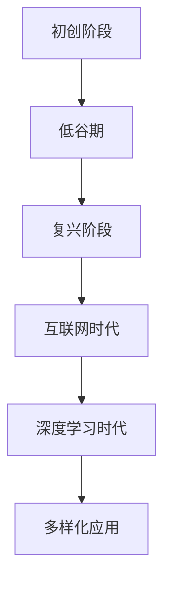
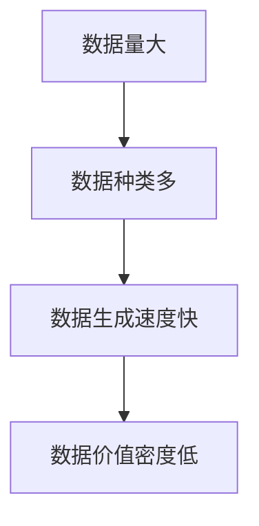
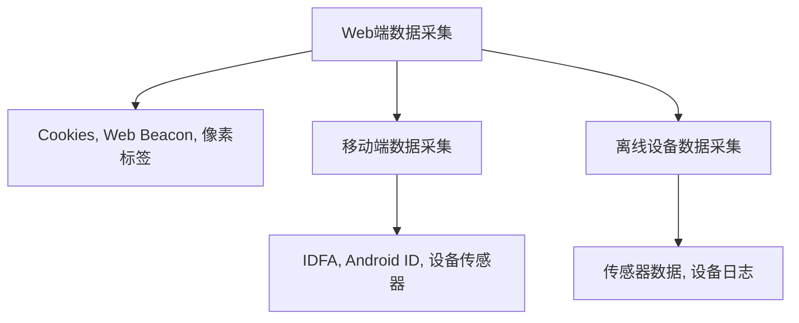
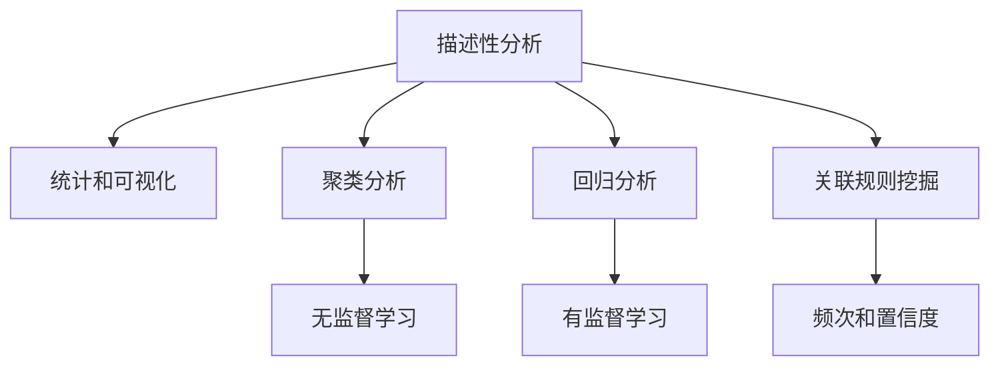
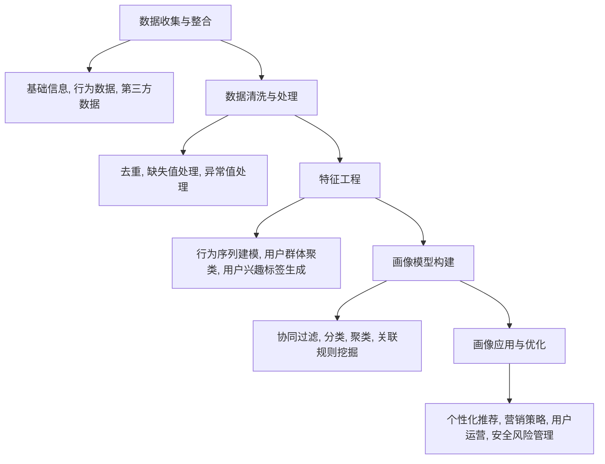
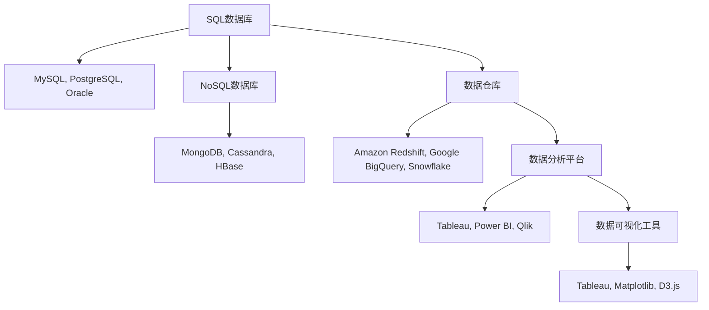

                 

## 文章标题: AI创业公司的用户数据采集与分析：用户行为数据采集与分析与用户画像分析

### 关键词：用户数据采集、用户行为分析、用户画像、AI创业公司、数据分析

### 摘要：
本文详细探讨了AI创业公司在用户数据采集与分析方面的实践。首先，阐述了AI和大数据的背景知识，并介绍了用户数据采集的重要性和方法。接着，深入讨论了用户行为数据分析的方法和技术，包括时间序列分析和机器学习。随后，介绍了用户画像的概念、构建方法和应用场景。文章还涉及了数据分析工具的应用和实战案例，包括数据采集策略、实施步骤和结果分析。最后，展望了AI创业公司在用户数据采集与分析领域的未来趋势与挑战，并提出了应对策略。附录部分提供了相关工具和用户画像分析示例。

## 第1章: AI与大数据背景

### 1.1 AI技术的发展历程

人工智能（AI）作为计算机科学的一个重要分支，自20世纪50年代以来经历了多个发展阶段。以下是AI技术发展历程的简要回顾：

#### 1.1.1 初创阶段（1950-1969）

AI的概念最早由计算机科学家约翰·麦卡锡（John McCarthy）在1956年的达特茅斯会议上提出。这个阶段，AI主要集中于符号主义和知识表示的研究，代表工作包括逻辑推理系统和专家系统。

#### 1.1.2 低谷期（1974-1980）

由于AI系统的实际应用未能达到预期，以及计算资源和算法的局限性，AI研究在20世纪70年代遭遇了所谓的“AI寒冬”。这一时期，AI研究陷入了低谷，资金减少，研究兴趣下降。

#### 1.1.3 复兴阶段（1980-1990）

随着计算机硬件性能的提升和算法的改进，AI研究逐渐复兴。特别是神经网络技术的发展，为AI领域带来了新的活力。专家系统的应用也开始在医学、金融等领域取得成功。

#### 1.1.4 互联网时代（1990-2010）

互联网的普及带来了大量数据，催生了数据驱动的机器学习方法，如支持向量机（SVM）、决策树和随机森林。这一时期，机器学习和深度学习成为AI研究的热点。

#### 1.1.5 深度学习时代（2010至今）

深度学习在2010年后迅速崛起，特别是在图像识别、语音识别和自然语言处理等领域取得了突破性进展。卷积神经网络（CNN）、循环神经网络（RNN）和生成对抗网络（GAN）等模型相继被提出。

#### 1.1.6 AI技术的多样化应用

如今，AI技术已经在医疗、金融、交通、零售等多个领域得到广泛应用。例如，智能诊断系统在医疗领域的应用，自动化交易系统在金融领域的应用，自动驾驶技术在交通领域的应用等。

### 1.2 大数据时代的特点

大数据时代是指数据量、数据种类和数据生成速度都大幅提升的时代。以下是大数据时代的主要特点：

#### 1.2.1 数据量大

大数据通常指的是TB或PB级别的数据量。这种巨大的数据量使得传统的数据处理方法面临挑战，需要新的存储、处理和分析技术。

#### 1.2.2 数据种类多

大数据不仅包括结构化数据，还包括非结构化数据，如图像、音频、视频和文本等。这种多样化的数据类型使得数据分析变得更加复杂。

#### 1.2.3 数据生成速度快

随着物联网、社交媒体和移动互联网的普及，数据生成速度大大加快。实时数据处理和分析成为大数据时代的一个重要需求。

#### 1.2.4 数据的价值密度低

大数据中的信息往往隐藏在大量的噪声和冗余数据中，因此，如何从海量数据中提取有价值的信息成为一大挑战。

### 1.3 用户数据采集与分析的重要性

用户数据采集与分析是AI创业公司的重要基础。以下是用户数据采集与分析的重要性：

#### 1.3.1 优化产品与服务

通过对用户数据的采集与分析，创业公司可以深入了解用户需求和行为模式，从而优化产品功能和服务体验。例如，基于用户行为的分析，可以改进推荐系统，提高用户留存率和满意度。

#### 1.3.2 挖掘商业价值

用户数据是创业公司的重要资产，通过数据挖掘和分析，可以发现潜在的商业机会，制定精准的营销策略和商业模式。

#### 1.3.3 提升决策效率

基于数据的分析结果，创业公司可以更加科学地制定业务策略，减少决策失误，提高市场竞争力。

### 1.4 小结

AI与大数据的结合为创业公司提供了强大的数据驱动力，用户数据采集与分析成为其成功的关键。在接下来的章节中，我们将详细探讨用户数据采集的方法、用户行为数据分析以及用户画像构建，为AI创业公司的数据驱动策略提供实践指导。

### 核心概念与联系

#### AI技术发展历程的Mermaid流程图

#### 大数据时代特点的Mermaid流程图

## 第2章: 用户数据采集方法

### 2.1 数据采集渠道

用户数据采集的渠道多种多样，主要包括Web端、移动端和离线设备等。以下是这些渠道的详细描述：

#### 2.1.1 Web端

Web端数据采集是通过网站或Web应用获取用户数据的方法。常见的Web端数据采集技术包括：

- **Cookies**：Cookies是Web服务器存储在用户浏览器中的一段文本信息，用于跟踪用户行为和偏好。
- **Web Beacon**：Web Beacon是一种不可见的图像，用于监测用户行为，如页面浏览和广告点击。
- **像素标签**：像素标签是一种嵌入在网页中的代码，用于跟踪用户的浏览行为和数据传输。

#### 2.1.2 移动端

移动端数据采集是通过移动应用（App）获取用户数据的方法。常见的移动端数据采集技术包括：

- **IDFA（广告标识符）**：IDFA是iOS设备上的唯一标识符，用于追踪用户在移动设备上的行为。
- **Android ID**：Android ID是Android设备上的唯一标识符，用于跟踪用户行为和广告投放。
- **设备传感器**：移动设备的传感器（如GPS、加速度计、陀螺仪等）可以采集用户的地理位置、运动轨迹等信息。

#### 2.1.3 离线设备

离线设备数据采集是通过智能家居设备、工业设备等离线设备获取用户数据的方法。常见的离线设备数据采集技术包括：

- **传感器数据**：离线设备（如智能家居设备、工业设备）通过传感器采集环境参数、设备状态等信息。
- **设备日志**：离线设备通过日志记录设备运行状态、故障信息等。

### 2.2 数据采集工具与技术

用户数据采集工具是进行数据采集的重要手段，以下是一些常用的数据采集工具和技术：

#### 2.2.1 数据采集代理

数据采集代理是一种模拟真实用户的工具，可以模拟浏览器行为进行数据采集。常见的代理工具包括：

- **Selenium**：Selenium是一个自动化测试工具，可以通过脚本控制浏览器进行数据采集。
- **Watir**：Watir是一个基于Ruby的Web自动化框架，适用于浏览器自动化测试和数据采集。

#### 2.2.2 API接口

API接口是获取第三方平台数据的常用方法，以下是一些常用的API接口：

- **社交媒体API**：如Twitter API、Facebook API等，可以获取用户发布的内容、互动数据等。
- **电商API**：如Amazon API、Etsy API等，可以获取商品信息、用户购买记录等。

#### 2.2.3 数据爬虫

数据爬虫是一种自动抓取互联网数据的工具，以下是一些常用的数据爬虫工具：

- **Scrapy**：Scrapy是一个强大的Python爬虫框架，适用于大规模数据采集。
- **BeautifulSoup**：BeautifulSoup是一个Python库，用于解析HTML和XML文档，适用于网页数据采集。

### 2.3 用户隐私保护与法律法规

用户隐私保护是数据采集过程中必须重视的问题，以下是一些用户隐私保护的措施和法律法规：

#### 2.3.1 数据匿名化

数据匿名化是将用户数据中的个人身份信息去除，以保护用户隐私。常用的数据匿名化技术包括：

- **K-匿名**：将数据中的敏感信息替换为随机值，确保单个记录的隐私性。
- **l-diversity**：确保在任意k个记录中，都不存在包含少于k个真实信息的记录。

#### 2.3.2 用户同意

在采集用户数据之前，必须获得用户的明确同意。用户同意通常通过在线协议、隐私政策等方式进行。

#### 2.3.3 法律法规

不同国家和地区有不同的隐私保护法律法规，以下是一些常见的法律法规：

- **欧盟的《通用数据保护条例》（GDPR）**：规定了数据收集、处理和存储的要求，以及对用户隐私的保护。
- **美国的《加州消费者隐私法案》（CCPA）**：规定了消费者对个人数据拥有知情权和删除权。

### 2.4 小结

用户数据采集是AI创业公司的重要工作，通过多种数据采集渠道和工具，可以全面获取用户数据。同时，用户隐私保护和法律法规的遵守是数据采集过程中不可忽视的重要环节。在接下来的章节中，我们将进一步探讨用户行为数据分析的方法和用户画像的构建与应用。

### 核心概念与联系

#### 用户数据采集方法的Mermaid流程图

## 第3章: 用户行为数据分析

### 3.1 用户行为数据分析概述

用户行为数据分析是指通过对用户在互联网或移动应用中的行为数据进行收集、处理和分析，以获取用户行为模式、偏好和需求的过程。用户行为数据分析在商业决策、产品优化和用户体验提升等方面具有重要意义。

#### 3.1.1 用户行为数据分析的目标

用户行为数据分析的目标主要包括：

- 了解用户行为模式：通过分析用户行为数据，可以了解用户在互联网或移动应用中的行为习惯，如浏览时间、访问频率、互动行为等。
- 挖掘用户需求：通过用户行为数据分析，可以挖掘用户的需求和偏好，为企业提供产品优化和营销策略的依据。
- 优化用户体验：基于用户行为数据分析，企业可以针对性地优化产品功能和服务，提升用户体验和满意度。
- 提高业务效益：通过用户行为数据分析，企业可以优化资源配置、降低运营成本，从而提高业务效益。

#### 3.1.2 用户行为数据分析的方法

用户行为数据分析的方法主要包括描述性分析、聚类分析、回归分析和关联规则挖掘等。

- **描述性分析**：描述性分析是一种基本的数据分析方法，通过对用户行为数据进行统计和可视化，了解用户的基本行为特征和分布情况。
- **聚类分析**：聚类分析是一种无监督学习方法，通过对用户行为数据进行聚类，发现用户群体和用户特征。
- **回归分析**：回归分析是一种有监督学习方法，通过建立用户行为数据与目标变量之间的回归模型，预测用户行为或需求。
- **关联规则挖掘**：关联规则挖掘是一种基于频次和置信度来发现数据之间关联关系的方法，可以用于推荐系统和广告投放策略的优化。

### 3.2 基于时间序列的用户行为分析

基于时间序列的用户行为分析是一种通过分析用户行为数据的时间序列特性，挖掘用户行为的动态变化和趋势的方法。时间序列分析在用户行为数据分析中具有重要作用。

#### 3.2.1 时间序列分析的基本概念

时间序列分析涉及以下基本概念：

- **随机过程**：时间序列可以看作是一个随机过程，其每个观测值都是随机变量。
- **自相关性**：时间序列中的当前值与之前值之间存在相关性，称为自相关性。
- **趋势**：时间序列的长期变化趋势，可以是上升、下降或平稳。
- **季节性**：时间序列中的周期性波动，通常与季节性因素相关。

#### 3.2.2 基于时间序列的用户行为分析模型

常见的基于时间序列的用户行为分析模型包括：

- **ARIMA模型（自回归积分滑动平均模型）**：ARIMA模型通过自回归、差分和移动平均等方法，分析时间序列数据。
- **LSTM模型（长短时记忆模型）**：LSTM模型是一种循环神经网络（RNN）的变体，能够有效地捕捉时间序列数据中的长期依赖关系。
- **GRU模型（门控循环单元）**：GRU模型是LSTM模型的简化版本，通过引入门控机制，提高模型的计算效率和性能。
- **Prophet模型**：Prophet模型是一种基于统计方法和机器学习的混合模型，可以处理具有季节性和趋势性的时间序列数据。

#### 3.2.3 基于时间序列的用户行为分析案例

以下是一个基于时间序列的用户行为分析案例：

假设某电商平台的用户点击行为数据如下表所示：

| 时间 | 点击量 |
| --- | --- |
| 2023-01-01 | 100 |
| 2023-01-02 | 120 |
| 2023-01-03 | 90 |
| 2023-01-04 | 150 |
| 2023-01-05 | 130 |
| 2023-01-06 | 110 |

1. **数据预处理**：将时间数据转换为日期格式，并计算每天的平均点击量。

2. **时间序列建模**：使用LSTM模型进行时间序列预测，训练模型并评估预测效果。

3. **结果分析**：根据预测结果，分析用户点击行为的趋势和周期性波动。

### 3.3 基于机器学习的用户行为分析

基于机器学习的用户行为分析是一种利用机器学习算法对用户行为数据进行建模和预测的方法，它可以有效地捕捉用户行为的复杂模式和关联性。

#### 3.3.1 机器学习的基本概念

机器学习是指通过计算机程序从数据中学习规律和模式，并利用这些规律和模式进行预测和决策的过程。机器学习的基本概念包括：

- **特征工程**：特征工程是机器学习过程中的一项重要任务，它通过对数据进行预处理、转换和特征提取，提高模型的效果和泛化能力。
- **模型选择**：模型选择是指选择合适的机器学习算法和模型结构，以适应特定的数据集和应用场景。
- **模型评估**：模型评估是评价机器学习模型性能和效果的过程，常用的评估指标包括准确率、召回率、F1分数等。

#### 3.3.2 基于机器学习的用户行为分析模型

常见的基于机器学习的用户行为分析模型包括：

- **决策树**：决策树是一种基于树结构的分类算法，可以有效地捕捉用户行为的条件关系。
- **随机森林**：随机森林是决策树的集成算法，通过构建多棵决策树，提高模型的预测能力和鲁棒性。
- **支持向量机**：支持向量机是一种监督学习算法，可以通过寻找最佳超平面，对用户行为进行分类和预测。
- **神经网络**：神经网络是一种基于模拟人脑神经元结构的算法，可以处理复杂的非线性用户行为数据。

#### 3.3.3 基于机器学习的用户行为分析案例

以下是一个基于机器学习的用户行为分析案例：

假设某电商平台的用户购买行为数据如下表所示：

| 用户ID | 产品ID | 购买时间 |
| --- | --- | --- |
| 1 | 101 | 2023-01-01 |
| 1 | 102 | 2023-01-02 |
| 2 | 103 | 2023-01-03 |
| 3 | 104 | 2023-01-04 |
| 3 | 105 | 2023-01-05 |

1. **数据预处理**：对用户购买行为数据进行清洗和转换，提取特征，例如用户ID、产品ID、购买时间间隔等。

2. **模型训练**：使用随机森林模型对用户购买行为数据进行训练，建立预测模型。

3. **结果分析**：根据训练得到的模型，预测新用户的购买行为，并评估模型的预测效果。

### 3.4 小结

用户行为数据分析是AI创业公司的重要工具，通过描述性分析、聚类分析、回归分析和关联规则挖掘等方法，可以深入了解用户行为模式、偏好和需求。基于时间序列和机器学习的用户行为分析模型，可以更加精准地预测用户行为和需求。在接下来的章节中，我们将进一步探讨用户画像的构建方法及其应用场景。

### 核心概念与联系

#### 用户行为数据分析方法的Mermaid流程图

## 第4章: 用户画像构建

### 4.1 用户画像的概念与作用

用户画像是指通过对用户行为数据进行收集、处理和分析，构建出用户的基本特征、偏好和需求的描述模型。用户画像在多个领域具有广泛的应用，其核心作用包括：

#### 4.1.1 个性化推荐

用户画像可以帮助平台根据用户的兴趣和行为特征，推荐符合用户需求的产品、内容和服务。例如，电商平台的推荐系统可以根据用户的浏览历史和购买记录，为用户提供个性化的商品推荐。

#### 4.1.2 营销策略制定

通过分析用户画像，企业可以了解目标用户群体的特征和需求，制定有针对性的营销策略。例如，保险公司可以根据用户的年龄、收入和健康状况等信息，为不同用户群体设计个性化的保险产品和服务。

#### 4.1.3 用户行为预测

用户画像可以帮助企业预测用户的行为和需求，提前采取措施，优化产品和服务。例如，酒店可以根据用户的入住时间、消费习惯等信息，预测用户的预订需求，提前预留房间。

#### 4.1.4 用户体验优化

用户画像可以为企业提供用户需求的实时反馈，帮助企业优化产品功能和用户体验。例如，游戏公司可以根据用户的游戏行为和偏好，调整游戏难度和奖励机制，提升用户的游戏体验。

### 4.2 用户画像构建方法

用户画像构建的主要方法包括以下几种：

#### 4.2.1 数据收集与整合

用户画像的构建首先需要收集用户的基础信息、行为数据和第三方数据。基础信息包括用户的年龄、性别、地理位置等；行为数据包括用户的浏览历史、购买记录、互动行为等；第三方数据可以从社交平台、搜索引擎等渠道获取。

#### 4.2.2 数据清洗与处理

收集到的用户数据通常存在缺失值、异常值和噪声等问题，需要进行数据清洗与处理。数据清洗包括去除重复数据、填充缺失值、去除异常值等；数据处理包括数据转换、归一化、特征提取等。

#### 4.2.3 特征工程

特征工程是用户画像构建的关键环节，通过对用户数据进行分析和转换，提取出对用户行为有较强影响力的特征。常见的特征工程方法包括用户行为序列建模、用户群体聚类、用户兴趣标签生成等。

#### 4.2.4 画像模型构建

画像模型构建是用户画像的最终步骤，通过机器学习算法对用户特征进行建模，生成用户画像。常见的画像模型包括协同过滤、分类、聚类、关联规则挖掘等。

#### 4.2.5 画像应用与优化

用户画像构建完成后，需要将其应用于实际业务场景，例如个性化推荐、营销策略制定等。通过实时监测和应用效果，不断优化和调整用户画像模型，提高画像的准确性和实用性。

### 4.3 用户画像应用场景

用户画像在多个领域具有广泛的应用，以下是一些典型的应用场景：

#### 4.3.1 个性化推荐系统

个性化推荐系统是用户画像最典型的应用场景之一。通过用户画像，推荐系统可以根据用户的兴趣和行为特征，为用户提供个性化的推荐结果，提高用户的满意度和粘性。

#### 4.3.2 营销活动策划

用户画像可以帮助企业了解目标用户群体的特征和需求，制定有针对性的营销活动。例如，电商平台可以根据用户的购买记录和兴趣标签，为不同用户群体设计个性化的促销活动。

#### 4.3.3 用户运营管理

用户画像可以为企业提供用户需求的实时反馈，帮助企业优化用户运营策略。例如，游戏公司可以根据用户的游戏行为和偏好，调整游戏难度、奖励机制等，提升用户的游戏体验。

#### 4.3.4 安全风险管理

用户画像可以帮助企业识别高风险用户，采取相应的风险管理措施。例如，金融机构可以通过用户画像，识别潜在的欺诈行为，降低欺诈风险。

### 4.4 用户画像分析示例

以下是一个用户画像分析示例：

假设某电商平台的用户数据如下表所示：

| 用户ID | 年龄 | 性别 | 地理位置 | 购买商品1 | 购买商品2 | 购买商品3 |
| --- | --- | --- | --- | --- | --- | --- |
| 1 | 25 | 男 | 北京 | 电子产品 | 服装 | 食品 |
| 2 | 30 | 女 | 上海 | 服装 | 电子产品 | 家居用品 |
| 3 | 35 | 女 | 深圳 | 电子产品 | 食品 | 服装 |

根据以上数据，可以进行以下分析：

1. **用户群体划分**：
   - 根据年龄、性别和地理位置，可以将用户划分为不同的群体，例如：
     - 25-35岁，男性，北京用户
     - 30-35岁，女性，上海用户
     - 35岁以上，女性，深圳用户

2. **用户兴趣标签生成**：
   - 根据购买商品，可以为每个用户生成兴趣标签，例如：
     - 用户1：电子产品、服装、食品
     - 用户2：服装、电子产品、家居用品
     - 用户3：电子产品、食品、服装

3. **个性化推荐**：
   - 根据用户的兴趣标签，可以为用户推荐相关的商品，例如：
     - 用户1：推荐电子产品、服装、食品相关的商品
     - 用户2：推荐服装、电子产品、家居用品相关的商品
     - 用户3：推荐电子产品、食品、服装相关的商品

4. **营销活动策划**：
   - 根据用户群体的特征和需求，可以制定有针对性的营销活动，例如：
     - 针对25-35岁，男性，北京用户：举办电子产品促销活动
     - 针对30-35岁，女性，上海用户：举办服装促销活动
     - 针对35岁以上，女性，深圳用户：举办食品促销活动

### 4.5 小结

用户画像构建是AI创业公司的重要工作，通过对用户数据的分析，可以构建出用户的基本特征、偏好和需求描述模型，从而为企业提供个性化推荐、营销策略制定和用户体验优化等支持。在接下来的章节中，我们将进一步探讨数据分析工具的应用和实践案例。

### 核心概念与联系

#### 用户画像构建方法的Mermaid流程图

## 第5章: 数据分析工具与应用

### 5.1 常用数据分析工具

数据分析工具是进行用户数据采集、处理和分析的重要工具。以下是一些常用的数据分析工具：

#### 5.1.1 SQL数据库

SQL数据库是一种关系型数据库管理系统，用于存储、管理和查询结构化数据。常见的SQL数据库包括MySQL、PostgreSQL、Oracle等。

- **MySQL**：MySQL是一种开源的关系型数据库管理系统，适用于中小型企业的数据存储和管理。
- **PostgreSQL**：PostgreSQL是一种开源的关系型数据库管理系统，具有强大的扩展性和灵活性。
- **Oracle**：Oracle是一种商业级的关系型数据库管理系统，适用于大规模企业的数据存储和管理。

#### 5.1.2 NoSQL数据库

NoSQL数据库是一种非关系型数据库管理系统，适用于存储大规模的非结构化数据。常见的NoSQL数据库包括MongoDB、Cassandra、HBase等。

- **MongoDB**：MongoDB是一种开源的文档型数据库，适用于存储大规模的非结构化数据。
- **Cassandra**：Cassandra是一种开源的分布式列存储数据库，适用于实时数据存储和分析。
- **HBase**：HBase是一种开源的分布式存储系统，基于Hadoop平台，适用于大规模数据的存储和分析。

#### 5.1.3 数据仓库

数据仓库是一种用于存储和管理大规模数据集的数据库系统，主要用于支持企业级的数据分析和报告。常见的数据仓库解决方案包括Amazon Redshift、Google BigQuery、Snowflake等。

- **Amazon Redshift**：Amazon Redshift是一种云数据仓库服务，适用于大规模数据的存储和分析。
- **Google BigQuery**：Google BigQuery是一种云数据仓库服务，提供快速、可靠和低成本的数据分析。
- **Snowflake**：Snowflake是一种云数据仓库服务，具有灵活的数据存储和处理能力。

#### 5.1.4 数据分析平台

数据分析平台是一种集成多种数据分析工具和功能的软件平台，用于支持数据采集、处理、分析和可视化。常见的数据分析平台包括Tableau、Power BI、Qlik等。

- **Tableau**：Tableau是一种交互式数据分析工具，适用于创建交互式图表、仪表板和报告。
- **Power BI**：Power BI是微软推出的数据分析平台，提供丰富的数据可视化功能。
- **Qlik**：Qlik是一种高级数据分析平台，适用于实时数据分析和报告生成。

### 5.2 数据可视化

数据可视化是将数据以图形、图像、图表等形式展示出来的过程，帮助用户直观地理解和分析数据。以下是一些常见的数据可视化工具：

#### 5.2.1 Tableau

Tableau是一种常用的数据可视化工具，适用于创建交互式图表、仪表板和报告。Tableau支持多种数据源，包括SQL数据库、NoSQL数据库、数据仓库等。

- **交互式图表**：Tableau支持多种图表类型，如柱状图、折线图、饼图等，用户可以自定义图表样式和交互效果。
- **仪表板**：Tableau允许用户创建仪表板，将多个图表和数据表整合在一起，提供全面的视图和分析。
- **数据故事**：Tableau支持创建数据故事，通过视频、图像和文本等多媒体元素，讲述数据背后的故事。

#### 5.2.2 Power BI

Power BI是微软推出的数据分析平台，提供丰富的数据可视化功能，支持自定义图表和仪表板。Power BI与Microsoft Office和Azure平台紧密集成，方便用户进行数据分析和报告。

- **自定义图表**：Power BI支持多种图表类型，用户可以根据需要自定义图表样式和交互效果。
- **仪表板**：Power BI允许用户创建仪表板，将多个图表和数据表整合在一起，提供全面的视图和分析。
- **报告**：Power BI支持创建详细的数据报告，包括图表、文本和图像等，适用于多种场景。

#### 5.2.3 Matplotlib

Matplotlib是Python的一种数据可视化库，适用于创建高质量的2D和3D图表。Matplotlib可以与Python的其他数据分析和机器学习库（如Pandas、Scikit-learn）结合使用，进行复杂的数据可视化。

- **2D图表**：Matplotlib支持多种2D图表类型，如柱状图、折线图、散点图等，用户可以自定义图表样式和交互效果。
- **3D图表**：Matplotlib支持3D图表，用户可以创建3D柱状图、3D曲面图等，提供更丰富的可视化效果。
- **自定义样式**：Matplotlib允许用户自定义图表样式，包括颜色、线型、标记等，以满足不同的需求。

#### 5.2.4 D3.js

D3.js是一个基于JavaScript的数据可视化库，适用于创建交互式和动态的图表。D3.js支持多种图表类型和数据格式，可以与HTML、SVG和CSS结合使用，进行复杂的数据可视化。

- **交互式图表**：D3.js支持多种交互式图表，如动态折线图、交互式散点图等，用户可以自定义交互效果和交互逻辑。
- **动态图表**：D3.js支持动态数据更新，用户可以实时更新图表数据，实现动态可视化效果。
- **数据绑定**：D3.js支持数据绑定，用户可以将数据与DOM元素绑定，实现数据的动态渲染和交互。

### 5.3 用户数据采集与分析实战

以下是一个用户数据采集与分析的实战案例：

#### 5.3.1 项目背景

某电商平台的用户数据量庞大，需要通过对用户数据进行采集、处理和分析，优化产品推荐系统和用户体验。

#### 5.3.2 数据采集

- 数据采集渠道：电商平台官网、移动APP、社交媒体等。
- 数据采集工具：使用代理工具（如Selenium）爬取网页数据，使用API接口获取第三方平台数据。

#### 5.3.3 数据处理

- 数据预处理：清洗和转换原始数据，去除重复数据、填充缺失值、进行数据归一化等。
- 数据整合：将不同来源的数据进行整合，建立统一的数据仓库。

#### 5.3.4 数据分析

- 用户行为分析：通过描述性分析、聚类分析等方法，了解用户的基本行为特征和群体划分。
- 用户画像构建：基于用户行为数据和基本信息，构建用户画像模型，生成用户的兴趣标签。
- 个性化推荐：根据用户画像，为用户推荐个性化的商品和内容。

#### 5.3.5 数据可视化

- 使用Tableau创建交互式图表和仪表板，展示用户行为数据、用户画像和推荐结果。
- 使用Matplotlib创建高质量的2D和3D图表，分析用户行为数据的趋势和变化。

#### 5.3.6 结果分析

- 通过用户行为分析和用户画像构建，发现用户的浏览历史、购买记录和搜索关键词等行为特征与推荐系统的转化率存在显著关联。
- 根据个性化推荐结果，评估推荐系统的效果和用户满意度。
- 提出优化建议，如改进推荐算法、调整推荐策略等，以提升用户体验和业务效益。

### 5.4 小结

数据分析工具在用户数据采集与分析过程中发挥着重要作用。通过使用SQL数据库、NoSQL数据库、数据仓库和数据分析平台等工具，可以有效地管理和分析用户数据，为企业的业务决策提供支持。数据可视化工具则帮助用户直观地理解和分析数据，从而实现数据驱动的业务优化。在接下来的章节中，我们将进一步探讨用户数据采集与分析的具体应用和实践案例。

### 核心概念与联系

#### 数据分析工具与应用的Mermaid流程图

## 第6章: AI创业公司用户数据采集实战

### 6.1 创业公司用户数据采集策略

AI创业公司在进行用户数据采集时，需要制定一套全面的策略，以确保数据的质量、合法性和安全性。以下是几个关键策略：

#### 6.1.1 明确数据采集目标

创业公司在开始数据采集之前，首先要明确数据采集的目标，包括需要采集的数据类型、数据质量和数据用途。例如，目标是优化推荐系统，需要采集用户的行为数据、兴趣数据等。

#### 6.1.2 选择合适的采集渠道

根据业务需求和用户特点，选择合适的用户数据采集渠道。常见的渠道包括Web端、移动端、离线设备等。每种渠道都有其优缺点，需要根据实际情况进行选择。

#### 6.1.3 遵守隐私保护法规

用户数据采集必须遵守相关的隐私保护法规，如《通用数据保护条例》（GDPR）、《加州消费者隐私法案》（CCPA）等。确保用户数据的合法性、安全性和保密性，是创业公司的责任。

#### 6.1.4 数据匿名化处理

在数据采集过程中，应尽可能对数据进行匿名化处理，以保护用户的隐私。例如，使用哈希算法对用户ID进行加密，或者仅保留用户行为的聚合数据，避免泄露个人身份信息。

#### 6.1.5 定期审计和更新策略

创业公司应定期对用户数据采集策略进行审计和更新，确保其符合最新的法律法规和技术发展趋势。例如，随着技术的进步，可能需要引入新的数据采集工具和技术。

### 6.2 用户数据采集实施步骤

用户数据采集的实施可以分为以下几个步骤：

#### 6.2.1 数据需求分析

在开始数据采集之前，需要进行详细的数据需求分析，明确需要采集的数据类型、数据量和数据频率等。数据需求分析的结果将指导后续的数据采集工作。

#### 6.2

