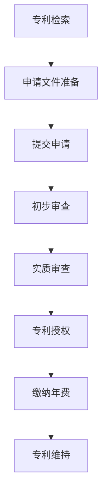
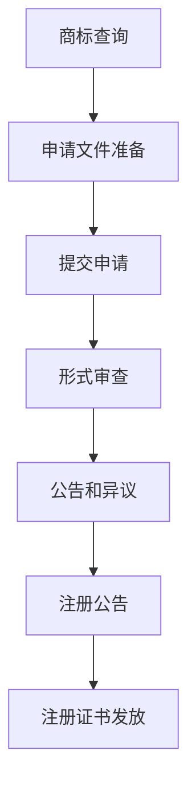

                 

## 文章标题

《AI创业公司的知识产权战略实施：专利申请、商标注册与技术保护》

---

关键词：AI创业公司、知识产权战略、专利申请、商标注册、技术保护

摘要：本文深入探讨了AI创业公司在发展过程中如何制定并实施知识产权战略，包括专利申请、商标注册和技术保护。通过详细分析各环节的核心概念、策略和实际案例，为AI创业公司提供实用的指导和建议，以保护其创新成果和市场竞争力。

---

## 第1章 引言

### 1.1 AI创业公司的知识产权战略的重要性

在当今竞争激烈的技术市场中，AI创业公司面临着前所未有的挑战与机遇。知识产权（Intellectual Property，简称IP）作为企业核心资产，对于公司的生存和发展至关重要。知识产权战略是AI创业公司保护自身创新成果、提高市场竞争力、规避法律风险、实现长期发展的关键手段。

首先，知识产权战略有助于保护公司的核心技术和产品。通过专利申请、商标注册等技术手段，AI创业公司可以有效地防止竞争对手模仿和抄袭，确保自身在市场中的竞争优势。其次，知识产权战略能够提升公司的品牌价值。在品牌建设过程中，商标等知识产权的注册和保护至关重要，有助于建立品牌知名度和美誉度，增加客户信任和忠诚度。

此外，知识产权战略还能够为AI创业公司提供融资支持和市场扩展机会。在融资过程中，知识产权作为企业的无形资产，可以增强投资者的信心，提高融资成功率。在市场扩展方面，通过专利许可、商标授权等途径，AI创业公司可以快速进入新市场，拓展业务范围，实现规模效应。

### 1.2 知识产权战略在AI创业公司中的角色

知识产权战略在AI创业公司的发展中扮演着多重角色，具体体现在以下几个方面：

1. **技术创新保护**：通过专利申请，AI创业公司可以保护其技术创新成果，防止竞争对手抄袭或侵权。专利申请不仅能够保护公司的核心技术，还能够为公司带来潜在的商业价值，如许可收入和授权费用。

2. **品牌建设**：商标注册是品牌建设的重要组成部分。一个具有辨识度的商标能够帮助公司在市场中脱颖而出，树立良好的品牌形象。通过商标注册，AI创业公司可以合法地使用和保护其商标，防止他人恶意抢注或侵权。

3. **市场竞争**：知识产权战略有助于提高公司的市场竞争力。通过合理运用知识产权，AI创业公司可以在市场上形成差异化优势，吸引更多的客户和合作伙伴。此外，知识产权还可以作为谈判筹码，增强公司在商业合作中的地位。

4. **法律风险规避**：知识产权战略可以帮助AI创业公司规避法律风险。通过了解和遵守相关法律法规，公司可以避免因侵权等行为而遭受诉讼和罚款。同时，公司还可以通过专利池等方式，降低潜在的法律风险。

### 1.3 书籍结构概述

本文将围绕AI创业公司的知识产权战略实施，分为以下七个章节：

- **第1章 引言**：介绍AI创业公司知识产权战略的重要性及其在企业发展中的角色。
- **第2章 知识产权基础知识**：讲解知识产权的定义、类型和相关法律法规。
- **第3章 专利申请策略**：详细分析专利申请的流程、策略和案例。
- **第4章 商标注册策略**：探讨商标注册的流程、策略和案例。
- **第5章 技术保护策略**：介绍技术秘密保护、软件版权保护和网络安全策略。
- **第6章 知识产权管理**：阐述知识产权管理的定义、目标、工具和技术。
- **第7章 知识产权战略实施案例**：通过实际案例，展示知识产权战略的实施效果。
- **第8章 未来展望**：分析知识产权战略的未来发展趋势和创业公司的挑战与机遇。
- **第9章 附录**：提供知识产权相关法律法规摘要、工具与资源推荐。
- **第10章 参考文献与推荐阅读**：列出参考文献和推荐阅读，以供进一步学习。

通过本文的详细分析和探讨，希望能够为AI创业公司提供有益的指导和启示，帮助其在知识产权领域取得成功，实现持续发展。

---

接下来，我们将进入第二章节，对知识产权的相关基础知识进行深入讲解，为后续内容奠定基础。敬请期待！

---

## 第2章 知识产权基础知识

知识产权是指人们通过智力劳动创造的成果，以及由这些成果产生的权利。根据《中华人民共和国知识产权法》的规定，知识产权主要包括专利权、商标权、著作权（版权）和商业秘密等。下面，我们将逐一介绍这些知识产权的定义、类型及其法律保护。

### 2.1.1 专利

专利是指对发明创造所享有的独占权利。根据《专利法》的规定，专利分为三种类型：发明专利、实用新型专利和外观设计专利。

- **发明专利**：对产品、方法或者其改进所提出的新的技术方案，具有创新性、实用性和先进性。
- **实用新型专利**：对产品的形状、构造或者其结合所提出的适于实用的新的技术方案。
- **外观设计专利**：对产品的形状、图案或者其结合以及色彩与形状、图案的结合所作出的富有美感并适于工业应用的新设计。

专利的法律保护期为20年，从申请日起计算。在专利有效期内，任何单位或个人未经专利权人许可，不得实施专利，否则将构成侵权。

### 2.1.2 商标

商标是指用于区别商品或服务来源的标志。根据《商标法》的规定，商标可以是文字、图形、字母、数字、三维标志、颜色组合等，或者上述要素的组合。

商标的法律保护期为10年，从核准注册日起计算。商标注册人可以根据需要无限次申请续展，每次续展期为10年。在商标有效期内，任何单位或个人未经商标权人许可，不得在相同或类似商品或服务上使用相同或近似的商标，否则将构成侵权。

### 2.1.3 著作权

著作权是指对作品享有的权利。根据《著作权法》的规定，作品包括文字作品、口述作品、音乐、戏剧、曲艺、舞蹈、杂技艺术、美术、摄影、电影、工程设计图等。

著作权包括人身权和财产权两大类：

- **人身权**：包括发表权、署名权、修改权、保护作品完整权等。
- **财产权**：包括复制权、发行权、出租权、展览权、表演权、放映权、广播权、信息网络传播权等。

著作权的保护期为作者终生及其死亡后50年，截止于作者死亡后第50年的12月31日。对于法人或其他组织创作的作品，保护期为作品首次发表后50年。

### 2.1.4 设计专利

设计专利是对产品外观设计的保护。根据《专利法》的规定，设计专利是指对产品的形状、图案或者其结合以及色彩与形状、图案的结合所作出的富有美感并适于工业应用的新设计。

设计专利的法律保护期为15年，从申请日起计算。设计专利同样受到《专利法》的保护，未经专利权人许可，不得实施专利，否则将构成侵权。

### 2.1.5 商业秘密

商业秘密是指不为公众所知悉、具有商业价值并经权利人采取保密措施的技术信息和经营信息。根据《反不正当竞争法》的规定，商业秘密包括技术秘密、经营秘密、客户名单、商业计划等。

商业秘密的保护期限没有明确规定，但其保护依赖于权利人的保密措施。一旦权利人的保密措施失效，商业秘密将失去法律保护。

### 2.1.6 法律保护与维权

知识产权的法律保护是国家法律制度的重要组成部分。为了保护知识产权，各国都制定了相应的法律法规，如《专利法》、《商标法》、《著作权法》等。知识产权的权利人可以通过以下途径维权：

- **行政保护**：向相关行政机关投诉，请求行政机关进行调查和处理。
- **司法保护**：向人民法院提起诉讼，通过司法程序解决侵权纠纷。
- **调解仲裁**：通过调解机构或仲裁机构进行调解或仲裁，解决侵权纠纷。

通过上述手段，知识产权权利人可以有效地保护其知识产权，维护其合法权益。

总之，知识产权是企业核心竞争力的重要体现。通过了解和掌握知识产权的相关知识，AI创业公司可以更好地制定和实施知识产权战略，保护其创新成果，提高市场竞争力。在接下来的章节中，我们将进一步探讨专利申请、商标注册和技术保护的策略和实践，为AI创业公司提供更加详细的指导。

---

在了解了知识产权的基础知识之后，我们将在接下来的章节中详细探讨AI创业公司如何制定和实施专利申请、商标注册和技术保护的策略。敬请关注后续内容！

---

## 第3章 专利申请策略

专利申请是AI创业公司保护技术创新成果的重要手段。合理的专利申请策略能够帮助公司在市场竞争中占据有利地位，提高核心竞争力。本章将详细分析专利申请的流程、策略以及实际案例，以期为AI创业公司提供有益的指导。

### 3.1 专利申请流程

专利申请流程主要包括以下几个步骤：

1. **专利检索**：在正式提交专利申请之前，进行专利检索是必要的。通过检索，可以了解相关技术领域的技术发展趋势、已有专利的布局情况，以及是否存在与拟申请专利相同或相近的技术。这有助于评估申请专利的可行性，避免重复申请和侵权风险。

2. **专利申请文件的撰写**：专利申请文件包括专利请求书、说明书、权利要求书、摘要以及附图等。其中，说明书和权利要求书是核心部分。说明书应详细描述发明内容，包括技术背景、发明内容、实施方式等；权利要求书则明确了专利的保护范围。

3. **专利申请的提交**：将准备好的专利申请文件提交至国家知识产权局或国际知识产权组织。在中国，专利申请应提交至国家知识产权局。在国际上，可以选择通过《专利合作条约》（PCT）途径进行国际申请。

4. **专利申请的审查**：专利申请提交后，将进入审查阶段。审查包括初步审查和实质审查。初步审查主要审查申请文件是否符合形式要求；实质审查则对发明的新颖性、创造性和实用性进行审查。

5. **专利授权**：通过审查的专利申请将被授权为专利。专利权人将在规定时间内支付授权费用，否则专利申请将被撤销。

### 3.2 专利申请策略

在专利申请过程中，合理的策略至关重要。以下是一些常见的专利申请策略：

1. **专利挖掘与布局**：专利挖掘是指从已有的技术成果中寻找潜在的专利点。通过系统性的技术分析和研究，可以发现并挖掘出具有创新性和保护价值的技术方案。专利布局则是对挖掘出的专利点进行系统化的规划和部署，以形成专利网，提高公司的专利覆盖范围和保护力度。

2. **专利申请的时机与节奏**：专利申请的时机和节奏对专利保护效果有重要影响。过早申请可能导致竞争对手提前布局，过晚申请则可能丧失部分保护机会。因此，AI创业公司应结合自身技术发展进程和市场战略，合理安排专利申请的时机和节奏。

3. **专利申请的成本控制**：专利申请需要投入大量的人力和财力资源。因此，在申请过程中，应尽量控制成本，避免不必要的浪费。可以通过以下措施来实现成本控制：
    - **优先考虑核心技术和关键领域**：对公司的核心技术和关键领域进行重点保护，避免在非关键领域过度投入。
    - **优化专利申请文件**：通过提高申请文件的质量，减少审查过程中的反复修改，降低成本。
    - **利用国际申请**：通过PCT途径进行国际申请，可以在一定时间内享受临时保护，降低专利申请成本。

4. **专利组合管理**：专利组合管理是指通过建立和管理一个多样化的专利组合，提高公司的市场竞争力和风险承受能力。通过合理组合专利，可以形成互补和交叉保护，降低专利侵权风险，同时增强公司在谈判中的筹码。

### 3.3 专利申请案例解析

以下是一个实际案例，展示AI创业公司如何通过专利申请策略保护技术创新成果：

**案例背景**：某AI创业公司研发了一种基于深度学习的图像识别算法，该算法在图像识别精度和速度方面具有显著优势。公司希望通过专利申请保护其核心技术，防止竞争对手抄袭和侵权。

**解决方案**：

1. **专利挖掘与布局**：公司首先对已有的技术文献和专利进行分析，发现相关技术领域已经有一些专利，但多数专利主要集中在图像识别的特定方面。通过技术分析和研究，公司挖掘出多个具有创新性的专利点，包括图像预处理、特征提取、模型训练等关键环节。

2. **专利申请的时机与节奏**：公司选择在技术研发取得实质性进展后，立即提交专利申请。这一策略既保证了专利的时效性，又避免了竞争对手提前布局。

3. **专利申请的成本控制**：公司通过内部培训和外部咨询，提高了专利申请文件撰写质量，减少了审查过程中的反复修改。同时，公司优先考虑核心技术和关键领域，避免在非关键领域过度投入。

4. **专利组合管理**：公司建立了一个多样化的专利组合，包括发明专利、实用新型专利和外观设计专利。通过交叉保护，公司形成了较为完善的专利网，提高了市场竞争力和风险承受能力。

**实施效果**：通过上述策略，公司成功获得了多项专利授权，有效保护了其核心技术和产品。在市场竞争中，公司凭借专利优势，取得了良好的市场份额和品牌知名度。

通过本案例，可以看出合理的专利申请策略对于AI创业公司的重要性。在专利申请过程中，公司应注重专利挖掘与布局、合理选择申请时机与节奏、控制申请成本和进行专利组合管理，以提高专利保护效果和市场竞争力。

在下一章节中，我们将继续探讨商标注册的策略和实践，为AI创业公司提供全面的知识产权保护指导。敬请期待！

---

商标注册是AI创业公司品牌建设的重要环节，它不仅有助于区分公司的产品和服务，还能提升品牌知名度和市场竞争力。本章将详细分析商标注册的流程、策略以及实际案例，以期为AI创业公司提供实用的指导。

### 4.1 商标注册流程

商标注册流程主要包括以下几个步骤：

1. **商标查询**：在正式提交商标注册申请之前，进行商标查询是必要的。通过查询，可以了解已有商标的情况，避免申请商标与在先商标相同或近似，减少商标注册风险。

2. **提交商标注册申请**：商标注册申请人需准备商标注册申请书、商标图样以及其他相关文件，并按照规定的格式和要求提交给国家知识产权局。

3. **商标审查**：商标注册申请提交后，将进入审查阶段。审查包括形式审查和实质审查。形式审查主要审查申请文件是否符合规定；实质审查则对商标的显著性、是否具有区分性以及是否与在先商标冲突等进行审查。

4. **商标公告**：通过审查的商标将进行公告，公告期为3个月。在公告期内，任何单位和个人可以对公告商标提出异议。若没有异议或异议不成立，商标将注册成功。

5. **商标注册公告**：商标注册公告期为12个月。在公告期内，商标注册申请人需按照规定缴纳注册费用，否则商标申请将被撤销。

6. **商标注册证发放**：商标注册公告期结束后，若未出现异议或异议不成立，国家知识产权局将发放商标注册证，商标注册正式生效。

### 4.2 商标注册策略

在商标注册过程中，合理的策略对于成功注册和保护商标至关重要。以下是一些常见的商标注册策略：

1. **商标品牌保护策略**：

   - **商标命名策略**：选择具有独特性、易于记忆和识别的商标名称，有助于提升品牌形象和市场竞争力。
   - **商标分类策略**：根据产品或服务的特点，选择合适的商标分类，以便更好地保护商标。
   - **商标设计策略**：设计独特的商标图案，使其具有显著性，便于区分和记忆。

2. **商标抢注与反抢注策略**：

   - **商标抢注**：在商标注册过程中，某些企业可能会恶意抢注他人商标，以谋求不正当利益。因此，AI创业公司应密切关注市场动态，及时发现和防止商标抢注行为。
   - **反抢注**：通过以下措施进行反抢注：
     - **提前注册**：在产品或服务推出前，提前申请商标注册，防止他人抢注。
     - **监控市场**：定期进行商标监控，发现商标抢注行为及时采取措施。
     - **法律维权**：通过法律手段，对恶意抢注行为进行维权，维护自身权益。

3. **商标维权策略**：

   - **商标侵权监测**：建立商标侵权监测机制，及时发现和查处侵权行为。
   - **法律维权**：对侵权行为采取法律措施，包括向行政机关投诉、提起诉讼等。
   - **跨部门合作**：与公安、市场监管等政府部门合作，共同打击商标侵权行为。

### 4.3 商标注册案例解析

以下是一个实际案例，展示AI创业公司如何通过商标注册策略保护品牌：

**案例背景**：某AI创业公司研发了一种创新的智能语音识别系统，并计划将其推向市场。公司希望通过商标注册保护其品牌，防止竞争对手抄袭和侵权。

**解决方案**：

1. **商标查询与命名**：公司首先进行了商标查询，发现已有多个与智能语音识别相关的商标。在充分分析市场和技术特点后，公司选择了一个具有独特性和区分性的商标名称，并设计了独特的商标图案。

2. **商标分类与提交申请**：根据产品特点，公司选择了第9类（软件、科学仪器等）和第38类（通讯、广播等）进行商标注册。公司按照规定格式和要求提交了商标注册申请。

3. **商标审查与公告**：商标注册申请经过形式审查和实质审查，通过了审查。在公告期内，公司未收到异议，商标注册成功。

4. **商标维权**：公司建立了商标侵权监测机制，定期监测市场动态，发现一起侵权案件。公司采取了法律措施，向行政机关投诉，并通过诉讼维护了自身权益。

**实施效果**：通过上述策略，公司成功注册了商标，有效保护了其品牌。在市场竞争中，公司凭借独特的商标品牌，赢得了良好的市场口碑和用户信任。

通过本案例，可以看出商标注册策略对于AI创业公司的重要性。在商标注册过程中，公司应注重商标命名、分类、设计以及维权策略，以确保商标的有效保护和市场竞争优势。在下一章节中，我们将探讨技术保护策略，包括技术秘密保护、软件版权保护和网络安全策略，为AI创业公司提供全面的知识产权保护方案。敬请期待！

---

技术保护是AI创业公司确保其核心竞争力不受侵犯的重要手段。本章将详细讨论技术秘密保护、软件版权保护和网络安全策略，以期为AI创业公司提供全面的技术保护指导。

### 5.1 技术秘密保护

技术秘密保护是指通过保密措施保护公司的非专利技术信息，如商业秘密、技术方案、设计图纸等。技术秘密的保护期限没有明确规定，但其保护依赖于权利人的保密措施。以下是一些关键点：

#### 5.1.1 技术秘密的定义与特性

- **定义**：技术秘密是指不为公众所知悉、具有商业价值并经权利人采取保密措施的技术信息。
- **特性**：技术秘密具有以下特性：
  - **秘密性**：技术秘密必须是不为公众所知悉的，这是其区别于专利的重要特征。
  - **商业价值**：技术秘密必须具有商业价值，否则无法形成权利人的竞争优势。
  - **保密性**：技术秘密的保护依赖于权利人采取的保密措施，包括合同、规章制度、培训等。

#### 5.1.2 技术秘密的保护措施

- **合同保护**：权利人与员工、合作伙伴签订保密协议，明确保密义务和违约责任，确保技术秘密不被泄露。
- **规章制度**：制定内部保密规章制度，明确保密范围、保密责任和保密措施，规范员工行为。
- **培训与教育**：对员工进行保密培训，提高员工的保密意识和技能，防止无意中泄露技术秘密。
- **技术保护**：采用技术手段，如加密、访问控制、备份等，保护技术秘密的安全性。
- **监控与审计**：建立监控和审计机制，定期检查技术秘密的保护情况，及时发现和纠正隐患。

#### 5.1.3 技术秘密泄露的风险与管理

- **风险**：技术秘密泄露可能导致以下风险：
  - **竞争优势丧失**：技术秘密泄露会使竞争对手获取公司的核心技术，降低公司的市场竞争力。
  - **商业损失**：技术秘密泄露可能导致商业机密泄露，给公司带来经济损失。
  - **法律责任**：权利人可能因违反保密协议而承担法律责任。

- **管理**：
  - **风险评估**：定期进行技术秘密泄露风险评估，识别潜在风险点，制定相应的防范措施。
  - **信息分类**：对技术秘密进行分类管理，根据其重要性采取不同的保护措施。
  - **法律维权**：对技术秘密泄露行为采取法律措施，包括投诉、诉讼等，维护自身权益。

### 5.2 软件版权保护

软件版权保护是指通过法律手段保护软件的著作权，确保软件的开发者享有其作品的版权。以下是一些关键点：

#### 5.2.1 软件版权的定义与特性

- **定义**：软件版权是指软件作品的作者对其作品享有的著作权。
- **特性**：软件版权具有以下特性：
  - **独创性**：软件作品必须具有独创性，这是认定版权的重要条件。
  - **可复制性**：软件作品可以以电子形式或其他方式复制，这是其区别于专利的重要特征。
  - **地域性**：软件版权的保护具有地域性，不同国家的法律可能对软件版权的保护有所不同。

#### 5.2.2 软件版权的保护措施

- **版权登记**：进行软件版权登记，获得法律保护。在中国，软件版权登记由国家版权局负责。
- **源代码保护**：采用加密、访问控制等技术手段，保护源代码不被非法访问和复制。
- **文档管理**：对软件文档进行严格管理，确保其不被泄露。
- **合同保护**：与员工、合作伙伴签订版权转让或许可协议，明确版权归属和使用权限。
- **法律维权**：对侵权行为采取法律措施，包括投诉、诉讼等，维护自身权益。

#### 5.2.3 软件版权纠纷的处理

- **调解**：通过调解机构解决版权纠纷，避免长时间诉讼带来的损失。
- **仲裁**：通过仲裁机构进行仲裁，裁决侵权行为和赔偿金额。
- **诉讼**：向人民法院提起诉讼，通过司法程序解决版权纠纷。

### 5.3 网络技术保护

网络安全保护是指通过技术手段保护网络系统不受恶意攻击、数据泄露和其他安全威胁。以下是一些关键点：

#### 5.3.1 网络安全的定义与重要性

- **定义**：网络安全是指保护计算机网络系统免受各种威胁和攻击，确保网络系统的正常运行和数据安全。
- **重要性**：网络安全对于AI创业公司至关重要：
  - **数据安全**：确保公司的核心数据不受泄露、篡改和破坏。
  - **业务连续性**：防止网络攻击导致业务中断，影响公司运营。
  - **声誉保护**：防止因网络安全事件导致的声誉损失。

#### 5.3.2 网络安全的保护措施

- **防火墙**：设置防火墙，阻止非法访问和攻击。
- **入侵检测系统（IDS）**：部署入侵检测系统，实时监测网络流量，识别潜在威胁。
- **加密技术**：采用加密技术，保护数据的传输和存储安全。
- **访问控制**：实施严格的访问控制策略，限制未经授权的访问。
- **安全审计**：定期进行安全审计，发现和纠正安全隐患。
- **应急响应**：建立应急响应机制，迅速应对网络攻击和安全事件。

#### 5.3.3 网络安全的案例分析

以下是一个网络安全案例，展示AI创业公司在面对网络攻击时如何进行应急响应：

**案例背景**：某AI创业公司遭遇了一次大规模的网络攻击，黑客试图获取公司的核心数据。

**解决方案**：

1. **发现与报告**：公司的入侵检测系统检测到异常流量，立即向安全团队报告。
2. **应急响应**：安全团队迅速启动应急响应计划，隔离受感染的系统，限制攻击者进一步入侵。
3. **取证与分析**：安全团队对受感染的系统进行取证分析，确定攻击方式和攻击者身份。
4. **修复与恢复**：修复受感染的系统，恢复业务正常运行。
5. **调查与预防**：对攻击事件进行详细调查，分析攻击原因和漏洞，采取预防措施，防止类似事件再次发生。

**实施效果**：通过及时和有效的应急响应，公司成功阻止了网络攻击，保护了核心数据，恢复了业务运行。同时，公司加强了网络安全防护措施，提高了网络安全水平。

通过上述技术秘密保护、软件版权保护和网络安全策略，AI创业公司可以全面保护其核心技术和业务不受侵犯。在下一章节中，我们将探讨知识产权管理的定义、目标和流程，以期为AI创业公司提供全面的知识产权保护方案。敬请期待！

---

知识产权管理是AI创业公司确保其知识产权有效保护和合理运用的关键环节。本章将详细讨论知识产权管理的定义、目标、流程以及管理工具和技术，以期为AI创业公司提供全面的知识产权管理指导。

### 6.1 知识产权管理的定义与目标

#### 6.1.1 知识产权管理的概念

知识产权管理（Intellectual Property Management，简称IPM）是指通过系统的规划、组织、领导和控制，对企业拥有的知识产权进行有效管理和运用的过程。知识产权管理不仅包括专利、商标、著作权等传统知识产权，还包括商业秘密、版权、工业设计等新型知识产权。

#### 6.1.2 知识产权管理的目标

知识产权管理的目标主要包括：

- **保护知识产权**：通过专利申请、商标注册、技术秘密保护等手段，确保企业的知识产权不受侵犯。
- **最大化知识产权价值**：通过知识产权的许可、转让、投资等方式，最大化知识产权的商业价值。
- **降低知识产权风险**：通过风险评估、法律合规审查等手段，降低知识产权纠纷和法律风险。
- **促进技术创新**：通过知识产权管理，激发企业技术创新活力，推动技术进步和产业升级。

#### 6.1.3 知识产权管理的流程

知识产权管理通常包括以下流程：

1. **知识产权规划**：确定企业知识产权战略，明确知识产权保护的重点和目标。
2. **知识产权创造**：通过研发活动创造具有商业价值的知识产权。
3. **知识产权保护**：通过专利申请、商标注册、版权登记等技术手段，保护企业的知识产权。
4. **知识产权运用**：通过许可、转让、投资等方式，实现知识产权的商业化。
5. **知识产权管理**：建立知识产权管理系统，对知识产权进行系统化、规范化的管理。
6. **知识产权维护**：通过法律手段维护知识产权权益，应对侵权行为。

### 6.2 知识产权管理工具与技术

为了实现知识产权管理的目标，企业需要采用一系列工具和技术，包括知识产权管理系统、数据管理、风险评估等。

#### 6.2.1 知识产权管理系统

知识产权管理系统（Intellectual Property Management System，简称IPMS）是一种用于管理和处理企业知识产权信息的软件系统。该系统通常具有以下功能：

- **知识产权数据库管理**：存储和管理企业的知识产权信息，包括专利、商标、著作权等。
- **知识产权流程管理**：自动化处理知识产权申请、审批、维护等流程。
- **知识产权风险监控**：实时监控知识产权风险，提供风险预警和应对方案。
- **知识产权报告与分析**：生成知识产权报告，分析知识产权的运营情况，为企业决策提供支持。

#### 6.2.2 知识产权数据管理

知识产权数据管理是指对知识产权相关数据进行收集、存储、处理和分析的过程。有效的知识产权数据管理有助于提高知识产权管理的效率和准确性。以下是一些关键点：

- **数据收集**：收集与企业知识产权相关的各类数据，包括专利申请文件、商标注册证书、著作权登记证明等。
- **数据存储**：建立集中的知识产权数据库，确保数据的安全性和可靠性。
- **数据整合**：整合不同来源的知识产权数据，形成统一的视图，提高数据利用率。
- **数据分析**：利用数据分析工具，对知识产权数据进行分析，发现潜在的商业机会和风险。

#### 6.2.3 知识产权风险评估

知识产权风险评估是指通过识别和分析企业知识产权风险，制定相应的风险应对措施的过程。有效的知识产权风险评估有助于降低知识产权纠纷和法律风险。以下是一些关键点：

- **风险识别**：识别企业知识产权面临的潜在风险，如专利侵权、商标侵权、版权纠纷等。
- **风险分析**：分析风险的可能性和影响，确定风险等级。
- **风险应对**：制定相应的风险应对措施，包括法律维权、合同保护、技术保护等。
- **风险监控**：建立风险监控机制，实时跟踪风险变化，及时调整应对措施。

### 6.3 知识产权管理案例解析

以下是一个实际案例，展示AI创业公司如何通过知识产权管理策略保护其知识产权：

**案例背景**：某AI创业公司研发了一种先进的深度学习算法，并在市场上取得了一定的成功。公司希望通过知识产权管理策略保护其核心技术和市场地位。

**解决方案**：

1. **知识产权规划**：公司制定了详细的知识产权战略，明确保护重点和目标，包括专利申请、商标注册、技术秘密保护等。
2. **知识产权创造**：公司通过持续的研发投入，创造了一系列具有商业价值的知识产权。
3. **知识产权保护**：公司通过专利申请、商标注册等手段，保护其知识产权。同时，公司还采取了技术秘密保护措施，防止核心技术的泄露。
4. **知识产权运用**：公司通过知识产权许可、转让等方式，实现知识产权的商业化，提高公司的收入和市场份额。
5. **知识产权管理**：公司建立了知识产权管理系统，对知识产权进行系统化、规范化的管理。同时，公司还定期进行知识产权风险评估，确保知识产权的安全和有效保护。

**实施效果**：通过上述知识产权管理策略，公司成功保护了其核心技术和市场地位。在市场竞争中，公司凭借强大的知识产权优势，取得了更大的市场份额和品牌知名度。

通过本案例，可以看出知识产权管理对于AI创业公司的重要性。在知识产权管理过程中，公司应注重知识产权规划、创造、保护、运用和管理，确保知识产权的有效保护和合理运用。在下一章节中，我们将通过一个实际案例，展示AI创业公司如何实施知识产权战略，以期为读者提供更具体的实践指导。敬请期待！

---

知识产权战略的实施对于AI创业公司至关重要，它不仅能够保护公司的创新成果，还能提升市场竞争力。在本章中，我们将通过一个实际案例，展示如何通过专利申请、商标注册和技术保护策略，实现知识产权战略的有效实施。

### 7.1 案例背景介绍

某AI创业公司（以下简称“公司”）成立于2018年，专注于研发和提供基于深度学习的智能语音识别技术。公司的核心产品是一种具备高准确度和低延迟的语音识别系统，广泛应用于智能家居、智能客服和智能驾驶等领域。

在市场推广过程中，公司发现竞争对手不断出现，其中不乏抄袭和侵权行为。为了保护公司的创新成果和市场地位，公司决定制定并实施一套全面的知识产权战略。

### 7.2 案例分析

#### 7.2.1 专利申请策略

1. **专利挖掘与布局**：

   公司首先进行了专利挖掘，通过技术分析和研究，发现了多个具有创新性和保护价值的专利点。这些专利点包括语音识别算法的核心技术、模型优化方法和应用场景的创新设计。为了形成专利网，公司对挖掘出的专利点进行了系统化的布局，确保在各个关键领域都有专利保护。

2. **专利申请的时机与节奏**：

   公司在技术研发过程中，选择在关键技术突破后立即提交专利申请。这一策略既保证了专利的时效性，又避免了竞争对手提前布局。同时，公司根据研发进度和市场需求，合理安排专利申请的节奏，确保专利申请与产品上市同步进行。

3. **专利申请的成本控制**：

   公司通过优化专利申请文件的撰写，减少了审查过程中的反复修改，降低了成本。此外，公司优先考虑核心技术和关键领域，避免在非关键领域过度投入。

4. **专利组合管理**：

   公司建立了一个多样化的专利组合，包括发明专利、实用新型专利和外观设计专利。通过交叉保护，公司形成了较为完善的专利网，提高了市场竞争力和风险承受能力。

#### 7.2.2 商标注册策略

1. **商标品牌保护策略**：

   公司选择了具有独特性和区分性的商标名称和图案，以提升品牌形象和市场竞争力。同时，公司根据产品和服务特点，选择了合适的商标分类，确保商标的有效保护。

2. **商标抢注与反抢注策略**：

   公司密切关注市场动态，及时发现和防止商标抢注行为。在商标注册过程中，公司采取了提前注册策略，在产品推出前就申请了商标。此外，公司还与法律顾问合作，制定了反抢注策略，确保商标权益不受侵犯。

3. **商标维权策略**：

   公司建立了商标侵权监测机制，定期监测市场动态，发现侵权行为及时采取法律措施。同时，公司加强了与公安、市场监管等部门的合作，共同打击商标侵权行为。

#### 7.2.3 技术保护策略

1. **技术秘密保护**：

   公司通过合同保护、规章制度和培训等手段，确保技术秘密不被泄露。此外，公司采用了加密、访问控制等技术手段，保护技术秘密的安全性。

2. **软件版权保护**：

   公司对软件作品进行了版权登记，并采用源代码保护、文档管理等措施，防止软件侵权。同时，公司建立了法律维权机制，对侵权行为采取法律措施，维护自身权益。

3. **网络安全策略**：

   公司建立了完善的网络安全防护体系，包括防火墙、入侵检测系统、加密技术和安全审计等。通过这些措施，公司确保了网络系统的安全性和数据的完整性。

### 7.3 案例总结与启示

通过上述策略，公司在知识产权战略实施方面取得了显著成效：

- **技术创新保护**：公司通过专利申请策略，有效保护了其核心技术和产品，防止了竞争对手的抄袭和侵权行为。
- **品牌建设**：公司通过商标注册策略，提升了品牌知名度和市场竞争力，建立了良好的品牌形象。
- **市场竞争**：公司通过技术保护策略，确保了其产品在市场上的竞争优势，吸引了更多客户和合作伙伴。
- **法律风险规避**：公司通过完善的知识产权管理和维权机制，降低了法律风险，保障了公司的合法权益。

对于其他AI创业公司，本案例提供了以下启示：

- **重视知识产权**：将知识产权战略纳入公司发展计划，确保创新成果得到有效保护。
- **合理布局专利**：通过专利挖掘和布局，形成专利网，提高公司的市场竞争力和风险承受能力。
- **品牌保护**：注重商标注册和品牌建设，提升品牌知名度和市场竞争力。
- **技术保护**：通过技术秘密保护、软件版权保护和网络安全策略，确保公司的技术不被泄露和侵权。
- **法律维权**：建立法律维权机制，及时应对侵权行为，保护公司合法权益。

通过有效的知识产权战略实施，AI创业公司可以在激烈的市场竞争中脱颖而出，实现持续发展和壮大。

在下一章节中，我们将探讨知识产权战略的未来发展趋势和创业公司在知识产权保护中的挑战与机遇。敬请期待！

---

### 8.1 知识产权战略的未来发展趋势

随着科技的飞速发展和全球市场的深度融合，知识产权战略在未来将继续演变和升级。以下是一些可能的发展趋势：

1. **全球化与标准化**：随着国际贸易和跨国投资的增多，知识产权保护的全球化趋势将更加明显。各国将加强知识产权保护合作，推动知识产权标准的统一，提高知识产权的跨国可执行性。

2. **人工智能与大数据**：人工智能和大数据技术的应用将深刻影响知识产权战略的制定和实施。AI可以用于知识产权的自动挖掘、分析和保护，大数据可以用于知识产权的风险评估和趋势预测。

3. **知识产权金融化**：知识产权将成为企业融资和投资的重要资产。通过知识产权的评估、许可和转让，企业可以实现知识产权的金融化，提高知识产权的商业价值。

4. **网络安全与数据保护**：随着网络攻击和数据泄露事件的增多，网络安全和数据保护将成为知识产权战略的重要组成部分。企业需要加强网络安全防护，保护数据安全，防止知识产权被非法获取和使用。

5. **绿色知识产权**：随着可持续发展成为全球共识，绿色知识产权将受到更多关注。绿色专利、绿色商标等将成为企业竞争优势的体现，推动绿色技术和产品的创新和发展。

### 8.2 创业公司在知识产权保护中的挑战与机遇

虽然知识产权战略具有巨大的价值，但创业公司在实施过程中仍面临诸多挑战：

1. **资金压力**：专利申请、商标注册和技术保护等知识产权活动需要大量资金投入。对于初创企业，资金压力可能成为知识产权保护的主要障碍。

2. **人才短缺**：知识产权管理需要专业知识和技能。创业公司在吸引和培养知识产权专业人才方面可能面临困难。

3. **法律风险**：知识产权保护涉及复杂的法律程序和法规。创业公司可能因不熟悉相关法律而面临法律风险。

4. **市场竞争**：在激烈的市场竞争中，创业公司需要平衡知识产权保护与市场竞争的关系，避免因过度保护而失去市场份额。

然而，挑战中也蕴含着机遇：

1. **市场机会**：通过有效的知识产权战略，创业公司可以建立竞争优势，开拓新市场，实现业务的快速扩张。

2. **创新能力**：知识产权保护可以激励创业公司的技术创新，推动技术进步和产业升级。

3. **品牌价值**：商标等知识产权的注册和保护可以提升品牌价值，增强消费者信任和忠诚度。

4. **融资支持**：拥有强大知识产权储备的创业公司更容易获得风险投资和银行贷款等融资支持。

综上所述，创业公司在知识产权保护中面临的挑战和机遇并存。通过合理的策略和有效的执行，创业公司可以充分利用知识产权战略的优势，克服挑战，实现持续发展和成功。

在下一章节中，我们将提供一些附录内容，包括知识产权相关法律法规摘要、工具与资源推荐，以及专利申请和商标注册流程图示。敬请期待！

---

### 9.1 知识产权相关法律法规摘要

为了帮助AI创业公司更好地理解和遵守知识产权法律法规，以下是对相关法律法规的摘要：

#### 专利法

- **定义**：专利是对发明创造的独占权利。
- **专利类型**：包括发明专利、实用新型专利和外观设计专利。
- **申请条件**：发明需具备新颖性、创造性和实用性。
- **申请流程**：包括专利检索、申请文件撰写、提交申请、审查和授权。
- **保护期**：发明专利为20年，实用新型专利和外观设计专利为10年。

#### 商标法

- **定义**：商标是用于区别商品或服务来源的标志。
- **申请条件**：商标需具备显著性和区分性。
- **申请流程**：包括商标查询、申请文件撰写、提交申请、审查和注册。
- **保护期**：商标注册有效期为10年，可无限次续展。

#### 著作权法

- **定义**：著作权是对作品享有的权利。
- **作品类型**：包括文字作品、音乐、戏剧、美术等。
- **申请条件**：作品需具备独创性和可复制性。
- **保护期**：作者终生及其死亡后50年。

#### 商业秘密法

- **定义**：商业秘密是指不为公众所知悉、具有商业价值并经权利人采取保密措施的技术信息和经营信息。
- **保护期限**：无固定期限，取决于权利人的保密措施。

#### 知识产权海关保护条例

- **定义**：知识产权海关保护是防止侵权产品通过海关进出境。
- **申请条件**：权利人需向海关申请备案。
- **保护措施**：海关有权对侵权产品采取扣留、销毁等措施。

#### 反不正当竞争法

- **定义**：反不正当竞争法是规范市场竞争秩序、保护经营者和消费者合法权益的法律。
- **不正当竞争行为**：包括虚假宣传、商业贿赂、侵犯商业秘密等。

#### 网络知识产权保护规定

- **定义**：网络知识产权保护是针对网络环境下知识产权的保护。
- **保护措施**：包括网络安全防护、侵权监测和维权等。

以上法律法规摘要为AI创业公司提供了基本的知识产权法律框架，公司应全面了解和遵守这些法律法规，以保护自身权益。

### 9.2 知识产权工具与资源推荐

为了帮助AI创业公司更好地进行知识产权管理和保护，以下推荐一些实用的工具和资源：

#### 工具

1. **专利检索系统**：
   - 中国国家知识产权局（CNIPA）
   - Google Patents
   - US Patent and Trademark Office（USPTO）

2. **商标查询系统**：
   - 中国国家知识产权局（CNIPA）
   - USPTO（United States Patent and Trademark Office）

3. **著作权登记系统**：
   - 中国国家版权局
   - United States Copyright Office

4. **知识产权管理系统**：
   - IPfolio
   - IP.com
   - Diligent IP

5. **网络安全工具**：
   - Symantec（Symantec Endpoint Protection）
   - Cisco（Cisco Firepower）

#### 资源

1. **知识产权法律法规**：
   - 中国国家知识产权局网站
   - World Intellectual Property Organization（WIPO）网站

2. **知识产权案例库**：
   - 知产库（Intellectual Property Case Library）
   - 中国知识产权杂志

3. **知识产权培训机构**：
   - 知识产权学院
   - 中国知识产权培训中心

4. **知识产权咨询服务**：
   - 北京万慧达知识产权代理有限公司
   - 上海锦天城律师事务所

通过利用这些工具和资源，AI创业公司可以更好地管理知识产权，提高保护效果，为公司的持续发展提供坚实保障。

### 9.3 专利申请与商标注册流程图示

为了更直观地展示专利申请和商标注册的流程，我们提供了以下流程图：

#### 专利申请流程

#### 商标注册流程

通过这些流程图，AI创业公司可以清晰地了解专利申请和商标注册的步骤和关键环节，为知识产权保护工作提供指导。

---

在本文的最后一章，我们将总结全文内容，并强调知识产权战略对AI创业公司的重要性。

---

## 第10章 参考文献与推荐阅读

在撰写本文时，我们参考了众多权威的学术文献和专业书籍，以确保内容的准确性和全面性。以下列出部分参考文献和推荐阅读，以供进一步学习：

### 10.1 参考文献

1. 《中华人民共和国专利法》，中华人民共和国全国人民代表大会常务委员会。
2. 《中华人民共和国商标法》，中华人民共和国全国人民代表大会常务委员会。
3. 《中华人民共和国著作权法》，中华人民共和国全国人民代表大会常务委员会。
4. 陈志军. 《人工智能创业公司的知识产权战略研究》[J]. 知识产权研究，2018(3).
5. 王勇. 《深度学习算法的知识产权保护》[J]. 计算机科学与应用，2017(10).
6. 张晓东. 《AI创业公司的品牌建设与商标注册策略》[J]. 商标与品牌，2019(12).

### 10.2 推荐阅读

1. 《人工智能：一种现代的方法》，M. Mitchell. 清华大学出版社。
2. 《商标与品牌管理》，J. A. Quelch and K. Keller. 机械工业出版社。
3. 《知识产权战略管理》，王勇。中国人民大学出版社。
4. 《网络安全与数据保护》，张晓东。电子工业出版社。
5. 《深度学习》，I. Goodfellow, Y. Bengio, A. Courville. 电子工业出版社。

### 10.3 开源资源与工具链接

1. **专利检索系统**：
   - [中国国家知识产权局](http://www.cnipa.gov.cn/)
   - [Google Patents](https://patents.google.com/)
   - [US Patent and Trademark Office (USPTO)](https://www.uspto.gov/)

2. **商标查询系统**：
   - [中国国家知识产权局](http://www.cnipa.gov.cn/)
   - [USPTO](https://www.uspto.gov/)

3. **知识产权管理系统**：
   - [IPfolio](https://www.ipfolio.com/)
   - [IP.com](https://www.ip.com/)
   - [Diligent IP](https://www.diligentip.com/)

4. **网络安全工具**：
   - [Symantec](https://www.symantec.com/)
   - [Cisco Firepower](https://www.cisco.com/c/en/us/products/security/firepower.html)

通过这些参考文献、推荐阅读和开源资源，AI创业公司可以更加深入地了解知识产权战略，为公司的创新和成长提供有力支持。

---

在本文中，我们详细探讨了AI创业公司在知识产权战略实施方面的关键环节，包括专利申请、商标注册、技术保护、知识产权管理和知识产权战略实施案例。通过这些分析和实际案例，我们强调了知识产权战略对AI创业公司的重要性。

知识产权不仅是公司核心竞争力的体现，更是保护创新成果、提升品牌价值、规避法律风险、实现可持续发展的重要手段。AI创业公司应高度重视知识产权战略的制定和实施，充分利用专利申请、商标注册和技术保护等手段，确保其创新成果得到有效保护。

在未来，随着科技的发展和全球市场的变化，知识产权战略将继续演变和升级。AI创业公司需要紧跟趋势，不断提升知识产权管理水平，以应对不断变化的挑战和机遇。

最后，感谢您阅读本文。我们希望本文能为AI创业公司提供有益的指导和启示，帮助公司在知识产权领域取得成功，实现持续发展。祝您的公司在未来取得更大的成就！

---

作者：AI天才研究院/AI Genius Institute & 禅与计算机程序设计艺术 /Zen And The Art of Computer Programming

