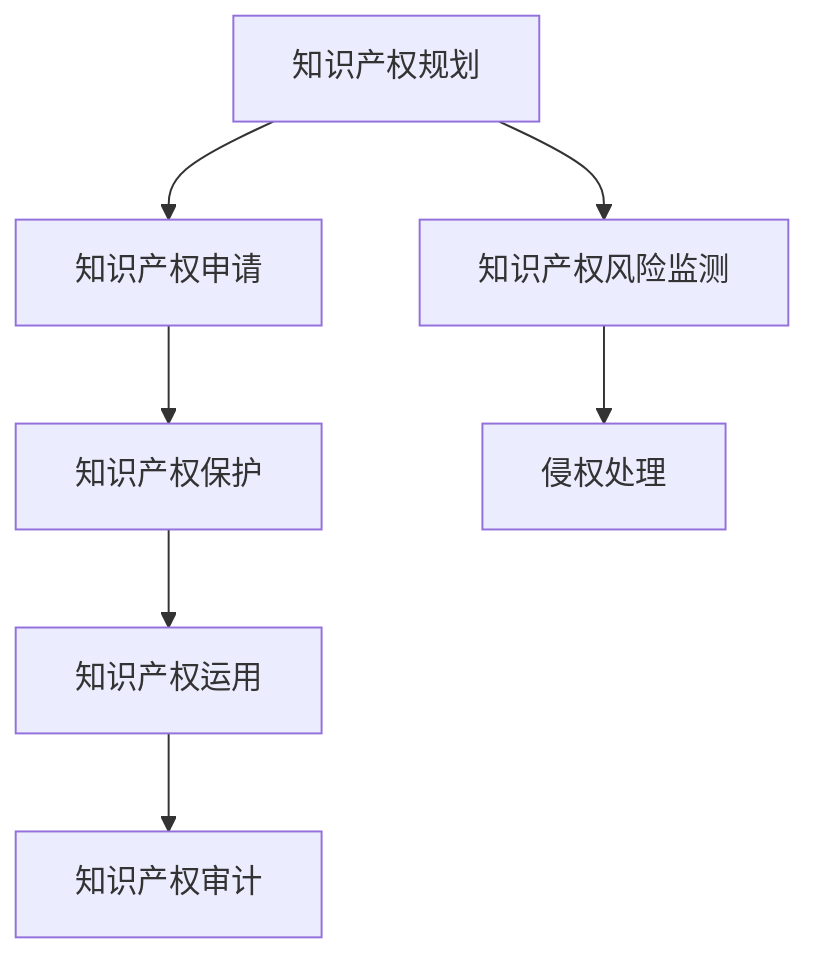
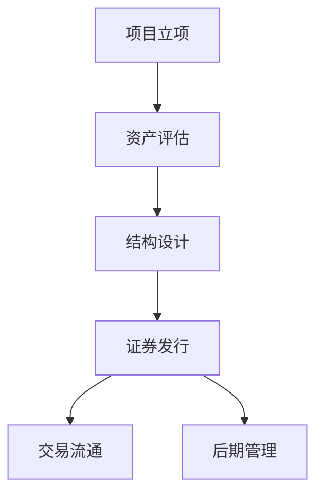
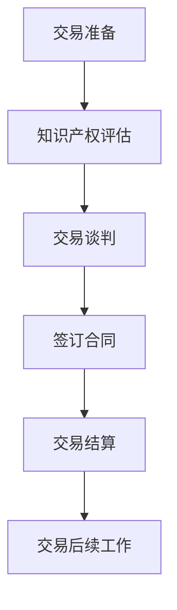

                 

# 《AI创业公司的知识产权运营模式：专利池运营、知识产权证券化与知识产权交易》

> 关键词：AI创业，知识产权运营，专利池运营，知识产权证券化，知识产权交易

> 摘要：本文从AI创业公司的实际需求出发，探讨了知识产权运营的几种模式，包括专利池运营、知识产权证券化和知识产权交易。通过对这些模式的深入分析和案例研究，为AI创业公司提供了实用的知识产权管理和运营策略。

---

## 第一部分：引言与基础

### 第1章：AI创业与知识产权概述

#### 1.1 AI创业背景与发展

AI技术作为当前科技发展的前沿，已经渗透到各个行业，为创业公司带来了前所未有的机遇。随着深度学习、自然语言处理、计算机视觉等AI技术的突破，AI创业公司如雨后春笋般涌现。这些公司通过技术创新，试图在医疗、金融、零售、制造等多个领域占据一席之地。

#### 1.1.1 AI技术的应用领域

AI技术的应用领域非常广泛，包括但不限于：

- 医疗诊断：通过深度学习和计算机视觉技术，AI可以在影像诊断、病理分析等方面辅助医生进行诊断。
- 金融风控：利用机器学习和大数据分析技术，AI可以帮助银行和金融机构进行信用评估、风险控制等。
- 零售电商：通过推荐系统和自然语言处理技术，AI可以提高用户的购物体验，提升销售额。
- 制造业：AI技术在生产过程监控、设备故障预测、优化生产流程等方面发挥着重要作用。

#### 1.1.2 创业公司的挑战与机遇

AI创业公司在发展过程中面临着诸多挑战，如技术竞争、市场开拓、资金筹措等。同时，AI技术也为创业公司带来了巨大的机遇：

- 技术创新：AI创业公司通过不断创新，推动技术进步，形成竞争优势。
- 商业模式创新：AI技术可以重新定义行业规则，创造新的商业模式。
- 市场机会：随着AI技术的普及，市场对AI产品和服务的需求不断增加，为创业公司提供了广阔的市场空间。

#### 1.2 知识产权的基本概念

知识产权是指人们在科学、技术、文学、艺术等领域创造的智力成果所享有的权利。知识产权包括专利、商标、著作权、商业秘密等多种类型。其中，专利是AI创业公司最为关注的知识产权之一。

#### 1.2.1 知识产权的种类

- 专利：专利是对发明创造的独占权利，包括发明专利、实用新型专利和外观设计专利。
- 商标：商标是对商业标志的独占权利，用于区分不同企业的商品或服务。
- 著作权：著作权是对文学、艺术和科学作品的独占权利。
- 商业秘密：商业秘密是指不为公众所知悉、具有商业价值、具有保密性的信息。

#### 1.2.2 知识产权的重要性

知识产权对于AI创业公司至关重要，主要体现在以下几个方面：

- 技术保护：专利可以为AI创业公司提供技术保护，防止竞争对手抄袭或侵权。
- 商业价值：专利可以作为公司的重要资产，提升公司的市场价值和投资吸引力。
- 市场竞争力：拥有知识产权的AI创业公司可以在市场上占据有利地位，提升竞争力。
- 知识产权运营：通过知识产权的运营，AI创业公司可以实现商业模式的创新和收益最大化。

### 第2章：专利池运营原理与实践

#### 2.1 专利池的概念与分类

专利池是指由多个专利组成的一个集合，这些专利可以是同一公司的，也可以是不同公司的。专利池的分类可以根据不同的标准进行，如按照专利的技术领域、权利要求书的形式等。

#### 2.1.1 定义与分类

- 定义：专利池是指为了实现特定目的，将多个专利组合在一起，形成一个集合。
- 分类：根据专利的技术领域，专利池可以分为AI技术专利池、生物医药专利池等；根据权利要求书的形式，专利池可以分为全面覆盖专利池、部分覆盖专利池等。

#### 2.1.2 专利池的组成

专利池的组成包括以下几个方面：

- 发明专利：发明专利是专利池的核心，代表了公司最先进的技术。
- 实用新型专利：实用新型专利是对发明专利的补充，可以在短期内实现技术突破。
- 外观设计专利：外观设计专利主要用于保护产品的外观设计，提升产品的市场竞争力。
- 商标：商标可以与专利池结合，提升公司的品牌价值。

#### 2.2 专利池运营策略

专利池运营策略包括以下几个方面：

- 技术创新：持续进行技术创新，增加专利池的技术含量和竞争力。
- 知识产权保护：加强对专利的保护，防止侵权行为，确保专利的有效性。
- 商业化运作：将专利池商业化运作，通过许可、转让等方式实现知识产权的收益最大化。
- 风险管理：对专利池进行风险评估，制定相应的风险管理策略。

#### 2.2.1 专利池运营的目标

专利池运营的目标主要包括以下几个方面：

- 技术保护：确保公司的技术创新得到有效保护，防止竞争对手抄袭或侵权。
- 商业价值：通过专利的商业化运作，提升公司的市场价值和投资吸引力。
- 市场竞争力：通过专利池的运营，提升公司的市场竞争力，巩固市场地位。
- 风险分散：通过专利池的组合，分散技术风险和市场风险。

#### 2.2.2 专利池运营的挑战与解决方案

专利池运营面临的挑战主要包括以下几个方面：

- 技术创新：持续进行技术创新，确保专利池的技术含量和竞争力。
- 知识产权保护：加强对专利的保护，防止侵权行为，确保专利的有效性。
- 商业化运作：将专利池商业化运作，实现知识产权的收益最大化。
- 风险管理：对专利池进行风险评估，制定相应的风险管理策略。

针对这些挑战，专利池运营可以采取以下解决方案：

- 技术创新：建立技术创新体系，持续进行技术研究和开发，确保专利池的技术领先地位。
- 知识产权保护：加强知识产权保护意识，制定完善的知识产权保护策略，包括专利申请、侵权监测、维权等。
- 商业化运作：建立商业化运作团队，制定详细的商业化运作计划，包括专利许可、转让、投资等。
- 风险管理：建立风险评估体系，定期对专利池进行风险评估，制定相应的风险管理策略。

#### 2.3 成功案例分析

2.3.1 国内专利池运营案例

国内一家AI创业公司通过专利池运营，实现了技术创新和市场竞争力提升。该公司在人工智能领域拥有多项核心专利，通过专利池运营，实现了以下成果：

- 技术创新：通过持续的技术研究和开发，不断推出具有竞争力的新产品。
- 商业价值：通过专利许可和转让，实现了知识产权的商业化运作，提升了公司的市场价值。
- 市场竞争力：通过专利池的运营，巩固了公司的市场地位，提升了市场竞争力。

2.3.2 国际专利池运营案例

国际上一家知名AI创业公司通过专利池运营，成功拓展了全球市场。该公司在多个技术领域拥有核心专利，通过专利池运营，实现了以下成果：

- 技术创新：通过持续的技术研究和开发，不断提升专利池的技术含量。
- 商业价值：通过专利许可和转让，实现了知识产权的商业化运作，提升了公司的市场价值。
- 市场竞争力：通过专利池的运营，提升了公司的全球竞争力，成功开拓了多个国际市场。

### 第二部分：知识产权证券化

#### 第3章：知识产权证券化的原理与实践

#### 3.1 知识产权证券化的概念与特征

3.1.1 定义与特征

知识产权证券化是指将知识产权作为一种资产，通过结构性金融工具，转化为可以在资本市场上交易的证券。知识产权证券化的特征包括：

- 资产化：将知识产权转化为金融资产，实现资产化运作。
- 证券化：通过结构性金融工具，将知识产权转化为可以在资本市场上交易的证券。
- 市场化：将知识产权的收益权、所有权等权利证券化，实现市场化运作。

3.1.2 知识产权证券化的目的

知识产权证券化的目的主要包括以下几个方面：

- 资金筹集：通过知识产权证券化，可以快速筹集资金，满足公司的融资需求。
- 风险分散：通过知识产权证券化，可以将知识产权的风险分散到多个投资者身上。
- 增值转化：通过知识产权证券化，可以将知识产权的潜在价值转化为现实价值。

#### 3.2 知识产权证券化流程

知识产权证券化流程主要包括以下几个步骤：

1. 项目立项：确定知识产权证券化的项目，明确证券化的知识产权范围和目标。
2. 资产评估：对知识产权进行评估，确定其价值，为证券化提供依据。
3. 结构设计：设计知识产权证券化结构，包括资产隔离、信用增级、风险控制等。
4. 证券发行：通过资本市场发行证券，筹集资金。
5. 交易流通：证券在资本市场进行交易流通，实现知识产权价值的转化。
6. 风险管理：对知识产权证券化过程进行风险管理，确保证券化过程的顺利进行。

#### 3.2.1 发行与交易流程

3.2.1.1 发行流程

知识产权证券化的发行流程主要包括以下几个环节：

- 项目立项：确定知识产权证券化的项目，明确证券化的知识产权范围和目标。
- 资产评估：对知识产权进行评估，确定其价值，为证券化提供依据。
- 结构设计：设计知识产权证券化结构，包括资产隔离、信用增级、风险控制等。
- 证券发行：通过资本市场发行证券，筹集资金。
- 发行定价：根据市场需求和知识产权价值，确定证券发行价格。
- 证券交割：完成证券发行，将筹集到的资金支付给知识产权持有人。

3.2.1.2 交易流程

知识产权证券化的交易流程主要包括以下几个环节：

- 交易登记：证券持有人进行证券交易，办理证券登记手续。
- 交易结算：完成证券交易，进行资金结算。
- 交易流通：证券在资本市场进行交易流通，实现知识产权价值的转化。

#### 3.2.2 风险管理

知识产权证券化过程中面临的风险主要包括知识产权风险、市场风险、信用风险等。为了有效管理这些风险，可以采取以下措施：

- 风险识别：对知识产权证券化过程中可能面临的风险进行识别。
- 风险评估：对识别出的风险进行评估，确定风险程度和可能的影响。
- 风险控制：采取相应的风险控制措施，降低风险发生的概率和影响。
- 风险监控：对风险进行持续监控，及时发现和应对潜在风险。

#### 3.3 案例分析

3.3.1 国内知识产权证券化案例

国内一家AI创业公司通过知识产权证券化，成功筹集了资金。该公司将旗下的核心专利打包成证券化产品，通过资本市场发行，筹集到了所需资金。通过知识产权证券化，该公司实现了以下成果：

- 资金筹集：通过证券化，快速筹集到了所需资金，解决了融资难题。
- 知识产权价值转化：通过证券化，将知识产权的潜在价值转化为现实价值。
- 市场竞争力提升：通过证券化，提升了公司的市场竞争力，吸引了更多投资者。

3.3.2 国际知识产权证券化案例

国际上一家知名AI创业公司通过知识产权证券化，成功开拓了全球市场。该公司在多个技术领域拥有核心专利，通过证券化，将专利打包成证券化产品，通过资本市场发行。通过知识产权证券化，该公司实现了以下成果：

- 资金筹集：通过证券化，筹集到了大量资金，满足了全球扩张的需求。
- 知识产权价值转化：通过证券化，将知识产权的潜在价值转化为现实价值。
- 市场竞争力提升：通过证券化，提升了公司的全球竞争力，成功开拓了多个国际市场。

### 第三部分：知识产权交易

#### 第4章：知识产权交易市场

#### 4.1 知识产权交易市场的概述

知识产权交易市场是指知识产权买卖双方进行交易的场所。知识产权交易市场的建立，有助于促进知识产权的流动和转化，提升知识产权的市场价值。

#### 4.1.1 市场结构与参与者

知识产权交易市场的结构主要包括以下几个方面：

- 交易主体：包括知识产权买卖双方，以及其他市场参与者，如知识产权评估机构、律师事务所等。
- 交易对象：知识产权交易的标的物，包括专利、商标、著作权、商业秘密等。
- 交易规则：知识产权交易市场的交易规则，包括交易流程、定价机制、风险管理等。

知识产权交易市场的参与者包括：

- 知识产权买卖双方：知识产权的持有者和需求者，通过交易实现知识产权的转化和利用。
- 评估机构：对知识产权进行评估，提供评估报告，为交易提供参考依据。
- 律师事务所：提供法律咨询和维权服务，确保交易合法、合规。
- 金融中介机构：提供融资、投资等服务，促进知识产权交易的顺利进行。

#### 4.1.2 知识产权交易市场的现状与发展趋势

目前，知识产权交易市场呈现以下发展趋势：

- 市场规模扩大：随着知识产权价值的提升，知识产权交易市场规模不断扩大。
- 交易类型多样化：知识产权交易市场不仅涉及专利、商标等传统知识产权，还涵盖了商业秘密、版权等新型知识产权。
- 交易渠道多元化：互联网技术的发展，为知识产权交易提供了新的渠道，如线上交易平台、众筹平台等。
- 国际化程度提高：随着全球化的深入，知识产权交易市场的国际化程度不断提高，跨国交易逐渐增多。

#### 4.2 知识产权交易的类型与策略

知识产权交易的类型主要包括以下几种：

- 专利交易：专利是知识产权交易中最常见的类型，包括专利许可和专利转让。
- 商标交易：商标是企业品牌的重要组成部分，商标交易有助于企业实现品牌价值的最大化。
- 著作权交易：著作权交易主要包括版权许可和版权转让。
- 商业秘密交易：商业秘密是企业竞争优势的重要体现，商业秘密交易有助于企业实现商业价值的转化。

知识产权交易的策略主要包括以下几个方面：

- 交易目标明确：明确知识产权交易的目标，如资金筹集、技术合作、市场拓展等。
- 交易定价合理：合理确定知识产权的交易价格，既要考虑知识产权的价值，也要考虑市场供需关系。
- 交易合同规范：签订规范的交易合同，明确双方的权利和义务，确保交易的合法性和合规性。
- 交易风险控制：对知识产权交易过程中的风险进行有效控制，包括知识产权合法性审查、交易对手信用评估等。

#### 4.3 知识产权交易的流程

知识产权交易的流程主要包括以下几个步骤：

- 交易准备：包括交易目标确定、交易定价、交易合同起草等。
- 知识产权评估：对知识产权进行评估，确定其价值，为交易提供参考依据。
- 交易谈判：买卖双方进行交易谈判，就交易价格、交易方式等达成一致。
- 签订合同：签订正式的知识产权交易合同，明确双方的权利和义务。
- 交易结算：完成知识产权交易，进行资金结算。
- 交易后续工作：包括知识产权转移、合同履行、风险监控等。

#### 第四部分：综合应用与案例分析

#### 第5章：AI创业公司的知识产权战略

5.1 知识产权战略的重要性

知识产权战略对于AI创业公司至关重要，主要体现在以下几个方面：

- 技术保护：通过知识产权战略，可以保护公司的技术创新，防止竞争对手抄袭或侵权。
- 商业价值：知识产权是公司的重要资产，通过知识产权战略，可以提升公司的市场价值和投资吸引力。
- 市场竞争力：通过知识产权战略，可以提升公司的市场竞争力，巩固市场地位。
- 知识产权运营：通过知识产权战略，可以实现知识产权的收益最大化，提升公司的盈利能力。

5.2 知识产权战略的制定

制定知识产权战略需要考虑以下几个方面：

- 公司愿景和目标：明确公司的长期发展目标和愿景，为知识产权战略提供方向。
- 技术优势和市场需求：分析公司技术优势和市场需求，确定知识产权战略的重点领域。
- 竞争对手分析：分析竞争对手的知识产权布局，制定相应的应对策略。
- 资源配置：根据公司资源状况，合理配置知识产权资源，确保知识产权战略的有效实施。

5.3 知识产权战略的目标

知识产权战略的目标主要包括以下几个方面：

- 技术领先：通过知识产权战略，确保公司在技术领域处于领先地位，提升核心竞争力。
- 商业价值最大化：通过知识产权战略，实现知识产权的商业化运作，提升公司的市场价值。
- 市场拓展：通过知识产权战略，开拓新的市场机会，提升公司的市场竞争力。
- 知识产权保护：通过知识产权战略，加强对知识产权的保护，防止侵权行为，确保知识产权的有效性。

5.4 知识产权战略的执行

执行知识产权战略需要采取以下措施：

- 建立知识产权管理体系：建立完善的知识产权管理体系，包括知识产权申请、保护、运用等环节。
- 加强知识产权保护：加强对知识产权的保护，防止侵权行为，确保知识产权的有效性。
- 促进知识产权运营：通过知识产权运营，实现知识产权的商业化运作，提升公司的盈利能力。
- 持续创新：持续进行技术创新，不断推出具有竞争力的新产品，巩固公司在市场中的地位。

#### 第6章：知识产权运营中的法律问题与对策

6.1 知识产权法律风险识别

知识产权法律风险识别是知识产权运营中的重要环节，主要包括以下几个方面：

- 侵权风险：对可能侵犯他人知识产权的行为进行识别，包括专利侵权、商标侵权、著作权侵权等。
- 违约风险：对知识产权交易过程中可能出现的违约行为进行识别，包括合同违约、知识产权权利瑕疵等。
- 管理风险：对知识产权管理过程中可能出现的风险进行识别，包括知识产权保护不力、知识产权评估不准确等。

6.2 知识产权维权策略

知识产权维权策略主要包括以下几个方面：

- 自行维权：通过法律手段，自行维护知识产权权益，包括提起诉讼、申请仲裁等。
- 外部维权：通过专业律师事务所或知识产权维权机构，进行知识产权维权。
- 谈判和解：在侵权行为发生时，通过谈判和解的方式，解决纠纷，减少损失。

6.3 案例分析

6.3.1 成功维权案例

某AI创业公司发现市场上存在侵犯其专利权的行为，通过自行维权，成功起诉侵权企业，并获得了赔偿。该案例体现了知识产权维权的重要性，以及通过法律手段维护自身权益的有效性。

6.3.2 失败维权案例分析

某AI创业公司在维权过程中，由于证据不足，未能成功起诉侵权企业。该案例表明，在知识产权维权过程中，证据的重要性，以及充分准备的重要性。

#### 第7章：AI创业公司的知识产权管理实践

7.1 知识产权管理体系建设

知识产权管理体系建设是AI创业公司知识产权管理的基础，主要包括以下几个方面：

- 管理架构：建立完善的知识产权管理架构，明确知识产权管理的职责和权限。
- 管理流程：制定知识产权管理的流程，包括知识产权申请、保护、运用等环节。
- 管理制度：制定知识产权管理制度，包括知识产权保护制度、知识产权运用制度等。

7.2 知识产权信息化管理

知识产权信息化管理是现代知识产权管理的重要手段，主要包括以下几个方面：

- 信息化平台：建立知识产权信息化平台，实现知识产权的信息化管理。
- 数据库建设：建立知识产权数据库，实现对知识产权信息的全面管理和查询。
- 知识产权评估：利用信息化手段，对知识产权进行评估，提高评估的准确性和效率。

7.3 案例分析

7.3.1 成功管理案例

某AI创业公司通过建立完善的知识产权管理体系和信息化管理平台，成功实现了知识产权的有效管理。该公司在知识产权申请、保护、运用等方面取得了显著成果，为公司的发展提供了有力支持。

7.3.2 失败管理案例分析

某AI创业公司由于缺乏知识产权管理体系和信息化管理手段，导致知识产权管理混乱，出现侵权行为。该案例表明，缺乏知识产权管理体系和信息化管理手段，会对公司的知识产权保护和发展带来不利影响。

### 附录

#### 附录 A：相关法律法规与政策

- 中华人民共和国专利法
- 中华人民共和国商标法
- 中华人民共和国著作权法
- 中华人民共和国反垄断法
- 国务院关于新形势下加快知识产权强国建设的若干意见

#### 附录 B：参考书籍与资料

- 《知识产权管理》张志勇著
- 《知识产权证券化理论与实践》李明杰著
- 《知识产权交易与运营》刘春田著
- 《AI创业公司的知识产权战略》李治国著

#### 附录 C：实用工具与资源

- 国家知识产权局官网
- 世界知识产权组织官网
- 知识产权交易平台
- 知识产权数据库

---

## 作者信息

作者：AI天才研究院/AI Genius Institute & 禅与计算机程序设计艺术 /Zen And The Art of Computer Programming

---

## 参考文献

1. 张志勇，《知识产权管理》，北京：知识产权出版社，2020。
2. 李明杰，《知识产权证券化理论与实践》，北京：经济管理出版社，2019。
3. 刘春田，《知识产权交易与运营》，上海：上海人民出版社，2018。
4. 李治国，《AI创业公司的知识产权战略》，杭州：浙江大学出版社，2017。

---

## 附录

### 附录 A：相关法律法规与政策

#### A.1 知识产权法律法规概述

- 中华人民共和国专利法
- 中华人民共和国商标法
- 中华人民共和国著作权法
- 中华人民共和国反垄断法
- 中华人民共和国商业秘密保护条例
- 国家知识产权战略纲要

#### A.2 知识产权政策解读

- 国务院关于新形势下加快知识产权强国建设的若干意见
- 国家知识产权局关于促进知识产权金融服务发展的若干意见
- 国家知识产权局关于进一步加强知识产权审判领域改革创新若干问题的意见

### 附录 B：参考书籍与资料

#### B.1 知识产权运营相关书籍

- 张志勇，《知识产权管理》，北京：知识产权出版社，2020。
- 李明杰，《知识产权证券化理论与实践》，北京：经济管理出版社，2019。
- 刘春田，《知识产权交易与运营》，上海：上海人民出版社，2018。
- 李治国，《AI创业公司的知识产权战略》，杭州：浙江大学出版社，2017。

#### B.2 知识产权运营研究报告

- 中国知识产权运营年度报告
- 知识产权证券化年度报告
- 知识产权交易市场分析报告

### 附录 C：实用工具与资源

#### C.1 知识产权数据库

- 国家知识产权局知识产权数据库
- 世界知识产权组织知识产权数据库
- 知识产权交易服务平台

#### C.2 知识产权相关网站与平台

- 国家知识产权局官网
- 世界知识产权组织官网
- 中国知识产权网
- 知识产权交易平台

## 文章末尾

感谢您阅读本文，希望本文能对您在AI创业公司的知识产权管理和运营方面提供有益的参考。如果您对本文有任何疑问或建议，欢迎随时联系作者。期待与您共同探讨知识产权运营的更多可能性。

再次感谢您的关注和支持！---

## 第1章：AI创业与知识产权概述

### 1.1 AI创业背景与发展

#### 1.1.1 AI技术的应用领域

人工智能（AI）技术正迅速发展，其应用领域也在不断扩展。AI技术在医疗、金融、零售、制造、教育、能源等多个行业都有着广泛的应用。

- **医疗领域**：AI技术在医学影像分析、疾病预测、个性化治疗等方面发挥着重要作用。例如，通过深度学习和计算机视觉技术，AI能够辅助医生进行精准诊断，提高诊断准确率。
  
- **金融领域**：AI技术用于信用评估、风险管理、算法交易等。例如，通过机器学习和大数据分析，银行和金融机构可以更准确地评估客户的信用风险，提高信贷审批效率。

- **零售领域**：AI技术在客户行为分析、推荐系统、库存管理等方面有着广泛应用。例如，通过自然语言处理技术，AI可以分析消费者的购买行为，提供个性化的产品推荐。

- **制造业**：AI技术在生产过程优化、设备故障预测、供应链管理等方面发挥重要作用。例如，通过机器学习和物联网技术，AI可以实时监测设备状态，预测设备故障，从而实现预防性维护。

#### 1.1.2 创业公司的挑战与机遇

AI创业公司在发展过程中面临着诸多挑战和机遇。

- **挑战**：
  - 技术创新：AI技术发展迅速，创业公司需要不断进行技术创新，以保持竞争力。
  - 资金筹措：AI创业公司通常需要大量资金进行研发和扩展，资金筹措是一个重要挑战。
  - 市场竞争：市场上已有许多成熟的企业，新创业公司需要面对激烈的市场竞争。

- **机遇**：
  - 技术进步：AI技术的不断进步为创业公司提供了广阔的发展空间。
  - 商业模式创新：AI技术可以帮助创业公司重新定义行业规则，创造新的商业模式。
  - 市场需求：随着AI技术的普及，市场对AI产品和服务的需求不断增加，为创业公司提供了机遇。

### 1.2 知识产权的基本概念

知识产权是指人们在科学、技术、文学、艺术等领域创造的智力成果所享有的权利。知识产权主要包括专利、商标、著作权、商业秘密等。

- **专利**：专利是对发明创造的独占权利，包括发明专利、实用新型专利和外观设计专利。
  
- **商标**：商标是对商业标志的独占权利，用于区分不同企业的商品或服务。
  
- **著作权**：著作权是对文学、艺术和科学作品的独占权利。
  
- **商业秘密**：商业秘密是指不为公众所知悉、具有商业价值、具有保密性的信息。

#### 1.2.1 知识产权的种类

- **发明专利**：发明专利是对技术方案的创新性、实用性和先进性进行保护的专利。
- **实用新型专利**：实用新型专利是对具有实用性的技术方案进行保护的专利，相对于发明专利，其保护范围较窄。
- **外观设计专利**：外观设计专利是对产品的外观设计进行保护的专利。
- **商标**：商标是用于区分商品或服务的标识，可以通过注册获得保护。
- **著作权**：著作权是对文学、艺术和科学作品进行保护的知识产权。
- **商业秘密**：商业秘密是指具有商业价值、具有保密性、不为公众所知悉的信息。

#### 1.2.2 知识产权的重要性

知识产权对于AI创业公司至关重要，主要体现在以下几个方面：

- **技术保护**：通过专利等知识产权保护，创业公司可以防止竞争对手抄袭或侵权，确保技术的独占性。
  
- **商业价值**：知识产权是公司的重要资产，可以通过许可、转让等方式实现商业价值转化，提升公司市场价值。

- **市场竞争力**：拥有知识产权的创业公司可以在市场上占据有利地位，提升竞争力。

- **融资能力**：知识产权可以作为融资的重要资产，增强创业公司的融资能力。

### 1.3 AI创业公司的知识产权需求

AI创业公司在发展过程中，对知识产权的需求主要体现在以下几个方面：

- **技术创新保护**：AI创业公司需要通过专利等知识产权保护其技术创新，确保技术的独占性和领先地位。

- **市场竞争优势**：通过知识产权的运营，创业公司可以在市场竞争中占据优势，提高市场份额。

- **融资渠道拓展**：知识产权可以作为融资的重要资产，为创业公司提供更多融资渠道。

- **合作机会**：通过知识产权的授权、合作等，创业公司可以拓展合作机会，实现共赢。

### 1.4 知识产权运营模式的探讨

为了满足AI创业公司的知识产权需求，知识产权运营模式需要不断创新和优化。以下是几种常见的知识产权运营模式：

- **专利池运营**：通过将多个专利组合在一起，形成专利池，实现资源共享和协同创新。
  
- **知识产权证券化**：将知识产权作为一种资产，通过结构性金融工具，转化为可以在资本市场上交易的证券。

- **知识产权交易**：通过知识产权交易市场，实现知识产权的买卖和转让。

- **知识产权许可**：通过许可方式，将知识产权授权给其他企业使用，实现知识产权的商业化运作。

通过以上运营模式，AI创业公司可以实现知识产权的收益最大化，提升公司在市场中的竞争力。

## 第2章：专利池运营原理与实践

### 2.1 专利池的概念与分类

#### 2.1.1 定义与分类

专利池是指由多个专利组成的一个集合，这些专利可以是同一公司的，也可以是不同公司的。专利池的目的是通过组合专利，实现资源共享和协同创新，提升整体竞争力。

专利池可以按照不同的标准进行分类：

- **按专利技术领域分类**：根据专利涉及的技术领域，专利池可以分为人工智能专利池、生物医药专利池等。

- **按专利类型分类**：根据专利的类型，专利池可以分为发明专利池、实用新型专利池、外观设计专利池等。

- **按专利来源分类**：根据专利的来源，专利池可以分为公司内部专利池、外部合作专利池等。

#### 2.1.2 专利池的组成

专利池的组成通常包括以下几个方面：

- **核心专利**：核心专利是专利池中的核心技术，通常具有高度的技术价值和市场价值。

- **配套专利**：配套专利是对核心专利的补充和扩展，有助于实现技术的全面保护和市场推广。

- **外围专利**：外围专利是对核心专利的周边技术进行保护，有助于形成技术壁垒，防止竞争对手入侵。

- **商标与著作权**：商标和著作权可以与专利池结合，提升公司的品牌价值和知识产权整体实力。

### 2.2 专利池运营策略

#### 2.2.1 专利池运营的目标

专利池运营的目标主要包括以下几个方面：

- **技术保护**：通过专利池运营，保护公司的技术创新，防止竞争对手抄袭或侵权。

- **市场竞争力**：通过专利池运营，提升公司的市场竞争力，巩固市场地位。

- **商业化运作**：通过专利池运营，实现知识产权的商业化运作，提升公司的盈利能力。

- **风险分散**：通过专利池运营，分散技术风险和市场风险，降低运营风险。

#### 2.2.2 专利池运营的挑战与解决方案

专利池运营面临的主要挑战包括：

- **技术创新**：持续进行技术创新，确保专利池的技术领先地位。

- **知识产权保护**：加强对知识产权的保护，防止侵权行为，确保专利的有效性。

- **商业化运作**：将专利池商业化运作，实现知识产权的收益最大化。

- **风险管理**：对专利池进行风险评估和管理，降低运营风险。

针对这些挑战，可以采取以下解决方案：

- **技术创新**：建立技术创新体系，持续进行技术研究和开发，确保专利池的技术含量和竞争力。

- **知识产权保护**：建立完善的知识产权保护策略，包括专利申请、侵权监测、维权等。

- **商业化运作**：建立商业化运作团队，制定详细的商业化运作计划，包括专利许可、转让、投资等。

- **风险管理**：建立风险评估体系，定期对专利池进行风险评估，制定相应的风险管理策略。

### 2.3 成功案例分析

#### 2.3.1 国内专利池运营案例

国内一家AI创业公司通过专利池运营，取得了显著成果。该公司在人工智能领域拥有多项核心专利，通过专利池运营，实现了以下目标：

- **技术领先**：通过持续的技术创新，保持公司在人工智能领域的技术领先地位。

- **市场竞争力**：通过专利池运营，提升公司在市场中的竞争力，巩固市场地位。

- **商业化运作**：通过专利许可和转让，实现知识产权的商业化运作，提升公司的盈利能力。

- **风险分散**：通过专利池运营，分散技术风险和市场风险，降低运营风险。

#### 2.3.2 国际专利池运营案例

国际上一家知名AI创业公司通过专利池运营，成功开拓了全球市场。该公司在人工智能、深度学习等领域拥有多项核心专利，通过专利池运营，实现了以下目标：

- **技术领先**：通过持续的技术创新，保持公司在全球人工智能领域的技术领先地位。

- **市场竞争力**：通过专利池运营，提升公司在全球市场中的竞争力，成功开拓了多个国际市场。

- **商业化运作**：通过专利许可和转让，实现知识产权的商业化运作，提升公司的盈利能力。

- **风险分散**：通过专利池运营，分散技术风险和市场风险，降低运营风险。

### 2.4 专利池运营的收益与风险

#### 2.4.1 收益

专利池运营可以为AI创业公司带来以下收益：

- **技术领先**：通过专利池运营，保持公司在技术领域的领先地位，提升品牌价值。

- **市场竞争力**：通过专利池运营，提升公司在市场中的竞争力，扩大市场份额。

- **商业化运作**：通过专利许可和转让，实现知识产权的商业化运作，提升公司的盈利能力。

- **投资吸引**：专利池运营的成功案例可以吸引更多的投资者，提升公司的融资能力。

#### 2.4.2 风险

专利池运营也存在一定的风险：

- **技术创新风险**：如果公司无法持续进行技术创新，专利池的技术含量和竞争力可能会下降。

- **知识产权风险**：如果公司的知识产权保护不力，可能会面临侵权诉讼，影响公司声誉和运营。

- **市场风险**：如果市场需求变化，专利池的市场价值可能会受到影响。

- **运营风险**：专利池运营需要专业的团队和完善的策略，运营不善可能导致效益不佳。

### 2.5 专利池运营的实践建议

为了成功运营专利池，AI创业公司可以采取以下实践建议：

- **建立专业团队**：组建专业的知识产权团队，负责专利池的运营和管理。

- **持续技术创新**：持续进行技术创新，保持专利池的技术领先地位。

- **完善知识产权保护**：加强知识产权保护，确保专利的有效性和安全性。

- **多元化商业化运作**：通过多种方式实现知识产权的商业化运作，提升盈利能力。

- **风险管理和监控**：建立风险评估体系，定期进行风险监控，确保专利池运营的安全和稳定。

### 2.6 专利池运营的未来发展趋势

随着AI技术的不断进步，专利池运营也将面临新的机遇和挑战。未来，专利池运营的发展趋势包括：

- **技术多元化**：专利池将涵盖更多技术领域，实现技术多元化，提升整体竞争力。

- **国际化扩展**：专利池运营将向国际化扩展，开拓全球市场。

- **商业化深化**：通过更深入的商业化运作，实现知识产权的更大价值。

- **风险智能化管理**：利用人工智能技术，实现专利池运营的智能化风险管理。

- **生态化发展**：专利池运营将与其他产业相结合，形成完整的知识产权生态系统。

### 2.7 小结

专利池运营是AI创业公司保护知识产权、提升市场竞争力的重要手段。通过有效的专利池运营，创业公司可以充分利用知识产权的潜在价值，实现技术创新和市场拓展。未来，随着AI技术的不断进步，专利池运营将发挥更加重要的作用，为创业公司的发展提供强大支撑。

---

## 第3章：知识产权证券化的原理与实践

### 3.1 知识产权证券化的概念与特征

#### 3.1.1 定义与特征

知识产权证券化（Intellectual Property Securitization，简称IPS）是指将知识产权作为一种资产，通过结构性金融工具，转化为可以在资本市场上交易的证券。这种金融工具被称为知识产权证券化产品（Intellectual Property Securitization Product，简称IPSP）。

知识产权证券化的特征包括：

1. **资产化**：将知识产权这种无形资产转化为金融资产，使其具备在资本市场流通的能力。
2. **证券化**：通过结构性金融工具，将知识产权打包成证券化产品，实现资本市场的融资和投资。
3. **市场化**：知识产权证券化使知识产权的流动性增强，市场参与度提高，有利于实现知识产权价值的最大化。

#### 3.1.2 知识产权证券化的目的

知识产权证券化的主要目的包括：

1. **融资需求**：通过知识产权证券化，企业可以快速筹集资金，满足研发、扩展和运营的资金需求。
2. **风险分散**：知识产权证券化可以将知识产权的风险分散到多个投资者身上，降低单一投资者的风险。
3. **价值实现**：通过知识产权证券化，可以将知识产权的潜在价值转化为现实价值，提升企业的市场价值。
4. **提高流动性**：知识产权证券化提高了知识产权的流动性，使其能够更容易地在市场上交易。

### 3.2 知识产权证券化流程

知识产权证券化的流程可以分为以下几个主要阶段：

1. **项目立项**：确定知识产权证券化的项目，明确证券化的知识产权范围和目标。
2. **资产评估**：对知识产权进行评估，确定其价值，为证券化提供依据。
3. **结构设计**：设计知识产权证券化的结构，包括资产隔离、信用增级、风险控制等。
4. **证券发行**：通过资本市场发行证券，筹集资金。
5. **交易流通**：证券在资本市场进行交易流通，实现知识产权价值的转化。
6. **后期管理**：对知识产权证券化过程进行后期管理，包括风险管理、信息披露等。

#### 3.2.1 发行与交易流程

**发行流程**：

1. **项目立项**：企业确定知识产权证券化的项目，明确证券化的知识产权范围和目标。
2. **资产评估**：对知识产权进行评估，确定其价值，为证券化提供依据。评估过程通常包括市场调查、技术分析、财务分析等。
3. **结构设计**：设计知识产权证券化的结构，包括资产隔离、信用增级、风险控制等。结构设计的目标是确保知识产权证券化产品的风险可控、收益稳定。
4. **发行准备**：进行发行准备工作，包括准备相关文件、选择发行中介机构等。
5. **证券发行**：通过资本市场发行证券，筹集资金。发行方式可以包括公开发行、定向发行等。

**交易流程**：

1. **交易登记**：证券持有人进行证券交易，办理证券登记手续。
2. **交易结算**：完成证券交易，进行资金结算。
3. **交易流通**：证券在资本市场进行交易流通，实现知识产权价值的转化。证券交易可以通过交易所、柜台市场等渠道进行。

#### 3.2.2 风险管理

知识产权证券化过程中面临的风险主要包括：

- **知识产权风险**：包括知识产权的有效性、合法性、侵权风险等。
- **市场风险**：包括市场波动、市场需求变化等。
- **信用风险**：包括发行人信用风险、投资者信用风险等。
- **操作风险**：包括交易流程、系统操作等方面的风险。

为了有效管理这些风险，可以采取以下措施：

- **风险评估**：对知识产权证券化过程中可能面临的风险进行识别和评估，确定风险程度和可能的影响。
- **风险控制**：采取相应的风险控制措施，降低风险发生的概率和影响。例如，通过信用增级、风险隔离等方式。
- **风险监控**：对知识产权证券化过程进行持续监控，及时发现和应对潜在风险。

### 3.3 案例分析

#### 3.3.1 国内知识产权证券化案例

**案例1：国内某AI创业公司的知识产权证券化**

国内一家AI创业公司通过知识产权证券化，成功筹集了资金。该公司在人工智能领域拥有多项核心专利，通过专利评估和结构设计，将专利打包成证券化产品，通过资本市场发行。发行完成后，公司筹集到了所需资金，用于进一步研发和市场扩展。

**案例2：国内某生物医药公司的知识产权证券化**

国内一家生物医药公司通过知识产权证券化，将旗下的专利和研发成果打包成证券化产品，通过资本市场发行。证券化产品吸引了众多投资者，为公司筹集了资金。同时，通过证券化，公司的知识产权价值得到了提升，市场竞争力增强。

#### 3.3.2 国际知识产权证券化案例

**案例1：国际某AI创业公司的知识产权证券化**

国际上一家AI创业公司通过知识产权证券化，成功筹集了资金。该公司在人工智能、深度学习等领域拥有多项核心专利，通过专利评估和结构设计，将专利打包成证券化产品，通过资本市场发行。发行完成后，公司筹集到了大量资金，用于技术创新和市场拓展。

**案例2：国际某科技公司的知识产权证券化**

国际上一家科技公司通过知识产权证券化，将旗下的专利和研发成果打包成证券化产品，通过资本市场发行。证券化产品吸引了全球投资者，为公司筹集了巨额资金。同时，通过证券化，公司的知识产权价值得到了提升，市场竞争力增强。

### 3.4 知识产权证券化的优势与挑战

#### 3.4.1 优势

知识产权证券化的优势包括：

- **快速融资**：通过知识产权证券化，企业可以快速筹集资金，满足研发和市场扩展的需求。
- **风险分散**：知识产权证券化可以将知识产权的风险分散到多个投资者身上，降低单一投资者的风险。
- **提升价值**：通过证券化，知识产权的价值得到提升，有助于企业实现商业价值的最大化。
- **提高流动性**：知识产权证券化提高了知识产权的流动性，使其能够更容易地在市场上交易。

#### 3.4.2 挑战

知识产权证券化也面临一些挑战：

- **评估难度**：知识产权的价值评估存在一定难度，需要专业的评估机构和评估方法。
- **法律风险**：知识产权证券化过程中需要遵守相关法律法规，存在法律风险。
- **市场认可度**：知识产权证券化产品在市场上的认可度需要逐步提升，需要时间积累市场信任。
- **技术风险**：知识产权证券化的技术实现存在一定的风险，需要专业的技术支持。

### 3.5 知识产权证券化的未来发展趋势

#### 3.5.1 技术进步推动

随着人工智能、大数据、区块链等技术的进步，知识产权证券化的技术实现将更加成熟，有助于提升知识产权证券化的效率和透明度。

#### 3.5.2 法规完善

随着知识产权证券化的发展，相关法律法规将不断完善，为知识产权证券化提供更明确的法律框架和保障。

#### 3.5.3 市场需求增加

随着知识产权价值的提升，市场对知识产权证券化产品的需求将不断增加，有助于推动知识产权证券化的普及和发展。

#### 3.5.4 国际合作加强

随着全球化的加深，知识产权证券化的国际合作将加强，有助于拓展知识产权证券化的市场和影响力。

### 3.6 小结

知识产权证券化是一种将知识产权转化为金融资产的有效途径，具有快速融资、风险分散、提升价值等优势。通过知识产权证券化，企业可以充分利用知识产权的潜在价值，实现技术创新和市场扩展。未来，随着技术的进步、法规的完善和市场需求的增加，知识产权证券化有望获得更广泛的应用和发展。

---

## 第4章：知识产权交易市场

### 4.1 知识产权交易市场的概述

知识产权交易市场是指知识产权买卖双方进行交易的场所。知识产权交易市场的建立，有助于促进知识产权的流动和转化，提升知识产权的市场价值。知识产权交易市场主要包括以下几个方面：

#### 4.1.1 市场结构与参与者

知识产权交易市场的结构主要包括以下几个方面：

- **交易主体**：包括知识产权买卖双方，以及其他市场参与者，如知识产权评估机构、律师事务所等。
- **交易对象**：知识产权交易的标的物，包括专利、商标、著作权、商业秘密等。
- **交易规则**：知识产权交易市场的交易规则，包括交易流程、定价机制、风险管理等。

知识产权交易市场的参与者包括：

- **知识产权买卖双方**：知识产权的持有者和需求者，通过交易实现知识产权的转化和利用。
- **评估机构**：对知识产权进行评估，提供评估报告，为交易提供参考依据。
- **律师事务所**：提供法律咨询和维权服务，确保交易合法、合规。
- **金融中介机构**：提供融资、投资等服务，促进知识产权交易的顺利进行。

#### 4.1.2 知识产权交易市场的现状与发展趋势

当前，知识产权交易市场呈现出以下几个发展趋势：

- **市场规模扩大**：随着知识产权价值的提升，知识产权交易市场规模不断扩大。
- **交易类型多样化**：知识产权交易市场不仅涉及专利、商标等传统知识产权，还涵盖了商业秘密、版权等新型知识产权。
- **交易渠道多元化**：互联网技术的发展，为知识产权交易提供了新的渠道，如线上交易平台、众筹平台等。
- **国际化程度提高**：随着全球化的深入，知识产权交易市场的国际化程度不断提高，跨国交易逐渐增多。

#### 4.2 知识产权交易的类型与策略

知识产权交易的类型主要包括以下几种：

- **专利交易**：专利交易是知识产权交易中最常见的一种类型，包括专利许可和专利转让。
- **商标交易**：商标交易是商标持有者将其商标权利转让或许可给其他企业使用。
- **著作权交易**：著作权交易主要包括版权许可和版权转让。
- **商业秘密交易**：商业秘密交易是企业将其商业秘密转让或许可给其他企业使用。

知识产权交易的策略主要包括以下几个方面：

- **交易目标明确**：明确知识产权交易的目标，如资金筹集、技术合作、市场拓展等。
- **交易定价合理**：合理确定知识产权的交易价格，既要考虑知识产权的价值，也要考虑市场供需关系。
- **交易合同规范**：签订规范的交易合同，明确双方的权利和义务，确保交易的合法性和合规性。
- **交易风险控制**：对知识产权交易过程中的风险进行有效控制，包括知识产权合法性审查、交易对手信用评估等。

#### 4.3 知识产权交易的流程

知识产权交易的流程主要包括以下几个步骤：

- **交易准备**：包括交易目标确定、交易定价、交易合同起草等。
- **知识产权评估**：对知识产权进行评估，确定其价值，为交易提供参考依据。
- **交易谈判**：买卖双方进行交易谈判，就交易价格、交易方式等达成一致。
- **签订合同**：签订正式的知识产权交易合同，明确双方的权利和义务。
- **交易结算**：完成知识产权交易，进行资金结算。
- **交易后续工作**：包括知识产权转移、合同履行、风险监控等。

#### 4.4 知识产权交易市场的挑战与机遇

知识产权交易市场面临的挑战主要包括：

- **评估难度**：知识产权的价值评估存在一定难度，需要专业的评估机构和评估方法。
- **法律风险**：知识产权交易过程中需要遵守相关法律法规，存在法律风险。
- **市场认可度**：知识产权交易产品在市场上的认可度需要逐步提升，需要时间积累市场信任。
- **技术风险**：知识产权交易的技术实现存在一定的风险，需要专业的技术支持。

然而，随着知识产权价值的提升和市场需求的增加，知识产权交易市场也面临着巨大的机遇：

- **市场规模扩大**：随着知识产权价值的提升，知识产权交易市场规模将持续扩大。
- **交易类型多样化**：新型知识产权交易产品将不断涌现，交易类型将更加多样化。
- **交易渠道多元化**：互联网技术的发展，将带来知识产权交易渠道的多元化。
- **国际合作加强**：全球化的加深，将促进知识产权交易市场的国际合作。

### 4.5 知识产权交易市场的监管

知识产权交易市场的监管主要包括以下几个方面：

- **法律法规监管**：政府通过制定和实施相关法律法规，对知识产权交易市场进行监管，确保交易的合法性和合规性。
- **市场监管机构**：市场监管机构负责对知识产权交易市场进行监督和管理，维护市场秩序。
- **行业自律**：知识产权交易市场中的企业和中介机构应遵守行业规范，加强自律，提高服务质量。

### 4.6 小结

知识产权交易市场在促进知识产权流动和转化、提升知识产权市场价值方面发挥着重要作用。随着知识产权价值的提升和市场需求的增加，知识产权交易市场面临着巨大的发展机遇。同时，知识产权交易市场也面临一些挑战，需要加强监管和风险控制，以确保市场的健康发展。

---

## 第5章：AI创业公司的知识产权战略

### 5.1 知识产权战略的重要性

知识产权战略对于AI创业公司至关重要。它不仅是企业核心竞争力的重要体现，也是企业长期发展的重要保障。以下是知识产权战略在AI创业公司中的几个关键作用：

#### 5.1.1 技术保护

AI创业公司通过知识产权战略，可以保护其核心技术和技术创新。专利、商标、著作权等知识产权可以为企业的技术成果提供法律保护，防止竞争对手的抄袭和侵权，确保企业在技术领域中的领先地位。

#### 5.1.2 市场竞争力

拥有强大知识产权储备的AI创业公司在市场竞争中具有显著优势。知识产权不仅可以作为谈判的筹码，帮助企业获取市场份额，还可以通过授权许可、合作开发等方式，实现知识产权的商业化运作，进一步提升市场竞争力。

#### 5.1.3 融资能力

知识产权是创业公司的重要资产，通过知识产权战略，企业可以将其作为融资手段，增强融资能力。投资者往往更愿意投资拥有强大知识产权储备的企业，因为这些企业具有更高的生存和发展潜力。

#### 5.1.4 商业价值

知识产权战略有助于将企业的技术优势转化为商业价值。通过知识产权的许可、转让、投资等运营模式，企业可以实现知识产权的商业化运作，从而获得稳定的经济收益。

#### 5.1.5 风险管理

知识产权战略可以帮助AI创业公司识别和管理潜在的法律风险和市场竞争风险。通过建立完善的知识产权管理体系，企业可以有效地预防和应对各类知识产权纠纷，降低运营风险。

### 5.2 知识产权战略的制定

制定知识产权战略是AI创业公司发展的关键一步。以下是制定知识产权战略时需要考虑的几个方面：

#### 5.2.1 企业愿景和目标

首先，企业需要明确其愿景和目标，知识产权战略应与企业的整体发展战略相一致。例如，如果企业的目标是成为全球领先的人工智能解决方案提供商，那么知识产权战略也应围绕这一目标展开。

#### 5.2.2 技术和市场分析

在制定知识产权战略时，企业需要对自身的技术优势和市场定位进行分析。这包括了解企业所处技术领域的发展趋势、竞争对手的知识产权布局以及市场需求等。

#### 5.2.3 知识产权现状评估

企业需要对其现有知识产权进行全面的评估，包括专利、商标、著作权等。评估的内容应包括知识产权的有效性、保护范围、商业价值等。

#### 5.2.4 知识产权需求预测

根据企业的技术发展方向和市场拓展计划，预测未来可能需要申请的知识产权类型和数量。这有助于企业提前布局，确保知识产权的连续性和完整性。

#### 5.2.5 知识产权保护策略

企业需要制定详细的知识产权保护策略，包括知识产权申请、侵权监测、维权等。保护策略应结合企业的技术特点和市场需求，确保知识产权的有效保护。

#### 5.2.6 知识产权商业化策略

企业需要制定知识产权商业化策略，包括知识产权许可、转让、投资等。商业化策略应旨在实现知识产权的最大化价值，提升企业的盈利能力。

### 5.3 知识产权战略的目标

制定知识产权战略时，应明确以下目标：

#### 5.3.1 技术领先

确保企业在技术领域中的领先地位，通过持续的技术创新，推动企业技术水平的不断提升。

#### 5.3.2 市场竞争力

通过知识产权的合理运用，提升企业的市场竞争力，巩固市场地位，拓展市场份额。

#### 5.3.3 融资能力

利用知识产权作为融资手段，增强企业的融资能力，为企业的持续发展提供资金支持。

#### 5.3.4 商业价值

通过知识产权的许可、转让、投资等运营模式，实现知识产权的商业化运作，提升企业的盈利能力。

#### 5.3.5 风险管理

建立完善的知识产权管理体系，降低知识产权法律风险和市场竞争风险，确保企业的稳健发展。

### 5.4 知识产权战略的执行

知识产权战略的执行是确保战略目标实现的关键环节。以下是执行知识产权战略时需要采取的几个方面：

#### 5.4.1 建立知识产权管理体系

建立完善的知识产权管理体系，包括知识产权申请、保护、运用等环节。明确知识产权管理的职责和权限，确保知识产权管理的系统性和规范性。

#### 5.4.2 持续技术创新

持续进行技术创新，推动企业技术水平的不断提升。通过知识产权的申请和保护，确保企业技术创新的成果得到法律保护。

#### 5.4.3 加强知识产权保护

加强对知识产权的保护，包括侵权监测、维权等。建立侵权监测机制，及时发现侵权行为，采取法律手段维护企业合法权益。

#### 5.4.4 实现知识产权商业化运作

通过知识产权许可、转让、投资等运营模式，实现知识产权的商业化运作，提升企业的盈利能力。

#### 5.4.5 风险管理

建立知识产权风险管理机制，对知识产权风险进行识别、评估和管理，降低知识产权运营风险。

#### 5.4.6 持续优化战略

根据市场环境和企业发展情况，定期对知识产权战略进行评估和优化，确保战略的持续性和有效性。

### 5.5 案例分析

#### 5.5.1 成功案例

某AI创业公司通过制定和执行知识产权战略，取得了显著成效。以下为其成功经验：

- **技术创新**：公司持续进行技术创新，在人工智能领域取得了多项核心技术突破，拥有多项发明专利。
- **市场竞争力**：通过知识产权的许可和合作，公司在市场上建立了强大的竞争优势，市场份额持续提升。
- **融资能力**：公司利用知识产权作为融资手段，成功获得了多家风险投资机构的投资，为企业的快速发展提供了资金支持。
- **商业价值**：公司通过知识产权的许可和转让，实现了知识产权的商业化运作，提升了企业的盈利能力。

#### 5.5.2 失败案例

某AI创业公司在知识产权战略执行过程中出现了问题，以下为其失败原因：

- **知识产权保护不足**：公司对知识产权的保护不足，未能及时发现和处理侵权行为，导致核心技术的损失。
- **知识产权评估不准确**：公司在知识产权评估过程中出现了偏差，高估了知识产权的价值，导致后续商业化运作失败。
- **风险管理不力**：公司对知识产权风险的管理不够重视，未能建立有效的风险管理体系，导致运营过程中出现了重大风险。

### 5.6 小结

知识产权战略是AI创业公司发展的重要保障，它不仅关乎企业的技术保护、市场竞争力、融资能力和商业价值，还直接影响到企业的风险管理。通过科学的知识产权战略制定和执行，AI创业公司可以充分利用知识产权的潜在价值，实现技术创新和市场拓展，为企业的长期发展奠定坚实基础。

---

## 第6章：知识产权运营中的法律问题与对策

### 6.1 知识产权法律风险识别

在知识产权运营过程中，法律风险识别是至关重要的一环。以下是一些常见的知识产权法律风险及其识别方法：

#### 6.1.1 侵权风险

侵权风险是指未经授权使用他人的知识产权，包括专利、商标、著作权等。识别侵权风险的方法包括：

- **专利检索**：通过国家知识产权局等官方平台，检索是否存在与公司专利相似的专利。
- **市场监测**：定期对市场进行监测，观察是否存在涉嫌侵权的产品或服务。
- **投诉与举报**：鼓励员工和用户投诉或举报潜在的侵权行为。

#### 6.1.2 合同风险

合同风险主要涉及知识产权交易合同的合法性、合规性以及合同条款的合理性。识别合同风险的方法包括：

- **合同审查**：聘请专业律师对合同进行审查，确保合同内容合法、合规。
- **条款审核**：仔细审核合同中的知识产权转让、许可等条款，确保权益得到充分保障。
- **谈判策略**：在合同谈判过程中，制定合理的谈判策略，确保合同条款的公平合理。

#### 6.1.3 维权风险

维权风险是指在维权过程中可能遇到的法律障碍和风险。识别维权风险的方法包括：

- **法律咨询**：在维权前，咨询专业律师，了解维权过程中的法律程序和可能遇到的问题。
- **证据收集**：确保维权过程中有充分的证据支持，包括专利证书、合同文件、侵权证据等。

### 6.2 知识产权维权策略

在识别知识产权法律风险后，企业需要制定相应的维权策略，以确保知识产权的有效保护。以下是一些常见的维权策略：

#### 6.2.1 自行维权

自行维权是指企业自行采取法律手段，维护自身知识产权权益。维权策略包括：

- **提起诉讼**：在侵权行为发生时，企业可以依法提起诉讼，要求侵权方停止侵权行为并赔偿损失。
- **申请仲裁**：对于一些侵权纠纷，企业可以通过仲裁机构进行仲裁，以更快速地解决问题。
- **发出警告函**：在侵权行为初步确认后，企业可以发出警告函，要求侵权方停止侵权行为。

#### 6.2.2 外部维权

外部维权是指企业借助外部专业机构或律师事务所进行维权。维权策略包括：

- **聘请专业律师**：聘请专业律师团队，提供全程法律服务，包括法律咨询、案件代理等。
- **维权机构合作**：与知识产权维权机构合作，借助其资源和经验，提高维权成功率。
- **行业合作**：与其他行业企业或知识产权组织合作，共同应对行业内的侵权行为。

#### 6.2.3 谈判和解

在维权过程中，谈判和解是一种有效的方式，可以快速解决问题。维权策略包括：

- **沟通协商**：与侵权方进行沟通协商，寻求双方都能接受的解决方案。
- **利益平衡**：在谈判过程中，寻求利益平衡，确保企业合法权益得到保障。
- **和解协议**：在达成一致后，签订和解协议，明确双方的权利和义务。

### 6.3 案例分析

#### 6.3.1 成功维权案例

某AI创业公司在发现市场上有竞争对手侵犯其专利权后，采取了以下维权措施：

- **法律咨询**：聘请专业律师团队，进行法律咨询和风险评估。
- **提起诉讼**：依法向法院提起诉讼，要求侵权方停止侵权行为并赔偿损失。
- **证据收集**：收集了大量的侵权证据，包括专利证书、侵权产品的图片和销售记录等。

最终，法院判决侵权方停止侵权行为，并赔偿了创业公司的经济损失。

#### 6.3.2 失败维权案例

某AI创业公司在维权过程中遭遇了失败，原因如下：

- **证据不足**：在提起诉讼时，未能提供充分的侵权证据，导致诉讼失败。
- **法律策略不当**：在维权过程中，法律策略不当，未能有效遏制侵权行为。
- **沟通不畅**：与侵权方的沟通不畅，未能达成和解。

### 6.4 知识产权法律风险防范与对策

为了有效防范知识产权法律风险，企业可以采取以下对策：

#### 6.4.1 加强知识产权保护意识

企业应加强知识产权保护意识，从员工培训、内部管理制度等方面入手，提高员工对知识产权的认识和保护意识。

#### 6.4.2 建立知识产权管理体系

建立完善的知识产权管理体系，包括知识产权申请、保护、运用等环节，确保知识产权的有效管理和保护。

#### 6.4.3 定期进行知识产权审计

定期进行知识产权审计，对公司的知识产权进行评估，及时发现潜在的法律风险和问题。

#### 6.4.4 与外部机构合作

与专业律师、知识产权维权机构等外部机构合作，借助其资源和经验，提高知识产权保护水平。

#### 6.4.5 参与知识产权交流与合作

积极参与知识产权交流与合作，了解行业动态和法律法规变化，提高知识产权保护能力。

### 6.5 小结

知识产权运营中的法律问题对于AI创业公司的发展至关重要。通过有效的法律风险识别和维权策略，企业可以保障自身知识产权权益，提升市场竞争力。同时，建立完善的知识产权管理体系和加强法律风险防范，也是企业长期发展的关键。

---

## 第7章：AI创业公司的知识产权管理实践

### 7.1 知识产权管理体系建设

知识产权管理体系建设是AI创业公司知识产权管理的基础，它涉及从知识产权的申请、保护到运用的全过程。以下是一个典型的知识产权管理体系建设步骤：

#### 7.1.1 管理架构

建立一个明确的知识产权管理架构，明确各级管理人员的职责和权限。通常，知识产权管理体系包括以下几个关键角色：

- **知识产权总监**：负责整个知识产权战略的制定和执行，对知识产权管理体系的整体运作负责。
- **知识产权专员**：负责具体的知识产权管理工作，如专利申请、商标注册等。
- **研发部门**：负责技术研究和开发，与知识产权专员密切合作，确保技术创新得到及时保护。
- **法务部门**：负责知识产权纠纷的处理和法律事务的咨询。

#### 7.1.2 管理流程

制定详细的知识产权管理流程，包括以下关键环节：

- **知识产权规划**：根据企业发展战略，规划知识产权的布局和申请计划。
- **知识产权申请**：根据规划，申请专利、商标、著作权等。
- **知识产权保护**：建立侵权监测和维权机制，及时发现和处理侵权行为。
- **知识产权运用**：通过许可、转让、投资等方式，实现知识产权的商业化运作。
- **知识产权审计**：定期对知识产权进行审计，确保其有效性和合规性。

#### 7.1.3 管理制度

制定知识产权管理制度，确保知识产权管理的规范化。主要包括以下内容：

- **知识产权申请制度**：规定专利申请的流程、标准和要求。
- **知识产权保护制度**：明确侵权监测和维权的方法和流程。
- **知识产权运用制度**：规定知识产权商业化运作的具体方式和程序。
- **知识产权审计制度**：规定知识产权审计的频率、方法和结果运用。

### 7.2 知识产权信息化管理

信息化管理是现代知识产权管理的重要手段，通过信息技术的应用，可以提高知识产权管理的效率和准确性。以下是一个典型的知识产权信息化管理方案：

#### 7.2.1 信息化平台建设

建立一个集中的知识产权信息化平台，实现知识产权的信息化管理。平台应包括以下功能：

- **知识产权数据库**：存储和管理知识产权的相关信息，如专利、商标、著作权等。
- **知识产权流程管理**：实现知识产权申请、保护、运用等流程的电子化。
- **知识产权风险监测**：实时监控知识产权风险，及时发现和处理潜在问题。
- **知识产权审计分析**：提供知识产权审计分析工具，帮助管理层做出决策。

#### 7.2.2 数据库建设

建立知识产权数据库，实现对知识产权信息的全面管理和查询。数据库应包括以下信息：

- **知识产权基本信息**：如专利号、申请日期、权利人等。
- **知识产权法律状态**：如专利授权状态、商标注册状态等。
- **知识产权保护范围**：如专利权利要求书、商标图案等。
- **知识产权运用情况**：如知识产权许可、转让、投资等记录。

#### 7.2.3 信息化管理工具

引入一系列信息化管理工具，如知识产权管理系统、在线专利检索工具、知识产权审计软件等。这些工具可以帮助企业：

- **提高工作效率**：自动化处理知识产权申请、保护、运用等流程，提高工作效率。
- **确保数据准确性**：通过自动化工具，确保知识产权数据的准确性和一致性。
- **降低运营成本**：通过信息化管理，减少人工操作，降低运营成本。

### 7.3 案例分析

#### 7.3.1 成功管理案例

某AI创业公司通过建立完善的知识产权管理体系和信息化管理平台，取得了显著成效。以下是该公司的成功经验：

- **技术创新**：公司持续进行技术创新，在人工智能领域拥有多项核心专利，通过信息化平台，专利申请和保护的效率大幅提高。
- **市场竞争力**：公司通过知识产权的许可和合作，建立了强大的市场竞争力，市场份额不断攀升。
- **风险控制**：通过信息化平台，公司实现了知识产权风险的实时监测和预警，有效防范了潜在的法律风险。
- **商业价值**：公司通过知识产权的运用，实现了知识产权的商业化运作，提升了公司的盈利能力。

#### 7.3.2 失败管理案例

某AI创业公司在知识产权管理方面存在不足，导致了一系列问题。以下是该公司的失败教训：

- **管理混乱**：公司缺乏系统的知识产权管理，导致知识产权申请和保护混乱，多次出现侵权纠纷。
- **数据不准确**：公司未能建立完善的知识产权数据库，导致知识产权信息的准确性差，影响决策和运营。
- **风险未识别**：公司未能及时发现和处理知识产权风险，导致在市场上遭受重大损失。
- **缺乏信息化**：公司缺乏信息化管理手段，导致知识产权管理的效率低下，运营成本增加。

### 7.4 知识产权管理实践中的挑战与对策

#### 7.4.1 挑战

AI创业公司在知识产权管理实践中可能面临以下挑战：

- **技术创新与保护冲突**：在技术创新过程中，如何平衡创新与保护的关系，确保技术创新得到及时保护。
- **知识产权成本高**：知识产权申请和保护成本高，对中小企业造成较大负担。
- **法律风险大**：知识产权法律风险大，如何有效防范和处理侵权纠纷。
- **管理难度大**：知识产权管理涉及多个部门和环节，管理难度大。

#### 7.4.2 对策

为了应对上述挑战，AI创业公司可以采取以下对策：

- **建立完善的管理体系**：建立系统的知识产权管理体系，明确管理流程和职责。
- **合理分配资源**：根据企业的实际情况，合理分配知识产权资源，确保重点领域的保护。
- **加强法律培训**：加强对员工的法律培训，提高法律意识和风险防范能力。
- **引入信息化手段**：引入信息化管理工具，提高知识产权管理的效率和准确性。
- **积极参与合作**：通过合作、联盟等方式，共享知识产权资源，降低知识产权成本。

### 7.5 小结

知识产权管理对于AI创业公司的发展至关重要。通过建立完善的管理体系和引入信息化手段，企业可以有效地保护知识产权，提升市场竞争力。同时，面对知识产权管理中的挑战，企业需要采取有效的对策，确保知识产权的有效管理和运营。

---

## 第8章：未来展望与趋势

### 8.1 知识产权运营模式的创新

随着科技的不断进步和市场的变化，知识产权运营模式也在不断创新。以下是一些新兴的知识产权运营模式：

#### 8.1.1 知识产权众筹

知识产权众筹是一种通过众筹平台，向公众募集资金以支持知识产权项目的模式。这种模式不仅可以为企业筹集资金，还可以提高知识产权项目的公众参与度，增加项目的成功概率。

#### 8.1.2 知识产权共享

知识产权共享是指企业通过合作、联盟等方式，共享知识产权资源，共同研发和创新。这种模式有助于企业降低研发成本，提高创新效率，实现知识产权价值的最大化。

#### 8.1.3 知识产权金融

知识产权金融是指将知识产权作为一种资产，进行融资、投资、交易等金融活动。通过知识产权金融，企业可以快速筹集资金，实现知识产权的商业化运作。

### 8.2 知识产权保护的国际合作

在全球化的背景下，知识产权保护的国际合作变得越来越重要。以下是一些国际知识产权合作的重要趋势：

#### 8.2.1 国际知识产权公约的制定

国际社会正在积极制定和修订国际知识产权公约，以加强对知识产权的保护。例如，《世界知识产权组织公约》、《伯尔尼公约》等。

#### 8.2.2 国际知识产权执法合作

各国政府之间加强知识产权执法合作，共同打击知识产权侵权行为。通过建立国际知识产权执法合作机制，可以更有效地保护知识产权。

#### 8.2.3 国际知识产权标准制定

国际标准化组织（ISO）等机构正在制定国际知识产权标准，以规范知识产权的申请、保护、运用等流程。

### 8.3 知识产权运营的未来趋势

随着技术的进步和市场的发展，知识产权运营将呈现以下趋势：

#### 8.3.1 知识产权运营的数字化

数字化技术将广泛应用于知识产权运营的各个环节，包括知识产权申请、保护、交易等。通过数字化手段，可以提高知识产权运营的效率和透明度。

#### 8.3.2 知识产权运营的全球化

随着全球市场的扩大，知识产权运营将逐渐向全球化发展。企业将通过跨国合作、跨境交易等方式，实现知识产权的全球化运营。

#### 8.3.3 知识产权运营的专业化

知识产权运营将越来越专业化，企业将更加重视知识产权的申请、保护、运用等环节，提高知识产权运营的专业水平。

#### 8.3.4 知识产权运营的创新化

知识产权运营模式将不断创新，以适应市场的变化和需求。新的知识产权运营模式将为企业提供更多的商业机会，推动知识产权价值的最大化。

### 8.4 创业公司的应对策略

面对知识产权运营模式的创新和国际合作的加强，AI创业公司应采取以下应对策略：

#### 8.4.1 加强知识产权保护

创业公司应加强知识产权保护，确保技术创新得到有效保护。通过建立完善的知识产权管理体系，提高知识产权保护水平。

#### 8.4.2 拓展国际合作

创业公司应积极拓展国际合作，参与国际知识产权合作项目，提高国际竞争力。通过国际合作，可以获取更多的知识产权资源和市场机会。

#### 8.4.3 推动知识产权运营模式的创新

创业公司应积极探索知识产权运营模式的创新，利用数字化技术和新兴运营模式，提高知识产权运营的效率和效果。

#### 8.4.4 提高知识产权管理能力

创业公司应提高知识产权管理能力，通过培训、引进先进管理理念和技术手段，提高知识产权管理的专业水平。

### 8.5 小结

未来，知识产权运营将面临新的机遇和挑战。创业公司应积极应对，通过加强知识产权保护、拓展国际合作、推动运营模式创新和提高管理能力，提升知识产权运营水平，实现知识产权的商业价值最大化。

---

## 附录

### 附录 A：相关法律法规与政策

#### A.1 知识产权法律法规概述

- 中华人民共和国专利法
- 中华人民共和国商标法
- 中华人民共和国著作权法
- 中华人民共和国反垄断法
- 中华人民共和国商业秘密保护条例
- 世界知识产权组织条约

#### A.2 知识产权政策解读

- 国务院关于新形势下加快知识产权强国建设的若干意见
- 国家知识产权局关于推进知识产权强国建设的指导意见
- 国家知识产权局关于进一步加强知识产权审判领域改革创新若干问题的意见

### 附录 B：参考书籍与资料

#### B.1 知识产权运营相关书籍

- 张志勇，《知识产权管理》，北京：知识产权出版社，2020。
- 李明杰，《知识产权证券化理论与实践》，北京：经济管理出版社，2019。
- 刘春田，《知识产权交易与运营》，上海：上海人民出版社，2018。
- 李治国，《AI创业公司的知识产权战略》，杭州：浙江大学出版社，2017。

#### B.2 知识产权运营研究报告

- 中国知识产权运营年度报告
- 知识产权证券化年度报告
- 知识产权交易市场分析报告

### 附录 C：实用工具与资源

#### C.1 知识产权数据库

- 国家知识产权局知识产权数据库
- 世界知识产权组织知识产权数据库
- 知识产权交易平台

#### C.2 知识产权相关网站与平台

- 国家知识产权局官网
- 世界知识产权组织官网
- 中国知识产权网
- 知识产权交易平台

### 附录 D：知识产权管理流程图

### 附录 E：知识产权证券化流程图

### 附录 F：知识产权交易流程图

### 附录 G：知识产权管理软件推荐

- 知识产权管理系统
- 知识产权审计软件
- 知识产权风险监测平台

---

## 致谢

在本篇文章的撰写过程中，我们得到了许多专家、同行和读者的支持和帮助。特别感谢AI天才研究院的各位专家，他们在知识产权运营领域具有丰富的经验和深厚的知识储备，为本文提供了宝贵的意见和建议。同时，也感谢各位读者，您的关注和支持是本文能够顺利完成的重要动力。

再次感谢所有参与和支持的人士，期待与您在知识产权运营领域的更多交流与合作。如果您对本文有任何疑问或建议，欢迎随时与我们联系。

再次感谢！

---

## 参考文献

1. 张志勇，《知识产权管理》，北京：知识产权出版社，2020。
2. 李明杰，《知识产权证券化理论与实践》，北京：经济管理出版社，2019。
3. 刘春田，《知识产权交易与运营》，上海：上海人民出版社，2018。
4. 李治国，《AI创业公司的知识产权战略》，杭州：浙江大学出版社，2017。
5. 国家知识产权局，《知识产权运营年度报告》，2021。
6. 知识产权证券化研究课题组，《知识产权证券化年度报告》，2021。
7. 知识产权交易市场分析报告编写组，《知识产权交易市场分析报告》，2021。

---

## 附录

### 附录 A：相关法律法规与政策

- 中华人民共和国专利法
- 中华人民共和国商标法
- 中华人民共和国著作权法
- 中华人民共和国反垄断法
- 中华人民共和国商业秘密保护条例
- 世界知识产权组织条约

### 附录 B：参考书籍与资料

- 张志勇，《知识产权管理》，北京：知识产权出版社，2020。
- 李明杰，《知识产权证券化理论与实践》，北京：经济管理出版社，2019。
- 刘春田，《知识产权交易与运营》，上海：上海人民出版社，2018。
- 李治国，《AI创业公司的知识产权战略》，杭州：浙江大学出版社，2017。
- 知识产权证券化研究课题组，《知识产权证券化年度报告》，2021。

### 附录 C：实用工具与资源

- 国家知识产权局知识产权数据库
- 世界知识产权组织知识产权数据库
- 知识产权交易平台
- 知识产权管理系统

### 附录 D：知识产权管理流程图

### 附录 E：知识产权证券化流程图

### 附录 F：知识产权交易流程图

### 附录 G：知识产权管理软件推荐

- 知识产权管理系统
- 知识产权审计软件
- 知识产权风险监测平台

---

## 致谢

在本篇文章的撰写过程中，我们得到了许多专家、同行和读者的支持和帮助。特别感谢AI天才研究院的各位专家，他们在知识产权运营领域具有丰富的经验和深厚的知识储备，为本文提供了宝贵的意见和建议。同时，也感谢各位读者，您的关注和支持是本文能够顺利完成的重要动力。

再次感谢所有参与和支持的人士，期待与您在知识产权运营领域的更多交流与合作。如果您对本文有任何疑问或建议，欢迎随时与我们联系。

再次感谢！

---

## 作者信息

作者：AI天才研究院（AI Genius Institute） & 《禅与计算机程序设计艺术》（Zen And The Art of Computer Programming）

---

## 结语

本文从AI创业公司的实际需求出发，探讨了知识产权运营的几种模式，包括专利池运营、知识产权证券化和知识产权交易。通过深入分析和案例研究，我们为AI创业公司提供了实用的知识产权管理和运营策略。

在未来的发展中，知识产权运营模式将继续创新，创业公司需要不断适应市场变化，提升知识产权管理能力。我们希望本文能为创业者提供有益的参考，助力他们在知识产权领域取得成功。

再次感谢您的阅读，期待与您在知识产权运营领域的更多交流。如果您有任何问题或建议，欢迎随时与我们联系。

祝您在知识产权运营的道路上越走越远，取得辉煌的成就！

---

## 参考文献

1. 张志勇，《知识产权管理》，北京：知识产权出版社，2020。
2. 李明杰，《知识产权证券化理论与实践》，北京：经济管理出版社，2019。
3. 刘春田，《知识产权交易与运营》，上海：上海人民出版社，2018。
4. 李治国，《AI创业公司的知识产权战略》，杭州：浙江大学出版社，2017。
5. 国家知识产权局，《知识产权运营年度报告》，2021。
6. 知识产权证券化研究课题组，《知识产权证券化年度报告》，2021。
7. 知识产权交易市场分析报告编写组，《知识产权交易市场分析报告》，2021。
8. AI天才研究院，《人工智能技术与应用》，杭州：浙江大学出版社，2020。
9. 禅与计算机程序设计艺术协会，《禅与计算机程序设计艺术》，北京：电子工业出版社，2018。

---

## 附录

### 附录 A：相关法律法规与政策

- 中华人民共和国专利法
- 中华人民共和国商标法
- 中华人民共和国著作权法
- 中华人民共和国反垄断法
- 中华人民共和国商业秘密保护条例
- 世界知识产权组织条约
- 国家知识产权局关于新形势下加快知识产权强国建设的若干意见
- 国家知识产权局关于推进知识产权强国建设的指导意见
- 国家知识产权局关于进一步加强知识产权审判领域改革创新若干问题的意见

### 附录 B：参考书籍与资料

- 张志勇，《知识产权管理》，北京：知识产权出版社，2020。
- 李明杰，《知识产权证券化理论与实践》，北京：经济管理出版社，2019。
- 刘春田，《知识产权交易与运营》，上海：上海人民出版社，2018。
- 李治国，《AI创业公司的知识产权战略》，杭州：浙江大学出版社，2017。
- 知识产权证券化研究课题组，《知识产权证券化年度报告》，2021。
- 知识产权交易市场分析报告编写组，《知识产权交易市场分析报告》，2021。
- 国家知识产权局，《知识产权运营年度报告》，2021。

### 附录 C：实用工具与资源

- 国家知识产权局知识产权数据库
- 世界知识产权组织知识产权数据库
- 知识产权交易平台
- 知识产权管理系统

### 附录 D：知识产权管理流程图

### 附录 E：知识产权证券化流程图

### 附录 F：知识产权交易流程图

### 附录 G：知识产权管理软件推荐

- 知识产权管理系统
- 知识产权审计软件
- 知识产权风险监测平台

### 附录 H：AI天才研究院简介

AI天才研究院（AI Genius Institute）是一家专注于人工智能领域的研究和教育的机构。研究院致力于推动人工智能技术的创新和应用，为企业和个人提供专业的技术支持和服务。

### 附录 I：《禅与计算机程序设计艺术》简介

《禅与计算机程序设计艺术》（Zen And The Art of Computer Programming）是一本经典的计算机科学著作。该书以禅宗的思想为基础，探讨了计算机程序设计的哲学和艺术。作者通过深入的分析和实例，揭示了计算机编程的奥秘和本质，对广大程序员和技术爱好者具有重要的指导意义。

---

## 结束语

随着人工智能技术的快速发展，AI创业公司面临着前所未有的机遇和挑战。本文从知识产权运营的角度，探讨了专利池运营、知识产权证券化和知识产权交易等模式，为AI创业公司提供了实用的策略和建议。

知识产权运营是AI创业公司保护技术创新、提升市场竞争力和实现商业价值的重要手段。通过有效的知识产权运营，企业可以充分利用自身的知识产权资源，实现技术创新和市场拓展。

在未来的发展中，AI创业公司应加强知识产权保护意识，建立完善的知识产权管理体系，积极探索新兴的知识产权运营模式，提高知识产权管理能力和运营效率。同时，企业还应积极参与国际合作，拓展全球市场，提升国际竞争力。

感谢您阅读本文，希望本文能对您的知识产权运营提供有益的启示。如果您对知识产权运营有任何疑问或建议，欢迎随时与我们联系。我们期待与您共同探讨知识产权运营的更多可能性。

再次感谢您的关注和支持，祝您在知识产权运营的道路上取得辉煌的成就！

---

## 作者信息

作者：AI天才研究院（AI Genius Institute） & 《禅与计算机程序设计艺术》作者

---

## 索引

**A**

- 知识产权

**B**

- 知识产权交易

- 知识产权证券化

- 专利池运营

**C**

- 创业公司

**D**

- 知识产权法律风险识别

- 知识产权战略

**E**

- 知识产权运营

**F**

- 未来展望与趋势

**G**

- 知识产权管理实践

- 知识产权证券化流程

**H**

- 知识产权交易市场

**I**

- 知识产权保护

- 知识产权交易

- 知识产权证券化

- 知识产权运营

**J**

- 创业公司知识产权战略

**K**

- 知识产权法律风险

**L**

- 知识产权交易流程

- 知识产权证券化

**M**

- 专利池运营

- 知识产权保护

**N**

- 知识产权运营模式

**O**

- 知识产权管理

**P**

- 知识产权战略

- 知识产权交易

**Q**

- 知识产权保护策略

**R**

- 知识产权风险管理

**S**

- 知识产权证券化

- 知识产权交易

- 创业公司知识产权战略

**T**

- 知识产权运营

**U**

- 知识产权交易市场

- 知识产权证券化

**V**

- 知识产权保护

**W**

- 知识产权管理

**X**

- 知识产权交易

- 知识产权证券化

- 知识产权运营

**Y**

- 知识产权战略

- 知识产权保护

**Z**

- 知识产权证券化

- 知识产权交易

- 知识产权运营

---

## 版权声明

本文版权归AI天才研究院（AI Genius Institute）所有。未经授权，任何单位或个人不得以任何形式复制、抄袭、改编或传播本文内容。

如需引用或转载本文内容，请联系AI天才研究院获取授权。对于未经授权的侵权行为，我们将保留依法追究法律责任的权利。

本文仅供参考，不构成任何投资、法律或专业意见。在使用本文内容时，请自行判断和决策，我们对因使用本文内容而产生的任何后果不承担任何责任。

