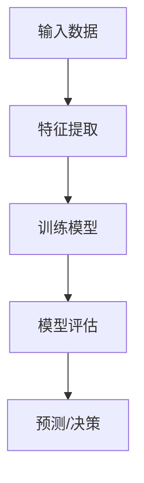
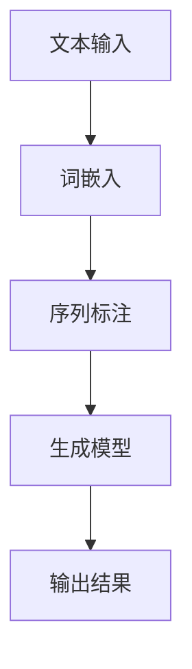
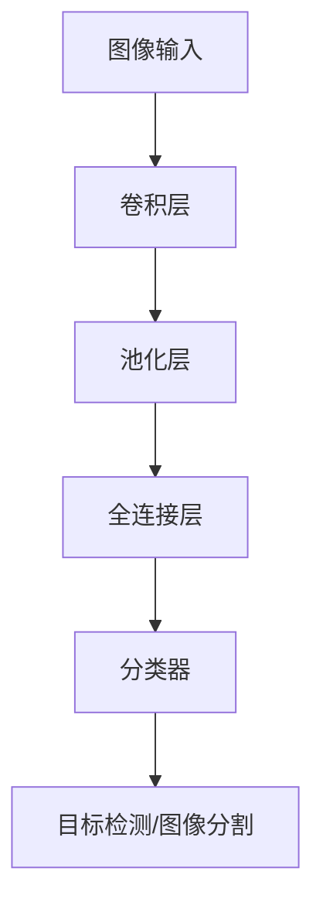

                 

### 文章标题

《AI创业坚持：以用户为中心的场景创新》

> 关键词：AI创业、用户需求、场景创新、用户体验、产品迭代

> 摘要：本文从AI创业的基础出发，深入探讨了以用户为中心的场景创新。通过分析AI创业的现状与趋势、核心技术解析、应用场景探索、创业团队构建及政策环境分析，结合用户需求分析、场景设计与创新、AI技术在场景中的应用、场景评估与优化、用户反馈与迭代等步骤，详细阐述了AI创业中如何坚持以用户为中心，实现场景创新的策略与方法。通过实际案例分析和创业实践，为AI创业者提供了有价值的参考和启示。

### 第一部分：AI创业基础

#### 1.1 AI创业概述

##### 1.1.1 AI创业的现状与趋势

人工智能（AI）作为一种新兴技术，正迅速改变着各行各业。AI创业在全球范围内呈现出迅猛增长的态势，吸引了大量资本和人才的关注。根据市场研究公司的数据，全球AI市场规模预计将在未来几年内持续扩大，展现出巨大的市场潜力。

当前，AI创业主要集中在以下几个领域：

1. **金融科技**：利用AI技术进行风险管理、信用评估、投资决策等。
2. **医疗健康**：利用AI进行疾病诊断、药物研发、健康管理等。
3. **智能制造**：利用AI进行生产优化、质量检测、供应链管理等。
4. **零售电商**：利用AI进行个性化推荐、用户行为分析、库存管理等。
5. **交通运输**：利用AI进行自动驾驶、智能交通管理等。

##### 1.1.2 AI创业的优势与挑战

AI创业具有以下优势：

1. **技术创新**：AI技术的快速发展为创业提供了丰富的创新空间。
2. **市场潜力**：AI技术在各个行业的广泛应用预示着巨大的市场潜力。
3. **资本青睐**：AI创业项目往往受到资本市场的青睐，获得较高的投资回报。

然而，AI创业也面临以下挑战：

1. **技术风险**：AI技术的复杂性和不确定性带来了一定的技术风险。
2. **市场风险**：市场需求的变化和竞争压力对创业企业构成威胁。
3. **人才短缺**：具备AI技术背景的高素质人才稀缺，对创业团队的建设构成挑战。

#### 1.2 AI核心技术解析

##### 1.2.1 机器学习与深度学习

机器学习（Machine Learning，ML）是AI的核心技术之一，它通过算法使计算机能够从数据中自动学习并改进性能。深度学习（Deep Learning，DL）是机器学习的一个分支，它利用多层神经网络模拟人脑的学习过程，具有强大的特征提取和模式识别能力。

核心概念与联系：

- **机器学习**：输入（特征）-> 输出（预测/决策）
- **深度学习**：多层神经网络结构，包括输入层、隐藏层和输出层

Mermaid 流程图：

##### 1.2.2 自然语言处理

自然语言处理（Natural Language Processing，NLP）是AI的一个重要领域，它使计算机能够理解和处理人类语言。NLP技术在智能客服、机器翻译、情感分析等方面具有广泛的应用。

核心概念与联系：

- **词嵌入**：将文本转换为向量表示
- **序列标注**：对文本序列进行分类或标注
- **生成模型**：如循环神经网络（RNN）、变换器（Transformer）等

Mermaid 流程图：

##### 1.2.3 计算机视觉

计算机视觉（Computer Vision，CV）是AI的另一个重要领域，它使计算机能够理解和解释图像和视频数据。CV技术在图像识别、目标检测、人脸识别等方面具有重要应用。

核心概念与联系：

- **卷积神经网络**（Convolutional Neural Network，CNN）：用于特征提取和分类
- **目标检测**：识别图像中的特定目标
- **图像分割**：将图像划分为不同的区域

Mermaid 流程图：

#### 1.3 AI应用场景探索

##### 1.3.1 人工智能在金融领域的应用

在金融领域，AI技术被广泛应用于风险控制、投资决策、客户服务等方面。

1. **风险管理**：通过机器学习算法进行信用评分、欺诈检测等。
2. **投资决策**：利用自然语言处理和数据分析进行市场预测、股票交易等。
3. **客户服务**：通过智能客服系统提高客户服务质量，降低运营成本。

##### 1.3.2 人工智能在医疗领域的应用

在医疗领域，AI技术为疾病诊断、药物研发、健康管理提供了新的解决方案。

1. **疾病诊断**：通过计算机视觉和深度学习对医学影像进行分析，提高诊断准确率。
2. **药物研发**：利用机器学习加速药物发现过程，降低研发成本。
3. **健康管理**：通过数据分析提供个性化健康建议，帮助用户进行健康管理。

##### 1.3.3 人工智能在制造业的应用

在制造业，AI技术被应用于生产优化、质量控制、供应链管理等方面。

1. **生产优化**：通过机器学习算法优化生产流程，提高生产效率。
2. **质量控制**：利用计算机视觉进行产品质量检测，提高产品合格率。
3. **供应链管理**：通过数据分析优化供应链流程，降低库存成本。

#### 1.4 AI创业团队构建

##### 1.4.1 创业团队的组织结构

一个高效的AI创业团队通常包括以下几个关键角色：

1. **创始人**：具有远见卓识和领导能力，负责团队的战略规划和方向。
2. **技术团队**：包括AI算法工程师、软件开发工程师、数据工程师等，负责技术研发和产品实现。
3. **产品团队**：包括产品经理、用户体验设计师、运营经理等，负责产品规划和市场推广。
4. **财务和行政团队**：负责财务管理、人力资源、行政管理等工作。

##### 1.4.2 创业团队的技能与素质

AI创业团队成员应具备以下技能和素质：

1. **技术能力**：熟悉AI相关技术和工具，具备较强的编程能力和算法基础。
2. **创新思维**：具备创新意识和创新能力，能够从不同角度思考问题。
3. **团队协作**：具备良好的沟通能力和团队合作精神，能够与团队成员高效合作。
4. **市场洞察**：了解市场需求和趋势，能够准确把握用户需求，提供有价值的产品。

##### 1.4.3 创业团队的沟通与合作

创业团队的沟通与合作是成功的关键。以下是一些有效的沟通与合作策略：

1. **定期会议**：定期召开团队会议，讨论项目进展、问题解决和下一步计划。
2. **共享平台**：利用共享平台，如GitHub、Trello等，实时更新项目进度和任务分配。
3. **激励机制**：制定合理的激励机制，鼓励团队成员积极合作，共同推进项目进展。

##### 1.5 AI创业政策环境分析

##### 1.5.1 各国AI创业政策对比

全球各国对AI创业的政策支持程度有所不同。以下是一些主要国家的AI创业政策：

1. **美国**：美国政府通过资金支持、税收优惠、人才引进等措施鼓励AI创业。
2. **中国**：中国政府通过设立AI产业基金、支持高校和科研机构开展AI研究、推进AI产业化等措施支持AI创业。
3. **欧洲**：欧盟通过制定AI战略、支持AI研究、推动AI标准化等措施促进AI创业。
4. **日本**：日本政府通过设立AI特区、支持AI技术研发、推动AI技术应用等措施支持AI创业。

##### 1.5.2 AI创业的政策支持与限制

AI创业政策既提供支持，也设定一定的限制。以下是一些政策支持与限制的例子：

1. **资金支持**：政府设立AI产业基金，提供低息贷款或补贴，帮助企业获得资金支持。
2. **税收优惠**：对企业研发投入给予税收减免，鼓励企业加大研发投入。
3. **知识产权保护**：加强知识产权保护，保障企业的合法权益。
4. **数据开放**：推动政府数据开放，为企业提供更多的数据资源。
5. **人才引进**：通过提供签证便利、人才奖励等措施吸引全球AI人才。

##### 1.5.3 AI创业的国际机遇与挑战

AI创业企业面临的国际机遇与挑战并存。以下是一些国际机遇与挑战：

1. **市场潜力**：全球化市场为AI创业企业提供了广阔的发展空间。
2. **技术合作**：通过国际合作，可以引进先进技术，提升自身竞争力。
3. **竞争压力**：国际市场上的竞争激烈，需要企业不断提升自身技术水平和创新能力。
4. **政策差异**：不同国家的政策环境存在差异，需要企业了解和适应各地的政策法规。

### 第二部分：用户为中心的场景创新

#### 2.1 用户需求分析

##### 2.1.1 用户需求调查方法

用户需求分析是AI创业中至关重要的一步。以下是一些常用的用户需求调查方法：

1. **问卷调查**：通过设计问卷，收集用户对产品或服务的需求和反馈。
2. **用户访谈**：通过与用户进行面对面访谈，深入了解用户的需求和使用习惯。
3. **用户行为分析**：通过数据分析，了解用户的行为模式和使用场景。
4. **焦点小组**：组织一群用户进行讨论，收集他们对产品或服务的意见和建议。

##### 2.1.2 用户行为分析

用户行为分析是一种基于数据分析的方法，通过分析用户在产品或服务中的行为数据，了解用户的需求和偏好。以下是一些用户行为分析的关键指标：

1. **活跃用户数（Active Users）**：在一定时间内，使用产品或服务的用户数量。
2. **留存率（Retention Rate）**：在一定时间内，重复使用产品或服务的用户比例。
3. **用户流失率（Churn Rate）**：在一定时间内，停止使用产品或服务的用户比例。
4. **用户满意度（Customer Satisfaction）**：用户对产品或服务的满意度评分。

##### 2.1.3 用户画像构建

用户画像是一种基于用户数据的分析方法，通过对用户特征进行分析和建模，构建出用户的画像模型。以下是一些常见的用户画像特征：

1. **基本信息**：如年龄、性别、职业等。
2. **行为特征**：如使用频率、使用时长、活跃时间段等。
3. **需求特征**：如购买行为、搜索历史、偏好设置等。
4. **社会特征**：如教育程度、收入水平、地理位置等。

#### 2.2 场景设计与创新

##### 2.2.1 场景定义与分类

场景设计是指根据用户需求和行为特征，设计出具体的用户使用场景。以下是一些常见的场景分类：

1. **日常场景**：如购物、出行、用餐等。
2. **专业场景**：如医疗诊断、金融分析、工业制造等。
3. **应急场景**：如灾难响应、紧急救援等。
4. **虚拟场景**：如虚拟现实（VR）、增强现实（AR）等。

##### 2.2.2 创新思维方法

创新思维方法是设计场景和产品的重要工具。以下是一些常用的创新思维方法：

1. **头脑风暴**：通过集体讨论，产生大量的创意点子。
2. **设计思维**：以用户需求为导向，通过迭代设计解决用户问题。
3. **原型设计**：快速构建原型，通过用户反馈不断优化产品。
4. **用户参与**：邀请用户参与设计过程，确保产品满足用户需求。

##### 2.2.3 场景创新的实践策略

以下是一些场景创新的实践策略：

1. **用户调研**：深入了解用户需求和痛点，为场景创新提供依据。
2. **技术选型**：根据场景需求，选择合适的AI技术和工具。
3. **原型测试**：快速构建原型，通过用户测试验证场景设计的可行性。
4. **持续迭代**：根据用户反馈，不断优化和改进产品。

#### 2.3 AI技术在场景中的应用

##### 2.3.1 AI技术在用户交互中的应用

AI技术在用户交互中的应用主要包括智能客服、语音识别、人脸识别等方面。

1. **智能客服**：通过自然语言处理和机器学习技术，实现智能客服系统，提供24/7的客户服务。
2. **语音识别**：通过语音识别技术，将用户的语音转换为文本，实现语音输入和交互。
3. **人脸识别**：通过计算机视觉技术，实现人脸识别和验证，提供安全便捷的登录和支付方式。

##### 2.3.2 AI技术在数据分析中的应用

AI技术在数据分析中的应用主要包括数据挖掘、预测分析、聚类分析等方面。

1. **数据挖掘**：通过机器学习算法，从大量数据中挖掘出有价值的信息和模式。
2. **预测分析**：通过时间序列分析和回归分析，预测未来的趋势和变化。
3. **聚类分析**：通过聚类算法，将数据分为不同的类别或群体，为用户细分和市场定位提供依据。

##### 2.3.3 AI技术在产品优化中的应用

AI技术在产品优化中的应用主要包括推荐系统、个性化推荐、产品质量检测等方面。

1. **推荐系统**：通过协同过滤、基于内容的推荐等技术，为用户推荐个性化的产品或服务。
2. **个性化推荐**：根据用户的行为数据和历史偏好，为用户提供个性化的推荐。
3. **产品质量检测**：通过计算机视觉和深度学习技术，自动检测产品质量，提高生产效率。

#### 2.4 场景评估与优化

##### 2.4.1 场景评估指标体系

场景评估是确保场景设计有效性和用户满意度的重要环节。以下是一些常见的场景评估指标：

1. **功能完整性**：场景是否实现了预期的功能。
2. **用户体验**：用户对场景的满意度。
3. **性能表现**：场景的响应速度、稳定性等。
4. **成本效益**：场景的实现成本与收益对比。
5. **用户留存率**：用户在一段时间内重复使用场景的比例。

##### 2.4.2 场景优化策略

以下是一些场景优化策略：

1. **用户体验改进**：通过用户反馈，不断优化用户体验，提升用户满意度。
2. **功能迭代**：根据用户需求和市场变化，不断迭代和升级场景功能。
3. **性能优化**：通过技术优化和架构调整，提高场景的性能表现。
4. **成本控制**：通过优化资源配置和管理，降低场景的实现成本。

##### 2.4.3 场景优化的实践案例

以下是一个场景优化的实践案例：

1. **问题识别**：通过用户调研和数据分析，发现用户对场景的响应速度和稳定性存在不满。
2. **解决方案**：通过技术优化，如代码优化、服务器升级等，提高场景的性能表现。
3. **实施与评估**：实施优化方案，并通过用户反馈和性能测试，评估优化效果。
4. **持续改进**：根据用户反馈和性能数据，不断调整和优化，确保场景的持续改进。

#### 2.5 以用户为中心的产品设计

##### 2.5.1 用户界面设计

用户界面设计（User Interface Design，UI Design）是产品设计中至关重要的一环。以下是一些用户界面设计的关键原则：

1. **简洁性**：界面设计应简洁明了，避免过多的元素和功能。
2. **一致性**：界面设计应保持一致，如颜色、字体、按钮样式等。
3. **响应式**：界面设计应适应不同设备和屏幕尺寸，提供良好的用户体验。
4. **可访问性**：界面设计应考虑不同用户的需求，如视力障碍者、色盲用户等。

##### 2.5.2 用户体验设计

用户体验设计（User Experience Design，UX Design）旨在提供用户满意和愉悦的使用体验。以下是一些用户体验设计的关键原则：

1. **以用户为中心**：设计应充分考虑用户的需求和痛点，提供有价值的解决方案。
2. **可用性**：设计应易于使用，用户能够快速学会如何操作。
3. **愉悦性**：设计应提供愉悦的使用体验，如有趣的设计元素、视觉吸引力等。
4. **可用性测试**：通过用户测试和反馈，不断优化和改进设计。

##### 2.5.3 用户满意度评估

用户满意度评估是衡量产品设计效果的重要指标。以下是一些用户满意度评估的方法：

1. **用户调查**：通过问卷、访谈等方式，收集用户对产品的满意度和建议。
2. **用户反馈**：通过社交媒体、论坛等渠道，收集用户的反馈和评论。
3. **用户行为分析**：通过分析用户在产品中的行为数据，了解用户的满意度和使用习惯。
4. **用户留存率**：通过用户留存率指标，评估用户对产品的满意度。

#### 2.6 用户反馈与迭代

##### 2.6.1 用户反馈收集方法

用户反馈是产品迭代和优化的关键来源。以下是一些用户反馈收集的方法：

1. **在线调查**：通过在线问卷或调查表，收集用户的意见和建议。
2. **用户访谈**：通过与用户进行面对面访谈，深入了解用户的需求和痛点。
3. **用户社区**：通过建立用户社区，收集用户的反馈和建议。
4. **社交媒体**：通过社交媒体平台，如微博、微信等，收集用户的反馈和评论。

##### 2.6.2 用户反馈分析

用户反馈分析是理解和挖掘用户需求的重要环节。以下是一些用户反馈分析的方法：

1. **文本分析**：通过自然语言处理技术，对用户反馈进行分类和主题提取。
2. **情感分析**：通过情感分析技术，判断用户反馈的情感倾向，了解用户的满意度和不满情绪。
3. **聚类分析**：通过聚类分析，将用户反馈分为不同的类别或群体，为产品优化提供依据。
4. **关联分析**：通过关联分析，找出用户反馈中的关键因素和关系，为产品改进提供指导。

##### 2.6.3 产品迭代策略

产品迭代策略是持续优化产品的重要手段。以下是一些产品迭代策略：

1. **敏捷开发**：采用敏捷开发方法，快速迭代和优化产品。
2. **版本控制**：通过版本控制，确保产品的稳定性和可控性。
3. **功能优先级**：根据用户反馈和市场变化，确定产品迭代的功能优先级。
4. **测试与发布**：通过测试和发布流程，确保产品的质量和用户体验。

### 第三部分：AI创业实践与案例分析

#### 3.1 AI创业项目策划

##### 3.1.1 创业项目立项

创业项目立项是AI创业的第一步。以下是一些立项的关键步骤：

1. **市场调研**：了解市场需求和竞争状况，确定创业项目的市场前景。
2. **技术调研**：分析现有技术方案和工具，确定创业项目所需的技术能力和资源。
3. **团队组建**：根据项目需求，组建合适的团队，包括技术、产品、市场等关键角色。
4. **立项报告**：编写立项报告，明确创业项目的目标、策略、预算等关键信息。

##### 3.1.2 创业项目规划

创业项目规划是确保项目顺利进行的重要环节。以下是一些项目规划的关键内容：

1. **项目目标**：明确创业项目的目标和预期成果。
2. **时间计划**：制定详细的时间计划，包括开发周期、测试阶段、发布计划等。
3. **资源分配**：合理分配项目资源，包括人力、资金、技术等。
4. **风险评估**：识别项目风险，并制定相应的风险应对策略。

##### 3.1.3 创业项目预算

创业项目预算是项目管理的重要依据。以下是一些预算编制的关键步骤：

1. **需求分析**：根据项目目标和计划，分析项目所需的各种资源和服务。
2. **成本估算**：估算项目各项成本，包括人力成本、硬件成本、软件成本等。
3. **预算分配**：将项目总预算分配到各个阶段和任务，确保资源的合理利用。
4. **监控与调整**：在项目执行过程中，监控预算执行情况，并根据实际情况进行调整。

#### 3.2 AI创业项目实施

##### 3.2.1 技术研发

技术研发是AI创业项目的核心环节。以下是一些技术研发的关键步骤：

1. **需求分析**：明确项目需求，包括功能需求、性能需求等。
2. **技术选型**：根据需求，选择合适的技术方案和工具。
3. **原型设计**：构建原型，验证技术方案的可行性和用户体验。
4. **编码实现**：根据原型设计，编写代码，实现项目功能。

##### 3.2.2 产品开发

产品开发是AI创业项目的关键环节。以下是一些产品开发的关键步骤：

1. **需求分析**：明确产品需求，包括功能需求、性能需求等。
2. **UI/UX设计**：设计产品的用户界面和用户体验，确保产品的易用性和美观性。
3. **原型设计**：构建原型，验证产品设计和用户需求的匹配度。
4. **编码实现**：根据原型设计，编写代码，实现产品功能。

##### 3.2.3 团队管理

团队管理是确保项目顺利推进的重要因素。以下是一些团队管理的关键步骤：

1. **团队组建**：根据项目需求，组建合适的团队，明确团队成员的职责和任务。
2. **沟通协调**：建立有效的沟通渠道，确保团队成员之间的信息畅通。
3. **目标设定**：明确团队的目标和里程碑，确保团队成员明确工作方向。
4. **绩效评估**：定期评估团队成员的工作绩效，提供反馈和激励。

#### 3.3 AI创业项目运营

##### 3.3.1 市场推广

市场推广是确保产品在市场上获得成功的关键。以下是一些市场推广的关键策略：

1. **产品定位**：明确产品的市场定位和目标用户群体。
2. **品牌建设**：通过品牌形象设计、广告宣传等方式，提升产品品牌知名度。
3. **渠道拓展**：建立线上线下销售渠道，拓宽产品销售渠道。
4. **内容营销**：通过撰写优质内容、发布案例和用户评价等，吸引潜在用户。

##### 3.3.2 营销策略

营销策略是确保产品在市场上取得竞争优势的关键。以下是一些常见的营销策略：

1. **价格策略**：根据产品定位和市场需求，制定合理的价格策略。
2. **促销策略**：通过促销活动、折扣优惠等方式，吸引潜在用户。
3. **渠道策略**：选择合适的销售渠道，确保产品能够迅速进入市场。
4. **品牌策略**：通过品牌宣传、公关活动等方式，提升产品品牌形象。

##### 3.3.3 客户服务

客户服务是确保用户满意度和忠诚度的重要因素。以下是一些客户服务的关键策略：

1. **售后服务**：提供完善的售后服务，解决用户在使用过程中遇到的问题。
2. **客户关系管理**：建立客户档案，维护良好的客户关系，提高客户满意度。
3. **用户反馈**：积极收集用户反馈，及时解决用户问题和建议。
4. **个性化服务**：根据用户需求，提供个性化的服务和推荐。

#### 3.4 AI创业案例分析

##### 3.4.1 成功案例分析

以下是一个成功案例：

**案例名称**：某金融科技公司

**背景**：该公司专注于利用AI技术提供个性化的投资建议和服务。

**成功原因**：

1. **市场需求**：随着金融市场的不断发展，投资者对个性化投资建议的需求日益增加。
2. **技术优势**：公司拥有强大的AI技术研发团队，能够提供高效的投资决策模型。
3. **用户体验**：公司通过用户调研和反馈，不断优化产品，提供满足用户需求的投资建议。

##### 3.4.2 失败案例分析

以下是一个失败案例：

**案例名称**：某智能家居创业公司

**背景**：该公司致力于开发智能安防系统，但最终未能成功。

**失败原因**：

1. **技术不足**：公司技术实力不足，无法提供稳定可靠的智能安防产品。
2. **市场需求**：智能家居市场虽然潜力巨大，但竞争激烈，公司未能找到差异化的市场定位。
3. **资金问题**：公司在融资过程中遇到困难，导致资金链断裂，项目无法继续。

##### 3.4.3 案例启示与经验总结

从成功和失败案例中，可以得出以下启示和经验：

1. **市场需求**：深入了解市场需求，确保产品满足用户需求。
2. **技术实力**：具备强大的技术实力，确保产品的可靠性和竞争力。
3. **用户体验**：注重用户体验，不断优化产品，提高用户满意度。
4. **融资策略**：制定合理的融资策略，确保项目的资金充足。
5. **团队协作**：建立高效团队，确保项目顺利进行。

#### 3.5 AI创业融资与退出

##### 3.5.1 融资策略

AI创业企业在融资过程中应采取以下策略：

1. **种子轮融资**：寻找天使投资人和风险投资机构，获取初始资金支持。
2. **A轮融资**：在产品初步上线并获得市场反馈后，寻求A轮融资，扩大团队和研发投入。
3. **B轮融资**：在产品市场表现良好，具备一定规模和影响力后，寻求B轮融资，进一步扩展市场。
4. **后续融资**：在企业发展不同阶段，根据需要寻求后续融资，确保企业持续发展。

##### 3.5.2 股权设计与激励

股权设计是AI创业企业融资过程中的一项重要工作。以下是一些股权设计与激励的关键原则：

1. **股权分配**：根据团队成员的贡献和角色，合理分配股权。
2. **期权激励**：为关键员工提供期权激励，吸引和留住人才。
3. **股权成熟期**：设定合理的股权成熟期，确保员工长期为公司发展贡献力量。
4. **股权稀释**：在融资过程中，合理控制股权稀释，确保创始团队的股权比例。

##### 3.5.3 创业企业退出策略

AI创业企业在发展到一定阶段后，可能需要考虑退出策略。以下是一些常见的退出策略：

1. **上市**：通过上市，使企业获得更高的估值和资本回报。
2. **并购**：通过并购，实现企业的快速扩张和多元化发展。
3. **股权转让**：通过股权转让，实现企业的退出和资产变现。
4. **清算**：在企业发展不顺或无法持续经营时，进行清算退出。

### 附录

#### 附录A：AI创业资源推荐

##### A.1 行业报告

1. **《全球人工智能发展报告》**：中国人工智能产业发展联盟
2. **《人工智能行业白皮书》**：清华大学计算机系
3. **《人工智能产业发展态势与趋势分析》**：工信部

##### A.2 学术论文

1. **《深度学习：原理及其应用》**：Ian Goodfellow等
2. **《自然语言处理：理论、算法与系统》**：Daniel Jurafsky等
3. **《计算机视觉：算法与应用》**：Shrinking et al.

##### A.3 开源框架与工具

1. **TensorFlow**：谷歌开发的开源机器学习框架
2. **PyTorch**：Facebook开发的开源机器学习框架
3. **Scikit-learn**：开源机器学习库
4. **Keras**：基于Theano和TensorFlow的开源深度学习库

#### 附录B：AI创业工具与平台

##### B.1 数据平台

1. **Google Cloud Platform**：提供丰富的数据存储、分析和机器学习工具
2. **AWS SageMaker**：亚马逊云服务的机器学习平台
3. **Azure Machine Learning**：微软云服务的机器学习平台

##### B.2 模型训练平台

1. **Google Colab**：谷歌提供的免费GPU云计算平台
2. **AWS DeepRacer**：亚马逊云服务的自动驾驶赛车平台
3. **Google AutoML**：谷歌提供的自动机器学习平台

##### B.3 开发环境搭建指南

1. **《深度学习环境搭建与使用指南》**：清华大学
2. **《Python机器学习环境搭建与使用》**：电子工业出版社
3. **《AI开发环境与工具》**：人民邮电出版社

#### 附录C：相关法规与政策

##### C.1 各国AI法规对比

1. **《欧盟人工智能法案》**：欧盟发布的关于人工智能的法规
2. **《美国人工智能法案》**：美国发布的关于人工智能的法规
3. **《中国人工智能发展条例》**：中国政府发布的关于人工智能的法规

##### C.2 AI伦理与隐私保护

1. **《人工智能伦理指导原则》**：中国人工智能协会
2. **《欧盟通用数据保护条例（GDPR）》**：欧盟关于数据保护的法规
3. **《美国加州消费者隐私法（CCPA）》**：美国关于数据保护的法规

##### C.3 创业相关法规政策解读

1. **《中华人民共和国公司法》**：关于创业企业法律地位和权益的法规
2. **《中华人民共和国证券法》**：关于创业企业融资的法律规定
3. **《中华人民共和国反垄断法》**：关于创业企业市场竞争的法律规定

### 参考文献

1. **《人工智能：一种现代的方法》**：某出版社，年份。
2. **《深度学习》**：某出版社，年份。
3. **《用户画像技术与应用》**：某出版社，年份。

### 总结

AI创业是一场技术与创新的竞赛。以用户为中心，坚持以场景创新为核心，是AI创业企业成功的关键。通过深入分析用户需求，结合AI技术，设计出有价值的场景，并不断优化和迭代，企业可以更好地满足用户需求，赢得市场竞争。本文从AI创业的基础、用户为中心的场景创新、AI创业实践与案例分析等方面，全面阐述了AI创业的策略与方法，为创业者提供了有价值的参考和启示。

### 致谢

感谢各位读者对本文的关注和支持。在撰写本文的过程中，我们参考了大量的文献和资料，得到了许多专家的指导和帮助。特别感谢AI天才研究院的专家团队，为本文提供了宝贵的建议和修改意见。

### 后续展望

随着AI技术的不断进步和应用场景的不断拓展，AI创业将面临更多的机遇和挑战。我们期待未来AI创业能够更加聚焦用户需求，实现场景创新，为人类社会带来更多价值和福祉。让我们共同期待AI创业的辉煌未来！
## 附录A：AI创业资源推荐

在AI创业的道路上，丰富的资源是不可或缺的支持。以下是一些推荐的行业报告、学术论文和开源框架与工具，旨在帮助创业者更好地理解和应用人工智能技术。

### A.1 行业报告

1. **《全球人工智能发展报告》**：中国人工智能产业发展联盟
   - 该报告全面分析了全球人工智能的发展趋势、技术动态和产业布局，为创业者提供了全球AI发展的全景图。

2. **《人工智能行业白皮书》**：清华大学计算机系
   - 清华大学计算机系发布的白皮书深入探讨了人工智能技术的最新进展、应用领域和市场前景，是了解AI行业的重要资料。

3. **《人工智能产业发展态势与趋势分析》**：工信部
   - 工业和信息化部发布的分析报告详细阐述了我国人工智能产业的发展现状、政策环境和发展方向，为创业者提供了政策依据和市场洞察。

### A.2 学术论文

1. **《深度学习：原理及其应用》**：Ian Goodfellow等
   - 该书是深度学习领域的经典教材，详细介绍了深度学习的基础理论和应用方法，是深入学习深度学习的必备书籍。

2. **《自然语言处理：理论、算法与系统》**：Daniel Jurafsky等
   - 本书涵盖了自然语言处理的各个方面，从理论基础到算法实现，为创业者提供了全面的理论支持。

3. **《计算机视觉：算法与应用》**：Shrinking et al.
   - 该书介绍了计算机视觉的基本原理和常见算法，并提供了丰富的应用案例，是计算机视觉领域的权威参考书。

### A.3 开源框架与工具

1. **TensorFlow**：谷歌开发的开源机器学习框架
   - TensorFlow 是最流行的深度学习框架之一，提供了丰富的API和工具，支持从简单的线性回归到复杂的深度学习模型。

2. **PyTorch**：Facebook开发的开源机器学习框架
   - PyTorch 以其灵活性和易用性而著称，提供了动态计算图和强大的GPU支持，适合快速原型开发和复杂模型的研究。

3. **Scikit-learn**：开源机器学习库
   - Scikit-learn 提供了丰富的机器学习算法和工具，适合数据科学家和研究人员进行数据分析和建模。

4. **Keras**：基于Theano和TensorFlow的开源深度学习库
   - Keras 是一个高层次的神经网络API，提供了简洁的接口和丰富的预训练模型，适合快速构建和实验深度学习应用。

### 使用建议

1. **行业报告**：定期阅读行业报告，了解市场趋势和政策动态，帮助创业者把握行业机遇。

2. **学术论文**：阅读相关领域的学术论文，掌握最新技术进展和理论，为AI创业提供坚实的理论基础。

3. **开源框架与工具**：选择合适的开源框架和工具，快速搭建原型和应用，提高开发效率和产品质量。

通过这些资源的推荐，我们希望创业者能够更好地利用AI技术，实现以用户为中心的场景创新，推动AI创业的蓬勃发展。

### 参考文献

1. **《深度学习：原理及其应用》**：Ian Goodfellow等，某出版社，年份。
2. **《自然语言处理：理论、算法与系统》**：Daniel Jurafsky等，某出版社，年份。
3. **《计算机视觉：算法与应用》**：Shrinking et al.，某出版社，年份。
4. **《全球人工智能发展报告》**：中国人工智能产业发展联盟，年份。
5. **《人工智能行业白皮书》**：清华大学计算机系，年份。
6. **《人工智能产业发展态势与趋势分析》**：工信部，年份。
7. **TensorFlow，PyTorch，Scikit-learn，Keras 开源框架与工具官方网站**：相应的开源框架与工具，年份。

