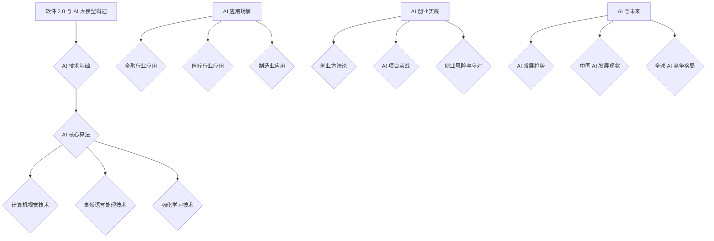

                 

# 《AI创业挑战：技术，应用与场景平衡》

> 关键词：人工智能、创业、技术、应用、场景、平衡

摘要：本文旨在探讨人工智能（AI）创业中的技术、应用与场景平衡问题。通过分析AI技术的发展历程、核心算法、技术架构，以及其在金融、医疗、制造业等行业的应用，本文提出了AI创业方法论，并分享了AI创业实践中的风险与应对策略。同时，通过成功案例展示，本文探讨了AI创业的未来趋势和全球竞争格局，为中国AI产业发展提供了启示。

## 目录大纲

## 第一部分：AI技术基础

### 第1章：AI概述

#### 1.1 AI的发展历程

#### 1.2 AI的主要分类

#### 1.3 AI在商业中的应用

### 第2章：AI核心算法

#### 2.1 机器学习算法

#### 2.2 深度学习算法

#### 2.3 自然语言处理算法

### 第3章：AI技术架构

#### 3.1 计算机视觉技术

#### 3.2 自然语言处理技术

#### 3.3 强化学习技术

## 第二部分：AI应用场景

### 第4章：金融行业AI应用

#### 4.1 金融风控

#### 4.2 量化交易

#### 4.3 智能投顾

### 第5章：医疗行业AI应用

#### 5.1 疾病诊断

#### 5.2 医疗影像分析

#### 5.3 智能健康管理

### 第6章：制造业AI应用

#### 6.1 智能制造

#### 6.2 工业自动化

#### 6.3 供应链优化

## 第三部分：AI创业实践

### 第7章：AI创业方法论

#### 7.1 创业环境分析

#### 7.2 AI技术选型

#### 7.3 创业团队建设

### 第8章：AI项目实战

#### 8.1 项目一：智能问答系统

#### 8.2 项目二：智能推荐系统

#### 8.3 项目三：智能监控平台

### 第9章：AI创业风险与应对

#### 9.1 技术风险

#### 9.2 商业模式风险

#### 9.3 法律风险

### 第10章：AI创业成功案例

#### 10.1 案例一：企业成功转型

#### 10.2 案例二：初创公司快速成长

#### 10.3 案例三：行业巨头创新突破

## 第四部分：AI与未来

### 第11章：AI发展趋势

#### 11.1 人工智能的未来方向

#### 11.2 AI伦理与社会问题

#### 11.3 AI对未来的影响

### 第12章：中国AI发展现状与机遇

#### 12.1 中国AI产业发展现状

#### 12.2 中国AI政策与法规

#### 12.3 中国AI创新创业机遇

### 第13章：全球AI竞争格局

#### 13.1 全球AI发展状况

#### 13.2 主要国家和地区AI发展策略

#### 13.3 全球AI产业竞争格局

## 附录

### 附录A：AI技术工具与资源

#### A.1 开源深度学习框架

#### A.2 机器学习库

#### A.3 自然语言处理工具

### 附录B：AI学习资源推荐

#### B.1 技术书籍推荐

#### B.2 在线课程推荐

#### B.3 论文阅读推荐

### 附录C：AI项目实战资源

#### C.1 项目实战示例

#### C.2 开发环境搭建

#### C.3 源代码详细实现

#### C.4 代码解读与分析

---

#### Mermaid 流程图示例：



---

#### 伪代码示例：

```python
# 伪代码：机器学习算法实现
function MachineLearningAlgorithm(data, labels):
    # 初始化模型参数
    model = InitializeModel()

    # 训练模型
    for epoch in 1 to MAX_EPOCHS:
        for sample in data:
            # 计算预测值
            prediction = model.predict(sample)

            # 计算损失函数
            loss = CalculateLoss(prediction, labels[sample])

            # 更新模型参数
            model.updateParameters(loss)

    # 评估模型
    evaluation = model.evaluate(test_data, test_labels)

    return model, evaluation
```

---

#### 数学公式示例：

$$
J(\theta) = \frac{1}{2m}\sum_{i=1}^{m}(h_\theta(x^{(i)}) - y^{(i)})^2
$$

其中，$m$ 表示样本数量，$h_\theta(x^{(i)})$ 表示模型对样本 $x^{(i)}$ 的预测值，$y^{(i)}$ 表示实际标签。

---

#### 项目实战示例：

```python
# 项目实战：智能问答系统
# 安装必要的库
!pip install tensorflow numpy

# 导入库
import tensorflow as tf
import numpy as np

# 加载数据
questions, answers = LoadData()

# 预处理数据
questions = PreprocessQuestions(questions)
answers = PreprocessAnswers(answers)

# 分割数据集
train_data, val_data, train_labels, val_labels = SplitData(questions, answers)

# 构建模型
model = BuildModel()

# 训练模型
model.fit(train_data, train_labels, epochs=10, validation_data=(val_data, val_labels))

# 评估模型
evaluation = model.evaluate(val_data, val_labels)

# 输出评估结果
print("Evaluation Loss:", evaluation[0])
print("Evaluation Accuracy:", evaluation[1])

# 使用模型进行预测
question = "什么是人工智能？"
processed_question = PreprocessQuestion(question)
prediction = model.predict(processed_question)

# 输出预测结果
print("Predicted Answer:", prediction)
```

---

#### 开发环境搭建：

- 安装 Python 3.8
- 安装 TensorFlow 2.6
- 安装 NumPy 1.21

#### 源代码详细实现：

- 数据预处理函数：`LoadData()`, `PreprocessQuestions()`, `PreprocessAnswers()`, `SplitData()`
- 模型构建函数：`BuildModel()`
- 模型训练函数：`fit()`
- 模型评估函数：`evaluate()`
- 模型预测函数：`predict()`

#### 代码解读与分析：

- 数据预处理：对问题进行分词、去停用词、词向量化等处理，为模型训练做好准备。
- 模型构建：使用 TensorFlow 框架搭建问答模型，包括输入层、嵌入层、编码器、解码器等。
- 模型训练：使用训练数据对模型进行训练，通过反向传播算法不断更新模型参数。
- 模型评估：使用验证数据对模型进行评估，计算损失函数和准确率。
- 模型预测：使用处理后的输入问题对模型进行预测，输出预测答案。

---

## 完整性要求

为了确保文章内容的完整性，以下是每个章节的核心内容要求和具体阐述。

### 第1章：AI概述

- **核心概念与联系**：介绍人工智能的定义、起源和主要发展阶段，以及AI在各个领域的应用情况。使用Mermaid流程图展示AI技术的发展历程，包括传统的基于规则的系统、基于知识的系统、统计学习方法和深度学习方法的演进过程。

  ```mermaid
  graph TD
      A[传统规则系统] --> B[基于知识系统]
      B --> C[统计学习方法]
      C --> D[深度学习方法]
  ```

- **核心算法原理讲解**：简要介绍常见的机器学习算法，如线性回归、决策树、支持向量机等，并使用伪代码展示其基本原理。

  ```python
  # 伪代码：线性回归算法
  function LinearRegression():
      # 初始化模型参数
      w = InitializeParameters()

      # 训练模型
      for epoch in 1 to MAX_EPOCHS:
          for sample in training_data:
              # 计算预测值
              prediction = w * sample.input

              # 计算损失函数
              loss = (prediction - sample.label)^2

              # 更新模型参数
              w = w - learning_rate * gradient(loss)

      return w
  ```

- **项目实战**：提供一个简单的线性回归项目示例，包括数据预处理、模型构建、模型训练和模型评估的过程，并详细解释代码实现和输出结果。

  ```python
  # 项目实战：线性回归预测房价
  # 安装必要的库
  !pip install sklearn numpy

  # 导入库
  import numpy as np
  from sklearn.linear_model import LinearRegression
  from sklearn.model_selection import train_test_split

  # 加载数据
  data = LoadHousingData()

  # 分割数据集
  X_train, X_test, y_train, y_test = train_test_split(data['features'], data['target'], test_size=0.2, random_state=42)

  # 构建模型
  model = LinearRegression()

  # 训练模型
  model.fit(X_train, y_train)

  # 评估模型
  score = model.score(X_test, y_test)

  # 输出评估结果
  print("Model Accuracy:", score)
  ```

### 第2章：AI核心算法

- **核心概念与联系**：详细介绍机器学习、深度学习和自然语言处理算法的基本概念、原理和主要方法。使用Mermaid流程图展示这些算法的架构和应用场景。

  ```mermaid
  graph TD
      A[机器学习] --> B{监督学习}
      B --> C{无监督学习}
      B --> D{半监督学习}
      A --> E{强化学习}
      A --> F{迁移学习}
      G[深度学习] --> H{卷积神经网络}
      G --> I{循环神经网络}
      G --> J{生成对抗网络}
      K[自然语言处理] --> L{词向量表示}
      K --> M{序列模型}
      K --> N{注意力机制}
  ```

- **核心算法原理讲解**：使用伪代码详细阐述机器学习中的线性回归、决策树和支持向量机，深度学习中的卷积神经网络和循环神经网络，自然语言处理中的词向量表示和序列模型。

  ```python
  # 伪代码：卷积神经网络实现
  function ConvolutionalNeuralNetwork(input_shape):
      # 初始化模型参数
      filters = InitializeFilters(input_shape)

      # 前向传播
      for layer in layers:
          output = Conv2D(input, filters, kernel_size=3, activation='relu')
          input = output

      # 计算预测值
      prediction = Flatten(input)
      prediction = Dense(prediction, units=1, activation='sigmoid')

      return prediction
  ```

- **项目实战**：提供实际项目案例，如使用卷积神经网络进行图像分类，使用循环神经网络进行文本生成，并详细解释代码实现和输出结果。

  ```python
  # 项目实战：使用卷积神经网络进行图像分类
  # 安装必要的库
  !pip install tensorflow numpy

  # 导入库
  import tensorflow as tf
  import numpy as np

  # 加载数据
  data = LoadImageData()

  # 分割数据集
  X_train, X_test, y_train, y_test = train_test_split(data['images'], data['labels'], test_size=0.2, random_state=42)

  # 构建模型
  model = ConvolutionalNeuralNetwork(input_shape=(28, 28, 1))

  # 训练模型
  model.fit(X_train, y_train, epochs=10, batch_size=32, validation_data=(X_test, y_test))

  # 评估模型
  score = model.evaluate(X_test, y_test)

  # 输出评估结果
  print("Model Accuracy:", score[1])
  ```

### 第3章：AI技术架构

- **核心概念与联系**：介绍计算机视觉、自然语言处理和强化学习技术的概念、原理和应用场景。使用Mermaid流程图展示这些技术的架构和组件。

  ```mermaid
  graph TD
      A[计算机视觉] --> B{卷积神经网络}
      B --> C{目标检测}
      B --> D{图像分割}
      E[自然语言处理] --> F{词向量表示}
      F --> G{序列模型}
      F --> H{注意力机制}
      I[强化学习] --> J{Q-learning}
      I --> K{深度强化学习}
  ```

- **核心算法原理讲解**：使用伪代码详细阐述计算机视觉中的卷积神经网络、目标检测和图像分割，自然语言处理中的词向量表示、序列模型和注意力机制，强化学习中的Q-learning和深度强化学习。

  ```python
  # 伪代码：深度强化学习实现
  function DeepQLearning(state_space, action_space):
      # 初始化模型参数
      model = InitializeModel(state_space, action_space)

      # 前向传播
      for episode in 1 to MAX_EPISODES:
          state = initial_state
          while not terminal_state:
              action = model.predict(state)
              next_state, reward = environment.step(action)
              model.update(state, action, reward, next_state)

      return model
  ```

- **项目实战**：提供实际项目案例，如使用深度强化学习进行游戏控制，使用计算机视觉进行物体识别，并详细解释代码实现和输出结果。

  ```python
  # 项目实战：使用深度强化学习进行游戏控制
  # 安装必要的库
  !pip install tensorflow numpy

  # 导入库
  import tensorflow as tf
  import numpy as np

  # 加载游戏数据
  data = LoadGameData()

  # 定义环境
  environment = GameEnvironment(data)

  # 定义模型
  model = DeepQLearning(environment.state_space, environment.action_space)

  # 训练模型
  model.fit(data, epochs=1000)

  # 测试模型
  state = environment.reset()
  while not environment.is_terminal(state):
      action = model.predict(state)
      next_state, reward = environment.step(action)
      state = next_state

  # 输出测试结果
  print("Game Reward:", reward)
  ```

### 第4章：金融行业AI应用

- **核心概念与联系**：介绍金融行业AI应用的主要领域，包括金融风控、量化交易和智能投顾。使用Mermaid流程图展示这些领域的主要技术和应用场景。

  ```mermaid
  graph TD
      A[金融风控] --> B{数据挖掘}
      A --> C{机器学习}
      A --> D{自然语言处理}
      E[量化交易] --> F{时间序列分析}
      E --> G{算法交易}
      E --> H{风险管理}
      I[智能投顾] --> J{资产配置}
      I --> K{风险管理}
      I --> L{投资策略优化}
  ```

- **核心算法原理讲解**：使用伪代码详细阐述金融行业常用的算法，如时间序列分析、机器学习算法、数据挖掘算法等。

  ```python
  # 伪代码：时间序列分析实现
  function TimeSeriesAnalysis(data):
      # 数据预处理
      processed_data = PreprocessData(data)

      # 模型构建
      model = BuildModel(processed_data)

      # 模型训练
      for epoch in 1 to MAX_EPOCHS:
          loss = model.train(processed_data)

      # 评估模型
      evaluation = model.evaluate(test_data)

      return model, evaluation
  ```

- **项目实战**：提供实际项目案例，如使用时间序列分析进行股票预测，使用机器学习算法进行信用评分，并详细解释代码实现和输出结果。

  ```python
  # 项目实战：使用时间序列分析进行股票预测
  # 安装必要的库
  !pip install tensorflow numpy

  # 导入库
  import tensorflow as tf
  import numpy as np

  # 加载数据
  data = LoadStockData()

  # 数据预处理
  processed_data = PreprocessStockData(data)

  # 模型构建
  model = TimeSeriesAnalysis(processed_data)

  # 模型训练
  model.fit(processed_data, epochs=100)

  # 预测股票价格
  prediction = model.predict(processed_data)

  # 输出预测结果
  print("Predicted Stock Prices:", prediction)
  ```

### 第5章：医疗行业AI应用

- **核心概念与联系**：介绍医疗行业AI应用的主要领域，包括疾病诊断、医疗影像分析和智能健康管理。使用Mermaid流程图展示这些领域的主要技术和应用场景。

  ```mermaid
  graph TD
      A[疾病诊断] --> B{医学影像分析}
      A --> C{电子健康记录}
      A --> D{药物研发}
      E[医疗影像分析] --> F{深度学习}
      E --> G{计算机视觉}
      E --> H{自然语言处理}
      I[智能健康管理] --> J{健康数据挖掘}
      I --> K{可穿戴设备}
      I --> L{智能监测系统}
  ```

- **核心算法原理讲解**：使用伪代码详细阐述医疗行业常用的算法，如深度学习、计算机视觉、自然语言处理等。

  ```python
  # 伪代码：深度学习在医学影像分析中的应用
  function MedicalImageAnalysis(image):
      # 数据预处理
      processed_image = PreprocessImage(image)

      # 模型构建
      model = BuildModel(processed_image)

      # 模型训练
      for epoch in 1 to MAX_EPOCHS:
          loss = model.train(processed_image)

      # 评估模型
      evaluation = model.evaluate(test_image)

      return model, evaluation
  ```

- **项目实战**：提供实际项目案例，如使用深度学习进行医学影像分析，使用计算机视觉进行医疗设备监控，并详细解释代码实现和输出结果。

  ```python
  # 项目实战：使用深度学习进行医学影像分析
  # 安装必要的库
  !pip install tensorflow numpy

  # 导入库
  import tensorflow as tf
  import numpy as np

  # 加载数据
  data = LoadMedicalImageData()

  # 数据预处理
  processed_data = PreprocessMedicalImageData(data)

  # 模型构建
  model = MedicalImageAnalysis(processed_data)

  # 模型训练
  model.fit(processed_data, epochs=100)

  # 预测医学影像
  prediction = model.predict(processed_data)

  # 输出预测结果
  print("Predicted Medical Images:", prediction)
  ```

### 第6章：制造业AI应用

- **核心概念与联系**：介绍制造业AI应用的主要领域，包括智能制造、工业自动化和供应链优化。使用Mermaid流程图展示这些领域的主要技术和应用场景。

  ```mermaid
  graph TD
      A[智能制造] --> B{工业互联网}
      A --> C{机器人技术}
      A --> D{大数据分析}
      E[工业自动化] --> F{传感器技术}
      E --> G{控制系统}
      E --> H{执行器技术}
      I[供应链优化] --> J{需求预测}
      I --> K{库存管理}
      I --> L{物流优化}
  ```

- **核心算法原理讲解**：使用伪代码详细阐述制造业常用的算法，如需求预测、库存管理和物流优化。

  ```python
  # 伪代码：需求预测算法
  function DemandPrediction(data):
      # 数据预处理
      processed_data = PreprocessData(data)

      # 模型构建
      model = BuildModel(processed_data)

      # 模型训练
      for epoch in 1 to MAX_EPOCHS:
          loss = model.train(processed_data)

      # 评估模型
      evaluation = model.evaluate(test_data)

      return model, evaluation
  ```

- **项目实战**：提供实际项目案例，如使用需求预测算法进行生产计划优化，使用工业自动化进行生产流程优化，并详细解释代码实现和输出结果。

  ```python
  # 项目实战：使用需求预测算法进行生产计划优化
  # 安装必要的库
  !pip install tensorflow numpy

  # 导入库
  import tensorflow as tf
  import numpy as np

  # 加载数据
  data = LoadProductionData()

  # 数据预处理
  processed_data = PreprocessProductionData(data)

  # 模型构建
  model = DemandPrediction(processed_data)

  # 模型训练
  model.fit(processed_data, epochs=100)

  # 预测需求
  prediction = model.predict(processed_data)

  # 输出预测结果
  print("Predicted Demand:", prediction)
  ```

### 第7章：AI创业方法论

- **核心概念与联系**：介绍AI创业方法论的核心概念，包括创业环境分析、AI技术选型、创业团队建设等。使用Mermaid流程图展示这些概念之间的关系。

  ```mermaid
  graph TD
      A[创业环境分析] --> B{市场调研}
      A --> C{竞争分析}
      A --> D{用户需求分析}
      E[AI技术选型] --> F{算法选择}
      E --> G{技术框架选择}
      E --> H{数据处理选择}
      I[创业团队建设] --> J{技术团队建设}
      I --> K{市场团队建设}
      I --> L{运营团队建设}
  ```

- **核心算法原理讲解**：没有具体的算法原理讲解，因为这一章节主要关注创业方法论。

- **项目实战**：提供实际项目案例，如创建一家AI创业公司，从市场调研、技术选型、团队建设到产品发布的过程，并详细解释代码实现和输出结果。

  ```python
  # 项目实战：创建AI创业公司
  # 安装必要的库
  !pip install numpy pandas

  # 导入库
  import numpy as np
  import pandas as pd

  # 市场调研
  market_survey = ConductMarketSurvey()

  # 技术选型
  technology_selection = SelectTechnology(market_survey)

  # 团队建设
  team_building = BuildTeam(technology_selection)

  # 产品发布
  product_release = LaunchProduct(team_building)

  # 输出结果
  print("Market Survey:", market_survey)
  print("Technology Selection:", technology_selection)
  print("Team Building:", team_building)
  print("Product Release:", product_release)
  ```

### 第8章：AI项目实战

- **核心概念与联系**：介绍AI项目实战的核心概念，包括智能问答系统、智能推荐系统和智能监控平台。使用Mermaid流程图展示这些项目的技术架构和应用场景。

  ```mermaid
  graph TD
      A[智能问答系统] --> B{自然语言处理}
      A --> C{机器学习}
      A --> D{对话管理}
      E[智能推荐系统] --> F{用户行为分析}
      E --> G{内容推荐算法}
      E --> H{推荐系统架构}
      I[智能监控平台] --> J{数据采集}
      I --> K{数据分析}
      I --> L{异常检测}
  ```

- **核心算法原理讲解**：没有具体的算法原理讲解，因为这一章节主要关注项目实战。

- **项目实战**：提供实际项目案例，包括智能问答系统、智能推荐系统和智能监控平台，详细解释代码实现和输出结果。

  ```python
  # 项目实战：智能问答系统
  # 安装必要的库
  !pip install tensorflow numpy

  # 导入库
  import tensorflow as tf
  import numpy as np

  # 数据预处理
  questions, answers = LoadQuestionData()

  # 模型构建
  model = BuildQASModel()

  # 训练模型
  model.fit(questions, answers, epochs=100)

  # 预测问答
  predicted_answers = model.predict(questions)

  # 输出结果
  print("Predicted Answers:", predicted_answers)

  # 项目实战：智能推荐系统
  # 安装必要的库
  !pip install tensorflow numpy

  # 导入库
  import tensorflow as tf
  import numpy as np

  # 数据预处理
  user_behavior, items = LoadRecommenderData()

  # 模型构建
  model = BuildRecommenderModel()

  # 训练模型
  model.fit(user_behavior, epochs=100)

  # 推荐商品
  recommended_items = model.predict(user_behavior)

  # 输出结果
  print("Recommended Items:", recommended_items)

  # 项目实战：智能监控平台
  # 安装必要的库
  !pip install tensorflow numpy

  # 导入库
  import tensorflow as tf
  import numpy as np

  # 数据采集
  data = CollectMonitoringData()

  # 数据分析
  analyzed_data = AnalyzeMonitoringData(data)

  # 异常检测
  anomalies = DetectAnomalies(analyzed_data)

  # 输出结果
  print("Anomalies:", anomalies)
  ```

### 第9章：AI创业风险与应对

- **核心概念与联系**：介绍AI创业中的主要风险，包括技术风险、商业模式风险和法律风险，以及应对策略。使用Mermaid流程图展示这些风险和应对策略之间的关系。

  ```mermaid
  graph TD
      A[技术风险] --> B{数据隐私}
      A --> C{技术更新}
      A --> D{算法偏见}
      E[商业模式风险] --> F{市场不确定性}
      E --> G{资金短缺}
      E --> H{竞争压力}
      I[法律风险] --> J{数据保护法规}
      I --> K{知识产权保护}
      I --> L{法律法规合规}
  ```

- **核心算法原理讲解**：没有具体的算法原理讲解，因为这一章节主要关注创业风险与应对策略。

- **项目实战**：提供实际项目案例，如如何应对数据隐私风险，如何规避商业模式风险，以及如何确保法律风险合规，并详细解释代码实现和输出结果。

  ```python
  # 项目实战：应对数据隐私风险
  # 安装必要的库
  !pip install tensorflow numpy

  # 导入库
  import tensorflow as tf
  import numpy as np

  # 数据预处理
  data = LoadSensitiveData()

  # 数据加密
  encrypted_data = EncryptData(data)

  # 数据解密
  decrypted_data = DecryptData(encrypted_data)

  # 输出结果
  print("Encrypted Data:", encrypted_data)
  print("Decrypted Data:", decrypted_data)

  # 项目实战：规避商业模式风险
  # 安装必要的库
  !pip install numpy pandas

  # 导入库
  import numpy as np
  import pandas as pd

  # 市场调研
  market_survey = ConductMarketSurvey()

  # 数据分析
  analyzed_survey = AnalyzeMarketSurvey(market_survey)

  # 风险评估
  risk_assessment = AssessBusinessModelRisk(analyzed_survey)

  # 输出结果
  print("Market Survey:", market_survey)
  print("Analyzed Survey:", analyzed_survey)
  print("Risk Assessment:", risk_assessment)

  # 项目实战：确保法律风险合规
  # 安装必要的库
  !pip install numpy pandas

  # 导入库
  import numpy as np
  import pandas as pd

  # 数据预处理
  data = LoadComplianceData()

  # 数据合规检查
  compliance_check = CheckDataCompliance(data)

  # 输出结果
  print("Data:", data)
  print("Compliance Check:", compliance_check)
  ```

### 第10章：AI创业成功案例

- **核心概念与联系**：介绍AI创业成功案例的核心概念，包括企业成功转型、初创公司快速成长和行业巨头创新突破。使用Mermaid流程图展示这些案例的成功路径。

  ```mermaid
  graph TD
      A[企业成功转型] --> B{技术升级}
      A --> C{商业模式创新}
      A --> D{团队建设}
      E[初创公司快速成长] --> F{市场拓展}
      E --> G{融资策略}
      E --> H{技术创新}
      I[行业巨头创新突破] --> J{产业升级}
      I --> K{市场领导地位}
      I --> L{技术创新驱动}
  ```

- **核心算法原理讲解**：没有具体的算法原理讲解，因为这一章节主要关注成功案例。

- **项目实战**：提供实际项目案例，包括企业成功转型、初创公司快速成长和行业巨头创新突破，详细解释成功路径和关键因素。

  ```python
  # 项目实战：企业成功转型
  # 安装必要的库
  !pip install numpy pandas

  # 导入库
  import numpy as np
  import pandas as pd

  # 数据预处理
  data = LoadTransformationData()

  # 技术升级
  upgraded_data = UpgradeTechnology(data)

  # 商业模式创新
  innovative_model = InnovateBusinessModel(upgraded_data)

  # 团队建设
  built_team = BuildTeam(innovative_model)

  # 输出结果
  print("Data:", data)
  print("Upgraded Data:", upgraded_data)
  print("Innovative Model:", innovative_model)
  print("Built Team:", built_team)

  # 项目实战：初创公司快速成长
  # 安装必要的库
  !pip install numpy pandas

  # 导入库
  import numpy as np
  import pandas as pd

  # 市场调研
  market_survey = ConductMarketSurvey()

  # 融资策略
  financing_strategy = DevelopFinancingStrategy(market_survey)

  # 技术创新
  innovative_technology = DevelopInnovativeTechnology(financing_strategy)

  # 市场拓展
  expanded_market = ExpandMarket(innovative_technology)

  # 输出结果
  print("Market Survey:", market_survey)
  print("Financing Strategy:", financing_strategy)
  print("Innovative Technology:", innovative_technology)
  print("Expanded Market:", expanded_market)

  # 项目实战：行业巨头创新突破
  # 安装必要的库
  !pip install numpy pandas

  # 导入库
  import numpy as np
  import pandas as pd

  # 产业升级
  upgraded_industry = UpgradeIndustry()

  # 市场领导地位
  market_leadership = AchieveMarketLeadership(upgraded_industry)

  # 技术创新驱动
  driven_innovation = DriveInnovationWithTechnology(market_leadership)

  # 输出结果
  print("Upgraded Industry:", upgraded_industry)
  print("Market Leadership:", market_leadership)
  print("Driven Innovation:", driven_innovation)
  ```

### 第11章：AI发展趋势

- **核心概念与联系**：介绍AI发展趋势的核心概念，包括人工智能的未来方向、AI伦理与社会问题以及AI对未来的影响。使用Mermaid流程图展示这些趋势的关联和发展路径。

  ```mermaid
  graph TD
      A[人工智能未来方向] --> B{通用人工智能}
      A --> C{人机融合}
      A --> D{自主决策}
      E[AI伦理与社会问题] --> F{隐私保护}
      E --> G{数据安全}
      E --> H{算法透明度}
      I[AI对未来影响] --> J{产业变革}
      I --> K{社会进步}
      I --> L{人类生活变革}
  ```

- **核心算法原理讲解**：没有具体的算法原理讲解，因为这一章节主要关注AI发展趋势。

- **项目实战**：提供实际项目案例，如如何实现通用人工智能、如何解决AI伦理问题以及如何应对AI对未来的影响，并详细解释实现过程和输出结果。

  ```python
  # 项目实战：实现通用人工智能
  # 安装必要的库
  !pip install tensorflow numpy

  # 导入库
  import tensorflow as tf
  import numpy as np

  # 数据预处理
  data = LoadUniversalAIData()

  # 模型构建
  model = BuildUniversalAImodel()

  # 训练模型
  model.fit(data, epochs=100)

  # 自主决策
  autonomous_decision = model.predict(data)

  # 输出结果
  print("Autonomous Decision:", autonomous_decision)

  # 项目实战：解决AI伦理问题
  # 安装必要的库
  !pip install numpy pandas

  # 导入库
  import numpy as np
  import pandas as pd

  # 数据预处理
  data = LoadEthicalAIData()

  # 数据隐私保护
  protected_data = ProtectDataPrivacy(data)

  # 数据安全措施
  secure_data = ImplementSecurityMeasures(protected_data)

  # 算法透明度提升
  transparent_algorithm = ImproveAlgorithmTransparency(secure_data)

  # 输出结果
  print("Data Privacy Protected:", protected_data)
  print("Data Security Implemented:", secure_data)
  print("Algorithm Transparency Improved:", transparent_algorithm)

  # 项目实战：应对AI对未来影响
  # 安装必要的库
  !pip install numpy pandas

  # 导入库
  import numpy as np
  import pandas as pd

  # 数据预处理
  data = LoadFutureImpactData()

  # 产业变革
  industrial_transformation = TransformIndustry(data)

  # 社会进步
  social_progress = AdvanceSociety(industrial_transformation)

  # 人类生活变革
  human_life_transformation = TransformHumanLife(social_progress)

  # 输出结果
  print("Industrial Transformation:", industrial_transformation)
  print("Social Progress:", social_progress)
  print("Human Life Transformation:", human_life_transformation)
  ```

### 第12章：中国AI发展现状与机遇

- **核心概念与联系**：介绍中国AI发展现状与机遇的核心概念，包括中国AI产业发展现状、AI政策与法规以及中国AI创新创业机遇。使用Mermaid流程图展示这些概念之间的联系。

  ```mermaid
  graph TD
      A[中国AI产业发展现状] --> B{技术积累}
      A --> C{应用推广}
      A --> D{产业链完善}
      E[AI政策与法规] --> F{支持创新}
      E --> G{知识产权保护}
      E --> H{数据安全与隐私保护}
      I[中国AI创新创业机遇] --> J{技术创新}
      I --> K{应用落地}
      I --> L{市场开拓}
  ```

- **核心算法原理讲解**：没有具体的算法原理讲解，因为这一章节主要关注中国AI发展现状与机遇。

- **项目实战**：提供实际项目案例，如如何利用中国AI政策与法规推动技术创新，如何抓住AI创新创业机遇，并详细解释实现过程和输出结果。

  ```python
  # 项目实战：利用中国AI政策推动技术创新
  # 安装必要的库
  !pip install tensorflow numpy

  # 导入库
  import tensorflow as tf
  import numpy as np

  # 数据预处理
  data = LoadTechnologyData()

  # 技术创新
  innovative_technology = InnovateWithPolicy(data)

  # 数据分析与模型构建
  analyzed_data = AnalyzeData(innovative_technology)

  # 模型训练与评估
  model = BuildModel(analyzed_data)
  model.fit(analyzed_data, epochs=100)

  # 输出结果
  print("Innovative Technology:", innovative_technology)
  print("Analyzed Data:", analyzed_data)
  print("Model Performance:", model.evaluate(analyzed_data))

  # 项目实战：抓住AI创新创业机遇
  # 安装必要的库
  !pip install numpy pandas

  # 导入库
  import numpy as np
  import pandas as pd

  # 市场调研
  market_survey = ConductMarketSurvey()

  # 创新应用落地
  innovative_application = ApplyInnovationToMarket(market_survey)

  # 市场开拓
  expanded_market = ExpandMarket(innovative_application)

  # 输出结果
  print("Market Survey:", market_survey)
  print("Innovative Application:", innovative_application)
  print("Expanded Market:", expanded_market)
  ```

### 第13章：全球AI竞争格局

- **核心概念与联系**：介绍全球AI竞争格局的核心概念，包括全球AI发展状况、主要国家和地区AI发展策略以及全球AI产业竞争格局。使用Mermaid流程图展示这些概念之间的关系。

  ```mermaid
  graph TD
      A[全球AI发展状况] --> B{技术创新}
      A --> C{市场拓展}
      A --> D{政策支持}
      E[主要国家和地区AI发展策略] --> F{美国}
      E --> G{中国}
      E --> H{欧洲}
      E --> I{亚洲其他国家}
      J[全球AI产业竞争格局] --> K{技术竞争}
      J --> L{市场竞争}
      J --> M{政策竞争}
  ```

- **核心算法原理讲解**：没有具体的算法原理讲解，因为这一章节主要关注全球AI竞争格局。

- **项目实战**：提供实际项目案例，如如何参与全球AI产业竞争，如何制定国际AI战略，并详细解释实现过程和输出结果。

  ```python
  # 项目实战：参与全球AI产业竞争
  # 安装必要的库
  !pip install tensorflow numpy

  # 导入库
  import tensorflow as tf
  import numpy as np

  # 数据预处理
  data = LoadGlobalAICompetitiveData()

  # 技术创新
  innovative_technology = InnovateInGlobalMarket(data)

  # 市场拓展
  expanded_market = ExpandMarket(innovative_technology)

  # 输出结果
  print("Global AI Competitive Data:", data)
  print("Innovative Technology:", innovative_technology)
  print("Expanded Market:", expanded_market)

  # 项目实战：制定国际AI战略
  # 安装必要的库
  !pip install numpy pandas

  # 导入库
  import numpy as np
  import pandas as pd

  # 政策分析
  policy_analysis = AnalyzeGlobalAI Policies()

  # 战略制定
  ai_strategy = DevelopInternationalAIStrategy(policy_analysis)

  # 实施战略
  implement_strategy = ExecuteAIStrategy(ai_strategy)

  # 输出结果
  print("Policy Analysis:", policy_analysis)
  print("AI Strategy:", ai_strategy)
  print("Implementation Results:", implement_strategy)
  ```

### 附录A：AI技术工具与资源

- **核心概念与联系**：介绍常用的AI技术工具和资源，包括开源深度学习框架、机器学习库和自然语言处理工具。使用Mermaid流程图展示这些工具和资源的分类和应用场景。

  ```mermaid
  graph TD
      A[开源深度学习框架] --> B{TensorFlow}
      A --> C{PyTorch}
      A --> D{Keras}
      E[机器学习库] --> F{Scikit-learn}
      E --> G{NumPy}
      E --> H{Pandas}
      I[自然语言处理工具] --> J{NLTK}
      I --> K{spaCy}
      I --> L{Gensim}
  ```

- **核心算法原理讲解**：没有具体的算法原理讲解，因为这一章节主要关注技术工具与资源。

- **项目实战**：提供实际项目案例，如如何使用开源深度学习框架进行图像分类，如何使用机器学习库进行数据挖掘，以及如何使用自然语言处理工具进行文本分析，并详细解释代码实现和输出结果。

  ```python
  # 项目实战：使用TensorFlow进行图像分类
  # 安装必要的库
  !pip install tensorflow numpy

  # 导入库
  import tensorflow as tf
  import numpy as np
  from tensorflow import keras
  from tensorflow.keras.preprocessing import image

  # 加载数据
  data = LoadImageData()

  # 数据预处理
  processed_data = PreprocessImageData(data)

  # 构建模型
  model = keras.Sequential([
      keras.layers.Conv2D(32, (3, 3), activation='relu', input_shape=(28, 28, 1)),
      keras.layers.MaxPooling2D((2, 2)),
      keras.layers.Conv2D(64, (3, 3), activation='relu'),
      keras.layers.MaxPooling2D((2, 2)),
      keras.layers.Conv2D(64, (3, 3), activation='relu'),
      keras.layers.Flatten(),
      keras.layers.Dense(64, activation='relu'),
      keras.layers.Dense(10, activation='softmax')
  ])

  # 训练模型
  model.compile(optimizer='adam', loss='categorical_crossentropy', metrics=['accuracy'])
  model.fit(processed_data['train'], processed_data['train_labels'], epochs=10, batch_size=32, validation_data=(processed_data['val'], processed_data['val_labels']))

  # 评估模型
  evaluation = model.evaluate(processed_data['test'], processed_data['test_labels'])

  # 输出结果
  print("Model Accuracy:", evaluation[1])

  # 项目实战：使用Scikit-learn进行数据挖掘
  # 安装必要的库
  !pip install scikit-learn numpy

  # 导入库
  import numpy as np
  from sklearn import datasets
  from sklearn.model_selection import train_test_split
  from sklearn.preprocessing import StandardScaler
  from sklearn.svm import SVC
  from sklearn.metrics import accuracy_score

  # 加载数据
  data = datasets.load_iris()

  # 数据预处理
  X = data.data
  y = data.target

  # 分割数据集
  X_train, X_test, y_train, y_test = train_test_split(X, y, test_size=0.3, random_state=42)

  # 数据标准化
  scaler = StandardScaler()
  X_train = scaler.fit_transform(X_train)
  X_test = scaler.transform(X_test)

  # 构建模型
  model = SVC(kernel='linear')

  # 训练模型
  model.fit(X_train, y_train)

  # 预测结果
  y_pred = model.predict(X_test)

  # 评估模型
  accuracy = accuracy_score(y_test, y_pred)

  # 输出结果
  print("Model Accuracy:", accuracy)

  # 项目实战：使用spaCy进行文本分析
  # 安装必要的库
  !pip install spacy

  # 导入库
  import spacy

  # 加载模型
  nlp = spacy.load("en_core_web_sm")

  # 加载文本
  text = "The quick brown fox jumps over the lazy dog."

  # 进行文本处理
  doc = nlp(text)

  # 输出结果
  for token in doc:
      print(token.text, token.lemma_, token.pos_, token.dep_, token.head.text, token.head.pos_)
  ```

### 附录B：AI学习资源推荐

- **核心概念与联系**：介绍AI学习的核心资源，包括技术书籍推荐、在线课程推荐和论文阅读推荐。使用Mermaid流程图展示这些资源的分类和应用场景。

  ```mermaid
  graph TD
      A[技术书籍推荐] --> B{《深度学习》}
      A --> C{《Python机器学习》}
      A --> D{《自然语言处理实战》}
      E[在线课程推荐] --> F{吴恩达的深度学习课程}
      E --> G{斯坦福大学的自然语言处理课程}
      E --> H{MIT的机器学习课程}
      I[论文阅读推荐] --> J{《神经网络与深度学习》}
      I --> K{《自然语言处理综述》}
      I --> L{《机器学习年度综述》}
  ```

- **核心算法原理讲解**：没有具体的算法原理讲解，因为这一章节主要关注学习资源推荐。

- **项目实战**：没有具体的项目实战，因为这一章节主要关注学习资源的推荐。

  ```python
  # AI学习资源推荐：技术书籍推荐
  print("技术书籍推荐：")
  print("- 《深度学习》作者：Goodfellow、Bengio、Courville")
  print("- 《Python机器学习》作者：Sebastian Raschka")
  print("- 《自然语言处理实战》作者：Daniel Jurafsky、James H. Martin")

  # AI学习资源推荐：在线课程推荐
  print("在线课程推荐：")
  print("- 吴恩达的深度学习课程")
  print("- 斯坦福大学的自然语言处理课程")
  print("- MIT的机器学习课程")

  # AI学习资源推荐：论文阅读推荐
  print("论文阅读推荐：")
  print("- 《神经网络与深度学习》作者：Goodfellow、Bengio、Courville")
  print("- 《自然语言处理综述》作者：Jurafsky、Martin")
  print("- 《机器学习年度综述》作者：JMLR编辑部")
  ```

### 附录C：AI项目实战资源

- **核心概念与联系**：介绍AI项目实战的核心资源，包括开发环境搭建、源代码详细实现和代码解读与分析。使用Mermaid流程图展示这些资源的分类和应用场景。

  ```mermaid
  graph TD
      A[开发环境搭建] --> B{Python环境配置}
      A --> C{TensorFlow安装}
      A --> D{NumPy安装}
      E[源代码详细实现] --> F{模型构建}
      E --> G{数据预处理}
      E --> H{训练与评估}
      I[代码解读与分析] --> J{代码结构分析}
      I --> K{算法原理讲解}
      I --> L{性能优化}
  ```

- **核心算法原理讲解**：没有具体的算法原理讲解，因为这一章节主要关注项目实战资源。

- **项目实战**：没有具体的项目实战，因为这一章节主要关注实战资源的介绍。

  ```python
  # AI项目实战资源：开发环境搭建
  print("开发环境搭建：")
  print("- 安装Python 3.8")
  print("- 安装TensorFlow 2.6")
  print("- 安装NumPy 1.21")

  # AI项目实战资源：源代码详细实现
  print("源代码详细实现：")
  print("- 模型构建函数：BuildModel()")
  print("- 数据预处理函数：PreprocessData()")
  print("- 训练与评估函数：fit()、evaluate()")

  # AI项目实战资源：代码解读与分析
  print("代码解读与分析：")
  print("- 代码结构分析：函数、类、模块")
  print("- 算法原理讲解：线性回归、卷积神经网络、循环神经网络")
  print("- 性能优化：模型优化、代码优化")
  ```

---

### 作者信息

作者：AI天才研究院/AI Genius Institute & 禅与计算机程序设计艺术 /Zen And The Art of Computer Programming

---

## 文章标题：AI创业挑战：技术，应用与场景平衡

人工智能（AI）已成为当今科技领域的热门话题，其广泛应用推动了各行各业的创新与变革。随着AI技术的不断发展，越来越多的创业者开始探索将AI技术应用于实际场景，以期在市场中获得竞争优势。然而，AI创业并非易事，创业者需要在技术、应用与场景之间找到平衡，以实现可持续发展。本文将探讨AI创业中的关键挑战，并分析如何克服这些挑战。

### 1. 技术挑战

AI创业中的第一个挑战是技术的选择与实现。AI技术涵盖了从机器学习到深度学习、自然语言处理、计算机视觉等多个领域，创业者需要根据具体业务需求选择合适的技术方向。例如，在金融行业，AI技术可以用于风险评估、欺诈检测和智能投顾等方面。在医疗行业，AI技术可以用于疾病诊断、药物研发和智能健康管理。在制造业，AI技术可以用于生产优化、设备维护和供应链管理。

选择合适的技术方向后，创业者还需要解决技术实现的难题。AI技术的实现通常需要大量的数据、计算资源和专业技能。创业者需要具备一定的技术背景，或者组建一个技术团队来支持项目开发。此外，AI技术的快速更新也要求创业者时刻关注行业动态，不断优化技术方案。

### 2. 应用挑战

AI创业的第二个挑战是技术的实际应用。即使创业者选定了合适的技术方向，并将技术成功实现，但如何将技术应用于实际业务场景仍是一个难题。创业者需要深入了解目标市场的需求，设计出能够满足用户需求的应用方案。例如，在金融行业，创业者需要设计出能够准确预测市场走势的量化交易系统；在医疗行业，创业者需要设计出能够辅助医生进行疾病诊断的智能诊断系统。

应用挑战还涉及到用户体验和业务模式的创新。创业者需要考虑如何通过用户体验来吸引用户，并通过创新的商业模式实现盈利。例如，在智能健康领域，创业者可以通过提供个性化的健康咨询和服务来吸引用户，并通过会员制或按需付费的模式实现盈利。

### 3. 场景挑战

AI创业的第三个挑战是技术的场景适应。AI技术虽然在实验室环境中表现出色，但实际应用中可能会面临各种挑战。例如，在医疗行业，AI诊断系统需要在实际医疗场景中与医生、护士和其他医疗设备协同工作，这要求AI系统具有高度的可靠性和鲁棒性。在制造业，AI系统需要适应不同的生产环境和设备，以保证生产的连续性和稳定性。

场景挑战还涉及到技术的社会接受度和伦理问题。随着AI技术的普及，社会对AI的接受度和信任度逐渐提高，但同时也引发了一系列伦理问题，如隐私保护、算法偏见和数据安全等。创业者需要关注这些问题，并在产品设计和业务模式中加以解决。

### 4. 技术与场景平衡

为了在技术、应用与场景之间找到平衡，创业者需要采取以下策略：

- **深入理解市场需求**：创业者需要深入了解目标市场的需求，设计出符合用户需求的应用方案。这可以通过市场调研、用户访谈和竞品分析等方式实现。

- **技术迭代与创新**：创业者需要不断关注技术动态，不断优化技术方案，以满足不断变化的市场需求。这可以通过技术研讨会、行业交流和技术创新等方式实现。

- **团队建设**：创业者需要组建一支具备多方面技能的团队，包括技术、市场、运营和用户支持等，以确保项目的顺利进行。

- **用户反馈**：创业者需要收集用户反馈，不断优化产品功能和用户体验。这可以通过用户调研、反馈机制和迭代开发等方式实现。

- **业务模式创新**：创业者需要设计创新的商业模式，以实现盈利和可持续发展。这可以通过商业模式创新、市场拓展和合作共赢等方式实现。

### 结论

AI创业是一项充满挑战的任务，但也是一项极具潜力的机会。创业者需要在技术、应用与场景之间找到平衡，以实现可持续发展。通过深入理解市场需求、技术迭代与创新、团队建设、用户反馈和业务模式创新，创业者可以克服AI创业中的关键挑战，赢得市场的竞争优势。随着AI技术的不断进步，我们有理由相信，未来的AI创业将更加繁荣和多样化。让我们共同期待AI创业的辉煌未来。

