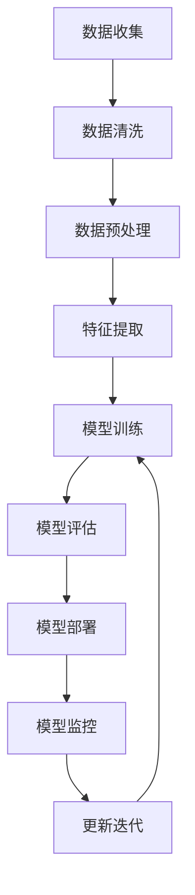
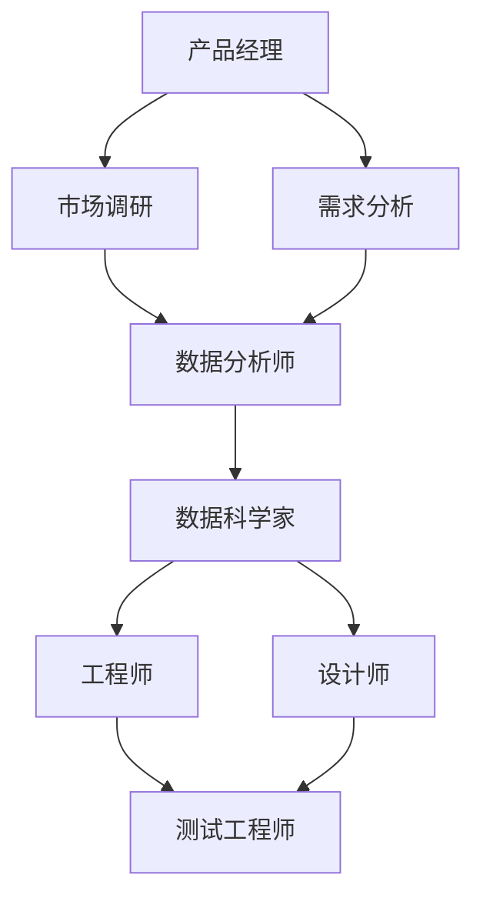

                 

### 文章标题

# AI创业生存法则之变：技术创新与商业落地并重

### 关键词

- AI创业
- 技术创新
- 商业落地
- 创新思维
- 持续发展
- 案例分析

### 摘要

本文旨在探讨AI创业领域的生存法则，重点关注技术创新与商业落地的平衡。在AI技术飞速发展的今天，创业者不仅需要掌握前沿技术，还需具备将技术创新转化为商业价值的能力。本文将分七个部分，从AI创业概述、技术创新篇、商业落地篇、到持续创新与可持续发展，再到未来展望，全面分析AI创业的挑战与机遇，提供实用的创业指南。

### 目录

#### 第一部分：AI创业概述

##### 第1章：AI创业的机遇与挑战

- **1.1 AI技术发展的趋势与变革**
- **1.2 AI创业的机遇与挑战**
- **1.3 AI创业的生态系统**

#### 第二部分：技术创新篇

##### 第2章：核心技术原理与架构

- **2.1 AI算法与模型基础**
- **2.2 AI技术框架与工具**
- **2.3 AI系统设计与优化**

#### 第三部分：商业落地篇

##### 第3章：商业模式创新与战略规划

- **3.1 AI商业模式的创新**
- **3.2 AI创业的战略规划**
- **3.3 AI创业的资金与人力资源**

##### 第4章：AI创业实践与案例分析

- **4.1 AI创业项目实战**
- **4.2 AI创业案例分析**

#### 第四部分：持续创新与可持续发展

##### 第5章：AI创业中的持续创新

- **5.1 创新思维与工具**
- **5.2 创新生态系统建设**

##### 第6章：AI创业的可持续发展

- **6.1 社会责任与伦理问题**
- **6.2 环境与经济平衡**

#### 第五部分：未来展望

##### 第7章：AI创业的未来趋势

- **7.1 AI创业的未来机遇**
- **7.2 AI创业的挑战与应对**

##### 第8章：AI创业者的未来角色

- **8.1 AI创业者的新角色**
- **8.2 AI创业者的成长路径**

#### 附录

## 附录A：AI创业资源与工具

- **A.1 主流AI开发框架与工具**
- **A.2 AI创业参考资料**

## 附录B：AI创业数学模型与算法

- **B.1 数学基础与公式**
- **B.2 伪代码与实现**

## 附录C：代码实战案例

- **C.1 实际项目代码**
- **C.2 搭建开发环境**

### Mermaid 流程图

- **M.1 AI创业流程**
- **M.2 AI技术架构**
- **M.3 创业团队协作**


### 第一部分：AI创业概述

#### 第1章：AI创业的机遇与挑战

##### 1.1 AI技术发展的趋势与变革

随着人工智能技术的不断发展，我们正处于一个变革的时代。人工智能（AI）已经从理论研究走向了实际应用，从单一的任务解决到全面的智能化系统，从简单的数据分析到复杂的自主决策，AI技术正以前所未有的速度改变着我们的生活和工作方式。

**AI技术创新的驱动力**

1. **大数据**：海量数据的积累为AI技术提供了丰富的训练素材，使得模型能够更准确地捕捉到数据中的规律和模式。
2. **计算能力的提升**：随着计算能力的提升，尤其是GPU和TPU等专用硬件的出现，AI模型的训练速度大幅提高，为更复杂的模型和算法提供了可能。
3. **深度学习**：深度学习作为AI的核心技术之一，通过模拟人脑的神经网络结构，使得机器能够在图像识别、语音识别、自然语言处理等领域取得重大突破。
4. **开源社区**：大量的开源工具和框架（如TensorFlow、PyTorch等）使得开发者能够更加便捷地使用AI技术，加速了AI技术的普及和应用。

**AI技术变革下的行业机遇**

1. **医疗健康**：通过AI技术，可以实现精准医疗、智能诊断、个性化治疗等，提高医疗效率和患者体验。
2. **金融科技**：AI技术在金融领域的应用包括智能投顾、风险管理、欺诈检测等，提高了金融服务的质量和效率。
3. **智能制造**：AI技术可以优化生产流程、提高生产效率，实现智能制造和工业4.0的目标。
4. **智能交通**：通过AI技术，可以实现智能交通管理、自动驾驶等，缓解城市交通拥堵问题，提高交通安全。

##### 1.2 AI创业的机遇与挑战

**AI创业的优势**

1. **高增长率**：AI技术是当前最具潜力的领域之一，市场需求的快速增长为创业者提供了广阔的市场空间。
2. **技术创新**：AI创业往往涉及前沿技术的研发和应用，创业者有机会在技术创新中实现突破，获得竞争优势。
3. **跨界融合**：AI技术可以与其他行业深度融合，创业者可以探索新的商业模式和市场机会。
4. **资本关注**：随着AI技术的崛起，资本市场的关注度也在不断提升，为创业者提供了充足的融资机会。

**AI创业的劣势**

1. **技术壁垒**：AI技术涉及多个学科领域，创业者需要具备深厚的专业知识和技术积累，否则难以在技术上取得突破。
2. **人才短缺**：AI领域的专业人才相对稀缺，创业者需要投入大量资源进行人才引进和培养。
3. **市场竞争**：随着AI技术的普及，市场上的竞争日益激烈，创业者需要具备敏锐的市场洞察力和快速响应能力。
4. **伦理与法规**：AI技术在应用过程中可能涉及伦理问题和法律法规，创业者需要提前进行风险评估和合规管理。

**AI创业中的关键成功因素**

1. **技术创新**：掌握核心技术是AI创业的核心竞争力，创业者需要在算法、模型和系统设计上不断进行创新。
2. **市场洞察**：了解市场需求和趋势，能够准确定位产品或服务的目标市场，提供符合用户需求的产品或服务。
3. **团队建设**：构建一支具备跨学科背景、有共同愿景和协同能力的创业团队是成功的关键。
4. **融资能力**：创业者需要具备良好的融资能力，以获得足够的资金支持创业项目的持续发展。

##### 1.3 AI创业的生态系统

**投资者与创业者的互动**

1. **天使投资**：天使投资是AI创业初期的重要资金来源，创业者可以通过参加创业大赛、创业孵化器等方式结识天使投资人。
2. **风险投资**：风险投资是AI创业中后期的重要资金来源，创业者可以通过融资路演、商业计划书等方式吸引风险投资。
3. **政府支持**：政府通过出台相关政策、提供资金支持等方式，鼓励和支持AI创业。

**创业者所需的支持与服务**

1. **技术支持**：创业者可以通过参加技术研讨会、加入技术社区等方式获取最新的技术信息和技术支持。
2. **市场推广**：创业者可以通过参加行业展会、开展市场调研等方式提升产品知名度，拓展市场渠道。
3. **法律顾问**：创业者需要关注知识产权、合同法律等方面的法律问题，聘请专业法律顾问进行法律咨询和合规管理。

通过以上分析，我们可以看到AI创业具有巨大的机遇，但同时也面临诸多挑战。创业者需要具备技术创新和市场洞察能力，构建强有力的团队，并且善于利用外部资源和支持，以实现创业目标。

### 第二部分：技术创新篇

#### 第2章：核心技术原理与架构

##### 2.1 AI算法与模型基础

**神经网络与深度学习**

神经网络（Neural Networks）是模拟人脑神经元结构和功能的计算模型，它是深度学习（Deep Learning）的基础。神经网络通过层层处理输入数据，每一层都会对数据进行分析和特征提取，最终输出结果。其中，卷积神经网络（CNN）和循环神经网络（RNN）是深度学习中应用最广泛的两个模型。

**神经网络工作原理**

1. **前向传播**：输入数据经过神经网络中的各个层，通过加权求和和激活函数处理后，输出结果。
2. **反向传播**：根据输出结果与真实值的差异，通过反向传播算法更新网络权重，以减少误差。

**深度学习**

深度学习通过增加网络层数，使得模型能够捕捉更复杂的数据特征。深度学习在图像识别、语音识别、自然语言处理等领域取得了显著成果。

**常用深度学习框架**

1. **TensorFlow**：由Google开发，是目前最流行的深度学习框架之一，支持多种编程语言和平台。
2. **PyTorch**：由Facebook开发，以其动态计算图和灵活易用的API受到开发者的青睐。
3. **Keras**：作为TensorFlow和Theano的高层API，Keras提供了更简单直观的接口，方便开发者快速搭建深度学习模型。
4. **Scikit-Learn**：Python的数据挖掘和机器学习工具库，提供了丰富的算法和工具，适用于各种规模的数据集。

**神经网络与深度学习的关系**

神经网络是深度学习的基础，深度学习则是基于神经网络的更复杂模型。神经网络通过多层结构实现对数据的复杂特征提取，而深度学习则通过大量数据和强大的计算能力，实现了对复杂问题的建模和解决。

##### 2.2 AI技术框架与工具

**TensorFlow与PyTorch**

1. **TensorFlow**：由Google开发，具有高性能、可扩展性强等优点。TensorFlow支持GPU加速，适用于大规模的深度学习项目。

   **示例代码**：
   ```python
   import tensorflow as tf

   # 定义计算图
   a = tf.constant(5)
   b = tf.constant(6)
   c = a * b

   # 启动会话执行计算
   with tf.Session() as sess:
       print(sess.run(c))
   ```

2. **PyTorch**：由Facebook开发，以动态计算图和易用性著称。PyTorch提供了丰富的API，适用于快速原型设计和实验。

   **示例代码**：
   ```python
   import torch
   import torch.nn as nn

   # 定义卷积神经网络
   class ConvNet(nn.Module):
       def __init__(self):
           super(ConvNet, self).__init__()
           self.conv1 = nn.Conv2d(1, 10, kernel_size=5)
           self.conv2 = nn.Conv2d(10, 20, kernel_size=5)
           self.fc1 = nn.Linear(320, 50)
           self.fc2 = nn.Linear(50, 10)

       def forward(self, x):
           x = F.relu(self.conv1(x))
           x = F.max_pool2d(x, 2)
           x = F.relu(self.conv2(x))
           x = F.max_pool2d(x, 2)
           x = x.view(-1, 320)
           x = F.relu(self.fc1(x))
           x = self.fc2(x)
           return x

   # 实例化网络并训练
   model = ConvNet()
   optimizer = torch.optim.SGD(model.parameters(), lr=0.01)
   criterion = nn.CrossEntropyLoss()

   for epoch in range(10):
       for inputs, targets in data_loader:
           optimizer.zero_grad()
           outputs = model(inputs)
           loss = criterion(outputs, targets)
           loss.backward()
           optimizer.step()
   ```

**Keras与Scikit-Learn**

1. **Keras**：作为TensorFlow和Theano的高层API，Keras提供了简单直观的接口，使得搭建和训练深度学习模型更加方便。

   **示例代码**：
   ```python
   from keras.models import Sequential
   from keras.layers import Dense, Activation

   # 创建模型
   model = Sequential()
   model.add(Dense(512, input_shape=(784,), activation='relu'))
   model.add(Dense(10, activation='softmax'))

   # 编译模型
   model.compile(loss='categorical_crossentropy',
                 optimizer='sgd',
                 metrics=['accuracy'])

   # 训练模型
   model.fit(x_train, y_train,
             batch_size=128,
             epochs=10,
             validation_data=(x_test, y_test))
   ```

2. **Scikit-Learn**：Python的数据挖掘和机器学习工具库，提供了丰富的算法和工具，适用于各种规模的数据集。

   **示例代码**：
   ```python
   from sklearn.datasets import load_iris
   from sklearn.model_selection import train_test_split
   from sklearn.neighbors import KNeighborsClassifier

   # 加载数据
   iris = load_iris()
   X = iris.data
   y = iris.target

   # 划分训练集和测试集
   X_train, X_test, y_train, y_test = train_test_split(X, y, test_size=0.2, random_state=42)

   # 创建模型
   knn = KNeighborsClassifier(n_neighbors=3)

   # 训练模型
   knn.fit(X_train, y_train)

   # 预测测试集
   predictions = knn.predict(X_test)

   # 计算准确率
   print("Accuracy:", knn.score(X_test, y_test))
   ```

##### 2.3 AI系统设计与优化

**系统架构设计原则**

1. **模块化设计**：将系统划分为多个功能模块，每个模块负责特定的功能，易于维护和扩展。
2. **分布式设计**：通过分布式计算，提高系统的性能和可扩展性，适用于大规模数据处理。
3. **冗余设计**：通过冗余设计，提高系统的可靠性和容错性，保证系统在故障情况下仍能正常运行。

**性能优化与资源管理**

1. **数据预处理**：通过数据清洗、数据归一化等预处理步骤，提高模型的训练效率和准确率。
2. **模型调优**：通过调整模型参数、优化算法，提高模型的性能和鲁棒性。
3. **资源分配**：合理分配计算资源，如CPU、GPU、内存等，提高系统的运行效率和资源利用率。

通过以上对AI技术核心原理与架构的深入分析，我们可以看到，AI技术的发展不仅依赖于先进的算法和模型，还需要在系统架构设计和性能优化方面进行深入的思考和探索。这些技术基础为AI创业提供了强大的支持，使得创业者能够在激烈的市场竞争中脱颖而出。

### 第三部分：商业落地篇

#### 第3章：商业模式创新与战略规划

##### 3.1 AI商业模式的创新

**AI驱动的业务模式**

在AI商业模式的创新过程中，企业可以通过引入AI技术来提升业务效率、优化运营流程，甚至创造全新的商业模式。以下是一些常见的AI驱动业务模式：

1. **数据驱动的决策**：通过AI技术对大量数据进行挖掘和分析，帮助企业做出更准确的决策，提高业务效率。
2. **智能客服**：利用自然语言处理和机器学习技术，实现智能客服系统，提供24/7无缝的客户服务体验。
3. **个性化推荐**：基于用户行为和偏好数据，通过算法分析提供个性化的产品或服务推荐，提高用户满意度和转化率。
4. **自动化生产**：通过AI技术实现生产线的自动化控制，优化生产流程，提高生产效率和质量。

**AI与传统产业的融合**

AI技术的广泛应用正在推动传统产业的变革，形成新的产业模式。以下是一些传统产业与AI技术融合的例子：

1. **智能制造**：通过工业物联网（IIoT）和AI技术，实现生产过程的自动化和智能化，提高生产效率和质量。
2. **智慧农业**：利用AI技术对农田进行监控和数据分析，实现精准农业，提高农作物产量和降低成本。
3. **智慧交通**：通过AI技术实现智能交通管理系统，优化交通流量，提高交通效率和安全性。
4. **智慧医疗**：利用AI技术进行医学影像分析、疾病预测和诊断，提高医疗服务质量和效率。

**AI技术在不同行业中的应用**

1. **金融行业**：AI技术在金融行业的应用包括智能投顾、风险控制、欺诈检测等，提高了金融服务的效率和质量。
2. **医疗健康**：AI技术在医疗健康领域的应用包括医学影像分析、疾病预测、个性化治疗等，提高了医疗服务的质量和效率。
3. **零售行业**：AI技术在零售行业的应用包括智能推荐、库存管理、客户关系管理，提高了零售企业的运营效率和市场竞争力。
4. **制造行业**：AI技术在制造行业的应用包括智能制造、生产优化、质量检测等，提高了制造企业的生产效率和产品质量。

##### 3.2 AI创业的战略规划

**市场定位与目标客户**

在AI创业的过程中，明确市场定位和目标客户是至关重要的。以下是一些策略：

1. **细分市场**：通过市场细分，找到有特定需求的细分市场，提供针对性的产品或服务。
2. **目标客户**：明确目标客户群体，了解他们的需求、痛点和偏好，提供定制化的解决方案。
3. **竞争分析**：分析竞争对手的市场定位和产品特点，找到差异化优势，形成自己的竞争优势。

**竞争策略与差异化优势**

1. **技术创新**：通过技术创新，提供独特的产品或服务，形成技术壁垒。
2. **用户体验**：通过提升用户体验，提供优质的客户服务，建立品牌忠诚度。
3. **数据优势**：通过数据积累和分析，提供个性化的产品或服务，提高用户满意度。
4. **合作共赢**：通过与行业合作伙伴建立战略合作关系，实现资源共享和优势互补。

**商业模式创新**

1. **订阅模式**：通过提供订阅服务，实现持续的收入流。
2. **平台模式**：通过搭建平台，连接供需双方，实现资源的高效配置。
3. **共享经济**：通过共享经济模式，降低成本，提高资源利用率。

##### 3.3 AI创业的资金与人力资源

**融资策略与风险管理**

1. **天使投资**：在创业初期，通过天使投资获得启动资金，为项目奠定基础。
2. **风险投资**：在中后期，通过风险投资获得资金支持，加速项目发展。
3. **政府资助**：通过政府的项目资助、税收优惠等政策，降低创业成本。

**人力资源管理**

1. **人才引进**：通过校园招聘、猎头公司等途径，引进优秀的AI技术人才。
2. **人才培养**：通过内部培训、外部合作等方式，提升员工的专业技能和综合素质。
3. **团队建设**：通过建立共同的目标和价值观，打造高效协作的团队。

**组织架构**

1. **扁平化组织**：通过扁平化组织架构，提高决策效率和团队协作。
2. **项目制管理**：通过项目制管理，明确项目目标、责任和进度，提高项目执行力。
3. **文化建设**：通过企业文化建设和团队文化建设，增强团队的凝聚力和归属感。

通过以上对商业模式创新、战略规划、资金与人力资源的深入探讨，我们可以看到，AI创业不仅需要技术创新，还需要在商业模式、战略规划和资源管理方面进行全面的规划和布局。只有在这些方面做到有机结合，才能实现AI创业的可持续发展。

### 第四部分：AI创业实践与案例分析

#### 第4章：AI创业实践与案例分析

##### 4.1 AI创业项目实战

**项目规划与执行**

在AI创业项目中，项目规划与执行是至关重要的一环。以下是项目规划与执行的基本步骤：

1. **市场调研**：通过市场调研，了解目标市场的需求、竞争对手和市场规模，为项目提供数据支持。
2. **技术评估**：评估所需技术的成熟度、可行性以及面临的挑战，确保项目在技术上可行。
3. **团队组建**：组建一支具备跨学科背景和共同愿景的团队，为项目提供人才保障。
4. **资源配置**：根据项目需求和团队情况，合理配置资金、设备和人力资源。
5. **项目执行**：在项目执行过程中，严格按照项目计划进行，定期进行进度汇报和风险评估。
6. **项目监控**：通过项目监控，确保项目按计划进行，及时解决项目中出现的问题。

**创业团队建设与管理**

在AI创业过程中，团队建设与管理是项目成功的关键。以下是一些团队建设与管理的策略：

1. **明确目标与职责**：明确团队目标，为每个团队成员分配明确的职责，确保团队协作高效。
2. **培养团队精神**：通过团队活动、共同目标等方式，培养团队精神，增强团队凝聚力。
3. **激励与反馈**：建立激励机制，对团队成员进行绩效考核和奖励，同时提供及时反馈，帮助团队成员成长。
4. **沟通与协作**：建立有效的沟通机制，确保团队成员之间的信息畅通，提高协作效率。
5. **持续学习与培训**：为团队成员提供持续学习的机会和培训资源，提升团队的整体素质。

**项目管理与风险控制**

在项目管理和风险控制方面，以下是一些策略：

1. **项目计划**：制定详细的项目计划，明确项目目标、任务和时间表，确保项目有序推进。
2. **风险管理**：识别项目中可能出现的风险，制定相应的风险应对措施，降低风险影响。
3. **监控与评估**：定期对项目进展进行监控和评估，及时发现和解决问题，确保项目按计划进行。
4. **资源调配**：根据项目进展和需求，合理调配资源和人力，确保项目资源的充分利用。
5. **应急处理**：制定应急处理计划，应对项目中可能出现的突发事件，降低项目风险。

##### 4.2 AI创业案例分析

**成功创业案例剖析**

**案例一：DeepMind**

DeepMind是一家成立于2010年的AI公司，其核心算法在围棋、电子游戏等领域取得了突破性进展。DeepMind的成功主要得益于以下几个方面：

1. **技术创新**：DeepMind通过深度强化学习技术，开发出了具有超强自主学习能力的AI算法，在围棋等游戏领域取得了世界冠军级别的成绩。
2. **团队建设**：DeepMind汇聚了一批顶尖的AI科学家和工程师，形成了强大的技术团队，为公司的技术创新提供了有力支持。
3. **市场定位**：DeepMind在商业应用领域进行了广泛探索，将其AI技术应用于医疗、能源等多个行业，取得了显著的商业成功。

**案例二：OpenAI**

OpenAI是一家成立于2015年的非营利性AI研究公司，其目标是“实现安全的通用人工智能，并确保其造福全人类”。OpenAI的成功主要体现在以下几个方面：

1. **技术创新**：OpenAI通过研究深度学习、强化学习等前沿技术，开发出了具有自主学习和创新能力的人工智能系统，取得了多项重要研究成果。
2. **开源共享**：OpenAI秉持开源共享的理念，将研究成果和技术工具公开发布，为全球AI研究者和开发者提供了宝贵的资源。
3. **社会责任**：OpenAI关注AI技术的社会影响，积极参与相关伦理和法规讨论，推动AI技术的安全、透明和可持续发展。

**失败创业案例反思**

**案例一：Nervana**

Nervana是一家成立于2014年的AI芯片公司，其目标是开发出具有突破性性能的人工智能芯片。然而，Nervana在2017年宣布关闭，主要原因包括：

1. **市场竞争**：Nervana面临来自英伟达、谷歌等巨头的激烈竞争，市场空间有限。
2. **资金短缺**：Nervana在融资过程中遇到了困难，未能获得足够的资金支持。
3. **技术瓶颈**：尽管Nervana在AI芯片领域取得了一些成果，但技术瓶颈仍然存在，无法实现大规模商业化。

**案例二：AI Factory**

AI Factory是一家专注于AI医疗影像分析的公司，其主要业务是利用AI技术辅助医生进行疾病诊断。然而，AI Factory在运营过程中遇到了以下问题：

1. **数据质量**：AI Factory在数据收集和标注过程中遇到了困难，数据质量问题影响了AI算法的性能和可靠性。
2. **市场认可**：AI Factory的产品在市场上未能获得广泛认可，市场推广效果不佳。
3. **技术迭代**：AI技术更新迅速，AI Factory在技术迭代方面未能及时跟进，导致产品竞争力下降。

通过以上成功与失败创业案例的分析，我们可以看到，AI创业不仅需要技术创新，还需要在市场定位、团队建设、风险管理等方面进行全面规划和布局。只有在这些方面做到有机结合，才能实现AI创业的可持续发展。

### 第五部分：持续创新与可持续发展

#### 第5章：AI创业中的持续创新

##### 5.1 创新思维与工具

**设计思维**

设计思维是一种以用户为中心的创新方法，它强调通过理解用户需求、探索多种解决方案、快速原型测试和迭代优化，来创造出有价值的产品或服务。以下是设计思维的几个关键步骤：

1. **同理心**：通过访谈、观察和用户研究，深入了解用户的需求、痛点和行为模式。
2. **定义问题**：基于用户洞察，明确要解决的问题和目标。
3. **创意生成**：通过头脑风暴、思维导图等工具，生成多种可能的解决方案。
4. **原型测试**：构建原型，进行用户测试和反馈，验证解决方案的可行性和有效性。
5. **迭代优化**：根据用户反馈，不断优化原型，直至达到满意的结果。

**用户研究**

用户研究是设计思维的重要组成部分，通过深入了解用户的需求、行为和反馈，可以帮助创业者更好地理解用户，提供更符合用户需求的产品或服务。以下是用户研究的一些方法：

1. **问卷调查**：通过设计问卷，收集用户的反馈和意见。
2. **访谈**：与用户进行面对面的深入交流，了解他们的真实想法和需求。
3. **观察**：通过观察用户在使用产品或服务时的行为和互动，获取第一手数据。
4. **用户访谈**：通过用户访谈，深入了解用户对产品的感受、使用习惯和改进建议。
5. **数据分析**：通过分析用户数据，了解用户的使用行为和偏好，为产品优化提供数据支持。

**快速迭代与敏捷开发**

快速迭代与敏捷开发是一种以快速反馈和持续改进为核心的开发方法，它通过缩短开发周期、增加迭代次数，让创业团队能够更快地响应市场需求和变化。以下是快速迭代与敏捷开发的几个关键原则：

1. **小步快跑**：将开发过程分解为多个短期迭代，每个迭代都提供一个可用的产品版本。
2. **用户反馈**：在每个迭代结束后，通过用户测试和反馈，收集用户对产品的反馈，及时进行调整和优化。
3. **持续改进**：基于用户反馈和市场需求，持续优化产品，不断提高产品的质量和用户体验。
4. **团队协作**：建立高效的团队协作机制，确保团队成员之间信息畅通、协同高效。
5. **自动化测试**：通过自动化测试，确保产品在每次迭代后都能稳定运行，减少测试和修复时间。

通过以上对创新思维与工具的深入分析，我们可以看到，设计思维、用户研究和快速迭代与敏捷开发是AI创业中持续创新的重要方法。这些方法可以帮助创业者更好地理解用户需求，提供有价值的产品或服务，实现创业的可持续发展。

##### 5.2 创新生态系统建设

**开源社区与合作网络**

开源社区是AI技术创新的重要源泉，通过开源社区，创业者可以获取最新的技术信息、开源代码和工具，加速项目开发。以下是建设开源社区与合作网络的一些建议：

1. **积极参与开源项目**：积极参与开源项目，为社区贡献代码和文档，提升自身技术实力和影响力。
2. **搭建开源平台**：创建自己的开源项目，为开发者提供一个共享和合作的平台，吸引更多的开发者参与。
3. **举办技术研讨会**：定期举办技术研讨会、工作坊等活动，促进开发者之间的交流和合作。
4. **开源工具与框架**：开发开源工具和框架，为开发者提供便利，提升开发效率。

**创新人才培养与引进**

创新人才是AI创业成功的关键因素，通过培养和引进创新人才，创业者可以提升团队的技术实力和创新能力。以下是创新人才培养与引进的一些建议：

1. **校企合作**：与高校建立合作关系，共同培养创新人才，为企业输送高素质的技术人才。
2. **内部培训**：为员工提供持续学习的机会和培训资源，提升员工的专业技能和综合素质。
3. **人才激励**：建立激励机制，对表现出色的员工进行奖励和晋升，激发员工的创新潜力。
4. **人才引进**：通过招聘、猎头等途径，引进具有丰富经验和专业技能的创新人才。
5. **灵活用工**：采用灵活用工模式，如外包、兼职等，吸引更多的技术人才参与项目开发。

**合作网络**

合作网络是AI创业中不可或缺的一部分，通过建立广泛的合作网络，创业者可以获取更多的资源和支持，实现优势互补。以下是合作网络建设的一些建议：

1. **行业联盟**：加入行业联盟，与其他企业、研究机构、高校等建立合作关系，共同推动产业发展。
2. **合作伙伴**：寻找业务互补的合作伙伴，建立战略合作关系，实现资源共享和互利共赢。
3. **投资者关系**：建立良好的投资者关系，获取更多的融资机会和支持。
4. **技术交流**：定期举办技术交流活动，促进合作网络中的信息共享和交流合作。
5. **跨行业合作**：探索跨行业合作机会，推动AI技术在多个领域的应用，实现跨界融合。

通过以上对创新生态系统建设的深入探讨，我们可以看到，开源社区、合作网络和创新人才培养是AI创业中持续创新的重要保障。创业者需要积极搭建和创新生态系统，吸引和培养创新人才，建立广泛的合作网络，以实现创业的可持续发展。

### 第六部分：AI创业的可持续发展

#### 第6章：AI创业的可持续发展

##### 6.1 社会责任与伦理问题

**AI伦理问题**

在AI创业过程中，伦理问题是一个不可忽视的重要议题。以下是一些常见的AI伦理问题：

1. **隐私保护**：AI技术需要大量数据训练，如何保护用户的隐私和数据安全成为关键问题。
2. **偏见与歧视**：AI系统可能会在数据中继承或放大偏见，导致不公平的结果。
3. **算法透明性**：算法的透明性和解释性是保障AI系统公正性的重要因素。
4. **责任归属**：在AI系统发生错误或造成损害时，如何确定责任归属是一个复杂的问题。

**隐私保护措施**

为了保护用户隐私，创业者可以采取以下措施：

1. **数据加密**：对用户数据进行加密处理，确保数据在传输和存储过程中安全。
2. **数据最小化**：只收集和使用必要的数据，减少不必要的隐私泄露风险。
3. **用户知情同意**：确保用户在提供数据前明确了解数据的用途和处理方式，并获得用户同意。
4. **合规性审查**：遵守相关法律法规，进行定期的隐私保护合规性审查。

**偏见与歧视问题**

为了解决AI系统中的偏见与歧视问题，创业者可以采取以下措施：

1. **数据多样化**：确保训练数据多样化，减少数据中的偏见。
2. **算法公平性评估**：对AI算法进行公平性评估，确保算法输出结果公正无偏。
3. **透明性提升**：提高算法的透明性，让用户和监管机构能够理解算法的工作原理和决策过程。
4. **反馈与修正**：建立反馈机制，根据用户反馈和评估结果，不断修正和优化算法。

**算法透明性**

提高算法透明性是保障AI系统公正性的关键。以下是一些提升算法透明性的方法：

1. **可解释性AI**：开发可解释的AI算法，让用户和监管机构能够理解算法的决策过程。
2. **代码开源**：将AI算法和代码开源，接受社区审查和反馈，提升算法的透明性和可信度。
3. **数据可视**：通过数据可视化技术，将数据分析和算法决策过程展示给用户，提高透明性。
4. **伦理委员会**：建立独立的伦理委员会，对AI算法和系统的伦理问题进行评估和监督。

**责任归属**

为了明确AI系统的责任归属，创业者可以采取以下措施：

1. **法律法规**：制定相关法律法规，明确AI系统的责任归属和责任承担。
2. **责任保险**：为AI系统购买责任保险，降低因系统错误造成损害的风险。
3. **责任追溯**：建立责任追溯机制，确保在发生问题时能够迅速定位责任。
4. **透明责任声明**：在产品和服务中明确责任声明，告知用户和监管机构关于AI系统的责任归属。

通过以上对社会责任与伦理问题的深入探讨，我们可以看到，AI创业不仅需要技术创新，还需要在伦理和社会责任方面进行全面的规划和布局。只有在这些方面做到有机结合，才能实现AI创业的可持续发展。

##### 6.2 环境与经济平衡

**绿色AI与环境保护**

随着AI技术的广泛应用，其对环境的影响也越来越受到关注。绿色AI是指通过优化算法、提高资源利用效率等手段，降低AI系统的能耗和碳排放，实现可持续发展的目标。以下是绿色AI与环境保护的一些建议：

1. **能耗优化**：通过优化算法和系统架构，降低AI系统的能耗。
2. **资源高效利用**：提高计算资源和数据存储的利用效率，减少资源浪费。
3. **可再生能源**：使用可再生能源，如风能、太阳能等，降低AI系统的碳排放。
4. **能效监测**：建立能效监测系统，实时监控AI系统的能耗情况，进行能耗优化。

**经济效益与社会贡献**

在AI创业过程中，经济效益和社会贡献是创业者需要关注的两个重要方面。以下是一些建议：

1. **成本控制**：通过优化运营流程、提高生产效率等手段，降低企业成本。
2. **市场拓展**：开拓新的市场，扩大业务规模，提高企业收入。
3. **技术创新**：持续进行技术创新，提高产品的竞争力，获取更大的市场份额。
4. **社会责任**：关注社会问题，通过公益活动、慈善捐赠等方式，回馈社会，提升企业形象。

**可持续发展策略**

为了实现环境与经济的平衡，创业者可以采取以下可持续发展策略：

1. **绿色发展**：将绿色发展理念融入企业战略，制定绿色发展规划，推动企业可持续发展。
2. **循环经济**：建立循环经济模式，提高资源利用效率，减少废弃物产生。
3. **生态平衡**：关注生态系统的平衡和恢复，采取措施保护生态环境。
4. **社会责任**：关注社会责任，积极参与社会公益活动，提升企业形象和社会认可度。

通过以上对环境与经济平衡的深入探讨，我们可以看到，AI创业不仅需要关注经济效益，还需要在环境保护和社会责任方面进行全面的规划和布局。只有在这些方面做到有机结合，才能实现AI创业的可持续发展。

### 第七部分：未来展望

#### 第7章：AI创业的未来趋势

##### 7.1 AI创业的未来机遇

随着人工智能技术的不断发展和应用的深入，AI创业领域面临着前所未有的机遇。以下是未来AI创业可能面临的一些机遇：

**新兴领域与市场机会**

1. **智能城市**：随着城市化进程的加速，智能城市将成为AI技术的重要应用领域。智能交通、智慧能源管理、环境监测等都是极具潜力的市场。
2. **医疗健康**：AI技术在医疗健康领域的应用前景广阔，包括疾病预测、智能诊断、药物研发等，这些领域都蕴含着巨大的市场机会。
3. **教育与培训**：AI技术在教育领域的应用正在逐渐成熟，个性化学习、智能评测、虚拟教师等新兴模式将引领教育行业变革。
4. **金融科技**：AI技术在金融行业的应用包括智能投顾、风险管理、反欺诈等，这些领域具有巨大的市场潜力。

**跨界合作与融合创新**

AI技术的跨界合作和融合创新将成为未来创业的重要趋势。以下是几个可能的跨界合作方向：

1. **AI与制造业**：通过AI技术实现智能制造和工业4.0，提高生产效率和质量。
2. **AI与农业**：通过AI技术实现智慧农业，提高农作物产量和降低成本。
3. **AI与教育**：通过AI技术实现个性化教育，提高教育质量和效率。
4. **AI与医疗**：通过AI技术实现精准医疗和智慧医疗，提高医疗服务水平。

**全球市场拓展**

AI创业不仅局限于国内市场，全球市场也充满了机遇。以下是拓展全球市场的一些建议：

1. **本地化适应**：根据不同国家和地区的市场需求和文化特点，对产品或服务进行本地化调整。
2. **国际合作**：与全球合作伙伴建立战略合作关系，共同开发新产品或服务。
3. **全球推广**：通过全球市场推广，扩大品牌影响力和市场份额。
4. **跨境支付与物流**：优化跨境支付和物流体系，提高国际业务的运营效率。

**政策支持与监管**

随着AI技术的发展，各国政府和监管机构将加强对AI技术的监管，同时也会提供相应的政策支持。以下是政策支持与监管的一些建议：

1. **政策法规**：制定相关法律法规，规范AI技术的应用和发展，保障用户权益。
2. **监管框架**：建立AI技术的监管框架，确保AI技术的安全和透明。
3. **标准制定**：参与国际标准和规范的制定，提升本国AI技术的国际竞争力。
4. **资金支持**：提供资金支持，鼓励AI技术创新和应用。

通过以上对AI创业未来机遇的深入探讨，我们可以看到，AI创业不仅面临着广阔的市场空间和跨界合作机会，还需要紧跟政策趋势，加强国际市场拓展和监管合作，以实现创业的可持续发展。

##### 7.2 AI创业的挑战与应对

**技术风险**

在AI创业过程中，技术风险是一个不可忽视的问题。以下是一些技术风险的应对策略：

1. **技术评估**：在项目初期，对技术进行全面的评估，确保技术的可行性和安全性。
2. **持续学习**：保持对新技术的研究和了解，不断提升团队的技术水平。
3. **研发投入**：加大研发投入，确保技术不断迭代和更新，保持竞争优势。

**政策法规**

AI创业面临的政策法规风险同样需要重视。以下是一些应对策略：

1. **合规性审查**：在产品开发和运营过程中，遵守相关法律法规，确保合规性。
2. **政策研究**：关注政策动态，及时调整产品或服务策略，应对政策变化。
3. **政府合作**：与政府机构和监管机构保持沟通，积极参与政策制定和讨论。

**市场风险**

市场风险是AI创业中常见的挑战，以下是一些应对策略：

1. **市场调研**：进行充分的市场调研，了解市场需求和竞争态势。
2. **差异化竞争**：通过技术创新和独特的产品优势，形成差异化竞争。
3. **灵活应对**：根据市场变化，灵活调整产品策略和市场定位。

**资金风险**

资金风险是AI创业过程中普遍存在的问题，以下是一些应对策略：

1. **多元化融资**：探索多种融资渠道，如风险投资、天使投资、政府资助等。
2. **资金规划**：制定详细的资金规划，确保项目在不同阶段的资金需求。
3. **成本控制**：通过优化运营流程和降低成本，提高资金使用效率。

通过以上对AI创业挑战的深入探讨，我们可以看到，AI创业不仅面临着技术、政策和市场等多方面的风险，但通过科学的风险评估和应对策略，可以有效地降低风险，实现创业的可持续发展。

### 第8章：AI创业者的未来角色

##### 8.1 AI创业者的新角色

随着AI技术的快速发展，AI创业者的角色也在不断演变。未来，AI创业者将扮演更加多元化的角色，以下是一些新角色的描述：

**技术创新领导者**

AI创业者不仅是商业领袖，更是技术创新的领导者。他们需要掌握前沿的AI技术，引领团队进行技术突破和创新，推动AI技术在各个领域的应用。

**跨学科协调者**

AI创业涉及多个学科领域，创业者需要具备跨学科的知识和协调能力，能够有效地整合不同领域的资源，推动项目的顺利进行。

**企业社会责任者**

AI创业者需要承担起企业社会责任，关注AI技术的伦理问题和社会影响，推动AI技术的可持续发展，确保其对社会产生积极的影响。

**用户体验专家**

在AI时代，用户体验至关重要。AI创业者需要深入了解用户需求，通过设计思维和用户研究，提供优质的用户体验，提升产品的市场竞争力。

##### 8.2 AI创业者的成长路径

**技术积累**

AI创业者的成长路径首先需要扎实的专业技能和深厚的技术积累。这包括掌握深度学习、自然语言处理、计算机视觉等核心技术，熟悉主流AI开发框架和工具。

**创业实践**

通过参与实际的创业项目，创业者可以积累宝贵的实践经验，了解创业过程中的挑战和机遇，提升项目管理、团队建设和商业运营能力。

**持续学习**

AI技术更新迅速，创业者需要保持持续学习的态度，通过参加培训、研讨会、阅读专业书籍等方式，不断提升自己的技术水平和业务视野。

**领导力培养**

创业者需要具备卓越的领导力，包括战略规划、团队建设、沟通协调等能力。通过实践和培训，不断提升自己的领导力，为企业的长远发展奠定基础。

通过以上对AI创业者未来角色和成长路径的深入探讨，我们可以看到，AI创业者不仅需要具备前沿技术知识和创业实践经验，还需要不断提升自己的领导力和社会责任感，以应对未来创业的挑战和机遇。

### 附录

#### 附录A：AI创业资源与工具

**A.1 主流AI开发框架与工具**

**TensorFlow**

TensorFlow是由Google开发的开源深度学习框架，支持多种编程语言和平台，具有高性能和可扩展性强等优点。它广泛应用于图像识别、自然语言处理、强化学习等领域。

**PyTorch**

PyTorch是由Facebook开发的开源深度学习框架，以其动态计算图和易用性著称。它提供了丰富的API和灵活的接口，适用于快速原型设计和实验。

**Keras**

Keras是TensorFlow和Theano的高层API，提供了简单直观的接口，使得搭建和训练深度学习模型更加方便。它兼容多个深度学习框架，适用于各种规模的数据集。

**Scikit-Learn**

Scikit-Learn是Python的数据挖掘和机器学习工具库，提供了丰富的算法和工具，适用于各种规模的数据集。它广泛应用于分类、回归、聚类等领域。

**A.2 AI创业参考资料**

**开源项目与案例**

- **GitHub**：https://github.com/，提供了大量的AI开源项目，创业者可以通过学习和借鉴这些项目，加速自己的开发进程。
- **Google AI**：https://ai.google.com/research/open_source/，Google AI的官方网站提供了许多AI开源代码和工具，创业者可以参考和应用。
- **OpenAI**：https://openai.com/research/，OpenAI的研究网站提供了许多前沿的AI研究成果和开源代码。

**学术论文与行业报告**

- **arXiv**：https://arxiv.org/，AI领域的顶级学术论文预印本库，创业者可以了解最新的研究进展。
- **NeurIPS**：https://nips.cc/，年度神经信息处理系统会议的官方网站，提供了大量的AI论文和报告。
- **KDNuggets**：https://www.kdnuggets.com/，AI和数据科学领域的新闻、博客和报告。

**创业者访谈与经验分享**

- **AI100**：https://ai100.co/blog/，AI100项目提供了许多AI领域专家的访谈和经验分享。
- **AI创业交流群**：加入AI创业相关的微信群、QQ群等社群，创业者可以与其他创业者交流经验、分享资源。
- **AI创业论坛**：参加AI创业论坛、研讨会等活动，创业者可以了解最新的行业动态和创业机会。

通过以上对AI创业资源与工具的深入探讨，我们可以看到，丰富的AI开发框架与工具、学术论文和行业报告、以及创业者访谈和经验分享，为AI创业者提供了宝贵的知识和支持。创业者可以充分利用这些资源，提升自身的技术水平和创业能力。

#### 附录B：AI创业数学模型与算法

**B.1 数学基础与公式**

在AI创业过程中，数学模型和算法是核心组成部分。以下是几个关键的数学基础和公式，用于描述神经网络和深度学习中的基本概念。

**1. 激活函数**

激活函数是神经网络中用于引入非线性特性的函数，常用的激活函数包括：

- **Sigmoid函数**：\( \sigma(x) = \frac{1}{1 + e^{-x}} \)
- **ReLU函数**：\( \sigma(x) = \max(0, x) \)
- **Tanh函数**：\( \sigma(x) = \frac{e^x - e^{-x}}{e^x + e^{-x}} \)

**2. 前向传播**

在神经网络的前向传播过程中，输入数据经过层层传递，通过加权求和和激活函数处理后，得到输出结果。前向传播的基本公式如下：

\[ z^{[l]} = \sum_{i} W^{[l]}_i a^{[l-1]}_i + b^{[l]} \]
\[ a^{[l]} = \sigma(z^{[l]}) \]

其中，\( z^{[l]} \)是第l层的加权求和结果，\( a^{[l]} \)是第l层的输出，\( W^{[l]}_i \)是第l层的权重，\( b^{[l]} \)是第l层的偏置项，\( \sigma \)是激活函数。

**3. 反向传播**

反向传播是神经网络训练过程中用于更新权重和偏置的重要步骤。它通过计算梯度，利用梯度下降法来优化网络参数。反向传播的基本公式如下：

\[ \delta^{[l]} = \frac{\partial C}{\partial z^{[l]}} \odot \sigma^{'}(z^{[l]}) \]
\[ \frac{\partial C}{\partial W^{[l]}_i} = a^{[l-1]}_i \delta^{[l]}_i \]
\[ \frac{\partial C}{\partial b^{[l]}} = \delta^{[l]} \]

其中，\( \delta^{[l]} \)是第l层的误差项，\( \sigma^{'} \)是激活函数的导数，\( C \)是损失函数，\( \odot \)表示逐元素乘法。

**B.2 伪代码与实现**

以下是神经网络训练过程的伪代码，用于展示核心算法的实现：

```python
# 初始化神经网络参数
W = [初始化权重]
b = [初始化偏置]

# 训练神经网络
for epoch in range(num_epochs):
    for inputs, targets in dataset:
        # 前向传播
        z = [计算加权求和]
        a = [应用激活函数]
        
        # 计算损失函数
        C = [计算损失]
        
        # 反向传播
        delta = [计算误差项]
        dW = [计算权重梯度]
        db = [计算偏置梯度]
        
        # 更新参数
        W = W - learning_rate * dW
        b = b - learning_rate * db

# 预测
for inputs in new_data:
    z = [计算加权求和]
    a = [应用激活函数]
    prediction = a[-1] # 输出结果
```

通过以上对AI创业数学模型与算法的深入探讨，我们可以看到，数学公式和伪代码是实现AI技术的基础。掌握这些基本概念和算法，对于创业者来说，是进行技术研究和产品开发的重要工具。

#### 附录C：代码实战案例

**C.1 实际项目代码**

以下是使用TensorFlow搭建一个简单的线性回归模型的代码案例，用于预测房屋价格。

```python
import tensorflow as tf
import pandas as pd
import numpy as np

# 数据加载
data = pd.read_csv('house_prices.csv')
X = data[['bedrooms', 'bathrooms', 'sqft_living']].values
y = data['price'].values

# 模型定义
W = tf.Variable(tf.random.normal([3, 1]), name='weight')
b = tf.Variable(tf.zeros([1]), name='bias')

def linear_regression(X, W, b):
    return tf.matmul(X, W) + b

# 损失函数
loss_function = tf.reduce_mean(tf.square(y - linear_regression(X, W, b)))

# 优化器
optimizer = tf.optimizers.Adam()

# 训练模型
num_epochs = 1000
learning_rate = 0.001

for epoch in range(num_epochs):
    with tf.GradientTape() as tape:
        predictions = linear_regression(X, W, b)
        loss = loss_function(predictions, y)
    gradients = tape.gradient(loss, [W, b])
    optimizer.apply_gradients(zip(gradients, [W, b]))

# 预测
predictions = linear_regression(X, W, b)
print("Predicted prices:", predictions.numpy())

# 评估
mse = tf.reduce_mean(tf.square(y - predictions))
print("Mean squared error:", mse.numpy())
```

**C.2 搭建开发环境**

以下是搭建Python AI开发环境的基本步骤：

1. **安装Python**

   首先，确保系统中已经安装了Python。如果没有，可以从Python官方网站下载并安装最新版本的Python。

   ```bash
   # 下载Python安装程序
   wget https://www.python.org/ftp/python/3.9.7/Python-3.9.7.tgz

   # 解压安装程序
   tar xvf Python-3.9.7.tgz

   # 编译并安装Python
   ./configure
   make
   make install
   ```

2. **安装TensorFlow**

   安装TensorFlow可以通过pip命令轻松完成。

   ```bash
   # 安装TensorFlow
   pip install tensorflow
   ```

3. **安装其他常用库**

   除了TensorFlow，还可以安装其他常用的库，如Pandas、NumPy等。

   ```bash
   # 安装Pandas
   pip install pandas

   # 安装NumPy
   pip install numpy
   ```

4. **配置虚拟环境**

   为了更好地管理项目依赖，可以使用虚拟环境。

   ```bash
   # 创建虚拟环境
   python -m venv venv

   # 激活虚拟环境
   source venv/bin/activate
   ```

5. **测试环境**

   在虚拟环境中安装TensorFlow并进行测试，确保环境配置正确。

   ```python
   import tensorflow as tf
   print(tf.__version__)
   ```

通过以上步骤，可以搭建一个基础的Python AI开发环境，为后续的AI创业项目做好准备。

#### 附录D：Mermaid流程图

**D.1 AI创业流程**

以下是AI创业流程的Mermaid流程图，展示了从项目规划到市场推广的全过程。

```mermaid
graph TD
    A[项目规划] --> B[市场调研]
    B --> C{技术评估}
    C -->|通过| D[团队组建]
    C -->|不通过| E[重新评估]
    D --> F[资源配置]
    F --> G[项目执行]
    G --> H[项目监控]
    H --> I[风险评估]
    I --> J{继续执行}
    I -->|停止| K[项目终止}
    J --> L[市场推广]
    L --> M[用户反馈]
    M --> N[迭代优化]
    N --> G
```

**D.2 AI技术架构**

以下是AI技术架构的Mermaid流程图，展示了AI系统的设计与实现流程。



**D.3 创业团队协作**

以下是创业团队协作的Mermaid流程图，展示了团队成员的角色与职责。



通过这些Mermaid流程图，可以清晰地展示AI创业的各个环节和技术架构，帮助创业者更好地理解和实施创业项目。

