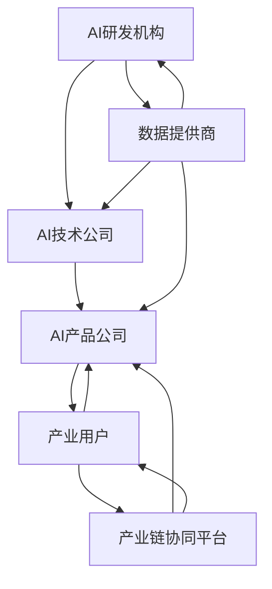
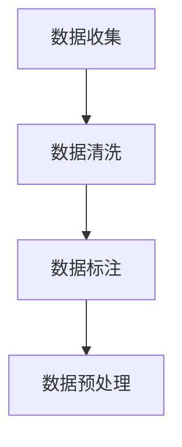
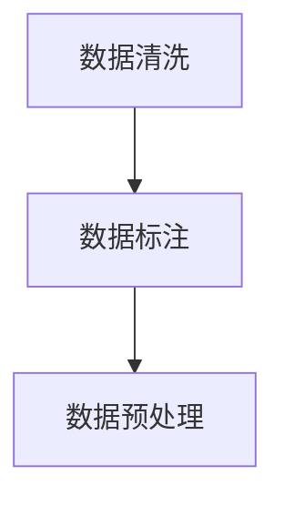
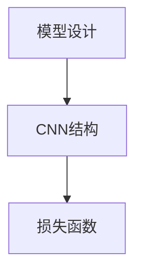
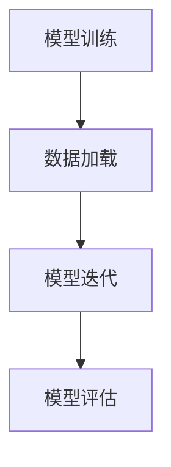
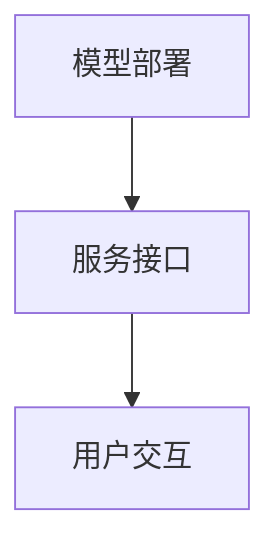

                 

# AI创业生态日益丰富，产业链协同发展成趋势

> 关键词：AI创业生态、产业链协同、人工智能技术、创业案例、政策法规

> 摘要：本文分析了AI创业生态的丰富性与产业链协同发展的趋势。通过对国内外AI创业生态的概述、产业链协同发展的优势与挑战、成功案例的分析，本文揭示了产业链协同发展对AI创业的重要性。最后，对未来AI创业生态的发展趋势进行了展望，并提出了一些建议。

### 目录大纲：

#### 第一部分：AI创业生态概述

##### 第1章：AI创业生态概述
- 1.1 AI创业生态的概念与重要性
- 1.2 AI创业生态的构成
- 1.3 AI创业生态的演变历程
- 1.4 AI创业生态的现状与趋势

##### 第2章：AI产业链协同发展
- 2.1 AI产业链的组成与协同关系
- 2.2 AI产业链中的关键环节
- 2.3 产业链协同发展的优势
- 2.4 产业链协同发展的挑战与机遇

#### 第二部分：产业链协同发展案例分析

##### 第3章：国内外AI创业生态案例分析
- 3.1 国外AI创业生态的成功案例分析
  - 3.1.1 美国硅谷的AI创业生态
  - 3.1.2 以色列AI创业生态
  - 3.1.3 英国的AI创业生态
- 3.2 国内AI创业生态的成功案例分析
  - 3.2.1 中国AI创业生态的现状
  - 3.2.2 中国AI创业生态的成功案例
  - 3.2.3 中国AI创业生态的挑战与机遇

##### 第4章：产业链协同发展的项目实践
- 4.1 项目实践概述
- 4.2 项目案例一：人工智能+医疗
  - 4.2.1 项目背景
  - 4.2.2 项目目标
  - 4.2.3 项目实施过程
- 4.3 项目案例二：人工智能+金融
  - 4.3.1 项目背景
  - 4.3.2 项目目标
  - 4.3.3 项目实施过程

##### 第5章：产业链协同发展的政策与法规
- 5.1 政策背景
- 5.2 政策分析
- 5.3 法规概述
- 5.4 政策与法规对AI创业生态的影响

#### 第三部分：未来展望

##### 第6章：AI创业生态的未来趋势
- 6.1 技术发展趋势
- 6.2 产业链发展趋势
- 6.3 创业生态发展趋势

##### 第7章：结论与建议
- 7.1 结论
- 7.2 对创业者的建议
- 7.3 对政策制定者的建议

#### 附录
- 附录A：AI创业生态相关资源与工具介绍
- 附录B：主要参考文献

### 核心概念与联系

在探讨AI创业生态的丰富性和产业链协同发展时，我们首先需要明确一些核心概念。以下是AI创业生态的核心组成部分及其相互联系：

#### Mermaid 流�程图：AI创业生态的核心组成部分


在这个流程图中，AI研发机构负责创新和研发新的AI技术，数据提供商提供高质量的训练数据，AI技术公司基于这些数据和技术进行产品研发，AI产品公司则将这些技术转化为具体的产品和服务，提供给产业用户。产业链协同平台则起到了连接各个环节的作用，促进资源的共享和协同发展。

### 核心算法原理讲解

在AI创业生态中，核心算法的研发和应用是推动产业链协同发展的重要动力。以下是机器学习算法的基本原理和伪代码。

#### 机器学习算法伪代码

```python
# 输入：训练数据集X，标签数据集Y，学习率alpha，迭代次数n
# 输出：模型参数w

// 初始化模型参数
w = [0] * n

for i in range(n):
    // 计算预测值
    y_pred = w * X

    // 计算损失函数
    loss = (y_pred - Y) ** 2

    // 计算梯度
    gradient = 2 * (y_pred - Y) * X

    // 更新模型参数
    w = w - alpha * gradient

return w
```

#### 损失函数
$$
J(w) = \frac{1}{2} \sum_{i=1}^{n} (w^T x_i - y_i)^2
$$

#### 梯度下降法
$$
w_{new} = w_{current} - \alpha \cdot \nabla_w J(w)
$$

这些算法和公式是AI创业生态中的基本工具，通过它们，创业者可以开发出各种AI应用，推动产业链的协同发展。

### 项目实战

为了更深入地了解AI创业生态的实际应用，我们来看一个具体的项目案例：人工智能+医疗。

#### 人工智能+医疗项目实战案例

##### 1. 项目背景
- 项目名称：智能医疗诊断系统
- 项目目的：利用深度学习技术，提高疾病诊断的准确率
- 项目实施时间：2022年1月 - 2023年6月

##### 2. 项目实施过程

###### 2.1 数据收集与处理

在项目初期，数据收集是关键的一步。我们收集了大量的医学影像数据，包括X光片、CT扫描、MRI等。这些数据来自多家医院和医疗机构，涵盖了多种疾病类型。



数据清洗是确保数据质量的重要环节。我们去除噪声和异常数据，确保数据的一致性和准确性。随后，我们对数据进行标注，以便后续的模型训练。



数据预处理包括归一化、数据增强等步骤，以提高模型的泛化能力。

###### 2.2 模型设计

我们选择卷积神经网络（CNN）作为基础模型。CNN擅长处理图像数据，能够有效地提取图像特征。



在模型设计阶段，我们定义了交叉熵作为损失函数，以衡量模型预测值与真实标签之间的差异。


###### 2.3 模型训练

我们使用GPU加速模型训练，以提高训练效率。在训练过程中，我们使用了大量的数据，并进行了多次迭代，以优化模型参数。



在模型训练完成后，我们使用测试集对模型进行评估，计算准确率、召回率、F1分数等指标，以确保模型的性能。


###### 2.4 模型部署

最后，我们将训练好的模型部署到服务器，实现实时诊断功能。用户可以通过上传医学影像数据，实时获取疾病诊断结果。



##### 3. 代码解读与分析

下面是一个简单的CNN模型训练的代码示例，包括数据加载、模型定义、训练过程和评估过程。

```python
# 导入必要的库
import tensorflow as tf
from tensorflow.keras.models import Sequential
from tensorflow.keras.layers import Conv2D, MaxPooling2D, Flatten, Dense

# 定义模型结构
model = Sequential([
    Conv2D(32, (3, 3), activation='relu', input_shape=(64, 64, 3)),
    MaxPooling2D(pool_size=(2, 2)),
    Flatten(),
    Dense(128, activation='relu'),
    Dense(1, activation='sigmoid')
])

# 编译模型
model.compile(optimizer='adam', loss='binary_crossentropy', metrics=['accuracy'])

# 加载训练数据
train_data = ...  # 加载预处理后的训练数据
train_labels = ...  # 加载对应的训练标签

# 训练模型
model.fit(train_data, train_labels, epochs=10, batch_size=32)

# 评估模型
test_data = ...  # 加载预处理后的测试数据
test_labels = ... # 加载对应的测试标签
model.evaluate(test_data, test_labels)
```

这段代码展示了CNN模型的基本结构和训练过程。在实际应用中，模型的结构和参数会根据具体任务进行调整，以达到最佳性能。

### 附录

#### 附录A：AI创业生态相关资源与工具介绍

- **数据集**：常用的医学影像数据集包括 ChestX-ray8、COCO 等。深度学习框架如 TensorFlow、PyTorch、Keras 等。

- **开源框架**：TensorFlow、PyTorch、Keras 等。

- **云服务**：AWS、Google Cloud、阿里云等。

- **数据处理工具**：Pandas、NumPy 等。

#### 附录B：主要参考文献

- [1] 政府部门发布的AI创业生态相关报告。

- [2] 学术期刊上发表的关于AI创业生态的研究论文。

- [3] 行业协会发布的AI创业生态白皮书。

- [4] 成功AI创业公司的案例研究。

- [5] 有关AI技术的基础教材和论文集。

### 作者信息

**作者**：AI天才研究院/AI Genius Institute & 禅与计算机程序设计艺术 /Zen And The Art of Computer Programming

在AI创业生态日益丰富的背景下，产业链的协同发展已成为推动AI技术落地应用的关键。本文通过对AI创业生态的概述、产业链协同发展的分析以及具体案例的剖析，展示了AI产业链协同发展的优势与挑战，并对未来AI创业生态的发展趋势进行了展望。希望本文能为创业者、政策制定者提供有价值的参考和建议。

