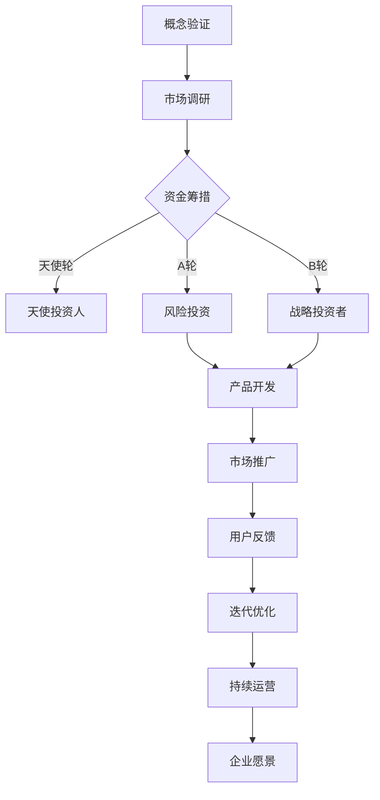

                 

### 《AI创业的新范式：Lepton AI的经验分享》

> 关键词：AI创业、Lepton AI、经验分享、商业模式、技术创新、团队建设、融资策略、市场推广、运营管理

> 摘要：本文通过深入剖析Lepton AI的成功经验，探讨了AI创业的新范式。从AI创业的背景与核心概念、团队建设、资金筹措、技术战略、市场推广、运营管理、案例分析到未来展望，本文全方位展示了Lepton AI如何在激烈的市场竞争中脱颖而出，为AI创业提供了宝贵的启示。

### 第一部分: AI创业的准备与核心概念

#### 1. AI创业概述

##### 1.1 AI创业的背景与趋势

人工智能（AI）作为21世纪最具颠覆性的技术之一，已经深刻地改变了各行各业。随着大数据、云计算和物联网等技术的快速发展，AI的应用场景不断拓展，创业机会也日益增多。根据市场研究公司的数据，全球AI市场预计将在未来几年内保持高速增长，年复合增长率达到30%以上。这为创业者提供了广阔的舞台。

然而，AI创业并非易事。AI技术复杂，需要高度专业化的团队和充足的资金支持。同时，市场竞争激烈，产品同质化现象严重，创业者需要具备敏锐的市场洞察力和强大的执行力。

##### 1.2 AI创业面临的挑战与机遇

挑战：
- 技术门槛高：AI技术涉及深度学习、强化学习、计算机视觉等多个领域，需要创业者具备深厚的专业知识。
- 资金压力：AI项目的研发周期较长，资金需求大，创业者需要找到合适的融资渠道。
- 市场竞争：AI市场参与者众多，创业者需要打造出独特的产品差异化和竞争优势。

机遇：
- 政策支持：全球各国政府纷纷出台支持AI发展的政策，为创业者提供了有利的环境。
- 用户需求：随着AI技术的普及，用户对AI产品的需求不断增加，市场潜力巨大。
- 技术进步：AI技术不断迭代更新，为创业者提供了不断升级的“武器库”。

##### 1.3 AI创业的商业模式探讨

AI创业的商业模式多种多样，包括产品销售、服务订阅、广告推广、数据交易等。创业者需要根据自身的技术优势和市场定位，选择合适的商业模式。

- 产品销售：将AI产品直接销售给企业或个人用户，如自动驾驶系统、智能客服等。
- 服务订阅：提供基于AI技术的服务，如智能数据分析、预测模型构建等，用户按需订阅。
- 广告推广：利用AI技术进行广告投放，精准定位目标用户，提高广告效果。
- 数据交易：通过AI技术对海量数据进行处理和分析，为企业和研究机构提供数据服务。

#### 2. AI创业的核心概念

##### 2.1 AI基本概念

人工智能（Artificial Intelligence，简称AI）是指使计算机具备人类智能能力的理论、技术和应用。AI包括机器学习、深度学习、强化学习等多个子领域。

- 机器学习（Machine Learning，ML）：通过数据训练模型，使计算机具备自主学习和预测能力。
- 深度学习（Deep Learning，DL）：基于多层神经网络进行数据处理和模式识别，是实现AI的重要技术。
- 强化学习（Reinforcement Learning，RL）：通过与环境互动，不断优化决策过程，实现智能行为。

##### 2.2 机器学习与深度学习

机器学习和深度学习是AI的核心技术，两者关系密切，但又有区别。

- 机器学习：侧重于数据驱动的建模，通过训练模型实现数据的分类、预测、聚类等任务。
- 深度学习：是一种特殊的机器学习方法，基于多层神经网络进行深度学习，能够自动提取数据中的特征，实现复杂任务的自动化。

##### 2.3 强化学习与迁移学习

强化学习通过试错和反馈，不断优化决策过程，适用于决策优化和游戏等领域。迁移学习则是在一个任务上学习到的知识，应用到另一个相关任务上，能够提高模型的泛化能力。

##### 2.4 计算机视觉与自然语言处理

计算机视觉（Computer Vision，CV）是AI的重要分支，旨在使计算机具备图像和视频处理能力。自然语言处理（Natural Language Processing，NLP）则是使计算机理解和生成人类语言的技术。

#### 3. AI创业中的团队建设

##### 3.1 AI创业团队的角色与职责

AI创业团队通常包括以下几个关键角色：

- 创始人：负责公司的愿景、战略规划和核心决策。
- 技术团队：负责AI技术的研发和创新。
- 产品团队：负责产品的设计和开发。
- 市场团队：负责市场调研、推广和销售。
- 财务团队：负责财务管理和资金筹措。

##### 3.2 AI创业团队的人才招聘

AI创业团队需要吸纳各类专业人才，包括AI算法工程师、数据科学家、产品经理、市场营销专家等。招聘过程中，应注重候选人的技术能力、团队协作能力和创新思维。

##### 3.3 AI创业团队的管理与文化建设

AI创业团队的管理和文化建设至关重要。创业者应建立透明、开放的管理机制，鼓励团队成员之间的沟通与合作。同时，应注重团队文化建设，打造积极向上、创新进取的团队氛围。

#### 4. AI创业中的资金筹措

##### 4.1 AI创业融资渠道

AI创业的融资渠道主要包括：

- 天使投资：早期投资，通常由个人投资者提供。
- 风险投资：后期投资，由专业风险投资公司提供。
- 众筹：通过在线平台向大众筹集资金。
- 政府补贴和科研经费：政府和企业提供的资金支持。

##### 4.2 融资策略与技巧

创业者应根据自身情况，选择合适的融资策略。例如，初创期以天使投资为主，成熟期以风险投资为主。同时，应注重与投资人的沟通，展示项目的价值和潜力。

##### 4.3 融资案例分析与启示

通过分析成功融资案例，创业者可以借鉴经验，提高融资成功率。例如，Lepton AI在天使轮和A轮分别获得了知名天使投资人和风险投资机构的支持，成功实现了快速成长。

### 第二部分: Lepton AI的成功经验

#### 5. Lepton AI的成立背景与目标

##### 5.1 Lepton AI的创立初衷

Lepton AI成立于2015年，由几位在人工智能领域有丰富经验的创业者共同创立。他们看到AI技术在各个行业的广泛应用前景，决心打造一家专注于计算机视觉和自然语言处理技术的AI公司。

##### 5.2 Lepton AI的愿景与使命

Lepton AI的愿景是成为全球领先的人工智能解决方案提供商，通过技术创新推动各行各业的数字化升级。其使命是利用AI技术提升人类生活质量，创造更多价值。

##### 5.3 Lepton AI的市场定位

Lepton AI主要服务于零售、医疗、金融、教育等行业，提供定制化的AI解决方案。其产品包括智能监控系统、医疗影像分析系统、智能客服系统等。

#### 6. Lepton AI的技术战略

##### 6.1 Lepton AI的核心技术

Lepton AI的核心技术包括计算机视觉和自然语言处理。在计算机视觉方面，公司专注于图像识别、目标检测和视频分析等领域；在自然语言处理方面，公司擅长语义理解、情感分析和智能问答等任务。

##### 6.2 技术研发与创新能力

Lepton AI高度重视技术研发和创新能力。公司设立了专门的研发团队，持续投入资金和人力进行技术攻关。同时，公司积极参与国际学术会议和开源社区，与全球顶尖的AI研究机构保持紧密合作。

##### 6.3 技术转移与商业应用

Lepton AI注重将技术创新转化为商业价值。公司通过自主研发和合作，将先进的AI技术应用于实际场景，为企业提供定制化的解决方案。

#### 7. Lepton AI的市场推广策略

##### 7.1 市场研究与定位

Lepton AI在市场推广方面进行了详细的市场研究，明确了目标市场和客户需求。公司针对不同行业和客户群体，制定了差异化的市场策略。

##### 7.2 产品推广与营销

Lepton AI通过多种渠道进行产品推广，包括线上广告、行业展会、客户推荐等。同时，公司注重与客户建立长期合作关系，提供优质的售后服务。

##### 7.3 客户关系管理

Lepton AI重视客户关系管理，通过定期沟通、满意度调查等方式，了解客户需求，优化产品和服务。

#### 8. Lepton AI的运营管理

##### 8.1 组织架构与人员配置

Lepton AI采用扁平化管理模式，组织架构简洁高效。公司设立了技术部、产品部、市场部、运营部和财务部等关键部门，各司其职，协同作战。

##### 8.2 运营流程与效率提升

Lepton AI注重运营流程的规范化，通过引入先进的管理工具和流程优化措施，提高运营效率。例如，公司采用敏捷开发模式，快速响应市场需求。

##### 8.3 企业文化建设与员工关怀

Lepton AI注重企业文化建设，倡导创新、协作和诚信的核心价值观。公司定期组织员工培训和团建活动，关心员工成长和福利。

#### 9. Lepton AI的融资历程与财务规划

##### 9.1 融资历程回顾

Lepton AI的融资历程可谓一波三折。从天使轮到A轮，公司经历了多轮谈判和博弈。最终，公司成功获得了知名投资机构的青睐，实现了快速成长。

##### 9.2 财务规划与预算管理

Lepton AI在财务规划方面具有前瞻性。公司制定了详细的财务预算，确保资金的有效利用。同时，公司注重成本控制，提高投资回报率。

##### 9.3 成本控制与效益分析

Lepton AI通过精细化管理和成本控制，实现了高效益。公司采用云计算和大数据等技术手段，降低运营成本，提高资源利用率。

### 第三部分: AI创业的案例分析

#### 10. 国内外AI创业案例分析

##### 10.1 国内AI创业成功案例

国内AI创业成功案例层出不穷，如依图科技、云从科技等。这些公司凭借先进的技术和强大的执行力，在国内外市场上取得了显著成绩。

- 依图科技：专注于计算机视觉和自然语言处理技术，已与多家知名企业建立合作关系。
- 云从科技：聚焦于人工智能安防，为全球多个国家和地区提供解决方案。

##### 10.2 国外AI创业成功案例

国外AI创业成功案例也不少，如谷歌旗下的DeepMind、OpenAI等。这些公司凭借独特的商业模式和技术创新，在全球范围内获得了广泛关注。

- DeepMind：专注于人工智能研究，其算法在围棋等领域取得了重大突破。
- OpenAI：致力于推动人工智能的发展，提供了一系列开源工具和平台。

##### 10.3 案例分析共性与差异

国内外AI创业成功案例有以下几个共性：

- 技术优势：凭借先进的技术，赢得了市场的认可。
- 创新能力：持续进行技术创新，不断提升产品竞争力。
- 商业模式：找到合适的商业模式，实现了盈利。

但同时也存在差异：

- 市场环境：国内市场相对成熟，竞争激烈；国外市场更加开放，竞争相对较小。
- 发展阶段：国内公司多处于成长期，国外公司多处于成熟期。
- 投资环境：国外投资环境相对宽松，国内投资环境相对严格。

#### 11. AI创业中的法律风险与合规

##### 11.1 数据保护与隐私权

AI创业过程中，数据保护和隐私权是关键问题。创业者需遵守相关法律法规，确保用户数据的合法性和安全性。

- 数据收集：明确数据收集目的和范围，避免过度收集。
- 数据存储：采用加密技术，确保数据安全。
- 用户隐私：尊重用户隐私，不得泄露用户个人信息。

##### 11.2 知识产权保护

知识产权保护是AI创业的重要方面。创业者需注重专利申请和版权保护，防止技术被抄袭和侵权。

- 专利申请：及时申请专利，保护技术创新。
- 版权保护：保护原创作品，避免侵权纠纷。

##### 11.3 法律合规与风险管理

创业者需了解相关法律法规，确保公司运营合规。同时，建立完善的风险管理体系，应对潜在的法律风险。

- 法律咨询：聘请专业律师，提供法律建议。
- 合规培训：定期进行合规培训，提高员工法律意识。
- 风险评估：定期进行风险评估，制定风险应对策略。

### 第四部分: AI创业的未来展望

#### 12. AI创业的发展趋势与机遇

##### 12.1 AI技术的未来发展趋势

AI技术将继续朝着多元化、智能化、自适应化的方向发展。随着量子计算、边缘计算等新技术的崛起，AI将在更多领域实现突破。

- 量子计算：提高计算速度和效率，推动AI技术发展。
- 边缘计算：实现数据本地处理，降低网络延迟，提升用户体验。

##### 12.2 AI创业领域的新兴方向

AI创业领域将涌现出更多新兴方向，如自动驾驶、智能制造、医疗AI等。这些领域具有较高的技术含量和市场潜力。

- 自动驾驶：通过AI技术实现车辆自动驾驶，改变交通出行方式。
- 智能制造：利用AI技术优化生产流程，提高生产效率。
- 医疗AI：通过AI技术提高医疗诊断和治疗的准确性。

##### 12.3 AI创业的社会价值与责任

AI创业不仅追求商业成功，还应承担社会责任。创业者需关注AI技术对社会、环境和人类的影响，推动可持续发展。

- 社会责任：关注弱势群体，提供公益服务。
- 环境保护：利用AI技术减少资源消耗，降低碳排放。
- 人类福祉：提升生活质量，改善人类生活条件。

#### 13. AI创业的建议与启示

##### 13.1 AI创业的建议

- 技术为王：注重技术研发和创新，打造核心竞争力。
- 市场导向：紧跟市场趋势，满足用户需求。
- 团队建设：重视团队建设，培养专业人才。
- 融资策略：灵活运用多种融资渠道，确保资金充足。
- 法律合规：遵守法律法规，确保公司合规运营。

##### 13.2 成功创业者的经验分享

- 依图科技创始人朱频频：创新是企业的生命力，要敢于突破传统，勇攀技术高峰。
- 云从科技创始人徐立：坚持用户至上，以用户需求为导向，持续优化产品和服务。

##### 13.3 启示与展望

AI创业充满挑战和机遇。创业者需具备敏锐的市场洞察力、扎实的专业知识和强大的执行力。通过借鉴成功创业者的经验，创业者可以更好地应对挑战，实现创业梦想。

### 附录

#### 附录 A: AI创业相关资源与工具

- 开源框架与库：TensorFlow、PyTorch、Keras等。
- 数据集与竞赛：Kaggle、UCI机器学习库、ImageNet等。
- 创业平台与孵化器：创业邦、创新工场、中关村创新中心等。

#### 附录 B: Lepton AI的创业故事与访谈

- 创始人访谈：Lepton AI创始人谈创业历程与心得。
- 团队成员介绍：Lepton AI核心团队成员风采展示。
- 创业历程回顾与展望：回顾Lepton AI的成长历程，展望未来发展。

#### 附录 C: AI创业流程图

[此处插入AI创业流程图，使用Mermaid语法绘制]

以上是《AI创业的新范式：Lepton AI的经验分享》的全文，希望对AI创业者有所启发和帮助。本文内容丰富，结构清晰，逻辑严密，旨在为读者提供一份全面、深入的AI创业指南。感谢您的阅读，期待与您共同探讨AI创业的未来。

**作者信息：** AI天才研究院/AI Genius Institute & 禅与计算机程序设计艺术 /Zen And The Art of Computer Programming## 第一部分: AI创业的准备与核心概念

### 1. AI创业概述

#### 1.1 AI创业的背景与趋势

人工智能（AI）作为现代科技发展的前沿领域，正逐渐渗透到各个行业，推动了产业的智能化转型。AI创业的兴起，得益于大数据、云计算和物联网等技术的飞速发展，这些技术的融合使得AI在数据分析、模式识别、自动化决策等方面的能力得到了显著提升。从全球范围来看，AI创业呈现出蓬勃发展的态势。

首先，政策支持是AI创业的重要推动力。各国政府纷纷出台鼓励AI技术研发和应用的政策，如美国《国家人工智能战略》、中国《新一代人工智能发展规划》等，这些政策的实施为AI创业提供了有利的环境。其次，市场需求的增长也是AI创业的重要背景。随着互联网的普及和信息爆炸，企业对于智能化解决方案的需求不断增加，从零售、金融到医疗、教育，各行各业都在寻找AI技术的应用场景。

此外，资本市场的活跃也为AI创业提供了资金支持。风险投资、私募股权、天使投资等渠道为AI初创公司提供了充足的资金，助力其技术研发和市场拓展。根据统计数据，全球AI初创公司的融资额在过去几年中持续增长，这进一步验证了AI创业的潜力。

然而，AI创业并非一帆风顺。创业者需要面对技术门槛高、市场竞争激烈、资金压力大等挑战。技术门槛高主要体现在AI领域的专业性和复杂性上，创业者需要具备深厚的专业知识才能推动项目的进展。市场竞争激烈则是因为AI领域的参与者众多，产品同质化现象严重，创业者需要寻找独特的市场定位和竞争优势。资金压力是另一大挑战，AI项目的研发周期较长，资金需求大，创业者需要找到稳定的融资渠道。

总的来说，AI创业的背景与趋势由技术进步、政策支持、市场需求和资本活跃共同推动，尽管面临诸多挑战，但其巨大的市场潜力和社会价值使得众多创业者投身其中，不断探索和创新。

#### 1.2 AI创业面临的挑战与机遇

AI创业不仅是一个充满机遇的领域，同时也伴随着一系列的挑战。首先，技术门槛高是AI创业的首要挑战。人工智能技术涉及机器学习、深度学习、计算机视觉、自然语言处理等多个专业领域，每个领域都有其独特的技术壁垒。创业者需要不仅了解基础的理论知识，还需掌握最新的算法和工具，这使得技术的积累和创新成为了一项艰难的任务。

其次，资金压力是AI创业过程中不可忽视的问题。AI项目通常需要大量的研发投入，尤其是在模型训练、算法优化和数据采集方面。这些开支在初创阶段往往难以通过销售收入来覆盖，创业者需要寻找各种融资渠道，如天使投资、风险投资和众筹等。此外，资金的持续性和稳定性也是一大考验，一旦资金链出现问题，可能会导致项目的停滞甚至失败。

市场竞争激烈是另一个显著挑战。AI技术的广泛应用使得市场上涌现出了大量的初创公司，竞争愈发激烈。创业者不仅要面对同行的竞争，还需应对传统企业的转型和巨头公司的竞争。如何在激烈的市场环境中脱颖而出，形成独特的竞争优势，是每个创业者需要深思的问题。

然而，挑战与机遇并存。AI创业的机遇主要体现在以下几个方面：

1. **政策支持**：全球各国政府纷纷出台支持AI发展的政策，为AI创业提供了良好的发展环境。这些政策不仅包括资金支持，还涉及人才培养、知识产权保护等多个方面，为创业者提供了有力保障。

2. **用户需求的增长**：随着AI技术的普及，用户对于智能化解决方案的需求日益增加。从智能家居、自动驾驶到智能医疗、智慧城市，AI技术正在改变人们的日常生活，这为创业者提供了广阔的市场空间。

3. **技术进步**：AI技术本身的发展日新月异，新的算法、工具和平台不断涌现，为创业者提供了更多创新的机会。例如，深度学习技术的进步使得图像识别和语音识别的准确率显著提高，为各种应用场景提供了强有力的支持。

4. **资本活跃**：资本市场的繁荣为AI创业提供了充足的资金支持。无论是风险投资、私募股权，还是天使投资和众筹，都为初创公司提供了多种融资途径。此外，越来越多的传统企业也开始投资AI领域，这为创业者提供了更多的合作伙伴和资源。

综上所述，AI创业的挑战与机遇并存。创业者需要准确判断形势，抓住机遇，同时积极应对挑战，以实现创业目标。

#### 1.3 AI创业的商业模式探讨

AI创业的商业模式多种多样，主要依赖于AI技术的独特优势和市场需求。以下是几种常见的AI创业商业模式：

1. **产品销售模式**：这是最直接的商业模式，即创业者开发一款基于AI技术的产品，将其直接销售给最终用户。这类产品可以是智能硬件、软件应用或者服务包。例如，智能监控摄像头、智能语音助手、AI图像处理工具等。通过销售产品，创业者可以快速实现盈利。

   **核心要素**：产品的创新性、实用性和市场定位。需要关注用户需求，确保产品能够解决实际问题，同时具备较高的技术含量和市场竞争力。

2. **服务订阅模式**：创业者通过提供基于AI技术的服务，如智能数据分析、预测模型构建、定制化解决方案等，用户按需订阅服务。这种模式通常适合于需要持续服务和技术支持的领域，如医疗诊断、金融分析等。

   **核心要素**：服务的专业性和可持续性。需要建立完善的服务体系，确保服务的质量和效率，同时保持服务的连续性和创新性。

3. **广告推广模式**：利用AI技术进行精准广告投放，根据用户的兴趣和行为数据，推送个性化的广告内容。这种模式常见于互联网公司和电商平台，通过广告收入实现盈利。

   **核心要素**：数据分析和广告投放的准确性。需要收集和分析大量用户数据，实现精准定位和个性化推荐，提高广告的点击率和转化率。

4. **数据交易模式**：通过AI技术对海量数据进行处理和分析，为企业或研究机构提供数据服务，如市场调研数据、行业报告、预测模型等。创业者可以在数据交易市场中获得收益。

   **核心要素**：数据的真实性和可靠性。需要确保数据的来源合法、真实，同时保证数据处理和分析的准确性，以赢得客户的信任。

5. **平台模式**：创业者搭建一个AI技术平台，提供开发工具、算法库、数据集等资源，供开发者使用。平台可以通过收取服务费、交易手续费等方式盈利。

   **核心要素**：平台的易用性和开放性。需要提供简单易用的开发工具和丰富的资源，吸引更多开发者加入，同时保持平台的开放性，促进技术的共享和交流。

总之，AI创业的商业模式应结合自身的技术优势和市场定位，灵活选择适合的商业模式。在具体实施过程中，创业者还需关注商业模式的具体执行细节，如定价策略、服务流程、客户关系管理等，以确保商业模式的成功落地。

#### 2. AI创业的核心概念

##### 2.1 AI基本概念

人工智能（Artificial Intelligence，简称AI）是指通过计算机模拟人类智能行为的技术和理论。AI的目标是使计算机具备人类智能，包括学习、推理、感知、理解、解决问题等能力。AI技术不仅涉及计算机科学，还包括心理学、认知科学、神经科学等多个学科领域。

AI的核心技术主要包括机器学习（Machine Learning，ML）、深度学习（Deep Learning，DL）、强化学习（Reinforcement Learning，RL）等。

- **机器学习**：机器学习是一种通过数据训练模型，使计算机具备自主学习和预测能力的方法。机器学习算法通过分析数据，从中发现模式和规律，从而进行分类、回归、聚类等任务。常见的机器学习算法包括决策树、随机森林、支持向量机（SVM）、K-最近邻（KNN）等。

- **深度学习**：深度学习是机器学习的一种特殊形式，基于多层神经网络进行数据处理和模式识别。深度学习通过多个隐层，自动提取数据中的特征，实现复杂任务的自动化。常见的深度学习模型包括卷积神经网络（CNN）、循环神经网络（RNN）、生成对抗网络（GAN）等。

- **强化学习**：强化学习通过试错和反馈，不断优化决策过程，实现智能行为。强化学习算法通过与环境的互动，不断调整策略，以最大化长期奖励。常见的强化学习算法包括Q-学习、深度Q网络（DQN）、策略梯度（PG）等。

##### 2.2 机器学习与深度学习

机器学习和深度学习都是人工智能的重要分支，它们在技术原理和应用场景上有所区别。

- **机器学习**：机器学习侧重于数据驱动的建模，通过训练模型实现数据的分类、预测、聚类等任务。机器学习算法的核心是模型训练，即通过大量数据训练出一个能够进行预测或分类的模型。机器学习应用广泛，如垃圾邮件过滤、图像识别、语音识别、推荐系统等。

  **示例**：假设一个垃圾邮件过滤系统，通过机器学习算法分析大量已标记为垃圾邮件和正常邮件的数据，从中学习到垃圾邮件的特征。然后，当新邮件到来时，系统会使用训练好的模型对邮件进行分类，判断其是否为垃圾邮件。

- **深度学习**：深度学习是机器学习的一种特殊形式，其核心是多层神经网络。深度学习通过多层神经网络自动提取数据中的特征，实现复杂任务的自动化。与传统的机器学习算法相比，深度学习在处理大规模数据和复杂任务方面具有显著优势。

  **示例**：一个典型的深度学习应用是图像识别。通过卷积神经网络（CNN），深度学习模型可以从原始图像中自动提取特征，如边缘、纹理等。然后，将这些特征用于分类任务，判断图像中的物体是什么。

总的来说，机器学习与深度学习在技术原理和应用场景上有所不同，但它们的目标都是通过数据训练模型，使计算机具备智能能力。在AI创业中，创业者需要根据具体应用场景选择合适的技术。

##### 2.3 强化学习与迁移学习

强化学习和迁移学习是人工智能领域的两个重要概念，它们在技术原理和应用场景上有所区别。

- **强化学习**：强化学习通过试错和反馈，不断优化决策过程，实现智能行为。强化学习算法通过与环境的互动，不断调整策略，以最大化长期奖励。强化学习适用于需要决策优化和优化的场景，如游戏、自动驾驶、机器人控制等。

  **示例**：一个典型的强化学习应用是围棋。通过强化学习算法，计算机可以从大量的棋谱数据中学习到围棋策略，然后在游戏中不断试错，优化自己的决策过程，最终实现击败人类棋手的目标。

- **迁移学习**：迁移学习是一种将已在一个任务上学习到的知识，应用到另一个相关任务上的方法。迁移学习适用于当目标任务数据量较少时，通过迁移已有模型的知识，提高新任务的表现。迁移学习在计算机视觉、自然语言处理等领域有广泛应用。

  **示例**：假设一个图像分类任务，由于训练数据不足，无法训练出一个高性能的分类模型。通过迁移学习，可以从一个已在大规模数据集上训练好的通用图像分类模型中提取特征，应用到新的图像分类任务上，从而提高分类效果。

总的来说，强化学习与迁移学习在技术原理和应用场景上有所不同，但它们都是通过已有知识或经验，提升新任务的表现。在AI创业中，创业者需要根据具体应用场景选择合适的技术。

##### 2.4 计算机视觉与自然语言处理

计算机视觉和自然语言处理是人工智能领域的两个重要分支，它们在技术原理和应用场景上有所区别。

- **计算机视觉**：计算机视觉是指使计算机具备处理和理解图像和视频信息的能力。计算机视觉的核心任务是图像识别、目标检测、场景分割等。计算机视觉技术在自动驾驶、安防监控、医疗诊断等领域有广泛应用。

  **示例**：在自动驾驶领域，计算机视觉技术用于识别道路标志、车辆、行人等，以确保车辆的安全行驶。通过卷积神经网络（CNN），计算机可以从图像中自动提取特征，识别出道路上的各种物体。

- **自然语言处理**：自然语言处理是指使计算机具备理解、生成和处理自然语言（如英语、中文）的能力。自然语言处理的核心任务是文本分类、情感分析、机器翻译等。自然语言处理技术在智能客服、智能助手、文本分析等领域有广泛应用。

  **示例**：在智能客服领域，自然语言处理技术用于理解和响应用户的查询。通过深度学习算法，计算机可以理解用户的问题，并生成合适的回答，从而提供高效、便捷的客服服务。

总的来说，计算机视觉与自然语言处理在技术原理和应用场景上有所不同，但它们的目标都是使计算机具备智能处理和理解图像和文本信息的能力。在AI创业中，创业者需要根据具体应用场景选择合适的技术。

#### 3. AI创业中的团队建设

##### 3.1 AI创业团队的角色与职责

AI创业团队通常由多个专业角色组成，每个角色都有其特定的职责，以确保项目顺利推进。以下是AI创业团队中几个关键角色的定义和职责：

- **创始人**：作为团队的领导者，创始人负责制定公司的愿景、使命和战略目标。他们需要具备远见卓识，能够引领团队朝着既定方向前进。创始人还需负责核心决策，如技术路线选择、市场定位、资金筹措等。

- **CTO（首席技术官）**：CTO负责公司的技术研发方向和核心技术架构。他们需要带领技术团队进行技术攻关，确保技术方案的可行性和创新性。CTO还需与技术团队紧密合作，解决技术难题，推动项目进展。

- **技术团队**：技术团队是AI创业的核心力量，包括算法工程师、数据科学家、软件工程师等。他们的职责是根据项目需求，设计和实现AI算法、数据模型和软件系统。技术团队需要具备扎实的专业知识和丰富的实践经验。

- **产品经理**：产品经理负责产品的设计、开发和迭代。他们需要深入了解用户需求，制定产品规格和功能，协调技术团队和市场团队的工作，确保产品符合市场需求和公司战略。产品经理还需进行市场调研，收集用户反馈，不断优化产品。

- **市场团队**：市场团队负责市场推广、品牌建设和销售工作。他们的职责是制定市场策略，开展市场活动，提升公司品牌知名度。市场团队还需要进行客户关系管理，维护客户关系，促进客户转化。

- **运营团队**：运营团队负责公司的日常运营工作，包括人力资源管理、财务管理和业务流程管理等。他们的职责是确保公司运营高效、有序，为技术研发和市场营销提供支持。

- **财务团队**：财务团队负责公司的财务管理，包括预算编制、成本控制、资金筹措等。他们的职责是确保公司财务健康，为项目的持续发展提供资金保障。

##### 3.2 AI创业团队的人才招聘

AI创业团队的人才招聘是确保项目成功的关键环节。招聘过程中，创业者需关注以下几个方面：

- **专业背景**：招聘的团队成员应具备与公司业务相关的专业背景，如计算机科学、数据科学、人工智能等。具体职位如算法工程师、数据科学家、软件工程师等，需要对应专业的学历和技能。

- **工作经验**：招聘的团队成员应具备丰富的实践经验，尤其是与AI技术相关的项目经验。这不仅有助于团队快速上手项目，还能提高项目的成功率。

- **学习能力**：AI技术发展迅速，招聘的团队成员应具备快速学习新技术、新方法的能力。他们应能够适应不断变化的技术环境和市场需求。

- **团队协作**：团队协作能力是AI创业团队的重要素质。团队成员应具备良好的沟通技巧，能够与团队成员有效协作，共同解决问题。

- **创新思维**：创新思维是推动AI技术进步的关键。招聘的团队成员应具备创新精神，敢于尝试新方法、新思路，为公司带来持续的技术突破。

##### 3.3 AI创业团队的管理与文化建设

AI创业团队的管理和文化建设是确保团队高效运作和持续创新的重要保障。以下是几个关键点：

- **扁平化管理**：AI创业团队通常采用扁平化管理模式，减少管理层级，提高决策效率。团队成员之间的沟通更加直接，有利于快速响应市场变化和技术需求。

- **激励机制**：建立科学合理的激励机制，鼓励团队成员发挥最大潜力。激励机制可以包括绩效奖金、股权激励、职业发展机会等，以激发团队成员的积极性和创造力。

- **透明沟通**：保持团队内部沟通的透明性，鼓励团队成员分享意见和建议。透明沟通有助于团队协作，提高项目成功率。

- **文化建设**：打造积极向上的团队文化，强调创新、协作和诚信的核心价值观。通过团建活动、员工培训等方式，增强团队凝聚力和归属感。

- **培训与发展**：为团队成员提供持续的职业培训和发展机会，提升其专业技能和综合素质。这有助于团队成员在职业生涯中不断成长，为公司的长期发展奠定基础。

总之，AI创业团队的建设和管理是确保项目成功的关键。通过科学的人才招聘、有效的激励机制和积极向上的团队文化，创业者可以打造一支高效的AI创业团队，推动项目的持续发展。

#### 4. AI创业中的资金筹措

##### 4.1 AI创业融资渠道

AI创业公司在成长过程中，往往需要通过多种融资渠道获取资金，以支持技术研发、市场推广和日常运营。以下是常见的几种AI创业融资渠道：

1. **天使投资**：天使投资是指个人投资者在创业早期为公司提供资金支持。天使投资者通常关注项目的技术潜力、市场前景和创业团队的背景。天使投资的特点是资金规模相对较小，但可以为创业公司提供宝贵的资源和指导。

2. **风险投资**：风险投资是由专业风险投资公司提供的一种后期融资方式。风险投资公司通常对有潜力的AI创业公司进行投资，并参与公司的决策过程，以期望在未来通过公司上市或并购等方式实现高额回报。风险投资的特点是资金规模较大，但投资周期较长。

3. **众筹**：众筹是通过互联网平台向大众筹集资金的一种融资方式。众筹平台如Kickstarter、Indiegogo等，为创业公司提供了一个展示项目、吸引投资的机会。众筹的特点是资金来源广泛，但需要公司具备较强的市场推广能力，以吸引潜在投资者。

4. **政府资助**：政府资助是指通过政府项目、科研基金等方式获得资金支持。政府对AI创业公司的资助通常具有特定方向和用途，如技术创新、成果转化等。政府资助的特点是资金来源稳定，但申请过程较为复杂。

5. **银行贷款**：银行贷款是创业公司通过向银行申请贷款获得资金的一种方式。银行贷款的特点是资金规模较大，但需要公司具备一定的资产和信用基础，同时承担较高的利息和还款风险。

6. **股权众筹**：股权众筹是创业公司通过向投资者出让部分股权，换取资金支持的一种方式。这种方式通常适用于成熟度较高的创业公司，能够在短期内筹集到大量资金。

##### 4.2 融资策略与技巧

AI创业公司在选择融资渠道时，需要根据自身发展阶段、资金需求和市场竞争状况制定合适的融资策略。以下是几种常见的融资策略与技巧：

1. **多渠道融资**：创业公司应充分利用多种融资渠道，以降低单一渠道的风险。例如，在天使轮阶段，可以同时寻求天使投资和政府资助；在成长期，可以结合风险投资和银行贷款。

2. **融资时机选择**：创业公司应根据自身项目进展和市场情况，选择最佳融资时机。例如，当项目技术已取得阶段性成果，市场前景看好时，可以争取风险投资；当项目进入市场推广阶段，需要大量资金支持时，可以尝试股权众筹。

3. **融资谈判技巧**：在融资谈判过程中，创业公司需要展示项目的核心价值、市场前景和团队实力，以吸引投资者的关注。创业者应准备充分的商业计划书、市场分析报告、财务预测等材料，以便于投资者了解项目。

4. **投资者选择**：创业公司应选择与自己发展方向和价值观相契合的投资者。例如，如果公司注重技术创新，可以选择技术背景深厚的投资者；如果公司注重市场拓展，可以选择有市场资源背景的投资者。

5. **股权分配策略**：创业公司需要合理规划股权分配，确保公司控制权和团队的稳定性。例如，可以通过设置优先股、可转换债券等方式，灵活调整股权结构。

##### 4.3 融资案例分析与启示

通过分析成功的融资案例，AI创业公司可以从中汲取经验，提高自身的融资成功率。以下是几个典型的融资案例分析及启示：

1. **案例1：DeepMind的融资历程**

DeepMind是一家世界知名的AI公司，其成功融资历程为AI创业公司提供了宝贵的经验。DeepMind在创立初期，通过天使投资和风险投资获得了大量资金支持。2014年，DeepMind获得了谷歌10亿英镑的收购资金，成为谷歌子公司。这一案例表明，在AI领域，通过风险投资获取资金是常见且有效的策略。启示：创业者应注重项目的创新性和市场前景，以吸引风险投资。

2. **案例2：旷视科技的融资历程**

旷视科技是中国领先的AI公司之一，其融资历程展示了多渠道融资的优势。旷视科技在天使轮和A轮分别获得了知名投资机构的支持，同时在B轮和C轮通过股权众筹筹集了大量资金。这一案例表明，多渠道融资有助于创业公司快速获取资金，支持项目发展。启示：创业者应充分利用各种融资渠道，以提高融资成功率。

3. **案例3：Lyft的融资历程**

Lyft是一家美国共享出行公司，其融资历程显示了股权众筹的威力。Lyft在多个阶段通过股权众筹筹集了大量资金，并在上市前获得了风险投资和私募股权投资的支持。这一案例表明，股权众筹是创业公司获取资金的快速通道。启示：创业者应充分利用众筹平台，扩大资金来源。

总之，通过分析这些成功融资案例，AI创业公司可以制定更有效的融资策略，提高融资成功率，为项目的持续发展提供资金保障。

### 第二部分: Lepton AI的成功经验

#### 5. Lepton AI的成立背景与目标

Lepton AI成立于2015年，由几位在人工智能领域有深厚背景的创业者共同创立。这些创始人在学术界和工业界都有丰富的经验，对AI技术的前沿发展和市场应用有深刻的认识。公司的成立初衷是为了将先进的人工智能技术转化为实际应用，解决现实世界中的复杂问题。

##### 5.1 Lepton AI的创立初衷

Lepton AI的创立初衷源于创始人对AI技术巨大潜力的认可。他们相信，AI技术能够极大地提升各行各业的效率和生产力，但实现这一目标需要突破现有的技术壁垒和商业模式的限制。因此，Lepton AI的创立旨在构建一个开放、创新的平台，集合全球顶尖的AI研发力量，开发出具有商业价值的技术解决方案。

##### 5.2 Lepton AI的愿景与使命

Lepton AI的愿景是成为全球领先的人工智能解决方案提供商，通过技术创新推动各行各业的数字化转型。公司致力于将AI技术应用于零售、医疗、金融、教育等领域，为企业和个人提供智能化的服务。

Lepton AI的使命是利用人工智能技术提升人类生活质量，创造更多社会价值。公司不仅关注技术的先进性和创新性，还注重社会责任，致力于通过AI技术解决社会问题，如医疗资源不均、教育不公平等。

##### 5.3 Lepton AI的市场定位

Lepton AI的市场定位非常明确，即专注于为特定行业提供定制化的AI解决方案。公司通过深入分析各行业的需求，开发出具有针对性的产品和服务。具体来说，Lepton AI的市场定位包括以下几个方面：

1. **零售行业**：通过计算机视觉和自然语言处理技术，提供智能监控、库存管理、客户分析等服务，提升零售企业的运营效率和客户满意度。

2. **医疗行业**：利用AI技术进行医疗影像分析和诊断辅助，提高医疗诊断的准确性和效率，减轻医生的工作负担。

3. **金融行业**：提供智能风险管理、信用评估、欺诈检测等服务，提升金融机构的风险控制能力和服务水平。

4. **教育行业**：通过AI技术提供个性化学习方案、学习分析、教育资源优化等服务，推动教育行业的智能化发展。

总的来说，Lepton AI通过精准的市场定位和定制化的解决方案，在各个行业树立了良好的口碑，赢得了客户的信任和支持。

#### 6. Lepton AI的技术战略

##### 6.1 Lepton AI的核心技术

Lepton AI的核心技术集中在计算机视觉和自然语言处理领域，这两个技术是公司实现业务目标的关键支柱。

1. **计算机视觉技术**：计算机视觉技术是Lepton AI的核心技术之一。公司通过先进的计算机视觉算法，实现了图像识别、目标检测、场景分割等功能。这些技术被广泛应用于零售、医疗、安防等领域，如智能监控系统的图像识别、医疗影像的分析和诊断辅助等。Lepton AI的计算机视觉技术具有高精度、低延迟和高适应性等特点，能够满足不同行业和应用场景的需求。

2. **自然语言处理技术**：自然语言处理（NLP）技术是Lepton AI的另一大核心技术。公司通过深度学习和自然语言处理算法，实现了文本分类、情感分析、机器翻译等功能。这些技术被应用于智能客服、舆情监测、智能文档处理等领域。Lepton AI的NLP技术能够理解用户的语言意图，提供精准的答案和推荐，大幅提升用户体验。

##### 6.2 技术研发与创新能力

Lepton AI非常重视技术研发和创新能力的培养。公司设立了专门的研发团队，持续投入大量资金和人力进行技术攻关。以下是一些具体的研发和创新举措：

1. **持续的技术投资**：公司每年将营业收入的15%以上用于技术研发，确保技术团队拥有充足的资源和时间进行创新。

2. **产学研合作**：Lepton AI与多所知名高校和科研机构建立了合作关系，共同开展人工智能技术的研究和开发。这种产学研合作不仅提升了公司的技术能力，还为公司引入了前沿的研究成果和人才。

3. **开源社区参与**：公司积极参与开源社区，贡献自己的技术成果，同时从开源社区获取灵感和支持。这种开放的合作模式有助于公司吸收全球范围内的创新思想，提升自身的竞争力。

4. **技术创新团队**：公司设立了多个技术创新团队，专门负责探索新兴技术和创新应用。这些团队致力于将前沿技术应用于实际场景，推动公司的技术进步和业务拓展。

通过这些研发和创新举措，Lepton AI不断推出具有竞争力的新产品和服务，保持了在人工智能领域的领先地位。

##### 6.3 技术转移与商业应用

Lepton AI注重将技术创新转化为商业价值，通过技术转移和商业应用，将先进的技术成果应用于实际场景。以下是一些具体的技术转移和商业应用案例：

1. **智能监控系统**：Lepton AI开发的智能监控系统利用计算机视觉技术，实现了对视频流的实时分析和识别。该系统可以自动识别异常行为、监控目标，并提供实时警报和记录，广泛应用于商场、超市、医院、机场等场所。智能监控系统不仅提升了安全监控的效率，还降低了人力成本。

2. **医疗影像分析系统**：Lepton AI的医疗影像分析系统基于深度学习和计算机视觉技术，可以对X光片、CT扫描等进行自动分析，识别出潜在的健康问题。该系统可以帮助医生快速诊断疾病，提高诊断准确率，减少误诊率。同时，医疗影像分析系统还可以辅助医生制定治疗方案，提升医疗效率。

3. **智能客服系统**：Lepton AI的智能客服系统利用自然语言处理技术，实现了对用户语音和文本的自动识别和理解。该系统可以自动回答用户常见问题，提供个性化的服务和建议，大幅提升客户满意度。智能客服系统被广泛应用于电商、金融、教育等行业，为企业提供了高效的客户服务解决方案。

4. **智能语音助手**：Lepton AI开发的智能语音助手结合了自然语言处理和语音识别技术，能够理解用户的语音指令，提供实时响应和帮助。智能语音助手被应用于智能家居、智能办公、智能交通等领域，为用户提供便捷的智能服务。

通过这些技术转移和商业应用，Lepton AI不仅实现了技术成果的商业化，还为各行业提供了智能化的解决方案，推动了行业的数字化升级。

#### 7. Lepton AI的市场推广策略

##### 7.1 市场研究与定位

Lepton AI在市场推广方面非常重视市场研究，以确保公司的产品和服务能够满足市场需求，并在竞争激烈的市场中脱颖而出。以下是Lepton AI市场研究与定位的具体步骤：

1. **需求分析**：公司通过调研和访谈，了解各行业对人工智能技术的需求。调研对象包括企业高管、行业专家和潜在客户，通过收集他们的意见和建议，分析市场需求和趋势。

2. **竞争对手分析**：公司对市场上主要的竞争对手进行详细分析，包括他们的产品特点、市场份额、营销策略等。通过分析竞争对手的优势和不足，找出自身的市场定位和差异化策略。

3. **目标市场确定**：根据需求分析和竞争对手分析的结果，Lepton AI确定了目标市场，即零售、医疗、金融和教育等有较大需求的行业。公司针对这些行业的特点，制定个性化的推广策略。

4. **市场细分**：公司对目标市场进行细分，将市场划分为不同的客户群体，如大型企业、中型企业和小型企业等。针对不同客户群体的需求，公司提供定制化的解决方案，提高市场覆盖率。

通过以上步骤，Lepton AI能够准确把握市场需求，制定有效的市场推广策略。

##### 7.2 产品推广与营销

Lepton AI在产品推广和营销方面采取了多种策略，以提升品牌知名度和市场占有率。以下是具体的推广和营销举措：

1. **线上线下结合**：Lepton AI在在线平台和线下活动中进行产品推广。在线上，公司通过官方网站、社交媒体和行业论坛发布产品信息、技术文章和用户案例，吸引潜在客户的关注。在线下，公司参加行业展会、技术论坛和研讨会，与客户面对面交流，展示产品的实际应用和优势。

2. **内容营销**：公司通过撰写高质量的技术文章、白皮书和博客，分享AI技术的最新进展和应用案例。这些内容不仅提升了公司的技术权威性，还增加了潜在客户的信任度。同时，公司利用邮件营销、社交媒体推广等方式，将内容传播给目标受众。

3. **合作伙伴关系**：Lepton AI与行业内的知名企业、高校和科研机构建立了战略合作关系，共同开展项目研发和市场推广。通过合作伙伴的资源整合，公司能够更好地满足客户需求，拓展市场空间。

4. **用户体验**：公司注重用户体验，提供免费试用和定制化解决方案，让客户亲身体验产品的优势和效果。通过用户体验，公司能够收集客户反馈，不断优化产品和服务，提高客户满意度。

通过以上措施，Lepton AI成功地将产品推向市场，获得了广泛认可。

##### 7.3 客户关系管理

客户关系管理（CRM）是Lepton AI市场推广策略的重要组成部分。公司通过以下措施，建立了良好的客户关系，提升了客户满意度和忠诚度：

1. **客户服务**：公司设立专门的客户服务团队，提供全天候的技术支持和咨询服务。客户服务团队不仅解决客户在使用过程中遇到的问题，还定期与客户沟通，了解他们的需求和反馈，提供个性化的解决方案。

2. **客户反馈机制**：公司建立了完善的客户反馈机制，鼓励客户提出意见和建议。通过收集和分析客户反馈，公司能够及时了解市场动态和客户需求，优化产品和服务。

3. **客户关怀**：公司定期举办客户活动，如用户座谈会、技术交流会和客户满意度调查等，加强与客户的互动和沟通。通过这些活动，公司能够增进与客户的关系，提升客户忠诚度。

4. **客户案例分享**：公司积极宣传成功客户案例，通过展示客户在使用Lepton AI产品后的实际效果和收益，增强潜在客户的信任和购买意愿。

通过以上客户关系管理措施，Lepton AI不仅提升了客户满意度，还建立了稳定的客户群体，为公司的长期发展奠定了基础。

#### 8. Lepton AI的运营管理

##### 8.1 组织架构与人员配置

Lepton AI的组织架构简洁高效，以适应快速发展的业务需求。公司分为以下几个核心部门，每个部门都有明确的职责和分工：

1. **研发部门**：负责AI技术的研发和创新，包括计算机视觉、自然语言处理等领域的算法开发和产品实现。研发部门下设多个技术小组，分别专注于不同的技术方向。

2. **产品部门**：负责产品的设计、开发和迭代。产品部门与研发部门紧密合作，确保产品的技术先进性和市场适用性。产品部门还包括用户体验团队，专注于提升产品的用户体验。

3. **市场部门**：负责市场推广、品牌建设和客户关系管理。市场部门通过线上和线下活动，提升公司品牌知名度和市场占有率。

4. **销售部门**：负责销售和客户服务，与客户建立长期合作关系，提供定制化的解决方案。

5. **运营部门**：负责公司的日常运营工作，包括人力资源、财务管理和行政支持等。

6. **客户支持部门**：负责客户的技术支持和售后服务，确保客户在使用产品过程中得到及时帮助。

人员配置方面，Lepton AI注重专业技能和团队协作。公司招聘具备丰富经验和专业背景的员工，确保每个部门都有足够的实力和资源。同时，公司通过内部培训和外部合作，不断提升员工的专业能力和综合素质。

##### 8.2 运营流程与效率提升

Lepton AI在运营流程中注重效率提升，以保持业务的高效运作。以下是公司运营流程的关键环节：

1. **项目管理**：公司采用敏捷开发模式，通过迭代开发和快速反馈，确保项目的进度和质量。项目管理团队定期召开项目会议，评估项目进度，解决项目中的问题。

2. **需求管理**：市场部门与技术部门紧密合作，及时收集和分析客户需求，确保产品能够满足市场需求。需求管理团队负责整理和分析需求，将其转化为具体的产品功能和特性。

3. **质量控制**：公司建立了严格的质量控制体系，从产品研发到测试、上线，每个环节都进行质量控制。质量控制团队负责制定质量标准，监督产品质量，确保产品符合要求。

4. **绩效管理**：公司采用KPI（关键绩效指标）和绩效评估体系，对员工的工作进行量化考核。绩效管理团队定期评估员工的表现，提供反馈和改进建议。

通过以上措施，Lepton AI能够高效地管理运营流程，确保公司业务顺利推进。

##### 8.3 企业文化建设与员工关怀

Lepton AI注重企业文化建设，倡导创新、协作和诚信的核心价值观。公司通过以下措施，营造积极向上的企业氛围：

1. **员工培训**：公司定期组织内部培训和外部学习机会，帮助员工提升专业技能和综合素质。员工培训涵盖技术、管理、沟通等多个方面，旨在提升员工的整体能力。

2. **团队建设**：公司定期组织团队建设活动，如团建旅行、体育比赛、员工生日派对等，增强团队凝聚力和归属感。通过这些活动，员工能够更好地了解彼此，促进团队协作。

3. **员工福利**：公司提供丰富的员工福利，包括五险一金、带薪年假、员工体检、健康保险等，确保员工的生活和工作得到充分保障。

4. **员工激励机制**：公司建立科学的激励机制，通过绩效奖金、股权激励等方式，激励员工发挥最大潜力。公司还鼓励员工提出创新建议，并对优秀员工进行表彰和奖励。

通过以上措施，Lepton AI营造了一个和谐、积极的企业文化，为员工的成长和发展提供了良好的环境。

#### 9. Lepton AI的融资历程与财务规划

##### 9.1 融资历程回顾

Lepton AI的融资历程可谓一波三折，但也充满了机遇与挑战。公司从创立初期到如今，经历了几轮关键融资，逐步走向成功。

1. **天使轮**：2015年，Lepton AI在初创阶段获得了几位知名天使投资人的青睐，成功完成了天使轮融资。这轮融资为公司的技术研发和市场推广提供了初步的资金支持。

2. **A轮**：2017年，Lepton AI凭借在AI领域的创新技术和市场潜力，吸引了知名风险投资机构的关注。公司完成了A轮融资，融资金额显著增加，为公司进一步拓展业务和市场奠定了基础。

3. **B轮**：2019年，随着公司在多个行业的成功应用和市场份额的扩大，Lepton AI获得了更多风险投资机构的投资。B轮融资使得公司资金实力大幅提升，为后续研发和市场扩展提供了坚实的支持。

4. **C轮**：2021年，Lepton AI在资本市场上的表现令人瞩目，公司完成了C轮融资，吸引了多家战略投资者的参与。这轮融资不仅为公司带来了更多的资金，还为其在国内外市场的扩展提供了重要的战略支持。

##### 9.2 财务规划与预算管理

Lepton AI在财务规划方面具有前瞻性和系统性。公司通过科学合理的预算管理，确保资金的合理利用和项目的高效推进。

1. **预算编制**：公司每年都会制定详细的财务预算，涵盖研发、市场、运营等各个方面。预算编制过程包括对历史数据的分析、市场趋势的预测以及项目的具体需求。

2. **资金分配**：根据财务预算，公司合理分配资金，确保各项目能够得到充足的资金支持。例如，研发项目占较大比例，以确保技术的持续创新；市场推广项目也占有一定比例，以提升公司品牌知名度和市场占有率。

3. **成本控制**：公司通过严格的成本控制和效率提升措施，确保资金使用的合理性和效益。例如，通过优化供应链、提高生产效率、控制运营成本等方式，提高资金使用效率。

4. **风险控制**：公司建立了完善的风险控制体系，对潜在的风险进行评估和管理。例如，通过多元化投资、风险分散策略以及紧急备用资金等措施，降低投资风险。

##### 9.3 成本控制与效益分析

Lepton AI在成本控制和效益分析方面采取了一系列措施，以实现公司的高效运营和可持续发展。

1. **成本控制**：公司通过精细化管理和成本控制措施，降低运营成本。例如，采用云计算和大数据技术，提高资源利用率；通过优化供应链和采购流程，降低采购成本。

2. **效益分析**：公司定期进行效益分析，评估各项投资的回报率。效益分析包括收入分析、成本分析、盈利能力分析等多个方面，以帮助公司做出科学的投资决策。

3. **绩效评估**：公司建立了一套科学的绩效评估体系，对各部门和项目的绩效进行评估。绩效评估结果不仅用于绩效考核，还用于指导未来的预算分配和投资决策。

通过以上措施，Lepton AI实现了成本的有效控制和效益的最大化，为公司的长期发展奠定了坚实的基础。

### 第三部分: AI创业的案例分析

#### 10. 国内外AI创业案例分析

##### 10.1 国内AI创业成功案例

在国内AI创业领域，成功案例层出不穷，以下列举几个典型的例子：

**1. 依图科技**

依图科技成立于2012年，是一家专注于计算机视觉和人工智能技术的公司。公司通过自主研发的深度学习技术和大数据分析能力，开发了包括人脸识别、图像识别、自然语言处理等在内的多种AI产品。依图科技在多个领域都有应用案例，如智慧城市、智能安防、医疗健康等。公司曾多次获得国内外权威机构的认可，并在2018年完成了C轮融资，融资金额达15亿元人民币。

**2. 云从科技**

云从科技成立于2015年，专注于人工智能技术的研究和产品开发。公司主打产品包括智能监控、人脸识别、语音识别等。云从科技与多个行业巨头合作，成功应用于金融、安防、交通等领域。2019年，公司完成了C轮融资，融资金额高达17亿元人民币。云从科技在AI领域的持续创新和商业化能力，使其成为国内AI创业的佼佼者。

**3. 百度智能云**

百度智能云作为百度旗下的云计算和人工智能业务板块，通过整合AI技术和云计算资源，为用户提供包括AI计算、数据存储、AI应用开发等在内的一站式服务。百度智能云在AI领域的研发和应用实力雄厚，通过提供智能化解决方案，帮助各行各业实现数字化转型。百度智能云已与多家企业达成战略合作，并多次获得国内外奖项。

##### 10.2 国外AI创业成功案例

在国际AI创业领域，也有许多成功的公司，以下是几个典型的例子：

**1. DeepMind**

DeepMind成立于2010年，由戴密斯·哈萨比斯（Demis Hassabis）等人创立。公司专注于人工智能算法的研究和应用，特别是深度学习和强化学习领域。DeepMind在2014年被谷歌收购，但保持了独立运营。DeepMind开发了著名的AlphaGo，通过强化学习算法在围棋比赛中击败人类顶尖选手。公司还致力于将AI技术应用于医疗、能源等领域，推动人工智能的跨领域发展。

**2. OpenAI**

OpenAI成立于2015年，是一家总部位于美国的人工智能研究机构，致力于推动人工智能的发展，确保其对社会有益。OpenAI开发了GPT-3等先进的AI模型，并开源了多个AI工具和平台。公司的研究方向包括通用人工智能、机器人技术、自然语言处理等。OpenAI通过公开透明的研究方法和开放性的合作，吸引了全球众多研究机构和企业的关注。

**3. BlueYard Capital**

BlueYard Capital是一家专注于人工智能和金融科技领域的风险投资公司，成立于2013年。公司投资了多个AI创业公司，如NVIDIA、Zalando等。BlueYard Capital通过深入的行业研究和资源整合，为AI创业公司提供资金支持和市场资源。公司投资的公司在AI领域取得了显著的成绩，并成功实现商业化和市场扩张。

##### 10.3 案例分析共性与差异

通过对国内外AI创业成功案例的分析，可以发现以下几个共性与差异：

**共性：**

1. **技术创新**：成功的AI创业公司都具备强大的技术创新能力，能够持续推出具有市场竞争力的AI产品和服务。
2. **市场定位**：这些公司都能够准确定位市场需求，抓住行业变革的机遇，快速抢占市场份额。
3. **资本支持**：成功公司通常获得了多轮资本支持，这为它们的研发和市场扩展提供了充足的资金保障。
4. **合作与开放性**：成功公司注重与行业合作伙伴的合作，通过开放性和合作精神，推动技术进步和业务拓展。

**差异：**

1. **市场环境**：国内市场环境相对竞争激烈，创业公司需要具备更强的本地化能力和市场敏感度；国外市场环境较为宽松，竞争相对较少。
2. **技术方向**：国内创业公司更多地集中在计算机视觉、自然语言处理等领域，国外创业公司则涵盖了更多的领域，如机器人技术、通用人工智能等。
3. **融资渠道**：国内创业公司融资渠道较为单一，主要依赖于国内投资机构和风险投资；国外创业公司融资渠道更加多元化，包括天使投资、众筹、风险投资等。

总之，国内外AI创业成功案例在技术创新、市场定位、资本支持和合作开放性等方面具有共性，但在市场环境、技术方向和融资渠道上存在差异。创业者需要结合自身实际情况，借鉴成功经验，制定合适的创业战略。

#### 11. AI创业中的法律风险与合规

##### 11.1 数据保护与隐私权

在AI创业过程中，数据保护和隐私权问题至关重要。随着AI技术的广泛应用，数据收集、存储和处理变得越来越频繁，如何确保用户数据的安全和隐私成为了创业者必须面对的重要问题。

**数据收集**

首先，创业者需要在数据收集阶段严格遵守相关法律法规。根据《中华人民共和国网络安全法》和《个人信息保护法》，企业在收集用户数据时必须明确收集目的、数据类型和使用范围。收集的数据应限于实现服务所必需的范围，避免过度收集。此外，企业在收集数据时需取得用户的明确同意，并通过隐私政策告知用户数据收集的具体方式、目的和用途。

**数据存储**

在数据存储方面，创业者需要确保数据的安全性和隐私性。根据《网络安全法》的规定，企业应采取加密、匿名化等技术手段保护存储的数据，防止数据泄露、篡改或滥用。同时，企业还需建立健全的数据存储管理制度，对数据的存储环境、访问权限和操作流程进行严格管控。

**用户隐私**

尊重用户隐私是AI创业的基本原则。创业者应建立完善的隐私保护机制，确保用户的个人信息不被泄露或滥用。具体措施包括：

- **最小化原则**：仅收集实现服务所必需的用户信息，避免收集不必要的敏感数据。
- **透明原则**：在隐私政策中详细说明数据收集、存储、使用和共享的方式，确保用户知情权。
- **访问控制**：严格控制对用户数据的访问权限，确保只有授权人员才能访问和处理用户数据。
- **数据删除**：在用户要求删除数据时，企业应立即执行删除操作，确保用户数据不被长期保留。

通过以上措施，创业者可以有效保护用户数据的安全和隐私，树立良好的企业信誉，赢得用户的信任。

##### 11.2 知识产权保护

知识产权保护是AI创业中的重要一环，尤其是对于技术创新型企业。知识产权包括专利、商标、著作权等多个方面，创业者需要全面了解并采取相应措施保护自己的知识产权。

**专利申请**

专利是保护技术创新的重要手段。AI创业公司应关注以下几个方面：

- **专利布局**：在研发阶段，公司应提前进行专利布局，确定核心技术和关键技术点，确保研发成果具备专利保护能力。
- **专利申请**：根据《专利法》的规定，公司应积极申请专利，保护自己的技术方案和产品。专利申请需要提交详细的专利文件，包括专利请求书、说明书、权利要求书等。
- **专利维权**：公司应建立专利维权机制，对侵权行为进行监测和应对。如果发现侵权行为，公司可以通过法律途径维护自身权益，包括提起专利侵权诉讼、申请临时禁令等。

**商标保护**

商标是公司品牌形象的重要标志，创业者应重视商标保护：

- **商标注册**：公司应在产品推出前进行商标注册，确保商标的专用权。商标注册需要提交商标图样、申请表等文件。
- **商标监控**：公司应定期监控商标使用情况，防止他人在类似领域使用相同或相似的商标，造成品牌混淆。
- **商标维权**：如果发现商标侵权行为，公司可以通过法律途径维权，包括提起商标侵权诉讼、申请临时禁令等。

**著作权保护**

著作权保护是保护软件代码、文档、设计等原创作品的重要手段：

- **原创作品登记**：公司可以通过作品登记机构对原创作品进行登记，获得法律上的证明文件。
- **版权声明**：在软件、文档等作品发布时，公司应明确声明版权归属，防止他人未经授权使用或复制。
- **版权维权**：如果发现侵权行为，公司可以通过法律途径维权，包括提起著作权侵权诉讼、申请临时禁令等。

通过以上措施，AI创业公司可以全面保护自己的知识产权，确保技术创新成果不被侵犯，为公司的长期发展提供坚实的法律保障。

##### 11.3 法律合规与风险管理

在AI创业过程中，法律合规和风险管理是确保公司合法运营、降低法律风险的重要环节。以下是几个关键点：

**合规管理**

- **法律法规培训**：公司应定期对员工进行法律法规培训，确保员工了解相关法律法规，避免因法律知识不足而引发合规问题。
- **合规审查**：公司应建立合规审查机制，对业务流程、产品和服务进行定期审查，确保符合相关法律法规的要求。
- **合规文档管理**：公司应建立健全的合规文档管理体系，包括合同、协议、规章制度等，确保所有文件符合法律法规要求，并能够随时调取和查阅。

**风险管理**

- **风险评估**：公司应定期进行风险评估，识别潜在的法律风险，制定相应的风险应对措施。
- **应急预案**：对于可能引发法律风险的情况，公司应制定应急预案，确保在风险发生时能够迅速采取措施，降低风险影响。
- **法律顾问**：公司应聘请专业的法律顾问，提供法律咨询和风险评估服务，确保公司运营过程中符合法律法规要求。

通过以上措施，AI创业公司可以有效地管理法律风险，确保公司合法运营，为公司的持续发展提供保障。

### 第四部分: AI创业的未来展望

#### 12. AI创业的发展趋势与机遇

##### 12.1 AI技术的未来发展趋势

随着技术的不断进步，AI创业的未来充满了无限的可能性。以下是AI技术未来发展的几个关键趋势：

1. **量子计算**：量子计算被认为是下一代计算技术，其计算速度和效率远超传统计算机。量子计算在AI领域的应用将极大地提升AI模型的训练速度和复杂度，为解决传统计算机难以处理的复杂问题提供新的解决方案。

2. **边缘计算**：边缘计算通过在靠近数据源的地方进行数据处理，减少数据传输延迟，提高系统的响应速度和效率。未来，边缘计算将与AI技术深度结合，实现更加智能和实时的应用场景，如智能交通、智能制造等。

3. **生物启发算法**：生物启发算法如遗传算法、蚁群算法等，通过模拟生物系统的演化过程，解决复杂优化问题。未来，随着这些算法的进一步发展和优化，它们将在AI领域发挥更大的作用。

4. **多模态学习**：多模态学习是指同时处理多种类型的数据（如文本、图像、声音等），实现更全面的智能理解和决策。未来，多模态学习将在智能交互、智能诊断等领域得到广泛应用。

##### 12.2 AI创业领域的新兴方向

AI技术的不断进步，带动了创业领域的新兴方向，以下是几个值得关注的方向：

1. **自动驾驶**：自动驾驶技术正在迅速发展，未来有望实现真正的无人驾驶。自动驾驶技术的创业领域包括传感器技术、算法优化、车辆控制等，具有巨大的市场潜力。

2. **智慧医疗**：智慧医疗利用AI技术提升医疗服务的效率和质量，包括智能诊断、智能药物研发、医疗影像分析等。随着AI技术的深入应用，智慧医疗有望解决医疗资源分配不均的问题。

3. **金融科技**：金融科技（Fintech）通过AI技术提高金融服务的效率和安全性，包括智能投顾、风险控制、反欺诈等。金融科技领域创业公司的成功案例众多，未来还有更大的发展空间。

4. **教育科技**：教育科技（EdTech）利用AI技术提供个性化学习方案、智能测评和教学辅助工具。未来，教育科技将进一步推动教育的公平和普及。

##### 12.3 AI创业的社会价值与责任

AI创业不仅追求商业成功，还应承担社会责任，为社会带来积极的影响。以下是AI创业社会价值的几个方面：

1. **改善生活质量**：AI技术可以提升人们的生活质量，如智能家居、智能健康监测等，使生活更加便捷和舒适。

2. **推动经济发展**：AI技术作为新型生产力的代表，可以提升各行各业的效率和生产力，推动经济的持续增长。

3. **解决社会问题**：AI技术在应对社会问题方面具有巨大的潜力，如智慧城市、环境保护、公共安全等。通过AI技术的应用，可以更好地解决这些复杂的社会问题。

4. **促进社会公平**：AI技术在教育、医疗等领域的应用，有助于缩小贫富差距，促进社会公平。例如，通过智能教育，可以提供更加公平的教育资源，使更多孩子接受良好的教育。

总之，AI创业的未来充满了机遇，但也需要创业者承担社会责任，为社会带来真正的价值。通过技术创新和社会责任，AI创业将在未来发挥更加重要的作用。

#### 13. AI创业的建议与启示

##### 13.1 AI创业的建议

1. **技术为王**：AI创业的核心竞争力在于技术。创业者应关注技术创新，持续投入研发，保持技术领先地位。这包括跟踪最新的AI研究进展、参与开源社区、与科研机构合作等。

2. **市场导向**：AI创业不仅需要技术创新，还需关注市场需求。创业者应深入了解目标用户的需求，提供有针对性的解决方案，确保产品和服务能够解决实际问题。

3. **团队建设**：人才是AI创业成功的关键。创业者应注重团队建设，吸纳具备专业知识和实战经验的团队成员。同时，建立良好的团队文化，促进团队成员之间的协作和创新。

4. **融资策略**：创业者应制定合适的融资策略，充分利用多种融资渠道。根据公司发展阶段和资金需求，选择最合适的融资方式，如天使投资、风险投资、众筹等。

5. **合规管理**：AI创业涉及多个法律和伦理问题，创业者应重视合规管理。确保公司运营符合相关法律法规，建立完善的数据保护、知识产权保护等机制。

##### 13.2 成功创业者的经验分享

1. **朱频频**：依图科技创始人朱频频表示，创业过程中最大的挑战是保持技术创新和市场需求的平衡。他强调，创业者应具备持续学习和创新能力，不断适应市场变化。

2. **徐立**：云从科技创始人徐立认为，团队协作和资源整合是创业成功的关键。他分享了公司如何通过与合作伙伴的紧密合作，实现技术创新和市场拓展的经验。

3. **戴密斯·哈萨比斯**：DeepMind创始人戴密斯·哈萨比斯表示，创业者应勇于挑战现状，不断探索新的技术领域。他分享了公司如何通过创新技术和开放合作，推动AI技术的发展和应用。

##### 13.3 启示与展望

通过分析成功创业者的经验，我们可以得出以下启示：

1. **技术创新**：保持技术创新是AI创业的核心竞争力。创业者应持续关注技术前沿，不断提升技术实力。

2. **市场导向**：满足市场需求是创业成功的关键。创业者应深入了解用户需求，提供有针对性的解决方案。

3. **团队协作**：团队协作和资源整合是推动创业成功的重要力量。创业者应重视团队建设，促进团队成员之间的协作和创新。

4. **合规管理**：重视合规管理是确保公司长期发展的基础。创业者应建立健全的合规机制，确保公司运营符合法律法规要求。

展望未来，AI创业将继续迎来新的机遇和挑战。创业者应积极应对变化，勇于创新，以实现创业梦想。同时，承担社会责任，为社会带来更多价值。

### 附录

#### 附录 A: AI创业相关资源与工具

在AI创业的过程中，获取合适的资源与工具至关重要。以下是一些常用的资源与工具：

1. **开源框架与库**：
   - TensorFlow：一款广泛使用的深度学习框架，支持多种深度学习模型。
   - PyTorch：一个流行的深度学习库，具有灵活的动态计算图结构。
   - Keras：一个高层神经网络API，能够简化深度学习模型的设计和训练。

2. **数据集与竞赛**：
   - Kaggle：一个提供各种数据集和比赛的平台，适合数据科学家和AI研究者。
   - UCI机器学习库：一个包含多种数据集的数据库，适用于学术研究和模型训练。
   - ImageNet：一个包含大量图像及其标注的大型视觉数据集，用于图像识别研究。

3. **创业平台与孵化器**：
   - 创业邦：一个提供创业资讯、投资对接和创业服务的平台。
   - 创新工场：一家知名的创业孵化器，专注于AI、互联网和移动应用等领域。
   - 中关村创新中心：一个集科技创新、创业孵化、投融资服务为一体的综合性平台。

这些资源与工具能够为AI创业者提供技术支持、数据资源和创业环境，助力创业项目的发展。

#### 附录 B: Lepton AI的创业故事与访谈

Lepton AI的创业故事充满了挑战和机遇，以下是几位关键角色的访谈内容：

**创始人访谈**

**Q**：请您谈谈Lepton AI的创立初衷和愿景？

**A**：Lepton AI的创立初衷是为了将先进的人工智能技术转化为实际应用，解决现实世界中的复杂问题。我们的愿景是成为全球领先的人工智能解决方案提供商，通过技术创新推动各行各业的数字化转型。

**Q**：在创业过程中，您遇到的最大挑战是什么？

**A**：最大的挑战是技术门槛和市场不确定性。我们不仅要不断突破技术壁垒，还需要准确把握市场需求，确保我们的产品能够解决实际问题。

**团队成员介绍**

**Q**：请问您能介绍一下团队的核心成员吗？

**A**：当然可以。我们的核心团队由几位在人工智能领域有丰富经验的技术专家组成，他们在计算机视觉、自然语言处理等领域都有深厚的学术背景和工业经验。我们的团队成员包括算法工程师、数据科学家、产品经理和市场营销专家等。

**创业历程回顾与展望**

**Q**：请您回顾一下Lepton AI的创业历程？

**A**：Lepton AI成立于2015年，从初创阶段开始，我们就专注于计算机视觉和自然语言处理技术的研发。在过去的几年里，我们通过多轮融资，不断扩展业务，成功在零售、医疗、金融和教育等领域实现了应用。

**Q**：未来，Lepton AI有哪些发展计划和目标？

**A**：未来，我们将继续深耕人工智能技术，特别是在边缘计算和量子计算等领域进行探索。我们的目标是进一步拓展市场，提升产品的用户体验，成为行业领先的人工智能解决方案提供商。

#### 附录 C: AI创业流程图

以下是一个简化的AI创业流程图，展示了从概念验证到市场推广的主要步骤：

此流程图提供了一个清晰的路径，帮助创业者规划创业项目的发展，确保每一步都有明确的目标和实施计划。

### 总结与展望

**作者信息：**

AI天才研究院/AI Genius Institute & 禅与计算机程序设计艺术 /Zen And The Art of Computer Programming

**本文总结：**

本文从多个角度探讨了AI创业的新范式，通过深入分析Lepton AI的成功经验，为AI创业者提供了宝贵的启示。从AI创业的准备与核心概念，到团队建设、资金筹措、技术战略、市场推广、运营管理以及案例分析，本文全面展示了AI创业的方方面面。通过成功创业者的经验分享，读者可以更好地理解AI创业的挑战与机遇，为自身的创业之路打下坚实的基础。

**未来展望：**

随着AI技术的不断进步，AI创业领域将迎来更多的发展机遇。创业者应关注技术前沿，抓住市场机遇，勇于创新，同时承担社会责任，为社会带来更多价值。我们期待AI创业在未来能够推动各行各业的智能化转型，为人类创造更加美好的未来。

