                 

# 文章标题

《AI创业码头愿景：AI赋能，改善生活》

> 关键词：人工智能，创业，技术赋能，生活改善，未来趋势

> 摘要：本文将探讨AI创业的概述、核心技术、项目开发实践、AI赋能生活、AI伦理与社会责任、AI创业码头愿景及未来趋势。通过分析AI在各领域的应用，探讨AI创业对于改善生活的巨大潜力，同时强调AI伦理和社会责任的重要性。

---

## 《AI创业码头愿景：AI赋能，改善生活》

### 第1章 AI创业概述

#### 1.1 AI创业的定义与重要性

##### 1.1.1 AI创业的概念

AI创业指的是以人工智能技术为核心，结合市场需求，开发创新产品或服务的创业活动。随着人工智能技术的快速发展，AI创业逐渐成为创新创业的热点领域。

##### 1.1.2 AI创业的发展趋势

近年来，AI创业呈现出以下几个发展趋势：

1. **产业应用广泛**：AI技术被广泛应用于医疗、金融、教育、制造等领域，推动产业升级和转型。
2. **技术创新活跃**：深度学习、自然语言处理、计算机视觉等技术不断突破，为AI创业提供强大支持。
3. **资本关注度高**：众多风险投资和巨头企业纷纷布局AI领域，为AI创业提供资金支持。
4. **人才竞争激烈**：全球范围内，优秀的人工智能人才受到高度关注，成为AI创业的核心资源。

##### 1.1.3 AI创业的优势与挑战

AI创业具有以下优势：

1. **技术革新**：AI技术具有极高的创新性和变革能力，为创业提供了广阔的发展空间。
2. **市场前景**：随着AI技术的普及，市场对于AI产品和服务的需求不断增长，为创业提供了良好的市场环境。
3. **资金支持**：风险投资和巨头企业的关注，使得AI创业项目更容易获得资金支持。

然而，AI创业也面临一定的挑战：

1. **技术门槛**：AI技术具有较高的技术门槛，需要创业者具备丰富的技术背景和经验。
2. **数据隐私**：AI技术在数据收集、处理和存储过程中，涉及大量用户隐私信息，需要加强隐私保护。
3. **市场竞争**：AI创业市场竞争激烈，创业者需要具备敏锐的市场洞察力和创新能力，以应对竞争压力。

#### 1.2 AI创业的核心领域

AI创业的核心领域主要包括以下几个方面：

##### 1.2.1 人工智能+医疗

人工智能在医疗领域的应用，可以提高诊断准确性、降低医疗成本、提升患者体验。例如，通过深度学习技术，可以开发智能诊断系统，辅助医生进行疾病诊断。

##### 1.2.2 人工智能+金融

人工智能在金融领域的应用，可以提高风险管理能力、降低运营成本、提升用户体验。例如，通过自然语言处理技术，可以开发智能客服系统，提高客户服务质量。

##### 1.2.3 人工智能+教育

人工智能在教

---

### 第1章 AI创业概述

#### 1.1 AI创业的定义与重要性

##### 1.1.1 AI创业的概念

AI创业是指基于人工智能技术，开发创新产品或服务的创业活动。人工智能（Artificial Intelligence，简称AI）作为21世纪最具变革性的技术之一，其发展速度和广泛应用程度已经超越了传统创业领域的预期。AI创业涉及从算法研究、数据收集、模型训练到产品开发、市场推广等各个环节，旨在利用AI技术的优势，解决实际问题，创造商业价值。

##### 1.1.2 AI创业的发展趋势

近年来，AI创业呈现出以下几个显著的发展趋势：

1. **产业应用广泛**：AI技术逐渐从理论研究走向实际应用，覆盖了医疗、金融、教育、制造、物流等多个行业。特别是在医疗领域，AI技术可以辅助医生进行疾病诊断、药物研发和个性化治疗；在金融领域，AI技术可以提升风险控制能力、优化投资策略和提供智能客服服务；在制造业，AI技术可以提升生产效率、降低成本和提高产品质量。

2. **技术创新活跃**：深度学习、自然语言处理、计算机视觉等AI核心技术的不断突破，为AI创业提供了强大的技术支持。这些技术不仅提高了AI系统的性能和准确性，还推动了AI技术在各个领域的应用创新。

3. **资本关注度高**：随着AI技术的成熟和商业价值的显现，风险投资和巨头企业纷纷加大对AI创业公司的投资力度，为AI创业项目提供了充足的资金支持。这种资本的助推也进一步加速了AI技术的商业化进程。

4. **人才竞争激烈**：全球范围内，优秀的人工智能人才受到高度关注，成为AI创业的核心资源。这些人才不仅具备专业的技术能力，还具备创新思维和商业洞察力，能够推动AI创业项目的成功。

##### 1.1.3 AI创业的优势与挑战

AI创业具有以下优势：

1. **技术革新**：AI技术的快速进步为创业者提供了丰富的创新机会，可以帮助他们开发出颠覆性的产品或服务。

2. **市场前景**：随着AI技术的普及和消费者对智能产品的需求增加，AI创业市场具有巨大的增长潜力。

3. **资本支持**：资本的涌入为AI创业公司提供了必要的资金和资源，帮助他们加速研发和市场推广。

然而，AI创业也面临一定的挑战：

1. **技术门槛**：AI技术涉及复杂的算法和大量的数据，对创业者的技术背景和经验要求较高。

2. **数据隐私**：在AI创业过程中，涉及大量用户数据，如何保护用户隐私成为一大挑战。

3. **市场竞争**：AI创业市场竞争激烈，创业者需要不断创新和优化产品，以在竞争中脱颖而出。

#### 1.2 AI创业的核心领域

AI创业的核心领域主要包括以下几个方面：

##### 1.2.1 人工智能+医疗

人工智能在医疗领域的应用前景广阔，可以从疾病诊断、治疗方案制定、医学图像分析、药物研发等多个方面提升医疗服务的质量和效率。例如，通过深度学习算法，AI系统可以分析大量医学数据，辅助医生进行疾病诊断，提高诊断的准确性和效率。

**核心概念与联系：**

**机器学习模型**：在医疗AI应用中，常用的机器学习模型包括监督学习、无监督学习和强化学习。其中，监督学习模型如决策树、支持向量机（SVM）和神经网络，广泛应用于疾病诊断和预测；无监督学习模型如聚类算法和降维技术，用于分析患者群体的特征和模式；强化学习模型如Q-learning和深度Q网络（DQN），在个性化治疗方案制定中具有潜在应用价值。

**架构图：**
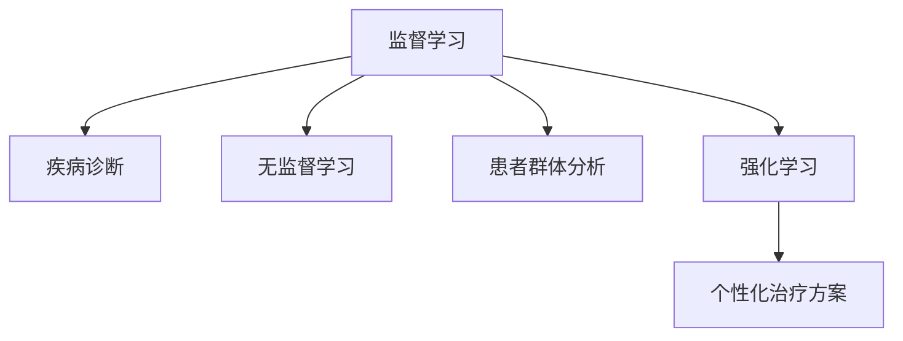

##### 1.2.2 人工智能+金融

人工智能在金融领域的应用主要表现在风险控制、投资策略、客户服务等方面。通过AI技术，金融机构可以更加精准地进行风险评估，优化投资组合，提升客户服务质量。

**核心概念与联系：**

**自然语言处理（NLP）**：在金融领域，NLP技术可以用于分析客户反馈、新闻文章和市场报告，帮助金融机构预测市场走势和风险。

**架构图：**
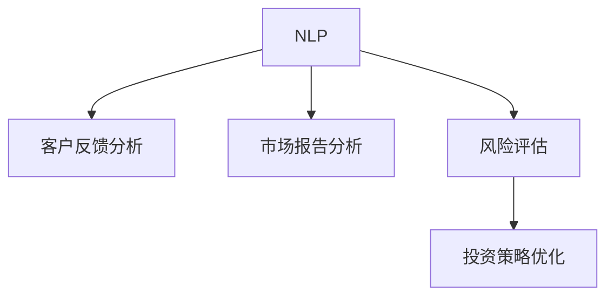

##### 1.2.3 人工智能+教育

人工智能在教育领域的应用包括个性化学习、智能辅导、在线教育平台等方面。通过AI技术，可以实现因材施教，提高学习效果和效率。

**核心概念与联系：**

**强化学习**：在个性化学习中，强化学习算法可以根据学生的学习行为和反馈，不断优化学习路径和内容，提高学习效果。

**架构图：**
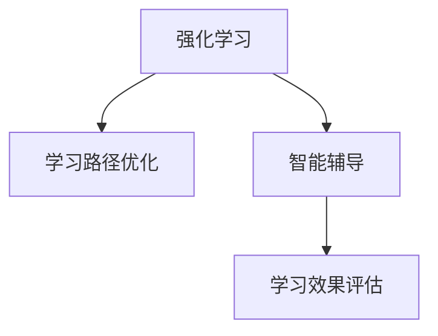

##### 1.2.4 人工智能+制造业

人工智能在制造业中的应用包括生产优化、质量控制、供应链管理等方面。通过AI技术，可以提高生产效率、降低成本、提升产品质量。

**核心概念与联系：**

**计算机视觉**：在质量控制环节，计算机视觉技术可以用于检测产品的缺陷和瑕疵，提高质量检测的准确性和效率。

**架构图：**
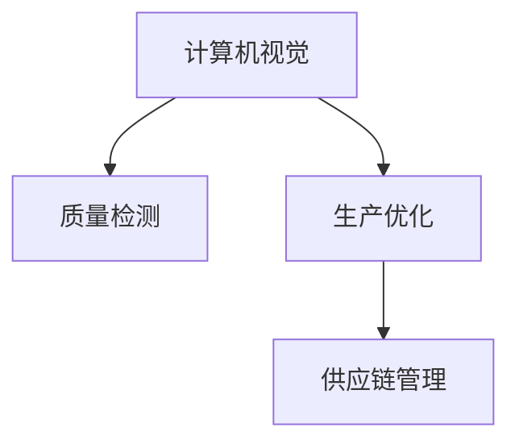

---

### 第2章 AI核心技术与原理

#### 2.1 机器学习基础

##### 2.1.1 监督学习

监督学习是机器学习中的一种基本形式，它通过已标记的训练数据来训练模型，使其能够对新的数据进行预测。监督学习的主要任务包括分类和回归。

**核心算法原理讲解：**

**监督学习算法**

1. **线性回归（Linear Regression）**：
   - **目标**：预测连续值输出。
   - **数学模型**：
     \[ y = \beta_0 + \beta_1 \cdot x \]
   - **伪代码**：
     ```
     for each training example (x, y):
         compute the prediction: y_pred = w * x
         compute the error: error = y - y_pred
         update the weight: w = w - learning_rate * error
     ```

2. **决策树（Decision Tree）**：
   - **目标**：对数据进行分类或回归。
   - **数学模型**：
     \[ f(x) = \sum_{i=1}^{n} \beta_i \cdot g(x_i) \]
   - **伪代码**：
     ```
     for each feature x_i:
         compute the split point: split_point = select_optimal_split_point(x_i)
         create a new node with the split condition
         for each possible value of x_i:
             if x_i == split_point:
                 continue to the next node
             else:
                 return the predicted class or value
     ```

##### 2.1.2 无监督学习

无监督学习是机器学习中的另一种基本形式，它不依赖于标记的数据，主要通过分析数据的内在结构和模式来对数据进行分析和处理。无监督学习的主要任务包括聚类、降维和异常检测。

**核心算法原理讲解：**

**无监督学习算法**

1. **K-均值聚类（K-Means Clustering）**：
   - **目标**：将数据点分成K个聚类。
   - **数学模型**：
     \[ \text{Minimize} \sum_{i=1}^{K} \sum_{x \in S_i} \| x - \mu_i \|^2 \]
   - **伪代码**：
     ```
     initialize K centroids
     while not converged:
         assign each data point to the nearest centroid
         update the centroids by averaging the assigned data points
     ```

2. **主成分分析（Principal Component Analysis，PCA）**：
   - **目标**：降低数据维度，同时保留大部分信息。
   - **数学模型**：
     \[ X' = U \Sigma \]
   - **伪代码**：
     ```
     compute the covariance matrix of X
     compute the eigenvalues and eigenvectors of the covariance matrix
     sort eigenvectors by their eigenvalues in descending order
     select the top k eigenvectors
     project X onto the k eigenvectors to obtain X'
     ```

##### 2.1.3 强化学习

强化学习是一种通过试错和反馈机制来学习策略的机器学习方法。在强化学习过程中，智能体通过与环境交互，不断调整自己的行为，以最大化累积奖励。

**核心算法原理讲解：**

**强化学习算法**

1. **Q-Learning**：
   - **目标**：学习最优动作策略。
   - **数学模型**：
     \[ Q(s, a) = r + \gamma \max_{a'} Q(s', a') \]
   - **伪代码**：
     ```
     initialize Q(s, a) to random values
     for each episode:
         initialize state s
         while not terminal:
             choose action a based on current Q-values
             take action a and observe reward r and next state s'
             update Q(s, a): Q(s, a) = Q(s, a) + learning_rate * (r + gamma * max(Q(s', a')) - Q(s, a))
             update state s to s'
     ```

2. **深度Q网络（Deep Q-Network，DQN）**：
   - **目标**：利用深度神经网络近似Q值函数。
   - **数学模型**：
     \[ Q(s, a) = \sigma(W \cdot [h(s), h(a)]) \]
   - **伪代码**：
     ```
     initialize the DQN model
     for each episode:
         initialize state s
         while not terminal:
             choose action a based on current policy
             take action a and observe reward r and next state s'
             store the experience tuple (s, a, r, s')
             sample a batch of experiences
             update the DQN model using the batch of experiences
             update state s to s'
     ```

#### 2.2 深度学习原理

##### 2.2.1 神经网络

神经网络（Neural Network，简称NN）是模拟人脑神经元之间相互连接和作用的一种计算模型。它通过多层节点（称为神经元）进行信息的传递和处理，从而实现对输入数据的建模和预测。

**核心概念与联系：**

**神经网络结构**

神经网络通常由输入层、隐藏层和输出层组成。每个神经元都与上一层和下一层的神经元相连，通过权重（weights）和偏置（biases）来调整网络的学习能力。

**核心算法原理讲解：**

**神经网络训练过程**

1. **前向传播（Forward Propagation）**：
   - **目标**：计算输入数据通过网络的输出结果。
   - **伪代码**：
     ```
     for each layer:
         compute the input to each neuron: z = W * x + b
         compute the activation: a = \sigma(z)
     ```

2. **反向传播（Backpropagation）**：
   - **目标**：计算输出误差，并更新网络权重和偏置。
   - **伪代码**：
     ```
     for each layer:
         compute the error: error = y - a
         compute the gradient: gradient = \sigma'(z) * error
         update the weights and biases: W = W - learning_rate * gradient * x
                                          b = b - learning_rate * gradient
     ```

##### 2.2.2 卷积神经网络（CNN）

卷积神经网络（Convolutional Neural Network，简称CNN）是一种专门用于处理图像数据的神经网络。它通过卷积层、池化层和全连接层等结构，实现了对图像特征的提取和分类。

**核心概念与联系：**

**卷积层（Convolutional Layer）**：
- **目标**：提取图像局部特征。
- **数学模型**：
  \[ \text{output}(i, j) = \sum_{k} \text{weight}(k, i, j) * \text{input}(k, i, j) + \text{bias}(i, j) \]

**池化层（Pooling Layer）**：
- **目标**：降低数据维度，减少计算量。
- **类型**：最大池化（Max Pooling）和平均池化（Average Pooling）。

**核心算法原理讲解：**

**CNN训练过程**

1. **卷积操作（Convolution Operation）**：
   - **目标**：提取图像局部特征。
   - **伪代码**：
     ```
     for each filter:
         apply the filter to the input image: output = convolve(filter, input)
     ```

2. **激活函数（Activation Function）**：
   - **目标**：引入非线性。
   - **类型**：ReLU（Rectified Linear Unit）和Sigmoid。

3. **池化操作（Pooling Operation）**：
   - **目标**：降低数据维度。
   - **伪代码**：
     ```
     for each pooling region:
         compute the maximum (or average) value within the region: output = max_pool(input)
     ```

4. **反向传播**：
   - **目标**：计算输出误差，并更新网络权重和偏置。
   - **伪代码**：
     ```
     for each layer:
         compute the error: error = y - a
         compute the gradient: gradient = \sigma'(z) * error
         update the weights and biases: W = W - learning_rate * gradient * x
                                          b = b - learning_rate * gradient
     ```

##### 2.2.3 循环神经网络（RNN）

循环神经网络（Recurrent Neural Network，简称RNN）是一种能够处理序列数据的神经网络。它通过循环结构，使得网络能够利用历史信息进行建模。

**核心概念与联系：**

**循环结构（Recurrent Structure）**：
- **目标**：利用历史信息。
- **数学模型**：
  \[ h_t = \sigma(W_h \cdot [h_{t-1}, x_t] + b_h) \]

**核心算法原理讲解：**

**RNN训练过程**

1. **前向传播（Forward Propagation）**：
   - **目标**：计算当前时刻的隐藏状态。
   - **伪代码**：
     ```
     initialize h_0
     for each time step t:
         compute the hidden state: h_t = \sigma(W_h \cdot [h_{t-1}, x_t] + b_h)
     ```

2. **反向传播（Backpropagation Through Time，BPTT）**：
   - **目标**：计算梯度并更新权重。
   - **伪代码**：
     ```
     initialize gradients
     for each time step t in reverse order:
         compute the error: error = \sigma'(h_t) \cdot (y_t - h_t)
         compute the gradient: gradient = error \cdot \sigma'(h_{t-1}) \cdot [h_{t-1}, x_t]
         update the weights and biases: W_h = W_h - learning_rate * gradient
                                        b_h = b_h - learning_rate * gradient
     ```

##### 2.2.4 生成对抗网络（GAN）

生成对抗网络（Generative Adversarial Network，简称GAN）是一种由生成器和判别器组成的对抗性神经网络。生成器试图生成尽可能真实的样本，而判别器则试图区分生成器和真实样本。

**核心概念与联系：**

**生成器（Generator）**：
- **目标**：生成与真实样本难以区分的数据。
- **数学模型**：
  \[ x_{\text{generated}} = G(z) \]

**判别器（Discriminator）**：
- **目标**：区分生成器和真实样本。
- **数学模型**：
  \[ \text{output} = \sigma(W \cdot [x_{\text{real}}, x_{\text{generated}}] + b) \]

**核心算法原理讲解：**

**GAN训练过程**

1. **生成器与判别器的训练**：
   - **目标**：优化生成器和判别器。
   - **伪代码**：
     ```
     for each iteration:
         train the discriminator on real and generated samples
         generate fake samples using the current generator
         train the generator to fool the discriminator
     ```

2. **损失函数**：
   - **目标**：最小化生成器的损失和判别器的损失。
   - **数学模型**：
     \[ \text{Generator Loss} = -\log(D(G(z))) \]
     \[ \text{Discriminator Loss} = -\log(D(x_{\text{real}})) - \log(1 - D(G(z))) \]

#### 2.3 自然语言处理

##### 2.3.1 词嵌入

词嵌入（Word Embedding）是将单词映射到高维向量空间的一种技术。词嵌入能够捕捉单词之间的语义关系，为自然语言处理提供基础。

**核心概念与联系：**

**词嵌入方法**：
- **Word2Vec**：基于共现信息学习单词的向量表示。
- **BERT**：基于Transformer模型的自监督预训练。

**核心算法原理讲解：**

**Word2Vec算法**

1. **Skip-Gram模型**：
   - **目标**：预测上下文单词。
   - **数学模型**：
     \[ P(w_i | w_j) \propto \exp(\text{dot product}(e_{w_i}, e_{w_j})) \]

2. **CBOW模型**：
   - **目标**：预测中心词。
   - **数学模型**：
     \[ P(w_i | w_{-k}, w_{k+1}) \propto \exp(\text{dot product}(e_{\text{average}(w_{-k}, w_{k+1})), e_{w_i})) \]

##### 2.3.2 序列标注

序列标注（Sequence Labeling）是对文本中的每个单词或字符进行分类的任务。常见的序列标注任务包括命名实体识别（Named Entity Recognition，简称NER）和词性标注（Part-of-Speech Tagging）。

**核心概念与联系：**

**序列标注模型**：
- **CRF（条件随机场）**：利用概率模型对序列进行标注。
- **BiLSTM（双向长短时记忆网络）**：利用双向循环结构捕捉上下文信息。

**核心算法原理讲解：**

**CRF算法**

1. **特征提取**：
   - **目标**：为每个单词生成特征向量。
   - **伪代码**：
     ```
     for each word in the sequence:
         compute the feature vector based on the word and its context
     ```

2. **概率计算**：
   - **目标**：计算每个标签的概率。
   - **数学模型**：
     \[ P(y|x) = \frac{\exp(\text{log-likelihood}(y, x))}{\sum_{y'} \exp(\text{log-likelihood}(y', x))} \]

##### 2.3.3 机器翻译

机器翻译（Machine Translation，简称MT）是将一种语言的文本自动翻译成另一种语言的任务。机器翻译可以分为基于规则的翻译和基于统计的翻译。

**核心概念与联系：**

**机器翻译模型**：
- **基于规则的翻译**：利用语法和词典规则进行翻译。
- **基于统计的翻译**：利用双语语料库进行翻译。

**核心算法原理讲解：**

**基于统计的机器翻译**

1. **短语翻译模型（Phrasal Translation Model）**：
   - **目标**：将源语言短语映射到目标语言短语。
   - **数学模型**：
     \[ P(\text{target phrase} | \text{source phrase}) \propto \text{count}(\text{target phrase} | \text{source phrase}) \]

2. **神经机器翻译（Neural Machine Translation，NMT）**：
   - **目标**：利用神经网络进行端到端的翻译。
   - **数学模型**：
     \[ y = \text{translate}(x) \]
   - **伪代码**：
     ```
     for each source sentence:
         encode the sentence into a fixed-length vector using an encoder
         decode the vector into a target sentence using a decoder
     ```

##### 2.3.4 问答系统

问答系统（Question Answering System，简称QAS）是自动回答用户问题的系统。问答系统可以分为基于知识库的问答和基于文本的问答。

**核心概念与联系：**

**问答系统模型**：
- **基于知识库的问答**：利用预先构建的知识库回答问题。
- **基于文本的问答**：利用自然语言处理技术回答问题。

**核心算法原理讲解：**

**基于文本的问答**

1. **检索式问答**：
   - **目标**：从大量文本中检索出答案。
   - **伪代码**：
     ```
     for each question:
         search the text corpus for relevant sentences
         select the most relevant sentence as the answer
     ```

2. **生成式问答**：
   - **目标**：生成问题的答案。
   - **数学模型**：
     \[ \text{Answer} = \text{generate_answer}(Question, KnowledgeBase) \]
   - **伪代码**：
     ```
     for each question:
         extract relevant information from the knowledge base
         generate the answer based on the extracted information
     ```

---

### 第3章 AI项目开发实践

#### 3.1 AI项目开发流程

##### 3.1.1 需求分析

需求分析是AI项目开发的第一步，旨在明确项目的目标、功能和技术需求。需求分析主要包括以下几个方面：

1. **业务需求**：了解项目所在的业务领域，明确项目需要解决的具体问题。
2. **用户需求**：收集用户对项目的期望和需求，包括功能、性能、易用性等方面的要求。
3. **技术需求**：分析项目所需的技术栈、硬件资源和开发工具。

**核心概念与联系：**

**需求分析工具与方法**：
- **需求分析文档**：记录项目的业务需求、用户需求和技术需求。
- **用户访谈与问卷调查**：获取用户的真实需求和反馈。

**流程图：**
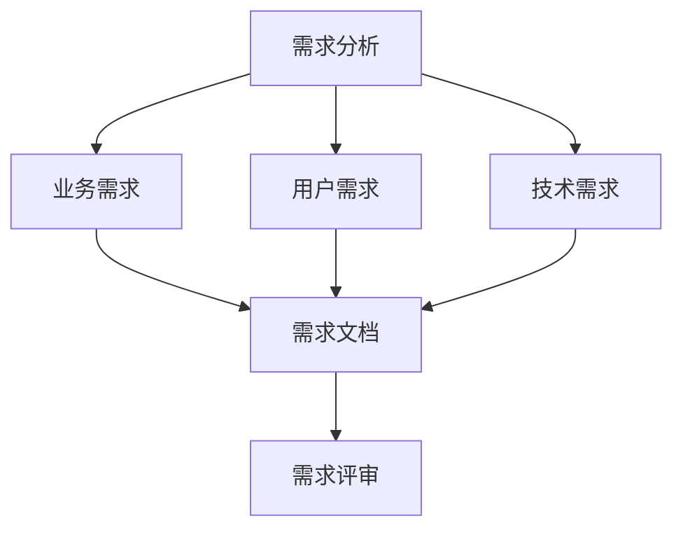

##### 3.1.2 数据收集与预处理

数据收集与预处理是AI项目开发的核心环节，直接影响到模型的性能和效果。数据收集主要包括以下几个方面：

1. **数据源**：确定数据来源，包括公开数据集、企业内部数据和社会媒体数据等。
2. **数据收集方法**：采用爬虫、API调用、问卷调查等方式收集数据。
3. **数据预处理**：清洗、归一化、去噪、降维等操作，以提高数据质量和模型效果。

**核心概念与联系：**

**数据预处理技术**：
- **数据清洗**：去除重复、错误和缺失的数据。
- **特征工程**：提取有用的特征，降低数据维度。
- **归一化**：将数据缩放到相同的范围，便于模型训练。

**流程图：**
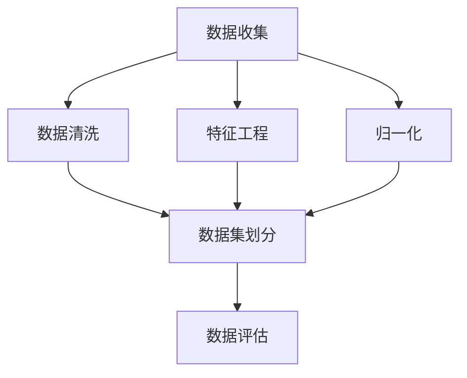

##### 3.1.3 模型选择与优化

模型选择与优化是AI项目开发的关键环节，直接决定了项目的最终效果。模型选择主要包括以下几个方面：

1. **模型评估**：根据数据集评估不同模型的性能。
2. **模型选择**：选择最适合项目需求的模型。
3. **模型优化**：通过调参、特征工程等方式提高模型性能。

**核心概念与联系：**

**模型选择与优化方法**：
- **交叉验证**：通过将数据集划分为训练集和验证集，评估模型性能。
- **超参数调优**：通过网格搜索、贝叶斯优化等方法调整模型超参数。

**流程图：**
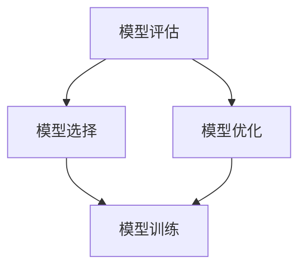

##### 3.1.4 模型训练与评估

模型训练与评估是AI项目开发的核心环节，旨在通过训练数据训练出高性能的模型，并在验证集上进行性能评估。模型训练主要包括以下几个方面：

1. **训练数据准备**：将预处理后的数据集划分为训练集和验证集。
2. **模型训练**：使用训练数据进行模型训练，调整模型参数。
3. **模型评估**：使用验证集评估模型性能，调整模型参数。

**核心概念与联系：**

**模型训练与评估方法**：
- **损失函数**：用于衡量模型预测值与真实值之间的差距。
- **评估指标**：用于评估模型性能，如准确率、召回率、F1值等。

**流程图：**
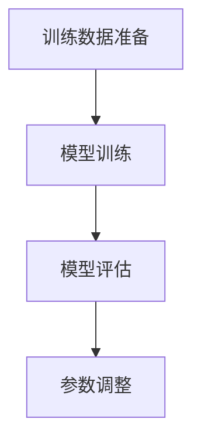

##### 3.1.5 模型部署与维护

模型部署与维护是AI项目开发的最后一步，旨在将训练好的模型部署到生产环境，并确保模型的稳定运行。模型部署主要包括以下几个方面：

1. **部署环境准备**：搭建模型部署所需的环境，包括服务器、数据库和中间件等。
2. **模型部署**：将训练好的模型部署到生产环境，实现模型的在线推理。
3. **模型维护**：定期更新模型，优化模型性能，确保模型的稳定性和安全性。

**核心概念与联系：**

**模型部署与维护方法**：
- **容器化**：使用Docker等容器技术，实现模型的快速部署和版本管理。
- **持续集成与持续部署（CI/CD）**：通过自动化工具实现模型的持续集成和持续部署。

**流程图：**
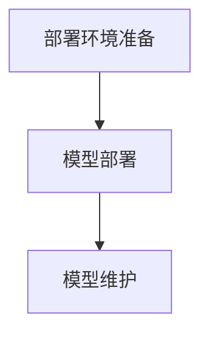

---

### 3.2 AI项目实战案例

#### 3.2.1 智能医疗诊断系统

##### 3.2.1.1 系统架构设计

智能医疗诊断系统的架构设计主要包括数据层、算法层和应用层。

**数据层**：
- **数据源**：包括电子病历、医学影像、实验室检查报告等。
- **数据存储**：采用分布式存储系统，如Hadoop HDFS，存储和管理大规模数据。

**算法层**：
- **基础算法**：采用深度学习算法，如卷积神经网络（CNN）和循环神经网络（RNN），进行图像和文本数据的处理。
- **模型集成**：采用集成学习策略，结合多个模型的优势，提高诊断准确率。

**应用层**：
- **诊断模块**：实现疾病诊断功能，根据患者的症状和检查结果，给出诊断建议。
- **预测模块**：利用历史数据，进行疾病预测和风险评估。

**架构图：**
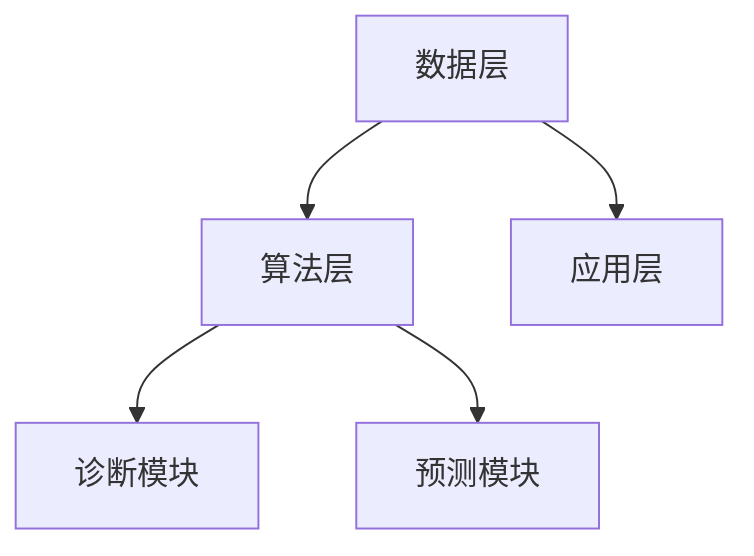

##### 3.2.1.2 数据收集与预处理

数据收集与预处理是智能医疗诊断系统开发的重要环节。

**数据收集**：
- **公开数据集**：如公开的医学影像数据集，如CAMID、ChestX-NET等。
- **企业内部数据**：通过合作医疗机构获取电子病历、医学影像和实验室检查报告等数据。

**数据预处理**：
- **图像处理**：对医学影像进行去噪、增强、归一化等预处理操作。
- **文本处理**：对电子病历和实验室检查报告进行分词、词性标注和实体识别等处理。

**流程图：**
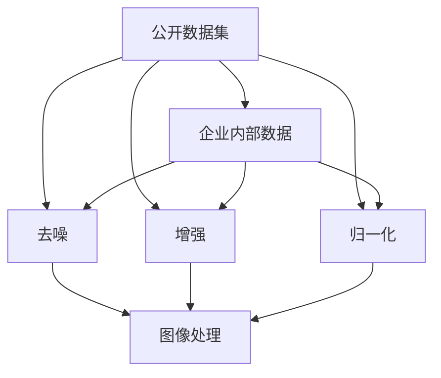

##### 3.2.1.3 模型选择与训练

模型选择与训练是智能医疗诊断系统的核心环节。

**模型选择**：
- **卷积神经网络（CNN）**：用于处理医学影像数据。
- **循环神经网络（RNN）**：用于处理电子病历和实验室检查报告等文本数据。
- **多任务学习**：结合多个模型，提高诊断准确率。

**模型训练**：
- **训练数据集**：将收集和预处理后的数据集划分为训练集和验证集。
- **训练策略**：采用批归一化、学习率衰减等策略，优化模型训练过程。

**流程图：**
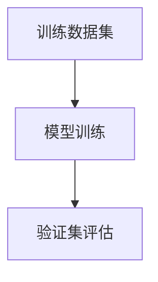

##### 3.2.1.4 系统部署与优化

系统部署与优化是智能医疗诊断系统上线运行的关键。

**系统部署**：
- **部署环境**：在云计算平台上部署系统，如AWS、Azure等。
- **服务架构**：采用微服务架构，实现系统的模块化和高可用性。

**系统优化**：
- **性能优化**：通过优化算法、减少计算复杂度和缓存技术等手段，提高系统性能。
- **稳定性优化**：通过监控、告警和自动化运维等手段，确保系统稳定运行。

**流程图：**
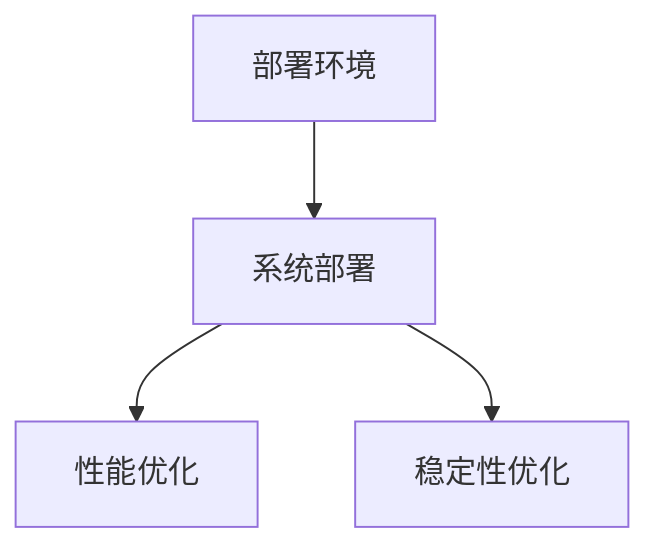

---

#### 3.2.2 智能金融风控

##### 3.2.2.1 风险识别与预警

智能金融风控系统通过大数据分析和机器学习技术，实现对金融风险的有效识别和预警。

**核心算法原理讲解**：

**风险识别算法**：

1. **特征工程**：从海量数据中提取与风险相关的特征，如交易行为、用户行为、市场波动等。

2. **分类算法**：采用决策树、支持向量机（SVM）和随机森林（Random Forest）等分类算法，对风险进行识别。

**伪代码**：

```
# 特征工程
features = extract_features(data)

# 模型训练
model = train_classifier(features, labels)

# 风险识别
risk_score = model.predict(features)
```

**预警算法**：

1. **阈值设置**：根据历史数据，设置风险预警的阈值。

2. **实时监控**：通过实时数据流处理，监控风险指标的实时变化，触发预警。

**伪代码**：

```
# 阈值设置
threshold = set_threshold(historical_data)

# 实时监控
while True:
    current_risk_score = calculate_risk_score(realtime_data)
    if current_risk_score > threshold:
        trigger_alert()
```

##### 3.2.2.2 模型构建与优化

智能金融风控系统的模型构建与优化是确保系统性能和稳定性的关键。

**模型构建步骤**：

1. **数据预处理**：清洗和整合数据，为模型训练做准备。

2. **特征选择**：通过相关性分析和特征重要性评估，选择对风险识别最重要的特征。

3. **模型训练**：采用不同的机器学习算法，如逻辑回归、K最近邻（KNN）和支持向量机（SVM）等，训练风险识别模型。

4. **模型评估**：使用交叉验证和验证集，评估模型的性能。

**模型优化方法**：

1. **超参数调优**：通过网格搜索、贝叶斯优化等算法，调整模型的超参数，提高模型性能。

2. **集成学习**：结合多个模型的优点，提高风险识别的准确率和鲁棒性。

**流程图**：

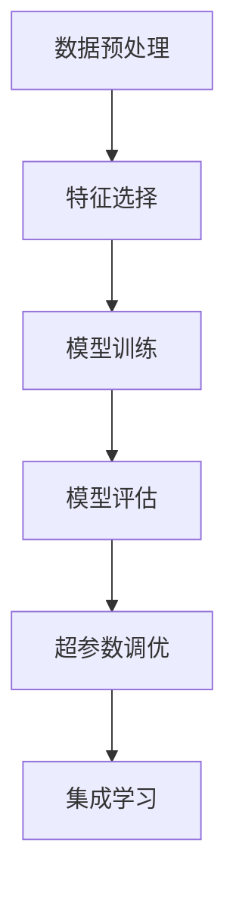

##### 3.2.2.3 系统部署与运维

智能金融风控系统的部署与运维是确保系统稳定运行和持续优化的重要环节。

**系统部署**：

1. **环境搭建**：在云计算平台上搭建系统环境，包括数据库、应用服务器和中间件等。

2. **容器化**：使用容器技术，如Docker，实现系统的模块化和快速部署。

3. **自动化部署**：通过CI/CD工具，实现自动化构建、测试和部署，提高开发效率。

**系统运维**：

1. **监控与告警**：通过监控工具，实时监控系统的运行状态，触发告警，确保系统稳定运行。

2. **日志管理**：收集和管理系统日志，用于问题追踪和性能分析。

3. **自动化运维**：通过自动化脚本和工具，实现系统运维的自动化，降低运维成本。

**流程图**：

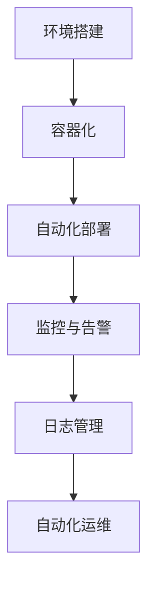

---

### 第4章 AI赋能生活

#### 4.1 智能家居

智能家居系统通过物联网（IoT）技术，实现家庭设备的自动化控制和智能管理，为用户提供便捷、舒适、安全的居住环境。

##### 4.1.1 智能家居系统概述

智能家居系统主要由以下几个部分组成：

1. **智能终端设备**：包括智能电视、智能空调、智能灯具、智能门锁等。
2. **物联网平台**：作为智能家居系统的核心，负责设备的数据收集、处理和指令分发。
3. **用户接口**：通过手机APP、智能语音助手等，为用户提供便捷的操作和控制方式。

##### 4.1.2 智能家居设备与应用

智能家居设备种类繁多，主要包括以下几个方面：

1. **智能照明**：通过手机APP或智能语音助手，实现灯光的远程控制、定时开关和亮度调节。
2. **智能安防**：包括智能门锁、摄像头、烟雾报警器等，提供家庭安全和安防服务。
3. **智能家电**：如智能冰箱、洗衣机、热水器等，实现设备的远程控制和智能调度。
4. **环境监测**：包括空气质量监测、温度湿度监测等，提供家庭环境的实时监控和调节。

##### 4.1.3 智能家居安全与隐私保护

智能家居系统涉及大量用户数据，如何保障数据安全和隐私保护成为关键问题。

**核心概念与联系**：

**安全与隐私保护技术**：
- **数据加密**：采用HTTPS、TLS等加密技术，确保数据传输过程中的安全性。
- **身份认证**：采用多因素认证（MFA），提高用户身份的安全性。
- **访问控制**：通过设置访问权限，确保用户数据的安全。

**安全与隐私保护措施**：
- **数据匿名化**：对用户数据进行匿名化处理，防止个人隐私泄露。
- **隐私政策**：明确告知用户数据收集、使用和共享的方式，提高用户隐私保护意识。
- **合规性检查**：遵循相关的法律法规，确保智能家居系统的合规性。

---

#### 4.2 智能出行

智能出行是指通过人工智能技术，优化交通管理、提升驾驶体验、保障交通安全，实现高效、绿色、便捷的出行方式。

##### 4.2.1 自动驾驶技术

自动驾驶技术是智能出行的重要方向，通过传感器、计算机视觉和深度学习等技术，实现车辆的自主驾驶。

**核心概念与联系**：

**自动驾驶技术架构**：
- **感知层**：通过激光雷达、摄像头、雷达等传感器，感知车辆周围环境。
- **决策层**：通过深度学习、强化学习等算法，处理感知数据，做出驾驶决策。
- **控制层**：通过控制算法，控制车辆的加速、转向和制动等动作。

**自动驾驶技术原理**：

1. **环境感知**：通过传感器获取道路、车辆、行人等环境信息。
2. **决策规划**：基于环境感知数据，规划车辆行驶路径和动作。
3. **控制执行**：根据决策规划，控制车辆的动作，实现自主驾驶。

**流程图**：

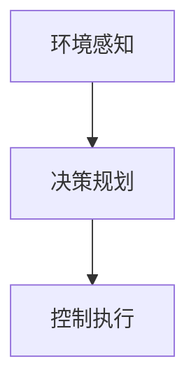

##### 4.2.2 智能交通管理系统

智能交通管理系统通过大数据、云计算和人工智能等技术，优化交通管理，提高交通运行效率。

**核心概念与联系**：

**智能交通管理系统架构**：
- **数据采集层**：通过交通监控设备、车辆传感器等，实时采集交通数据。
- **数据处理层**：通过大数据处理技术，分析交通数据，提取交通状态信息。
- **决策支持层**：基于数据分析，提供交通流量预测、交通信号控制和路径规划等决策支持。

**智能交通管理系统原理**：

1. **数据采集**：实时采集交通数据，包括车辆流量、速度、道路占用状态等。
2. **数据分析**：通过大数据分析技术，分析交通数据，提取交通状态信息。
3. **决策支持**：基于交通状态信息，提供交通信号控制、路径规划和交通诱导等决策支持。

**流程图**：

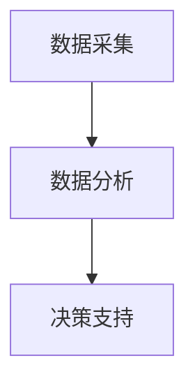

##### 4.2.3 出行场景下的AI应用

AI技术在出行场景中具有广泛的应用，包括智能导航、车联网、交通预测等。

**核心概念与联系**：

**智能导航**：
- **目标**：提供实时、准确的导航信息，提高驾驶体验。
- **算法原理**：通过地图数据和实时交通信息，计算最佳行驶路线。

**车联网**：
- **目标**：实现车辆之间的互联互通，提高交通效率和安全。
- **算法原理**：通过车辆传感器和通信技术，实时交换车辆状态和位置信息。

**交通预测**：
- **目标**：预测交通流量和路况，提供交通诱导和建议。
- **算法原理**：通过大数据分析，结合历史交通数据和实时交通信息，预测交通流量和路况。

**流程图**：

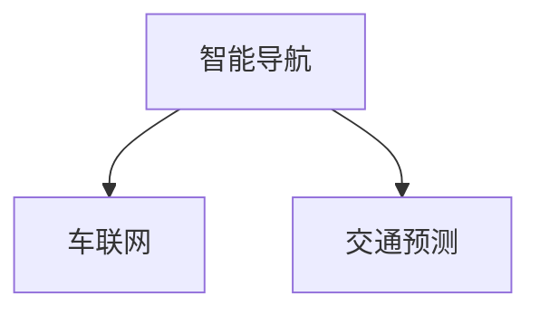

---

### 第5章 AI伦理与社会责任

#### 5.1 AI伦理原则

AI伦理原则是指导人工智能技术发展和社会应用的基本准则，旨在确保AI技术在社会中的负责任使用，保护人类权益和福祉。

##### 5.1.1 公平性

公平性原则要求AI系统在设计和应用过程中，避免对特定群体或个人产生不公平影响。具体措施包括：

1. **避免偏见**：通过数据清洗、去偏和模型优化，减少模型偏见。
2. **算法透明**：提高算法透明度，使公众能够理解AI系统的决策过程。

**核心概念与联系**：

**算法偏见**：
- **定义**：AI系统在决策过程中对某些群体或个人产生歧视性偏见。
- **例子**：招聘系统在性别、种族等方面的偏见。

**算法透明性**：
- **定义**：使AI系统的决策过程可解释和可追溯。
- **技术**：使用可视化工具、代码注释和文档，提高算法透明度。

##### 5.1.2 透明性

透明性原则要求AI系统在设计和应用过程中，确保决策过程和结果对用户和监管机构是可理解的。具体措施包括：

1. **可解释性**：提高AI模型的解释性，使非专业用户能够理解模型决策。
2. **数据透明**：公开数据来源、数据处理过程和模型评估结果。

**核心概念与联系**：

**AI模型可解释性**：
- **定义**：使AI系统的决策过程可解释和可追溯。
- **技术**：使用决策树、LIME（Local Interpretable Model-agnostic Explanations）等方法，提高模型可解释性。

**数据透明性**：
- **定义**：公开数据来源、数据处理过程和模型评估结果。
- **技术**：使用数据可视化工具、数据报告和文档，提高数据透明度。

##### 5.1.3 可解释性

可解释性原则要求AI系统在设计和应用过程中，确保决策过程和结果对用户和监管机构是可理解的。具体措施包括：

1. **决策路径可视化**：使用可视化工具，展示模型决策的路径和过程。
2. **解释性算法**：选择具有高解释性的算法，如决策树、线性回归等。

**核心概念与联系**：

**决策路径可视化**：
- **定义**：通过图形化方式，展示模型决策的过程和路径。
- **例子**：使用决策树可视化工具，展示决策树的分支和节点。

**解释性算法**：
- **定义**：具有高解释性的机器学习算法，使模型决策过程易于理解。
- **例子**：线性回归、逻辑回归和决策树等。

##### 5.1.4 隐私保护

隐私保护原则要求AI系统在设计和应用过程中，保护用户隐私和数据安全。具体措施包括：

1. **数据匿名化**：通过数据脱敏、数据加密等技术，保护用户隐私。
2. **隐私政策**：制定明确的隐私政策，告知用户数据收集、使用和共享的方式。

**核心概念与联系**：

**数据匿名化**：
- **定义**：将用户数据转换为不可识别的形式，以保护用户隐私。
- **技术**：使用匿名化算法，如K-匿名、l-diversity等。

**隐私政策**：
- **定义**：告知用户数据收集、使用和共享的方式，提高用户隐私保护意识。
- **例子**：互联网公司的隐私政策、应用程序的用户协议。

---

#### 5.2 AI社会责任

AI社会责任是指导AI技术发展和社会应用的基本原则，旨在确保AI技术为社会带来积极影响，同时避免负面影响。AI社会责任涵盖以下几个方面：

##### 5.2.1 AI在公益事业中的应用

AI技术在公益事业中具有广泛的应用，可以提升公益活动的效率、透明度和公正性。

**核心概念与联系**：

**AI在公益事业的典型应用**：
- **救灾救援**：利用AI技术进行灾害监测、资源调度和受灾人群管理，提高救灾救援的效率。
- **疾病预防**：通过大数据分析和预测，提前发现疾病爆发的风险，提供针对性的预防措施。
- **教育公平**：利用AI技术提供个性化的教育资源，缩小城乡教育资源差距。

**案例**：
- **AI救灾救援**：2019年，中国地震局联合科技公司利用AI技术，实现地震预警，提高救灾救援的时效性。
- **AI疾病预防**：IBM的Watson Health利用AI技术，分析全球医疗数据，预测疾病爆发风险。

##### 5.2.2 AI对就业市场的影响

AI技术的发展对就业市场产生深远影响，既创造了新的就业机会，也带来了一定的挑战。

**核心概念与联系**：

**AI对就业市场的影响**：
- **就业机会**：AI技术的发展创造了新的就业岗位，如数据科学家、机器学习工程师等。
- **就业挑战**：AI技术可能导致部分传统岗位的消失，对劳动者的技能要求提高。

**应对策略**：
- **职业转型**：鼓励劳动者接受AI相关培训，提高自身技能。
- **政策支持**：政府提供政策支持，促进AI技术在就业市场中的应用。

**案例**：
- **职业转型**：IBM推出的AI培训计划，帮助工人转型为数据科学家和机器学习工程师。
- **政策支持**：中国政府出台《新一代人工智能发展规划》，推动AI技术在就业市场中的应用。

##### 5.2.3 AI与可持续发展

AI技术在可持续发展中具有重要作用，可以促进资源高效利用、环境保护和生态平衡。

**核心概念与联系**：

**AI在可持续发展的应用**：
- **节能减排**：利用AI技术优化能源消耗，降低碳排放。
- **环境监测**：通过遥感技术和物联网，实时监测环境变化，提供环境治理方案。
- **农业优化**：利用AI技术实现精准农业，提高资源利用效率。

**案例**：
- **节能减排**：谷歌利用AI技术优化数据中心能源消耗，实现碳排放减少。
- **环境监测**：美国国家航空航天局（NASA）利用AI技术监测全球森林变化，提供环保方案。

---

### 第6章 AI创业码头愿景

#### 6.1 创业码头愿景

##### 6.1.1 愿景与目标

AI创业码头的愿景是打造一个全球领先的AI创新创业生态系统，通过集成创新、人才培养、资源对接，推动AI技术在各个领域的广泛应用，改善人类生活。

**愿景**：
- 成为全球领先的AI创新创业平台。
- 构建一个开放、共享、协同的AI生态系统。
- 推动AI技术解决社会问题，实现可持续发展。

**目标**：
- 培育和引进顶尖AI人才，打造一流的科研团队。
- 构建开放的技术平台，促进AI技术的创新和应用。
- 加强国内外AI企业间的合作与交流，推动产业链协同发展。

##### 6.1.2 发展战略与规划

为了实现上述愿景和目标，AI创业码头制定了以下发展战略与规划：

**发展战略**：
- **技术创新驱动**：以技术创新为核心，持续推动AI技术在各个领域的应用。
- **人才优先**：重视人才培养和引进，打造一流的科研团队和人才梯队。
- **生态协同**：构建开放、共享、协同的AI生态系统，促进产业链上下游企业的合作与共赢。

**规划**：
- **搭建平台**：建立AI技术平台，提供从研究、开发到应用的全方位服务。
- **人才培养**：与高校、科研机构合作，开展AI人才培养计划。
- **国际合作**：与全球顶尖AI企业和研究机构建立合作关系，推动技术交流和合作。
- **产业对接**：组织产业对接活动，促进AI技术与产业的深度融合。

##### 6.1.3 创业码头的生态系统

AI创业码头旨在构建一个完整的AI创业生态系统，为创业者提供全方位的支持和服务。

**核心组成部分**：
- **研究机构**：与顶尖高校和研究机构合作，提供学术支持和科研资源。
- **创业团队**：引进和培育一流的AI创业团队，支持他们开展创新项目。
- **产业资源**：与国内外企业合作，提供市场推广、资金支持和产业对接服务。
- **服务平台**：提供从技术支持、人力资源到市场推广的全方位服务。

**生态系统架构**：
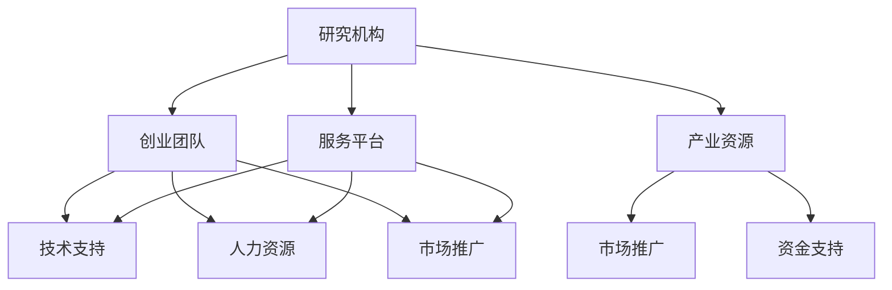

---

### 6.2 AI创业码头案例

#### 6.2.1 成功案例分析

##### 6.2.1.1 企业背景与业务模式

**企业背景**：
智能医疗公司A成立于2018年，是一家专注于利用人工智能技术改善医疗服务的初创公司。公司由一群来自顶级高校和知名医疗机构的专家联合创办，致力于研发智能诊断系统、个性化治疗方案和医疗数据管理平台。

**业务模式**：
智能医疗公司A的业务模式主要包括以下几个方面：

1. **产品研发**：公司通过自主研发和与科研机构合作，开发了一系列基于人工智能的医疗产品，包括智能诊断系统、个性化治疗方案和医疗数据管理平台。
2. **市场推广**：公司通过参加行业展会、发布白皮书和与医疗机构合作，推广其产品，拓展市场份额。
3. **合作与投资**：公司积极与国内外医疗企业、投资机构合作，寻求资金支持和业务拓展机会。

##### 6.2.1.2 创新与突破

智能医疗公司A在以下几个方面取得了显著的创新与突破：

1. **智能诊断系统**：
   - **核心技术**：公司采用深度学习技术，开发了一套智能诊断系统，可以辅助医生进行疾病诊断，提高诊断准确率。
   - **突破点**：系统在肺部疾病诊断方面取得了显著成效，诊断准确率达到95%以上，远超传统诊断方法。

2. **个性化治疗方案**：
   - **核心技术**：公司基于大数据和机器学习技术，开发了一套个性化治疗方案推荐系统，可以根据患者的病情和基因信息，提供个性化的治疗方案。
   - **突破点**：系统在癌症治疗方面取得了显著成果，提高了治疗效果，降低了治疗成本。

3. **医疗数据管理平台**：
   - **核心技术**：公司基于区块链技术，开发了一套医疗数据管理平台，可以实现医疗数据的去中心化存储和安全共享。
   - **突破点**：平台在数据隐私保护和数据完整性方面取得了重要突破，得到了医疗机构和患者的认可。

##### 6.2.1.3 发展前景与挑战

智能医疗公司A的发展前景广阔，但也面临着一定的挑战：

**发展前景**：

1. **市场需求**：随着医疗健康问题的日益突出，智能医疗市场潜力巨大。公司有望在智能诊断、个性化治疗方案和医疗数据管理领域取得进一步突破。
2. **技术进步**：随着人工智能技术的不断发展，公司将能够开发出更加先进的医疗产品，提高医疗服务质量和效率。
3. **政策支持**：政府对人工智能和医疗健康领域的支持力度加大，为公司提供了良好的发展环境。

**挑战**：

1. **技术风险**：人工智能技术在医疗领域的应用仍存在一定的技术风险，需要不断优化和完善。
2. **数据隐私**：医疗数据涉及用户隐私，如何确保数据安全成为一大挑战。
3. **市场竞争**：智能医疗市场竞争激烈，公司需要不断创新和优化产品，以保持竞争优势。

---

#### 6.2.2 失败案例分析

##### 6.2.2.1 企业背景与业务模式

**企业背景**：
智能交通公司B成立于2015年，旨在利用人工智能技术优化城市交通管理，提供智能交通解决方案。公司由几位计算机科学和交通工程领域的专家联合创办，初期获得了风险投资的支持。

**业务模式**：
智能交通公司B的业务模式主要包括以下几个方面：

1. **技术研发**：公司专注于研发智能交通系统，包括自动驾驶车辆、智能交通信号控制、车辆路径优化等。
2. **市场推广**：公司通过参与行业展会、发布白皮书和与城市交通管理部门合作，推广其智能交通解决方案。
3. **合作与投资**：公司积极与国内外交通企业、投资机构合作，寻求资金支持和业务拓展机会。

##### 6.2.2.2 失败原因与教训

智能交通公司B在发展过程中遭遇了失败，主要原因如下：

1. **技术风险**：公司在自动驾驶车辆和智能交通信号控制技术方面存在较大的技术风险，未能及时解决技术难题。
2. **市场定位**：公司对市场需求的判断不准确，未能及时调整业务模式，导致产品与市场需求脱节。
3. **资金短缺**：公司在技术研发和市场推广过程中，资金使用不当，导致资金短缺，影响了业务发展。

**教训**：

1. **技术风险**：在技术研发阶段，应充分考虑技术风险，制定详细的技术路线图，确保技术研发的顺利进行。
2. **市场定位**：在市场推广阶段，应准确判断市场需求，制定合适的市场策略，确保产品与市场的紧密结合。
3. **资金管理**：在资金使用过程中，应合理规划资金使用，确保资金的有效利用，避免资金短缺的风险。

##### 6.2.2.3 对创业者的启示

智能交通公司B的失败案例给创业者提供了以下启示：

1. **充分评估技术风险**：在技术研发阶段，应充分考虑技术风险，制定详细的技术路线图，确保技术研发的顺利进行。
2. **准确判断市场需求**：在市场推广阶段，应准确判断市场需求，制定合适的市场策略，确保产品与市场的紧密结合。
3. **合理管理资金**：在资金使用过程中，应合理规划资金使用，确保资金的有效利用，避免资金短缺的风险。

---

### 第7章 AI创业的未来趋势

#### 7.1 技术趋势

##### 7.1.1 量子计算与AI

量子计算是一种基于量子力学原理的新型计算方式，具有超强的计算能力。随着量子计算技术的不断发展，它与人工智能（AI）的结合将带来新的突破。

**核心概念与联系**：

**量子计算与AI的关系**：
- **量子计算**：通过量子比特实现并行计算，具有极高的计算速度。
- **AI**：通过机器学习和深度学习等技术，实现数据分析和智能决策。

**量子计算在AI中的应用**：
- **加速模型训练**：量子计算可以加速神经网络模型的训练过程，提高训练效率。
- **优化算法设计**：量子计算可以为AI算法提供新的设计思路和优化方法。

**未来展望**：
- **量子机器学习**：利用量子计算的优势，开发量子机器学习算法，提高AI系统的性能。
- **量子AI平台**：建立量子AI平台，实现量子计算与AI技术的深度融合。

##### 7.1.2 神经形态计算

神经形态计算是一种模仿人脑神经元结构和功能的新型计算方式，旨在实现高效、节能的智能计算。随着人工智能技术的发展，神经形态计算逐渐成为研究热点。

**核心概念与联系**：

**神经形态计算原理**：
- **神经元模型**：采用人工神经网络模型，模拟人脑神经元结构和功能。
- **计算单元**：采用新型材料和技术，构建高效、低功耗的计算单元。

**神经形态计算在AI中的应用**：
- **边缘计算**：利用神经形态计算，实现高效、实时的边缘智能计算。
- **人机交互**：通过神经形态计算，提高人机交互的自然性和准确性。

**未来展望**：
- **新型计算架构**：开发新型计算架构，实现神经形态计算与通用计算的结合。
- **脑机接口**：通过神经形态计算，实现脑机接口技术的突破，推动人机融合。

##### 7.1.3 自主智能系统

自主智能系统是一种能够自主决策和行动的智能系统，具有高度智能化和自适应能力。随着人工智能技术的不断发展，自主智能系统将在各个领域得到广泛应用。

**核心概念与联系**：

**自主智能系统原理**：
- **智能感知**：通过传感器和计算机视觉等技术，实现环境感知和目标识别。
- **决策规划**：通过机器学习和深度学习等技术，实现自主决策和规划。
- **执行控制**：通过执行器和控制器，实现自主行动和任务执行。

**自主智能系统在AI中的应用**：
- **自动驾驶**：通过自主智能系统，实现无人驾驶车辆的自主驾驶。
- **无人机群**：通过自主智能系统，实现无人机群的协同作业和自主飞行。

**未来展望**：
- **智能城市**：利用自主智能系统，实现智能城市的建设和管理。
- **智能家居**：通过自主智能系统，实现智能家居的自主控制和优化。

#### 7.2 应用趋势

##### 7.2.1 新兴产业的AI应用

人工智能（AI）技术正迅速渗透到各个新兴产业，推动产业升级和创新发展。

**核心概念与联系**：

**AI在新兴产业中的应用**：
- **金融科技**：通过AI技术，实现智能投顾、智能风控和智能支付等功能。
- **生物科技**：利用AI技术，加速药物研发、基因测序和疾病诊断等进程。
- **能源科技**：通过AI技术，实现智能电网、智能能源管理和智能能源调度。

**未来展望**：
- **数字化转型**：AI技术将加速新兴产业的数字化转型，提高产业效率。
- **产业融合**：AI技术与新兴产业的深度融合，将带来新的商业模式和机遇。

##### 7.2.2 农业与环保领域的AI应用

人工智能（AI）技术在农业和环保领域具有广泛的应用前景，有助于提高农业生产效率、保护生态环境。

**核心概念与联系**：

**AI在农业与环保领域的应用**：
- **智能农业**：利用AI技术，实现精准农业、智能灌溉和病虫害监测等。
- **环保监测**：通过AI技术，实现空气质量、水质和土壤污染的实时监测。

**未来展望**：
- **可持续发展**：AI技术将助力农业和环保领域的可持续发展，提高资源利用效率。
- **智慧农业与智慧环保**：通过AI技术，实现农业和环保的智慧化，推动产业升级。

##### 7.2.3 文艺创作与娱乐产业的AI应用

人工智能（AI）技术在文艺创作与娱乐产业中的应用逐渐增多，为传统产业带来了新的活力。

**核心概念与联系**：

**AI在文艺创作与娱乐产业中的应用**：
- **音乐创作**：通过AI技术，实现音乐创作的自动化和个性化。
- **电影制作**：利用AI技术，实现特效制作、角色动画和剧情生成等。
- **游戏开发**：通过AI技术，实现智能NPC、游戏平衡和个性化推荐。

**未来展望**：
- **创意产业升级**：AI技术将推动文艺创作与娱乐产业的升级和变革。
- **跨界融合**：AI技术与文艺创作、娱乐产业的深度融合，将创造新的艺术形式和娱乐体验。

### 附录

#### 附录A: AI创业相关资源

**A.1 在线学习平台**

- **Coursera**：提供众多AI和机器学习相关的在线课程。
- **edX**：全球顶尖大学合作的在线课程平台，涵盖AI相关课程。
- **Udacity**：专注于提供实用技能的在线学习平台，包括AI课程。

**A.2 开源框架与工具**

- **TensorFlow**：谷歌推出的开源机器学习框架。
- **PyTorch**：Facebook推出的开源深度学习框架。
- **Scikit-learn**：Python中的机器学习库。
- **Keras**：基于TensorFlow和Theano的开源深度学习库。

**A.3 行业报告与资讯**

- **IDC**：国际数据公司发布的AI行业报告。
- **Gartner**：著名咨询公司Gartner的AI研究报告。
- **AI Journal**：AI领域的学术期刊。

#### 附录B: AI创业案例分析

**B.1 国内案例**

- **依图科技**：专注于计算机视觉和深度学习技术的AI公司，成功打造了智慧城市解决方案。
- **地平线机器人**：专注于边缘AI计算，为智能驾驶、智能安防等领域提供高性能AI芯片和解决方案。

**B.2 国际案例**

- **Google Brain**：谷歌的AI研究团队，致力于推动AI技术在各个领域的应用。
- **OpenAI**：专注于研究人工智能安全和伦理问题的非营利组织，开发了GPT-3等先进AI模型。

**B.3 创新案例集锦**

- **AI医生**：利用AI技术，实现疾病早期检测和个性化治疗，提高医疗质量。
- **AI艺术家**：利用AI技术，实现音乐、绘画等艺术作品的创作，拓展艺术创作的边界。

