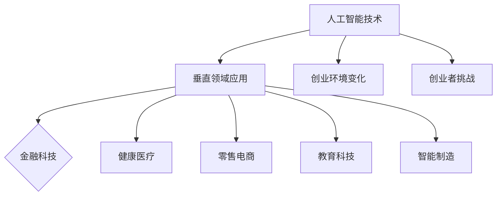

                 

### 第1章：AI创业的背景与机遇

#### 1.1 AI技术发展历程

人工智能（AI）的发展历程可以大致分为三个阶段：专家系统、机器学习和深度学习。

- **专家系统**：20世纪50年代末至70年代初，基于规则的方法，通过手工编写规则实现智能。
- **机器学习**：20世纪80年代至90年代，通过大量数据训练模型，实现从数据中学习的能力。
- **深度学习**：21世纪初至今，利用神经网络特别是深度神经网络，实现了在图像识别、自然语言处理等领域的大规模应用。

#### 1.2 创业环境的变化

近年来，创业环境发生了显著变化，为AI创业提供了有利条件：

- **科技创新加速**：互联网、大数据、云计算等技术的快速发展，为AI创业提供了强大的技术支撑。
- **政策扶持**：各国政府纷纷出台支持AI技术研发和产业应用的政策，为AI创业提供了良好的政策环境。
- **投资热潮**：风险投资和私募股权基金对AI创业项目的投资热情高涨，为创业者提供了充足的资金支持。

#### 1.3 垂直领域的蓝海分析

在AI创业中，垂直领域的蓝海是一个极具吸引力的方向。垂直领域蓝海的优势包括：

- **未被满足的需求**：在特定领域内，仍有大量未被满足的需求等待创业者的挖掘。
- **高壁垒**：垂直领域的专业知识和数据积累使得进入壁垒较高，有利于创业企业建立竞争优势。
- **持续增长**：随着技术的进步和消费者需求的变化，垂直领域市场具有持续增长的潜力。

#### 1.4 创业者面临的挑战

尽管AI创业前景广阔，但创业者仍需面对以下挑战：

- **技术壁垒**：AI技术门槛较高，创业者需要持续学习和投入。
- **市场竞争**：AI创业领域竞争激烈，如何在众多竞争者中脱颖而出是关键。
- **法律法规**：数据隐私和伦理问题需要创业者高度重视，合规经营至关重要。

---

在接下来的章节中，我们将深入探讨金融科技、健康医疗、零售电商、教育科技和智能制造等垂直领域的AI应用，分析其市场前景和创业机遇。通过实际案例，我们将看到AI创业是如何在各个领域取得成功的。让我们一起探索AI创业的无限可能吧！

---

**核心概念与联系**

- **人工智能**：模拟、延伸和扩展人的智能的理论、方法、技术及应用系统。
- **垂直领域**：在特定行业或专业领域中，具有独特业务场景和需求的市场。
- **创业环境**：影响创业者创业活动的经济、社会、政策等外部因素。

**Mermaid流程图**



---

**核心算法原理讲解**

在AI创业中，算法是核心，以下是一些常见的算法原理及其应用：

- **机器学习算法**：通过数据训练模型，实现从数据中学习的能力。常见算法包括：
  ```python
  # 伪代码：机器学习算法基本流程
  def machine_learning_algorithm(data, labels):
      # 数据预处理
      preprocessed_data = preprocess_data(data)
      
      # 模型训练
      model = train_model(preprocessed_data, labels)
      
      # 模型评估
      evaluation = evaluate_model(model, test_data)
      
      return model, evaluation
  ```

- **深度学习算法**：基于神经网络的算法，通过多层神经网络实现复杂特征的提取。常见算法包括：
  ```python
  # 伪代码：深度学习算法基本流程
  def deep_learning_algorithm(data, labels):
      # 数据预处理
      preprocessed_data = preprocess_data(data)
      
      # 网络结构定义
      network = define_network()
      
      # 模型训练
      model = train_network(network, preprocessed_data, labels)
      
      # 模型评估
      evaluation = evaluate_network(model, test_data)
      
      return model, evaluation
  ```

- **自然语言处理算法**：用于处理和理解自然语言。常见算法包括：
  ```python
  # 伪代码：自然语言处理算法基本流程
  def natural_language_processing(text):
      # 分词
      words = tokenize(text)
      
      # 词嵌入
      embeddings = embed_words(words)
      
      # 语言模型训练
      model = train_language_model(embeddings)
      
      # 文本分类
      category = classify_text(model, text)
      
      return category
  ```

**数学模型和公式**

在AI创业中，常用的数学模型和公式包括：

- **线性回归模型**：用于预测连续值。
  $$ y = \beta_0 + \beta_1x + \epsilon $$

- **逻辑回归模型**：用于预测概率。
  $$ P(y=1) = \frac{1}{1 + e^{-(\beta_0 + \beta_1x)}} $$

- **卷积神经网络（CNN）**：用于图像处理。
  $$ output = \sigma(\sum_{k=1}^{K} w_k \times \text{ReLU}(z_k)) $$
  其中，$ \sigma $ 是激活函数，$ \text{ReLU} $ 是ReLU激活函数，$ w_k $ 是权重，$ z_k $ 是卷积结果。

**举例说明**

假设我们想要使用深度学习算法预测股票价格：

1. **数据预处理**：收集历史股票价格数据，包括开盘价、收盘价、最高价、最低价等。
2. **网络结构定义**：定义一个多层感知机（MLP）模型，包括输入层、隐藏层和输出层。
3. **模型训练**：使用历史数据训练模型，调整权重和偏置。
4. **模型评估**：使用测试数据评估模型性能，调整模型参数。

```python
# 伪代码：深度学习股票价格预测
def predict_stock_price(data, model):
    # 数据预处理
    preprocessed_data = preprocess_data(data)
    
    # 模型预测
    prediction = model.predict(preprocessed_data)
    
    return prediction
```

通过上述步骤，我们可以使用深度学习模型预测未来股票价格，为投资决策提供支持。

---

**项目实战：代码实际案例和详细解释说明**

**开发环境搭建**

1. 安装Python环境
2. 安装TensorFlow库
3. 安装Jupyter Notebook

**源代码实现**

```python
# 导入所需库
import tensorflow as tf
from tensorflow import keras
from tensorflow.keras import layers

# 数据预处理
# 假设data是输入特征，label是标签
def preprocess_data(data, label):
    # 数据标准化
    data_mean = tf.reduce_mean(data, axis=0)
    data_std = tf.reduce_std(data, axis=0)
    data = (data - data_mean) / data_std
    
    # 数据归一化
    label_mean = tf.reduce_mean(label, axis=0)
    label_std = tf.reduce_std(label, axis=0)
    label = (label - label_mean) / label_std
    
    return data, label

# 模型定义
model = keras.Sequential([
    layers.Dense(64, activation='relu', input_shape=(data.shape[1],)),
    layers.Dense(64, activation='relu'),
    layers.Dense(1)
])

# 模型编译
model.compile(optimizer='adam', loss='mean_squared_error')

# 模型训练
model.fit(data, label, epochs=10, batch_size=32)

# 模型评估
test_loss = model.evaluate(test_data, test_label)
print(f"Test Loss: {test_loss}")

# 模型预测
prediction = model.predict(test_data)
```

**代码解读与分析**

- 数据预处理：将输入数据进行标准化和归一化处理，提高模型的训练效果。
- 模型定义：使用Keras构建一个简单的多层感知机模型，包括两个隐藏层。
- 模型编译：设置优化器和损失函数，为模型训练做准备。
- 模型训练：使用训练数据训练模型，设置训练轮次和批量大小。
- 模型评估：使用测试数据评估模型性能，计算测试损失。
- 模型预测：使用测试数据对模型进行预测，得到预测结果。

通过上述步骤，我们可以实现一个简单的深度学习股票价格预测模型。在实际应用中，需要根据具体场景和需求进行调整和优化。

---

在本文中，我们探讨了AI创业的背景与机遇，分析了金融科技、健康医疗、零售电商、教育科技和智能制造等垂直领域的AI应用，并提供了相关的算法原理、数学模型和项目实战案例。希望本文能够为AI创业者提供一些启示和帮助。在接下来的章节中，我们将继续深入探讨这些领域的具体应用和创业策略。让我们继续探索AI创业的无限可能！

---

**作者信息**

作者：AI天才研究院/AI Genius Institute & 禅与计算机程序设计艺术 /Zen And The Art of Computer Programming**

