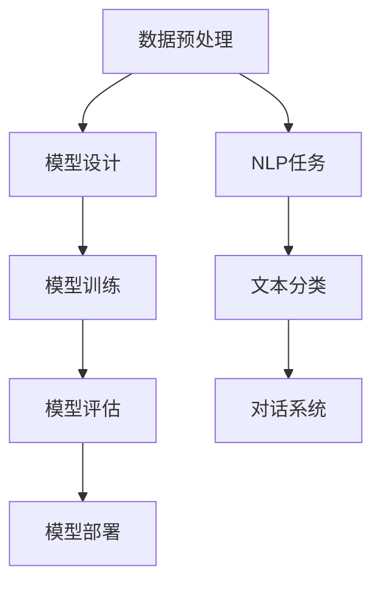

                 

# AI创业者的码头故事：95后AI博士的选择

## 关键词
- AI创业
- 95后AI博士
- 创业准备
- 核心技术
- 项目实战
- 创业支持
- 成长与展望

## 摘要
本文讲述了一位95后AI博士的创业故事，从基础知识到核心技术，再到项目实战和创业支持，全面解析了AI创业的各个环节。通过该博士的亲身经历，读者可以了解到如何进行AI创业准备，如何运用深度学习和自然语言处理等核心技术，以及如何面对项目开发中的挑战和机遇。本文还探讨了创业过程中的支持与资源整合、成长与持续创新，并对未来AI创业发展趋势进行了展望。

## 《AI创业者的码头故事：95后AI博士的选择》目录大纲

### 第一部分：AI基础与创业准备

#### 第1章：AI概述与创业基础
- **1.1 AI的发展历程与现状**
  - **核心概念与历史演进**
  - **当前AI技术的应用与趋势**

- **1.2 AI创业者的必备素养**
  - **技术能力的要求**
  - **商业思维的培养**
  - **团队建设与管理**

- **1.3 AI创业项目的选择**
  - **行业分析**
  - **市场前景预测**
  - **创业项目的可行性研究**

### 第二部分：核心技术解析

#### 第2章：深度学习与神经网络
- **2.1 深度学习基础**
  - **神经网络结构**
  - **深度学习模型**

- **2.2 深度学习算法**
  - **BP算法**
  - **优化算法**

- **2.3 深度学习实战**
  - **数据预处理**
  - **模型训练与评估**
  - **模型部署**

#### 第3章：自然语言处理
- **3.1 NLP基础**
  - **词嵌入**
  - **语言模型**

- **3.2 NLP算法**
  - **序列模型**
  - **注意力机制**

- **3.3 NLP实战**
  - **文本分类**
  - **对话系统**

### 第三部分：项目实战与案例分析

#### 第4章：AI项目开发实战
- **4.1 项目规划与团队协作**
  - **项目管理方法**
  - **团队协作工具**

- **4.2 数据集构建与处理**
  - **数据来源**
  - **数据预处理**

- **4.3 模型设计与实现**
  - **模型选择**
  - **模型训练**

#### 第5章：AI创业案例分析
- **5.1 成功案例解析**
  - **创业历程回顾**
  - **商业模式解析**

- **5.2 失败案例分析**
  - **失败原因分析**
  - **启示与改进**

### 第四部分：创业支持与成长

#### 第6章：创业支持与资源整合
- **6.1 创业环境与政策**
  - **创业支持政策**
  - **创业环境分析**

- **6.2 融资策略与资金管理**
  - **融资渠道**
  - **资金管理**

- **6.3 市场营销与品牌建设**
  - **市场营销策略**
  - **品牌建设方法**

#### 第7章：创业成长与持续创新
- **7.1 创业者成长路径**
  - **职业规划**
  - **持续学习**

- **7.2 创新方法与思路**
  - **创新思维培养**
  - **创新实践案例**

### 第五部分：未来展望

#### 第8章：AI创业发展趋势
- **8.1 AI技术与行业结合**
  - **行业应用趋势**
  - **潜在发展领域**

- **8.2 创业机遇与挑战**
  - **新兴市场**
  - **技术挑战**

### 附录
- **A.1 常用工具与资源**
  - **开发工具**
  - **学习资源**

- **A.2 深度学习与NLP流程图**
  - **Mermaid流程图**

- **A.3 代码实战案例**
  - **源代码解析**
  - **代码解读与分析**

### 1.1 AI的发展历程与现状

#### 核心概念与历史演进
人工智能（Artificial Intelligence，简称AI）是计算机科学的一个分支，旨在使计算机具备模拟、延伸和扩展人类智能的能力。AI的发展历程可以追溯到20世纪50年代，当时人工智能的概念首次被提出。早期的人工智能研究主要集中在规则推理和知识表示上，如专家系统的开发。

随着计算机性能的提升和算法的进步，人工智能在20世纪80年代迎来了一个重要的发展阶段，涌现出了诸如神经网络、决策树、支持向量机等机器学习算法。这些算法使得计算机能够从数据中自动学习，实现了从规则驱动到数据驱动的转变。

进入21世纪，深度学习（Deep Learning）的兴起标志着人工智能进入了一个全新的阶段。深度学习利用多层神经网络对大量数据进行自动特征提取和学习，取得了在图像识别、语音识别、自然语言处理等领域的突破性进展。特别是2012年，AlexNet在ImageNet图像识别挑战赛中取得了显著成绩，标志着深度学习时代的到来。

#### 当前AI技术的应用与趋势
当前，AI技术已经在各个行业得到了广泛应用，如自动驾驶、智能医疗、智能家居、金融风控等。以下是一些主要的AI技术应用和趋势：

- **图像识别与计算机视觉**：通过深度学习算法，计算机可以自动识别和分类图像中的对象。应用场景包括人脸识别、安防监控、医疗影像分析等。

- **自然语言处理（NLP）**：NLP技术使得计算机能够理解和生成自然语言，应用场景包括语音助手、机器翻译、文本分类、情感分析等。

- **智能决策与推荐系统**：基于大数据和机器学习算法，智能决策系统可以帮助企业优化生产、库存、营销等决策。推荐系统则广泛应用于电子商务、新闻推送、音乐视频推荐等场景。

- **机器人与自动化**：通过机器学习和控制技术，机器人可以执行重复性高、危险或复杂的任务，如工业自动化生产线、医疗手术机器人等。

- **智能医疗**：AI技术在医疗领域具有广泛的应用前景，如疾病预测、辅助诊断、个性化治疗等。

- **金融科技**：AI技术在金融领域主要用于风险管理、信用评估、投资顾问等，提高了金融服务的效率和准确性。

#### 技术发展趋势
未来，人工智能技术将继续快速发展，以下是一些可能的发展趋势：

- **泛在智能**：随着物联网（IoT）和5G技术的发展，越来越多的设备和物品将具备智能能力，形成一个智能化的网络环境。

- **人机协同**：未来的人机协同将更加紧密，人工智能将更好地辅助人类工作，提高生产效率和生活质量。

- **自主决策与智能控制**：随着算法和硬件的进步，人工智能将具备更强的自主决策和控制能力，实现更加智能化的系统。

- **AI伦理与法规**：随着AI技术的应用日益广泛，如何保障AI的伦理和合规性将成为一个重要议题，需要建立相应的法律法规和伦理规范。

### 1.2 AI创业者的必备素养

#### 技术能力的要求
AI创业者需要具备扎实的技术能力，包括：

- **数学基础**：线性代数、概率论、统计学等数学基础是理解和应用机器学习算法的必备知识。
- **编程技能**：熟练掌握Python、Java等编程语言，能够使用TensorFlow、PyTorch等深度学习框架进行模型开发。
- **机器学习知识**：了解常见的机器学习算法，如线性回归、决策树、支持向量机、神经网络等，能够根据实际需求选择合适的算法。
- **数据预处理和特征工程**：掌握数据清洗、数据归一化、特征提取等技术，能够处理大规模数据并提取有效特征。
- **深度学习和自然语言处理**：熟悉深度学习框架和NLP技术，能够开发先进的图像识别、语音识别、文本分类等应用。

#### 商业思维的培养
AI创业者不仅需要技术能力，还需要具备商业思维，包括：

- **市场洞察力**：了解目标市场的需求和趋势，能够识别出潜在的商业机会。
- **商业模式设计**：能够根据市场需求和技术能力，设计出可行的商业模式，实现盈利。
- **风险与机会管理**：识别和管理创业过程中的风险，同时抓住机遇，实现业务增长。

#### 团队建设与管理
团队是创业成功的关键，AI创业者需要具备团队建设与管理的能力，包括：

- **招聘与选拔**：能够识别和选拔合适的团队成员，包括技术人才、产品经理、市场营销人员等。
- **团队协作**：建立高效的团队协作机制，促进团队成员之间的沟通与合作。
- **绩效评估与激励**：建立合理的绩效评估体系，激励团队成员发挥潜力，共同实现创业目标。

### 1.3 AI创业项目的选择

#### 行业分析
AI创业项目的选择离不开对行业的深入分析，以下是一些重要的分析维度：

- **市场需求**：分析目标行业的市场规模、增长速度和需求变化，评估AI技术在该行业的应用前景。
- **技术成熟度**：评估当前AI技术在该行业中的应用成熟度，包括算法、硬件和软件的成熟程度。
- **竞争环境**：分析行业内的竞争对手，评估自身的竞争优势和差异化策略。

#### 市场前景预测
进行市场前景预测时，可以考虑以下因素：

- **技术发展趋势**：根据技术发展趋势，预测AI技术在未来几年的应用领域和市场规模。
- **政策环境**：分析政府相关政策对AI行业的影响，评估政策的支持力度。
- **行业痛点**：挖掘目标行业的痛点问题，评估AI技术能够解决的痛点及其带来的商业价值。

#### 创业项目的可行性研究
创业项目的可行性研究包括技术可行性、市场可行性、经济可行性和法律可行性等方面：

- **技术可行性**：评估项目所需的技术是否成熟，是否具备实现的可能性。
- **市场可行性**：分析市场需求，评估项目的市场前景和商业可行性。
- **经济可行性**：评估项目的投资成本、运营成本和盈利能力。
- **法律可行性**：确保项目的合法性，包括知识产权、数据隐私、合同等方面。

### 2.1 深度学习基础

#### 神经网络结构
神经网络（Neural Networks）是深度学习的基础，它模拟了人脑神经元的工作原理。一个简单的神经网络通常由以下几个部分组成：

1. **输入层**：接收外部输入数据，如图像像素、文本等。
2. **隐藏层**：一个或多个隐藏层，用于对输入数据进行特征提取和变换。
3. **输出层**：生成预测结果或分类标签。

每个神经元都与其他神经元相连，通过权重（weights）和偏置（bias）进行信号传递。神经网络的基本工作原理是前向传播（forward propagation）和反向传播（backpropagation）：

- **前向传播**：输入数据通过输入层传递到隐藏层，经过隐藏层的处理，最终传递到输出层得到预测结果。
- **反向传播**：根据预测结果与真实结果的误差，通过反向传播算法更新网络中的权重和偏置，使预测结果更接近真实值。

#### 深度学习模型
深度学习模型是基于多层神经网络的复杂模型，它通过增加隐藏层的数量和神经元数量，提高了模型的表达能力。以下是一些常见的深度学习模型：

1. **多层感知机（MLP）**：最简单的深度学习模型，由多个隐藏层组成，适用于简单的回归和分类问题。
2. **卷积神经网络（CNN）**：主要用于图像识别和计算机视觉领域，通过卷积层和池化层对图像进行特征提取。
3. **循环神经网络（RNN）**：适用于序列数据建模，如自然语言处理和时间序列预测，通过循环结构保留历史信息。
4. **长短时记忆网络（LSTM）**：RNN的一种改进，能够更好地处理长序列依赖问题。
5. **生成对抗网络（GAN）**：通过生成器和判别器的对抗训练，能够生成高质量的图像和文本。
6. **变分自编码器（VAE）**：通过变分推断方法进行无监督特征学习，常用于图像生成和图像压缩。

### 2.2 深度学习算法

#### BP算法
反向传播（Backpropagation）算法是深度学习训练的核心算法。它通过前向传播计算预测值，然后通过反向传播计算梯度，更新网络的权重和偏置。BP算法的基本步骤如下：

1. **前向传播**：输入数据通过网络传递，每个神经元计算其输出值。
2. **计算误差**：将预测值与真实值进行比较，计算误差。
3. **计算梯度**：通过链式法则计算每个权重和偏置的梯度。
4. **权重更新**：使用梯度下降或其他优化算法更新权重和偏置。
5. **重复迭代**：重复前向传播和反向传播，直到达到预设的误差阈值或迭代次数。

#### 优化算法
深度学习训练过程中，优化算法用于更新网络权重和偏置，以提高模型性能。以下是一些常用的优化算法：

1. **随机梯度下降（SGD）**：在训练数据集的一个样本上计算梯度，然后更新权重。优点是计算速度快，缺点是容易陷入局部最小值。
2. **动量法**：在SGD的基础上引入动量，减少更新过程中的波动。动量项可以加速梯度的下降。
3. **Adagrad**：根据每个权重的历史梯度平方来调整学习率，适用于稀疏数据。
4. **RMSprop**：类似于Adagrad，但使用指数加权移动平均来计算学习率。
5. **Adam**：结合了动量法和Adagrad的优点，适用于大多数问题，是当前最流行的优化算法。

### 2.3 深度学习实战

#### 数据预处理
深度学习项目中的数据预处理是模型训练成功的关键步骤。以下是一些常用的数据预处理方法：

1. **数据清洗**：去除噪声、缺失值和不一致的数据，保证数据质量。
2. **数据归一化**：将数据缩放到相同的范围，如[0, 1]或[-1, 1]，加快收敛速度。
3. **数据增强**：通过旋转、缩放、裁剪、颜色变换等操作增加数据的多样性，提高模型泛化能力。
4. **数据划分**：将数据集划分为训练集、验证集和测试集，用于模型训练、调参和评估。

#### 模型训练与评估
在深度学习项目中，模型训练与评估是核心环节。以下是一个简单的模型训练与评估流程：

1. **模型设计**：根据项目需求设计神经网络结构，包括层数、神经元数量、激活函数等。
2. **数据加载**：加载预处理的训练数据和标签，可以使用TensorFlow、PyTorch等深度学习框架的DataLoader。
3. **模型训练**：通过前向传播计算预测值，计算损失函数，通过反向传播更新模型参数。
4. **模型评估**：使用验证集评估模型性能，调整模型参数和超参数，如学习率、批量大小等。
5. **模型测试**：在测试集上评估模型性能，确保模型在未见数据上的泛化能力。

#### 模型部署
模型部署是将训练好的模型应用到实际生产环境中，以下是一些常见的模型部署方法：

1. **本地部署**：在本地计算机或服务器上运行模型，适用于小规模应用。
2. **云计算部署**：使用云计算平台（如AWS、Google Cloud、Azure）部署模型，适用于大规模、高性能需求。
3. **边缘计算部署**：在物联网设备（如手机、路由器、智能家居设备）上部署模型，实现实时处理和响应。
4. **容器化部署**：使用容器化技术（如Docker）封装模型和依赖项，实现模型的可移植性和可扩展性。

### 3.1 NLP基础

#### 词嵌入
词嵌入（Word Embedding）是将单词映射到高维向量空间的技术，它通过向量表示实现了单词的语义表示。常见的词嵌入方法包括：

1. **Word2Vec**：通过训练词向量的分布模型，如连续词袋（CBOW）和Skip-Gram模型，将单词映射到高维空间。
2. **GloVe**：通过全局共现矩阵计算词向量的表示，能够在保留单词局部信息的同时，捕捉全局语义关系。
3. **BERT**：基于Transformer模型，通过预训练和微调生成高质量的词向量，适用于各种NLP任务。

#### 语言模型
语言模型（Language Model）是NLP的核心组成部分，它用于预测下一个单词或词元。常见的语言模型包括：

1. **n-gram模型**：基于马尔可夫假设，使用前n个单词预测下一个单词。
2. **神经网络语言模型**：使用神经网络建模单词之间的关系，如循环神经网络（RNN）和长短时记忆网络（LSTM）。
3. **Transformer模型**：基于自注意力机制，能够捕捉长距离的依赖关系，是当前最先进的语言模型。

### 3.2 NLP算法

#### 序列模型
序列模型（Sequence Model）是处理序列数据（如文本、语音）的主要方法。以下是一些常见的序列模型：

1. **循环神经网络（RNN）**：通过循环结构处理序列数据，能够捕捉长期依赖关系。
2. **长短时记忆网络（LSTM）**：RNN的一种改进，能够更好地处理长序列依赖问题。
3. **门控循环单元（GRU）**：LSTM的简化版本，具有类似的性能但计算效率更高。

#### 注意力机制
注意力机制（Attention Mechanism）是一种能够自动关注序列中关键信息的方法，它在序列模型中起到了重要的作用。以下是一些常见的注意力机制：

1. **软注意力**：通过计算注意力权重，对序列中的每个元素进行加权求和。
2. **硬注意力**：直接从序列中选择最相关的元素，如使用ArgMax操作。
3. **自注意力**：在Transformer模型中使用的多头注意力机制，能够同时关注序列中的多个元素。

### 3.3 NLP实战

#### 文本分类
文本分类（Text Classification）是将文本数据分类到预定义的类别中的一种NLP任务。以下是一些文本分类的实战方法：

1. **基于规则的方法**：使用规则匹配或关键词匹配进行分类，如TF-IDF模型。
2. **基于机器学习的方法**：使用分类算法（如SVM、朴素贝叶斯、逻辑回归等）进行文本分类。
3. **基于深度学习的方法**：使用深度学习模型（如CNN、RNN、Transformer等）进行文本分类。

#### 对话系统
对话系统（Dialogue System）是一种能够与人类进行自然语言交互的系统，包括对话管理、自然语言理解和自然语言生成等模块。以下是一些对话系统的实战方法：

1. **基于规则的方法**：使用预定义的规则和模板生成对话回复。
2. **基于统计的方法**：使用隐马尔可夫模型（HMM）或条件概率模型进行对话生成。
3. **基于机器学习的方法**：使用机器学习模型（如SVM、决策树、朴素贝叶斯等）进行对话生成。
4. **基于深度学习的方法**：使用深度学习模型（如RNN、LSTM、Transformer等）进行对话生成。

### 4.1 项目规划与团队协作

#### 项目管理方法
项目管理是AI项目成功的关键，以下是一些常用的项目管理方法：

1. **瀑布模型**：将项目分为不同的阶段，每个阶段有明确的目标和任务。
2. **敏捷开发**：通过迭代和增量开发，快速响应需求变化，提高项目灵活性。
3. **看板（Kanban）**：通过可视化看板管理项目任务，实时跟踪项目进度。
4. **Scrum**：通过短期的迭代（Sprint）进行项目管理，强调团队协作和快速交付。

#### 团队协作工具
团队协作工具是项目成功的重要保障，以下是一些常用的团队协作工具：

1. **Git**：版本控制系统，用于代码管理和协作开发。
2. **GitHub**：基于Git的在线代码托管平台，提供代码评审、分支管理和问题跟踪等功能。
3. **JIRA**：项目管理工具，用于任务管理、进度跟踪和问题跟踪。
4. **Trello**：任务管理工具，通过看板形式管理任务和项目进度。
5. **Slack**：团队沟通工具，用于实时沟通和协作。

### 4.2 数据集构建与处理

#### 数据来源
数据集构建是AI项目的基础，以下是一些常见的数据来源：

1. **公开数据集**：如ImageNet、CIFAR-10、CoNLL等，广泛用于学术研究和竞赛。
2. **私有数据集**：企业或研究机构自己收集的数据集，如社交媒体数据、医疗数据等。
3. **互联网爬取**：通过网页爬取技术获取大规模的文本、图像数据。
4. **传感器数据**：如交通监控、环境监测等传感器数据，用于时间序列分析和预测。

#### 数据预处理
数据预处理是确保数据质量和模型性能的重要步骤，以下是一些常用的数据预处理方法：

1. **数据清洗**：去除噪声、缺失值和不一致的数据，保证数据质量。
2. **数据归一化**：将数据缩放到相同的范围，如[0, 1]或[-1, 1]，加快收敛速度。
3. **数据增强**：通过旋转、缩放、裁剪、颜色变换等操作增加数据的多样性，提高模型泛化能力。
4. **特征提取**：从原始数据中提取有用的特征，如文本中的词向量、图像中的边缘特征等。

### 4.3 模型设计与实现

#### 模型选择
在AI项目中，选择合适的模型至关重要，以下是一些常见的模型选择方法：

1. **基于问题的模型选择**：根据问题的性质（如分类、回归、生成等），选择相应的模型。
2. **基于数据的模型选择**：根据数据的特点（如数据量、特征类型等），选择合适的模型。
3. **交叉验证**：使用交叉验证方法评估不同模型的性能，选择最佳模型。

#### 模型训练
模型训练是AI项目的核心步骤，以下是一些模型训练的方法：

1. **批量训练**：将整个数据集分成多个批次，每次训练一个批次的数据。
2. **小批量训练**：每次训练一个小批量数据，有助于提高模型性能和稳定性。
3. **学习率调整**：通过调整学习率，优化模型收敛速度和性能。

#### 模型评估
模型评估是验证模型性能的重要步骤，以下是一些模型评估方法：

1. **准确率（Accuracy）**：预测正确的样本数占总样本数的比例。
2. **精确率（Precision）**：预测正确的正例数占预测正例总数的比例。
3. **召回率（Recall）**：预测正确的正例数占实际正例总数的比例。
4. **F1分数（F1 Score）**：精确率和召回率的调和平均值，综合考虑准确性和召回率。

### 5.1 成功案例解析

#### 创业历程回顾
以A公司为例，A公司成立于2015年，由两位95后AI博士共同创立。创始人在大学期间就开始参与AI项目研究，积累了丰富的技术经验。在创办公司之前，他们曾参与多个AI竞赛并取得了优异成绩。

创业初期，A公司专注于自动驾驶领域，通过深度学习和计算机视觉技术，开发了一套智能驾驶系统。起初，公司在资金和技术上面临诸多挑战，但他们坚持不懈，通过优化算法和改进硬件，逐步取得了突破。

#### 商业模式解析
A公司的商业模式主要是B2B合作，与汽车制造商和物流公司合作，将智能驾驶系统集成到现有车辆中。公司通过提供定制化的解决方案和售后服务，获得了稳定的客户群体。

商业模式的核心在于技术创新和客户服务。公司持续进行研发投入，不断优化产品性能，确保在竞争激烈的市场中保持领先地位。同时，公司注重客户需求，提供个性化的服务方案，赢得了客户的信任和好评。

### 5.2 失败案例分析

#### 失败原因分析
以B公司为例，B公司成立于2016年，由一位95后AI博士创立，专注于智能医疗领域。创业初期，B公司凭借先进的技术和创新的商业模式获得了投资者的青睐。

然而，B公司在发展过程中遇到了一系列问题。首先，技术上的突破不如预期，导致产品性能和稳定性无法满足市场需求。其次，公司内部管理混乱，导致资源浪费和决策失误。最后，市场竞争激烈，B公司在资金和品牌上无法与竞争对手抗衡。

#### 启示与改进
B公司的失败案例给AI创业者提供了宝贵的教训：

1. **技术是核心**：在AI创业中，技术创新是核心竞争力。创业者应持续关注技术进步，保持技术领先地位。
2. **管理是关键**：创业者需要具备良好的管理能力，确保团队高效运作，资源得到合理利用。
3. **市场定位要准确**：明确目标市场和用户需求，避免盲目跟风，确保产品的市场竞争力。
4. **持续融资与品牌建设**：在市场竞争中，充足的资金和良好的品牌形象是企业生存和发展的保障。

### 6.1 创业环境与政策

#### 创业支持政策
政府对AI创业的支持政策包括资金扶持、税收优惠、人才引进等多个方面：

1. **资金扶持**：政府通过设立创业基金、创业补贴、税收减免等方式，为AI创业企业提供资金支持。
2. **税收优惠**：对于符合条件的AI创业企业，政府提供税收减免或税收优惠，降低企业运营成本。
3. **人才引进**：政府通过引进高层次人才、设立人才奖励等方式，为AI创业企业吸引优秀人才。
4. **创业园区**：政府设立创业园区，提供办公场地、孵化服务、融资对接等支持，为AI创业者提供良好的创业环境。

#### 创业环境分析
当前，全球AI创业环境呈现以下趋势：

1. **技术创新驱动**：AI技术的快速进步为创业提供了丰富的机会，创业者可以利用最新的技术进行创新。
2. **市场前景广阔**：AI技术在各行各业都有广泛的应用前景，市场潜力巨大。
3. **资本支持力度加大**：随着AI技术的成熟，资本对AI创业的投资力度逐渐加大，为创业者提供了充足的资金支持。
4. **政策支持不断完善**：政府不断出台政策支持AI创业，为创业者提供良好的创业环境。

### 6.2 融资策略与资金管理

#### 融资渠道
AI创业企业需要选择合适的融资渠道，以下是一些常见的融资方式：

1. **天使投资**：由个人投资者提供资金，适用于初创企业。
2. **风险投资**：由专业的风险投资机构提供资金，适用于有一定技术基础和市场前景的企业。
3. **政府补助**：通过政府设立的创业基金、补贴等方式获得资金支持。
4. **银行贷款**：通过银行贷款获得资金，适用于有稳定现金流的企业。
5. **股权众筹**：通过在线平台向公众筹集资金，适用于具有一定知名度的企业。

#### 资金管理
资金管理是创业成功的关键，以下是一些资金管理策略：

1. **预算管理**：制定详细的预算计划，合理分配资金，确保资金使用的效率。
2. **现金流管理**：建立严格的现金流管理机制，确保企业的运营资金充足。
3. **成本控制**：通过优化运营流程和成本控制，降低企业运营成本。
4. **风险管理**：建立风险管理体系，预防和控制财务风险。
5. **资金回收**：通过有效的客户管理和应收账款管理，加快资金回收，提高资金周转率。

### 6.3 市场营销与品牌建设

#### 市场营销策略
在市场竞争中，AI创业企业需要制定有效的市场营销策略，以下是一些常见的策略：

1. **产品差异化**：通过技术创新和独特的产品特性，实现产品差异化，提高市场竞争力。
2. **精准营销**：利用大数据和人工智能技术，进行精准的用户画像和需求分析，实现精准营销。
3. **线上线下结合**：通过线上线下渠道的整合，扩大市场覆盖范围。
4. **社交媒体营销**：利用社交媒体平台进行品牌推广和用户互动，提高品牌知名度和用户粘性。

#### 品牌建设方法
品牌建设是AI创业企业长期发展的重要任务，以下是一些常见的品牌建设方法：

1. **品牌定位**：明确品牌的核心价值和目标市场，建立品牌差异化优势。
2. **品牌传播**：通过线上线下渠道进行品牌传播，提高品牌知名度。
3. **用户口碑**：通过提供优质的产品和服务，赢得用户的信任和好评，形成良好的口碑效应。
4. **品牌保护**：通过商标注册、知识产权保护等手段，保护品牌权益。

### 7.1 创业者成长路径

#### 职业规划
创业者的职业规划是其成功的关键，以下是一些职业规划的建议：

1. **明确目标**：制定明确的职业目标，包括短期和长期目标。
2. **持续学习**：不断学习新知识、新技能，保持竞争力。
3. **积累经验**：通过实践积累经验，不断提高自己的能力。
4. **拓展人脉**：建立广泛的人脉网络，获取资源和信息。

#### 持续学习
持续学习是创业者必备的能力，以下是一些持续学习的方法：

1. **读书**：阅读相关领域的书籍，了解最新的技术发展和市场趋势。
2. **参加培训**：参加专业培训课程，学习新技能和知识。
3. **参加研讨会和会议**：参加行业会议和研讨会，与同行交流，获取最新的行业动态。
4. **在线学习**：利用在线教育资源，学习新技能和知识。

### 7.2 创新方法与思路

#### 创新思维培养
创新思维是创业者成功的关键，以下是一些创新思维的培养方法：

1. **跨界思维**：跳出传统思维框架，从不同领域和角度寻找创新点。
2. **用户思维**：以用户需求为中心，提供创新的产品和服务。
3. **逆向思维**：从问题的反面思考，寻找创新的解决方案。
4. **系统思维**：从整体和系统的角度考虑问题，实现整体最优。

#### 创新实践案例
以下是一些AI创业中的创新实践案例：

1. **智慧医疗**：利用AI技术，实现疾病预测、个性化治疗和医疗影像分析，提高医疗质量和效率。
2. **智能金融**：通过AI技术，实现风险控制、信用评估和投资顾问，提高金融服务水平和用户体验。
3. **智能制造**：利用AI技术，实现生产过程的智能化和自动化，提高生产效率和产品质量。
4. **智能交通**：通过AI技术，实现智能交通管理、自动驾驶和车辆安全，提高交通效率和安全性。

### 8.1 AI技术与行业结合

#### 行业应用趋势
随着AI技术的不断发展，各个行业都在积极探索AI技术的应用，以下是一些主要行业的AI应用趋势：

1. **制造业**：通过AI技术实现智能制造，提高生产效率和产品质量。
2. **医疗健康**：利用AI技术实现疾病预测、个性化治疗和医疗影像分析，提高医疗服务质量和效率。
3. **金融**：通过AI技术实现风险控制、信用评估和投资顾问，提高金融服务水平和用户体验。
4. **零售**：利用AI技术实现智能推荐、精准营销和库存管理，提高零售业效率和客户满意度。
5. **能源**：通过AI技术实现智能电网、智能风电和太阳能发电，提高能源利用效率和可再生能源比重。
6. **交通**：利用AI技术实现智能交通管理、自动驾驶和车辆安全，提高交通效率和安全性。

#### 潜在发展领域
AI技术在各个行业都有广泛的应用前景，以下是一些潜在的发展领域：

1. **教育**：通过AI技术实现个性化教学、智能教育评估和智能学习助手，提高教育质量和效率。
2. **农业**：利用AI技术实现智能种植、病虫害检测和智能采摘，提高农业生产效率和产品质量。
3. **环保**：通过AI技术实现环境监测、污染预测和资源优化，促进环境保护和可持续发展。
4. **公共安全**：利用AI技术实现智能安防、智能监控和智能应急管理，提高公共安全水平。
5. **文化创意**：通过AI技术实现智能创作、智能推荐和智能交互，促进文化创意产业的发展。

### 8.2 创业机遇与挑战

#### 新兴市场
随着AI技术的快速发展，新兴市场正在成为创业者的新阵地，以下是一些主要的新兴市场：

1. **东南亚**：东南亚地区互联网用户增长迅速，人口众多，具备巨大的市场潜力。
2. **非洲**：非洲地区人口众多，经济发展迅速，但互联网普及率较低，AI技术具有广泛的应用前景。
3. **南美**：南美洲地区经济逐渐复苏，互联网普及率不断提高，AI技术有望在该地区得到广泛应用。
4. **中东**：中东地区互联网用户增长迅速，市场潜力巨大，但AI技术的应用仍处于起步阶段。

#### 技术挑战
在新兴市场中，AI创业面临一系列技术挑战，以下是一些主要的技术挑战：

1. **数据稀缺**：许多新兴市场地区的数据资源相对匮乏，数据质量较低，给AI模型训练和优化带来困难。
2. **计算资源不足**：许多新兴市场地区的计算资源有限，导致AI模型的训练和推理速度较慢。
3. **网络基础设施薄弱**：许多新兴市场地区的网络基础设施薄弱，影响AI服务的用户体验。
4. **技术人才短缺**：许多新兴市场地区的AI技术人才相对较少，影响AI创业的发展。

### 附录

#### A.1 常用工具与资源
在AI创业中，常用的一些工具与资源包括：

1. **深度学习框架**：TensorFlow、PyTorch、Keras等。
2. **自然语言处理工具**：NLTK、spaCy、gensim等。
3. **数据预处理工具**：Pandas、NumPy、Scikit-learn等。
4. **云计算平台**：AWS、Google Cloud、Azure等。
5. **开源数据集**：Kaggle、UCI机器学习库、ImageNet等。

#### A.2 深度学习与NLP流程图
以下是一个简单的深度学习与NLP流程图示例：



#### A.3 代码实战案例
以下是一个简单的深度学习代码实战案例，用于实现一个基于卷积神经网络的图像分类模型：

```python
import tensorflow as tf
from tensorflow.keras import datasets, layers, models

# 加载和预处理数据
(train_images, train_labels), (test_images, test_labels) = datasets.cifar10.load_data()

train_images = train_images.astype('float32') / 255
test_images = test_images.astype('float32') / 255

# 构建模型
model = models.Sequential()
model.add(layers.Conv2D(32, (3, 3), activation='relu', input_shape=(32, 32, 3)))
model.add(layers.MaxPooling2D((2, 2)))
model.add(layers.Conv2D(64, (3, 3), activation='relu'))
model.add(layers.MaxPooling2D((2, 2)))
model.add(layers.Conv2D(64, (3, 3), activation='relu'))

# 添加全连接层
model.add(layers.Flatten())
model.add(layers.Dense(64, activation='relu'))
model.add(layers.Dense(10, activation='softmax'))

# 编译模型
model.compile(optimizer='adam',
              loss=tf.keras.losses.SparseCategoricalCrossentropy(from_logits=True),
              metrics=['accuracy'])

# 训练模型
model.fit(train_images, train_labels, epochs=10, 
          validation_data=(test_images, test_labels))

# 评估模型
test_loss, test_acc = model.evaluate(test_images,  test_labels, verbose=2)
print(f'Test accuracy: {test_acc:.4f}')
```

#### 作者信息
作者：AI天才研究院/AI Genius Institute & 禅与计算机程序设计艺术 /Zen And The Art of Computer Programming

### 总结
本文从AI基础与创业准备、核心技术解析、项目实战与案例分析、创业支持与成长、未来展望等多个方面，全面解析了AI创业的各个环节。通过一个95后AI博士的创业故事，读者可以了解到AI创业的艰辛与机遇，以及如何应对项目开发中的挑战。同时，本文还探讨了创业支持与资源整合、创业成长与持续创新等关键问题，为AI创业者提供了宝贵的经验和启示。未来，随着AI技术的不断进步，AI创业将迎来更加广阔的发展空间，期待更多的创业者能够抓住机遇，实现自己的梦想。

