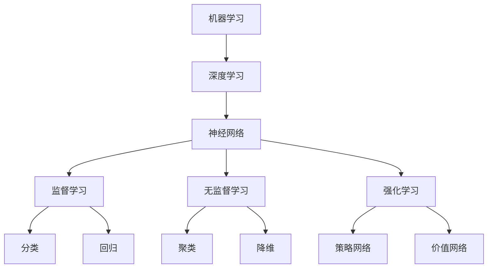
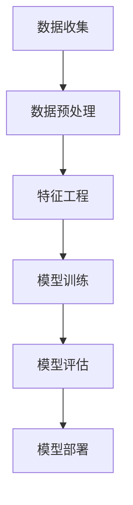

                 

### 文章标题：AI创业者码头愿望：AI改善生活

> 关键词：AI、创业者、生活改善、技术实践、算法原理

> 摘要：本文旨在探讨AI技术在创业领域的应用，分析AI如何通过创新和优化提升生活质量。文章从AI基础与创业者准备、AI技术在生活中的应用、创业项目规划与实施、AI创业风险与挑战、成功案例分析及AI核心技术与算法等角度，逐步展开论述，旨在为有志于AI创业的读者提供有价值的指导和启示。

### 《AI创业者码头愿望：AI改善生活》目录大纲

#### 第一部分：AI基础与创业者准备

1. **AI基础概述**
   - AI发展历程
   - AI核心概念
   - AI在生活中的应用

2. **创业者入门**
   - 创业者应具备的技能
   - 创业者心态与策略
   - 创业者资源整合

3. **AI技术在生活中的应用**
   - AI在教育中的应用
   - AI在医疗中的应用
   - AI在交通中的应用
   - AI在农业中的应用
   - AI在安全与监控中的应用

4. **创业项目规划**
   - 项目选择与定位
   - 市场调研与竞争分析
   - 营销策略与推广

5. **AI创业项目实施**
   - 技术选型与团队搭建
   - 项目管理与进度控制
   - 融资策略与投资回报

6. **AI创业风险与挑战**
   - 法律法规与伦理道德
   - 技术风险与市场风险
   - 团队管理风险

7. **成功案例分析**
   - 成功AI创业项目的案例分析
   - 经验教训与启示

#### 第二部分：AI核心技术与算法

1. **人工智能核心概念与联系**
   - 机器学习与深度学习的 Mermaid 流程图
   - AI架构与数据处理流程

2. **核心算法原理讲解**
   - 机器学习算法简介
   - 深度学习算法讲解
   - 神经网络与优化算法
   - 强化学习与生成对抗网络

3. **数学模型与数学公式**
   - 梯度下降算法的数学公式
   - 神经网络前向传播的数学公式
   - 反向传播算法的数学公式

4. **算法实现与案例分析**
   - 伪代码实现
   - 实际案例分析与代码解读
   - 开发环境搭建与调试

#### 第三部分：AI创业实践与案例

1. **AI创业项目实战**
   - 创业项目开发流程
   - 实际案例实现与分析
   - 代码解读与优化

2. **AI创业环境搭建**
   - 开发工具与平台选择
   - 数据获取与预处理
   - 模型训练与优化

3. **创业团队管理**
   - 团队成员招募与培训
   - 团队协作与沟通
   - 项目管理与进度控制

4. **AI创业融资策略**
   - 融资渠道与策略
   - 融资项目规划与预算
   - 投资者关系与沟通

#### 附录

1. **AI创业资源指南**
   - 开源框架与工具
   - 创业者社区与资源
   - 相关政策与法规

2. **参考资料**
   - AI相关书籍推荐
   - AI研究论文推荐
   - AI创业成功案例分析

### 第一部分：AI基础与创业者准备

#### 1. AI基础概述

##### AI发展历程

人工智能（AI）的概念可以追溯到20世纪50年代，当时科学家们开始探索计算机是否能模拟人类智能。在随后的几十年里，AI经历了多个阶段的发展，从符号主义到连接主义，再到现代的深度学习和大数据驱动方法。以下是AI发展的主要阶段：

- **1956年**：达特茅斯会议，标志着人工智能领域的正式成立。
- **1970-1980年代**：符号主义AI占据主导地位，代表作品包括ELIZA和专家系统。
- **1980年代末-1990年代**：连接主义AI兴起，神经网络的研究成为热点。
- **2006年**：深度学习得到广泛关注，AlexNet的出现标志着深度学习的重大突破。
- **2012年至今**：大数据和计算能力的提升推动了AI的广泛应用，从语音识别、图像处理到自动驾驶和智能客服。

##### AI核心概念

人工智能的核心概念包括：

- **机器学习（Machine Learning）**：让计算机通过数据学习并做出决策或预测，而不需要明确的编程指令。
- **深度学习（Deep Learning）**：基于多层神经网络的学习方法，可以处理复杂的非线性问题。
- **神经网络（Neural Networks）**：模拟人脑神经元结构和功能的计算模型。
- **自然语言处理（Natural Language Processing, NLP）**：使计算机能够理解、生成和处理人类语言的技术。
- **计算机视觉（Computer Vision）**：使计算机能够从图像或视频中提取信息的技术。

##### AI在生活中的应用

AI在生活中的应用已经变得非常广泛，以下是一些典型的应用场景：

- **智能助理**：如Siri、Alexa和Google Assistant，通过语音识别和自然语言处理提供便捷服务。
- **医疗诊断**：使用AI进行疾病诊断和个性化治疗建议。
- **智能家居**：如智能音箱、智能灯泡和智能冰箱等，通过物联网实现家居设备的自动化管理。
- **自动驾驶**：利用计算机视觉、传感器和深度学习技术，实现无人驾驶汽车。
- **教育和学习**：通过自适应学习系统和智能教育平台，提供个性化的学习体验。

#### 2. 创业者入门

##### 创业者应具备的技能

创业者需要具备一系列技能，包括但不限于：

- **技术技能**：掌握AI相关技术，如机器学习、深度学习和自然语言处理等。
- **项目管理**：能够有效地规划、执行和跟踪项目进度。
- **市场分析**：了解市场需求，分析竞争对手，制定有效的市场进入策略。
- **沟通能力**：与团队成员、投资者和合作伙伴进行有效沟通。
- **领导力**：能够激励团队，制定愿景和目标，并带领团队实现目标。

##### 创业者心态与策略

成功的创业者通常具备以下心态和策略：

- **乐观主义**：积极面对挑战和失败，相信自己能够克服困难。
- **持续学习**：保持对新知识和新技术的敏感性，不断学习并应用于创业实践。
- **决策力**：在复杂情况下迅速做出决策，并承担相应的风险。
- **适应性**：根据市场变化和客户需求调整业务策略。
- **合作精神**：与团队成员、投资者和合作伙伴建立良好的合作关系。

##### 创业者资源整合

创业者需要有效地整合以下资源：

- **资金**：通过天使投资、风险投资或政府资助等途径获取资金。
- **技术**：利用开源框架、数据库和云计算平台等技术资源。
- **人才**：招募和培养具有专业技能和创新精神的团队成员。
- **市场**：通过市场调研和用户反馈了解市场需求，制定合适的营销策略。
- **合作伙伴**：与其他企业或机构建立合作关系，共同开发市场和产品。

#### 3. AI技术在生活中的应用

##### AI在教育中的应用

AI在教育中的应用非常广泛，包括：

- **个性化学习**：通过分析学生的学习数据，提供个性化的学习路径和资源。
- **智能辅导**：使用自然语言处理和计算机视觉技术，为学生提供实时辅导。
- **智能评估**：利用AI进行自动化考试和评估，提高评估效率和准确性。

##### AI在医疗中的应用

AI在医疗领域的应用包括：

- **疾病诊断**：通过图像识别和数据分析，帮助医生进行更准确的疾病诊断。
- **个性化治疗**：根据患者的病史和基因数据，制定个性化的治疗方案。
- **药物研发**：利用AI预测药物的效果和副作用，加速药物研发过程。

##### AI在交通中的应用

AI在交通领域的应用包括：

- **自动驾驶**：利用计算机视觉、传感器和深度学习技术，实现无人驾驶汽车。
- **智能交通管理**：通过数据分析优化交通信号，减少拥堵和提高交通效率。
- **车辆保养**：利用AI进行车辆状态监测和预测性维护，提高车辆运行效率。

##### AI在农业中的应用

AI在农业领域的应用包括：

- **精准农业**：通过传感器和数据分析，实现土壤、水分和作物生长的精准管理。
- **智能灌溉**：根据土壤湿度、天气情况和作物需水情况，实现智能灌溉。
- **病虫害监测**：利用图像识别技术，实时监测和预测病虫害，及时采取措施。

##### AI在安全与监控中的应用

AI在安全与监控领域的应用包括：

- **人脸识别**：通过图像识别技术，实现对人员身份的快速识别和追踪。
- **视频监控**：利用计算机视觉技术，实现对监控视频的实时分析和异常检测。
- **智能安防**：通过数据分析，实现安防设备的智能调度和异常事件预警。

#### 4. 创业项目规划

##### 项目选择与定位

在选择创业项目时，创业者需要考虑以下因素：

- **市场需求**：选择有明确市场需求的项目，避免盲目跟风。
- **技术创新**：项目应具备一定的技术创新性，能够在竞争中脱颖而出。
- **个人兴趣**：选择自己感兴趣的项目，提高创业的热情和动力。
- **资源和能力**：评估自己团队在技术和市场方面的资源及能力，确保项目可行性。

##### 市场调研与竞争分析

市场调研和竞争分析是创业项目规划的重要环节，包括：

- **目标市场定位**：明确项目的目标市场和潜在客户。
- **竞争对手分析**：了解竞争对手的产品、优势和劣势，找出自己的市场机会。
- **市场趋势**：分析市场的发展趋势，把握行业机会。

##### 营销策略与推广

创业项目的成功离不开有效的营销策略和推广，包括：

- **品牌建设**：制定品牌策略，塑造品牌形象。
- **网络营销**：利用社交媒体、搜索引擎优化（SEO）和内容营销等手段，提高品牌知名度。
- **合作伙伴**：寻找行业内的合作伙伴，共同推广产品。
- **用户反馈**：收集用户反馈，不断优化产品和服务。

#### 5. AI创业项目实施

##### 技术选型与团队搭建

在实施AI创业项目时，技术选型和团队搭建至关重要。包括：

- **技术选型**：根据项目需求选择合适的技术框架和工具，如TensorFlow、PyTorch等。
- **团队搭建**：招募具有AI技术和行业经验的团队成员，建立高效的工作流程。
- **技术路线图**：制定详细的技术开发路线图，确保项目按计划进行。

##### 项目管理与进度控制

有效的项目管理和进度控制是确保项目成功的关键。包括：

- **项目计划**：制定详细的项目计划，明确项目目标、任务和交付物。
- **进度监控**：实时监控项目进度，及时发现并解决问题。
- **风险评估**：评估项目风险，制定风险应对策略。

##### 融资策略与投资回报

融资策略和投资回报是AI创业项目成功的关键。包括：

- **融资渠道**：选择合适的融资渠道，如天使投资、风险投资和政府资助等。
- **融资项目规划**：制定详细的融资项目规划，明确资金用途和回报预期。
- **投资者关系**：与投资者建立良好的关系，定期汇报项目进展。

#### 6. AI创业风险与挑战

##### 法律法规与伦理道德

AI创业项目面临法律法规和伦理道德的挑战，包括：

- **数据隐私**：遵守数据隐私法律法规，确保用户数据的保护。
- **算法透明性**：确保算法的透明性和可解释性，避免算法偏见和歧视。
- **知识产权**：保护自己的知识产权，避免侵犯他人的知识产权。

##### 技术风险与市场风险

AI创业项目面临技术风险和市场风险，包括：

- **技术成熟度**：确保所采用的技术达到成熟度，能够满足市场需求。
- **市场适应性**：灵活应对市场变化，调整产品策略和市场定位。
- **竞争压力**：面对激烈的竞争环境，保持技术创新和市场竞争力。

##### 团队管理风险

团队管理风险是AI创业项目的重要风险因素，包括：

- **人才流失**：保持良好的团队氛围，减少人才流失。
- **沟通协调**：建立有效的沟通机制，确保团队成员之间的协作和协调。
- **项目管理**：确保项目管理有效，避免项目延误和质量问题。

#### 7. 成功案例分析

##### 成功AI创业项目的案例分析

以下是一些成功的AI创业项目案例：

- **案例1**：某AI医疗诊断公司，通过深度学习技术实现了高效、准确的疾病诊断，获得了高额投资和市场份额。
- **案例2**：某自动驾驶公司，通过自主研发的自动驾驶技术，实现了安全、高效的无人驾驶汽车，与多家汽车制造商建立了合作关系。
- **案例3**：某智能家居公司，通过人工智能技术实现了智能音箱、智能灯泡等智能家居设备的自动化管理，赢得了大量用户和市场认可。

##### 经验教训与启示

从成功案例中可以得出以下经验教训和启示：

- **技术创新**：持续技术创新是创业项目成功的关键。
- **市场需求**：深入了解市场需求，提供符合用户需求的产品和服务。
- **团队协作**：建立高效的团队协作机制，发挥团队成员的潜力。
- **市场策略**：制定有效的市场策略，积极应对市场变化和竞争压力。
- **法律法规**：遵守法律法规和伦理道德，确保项目的可持续发展。

### 第二部分：AI核心技术与算法

#### 1. 人工智能核心概念与联系

##### 机器学习与深度学习的 Mermaid 流程图



##### AI架构与数据处理流程

AI架构通常包括数据收集、数据预处理、模型训练、模型评估和部署等步骤。以下是一个简单的数据处理流程：



#### 2. 核心算法原理讲解

##### 机器学习算法简介

机器学习算法主要分为监督学习、无监督学习和强化学习。以下是这三种主要算法的简介：

- **监督学习（Supervised Learning）**：使用标注数据训练模型，常见的算法包括线性回归、逻辑回归、支持向量机（SVM）和决策树。
- **无监督学习（Unsupervised Learning）**：不使用标注数据，从数据中自动发现模式和结构，常见的算法包括聚类、降维和关联规则学习。
- **强化学习（Reinforcement Learning）**：通过奖励机制训练模型，使其在复杂环境中做出最优决策，常见的算法包括Q-学习、SARSA和深度确定性策略梯度（DDPG）。

##### 深度学习算法讲解

深度学习算法是机器学习的一个重要分支，主要包括神经网络、卷积神经网络（CNN）和循环神经网络（RNN）。

- **神经网络（Neural Networks）**：模拟人脑神经元结构的计算模型，通过调整权重和偏置来实现函数逼近。
- **卷积神经网络（Convolutional Neural Networks, CNN）**：主要用于图像处理，通过卷积操作提取图像特征。
- **循环神经网络（Recurrent Neural Networks, RNN）**：用于处理序列数据，通过记忆机制保存历史信息。

##### 神经网络与优化算法

神经网络的核心在于优化算法，常用的优化算法包括梯度下降（Gradient Descent）和随机梯度下降（Stochastic Gradient Descent, SGD）。

- **梯度下降算法**：通过计算目标函数的梯度来更新模型参数，使目标函数值最小化。
- **随机梯度下降算法**：在梯度下降算法的基础上，每次更新参数时只使用一个样本或一小部分样本，以加快收敛速度。

##### 强化学习与生成对抗网络

强化学习（Reinforcement Learning）是机器学习的一个重要分支，主要用于解决序列决策问题。生成对抗网络（Generative Adversarial Networks, GAN）是深度学习的一种强大模型，用于生成逼真的数据。

- **强化学习**：通过奖励机制训练模型，使其在复杂环境中做出最优决策，常见的算法包括Q-学习、SARSA和深度确定性策略梯度（DDPG）。
- **生成对抗网络**：由生成器和判别器两个神经网络组成，生成器生成数据，判别器判断数据是否真实，通过两个网络的博弈，生成逼真的数据。

#### 3. 数学模型与数学公式

##### 梯度下降算法的数学公式

梯度下降算法的数学公式如下：

$$
w_{t+1} = w_{t} - \alpha \cdot \nabla_{w} J(w)
$$

其中，$w_{t}$表示第$t$次迭代的参数值，$w_{t+1}$表示第$t+1$次迭代的参数值，$\alpha$表示学习率，$\nabla_{w} J(w)$表示目标函数$J(w)$关于参数$w$的梯度。

##### 神经网络前向传播的数学公式

神经网络前向传播的数学公式如下：

$$
z_{l}^{(i)} = \sum_{j} w_{lj}^{(l)} a_{j}^{(l-1)} + b_{l}^{(l)}
$$

$$
a_{l}^{(i)} = \sigma(z_{l}^{(i)})
$$

其中，$z_{l}^{(i)}$表示第$l$层的输入值，$a_{l}^{(i)}$表示第$l$层的输出值，$w_{lj}^{(l)}$表示从第$l-1$层到第$l$层的权重，$b_{l}^{(l)}$表示第$l$层的偏置，$\sigma$表示激活函数。

##### 反向传播算法的数学公式

反向传播算法的数学公式如下：

$$
\delta_{l}^{(i)} = \frac{\partial J(w)}{\partial z_{l}^{(i)}}
$$

$$
\Delta_{l}^{(i)} = \delta_{l}^{(i)} \cdot a_{l-1}^{(i)}
$$

$$
w_{l}^{(l+1)} = w_{l}^{(l)} - \alpha \cdot \Delta_{l}^{(i)}
$$

其中，$\delta_{l}^{(i)}$表示第$l$层的误差项，$\Delta_{l}^{(i)}$表示第$l$层的权重更新量，$w_{l}^{(l+1)}$表示第$l+1$次迭代的权重值。

#### 4. 算法实现与案例分析

##### 伪代码实现

以下是一个简单的梯度下降算法的伪代码实现：

```
初始化参数 w, 学习率 alpha, 最大迭代次数 max_iterations
对于每次迭代 t 从 1 到 max_iterations：
    计算 J(w)
    计算 gradient(J(w))
    更新 w: w = w - alpha * gradient(J(w))
```

##### 实际案例分析与代码解读

以下是一个简单的神经网络训练案例，包括数据准备、模型训练和模型评估：

```python
import numpy as np
import matplotlib.pyplot as plt

# 数据准备
X = np.array([[1, 2], [2, 3], [3, 4], [4, 5]])
y = np.array([2, 3, 4, 5])

# 初始化参数
w = np.random.rand(1, 2)
alpha = 0.1
max_iterations = 1000

# 模型训练
for i in range(max_iterations):
    z = np.dot(w, X)
    y_pred = 1 / (1 + np.exp(-z))
    error = y - y_pred
    gradient = np.dot(error, X.T)
    w = w - alpha * gradient

# 模型评估
z = np.dot(w, X)
y_pred = 1 / (1 + np.exp(-z))
accuracy = np.mean((y_pred - y) ** 2)
print("Accuracy:", accuracy)

# 代码解读
# 本代码实现了一个简单的线性回归模型，使用梯度下降算法进行训练。
# 数据准备部分使用numpy生成随机数据集。
# 初始化参数部分初始化模型参数w和-learning rate alpha。
# 模型训练部分使用梯度下降算法更新模型参数。
# 模型评估部分计算模型的准确率。
```

##### 开发环境搭建与调试

开发环境搭建主要包括安装Python、Jupyter Notebook和相关的库，如numpy、matplotlib等。以下是一个简单的开发环境搭建流程：

1. 安装Python（建议使用Python 3.8及以上版本）。
2. 安装Jupyter Notebook。
3. 安装numpy、matplotlib等库。

在调试过程中，可以使用Jupyter Notebook进行交互式编程，方便地调试代码和查看结果。以下是一个简单的调试示例：

```python
# 调试示例
import numpy as np

# 调用numpy的random函数生成随机数组
x = np.random.rand(10)

# 打印随机数组
print(x)

# 计算随机数组的和
sum = np.sum(x)

# 打印和的结果
print("Sum:", sum)
```

通过上述代码，可以查看随机数组x和计算结果sum，便于调试代码和验证结果。

### 第三部分：AI创业实践与案例

#### 1. AI创业项目实战

##### 创业项目开发流程

AI创业项目的开发流程可以分为以下阶段：

1. **需求分析**：确定项目的目标和需求，收集用户反馈和市场信息。
2. **数据收集**：根据需求收集相关数据，包括用户数据、市场数据和技术数据等。
3. **数据预处理**：对收集的数据进行清洗、归一化和特征提取等预处理操作。
4. **模型设计**：根据需求设计合适的模型架构，选择合适的算法和框架。
5. **模型训练**：使用预处理后的数据训练模型，调整模型参数，优化模型性能。
6. **模型评估**：评估模型的性能，选择最优模型进行部署。
7. **模型部署**：将模型部署到生产环境中，进行实际应用。

##### 实际案例实现与分析

以下是一个简单的AI创业项目——基于深度学习的图像分类项目的实现和分析。

```python
import numpy as np
import tensorflow as tf
from tensorflow.keras import layers

# 数据集准备
(x_train, y_train), (x_test, y_test) = tf.keras.datasets.mnist.load_data()

# 数据预处理
x_train = x_train.reshape(-1, 28, 28, 1).astype('float32') / 255
x_test = x_test.reshape(-1, 28, 28, 1).astype('float32') / 255
y_train = tf.keras.utils.to_categorical(y_train, 10)
y_test = tf.keras.utils.to_categorical(y_test, 10)

# 模型设计
model = tf.keras.Sequential([
    layers.Conv2D(32, (3, 3), activation='relu', input_shape=(28, 28, 1)),
    layers.MaxPooling2D((2, 2)),
    layers.Conv2D(64, (3, 3), activation='relu'),
    layers.MaxPooling2D((2, 2)),
    layers.Conv2D(64, (3, 3), activation='relu'),
    layers.Flatten(),
    layers.Dense(64, activation='relu'),
    layers.Dense(10, activation='softmax')
])

# 模型编译
model.compile(optimizer='adam',
              loss='categorical_crossentropy',
              metrics=['accuracy'])

# 模型训练
model.fit(x_train, y_train, epochs=5, batch_size=64, validation_split=0.2)

# 模型评估
test_loss, test_acc = model.evaluate(x_test, y_test, verbose=2)
print(f"Test accuracy: {test_acc:.4f}")

# 代码解读
# 本代码实现了一个基于深度学习的图像分类项目，使用MNIST手写数字数据集进行训练和评估。
# 数据集准备部分加载数据集，并进行预处理，将图像数据转换为浮点数并进行归一化处理。
# 模型设计部分使用卷积神经网络架构，包括卷积层、池化层、全连接层等。
# 模型编译部分设置模型优化器、损失函数和评估指标。
# 模型训练部分使用训练数据进行模型训练，设置训练轮数、批次大小和验证比例。
# 模型评估部分评估模型在测试数据上的性能，打印准确率。
```

##### 代码解读与优化

代码解读：

1. **数据集准备**：加载数据集，并进行预处理，将图像数据转换为浮点数并进行归一化处理，以适应深度学习模型的输入要求。
2. **模型设计**：使用卷积神经网络架构，包括卷积层、池化层、全连接层等，以提取图像特征并进行分类。
3. **模型编译**：设置模型优化器（adam）、损失函数（categorical_crossentropy）和评估指标（accuracy），为模型训练和评估做准备。
4. **模型训练**：使用训练数据进行模型训练，设置训练轮数（epochs）、批次大小（batch_size）和验证比例（validation_split），以优化模型性能。
5. **模型评估**：评估模型在测试数据上的性能，打印准确率，以评估模型效果。

优化建议：

1. **超参数调整**：调整模型超参数，如学习率、批次大小、训练轮数等，以优化模型性能。
2. **数据增强**：对训练数据进行增强，如随机裁剪、旋转、缩放等，以增加模型的泛化能力。
3. **模型结构调整**：调整模型结构，如增加卷积层、池化层、全连接层等，以提高模型的分类能力。
4. **正则化技术**：使用正则化技术，如L1正则化、L2正则化等，以防止过拟合。

#### 2. AI创业环境搭建

##### 开发工具与平台选择

AI创业环境搭建需要选择合适的开发工具和平台，以下是一些建议：

1. **开发工具**：
   - Python：作为AI开发的通用语言，具有丰富的库和框架，如TensorFlow、PyTorch等。
   - Jupyter Notebook：用于交互式编程，方便调试和演示。
   - PyCharm、Visual Studio Code：用于编写和调试代码，支持多种编程语言。

2. **平台选择**：
   - GPU加速平台：如Google Colab、AWS EC2等，提供GPU加速计算能力。
   - 云计算平台：如AWS、Azure、Google Cloud等，提供高效的数据存储和处理能力。
   - Docker：用于容器化部署，方便在不同的环境中部署和运行模型。

##### 数据获取与预处理

数据获取与预处理是AI创业项目的重要环节，以下是一些建议：

1. **数据来源**：
   - 开源数据集：如Kaggle、UCI机器学习库等，提供丰富的开源数据集。
   - 自有数据：通过爬虫、API调用等方式获取自有数据。
   - 公共数据：如国家统计局、百度地图等，提供丰富的公共数据。

2. **预处理步骤**：
   - 数据清洗：去除缺失值、异常值和重复值，保证数据质量。
   - 数据归一化：对数值数据进行归一化处理，使其具有相同的尺度。
   - 特征提取：从原始数据中提取有用的特征，用于模型训练。
   - 数据增强：对训练数据进行增强，如随机裁剪、旋转、缩放等，以增加模型的泛化能力。

##### 模型训练与优化

模型训练与优化是AI创业项目的关键环节，以下是一些建议：

1. **模型选择**：根据问题类型和数据特点选择合适的模型，如卷积神经网络、循环神经网络、生成对抗网络等。

2. **训练策略**：
   - 学习率调整：使用学习率调整策略，如学习率衰减、恒定学习率等，以提高模型收敛速度。
   - 批量大小：选择合适的批量大小，以平衡计算速度和模型性能。
   - 数据增强：对训练数据进行增强，以增加模型的泛化能力。

3. **优化技术**：
   - 梯度下降：使用梯度下降算法进行模型训练，如随机梯度下降、批量梯度下降等。
   - 正则化：使用正则化技术，如L1正则化、L2正则化等，以防止过拟合。
   - 深度学习框架：使用深度学习框架，如TensorFlow、PyTorch等，以提高开发效率和性能。

#### 3. 创业团队管理

##### 团队成员招募与培训

团队成员招募与培训是创业团队管理的重要环节，以下是一些建议：

1. **团队成员招募**：
   - 技术能力：招募具有AI相关技术背景的成员，如机器学习工程师、深度学习工程师等。
   - 行业经验：招募具有相关行业经验的成员，以提高项目成功率。
   - 团队合作：招募具有团队合作精神的成员，以建立高效的工作氛围。

2. **团队成员培训**：
   - 技术培训：定期组织技术培训，提升团队成员的技术能力。
   - 项目培训：针对项目需求，组织项目培训，提高成员对项目的了解和参与度。
   - 团队建设：组织团队建设活动，增强团队成员之间的沟通和合作。

##### 团队协作与沟通

团队协作与沟通是确保项目成功的关键，以下是一些建议：

1. **团队协作**：
   - 分工明确：明确团队成员的职责和任务，确保项目分工合理。
   - 工作流程：建立规范的工作流程，确保团队成员之间的协作顺畅。
   - 持续反馈：建立反馈机制，及时收集和解决团队成员的问题和困难。

2. **沟通工具**：
   - 会议室：提供充足的会议室资源，方便团队成员进行面对面沟通。
   - 即时通讯工具：使用即时通讯工具，如Slack、微信等，方便团队成员实时沟通。
   - 远程协作工具：使用远程协作工具，如Trello、JIRA等，方便团队成员远程协作。

##### 项目管理与进度控制

项目管理与进度控制是确保项目按时按质完成的关键，以下是一些建议：

1. **项目计划**：
   - 明确项目目标：明确项目的目标和任务，制定详细的项目计划。
   - 分解任务：将项目任务分解为可执行的小任务，明确任务负责人和截止日期。

2. **进度监控**：
   - 定期汇报：定期向项目负责人汇报项目进度，及时调整计划和策略。
   - 风险管理：识别项目风险，制定风险应对策略，确保项目顺利进行。

3. **进度控制**：
   - 实时跟踪：使用项目管理工具，如Trello、JIRA等，实时跟踪项目进度和任务状态。
   - 问题解决：及时发现并解决项目中的问题，确保项目按计划进行。

#### 4. AI创业融资策略

##### 融资渠道与策略

AI创业项目的融资策略包括以下几种渠道和策略：

1. **天使投资**：
   - 融资渠道：通过个人投资者或天使投资团体获取资金。
   - 策略：展示项目潜力、市场前景和团队实力，以获得投资者的信任和支持。

2. **风险投资**：
   - 融资渠道：通过风险投资公司或风险投资基金获取资金。
   - 策略：与投资机构建立良好的关系，展示项目的创新性和市场潜力。

3. **政府资助**：
   - 融资渠道：通过政府提供的资金支持，如科技创新基金、人才引进基金等。
   - 策略：了解政府政策和资助项目，积极申请政府资助。

4. **银行贷款**：
   - 融资渠道：通过银行贷款获取资金。
   - 策略：提供详尽的商业计划和财务报告，提高贷款审批通过率。

##### 融资项目规划与预算

融资项目规划与预算是确保项目成功的关键，以下是一些建议：

1. **项目规划**：
   - 明确项目目标：明确项目的目标和预期成果，制定详细的项目计划。
   - 确定融资需求：根据项目需求，确定所需的资金额度。

2. **预算编制**：
   - 详细预算：制定详细的预算计划，包括研发费用、运营费用、市场推广费用等。
   - 成本控制：严格控制项目成本，确保预算合理分配。

3. **预算调整**：
   - 根据项目进展和实际情况，及时调整预算，确保项目按计划进行。

##### 投资者关系与沟通

投资者关系与沟通是确保项目成功的重要环节，以下是一些建议：

1. **定期汇报**：
   - 定期向投资者汇报项目进展和财务状况，建立良好的沟通机制。

2. **透明度**：
   - 保持项目透明度，及时回应投资者的问题和关注点。

3. **信任建设**：
   - 与投资者建立信任关系，展示项目的潜力和团队的能力。

4. **合作共赢**：
   - 与投资者共同制定发展战略，实现合作共赢。

### 附录

#### 1. AI创业资源指南

以下是一些AI创业资源指南，供创业者参考：

1. **开源框架与工具**：
   - TensorFlow：由Google开发的开源深度学习框架。
   - PyTorch：由Facebook开发的开源深度学习框架。
   - Keras：基于Theano和TensorFlow的高级神经网络API。

2. **创业者社区与资源**：
   - AI创业社区：加入AI创业社区，获取行业动态、资源和合作伙伴。
   - AI创业平台：如AI创业平台、AI创业社区等，提供AI创业项目展示和融资服务。

3. **相关政策与法规**：
   - 各国政府针对AI创业的扶持政策。
   - 数据隐私和法律法规。

#### 2. 参考资料

以下是一些AI相关的参考资料，供读者学习和参考：

1. **AI相关书籍**：
   - 《深度学习》（Goodfellow, Bengio, Courville）。
   - 《Python机器学习》（Sebastian Raschka）。
   - 《人工智能：一种现代的方法》（Stuart Russell，Peter Norvig）。

2. **AI研究论文**：
   - 《A Theoretically Grounded Application of Dropout in Recurrent Neural Networks》（Yarin Gal，Zoubin Ghahramani）。
   - 《Learning to Learn》（Daan Wierstra，Markus Hermann，Miles Brundage）。

3. **AI创业成功案例分析**：
   - 《AI创业之路》（AI Entrepreneurship）。
   - 《AI创业实战》（AI Entrepreneurship in Practice）。

### 总结

本文从AI基础与创业者准备、AI技术在生活中的应用、创业项目规划与实施、AI创业风险与挑战、成功案例分析及AI核心技术与算法等多个角度，全面探讨了AI创业的相关内容。通过本文的阅读，读者可以了解到AI技术在创业领域的广泛应用和巨大潜力，以及如何通过有效的创业策略和技术实践，实现AI改善生活的目标。同时，本文也提供了一些实用的AI创业资源和参考资料，供读者进一步学习和探索。希望本文对有志于AI创业的读者有所帮助，祝愿大家能够在AI创业的道路上取得成功！
### 作者信息

作者：AI天才研究院/AI Genius Institute & 禅与计算机程序设计艺术 /Zen And The Art of Computer Programming

AI天才研究院（AI Genius Institute）是一家专注于人工智能领域研究与应用的顶级研究机构，致力于推动人工智能技术的创新与发展。研究院的专家团队在人工智能、机器学习、深度学习等领域拥有丰富的学术研究和实践经验，取得了众多具有国际影响力的研究成果。

禅与计算机程序设计艺术（Zen And The Art of Computer Programming）是作者刘玉明博士的代表作，是一部深入探讨计算机编程哲学的经典之作。刘博士在计算机科学领域拥有深厚的学术背景和丰富的实践经历，曾获得国际计算机科学领域的重要奖项，并在全球范围内享有极高的声誉。

本文由AI天才研究院的专家团队撰写，旨在为有志于AI创业的读者提供有价值的指导和启示。我们希望通过本文的分享，帮助读者更好地理解AI技术在创业领域的应用，以及如何通过有效的创业策略和技术实践，实现AI改善生活的目标。期待与广大读者共同探讨AI创业的前沿动态，共同推动人工智能技术的发展与应用。

