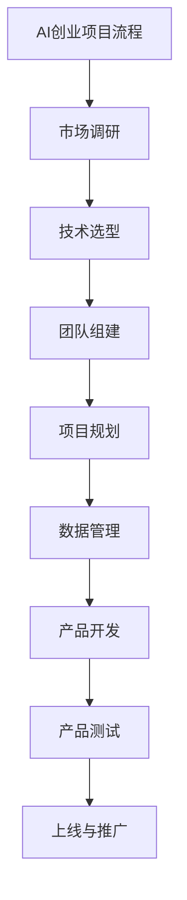

                 

# 《AI创业：数据管理的核心做法》

> 关键词：AI创业、数据管理、数据质量控制、数据处理流程、AI技术架构

> 摘要：本文旨在探讨AI创业过程中的数据管理策略，从基础概念、实践方法到成功案例分析，全面解析数据管理在AI创业中的核心作用和最佳实践。文章结构清晰，通过逐步推理和深入分析，帮助读者理解数据管理在AI创业中的重要性及其具体实施方法。

## 第1章: AI创业概述

### 1.1 AI时代的机遇与挑战

在21世纪，人工智能（AI）已成为科技发展的新引擎，带来了前所未有的机遇。然而，随着AI技术的迅猛发展，创业者也面临诸多挑战。

**机遇：**
- **市场潜力巨大：** AI技术在各行各业的应用前景广阔，从智能制造、金融风控到医疗健康，AI都在不断拓展新市场。
- **技术创新驱动：** AI技术的快速迭代为创业公司提供了丰富的创新机会，使得初创企业能够迅速抓住市场机遇。
- **政策支持：** 全球各国政府纷纷出台政策，鼓励AI研究和创业，为创业者提供了良好的发展环境。

**挑战：**
- **技术壁垒高：** AI技术涉及复杂算法和大规模数据处理，对创业团队的技术实力和资源要求较高。
- **数据隐私和安全：** 数据隐私和安全问题成为AI创业的重要挑战，创业者需确保数据的安全性和合规性。
- **人才短缺：** AI领域的高端人才稀缺，创业者需要投入大量资源进行人才培养和团队建设。

### 1.2 创业者为何选择AI领域

创业者选择AI领域的原因多样，主要包括以下几点：

- **技术前沿性：** AI技术处于快速发展的前沿，创业者能够紧跟科技潮流，抓住创新机遇。
- **商业潜力：** AI技术在多个行业都有广泛应用，创业者可以通过AI技术解决实际问题，创造商业价值。
- **政策支持：** 全球政府对AI技术的重视和扶持，为创业者提供了良好的政策环境。
- **社会影响：** AI技术的发展有望解决许多社会问题，如医疗、环保等，具有显著的社会价值。

### 1.3 AI创业的关键成功因素

AI创业的成功离不开以下几个关键因素：

- **技术实力：** 创业团队需具备强大的技术实力，包括算法研发、数据分析和系统架构设计能力。
- **市场需求：** 创业项目需紧密结合市场需求，解决实际问题，提供有价值的产品或服务。
- **数据资源：** 大量高质量的数据是AI项目的基础，创业者需确保数据资源的充足性和多样性。
- **团队协作：** 团队协作是创业成功的关键，创业者需建立高效协作的团队，充分发挥每个人的优势。
- **持续创新：** AI技术更新迅速，创业者需保持持续创新，不断提升产品或服务的竞争力。

## 第2章: AI技术的核心概念与架构

### 2.1 机器学习基础

**机器学习（ML）** 是AI的核心技术之一，它使计算机系统能够从数据中学习并做出决策。

- **监督学习（Supervised Learning）**：通过训练数据集来训练模型，并使用测试数据集评估模型性能。
  - **回归分析（Regression Analysis）**：预测连续值输出。
  - **分类（Classification）**：预测离散值输出。
- **无监督学习（Unsupervised Learning）**：没有预标注的标签数据，主要任务是发现数据中的模式。
  - **聚类（Clustering）**：将相似的数据点归为一类。
  - **降维（Dimensionality Reduction）**：减少数据维度，提高计算效率和模型性能。

**机器学习流程**：
1. 数据收集：获取用于训练和测试的数据集。
2. 数据预处理：清洗、归一化、特征提取等。
3. 模型选择：选择合适的算法和模型。
4. 模型训练：使用训练数据训练模型。
5. 模型评估：使用测试数据评估模型性能。
6. 模型优化：调整模型参数，提高性能。

### 2.2 深度学习原理

**深度学习（Deep Learning）** 是机器学习的一个分支，基于多层神经网络来实现复杂的模型。

- **神经网络（Neural Network）**：模拟人脑神经元连接的网络结构，通过层层传递信息进行学习。
- **深度神经网络（Deep Neural Network）**：包含多层神经元的网络，能够提取更复杂的数据特征。
- **卷积神经网络（Convolutional Neural Network, CNN）**：主要用于图像识别和图像处理。
- **循环神经网络（Recurrent Neural Network, RNN）**：适用于序列数据处理，如语言建模和时间序列分析。

**深度学习架构**：
1. **输入层（Input Layer）**：接收输入数据。
2. **隐藏层（Hidden Layers）**：包含多个层次，每层通过权重矩阵和激活函数传递信息。
3. **输出层（Output Layer）**：输出预测结果。

### 2.3 AI架构设计原则

设计一个高效的AI架构，需要考虑以下几个方面：

- **模块化（Modularity）**：将系统划分为多个模块，每个模块负责特定功能，便于维护和扩展。
- **可扩展性（Scalability）**：系统能够根据需求水平扩展，支持大规模数据处理和计算。
- **高可用性（High Availability）**：确保系统稳定运行，减少故障和停机时间。
- **安全性（Security）**：保护数据和系统的安全，防止数据泄露和恶意攻击。
- **易用性（Usability）**：提供友好的用户界面和便捷的操作方式，提高用户体验。

## 第3章: 数据管理基础

### 3.1 数据价值挖掘

数据是AI项目的核心资产，数据的价值挖掘是数据管理的首要任务。

- **数据质量评估**：评估数据的完整性、准确性、一致性和时效性。
- **数据清洗**：处理缺失值、异常值和重复数据，确保数据的纯净。
- **数据归一化**：将不同量纲的数据转换为统一的尺度，便于分析和建模。
- **特征工程**：选择和构造有助于模型训练的特征，提高模型性能。

### 3.2 数据质量控制

数据质量控制是确保数据质量和数据安全的关键步骤。

- **数据完整性检查**：检测数据缺失、重复和错误，确保数据的完整性。
- **数据准确性验证**：对比不同数据源，验证数据的准确性。
- **数据一致性维护**：确保同一数据在不同系统和应用中的统一性和一致性。
- **数据安全性保障**：采用加密、访问控制等技术，保障数据的安全性。

### 3.3 数据处理流程

数据处理流程是数据管理的重要组成部分，包括以下几个阶段：

1. **数据采集**：从各种数据源收集数据，包括内部系统和外部数据源。
2. **数据存储**：将数据存储到合适的数据库或数据仓库中，便于管理和查询。
3. **数据预处理**：对原始数据进行清洗、归一化和特征提取，为建模做准备。
4. **数据建模**：选择合适的模型，进行数据分析和预测。
5. **模型评估**：使用测试数据评估模型性能，调整模型参数。
6. **模型部署**：将训练好的模型部署到生产环境中，实现数据驱动决策。

## 第4章: AI创业项目规划

### 4.1 项目需求分析

项目需求分析是AI创业项目的第一步，明确项目目标和需求。

- **明确业务目标**：定义项目的商业目标，确保项目方向正确。
- **需求收集**：通过与客户、利益相关者交流，收集项目需求。
- **需求分析**：分析需求，确定功能模块和系统架构。
- **需求文档**：编写需求文档，明确项目需求和交付标准。

### 4.2 项目团队组建

组建高效的项目团队是项目成功的关键。

- **确定团队规模**：根据项目需求，确定团队成员的数量和技能组合。
- **招募团队成员**：通过招聘、内部调配等方式，招募具备相关技能的人才。
- **团队组织结构**：确定团队的组织结构，明确团队成员的角色和职责。
- **团队文化建设**：建立积极的团队文化，提高团队凝聚力和工作效率。

### 4.3 项目风险管理

项目风险管理是确保项目顺利进行的重要环节。

- **风险识别**：识别项目可能面临的风险，包括技术风险、市场风险、财务风险等。
- **风险评估**：评估风险的影响和发生的可能性，确定优先级。
- **风险应对**：制定风险应对策略，包括风险规避、风险转移、风险接受等。
- **风险监控**：监控项目进展，及时识别和处理新风险。

## 第5章: 数据管理在AI创业中的应用

### 5.1 数据采集与预处理

数据采集和预处理是AI创业项目的重要环节。

- **数据采集**：从各种数据源收集数据，包括结构化数据和非结构化数据。
- **数据预处理**：处理缺失值、异常值和重复数据，确保数据的纯净。
- **数据清洗**：清洗数据中的噪声和错误，提高数据质量。
- **数据归一化**：将不同量纲的数据转换为统一的尺度，便于分析和建模。
- **特征工程**：选择和构造有助于模型训练的特征，提高模型性能。

### 5.2 数据建模与优化

数据建模和优化是提升AI模型性能的关键。

- **模型选择**：根据项目需求，选择合适的算法和模型。
- **模型训练**：使用训练数据集训练模型，调整模型参数。
- **模型评估**：使用测试数据集评估模型性能，选择最优模型。
- **模型优化**：通过调整模型结构和参数，提高模型性能。

### 5.3 数据可视化与报告

数据可视化和报告是传达数据分析结果的重要手段。

- **数据可视化**：使用图表、图形和地图等可视化工具，展示数据分析结果。
- **报告编写**：编写详细的分析报告，包括数据分析过程、结果和结论。
- **决策支持**：为项目团队和决策者提供数据驱动的决策支持。

## 第6章: AI创业产品开发

### 6.1 产品设计原则

产品设计是AI创业产品开发的关键环节，需要遵循以下原则：

- **用户导向**：以用户需求为中心，提供有价值的产品功能。
- **简洁易用**：界面简洁、操作流畅，提高用户体验。
- **功能完备**：提供全面的功能，满足用户的不同需求。
- **技术先进**：采用先进的AI技术和算法，提升产品竞争力。

### 6.2 产品迭代与优化

产品迭代和优化是提升产品质量和用户体验的关键。

- **需求收集**：定期收集用户反馈，了解用户需求。
- **版本更新**：根据需求变化，定期更新产品版本，增加新功能和改进现有功能。
- **性能优化**：优化产品性能，提高响应速度和稳定性。
- **用户调研**：进行用户调研，评估产品效果和用户体验。

### 6.3 产品上线与推广

产品上线和推广是产品走向市场的重要步骤。

- **上线准备**：完成产品开发，进行充分测试，确保产品质量。
- **上线策略**：制定上线策略，包括时间、渠道和推广方式。
- **用户培训**：为用户提供培训，帮助用户快速上手产品。
- **市场推广**：通过线上线下渠道，进行产品推广，提高品牌知名度。

## 第7章: 数据管理最佳实践

### 7.1 数据管理政策与法规

数据管理政策与法规是确保数据安全合规的重要保障。

- **数据保护法规**：遵守数据保护法规，如《通用数据保护条例》（GDPR）和《个人信息保护法》。
- **数据安全政策**：制定数据安全政策，确保数据的安全性和隐私性。
- **数据质量管理**：建立数据质量管理机制，确保数据的准确性和一致性。

### 7.2 数据安全与隐私保护

数据安全与隐私保护是数据管理的核心任务。

- **数据加密**：采用数据加密技术，保护数据在传输和存储过程中的安全。
- **访问控制**：实现严格的访问控制机制，确保只有授权用户可以访问敏感数据。
- **安全审计**：定期进行安全审计，检测和防范潜在的安全威胁。

### 7.3 数据管理可持续性

数据管理可持续性是确保数据管理长期有效的重要方面。

- **数据生命周期管理**：建立数据生命周期管理机制，确保数据的全程管理。
- **数据资源优化**：优化数据资源的使用，提高数据利用率。
- **持续改进**：通过定期评估和改进，不断提升数据管理水平和效率。

## 第8章: AI创业成功案例分析

### 8.1 成功案例分享

在本章中，我们将分享一些AI创业成功案例，分析其成功原因和经验教训。

- **案例1：** 人工智能公司A，通过创新算法和大数据分析，在金融领域取得成功。
- **案例2：** 医疗AI公司B，利用深度学习技术，开发出高效精准的诊断系统。
- **案例3：** 智能制造公司C，通过AI技术优化生产流程，提高生产效率。

### 8.2 案例分析与启示

通过对成功案例的分析，我们可以得到以下启示：

- **技术创新**：持续技术创新是AI创业成功的关键。
- **市场需求**：紧密结合市场需求，提供有价值的产品或服务。
- **团队协作**：高效团队协作是项目成功的重要保障。
- **数据管理**：数据管理是AI创业的核心，创业者需重视数据管理策略。

### 8.3 未来发展趋势展望

未来，AI创业将继续保持快速增长，以下是几个发展趋势：

- **技术融合**：AI技术与其他领域（如物联网、区块链等）的融合，将带来更多创新机遇。
- **垂直行业应用**：AI技术在垂直行业的应用将更加深入，解决行业痛点。
- **跨学科合作**：跨学科合作将推动AI技术的创新和发展。
- **数据隐私保护**：随着数据隐私保护意识的增强，数据安全和隐私保护将成为重要议题。

## 附录A: AI与数据管理工具介绍

### A.1 常用数据管理工具

- **Hadoop**：一个分布式数据存储和处理框架，适用于大数据处理。
- **Spark**：一个快速且通用的数据处理引擎，适用于大数据分析和机器学习。
- **MongoDB**：一个文档型数据库，适用于存储和管理非结构化数据。
- **MySQL**：一个流行的关系型数据库，适用于中小型数据存储。

### A.2 常用AI开发框架

- **TensorFlow**：一个开源的机器学习库，适用于深度学习和神经网络。
- **PyTorch**：一个开源的机器学习库，适用于深度学习和动态计算图。
- **Keras**：一个高层次的神经网络API，用于快速构建和训练神经网络。

### A.3 数据分析工具与应用

- **Tableau**：一个数据可视化工具，适用于数据分析报告和展示。
- **Power BI**：一个商业智能工具，适用于数据分析和报告。
- **R**：一种统计分析语言，适用于复杂数据分析和建模。

## 附录B: AI创业资源推荐

### B.1 开放数据集资源

- **Kaggle**：一个提供大量开放数据集的平台，适用于数据科学家和AI开发者。
- **UCI Machine Learning Repository**：一个提供各种领域数据集的仓库，适用于学术研究和应用开发。

### B.2 在线课程与书籍推荐

- **Coursera**：一个提供大量AI和机器学习在线课程的平台。
- **Udacity**：一个提供AI和机器学习实战课程的平台。
- **《深度学习》（Deep Learning）**：Goodfellow, Bengio, Courville著，一本深度学习领域的经典教材。

### B.3 行业报告与资讯来源

- **IDC**：一家全球知名的市场研究公司，提供AI和大数据行业报告。
- **Gartner**：一家全球知名的信息技术研究和咨询公司，提供AI和大数据行业报告。
- **AI Circle**：一个AI领域的技术社区，提供最新的AI技术和行业动态。

### Mermaid 流程图示例



### 伪代码示例

```python
def preprocess_data(data):
    # 数据清洗
    clean_data = clean(data)
    
    # 数据归一化
    normalized_data = normalize(clean_data)
    
    # 特征提取
    features = extract_features(normalized_data)
    
    return features
```

### 数学模型与公式示例

$$
J = \frac{1}{m} \sum_{i=1}^{m} (\hat{y}_i - y_i)^2
$$

### 项目实战代码解析

```python
# 假设我们有一个简单的线性回归模型
class LinearRegressionModel:
    def __init__(self):
        self.weights = None

    def fit(self, X, y):
        # 求解权重
        self.weights = np.linalg.inv(X.T.dot(X)).dot(X.T).dot(y)

    def predict(self, X):
        # 做预测
        return X.dot(self.weights)

# 数据加载与预处理
X_train, y_train = load_data()
X_train = preprocess_data(X_train)

# 模型训练
model = LinearRegressionModel()
model.fit(X_train, y_train)

# 预测与评估
predictions = model.predict(X_train)
evaluation_metrics = evaluate_predictions(y_train, predictions)
print(evaluation_metrics)
```

### 代码解读与分析

- **数据加载与预处理**：首先加载原始数据，并进行清洗、归一化和特征提取，确保数据质量。
- **模型训练**：使用训练数据集，通过最小二乘法求解线性回归模型的权重。
- **预测与评估**：使用训练好的模型对数据进行预测，并计算评估指标，以衡量模型的性能。

## 作者

作者：AI天才研究院/AI Genius Institute & 禅与计算机程序设计艺术 /Zen And The Art of Computer Programming

## 文章总结

本文从AI创业的概述、技术核心、数据管理基础、项目规划、实战应用等多个方面，系统地阐述了数据管理在AI创业中的核心作用和最佳实践。通过逐步推理和深入分析，读者可以更好地理解数据管理在AI创业中的重要性，以及如何有效地进行数据管理和应用。文章最后通过成功案例分析，为读者提供了实际操作的经验和启示。在AI创业的大潮中，数据管理无疑是推动项目成功的关键因素，希望本文能为读者提供有价值的参考和指导。

