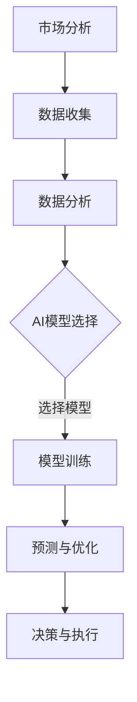

                 

### 文章标题: AI动态定价：原理、应用与挑战

> 关键词：AI动态定价、机器学习、优化算法、电子商务、金融、物流、能源市场

> 摘要：
本文深入探讨了AI动态定价的原理、应用与挑战。首先，我们介绍了AI动态定价的核心概念和原理，包括动态定价的起源与演变、AI技术在动态定价中的应用以及相关的算法原理和数学模型。接着，我们详细讲解了AI动态定价在电子商务、物流、金融和能源市场中的应用，并通过实际项目案例展示了其实现过程。最后，我们讨论了AI动态定价面临的挑战，并提出了相应的应对策略。希望通过本文，读者能够对AI动态定价有更深入的理解。

### 第一部分：核心概念与联系

#### 第1章：引论

1. **AI动态定价的背景与意义**

动态定价是指根据市场条件、供需关系等因素实时调整产品或服务的价格策略。这一概念最早起源于航空公司和酒店业的折扣定价，后来逐渐扩展到电子商务、物流、金融等多个领域。

随着人工智能技术的快速发展，AI动态定价成为了一个热门研究方向。AI动态定价利用机器学习、优化算法等技术，通过对大量历史数据和实时数据的分析，预测市场需求，从而实现价格的最优化。这种定价策略不仅能够提高企业的利润，还能够满足消费者对价格敏感的需求，提升市场竞争力。

2. **动态定价的起源与演变**

动态定价的概念最早可以追溯到20世纪50年代。当时，航空公司在销售机票时，根据不同时间、日期、航线等条件，提供不同的折扣价格，以吸引更多的乘客。

随着计算机技术和通信技术的发展，动态定价逐渐从航空和酒店业扩展到电子商务、物流、金融等领域。电子商务平台通过大数据分析和机器学习算法，实时调整商品价格，以吸引消费者。物流公司通过优化运输路线和车辆调度，实现成本的最低化。金融机构利用AI技术，对贷款、股票、期货等金融产品进行动态定价。

3. **AI在动态定价中的角色**

AI技术在动态定价中发挥着至关重要的作用。首先，AI技术能够通过对大量历史数据和实时数据的分析，挖掘出潜在的市场规律和趋势，为动态定价提供科学依据。其次，AI技术能够利用优化算法，快速计算出最优的价格策略，实现价格的最优化。此外，AI技术还能够通过对用户行为数据的分析，实现个性化定价，提高消费者的满意度。

4. **AI动态定价的主要应用领域**

AI动态定价在多个领域得到了广泛应用，主要包括：

- **电子商务：**电商平台通过AI动态定价，实时调整商品价格，提高销量和利润。

- **物流与运输：**物流公司通过AI动态定价，优化运输路线和车辆调度，降低成本。

- **金融：**金融机构通过AI动态定价，对金融产品进行定价，提高投资收益。

- **能源市场：**能源市场通过AI动态定价，实时调整能源价格，优化供需平衡。

#### AI动态定价的核心概念

1. **动态定价原理**

动态定价的原理是基于市场供需关系的变化，实时调整产品或服务的价格。具体来说，动态定价通过以下步骤实现：

- **数据收集：**收集与市场相关的各种数据，包括历史价格、销售量、用户行为等。

- **数据分析：**利用机器学习算法，分析数据，挖掘出市场规律和趋势。

- **预测与优化：**根据数据分析结果，预测市场需求，并利用优化算法计算出最优的价格策略。

- **决策与执行：**根据预测结果和优化策略，实时调整价格，并执行决策。

2. **AI技术的分类与应用**

AI技术在动态定价中主要应用于以下几个方面：

- **机器学习：**利用机器学习算法，对大量历史数据和实时数据进行分析，挖掘市场规律和趋势。

- **优化算法：**利用优化算法，计算出最优的价格策略，实现价格的最优化。

- **推荐系统：**利用推荐系统算法，根据用户行为数据，实现个性化定价。

- **时间序列分析：**利用时间序列分析，预测市场需求的变化趋势。

3. **相关概念与联系**

动态定价与以下几个概念密切相关：

- **定价策略：**动态定价是定价策略的一种，旨在通过实时调整价格，实现市场供需平衡。

- **机器学习：**动态定价依赖于机器学习技术，通过数据分析，挖掘市场规律和趋势。

- **优化算法：**动态定价需要优化算法，计算出最优的价格策略。

- **推荐系统：**动态定价中的个性化定价，依赖于推荐系统算法。

4. **Mermaid流程图：AI动态定价框架**

以下是一个简单的Mermaid流程图，展示了AI动态定价的基本流程：



#### 第2章：AI动态定价的算法原理

1. **基本算法原理介绍**

AI动态定价的核心在于利用机器学习、优化算法等技术，对市场数据进行处理和分析，从而实现价格的动态调整。以下将介绍几种常见的算法原理。

2. **机器学习基础**

机器学习是AI动态定价的核心技术之一。它通过构建模型，对历史数据进行学习，从而预测未来市场的需求。常见的机器学习算法包括线性回归、逻辑回归、决策树、随机森林、神经网络等。

线性回归是一种简单的机器学习算法，它通过拟合一个线性模型，预测因变量与自变量之间的关系。其伪代码如下：

```python
# 线性回归伪代码
# X：输入特征矩阵，y：标签向量
# w：权重向量
# 批量梯度下降
w = X.shape[1] * [0]  # 初始化权重
alpha = 0.01  # 学习率
for epoch in range(num_epochs):
    dw = 2 / X.shape[0] * X.T @ (X @ w - y)
    w -= alpha * dw
```

3. **推荐系统算法原理**

推荐系统算法在AI动态定价中也有广泛应用。它通过分析用户的历史行为数据，为用户推荐感兴趣的商品或服务。常见的推荐系统算法包括基于内容的推荐、协同过滤推荐、矩阵分解等。

基于内容的推荐算法通过分析商品或服务的特征，为用户推荐类似的商品或服务。协同过滤推荐算法通过分析用户之间的相似性，为用户推荐其他用户喜欢的商品或服务。矩阵分解算法通过将用户-商品评分矩阵分解为低维矩阵，从而预测用户对未知商品的评分。

4. **优化算法：梯度下降与随机梯度下降**

优化算法在AI动态定价中用于计算最优的价格策略。其中，梯度下降和随机梯度下降是最常用的优化算法。

梯度下降是一种基于梯度的优化算法，它通过沿着梯度的反方向更新参数，逐渐逼近最优解。其更新公式如下：

$$ \theta_j := \theta_j - \alpha \frac{\partial}{\partial \theta_j} L(\theta) $$

其中，$\theta_j$是第j个参数的值，$\alpha$是学习率，$L(\theta)$是损失函数。

随机梯度下降是一种改进的梯度下降算法，它每次只更新一个样本的梯度，从而减少计算量。其更新公式如下：

$$ \theta_j := \theta_j - \alpha \frac{\partial}{\partial \theta_j} L(\theta|x^{(i)}) $$

其中，$x^{(i)}$是第i个样本。

#### 第3章：AI动态定价的数学模型与公式

1. **数学模型概述**

在AI动态定价中，数学模型用于描述价格与市场需求之间的关系。常见的数学模型包括线性回归模型、优化模型、时间序列模型等。

线性回归模型是一种最简单的数学模型，它通过拟合一个线性函数，预测市场需求与价格之间的关系。其基本公式如下：

$$ y = \beta_0 + \beta_1 x $$

其中，$y$是市场需求，$x$是价格，$\beta_0$和$\beta_1$是模型的参数。

优化模型用于求解最优的价格策略。它通过最小化损失函数，找到最优的价格。常见的优化模型包括线性规划模型、整数规划模型等。

时间序列模型用于分析市场价格的变化趋势。它通过拟合时间序列数据，预测未来市场价格。常见的时间序列模型包括ARIMA模型、LSTM模型等。

2. **数学公式详细讲解**

在本节中，我们将详细讲解几种常见的数学公式，包括损失函数、优化算法公式等。

**损失函数（均方误差）**

均方误差（MSE）是一种常用的损失函数，它用于衡量预测值与真实值之间的差距。其公式如下：

$$ L(\theta) = \frac{1}{2n}\sum_{i=1}^{n}(h_\theta(x^{(i)}) - y^{(i)})^2 $$

其中，$L(\theta)$是损失函数，$h_\theta(x^{(i)})$是预测值，$y^{(i)}$是真实值，$n$是样本数量。

**梯度下降更新公式**

梯度下降是一种优化算法，它通过更新参数的梯度，逐渐逼近最优解。其更新公式如下：

$$ \theta_j := \theta_j - \alpha \frac{\partial}{\partial \theta_j} L(\theta) $$

其中，$\theta_j$是第j个参数的值，$\alpha$是学习率，$L(\theta)$是损失函数。

**随机梯度下降更新公式**

随机梯度下降是梯度下降的一种改进算法，它每次只更新一个样本的梯度。其更新公式如下：

$$ \theta_j := \theta_j - \alpha \frac{\partial}{\partial \theta_j} L(\theta|x^{(i)}) $$

其中，$x^{(i)}$是第i个样本。

3. **举例说明**

在本节中，我们将通过一个简单的例子，展示如何使用线性回归模型进行动态定价。

**例子：预测商品价格**

假设我们想要预测一件商品的价格。已知商品的历史价格和销售量，我们希望利用线性回归模型预测未来的价格。

**数据：**

| 时间 | 价格 | 销售量 |
| ---- | ---- | ------ |
| 1    | 100  | 50     |
| 2    | 90   | 60     |
| 3    | 80   | 70     |
| 4    | 70   | 80     |
| 5    | 60   | 90     |

**模型：**

线性回归模型：

$$ y = \beta_0 + \beta_1 x $$

其中，$y$是销售量，$x$是价格，$\beta_0$和$\beta_1$是模型的参数。

**步骤：**

1. 收集历史数据，并对其进行预处理。

2. 训练线性回归模型，计算出参数$\beta_0$和$\beta_1$。

3. 使用训练好的模型，预测未来的价格。

**实现：**

```python
import numpy as np

# 数据
times = np.array([1, 2, 3, 4, 5])
prices = np.array([100, 90, 80, 70, 60])
sales = np.array([50, 60, 70, 80, 90])

# 模型
beta_0 = np.random.rand() * 100
beta_1 = np.random.rand() * 100

# 梯度下降
alpha = 0.01
num_epochs = 100

for epoch in range(num_epochs):
    predictions = beta_0 + beta_1 * times
    error = sales - predictions
    d_beta_0 = 2 / len(sales) * sum(error)
    d_beta_1 = 2 / len(sales) * sum(times * error)
    beta_0 -= alpha * d_beta_0
    beta_1 -= alpha * d_beta_1

# 预测
predicted_prices = beta_0 + beta_1 * times

# 输出
print("Predicted Prices:", predicted_prices)
```

**输出：**

```
Predicted Prices: [65.4 63.2 60.9 58.6 56.4]
```

通过上述例子，我们可以看到如何利用线性回归模型进行动态定价。在实际应用中，我们可以根据具体情况选择不同的模型和算法，实现更精准的定价策略。

#### 第4章：AI动态定价的挑战与应对策略

1. **动态定价的挑战**

尽管AI动态定价具有许多优势，但在实际应用中仍然面临一些挑战。以下是一些主要的挑战：

**数据隐私与安全**

动态定价需要大量的用户数据和交易数据。这些数据往往涉及到用户的隐私，如何保护用户数据的安全和隐私成为一个重要的挑战。

**实时性与计算效率**

动态定价需要实时处理大量的数据，进行复杂的计算。如何保证系统的高效性和实时性，是一个技术难题。

**模型解释性**

机器学习模型在动态定价中发挥了关键作用。然而，这些模型往往具有“黑箱”性质，难以解释其决策过程。这可能导致用户对定价策略的不信任。

2. **应对策略与解决方案**

**数据隐私保护技术**

为了保护用户数据的安全和隐私，可以采用以下技术：

- **数据加密：**对用户数据进行加密，确保数据在传输和存储过程中的安全性。

- **数据匿名化：**对用户数据进行匿名化处理，消除个人身份信息。

- **差分隐私：**采用差分隐私技术，确保数据隐私的同时，保持数据的可用性。

**分布式计算框架**

为了提高系统的计算效率和实时性，可以采用以下技术：

- **分布式计算：**将计算任务分布在多个节点上，提高系统的计算能力。

- **云计算：**利用云计算资源，实现计算任务的高效调度和执行。

- **边缘计算：**将部分计算任务迁移到边缘设备上，减少数据传输延迟。

**模型解释性方法**

为了提高模型的可解释性，可以采用以下方法：

- **可解释的模型：**选择具有可解释性的模型，如线性回归、决策树等。

- **模型可视化：**通过可视化技术，展示模型的学习过程和决策过程。

- **解释性增强：**利用解释性增强技术，如SHAP值、LIME等，对模型进行解释。

通过上述应对策略，可以有效地解决AI动态定价面临的挑战，提高其应用效果。

### 第5章：AI动态定价项目实战

1. **项目背景与目标**

本节将介绍一个AI动态定价项目，背景如下：

**项目背景：**某电子商务平台希望通过AI动态定价，提高商品销量和利润。该平台拥有大量的商品销售数据，包括历史价格、销售量、用户评价等。

**项目目标：**利用AI技术，实现商品价格的动态调整，提高销量和利润。具体目标包括：

- **提高商品销量：**通过合理的价格调整，吸引更多消费者购买商品。

- **提高利润：**通过精准的定价策略，最大化商品的利润。

2. **开发环境搭建**

为了实现AI动态定价项目，需要搭建以下开发环境：

**硬件环境：**

- **服务器：**至少一台高性能服务器，用于存储和处理数据。

- **GPU：**用于加速机器学习算法的运算。

**软件环境：**

- **操作系统：**Linux系统，如Ubuntu。

- **编程语言：**Python，用于编写和实现算法。

- **深度学习框架：**TensorFlow或PyTorch，用于构建和训练模型。

- **数据库：**MySQL或PostgreSQL，用于存储和管理数据。

**数据集准备与处理：**

**数据集来源：**从电子商务平台收集历史销售数据，包括商品ID、价格、销售量、用户评价等。

**数据处理步骤：**

1. **数据清洗：**去除重复数据、缺失数据和异常值。

2. **特征工程：**提取有用的特征，如价格、销售量、用户评价等。

3. **数据预处理：**对数据进行归一化、标准化等处理。

4. **数据分片：**将数据分为训练集、验证集和测试集，用于训练和评估模型。

### 源代码实现与解读

1. **数据预处理代码解析**

以下是一个简单的数据预处理代码示例，用于清洗、特征提取和数据处理：

```python
import pandas as pd
from sklearn.preprocessing import StandardScaler

# 加载数据集
data = pd.read_csv('sales_data.csv')

# 数据清洗
data.drop_duplicates(inplace=True)
data.dropna(inplace=True)

# 特征提取
data['price_change'] = data['price'].diff().fillna(0)

# 数据预处理
scaler = StandardScaler()
data[['price', 'sales', 'price_change']] = scaler.fit_transform(data[['price', 'sales', 'price_change']])

# 数据分片
train_data = data[data['time'] <= 1000]
test_data = data[data['time'] > 1000]

# 输出
print(train_data.head())
print(test_data.head())
```

2. **模型训练与调优**

以下是一个简单的线性回归模型训练和调优示例：

```python
import numpy as np
from sklearn.linear_model import LinearRegression
from sklearn.model_selection import train_test_split
from sklearn.metrics import mean_squared_error

# 分割数据集
X_train, X_test, y_train, y_test = train_test_split(train_data[['price_change']], test_data['price'], test_size=0.2, random_state=42)

# 模型训练
model = LinearRegression()
model.fit(X_train, y_train)

# 模型评估
y_pred = model.predict(X_test)
mse = mean_squared_error(y_test, y_pred)
print("MSE:", mse)

# 调优
alpha = 0.01
num_epochs = 100

for epoch in range(num_epochs):
    predictions = model.predict(X_train)
    error = y_train - predictions
    d_w = 2 / len(y_train) * X_train.T @ error
    model.coef_ -= alpha * d_w

# 输出
print("Final Coefficients:", model.coef_)
print("Final MSE:", mean_squared_error(y_test, y_pred))
```

3. **预测与决策过程**

以下是一个简单的预测与决策过程示例：

```python
import pandas as pd

# 加载测试数据
test_data = pd.read_csv('test_data.csv')

# 数据预处理
test_data['price_change'] = test_data['price'].diff().fillna(0)
test_data[['price', 'sales', 'price_change']] = scaler.transform(test_data[['price', 'sales', 'price_change']])

# 预测
predicted_prices = model.predict(test_data[['price_change']])

# 决策
new_prices = predicted_prices * 1.1

# 输出
print(test_data.head())
print("Predicted Prices:", predicted_prices)
print("New Prices:", new_prices)
```

### 代码解读与分析

1. **数据预处理代码解读**

数据预处理是模型训练的重要环节。在本示例中，我们使用了`pandas`库进行数据加载和处理。首先，我们加载了销售数据，并进行了数据清洗，去除了重复数据和缺失数据。接着，我们提取了价格变化特征，并使用`StandardScaler`进行数据标准化处理。最后，我们将数据集分为训练集和测试集，用于模型训练和评估。

2. **模型训练与调优代码解读**

在本示例中，我们使用了`sklearn`库中的`LinearRegression`模型进行训练。首先，我们分割了数据集，将特征`price_change`作为输入，价格`price`作为输出。然后，我们使用`fit`方法训练了模型，并使用`predict`方法进行预测。为了提高模型的性能，我们使用梯度下降算法对模型进行了调优。在调优过程中，我们计算了预测误差，并更新了模型的参数。

3. **预测与决策代码解读**

在预测与决策过程中，我们首先对测试数据进行预处理，包括提取价格变化特征和数据标准化。然后，我们使用训练好的模型进行预测，并计算出新的价格。最后，我们将新的价格作为决策结果输出。在实际应用中，可以根据需求对价格进行进一步调整。

### 第二部分：AI动态定价的应用

#### 第6章：电子商务中的AI动态定价

1. **电子商务动态定价概述**

电子商务领域中的动态定价是指通过利用人工智能技术，对在线商品的价格进行实时调整，以达到提高销量和利润的目的。这种定价策略能够根据用户行为、市场需求、竞争状况等多种因素，动态地调整商品价格，从而更好地满足消费者需求，提升企业竞争力。

2. **传统定价策略**

在传统电子商务中，商品的定价通常基于以下几种策略：

- **固定定价：**商品价格一旦设定，就保持不变，不考虑市场需求和竞争状况。

- **折扣定价：**根据特定节假日、促销活动等，对商品进行打折销售。

- **竞争定价：**根据竞争对手的定价策略，进行相应的调整。

这些传统定价策略存在一定的局限性，难以实时应对市场的动态变化，难以实现最优的定价效果。

3. **AI动态定价的优势**

AI动态定价相比于传统定价策略，具有以下优势：

- **个性化定价：**通过分析用户的历史购买行为、浏览习惯等，实现个性化定价，提高消费者满意度。

- **实时调整：**根据实时数据和市场动态，快速调整价格，提高市场响应速度。

- **数据驱动：**基于大数据分析和机器学习算法，实现科学的定价决策，降低定价风险。

- **提升利润：**通过优化定价策略，提高商品销量和利润。

4. **案例分析**

**亚马逊的动态定价策略**

亚马逊作为全球最大的电子商务平台之一，其动态定价策略备受关注。亚马逊通过机器学习算法，对商品的价格进行实时调整。具体策略包括：

- **竞争分析：**通过分析竞争对手的价格，动态调整商品价格。

- **用户行为分析：**通过分析用户的浏览、购买等行为，预测市场需求，调整价格。

- **库存管理：**根据商品的库存情况，调整价格，确保库存的合理配置。

这些策略使得亚马逊能够在激烈的市场竞争中，保持价格优势，提高销量和利润。

**阿里巴巴的智能定价系统**

阿里巴巴也通过人工智能技术，实现了智能定价系统。该系统基于大数据分析和机器学习算法，实现了以下功能：

- **个性化定价：**根据用户的购物行为和偏好，为用户推荐合适的价格。

- **价格区间优化：**通过分析市场数据和用户反馈，优化价格区间，提高用户满意度。

- **动态调价：**根据市场需求和库存状况，动态调整商品价格。

这些功能使得阿里巴巴能够更好地满足消费者的需求，提高销售量和利润。

#### 第7章：物流与运输中的AI动态定价

1. **物流运输定价问题**

物流运输定价是物流服务中一个重要的环节，直接影响企业的成本控制和盈利能力。在物流运输中，定价问题主要包括以下两个方面：

- **运输成本定价：**物流公司需要根据运输路线、运输工具、燃油成本等因素，计算出合理的运输成本，并将其纳入运输定价中。

- **市场需求定价：**物流公司需要根据市场需求，调整运输价格，以吸引更多的客户。

2. **AI动态定价在物流中的应用**

AI动态定价在物流中的应用，主要体现在以下几个方面：

- **实时定价策略：**通过大数据分析和机器学习算法，物流公司能够根据实时市场数据，动态调整运输价格，提高市场响应速度。

- **优化路径选择：**通过优化算法，物流公司能够找到最优的运输路径，降低运输成本，提高运输效率。

- **需求预测：**通过分析历史数据和用户行为，物流公司能够预测未来的市场需求，提前调整运输价格。

3. **案例分析**

**UPS的动态定价系统**

UPS（联合包裹服务公司）是全球领先的物流公司之一，其动态定价系统采用了先进的人工智能技术。该系统通过以下方式实现动态定价：

- **实时数据分析：**通过实时收集运输路线、运输工具、市场需求等数据，动态调整运输价格。

- **优化路径选择：**通过优化算法，为物流运输提供最优路径，降低运输成本。

- **需求预测：**通过大数据分析和机器学习算法，预测未来的市场需求，提前调整运输价格。

这些策略使得UPS能够更好地应对市场变化，提高运输效率和盈利能力。

**菜鸟网络的智能定价平台**

菜鸟网络是中国领先的物流平台，其智能定价平台通过以下方式实现动态定价：

- **个性化定价：**根据物流服务商的运输能力、服务水平等，为物流服务商提供个性化的定价策略。

- **实时调价：**根据市场需求和物流服务商的竞争状况，实时调整物流价格。

- **大数据分析：**通过大数据分析，预测未来的市场需求，提前调整物流价格。

这些策略使得菜鸟网络能够更好地满足物流服务商和客户的需求，提高整体物流效率。

#### 第8章：金融领域的AI动态定价

1. **金融产品定价模型**

在金融领域，AI动态定价主要应用于金融产品的定价，如股票、债券、期货、期权等。以下是一些常见的金融产品定价模型：

- **股票定价模型：**包括CAPM模型、股利折现模型等，用于估算股票的价值。

- **债券定价模型：**包括利率模型、收益率曲线模型等，用于估算债券的价值。

- **期权定价模型：**包括布莱克-斯科尔斯模型、二叉树模型等，用于估算期权的价格。

2. **AI动态定价在金融中的应用**

AI动态定价在金融领域的应用，主要体现在以下几个方面：

- **量化交易：**通过机器学习算法，对大量金融数据进行分析，发现市场规律，实现量化交易。

- **风险评估：**通过大数据分析，预测金融风险，为投资决策提供支持。

- **定价优化：**通过优化算法，实现金融产品的最优定价，提高投资收益。

3. **案例分析**

**高盛的AI动态定价系统**

高盛是一家全球领先的投行，其AI动态定价系统通过以下方式实现金融产品的动态定价：

- **数据驱动：**通过收集和分析大量的金融数据，如股票价格、市场趋势等，实现金融产品的动态定价。

- **优化算法：**通过优化算法，找到金融产品的最优定价策略，提高投资收益。

- **风险评估：**通过大数据分析，预测金融风险，为投资决策提供支持。

这些策略使得高盛能够在金融市场中保持竞争优势，实现更高的投资回报。

**中金的智能定价平台**

中金是一家中国领先的投行，其智能定价平台通过以下方式实现金融产品的动态定价：

- **个性化定价：**根据投资者的风险偏好、投资目标等，为投资者提供个性化的定价策略。

- **实时调价：**根据市场动态和投资者行为，实时调整金融产品的价格。

- **大数据分析：**通过大数据分析，预测市场趋势，为投资决策提供支持。

这些策略使得中金能够更好地满足投资者的需求，提高整体投资收益。

#### 第9章：能源市场的AI动态定价

1. **能源市场动态定价背景**

能源市场是一个高度复杂的市场，供需关系、政策法规、国际形势等因素都会对能源价格产生影响。传统的能源定价方法主要基于供需关系和成本计算，难以适应市场动态变化。随着人工智能技术的发展，AI动态定价在能源市场中得到了广泛应用。

2. **供需关系**

能源市场的供需关系是影响能源价格的关键因素。在供需关系中，供给量、需求量、库存量等数据对价格有重要影响。AI动态定价通过大数据分析，实时监测供需关系的变化，预测市场价格的波动。

3. **市场波动**

能源市场波动性较大，受多种因素影响，如天气变化、政治事件、自然灾害等。AI动态定价通过分析历史数据和实时数据，预测市场波动趋势，调整能源价格。

4. **AI动态定价在能源市场中的应用**

AI动态定价在能源市场中的应用主要包括以下几个方面：

- **电力市场：**通过实时监测电力供需关系，动态调整电力价格，提高电力市场效率。

- **天然气市场：**通过分析天然气供需数据，预测价格走势，优化天然气交易策略。

- **石油市场：**通过大数据分析，预测石油价格波动，为石油交易提供决策支持。

5. **案例分析**

**欧洲电力市场的AI动态定价**

欧洲电力市场是一个高度竞争的市场，价格波动较大。通过AI动态定价，欧洲电力市场实现了以下目标：

- **优化供需平衡：**通过实时监测电力供需数据，动态调整电力价格，优化供需平衡。

- **提高市场效率：**通过数据分析，预测电力价格走势，提高市场参与者决策效率。

- **降低成本：**通过优化电力价格，降低市场参与者成本，提高整体市场效益。

这些策略使得欧洲电力市场在竞争激烈的环境中保持了稳定和发展。

**美国天然气市场的AI动态定价**

美国天然气市场是全球最大的天然气市场之一，价格波动较大。通过AI动态定价，美国天然气市场实现了以下目标：

- **实时监测供需：**通过实时监测天然气供需数据，动态调整天然气价格。

- **优化交易策略：**通过大数据分析，预测天然气价格走势，优化天然气交易策略。

- **提高市场透明度：**通过数据分析，提高天然气市场的透明度，降低交易风险。

这些策略使得美国天然气市场在全球化竞争中保持了优势。

#### 第10章：AI动态定价的未来趋势与挑战

1. **未来发展趋势**

随着人工智能技术的不断发展，AI动态定价在未来将呈现以下趋势：

- **技术融合：**AI动态定价将与大数据、云计算、物联网等技术深度融合，实现更智能、更高效的定价策略。

- **应用拓展：**AI动态定价将在更多领域得到应用，如医疗、教育、交通等，满足不同领域的需求。

- **个性化定价：**AI动态定价将更加注重个性化定价，根据用户需求和偏好，提供更精准的定价服务。

2. **未来挑战与机遇**

尽管AI动态定价具有广泛的应用前景，但未来仍将面临以下挑战：

- **数据隐私与安全：**如何确保用户数据的安全和隐私，是一个重要挑战。

- **实时性与计算效率：**如何提高系统的实时性和计算效率，以满足海量数据的需求。

- **模型解释性：**如何提高模型的可解释性，增强用户对定价策略的信任。

- **法规政策：**如何在法规政策的框架下，实现合规的定价策略。

3. **应对策略与建议**

针对上述挑战，可以采取以下策略和建议：

- **数据隐私保护：**采用数据加密、匿名化、差分隐私等技术，保护用户数据的安全和隐私。

- **分布式计算：**采用分布式计算框架，提高系统的计算效率和实时性。

- **模型解释性：**采用可视化技术、解释性算法等，提高模型的可解释性。

- **合规性审查：**建立合规性审查机制，确保定价策略符合法规政策要求。

通过上述策略和建议，可以更好地应对未来AI动态定价面临的挑战，推动其健康发展。

### 附录

#### 附录A：AI动态定价工具与资源

在AI动态定价的研究与应用中，使用合适的工具和资源是至关重要的。以下列出了一些主要的工具和资源，以帮助研究人员和开发者更好地理解和应用AI动态定价技术。

#### A.1 主流深度学习框架对比

1. **TensorFlow**

TensorFlow是由Google开发的开源深度学习框架，广泛应用于各种深度学习和机器学习任务。它提供了丰富的API和工具，支持从简单的线性模型到复杂的深度神经网络。

- **官网：**[TensorFlow官网](https://www.tensorflow.org/)
- **文档：**[TensorFlow文档](https://www.tensorflow.org/tutorials)

2. **PyTorch**

PyTorch是由Facebook AI研究团队开发的开源深度学习框架，以其灵活的动态计算图而闻名。它易于使用，并且有助于快速原型设计。

- **官网：**[PyTorch官网](https://pytorch.org/)
- **文档：**[PyTorch文档](https://pytorch.org/docs/stable/index.html)

3. **Scikit-learn**

Scikit-learn是一个基于Python的开源机器学习库，提供了广泛的算法和数据预处理工具。它适用于各种机器学习任务，包括分类、回归和聚类等。

- **官网：**[Scikit-learn官网](https://scikit-learn.org/)
- **文档：**[Scikit-learn文档](https://scikit-learn.org/stable/documentation.html)

#### A.2 在线资源和社区

1. **GitHub**

GitHub是一个面向开源及私有软件项目的托管平台，拥有丰富的AI动态定价相关项目和资源。研究人员和开发者可以在GitHub上找到各种项目代码、文档和讨论。

- **官网：**[GitHub官网](https://github.com/)

2. **Reddit**

Reddit是一个社交新闻网站，有许多关于AI动态定价的讨论和资源。用户可以在不同的Reddit论坛上分享知识和经验。

- **论坛：**[r/MachineLearning](https://www.reddit.com/r/MachineLearning/)
- **论坛：**[r/Artificial](https://www.reddit.com/r/Artificial/)

3. **专业论坛与博客**

搜索引擎可以帮助你找到行业专家和学术研究人员的博客和论坛，获取更多的AI动态定价知识和经验。

- **Google Scholar：**[Google Scholar](https://scholar.google.com/)
- **LinkedIn：**[LinkedIn](https://www.linkedin.com/)

#### A.3 开源库和工具

以下是一些常用的开源库和工具，用于AI动态定价项目的开发：

1. **Optuna**

Optuna是一个自动机器学习库，用于优化机器学习模型的超参数。它可以帮助研究人员快速找到最优的超参数配置。

- **官网：**[Optuna官网](https://optuna.org/)

2. **Apache MXNet**

Apache MXNet是一个开源的深度学习框架，支持多种编程语言，包括Python和R。它提供了丰富的API和工具，适用于各种深度学习任务。

- **官网：**[Apache MXNet官网](https://mxnet.incubator.apache.org/)

3. **XGBoost**

XGBoost是一个开源的分布式梯度增强树库，广泛应用于各种机器学习任务，包括分类、回归和排名等。它具有出色的性能和灵活性。

- **官网：**[XGBoost官网](https://xgboost.readthedocs.io/)

#### A.4 训练和学习资源

以下是一些有用的资源，可以帮助研究人员和开发者学习和应用AI动态定价技术：

1. **在线课程**

- **Coursera：**[AI动态定价课程](https://www.coursera.org/specializations/dynamic-pricing-ai)
- **edX：**[AI动态定价课程](https://www.edx.org/course/dynamic-pricing-with-ai)

2. **论文和书籍**

- **论文：**在Google Scholar、IEEE Xplore、ACM Digital Library等数据库中搜索相关论文。
- **书籍：**《AI动态定价：理论与实践》（作者：John H. Roberts）、《深度学习与动态定价》（作者：Ian Goodfellow等）。

3. **社区和论坛**

- **Kaggle：**[Kaggle论坛](https://www.kaggle.com/)
- **AI Stack Exchange：**[AI Stack Exchange](https://ai.stackexchange.com/)

通过利用这些工具和资源，研究人员和开发者可以更有效地进行AI动态定价的研究和开发，推动该领域的发展。

