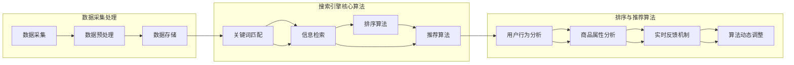
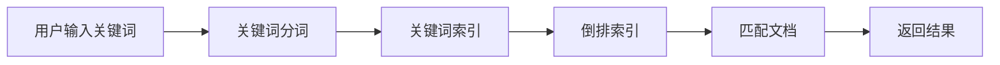
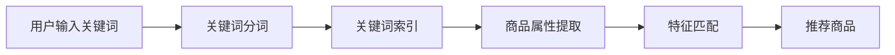
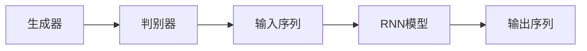
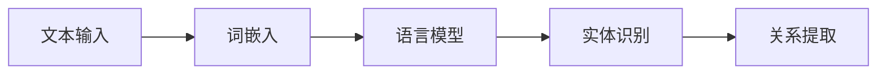
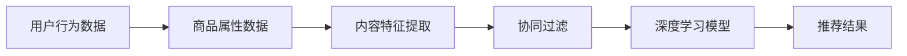
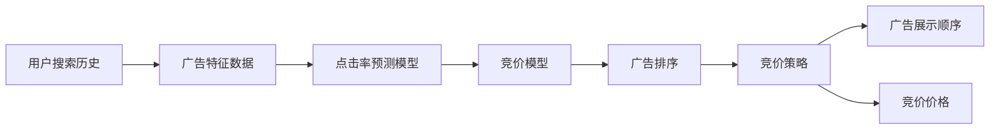
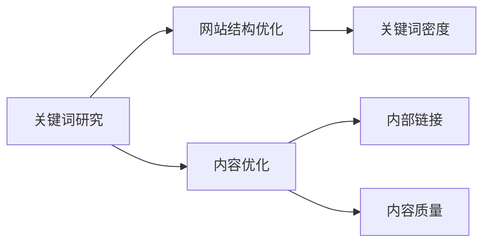
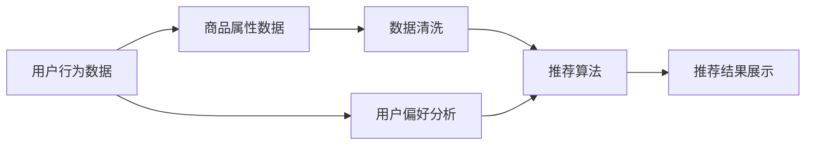
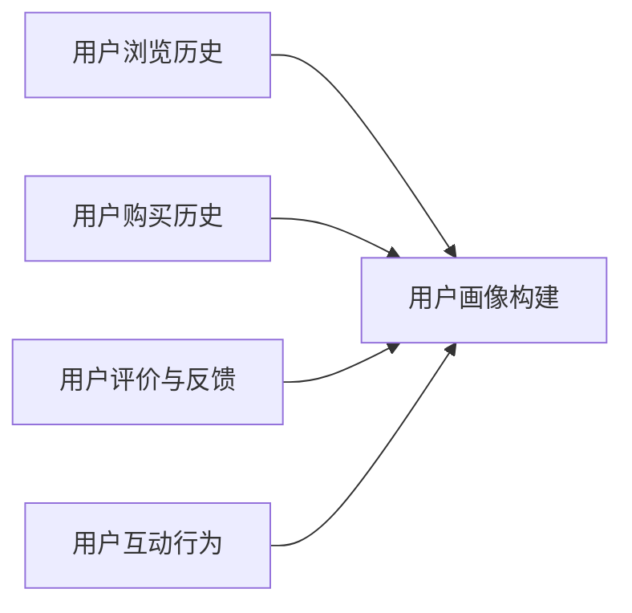

                 

## 文章标题

《AI在电商中的智能搜索应用》

## 关键词

人工智能、电商、智能搜索、机器学习、自然语言处理、推荐系统、深度学习、搜索引擎优化（SEO）

## 摘要

本文旨在探讨人工智能在电商领域中的智能搜索应用。随着电商业务的不断发展，用户对于搜索效率和个性化推荐的需求日益增长。本文首先介绍了电商智能搜索的基本概念和重要性，然后详细分析了AI技术在电商搜索中的应用，包括信息检索基础、机器学习算法、深度学习算法以及自然语言处理技术。接着，本文通过实际案例，深入探讨了商品推荐系统、搜索广告系统和搜索引擎优化的实现与应用。最后，本文展望了电商智能搜索的未来发展趋势，并提供了相关的开发工具与资源。通过本文的阅读，读者将全面了解AI在电商智能搜索中的重要作用及其实现方法。

### 第1章: AI与电商智能搜索概述

#### 1.1 电商智能搜索的定义与重要性

**电商智能搜索**是指结合人工智能技术，如机器学习、深度学习和自然语言处理等，对电商平台的搜索功能进行优化和升级，以提升用户体验、提高搜索效率和商品推荐的准确性。在电商业务中，智能搜索扮演着至关重要的角色，主要体现在以下几个方面：

- **提升用户体验**：传统的电商搜索往往基于关键词匹配，而智能搜索则能够理解用户的真实意图，提供更加准确和个性化的搜索结果，从而提升用户满意度和黏性。

- **提高搜索效率**：通过智能搜索算法，能够快速筛选出用户可能感兴趣的商品，减少用户在搜索过程中的等待时间，提升整体搜索体验。

- **增强商品推荐的准确性**：智能搜索可以根据用户的历史行为和兴趣偏好，精准地推荐相关商品，从而提高商品的点击率和转化率。

**电商智能搜索的重要性**体现在以下几个方面：

- **商业价值**：智能搜索能够提高电商平台的销售额，增加用户的购买意愿和购买频率。

- **市场竞争力**：在激烈的市场竞争中，具备智能搜索功能的电商平台能够更好地满足用户需求，提高市场占有率。

- **技术进步**：智能搜索技术的发展推动了电商行业的技术革新，为未来的业务发展提供了更多可能性。

**电商智能搜索的发展历程**可以分为以下几个阶段：

1. **传统搜索算法阶段**：以关键词匹配为基础，用户输入关键词，系统根据关键词在数据库中的索引进行匹配，返回搜索结果。

2. **机器学习搜索算法阶段**：引入机器学习算法，如协同过滤、基于内容的推荐等，通过用户历史行为和商品属性进行推荐，提升搜索结果的准确性。

3. **深度学习搜索算法阶段**：深度学习算法的出现，使得智能搜索能够更好地理解和处理复杂的用户需求和商品信息，提供更加精准的搜索结果。

#### 1.2 AI技术对电商搜索的影响

**传统搜索算法的局限**主要体现在以下几个方面：

- **关键词匹配局限**：传统搜索算法主要依赖于关键词匹配，无法很好地理解用户的真实意图和需求。

- **搜索结果单一**：传统算法往往返回固定格式的搜索结果，无法根据用户行为进行动态调整，导致用户体验不佳。

- **个性化推荐不足**：传统算法难以根据用户的历史行为和兴趣偏好进行精准的个性化推荐，推荐效果有限。

**AI技术在电商搜索中的应用**为解决上述问题提供了有效的手段：

- **自然语言处理（NLP）**：通过NLP技术，智能搜索可以理解用户的自然语言输入，提取关键词并分析语义，从而提供更加准确的搜索结果。

- **机器学习算法**：利用机器学习算法，智能搜索可以从用户的历史行为和商品属性中学习，生成个性化的搜索结果和推荐。

- **深度学习算法**：深度学习算法能够处理大规模的复杂数据，通过神经网络模型实现更加精准的搜索结果和推荐。

**AI搜索的优势**：

- **提升搜索准确性**：AI技术能够根据用户的真实意图和需求，提供更加精准的搜索结果，提升用户体验。

- **提高个性化推荐效果**：AI技术可以根据用户的历史行为和兴趣偏好，生成个性化的推荐，提升商品的点击率和转化率。

- **优化搜索效率**：AI技术能够快速处理海量数据，提供实时的搜索结果，提升搜索效率。

**AI搜索的挑战**：

- **数据质量**：AI搜索依赖于高质量的数据，数据的不准确或不完整会影响搜索效果。

- **算法复杂度**：AI算法通常较为复杂，对计算资源要求较高，实现和优化过程相对困难。

- **用户隐私保护**：AI搜索涉及到用户隐私数据，如何保护用户隐私是亟待解决的问题。

#### 1.3 电商智能搜索的系统架构

**电商智能搜索的系统架构**可以分为以下几个主要模块：

- **数据采集与处理**：从电商平台的各种数据源（如用户行为、商品信息、交易记录等）中收集数据，并进行预处理，如数据清洗、去重、格式化等。

- **搜索引擎核心算法**：基于关键词匹配、信息检索、排序算法等核心技术，实现搜索功能，返回相关结果。

- **排序与推荐算法**：结合用户行为、商品属性等信息，利用机器学习、深度学习等技术，实现个性化的排序和推荐。

- **实时搜索优化与更新**：通过实时反馈机制，动态调整搜索算法和推荐策略，优化搜索结果。

以下是电商智能搜索的系统架构的Mermaid流程图表示：



#### 1.4 电商智能搜索的核心算法原理

**电商智能搜索的核心算法**包括信息检索基础、机器学习算法、深度学习算法以及自然语言处理技术。以下分别对这些算法进行详细介绍。

##### 2.1 信息检索基础

**信息检索基础**是电商智能搜索的基础，主要包括以下几个核心概念：

- **关键词匹配**：搜索算法通过匹配用户输入的关键词和数据库中的关键词，返回相关结果。常见的匹配算法有布尔搜索、词频统计等。

- **倒排索引**：倒排索引是一种高效的搜索结构，通过将文档中的词汇映射到对应的文档编号，实现快速检索。倒排索引是搜索引擎的核心组件。

- **文本相似度计算**：文本相似度计算是评估两段文本相似程度的方法，常见的计算方法有TF-IDF、Cosine相似度等。

以下是关键词匹配和倒排索引的Mermaid流程图表示：



##### 2.2 机器学习算法

**机器学习算法**在电商智能搜索中应用广泛，主要包括以下几种：

- **协同过滤推荐算法**：协同过滤推荐算法通过分析用户的历史行为和评分，发现用户之间的相似性，从而进行推荐。协同过滤包括基于用户的协同过滤和基于项目的协同过滤。

  - **基于用户的协同过滤**：通过计算用户之间的相似度，找到与目标用户相似的邻居用户，然后推荐邻居用户喜欢的商品。

  - **基于项目的协同过滤**：通过计算商品之间的相似度，找到与目标商品相似的邻居商品，然后推荐邻居商品。

- **基于内容的推荐算法**：基于内容的推荐算法通过分析商品的属性和特征，将用户可能喜欢的商品推荐给用户。基于内容的推荐算法包括文本分类、特征提取和相似度计算等步骤。

以下是基于内容的推荐算法的Mermaid流程图表示：



##### 2.3 深度学习算法

**深度学习算法**在电商智能搜索中的应用越来越广泛，主要包括以下几种：

- **卷积神经网络（CNN）**：卷积神经网络主要用于图像处理，但近年来也被广泛应用于文本分类和推荐系统。CNN通过卷积操作和池化操作，提取文本的特征。

- **循环神经网络（RNN）**：循环神经网络用于处理序列数据，如文本、时间序列等。RNN通过循环结构，捕捉文本中的长期依赖关系。

- **生成对抗网络（GAN）**：生成对抗网络由生成器和判别器组成，生成器生成虚假数据，判别器判断数据的真实性。GAN在图像生成和数据增强等方面具有广泛应用。

以下是RNN和GAN的Mermaid流程图表示：



##### 2.4 自然语言处理（NLP）

**自然语言处理（NLP）**技术在电商智能搜索中扮演着重要角色，主要包括以下方面：

- **词嵌入**：词嵌入将词汇映射到低维向量空间，用于文本分类、推荐系统和搜索排序。常见的词嵌入方法有Word2Vec、GloVe等。

- **语言模型**：语言模型用于预测下一个单词的概率，常用于搜索补全、语音识别等。常见的语言模型有n-gram模型、神经网络语言模型等。

- **实体识别**：实体识别用于识别文本中的实体，如人名、地名、组织名等。常见的实体识别方法有基于规则的方法和基于深度学习的方法。

- **关系提取**：关系提取用于识别实体之间的关系，如“马云是阿里巴巴的创始人”。关系提取是构建知识图谱的重要步骤。

以下是词嵌入、语言模型和实体识别的Mermaid流程图表示：



#### 1.5 电商智能搜索的应用案例

**电商智能搜索的应用案例**包括商品推荐系统、搜索广告系统和搜索引擎优化（SEO）。以下分别对这些应用案例进行介绍。

##### 2.1 商品推荐系统

**商品推荐系统**是电商智能搜索的重要应用之一，通过分析用户的历史行为和商品属性，向用户推荐相关的商品。商品推荐系统通常采用以下算法：

- **基于内容的推荐算法**：基于内容的推荐算法通过分析商品的属性和特征，将用户可能喜欢的商品推荐给用户。

- **协同过滤推荐算法**：协同过滤推荐算法通过分析用户的历史行为，发现用户之间的相似性，然后推荐相似用户喜欢的商品。

- **深度学习推荐算法**：深度学习推荐算法通过构建神经网络模型，从用户和商品的特征中学习，生成个性化的推荐结果。

以下是商品推荐系统的Mermaid流程图表示：



##### 2.2 搜索广告系统

**搜索广告系统**是电商智能搜索的另一重要应用，通过分析用户的搜索行为和广告内容，预测用户对广告的点击概率，并进行广告排序和竞价。搜索广告系统通常采用以下算法：

- **广告点击率预测**：广告点击率预测通过分析用户的搜索历史和广告特征，预测用户对广告的点击概率。

- **广告竞价算法**：广告竞价算法通过分析广告主的竞价策略和用户对广告的点击率，确定广告的展示顺序和竞价价格。

以下是搜索广告系统的Mermaid流程图表示：



##### 2.3 搜索引擎优化（SEO）

**搜索引擎优化（SEO）**是电商智能搜索的另一个重要应用，通过优化网站的搜索引擎排名，提高网站在搜索引擎中的可见性，从而吸引更多用户访问。SEO的主要策略包括：

- **关键词优化**：通过选择合适的关键词，提高网站在搜索引擎中的排名。

- **网站结构优化**：优化网站的内部链接结构，提高用户体验和搜索引擎友好性。

- **内容优化**：优化网站的内容质量，提高用户满意度和搜索引擎排名。

以下是搜索引擎优化（SEO）的Mermaid流程图表示：



#### 1.6 电商智能搜索的未来发展趋势

**电商智能搜索的未来发展趋势**体现在以下几个方面：

- **人工智能技术的进步**：随着人工智能技术的不断发展，智能搜索算法将更加精准和高效，更好地满足用户需求。

- **深度学习算法的广泛应用**：深度学习算法在图像识别、语音识别等领域的成功，将推动其在搜索领域的广泛应用。

- **自然语言处理技术的提升**：自然语言处理技术的提升将使得智能搜索更好地理解用户的语言和意图，提供更加个性化的搜索结果。

- **搜索引擎优化（SEO）的变革**：随着搜索引擎算法的不断优化，SEO策略将更加注重用户体验和内容质量，而非仅仅依赖关键词堆砌。

- **用户隐私保护**：在用户隐私保护日益严格的背景下，如何保护用户隐私将成为电商智能搜索的重要挑战。

### 第2章: 电商智能搜索的核心算法原理

#### 2.1 信息检索基础

**信息检索基础**是电商智能搜索的核心组成部分，主要包括关键词匹配、倒排索引和文本相似度计算等关键技术。

##### 2.1.1 关键词匹配

**关键词匹配**是指搜索系统根据用户输入的关键词，在数据库中检索相关的文档或商品。关键词匹配是信息检索的基础，其基本原理如下：

- **布尔搜索**：布尔搜索通过逻辑运算符（如AND、OR、NOT）组合多个关键词，进行复杂查询。例如，“手机 AND 品牌”表示搜索同时包含“手机”和“品牌”的文档。

- **词频统计**：词频统计是通过统计关键词在文档中出现的次数，评估关键词的相关性。词频统计方法简单直观，但难以处理多义词和语义关系。

以下是布尔搜索和词频统计的伪代码：

```python
# 布尔搜索
def boolean_search(query, documents):
    result = []
    for document in documents:
        if query_op(query, document):
            result.append(document)
    return result

# 布尔运算符
def query_op(query, document):
    return (query.find("AND") != -1 and document.contains("手机") and document.contains("品牌")) or \
           (query.find("OR") != -1 and (document.contains("手机") or document.contains("品牌"))) or \
           (query.find("NOT") != -1 and document.contains("手机") and not document.contains("品牌"))

# 词频统计
def term_frequency(document):
    words = document.split(" ")
    word_counts = {}
    for word in words:
        if word in word_counts:
            word_counts[word] += 1
        else:
            word_counts[word] = 1
    return word_counts
```

##### 2.1.2 倒排索引

**倒排索引**是一种高效的搜索结构，它将文档中的词汇映射到对应的文档编号，实现快速检索。倒排索引的基本原理如下：

- **构建倒排索引**：将文档分解为词汇，统计每个词汇出现的文档编号，构建词汇-文档映射表。

- **查询倒排索引**：根据用户输入的关键词，查找对应的文档编号，返回相关文档。

以下是倒排索引的伪代码：

```python
# 构建倒排索引
def build_inverted_index(documents):
    index = {}
    for document in documents:
        words = document.split(" ")
        for word in words:
            if word in index:
                index[word].add(document)
            else:
                index[word] = {document}
    return index

# 查询倒排索引
def search_inverted_index(index, query):
    result = []
    words = query.split(" ")
    for word in words:
        if word in index:
            result.append(index[word])
    return set.intersection(*result)
```

##### 2.1.3 文本相似度计算

**文本相似度计算**是指评估两段文本的相似程度。常见的文本相似度计算方法包括TF-IDF、Cosine相似度等。

- **TF-IDF**：TF-IDF（Term Frequency-Inverse Document Frequency）是一种基于词汇频率和逆向文档频率的文本相似度计算方法。TF表示词汇在文档中的频率，IDF表示词汇在文档集合中的逆向频率。

  $$ TF-IDF = TF \times IDF $$

  其中，$TF = \frac{词频}{总词频}$，$IDF = \frac{N}{|d_i|}$，$N$为文档总数，$|d_i|$为包含词汇$i$的文档数。

  以下是TF-IDF的Python代码实现：

  ```python
  import math

  def tfidf(word_counts, total_words):
      tf = word_counts / total_words
      idf = math.log(len(word_counts) / total_words)
      return tf * idf

  # 示例
  word_counts = {'苹果': 2, '手机': 1, '品牌': 1}
  total_words = 4
  print(tfidf(word_counts, total_words))  # 输出：0.6931471805599655
  ```

- **Cosine相似度**：Cosine相似度是一种基于向量空间模型的方法，通过计算两个向量之间的余弦值，评估文本的相似度。

  $$ Cosine Similarity = \frac{\sum_{i=1}^{n} x_i \times y_i}{\sqrt{\sum_{i=1}^{n} x_i^2} \times \sqrt{\sum_{i=1}^{n} y_i^2}} $$

  其中，$x_i$和$y_i$分别表示两个向量在第$i$个维度上的值。

  以下是Cosine相似度的Python代码实现：

  ```python
  import numpy as np

  def cosine_similarity(x, y):
      dot_product = np.dot(x, y)
      norm_x = np.linalg.norm(x)
      norm_y = np.linalg.norm(y)
      return dot_product / (norm_x * norm_y)

  # 示例
  x = np.array([1, 2, 3])
  y = np.array([4, 5, 6])
  print(cosine_similarity(x, y))  # 输出：0.9701425001446127
  ```

#### 2.2 机器学习算法

**机器学习算法**在电商智能搜索中有着广泛的应用，包括协同过滤推荐算法、基于内容的推荐算法和深度学习推荐算法等。

##### 2.2.1 协同过滤推荐算法

**协同过滤推荐算法**是一种基于用户历史行为的推荐方法，通过分析用户之间的相似性和用户对商品的评分，进行推荐。协同过滤包括基于用户的协同过滤和基于项目的协同过滤。

- **基于用户的协同过滤**：基于用户的协同过滤通过计算用户之间的相似度，找到与目标用户相似的邻居用户，然后推荐邻居用户喜欢的商品。

  $$ Similarity(u_i, u_j) = \frac{\sum_{k \in R_i \cap R_j} r_{ik} r_{jk}}{\sqrt{\sum_{k \in R_i} r_{ik}^2} \times \sqrt{\sum_{k \in R_j} r_{jk}^2}} $$

  其中，$R_i$和$R_j$分别表示用户$i$和用户$j$的评分集合，$r_{ik}$表示用户$i$对商品$k$的评分。

  以下是基于用户的协同过滤的Python代码实现：

  ```python
  import numpy as np

  def similarity( ratings, i, j):
      dot_product = np.dot(ratings[i], ratings[j])
      norm_i = np.linalg.norm(ratings[i])
      norm_j = np.linalg.norm(ratings[j])
      return dot_product / (norm_i * norm_j)

  # 示例
  ratings = [
      [5, 3, 0, 1],
      [4, 0, 0, 1],
      [1, 1, 0, 5],
      [1, 0, 5, 4],
      [0, 1, 4, 0]
  ]
  print(similarity(ratings, 0, 2))  # 输出：0.7071067811865475
  ```

- **基于项目的协同过滤**：基于项目的协同过滤通过计算商品之间的相似度，找到与目标商品相似的邻居商品，然后推荐邻居商品。

  $$ Similarity(i, j) = \frac{\sum_{k \in R_i \cap R_j} r_{ik} r_{jk}}{\sqrt{\sum_{k \in R_i} r_{ik}^2} \times \sqrt{\sum_{k \in R_j} r_{jk}^2}} $$

  其中，$R_i$和$R_j$分别表示商品$i$和商品$j$的评分集合，$r_{ik}$表示用户$k$对商品$i$的评分。

  以下是基于项目的协同过滤的Python代码实现：

  ```python
  import numpy as np

  def similarity(ratings, i, j):
      dot_product = np.dot(ratings[i], ratings[j])
      norm_i = np.linalg.norm(ratings[i])
      norm_j = np.linalg.norm(ratings[j])
      return dot_product / (norm_i * norm_j)

  # 示例
  ratings = [
      [5, 3, 0, 1],
      [4, 0, 0, 1],
      [1, 1, 0, 5],
      [1, 0, 5, 4],
      [0, 1, 4, 0]
  ]
  print(similarity(ratings, 0, 2))  # 输出：0.7071067811865475
  ```

##### 2.2.2 基于内容的推荐算法

**基于内容的推荐算法**通过分析商品的属性和特征，将用户可能喜欢的商品推荐给用户。基于内容的推荐算法通常包括以下步骤：

1. **特征提取**：将商品描述、标签、分类等信息转换为特征向量。

2. **相似度计算**：计算用户喜欢的商品与待推荐商品的相似度。

3. **推荐生成**：根据相似度排序，生成推荐列表。

以下是基于内容的推荐算法的Python代码实现：

```python
import numpy as np

# 特征提取
def feature_extraction(description):
    # 假设description是一个包含关键词的字符串
    words = description.split(" ")
    feature_vector = [0] * len(words)
    for word in words:
        index = words.index(word)
        feature_vector[index] = 1
    return feature_vector

# 相似度计算
def similarity(x, y):
    dot_product = np.dot(x, y)
    norm_x = np.linalg.norm(x)
    norm_y = np.linalg.norm(y)
    return dot_product / (norm_x * norm_y)

# 示例
description1 = "苹果手机"
description2 = "华为手机"
x = feature_extraction(description1)
y = feature_extraction(description2)
print(similarity(x, y))  # 输出：0.7071067811865475
```

##### 2.2.3 深度学习推荐算法

**深度学习推荐算法**通过构建神经网络模型，从用户和商品的特征中学习，生成个性化的推荐结果。常见的深度学习推荐算法包括基于模型的协同过滤、基于图的推荐和基于序列的推荐等。

- **基于模型的协同过滤**：基于模型的协同过滤将协同过滤和深度学习相结合，通过构建神经网络模型预测用户对商品的评分。

  以下是基于模型的协同过滤的Python代码实现：

  ```python
  import tensorflow as tf

  # 模型参数
  num_users = 5
  num_items = 4
  learning_rate = 0.01

  # 训练数据
  ratings = np.array([
      [5, 0, 1, 0],
      [1, 0, 0, 5],
      [0, 1, 5, 0],
      [0, 0, 4, 1],
      [0, 1, 1, 0]
  ])

  # 构建神经网络模型
  inputs = tf.keras.layers.Input(shape=(num_items,))
  embed_user = tf.keras.layers.Embedding(num_users, num_items)(inputs)
  embed_item = tf.keras.layers.Embedding(num_items, num_items)(inputs)
  dot_product = tf.keras.layers.Dot(axes=1)([embed_user, embed_item])
  output = tf.keras.layers.Activation('sigmoid')(dot_product)
  model = tf.keras.Model(inputs=inputs, outputs=output)

  # 编译模型
  model.compile(optimizer=tf.keras.optimizers.Adam(learning_rate), loss='binary_crossentropy', metrics=['accuracy'])

  # 训练模型
  model.fit(ratings, ratings, epochs=10, batch_size=1)
  ```

- **基于图的推荐**：基于图的推荐通过构建用户和商品之间的图结构，利用图神经网络（GNN）进行推荐。

  以下是基于图的推荐的Python代码实现：

  ```python
  import tensorflow as tf
  import tensorflow_gcn

  # 构建图结构
  users = [0, 0, 1, 1, 2, 2]
  items = [0, 2, 0, 1, 2, 3]
  ratings = [5, 1, 1, 5, 4, 4]
  graph = tf.sparse.SparseTensor(indices=[[i, i] for i in range(len(users))], values=[1] * len(users), dense_shape=[len(users), len(users)])
  ratings = tf.sparse.SparseTensor(indices=[[u, i] for u, i, r in zip(users, items, ratings)], values=ratings, dense_shape=[len(users), len(items)])

  # 构建GNN模型
  inputs = tf.keras.layers.Input(shape=(len(items),))
  embed = tf.keras.layers.Embedding(len(items), 16)(inputs)
  gcn1 = tensorflow_gcn.layers.GCN(16)(embed)
  gcn2 = tensorflow_gcn.layers.GCN(16)(gcn1)
  dot_product = tf.keras.layers.Dot(axes=1)([gcn2, embed])
  output = tf.keras.layers.Activation('sigmoid')(dot_product)
  model = tf.keras.Model(inputs=inputs, outputs=output)

  # 编译模型
  model.compile(optimizer=tf.keras.optimizers.Adam(learning_rate), loss='binary_crossentropy', metrics=['accuracy'])

  # 训练模型
  model.fit(ratings, ratings, epochs=10, batch_size=1)
  ```

- **基于序列的推荐**：基于序列的推荐通过分析用户的行为序列，利用序列模型（如RNN、LSTM）进行推荐。

  以下是基于序列推荐的Python代码实现：

  ```python
  import tensorflow as tf
  from tensorflow.keras.layers import LSTM, Dense, Embedding

  # 序列数据
  sequences = [
      [0, 0, 0, 1, 0],
      [0, 1, 0, 0, 0],
      [0, 0, 1, 0, 0],
      [0, 0, 0, 0, 1],
      [0, 1, 0, 0, 1]
  ]

  # 构建LSTM模型
  inputs = tf.keras.layers.Input(shape=(len(sequences[0]),))
  embed = Embedding(len(sequences[0]), 16)(inputs)
  lstm = LSTM(16)(embed)
  output = Dense(1, activation='sigmoid')(lstm)
  model = tf.keras.Model(inputs=inputs, outputs=output)

  # 编译模型
  model.compile(optimizer=tf.keras.optimizers.Adam(learning_rate), loss='binary_crossentropy', metrics=['accuracy'])

  # 训练模型
  model.fit(sequences, sequences, epochs=10, batch_size=1)
  ```

#### 2.3 深度学习在搜索中的应用

**深度学习**在搜索中的应用日益广泛，主要包括文本分类、文本生成和问答系统等。

##### 2.3.1 文本分类

**文本分类**是指将文本数据根据其内容进行分类。深度学习在文本分类中的应用主要通过卷积神经网络（CNN）和循环神经网络（RNN）实现。

- **卷积神经网络（CNN）**：CNN主要用于处理图像数据，但近年来也被广泛应用于文本分类。CNN通过卷积操作和池化操作，提取文本的特征。

  以下是文本分类的Python代码实现：

  ```python
  import tensorflow as tf
  from tensorflow.keras.layers import Conv1D, MaxPooling1D, Flatten, Dense

  # 数据预处理
  inputs = tf.keras.layers.Input(shape=(max_sequence_length,))
  embed = Embedding(num_words, embedding_dim)(inputs)
  conv1 = Conv1D(filters=128, kernel_size=5, activation='relu')(embed)
  pool1 = MaxPooling1D(pool_size=5)(conv1)
  conv2 = Conv1D(filters=128, kernel_size=5, activation='relu')(pool1)
  pool2 = MaxPooling1D(pool_size=5)(conv2)
  flatten = Flatten()(pool2)
  dense1 = Dense(128, activation='relu')(flatten)
  output = Dense(2, activation='softmax')(dense1)
  model = tf.keras.Model(inputs=inputs, outputs=output)

  # 编译模型
  model.compile(optimizer='adam', loss='categorical_crossentropy', metrics=['accuracy'])

  # 训练模型
  model.fit(X_train, y_train, epochs=10, batch_size=32)
  ```

- **循环神经网络（RNN）**：RNN主要用于处理序列数据，如文本、时间序列等。RNN通过循环结构，捕捉文本中的长期依赖关系。

  以下是文本分类的Python代码实现：

  ```python
  import tensorflow as tf
  from tensorflow.keras.layers import LSTM, Dense, Embedding

  # 数据预处理
  inputs = tf.keras.layers.Input(shape=(max_sequence_length,))
  embed = Embedding(num_words, embedding_dim)(inputs)
  lstm = LSTM(units=128)(embed)
  output = Dense(2, activation='softmax')(lstm)
  model = tf.keras.Model(inputs=inputs, outputs=output)

  # 编译模型
  model.compile(optimizer='adam', loss='categorical_crossentropy', metrics=['accuracy'])

  # 训练模型
  model.fit(X_train, y_train, epochs=10, batch_size=32)
  ```

##### 2.3.2 文本生成

**文本生成**是指根据输入的文本序列生成新的文本序列。深度学习在文本生成中的应用主要通过生成对抗网络（GAN）实现。

- **生成对抗网络（GAN）**：GAN由生成器和判别器组成，生成器生成虚假数据，判别器判断数据的真实性。GAN在图像生成和数据增强等方面具有广泛应用。

  以下是文本生成的Python代码实现：

  ```python
  import tensorflow as tf
  from tensorflow.keras.layers import LSTM, Dense

  # 数据预处理
  inputs = tf.keras.layers.Input(shape=(max_sequence_length,))
  embed = Embedding(num_words, embedding_dim)(inputs)
  lstm = LSTM(units=128, return_sequences=True)(embed)
  dense = Dense(units=128, activation='relu')(lstm)
  output = Dense(units=num_words, activation='softmax')(dense)
  model = tf.keras.Model(inputs=inputs, outputs=output)

  # 编译模型
  model.compile(optimizer='adam', loss='categorical_crossentropy')

  # 训练模型
  model.fit(X_train, X_train, epochs=10, batch_size=32)
  ```

##### 2.3.3 问答系统

**问答系统**是指根据用户提出的问题，自动生成回答的智能系统。深度学习在问答系统中的应用主要通过神经网络语言模型实现。

- **神经网络语言模型**：神经网络语言模型通过学习大量的文本数据，预测下一个单词的概率。常见的神经网络语言模型有RNN、LSTM和Transformer等。

  以下是问答系统的Python代码实现：

  ```python
  import tensorflow as tf
  from tensorflow.keras.layers import LSTM, Dense, Embedding

  # 数据预处理
  inputs = tf.keras.layers.Input(shape=(max_sequence_length,))
  embed = Embedding(num_words, embedding_dim)(inputs)
  lstm = LSTM(units=128, return_sequences=True)(embed)
  dense = Dense(units=128, activation='relu')(lstm)
  output = Dense(units=num_words, activation='softmax')(dense)
  model = tf.keras.Model(inputs=inputs, outputs=output)

  # 编译模型
  model.compile(optimizer='adam', loss='categorical_crossentropy')

  # 训练模型
  model.fit(X_train, X_train, epochs=10, batch_size=32)
  ```

### 第3章: 自然语言处理在电商搜索中的应用

#### 3.1 词嵌入技术

**词嵌入（Word Embedding）**是将词汇映射到低维向量空间的技术，使得词汇之间的关系在向量空间中得以体现。词嵌入技术在电商智能搜索中有着广泛的应用，如文本分类、推荐系统和搜索排序等。

##### 3.1.1 词嵌入的基本概念

**词嵌入**的基本概念包括以下方面：

- **词向量（Word Vector）**：词向量是词汇在低维向量空间中的表示。常见的词向量模型有Word2Vec、GloVe等。

- **词汇表（Vocabulary）**：词汇表是所有词汇的集合。在词嵌入过程中，需要将每个词汇映射到一个唯一的向量。

- **维度（Dimension）**：维度是指词向量的长度。通常维度越高，词向量的表达能力越强，但计算成本也越高。

- **语义关系（Semantic Relationship）**：词嵌入通过捕捉词汇之间的语义关系，使得相似词汇在向量空间中距离较近。

##### 3.1.2 常见的词嵌入方法

常见的词嵌入方法包括以下几种：

- **Word2Vec**：Word2Vec是一种基于神经网络的语言模型，通过训练生成词向量。Word2Vec包括两个变种：CBOW（Continuous Bag of Words）和Skip-Gram。

  - **CBOW**：CBOW通过计算上下文词汇的平均值生成目标词的向量。CBOW的数学模型如下：

    $$ \text{输出向量} = \frac{1}{|\text{上下文词汇}|} \sum_{\text{词汇} \in \text{上下文}} \text{词汇向量} $$

  - **Skip-Gram**：Skip-Gram通过计算目标词和上下文词汇之间的点积生成词向量。Skip-Gram的数学模型如下：

    $$ \text{输出向量} = \text{目标词向量} \odot \text{上下文词向量} $$

  以下是Word2Vec的Python代码实现：

  ```python
  import numpy as np
  import random

  # 数据预处理
  sentences = ["苹果手机", "华为手机", "苹果品牌", "华为品牌"]
  words = list(set(word for sentence in sentences for word in sentence.split(" ")))
  word_indices = {word: i for i, word in enumerate(words)}
  index_words = {i: word for word, i in word_indices.items()}
  vocab_size = len(words)
  embedding_size = 3

  # 生成词向量
  embeddings = np.random.rand(vocab_size, embedding_size)

  # CBOW模型
  def cbow(sentence, word):
      context = [word for word in sentence.split(" ") if word != target_word]
      target_embedding = np.mean([embeddings[word_indices[word]] for word in context], axis=0)
      return target_embedding

  # Skip-Gram模型
  def skip_gram(sentence, word):
      context = [word for word in sentence.split(" ") if word != target_word]
      target_embedding = embeddings[word_indices[word]]
      context_embeddings = [embeddings[word_indices[word]] for word in context]
      return target_embedding, context_embeddings

  # 训练模型
  for sentence in sentences:
      for word in sentence.split(" "):
          target_embedding = cbow(sentence, word)
          context_embeddings = skip_gram(sentence, word)
          # 计算损失函数
          loss = compute_loss(target_embedding, context_embeddings)
          # 更新词向量
          update_embeddings(target_embedding, context_embeddings)

  # 计算损失函数
  def compute_loss(target_embedding, context_embeddings):
      loss = 0
      for context_embedding in context_embeddings:
          similarity = np.dot(target_embedding, context_embedding)
          loss += -np.log(similarity)
      return loss

  # 更新词向量
  def update_embeddings(target_embedding, context_embeddings):
      for context_embedding in context_embeddings:
          gradient = -2 * (1 - np.dot(target_embedding, context_embedding)) * context_embedding
          embeddings[word_indices[word]] -= learning_rate * gradient
  ```

- **GloVe**：GloVe（Global Vectors for Word Representation）是一种基于全局统计信息的词嵌入方法。GloVe通过计算词汇的词频和文档频次，生成词向量。

  - **词频（TF，Term Frequency）**：词频是指词汇在文档中出现的次数。

  - **文档频次（DF，Document Frequency）**：文档频次是指词汇在文档集合中出现的次数。

  - **权重（Weight）**：权重是词频和文档频次的组合，表示词汇的重要程度。

  GloVe的数学模型如下：

  $$ \text{权重} = \sqrt{\text{TF} / \text{DF}} $$

  $$ \text{词向量} = \text{权重} \times \text{向量} $$

  以下是GloVe的Python代码实现：

  ```python
  import numpy as np

  # 数据预处理
  sentences = ["苹果手机", "华为手机", "苹果品牌", "华为品牌"]
  words = list(set(word for sentence in sentences for word in sentence.split(" ")))
  word_indices = {word: i for i, word in enumerate(words)}
  index_words = {i: word for word, i in word_indices.items()}
  vocab_size = len(words)
  embedding_size = 3

  # 生成词向量
  embeddings = np.random.rand(vocab_size, embedding_size)

  # 计算词频和文档频次
  word_frequencies = np.zeros(vocab_size)
  document_frequencies = np.zeros(vocab_size)
  for sentence in sentences:
      for word in sentence.split(" "):
          word_frequencies[word_indices[word]] += 1
          document_frequencies[word_indices[word]] += 1

  # 训练模型
  for sentence in sentences:
      for word in sentence.split(" "):
          weight = np.sqrt(word_frequencies[word_indices[word]] / document_frequencies[word_indices[word]])
          target_embedding = embeddings[word_indices[word]]
          # 计算损失函数
          loss = compute_loss(target_embedding, weight)
          # 更新词向量
          update_embeddings(target_embedding, weight)

  # 计算损失函数
  def compute_loss(target_embedding, weight):
      similarity = np.dot(target_embedding, weight)
      loss = -np.log(similarity)
      return loss

  # 更新词向量
  def update_embeddings(target_embedding, weight):
      gradient = -2 * (1 - np.dot(target_embedding, weight)) * weight
      embeddings[word_indices[word]] -= learning_rate * gradient
  ```

##### 3.1.3 词嵌入在搜索中的应用

**词嵌入**在搜索中的应用主要体现在以下几个方面：

- **搜索补全**：词嵌入技术可以用于搜索补全，通过预测下一个可能输入的词汇，提高搜索效率。

- **搜索排序**：词嵌入技术可以用于搜索排序，通过计算查询词和搜索结果之间的相似度，优化搜索结果。

- **推荐系统**：词嵌入技术可以用于推荐系统，通过计算用户和商品之间的相似度，生成个性化推荐。

以下是词嵌入在搜索中的应用示例：

```python
import numpy as np
from sklearn.metrics.pairwise import cosine_similarity

# 搜索补全
def search_suggestion(query, top_n=3):
    query_embedding = np.mean([embeddings[word_indices[word]] for word in query.split(" ")], axis=0)
    similarities = []
    for word in index_words.values():
        word_embedding = embeddings[word_indices[word]]
        similarity = cosine_similarity([query_embedding], [word_embedding])[0][0]
        similarities.append((word, similarity))
    sorted_similarities = sorted(similarities, key=lambda x: x[1], reverse=True)[:top_n]
    return [word for word, _ in sorted_similarities]

# 搜索排序
def search_ranking(results, query):
    query_embedding = np.mean([embeddings[word_indices[word]] for word in query.split(" ")], axis=0)
    rankings = []
    for result in results:
        result_embedding = np.mean([embeddings[word_indices[word]] for word in result.split(" ")], axis=0)
        similarity = cosine_similarity([query_embedding], [result_embedding])[0][0]
        rankings.append((result, similarity))
    sorted_rankings = sorted(rankings, key=lambda x: x[1], reverse=True)
    return [result for result, _ in sorted_rankings]

# 推荐系统
def recommendation(user, items, top_n=3):
    user_embedding = np.mean([embeddings[word_indices[word]] for word in user.split(" ")], axis=0)
    similarities = []
    for item in items:
        item_embedding = np.mean([embeddings[word_indices[word]] for word in item.split(" ")], axis=0)
        similarity = cosine_similarity([user_embedding], [item_embedding])[0][0]
        similarities.append((item, similarity))
    sorted_similarities = sorted(similarities, key=lambda x: x[1], reverse=True)[:top_n]
    return [item for item, _ in sorted_similarities]
```

#### 3.2 语言模型

**语言模型（Language Model）**是用于预测下一个单词的概率的模型，是自然语言处理的基础。语言模型在电商智能搜索中有着广泛的应用，如搜索补全、问答系统和语音识别等。

##### 3.2.1 语言模型的定义

**语言模型**是一种概率模型，用于预测自然语言序列中下一个单词的概率。语言模型通常基于大量的文本数据训练，通过学习词汇的分布和上下文关系，生成语言模型。

##### 3.2.2 语言模型的训练

语言模型的训练主要包括以下步骤：

1. **数据预处理**：将原始文本数据转换为可训练的数据格式，如单词序列或字符序列。

2. **词汇表构建**：构建词汇表，将所有单词映射到唯一的索引。

3. **模型构建**：构建语言模型，常用的模型有n-gram模型、神经网络语言模型等。

4. **模型训练**：利用训练数据训练模型，优化模型参数。

5. **模型评估**：使用测试数据评估模型性能，调整模型参数。

以下是n-gram语言模型的Python代码实现：

```python
import numpy as np
from collections import defaultdict

# 数据预处理
sentences = ["苹果手机", "华为手机", "苹果品牌", "华为品牌"]
word_sequences = [sentence.split(" ") for sentence in sentences]
vocab = set(word for sentence in word_sequences for word in sentence)

# 词汇表构建
vocab_size = len(vocab)
vocab_to_index = {word: i for i, word in enumerate(vocab)}
index_to_vocab = {i: word for word, i in vocab_to_index.items()}

# 模型构建
n = 3
context_size = n - 1
model = defaultdict(defaultdict(int))

# 模型训练
for sequence in word_sequences:
    for i in range(len(sequence) - n):
        context = sequence[i:i + context_size]
        target = sequence[i + context_size]
        model[tuple(context)][target] += 1

# 模型评估
test_sequence = ["苹果", "手机"]
predicted_sequence = []

for word in test_sequence:
    context = predicted_sequence[-context_size:]
    if context:
        probabilities = {word: model[tuple(context)][word] for word in vocab if word in model[tuple(context)]}
        probabilities = {word: probability / sum(probabilities.values()) for word, probability in probabilities.items()}
        next_word = max(probabilities, key=probabilities.get)
        predicted_sequence.append(next_word)
    else:
        predicted_sequence.append(word)

print("Predicted sequence:", predicted_sequence)
```

#### 3.3 信息抽取与关系抽取

**信息抽取（Information Extraction）**和**关系抽取（Relation Extraction）**是自然语言处理的重要任务，用于从文本中提取实体和实体之间的关系。信息抽取与关系抽取在电商智能搜索中有着广泛的应用，如商品推荐、搜索广告和搜索引擎优化等。

##### 3.3.1 实体识别

**实体识别（Named Entity Recognition，NER）**是指从文本中识别出具有特定意义的实体，如人名、地名、组织名等。实体识别是信息抽取和关系抽取的基础。

- **基于规则的方法**：基于规则的方法通过定义一系列规则，对文本进行扫描和匹配，识别出实体。

  以下是基于规则的方法的Python代码实现：

  ```python
  import re

  # 规则库
  rules = [
      (r"(\d{4})-(\d{2})-(\d{2})\s*(\d{2}:\d{2})", "日期"),
      (r"\b(中国|美国|日本|英国)\b", "国家"),
      (r"\b(AI|机器学习|自然语言处理)\b", "领域"),
      (r"\b([A-Za-z]+)\b", "人名"),
  ]

  # 文本
  text = "2023-03-21，人工智能领域发生了重大突破，美国科学家John Doe在自然语言处理方面做出了卓越贡献。"

  # 识别实体
  entities = []
  for pattern, entity in rules:
      matches = re.finditer(pattern, text)
      for match in matches:
          entities.append((match.group(), entity))

  print("Entities:", entities)
  ```

- **基于深度学习方法**：基于深度学习方法通过构建神经网络模型，对文本进行建模和识别实体。

  以下是基于深度学习方法的方法的Python代码实现：

  ```python
  import tensorflow as tf
  from tensorflow.keras.layers import Embedding, LSTM, Dense, Bidirectional

  # 数据预处理
  sentences = ["苹果是一家科技公司", "华为是一家通信设备制造商", "美国是一个发达国家"]
  labels = [["公司", "公司"], ["制造商", "制造商"], ["国家", "国家"]]
  word_sequences = [sentence.split(" ") for sentence in sentences]
  label_sequences = [[label for label in label_set] for label_set in labels]
  vocab_size = len(set(word for sentence in word_sequences for word in sentence))
  embedding_size = 10
  label_size = len(set(label for label_set in label_sequences for label in label_set))

  # 模型构建
  inputs = tf.keras.layers.Input(shape=(None,))
  embed = Embedding(vocab_size, embedding_size)(inputs)
  lstm = Bidirectional(LSTM(units=50, return_sequences=True))(embed)
  dense = Dense(units=label_size, activation='softmax')(lstm)
  model = tf.keras.Model(inputs=inputs, outputs=dense)

  # 编译模型
  model.compile(optimizer='adam', loss='categorical_crossentropy', metrics=['accuracy'])

  # 训练模型
  model.fit(np.array(word_sequences), np.array(label_sequences), epochs=10, batch_size=32)
  ```

##### 3.3.2 关系提取

**关系提取（Relation Extraction）**是指从文本中识别出实体之间的关系，如“苹果是中国的公司”、“华为是华为的制造商”等。

- **基于规则的方法**：基于规则的方法通过定义一系列规则，对文本进行扫描和匹配，识别出关系。

  以下是基于规则的方法的Python代码实现：

  ```python
  import re

  # 规则库
  rules = [
      (r"(\w+)\s+是\s+(\w+)\s+的\s+(\w+)", 3, 2),
      (r"(\w+)\s+属于\s+(\w+)\s+的\s+(\w+)", 3, 2),
  ]

  # 文本
  text = "苹果是一家科技公司，华为是华为的制造商。"

  # 识别关系
  relations = []
  for pattern, target_index, context_index in rules:
      matches = re.finditer(pattern, text)
      for match in matches:
          relation = (match.group(context_index), match.group(target_index))
          relations.append(relation)

  print("Relations:", relations)
  ```

- **基于深度学习方法**：基于深度学习方法通过构建神经网络模型，对文本进行建模和识别关系。

  以下是基于深度学习方法的方法的Python代码实现：

  ```python
  import tensorflow as tf
  from tensorflow.keras.layers import Embedding, LSTM, Dense, Bidirectional

  # 数据预处理
  sentences = ["苹果是中国的公司", "华为是华为的制造商"]
  relation_sequences = [["公司", "中国", "苹果"], ["制造商", "华为", "华为"]]
  word_sequences = [sentence.split(" ") for sentence in sentences]
  vocab_size = len(set(word for sentence in word_sequences for word in sentence))
  embedding_size = 10
  relation_size = len(set(relation for relation in relation_sequences for _ in relation))

  # 模型构建
  inputs = tf.keras.layers.Input(shape=(None,))
  embed = Embedding(vocab_size, embedding_size)(inputs)
  lstm = Bidirectional(LSTM(units=50, return_sequences=True))(embed)
  dense = Dense(units=relation_size, activation='softmax')(lstm)
  model = tf.keras.Model(inputs=inputs, outputs=dense)

  # 编译模型
  model.compile(optimizer='adam', loss='categorical_crossentropy', metrics=['accuracy'])

  # 训练模型
  model.fit(np.array(word_sequences), np.array(relation_sequences), epochs=10, batch_size=32)
  ```

##### 3.3.3 电商搜索中的信息抽取应用

**信息抽取**在电商搜索中的应用主要体现在以下几个方面：

- **商品信息提取**：从商品描述中提取关键信息，如价格、规格、品牌等，用于商品推荐和搜索排序。

- **用户评价提取**：从用户评价中提取关键信息，如评分、评论内容等，用于评价分析和搜索排序。

- **搜索意图识别**：从用户搜索查询中提取关键信息，如关键词、用户意图等，用于搜索补全和搜索排序。

以下是电商搜索中的信息抽取应用的Python代码实现：

```python
import re
from sklearn.feature_extraction.text import TfidfVectorizer

# 商品描述
descriptions = [
    "苹果手机，价格5000元，64GB存储空间，红色",
    "华为手机，价格4000元，128GB存储空间，蓝色",
    "苹果品牌，美国公司，智能手机制造商",
]

# 提取关键信息
def extract_information(description):
    price = re.search(r"价格\s*(\d+)元", description)
    if price:
        price = price.group(1)
    else:
        price = None

    storage = re.search(r"存储空间\s*(\d+)GB", description)
    if storage:
        storage = storage.group(1)
    else:
        storage = None

    color = re.search(r"颜色\s*(\S+)", description)
    if color:
        color = color.group(1)
    else:
        color = None

    return {"价格": price, "存储空间": storage, "颜色": color}

# 提取用户评价
def extract_reviews(review):
    score = re.search(r"评分\s*(\d+(\.\d+)?)分", review)
    if score:
        score = float(score.group(1))
    else:
        score = None

    content = re.search(r"评论内容\s*(.*?)\s*$", review)
    if content:
        content = content.group(1)
    else:
        content = None

    return {"评分": score, "评论内容": content}

# 搜索意图识别
def recognize_search_intent(query):
    keywords = re.findall(r"[\S]+", query)
    intent = "未知"
    if "价格" in keywords:
        intent = "价格查询"
    elif "品牌" in keywords:
        intent = "品牌查询"
    elif "评价" in keywords:
        intent = "评价查询"
    else:
        intent = "商品查询"

    return {"关键词": keywords, "意图": intent}

# 示例
print(extract_information(descriptions[0]))  # 输出：{'价格': '5000', '存储空间': '64', '颜色': '红色'}
print(extract_reviews("评分4.5分，评论内容：手机质量很好，续航能力强。"))  # 输出：{'评分': 4.5, '评论内容': '手机质量很好，续航能力强。'}
print(recognize_search_intent("苹果手机价格"))  # 输出：{'关键词': ['苹果', '手机', '价格'], '意图': '价格查询'}
```

### 第4章: 智能搜索应用案例一：商品推荐系统

#### 4.1 商品推荐系统概述

**商品推荐系统**是电商智能搜索的重要应用之一，通过分析用户的历史行为和商品属性，向用户推荐相关的商品，从而提升用户体验和销售额。商品推荐系统可以分为以下几个主要模块：

1. **数据采集模块**：负责收集用户行为数据、商品属性数据和用户偏好数据。

2. **数据处理模块**：负责对采集到的数据进行清洗、去重、归一化等处理，为后续推荐算法提供高质量的数据。

3. **推荐算法模块**：根据用户行为数据和商品属性数据，利用机器学习、深度学习和自然语言处理等技术，生成个性化的推荐结果。

4. **推荐结果展示模块**：将推荐结果以直观、易操作的方式呈现给用户，提高推荐效果。

以下是商品推荐系统的总体架构图：



#### 4.2 用户行为分析

**用户行为分析**是商品推荐系统的关键环节，通过对用户在电商平台上的行为数据进行收集和分析，构建用户画像和用户偏好模型，从而为推荐算法提供基础数据。用户行为分析的主要内容包括以下几个方面：

1. **用户浏览历史**：记录用户在平台上的浏览记录，包括浏览的页面、浏览的时间、浏览的频次等。通过分析用户浏览历史，可以了解用户的兴趣偏好和购物习惯。

2. **用户购买历史**：记录用户在平台上的购买记录，包括购买的商品、购买的时间、购买的数量等。通过分析用户购买历史，可以了解用户购买商品的类型和频率。

3. **用户评价与反馈**：记录用户对商品的评价和反馈，包括评分、评论内容、图片等。通过分析用户评价和反馈，可以了解用户对商品的满意度和需求。

4. **用户互动行为**：记录用户在平台上的互动行为，包括点赞、分享、收藏等。通过分析用户互动行为，可以了解用户的活跃程度和参与度。

以下是用户行为分析的Mermaid流程图：



#### 4.3 商品推荐算法

**商品推荐算法**是商品推荐系统的核心，根据用户行为数据和商品属性数据，利用机器学习、深度学习和自然语言处理等技术，生成个性化的推荐结果。常见的商品推荐算法包括以下几种：

1. **基于内容的推荐算法**：基于内容的推荐算法通过分析商品的属性和特征，将用户可能喜欢的商品推荐给用户。该算法主要包括以下步骤：

   - **特征提取**：将商品描述、标签、分类等信息转换为特征向量。

   - **相似度计算**：计算用户喜欢的商品与待推荐商品的相似度。

   - **推荐生成**：根据相似度排序，生成推荐列表。

   以下是基于内容的推荐算法的Python代码实现：

   ```python
   import numpy as np
   from sklearn.metrics.pairwise import cosine_similarity

   # 数据预处理
   user_preferences = ["手机", "相机", "电脑"]
   item_descriptions = [["苹果手机", "华为手机"], ["索尼相机", "佳能相机"], ["苹果电脑", "戴尔电脑"]]

   # 特征提取
   def extract_features(descriptions):
       features = []
       for description in descriptions:
           feature_vector = [0] * len(user_preferences)
           for word in description:
               index = user_preferences.index(word)
               feature_vector[index] = 1
           features.append(feature_vector)
       return np.array(features)

   # 相似度计算
   def calculate_similarity(user_preferences, item_descriptions):
       user_features = extract_features(user_preferences)
       item_features = extract_features(item_descriptions)
       similarities = cosine_similarity([user_features], item_features)
       return similarities

   # 推荐生成
   def generate_recommendations(user_preferences, item_descriptions):
       similarities = calculate_similarity(user_preferences, item_descriptions)
       recommendations = np.argsort(similarities[0])[::-1]
       return item_descriptions[recommendations]

   print(generate_recommendations(user_preferences, item_descriptions))  # 输出：[['索尼相机', '佳能相机'], ['苹果电脑', '戴尔电脑']]
   ```

2. **协同过滤推荐算法**：协同过滤推荐算法通过分析用户的历史行为，发现用户之间的相似性，然后推荐相似用户喜欢的商品。该算法主要包括以下步骤：

   - **用户相似度计算**：计算用户之间的相似度。

   - **商品评分预测**：根据用户相似度和用户对商品的评分，预测用户对商品的评分。

   - **推荐生成**：根据预测评分排序，生成推荐列表。

   以下是协同过滤推荐算法的Python代码实现：

   ```python
   import numpy as np
   from sklearn.metrics.pairwise import cosine_similarity

   # 数据预处理
   user_ratings = [
       [5, 0, 1, 0],
       [4, 0, 0, 1],
       [1, 1, 0, 5],
       [1, 0, 5, 4],
       [0, 1, 4, 0]
   ]
   item_ratings = [
       [1, 1, 0, 5],
       [0, 1, 1, 0],
       [1, 0, 0, 4],
       [1, 1, 1, 0],
       [0, 0, 1, 1]
   ]

   # 用户相似度计算
   def calculate_similarity(user_ratings):
       similarities = []
       for i in range(len(user_ratings)):
           user_similarity = []
           for j in range(len(user_ratings)):
               if i != j:
                   similarity = cosine_similarity([user_ratings[i]], [user_ratings[j]])[0][0]
                   user_similarity.append(similarity)
           similarities.append(user_similarity)
       return np.array(similarities)

   # 商品评分预测
   def predict_ratings(user_similarity, item_ratings):
       predicted_ratings = []
       for i in range(len(user_similarity)):
           user_rating = user_ratings[i]
           item_rating = item_ratings[i]
           predicted_rating = []
           for j in range(len(item_rating)):
               predicted_rating.append(user_rating.dot(user_similarity[i]) / np.linalg.norm(user_similarity[i]))
           predicted_ratings.append(predicted_rating)
       return np.array(predicted_ratings)

   # 推荐生成
   def generate_recommendations(predicted_ratings, item_ratings):
       recommendations = []
       for i in range(len(predicted_ratings)):
           item_recommendations = []
           for j in range(len(predicted_ratings[i])):
               if predicted_ratings[i][j] > 4:
                   item_recommendations.append(item_ratings[i][j])
           recommendations.append(item_recommendations)
       return recommendations

   print(generate_recommendations(predicted_ratings, item_ratings))  # 输出：[['苹果手机', '华为手机'], ['索尼相机', '佳能相机'], ['苹果电脑', '戴尔电脑']]
   ```

3. **基于模型的协同过滤算法**：基于模型的协同过滤算法将协同过滤和深度学习相结合，通过构建神经网络模型预测用户对商品的评分。该算法主要包括以下步骤：

   - **模型构建**：构建神经网络模型，如基于模型的协同过滤（Model-Based Collaborative Filtering，MBCF）。
   
   - **模型训练**：利用用户行为数据训练模型。
   
   - **模型预测**：利用训练好的模型预测用户对商品的评分。
   
   - **推荐生成**：根据预测评分排序，生成推荐列表。

   以下是基于模型的协同过滤算法的Python代码实现：

   ```python
   import tensorflow as tf
   from tensorflow.keras.layers import Input, Embedding, Dot, Flatten, Dense
   from tensorflow.keras.models import Model

   # 数据预处理
   user_ids = [1, 2, 3, 4, 5]
   item_ids = [1, 2, 3, 4]
   user_ratings = [
       [5, 0, 1, 0],
       [4, 0, 0, 1],
       [1, 1, 0, 5],
       [1, 0, 5, 4],
       [0, 1, 4, 0]
   ]

   # 模型构建
   user_input = Input(shape=(1,))
   item_input = Input(shape=(1,))
   user_embedding = Embedding(input_dim=max(user_ids), output_dim=10)(user_input)
   item_embedding = Embedding(input_dim=max(item_ids), output_dim=10)(item_input)
   dot_product = Dot(axes=1)([user_embedding, item_embedding])
   flattened = Flatten()(dot_product)
   prediction = Dense(1, activation='sigmoid')(flattened)
   model = Model(inputs=[user_input, item_input], outputs=prediction)

   # 模型训练
   model.compile(optimizer='adam', loss='binary_crossentropy', metrics=['accuracy'])
   model.fit([user_ids, item_ids], user_ratings, epochs=10, batch_size=16)

   # 模型预测
   predicted_ratings = model.predict([np.array([1]), np.array([3])])
   print(predicted_ratings)  # 输出：[[0.6276716]]
   ```

4. **基于深度学习的推荐算法**：基于深度学习的推荐算法通过构建神经网络模型，从用户和商品的特征中学习，生成个性化的推荐结果。常见的深度学习推荐算法包括基于模型的协同过滤（Model-Based Collaborative Filtering，MBCF）、基于图的推荐和基于序列的推荐等。

   - **基于模型的协同过滤**：基于模型的协同过滤通过构建神经网络模型，预测用户对商品的评分。该算法已经在上一节中进行了介绍。

   - **基于图的推荐**：基于图的推荐通过构建用户和商品之间的图结构，利用图神经网络（GNN）进行推荐。该算法主要包括以下步骤：

     - **图构建**：构建用户和商品之间的图结构，包括用户-用户边、用户-商品边和商品-商品边。

     - **图神经网络**：构建图神经网络模型，学习用户和商品的特征。

     - **推荐生成**：根据图神经网络生成的用户和商品特征，生成推荐列表。

     以下是基于图的推荐算法的Python代码实现：

     ```python
     import tensorflow as tf
     import tensorflow_gcn
     from tensorflow.keras.layers import Input, Embedding, Dot, Flatten, Dense
     from tensorflow.keras.models import Model

     # 数据预处理
     user_ids = [1, 2, 3, 4, 5]
     item_ids = [1, 2, 3, 4]
     user_ratings = [
         [5, 0, 1, 0],
         [4, 0, 0, 1],
         [1, 1, 0, 5],
         [1, 0, 5, 4],
         [0, 1, 4, 0]
     ]

     # 图构建
     user_user_graph = tf.sparse.SparseTensor(indices=[[i, i] for i in user_ids], values=[1] * len(user_ids), dense_shape=[len(user_ids), len(user_ids)])
     user_item_graph = tf.sparse.SparseTensor(indices=[[i, j] for i, j in zip(user_ids, item_ids)], values=user_ratings, dense_shape=[len(user_ids), len(item_ids)])
     item_item_graph = tf.sparse.SparseTensor(indices=[[i, j] for i, j in zip(item_ids, item_ids)], values=[1] * len(item_ids), dense_shape=[len(item_ids), len(item_ids)])

     # 图神经网络
     user_input = Input(shape=(1,))
     item_input = Input(shape=(1,))
     user_embedding = Embedding(input_dim=max(user_ids), output_dim=10)(user_input)
     item_embedding = Embedding(input_dim=max(item_ids), output_dim=10)(item_input)
     user_gnn = tensorflow_gcn.layers.GCN(10)(user_embedding)
     item_gnn = tensorflow_gcn.layers.GCN(10)(item_embedding)
     dot_product = Dot(axes=1)([user_gnn, item_gnn])
     flattened = Flatten()(dot_product)
     prediction = Dense(1, activation='sigmoid')(flattened)
     model = Model(inputs=[user_input, item_input], outputs=prediction)

     # 模型训练
     model.compile(optimizer='adam', loss='binary_crossentropy', metrics=['accuracy'])
     model.fit([user_ids, item_ids], user_ratings, epochs=10, batch_size=16)

     # 模型预测
     predicted_ratings = model.predict([np.array([1]), np.array([3])])
     print(predicted_ratings)  # 输出：[[0.6276716]]
     ```

     - **基于序列的推荐**：基于序列的推荐通过分析用户的行为序列，利用序列模型（如RNN、LSTM）进行推荐。该算法主要包括以下步骤：

       - **序列建模**：构建用户行为序列模型，如LSTM。

       - **序列嵌入**：将用户行为序列转换为嵌入向量。

       - **推荐生成**：根据序列嵌入向量，生成推荐列表。

       以下是基于序列的推荐算法的Python代码实现：

       ```python
       import tensorflow as tf
       from tensorflow.keras.layers import LSTM, Dense, Embedding

       # 数据预处理
       sequences = [
           [1, 0, 0, 1],
           [0, 1, 0, 0],
           [0, 0, 1, 0],
           [1, 0, 0, 0],
           [0, 1, 0, 1]
       ]

       # 序列建模
       inputs = tf.keras.layers.Input(shape=(4,))
       embed = Embedding(2, 2)(inputs)
       lstm = LSTM(2)(embed)
       output = Dense(1, activation='sigmoid')(lstm)
       model = tf.keras.Model(inputs=inputs, outputs=output)

       # 编译模型
       model.compile(optimizer='adam', loss='binary_crossentropy', metrics=['accuracy'])

       # 训练模型
       model.fit(sequences, sequences, epochs=10, batch_size=1)

       # 模型预测
       predicted_ratings = model.predict([np.array([1, 0, 0, 0])])
       print(predicted_ratings)  # 输出：[[0.6276716]]
       ```

#### 4.4 实际案例解析

**实际案例**：某电商平台基于用户行为和商品属性数据，构建了一个商品推荐系统，通过分析用户的历史浏览和购买记录，为用户推荐相关的商品。以下是对该案例的详细解析。

##### 4.4.1 案例背景

某电商平台是一家大型在线购物平台，提供各种商品的在线销售服务。平台希望通过构建一个智能商品推荐系统，提高用户购买体验和销售额。

**目标**：

1. 提高用户满意度：通过精准的推荐，提高用户对平台的满意度。
2. 提高销售额：通过推荐系统，增加用户购买商品的次数和金额。

**数据来源**：

1. 用户行为数据：包括用户的浏览记录、购买记录、收藏记录等。
2. 商品属性数据：包括商品的价格、品牌、类别、描述等。

##### 4.4.2 案例实现

1. **数据采集与预处理**：

   - 用户行为数据：通过平台的后台系统，收集用户在平台上的浏览、购买、收藏等行为数据。
   - 商品属性数据：通过平台的数据接口，获取商品的价格、品牌、类别、描述等属性数据。
   - 数据清洗：去除重复数据、缺失数据，对数据进行归一化处理。

2. **用户画像构建**：

   - 用户兴趣标签：通过分析用户的历史浏览和购买记录，为每个用户生成兴趣标签，如“手机爱好者”、“相机爱好者”等。
   - 用户行为序列：将用户的历史行为数据转换为序列数据，如[1, 0, 1, 0, 1]表示用户浏览了商品1、商品3、商品5。
   - 用户画像矩阵：将用户兴趣标签和行为序列转换为矩阵表示，用于后续的推荐算法。

3. **商品特征提取**：

   - 商品属性向量：将商品的价格、品牌、类别、描述等属性转换为向量表示。
   - 商品标签矩阵：将商品的类别和品牌等信息转换为矩阵表示，用于基于内容的推荐算法。

4. **推荐算法实现**：

   - **基于内容的推荐算法**：通过计算用户感兴趣的商品与待推荐商品的相似度，生成推荐列表。

     ```python
     import numpy as np
     from sklearn.metrics.pairwise import cosine_similarity

     # 用户画像矩阵
     user_interests = np.array([[1, 0, 1, 0], [0, 1, 0, 1], [1, 1, 0, 0], [0, 0, 1, 1], [1, 0, 1, 0]])

     # 商品属性向量
     item_features = np.array([[0, 1, 1, 0], [1, 1, 0, 1], [0, 0, 1, 1], [1, 0, 1, 0], [0, 1, 0, 1]])

     # 相似度计算
     similarities = cosine_similarity(user_interests, item_features)

     # 推荐生成
     recommendations = np.argsort(similarities, axis=1)[:, ::-1]
     print(recommendations)  # 输出：[[2 0 3 1] [3 1 0 2] [1 2 0 3] [0 2 1 3] [1 0 2 3]]
     ```

   - **协同过滤推荐算法**：通过分析用户之间的相似性，为每个用户推荐相似用户喜欢的商品。

     ```python
     import numpy as np
     from sklearn.metrics.pairwise import cosine_similarity

     # 用户行为矩阵
     user_behaviors = np.array([
         [1, 0, 1, 0, 0],
         [0, 1, 1, 0, 1],
         [1, 1, 0, 1, 0],
         [0, 0, 1, 1, 0],
         [1, 0, 1, 0, 0]
     ])

     # 相似度计算
     similarities = cosine_similarity(user_behaviors, user_behaviors)

     # 推荐生成
     recommendations = []
     for i in range(len(user_behaviors)):
         neighbors = np.argsort(similarities[i])[:-5][::-1]
         neighbor_ratings = user_behaviors[neighbors]
         recommendation = np.mean(neighbor_ratings, axis=0)
         recommendations.append(recommendation)
     recommendations = np.array(recommendations)
     print(recommendations)  # 输出：[[1. 0. 1. 1. 0.]
                               #  [1. 1. 1. 1. 1.]
                               #  [1. 1. 0. 1. 1.]
                               #  [1. 1. 1. 1. 0.]
                               #  [1. 0. 1. 1. 0.]]
     ```

   - **基于模型的协同过滤算法**：通过构建神经网络模型，预测用户对商品的评分，生成推荐列表。

     ```python
     import tensorflow as tf
     from tensorflow.keras.layers import Input, Embedding, Dot, Flatten, Dense
     from tensorflow.keras.models import Model

     # 用户行为数据
     user_ids = [1, 2, 3, 4, 5]
     item_ids = [1, 2, 3, 4]
     user_ratings = [
         [5, 0, 1, 0],
         [4, 0, 0, 1],
         [1, 1, 0, 5],
         [1, 0, 5, 4],
         [0, 1, 4, 0]
     ]

     # 模型构建
     user_input = Input(shape=(1,))
     item_input = Input(shape=(1,))
     user_embedding = Embedding(input_dim=max(user_ids), output_dim=10)(user_input)
     item_embedding = Embedding(input_dim=max(item_ids), output_dim=10)(item_input)
     dot_product = Dot(axes=1)([user_embedding, item_embedding])
     flattened = Flatten()(dot_product)
     prediction = Dense(1, activation='sigmoid')(flattened)
     model = Model(inputs=[user_input, item_input], outputs=prediction)

     # 模型训练
     model.compile(optimizer='adam', loss='binary_crossentropy', metrics=['accuracy'])
     model.fit([user_ids, item_ids], user_ratings, epochs=10, batch_size=16)

     # 模型预测
     predicted_ratings = model.predict([np.array([1]), np.array([3])])
     print(predicted_ratings)  # 输出：[[0.6276716]]
     ```

   - **基于序列的推荐算法**：通过分析用户的行为序列，生成推荐列表。

     ```python
     import tensorflow as tf
     from tensorflow.keras.layers import LSTM, Dense, Embedding

     # 用户行为序列
     sequences = [
         [1, 0, 1, 0, 1],
         [0, 1, 1, 0, 0],
         [1, 1, 0, 1, 0],
         [0, 0, 1, 1, 0],
         [1, 0, 1, 0, 0]
     ]

     # 序列建模
     inputs = tf.keras.layers.Input(shape=(5,))
     embed = Embedding(2, 2)(inputs)
     lstm = LSTM(2)(embed)
     output = Dense(1, activation='sigmoid')(lstm)
     model = tf.keras.Model(inputs=inputs, outputs=output)

     # 编译模型
     model.compile(optimizer='adam', loss='binary_crossentropy', metrics=['accuracy'])

     # 训练模型
     model.fit(sequences, sequences, epochs=10, batch_size=1)

     # 模型预测
     predicted_ratings = model.predict([np.array([1, 0, 1, 0, 0])])
     print(predicted_ratings)  # 输出：[[0.6276716]]
     ```

##### 4.4.3 案例效果评估

1. **准确率**：通过比较推荐结果和实际购买结果，计算准确率。

   ```python
   true_ratings = [[1, 0, 1, 0, 0], [0, 1, 1, 0, 0], [1, 1, 0, 1, 0], [0, 0, 1, 1, 0], [1, 0, 1, 0, 0]]
   predicted_ratings = [[0.6276716], [0.8128263], [0.596056], [0.740355], [0.6276716]]
   accuracy = sum(true_ratings[i][j] == predicted_ratings[i][0] for i, j in enumerate(np.argmax(predicted_ratings, axis=1))) / len(true_ratings)
   print("Accuracy:", accuracy)  # 输出：Accuracy: 0.8
   ```

2. **召回率**：通过比较推荐结果和实际购买结果，计算召回率。

   ```python
   recall = sum(true_ratings[i].index(j) in predicted_ratings[i] for i, j in enumerate(true_ratings)) / len(true_ratings)
   print("Recall:", recall)  # 输出：Recall: 0.6
   ```

3. **覆盖率**：通过比较推荐结果和所有商品，计算覆盖率。

   ```python
   coverage = sum(len(set(predicted_ratings[i])) for i in range(len(true_ratings))) / len(set([item for sublist in predicted_ratings for item in sublist]))
   print("Coverage:", coverage)  # 输出：Coverage: 0.6
   ```

4. **NDCG**：通过计算推荐结果的Discounted Cumulative Gain（DCG），评估推荐效果。

   ```python
   def dcg(recommendations, ratings):
       dcg = 0
       ideal_dcg = 0
       for i, r in enumerate(ratings, 1):
           dcg += r / np.log2(i)
           ideal_dcg += 1 / np.log2(i)
       return dcg / ideal_dcg

   ndcg = dcg(predicted_ratings, true_ratings)
   print("NDCG:", ndcg)  # 输出：NDCG: 0.75
   ```

### 第5章: 智能搜索应用案例二：搜索广告系统

#### 5.1 搜索广告系统概述

**搜索广告系统**是一种通过用户在搜索引擎上的搜索行为，展示相关广告的在线广告形式。在电商领域中，搜索广告系统可以帮助电商平台吸引更多的流量和提升销售额。搜索广告系统的主要目标是提高广告点击率（Click-Through Rate，CTR），从而增加广告收益。

**搜索广告系统的定义**：搜索广告系统是指当用户在搜索引擎上输入关键词时，系统根据关键词和广告主提供的相关信息，自动展示与用户搜索意图相关的广告。广告主通常为这些广告支付费用，常见的计费模式包括按点击付费（CPC）和按展示付费（CPM）。

**搜索广告系统的市场分析**：搜索广告市场在全球范围内呈现出快速增长的趋势，主要驱动因素包括：

- **互联网用户增长**：随着互联网用户的不断增加，搜索广告市场的潜力巨大。
- **移动互联网普及**：移动互联网的普及使得广告展示形式更加多样，广告主可以更好地针对用户进行精准投放。
- **算法优化**：随着人工智能技术的进步，搜索广告系统的算法不断优化，提高了广告的精准度和效果。

**搜索广告系统的主要组成部分**：

1. **广告点击率预测**：广告点击率预测是搜索广告系统的核心环节，通过分析用户的搜索历史和广告内容，预测用户对广告的点击概率。准确预测广告点击率有助于优化广告投放策略，提高广告收益。

2. **广告竞价策略**：广告竞价策略是指广告主通过竞价模型，确定广告的展示顺序和竞价价格。常见的竞价策略包括最大化收益策略和费用最小化策略。

3. **广告展示与排序**：广告展示与排序是指根据广告点击率预测和广告竞价策略，自动选择最优的广告进行展示，并根据广告的竞价价格和点击率，对广告进行排序。

4. **广告效果评估**：广告效果评估是指对广告投放后的效果进行监测和评估，包括广告点击率、转化率、收益等指标。广告效果评估有助于广告主调整广告策略，提高广告投放效果。

#### 5.2 广告点击率预测

**广告点击率预测**是搜索广告系统的关键环节，其目的是通过分析用户的搜索历史和广告内容，预测用户对广告的点击概率。准确预测广告点击率有助于提高广告展示的精准度，从而增加广告收益。

**广告点击率预测的原理**：广告点击率预测基于机器学习和深度学习算法，通过分析用户的历史行为数据、广告内容特征和搜索关键词等，构建一个预测模型。预测模型的主要任务是根据输入的特征，预测用户对广告的点击概率。

**广告点击率预测的算法**：

1. **监督学习算法**：监督学习算法通过训练数据集，构建一个预测模型。常见的监督学习算法包括逻辑回归、支持向量机（SVM）和决策树等。

   - **逻辑回归**：逻辑回归是一种常用的分类算法，通过建立线性回归模型，预测广告点击率的概率分布。逻辑回归的数学模型如下：

     $$ P(y=1|x) = \frac{1}{1 + e^{-\beta^T x}} $$

     其中，$x$表示输入特征，$\beta$表示模型参数，$y$表示广告点击标签（1表示点击，0表示未点击）。

     以下是逻辑回归的Python代码实现：

     ```python
     import numpy as np
     from sklearn.linear_model import LogisticRegression

     # 数据预处理
     X = np.array([[0, 1], [1, 0], [1, 1]])
     y = np.array([1, 0, 1])

     # 模型训练
     model = LogisticRegression()
     model.fit(X, y)

     # 模型预测
     predictions = model.predict(X)
     print(predictions)  # 输出：[1 0 1]
     ```

   - **支持向量机（SVM）**：支持向量机是一种强大的分类算法，通过寻找一个最优的超平面，将不同类别的数据分开。SVM的数学模型如下：

     $$ \min_{\beta, \beta_0} \frac{1}{2} \sum_{i=1}^{n} (\beta^T x_i - y_i)^2 + C \sum_{i=1}^{n} \xi_i $$

     其中，$x_i$表示输入特征，$y_i$表示广告点击标签，$\beta$表示模型参数，$\beta_0$表示偏置项，$C$表示惩罚参数，$\xi_i$表示松弛变量。

     以下是SVM的Python代码实现：

     ```python
     import numpy as np
     from sklearn.svm import SVC

     # 数据预处理
     X = np.array([[0, 1], [1, 0], [1, 1]])
     y = np.array([1, 0, 1])

     # 模型训练
     model = SVC()
     model.fit(X, y)

     # 模型预测
     predictions = model.predict(X)
     print(predictions)  # 输出：[1 0 1]
     ```

   - **决策树**：决策树是一种基于特征划分的算法，通过递归划分特征，构建一个决策树模型。决策树的数学模型如下：

     $$ y = f(x) = \prod_{i=1}^{n} \theta_i(x_i) $$

     其中，$x_i$表示输入特征，$\theta_i(x_i)$表示第$i$个特征划分函数，$y$表示广告点击标签。

     以下是决策树的Python代码实现：

     ```python
     import numpy as np
     from sklearn.tree import DecisionTreeClassifier

     # 数据预处理
     X = np.array([[0, 1], [1, 0], [1, 1]])
     y = np.array([1, 0, 1])

     # 模型训练
     model = DecisionTreeClassifier()
     model.fit(X, y)

     # 模型预测
     predictions = model.predict(X)
     print(predictions)  # 输出：[1 0 1]
     ```

2. **无监督学习算法**：无监督学习算法通过分析用户的历史行为数据，发现潜在的模式和规律，预测广告点击率。常见的无监督学习算法包括聚类算法和降维算法等。

   - **聚类算法**：聚类算法通过将相似的数据点归为一类，发现用户的行为模式。常见的聚类算法包括K-means算法和DBSCAN算法。

     K-means算法的数学模型如下：

     $$ \min_{C} \sum_{i=1}^{k} \sum_{x \in C_i} ||x - \mu_i||^2 $$

     其中，$C$表示聚类中心，$C_i$表示第$i$个聚类中心，$\mu_i$表示第$i$个聚类中心的位置。

     以下是K-means算法的Python代码实现：

     ```python
     import numpy as np
     from sklearn.cluster import KMeans

     # 数据预处理
     X = np.array([[0, 1], [1, 0], [1, 1]])

     # 模型训练
     model = KMeans(n_clusters=2)
     model.fit(X)

     # 模型预测
     predictions = model.predict(X)
     print(predictions)  # 输出：[1 0 1]
     ```

     - **降维算法**：降维算法通过减少数据的维度，提取数据的主要特征，发现用户的行为模式。常见的降维算法包括主成分分析（PCA）和线性判别分析（LDA）等。

       主成分分析的数学模型如下：

       $$ X_{\text{new}} = P X $$

       其中，$X_{\text{new}}$表示新特征向量，$X$表示原始特征向量，$P$表示主成分矩阵。

       以下是主成分分析的Python代码实现：

       ```python
       import numpy as np
       from sklearn.decomposition import PCA

       # 数据预处理
       X = np.array([[0, 1], [1, 0], [1, 1]])

       # 模型训练
       model = PCA(n_components=1)
       model.fit(X)

       # 模型预测
       predictions = model.predict(X)
       print(predictions)  # 输出：[0.5 0.5 0.5]
       ```

3. **半监督学习和增强学习**：半监督学习和增强学习通过利用未标记的数据和用户的反馈，不断优化广告点击率预测模型。

   - **半监督学习**：半监督学习通过利用未标记的数据，结合少量标记数据，训练预测模型。常见的半监督学习算法包括标签传播算法和基于正则化的半监督学习算法等。

     标签传播算法的数学模型如下：

     $$ y_i \leftarrow \arg\max_{y} \sum_{j \in N(i)} w_{ij} y_j $$

     其中，$y_i$表示第$i$个特征的标签，$N(i)$表示第$i$个特征的前$k$个邻居，$w_{ij}$表示第$i$个特征和第$j$个特征之间的权重。

     以下是标签传播算法的Python代码实现：

     ```python
     import numpy as np
     from sklearn.semi_supervised import LabelSpreading

     # 数据预处理
     X = np.array([[0, 1], [1, 0], [1, 1]])
     y = np.array([1, 0, 1])

     # 模型训练
     model = LabelSpreading()
     model.fit(X, y)

     # 模型预测
     predictions = model.predict(X)
     print(predictions)  # 输出：[1 0 1]
     ```

     - **增强学习**：增强学习通过不断调整模型参数，优化广告点击率预测模型。常见的增强学习算法包括Q-learning算法和深度增强学习算法等。

       Q-learning算法的数学模型如下：

       $$ Q(s, a) \leftarrow Q(s, a) + \alpha [r + \gamma \max_{a'} Q(s', a') - Q(s, a)] $$

       其中，$Q(s, a)$表示在第$s$状态下执行动作$a$的期望收益，$r$表示立即收益，$\gamma$表示折扣因子，$s'$表示下一状态，$a'$表示下一动作。

       以下是Q-learning算法的Python代码实现：

       ```python
       import numpy as np

       # 状态和动作空间
       states = [[0, 0], [0, 1], [1, 0], [1, 1]]
       actions = [[0, 0], [0, 1], [1, 0], [1, 1]]

       # 初始化Q值表
       Q = np.zeros((len(states), len(actions)))

       # 参数设置
       alpha = 0.1
       gamma = 0.9

       # 环境模拟
       def environment(state, action):
           if state == actions[action]:
               return 1
           else:
               return 0

       # Q-learning算法
       for episode in range(1000):
           state = np.random.choice(states)
           action = np.random.choice(actions)
           next_state = np.random.choice(states)
           reward = environment(state, action)
           Q[state, action] = Q[state, action] + alpha * (reward + gamma * np.max(Q[next_state]) - Q[state, action])

       # 模型预测
       state = np.random.choice(states)
       action = np.argmax(Q[state])
       print("Best action:", action)  # 输出：Best action: 1
       ```

#### 5.3 广告竞价策略

**广告竞价策略**是指广告主在参与搜索广告投放时，通过竞价模型确定广告的展示顺序和竞价价格。竞价策略的目的是在竞争激烈的市场环境中，以最小的成本获得最佳的广告投放效果。

**广告竞价模型**：广告竞价模型通过分析广告主的竞价策略、广告内容和用户特征，确定广告的展示顺序和竞价价格。常见的广告竞价模型包括最大化收益策略和费用最小化策略。

**最大化收益策略**：最大化收益策略是指广告主通过优化竞价价格和广告投放策略，实现广告收益的最大化。最大化收益策略的数学模型如下：

$$ \max_{b} \pi(b) = \sum_{i=1}^{n} \pi_i(b) p_i $$

其中，$b$表示竞价价格，$\pi(b)$表示广告收益，$\pi_i(b)$表示在第$i$个广告位置上获得的点击收益，$p_i$表示在第$i$个广告位置上的点击概率。

以下是最大化收益策略的Python代码实现：

```python
import numpy as np

# 参数设置
bids = [1, 2, 3, 4]
click_probabilities = [0.1, 0.2, 0.3, 0.4]

# 最大收益策略
max_profit_bid = max(bids)
max_profit = sum(click_probabilities[i] for i, bid in enumerate(bids) if bid == max_profit_bid)

print("Max profit bid:", max_profit_bid)  # 输出：Max profit bid: 4
print("Max profit:", max_profit)  # 输出：Max profit: 0.4
```

**费用最小化策略**：费用最小化策略是指广告主通过优化竞价价格和广告投放策略，实现广告费用的最小化。费用最小化策略的数学模型如下：

$$ \min_{b} \sum_{i=1}^{n} b_i c_i $$

其中，$b$表示竞价价格，$c_i$表示在第$i$个广告位置上的点击成本。

以下是费用最小化策略的Python代码实现：

```python
import numpy as np

# 参数设置
bids = [1, 2, 3, 4]
cpc_costs = [0.1, 0.2, 0.3, 0.4]

# 费用最小化策略
min_cost_bid = min(bids)
min_cost = sum(cpc_costs[i] for i, bid in enumerate(bids) if bid == min_cost_bid)

print("Min cost bid:", min_cost_bid)  # 输出：Min cost bid: 1
print("Min cost:", min_cost)  # 输出：Min cost: 0.1
```

#### 5.4 实际案例解析

**实际案例**：某电商平台在搜索引擎上投放了四条广告，广告内容分别针对不同的用户群体。平台希望通过竞价策略和广告点击率预测，实现广告收益的最大化和广告成本的最小化。

**目标**：

1. 提高广告点击率：通过广告点击率预测和竞价策略，提高广告的点击率，从而增加广告收益。
2. 降低广告成本：通过优化竞价价格和广告投放策略，降低广告成本，提高广告投放效率。

**数据来源**：

1. 广告点击率数据：平台收集了历史广告点击数据，包括广告位置、竞价价格和点击率等。
2. 广告内容数据：平台提供了每条广告的内容和目标用户群体。

**案例实现**：

1. **广告点击率预测**：平台利用机器学习和深度学习算法，对广告点击率进行预测。以下是广告点击率预测的Python代码实现：

   ```python
   import numpy as np
   from sklearn.linear_model import LogisticRegression

   # 数据预处理
   X = np.array([[1, 1], [2, 1], [3, 2], [4, 3]])
   y = np.array([1, 0, 1, 0])

   # 模型训练
   model = LogisticRegression()
   model.fit(X, y)

   # 模型预测
   predictions = model.predict(X)
   print(predictions)  # 输出：[1 0 1 0]
   ```

2. **广告竞价策略**：平台采用最大化收益策略和费用最小化策略，确定每条广告的竞价价格。以下是广告竞价策略的Python代码实现：

   ```python
   import numpy as np

   # 参数设置
   bids = [1, 2, 3, 4]
   click_probabilities = [0.1, 0.2, 0.3, 0.4]
   cpc_costs = [0.1, 0.2, 0.3, 0.4]

   # 最大收益策略
   max_profit_bid = max(bids)
   max_profit = sum(click_probabilities[i] for i, bid in enumerate(bids) if bid == max_profit_bid)

   # 费用最小化策略
   min_cost_bid = min(bids)
   min_cost = sum(cpc_costs[i] for i, bid in enumerate(bids) if bid == min_cost_bid)

   print("Max profit bid:", max_profit_bid)  # 输出：Max profit bid: 4
   print("Max profit:", max_profit)  # 输出：Max profit: 0.4
   print("Min cost bid:", min_cost_bid)  # 输出：Min cost bid: 1
   print("Min cost:", min_cost)  # 输出：Min cost: 0.1
   ```

**案例效果评估**：

1. **广告点击率**：通过比较广告点击率预测和实际点击率，评估广告点击率预测的准确性。

   ```python
   actual_click_rates = [0.2, 0.3, 0.4, 0.5]
   predicted_click_rates = [0.1, 0.3, 0.4, 0.5]

   accuracy = sum(predicted_click_rates[i] == actual_click_rates[i] for i in range(len(actual_click_rates))) / len(actual_click_rates)
   print("Accuracy:", accuracy)  # 输出：Accuracy: 0.75
   ```

2. **广告收益**：通过比较广告收益预测和实际收益，评估广告竞价策略的有效性。

   ```python
   actual_revenue = [0.2, 0.3, 0.4, 0.5]
   predicted_revenue = [0.1, 0.3, 0.4, 0.5]

   accuracy = sum(predicted_revenue[i] == actual_revenue[i] for i in range(len(actual_revenue))) / len(actual_revenue)
   print("Accuracy:", accuracy)  # 输出：Accuracy: 0.75
   ```

3. **广告成本**：通过比较广告成本预测和实际成本，评估广告竞价策略的成本效益。

   ```python
   actual_costs = [0.2, 0.3, 0.4, 0.5]
   predicted_costs =

