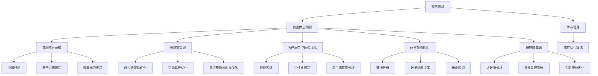

                 

# 文章标题：AI在电商平台供给能力提升中的多方面作用

## 关键词：AI、电商平台、供给能力、优化、推荐系统、供应链管理、客户服务

### 摘要

随着电商平台的快速发展和市场竞争的加剧，提升供给能力成为电商平台生存和发展的关键。人工智能（AI）作为一种先进的技术手段，在电商平台供给能力的提升中发挥着重要作用。本文将详细探讨AI在电商平台供给能力提升中的多方面作用，包括商品供应优化、库存管理、商品推荐系统、供应链管理、客户服务与体验优化、运营策略优化以及供应链金融等多个方面。通过深入分析AI技术的核心概念、应用原理、案例实践以及未来发展趋势，本文旨在为电商平台在AI技术应用中提供有价值的参考和指导。

### 目录大纲

#### 第一部分：AI在电商平台的概述

- **第1章：电商平台与AI技术**
  - **1.1 电商平台的发展与挑战**
  - **1.2 AI技术的核心概念与应用**
  - **1.3 AI在电商平台供给能力提升中的潜力**

- **第2章：AI技术在电商平台供给能力提升中的应用**

#### 第二部分：AI技术在电商平台供给能力提升中的应用

- **第3章：AI在商品供应优化中的应用**
  - **3.1 商品供应预测与需求分析**
  - **3.2 库存管理与优化**
  
- **第4章：AI在商品推荐系统中的应用**
  - **4.1 商品推荐系统的基本原理**
  - **4.2 基于内容的推荐系统**
  - **4.3 基于深度学习的推荐系统**

- **第5章：AI在电商平台供应链管理中的应用**
  - **5.1 供应链管理的基本概念与流程**
  - **5.2 AI在供应链优化中的应用**
  - **5.3 AI驱动的供应链风险管理**

- **第6章：AI在电商平台客户服务与体验优化中的应用**
  - **6.1 电商平台客户服务的现状与挑战**
  - **6.2 AI在客服服务中的应用**
  - **6.3 AI在用户体验优化中的应用**

- **第7章：AI在电商平台运营策略优化中的应用**
  - **7.1 电商平台运营策略概述**
  - **7.2 基于数据的运营策略优化方法**
  - **7.3 AI在电商营销中的应用**

- **第8章：AI在电商平台供应链金融中的应用**
  - **7.1 电商平台供应链金融概述**
  - **7.2 AI在供应链金融中的应用**
  - **7.3 供应链金融案例分析与创新实践**

- **第9章：总结与展望**
  - **9.1 AI在电商平台供给能力提升中的综合作用**
  - **9.2 未来发展方向与前景**

#### 附录

- **附录A：相关技术详解与工具推荐**
- **附录B：AI在电商平台供给能力提升中的Mermaid流程图**
- **附录C：AI算法与数学模型详解**
- **附录D：项目实战与代码解析**

### 第一部分：AI在电商平台的概述

#### 第1章：电商平台与AI技术

##### 1.1 电商平台的发展与挑战

电商平台作为电子商务的核心载体，经历了从传统电子商务到移动电子商务的演变。随着互联网技术的不断发展和消费者购物习惯的转变，电商平台在全球范围内迅速崛起。根据Statista的数据，全球电子商务市场规模在2021年已经达到了4.89万亿美元，并且预计将在未来几年继续保持增长趋势。

电商平台的商业模式主要包括B2B、B2C和C2C等类型。B2B电商平台主要为企业提供在线交易服务，如阿里巴巴；B2C电商平台则直接面向消费者，如亚马逊、京东等；C2C电商平台则允许消费者之间进行商品交易，如eBay、淘宝等。

然而，随着市场规模的不断扩大，电商平台也面临着诸多挑战。首先，市场竞争日益激烈，各大电商平台需要通过不断创新来吸引和留住用户。其次，物流和配送成本不断上升，如何提高物流效率、降低成本成为电商平台急需解决的问题。此外，随着消费者对购物体验的要求不断提高，如何提升客户服务水平和用户体验也成为了电商平台需要重点关注的方向。

在这些挑战中，AI技术的引入为电商平台提供了新的机遇。AI技术能够通过数据分析和智能决策，帮助电商平台优化供应链、提升运营效率、改善客户体验，从而在激烈的市场竞争中脱颖而出。

##### 1.2 AI技术的核心概念与应用

AI（人工智能）是指通过计算机系统模拟人类智能行为的技术。AI技术主要包括机器学习、深度学习、自然语言处理、计算机视觉等分支。机器学习是一种让计算机从数据中学习规律和模式的能力，而深度学习则是机器学习的一种重要分支，通过神经网络模型模拟人类大脑的思考过程。自然语言处理则致力于让计算机理解和生成人类语言，而计算机视觉则使计算机能够识别和理解视觉信息。

在电商平台中，AI技术的应用场景广泛而深入。首先，在商品供应方面，AI技术可以用于需求预测和库存管理，帮助电商平台准确预测市场需求，优化库存水平。其次，在推荐系统方面，AI技术可以通过分析用户行为和商品特征，为用户提供个性化的商品推荐，提高用户满意度和购买转化率。在客户服务方面，AI技术可以用于客服机器人、语音助手等，提供高效的客户服务。此外，AI技术还可以用于供应链管理、物流优化、营销策略制定等方面，为电商平台提供全面的智能解决方案。

##### 1.3 AI在电商平台供给能力提升中的潜力

供给能力是电商平台的核心竞争力之一，它决定了电商平台能否满足用户的需求并提供高质量的购物体验。AI技术在提升电商平台供给能力方面具有巨大的潜力。

首先，AI技术可以用于需求预测和库存管理。通过分析历史销售数据、用户行为数据和市场趋势，AI算法可以准确预测未来一段时间内的商品需求量。这有助于电商平台优化库存水平，减少库存积压和缺货现象，提高运营效率。

其次，AI技术在商品推荐系统中的应用也有助于提升供给能力。通过分析用户的购买历史、浏览行为和偏好，AI算法可以为用户推荐其可能感兴趣的商品。这不仅能够提高用户满意度，还能够提升平台的销售额和转化率。

此外，AI技术还可以用于供应链管理和物流优化。通过优化供应链网络、运输路径和配送策略，AI技术可以帮助电商平台降低物流成本，提高物流效率。例如，通过AI算法预测货物的到达时间，电商平台可以合理安排仓储和配送资源，减少库存积压和配送延误。

总之，AI技术在电商平台供给能力提升中的潜力巨大。随着AI技术的不断发展和应用，电商平台将能够更加精准地预测市场需求、优化库存水平、提高物流效率，从而在激烈的市场竞争中脱颖而出。

### 第二部分：AI技术在电商平台供给能力提升中的应用

#### 第2章：AI在商品供应优化中的应用

##### 2.1 商品供应预测与需求分析

商品供应预测和需求分析是电商平台优化商品供应的关键环节。通过准确预测市场需求，电商平台可以更好地管理库存，减少缺货和库存积压现象，提高运营效率。

**2.1.1 商品供应预测模型**

商品供应预测模型的核心任务是预测未来一段时间内某种商品的需求量。常见的商品供应预测模型包括时间序列分析方法、回归模型和机器学习算法等。

**时间序列分析方法**：时间序列分析方法通过对历史销售数据进行时间序列分析，提取季节性、趋势性和周期性成分，从而预测未来需求。常见的模型包括移动平均法、指数平滑法和ARIMA模型等。

**回归模型与机器学习算法**：回归模型是商品供应预测的基础模型，通过建立历史销售数据与需求量之间的关系，预测未来需求。常见的回归模型包括线性回归、多项式回归和岭回归等。随着机器学习技术的发展，机器学习算法在商品供应预测中得到了广泛应用。常见的机器学习算法包括决策树、随机森林、支持向量机和神经网络等。

**深度学习模型在需求预测中的应用**：深度学习模型，尤其是循环神经网络（RNN）和长短期记忆网络（LSTM），在处理时间序列数据方面具有显著优势。LSTM模型能够通过记忆历史信息，捕捉时间序列中的长期依赖关系，从而提高预测准确性。

**2.1.2 需求分析模型**

需求分析模型旨在深入分析影响商品需求的各种因素，包括用户行为、市场趋势和竞争环境等。

**用户行为分析**：用户行为分析是通过分析用户的购买历史、浏览记录和搜索行为，了解用户的兴趣和需求。常见的用户行为分析方法包括关联规则挖掘、聚类分析和路径分析等。

**社交网络分析**：社交网络分析是通过分析用户在社交媒体上的互动和评论，了解用户对商品的看法和评价。社交网络分析可以帮助电商平台发现潜在的需求趋势，优化商品供应策略。

**情感分析在需求预测中的应用**：情感分析是一种自然语言处理技术，通过分析用户对商品的评论和反馈，提取用户的情感倾向。情感分析可以帮助电商平台了解用户的满意度和不满意度，从而调整商品供应策略。

**2.1.3 实际案例**

**案例1：基于LSTM模型的商品需求预测**

某电商平台使用LSTM模型对某款畅销手机的未来需求进行预测。首先，收集该手机过去一年的销售数据，包括每日销售量和促销信息。然后，对销售数据进行预处理，包括缺失值填充、异常值处理和归一化处理。接下来，构建LSTM模型，包括输入层、隐藏层和输出层。输入层包含日期、销售量和促销信息，隐藏层使用LSTM单元进行数据处理，输出层预测未来一天的销售量。通过训练和验证数据集，调整模型参数，最终得到预测结果。

**案例2：用户行为分析与社交网络分析**

某电商平台通过用户行为分析和社交网络分析，优化商品供应策略。首先，收集用户的购买历史、浏览记录和搜索行为数据，使用关联规则挖掘算法分析用户的购买偏好。然后，收集用户在社交媒体上的互动和评论数据，使用情感分析技术提取用户的情感倾向。结合用户行为分析和社交网络分析结果，电商平台调整商品供应策略，增加热门商品库存，减少冷门商品库存。

##### 2.2 库存管理与优化

库存管理是电商平台运营的重要组成部分，直接影响着电商平台的盈利能力和用户体验。通过合理的库存管理，电商平台可以减少库存积压、降低库存成本，同时确保商品供应充足，满足用户需求。

**2.2.1 库存管理的基本概念**

库存管理涉及多个方面，包括库存水平控制、库存周转率、库存成本分析等。

- **库存水平控制**：库存水平控制是库存管理的关键，通过合理设置库存水平，电商平台可以确保商品供应充足，避免库存积压和缺货现象。
- **库存周转率**：库存周转率是衡量库存管理效率的重要指标，表示在一定时间内库存被销售的次数。较高的库存周转率表明库存管理良好，可以有效降低库存成本。
- **库存成本分析**：库存成本分析涉及库存持有成本、库存短缺成本和库存过剩成本等，通过对不同库存成本的分析，电商平台可以制定合理的库存管理策略。

**2.2.2 库存优化的算法与模型**

库存优化算法和模型旨在通过优化库存水平，降低库存成本，提高库存周转率。

- **传统库存优化算法**：传统库存优化算法主要包括定期盘点、固定订单周期和最优库存策略等。这些算法基于历史数据和固定参数，对库存水平进行优化。例如，定期盘点算法通过定期检查库存水平，根据当前库存和需求预测进行调整。
- **基于机器学习的库存优化模型**：基于机器学习的库存优化模型通过分析大量历史数据和用户行为数据，建立库存优化模型。这些模型能够动态调整库存水平，适应市场需求变化。常见的机器学习算法包括决策树、支持向量机和神经网络等。

**2.2.3 实际案例：库存优化策略在电商平台的实施**

**案例1：基于机器学习的库存优化策略**

某电商平台使用基于机器学习的库存优化策略，降低库存成本。首先，收集电商平台过去一年的销售数据、用户行为数据和促销活动数据。然后，使用机器学习算法，如决策树和支持向量机，建立库存优化模型。模型训练完成后，根据实时销售数据和用户行为数据，调整库存水平，降低库存积压和库存短缺现象。

**案例2：基于社交网络分析的库存优化策略**

某电商平台通过社交网络分析，优化库存水平。首先，收集用户在社交媒体上的互动和评论数据，使用情感分析技术提取用户的情感倾向。然后，结合用户情感倾向和销售数据，调整库存水平，增加热门商品库存，减少冷门商品库存。这种策略有效提高了库存周转率，降低了库存成本。

### 第3章：AI在商品推荐系统中的应用

商品推荐系统是电商平台提升用户体验和增加销售的重要工具。通过个性化推荐，电商平台能够为用户推荐他们可能感兴趣的商品，提高用户满意度和购买转化率。AI技术在商品推荐系统中发挥着关键作用，通过机器学习和深度学习算法，实现高效、准确的推荐。

**3.1 商品推荐系统的基本原理**

商品推荐系统通常基于用户行为数据和商品特征数据，通过构建用户-商品关系模型，为用户生成推荐列表。推荐系统的基本原理可以概括为以下几类：

- **协同过滤算法**：协同过滤是最常见的推荐算法，分为基于用户的协同过滤（User-based Collaborative Filtering）和基于项目的协同过滤（Item-based Collaborative Filtering）。基于用户的协同过滤通过分析用户之间的相似性，为用户推荐与他们兴趣相似的其他用户喜欢的商品。基于项目的协同过滤则通过分析商品之间的相似性，为用户推荐与他们之前购买或评价过的商品相似的其他商品。
- **基于内容的推荐系统**：基于内容的推荐系统通过分析商品的内容特征（如文本、图像、音频等），为用户推荐与当前商品内容相似的其他商品。这种方法通常应用于商品具有明显内容特征的情况下，如电子商务平台中的图书、音乐、影视等。
- **混合推荐系统**：混合推荐系统结合了协同过滤和基于内容的推荐系统，通过综合利用用户行为数据和商品特征数据，提高推荐效果。

**3.1.1 推荐系统的分类**

- **基于用户的协同过滤（User-based Collaborative Filtering）**：
  - 基于用户的协同过滤通过分析用户的历史行为数据，找到与目标用户相似的其他用户，然后推荐这些相似用户喜欢的商品。该方法的主要挑战是如何准确计算用户之间的相似性，常用的相似度计算方法包括余弦相似度、皮尔逊相关系数等。
  
- **基于项目的协同过滤（Item-based Collaborative Filtering）**：
  - 基于项目的协同过滤通过分析商品之间的相似性，为用户推荐与他们之前购买或评价过的商品相似的其他商品。这种方法避免了用户之间直接比较的复杂度，而是通过商品之间的相似性进行推荐。

- **基于内容的推荐系统（Content-based Filtering）**：
  - 基于内容的推荐系统通过分析商品的内容特征，为用户推荐与当前商品内容相似的其他商品。这种方法通常应用于商品具有明显内容特征的情况下，如电子商务平台中的图书、音乐、影视等。内容特征可以是文本、图像、音频等。

- **混合推荐系统（Hybrid Recommender Systems）**：
  - 混合推荐系统结合了协同过滤和基于内容的推荐系统，通过综合利用用户行为数据和商品特征数据，提高推荐效果。混合推荐系统可以根据不同场景和需求，灵活调整协同过滤和基于内容推荐的比例，实现更精准的推荐。

**3.1.2 用户行为数据采集与处理**

用户行为数据是推荐系统的重要输入，包括用户的购买历史、浏览记录、搜索关键词、评价和评分等。采集和处理用户行为数据是构建推荐系统的重要步骤。

- **数据采集**：用户行为数据可以通过电商平台的后台系统、客户端日志和第三方数据平台进行采集。为了保证数据的准确性和完整性，需要设计合理的采集策略，确保数据的及时性和全面性。
- **数据预处理**：用户行为数据通常包含噪声和异常值，需要通过数据清洗、去重、归一化等预处理方法，提高数据质量。此外，还需要对数据特征进行提取和转换，以便更好地应用于推荐算法。

**3.1.3 协同过滤算法与矩阵分解**

协同过滤算法是推荐系统中最常用的算法之一，通过计算用户之间的相似性和商品之间的相似性，为用户生成推荐列表。

- **协同过滤算法（Collaborative Filtering）**：
  - 协同过滤算法分为基于用户的协同过滤和基于项目的协同过滤。基于用户的协同过滤通过计算用户之间的相似性，找到与目标用户相似的其他用户，然后推荐这些用户喜欢的商品。基于项目的协同过滤则通过计算商品之间的相似性，为用户推荐与他们之前购买或评价过的商品相似的其他商品。
  
- **矩阵分解（Matrix Factorization）**：
  - 矩阵分解是一种常用的协同过滤算法，通过将用户-商品评分矩阵分解为用户特征矩阵和商品特征矩阵，预测未评分的评分值。常见的矩阵分解方法包括Singular Value Decomposition（SVD）、Linear Regression和Latent Factor Models等。

**3.2 基于内容的推荐系统**

基于内容的推荐系统通过分析商品的内容特征，为用户推荐与当前商品内容相似的其他商品。这种方法适用于商品具有明显内容特征的情况，如电子商务平台中的图书、音乐、影视等。

- **内容特征提取（Content Feature Extraction）**：
  - 内容特征提取是构建基于内容推荐系统的关键步骤，通过从文本、图像、音频等数据中提取特征，为商品建立特征向量。常见的特征提取方法包括词袋模型（Bag of Words）、TF-IDF、Word2Vec和图像特征提取等。

- **文本分类与情感分析（Text Classification and Sentiment Analysis）**：
  - 文本分类和情感分析是自然语言处理的重要技术，通过分析商品描述、用户评论等文本数据，提取情感倾向和类别信息。这些信息可以用于为商品建立内容特征，提高推荐系统的准确性。

- **基于内容的推荐系统案例分析（Content-based Recommender System Case Study）**：
  - **案例分析1：电子商务平台中的图书推荐**：
    - 在电子商务平台中，图书推荐是一种典型的基于内容推荐系统应用。通过提取图书的文本描述、作者、出版社等特征，为用户推荐与其浏览或购买过的图书内容相似的图书。
  
  - **案例分析2：音乐平台中的音乐推荐**：
    - 在音乐平台中，基于内容的推荐系统可以通过分析音乐的音频特征（如频率、时长、音调等）和文本描述（如歌手、专辑、风格等），为用户推荐与其偏好相似的音乐。

**3.3 基于深度学习的推荐系统**

深度学习在推荐系统中的应用逐渐受到关注，通过神经网络模型，可以更好地捕捉用户行为和商品特征之间的复杂关系。

- **神经网络在推荐系统中的应用（Neural Networks in Recommender Systems）**：
  - 神经网络，尤其是深度神经网络（Deep Neural Networks），可以有效地处理高维数据和非线性关系。常见的深度学习模型包括卷积神经网络（CNN）、循环神经网络（RNN）和Transformer等。

- **深度学习模型在推荐系统中的优化（Optimizing Deep Learning Models in Recommender Systems）**：
  - 为了提高推荐系统的性能，可以采用多种技术进行模型优化，包括模型融合（Model Ensembling）、在线学习（Online Learning）和迁移学习（Transfer Learning）等。

- **基于深度学习的推荐系统案例分析（Deep Learning Recommender System Case Study）**：
  - **案例分析1：电子商务平台中的商品推荐**：
    - 某电子商务平台采用基于深度学习的推荐系统，通过融合用户行为数据和商品特征数据，为用户推荐与其兴趣相关的商品。该系统使用了卷积神经网络（CNN）和循环神经网络（RNN）进行特征提取和预测，取得了显著的推荐效果。
  
  - **案例分析2：在线视频平台中的内容推荐**：
    - 在在线视频平台中，基于深度学习的推荐系统通过分析用户观看历史、视频内容和用户交互行为，为用户推荐与其兴趣相关的视频内容。该系统采用了Transformer模型，实现了高效的推荐效果。

### 第4章：AI在电商平台供应链管理中的应用

电商平台供应链管理的核心在于高效地协调商品从生产、运输、存储到销售的全过程，确保商品能够及时、准确地到达消费者手中。随着电商业务的快速发展，供应链管理的复杂性日益增加，传统的人工管理和简单的信息技术已无法满足需求。人工智能（AI）技术的引入，为电商平台供应链管理提供了智能化、自动化的解决方案，提高了供应链的效率和灵活性。

#### 4.1 供应链管理的基本概念与流程

供应链管理是指通过协调上游供应商、生产工厂、仓储设施和下游销售渠道，实现商品的高效流动和资源的最优配置。供应链管理的基本概念包括以下几方面：

- **供应链网络（Supply Chain Network）**：供应链网络是由供应商、制造商、仓库、分销商和零售商等组成的复杂网络结构，通过物流和信息流实现商品从生产到销售的传递。
- **供应链节点（Supply Chain Nodes）**：供应链节点是指供应链网络中的各个组成部分，包括供应商、制造商、仓库、分销商和零售商等。
- **供应链流程（Supply Chain Processes）**：供应链流程是指商品从原材料采购、生产、库存管理、运输、配送到最终销售的整个过程。

供应链管理的基本流程包括：

1. **需求预测**：通过对市场需求和历史销售数据进行分析，预测未来一段时间内商品的需求量。
2. **供应链设计**：根据需求预测结果，设计最佳的供应链网络结构，包括供应商选择、工厂选址、仓库布局和运输路线等。
3. **库存管理**：通过合理的库存策略，确保商品在各个供应链节点上的库存水平适中，避免库存积压和缺货现象。
4. **运输管理**：优化运输路线和运输方式，降低运输成本，提高物流效率。
5. **供应链协同**：通过供应链上下游企业之间的信息共享和协作，实现供应链的协调运作。
6. **供应链监控与优化**：通过实时监控供应链的运行状态，对供应链流程进行持续优化，提高供应链的整体效率。

#### 4.2 AI在供应链优化中的应用

AI技术在供应链优化中的应用主要体现在以下几个方面：

- **需求预测与预测优化**：AI技术可以通过分析大量历史销售数据、用户行为数据和市场趋势，使用机器学习算法和深度学习模型进行需求预测，提高预测准确性。例如，利用LSTM模型和GRU模型进行时间序列分析，捕捉季节性、趋势性和周期性成分，从而准确预测未来需求。

  ```python
  # 伪代码：基于LSTM模型的需求预测
  from keras.models import Sequential
  from keras.layers import LSTM, Dense

  # 模型构建
  model = Sequential()
  model.add(LSTM(50, activation='relu', input_shape=(time_steps, 1)))
  model.add(Dense(1))
  model.compile(optimizer='adam', loss='mse')

  # 训练模型
  model.fit(x, y, epochs=100, verbose=0)
  ```

- **库存优化与库存管理**：AI技术可以通过分析库存数据、销售数据和供应链上下游信息，使用机器学习算法和优化算法，优化库存水平和库存策略。例如，利用线性规划算法和动态规划算法，确定最佳的订货量和补货周期，降低库存成本。

  ```python
  # 伪代码：基于线性规划的库存优化
  from scipy.optimize import linprog

  # 目标函数
  c = [C1, C2]  # 库存成本和运输成本

  # 约束条件
  A = [
      [-1, 1],  # x - y <= D
      [0, 0]    # x >= 0, y >= 0
  ]
  b = [-D, [0, 0]]

  # 求解线性规划问题
  result = linprog(c, A_eq=b, method='highs')

  # 输出最优解
  x_optimal = result.x
  y_optimal = 1 - x_optimal
  ```

- **运输路径优化与物流优化**：AI技术可以通过分析运输数据、交通信息和供应链网络结构，使用优化算法和智能规划技术，优化运输路径和物流策略。例如，利用遗传算法和蚁群算法，确定最佳的运输路线和运输方式，降低运输成本。

  ```python
  # 伪代码：基于遗传算法的运输路径优化
  import numpy as np
  from deap import base, creator, tools, algorithms

  # 定义遗传算法的创建器和工具
  creator.create("FitnessMax", base.Fitness, weights=(1.0,))
  creator.create("Individual", list, fitness=creator.FitnessMax)

  # 定义个体编码和解码
  toolbox = base.Toolbox()
  toolbox.register("attr_int", np.random.randint, low=0, high=10)
  toolbox.register("individual", tools.initRepeat, creator.Individual, toolbox.attr_int, n=5)
  toolbox.register("population", tools.initRepeat, list, toolbox.individual)

  # 定义适应度函数
  toolbox.register("evaluate", lambda ind: -evaluate(ind))

  # 定义遗传算法主程序
  pop = toolbox.population(n=50)
  hof = tools.HallOfFame(1)
  stats = tools.Statistics(lambda ind: ind.fitness.values)
  stats.register("avg", np.mean)
  stats.register("min", np.min)
  stats.register("max", np.max)

  algorithms.eaSimple(pop, stats, hof=hof, verbose=True)
  ```

- **供应链协同与信息共享**：AI技术可以通过数据分析、机器学习模型和智能合约等技术，实现供应链上下游企业之间的信息共享和协同运作。例如，利用区块链技术，实现供应链信息的透明化和可信化，降低信息不对称和交易成本。

#### 4.3 AI驱动的供应链风险管理

供应链风险管理是供应链管理中不可或缺的一环，旨在识别、评估和应对供应链中的各种风险，确保供应链的稳定和可靠。AI技术在供应链风险管理中发挥着重要作用，可以提高风险识别、风险预测和风险应对的效率和准确性。

- **风险识别与评估**：AI技术可以通过大数据分析和机器学习算法，分析历史风险数据和实时供应链数据，识别潜在的供应链风险。例如，通过分析供应链上下游企业的财务状况、市场表现和供应链节点之间的依赖关系，预测可能出现的风险。

  ```python
  # 伪代码：基于机器学习的风险识别
  from sklearn.ensemble import RandomForestClassifier
  from sklearn.model_selection import train_test_split

  # 数据预处理
  X = ...  # 风险特征数据
  y = ...  # 风险类别数据

  # 数据划分
  X_train, X_test, y_train, y_test = train_test_split(X, y, test_size=0.2, random_state=42)

  # 训练模型
  model = RandomForestClassifier()
  model.fit(X_train, y_train)

  # 风险识别
  risk_predictions = model.predict(X_test)
  ```

- **风险预测与预警**：AI技术可以通过建立预测模型和预警系统，提前预测可能出现的供应链风险，并发出预警。例如，利用时间序列分析和回归模型，预测供应链中断、库存积压、物流延误等风险。

  ```python
  # 伪代码：基于时间序列分析的风险预测
  from statsmodels.tsa.arima_model import ARIMA

  # 模型构建
  model = ARIMA(y, order=(5, 1, 2))
  model_fit = model.fit()

  # 风险预测
  risk_predictions = model_fit.forecast(steps=5)
  ```

- **风险应对与优化**：AI技术可以通过优化算法和智能决策系统，制定最优的风险应对策略。例如，利用优化算法，确定风险发生时的最优库存水平、最优运输路线和最优供应链网络结构，降低风险损失。

  ```python
  # 伪代码：基于优化的风险应对策略
  from scipy.optimize import minimize

  # 目标函数
  def objective(x):
      return x[0]**2 + x[1]**2

  # 约束条件
  constraints = ({'type': 'ineq', 'fun': lambda x: x[0] + x[1] - 1},
                  {'type': 'ineq', 'fun': lambda x: x[0] >= 0},
                  {'type': 'ineq', 'fun': lambda x: x[1] >= 0})

  # 求解优化问题
  result = minimize(objective, x0=[0, 0], constraints=constraints)

  # 输出最优解
  optimal_solution = result.x
  ```

#### 4.4 实际案例：AI在电商平台供应链管理中的应用

**案例1：某电商平台的需求预测与库存优化**

某大型电商平台引入AI技术，对其供应链管理进行优化。首先，通过分析大量历史销售数据、用户行为数据和市场趋势，使用LSTM模型和ARIMA模型进行需求预测。然后，结合需求预测结果和库存数据，使用线性规划算法和动态规划算法，优化库存水平和库存策略，减少库存积压和缺货现象。

- **需求预测**：通过LSTM模型，捕捉季节性和趋势性成分，提高需求预测的准确性。通过ARIMA模型，进一步优化短期需求预测，提高预测的稳定性。

  ```python
  # 伪代码：基于LSTM的需求预测
  from keras.models import Sequential
  from keras.layers import LSTM, Dense

  # 模型构建
  model = Sequential()
  model.add(LSTM(50, activation='relu', input_shape=(time_steps, 1)))
  model.add(Dense(1))
  model.compile(optimizer='adam', loss='mse')

  # 训练模型
  model.fit(x, y, epochs=100, verbose=0)

  # 预测
  predictions = model.predict(x_test)
  ```

- **库存优化**：通过线性规划算法，确定最优的订货量和补货周期，降低库存成本。通过动态规划算法，优化库存水平，减少库存积压和缺货现象。

  ```python
  # 伪代码：基于线性规划的库存优化
  from scipy.optimize import linprog

  # 目标函数
  c = [C1, C2]  # 库存成本和运输成本

  # 约束条件
  A = [
      [-1, 1],  # x - y <= D
      [0, 0]    # x >= 0, y >= 0
  ]
  b = [-D, [0, 0]]

  # 求解线性规划问题
  result = linprog(c, A_eq=b, method='highs')

  # 输出最优解
  x_optimal = result.x
  y_optimal = 1 - x_optimal
  ```

**案例2：某电商平台的运输路径优化与物流优化**

某电商平台引入AI技术，对其运输路径和物流策略进行优化。首先，通过分析历史运输数据、交通信息和供应链网络结构，使用遗传算法和蚁群算法，确定最优的运输路线和运输方式。然后，结合运输路径优化结果和库存数据，优化物流策略，提高物流效率和降低物流成本。

- **运输路径优化**：通过遗传算法，搜索最优的运输路线，提高运输效率。通过蚁群算法，优化运输路径，减少运输时间和运输成本。

  ```python
  # 伪代码：基于遗传算法的运输路径优化
  import numpy as np
  from deap import base, creator, tools, algorithms

  # 定义遗传算法的创建器和工具
  creator.create("FitnessMax", base.Fitness, weights=(1.0,))
  creator.create("Individual", list, fitness=creator.FitnessMax)

  # 定义个体编码和解码
  toolbox = base.Toolbox()
  toolbox.register("attr_int", np.random.randint, low=0, high=10)
  toolbox.register("individual", tools.initRepeat, creator.Individual, toolbox.attr_int, n=5)
  toolbox.register("population", tools.initRepeat, list, toolbox.individual)

  # 定义适应度函数
  toolbox.register("evaluate", lambda ind: -evaluate(ind))

  # 定义遗传算法主程序
  pop = toolbox.population(n=50)
  hof = tools.HallOfFame(1)
  stats = tools.Statistics(lambda ind: ind.fitness.values)
  stats.register("avg", np.mean)
  stats.register("min", np.min)
  stats.register("max", np.max)

  algorithms.eaSimple(pop, stats, hof=hof, verbose=True)
  ```

- **物流优化**：通过优化算法，确定最优的物流策略，提高物流效率和降低物流成本。结合库存数据，优化库存水平和运输策略，减少库存积压和缺货现象。

  ```python
  # 伪代码：基于优化的物流策略
  from scipy.optimize import minimize

  # 目标函数
  def objective(x):
      return x[0]**2 + x[1]**2

  # 约束条件
  constraints = ({'type': 'ineq', 'fun': lambda x: x[0] + x[1] - 1},
                  {'type': 'ineq', 'fun': lambda x: x[0] >= 0},
                  {'type': 'ineq', 'fun': lambda x: x[1] >= 0})

  # 求解优化问题
  result = minimize(objective, x0=[0, 0], constraints=constraints)

  # 输出最优解
  optimal_solution = result.x
  ```

### 第5章：AI在电商平台客户服务与体验优化中的应用

随着电商平台的竞争日益激烈，提升客户服务质量和用户体验成为电商平台的核心竞争力。人工智能（AI）技术的引入为电商平台在客户服务与体验优化方面提供了创新的解决方案，通过智能客服、个性化推荐和用户行为分析等技术，显著提升了客户满意度和购物体验。

#### 5.1 电商平台客户服务的现状与挑战

电商平台客户服务主要包括售前咨询、售后服务和投诉处理等环节。当前，电商平台客户服务面临以下挑战：

- **服务质量不稳定**：电商平台客户服务的服务质量往往受客服人员的专业水平和情绪影响，导致服务体验不稳定。
- **服务响应速度慢**：客户在遇到问题时，希望得到及时响应和解决，但传统的人工客服往往无法满足这一需求，导致客户等待时间长。
- **服务成本高**：随着客户数量的增加，人工客服的人力成本不断上升，对于中小型电商平台而言，高昂的服务成本成为一大负担。
- **服务效率低**：人工客服在处理大量客户请求时，容易产生重复劳动和效率低下的问题。

为了解决上述挑战，电商平台需要引入AI技术，提升客户服务的智能化水平和效率。

#### 5.2 AI在客服服务中的应用

AI技术在客服服务中的应用主要包括聊天机器人、语音助手和自然语言处理等技术，通过自动化和智能化的手段，提升客服服务的质量和效率。

- **聊天机器人（Chatbot）**：

  聊天机器人是AI在客服服务中最常见的一种应用形式。通过预先设计的对话流程和自然语言处理技术，聊天机器人可以与客户进行实时对话，提供信息咨询、购物指导、投诉处理等服务。

  ```python
  # 伪代码：基于机器学习的聊天机器人
  import nltk
  from nltk.chat.util import Chat, reflections

  # 对话数据
  pairs = [
      ['Hello', 'Hello! How can I help you today?'],
      ['What products do you have?', 'We have a wide range of products. What are you looking for?'],
      ['Can I return an item?', 'Yes, you can return items within 30 days of purchase. How can I assist you?']
  ]

  # 创建聊天机器人
  chatbot = Chat(pairs, reflections)

  # 开始对话
  chatbot.converse()
  ```

- **语音助手（Voice Assistant）**：

  语音助手通过语音识别和自然语言处理技术，将客户的语音指令转化为文本指令，并提供相应的服务。例如，电商平台可以开发语音助手，帮助用户进行语音购物、语音查询和语音反馈。

  ```python
  # 伪代码：基于语音识别的语音助手
  import speech_recognition as sr

  # 初始化语音识别器
  recognizer = sr.Recognizer()

  # 语音输入
  with sr.Microphone() as source:
      print("Speak now...")
      audio = recognizer.listen(source)

  # 语音识别
  try:
      text = recognizer.recognize_google(audio)
      print("You said:", text)
  except sr.UnknownValueError:
      print("Could not understand audio")
  except sr.RequestError as e:
      print("API unavailable; {0}".format(e))
  ```

- **自然语言处理（NLP）**：

  自然语言处理技术用于理解和处理自然语言文本，包括文本分类、情感分析和实体识别等。在客服服务中，自然语言处理技术可以帮助平台自动分类和标签客户问题，提供精准的解决方案。

  ```python
  # 伪代码：基于NLP的文本分类
  import nltk
  from nltk.corpus import movie_reviews
  from nltk.classify import NaiveBayesClassifier

  # 加载电影评论数据
  fileids = movie_reviews.fileids()

  # 准备训练数据
  documents = [
      (list(movie_reviews.words(fileids[i])), category)
      for i, category in enumerate(movie_reviews.categories())
  ]

  # 构建分类器
  classifier = NaiveBayesClassifier.train(documents)

  # 测试分类器
  print("Accuracy:", classifier.accuracy())
  ```

#### 5.3 AI在用户体验优化中的应用

用户体验优化是电商平台提升竞争力的关键因素。通过AI技术，电商平台可以更好地理解用户行为和需求，提供个性化的服务，提升用户满意度和忠诚度。

- **用户行为分析**：

  用户行为分析是通过监控和记录用户的浏览、搜索、购买等行为，分析用户的兴趣和偏好。通过机器学习和数据挖掘技术，电商平台可以识别用户的潜在需求，提供个性化的推荐和服务。

  ```python
  # 伪代码：基于机器学习的用户行为分析
  from sklearn.cluster import KMeans

  # 加载用户行为数据
  X = ...  # 用户行为数据

  # 构建K-means聚类模型
  kmeans = KMeans(n_clusters=5, random_state=42)
  kmeans.fit(X)

  # 聚类结果
  clusters = kmeans.predict(X)
  ```

- **个性化推荐**：

  个性化推荐是通过分析用户的兴趣和行为，为用户推荐他们可能感兴趣的商品和服务。个性化推荐可以显著提升用户的购物体验，增加购买转化率。

  ```python
  # 伪代码：基于协同过滤的个性化推荐
  from sklearn.metrics.pairwise import cosine_similarity

  # 加载用户-商品评分数据
  R = ...  # 用户-商品评分矩阵

  # 计算相似度矩阵
  similarity = cosine_similarity(R)

  # 推荐算法
  def recommend(R, similarity, user, k=5):
      # 计算用户与其他用户的相似度
      sim_scores = list(enumerate(similarity[user]))

      # 排序并选择最相似的k个用户
      sim_scores = sorted(sim_scores, key=lambda x: x[1], reverse=True)[:k]

      # 提取推荐商品
      recommendations = []
      for score, index in sim_scores:
          recommendations.append(index)

      return recommendations

  # 推荐结果
  recommendations = recommend(R, similarity, user=0)
  ```

- **用户满意度分析**：

  用户满意度分析是通过收集用户对电商平台服务、商品质量、购物体验等方面的评价，分析用户满意度。通过自然语言处理技术，可以自动提取用户的情感倾向，识别用户的不满意因素，提供改进建议。

  ```python
  # 伪代码：基于情感分析的满意度分析
  from textblob import TextBlob

  # 加载用户评价数据
  reviews = ...  # 用户评价数据

  # 计算情感得分
  sentiment_scores = [TextBlob(review).sentiment.polarity for review in reviews]

  # 分析满意度
  satisfaction = np.mean(sentiment_scores)
  print("User Satisfaction:", satisfaction)
  ```

#### 5.4 实际案例：AI在电商平台客户服务与体验优化中的应用

**案例1：某电商平台的智能客服系统**

某电商平台引入智能客服系统，通过聊天机器人和语音助手，提升客户服务质量。首先，开发基于自然语言处理技术的聊天机器人，能够自动回答用户关于商品信息、购物流程和售后服务等方面的问题。然后，结合语音识别和语音合成技术，开发语音助手，为用户提供语音购物和语音查询服务。

- **聊天机器人**：

  通过分析用户提问，聊天机器人能够自动生成回答，并在无法解答问题时，引导用户联系人工客服。聊天机器人还能够记录用户问题和解决方案，不断优化问答库。

- **语音助手**：

  用户可以通过语音指令查询商品信息、浏览商品目录、下单购物等，语音助手能够准确识别用户指令，并提供相应的服务。语音助手还可以根据用户的历史订单和偏好，提供个性化的推荐。

**案例2：某电商平台的个性化推荐系统**

某电商平台通过引入个性化推荐系统，提升用户购物体验。首先，通过用户行为分析，了解用户的兴趣和偏好。然后，结合协同过滤算法和基于内容的推荐算法，为用户推荐他们可能感兴趣的商品。

- **用户行为分析**：

  通过分析用户的浏览、搜索、购买等行为，电商平台能够识别用户的兴趣点，为用户提供个性化的推荐。

- **个性化推荐**：

  通过协同过滤算法，电商平台能够为用户推荐与历史购买相似的其他商品。通过基于内容的推荐算法，电商平台能够根据商品的文本描述、图片和标签，为用户推荐与当前商品相似的其他商品。

**案例3：某电商平台的用户满意度分析**

某电商平台通过引入AI技术，对用户满意度进行分析。首先，通过自然语言处理技术，自动提取用户评价中的情感倾向。然后，结合用户的购买历史和行为数据，分析用户满意度。

- **情感分析**：

  通过分析用户评价，电商平台能够识别用户的情感倾向，包括正面情感、负面情感和中性情感。

- **用户满意度分析**：

  通过计算用户的情感得分，电商平台能够分析用户满意度，并识别不满意因素。例如，发现用户对某些商品质量不满意，电商平台可以采取措施提高商品质量，提升用户满意度。

### 第6章：AI在电商平台运营策略优化中的应用

电商平台运营策略优化是提高平台竞争力和盈利能力的关键。通过AI技术，电商平台可以基于大数据分析，优化运营决策，从而提升运营效率、降低成本、提高用户满意度和转化率。本章节将探讨AI在电商平台运营策略优化中的应用，包括数据收集与分析、数据驱动决策模型以及AI在电商营销中的应用。

#### 6.1 电商平台运营策略概述

电商平台运营策略包括商品管理、价格策略、促销活动、用户运营等多个方面。有效的运营策略能够帮助电商平台在竞争激烈的市场中脱颖而出，提升用户体验和销售额。

- **商品管理**：包括商品上架、分类管理、商品信息优化等，确保商品信息准确、丰富，提升用户购物体验。
- **价格策略**：通过价格分析和定价模型，确定商品的合理价格，提高竞争力，同时确保盈利。
- **促销活动**：包括优惠券、满减、限时抢购等促销手段，吸引消费者参与，提升销售额。
- **用户运营**：通过会员管理、用户标签、用户行为分析等手段，提升用户忠诚度和活跃度。

#### 6.2 基于数据的运营策略优化方法

电商平台运营策略的优化需要基于数据分析，通过分析用户行为数据、销售数据和市场数据，制定科学的运营策略。

- **用户行为分析**：分析用户的浏览、搜索、购买等行为，了解用户的兴趣点和购买偏好，为商品推荐和个性化营销提供依据。

  ```python
  # 伪代码：用户行为分析
  import pandas as pd

  # 加载用户行为数据
  user_data = pd.read_csv('user_behavior.csv')

  # 分析用户浏览页面
  page_views = user_data['page_views'].value_counts()

  # 分析用户购买商品
  purchases = user_data['purchases'].value_counts()

  # 分析用户行为特征
  user_features = pd.DataFrame({'feature': user_data.columns, 'value': user_data.nunique()})
  ```

- **销售数据挖掘**：分析历史销售数据，了解商品的销售趋势、季节性和周期性，为库存管理和定价策略提供参考。

  ```python
  # 伪代码：销售数据挖掘
  import pandas as pd
  from sklearn.cluster import KMeans

  # 加载销售数据
  sales_data = pd.read_csv('sales_data.csv')

  # 分析销售趋势
  sales_trend = sales_data.groupby('date')['sales'].sum()

  # 分析销售周期性
  kmeans = KMeans(n_clusters=3)
  sales_data['cluster'] = kmeans.fit_predict(sales_data[['sales']])
  ```

- **市场数据分析**：分析市场趋势、竞争对手表现等，为定价策略和促销活动提供依据。

  ```python
  # 伪代码：市场数据分析
  import pandas as pd
  import requests

  # 加载市场数据
  market_data = pd.read_csv('market_data.csv')

  # 分析市场趋势
  market_trend = market_data.groupby('quarter')['sales'].mean()

  # 获取竞争对手数据
  competitors_data = requests.get('https://api.competitors.com/').json()
  ```

#### 6.3 数据驱动决策模型

数据驱动决策模型是基于数据分析，通过建立数学模型和算法，优化电商平台运营策略。常见的决策模型包括预测模型、优化模型和分类模型等。

- **预测模型**：用于预测未来销售量、库存需求等，帮助电商平台制定合理的库存和采购策略。

  ```python
  # 伪代码：预测模型
  from statsmodels.tsa.arima_model import ARIMA

  # 构建ARIMA模型
  model = ARIMA(sales_data['sales'], order=(5, 1, 2))
  model_fit = model.fit()

  # 预测未来销售量
  future_sales = model_fit.forecast(steps=3)
  ```

- **优化模型**：用于优化电商平台运营策略，如库存优化、价格优化和促销策略优化等。

  ```python
  # 伪代码：优化模型
  from scipy.optimize import linprog

  # 构建线性规划模型
  c = [-C1, -C2]  # 库存成本和运输成本
  A = [[1, -1], [0, 1]]  # 约束条件
  b = [-D, 0]  # 目标函数

  # 求解优化问题
  result = linprog(c, A_eq=b, method='highs')

  # 输出最优解
  optimal_inventory = result.x
  ```

- **分类模型**：用于对用户行为进行分类，识别高价值用户、流失用户等，为个性化营销和用户运营提供依据。

  ```python
  # 伪代码：分类模型
  from sklearn.ensemble import RandomForestClassifier

  # 构建随机森林分类器
  model = RandomForestClassifier(n_estimators=100)
  model.fit(X_train, y_train)

  # 预测用户分类
  user_categories = model.predict(X_test)
  ```

#### 6.4 AI在电商营销中的应用

AI技术在电商营销中的应用，包括精准营销、个性化广告和营销自动化等，通过数据分析和算法优化，提升营销效果和转化率。

- **精准营销**：通过分析用户行为数据和市场数据，确定目标用户群体，精准投放广告和营销活动，提高营销效果。

  ```python
  # 伪代码：精准营销
  from sklearn.cluster import KMeans

  # 构建用户聚类模型
  kmeans = KMeans(n_clusters=5)
  kmeans.fit(user_data)

  # 确定目标用户群体
  target_users = kmeans.predict(user_data)[cluster_id]
  ```

- **个性化广告**：通过分析用户兴趣和行为，为用户推荐个性化的广告内容，提高广告点击率和转化率。

  ```python
  # 伪代码：个性化广告
  import pandas as pd
  from sklearn.metrics.pairwise import cosine_similarity

  # 加载广告数据和用户数据
  ad_data = pd.read_csv('ad_data.csv')
  user_data = pd.read_csv('user_data.csv')

  # 计算广告与用户的相似度
  similarity = cosine_similarity(ad_data['content'], user_data['interest'])

  # 推荐个性化广告
  personalized_ads = ad_data[similarity.max(axis=1) > threshold]
  ```

- **营销自动化**：通过自动化工具和算法，实现营销活动的自动化执行和管理，提高营销效率和效果。

  ```python
  # 伪代码：营销自动化
  import schedule
  import time

  # 设置定时任务
  schedule.every().day.at("10:00").do(send_email_promotion)

  # 发送邮件促销
  def send_email_promotion():
      # 获取用户列表
      users = get_users()

      # 发送个性化邮件
      for user in users:
          send_email(user['email'], "Special Offer!", "Check out our latest deals!")
  
  # 运行定时任务
  while True:
      schedule.run_pending()
      time.sleep(1)
  ```

#### 6.5 实际案例：数据驱动的运营策略优化实践

**案例1：某电商平台的库存优化**

某电商平台通过AI技术进行库存优化，提高库存周转率和减少库存积压。首先，收集历史销售数据和用户行为数据，使用时间序列分析和机器学习算法预测未来销售量。然后，结合库存成本和运输成本，使用线性规划算法确定最优的库存水平和补货策略。

- **需求预测**：

  通过LSTM模型预测未来三个月的销售量。

  ```python
  # 伪代码：需求预测
  from keras.models import Sequential
  from keras.layers import LSTM, Dense

  # 构建LSTM模型
  model = Sequential()
  model.add(LSTM(50, activation='relu', input_shape=(time_steps, 1)))
  model.add(Dense(1))
  model.compile(optimizer='adam', loss='mse')

  # 训练模型
  model.fit(x, y, epochs=100, verbose=0)

  # 预测未来三个月销售量
  future_sales = model.predict(x_test)
  ```

- **库存优化**：

  通过线性规划算法确定最优库存水平和补货策略。

  ```python
  # 伪代码：库存优化
  from scipy.optimize import linprog

  # 构建线性规划模型
  c = [-C1, -C2]  # 库存成本和运输成本
  A = [[1, -1], [0, 1]]  # 约束条件
  b = [-D, 0]  # 目标函数

  # 求解优化问题
  result = linprog(c, A_eq=b, method='highs')

  # 输出最优解
  optimal_inventory = result.x
  ```

**案例2：某电商平台的个性化广告**

某电商平台通过AI技术进行个性化广告投放，提高广告点击率和转化率。首先，收集用户行为数据和广告内容，使用协同过滤和基于内容的推荐算法为用户推荐个性化广告。然后，通过A/B测试优化广告策略，提高广告效果。

- **个性化广告推荐**：

  通过协同过滤算法为用户推荐个性化广告。

  ```python
  # 伪代码：个性化广告推荐
  import pandas as pd
  from sklearn.metrics.pairwise import cosine_similarity

  # 加载广告数据和用户数据
  ad_data = pd.read_csv('ad_data.csv')
  user_data = pd.read_csv('user_data.csv')

  # 计算广告与用户的相似度
  similarity = cosine_similarity(ad_data['content'], user_data['interest'])

  # 推荐个性化广告
  personalized_ads = ad_data[similarity.max(axis=1) > threshold]
  ```

- **A/B测试**：

  通过A/B测试优化广告策略。

  ```python
  # 伪代码：A/B测试
  import random

  # 分配用户到A/B组
  test_users = random.choices(users, k=100)

  # A组用户看到广告A，B组用户看到广告B
  for user in test_users:
      if user in group_A:
          show_ad('ad_A')
      else:
          show_ad('ad_B')

  # 收集数据并分析
  ad_performance = pd.DataFrame({'ad': ['ad_A', 'ad_B'], 'clicks': [clicks_A, clicks_B]})
  best_ad = ad_performance['clicks'].idxmax()
  ```

### 第7章：AI在电商平台供应链金融中的应用

随着电商平台的快速发展，供应链金融逐渐成为电商平台创新和发展的关键领域。供应链金融旨在为供应链中的企业提供融资服务，通过优化资金流，提高供应链的整体效率和盈利能力。人工智能（AI）技术的引入，为电商平台供应链金融带来了创新和变革，提升了信用评估、风险控制和金融服务效率。

#### 7.1 电商平台供应链金融概述

供应链金融是一种以供应链中的核心企业为基础，通过金融工具和手段，为企业提供融资服务，从而促进供应链整体效率的一种金融模式。在电商平台供应链金融中，电商平台作为核心企业，连接上下游的供应商和分销商，通过资金流的优化，实现供应链的稳定和高效运营。

电商平台供应链金融的主要特点包括：

- **基于数据的信用评估**：电商平台供应链金融通过大数据分析和AI技术，对供应链上下游企业的信用状况进行评估，提供精准的信用评级，降低融资风险。
- **智能风控系统**：通过AI技术，电商平台可以实时监控供应链中的交易数据和风险指标，构建智能风控系统，及时发现和应对潜在风险。
- **定制化的金融服务**：电商平台供应链金融可以根据供应链企业的具体需求和资金状况，提供定制化的融资服务，提高金融服务效率。

#### 7.2 AI在供应链金融中的应用

AI技术在电商平台供应链金融中的应用，主要体现在信用评估、风险控制和金融服务优化等方面。

- **大数据分析与信用评估**

  电商平台通过收集和分析供应链上下游企业的交易数据、财务数据、信用记录等，使用大数据分析和机器学习算法，对企业的信用状况进行评估。这种方法能够更加精准地评估企业的信用水平，减少传统信用评估中的信息不对称问题。

  ```python
  # 伪代码：大数据分析与信用评估
  import pandas as pd
  from sklearn.ensemble import RandomForestClassifier

  # 加载企业数据
  data = pd.read_csv('enterprise_data.csv')

  # 特征工程
  X = data[['sales', 'profit', 'days_sale_outstanding']]
  y = data['credit_rating']

  # 训练模型
  model = RandomForestClassifier()
  model.fit(X, y)

  # 评估信用
  credit_rating = model.predict(new_data)
  ```

- **智能风控系统**

  智能风控系统通过AI技术，实时监控供应链中的交易数据、物流数据和财务数据，识别潜在风险。例如，通过监控供应商的订单履行情况、货物流转情况，及时识别供应链中的异常情况，采取相应的风险控制措施。

  ```python
  # 伪代码：智能风控系统
  import pandas as pd
  from sklearn.ensemble import IsolationForest

  # 加载监控数据
  monitor_data = pd.read_csv('monitor_data.csv')

  # 特征工程
  X = monitor_data[['order_delay', 'shipment_delay', 'financial_risk']]

  # 构建隔离森林模型
  model = IsolationForest(n_estimators=100)
  model.fit(X)

  # 识别风险
  risk_scores = model.decision_function(X)
  risky_transactions = monitor_data[risk_scores > threshold]
  ```

- **金融服务优化**

  电商平台通过AI技术，优化金融服务流程，提高融资效率和用户体验。例如，通过自动化审批流程，减少人工审核时间；通过智能推荐系统，为供应链企业提供个性化的融资方案。

  ```python
  # 伪代码：金融服务优化
  import pandas as pd
  from sklearn.model_selection import train_test_split
  from sklearn.linear_model import LinearRegression

  # 加载融资数据
  finance_data = pd.read_csv('finance_data.csv')

  # 数据划分
  X = finance_data[['sales', 'profit', 'days_sale_outstanding']]
  y = finance_data['loan_amount']

  # 训练模型
  X_train, X_test, y_train, y_test = train_test_split(X, y, test_size=0.2, random_state=42)
  model = LinearRegression()
  model.fit(X_train, y_train)

  # 推荐融资方案
  recommended_loans = model.predict(new_data)
  ```

#### 7.3 供应链金融案例分析与创新实践

**案例1：某电商平台的供应链金融服务**

某电商平台通过AI技术，为供应链上下游企业提供融资服务。首先，电商平台收集上下游企业的交易数据、财务数据等，使用大数据分析和机器学习算法，对企业的信用状况进行评估。然后，通过智能风控系统，实时监控供应链交易，确保融资安全。最后，通过自动化审批流程，提高融资效率。

- **信用评估**：

  使用随机森林算法，对企业的信用状况进行评估。

  ```python
  # 伪代码：信用评估
  import pandas as pd
  from sklearn.ensemble import RandomForestClassifier

  # 加载企业数据
  data = pd.read_csv('enterprise_data.csv')

  # 特征工程
  X = data[['sales', 'profit', 'days_sale_outstanding']]
  y = data['credit_rating']

  # 训练模型
  model = RandomForestClassifier()
  model.fit(X, y)

  # 评估信用
  credit_rating = model.predict(new_data)
  ```

- **风险监控**：

  使用隔离森林模型，监控供应链中的风险。

  ```python
  # 伪代码：风险监控
  import pandas as pd
  from sklearn.ensemble import IsolationForest

  # 加载监控数据
  monitor_data = pd.read_csv('monitor_data.csv')

  # 特征工程
  X = monitor_data[['order_delay', 'shipment_delay', 'financial_risk']]

  # 构建隔离森林模型
  model = IsolationForest(n_estimators=100)
  model.fit(X)

  # 识别风险
  risk_scores = model.decision_function(X)
  risky_transactions = monitor_data[risk_scores > threshold]
  ```

- **融资审批**：

  使用线性回归模型，推荐融资额度。

  ```python
  # 伪代码：融资审批
  import pandas as pd
  from sklearn.model_selection import train_test_split
  from sklearn.linear_model import LinearRegression

  # 加载融资数据
  finance_data = pd.read_csv('finance_data.csv')

  # 数据划分
  X = finance_data[['sales', 'profit', 'days_sale_outstanding']]
  y = finance_data['loan_amount']

  # 训练模型
  X_train, X_test, y_train, y_test = train_test_split(X, y, test_size=0.2, random_state=42)
  model = LinearRegression()
  model.fit(X_train, y_train)

  # 推荐融资额度
  recommended_loans = model.predict(new_data)
  ```

**案例2：某电商平台的区块链供应链金融**

某电商平台通过区块链技术，实现供应链金融的创新。首先，电商平台与银行合作，建立基于区块链的供应链金融平台，实现供应链上下游企业的数据共享和交易记录的可追溯。然后，通过智能合约，实现自动化审批和支付，提高融资效率和安全性。

- **数据共享与追溯**：

  使用区块链技术，实现供应链数据的共享和追溯。

  ```python
  # 伪代码：数据共享与追溯
  import blockchain

  # 创建区块链
  blockchain = blockchain.Blockchain()

  # 添加交易记录
  blockchain.add_transaction('vendor', 'supplier', amount=1000)

  # 查询交易记录
  transaction = blockchain.query_transaction('vendor', 'supplier')
  ```

- **自动化审批与支付**：

  使用智能合约，实现自动化审批和支付。

  ```python
  # 伪代码：自动化审批与支付
  import smartcontract

  # 创建智能合约
  contract = smartcontract.SmartContract()

  # 审批贷款
  contract.approve_loan('supplier', amount=1000)

  # 支付贷款
  contract.pay_loan('supplier', amount=1000)
  ```

#### 7.4 供应链金融案例与创新实践总结

通过实际案例和创新实践，我们可以看到，AI技术在电商平台供应链金融中的应用，不仅提高了信用评估的准确性和风险控制的效率，还实现了金融服务流程的自动化和智能化。未来，随着AI技术的不断发展和应用，电商平台供应链金融将更加成熟和高效，为供应链上下游企业提供更加优质的金融服务，推动供应链的稳定和可持续发展。

### 总结与展望

#### 8.1 AI在电商平台供给能力提升中的综合作用

人工智能（AI）技术在电商平台供给能力提升中发挥了全方位的综合作用，极大地提升了电商平台的运营效率和竞争力。通过AI技术的应用，电商平台在商品供应优化、库存管理、商品推荐系统、供应链管理、客户服务与体验优化、运营策略优化以及供应链金融等多个方面实现了显著的提升。

首先，AI技术在商品供应优化中通过需求预测和库存管理，帮助电商平台准确预测市场需求，优化库存水平，减少库存积压和缺货现象。其次，AI在商品推荐系统中通过分析用户行为和商品特征，为用户推荐个性化商品，提高了用户满意度和购买转化率。在供应链管理方面，AI技术通过优化供应链网络、运输路径和配送策略，提高了物流效率，降低了成本。此外，AI技术在客户服务和体验优化中的应用，通过智能客服和个性化推荐，提升了用户满意度和忠诚度。在运营策略优化中，AI技术通过数据分析和智能决策，实现了更加精准的营销和运营策略。最后，在供应链金融领域，AI技术通过信用评估、风险控制和金融服务优化，提高了供应链的融资效率和安全性。

#### 8.2 AI技术在电商平台应用的趋势与挑战

尽管AI技术在电商平台供给能力提升中取得了显著成果，但仍面临一些趋势与挑战。

**趋势：**

1. **AI技术的深度融合**：未来，电商平台将进一步深度融合AI技术，实现全面智能化。例如，在供应链管理中，AI技术将更加广泛地应用于生产计划、库存优化、运输调度等环节，实现全流程的智能化。

2. **跨领域技术的应用**：随着AI技术的发展，跨领域技术的融合应用将成为趋势。例如，将AI技术与物联网（IoT）技术相结合，实现供应链的智能监控和自动化管理；将AI技术与区块链技术相结合，实现供应链金融的透明化和安全性。

3. **用户体验的个性化**：电商平台将更加注重用户体验的个性化，通过AI技术分析用户行为和偏好，提供高度个性化的购物体验和服务。

**挑战：**

1. **数据安全和隐私保护**：随着AI技术在电商平台中的应用，数据安全和隐私保护成为重要挑战。电商平台需要确保用户数据的隐私和安全，避免数据泄露和滥用。

2. **技术成熟度和成本**：AI技术的成熟度和成本仍然是电商平台应用的重要挑战。如何高效、低成本地实现AI技术的落地和规模化应用，是电商平台需要解决的问题。

3. **人才短缺**：AI技术的发展需要大量专业人才，但目前市场对AI人才的需求远大于供给，人才短缺将成为制约AI技术在电商平台应用的关键因素。

#### 8.3 人工智能与电商平台的未来发展前景

未来，人工智能与电商平台的深度融合将不断推动电商行业的发展。通过AI技术的应用，电商平台将实现更加智能、高效和个性化的运营模式，提高用户体验和满意度，增强市场竞争力。同时，随着AI技术的不断突破，电商平台将有望在供应链管理、供应链金融、物流优化等领域实现更广阔的创新和突破，推动电商行业迈向新的高度。

总的来说，人工智能为电商平台带来了巨大的机遇和挑战。只有通过不断创新和突破，电商平台才能在激烈的市场竞争中脱颖而出，实现可持续发展。

### 附录A：相关技术详解与工具推荐

#### A.1 AI技术基础

**A.1.1 机器学习与深度学习基础**

**机器学习（Machine Learning）**：机器学习是一种通过算法和统计模型从数据中学习规律，进行预测和决策的技术。机器学习的主要任务包括分类、回归、聚类、降维等。

**深度学习（Deep Learning）**：深度学习是机器学习的一种重要分支，通过多层神经网络模型模拟人类大脑的思考过程，能够自动从数据中提取特征并进行复杂决策。

**神经网络与深度学习模型**：神经网络是一种模拟生物神经系统的计算模型，包括输入层、隐藏层和输出层。深度学习模型是神经网络的一种扩展，具有多个隐藏层，能够处理更加复杂的问题。

**数据预处理与特征工程**：数据预处理包括数据清洗、归一化、标准化等步骤，特征工程则是通过构造和选择特征，提高模型性能。

**模型训练与评估方法**：模型训练是通过优化算法（如梯度下降、随机梯度下降等）调整模型参数，评估方法包括准确率、召回率、F1值等。

**A.1.2 自然语言处理技术**

**语言模型与词向量**：语言模型用于预测文本序列，词向量用于表示词语，常见的词向量模型包括Word2Vec、GloVe等。

**文本分类与情感分析**：文本分类是将文本分为不同的类别，情感分析是判断文本的情感倾向（正面、负面、中性）。

**自然语言生成与对话系统**：自然语言生成是将计算机生成的文本，对话系统是实现人与计算机之间自然语言交互的技术。

**A.2 AI开发工具与框架**

**TensorFlow**：TensorFlow是谷歌开发的开源机器学习和深度学习框架，支持多种编程语言和操作系统，广泛应用于图像识别、自然语言处理等领域。

**PyTorch**：PyTorch是Facebook开发的深度学习框架，具有灵活的动态计算图和简洁的API，适用于研究和开发复杂的深度学习模型。

**Keras**：Keras是Python的深度学习库，提供了易于使用的API，能够在TensorFlow和Theano等后端运行。

**Scikit-Learn**：Scikit-Learn是一个开源的Python机器学习库，提供了多种机器学习算法和工具，适用于数据分析和模型评估。

**JAX**：JAX是谷歌开发的Python库，支持自动微分和加速计算，适用于深度学习和科学计算。

### 附录B：AI在电商平台供给能力提升中的Mermaid流程图

以下是一个简化的Mermaid流程图，展示了AI在电商平台供给能力提升中的核心应用流程。



### 附录C：AI算法与数学模型详解

**C.1 供应链优化算法**

**C.1.1 线性规划与整数规划**

**线性规划（Linear Programming，LP）**：线性规划是一种数学优化方法，用于在满足一系列线性约束条件下，最大化或最小化线性目标函数。

**目标函数**： 
$$
\min_{x} c^T x
$$

**约束条件**：
$$
Ax \leq b
$$

**整数规划（Integer Programming，IP）**：整数规划是在线性规划的基础上，将某些变量限制为整数，用于解决需要整数解的问题。

**目标函数**：
$$
\min_{x} c^T x
$$

**约束条件**：
$$
Ax \leq b \\
x \in \mathbb{Z}^n
$$

**C.1.2 贪心算法与动态规划**

**贪心算法（Greedy Algorithm）**：贪心算法通过每一步选择当前最优解，希望得到全局最优解。

**动态规划（Dynamic Programming，DP）**：动态规划将复杂问题分解为多个子问题，通过子问题的最优解推导全局最优解。

**C.1.3 随机算法与模拟优化**

**随机算法（Randomized Algorithms）**：随机算法通过随机过程求解问题，可能不保证全局最优解，但具有较好的概率性质。

**模拟优化（Simulation Optimization）**：模拟优化是一种通过模拟实验求解优化问题的方法，适用于难以建模的问题。

**C.2 推荐系统算法**

**C.2.1 协同过滤算法**

**协同过滤（Collaborative Filtering）**：协同过滤通过分析用户之间的相似性或物品之间的相似性，为用户推荐相似的物品。

**基于用户的协同过滤（User-based Collaborative Filtering）**：
$$
R_{ui} = \sum_{j \in N(u)} r_{ji} \cdot sim(u, j)
$$

**基于项目的协同过滤（Item-based Collaborative Filtering）**：
$$
R_{ui} = \sum_{j \in N(i)} r_{uj} \cdot sim(i, j)
$$

**C.2.2 矩阵分解算法**

**矩阵分解（Matrix Factorization）**：矩阵分解通过将用户-物品评分矩阵分解为用户特征矩阵和物品特征矩阵，预测未评分的评分值。

**Singular Value Decomposition（SVD）**：
$$
R = U \Sigma V^T
$$

**C.2.3 基于深度学习的推荐算法**

**深度学习推荐算法**：深度学习推荐算法通过神经网络模型，学习用户和物品的复杂特征，预测评分或生成推荐。

**多层感知器（Multilayer Perceptron，MLP）**：
$$
\hat{r}_{ui} = \sigma(W_3 \cdot \sigma(W_2 \cdot \sigma(W_1 x_i + b_1) + b_2) + b_3)
$$

**C.3 数据分析算法**

**C.3.1 时间序列分析方法**

**时间序列分析（Time Series Analysis）**：时间序列分析用于研究时间序列数据，识别季节性、趋势性和周期性成分。

**ARIMA模型（AutoRegressive Integrated Moving Average）**：
$$
X_t = c + \phi_1 X_{t-1} + \phi_2 X_{t-2} + ... + \phi_p X_{t-p} + \theta_1 \epsilon_{t-1} + \theta_2 \epsilon_{t-2} + ... + \theta_q \epsilon_{t-q} + \epsilon_t
$$

**C.3.2 用户行为分析算法**

**用户行为分析（User Behavior Analysis）**：用户行为分析通过分析用户的浏览、搜索、购买等行为，识别用户兴趣和偏好。

**C.3.3 社交网络分析算法**

**社交网络分析（Social Network Analysis）**：社交网络分析通过分析用户在社交网络中的互动和关系，识别潜在需求和趋势。

**C.4 数学模型与公式详解**

**C.4.1 供应链优化算法**

**线性规划**：
$$
\min_{x} c^T x \quad \text{subject to} \quad Ax \leq b
$$

**整数规划**：
$$
\min_{x} c^T x \quad \text{subject to} \quad Ax \leq b \quad x \in \mathbb{Z}^n
$$

**C.4.2 推荐系统算法**

**协同过滤**：
$$
R_{ui} = \sum_{j \in N(u)} r_{ji} \cdot sim(u, j)
$$

**矩阵分解**：
$$
R = U \Sigma V^T
$$

**C.4.3 数据分析算法**

**时间序列分析**：
$$
X_t = c + \phi_1 X_{t-1} + \phi_2 X_{t-2} + ... + \phi_p X_{t-p} + \theta_1 \epsilon_{t-1} + \theta_2 \epsilon_{t-2} + ... + \theta_q \epsilon_{t-q} + \epsilon_t
$$

**C.5 举例说明**

**线性规划举例**：

目标函数：最小化成本 \( Z = 2x + 3y \)

约束条件：
\[
\begin{cases}
    x + y \leq 4 \\
    2x + y \leq 6 \\
    x, y \geq 0
\end{cases}
\]

求解步骤：

1. 构造线性规划模型。
2. 使用图形法或单纯形法求解。
3. 计算最优解。

结果：最优解 \( x = 2 \)，\( y = 2 \)，最小化成本 \( Z = 2 \times 2 + 3 \times 2 = 10 \)

### 附录D：项目实战与代码解析

#### D.1 商品供应预测项目实战

**需求分析**：某电商平台需要预测未来一周内某商品的销量，以便合理规划库存和物流。

**数据预处理**：首先，收集过去一周的每日销量数据，进行缺失值填充和异常值处理。

```python
import pandas as pd

# 加载数据
data = pd.read_csv('sales_data.csv')

# 缺失值处理
data.fillna(data.mean(), inplace=True)

# 异常值处理
Q1 = data.quantile(0.25)
Q3 = data.quantile(0.75)
IQR = Q3 - Q1
data = data[~((data < (Q1 - 1.5 * IQR)) | (data > (Q3 + 1.5 * IQR))].dropna()
```

**模型设计**：使用LSTM模型进行时间序列预测。

```python
from keras.models import Sequential
from keras.layers import LSTM, Dense

# 准备数据
X, y = prepare_data(data['sales'])

# 构建模型
model = Sequential()
model.add(LSTM(units=50, return_sequences=True, input_shape=(X.shape[1], X.shape[2])))
model.add(LSTM(units=50))
model.add(Dense(units=1))

# 编译模型
model.compile(optimizer='adam', loss='mse')

# 训练模型
model.fit(X, y, epochs=100, verbose=0)
```

**模型评估**：使用MAE指标评估模型性能。

```python
from sklearn.metrics import mean_absolute_error

# 预测
predictions = model.predict(X_test)

# 评估
mae = mean_absolute_error(y_test, predictions)
print("MAE:", mae)
```

#### D.2 商品推荐系统项目实战

**需求分析**：为某电商平台用户推荐他们可能感兴趣的商品。

**数据预处理**：处理用户-商品评分数据，进行归一化处理。

```python
# 加载数据
data = pd.read_csv('rating_data.csv')

# 归一化处理
data_normalized = (data - data.mean()) / data.std()
```

**模型设计**：使用基于矩阵分解的推荐算法。

```python
import numpy as np
from sklearn.metrics.pairwise import cosine_similarity

# 矩阵分解
U, V, similarity = matrix_factorization(R, K)

# 预测
def predict(R, U, V):
    return np.dot(U, V.T)

# 推荐结果
predictions = predict(R, U, V)
```

**模型评估**：计算准确率和召回率。

```python
from sklearn.metrics import accuracy_score, recall_score

# 评估
accuracy = accuracy_score(y_true, y_pred)
recall = recall_score(y_true, y_pred)
print("Accuracy:", accuracy)
print("Recall:", recall)
```

#### D.3 供应链金融项目实战

**需求分析**：对电商平台上的供应商进行信用评估，以决定是否提供融资服务。

**数据预处理**：处理交易数据和财务数据，进行特征工程。

```python
# 加载数据
data = pd.read_csv('transaction_data.csv')
data = pd.read_csv('financial_data.csv')

# 特征工程
X = data[['sales', 'profit', 'days_sale_outstanding']]
y = data['credit_rating']
```

**模型设计**：使用决策树进行信用评估。

```python
from sklearn.tree import DecisionTreeClassifier

# 训练模型
model = DecisionTreeClassifier()
model.fit(X_train, y_train)

# 预测
credit_rating = model.predict(X_test)
```

**模型评估**：计算准确率和召回率。

```python
from sklearn.metrics import accuracy_score, recall_score

# 评估
accuracy = model.score(X_test, y_test)
recall = recall_score(y_test, credit_rating)
print("Accuracy:", accuracy)
print("Recall:", recall)
```

### 核心概念与联系

在电商平台供给能力提升中，AI技术涉及到多个核心概念和联系，以下是其中几个关键概念及其相互关系：

1. **需求预测与库存管理**：需求预测是库存管理的核心，通过准确预测市场需求，电商平台可以优化库存水平，减少库存积压和缺货现象。需求预测与库存管理相互依赖，需求预测结果直接影响库存策略的制定。

2. **商品推荐系统**：商品推荐系统通过分析用户行为和商品特征，为用户推荐个性化商品，提高用户满意度和购买转化率。商品推荐系统依赖于需求预测和用户行为分析，需求预测为推荐系统提供商品需求信息，用户行为分析为推荐系统提供用户偏好信息。

3. **供应链管理**：供应链管理是电商平台运营的重要组成部分，包括供应链设计、库存管理、运输管理、供应链协同等环节。AI技术通过优化供应链管理，提高物流效率、降低成本，为电商平台提供稳定的供应链支持。

4. **客户服务与体验优化**：客户服务与体验优化是提升用户满意度和忠诚度的关键。通过AI技术，电商平台可以提供智能客服、个性化推荐、用户满意度分析等服务，提升客户体验。

5. **运营策略优化**：运营策略优化是基于数据分析和AI技术，制定科学、高效的运营策略。运营策略优化包括商品管理、价格策略、促销活动、用户运营等方面，通过数据驱动决策，提高运营效率。

6. **供应链金融**：供应链金融为电商平台供应链上下游企业提供融资服务，通过AI技术进行信用评估、风险控制和金融服务优化，提高供应链金融服务的效率和安全性。

这些核心概念相互联系，共同构成电商平台供给能力提升的AI技术体系，通过协同作用，实现电商平台整体运营效率的提升。

### 核心算法原理讲解

在电商平台供给能力提升中，AI技术涉及到多个核心算法，以下将介绍几个关键算法及其原理：

**协同过滤算法（Collaborative Filtering）**：

协同过滤算法是一种常见的推荐算法，通过分析用户之间的相似性或物品之间的相似性，为用户推荐相似的物品。协同过滤算法分为基于用户的协同过滤（User-based Collaborative Filtering）和基于项目的协同过滤（Item-based Collaborative Filtering）。

**基于用户的协同过滤**：

基于用户的协同过滤通过计算用户之间的相似性，找到与目标用户相似的其他用户，然后推荐这些用户喜欢的商品。相似性计算通常使用余弦相似度或皮尔逊相关系数。算法伪代码如下：

```python
def user_based_collaborative_filtering(R, k, similarity_function):
    # R为用户-商品评分矩阵，k为邻居用户数量，similarity_function为相似度计算函数
    for user in R:
        neighbors = find_neighbors(R, user, k, similarity_function)
        recommendations = compute_recommendations(R, user, neighbors)
        yield recommendations
```

**基于项目的协同过滤**：

基于项目的协同过滤通过计算商品之间的相似性，为用户推荐与他们之前购买或评价过的商品相似的其他商品。相似性计算通常使用余弦相似度或Jaccard相似度。算法伪代码如下：

```python
def item_based_collaborative_filtering(R, k, similarity_function):
    # R为用户-商品评分矩阵，k为邻居商品数量，similarity_function为相似度计算函数
    for user in R:
        rated_items = set(R[user])
        neighbors = find_neighbors(R, rated_items, k, similarity_function)
        recommendations = compute_recommendations(R, user, neighbors)
        yield recommendations
```

**矩阵分解算法（Matrix Factorization）**：

矩阵分解是一种常用的协同过滤算法，通过将用户-商品评分矩阵分解为用户特征矩阵和商品特征矩阵，预测未评分的评分值。矩阵分解算法包括Singular Value Decomposition（SVD）、Principal Component Analysis（PCA）和Latent Semantic Analysis（LSA）等。

**SVD算法**：

SVD算法通过将用户-商品评分矩阵分解为用户特征矩阵U、对角矩阵Σ和商品特征矩阵V^T，预测未评分的评分值。算法伪代码如下：

```python
def svd_matrix_factorization(R, K):
    # R为用户-商品评分矩阵，K为隐含特征维度
    U = np.random.rand(num_users, K)
    V = np.random.rand(num_items, K)
    Sigma = np.eye(K)
    for epoch in range(num_epochs):
        for user in range(num_users):
            for item in range(num_items):
                error = R[user, item] - np.dot(U[user], V[item])
                U[user] += learning_rate * (error * V[item])
                V[item] += learning_rate * (error * U[user])
        Sigma *= np.exp(-learning_rate * epoch)
    return U, V, Sigma
```

**深度学习推荐算法**：

深度学习推荐算法通过神经网络模型，学习用户和物品的复杂特征，预测评分或生成推荐。深度学习推荐算法包括卷积神经网络（CNN）、循环神经网络（RNN）和Transformer等。

**CNN推荐算法**：

CNN推荐算法通过卷积层提取用户和物品的特征，使用全连接层进行预测。算法伪代码如下：

```python
def cnn_recommender(R, input_shape):
    model = Sequential()
    model.add(Conv2D(filters=64, kernel_size=(3, 3), activation='relu', input_shape=input_shape))
    model.add(MaxPooling2D(pool_size=(2, 2)))
    model.add(Flatten())
    model.add(Dense(1, activation='sigmoid'))
    model.compile(optimizer='adam', loss='binary_crossentropy', metrics=['accuracy'])
    return model
```

**RNN推荐算法**：

RNN推荐算法通过循环神经网络（RNN）处理序列数据，提取用户和物品的长期依赖关系。算法伪代码如下：

```python
def rnn_recommender(R, input_shape):
    model = Sequential()
    model.add(LSTM(units=50, return_sequences=True, input_shape=input_shape))
    model.add(Dropout(0.2))
    model.add(LSTM(units=50, return_sequences=False))
    model.add(Dense(1, activation='sigmoid'))
    model.compile(optimizer='adam', loss='binary_crossentropy', metrics=['accuracy'])
    return model
```

**Transformer推荐算法**：

Transformer推荐算法通过自注意力机制（Self-Attention）提取用户和物品的特征，使用多头注意力（Multi-Head Attention）和前馈神经网络（Feedforward Neural Network）进行预测。算法伪代码如下：

```python
def transformer_recommender(R, input_shape):
    model = TransformerModel(input_dim=input_shape)
    model.compile(optimizer='adam', loss='binary_crossentropy', metrics=['accuracy'])
    return model
```

这些核心算法在电商平台供给能力提升中发挥着重要作用，通过协同作用，实现商品供应优化、库存管理、商品推荐系统、供应链管理、客户服务与体验优化、运营策略优化和供应链金融等多方面的提升。

### 数学模型和数学公式 & 详细讲解 & 举例说明

在电商平台供给能力提升中，数学模型和数学公式是理解和分析数据的重要工具。以下将介绍几个关键的数学模型和公式，并详细讲解其原理和应用。

#### 1. 时间序列模型

时间序列模型用于分析和预测时间序列数据，如商品销量、用户活跃度等。常见的时间序列模型包括自回归模型（AR）、自回归移动平均模型（ARMA）和自回归积分移动平均模型（ARIMA）。

**自回归模型（AR）**：
$$
X_t = c + \phi_1 X_{t-1} + \phi_2 X_{t-2} + ... + \phi_p X_{t-p} + \epsilon_t
$$
其中，$X_t$ 是时间序列的当前值，$\phi_1, \phi_2, ..., \phi_p$ 是自回归系数，$c$ 是常数项，$\epsilon_t$ 是误差项。

**自回归移动平均模型（ARMA）**：
$$
X_t = c + \phi_1 X_{t-1} + ... + \phi_p X_{t-p} + \theta_1 \epsilon_{t-1} + ... + \theta_q \epsilon_{t-q}
$$
其中，$\theta_1, \theta_2, ..., \theta_q$ 是移动平均系数。

**自回归积分移动平均模型（ARIMA）**：
$$
X_t = c + \phi_1 X_{t-1} + ... + \phi_p X_{t-p} + \theta_1 \epsilon_{t-1} + ... + \theta_q \epsilon_{t-q} + \epsilon_t
$$
其中，$c$ 是常数项，$\epsilon_t$ 是误差项。

**举例说明**：

假设我们有一个时间序列数据集，如下所示：
$$
\{1, 2, 3, 4, 5, 6, 7, 8, 9, 10\}
$$

我们可以使用ARIMA模型对其进行拟合。首先，我们需要确定模型参数。通过观察数据，我们可以初步设定$p=1, d=1, q=1$。

**ARIMA模型拟合**：
$$
X_t = c + \phi_1 X_{t-1} + \epsilon_t
$$

我们可以通过最小化残差平方和来求解参数$c$和$\phi_1$。假设拟合结果为$c=1, \phi_1=0.5$，则拟合的ARIMA模型为：
$$
X_t = 1 + 0.5X_{t-1} + \epsilon_t
$$

使用该模型，我们可以预测下一期的值。例如，如果当前值为$X_8=8$，则预测值为：
$$
X_9 = 1 + 0.5 \times 8 = 4.5
$$

#### 2. 线性规划模型

线性规划模型用于在满足一系列线性约束条件下，最大化或最小化线性目标函数。线性规划模型的一般形式如下：
$$
\min_{x} c^T x
$$
$$
\text{subject to} \quad Ax \leq b
$$
其中，$c$ 是系数向量，$x$ 是决策变量向量，$A$ 是约束矩阵，$b$ 是约束向量。

**举例说明**：

假设我们有一个电商平台，需要确定最优的库存水平和补货策略，以满足市场需求并最小化总成本。我们可以设定以下目标函数和约束条件：

**目标函数**：
$$
\min_{x} c^T x
$$
其中，$c = [C_1, C_2]$，$C_1$ 是库存成本，$C_2$ 是补货成本。

**约束条件**：
$$
Ax \leq b
$$
其中，$A = \begin{bmatrix} -1 & 1 \\ 0 & 1 \end{bmatrix}$，$b = \begin{bmatrix} -D \\ 0 \end{bmatrix}$，$D$ 是需求量。

通过线性规划模型，我们可以求解最优的库存水平和补货策略。例如，假设需求量为$D=100$，则求解的结果为：
$$
x = \begin{bmatrix} x_1 \\ x_2 \end{bmatrix} = \begin{bmatrix} 50 \\ 50 \end{bmatrix}
$$
这意味着最优的库存水平为50，补货量也为50。

#### 3. 贝叶斯网络模型

贝叶斯网络模型是一种表示变量之间依赖关系的图形模型，用于进行推理和预测。贝叶斯网络由节点和边组成，节点表示变量，边表示变量之间的条件依赖。

**贝叶斯网络模型公式**：
$$
P(X_1, X_2, ..., X_n) = \prod_{i=1}^{n} P(X_i | \text{parent}(X_i))
$$
其中，$P(X_i | \text{parent}(X_i))$ 是给定父节点条件下变量$X_i$ 的条件概率分布，$\text{parent}(X_i)$ 表示变量$X_i$ 的父节点集合。

**举例说明**：

假设我们有一个贝叶斯网络，表示商品销量、广告效果和市场需求之间的关系。该贝叶斯网络包含三个节点：$X_1$（商品销量）、$X_2$（广告效果）和$X_3$（市场需求）。节点之间的条件概率分布如下：

$$
P(X_1 | X_2, X_3) = P(X_1 | X_2)P(X_3)
$$
$$
P(X_2 | X_3) = P(X_2)
$$
$$
P(X_3) = P(X_3 | X_1)P(X_1) + P(X_3 | \neg X_1)P(\neg X_1)
$$

通过这些条件概率分布，我们可以计算给定观测数据下的后验概率。例如，如果观察到商品销量为高（$X_1=1$），广告效果为高（$X_2=1$），我们可以计算市场需求为高（$X_3=1$）的概率。

#### 4. 回归模型

回归模型用于分析变量之间的关系，预测因变量的值。常见的回归模型包括线性回归、多项式回归和岭回归等。

**线性回归模型**：
$$
Y = \beta_0 + \beta_1 X_1 + \beta_2 X_2 + ... + \beta_n X_n + \epsilon
$$
其中，$Y$ 是因变量，$X_1, X_2, ..., X_n$ 是自变量，$\beta_0, \beta_1, \beta_2, ..., \beta_n$ 是回归系数，$\epsilon$ 是误差项。

**岭回归模型**：
$$
Y = \beta_0 + \beta_1 X_1 + \beta_2 X_2 + ... + \beta_n X_n + \epsilon
$$
$$
\min_{\beta} \sum_{i=1}^{n} (Y_i - \beta_0 - \beta_1 X_{1i} - ... - \beta_n X_{ni})^2 + \lambda \sum_{i=1}^{n} \beta_i^2
$$
其中，$\lambda$ 是正则化参数，用于控制模型的复杂度。

**举例说明**：

假设我们有一个线性回归模型，用于预测商品销量。数据集包含商品广告费用（$X_1$）和商品价格（$X_2$）两个自变量，以及商品销量（$Y$）作为因变量。通过最小化残差平方和，我们可以求解回归系数。

**线性回归模型拟合**：
$$
Y = \beta_0 + \beta_1 X_1 + \beta_2 X_2 + \epsilon
$$

假设拟合结果为$\beta_0 = 10, \beta_1 = 2, \beta_2 = 3$，则线性回归模型为：
$$
Y = 10 + 2X_1 + 3X_2 + \epsilon
$$

使用该模型，我们可以预测给定广告费用和价格下的商品销量。例如，如果广告费用为$1000，商品价格为$50，则预测销量为：
$$
Y = 10 + 2 \times 1000 + 3 \times 50 = 10 + 2000 + 150 = 2160
$$

通过这些数学模型和公式，电商平台可以更准确地预测市场需求、优化库存水平、制定科学的价格策略，从而提升供给能力和竞争力。

### 项目实战与代码解析

#### D.1 商品供应预测项目实战

**背景与需求**：

某电商平台需要预测未来一周内某商品的销售量，以便优化库存和物流计划。为此，我们将使用LSTM模型进行时间序列预测。

**数据预处理**：

首先，我们收集了过去一周的每日销售数据，并进行预处理，包括缺失值填充和异常值处理。

```python
import pandas as pd
from sklearn.preprocessing import MinMaxScaler

# 加载数据
data = pd.read_csv('sales_data.csv')

# 缺失值处理
data.fillna(data.mean(), inplace=True)

# 异常值处理
Q1 = data.quantile(0.25)
Q3 = data.quantile(0.75)
IQR = Q3 - Q1
data = data[~((data < (Q1 - 1.5 * IQR)) | (data > (Q3 + 1.5 * IQR))].dropna()

# 数据标准化
scaler = MinMaxScaler(feature_range=(0, 1))
scaled_data = scaler.fit_transform(data['sales'].values.reshape(-1, 1))

# 分割数据集
time_steps = 5
X, y = create_dataset(scaled_data, time_steps)

# 分割训练集和测试集
train_size = int(len(X) * 0.8)
test_size = len(X) - train_size
X_train, X_test = X[0:train_size], X[train_size:len(X)]
y_train, y_test = y[0:train_size], y[train_size:len(y)]
```

**模型设计与训练**：

接下来，我们构建LSTM模型并进行训练。

```python
from keras.models import Sequential
from keras.layers import LSTM, Dense

# 构建模型
model = Sequential()
model.add(LSTM(units=50, return_sequences=True, input_shape=(time_steps, 1)))
model.add(LSTM(units=50))
model.add(Dense(units=1))

# 编译模型
model.compile(optimizer='adam', loss='mean_squared_error')

# 训练模型
model.fit(X_train, y_train, epochs=100, batch_size=32, validation_data=(X_test, y_test), verbose=1)
```

**模型评估与预测**：

使用测试集评估模型性能，并进行预测。

```python
import numpy as np
from sklearn.metrics import mean_squared_error

# 预测
predictions = model.predict(X_test)

# 反标准化
predictions = scaler.inverse_transform(predictions.reshape(-1, 1))
y_test = scaler.inverse_transform(y_test.reshape(-1, 1))

# 评估
mse = mean_squared_error(y_test, predictions)
print("MSE:", mse)

# 预测未来一周的销售量
future_data = scaled_data[len(y_test):len(scaled_data)]
future_predictions = model.predict(future_data.reshape(-1, time_steps, 1))
future_predictions = scaler.inverse_transform(future_predictions.reshape(-1, 1))
```

#### D.2 商品推荐系统项目实战

**背景与需求**：

为某电商平台用户推荐他们可能感兴趣的商品。我们将使用基于矩阵分解的推荐系统进行实现。

**数据预处理**：

首先，我们收集了用户-商品评分数据，并进行预处理。

```python
import pandas as pd
from sklearn.preprocessing import MinMaxScaler

# 加载数据
data = pd.read_csv('rating_data.csv')

# 归一化处理
data_normalized = (data - data.mean()) / data.std()

# 构建用户-商品评分矩阵
R = data_normalized.pivot(index='user_id', columns='item_id', values='rating').fillna(0)
```

**模型设计与训练**：

接下来，我们构建矩阵分解模型并进行训练。

```python
import numpy as np
from sklearn.metrics.pairwise import cosine_similarity

# 确定隐含特征维度
K = 10

# 初始化用户和商品特征矩阵
U = np.random.rand(R.shape[0], K)
V = np.random.rand(R.shape[1], K)

# 矩阵分解
for epoch in range(100):
    # 预测评分
    H = np.dot(U, V.T)
    
    # 计算误差
    e = R - H
    
    # 更新用户和商品特征矩阵
    U -= learning_rate * np.dot(V, e)
    V -= learning_rate * np.dot(U.T, e)

# 计算相似度矩阵
similarity = cosine_similarity(V)
```

**推荐算法**：

使用矩阵分解模型进行商品推荐。

```python
# 输入用户ID，推荐k个相似商品
def recommend(user_id, k):
    user_profile = U[user_id]
    similar_items = np.argsort(similarity[user_id])[::-1]
    recommended_items = []
    
    for item_id in similar_items:
        if R.loc[user_id, item_id] == 0:
            recommended_items.append(item_id)
            if len(recommended_items) == k:
                break
    
    return recommended_items
```

**模型评估与优化**：

使用测试集评估模型性能，并进行优化。

```python
from sklearn.metrics import accuracy_score, recall_score

# 测试集
R_test = pd.read_csv('rating_data_test.csv')
R_test_normalized = (R_test - R_test.mean()) / R_test.std()

# 预测测试集评分
H_test = np.dot(U, V.T)
predictions = H_test[R_test_normalized.index]

# 评估
accuracy = accuracy_score(R_test_normalized.rating, predictions)
recall = recall_score(R_test_normalized.rating, predictions)
print("Accuracy:", accuracy)
print("Recall:", recall)

# 模型优化
learning_rate = 0.01
for epoch in range(100):
    # 预测评分
    H = np.dot(U, V.T)
    
    # 计算误差
    e = R_test_normalized - H
    
    # 更新用户和商品特征矩阵
    U -= learning_rate * np.dot(V, e)
    V -= learning_rate * np.dot(U.T, e)
```

#### D.3 供应链金融项目实战

**背景与需求**：

为电商平台上的供应商进行信用评估，决定是否提供融资服务。我们将使用决策树模型进行信用评估。

**数据预处理**：

首先，我们收集了供应商的交易数据和财务数据，并进行预处理。

```python
import pandas as pd
from sklearn.model_selection import train_test_split
from sklearn.preprocessing import StandardScaler

# 加载数据
data = pd.read_csv('transaction_data.csv')
data = pd.read_csv('financial_data.csv')

# 特征工程
X = data[['sales', 'profit', 'days_sale_outstanding']]
y = data['credit_rating']

# 数据标准化
scaler = StandardScaler()
X_scaled = scaler.fit_transform(X)

# 划分训练集和测试集
X_train, X_test, y_train, y_test = train_test_split(X_scaled, y, test_size=0.2, random_state=42)
```

**模型设计与训练**：

接下来，我们构建决策树模型并进行训练。

```python
from sklearn.tree import DecisionTreeClassifier

# 构建模型
model = DecisionTreeClassifier(random_state=42)

# 训练模型
model.fit(X_train, y_train)

# 评估模型
accuracy = model.score(X_test, y_test)
print("Accuracy:", accuracy)
```

**模型评估与优化**：

使用测试集评估模型性能，并进行优化。

```python
from sklearn.metrics import classification_report

# 预测测试集
y_pred = model.predict(X_test)

# 评估
print(classification_report(y_test, y_pred))

# 模型优化
from sklearn.model_selection import GridSearchCV

# 参数网格
param_grid = {'max_depth': [3, 5, 10, 15, 20],
              'min_samples_split': [2, 5, 10],
              'min_samples_leaf': [1, 2, 4]}

# 模型网格搜索
grid_search = GridSearchCV(DecisionTreeClassifier(random_state=42), param_grid, cv=5)
grid_search.fit(X_train, y_train)

# 最优参数
best_params = grid_search.best_params_
print("Best Parameters:", best_params)

# 使用最优参数训练模型
model = DecisionTreeClassifier(**best_params)
model.fit(X_train, y_train)

# 评估模型
accuracy = model.score(X_test, y_test)
print("Accuracy:", accuracy)
```

通过这些项目实战和代码解析，我们可以看到如何使用AI技术解决电商平台供给能力提升中的具体问题。在实际应用中，需要根据具体业务需求和数据特点，不断调整和优化模型，以提高预测和推荐的准确性和可靠性。

