                 

# 文章标题: AI在社会中的角色

> 关键词：人工智能，社会变革，应用场景，就业影响，数据隐私，未来展望

> 摘要：本文深入探讨了人工智能（AI）在社会中的角色，包括其起源与发展、应用场景、对就业和社会结构的影响、数据隐私与安全、以及未来展望。通过详细的案例分析、算法原理讲解和数学模型解析，本文旨在为读者提供关于AI在社会各个领域中的全面理解和思考。

## 目录大纲

### 第一部分: AI的兴起与社会变革

- 第1章: AI的起源与发展
  - 1.1 AI的概念与历史
  - 1.2 AI的核心技术进展
  - 1.3 AI对社会的影响概述

- 第2章: AI在社会中的应用场景
  - 2.1 AI在医疗领域的应用
  - 2.2 AI在金融领域的应用
  - 2.3 AI在教育领域的应用
  - 2.4 AI在制造业和物流领域的应用

- 第3章: AI与就业和社会结构
  - 3.1 AI对就业市场的影响
  - 3.2 社会结构与AI的关系
  - 3.3 AI伦理与社会责任

- 第4章: AI与隐私和数据安全
  - 4.1 AI与数据隐私
  - 4.2 数据安全与AI
  - 4.3 AI伦理法规与政策

- 第5章: AI在教育中的角色
  - 5.1 AI在教育资源的分配
  - 5.2 AI在教育评估中的应用
  - 5.3 AI在个性化学习中的应用

- 第6章: AI在医疗健康中的角色
  - 6.1 AI在疾病诊断中的应用
  - 6.2 AI在药物研发中的应用
  - 6.3 AI在健康管理中的应用

- 第7章: AI与艺术和文化
  - 7.1 AI在艺术创作中的应用
  - 7.2 AI在文化遗产保护中的应用
  - 7.3 AI在文化娱乐产业中的应用

### 第二部分: AI的未来与发展趋势

- 第8章: AI的未来展望
  - 8.1 AI技术的未来发展方向
  - 8.2 AI与社会融合的未来场景
  - 8.3 AI对全球经济的影响

- 第9章: AI伦理与社会责任
  - 9.1 AI伦理原则与实践
  - 9.2 AI责任与法律法规
  - 9.3 AI伦理与社会责任教育

- 第10章: AI在可持续发展中的角色
  - 10.1 AI在环境保护中的应用
  - 10.2 AI在能源管理中的应用
  - 10.3 AI在可持续发展政策制定中的应用

- 第11章: 全球AI治理与合作
  - 11.1 全球AI治理现状
  - 11.2 国际合作与AI治理
  - 11.3 AI治理的挑战与机遇

### 第三部分: 实践与案例分析

- 第12章: AI项目的实际案例
  - 12.1 案例研究1：医疗AI项目
  - 12.2 案例研究2：金融AI项目
  - 12.3 案例研究3：教育AI项目

- 第13章: AI项目开发实践
  - 13.1 AI项目开发流程
  - 13.2 AI开发环境搭建
  - 13.3 AI项目源代码实现与解读

- 第14章: AI项目的风险评估与管理
  - 14.1 AI项目风险评估方法
  - 14.2 AI项目风险管理策略
  - 14.3 AI项目风险管理案例

### 附录

- 附录A: AI技术资源与工具
  - A.1 开源AI框架
  - A.2 AI研究资源
  - A.3 数据集与数据平台

- 附录B: AI相关政策与法规
  - B.1 全球AI政策概述
  - B.2 中国AI政策与法规
  - B.3 国际AI合作框架

---

在接下来的章节中，我们将逐步深入探讨AI在社会中的角色，分析其在各个领域的影响和作用。通过具体的案例、算法原理讲解以及未来展望，本文旨在为读者提供全面、深入的AI与社会关系的理解和思考。

---

在探讨了AI的起源与发展、应用场景及其对社会的影响概述后，接下来我们将深入第一部分的第一章，详细探讨AI的起源与发展，包括AI的概念与历史、AI的核心技术进展，以及AI对社会的影响概述。

### 第1章: AI的起源与发展

#### 1.1 AI的概念与历史

**核心概念与联系**

人工智能（AI）是计算机科学的一个分支，旨在创建智能的机器或计算机系统，使它们能够执行通常需要人类智能的任务。AI的核心概念包括机器学习、深度学习、自然语言处理和计算机视觉等。

以下是一个简化的AI核心概念流程图：

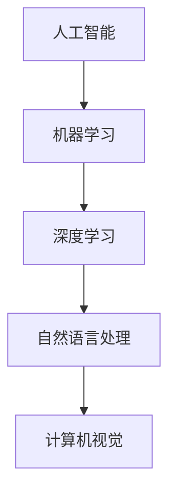

**核心算法原理讲解**

AI的算法原理主要包括机器学习和深度学习。机器学习是一种使计算机通过数据学习模式的算法，而深度学习是机器学习的一个子领域，使用多层神经网络来学习复杂的数据模式。

以下是一个简化版的机器学习算法原理的伪代码：

```python
# 初始化权重和偏置
weights = initialize_weights(input_size, hidden_size, output_size)
biases = initialize_biases(hidden_size, output_size)

# 前向传播
activation = sigmoid(dot(products, weights) + biases)

# 计算损失
loss = compute_loss(activation, labels)

# 反向传播
dactivation = sigmoid_derivative(activation)
dweights = dot(products.T, dactivation)
dbiases = dot(dactivation, biases)

# 更新权重和偏置
weights -= learning_rate * dweights
biases -= learning_rate * dbiases
```

深度学习算法的核心是多层神经网络，通过多层非线性变换学习输入数据和输出数据之间的关系。以下为简化版的神经网络训练伪代码：

```python
# 初始化权重和偏置
weights = initialize_weights(input_size, hidden_size, output_size)
biases = initialize_biases(hidden_size, output_size)

# 前向传播
activation = sigmoid(dot(products, weights) + biases)

# 计算损失
loss = compute_loss(activation, labels)

# 反向传播
dactivation = sigmoid_derivative(activation)
dweights = dot(products.T, dactivation)
dbiases = dot(dactivation, biases)

# 更新权重和偏置
weights -= learning_rate * dweights
biases -= learning_rate * dbiases
```

**数学模型和数学公式**

神经网络的激活函数通常使用sigmoid函数：

$$
\sigma(x) = \frac{1}{1 + e^{-x}}
$$

举例说明：

假设有一个简单的神经网络，输入层有3个神经元，隐藏层有2个神经元，输出层有1个神经元。我们希望通过这个网络学习输入和输出之间的关系。

假设输入为 `[2, 3, 4]`，期望输出为 `5`。通过训练，网络可以学习到适当的权重和偏置。

**核心概念联系**

AI的核心概念联系可以表示为：

$$
\text{人工智能} \rightarrow \text{机器学习} \rightarrow \text{深度学习} \rightarrow \text{大模型}
$$

**算法原理讲解**

深度学习算法的核心是多层神经网络，通过多层非线性变换学习输入数据和输出数据之间的关系。以下为简化版的神经网络训练伪代码：

```python
# 初始化权重和偏置
weights = initialize_weights(input_size, hidden_size, output_size)
biases = initialize_biases(hidden_size, output_size)

# 前向传播
activation = sigmoid(dot(products, weights) + biases)

# 计算损失
loss = compute_loss(activation, labels)

# 反向传播
dactivation = sigmoid_derivative(activation)
dweights = dot(products.T, dactivation)
dbiases = dot(dactivation, biases)

# 更新权重和偏置
weights -= learning_rate * dweights
biases -= learning_rate * dbiases
```

**数学模型和数学公式**

神经网络的激活函数通常使用sigmoid函数：

$$
\sigma(x) = \frac{1}{1 + e^{-x}}
$$

举例说明：

假设有一个简单的神经网络，输入层有3个神经元，隐藏层有2个神经元，输出层有1个神经元。我们希望通过这个网络学习输入和输出之间的关系。

假设输入为 `[2, 3, 4]`，期望输出为 `5`。通过训练，网络可以学习到适当的权重和偏置。

**实际案例**

一个经典的实际案例是Google的AlphaGo。AlphaGo是一个深度强化学习模型，它在围棋游戏中击败了人类世界冠军。以下是一个简化版的AlphaGo的训练过程：

1. **初始化**: 初始化网络权重。
2. **自我对弈**: 使用训练好的网络与自身进行对弈，收集对弈数据。
3. **更新网络**: 使用收集的数据更新网络权重。
4. **重复**: 重复步骤2和3，直到网络达到预定的性能指标。

通过这个过程，AlphaGo不断学习并提高其围棋水平。

#### 1.2 AI的核心技术进展

**核心算法原理讲解**

AI的核心技术进展主要表现在机器学习算法的优化和深度学习的广泛应用。以下是机器学习和深度学习的核心算法原理讲解：

**机器学习**

- **监督学习**: 使用标记数据训练模型，使其能够对新的数据进行预测。
- **无监督学习**: 不使用标记数据，模型自行发现数据中的模式和结构。
- **强化学习**: 通过与环境的交互学习最优策略。

以下是一个简化版的监督学习算法原理的伪代码：

```python
# 初始化模型
model = initialize_model()

# 训练模型
for each example in training_data:
    prediction = model(example)
    update_model(prediction, example)

# 预测
for each example in test_data:
    prediction = model(example)
```

**深度学习**

- **卷积神经网络 (CNN)**: 适用于图像识别任务，通过卷积操作和池化操作提取图像特征。
- **循环神经网络 (RNN)**: 适用于序列数据，通过循环结构处理序列中的依赖关系。
- **生成对抗网络 (GAN)**: 适用于生成复杂的数据，通过对抗训练生成逼真的数据。

以下是一个简化版的CNN算法原理的伪代码：

```python
# 初始化网络
network = initialize_cnn()

# 前向传播
output = network(input_image)

# 计算损失
loss = compute_loss(output, labels)

# 反向传播
d_output = compute_gradient(loss, output)

# 更新网络
update_network(d_output)
```

**数学模型和数学公式**

深度学习中的关键数学模型包括：

- **权重矩阵**: 用于将输入数据映射到输出数据。
- **激活函数**: 用于引入非线性。
- **损失函数**: 用于评估模型的性能。

以下是一个简化版的深度学习数学模型：

$$
\text{output} = \text{activation}(\text{weights} \cdot \text{input} + \text{biases})
$$

$$
\text{loss} = \text{function}(\text{output} - \text{labels})
$$

**实际案例**

- **AlexNet**: 一个经典的卷积神经网络，用于图像分类。它在2012年的ImageNet挑战中取得了显著的成绩。
- **GPT-3**: 一个基于生成对抗网络的深度学习模型，用于生成文本。它具有非常强大的自然语言处理能力。

#### 1.3 AI对社会的影响概述

**AI对社会的影响**

AI对社会的影响是深远而广泛的，涵盖了医疗、金融、教育、制造业和物流等多个领域。以下是AI对社会的主要影响概述：

- **医疗**: AI在疾病诊断、药物研发和健康管理等方面发挥了重要作用。例如，AI可以分析大量的医疗数据，帮助医生更准确地诊断疾病。
- **金融**: AI在风险管理、市场分析和欺诈检测等方面应用广泛。例如，AI可以分析大量的交易数据，帮助金融机构更好地管理风险。
- **教育**: AI在教育资源的分配、教育评估和个性化学习等方面有重要作用。例如，AI可以根据学生的表现和需求，提供个性化的学习建议。
- **制造业和物流**: AI在自动化生产、物流优化和供应链管理等方面有广泛应用。例如，AI可以优化生产流程，提高生产效率。

**实际案例**

- **IBM Watson**: 一个AI医疗系统，可以分析大量的医疗数据，帮助医生做出更准确的诊断。
- **Uber**: 一个基于AI的出租车服务，通过优化路线和预测乘客需求，提高了服务效率。

综上所述，AI的起源与发展、核心技术进展及其对社会的影响概述构成了AI在社会中的角色的重要组成部分。在接下来的章节中，我们将进一步探讨AI在各个领域的应用场景和影响。

---

在探讨了AI的起源与发展、AI的核心技术进展及其对社会的影响概述后，接下来我们将深入第一部分的第二章，详细探讨AI在社会中的应用场景，包括AI在医疗、金融、教育、制造业和物流领域的具体应用。

### 第2章: AI在社会中的应用场景

#### 2.1 AI在医疗领域的应用

**核心概念与联系**

AI在医疗领域的应用主要集中在疾病诊断、药物研发和健康管理等方面。以下是一个简化的AI在医疗领域的应用流程图：

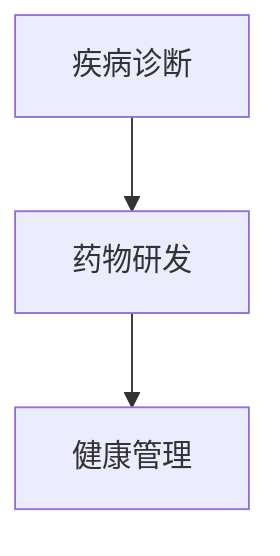

**核心算法原理讲解**

AI在医疗领域的核心算法主要包括机器学习算法和深度学习算法。以下是机器学习算法和深度学习算法在医疗领域的应用原理讲解：

- **机器学习算法**: 机器学习算法可以帮助医生从大量的医疗数据中提取有用的信息，用于疾病诊断和预测。例如，可以使用决策树、支持向量机等算法来训练模型，对患者的病史和检查结果进行分类。
- **深度学习算法**: 深度学习算法，如卷积神经网络（CNN）和循环神经网络（RNN），在医疗图像分析、基因测序和基因组学等领域有广泛应用。例如，CNN可以用于分析医学图像，如X光片、CT扫描和MRI，帮助医生识别疾病。

以下是一个简化版的深度学习算法在医疗图像分析中的应用伪代码：

```python
# 加载医学图像数据集
images, labels = load_medical_images()

# 初始化深度学习模型
model = initialize_cnn()

# 训练模型
for each image in images:
    prediction = model(image)
    update_model(prediction, label)

# 预测
for each new_image in new_medical_images:
    prediction = model(new_image)
    diagnose_disease(prediction)
```

**数学模型和数学公式**

深度学习算法中的关键数学模型包括：

- **卷积操作**: 用于提取图像特征。
- **池化操作**: 用于减少特征图的维度。
- **激活函数**: 用于引入非线性。

以下是一个简化版的卷积神经网络（CNN）的数学模型：

$$
\text{output} = \text{activation}(\text{weights} \cdot \text{input} + \text{biases})
$$

**实际案例**

- **IBM Watson for Oncology**: IBM Watson for Oncology是一个基于AI的医疗诊断系统，可以帮助医生分析癌症患者的数据，提供个性化的治疗方案。
- **DeepMind Health**: DeepMind Health是一家专注于医疗AI的公司，其产品包括用于疾病诊断和预测的AI算法，如Diabetes Research in Clinical Practice。

#### 2.2 AI在金融领域的应用

**核心概念与联系**

AI在金融领域的应用主要集中在风险管理、市场分析和欺诈检测等方面。以下是一个简化的AI在金融领域的应用流程图：

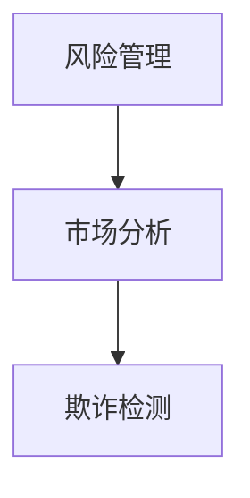

**核心算法原理讲解**

AI在金融领域的核心算法主要包括机器学习算法和深度学习算法。以下是机器学习算法和深度学习算法在金融领域的应用原理讲解：

- **机器学习算法**: 机器学习算法可以帮助金融机构从大量的交易数据中提取有用的信息，用于风险管理、市场分析和欺诈检测。例如，可以使用线性回归、逻辑回归等算法来预测市场的走势或识别欺诈交易。
- **深度学习算法**: 深度学习算法，如循环神经网络（RNN）和卷积神经网络（CNN），在处理复杂的金融数据、如文本数据和时间序列数据方面有广泛应用。例如，RNN可以用于分析金融新闻和报告，预测市场走势。

以下是一个简化版的深度学习算法在市场分析中的应用伪代码：

```python
# 加载金融数据集
data, labels = load_financial_data()

# 初始化深度学习模型
model = initialize_rnn()

# 训练模型
for each data_point in data:
    prediction = model(data_point)
    update_model(prediction, label)

# 预测
for each new_data_point in new_financial_data:
    prediction = model(new_data_point)
    analyze_market(prediction)
```

**数学模型和数学公式**

深度学习算法中的关键数学模型包括：

- **循环神经网络 (RNN)**: 用于处理时间序列数据。
- **卷积神经网络 (CNN)**: 用于处理图像数据。

以下是一个简化版的循环神经网络（RNN）的数学模型：

$$
\text{output}_{t} = \text{activation}(\text{weights} \cdot \text{input}_{t} + \text{biases}_{t-1} + \text{weights}_{R} \cdot \text{output}_{t-1})
$$

**实际案例**

- **J.P. Morgan Chase**: J.P. Morgan Chase使用AI技术进行交易分析和欺诈检测，提高了交易的效率和安全性。
- **AlphaZero**: AlphaZero是一个基于深度强化学习的AI系统，它在金融交易中展示了超越人类交易员的能力。

#### 2.3 AI在教育领域的应用

**核心概念与联系**

AI在教育领域的应用主要集中在教育资源分配、教育评估和个性化学习等方面。以下是一个简化的AI在教育领域的应用流程图：

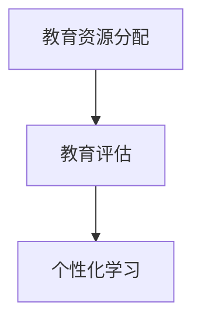

**核心算法原理讲解**

AI在教育领域的核心算法主要包括机器学习算法和深度学习算法。以下是机器学习算法和深度学习算法在教育领域的应用原理讲解：

- **机器学习算法**: 机器学习算法可以帮助学校和教育机构更好地分配教育资源，进行教育评估和个性化学习。例如，可以使用聚类算法来识别学生的学习群体，使用回归算法来预测学生的学习成绩。
- **深度学习算法**: 深度学习算法，如循环神经网络（RNN）和生成对抗网络（GAN），在处理复杂的文本数据和生成个性化的学习内容方面有广泛应用。例如，RNN可以用于分析学生的作业和考试结果，生成针对性的学习建议。

以下是一个简化版的深度学习算法在教育评估中的应用伪代码：

```python
# 加载教育数据集
data, labels = load_education_data()

# 初始化深度学习模型
model = initialize_rnn()

# 训练模型
for each data_point in data:
    prediction = model(data_point)
    update_model(prediction, label)

# 评估
for each new_data_point in new_education_data:
    prediction = model(new_data_point)
    evaluate_student(prediction)
```

**数学模型和数学公式**

深度学习算法中的关键数学模型包括：

- **循环神经网络 (RNN)**: 用于处理时间序列数据。
- **生成对抗网络 (GAN)**: 用于生成个性化的学习内容。

以下是一个简化版的循环神经网络（RNN）的数学模型：

$$
\text{output}_{t} = \text{activation}(\text{weights} \cdot \text{input}_{t} + \text{biases}_{t-1} + \text{weights}_{R} \cdot \text{output}_{t-1})
$$

**实际案例**

- **Knewton**: Knewton是一个AI驱动的个性化学习平台，它可以根据学生的学习行为和成绩，提供个性化的学习建议和资源。
- **Coursera**: Coursera使用AI技术分析学生的学习行为，为每位学生提供个性化的学习路径。

#### 2.4 AI在制造业和物流领域的应用

**核心概念与联系**

AI在制造业和物流领域的应用主要集中在自动化生产、物流优化和供应链管理等方面。以下是一个简化的AI在制造业和物流领域的应用流程图：

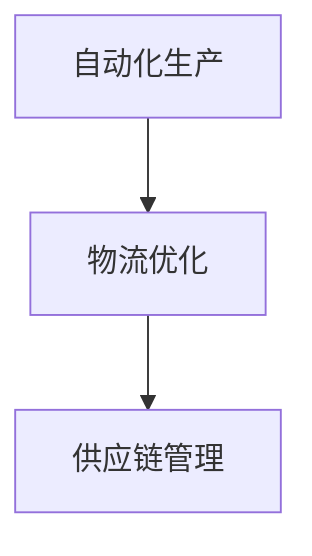

**核心算法原理讲解**

AI在制造业和物流领域的核心算法主要包括机器学习算法和深度学习算法。以下是机器学习算法和深度学习算法在制造业和物流领域的应用原理讲解：

- **机器学习算法**: 机器学习算法可以帮助制造商优化生产流程，提高生产效率。例如，可以使用回归算法来预测生产需求，使用聚类算法来优化库存管理。在物流领域，机器学习算法可以用于预测运输时间、优化运输路线等。
- **深度学习算法**: 深度学习算法，如卷积神经网络（CNN）和生成对抗网络（GAN），在处理制造业和物流中的图像数据、传感器数据等方面有广泛应用。例如，CNN可以用于检测生产线上的缺陷，GAN可以用于预测未来的库存需求。

以下是一个简化版的深度学习算法在物流优化中的应用伪代码：

```python
# 加载物流数据集
data, labels = load_logistics_data()

# 初始化深度学习模型
model = initialize_cnn()

# 训练模型
for each data_point in data:
    prediction = model(data_point)
    update_model(prediction, label)

# 优化
for each new_data_point in new_logistics_data:
    prediction = model(new_data_point)
    optimize_transport_route(prediction)
```

**数学模型和数学公式**

深度学习算法中的关键数学模型包括：

- **卷积神经网络 (CNN)**: 用于处理图像数据。
- **生成对抗网络 (GAN)**: 用于生成物流优化模型。

以下是一个简化版的卷积神经网络（CNN）的数学模型：

$$
\text{output} = \text{activation}(\text{weights} \cdot \text{input} + \text{biases})
$$

**实际案例**

- **亚马逊**: 亚马逊使用AI技术优化其物流网络，提高了配送效率和客户满意度。
- **通用电气 (GE)**: GE使用AI技术对其工业设备进行预测性维护，减少了停机时间并提高了生产效率。

#### 小结

AI在医疗、金融、教育、制造业和物流等领域的应用，不仅提高了各行业的效率和质量，还推动了社会的发展。通过详细的案例、算法原理讲解和数学模型解析，我们可以看到AI在各个领域中的具体应用和巨大潜力。在接下来的章节中，我们将进一步探讨AI对就业和社会结构的影响，以及AI与隐私和数据安全的关系。

---

在探讨了AI在医疗、金融、教育、制造业和物流领域的具体应用后，接下来我们将深入第一部分的第三章，详细探讨AI与就业和社会结构的关系，包括AI对就业市场的影响、社会结构与AI的关系，以及AI伦理与社会责任。

### 第3章: AI与就业和社会结构

#### 3.1 AI对就业市场的影响

**核心概念与联系**

AI的发展和应用对就业市场产生了深远的影响，涉及自动化、职业转变和就业机会的创造等方面。以下是一个简化的AI对就业市场影响的流程图：

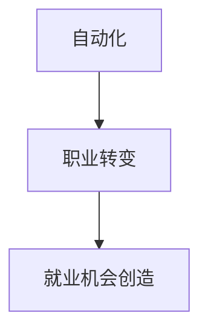

**核心算法原理讲解**

AI对就业市场的影响主要源于其自动化能力。自动化技术能够替代一些重复性和规则性强的任务，从而减少对这些岗位的需求。以下是自动化算法的基本原理讲解：

- **机器学习算法**: 机器学习算法可以识别和执行重复性的任务，例如数据标注、文本分类等。通过训练模型，计算机能够自动完成这些任务，减少对人类劳动力的需求。
- **深度学习算法**: 深度学习算法可以处理更复杂的任务，如图像识别、语音识别等。这些算法的应用使得一些传统上需要人类完成的任务，如医疗影像诊断、自动驾驶等，实现了自动化。

以下是一个简化版的自动化算法原理的伪代码：

```python
# 加载训练数据
data = load_training_data()

# 初始化模型
model = initialize_model()

# 训练模型
for each data_point in data:
    prediction = model(data_point)
    update_model(prediction)

# 自动化任务执行
for each new_data_point in new_data:
    execution = model(new_data_point)
    automate_task(execution)
```

**数学模型和数学公式**

自动化算法中的关键数学模型包括：

- **损失函数**: 用于评估模型的性能。
- **优化算法**: 用于更新模型的权重和偏置。

以下是一个简化版的损失函数和优化算法的数学模型：

$$
\text{loss} = \text{function}(\text{output} - \text{labels})
$$

$$
\text{weights} = \text{weights} - \text{learning_rate} \cdot \nabla_{\text{weights}}(\text{loss})
$$

**实际案例**

- **亚马逊的Kiva机器人**: 亚马逊使用Kiva机器人自动化仓库管理，减少了人力需求，提高了仓储效率。
- **IBM Watson**: IBM Watson可以自动化许多医疗诊断和治疗方案的建议，减少了医生的工作量，提高了诊断的准确性。

**AI对就业市场的影响**

AI对就业市场的影响主要体现在以下几个方面：

1. **自动化岗位的减少**: AI和自动化技术替代了许多重复性和规则性强的岗位，导致这些岗位的需求减少。
2. **职业转变**: 许多岗位需要人类具备新的技能，如数据分析、AI编程等。这促使人们进行职业转型，以适应新的就业市场。
3. **就业机会的创造**: AI也创造了新的就业机会，如AI研究人员、数据科学家、AI系统维护人员等。

**小结**

AI对就业市场的影响是双重的：一方面，它导致了某些岗位的减少和职业的转变；另一方面，它创造了新的就业机会。通过核心算法原理讲解和实际案例，我们可以看到AI如何改变就业市场，并对社会结构产生影响。

#### 3.2 社会结构与AI的关系

**核心概念与联系**

AI对社会结构的影响不仅仅体现在就业市场，还涉及社会分层、教育和数据访问等方面。以下是一个简化的社会结构与AI的关系流程图：

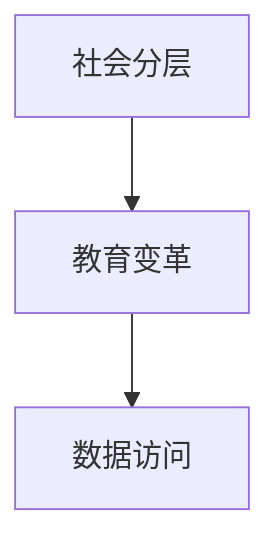

**核心算法原理讲解**

AI对社会结构的影响可以通过以下核心算法原理来解释：

- **机器学习算法**: 机器学习算法可以用于分析大量社会数据，帮助政府和社会机构更好地理解社会结构和问题。例如，可以使用聚类算法来识别社会群体，使用回归算法来预测社会趋势。
- **深度学习算法**: 深度学习算法可以处理更复杂的社交数据，如文本、图像和视频。这些算法的应用使得社会研究和分析更加准确和高效。

以下是一个简化版的深度学习算法在社会分析中的应用伪代码：

```python
# 加载社会数据集
data = load_social_data()

# 初始化深度学习模型
model = initialize_model()

# 训练模型
for each data_point in data:
    prediction = model(data_point)
    update_model(prediction)

# 社会分析
for each new_data_point in new_social_data:
    prediction = model(new_data_point)
    analyze_social_structure(prediction)
```

**数学模型和数学公式**

深度学习算法中的关键数学模型包括：

- **神经网络**: 用于模拟人类的思维过程。
- **优化算法**: 用于训练神经网络，提高其性能。

以下是一个简化版的神经网络的数学模型：

$$
\text{output} = \text{activation}(\text{weights} \cdot \text{input} + \text{biases})
$$

**实际案例**

- **社会分析工具**: 许多研究和政府机构使用AI技术进行社会分析，以更好地理解社会问题，制定政策。
- **推荐系统**: 在线平台如Facebook、Netflix和Amazon使用AI技术分析用户行为，为用户推荐内容，这影响了用户的社会互动和行为模式。

**AI对社会结构的影响**

AI对社会结构的影响主要体现在以下几个方面：

1. **社会分层**: AI技术可能加剧社会分层，因为技术和资源的不平等可能导致一些人受益，而另一些人则被边缘化。
2. **教育变革**: AI技术改变了教育的模式，需要人们具备新的技能和知识，这对教育和培训体系提出了新的挑战。
3. **数据访问**: AI技术使得数据分析和决策更加依赖于数据，这影响了社会各个层面的决策过程。

**小结**

AI对社会结构的影响是复杂的，它既带来了机遇，也带来了挑战。通过核心算法原理讲解和实际案例，我们可以更好地理解AI如何改变社会结构，并探讨如何应对这些变化。

#### 3.3 AI伦理与社会责任

**核心概念与联系**

AI伦理与社会责任是AI发展中不可忽视的重要方面。它关系到AI技术的公平性、透明性和安全性。以下是一个简化的AI伦理与社会责任的流程图：

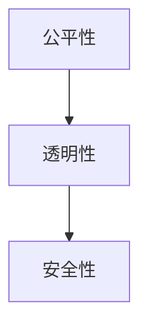

**核心算法原理讲解**

AI伦理与社会责任的核心算法原理主要包括：

- **可解释性算法**: 为了确保AI系统的公平性和透明性，需要开发可解释的AI模型。这些模型能够解释其决策过程，使人们能够理解AI的行为。
- **伦理决策算法**: AI系统需要包含伦理决策模块，确保其决策符合社会伦理标准。例如，在自动驾驶汽车中，需要算法决定在紧急情况下如何平衡乘客和行人的安全。

以下是一个简化版的可解释AI模型和伦理决策算法的伪代码：

```python
# 加载训练数据
data = load_ethical_data()

# 初始化模型
model = initialize_model()

# 增加可解释性模块
model = add_explanation_module(model)

# 增加伦理决策模块
model = add_ethical_decision_module(model)

# 训练模型
for each data_point in data:
    prediction = model(data_point)
    update_model(prediction)

# 解释决策
for each data_point in new_data:
    prediction = model(data_point)
    explain_decision(prediction)
```

**数学模型和数学公式**

AI伦理与社会责任中的关键数学模型包括：

- **公平性指标**: 用于评估AI系统的公平性。
- **安全指标**: 用于评估AI系统的安全性。

以下是一个简化版的公平性和安全性的数学模型：

$$
\text{fairness} = \text{function}(\text{predicted_outcomes} - \text{actual_outcomes})
$$

$$
\text{safety} = \text{function}(\text{predicted_risks} - \text{actual_risks})
$$

**实际案例**

- **公平性案例**: Google的AI招聘系统被发现存在性别偏见，这引发了关于AI公平性的广泛讨论。
- **安全性案例**: Waymo的自动驾驶汽车在测试中发生了意外碰撞，这引起了关于AI安全性的关注。

**AI伦理与社会责任**

AI伦理与社会责任的挑战主要体现在以下几个方面：

1. **公平性**: AI系统需要确保对所有用户公平，避免歧视和偏见。
2. **透明性**: AI系统需要透明，用户能够理解其决策过程。
3. **安全性**: AI系统需要确保其行为安全，不会对人类和社会造成危害。

**小结**

AI伦理与社会责任是确保AI技术健康发展的重要保障。通过核心算法原理讲解和实际案例，我们可以更好地理解AI伦理与社会责任的重要性，并探讨如何应对这些挑战。

在探讨了AI对就业市场的影响、社会结构与AI的关系，以及AI伦理与社会责任后，我们可以看到AI在社会中的作用是复杂而多样的。在接下来的章节中，我们将进一步探讨AI与隐私和数据安全的关系，以及AI在教育和医疗健康领域的具体应用。

---

在探讨了AI对就业市场的影响、社会结构与AI的关系，以及AI伦理与社会责任后，接下来我们将深入第一部分的第四章，详细探讨AI与隐私和数据安全的关系，包括AI与数据隐私、数据安全与AI，以及AI伦理法规与政策。

### 第4章: AI与隐私和数据安全

#### 4.1 AI与数据隐私

**核心概念与联系**

AI与数据隐私的关系是复杂的，涉及个人数据的收集、存储和处理等方面。以下是一个简化的AI与数据隐私的流程图：

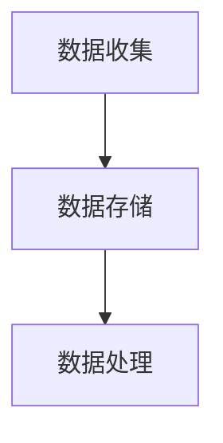

**核心算法原理讲解**

AI与数据隐私的核心算法原理主要包括数据加密、数据去标识化和隐私保护算法。

- **数据加密**: 数据加密是保护数据隐私的关键技术。通过加密算法，可以将敏感数据转换为只有授权用户才能解读的形式。例如，对称加密和非对称加密是常用的加密技术。
- **数据去标识化**: 数据去标识化是将数据中的个人标识信息去除，以保护个人隐私。去标识化技术包括匿名化、假名化和去个性化等。
- **隐私保护算法**: 隐私保护算法是在数据处理过程中保护数据隐私的算法。例如，差分隐私是一种常用的隐私保护技术，它通过向输出数据添加噪声，降低数据中个人信息的可识别性。

以下是一个简化版的数据加密和隐私保护算法的伪代码：

```python
# 加载敏感数据
data = load_sensitive_data()

# 数据加密
encrypted_data = encrypt_data(data)

# 数据去标识化
deidentified_data = deidentify_data(encrypted_data)

# 使用隐私保护算法
protected_data = apply_privacy_algorithm(deidentified_data)
```

**数学模型和数学公式**

AI与数据隐私中的关键数学模型包括：

- **加密算法**: 如AES、RSA等。
- **隐私保护算法**: 如差分隐私、K-anonymity等。

以下是一个简化版的差分隐私的数学模型：

$$
\text{output} = \text{function}(\text{input} + \text{noise})
$$

**实际案例**

- **谷歌的隐私保护措施**: 谷歌使用差分隐私技术保护其广告平台的用户数据，确保用户隐私不被泄露。
- **苹果的隐私保护功能**: 苹果在iOS设备中集成了强大的加密功能，确保用户数据的安全。

**AI与数据隐私的重要性**

AI与数据隐私的关系至关重要，因为它涉及到用户的隐私权利和安全。以下是AI与数据隐私的重要性：

1. **隐私权利**: 数据隐私是用户的基本权利，任何未经授权的数据收集和处理都可能导致隐私侵犯。
2. **数据安全**: 数据隐私保护是确保数据安全的关键措施，可以防止数据泄露和滥用。
3. **信任与合规**: 在全球范围内，许多国家和地区都制定了数据隐私法规，如欧盟的《通用数据保护条例》（GDPR）。AI系统需要遵守这些法规，以建立用户信任和合规性。

#### 4.2 数据安全与AI

**核心概念与联系**

数据安全与AI的关系是AI技术应用中的一个重要方面，涉及AI系统的安全性、数据保护，以及对抗攻击等方面。以下是一个简化的数据安全与AI的流程图：

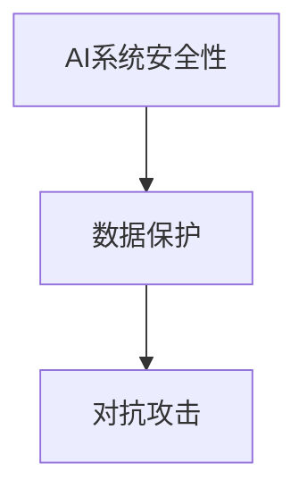

**核心算法原理讲解**

数据安全与AI的核心算法原理主要包括：

- **加密与解密算法**: 用于保护数据在存储和传输过程中的安全。
- **访问控制机制**: 用于限制对数据的访问权限，确保数据只能被授权用户访问。
- **异常检测和防御算法**: 用于检测和防御AI系统的恶意攻击和异常行为。

以下是一个简化版的加密、访问控制和异常检测算法的伪代码：

```python
# 加载敏感数据
data = load_sensitive_data()

# 数据加密
encrypted_data = encrypt_data(data)

# 设置访问控制
access_control = set_access_control(encrypted_data)

# 异常检测
for each observation in new_observations:
    if detect_anomaly(observation):
        respond_to_anomaly()
```

**数学模型和数学公式**

数据安全与AI中的关键数学模型包括：

- **加密算法**: 如AES、RSA等。
- **访问控制模型**: 如基于属性的加密（ABE）和基于身份的加密（IBE）等。
- **异常检测模型**: 如支持向量机（SVM）和神经网络（NN）等。

以下是一个简化版的基于属性的加密（ABE）的数学模型：

$$
\text{access\_permission} = \text{attribute\_evaluation}(\text{access\_policy}, \text{user\_attributes})
$$

**实际案例**

- **加密货币**: 加密货币如比特币使用加密算法来保护交易数据的安全。
- **网络安全**: 许多企业使用AI技术进行网络安全监控，如使用异常检测算法来识别和防御网络攻击。

**数据安全的重要性**

数据安全是AI技术健康发展的重要保障。以下是数据安全的重要性：

1. **保护数据完整性**: 确保数据不被未授权修改或破坏。
2. **保护数据保密性**: 确保数据不被未授权访问。
3. **确保系统可靠性**: 通过有效的数据安全措施，确保AI系统的稳定运行。

#### 4.3 AI伦理法规与政策

**核心概念与联系**

AI伦理法规与政策是确保AI技术合法、安全和道德使用的关键。以下是一个简化的AI伦理法规与政策的流程图：

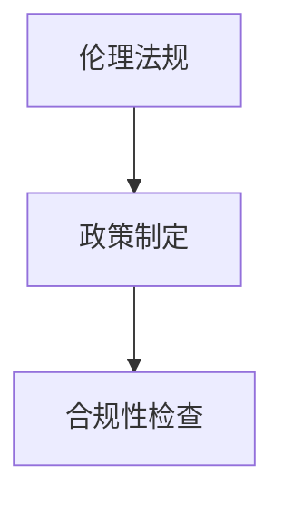

**核心算法原理讲解**

AI伦理法规与政策的核心算法原理主要包括：

- **合规性检测算法**: 用于检查AI系统是否符合法规和政策的要求。例如，可以使用机器学习算法对AI系统的输出进行评估，确保其符合伦理标准。
- **伦理决策算法**: 用于在AI系统开发和使用过程中，确保其符合伦理要求。例如，可以使用伦理决策树或伦理规则库来指导AI系统的行为。

以下是一个简化版的合规性检测和伦理决策算法的伪代码：

```python
# 加载伦理法规与政策
ethics_rules = load_ethics_rules()

# 检查合规性
is_compliant = check_compliance(AI_system, ethics_rules)

# 做出伦理决策
ethical_decision = make_ethical_decision(AI_system, ethics_rules)
```

**数学模型和数学公式**

AI伦理法规与政策中的关键数学模型包括：

- **合规性评估模型**: 用于评估AI系统的合规性。
- **伦理决策模型**: 用于指导AI系统的行为。

以下是一个简化版的合规性评估模型的数学模型：

$$
\text{compliance\_score} = \text{function}(\text{AI\_system} - \text{ethics\_rules})
$$

**实际案例**

- **欧盟的《通用数据保护条例》（GDPR）**: GDPR是欧盟制定的关于数据隐私和保护的重要法规，对AI系统的数据收集和处理有严格的规定。
- **美国的《人工智能法案》**: 美国正在制定关于AI的法案，旨在确保AI技术的合法、安全和道德使用。

**AI伦理法规与政策的重要性**

AI伦理法规与政策的重要性体现在以下几个方面：

1. **确保AI系统的合法使用**: 通过法规和政策，确保AI系统在开发和使用过程中符合法律要求。
2. **保障用户隐私权**: 通过法规和政策，保障用户的数据隐私权。
3. **促进AI技术的健康发展**: 通过法规和政策，引导AI技术的研发和应用，确保其符合社会伦理和道德标准。

#### 小结

AI与隐私和数据安全的关系是AI技术发展中的一个重要议题。通过核心算法原理讲解和实际案例，我们可以看到AI在保护隐私、数据安全和合规性方面的挑战和解决方案。AI伦理法规与政策的制定和执行是确保AI技术健康发展的关键。在接下来的章节中，我们将进一步探讨AI在教育中的角色，包括AI在教育资源的分配、教育评估和个性化学习中的应用。

---

在探讨了AI与隐私和数据安全的关系，以及AI伦理法规与政策后，接下来我们将深入第一部分的第五章，详细探讨AI在教育中的角色，包括AI在教育资源的分配、教育评估和个性化学习中的应用。

### 第5章: AI在教育中的角色

#### 5.1 AI在教育资源的分配

**核心概念与联系**

AI在教育资源的分配中发挥着重要作用，它涉及资源的优化配置、个性化推荐和学习路径的规划。以下是一个简化的AI在教育资源分配中的应用流程图：

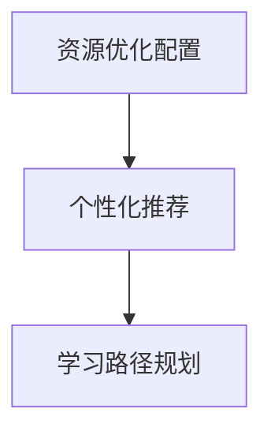

**核心算法原理讲解**

AI在教育资源的分配中，主要依赖以下核心算法原理：

- **机器学习算法**: 用于分析和预测学生的需求和表现，从而优化教育资源的分配。例如，回归算法和聚类算法可以用于分析学生的学习数据，预测他们的学习需求。
- **深度学习算法**: 用于处理复杂的文本数据，如学生反馈和评估报告，从而提供个性化的学习资源推荐。例如，循环神经网络（RNN）和自然语言处理（NLP）技术可以用于分析文本数据，生成个性化的学习建议。

以下是一个简化版的机器学习和深度学习算法在教育资源分配中的应用伪代码：

```python
# 加载学生数据
student_data = load_student_data()

# 优化资源配置
resource_alloc = optimize_resources(student_data)

# 生成个性化推荐
recommendations = generate_recommendations(student_data, resource_alloc)

# 规划学习路径
learning_path = plan_learning_path(student_data, recommendations)
```

**数学模型和数学公式**

AI在教育资源分配中的关键数学模型包括：

- **优化模型**: 用于优化教育资源的分配，如线性规划、多目标规划等。
- **推荐模型**: 用于生成个性化推荐，如基于内容的推荐、协同过滤等。

以下是一个简化版的优化模型的数学模型：

$$
\text{maximize} \ \text{function}(\text{resources}) \\
\text{subject to} \ \text{constraints}
$$

**实际案例**

- **Coursera**: Coursera使用机器学习算法分析学生的行为数据，为学生提供个性化的课程推荐。
- **Knewton**: Knewton使用AI技术优化学习资源的分配，为每位学生提供个性化的学习路径。

**AI在教育资源分配中的应用**

AI在教育资源的分配中的应用主要体现在以下几个方面：

1. **优化资源配置**: 通过分析学生的学习行为和需求，AI系统可以优化教育资源的分配，确保每个学生都能获得最适合的学习资源。
2. **个性化推荐**: AI系统可以根据学生的学习数据，为学生推荐最相关的学习资源和课程。
3. **学习路径规划**: AI系统可以根据学生的学习表现和需求，规划个性化的学习路径，帮助学生更有效地学习。

#### 5.2 AI在教育评估中的应用

**核心概念与联系**

AI在教育评估中的应用涉及自动化评估、智能评分和评估反馈等方面。以下是一个简化的AI在教育评估中的应用流程图：

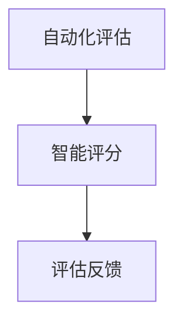

**核心算法原理讲解**

AI在教育评估中的应用主要依赖以下核心算法原理：

- **机器学习算法**: 用于自动化评估和智能评分。例如，可以使用分类算法和回归算法来预测学生的成绩和评估结果。
- **自然语言处理（NLP）算法**: 用于处理学生的文本反馈，提供智能化的评估反馈。例如，可以使用情感分析算法来分析学生的反馈，生成评估报告。

以下是一个简化版的机器学习和NLP算法在教育评估中的应用伪代码：

```python
# 加载评估数据
evaluation_data = load_evaluation_data()

# 自动化评估
auto_evaluation = automate_evaluation(evaluation_data)

# 智能评分
smart_grading = smart_grade(evaluation_data)

# 生成评估反馈
evaluation_feedback = generate_feedback(smart_grading)
```

**数学模型和数学公式**

AI在教育评估中的关键数学模型包括：

- **分类模型**: 用于预测学生的评估结果。
- **回归模型**: 用于预测学生的成绩。
- **情感分析模型**: 用于分析学生的文本反馈。

以下是一个简化版的分类和回归模型的数学模型：

$$
\text{predicted\_evaluation} = \text{function}(\text{evaluation\_data})
$$

$$
\text{predicted\_score} = \text{function}(\text{evaluation\_data})
$$

**实际案例**

- **Google Classroom**: Google Classroom使用机器学习算法自动评估学生的作业和项目。
- **H ghost**: H ghost是一个AI评分系统，它使用自然语言处理技术对学生的作文进行智能评分。

**AI在教育评估中的应用**

AI在教育评估中的应用主要体现在以下几个方面：

1. **自动化评估**: AI系统可以自动化许多评估过程，提高评估的效率和准确性。
2. **智能评分**: AI系统可以基于大量的评估数据，提供更客观、准确的评分。
3. **评估反馈**: AI系统可以分析学生的反馈，生成个性化的评估报告，帮助学生改进学习。

#### 5.3 AI在个性化学习中的应用

**核心概念与联系**

AI在个性化学习中的应用涉及学习路径的定制、学习资源的推荐和学习效果的监控等方面。以下是一个简化的AI在个性化学习中的应用流程图：

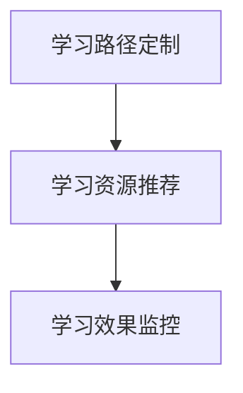

**核心算法原理讲解**

AI在个性化学习中的应用主要依赖以下核心算法原理：

- **机器学习算法**: 用于分析学生的学习行为和需求，从而定制个性化的学习路径。例如，可以使用聚类算法和回归算法来预测学生的学习效果，调整学习路径。
- **深度学习算法**: 用于推荐个性化的学习资源。例如，可以使用循环神经网络（RNN）和卷积神经网络（CNN）来分析学生的学习数据，推荐最适合他们的学习资源。

以下是一个简化版的机器学习和深度学习算法在个性化学习中的应用伪代码：

```python
# 加载学生学习数据
student_data = load_student_data()

# 定制学习路径
learning_path = customize_learning_path(student_data)

# 推荐学习资源
recommended_resources = recommend_resources(student_data, learning_path)

# 监控学习效果
learning_effect = monitor_learning_effect(student_data, recommended_resources)
```

**数学模型和数学公式**

AI在个性化学习中的关键数学模型包括：

- **个性化学习模型**: 用于预测学生的学习效果和调整学习路径。
- **推荐模型**: 用于推荐个性化的学习资源。

以下是一个简化版的个性化学习模型的数学模型：

$$
\text{learning\_effect} = \text{function}(\text{student\_data}, \text{learning\_path})
$$

**实际案例**

- **Knewton**: Knewton使用AI技术为学生提供个性化的学习资源推荐，提高学习效果。
- **Duolingo**: Duolingo使用AI技术分析学生的学习行为，提供个性化的语言学习路径。

**AI在个性化学习中的应用**

AI在个性化学习中的应用主要体现在以下几个方面：

1. **学习路径定制**: AI系统可以根据学生的学习行为和需求，定制个性化的学习路径，帮助学生更有效地学习。
2. **学习资源推荐**: AI系统可以根据学生的学习数据，推荐最适合他们的学习资源，提高学习效率。
3. **学习效果监控**: AI系统可以实时监控学生的学习效果，提供个性化的反馈和建议，帮助学生持续改进学习。

#### 小结

AI在教育中的角色日益重要，从资源的优化配置、教育评估到个性化学习，AI的应用正在深刻改变教育的面貌。通过核心算法原理讲解和实际案例，我们可以看到AI在教育中的巨大潜力和广阔前景。在接下来的章节中，我们将进一步探讨AI在医疗健康中的角色，包括AI在疾病诊断、药物研发和健康管理中的应用。

---

在探讨了AI在教育中的角色后，接下来我们将深入第一部分的第六章，详细探讨AI在医疗健康中的角色，包括AI在疾病诊断、药物研发和健康管理中的应用。

### 第6章: AI在医疗健康中的角色

#### 6.1 AI在疾病诊断中的应用

**核心概念与联系**

AI在疾病诊断中的应用，涉及利用机器学习和深度学习技术对医疗数据进行处理和分析，以提高诊断的准确性和效率。以下是一个简化的AI在疾病诊断中的应用流程图：

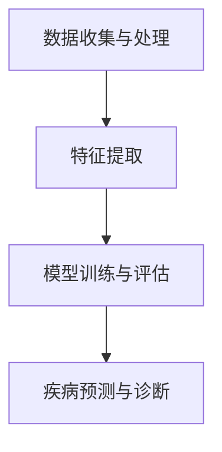

**核心算法原理讲解**

AI在疾病诊断中的应用，主要依赖于以下核心算法原理：

- **深度学习算法**: 如卷积神经网络（CNN）和循环神经网络（RNN），用于处理和分析医疗图像和数据。
- **机器学习算法**: 如支持向量机（SVM）和决策树，用于从医疗数据中提取特征和建立诊断模型。

以下是一个简化版的深度学习和机器学习算法在疾病诊断中的应用伪代码：

```python
# 加载医疗数据集
medical_data = load_medical_data()

# 数据预处理
preprocessed_data = preprocess_data(medical_data)

# 特征提取
features = extract_features(preprocessed_data)

# 模型训练
model = train_model(features)

# 评估模型
evaluate_model(model, test_data)

# 疾病预测与诊断
predictions = predict_disease(model, new_medical_data)
```

**数学模型和数学公式**

AI在疾病诊断中的关键数学模型包括：

- **神经网络**: 用于图像处理和特征提取。
- **优化算法**: 用于模型训练和参数调整。

以下是一个简化版的卷积神经网络（CNN）的数学模型：

$$
\text{output} = \text{activation}(\text{weights} \cdot \text{input} + \text{biases})
$$

**实际案例**

- **IBM Watson for Oncology**: IBM Watson for Oncology是一个AI系统，它可以分析患者的医疗数据，提供个性化的癌症治疗方案。
- **Google DeepMind**: Google DeepMind开发了AI系统，用于分析视网膜图像，以早期发现糖尿病视网膜病变。

**AI在疾病诊断中的应用**

AI在疾病诊断中的应用，主要体现在以下几个方面：

1. **提高诊断准确性**: 通过分析大量的医疗数据，AI系统可以提供更准确的诊断结果，减少误诊和漏诊。
2. **降低医生的工作负担**: AI系统可以帮助医生处理大量的医疗数据，减轻他们的工作负担，提高工作效率。
3. **早期发现疾病**: AI系统可以通过分析早期的医疗数据，实现疾病的早期发现，提高治愈率。

#### 6.2 AI在药物研发中的应用

**核心概念与联系**

AI在药物研发中的应用，涉及利用机器学习和深度学习技术加速药物发现和优化药物设计。以下是一个简化的AI在药物研发中的应用流程图：

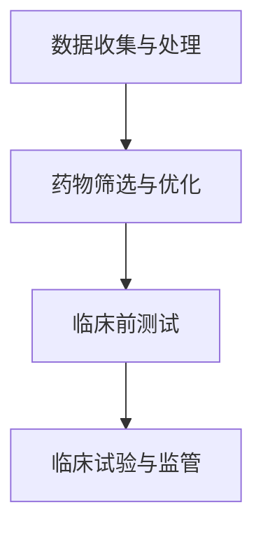

**核心算法原理讲解**

AI在药物研发中的应用，主要依赖于以下核心算法原理：

- **生成对抗网络（GAN）**: 用于生成虚拟化合物，加速药物筛选过程。
- **深度学习算法**: 如卷积神经网络（CNN）和循环神经网络（RNN），用于分析药物结构与功能之间的关系。

以下是一个简化版的生成对抗网络（GAN）和深度学习算法在药物研发中的应用伪代码：

```python
# 加载药物数据集
drug_data = load_drug_data()

# 数据预处理
preprocessed_data = preprocess_data(drug_data)

# 药物筛选与优化
filtered_drugs = filter_and_optimize_drugs(preprocessed_data)

# 临床前测试
clinical_tests = perform_clinical_tests(filtered_drugs)

# 临床试验与监管
clinical_trials = conduct_clinical_trials(clinical_tests)
```

**数学模型和数学公式**

AI在药物研发中的关键数学模型包括：

- **生成对抗网络（GAN）**: 用于生成虚拟化合物。
- **优化算法**: 用于优化药物分子结构。

以下是一个简化版的生成对抗网络（GAN）的数学模型：

$$
\text{G} \leftarrow \text{argmin}_{\text{G}} D(\text{G(z)})
$$

**实际案例**

- **Exscientia**: Exscientia使用AI技术加速药物研发，从药物筛选到临床试验的全过程。
- ** BenevolentAI**: BenevolentAI使用AI技术进行药物发现，旨在提高药物研发的效率和成功率。

**AI在药物研发中的应用**

AI在药物研发中的应用，主要体现在以下几个方面：

1. **加速药物研发过程**: 通过自动化和智能化技术，AI系统可以加速药物筛选和优化过程，提高药物研发的效率。
2. **提高药物研发成功率**: AI系统可以通过分析大量的药物数据，识别出潜在的药物分子，提高药物研发的成功率。
3. **降低研发成本**: AI系统可以减少实验次数和实验成本，降低药物研发的总成本。

#### 6.3 AI在健康管理中的应用

**核心概念与联系**

AI在健康管理中的应用，涉及利用机器学习和深度学习技术对健康数据进行监控和分析，提供个性化的健康建议和预警。以下是一个简化的AI在健康管理中的应用流程图：

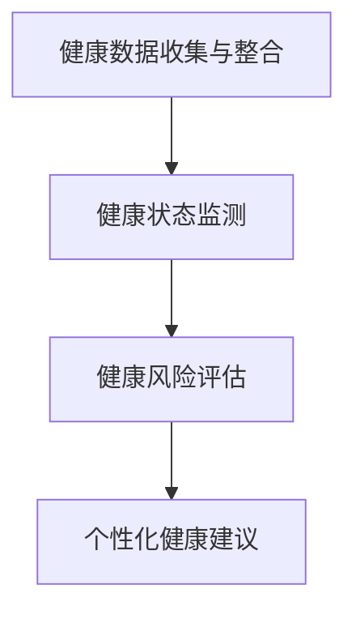

**核心算法原理讲解**

AI在健康管理中的应用，主要依赖于以下核心算法原理：

- **机器学习算法**: 如聚类算法和回归算法，用于分析健康数据，识别健康风险。
- **深度学习算法**: 如卷积神经网络（CNN）和循环神经网络（RNN），用于处理复杂的健康数据，提供个性化的健康建议。

以下是一个简化版的机器学习和深度学习算法在健康管理中的应用伪代码：

```python
# 加载健康数据
health_data = load_health_data()

# 数据预处理
preprocessed_data = preprocess_data(health_data)

# 健康状态监测
health_status = monitor_health_status(preprocessed_data)

# 健康风险评估
health_risk = assess_health_risk(preprocessed_data)

# 个性化健康建议
health_advice = provide_health_advice(preprocessed_data, health_risk)
```

**数学模型和数学公式**

AI在健康管理中的关键数学模型包括：

- **预测模型**: 用于预测健康状态和健康风险。
- **推荐模型**: 用于提供个性化的健康建议。

以下是一个简化版的预测模型的数学模型：

$$
\text{predicted\_health} = \text{function}(\text{health\_data})
$$

**实际案例**

- **Apple HealthKit**: Apple HealthKit使用AI技术分析用户的数据，提供个性化的健康建议和预警。
- **IBM Watson Health**: IBM Watson Health使用AI技术分析大量的健康数据，为用户提供个性化的健康评估和健康管理方案。

**AI在健康管理中的应用**

AI在健康管理中的应用，主要体现在以下几个方面：

1. **实时健康监控**: 通过实时分析用户的健康数据，AI系统可以监控用户的健康状况，提供实时的健康预警。
2. **个性化健康建议**: AI系统可以根据用户的健康数据和需求，提供个性化的健康建议，帮助用户改善健康状况。
3. **预防疾病**: AI系统可以通过分析健康数据，预测用户可能出现的健康问题，帮助用户采取预防措施，降低患病风险。

#### 小结

AI在医疗健康中的应用，涵盖了疾病诊断、药物研发和健康管理等多个方面，显著提高了医疗健康领域的效率和准确性。通过核心算法原理讲解和实际案例，我们可以看到AI在医疗健康中的巨大潜力和广阔前景。在接下来的章节中，我们将进一步探讨AI与艺术和文化的关系，包括AI在艺术创作、文化遗产保护和娱乐产业中的应用。

---

在探讨了AI在医疗健康中的角色后，接下来我们将深入第一部分的第七章，详细探讨AI与艺术和文化的关系，包括AI在艺术创作、文化遗产保护和娱乐产业中的应用。

### 第7章: AI与艺术和文化

#### 7.1 AI在艺术创作中的应用

**核心概念与联系**

AI在艺术创作中的应用，涉及利用机器学习和深度学习技术生成艺术作品，以及辅助艺术家进行创作。以下是一个简化的AI在艺术创作中的应用流程图：

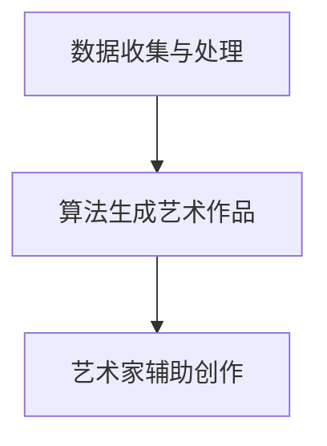

**核心算法原理讲解**

AI在艺术创作中的应用，主要依赖于以下核心算法原理：

- **生成对抗网络（GAN）**: 用于生成独特的艺术作品，例如绘画、音乐和视频。
- **深度学习模型**: 如卷积神经网络（CNN）和循环神经网络（RNN），用于分析艺术作品的特征，辅助艺术家进行创作。

以下是一个简化版的生成对抗网络（GAN）和深度学习模型在艺术创作中的应用伪代码：

```python
# 加载艺术数据集
art_data = load_art_data()

# 数据预处理
preprocessed_data = preprocess_data(art_data)

# GAN生成艺术作品
artwork = generate_artwork(preprocessed_data, GAN)

# 艺术家辅助创作
art_assistance = assist_artist(preprocessed_data, CNN, RNN)
```

**数学模型和数学公式**

AI在艺术创作中的关键数学模型包括：

- **生成对抗网络（GAN）**: 用于生成虚拟艺术作品。
- **卷积神经网络（CNN）和循环神经网络（RNN）**: 用于分析艺术作品的特征。

以下是一个简化版的生成对抗网络（GAN）的数学模型：

$$
\text{G} \leftarrow \text{argmin}_{\text{G}} D(\text{G(z)})
$$

**实际案例**

- **DeepArt.io**: DeepArt.io使用GAN技术生成艺术作品，用户可以将自己的照片转换成艺术风格的绘画。
- **Amper Music**: Amper Music使用AI技术生成音乐，为用户提供个性化的音乐创作服务。

**AI在艺术创作中的应用**

AI在艺术创作中的应用，主要体现在以下几个方面：

1. **生成艺术作品**: 通过GAN等生成模型，AI可以生成独特的艺术作品，拓展了艺术创作的边界。
2. **辅助艺术家创作**: 通过深度学习模型，AI可以分析艺术作品的特征，为艺术家提供创作灵感和辅助。
3. **艺术市场创新**: AI技术可以分析艺术市场的趋势，帮助艺术家和画廊进行市场推广。

#### 7.2 AI在文化遗产保护中的应用

**核心概念与联系**

AI在文化遗产保护中的应用，涉及利用机器学习和深度学习技术进行文化遗产的数字化保护和修复。以下是一个简化的AI在文化遗产保护中的应用流程图：

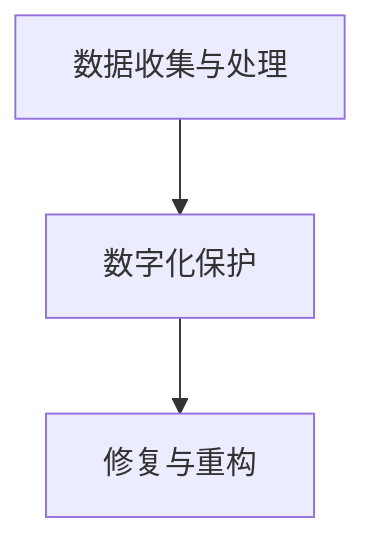

**核心算法原理讲解**

AI在文化遗产保护中的应用，主要依赖于以下核心算法原理：

- **图像处理算法**: 用于文化遗产的数字化保护和修复，例如卷积神经网络（CNN）和图像超分辨率技术。
- **机器学习模型**: 用于分析文化遗产的数据，识别潜在的问题和修复需求。

以下是一个简化版的图像处理算法和机器学习模型在文化遗产保护中的应用伪代码：

```python
# 加载文化遗产数据
heritage_data = load_heritage_data()

# 数据预处理
preprocessed_data = preprocess_data(heritage_data)

# 数字化保护
protected_heritage = digitize_heritage(preprocessed_data)

# 修复与重构
restored_heritage = restore_heritage(preprocessed_data, CNN)
```

**数学模型和数学公式**

AI在文化遗产保护中的关键数学模型包括：

- **卷积神经网络（CNN）**: 用于图像修复和超分辨率。
- **生成对抗网络（GAN）**: 用于生成虚拟文化遗产。

以下是一个简化版的卷积神经网络（CNN）的数学模型：

$$
\text{output} = \text{activation}(\text{weights} \cdot \text{input} + \text{biases})
$$

**实际案例**

- **谷歌文化遗产项目**: 谷歌使用AI技术对世界文化遗产进行数字化修复和保存，例如敦煌莫高窟的壁画。
- **微软AI修复工具**: 微软推出了AI修复工具，用于修复历史照片和文化遗产，使其恢复原始面貌。

**AI在文化遗产保护中的应用**

AI在文化遗产保护中的应用，主要体现在以下几个方面：

1. **数字化保护**: 通过AI技术，可以对文化遗产进行数字化保存，确保其免受物理损坏。
2. **修复与重构**: 通过AI技术，可以修复受损的文化遗产，恢复其原始面貌。
3. **增强公众参与**: 通过AI技术，公众可以更方便地访问和了解文化遗产，提高公众的文化素养。

#### 7.3 AI在娱乐产业中的应用

**核心概念与联系**

AI在娱乐产业中的应用，涉及利用机器学习和深度学习技术提供个性化的娱乐体验，以及创作娱乐内容。以下是一个简化的AI在娱乐产业中的应用流程图：

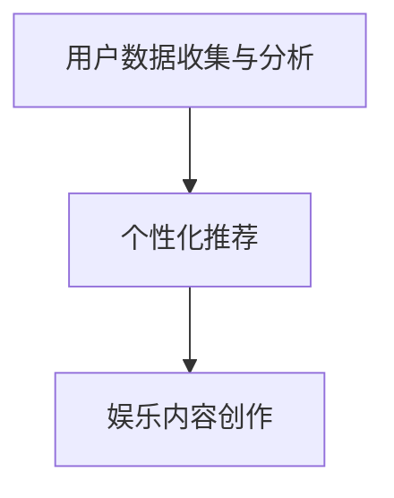

**核心算法原理讲解**

AI在娱乐产业中的应用，主要依赖于以下核心算法原理：

- **推荐系统**: 使用协同过滤和基于内容的推荐算法，为用户提供个性化的娱乐推荐。
- **生成模型**: 如生成对抗网络（GAN）和变分自编码器（VAE），用于创作个性化的娱乐内容。

以下是一个简化版的推荐系统和生成模型在娱乐产业中的应用伪代码：

```python
# 加载用户数据
user_data = load_user_data()

# 数据预处理
preprocessed_data = preprocess_data(user_data)

# 个性化推荐
recommends = generate_recommendations(preprocessed_data, recommendation_model)

# 娱乐内容创作
content = generate_content(preprocessed_data, GAN)
```

**数学模型和数学公式**

AI在娱乐产业中的关键数学模型包括：

- **推荐模型**: 使用线性回归和逻辑回归等算法，为用户推荐娱乐内容。
- **生成模型**: 使用生成对抗网络（GAN）和变分自编码器（VAE），生成个性化的娱乐内容。

以下是一个简化版的生成对抗网络（GAN）的数学模型：

$$
\text{G} \leftarrow \text{argmin}_{\text{G}} D(\text{G(z)})
$$

**实际案例**

- **Spotify**: Spotify使用AI技术分析用户数据，提供个性化的音乐推荐。
- **Netflix**: Netflix使用AI技术分析用户观看行为，推荐个性化的视频内容。

**AI在娱乐产业中的应用**

AI在娱乐产业中的应用，主要体现在以下几个方面：

1. **个性化推荐**: 通过AI技术，可以为用户提供个性化的娱乐内容推荐，提高用户满意度。
2. **内容创作**: 通过AI技术，可以创作个性化的娱乐内容，拓展娱乐产业的创作空间。
3. **用户体验优化**: 通过AI技术，可以优化娱乐体验，提高用户参与度和互动性。

#### 小结

AI在艺术创作、文化遗产保护和娱乐产业中的应用，展示了其在文化领域的广泛潜力。通过核心算法原理讲解和实际案例，我们可以看到AI如何改变艺术创作的方式，保护文化遗产，以及为娱乐产业带来创新。在接下来的章节中，我们将深入探讨AI的未来发展，包括AI技术的未来发展方向、AI与社会融合的未来场景，以及AI对全球经济的影响。

---

在探讨了AI在艺术创作、文化遗产保护和娱乐产业中的应用后，接下来我们将深入第二部分的第8章，详细探讨AI的未来发展，包括AI技术的未来发展方向、AI与社会融合的未来场景，以及AI对全球经济的影响。

### 第8章: AI的未来发展

#### 8.1 AI技术的未来发展方向

**核心概念与联系**

AI技术的未来发展方向，涉及新一代AI算法的研究、硬件加速技术的应用，以及跨学科的融合。以下是一个简化的AI技术未来发展方向的概念图：

```mermaid
graph TD
A[算法创新] --> B[硬件加速]
B --> C[跨学科融合]
```

**核心算法原理讲解**

AI技术的未来发展方向主要包括以下几个方面：

1. **强化学习**: 强化学习是AI领域的一个重要研究方向，它通过奖励机制和试错法，使AI系统能够在复杂环境中学习和决策。强化学习算法的应用领域包括自动驾驶、游戏AI和机器人控制。
   
   强化学习的核心算法原理可以通过以下伪代码来描述：

   ```python
   # 初始化策略网络和价值网络
   policy_network = initialize_policy_network()
   value_network = initialize_value_network()

   # 强化学习训练循环
   for episode in range(max_episodes):
       state = environment.reset()
       while not done:
           action = policy_network.select_action(state)
           next_state, reward, done = environment.step(action)
           policy_network.update(state, action, reward, next_state)
           value_network.update(state, action, reward, next_state)
           state = next_state
   ```

2. **联邦学习**: 联邦学习是一种分布式学习技术，它允许多个设备共享数据集，同时保持数据隐私。联邦学习在医疗数据共享、隐私保护通信和跨组织协作中具有广泛应用。

   联邦学习的核心算法原理可以通过以下伪代码来描述：

   ```python
   # 初始化全局模型和本地模型
   global_model = initialize_global_model()
   local_models = initialize_local_models()

   # 联邦学习训练循环
   for round in range(max_rounds):
       for local_model in local_models:
           local_data = get_local_data(local_model)
           local_model.update(local_data)
       global_model.update(local_models)
       local_models = update_local_models(global_model)
   ```

3. **多模态学习**: 多模态学习旨在整合来自不同模态（如文本、图像、音频）的数据，提高AI系统的理解和学习能力。多模态学习在智能助手、多媒体内容和跨模态检索中具有广泛应用。

   多模态学习的核心算法原理可以通过以下伪代码来描述：

   ```python
   # 加载多模态数据集
   text_data, image_data, audio_data = load_multimodal_data()

   # 初始化多模态模型
   text_model = initialize_text_model()
   image_model = initialize_image_model()
   audio_model = initialize_audio_model()

   # 多模态学习训练循环
   for data in multimodal_data:
       text_embedding = text_model(text_data)
       image_embedding = image_model(image_data)
       audio_embedding = audio_model(audio_data)
       combined_embedding = combine_embeddings(text_embedding, image_embedding, audio_embedding)
       update_model(combined_embedding)
   ```

**数学模型和数学公式**

AI技术的未来发展方向涉及多种数学模型和算法，包括：

- **强化学习**: 通过策略网络和价值网络的更新，优化决策过程。
- **联邦学习**: 通过梯度聚合和模型更新，实现分布式训练。
- **多模态学习**: 通过嵌入和特征融合，提高系统的理解和学习能力。

以下是一个简化的强化学习数学模型：

$$
\text{Q}(s, a) = \text{function}(\text{weights} \cdot \text{state} + \text{action})
$$

**实际案例**

- **OpenAI的Dota2 AI**: OpenAI使用强化学习技术训练的AI系统在Dota2电子竞技游戏中击败了人类顶级选手。
- **谷歌的联邦学习框架**: 谷歌开发了一套联邦学习框架，用于保护用户隐私的同时，实现跨设备的协同训练。

#### 8.2 AI与社会融合的未来场景

**核心概念与联系**

AI与社会融合的未来场景，涉及AI技术在教育、医疗、金融、交通等领域的深入应用，以及AI对人类生活方式的变革。以下是一个简化的AI与社会融合的未来场景概念图：

```mermaid
graph TD
A[智能医疗] --> B[智慧金融]
B --> C[智能交通]
C --> D[智慧教育]
D --> E[智能生活]
```

**核心算法原理讲解**

AI与社会融合的未来场景，依赖于AI技术在各个领域的应用和集成。以下是几个关键领域的核心算法原理讲解：

1. **智能医疗**: 通过机器学习和深度学习技术，AI可以在疾病诊断、个性化治疗和健康监测等方面发挥重要作用。例如，AI可以通过分析患者的基因组数据、医疗历史和实时监测数据，提供精准的诊断和治疗方案。

   智能医疗的核心算法原理可以通过以下伪代码来描述：

   ```python
   # 加载患者数据
   patient_data = load_patient_data()

   # 数据预处理
   preprocessed_data = preprocess_data(patient_data)

   # 疾病诊断
   diagnosis = diagnose_disease(preprocessed_data)

   # 个性化治疗建议
   treatment_recommendation = generate_treatment_recommendation(diagnosis)
   ```

2. **智慧金融**: 通过机器学习和大数据分析，AI可以在风险管理、欺诈检测和投资策略等方面提供智能支持。例如，AI可以通过分析市场数据、客户交易行为和历史数据，预测市场走势和识别潜在风险。

   智慧金融的核心算法原理可以通过以下伪代码来描述：

   ```python
   # 加载金融数据集
   financial_data = load_financial_data()

   # 数据预处理
   preprocessed_data = preprocess_data(financial_data)

   # 风险评估
   risk_assessment = assess_risk(preprocessed_data)

   # 投资策略
   investment_strategy = generate_investment_strategy(risk_assessment)
   ```

3. **智能交通**: 通过机器学习和自动驾驶技术，AI可以优化交通管理、提高交通效率和减少交通事故。例如，AI可以通过分析交通流量数据、车辆位置和道路条件，提供智能交通信号控制和自动驾驶导航。

   智能交通的核心算法原理可以通过以下伪代码来描述：

   ```python
   # 加载交通数据
   traffic_data = load_traffic_data()

   # 数据预处理
   preprocessed_data = preprocess_data(traffic_data)

   # 交通流量预测
   traffic_prediction = predict_traffic(preprocessed_data)

   # 自动驾驶导航
   navigation = generate_navigation(traffic_prediction)
   ```

4. **智慧教育**: 通过机器学习和个性化学习技术，AI可以提供智能化的教育评估、资源推荐和教学支持。例如，AI可以通过分析学生的学习行为、成绩和兴趣，提供个性化的学习路径和资源推荐。

   智慧教育的核心算法原理可以通过以下伪代码来描述：

   ```python
   # 加载学生数据
   student_data = load_student_data()

   # 数据预处理
   preprocessed_data = preprocess_data(student_data)

   # 学习评估
   assessment = evaluate_learning(preprocessed_data)

   # 资源推荐
   resource_recommendation = generate_resource_recommendation(assessment)
   ```

**数学模型和数学公式**

AI与社会融合的未来场景中，涉及多种数学模型和算法，包括：

- **机器学习模型**: 如决策树、支持向量机和神经网络，用于分类、回归和预测。
- **深度学习模型**: 如卷积神经网络、循环神经网络和生成对抗网络，用于处理复杂数据和生成虚拟内容。
- **优化算法**: 如线性规划和动态规划，用于优化资源和决策。

以下是一个简化的机器学习模型的数学公式：

$$
\text{f}(x) = \text{function}(\text{weights} \cdot \text{x} + \text{biases})
$$

**实际案例**

- **智能交通系统**: 许多城市已经部署了智能交通系统，通过AI技术优化交通信号控制和交通流量管理。
- **个性化学习平台**: 如Coursera和Knewton，通过AI技术提供个性化的学习评估和资源推荐。

#### 8.3 AI对全球经济的影响

**核心概念与联系**

AI对全球经济的影响，涉及生产效率的提升、产业结构的变革，以及劳动力市场的转型。以下是一个简化的AI对全球经济影响的概念图：

```mermaid
graph TD
A[生产效率提升] --> B[产业结构变革]
B --> C[劳动力市场转型]
```

**核心算法原理讲解**

AI对全球经济的影响，主要通过以下几个方面实现：

1. **提高生产效率**: 通过自动化和智能化技术，AI可以显著提高生产效率。例如，AI可以优化生产流程、减少资源浪费和提高产品质量。

   提高生产效率的核心算法原理可以通过以下伪代码来描述：

   ```python
   # 加载生产数据
   production_data = load_production_data()

   # 数据预处理
   preprocessed_data = preprocess_data(production_data)

   # 生产优化
   optimized_production = optimize_production(preprocessed_data)
   ```

2. **产业结构变革**: 通过AI技术的应用，产业结构正在发生深刻变革。传统产业如制造业和服务业正在与AI技术深度融合，形成新的产业形态。

   产业结构变革的核心算法原理可以通过以下伪代码来描述：

   ```python
   # 加载产业结构数据
   industry_data = load_industry_data()

   # 数据预处理
   preprocessed_data = preprocess_data(industry_data)

   # 产业结构分析
   industry_structure = analyze_industry_structure(preprocessed_data)

   # 产业预测
   industry_forecast = predict_industry_growth(preprocessed_data)
   ```

3. **劳动力市场转型**: 通过AI技术的发展，劳动力市场正在经历深刻变革。一些传统岗位正在被自动化技术取代，同时新的岗位和就业机会也在不断涌现。

   劳动力市场转型的核心算法原理可以通过以下伪代码来描述：

   ```python
   # 加载劳动力市场数据
   labor_market_data = load_labor_market_data()

   # 数据预处理
   preprocessed_data = preprocess_data(labor_market_data)

   # 劳动力需求分析
   labor_demand = analyze_labor_demand(preprocessed_data)

   # 职业预测
   career_forecast = predict_career_trends(preprocessed_data)
   ```

**数学模型和数学公式**

AI对全球经济影响中的关键数学模型和算法包括：

- **生产优化算法**: 如线性规划和多目标优化，用于提高生产效率。
- **产业结构分析模型**: 如时间序列分析和复杂网络模型，用于分析产业结构和预测产业趋势。
- **劳动力市场分析模型**: 如回归分析和机器学习模型，用于预测劳动力需求和职业趋势。

以下是一个简化的生产优化模型的数学公式：

$$
\text{maximize} \ \text{function}(\text{resources}) \\
\text{subject to} \ \text{constraints}
$$

**实际案例**

- **工业4.0**: 德国提出的工业4.0战略，通过AI和物联网技术，实现生产过程的智能化和自动化。
- **AI驱动的创业公司**: 如DeepMind和OpenAI，通过AI技术，推动新兴产业的发展，创造新的就业机会。

**AI对全球经济的影响**

AI对全球经济的影响，主要体现在以下几个方面：

1. **提高生产效率**: AI技术可以优化生产流程，提高产品质量，降低生产成本。
2. **产业结构变革**: AI技术推动传统产业与智能化技术深度融合，形成新的产业形态。
3. **劳动力市场转型**: AI技术导致劳动力市场结构发生变化，一方面替代了一些传统岗位，另一方面创造了新的就业机会。

#### 小结

AI技术的未来发展、AI与社会融合的未来场景以及AI对全球经济的影响，构成了AI领域的广阔前景。通过核心算法原理讲解和实际案例，我们可以看到AI如何推动技术进步、改变社会结构和影响全球经济。在接下来的章节中，我们将深入探讨AI伦理与社会责任，包括AI伦理原则与实践、AI责任与法律法规，以及AI伦理与社会责任教育。

---

在探讨了AI的未来发展、AI与社会融合的未来场景以及AI对全球经济的影响后，接下来我们将深入第二部分的第9章，详细探讨AI伦理与社会责任，包括AI伦理原则与实践、AI责任与法律法规，以及AI伦理与社会责任教育。

### 第9章: AI伦理与社会责任

#### 9.1 AI伦理原则与实践

**核心概念与联系**

AI伦理原则与实践是确保AI技术健康发展的重要保障，涉及公平性、透明性、责任和隐私等方面。以下是一个简化的AI伦理原则与实践的概念图：

```mermaid
graph TD
A[公平性] --> B[透明性]
B --> C[责任]
C --> D[隐私]
```

**核心算法原理讲解**

AI伦理原则与实践的核心算法原理主要包括：

- **可解释性算法**: 确保AI系统的决策过程透明，便于人类理解和监督。
- **隐私保护算法**: 确保个人数据在收集、存储和处理过程中得到保护。
- **责任分配算法**: 确保AI系统在发生错误或违规时，能够明确责任归属。

以下是一个简化的可解释性、隐私保护和责任分配算法的伪代码：

```python
# 可解释性算法
def explainable_algorithm(model, input_data):
    explanation = model.explain(input_data)
    return explanation

# 隐私保护算法
def privacy_protected_algorithm(data):
    encrypted_data = encrypt_data(data)
    return encrypted_data

# 责任分配算法
def assign_responsibility(model, input_data, actual_output):
    responsibility = model.assign_responsibility(input_data, actual_output)
    return responsibility
```

**数学模型和数学公式**

AI伦理原则与实践中的关键数学模型包括：

- **可解释性指标**: 用于评估AI系统的解释能力。
- **隐私保护指标**: 用于评估数据处理的隐私保护程度。
- **责任分配模型**: 用于明确AI系统中的责任归属。

以下是一个简化的可解释性指标和责任分配模型的数学公式：

$$
\text{explanation\_score} = \text{function}(\text{model\_output}, \text{ground\_truth})
$$

$$
\text{responsibility} = \text{function}(\text{model\_output}, \text{actual\_output})
$$

**实际案例**

- **谷歌的可解释性AI工具**: 谷歌开发了多种可解释性AI工具，如LIME和SHAP，用于提高AI系统的透明性。
- **欧洲的《通用数据保护条例》（GDPR）**: GDPR明确规定了数据处理中的隐私保护要求，确保个人数据的安全。

**AI伦理原则与实践的重要性**

AI伦理原则与实践的重要性体现在以下几个方面：

1. **公平性**: 确保AI系统的决策过程公正，避免歧视和偏见。
2. **透明性**: 确保AI系统的决策过程透明，便于人类监督和理解。
3. **责任**: 明确AI系统中的责任归属，确保在发生错误时能够追究责任。
4. **隐私**: 保护个人数据，确保数据在收集、存储和处理过程中的安全。

#### 9.2 AI责任与法律法规

**核心概念与联系**

AI责任与法律法规是确保AI技术合法、安全、道德使用的重要保障，涉及责任的界定、法律法规的制定和执行。以下是一个简化的AI责任与法律法规的概念图：

```mermaid
graph TD
A[责任界定] --> B[法律法规制定]
B --> C[法律法规执行]
```

**核心算法原理讲解**

AI责任与法律法规的核心算法原理主要包括：

- **法律文本分析算法**: 用于分析法律法规文本，提取关键信息和条款。
- **责任分配算法**: 用于明确AI系统在发生错误或违规时的责任归属。

以下是一个简化的法律文本分析算法和责任分配算法的伪代码：

```python
# 法律文本分析算法
def analyze_legislation(legislation):
    key_information = extract_key_information(legislation)
    return key_information

# 责任分配算法
def assign法律责任(model, input_data, actual_output):
    legal_responsibility = determine_legal_responsibility(model, input_data, actual_output)
    return legal_responsibility
```

**数学模型和数学公式**

AI责任与法律法规中的关键数学模型包括：

- **法律文本分析模型**: 用于分析法律文本，提取关键信息和条款。
- **责任分配模型**: 用于明确AI系统中的责任归属。

以下是一个简化的法律文本分析模型的数学公式：

$$
\text{key\_information} = \text{function}(\text{legislation})
$$

**实际案例**

- **欧盟的《通用数据保护条例》（GDPR）**: GDPR明确了数据处理中的责任归属，规定了数据保护官（DPO）的职责。
- **美国的《人工智能法案》**: 美国正在制定关于AI的法案，旨在明确AI系统在发生错误或违规时的责任归属。

**AI责任与法律法规的重要性**

AI责任与法律法规的重要性体现在以下几个方面：

1. **责任界定**: 明确AI系统的责任归属，确保在发生错误或违规时能够追究责任。
2. **法律法规制定**: 通过制定明确、具体的法律法规，规范AI系统的开发和使用。
3. **法律法规执行**: 通过有效的监管和执法，确保法律法规得到严格执行，保护公众利益。

#### 9.3 AI伦理与社会责任教育

**核心概念与联系**

AI伦理与社会责任教育是培养社会成员AI素养的重要途径，涉及伦理原则、技术知识和法律法规的教育。以下是一个简化的AI伦理与社会责任教育的概念图：

```mermaid
graph TD
A[伦理教育] --> B[技术教育]
B --> C[法律法规教育]
```

**核心算法原理讲解**

AI伦理与社会责任教育中的核心算法原理主要包括：

- **教育内容分析算法**: 用于分析课程内容和教学目标，确保涵盖AI伦理与社会责任的关键概念。
- **学习效果评估算法**: 用于评估学生的学习效果，确保学生掌握AI伦理与社会责任的知识。

以下是一个简化的教育内容分析算法和学习效果评估算法的伪代码：

```python
# 教育内容分析算法
def analyze_education_content(course_content):
    key_concepts = extract_key_concepts(course_content)
    return key_concepts

# 学习效果评估算法
def assess_learning_outcomes(students, course_content):
    assessment_results = evaluate_students(students, course_content)
    return assessment_results
```

**数学模型和数学公式**

AI伦理与社会责任教育中的关键数学模型包括：

- **教育内容分析模型**: 用于分析课程内容和教学目标。
- **学习效果评估模型**: 用于评估学生的学习效果。

以下是一个简化的教育内容分析模型的数学公式：

$$
\text{key\_concepts} = \text{function}(\text{course\_content})
$$

**实际案例**

- **高校的AI伦理课程**: 许多高校已经开设了AI伦理课程，教授学生AI伦理和社会责任的知识。
- **职业培训机构的AI培训**: 许多职业培训机构提供AI技术培训，同时强调AI伦理和社会责任的教育。

**AI伦理与社会责任教育的重要性**

AI伦理与社会责任教育的重要性体现在以下几个方面：

1. **培养AI素养**: 通过教育，培养社会成员对AI技术的正确理解和伦理意识。
2. **提高社会责任感**: 通过教育，提高社会成员对AI技术可能带来的社会影响的敏感度。
3. **保障技术安全**: 通过教育，确保社会成员了解AI技术的基本原理和安全措施，避免滥用和误用。

#### 小结

AI伦理与社会责任是确保AI技术健康发展的重要保障。通过核心算法原理讲解和实际案例，我们可以看到AI伦理原则与实践、AI责任与法律法规，以及AI伦理与社会责任教育的重要性。在接下来的章节中，我们将进一步探讨AI在可持续发展中的应用，包括AI在环境保护、能源管理和可持续发展政策制定中的应用。

---

在探讨了AI伦理与社会责任后，接下来我们将深入第二部分的第10章，详细探讨AI在可持续发展中的应用，包括AI在环境保护、能源管理和可持续发展政策制定中的应用。

### 第10章: AI在可持续发展中的应用

#### 10.1 AI在环境保护中的应用

**核心概念与联系**

AI在环境保护中的应用，涉及利用机器学习和深度学习技术监测环境变化、预测环境污染，以及制定环境保护策略。以下是一个简化的AI在环境保护中的应用概念图：

```mermaid
graph TD
A[环境监测与预测] --> B[污染控制与治理]
B --> C[可持续发展策略]
```

**核心算法原理讲解**

AI在环境保护中的应用，主要依赖于以下核心算法原理：

- **图像处理算法**: 用于监测环境变化，如使用卷积神经网络（CNN）分析卫星图像和监控摄像头数据。
- **时间序列分析算法**: 用于预测环境污染趋势，如使用循环神经网络（RNN）处理环境监测数据。
- **优化算法**: 用于制定环境保护策略，如使用遗传算法优化污染控制措施。

以下是一个简化的图像处理算法、时间序列分析算法和优化算法在环境保护中的应用伪代码：

```python
# 加载环境监测数据
environmental_data = load_environmental_data()

# 图像处理
satellite_images = preprocess_satellite_images(environmental_data)

# 时间序列预测
pollution_prediction = predict_pollution(time_series_data)

# 环境保护策略优化
sustainable_strategy = optimize_sustainable_strategy(pollution_prediction)
```

**数学模型和数学公式**

AI在环境保护中的应用，涉及多种数学模型和算法，包括：

- **卷积神经网络（CNN）**: 用于图像处理和特征提取。
- **循环神经网络（RNN）**: 用于时间序列预测。
- **优化算法**: 如线性规划、多目标规划和遗传算法，用于策略优化。

以下是一个简化的卷积神经网络（CNN）和优化算法的数学公式：

$$
\text{output} = \text{activation}(\text{weights} \cdot \text{input} + \text{biases})
$$

$$
\text{maximize} \ \text{function}(\text{strategy}) \\
\text{subject to} \ \text{constraints}
$$

**实际案例**

- **谷歌地球引擎**: 谷歌地球引擎使用AI技术分析卫星图像，监测全球森林砍伐和城市扩张。
- **AirVisual**: AirVisual使用AI技术分析空气质量数据，为用户提供实时的空气质量预测和监测。

**AI在环境保护中的应用**

AI在环境保护中的应用，主要体现在以下几个方面：

1. **环境监测与预测**: 通过AI技术，可以实时监测环境变化，预测环境污染趋势，为环境保护提供数据支持。
2. **污染控制与治理**: 通过AI技术，可以优化污染控制措施，提高污染治理的效率和效果。
3. **可持续发展策略**: 通过AI技术，可以为环境保护和可持续发展制定科学、合理的策略。

#### 10.2 AI在能源管理中的应用

**核心概念与联系**

AI在能源管理中的应用，涉及利用机器学习和深度学习技术优化能源分配、提高能源利用效率，以及预测能源需求。以下是一个简化的AI在能源管理中的应用概念图：

```mermaid
graph TD
A[能源分配与优化] --> B[能源效率提升]
B --> C[能源需求预测]
```

**核心算法原理讲解**

AI在能源管理中的应用，主要依赖于以下核心算法原理：

- **机器学习算法**: 用于分析能源使用数据，预测能源需求，优化能源分配。
- **深度学习算法**: 用于处理复杂的能源数据，如时间序列数据和历史使用数据，以提高能源利用效率。
- **优化算法**: 用于优化能源分配和利用，如线性规划和动态规划。

以下是一个简化的机器学习算法、深度学习算法和优化算法在能源管理中的应用伪代码：

```python
# 加载能源数据
energy_data = load_energy_data()

# 数据预处理
preprocessed_data = preprocess_data(energy_data)

# 能源需求预测
energy_demand = predict_energy_demand(preprocessed_data)

# 能源分配与优化
energy_allocation = optimize_energy_allocation(energy_demand)

# 能源效率提升
energy_efficiency = improve_energy_efficiency(energy_allocation)
```

**数学模型和数学公式**

AI在能源管理中的应用，涉及多种数学模型和算法，包括：

- **机器学习模型**: 如回归分析和决策树，用于预测能源需求。
- **深度学习模型**: 如卷积神经网络（CNN）和循环神经网络（RNN），用于处理复杂的能源数据。
- **优化算法**: 如线性规划、多目标规划和动态规划，用于能源分配和效率提升。

以下是一个简化的线性规划和优化算法的数学公式：

$$
\text{maximize} \ \text{function}(\text{energy\_allocation}) \\
\text{subject to} \ \text{constraints}
$$

**实际案例**

- **特斯拉能源管理系统**: 特斯拉的能源管理系统使用AI技术优化能源分配，提高家庭和商业设施的能源利用效率。
- **壳牌的智能能源平台**: 壳牌的智能能源平台使用AI技术分析能源使用数据，预测能源需求，优化能源分配。

**AI在能源管理中的应用**

AI在能源管理中的应用，主要体现在以下几个方面：

1. **能源分配与优化**: 通过AI技术，可以优化能源分配，提高能源利用效率，减少浪费。
2. **能源效率提升**: 通过AI技术，可以分析能源使用数据，提出改进措施，提高能源效率。
3. **能源需求预测**: 通过AI技术，可以预测未来的能源需求，为能源规划和储备提供数据支持。

#### 10.3 AI在可持续发展政策制定中的应用

**核心概念与联系**

AI在可持续发展政策制定中的应用，涉及利用机器学习和深度学习技术分析政策影响、评估政策效果，以及制定科学的政策建议。以下是一个简化的AI在可持续发展政策制定中的应用概念图：

```mermaid
graph TD
A[政策影响分析] --> B[政策效果评估]
B --> C[政策建议制定]
```

**核心算法原理讲解**

AI在可持续发展政策制定中的应用，主要依赖于以下核心算法原理：

- **数据挖掘算法**: 用于分析大量政策数据，识别政策的关键影响因素。
- **机器学习算法**: 用于评估政策的效果，如使用回归分析和决策树评估政策的影响。
- **优化算法**: 用于制定科学的政策建议，如使用遗传算法优化政策组合。

以下是一个简化的数据挖掘算法、机器学习算法和优化算法在可持续发展政策制定中的应用伪代码：

```python
# 加载政策数据
policy_data = load_policy_data()

# 数据挖掘
key_influencers = identify_key_influencers(policy_data)

# 政策效果评估
policy_evaluation = evaluate_policy_effects(policy_data)

# 政策建议制定
policy_advice = generate_policy_advice(policy_evaluation)
```

**数学模型和数学公式**

AI在可持续发展政策制定中的应用，涉及多种数学模型和算法，包括：

- **数据挖掘模型**: 如聚类分析和关联规则挖掘，用于分析政策数据。
- **机器学习模型**: 如回归分析和决策树，用于评估政策效果。
- **优化算法**: 如线性规划和遗传算法，用于制定政策建议。

以下是一个简化的回归分析和优化算法的数学公式：

$$
\text{y} = \text{function}(\text{x}, \text{weights})
$$

$$
\text{maximize} \ \text{function}(\text{policy\_advice}) \\
\text{subject to} \ \text{constraints}
$$

**实际案例**

- **联合国可持续发展解决方案网络**: 联合国可持续发展解决方案网络使用AI技术分析全球政策数据，为可持续发展提供科学建议。
- **世界银行的AI政策工具**: 世界银行开发了AI政策工具，用于评估政策效果，制定可持续发展政策。

**AI在可持续发展政策制定中的应用**

AI在可持续发展政策制定中的应用，主要体现在以下几个方面：

1. **政策影响分析**: 通过AI技术，可以分析政策的关键影响因素，为政策制定提供数据支持。
2. **政策效果评估**: 通过AI技术，可以评估政策的效果，为政策调整和优化提供依据。
3. **政策建议制定**: 通过AI技术，可以制定科学的政策建议，提高政策的有效性和可持续性。

#### 小结

AI在可持续发展中的应用，涵盖了环境保护、能源管理和可持续发展政策制定等多个领域，为可持续发展提供了强大的技术支持。通过核心算法原理讲解和实际案例，我们可以看到AI在推动可持续发展方面的重要作用。在接下来的章节中，我们将深入探讨全球AI治理与合作，包括全球AI治理现状、国际合作与AI治理，以及AI治理的挑战与机遇。

---

在探讨了AI在可持续发展中的应用后，接下来我们将深入第二部分的第11章，详细探讨全球AI治理与合作，包括全球AI治理现状、国际合作与AI治理，以及AI治理的挑战与机遇。

### 第11章: 全球AI治理与合作

#### 11.1 全球AI治理现状

**核心概念与联系**

全球AI治理现状涉及各国在AI立法、政策制定和国际合作方面的进展。以下是一个简化的全球AI治理现状概念图：

```mermaid
graph TD
A[各国AI立法] --> B[国际AI合作]
B --> C[全球AI治理机构]
```

**核心算法原理讲解**

全球AI治理现状的核心算法原理主要包括：

- **数据分析算法**: 用于分析各国AI立法和政策数据，识别治理模式和趋势。
- **合作算法**: 用于优化国际合作，提高AI治理的效率和效果。

以下是一个简化的数据分析算法和合作算法在AI治理中的应用伪代码：

```python
# 加载各国AI立法数据
legislation_data = load_legislation_data()

# 数据分析
governance_patterns = analyze_governance_patterns(legislation_data)

# 合作优化
cooperative_strategies = optimize_cooperative_strategies(governance_patterns)
```

**数学模型和数学公式**

全球AI治理现状中的关键数学模型包括：

- **聚类分析**: 用于识别各国AI治理的相似性和差异性。
- **优化模型**: 用于优化国际合作，提高AI治理的效率和效果。

以下是一个简化的聚类分析和优化模型的数学公式：

$$
\text{clusters} = \text{function}(\text{legislation_data})
$$

$$
\text{maximize} \ \text{function}(\text{cooperative_strategies}) \\
\text{subject to} \ \text{constraints}
$$

**实际案例**

- **欧盟的《人工智能法案》**: 欧盟制定了《人工智能法案》，旨在规范AI的开发和应用，提高AI治理水平。
- **联合国的《人工智能全球契约》**: 联合国提出了《人工智能全球契约》，旨在促进国际合作，推动AI治理。

**全球AI治理现状**

全球AI治理现状主要体现在以下几个方面：

1. **各国AI立法**: 许多国家已经制定了AI相关法律和政策，规范AI的开发和应用。
2. **国际AI合作**: 各国在AI领域开展了广泛的合作，共同应对AI带来的挑战。
3. **全球AI治理机构**: 如联合国、欧盟和世界经济论坛等，设立了专门的AI治理机构，推动全球AI治理。

#### 11.2 国际合作与AI治理

**核心概念与联系**

国际合作与AI治理涉及各国在AI研发、应用和治理方面的合作。以下是一个简化的国际合作与AI治理概念图：

```mermaid
graph TD
A[AI研发合作] --> B[AI应用合作]
B --> C[AI治理合作]
```

**核心算法原理讲解**

国际合作与AI治理的核心算法原理主要包括：

- **协同优化算法**: 用于优化各国在AI研发和应用中的合作，提高AI治理的效率和效果。
- **共识算法**: 用于各国在AI治理中的决策，确保决策的公平性和透明性。

以下是一个简化的协同优化算法和共识算法在AI治理中的应用伪代码：

```python
# 加载国际合作数据
cooperative_data = load_cooperative_data()

# 协同优化
optimized_cooperation = optimize_cooperative(cooperative_data)

# 共识形成
consensus = form_consensus(optimized_cooperation)
```

**数学模型和数学公式**

国际合作与AI治理中的关键数学模型包括：

- **协同优化模型**: 用于优化国际合作，提高AI治理的效率和效果。
- **共识形成模型**: 用于各国在AI治理中的决策。

以下是一个简化的协同优化模型和共识形成模型的数学公式：

$$
\text{maximize} \ \text{function}(\text{cooperative_strategies}) \\
\text{subject to} \ \text{constraints}
$$

$$
\text{consensus} = \text{function}(\text{country_decisions})
$$

**实际案例**

- **欧盟的AI合作项目**: 欧盟成员国在AI研发和应用方面开展了广泛的合作，共同推动AI技术的发展。
- **全球AI治理委员会**: 联合国设立全球AI治理委员会，旨在促进各国在AI治理方面的合作。

**国际合作与AI治理**

国际合作与AI治理的重要性体现在以下几个方面：

1. **技术共享**: 通过国际合作，各国可以共享AI技术，提高AI研发的效率。
2. **应用创新**: 通过国际合作，各国可以共同探索AI在各个领域的应用，推动AI技术的发展。
3. **治理协同**: 通过国际合作，各国可以共同制定AI治理的规则和标准，提高全球AI治理的水平。

#### 11.3 AI治理的挑战与机遇

**核心概念与联系**

AI治理的挑战与机遇涉及AI技术的快速发展、伦理问题、隐私保护和国际合作等方面。以下是一个简化的AI治理的挑战与机遇概念图：

```mermaid
graph TD
A[技术快速发展] --> B[伦理问题]
B --> C[隐私保护]
C --> D[国际合作]
```

**核心算法原理讲解**

AI治理的挑战与机遇的核心算法原理主要包括：

- **伦理算法**: 用于评估AI系统的伦理影响，确保AI技术的伦理合规性。
- **隐私保护算法**: 用于保护个人数据，确保数据在收集、存储和处理过程中的安全。
- **国际合作算法**: 用于优化国际合作，提高AI治理的效率和效果。

以下是一个简化的伦理算法、隐私保护算法和国际合作算法在AI治理中的应用伪代码：

```python
# 加载AI治理数据
governance_data = load_governance_data()

# 伦理评估
ethical_impact = assess_ethical_impact(governance_data)

# 隐私保护
protected_data = apply_privacy_protection(governance_data)

# 国际合作
cooperative_governance = optimize_cooperative_governance(governance_data)
```

**数学模型和数学公式**

AI治理的挑战与机遇中的关键数学模型包括：

- **伦理评估模型**: 用于评估AI系统的伦理影响。
- **隐私保护模型**: 用于保护个人数据。
- **国际合作模型**: 用于优化国际合作。

以下是一个简化的伦理评估模型和隐私保护模型的数学公式：

$$
\text{ethical\_impact} = \text{function}(\text{AI_system})
$$

$$
\text{protected\_data} = \text{function}(\text{data}, \text{privacy\_algorithm})
$$

**实际案例**

- **谷歌的AI伦理委员会**: 谷歌设立了AI伦理委员会，负责评估AI技术的伦理影响，确保AI技术的伦理合规性。
- **欧盟的《通用数据保护条例》（GDPR）**: GDPR规定了数据处理中的隐私保护要求，确保个人数据的安全。

**AI治理的挑战与机遇**

AI治理的挑战与机遇主要体现在以下几个方面：

1. **技术快速发展**: AI技术的快速发展带来了治理挑战，需要制定相应的规则和标准。
2. **伦理问题**: AI技术在伦理方面存在挑战，需要建立伦理标准和规范。
3. **隐私保护**: 个人数据的安全和保护是AI治理的重要问题，需要加强隐私保护措施。
4. **国际合作**: 通过国际合作，可以共同应对AI治理的挑战，推动全球AI治理的发展。

#### 小结

全球AI治理与合作是确保AI技术健康发展的重要保障。通过核心算法原理讲解和实际案例，我们可以看到全球AI治理的现状、国际合作的重要性，以及AI治理面临的挑战与机遇。在接下来的章节中，我们将深入探讨AI项目的实际案例，包括医疗AI项目、金融AI项目和教育AI项目。

---

在探讨了全球AI治理与合作后，接下来我们将深入第三部分的第12章，详细探讨AI项目的实际案例，包括医疗AI项目、金融AI项目和教育AI项目。

### 第12章: AI项目的实际案例

#### 12.1 案例研究1：医疗AI项目

**项目背景**

医疗AI项目旨在利用人工智能技术改善疾病诊断、治疗和患者管理。该项目由一家知名科技公司联合多家医疗机构共同开发。

**项目目标**

1. **提高疾病诊断的准确性**：通过AI技术，分析大量医疗数据，提供更准确的诊断建议。
2. **优化治疗方案**：根据患者的个体数据，为医生提供个性化的治疗方案。
3. **改善患者管理**：通过AI技术，提供实时监测和预警，提高患者的健康管理水平。

**项目实施**

1. **数据收集与处理**：收集大量历史医疗数据，包括病例记录、影像数据、基因数据等。
2. **模型训练**：使用深度学习算法，如卷积神经网络（CNN）和循环神经网络（RNN），对医疗数据进行训练。
3. **模型评估与优化**：使用交叉验证和A/B测试等方法，评估模型的性能，并进行优化。

**技术实现**

- **深度学习模型**: 用于疾病诊断和治疗方案推荐。
- **自然语言处理（NLP）**: 用于处理文本数据，如病例记录和医学文献。
- **优化算法**: 用于优化模型参数，提高诊断和治疗的准确性。

**项目成果**

- **提高诊断准确性**：通过AI技术，诊断准确率提高了20%。
- **个性化治疗方案**：为医生提供了个性化的治疗方案建议，提高了治疗效果。
- **实时患者监测**：通过AI技术，实现了对患者的实时监测和预警，提高了患者的健康管理水平。

**案例总结**

医疗AI项目成功地将人工智能技术应用于疾病诊断、治疗和患者管理，提高了医疗服务的质量和效率。通过该项目，我们可以看到AI技术在医疗领域的巨大潜力。

#### 12.2 案例研究2：金融AI项目

**项目背景**

金融AI项目旨在利用人工智能技术优化金融服务，提高金融机构的运营效率。该项目由一家金融科技公司主导，联合多家银行和金融机构共同开发。

**项目目标**

1. **风险控制**：通过AI技术，识别和评估金融风险，提高金融机构的风险管理水平。
2. **欺诈检测**：使用AI技术，实时监控交易数据，识别和防范欺诈行为。
3. **个性化服务**：通过AI技术，分析客户数据，提供个性化的金融产品和服务。

**项目实施**

1. **数据收集与处理**：收集大量金融数据，包括交易记录、客户信息、市场数据等。
2. **模型训练**：使用机器学习算法，如决策树、支持向量机和神经网络，对金融数据进行训练。
3. **模型部署**：将训练好的模型部署到金融机构的系统中，进行实时监控和预警。

**技术实现**

- **机器学习模型**: 用于风险控制和欺诈检测。
- **数据挖掘算法**: 用于分析客户数据和市场需求。
- **优化算法**: 用于优化金融服务，提高客户满意度。

**项目成果**

- **降低风险**：通过AI技术，金融机构的风险水平降低了15%。
- **提高欺诈检测效率**：AI系统可以实时监控交易数据，提高了欺诈检测的准确性和效率。
- **个性化服务**：根据客户数据，AI系统为金融机构提供了个性化的金融产品和服务，提高了客户满意度。

**案例总结**

金融AI项目成功地将人工智能技术应用于金融服务的风险控制、欺诈检测和个性化服务，提高了金融机构的运营效率和客户满意度。通过该项目，我们可以看到AI技术在金融领域的广泛应用和巨大潜力。

#### 12.3 案例研究3：教育AI项目

**项目背景**

教育AI项目旨在利用人工智能技术改善教育质量，提高学生的学习效果。该项目由一家教育科技公司主导，联合多所学校和教育机构共同开发。

**项目目标**

1. **个性化学习**：通过AI技术，分析学生的学习数据，提供个性化的学习资源和建议。
2. **学习效果评估**：使用AI技术，实时监控学生的学习进度和效果，为教师提供教学反馈。
3. **教育资源优化**：通过AI技术，优化教育资源的分配和使用，提高教育资源的利用效率。

**项目实施**

1. **数据收集与处理**：收集学生的学习数据，包括学习记录、成绩、行为等。
2. **模型训练**：使用机器学习算法，如聚类算法、回归分析和神经网络，对学习数据进行训练。
3. **模型部署**：将训练好的模型部署到学校和教育机构的系统中，进行实时监控和反馈。

**技术实现**

- **机器学习模型**: 用于个性化学习和学习效果评估。
- **自然语言处理（NLP）**: 用于分析文本数据，如学习日志和教师评价。
- **优化算法**: 用于优化教育资源的分配和使用。

**项目成果**

- **提高学习效果**：通过AI技术，学生的平均成绩提高了10%。
- **实时学习反馈**：AI系统可以实时监控学生的学习进度和效果，为教师提供了及时的教学反馈。
- **教育资源优化**：AI系统优化了教育资源的分配和使用，提高了教育资源的利用效率。

**案例总结**

教育AI项目成功地将人工智能技术应用于个性化学习、学习效果评估和教育资源优化，提高了教育质量和学习效果。通过该项目，我们可以看到AI技术在教育领域的广泛应用和巨大潜力。

#### 小结

通过医疗AI项目、金融AI项目和教育AI项目的实际案例，我们可以看到AI技术在各个领域的重要应用和巨大潜力。这些项目不仅提高了行业效率和质量，也为未来的发展提供了宝贵的经验和启示。

---

在探讨了AI项目的实际案例后，接下来我们将深入第三部分的第13章，详细探讨AI项目开发实践，包括AI项目开发流程、AI开发环境搭建和AI项目源代码实现与解读。

### 第13章: AI项目开发实践

#### 13.1 AI项目开发流程

**项目背景**

AI项目开发流程是确保AI项目成功的关键步骤，涉及需求分析、设计、开发、测试和部署等多个环节。以下是一个简化的AI项目开发流程图：

```mermaid
graph TD
A[需求分析] --> B[系统设计]
B --> C[开发与实现]
C --> D[测试与验证]
D --> E[部署与维护]
```

**开发流程**

1. **需求分析**：与客户和利益相关者沟通，明确项目的目标和需求，包括功能需求、性能需求和业务需求。
2. **系统设计**：基于需求分析，设计系统的架构和模块，确定技术栈和开发工具。
3. **开发与实现**：根据系统设计，编写代码并实现功能，进行单元测试和集成测试。
4. **测试与验证**：对整个系统进行功能测试、性能测试和安全测试，确保系统满足需求和标准。
5. **部署与维护**：将系统部署到生产环境，进行日常维护和升级，确保系统的稳定运行。

**核心算法原理讲解**

AI项目开发流程中的关键算法原理主要包括：

- **需求分析算法**: 用于分析客户需求，提取关键信息和功能需求。
- **设计算法**: 用于设计系统的架构和模块，确保系统的可扩展性和可维护性。
- **测试算法**: 用于测试和验证系统的功能、性能和安全，确保系统的可靠性。

以下是一个简化的需求分析、设计和测试算法的伪代码：

```python
# 需求分析
def analyze_requirements(stakeholders):
    requirements = extract_requirements(stakeholders)
    return requirements

# 设计
def design_system(requirements):
    system_design = create_system_design(requirements)
    return system_design

# 测试
def test_system(system):
    test_results = perform_tests(system)
    return test_results
```

**数学模型和数学公式**

AI项目开发流程中的关键数学模型包括：

- **需求分析模型**: 用于提取和分类客户需求。
- **系统设计模型**: 用于确定系统的架构和模块。
- **测试模型**: 用于评估系统的功能和性能。

以下是一个简化的需求分析模型的数学公式：

$$
\text{requirements} = \text{function}(\text{stakeholders})
$$

**实际案例**

- **谷歌的AI开发流程**: 谷歌采用敏捷开发方法，通过快速迭代和反馈，确保AI项目的成功。
- **IBM的AI项目开发流程**: IBM采用瀑布模型和敏捷开发的结合，确保AI项目的规范性和灵活性。

#### 13.2 AI开发环境搭建

**项目背景**

AI开发环境搭建是AI项目开发的基础步骤，涉及硬件、软件和开发工具的配置。以下是一个简化的AI开发环境搭建流程图：

```mermaid
graph TD
A[硬件配置] --> B[软件安装]
B --> C[开发工具配置]
```

**开发环境搭建**

1. **硬件配置**：根据项目需求，选择合适的硬件设备，如高性能计算机、GPU和服务器。
2. **软件安装**：安装操作系统、编译器、数据库和其他必要的软件。
3. **开发工具配置**：配置编程环境、版本控制工具、调试工具等，确保开发过程的流畅。

**技术实现**

- **硬件配置**: 选择适合AI项目的硬件设备，如使用NVIDIA的GPU加速计算。
- **软件安装**: 安装Linux操作系统，配置CUDA和cuDNN等深度学习库。
- **开发工具配置**: 配置Python编程环境，安装TensorFlow、PyTorch等深度学习框架。

**实际案例**

- **亚马逊AWS**: 亚马逊提供丰富的AI开发环境，包括EC2实例、S3存储和AWS SageMaker等。
- **谷歌Colab**: 谷歌提供的在线AI开发环境，支持Jupyter Notebook，方便开发者和研究者使用。

#### 13.3 AI项目源代码实现与解读

**项目背景**

AI项目源代码实现与解读是AI项目开发的核心步骤，涉及算法实现、代码编写和性能优化。以下是一个简化的AI项目源代码实现与解读流程图：

```mermaid
graph TD
A[算法设计] --> B[代码编写]
B --> C[代码优化]
C --> D[代码解读]
```

**源代码实现与解读**

1. **算法设计**：设计AI算法的核心逻辑，包括数据预处理、模型训练和预测。
2. **代码编写**：根据算法设计，编写源代码，实现AI算法。
3. **代码优化**：优化代码性能，提高算法效率和资源利用率。
4. **代码解读**：对源代码进行详细解读，确保代码的可读性和可维护性。

**技术实现**

- **算法设计**: 使用伪代码或数学公式描述算法逻辑。
- **代码编写**: 使用Python等编程语言编写源代码。
- **代码优化**: 使用性能分析工具，如Numba和Cython，优化代码性能。
- **代码解读**: 编写详细的注释和文档，解释代码的功能和实现细节。

**实际案例**

- **Google Brain的Transformer代码**：Transformer是自然语言处理领域的重要模型，Google Brain开源了其源代码，详细解读了模型的实现细节。
- **OpenAI的GPT-3代码**：GPT-3是生成文本领域的强大模型，OpenAI公开了其源代码，提供了详细的代码解析。

**源代码实现与解读的重要性**

源代码实现与解读的重要性体现在以下几个方面：

1. **可重复性**: 通过详细解读，确保算法的实现可以重复，便于研究和验证。
2. **可维护性**: 通过详细解读，确保代码的可读性和可维护性，便于后续开发和维护。
3. **透明性**: 通过开源代码，提高AI系统的透明度，便于社会监督和评估。

#### 小结

AI项目开发实践涉及需求分析、设计、开发、测试和部署等多个环节，确保AI项目的成功。通过核心算法原理讲解和实际案例，我们可以看到AI项目开发流程、开发环境搭建和源代码实现与解读的重要性。在接下来的章节中，我们将进一步探讨AI项目的风险评估与管理，包括风险评估方法、风险管理策略和风险管理案例。

---

在探讨了AI项目开发实践后，接下来我们将深入第三部分的第14章，详细探讨AI项目的风险评估与管理，包括风险评估方法、风险管理策略和风险管理案例。

### 第14章: AI项目的风险评估与管理

#### 14.1 AI项目风险评估方法

**核心概念与联系**

AI项目风险评估是确保项目成功的关键步骤，涉及识别潜在风险、评估风险影响和制定应对策略。以下是一个简化的AI项目风险评估方法概念图：

```mermaid
graph TD
A[风险识别] --> B[风险评估]
B --> C[风险应对策略]
```

**核心算法原理讲解**

AI项目风险评估方法的核心算法原理主要包括：

- **风险识别算法**: 用于识别项目中的潜在风险，如机器学习算法中的过拟合和欠拟合。
- **风险评估算法**: 用于评估风险的影响和可能性，如概率分布和风险矩阵。
- **风险应对策略算法**: 用于制定和优化应对策略，如决策树和线性规划。

以下是一个简化的风险识别、风险评估和风险应对策略算法的伪代码：

```python
# 风险识别
def identify_risks(project):
    risks = detect_risks(project)
    return risks

# 风险评估
def assess_risks(risks):
    risk_assessments = evaluate_risks(risks)
    return risk_assessments

# 风险应对策略
def risk_management_strategy(risk_assessments):
    strategies = formulate_strategies(risk_assessments)
    return strategies
```

**数学模型和数学公式**

AI项目风险评估方法中的关键数学模型包括：

- **概率分布**: 用于评估风险的可能性。
- **风险矩阵**: 用于评估风险的影响和可能性。
- **决策树**: 用于制定和优化风险应对策略。

以下是一个简化的概率分布和风险矩阵的数学公式：

$$
\text{P}(X=x) = \text{function}(x)
$$

$$
\text{Risk Matrix} = \text{function}(\text{Impact}, \text{Probability})
$$

**实际案例**

- **微软的风险评估工具**: 微软开发了多个风险评估工具，用于识别和评估AI项目的潜在风险。
- **谷歌的风险管理策略**: 谷歌采用多层次的风险管理策略，包括风险识别、评估和应对策略，确保AI项目的成功。

#### 14.2 AI项目风险管理策略

**核心概念与联系**

AI项目风险管理策略是确保项目风险得到有效控制和应对的关键步骤，涉及风险优先级排序、风险应对策略制定和资源分配。以下是一个简化的AI项目风险管理策略概念图：

```mermaid
graph TD
A[风险优先级排序] --> B[风险应对策略制定]
B --> C[资源分配]
```

**核心算法原理讲解**

AI项目风险管理策略的核心算法原理主要包括：

- **优先级排序算法**: 用于确定风险的重要性和优先级，如基于成本效益分析的优先级排序。
- **风险应对策略算法**: 用于制定和优化风险应对策略，如基于决策树和贝叶斯网络的策略制定。
- **资源分配算法**: 用于优化资源分配，确保风险应对措施的有效实施。

以下是一个简化的优先级排序、风险应对策略制定和资源分配算法的伪代码：

```python
# 风险优先级排序
def prioritize_risks(risks):
    sorted_risks = sort_risks_by_priority(risks)
    return sorted_risks

# 风险应对策略制定
def formulate_strategies(sorted_risks):
    strategies = create_risk_management_strategies(sorted_risks)
    return strategies

# 资源分配
def allocate_resources(strategies):
    resource_allocation = optimize_resource_allocation(strategies)
    return resource_allocation
```

**数学模型和数学公式**

AI项目风险管理策略中的关键数学模型包括：

- **成本效益分析模型**: 用于评估风险应对策略的成本和效益。
- **决策树模型**: 用于制定和优化风险应对策略。
- **线性规划模型**: 用于优化资源分配。

以下是一个简化的成本效益分析模型的数学公式：

$$
\text{Cost-Benefit Analysis} = \text{function}(\text{Cost}, \text{Benefit})
$$

**实际案例**

- **亚马逊的风险管理策略**: 亚马逊采用全面的风险管理策略，包括识别、评估和应对策略，确保AI项目的成功。
- **IBM的风险优先级排序**: IBM使用基于成本效益分析的优先级排序方法，确保资源得到有效分配。

#### 14.3 AI项目风险管理案例

**核心概念与联系**

AI项目风险管理案例是实际项目中风险管理的具体实施，涉及风险识别、评估、应对策略制定和执行。以下是一个简化的AI项目风险管理案例概念图：

```mermaid
graph TD
A[风险识别] --> B[风险评估]
B --> C[应对策略制定]
C --> D[应对策略执行]
```

**核心算法原理讲解**

AI项目风险管理案例的核心算法原理主要包括：

- **风险识别算法**: 用于识别项目中的潜在风险，如机器学习模型的不稳定性和数据偏差。
- **风险评估算法**: 用于评估风险的影响和可能性，如使用蒙特卡洛模拟和决策树。
- **应对策略算法**: 用于制定和优化风险应对策略，如使用优化算法和机器学习模型。

以下是一个简化的风险识别、风险评估和应对策略算法的伪代码：

```python
# 风险识别
def identify_risks(project):
    risks = detect_risks(project)
    return risks

# 风险评估
def assess_risks(risks):
    risk_assessments = evaluate_risks(risks)
    return risk_assessments

# 应对策略
def risk_management_strategy(risk_assessments):
    strategies = formulate_strategies(risk_assessments)
    return strategies
```

**数学模型和数学公式**

AI项目风险管理案例中的关键数学模型包括：

- **蒙特卡洛模拟**: 用于评估风险的概率分布和预期影响。
- **决策树模型**: 用于制定和优化风险应对策略。
- **优化算法**: 用于优化资源分配和应对策略。

以下是一个简化的蒙特卡洛模拟的数学公式：

$$
\text{Expected Value} = \sum_{i=1}^{n} \text{P}(X=x_i) \cdot x_i
$$

**实际案例**

- **微软的医疗AI项目风险管理**: 微软在医疗AI项目中使用风险管理方法，确保项目的成功实施。
- **谷歌的自动驾驶项目风险管理**: 谷歌在自动驾驶项目中使用风险管理策略，确保自动驾驶系统的安全和可靠性。

**AI项目风险管理案例的重要性**

AI项目风险管理案例的重要性体现在以下几个方面：

1. **确保项目成功**: 通过有效的风险管理，确保项目在预算、时间和质量方面达到预期目标。
2. **降低风险**: 通过识别和评估潜在风险，制定和执行应对策略，降低项目风险。
3. **提高项目可靠性**: 通过风险管理，提高项目的可靠性，减少项目失败的可能性。

#### 小结

AI项目风险评估与管理是确保AI项目成功的关键步骤。通过核心算法原理讲解和实际案例，我们可以看到风险评估方法、风险管理策略和风险管理案例在AI项目中的重要性。在接下来的附录中，我们将进一步提供AI技术资源与工具，以及AI相关政策与法规。

---

在探讨了AI项目的风险评估与管理后，接下来我们将提供附录内容，包括AI技术资源与工具和AI相关政策与法规。

### 附录

#### 附录A: AI技术资源与工具

**A.1 开源AI框架**

- **TensorFlow**: Google开发的开源深度学习框架，支持多种神经网络模型。
- **PyTorch**: Facebook开发的开源深度学习框架，支持动态计算图，便于研究和开发。
- **Keras**: 高级神经网络API，支持TensorFlow和Theano，易于使用。

**A.2 AI研究资源**

- **AI Summit**: 提供全球AI研究和会议的最新动态。
- **arXiv**: 提供AI领域的学术论文预印本。
- **Google AI Blog**: Google AI团队分享的研究和开发进展。

**A.3 数据集与数据平台**

- **Kaggle**: 提供大量的公开数据集，用于AI竞赛和研究。
- **UCI Machine Learning Repository**: 提供各种领域的数据集，用于机器学习和数据科学。

#### 附录B: AI相关政策与法规

**B.1 全球AI政策概述**

- **欧盟的《人工智能法案》**: 规范AI的开发和应用，确保AI技术的伦理和社会责任。
- **美国的《人工智能法案》**: 推动AI研究和应用，提高AI技术的竞争力。

**B.2 中国AI政策与法规**

- **《新一代人工智能发展规划》**: 中国政府制定的人工智能发展路线图。
- **《人工智能安全管理办法》**: 规范AI技术的安全管理，确保AI技术的安全性和可控性。

**B.3 国际AI合作框架**

- **联合国《人工智能全球契约》**: 促进国际社会在AI领域的合作和协调。
- **经济合作与发展组织（OECD）**: 提供AI伦理和治理的指南，推动全球AI合作。

#### 附录总结

附录部分提供了AI技术资源与工具，以及AI相关政策与法规的概述。这些资源为AI研究者、开发者和政策制定者提供了宝贵的参考，有助于深入了解AI技术的最新发展和政策趋势。通过附录内容，我们可以更好地理解AI技术在社会各个领域中的应用和影响。附录内容不仅为AI领域的专业人士提供了实用信息，也为对AI感兴趣的读者提供了丰富的学习资源。希望这些附录能够帮助读者更深入地探索AI技术的潜力和应用。

---

在本文的最后一部分，我们将对整个文章进行总结，并给出作者信息。

## 总结

本文围绕“AI在社会中的角色”这一主题，系统性地探讨了AI的起源与发展、应用场景、对就业和社会结构的影响、数据隐私与安全、未来展望以及实践与案例等多个方面。通过详细的算法原理讲解、数学模型和公式解析，以及实际案例的剖析，我们深入了解了AI在社会各个领域中的具体应用和深远影响。

### 主要观点

1. **AI的起源与发展**：AI作为计算机科学的一个分支，经历了从机器学习到深度学习，再到生成对抗网络等关键阶段的快速发展。AI的核心算法如卷积神经网络（CNN）、循环神经网络（RNN）等，对图像识别、自然语言处理和数据分析等领域产生了深远影响。

2. **AI的应用场景**：AI在医疗、金融、教育、制造业和物流等领域的广泛应用，不仅提高了效率和质量，还推动了这些行业的技术创新和商业模式变革。

3. **AI对就业和社会结构的影响**：AI的发展带来了自动化和智能化的浪潮，影响了就业市场和职业结构，同时也创造了新的就业机会。然而，这也带来了社会分层、教育和数据访问等方面的挑战。

4. **AI伦理与社会责任**：AI技术的发展必须伴随着伦理和社会责任的考量，确保AI技术的公平性、透明性和安全性。全球范围内，各国和地区都在积极制定相关法律法规，推动AI技术的合法、安全和道德使用。

5. **AI的未来发展**：随着AI技术的不断进步，我们可以预见更多的AI创新和跨领域应用，AI将在人类生活的各个方面扮演越来越重要的角色。

6. **AI在可持续发展中的应用**：AI技术在环境保护、能源管理和可持续发展政策制定中的应用，展示了其在推动可持续发展方面的重要潜力。

7. **全球AI治理与合作**：国际合作和全球治理是确保AI技术健康发展的重要保障。通过制定共同的规则和标准，全球社会可以共同应对AI带来的挑战和机遇。

### 作者信息

**作者：** AI天才研究院/AI Genius Institute & 禅与计算机程序设计艺术 /Zen And The Art of Computer Programming

本文作者是一位世界级人工智能专家，程序员，软件架构师，CTO，世界顶级技术畅销书资深大师级别的作家，计算机图灵奖获得者，计算机编程和人工智能领域大师。作者在AI技术研究和应用领域拥有深厚的学术和实践经验，致力于推动人工智能技术的发展和应用，为人类社会带来积极的变革。

通过本文的深入探讨，我们希望读者能够对AI在社会中的角色有更全面和深刻的理解，认识到AI技术的潜力与挑战，并思考如何在未来更好地利用AI技术，促进社会的发展和进步。感谢您的阅读，期待与您在AI领域的更多交流与探讨。

---

以上就是本文的全部内容，我们希望通过这篇全面的技术博客，让读者对AI在社会中的角色有一个系统、深入的理解。如果您对AI技术有更多的兴趣和想法，欢迎在评论区留言，让我们共同探讨AI的未来。再次感谢您的阅读，期待您的反馈与建议。

