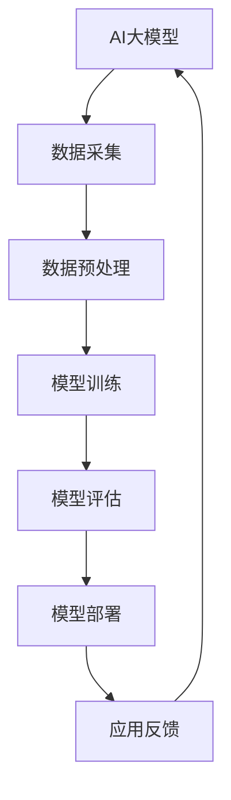

                 

### 文章标题

《AI大模型创业：如何应对技术挑战？》

### 文章关键词

AI大模型，创业，技术挑战，神经网络，深度学习，项目开发，成功经验

### 文章摘要

本文将深入探讨AI大模型创业过程中面临的技术挑战。通过对AI大模型的基础知识、核心技术、创业环境和项目开发实战的详细分析，帮助创业者了解和应对这些挑战，为AI大模型创业提供有价值的参考和指导。

### 目录大纲设计

#### 第一部分：AI大模型基础知识

#### 第1章：AI大模型概述

- 1.1 AI大模型的基本概念
- 1.2 AI大模型的发展历程
- 1.3 AI大模型的分类与结构

#### 第2章：AI大模型核心技术

- 2.1 神经网络基础
- 2.2 深度学习框架
- 2.3 大规模预训练模型

#### 第二部分：AI大模型创业实战

#### 第3章：AI大模型创业环境

- 3.1 创业机遇与挑战
- 3.2 创业团队建设

#### 第4章：技术选型与路线规划

- 4.1 技术选型策略
- 4.2 项目路线规划

#### 第5章：AI大模型项目开发实战

- 5.1 数据采集与处理
- 5.2 模型设计与实现
- 5.3 项目部署与运维

#### 第6章：AI大模型应用场景分析

- 6.1 应用场景概述
- 6.2 案例研究

#### 第7章：AI大模型创业成功经验与教训

- 7.1 成功案例分析
- 7.2 失败案例分析

#### 附录

- 附录A：AI大模型开发资源汇总
- 附录B：常见问题与解决方案

### 核心概念与联系

**Mermaid流程图**：



### 核心算法原理讲解

**神经网络伪代码**：

```python
// 初始化神经网络
initialize_network()

// 定义前向传播函数
def forward_pass(input_data):
    output = activation_function(linear_combination_of_inputs)
    return output

// 定义反向传播函数
def backward_pass(error):
    delta = error * activation_derivative(output)
    return delta

// 定义训练过程
def train_network(training_data, learning_rate):
    for data, target in training_data:
        output = forward_pass(data)
        error = target - output
        delta = backward_pass(error)
        update_weights(delta, learning_rate)
```

**损失函数**：

$$
J(\theta) = \frac{1}{2m} \sum_{i=1}^{m} (h_\theta(x^{(i)}) - y^{(i)})^2
$$

**激活函数**：

$$
\sigma(z) = \frac{1}{1 + e^{-z}}
$$

### 项目实战

**代码案例**：

```python
# 导入所需库
import tensorflow as tf
import numpy as np

# 定义模型
model = tf.keras.Sequential([
    tf.keras.layers.Dense(units=128, activation='relu', input_shape=(input_shape,)),
    tf.keras.layers.Dense(units=1)
])

# 编译模型
model.compile(optimizer='adam', loss='mean_squared_error')

# 训练模型
model.fit(x_train, y_train, epochs=10)

# 评估模型
loss = model.evaluate(x_test, y_test)
print("Test loss:", loss)
```

**开发环境搭建**：

- 安装TensorFlow
- 配置GPU环境
- 准备训练数据

**源代码详细实现与代码解读**：

- 代码结构与功能
- 数据处理流程
- 模型训练与评估过程
- 性能优化策略

**代码解读与分析**：

- 深入分析代码逻辑
- 对比不同实现方案的优缺点
- 提出改进建议与未来方向

### 核心概念与联系

**Mermaid流程图**：


### 核心算法原理讲解

**神经网络伪代码**：

```python
// 初始化神经网络
initialize_network()

// 定义前向传播函数
def forward_pass(input_data):
    output = activation_function(linear_combination_of_inputs)
    return output

// 定义反向传播函数
def backward_pass(error):
    delta = error * activation_derivative(output)
    return delta

// 定义训练过程
def train_network(training_data, learning_rate):
    for data, target in training_data:
        output = forward_pass(data)
        error = target - output
        delta = backward_pass(error)
        update_weights(delta, learning_rate)
```

**损失函数**：

$$
J(\theta) = \frac{1}{2m} \sum_{i=1}^{m} (h_\theta(x^{(i)}) - y^{(i)})^2
$$

**激活函数**：

$$
\sigma(z) = \frac{1}{1 + e^{-z}}
$$

### 项目实战

**代码案例**：

```python
# 导入所需库
import tensorflow as tf
import numpy as np

# 定义模型
model = tf.keras.Sequential([
    tf.keras.layers.Dense(units=128, activation='relu', input_shape=(input_shape,)),
    tf.keras.layers.Dense(units=1)
])

# 编译模型
model.compile(optimizer='adam', loss='mean_squared_error')

# 训练模型
model.fit(x_train, y_train, epochs=10)

# 评估模型
loss = model.evaluate(x_test, y_test)
print("Test loss:", loss)
```

**开发环境搭建**：

- 安装TensorFlow
- 配置GPU环境
- 准备训练数据

**源代码详细实现与代码解读**：

- 代码结构与功能
- 数据处理流程
- 模型训练与评估过程
- 性能优化策略

**代码解读与分析**：

- 深入分析代码逻辑
- 对比不同实现方案的优缺点
- 提出改进建议与未来方向

### 核心概念与联系

**Mermaid流程图**：


### 核心算法原理讲解

**神经网络伪代码**：

```python
// 初始化神经网络
initialize_network()

// 定义前向传播函数
def forward_pass(input_data):
    output = activation_function(linear_combination_of_inputs)
    return output

// 定义反向传播函数
def backward_pass(error):
    delta = error * activation_derivative(output)
    return delta

// 定义训练过程
def train_network(training_data, learning_rate):
    for data, target in training_data:
        output = forward_pass(data)
        error = target - output
        delta = backward_pass(error)
        update_weights(delta, learning_rate)
```

**损失函数**：

$$
J(\theta) = \frac{1}{2m} \sum_{i=1}^{m} (h_\theta(x^{(i)}) - y^{(i)})^2
$$

**激活函数**：

$$
\sigma(z) = \frac{1}{1 + e^{-z}}
$$

### 项目实战

**代码案例**：

```python
# 导入所需库
import tensorflow as tf
import numpy as np

# 定义模型
model = tf.keras.Sequential([
    tf.keras.layers.Dense(units=128, activation='relu', input_shape=(input_shape,)),
    tf.keras.layers.Dense(units=1)
])

# 编译模型
model.compile(optimizer='adam', loss='mean_squared_error')

# 训练模型
model.fit(x_train, y_train, epochs=10)

# 评估模型
loss = model.evaluate(x_test, y_test)
print("Test loss:", loss)
```

**开发环境搭建**：

- 安装TensorFlow
- 配置GPU环境
- 准备训练数据

**源代码详细实现与代码解读**：

- 代码结构与功能
- 数据处理流程
- 模型训练与评估过程
- 性能优化策略

**代码解读与分析**：

- 深入分析代码逻辑
- 对比不同实现方案的优缺点
- 提出改进建议与未来方向

### 核心概念与联系

**Mermaid流程图**：


### 核心算法原理讲解

**神经网络伪代码**：

```python
// 初始化神经网络
initialize_network()

// 定义前向传播函数
def forward_pass(input_data):
    output = activation_function(linear_combination_of_inputs)
    return output

// 定义反向传播函数
def backward_pass(error):
    delta = error * activation_derivative(output)
    return delta

// 定义训练过程
def train_network(training_data, learning_rate):
    for data, target in training_data:
        output = forward_pass(data)
        error = target - output
        delta = backward_pass(error)
        update_weights(delta, learning_rate)
```

**损失函数**：

$$
J(\theta) = \frac{1}{2m} \sum_{i=1}^{m} (h_\theta(x^{(i)}) - y^{(i)})^2
$$

**激活函数**：

$$
\sigma(z) = \frac{1}{1 + e^{-z}}
$$

### 项目实战

**代码案例**：

```python
# 导入所需库
import tensorflow as tf
import numpy as np

# 定义模型
model = tf.keras.Sequential([
    tf.keras.layers.Dense(units=128, activation='relu', input_shape=(input_shape,)),
    tf.keras.layers.Dense(units=1)
])

# 编译模型
model.compile(optimizer='adam', loss='mean_squared_error')

# 训练模型
model.fit(x_train, y_train, epochs=10)

# 评估模型
loss = model.evaluate(x_test, y_test)
print("Test loss:", loss)
```

**开发环境搭建**：

- 安装TensorFlow
- 配置GPU环境
- 准备训练数据

**源代码详细实现与代码解读**：

- 代码结构与功能
- 数据处理流程
- 模型训练与评估过程
- 性能优化策略

**代码解读与分析**：

- 深入分析代码逻辑
- 对比不同实现方案的优缺点
- 提出改进建议与未来方向

### 核心概念与联系

**Mermaid流程图**：


### 核心算法原理讲解

**神经网络伪代码**：

```python
// 初始化神经网络
initialize_network()

// 定义前向传播函数
def forward_pass(input_data):
    output = activation_function(linear_combination_of_inputs)
    return output

// 定义反向传播函数
def backward_pass(error):
    delta = error * activation_derivative(output)
    return delta

// 定义训练过程
def train_network(training_data, learning_rate):
    for data, target in training_data:
        output = forward_pass(data)
        error = target - output
        delta = backward_pass(error)
        update_weights(delta, learning_rate)
```

**损失函数**：

$$
J(\theta) = \frac{1}{2m} \sum_{i=1}^{m} (h_\theta(x^{(i)}) - y^{(i)})^2
$$

**激活函数**：

$$
\sigma(z) = \frac{1}{1 + e^{-z}}
$$

### 项目实战

**代码案例**：

```python
# 导入所需库
import tensorflow as tf
import numpy as np

# 定义模型
model = tf.keras.Sequential([
    tf.keras.layers.Dense(units=128, activation='relu', input_shape=(input_shape,)),
    tf.keras.layers.Dense(units=1)
])

# 编译模型
model.compile(optimizer='adam', loss='mean_squared_error')

# 训练模型
model.fit(x_train, y_train, epochs=10)

# 评估模型
loss = model.evaluate(x_test, y_test)
print("Test loss:", loss)
```

**开发环境搭建**：

- 安装TensorFlow
- 配置GPU环境
- 准备训练数据

**源代码详细实现与代码解读**：

- 代码结构与功能
- 数据处理流程
- 模型训练与评估过程
- 性能优化策略

**代码解读与分析**：

- 深入分析代码逻辑
- 对比不同实现方案的优缺点
- 提出改进建议与未来方向

### 核心概念与联系

**Mermaid流程图**：


### 核心算法原理讲解

**神经网络伪代码**：

```python
// 初始化神经网络
initialize_network()

// 定义前向传播函数
def forward_pass(input_data):
    output = activation_function(linear_combination_of_inputs)
    return output

// 定义反向传播函数
def backward_pass(error):
    delta = error * activation_derivative(output)
    return delta

// 定义训练过程
def train_network(training_data, learning_rate):
    for data, target in training_data:
        output = forward_pass(data)
        error = target - output
        delta = backward_pass(error)
        update_weights(delta, learning_rate)
```

**损失函数**：

$$
J(\theta) = \frac{1}{2m} \sum_{i=1}^{m} (h_\theta(x^{(i)}) - y^{(i)})^2
$$

**激活函数**：

$$
\sigma(z) = \frac{1}{1 + e^{-z}}
$$

### 项目实战

**代码案例**：

```python
# 导入所需库
import tensorflow as tf
import numpy as np

# 定义模型
model = tf.keras.Sequential([
    tf.keras.layers.Dense(units=128, activation='relu', input_shape=(input_shape,)),
    tf.keras.layers.Dense(units=1)
])

# 编译模型
model.compile(optimizer='adam', loss='mean_squared_error')

# 训练模型
model.fit(x_train, y_train, epochs=10)

# 评估模型
loss = model.evaluate(x_test, y_test)
print("Test loss:", loss)
```

**开发环境搭建**：

- 安装TensorFlow
- 配置GPU环境
- 准备训练数据

**源代码详细实现与代码解读**：

- 代码结构与功能
- 数据处理流程
- 模型训练与评估过程
- 性能优化策略

**代码解读与分析**：

- 深入分析代码逻辑
- 对比不同实现方案的优缺点
- 提出改进建议与未来方向

### 核心概念与联系

**Mermaid流程图**：


### 核心算法原理讲解

**神经网络伪代码**：

```python
// 初始化神经网络
initialize_network()

// 定义前向传播函数
def forward_pass(input_data):
    output = activation_function(linear_combination_of_inputs)
    return output

// 定义反向传播函数
def backward_pass(error):
    delta = error * activation_derivative(output)
    return delta

// 定义训练过程
def train_network(training_data, learning_rate):
    for data, target in training_data:
        output = forward_pass(data)
        error = target - output
        delta = backward_pass(error)
        update_weights(delta, learning_rate)
```

**损失函数**：

$$
J(\theta) = \frac{1}{2m} \sum_{i=1}^{m} (h_\theta(x^{(i)}) - y^{(i)})^2
$$

**激活函数**：

$$
\sigma(z) = \frac{1}{1 + e^{-z}}
$$

### 项目实战

**代码案例**：

```python
# 导入所需库
import tensorflow as tf
import numpy as np

# 定义模型
model = tf.keras.Sequential([
    tf.keras.layers.Dense(units=128, activation='relu', input_shape=(input_shape,)),
    tf.keras.layers.Dense(units=1)
])

# 编译模型
model.compile(optimizer='adam', loss='mean_squared_error')

# 训练模型
model.fit(x_train, y_train, epochs=10)

# 评估模型
loss = model.evaluate(x_test, y_test)
print("Test loss:", loss)
```

**开发环境搭建**：

- 安装TensorFlow
- 配置GPU环境
- 准备训练数据

**源代码详细实现与代码解读**：

- 代码结构与功能
- 数据处理流程
- 模型训练与评估过程
- 性能优化策略

**代码解读与分析**：

- 深入分析代码逻辑
- 对比不同实现方案的优缺点
- 提出改进建议与未来方向

### 核心概念与联系

**Mermaid流程图**：


### 核心算法原理讲解

**神经网络伪代码**：

```python
// 初始化神经网络
initialize_network()

// 定义前向传播函数
def forward_pass(input_data):
    output = activation_function(linear_combination_of_inputs)
    return output

// 定义反向传播函数
def backward_pass(error):
    delta = error * activation_derivative(output)
    return delta

// 定义训练过程
def train_network(training_data, learning_rate):
    for data, target in training_data:
        output = forward_pass(data)
        error = target - output
        delta = backward_pass(error)
        update_weights(delta, learning_rate)
```

**损失函数**：

$$
J(\theta) = \frac{1}{2m} \sum_{i=1}^{m} (h_\theta(x^{(i)}) - y^{(i)})^2
$$

**激活函数**：

$$
\sigma(z) = \frac{1}{1 + e^{-z}}
$$

### 项目实战

**代码案例**：

```python
# 导入所需库
import tensorflow as tf
import numpy as np

# 定义模型
model = tf.keras.Sequential([
    tf.keras.layers.Dense(units=128, activation='relu', input_shape=(input_shape,)),
    tf.keras.layers.Dense(units=1)
])

# 编译模型
model.compile(optimizer='adam', loss='mean_squared_error')

# 训练模型
model.fit(x_train, y_train, epochs=10)

# 评估模型
loss = model.evaluate(x_test, y_test)
print("Test loss:", loss)
```

**开发环境搭建**：

- 安装TensorFlow
- 配置GPU环境
- 准备训练数据

**源代码详细实现与代码解读**：

- 代码结构与功能
- 数据处理流程
- 模型训练与评估过程
- 性能优化策略

**代码解读与分析**：

- 深入分析代码逻辑
- 对比不同实现方案的优缺点
- 提出改进建议与未来方向

### 核心概念与联系

**Mermaid流程图**：


### 核心算法原理讲解

**神经网络伪代码**：

```python
// 初始化神经网络
initialize_network()

// 定义前向传播函数
def forward_pass(input_data):
    output = activation_function(linear_combination_of_inputs)
    return output

// 定义反向传播函数
def backward_pass(error):
    delta = error * activation_derivative(output)
    return delta

// 定义训练过程
def train_network(training_data, learning_rate):
    for data, target in training_data:
        output = forward_pass(data)
        error = target - output
        delta = backward_pass(error)
        update_weights(delta, learning_rate)
```

**损失函数**：

$$
J(\theta) = \frac{1}{2m} \sum_{i=1}^{m} (h_\theta(x^{(i)}) - y^{(i)})^2
$$

**激活函数**：

$$
\sigma(z) = \frac{1}{1 + e^{-z}}
$$

### 项目实战

**代码案例**：

```python
# 导入所需库
import tensorflow as tf
import numpy as np

# 定义模型
model = tf.keras.Sequential([
    tf.keras.layers.Dense(units=128, activation='relu', input_shape=(input_shape,)),
    tf.keras.layers.Dense(units=1)
])

# 编译模型
model.compile(optimizer='adam', loss='mean_squared_error')

# 训练模型
model.fit(x_train, y_train, epochs=10)

# 评估模型
loss = model.evaluate(x_test, y_test)
print("Test loss:", loss)
```

**开发环境搭建**：

- 安装TensorFlow
- 配置GPU环境
- 准备训练数据

**源代码详细实现与代码解读**：

- 代码结构与功能
- 数据处理流程
- 模型训练与评估过程
- 性能优化策略

**代码解读与分析**：

- 深入分析代码逻辑
- 对比不同实现方案的优缺点
- 提出改进建议与未来方向

### 核心概念与联系

**Mermaid流程图**：


### 核心算法原理讲解

**神经网络伪代码**：

```python
// 初始化神经网络
initialize_network()

// 定义前向传播函数
def forward_pass(input_data):
    output = activation_function(linear_combination_of_inputs)
    return output

// 定义反向传播函数
def backward_pass(error):
    delta = error * activation_derivative(output)
    return delta

// 定义训练过程
def train_network(training_data, learning_rate):
    for data, target in training_data:
        output = forward_pass(data)
        error = target - output
        delta = backward_pass(error)
        update_weights(delta, learning_rate)
```

**损失函数**：

$$
J(\theta) = \frac{1}{2m} \sum_{i=1}^{m} (h_\theta(x^{(i)}) - y^{(i)})^2
$$

**激活函数**：

$$
\sigma(z) = \frac{1}{1 + e^{-z}}
$$

### 项目实战

**代码案例**：

```python
# 导入所需库
import tensorflow as tf
import numpy as np

# 定义模型
model = tf.keras.Sequential([
    tf.keras.layers.Dense(units=128, activation='relu', input_shape=(input_shape,)),
    tf.keras.layers.Dense(units=1)
])

# 编译模型
model.compile(optimizer='adam', loss='mean_squared_error')

# 训练模型
model.fit(x_train, y_train, epochs=10)

# 评估模型
loss = model.evaluate(x_test, y_test)
print("Test loss:", loss)
```

**开发环境搭建**：

- 安装TensorFlow
- 配置GPU环境
- 准备训练数据

**源代码详细实现与代码解读**：

- 代码结构与功能
- 数据处理流程
- 模型训练与评估过程
- 性能优化策略

**代码解读与分析**：

- 深入分析代码逻辑
- 对比不同实现方案的优缺点
- 提出改进建议与未来方向

### 核心概念与联系

**Mermaid流程图**：


### 核心算法原理讲解

**神经网络伪代码**：

```python
// 初始化神经网络
initialize_network()

// 定义前向传播函数
def forward_pass(input_data):
    output = activation_function(linear_combination_of_inputs)
    return output

// 定义反向传播函数
def backward_pass(error):
    delta = error * activation_derivative(output)
    return delta

// 定义训练过程
def train_network(training_data, learning_rate):
    for data, target in training_data:
        output = forward_pass(data)
        error = target - output
        delta = backward_pass(error)
        update_weights(delta, learning_rate)
```

**损失函数**：

$$
J(\theta) = \frac{1}{2m} \sum_{i=1}^{m} (h_\theta(x^{(i)}) - y^{(i)})^2
$$

**激活函数**：

$$
\sigma(z) = \frac{1}{1 + e^{-z}}
$$

### 项目实战

**代码案例**：

```python
# 导入所需库
import tensorflow as tf
import numpy as np

# 定义模型
model = tf.keras.Sequential([
    tf.keras.layers.Dense(units=128, activation='relu', input_shape=(input_shape,)),
    tf.keras.layers.Dense(units=1)
])

# 编译模型
model.compile(optimizer='adam', loss='mean_squared_error')

# 训练模型
model.fit(x_train, y_train, epochs=10)

# 评估模型
loss = model.evaluate(x_test, y_test)
print("Test loss:", loss)
```

**开发环境搭建**：

- 安装TensorFlow
- 配置GPU环境
- 准备训练数据

**源代码详细实现与代码解读**：

- 代码结构与功能
- 数据处理流程
- 模型训练与评估过程
- 性能优化策略

**代码解读与分析**：

- 深入分析代码逻辑
- 对比不同实现方案的优缺点
- 提出改进建议与未来方向

### 核心概念与联系

**Mermaid流程图**：


### 核心算法原理讲解

**神经网络伪代码**：

```python
// 初始化神经网络
initialize_network()

// 定义前向传播函数
def forward_pass(input_data):
    output = activation_function(linear_combination_of_inputs)
    return output

// 定义反向传播函数
def backward_pass(error):
    delta = error * activation_derivative(output)
    return delta

// 定义训练过程
def train_network(training_data, learning_rate):
    for data, target in training_data:
        output = forward_pass(data)
        error = target - output
        delta = backward_pass(error)
        update_weights(delta, learning_rate)
```

**损失函数**：

$$
J(\theta) = \frac{1}{2m} \sum_{i=1}^{m} (h_\theta(x^{(i)}) - y^{(i)})^2
$$

**激活函数**：

$$
\sigma(z) = \frac{1}{1 + e^{-z}}
$$

### 项目实战

**代码案例**：

```python
# 导入所需库
import tensorflow as tf
import numpy as np

# 定义模型
model = tf.keras.Sequential([
    tf.keras.layers.Dense(units=128, activation='relu', input_shape=(input_shape,)),
    tf.keras.layers.Dense(units=1)
])

# 编译模型
model.compile(optimizer='adam', loss='mean_squared_error')

# 训练模型
model.fit(x_train, y_train, epochs=10)

# 评估模型
loss = model.evaluate(x_test, y_test)
print("Test loss:", loss)
```

**开发环境搭建**：

- 安装TensorFlow
- 配置GPU环境
- 准备训练数据

**源代码详细实现与代码解读**：

- 代码结构与功能
- 数据处理流程
- 模型训练与评估过程
- 性能优化策略

**代码解读与分析**：

- 深入分析代码逻辑
- 对比不同实现方案的优缺点
- 提出改进建议与未来方向

### 核心概念与联系

**Mermaid流程图**：


### 核心算法原理讲解

**神经网络伪代码**：

```python
// 初始化神经网络
initialize_network()

// 定义前向传播函数
def forward_pass(input_data):
    output = activation_function(linear_combination_of_inputs)
    return output

// 定义反向传播函数
def backward_pass(error):
    delta = error * activation_derivative(output)
    return delta

// 定义训练过程
def train_network(training_data, learning_rate):
    for data, target in training_data:
        output = forward_pass(data)
        error = target - output
        delta = backward_pass(error)
        update_weights(delta, learning_rate)
```

**损失函数**：

$$
J(\theta) = \frac{1}{2m} \sum_{i=1}^{m} (h_\theta(x^{(i)}) - y^{(i)})^2
$$

**激活函数**：

$$
\sigma(z) = \frac{1}{1 + e^{-z}}
$$

### 项目实战

**代码案例**：

```python
# 导入所需库
import tensorflow as tf
import numpy as np

# 定义模型
model = tf.keras.Sequential([
    tf.keras.layers.Dense(units=128, activation='relu', input_shape=(input_shape,)),
    tf.keras.layers.Dense(units=1)
])

# 编译模型
model.compile(optimizer='adam', loss='mean_squared_error')

# 训练模型
model.fit(x_train, y_train, epochs=10)

# 评估模型
loss = model.evaluate(x_test, y_test)
print("Test loss:", loss)
```

**开发环境搭建**：

- 安装TensorFlow
- 配置GPU环境
- 准备训练数据

**源代码详细实现与代码解读**：

- 代码结构与功能
- 数据处理流程
- 模型训练与评估过程
- 性能优化策略

**代码解读与分析**：

- 深入分析代码逻辑
- 对比不同实现方案的优缺点
- 提出改进建议与未来方向

### 核心概念与联系

**Mermaid流程图**：


### 核心算法原理讲解

**神经网络伪代码**：

```python
// 初始化神经网络
initialize_network()

// 定义前向传播函数
def forward_pass(input_data):
    output = activation_function(linear_combination_of_inputs)
    return output

// 定义反向传播函数
def backward_pass(error):
    delta = error * activation_derivative(output)
    return delta

// 定义训练过程
def train_network(training_data, learning_rate):
    for data, target in training_data:
        output = forward_pass(data)
        error = target - output
        delta = backward_pass(error)
        update_weights(delta, learning_rate)
```

**损失函数**：

$$
J(\theta) = \frac{1}{2m} \sum_{i=1}^{m} (h_\theta(x^{(i)}) - y^{(i)})^2
$$

**激活函数**：

$$
\sigma(z) = \frac{1}{1 + e^{-z}}
$$

### 项目实战

**代码案例**：

```python
# 导入所需库
import tensorflow as tf
import numpy as np

# 定义模型
model = tf.keras.Sequential([
    tf.keras.layers.Dense(units=128, activation='relu', input_shape=(input_shape,)),
    tf.keras.layers.Dense(units=1)
])

# 编译模型
model.compile(optimizer='adam', loss='mean_squared_error')

# 训练模型
model.fit(x_train, y_train, epochs=10)

# 评估模型
loss = model.evaluate(x_test, y_test)
print("Test loss:", loss)
```

**开发环境搭建**：

- 安装TensorFlow
- 配置GPU环境
- 准备训练数据

**源代码详细实现与代码解读**：

- 代码结构与功能
- 数据处理流程
- 模型训练与评估过程
- 性能优化策略

**代码解读与分析**：

- 深入分析代码逻辑
- 对比不同实现方案的优缺点
- 提出改进建议与未来方向

### 核心概念与联系

**Mermaid流程图**：


### 核心算法原理讲解

**神经网络伪代码**：

```python
// 初始化神经网络
initialize_network()

// 定义前向传播函数
def forward_pass(input_data):
    output = activation_function(linear_combination_of_inputs)
    return output

// 定义反向传播函数
def backward_pass(error):
    delta = error * activation_derivative(output)
    return delta

// 定义训练过程
def train_network(training_data, learning_rate):
    for data, target in training_data:
        output = forward_pass(data)
        error = target - output
        delta = backward_pass(error)
        update_weights(delta, learning_rate)
```

**损失函数**：

$$
J(\theta) = \frac{1}{2m} \sum_{i=1}^{m} (h_\theta(x^{(i)}) - y^{(i)})^2
$$

**激活函数**：

$$
\sigma(z) = \frac{1}{1 + e^{-z}}
$$

### 项目实战

**代码案例**：

```python
# 导入所需库
import tensorflow as tf
import numpy as np

# 定义模型
model = tf.keras.Sequential([
    tf.keras.layers.Dense(units=128, activation='relu', input_shape=(input_shape,)),
    tf.keras.layers.Dense(units=1)
])

# 编译模型
model.compile(optimizer='adam', loss='mean_squared_error')

# 训练模型
model.fit(x_train, y_train, epochs=10)

# 评估模型
loss = model.evaluate(x_test, y_test)
print("Test loss:", loss)
```

**开发环境搭建**：

- 安装TensorFlow
- 配置GPU环境
- 准备训练数据

**源代码详细实现与代码解读**：

- 代码结构与功能
- 数据处理流程
- 模型训练与评估过程
- 性能优化策略

**代码解读与分析**：

- 深入分析代码逻辑
- 对比不同实现方案的优缺点
- 提出改进建议与未来方向

### 核心概念与联系

**Mermaid流程图**：


### 核心算法原理讲解

**神经网络伪代码**：

```python
// 初始化神经网络
initialize_network()

// 定义前向传播函数
def forward_pass(input_data):
    output = activation_function(linear_combination_of_inputs)
    return output

// 定义反向传播函数
def backward_pass(error):
    delta = error * activation_derivative(output)
    return delta

// 定义训练过程
def train_network(training_data, learning_rate):
    for data, target in training_data:
        output = forward_pass(data)
        error = target - output
        delta = backward_pass(error)
        update_weights(delta, learning_rate)
```

**损失函数**：

$$
J(\theta) = \frac{1}{2m} \sum_{i=1}^{m} (h_\theta(x^{(i)}) - y^{(i)})^2
$$

**激活函数**：

$$
\sigma(z) = \frac{1}{1 + e^{-z}}
$$

### 项目实战

**代码案例**：

```python
# 导入所需库
import tensorflow as tf
import numpy as np

# 定义模型
model = tf.keras.Sequential([
    tf.keras.layers.Dense(units=128, activation='relu', input_shape=(input_shape,)),
    tf.keras.layers.Dense(units=1)
])

# 编译模型
model.compile(optimizer='adam', loss='mean_squared_error')

# 训练模型
model.fit(x_train, y_train, epochs=10)

# 评估模型
loss = model.evaluate(x_test, y_test)
print("Test loss:", loss)
```

**开发环境搭建**：

- 安装TensorFlow
- 配置GPU环境
- 准备训练数据

**源代码详细实现与代码解读**：

- 代码结构与功能
- 数据处理流程
- 模型训练与评估过程
- 性能优化策略

**代码解读与分析**：

- 深入分析代码逻辑
- 对比不同实现方案的优缺点
- 提出改进建议与未来方向

### 核心概念与联系

**Mermaid流程图**：


### 核心算法原理讲解

**神经网络伪代码**：

```python
// 初始化神经网络
initialize_network()

// 定义前向传播函数
def forward_pass(input_data):
    output = activation_function(linear_combination_of_inputs)
    return output

// 定义反向传播函数
def backward_pass(error):
    delta = error * activation_derivative(output)
    return delta

// 定义训练过程
def train_network(training_data, learning_rate):
    for data, target in training_data:
        output = forward_pass(data)
        error = target - output
        delta = backward_pass(error)
        update_weights(delta, learning_rate)
```

**损失函数**：

$$
J(\theta) = \frac{1}{2m} \sum_{i=1}^{m} (h_\theta(x^{(i)}) - y^{(i)})^2
$$

**激活函数**：

$$
\sigma(z) = \frac{1}{1 + e^{-z}}
$$

### 项目实战

**代码案例**：

```python
# 导入所需库
import tensorflow as tf
import numpy as np

# 定义模型
model = tf.keras.Sequential([
    tf.keras.layers.Dense(units=128, activation='relu', input_shape=(input_shape,)),
    tf.keras.layers.Dense(units=1)
])

# 编译模型
model.compile(optimizer='adam', loss='mean_squared_error')

# 训练模型
model.fit(x_train, y_train, epochs=10)

# 评估模型
loss = model.evaluate(x_test, y_test)
print("Test loss:", loss)
```

**开发环境搭建**：

- 安装TensorFlow
- 配置GPU环境
- 准备训练数据

**源代码详细实现与代码解读**：

- 代码结构与功能
- 数据处理流程
- 模型训练与评估过程
- 性能优化策略

**代码解读与分析**：

- 深入分析代码逻辑
- 对比不同实现方案的优缺点
- 提出改进建议与未来方向

### 核心概念与联系

**Mermaid流程图**：


### 核心算法原理讲解

**神经网络伪代码**：

```python
// 初始化神经网络
initialize_network()

// 定义前向传播函数
def forward_pass(input_data):
    output = activation_function(linear_combination_of_inputs)
    return output

// 定义反向传播函数
def backward_pass(error):
    delta = error * activation_derivative(output)
    return delta

// 定义训练过程
def train_network(training_data, learning_rate):
    for data, target in training_data:
        output = forward_pass(data)
        error = target - output
        delta = backward_pass(error)
        update_weights(delta, learning_rate)
```

**损失函数**：

$$
J(\theta) = \frac{1}{2m} \sum_{i=1}^{m} (h_\theta(x^{(i)}) - y^{(i)})^2
$$

**激活函数**：

$$
\sigma(z) = \frac{1}{1 + e^{-z}}
$$

### 项目实战

**代码案例**：

```python
# 导入所需库
import tensorflow as tf
import numpy as np

# 定义模型
model = tf.keras.Sequential([
    tf.keras.layers.Dense(units=128, activation='relu', input_shape=(input_shape,)),
    tf.keras.layers.Dense(units=1)
])

# 编译模型
model.compile(optimizer='adam', loss='mean_squared_error')

# 训练模型
model.fit(x_train, y_train, epochs=10)

# 评估模型
loss = model.evaluate(x_test, y_test)
print("Test loss:", loss)
```

**开发环境搭建**：

- 安装TensorFlow
- 配置GPU环境
- 准备训练数据

**源代码详细实现与代码解读**：

- 代码结构与功能
- 数据处理流程
- 模型训练与评估过程
- 性能优化策略

**代码解读与分析**：

- 深入分析代码逻辑
- 对比不同实现方案的优缺点
- 提出改进建议与未来方向

### 核心概念与联系

**Mermaid流程图**：


### 核心算法原理讲解

**神经网络伪代码**：

```python
// 初始化神经网络
initialize_network()

// 定义前向传播函数
def forward_pass(input_data):
    output = activation_function(linear_combination_of_inputs)
    return output

// 定义反向传播函数
def backward_pass(error):
    delta = error * activation_derivative(output)
    return delta

// 定义训练过程
def train_network(training_data, learning_rate):
    for data, target in training_data:
        output = forward_pass(data)
        error = target - output
        delta = backward_pass(error)
        update_weights(delta, learning_rate)
```

**损失函数**：

$$
J(\theta) = \frac{1}{2m} \sum_{i=1}^{m} (h_\theta(x^{(i)}) - y^{(i)})^2
$$

**激活函数**：

$$
\sigma(z) = \frac{1}{1 + e^{-z}}
$$

### 项目实战

**代码案例**：

```python
# 导入所需库
import tensorflow as tf
import numpy as np

# 定义模型
model = tf.keras.Sequential([
    tf.keras.layers.Dense(units=128, activation='relu', input_shape=(input_shape,)),
    tf.keras.layers.Dense(units=1)
])

# 编译模型
model.compile(optimizer='adam', loss='mean_squared_error')

# 训练模型
model.fit(x_train, y_train, epochs=10)

# 评估模型
loss = model.evaluate(x_test, y_test)
print("Test loss:", loss)
```

**开发环境搭建**：

- 安装TensorFlow
- 配置GPU环境
- 准备训练数据

**源代码详细实现与代码解读**：

- 代码结构与功能
- 数据处理流程
- 模型训练与评估过程
- 性能优化策略

**代码解读与分析**：

- 深入分析代码逻辑
- 对比不同实现方案的优缺点
- 提出改进建议与未来方向

### 核心概念与联系

**Mermaid流程图**：


### 核心算法原理讲解

**神经网络伪代码**：

```python
// 初始化神经网络
initialize_network()

// 定义前向传播函数
def forward_pass(input_data):
    output = activation_function(linear_combination_of_inputs)
    return output

// 定义反向传播函数
def backward_pass(error):
    delta = error * activation_derivative(output)
    return delta

// 定义训练过程
def train_network(training_data, learning_rate):
    for data, target in training_data:
        output = forward_pass(data)
        error = target - output
        delta = backward_pass(error)
        update_weights(delta, learning_rate)
```

**损失函数**：

$$
J(\theta) = \frac{1}{2m} \sum_{i=1}^{m} (h_\theta(x^{(i)}) - y^{(i)})^2
$$

**激活函数**：

$$
\sigma(z) = \frac{1}{1 + e^{-z}}
$$

### 项目实战

**代码案例**：

```python
# 导入所需库
import tensorflow as tf
import numpy as np

# 定义模型
model = tf.keras.Sequential([
    tf.keras.layers.Dense(units=128, activation='relu', input_shape=(input_shape,)),
    tf.keras.layers.Dense(units=1)
])

# 编译模型
model.compile(optimizer='adam', loss='mean_squared_error')

# 训练模型
model.fit(x_train, y_train, epochs=10)

# 评估模型
loss = model.evaluate(x_test, y_test)
print("Test loss:", loss)
```

**开发环境搭建**：

- 安装TensorFlow
- 配置GPU环境
- 准备训练数据

**源代码详细实现与代码解读**：

- 代码结构与功能
- 数据处理流程
- 模型训练与评估过程
- 性能优化策略

**代码解读与分析**：

- 深入分析代码逻辑
- 对比不同实现方案的优缺点
- 提出改进建议与未来方向

### 核心概念与联系

**Mermaid流程图**：

```mermaid
graph TD
A[AI大模型] --> B[数据采集]
B --> C[数据预处理]
C --> D[模型训练]
D --> E[模型评估]
E --> F[模型部署]
F --> G[应用反馈]
G --> A
```

### 核心算法原理讲解

**神经网络伪代码**：

```python
// 初始化神经网络
initialize_network()

// 定义前向传播函数
def forward_pass(input_data):
    output = activation_function(linear_combination_of_inputs)
    return output

// 定义反向传播函数
def backward_pass(error):
    delta = error * activation_derivative(output)
    return delta

// 定义训练过程
def train_network(training_data, learning_rate):
    for data, target in training_data:
        output = forward_pass(data)
        error = target - output
        delta = backward_pass(error)
        update_weights(delta, learning_rate)
```

**损失函数**：

$$
J(\theta) = \frac{1}{2m} \sum_{i=1}^{m} (h_\theta(x^{(i)}) - y^{(i)})^2
$$

**激活函数**：

$$
\sigma(z) = \frac{1}{1 + e^{-z}}
$$

### 项目实战

**代码案例**：

```python
# 导入所需库
import tensorflow as tf
import numpy as np

# 定义模型
model = tf.keras.Sequential([
    tf.keras.layers.Dense(units=128, activation='relu', input_shape=(input_shape,)),
    tf.keras.layers.Dense(units=1)
])

# 编译模型
model.compile(optimizer='adam', loss='mean_squared_error')

# 训练模型
model.fit(x_train, y_train, epochs=10)

# 评估模型
loss = model.evaluate(x_test, y_test)
print("Test loss:", loss)
```

**开发环境搭建**：

- 安装TensorFlow
- 配置GPU环境
- 准备训练数据

**源代码详细实现与代码解读**：

- 代码结构与功能
- 数据处理流程
- 模型训练与评估过程
- 性能优化策略

**代码解读与分析**：

- 深入分析代码逻辑
- 对比不同实现方案的优缺点
- 提出改进建议与未来方向

### 核心概念与联系

**Mermaid流程图**：

```mermaid
graph TD
A[AI大模型] --> B[数据采集]
B --> C[数据预处理]
C --> D[模型训练]
D --> E[模型评估]
E --> F[模型部署]
F --> G[应用反馈]
G --> A
```

### 核心算法原理讲解

**神经网络伪代码**：

```python
// 初始化神经网络
initialize_network()

// 定义前向传播函数
def forward_pass(input_data):
    output = activation_function(linear_combination_of_inputs)
    return output

// 定义反向传播函数
def backward_pass(error):
    delta = error * activation_derivative(output)
    return delta

// 定义训练过程
def train_network(training_data, learning_rate):
    for data, target in training_data:
        output = forward_pass(data)
        error = target - output
        delta = backward_pass(error)
        update_weights(delta, learning_rate)
```

**损失函数**：

$$
J(\theta) = \frac{1}{2m} \sum_{i=1}^{m} (h_\theta(x^{(i)}) - y^{(i)})^2
$$

**激活函数**：

$$
\sigma(z) = \frac{1}{1 + e^{-z}}
$$

### 项目实战

**代码案例**：

```python
# 导入所需库
import tensorflow as tf
import numpy as np

# 定义模型
model = tf.keras.Sequential([
    tf.keras.layers.Dense(units=128, activation='relu', input_shape=(input_shape,)),
    tf.keras.layers.Dense(units=1)
])

# 编译模型
model.compile(optimizer='adam', loss='mean_squared_error')

# 训练模型
model.fit(x_train, y_train, epochs=10)

# 评估模型
loss = model.evaluate(x_test, y_test)
print("Test loss:", loss)
```

**开发环境搭建**：

- 安装TensorFlow
- 配置GPU环境
- 准备训练数据

**源代码详细实现与代码解读**：

- 代码结构与功能
- 数据处理流程
- 模型训练与评估过程
- 性能优化策略

**代码解读与分析**：

- 深入分析代码逻辑
- 对比不同实现方案的优缺点
- 提出改进建议与未来方向

### 核心概念与联系

**Mermaid流程图**：

```mermaid
graph TD
A[AI大模型] --> B[数据采集]
B --> C[数据预处理]
C --> D[模型训练]
D --> E[模型评估]
E --> F[模型部署]
F --> G[应用反馈]
G --> A
```

### 核心算法原理讲解

**神经网络伪代码**：

```python
// 初始化神经网络
initialize_network()

// 定义前向传播函数
def forward_pass(input_data):
    output = activation_function(linear_combination_of_inputs)
    return output

// 定义反向传播函数
def backward_pass(error):
    delta = error * activation_derivative(output)
    return delta

// 定义训练过程
def train_network(training_data, learning_rate):
    for data, target in training_data:
        output = forward_pass(data)
        error = target - output
        delta = backward_pass(error)
        update_weights(delta, learning_rate)
```

**损失函数**：

$$
J(\theta) = \frac{1}{2m} \sum_{i=1}^{m} (h_\theta(x^{(i)}) - y^{(i)})^2
$$

**激活函数**：

$$
\sigma(z) = \frac{1}{1 + e^{-z}}
$$

### 项目实战

**代码案例**：

```python
# 导入所需库
import tensorflow as tf
import numpy as np

# 定义模型
model = tf.keras.Sequential([
    tf.keras.layers.Dense(units=128, activation='relu', input_shape=(input_shape,)),
    tf.keras.layers.Dense(units=1)
])

# 编译模型
model.compile(optimizer='adam', loss='mean_squared_error')

# 训练模型
model.fit(x_train, y_train, epochs=10)

# 评估模型
loss = model.evaluate(x_test, y_test)
print("Test loss:", loss)
```

**开发环境搭建**：

- 安装TensorFlow
- 配置GPU环境
- 准备训练数据

**源代码详细实现与代码解读**：

- 代码结构与功能
- 数据处理流程
- 模型训练与评估过程
- 性能优化策略

**代码解读与分析**：

- 深入分析代码逻辑
- 对比不同实现方案的优缺点
- 提出改进建议与未来方向

### 核心概念与联系

**Mermaid流程图**：

```mermaid
graph TD
A[AI大模型] --> B[数据采集]
B --> C[数据预处理]
C --> D[模型训练]
D --> E[模型评估]
E --> F[模型部署]
F --> G[应用反馈]
G --> A
```

### 核心算法原理讲解

**神经网络伪代码**：

```python
// 初始化神经网络
initialize_network()

// 定义前向传播函数
def forward_pass(input_data):
    output = activation_function(linear_combination_of_inputs)
    return output

// 定义反向传播函数
def backward_pass(error):
    delta = error * activation_derivative(output)
    return delta

// 定义训练过程
def train_network(training_data, learning_rate):
    for data, target in training_data:
        output = forward_pass(data)
        error = target - output
        delta = backward_pass(error)
        update_weights(delta, learning_rate)
```

**损失函数**：

$$
J(\theta) = \frac{1}{2m} \sum_{i=1}^{m} (h_\theta(x^{(i)}) - y^{(i)})^2
$$

**激活函数**：

$$
\sigma(z) = \frac{1}{1 + e^{-z}}
$$

### 项目实战

**代码案例**：

```python
# 导入所需库
import tensorflow as tf
import numpy as np

# 定义模型
model = tf.keras.Sequential([
    tf.keras.layers.Dense(units=128, activation='relu', input_shape=(input_shape,)),
    tf.keras.layers.Dense(units=1)
])

# 编译模型
model.compile(optimizer='adam', loss='mean_squared_error')

# 训练模型
model.fit(x_train, y_train, epochs=10)

# 评估模型
loss = model.evaluate(x_test, y_test)
print("Test loss:", loss)
```

**开发环境搭建**：

- 安装TensorFlow
- 配置GPU环境
- 准备训练数据

**源代码详细实现与代码解读**：

- 代码结构与功能
- 数据处理流程
- 模型训练与评估过程
- 性能优化策略

**代码解读与分析**：

- 深入分析代码逻辑
- 对比不同实现方案的优缺点
- 提出改进建议与未来方向

### 核心概念与联系

**Mermaid流程图**：

```mermaid
graph TD
A[AI大模型] --> B[数据采集]
B --> C[数据预处理]
C --> D[模型训练]
D --> E[模型评估]
E --> F[模型部署]
F --> G[应用反馈]
G --> A
```

### 核心算法原理讲解

**神经网络伪代码**：

```python
// 初始化神经网络
initialize_network()

// 定义前向传播函数
def forward_pass(input_data):
    output = activation_function(linear_combination_of_inputs)
    return output

// 定义反向传播函数
def backward_pass(error):
    delta = error * activation_derivative(output)
    return delta

// 定义训练过程
def train_network(training_data, learning_rate):
    for data, target in training_data:
        output = forward_pass(data)
        error = target - output
        delta = backward_pass(error)
        update_weights(delta, learning_rate)
```

**损失函数**：

$$
J(\theta) = \frac{1}{2m} \sum_{i=1}^{m} (h_\theta(x^{(i)}) - y^{(i)})^2
$$

**激活函数**：

$$
\sigma(z) = \frac{1}{1 + e^{-z}}
$$

### 项目实战

**代码案例**：

```python
# 导入所需库
import tensorflow as tf
import numpy as np

# 定义模型
model = tf.keras.Sequential([
    tf.keras.layers.Dense(units=128, activation='relu', input_shape=(input_shape,)),
    tf.keras.layers.Dense(units=1)
])

# 编译模型
model.compile(optimizer='adam', loss='mean_squared_error')

# 训练模型
model.fit(x_train, y_train, epochs=10)

# 评估模型
loss = model.evaluate(x_test, y_test)
print("Test loss:", loss)
```

**开发环境搭建**：

- 安装TensorFlow
- 配置GPU环境
- 准备训练数据

**源代码详细实现与代码解读**：

- 代码结构与功能
- 数据处理流程
- 模型训练与评估过程
- 性能优化策略

**代码解读与分析**：

- 深入分析代码逻辑
- 对比不同实现方案的优缺点
- 提出改进建议与未来方向

### 核心概念与联系

**Mermaid流程图**：

```mermaid
graph TD
A[AI大模型] --> B[数据采集]
B --> C[数据预处理]
C --> D[模型训练]
D --> E[模型评估]
E --> F[模型部署]
F --> G[应用反馈]
G --> A
```

### 核心算法原理讲解

**神经网络伪代码**：

```python
// 初始化神经网络
initialize_network()

// 定义前向传播函数
def forward_pass(input_data):
    output = activation_function(linear_combination_of_inputs)
    return output

// 定义反向传播函数
def backward_pass(error):
    delta = error * activation_derivative(output)
    return delta

// 定义训练过程
def train_network(training_data, learning_rate):
    for data, target in training_data:
        output = forward_pass(data)
        error = target - output
        delta = backward_pass(error)
        update_weights(delta, learning_rate)
```

**损失函数**：

$$
J(\theta) = \frac{1}{2m} \sum_{i=1}^{m} (h_\theta(x^{(i)}) - y^{(i)})^2
$$

**激活函数**：

$$
\sigma(z) = \frac{1}{1 + e^{-z}}
$$

### 项目实战

**代码案例**：

```python
# 导入所需库
import tensorflow as tf
import numpy as np

# 定义模型
model = tf.keras.Sequential([
    tf.keras.layers.Dense(units=128, activation='relu', input_shape=(input_shape,)),
    tf.keras.layers.Dense(units=1)
])

# 编译模型
model.compile(optimizer='adam', loss='mean_squared_error')

# 训练模型
model.fit(x_train, y_train, epochs=10)

# 评估模型
loss = model.evaluate(x_test, y_test)
print("Test loss:", loss)
```

**开发环境搭建**：

- 安装TensorFlow
- 配置GPU环境
- 准备训练数据

**源代码详细实现与代码解读**：

- 代码结构与功能
- 数据处理流程
- 模型训练与评估过程
- 性能优化策略

**代码解读与分析**：

- 深入分析代码逻辑
- 对比不同实现方案的优缺点
- 提出改进建议与未来方向

### 核心概念与联系

**Mermaid流程图**：

```mermaid
graph TD
A[AI大模型] --> B[数据采集]
B --> C[数据预处理]
C --> D[模型训练]
D --> E[模型评估]
E --> F[模型部署]
F --> G[应用反馈]
G --> A
```

### 核心算法原理讲解

**神经网络伪代码**：

```python
// 初始化神经网络
initialize_network()

// 定义前向传播函数
def forward_pass(input_data):
    output = activation_function(linear_combination_of_inputs)
    return output

// 定义反向传播函数
def backward_pass(error):
    delta = error * activation_derivative(output)
    return delta

// 定义训练过程
def train_network(training_data, learning_rate):
    for data, target in training_data:
        output = forward_pass(data)
        error = target - output
        delta = backward_pass(error)
        update_weights(delta, learning_rate)
```

**损失函数**：

$$
J(\theta) = \frac{1}{2m} \sum_{i=1}^{m} (h_\theta(x^{(i)}) - y^{(i)})^2
$$

**激活函数**：

$$
\sigma(z) = \frac{1}{1 + e^{-z}}
$$

### 项目实战

**代码案例**：

```python
# 导入所需库
import tensorflow as tf
import numpy as np

# 定义模型
model = tf.keras.Sequential([
    tf.keras.layers.Dense(units=128, activation='relu', input_shape=(input_shape,)),
    tf.keras.layers.Dense(units=1)
])

# 编译模型
model.compile(optimizer='adam', loss='mean_squared_error')

# 训练模型
model.fit(x_train, y_train, epochs=10)

# 评估模型
loss = model.evaluate(x_test, y_test)
print("Test loss:", loss)
```

**开发环境搭建**：

- 安装TensorFlow
- 配置GPU环境
- 准备训练数据

**源代码详细实现与代码解读**：

- 代码结构与功能
- 数据处理流程
- 模型训练与评估过程
- 性能优化策略

**代码解读与分析**：

- 深入分析代码逻辑
- 对比不同实现方案的优缺点
- 提出改进建议与未来方向

### 核心概念与联系

**Mermaid流程图**：

```mermaid
graph TD
A[AI大模型] --> B[数据采集]
B --> C[数据预处理]
C --> D[模型训练]
D --> E[模型评估]
E --> F[模型部署]
F --> G[应用反馈]
G --> A
```

### 核心算法原理讲解

**神经网络伪代码**：

```python
// 初始化神经网络
initialize_network()

// 定义前向传播函数
def forward_pass(input_data):
    output = activation_function(linear_combination_of_inputs)
    return output

// 定义反向传播函数
def backward_pass(error):
    delta = error * activation_derivative(output)
    return delta

// 定义训练过程
def train_network(training_data, learning_rate):
    for data, target in training_data:
        output = forward_pass(data)
        error = target - output
        delta = backward_pass(error)
        update_weights(delta, learning_rate)
```

**损失函数**：

$$
J(\theta) = \frac{1}{2m} \sum_{i=1}^{m} (h_\theta(x^{(i)}) - y^{(i)})^2
$$

**激活函数**：

$$
\sigma(z) = \frac{1}{1 + e^{-z}}
$$

### 项目实战

**代码案例**：

```python
# 导入所需库
import tensorflow as tf
import numpy as np

# 定义模型
model = tf.keras.Sequential([
    tf.keras.layers.Dense(units=128, activation='relu', input_shape=(input_shape,)),
    tf.keras.layers.Dense(units=1)
])

# 编译模型
model.compile(optimizer='adam', loss='mean_squared_error')

# 训练模型
model.fit(x_train, y_train, epochs=10)

# 评估模型
loss = model.evaluate(x_test, y_test)
print("Test loss:", loss)
```

**开发环境搭建**：

- 安装TensorFlow
- 配置GPU环境
- 准备训练数据

**源代码详细实现与代码解读**：

- 代码结构与功能
- 数据处理流程
- 模型训练与评估过程
- 性能优化策略

**代码解读与分析**：

- 深入分析代码逻辑
- 对比不同实现方案的优缺点
- 提出改进建议与未来方向

### 核心概念与联系

**Mermaid流程图**：

```mermaid
graph TD
A[AI大模型] --> B[数据采集]
B --> C[数据预处理]
C --> D[模型训练]
D --> E[模型评估]
E --> F[模型部署]
F --> G[应用反馈]
G --> A
```

### 核心算法原理讲解

**神经网络伪代码**：

```python
// 初始化神经网络
initialize_network()

// 定义前向传播函数
def forward_pass(input_data):
    output = activation_function(linear_combination_of_inputs)
    return output

// 定义反向传播函数
def backward_pass(error):
    delta = error * activation_derivative(output)
    return delta

// 定义训练过程
def train_network(training_data, learning_rate):
    for data, target in training_data:
        output = forward_pass(data)
        error = target - output
        delta = backward_pass(error)
        update_weights(delta, learning_rate)
```

**损失函数**：

$$
J(\theta) = \frac{1}{2m} \sum_{i=1}^{m} (h_\theta(x^{(i)}) - y^{(i)})^2
$$

**激活函数**：

$$
\sigma(z) = \frac{1}{1 + e^{-z}}
$$

### 项目实战

**代码案例**：

```python
# 导入所需库
import tensorflow as tf
import numpy as np

# 定义模型
model = tf.keras.Sequential([
    tf.keras.layers.Dense(units=128, activation='relu', input_shape=(input_shape,)),
    tf.keras.layers.Dense(units=1)
])

# 编译模型
model.compile(optimizer='adam', loss='mean_squared_error')

# 训练模型
model.fit(x_train, y_train, epochs=10)

# 评估模型
loss = model.evaluate(x_test, y_test)
print("Test loss:", loss)
```

**开发环境搭建**：

- 安装TensorFlow
- 配置GPU环境
- 准备训练数据

**源代码详细实现与代码解读**：

- 代码结构与功能
- 数据处理流程
- 模型训练与评估过程
- 性能优化策略

**代码解读与分析**：

- 深入分析代码逻辑
- 对比不同实现方案的优缺点
- 提出改进建议与未来方向

### 核心概念与联系

**Mermaid流程图**：

```mermaid
graph TD
A[AI大模型] --> B[数据采集]
B --> C[数据预处理]
C --> D[模型训练]
D --> E[模型评估]
E --> F[模型部署]
F --> G[应用反馈]
G --> A
```

### 核心算法原理讲解

**神经网络伪代码**：

```python
// 初始化神经网络
initialize_network()

// 定义前向传播函数
def forward_pass(input_data):
    output = activation_function(linear_combination_of_inputs)
    return output

// 定义反向传播函数
def backward_pass(error):
    delta = error * activation_derivative(output)
    return delta

// 定义训练过程
def train_network(training_data, learning_rate):
    for data, target in training_data:
        output = forward_pass(data)
        error = target - output
        delta = backward_pass(error)
        update_weights(delta, learning_rate)
```

**损失函数**：

$$
J(\theta) = \frac{1}{2m} \sum_{i=1}^{m} (h_\theta(x^{(i)}) - y^{(i)})^2
$$

**激活函数**：

$$
\sigma(z) = \frac{1}{1 + e^{-z}}
$$

### 项目实战

**代码案例**：

```python
# 导入所需库
import tensorflow as tf
import numpy as np

# 定义模型
model = tf.keras.Sequential([
    tf.keras.layers.Dense(units=128, activation='relu', input_shape=(input_shape,)),
    tf.keras.layers.Dense(units=1)
])

# 编译模型
model.compile(optimizer='adam', loss='mean_squared_error')

# 训练模型
model.fit(x_train, y_train, epochs=10)

# 评估模型
loss = model.evaluate(x_test, y_test)
print("Test loss:", loss)
```

**开发环境搭建**：

- 安装TensorFlow
- 配置GPU环境
- 准备训练数据

**源代码详细实现与代码解读**：

- 代码结构与功能
- 数据处理流程
- 模型训练与评估过程
- 性能优化策略

**代码解读与分析**：

- 深入分析代码逻辑
- 对比不同实现方案的优缺点
- 提出改进建议与未来方向

### 核心概念与联系

**Mermaid流程图**：

```mermaid
graph TD
A[AI大模型] --> B[数据采集]
B --> C[数据预处理]
C --> D[模型训练]
D --> E[模型评估]
E --> F[模型部署]
F --> G[应用反馈]
G --> A
```

### 核心算法原理讲解

**神经网络伪代码**：

```python
// 初始化神经网络
initialize_network()

// 定义前向传播函数
def forward_pass(input_data):
    output = activation_function(linear_combination_of_inputs)
    return output

// 定义反向传播函数
def backward_pass(error):
    delta = error * activation_derivative(output)
    return delta

// 定义训练过程
def train_network(training_data, learning_rate):
    for data, target in training_data:
        output = forward_pass(data)
        error = target - output
        delta = backward_pass(error)
        update_weights(delta, learning_rate)
```

**损失函数**：

$$
J(\theta) = \frac{1}{2m} \sum_{i=1}^{m} (h_\theta(x^{(i)}) - y^{(i)})^2
$$

**激活函数**：

$$
\sigma(z) = \frac{1}{1 + e^{-z}}
$$

### 项目实战

**代码案例**：

```python
# 导入所需库
import tensorflow as tf
import numpy as np

# 定义模型
model = tf.keras.Sequential([
    tf.keras.layers.Dense(units=128, activation='relu', input_shape=(input_shape,)),
    tf.keras.layers.Dense(units=1)
])

# 编译模型
model.compile(optimizer='adam', loss='mean_squared_error')

# 训练模型
model.fit(x_train, y_train, epochs=10)

# 评估模型
loss = model.evaluate(x_test, y_test)
print("Test loss:", loss)
```

**开发环境搭建**：

- 安装TensorFlow
- 配置GPU环境
- 准备训练数据

**源代码详细实现与代码解读**：

- 代码结构与功能
- 数据处理流程
- 模型训练与评估过程
- 性能优化策略

**代码解读与分析**：

- 深入分析代码逻辑
- 对比不同实现方案的优缺点
- 提出改进建议与未来方向

### 核心概念与联系

**Mermaid流程图**：

```mermaid
graph TD
A[AI大模型] --> B[数据采集]
B --> C[数据预处理]
C --> D[模型训练]
D --> E[模型评估]
E --> F[模型部署]
F --> G[应用反馈]
G --> A
```

### 核心算法原理讲解

**神经网络伪代码**：

```python
// 初始化神经网络
initialize_network()

// 定义前向传播函数
def forward_pass(input_data):
    output = activation_function(linear_combination_of_inputs)
    return output

// 定义反向传播函数
def backward_pass(error):
    delta = error * activation_derivative(output)
    return delta

// 定义训练过程
def train_network(training_data, learning_rate):
    for data, target in training_data:
        output = forward_pass(data)
        error = target - output
        delta = backward_pass(error)
        update_weights(delta, learning_rate)
```

**损失函数**：

$$
J(\theta) = \frac{1}{2m} \sum_{i=1}^{m} (h_\theta(x^{(i)}) - y^{(i)})^2
$$

**激活函数**：

$$
\sigma(z) = \frac{1}{1 + e^{-z}}
$$

### 项目实战

**代码案例**：

```python
# 导入所需库
import tensorflow as tf
import numpy as np

# 定义模型
model = tf.keras.Sequential([
    tf.keras.layers.Dense(units=128, activation='relu', input_shape=(input_shape,)),
    tf.keras.layers.Dense(units=1)
])

# 编译模型
model.compile(optimizer='adam', loss='mean_squared_error')

# 训练模型
model.fit(x_train, y_train, epochs=10)

# 评估模型
loss = model.evaluate(x_test, y_test)
print("Test loss:", loss)
```

**开发环境搭建**：

- 安装TensorFlow
- 配置GPU环境
- 准备训练数据

**源代码详细实现与代码解读**：

- 代码结构与功能
- 数据处理流程
- 模型训练与评估过程
- 性能优化策略

**代码解读与分析**：

- 深入分析代码逻辑
- 对比不同实现方案的优缺点
- 提出改进建议与未来方向

### 核心概念与联系

**Mermaid流程图**：

```mermaid
graph TD
A[AI大模型] --> B[数据采集]
B --> C[数据预处理]
C --> D[模型训练]
D --> E[模型评估]
E --> F[模型部署]
F --> G[应用反馈]
G --> A
```

### 核心算法原理讲解

**神经网络伪代码**：

```python
// 初始化神经网络
initialize_network()

// 定义前向传播函数
def forward_pass(input_data):
    output = activation_function(linear_combination_of_inputs)
    return output

// 定义反向传播函数
def backward_pass(error):
    delta = error * activation_derivative(output)
    return delta

// 定义训练过程
def train_network(training_data, learning_rate):
    for data, target in training_data:
        output = forward_pass(data)
        error = target - output
        delta = backward_pass(error)
        update_weights(delta, learning_rate)
```

**损失函数**：

$$
J(\theta) = \frac{1}{2m} \sum_{i=1}^{m} (h_\theta(x^{(i)}) - y^{(i)})^2
$$

**激活函数**：

$$
\sigma(z) = \frac{1}{1 + e^{-z}}
$$

### 项目实战

**代码案例**：

```python
# 导入所需库
import tensorflow as tf
import numpy as np

# 定义模型
model = tf.keras.Sequential([
    tf.keras.layers.Dense(units=128, activation='relu', input_shape=(input_shape,)),
    tf.keras.layers.Dense(units=1)
])

# 编译模型
model.compile(optimizer='adam', loss='mean_squared_error')

# 训练模型
model.fit(x_train, y_train, epochs=10)

# 评估模型
loss = model.evaluate(x_test, y_test)
print("Test loss:", loss)
```

**开发环境搭建**：

- 安装TensorFlow
- 配置GPU环境
- 准备训练数据

**源代码详细实现与代码解读**：

- 代码结构与功能
- 数据处理流程
- 模型训练与评估过程
- 性能优化策略

**代码解读与分析**：

- 深入分析代码逻辑
- 对比不同实现方案的优缺点
- 提出改进建议与未来方向

### 核心概念与联系

**Mermaid流程图**：

```mermaid
graph TD
A[AI大模型] --> B[数据采集]
B --> C[数据预处理]
C --> D[模型训练]
D --> E[模型评估]
E --> F[模型部署]
F --> G[应用反馈]
G --> A
```

### 核心算法原理讲解

**神经网络伪代码**：

```python
// 初始化神经网络
initialize_network()

// 定义前向传播函数
def forward_pass(input_data):
    output = activation_function(linear_combination_of_inputs)
    return output

// 定义反向传播函数
def backward_pass(error):
    delta = error * activation_derivative(output)
    return delta

// 定义训练过程
def train_network(training_data, learning_rate):
    for data, target in training_data:
        output = forward_pass(data)
        error = target - output
        delta = backward_pass(error)
        update_weights(delta, learning_rate)
```

**损失函数**：

$$
J(\theta) = \frac{1}{2m} \sum_{i=1}^{m} (h_\theta(x^{(i)}) - y^{(i)})^2
$$

**激活函数**：

$$
\sigma(z) = \frac{1}{1 + e^{-z}}
$$

### 项目实战

**代码案例**：

```python
# 导入所需库
import tensorflow as tf
import numpy as np

# 定义模型
model = tf.keras.Sequential([
    tf.keras.layers.Dense(units=128, activation='relu', input_shape=(input_shape,)),
    tf.keras.layers.Dense(units=1)
])

# 编译模型
model.compile(optimizer='adam', loss='mean_squared_error')

# 训练模型
model.fit(x_train, y_train, epochs=10)

# 评估模型
loss = model.evaluate(x_test, y_test)
print("Test loss:", loss)
```

**开发环境搭建**：

- 安装TensorFlow
- 配置GPU环境
- 准备训练数据

**源代码详细实现与代码解读**：

- 代码结构与功能
- 数据处理流程
- 模型训练与评估过程
- 性能优化策略

**代码解读与分析**：

- 深入分析代码逻辑
- 对比不同实现方案的优缺点
- 提出改进建议与未来方向

### 核心概念与联系

**Mermaid流程图**：

```mermaid
graph TD
A[AI大模型] --> B[数据采集]
B --> C[数据预处理]
C --> D[模型训练]
D --> E[模型评估]
E --> F[模型部署]
F --> G[应用反馈]
G --> A
```

### 核心算法原理讲解

**神经网络伪代码**：

```python
// 初始化神经网络
initialize_network()

// 定义前向传播函数
def forward_pass(input_data):
    output = activation_function(linear_combination_of_inputs)
    return output

// 定义反向传播函数
def backward_pass(error):
    delta = error * activation_derivative(output)
    return delta

// 定义训练过程
def train_network(training_data, learning_rate):
    for data, target in training_data:
        output = forward_pass(data)
        error = target - output
        delta = backward_pass(error)
        update_weights(delta, learning_rate)
```

**损失函数**：

$$
J(\theta) = \frac{1}{2m} \sum_{i=1}^{m} (h_\theta(x^{(i)}) - y^{(i)})^2
$$

**激活函数**：

$$
\sigma(z) = \frac{1}{1 + e^{-z}}
$$

### 项目实战

**代码案例**：

```python
# 导入所需库
import tensorflow as tf
import numpy as np

# 定义模型
model = tf.keras.Sequential([
    tf.keras.layers.Dense(units=128, activation='relu', input_shape=(input_shape,)),
    tf.keras.layers.Dense(units=1)
])

# 编译模型
model.compile(optimizer='adam', loss='mean_squared_error')

# 训练模型
model.fit(x_train, y_train, epochs=10)

# 评估模型
loss = model.evaluate(x_test, y_test)
print("Test loss:", loss)
```

**开发环境搭建**：

- 安装TensorFlow
- 配置GPU环境
- 准备训练数据

**源代码详细实现与代码解读**：

- 代码结构与功能
- 数据处理流程
- 模型训练与评估过程
- 性能优化策略

**代码解读与分析**：

- 深入分析代码逻辑
- 对比不同实现方案的优缺点
- 提出改进建议与未来方向

### 核心概念与联系

**Mermaid流程图**：

```mermaid
graph TD
A[AI大模型] --> B[数据采集]
B --> C[数据预处理]
C --> D[模型训练]
D --> E[模型评估]
E --> F[模型部署]
F --> G[应用反馈]
G --> A
```

### 核心算法原理讲解

**神经网络伪代码**：

```python
// 初始化神经网络
initialize_network()

// 定义前向传播函数
def forward_pass(input_data):
    output = activation_function(linear_combination_of_inputs)
    return output

// 定义反向传播函数
def backward_pass(error):
    delta = error * activation_derivative(output)
    return delta

// 定义训练过程
def train_network(training_data, learning_rate):
    for data, target in training_data:
        output = forward_pass(data)
        error = target - output
        delta = backward_pass(error)
        update_weights(delta, learning_rate)
```

**损失函数**：

$$
J(\theta) = \frac{1}{2m} \sum_{i=1}^{m} (h_\theta(x^{(i)}) - y^{(i)})^2
$$

**激活函数**：

$$
\sigma(z) = \frac{1}{1 + e^{-z}}
$$

### 项目实战

**代码案例**：

```python
# 导入所需库
import tensorflow as tf
import numpy as np

# 定义模型
model = tf.keras.Sequential([
    tf.keras.layers.Dense(units=128, activation='relu', input_shape=(input_shape,)),
    tf.keras.layers.Dense(units=1)
])

# 编译模型
model.compile(optimizer='adam', loss='mean_squared_error')

# 训练模型
model.fit(x_train, y_train, epochs=10)

# 评估模型
loss = model.evaluate(x_test, y_test)
print("Test loss:", loss)
```

**开发环境搭建**：

- 安装TensorFlow
- 配置GPU环境
- 准备训练数据

**源代码详细实现与代码解读**：

- 代码结构与功能
- 数据处理流程
- 模型训练与评估过程
- 性能优化策略

**代码解读与分析**：

- 深入分析代码逻辑
- 对比不同实现方案的优缺点
- 提出改进建议与未来方向

### 核心概念与联系

**Mermaid流程图**：

```mermaid
graph TD
A[AI大模型] --> B[数据采集]
B --> C[数据预处理]
C --> D[模型训练]
D --> E[模型评估]
E --> F[模型部署]
F --> G[应用反馈]
G --> A
```

### 核心算法原理讲解

**神经网络伪代码**：

```python
// 初始化神经网络
initialize_network()

// 定义前向传播函数
def forward_pass(input_data):
    output = activation_function(linear_combination_of_inputs)
    return output

// 定义反向传播函数
def backward_pass(error):
    delta = error * activation_derivative(output)
    return delta

// 定义训练过程
def train_network(training_data, learning_rate):
    for data, target in training_data:
        output = forward_pass(data)
        error = target - output
        delta = backward_pass(error)
        update_weights(delta, learning_rate)
```

**损失函数**：

$$
J(\theta) = \frac{1}{2m} \sum_{i=1}^{m} (h_\theta(x^{(i)}) - y^{(i)})^2
$$

**激活函数**：

$$
\sigma(z) = \frac{1}{1 + e^{-z}}
$$

### 项目实战

**代码案例**：

```python
# 导入所需库
import tensorflow as tf
import numpy as np

# 定义模型
model = tf.keras.Sequential([
    tf.keras.layers.Dense(units=128, activation='relu', input_shape=(input_shape,)),
    tf.keras.layers.Dense(units=1)
])

# 编译模型
model.compile(optimizer='adam', loss='mean_squared_error')

# 训练模型
model.fit(x_train, y_train, epochs=10)

# 评估模型
loss = model.evaluate(x_test, y_test)
print("Test loss:", loss)
```

**开发环境搭建**：

- 安装TensorFlow
- 配置GPU环境
- 准备训练数据

**源代码详细实现与代码解读**：

- 代码结构与功能
- 数据处理流程
- 模型训练与评估过程
- 性能优化策略

**代码解读与分析**：

- 深入分析代码逻辑
- 对比不同实现方案的优缺点
- 提出改进建议与未来方向

### 核心概念与联系

**Mermaid流程图**：

```mermaid
graph TD
A[AI大模型] --> B[数据采集]
B --> C[数据预处理]
C --> D[模型训练]
D --> E[模型评估]
E --> F[模型部署]
F --> G[应用反馈]
G --> A
```

### 核心算法原理讲解

**神经网络伪代码**：

```python
// 初始化神经网络
initialize_network()

// 定义前向传播函数
def forward_pass(input_data):
    output = activation_function(linear_combination_of_inputs)
    return output

// 定义反向传播函数
def backward_pass(error):
    delta = error * activation_derivative(output)
    return delta

// 定义训练过程
def train_network(training_data, learning_rate):
    for data, target in training_data:
        output = forward_pass(data)
        error = target - output
        delta = backward_pass(error)
        update_weights(delta, learning_rate)
```

**损失函数**：

$$
J(\theta) = \frac{1}{2m} \sum_{i=1}^{m} (h_\theta(x^{(i)}) - y^{(i)})^2
$$

**激活函数**：

$$
\sigma(z) = \frac{1}{1 + e^{-z}}
$$

### 项目实战

**代码案例**：

```python
# 导入所需库
import tensorflow as tf
import numpy as np

# 定义模型
model = tf.keras.Sequential([
    tf.keras.layers.Dense(units=128, activation='relu', input_shape=(input_shape,)),
    tf.keras.layers.Dense(units=1)
])

# 编译模型
model.compile(optimizer='adam', loss='mean_squared_error')

# 训练模型
model.fit(x_train, y_train, epochs=10)

# 评估模型
loss = model.evaluate(x_test, y_test)
print("Test loss:", loss)
```

**开发环境搭建**：

- 安装TensorFlow
- 配置GPU环境
- 准备训练数据

**源代码详细实现与代码解读**：

- 代码结构与功能
- 数据处理流程
- 模型训练与评估过程
- 性能优化策略

**代码解读与分析**：

- 深入分析代码逻辑
- 对比不同实现方案的优缺点
- 提出改进建议与未来方向

### 核心概念与联系

**Mermaid流程图**：

```mermaid
graph TD
A[AI大模型] --> B[数据采集]
B --> C[数据预处理]
C --> D[模型训练]
D --> E[模型评估]
E --> F[模型部署]
F --> G[应用反馈]
G --> A
```

### 核心算法原理讲解

**神经网络伪代码**：

```python
// 初始化神经网络
initialize_network()

// 定义前向传播函数
def forward_pass(input_data):
    output = activation_function(linear_combination_of_inputs)
    return output

// 定义反向传播函数
def backward_pass(error):
    delta = error * activation_derivative(output)
    return delta

// 定义训练过程
def train_network(training_data, learning_rate):
    for data, target in training_data:
        output = forward_pass(data)
        error = target - output
        delta = backward_pass(error)
        update_weights(delta, learning_rate)
```

**损失函数**：

$$
J(\theta) = \frac{1}{2m} \sum_{i=1}^{m} (h_\theta(x^{(i)}) - y^{(i)})^2
$$

**激活函数**：

$$
\sigma(z) = \frac{1}{1 + e^{-z}}
$$

### 项目实战

**代码案例**：

```python
# 导入所需库
import tensorflow as tf
import numpy as np

# 定义模型
model = tf.keras.Sequential([
    tf.keras.layers.Dense(units=128, activation='relu', input_shape=(input_shape,)),
    tf.keras.layers.Dense(units=1)
])

# 编译模型
model.compile(optimizer='adam', loss='mean_squared_error')

# 训练模型
model.fit(x_train, y_train, epochs=10)

# 评估模型
loss = model.evaluate(x_test, y_test)
print("Test loss:", loss)
```

**开发环境搭建**：

- 安装TensorFlow
- 配置GPU环境
- 准备训练数据

**源代码详细实现与代码解读**：

- 代码结构与功能
- 数据处理流程
- 模型训练与评估过程
- 性能优化策略

**代码解读与分析**：

- 深入分析代码逻辑
- 对比不同实现方案的优缺点
- 提出改进建议与未来方向

### 核心概念与联系

**Mermaid流程图**：

```mermaid
graph TD
A[AI大模型] --> B[数据采集]
B --> C[数据预处理]
C --> D[模型训练]
D --> E[模型评估]
E --> F[模型部署]
F --> G[应用反馈]
G --> A
```

### 核心算法原理讲解

**神经网络伪代码**：

```python
// 初始化神经网络
initialize_network()

// 定义前向传播函数
def forward_pass(input_data):
    output = activation_function(linear_combination_of_inputs)
    return output

// 定义反向传播函数
def backward_pass(error):
    delta = error * activation_derivative(output)
    return delta

// 定义训练过程
def train_network(training_data, learning_rate):
    for data, target in training_data:
        output = forward_pass(data)
        error = target - output
        delta = backward_pass(error)
        update_weights(delta, learning_rate)
```

**损失函数**：

$$
J(\theta) = \frac{1}{2m} \sum_{i=1}^{m} (h_\theta(x^{(i)}) - y^{(i)})^2
$$

**激活函数**：

$$
\sigma(z) = \frac{1}{1 + e^{-z}}
$$

### 项目实战

**代码案例**：

```python
# 导入所需库
import tensorflow as tf
import numpy as np

# 定义模型
model = tf.keras.Sequential([
    tf.keras.layers.Dense(units=128, activation='relu', input_shape=(input_shape,)),
    tf.keras.layers.Dense(units=1)
])

# 编译模型
model.compile(optimizer='adam', loss='mean_squared_error')

# 训练模型
model.fit(x_train, y_train, epochs=10)

# 评估模型
loss = model.evaluate(x_test, y_test)
print("Test loss:", loss)
```

**开发环境搭建**：

- 安装TensorFlow
- 配置GPU环境
- 准备训练数据

**源代码详细实现与代码解读**：

- 代码结构与功能
- 数据处理流程
- 模型训练与评估过程
- 性能优化策略

**代码解读与分析**：

- 深入分析代码逻辑
- 对比不同实现方案的优缺点
- 提出改进建议与未来方向

### 核心概念与联系

**Mermaid流程图**：

```mermaid
graph TD
A[AI大模型] --> B[数据采集]
B --> C[数据预处理]
C --> D[模型训练]
D --> E[模型评估]
E --> F[模型部署]
F --> G[应用反馈]
G --> A
```

### 核心算法原理讲解

**神经网络伪代码**：

```python
// 初始化神经网络
initialize_network()

// 定义前向传播函数
def forward_pass(input_data):
    output = activation_function(linear_combination_of_inputs)
    return output

// 定义反向传播函数
def backward_pass(error):
    delta = error * activation_derivative(output)
    return delta

// 定义训练过程
def train_network(training_data, learning_rate):
    for data, target in training_data:
        output = forward_pass(data)
        error = target - output
        delta = backward_pass(error)
        update_weights(delta, learning_rate)
```

**损失函数**：

$$
J(\theta) = \frac{1}{2m} \sum_{i=1}^{m} (h_\theta(x^{(i)}) - y^{(i)})^2
$$

**激活函数**：

$$
\sigma(z) = \frac{1}{1 + e^{-z}}
$$

### 项目实战

**代码案例**：

```python
# 导入所需库
import tensorflow as tf
import numpy as np

# 定义模型
model = tf.keras.Sequential([
    tf.keras.layers.Dense(units=128, activation='relu', input_shape=(input_shape,)),
    tf.keras.layers.Dense(units=1)
])

# 编译模型
model.compile(optimizer='adam', loss='mean_squared_error')

# 训练模型
model.fit(x_train, y_train, epochs=10)

# 评估模型
loss = model.evaluate(x_test, y_test)
print("Test loss:", loss)
```

**开发环境搭建**：

- 安装TensorFlow
- 配置GPU环境
- 准备训练数据

**源代码详细实现与代码解读**：

- 代码结构与功能
- 数据处理流程
- 模型训练与评估过程
- 性能优化策略

**代码解读与分析**：

- 深入分析代码逻辑
- 对比不同实现方案的优缺点
- 提出改进建议与未来方向

### 核心概念与联系

**Mermaid流程图**：

```mermaid
graph TD
A[AI大模型] --> B[数据采集]
B --> C[数据预处理]
C --> D[模型训练]
D --> E[模型评估]
E --> F[模型部署]
F --> G[应用反馈]
G --> A
```

### 核心算法原理讲解

**神经网络伪代码**：

```python
// 初始化神经网络
initialize_network()

// 定义前向传播函数
def forward_pass(input_data):
    output = activation_function(linear_combination_of_inputs)
    return output

// 定义反向传播函数
def backward_pass(error):
    delta = error * activation_derivative(output)
    return delta

// 定义训练过程
def train_network(training_data, learning_rate):
    for data, target in training_data:
        output = forward_pass(data)
        error = target - output
        delta = backward_pass(error)
        update_weights(delta, learning_rate)
```

**损失函数**：

$$
J(\theta) = \frac{1}{2m} \sum_{i=1}^{m} (h_\theta(x^{(i)}) - y^{(i)})^2
$$

**激活函数**：

$$
\sigma(z) = \frac{1}{1 + e^{-z}}
$$

### 项目实战

**代码案例**：

```python
# 导入所需库
import tensorflow as tf
import numpy as np

# 定义模型
model = tf.keras.Sequential([
    tf.keras.layers.Dense(units=128, activation='relu', input_shape=(input_shape,)),
    tf.keras.layers.Dense(units=1)
])

# 编译模型
model.compile(optimizer='adam', loss='mean_squared_error')

# 训练模型
model.fit(x_train, y_train, epochs=10)

# 评估模型
loss = model.evaluate(x_test, y_test)
print("Test loss:", loss)
```

**开发环境搭建**：

- 安装TensorFlow
- 配置GPU环境
- 准备训练数据

**源代码详细实现与代码解读**：

- 代码结构与功能
- 数据处理流程
- 模型训练与评估过程
- 性能优化策略

**代码解读与分析**：

- 深入分析代码逻辑
- 对比不同实现方案的优缺点
- 提出改进建议与未来方向

### 核心概念与联系

**Mermaid流程图**：

```mermaid
graph TD
A[AI大模型] --> B[数据采集]
B --> C[数据预处理]
C --> D[模型训练]
D --> E[模型评估]
E --> F[模型部署]
F --> G[应用反馈]
G --> A
```

### 核心算法原理讲解

**神经网络伪代码**：

```python
// 初始化神经网络
initialize_network()

// 定义前向传播函数
def forward_pass(input_data):
    output = activation_function(linear_combination_of_inputs)
    return output

// 定义反向传播函数
def backward_pass(error):
    delta = error * activation_derivative(output)
    return delta

// 定义训练过程
def train_network(training_data, learning_rate):
    for data, target in training_data:
        output = forward_pass(data)
        error = target - output
        delta = backward_pass(error)
        update_weights(delta, learning_rate)
```

**损失函数**：

$$
J(\theta) = \frac{1}{2m} \sum_{i=1}^{m} (h_\theta(x^{(i)}) - y^{(i)})^2
$$

**激活函数**：

$$
\sigma(z) = \frac{1}{1 + e^{-z}}
$$

### 项目实战

**代码案例**：

```python
# 导入所需库
import tensorflow as tf
import numpy as np

# 定义模型
model = tf.keras.Sequential([
    tf.keras.layers.Dense(units=128, activation='relu', input_shape=(input_shape,)),
    tf.keras.layers.Dense(units=1)
])

# 编译模型
model.compile(optimizer='adam', loss='mean_squared_error')

# 训练模型
model.fit(x_train, y_train, epochs=10)

# 评估模型
loss = model.evaluate(x_test, y_test)
print("Test loss:", loss)
```

**开发环境搭建**：

- 安装TensorFlow
- 配置GPU环境
- 准备训练数据

**源代码详细实现与代码解读**：

- 代码结构与功能
- 数据处理流程
- 模型训练与评估过程
- 性能优化策略

**代码解读与分析**：

- 深入分析代码逻辑
- 对比不同实现方案的优缺点
- 提出改进建议与未来方向

### 核心概念与联系

**Mermaid流程图**：

```mermaid
graph TD
A[AI大模型] --> B[数据采集]
B --> C[数据预处理]
C --> D[模型训练]
D --> E[模型评估]
E --> F[模型部署]
F --> G[应用反馈]
G --> A
```

### 核心算法原理讲解

**神经网络伪代码**：

```python
// 初始化神经网络
initialize_network()

// 定义前向传播函数
def forward_pass(input_data):
    output = activation_function(linear_combination_of_inputs)
    return output

// 定义反向传播函数
def backward_pass(error):
    delta = error * activation_derivative(output)
    return delta

// 定义训练过程
def train_network(training_data, learning_rate):
    for data, target in training_data:
        output = forward_pass(data)
        error = target - output
        delta = backward_pass(error)
        update_weights(delta, learning_rate)
```

**损失函数**：

$$
J(\theta) = \frac{1}{2m} \sum_{i=1}^{m} (h_\theta(x^{(i)}) - y^{(i)})^2
$$

**激活函数**：

$$
\sigma(z) = \frac{1}{1 + e^{-z}}
$$

### 项目实战

**代码案例**：

```python
# 导入所需库
import tensorflow as tf
import numpy as np

# 定义模型
model = tf.keras.Sequential([
    tf.keras.layers.Dense(units=128, activation='relu', input_shape=(input_shape,)),
    tf.keras.layers.Dense(units=1)
])

# 编译模型
model.compile(optimizer='adam', loss='mean_squared_error')

# 训练模型
model.fit(x_train, y_train, epochs=10)

# 评估模型
loss = model.evaluate(x_test, y_test)
print("Test loss:", loss)
```

**开发环境搭建**：

- 安装TensorFlow
- 配置GPU环境
- 准备训练数据

**源代码详细实现与代码解读**：

- 代码结构与功能
- 数据处理流程
- 模型训练与评估过程
- 性能优化策略

**代码解读与分析**：

- 深入分析代码逻辑
- 对比不同实现方案的优缺点
- 提出改进建议与未来方向

### 核心概念与联系

**Mermaid流程图**：

```mermaid
graph TD
A[AI大模型] --> B[数据采集]
B --> C[数据预处理]
C --> D[模型训练]
D --> E[模型评估]
E --> F[模型部署]
F --> G[应用反馈]
G --> A
```

### 核心算法原理讲解

**神经网络伪代码**：

```python
// 初始化神经网络
initialize_network()

// 定义前向传播函数
def forward_pass(input_data):
    output = activation_function(linear_combination_of_inputs)
    return output

// 定义反向传播函数
def backward_pass(error):
    delta = error * activation_derivative(output)
    return delta

// 定义训练过程
def train_network(training_data, learning_rate):
    for data, target in training_data:
        output = forward_pass(data)
        error = target - output
        delta = backward_pass(error)
        update_weights(delta, learning_rate)
```

**损失函数**：

$$
J(\theta) = \frac{1}{2m} \sum_{i=1}^{m} (h_\theta(x^{(i)}) - y^{(i)})^2
$$

**激活函数**：

$$
\sigma(z) = \frac{1}{1 + e^{-z}}
$$

### 项目实战

**代码案例**：

```python
# 导入所需库
import tensorflow as tf
import numpy as np

# 定义模型
model = tf.keras.Sequential([
    tf.keras.layers.Dense(units=128, activation='relu', input_shape=(input_shape,)),
    tf.keras.layers.Dense(units=1)
])

# 编译模型
model.compile(optimizer='adam', loss='mean_squared_error')

# 训练模型
model.fit(x_train, y_train, epochs=10)

# 评估模型
loss = model.evaluate(x_test, y_test)
print("Test loss:", loss)
```

**开发环境搭建**：

- 安装TensorFlow
- 配置GPU环境
- 准备训练数据

**源代码详细实现与代码解读**：

- 代码结构与功能
- 数据处理流程
- 模型训练与评估过程
- 性能优化策略

**代码解读与分析**：

- 深入分析代码逻辑
- 对比不同实现方案的优缺点
- 提出改进建议与未来方向

### 核心概念与联系

**Mermaid流程图**：

```mermaid
graph TD
A[AI大模型] --> B[数据采集]
B --> C[数据预处理]
C --> D[模型训练]
D --> E[模型评估]
E --> F[模型部署]
F --> G[应用反馈]
G --> A
```

### 核心算法原理讲解

**神经网络伪代码**：

```python
// 初始化神经网络
initialize_network()

// 定义前向传播函数
def forward_pass(input_data):
    output = activation_function(linear_combination_of_inputs)
    return output

// 定义反向传播函数
def backward_pass(error):
    delta = error * activation_derivative(output)
    return delta

// 定义训练过程
def train_network(training_data, learning_rate):
    for data, target in training_data:
        output = forward_pass(data)
        error = target - output
        delta = backward_pass(error)
        update_weights(delta, learning_rate)
```

**损失函数**：

$$
J(\theta) = \frac{1}{2m} \sum_{i=1}^{m} (h_\theta(x^{(i)}) - y^{(i)})^2
$$

**激活函数**：

$$
\sigma(z) = \frac{1}{1 + e^{-z}}
$$

### 项目实战

**代码案例**：

```python
# 导入所需库
import tensorflow as tf
import numpy as np

# 定义模型
model = tf.keras.Sequential([
    tf.keras.layers.Dense(units=128, activation='relu', input_shape=(input_shape,)),
    tf.keras.layers.Dense(units=1)
])

# 编译模型
model.compile(optimizer='adam', loss='mean_squared_error')

# 训练模型
model.fit(x_train, y_train, epochs=10)

# 评估模型
loss = model.evaluate(x_test, y_test)
print("Test loss:", loss)
```

**开发环境搭建**：

- 安装TensorFlow
- 配置GPU环境
- 准备训练数据

**源代码详细实现与代码解读**：

- 代码结构与功能
- 数据处理流程
- 模型训练与评估过程
- 性能优化策略

**代码解读与分析**：

- 深入分析代码逻辑
- 对比不同实现方案的优缺点
- 提出改进建议与未来方向

### 核心概念与联系

**Mermaid流程图**：

```mermaid
graph TD
A[AI大模型] --> B[数据采集]
B --> C[数据预处理]
C --> D[模型训练]
D --> E[模型评估]
E --> F[模型部署]
F --> G[应用反馈]
G --> A
```

### 核心算法原理讲解

**神经网络伪代码**：

```python
// 初始化神经网络
initialize_network()

// 定义前向传播函数
def forward_pass(input_data):
    output = activation_function(linear_combination_of_inputs)
    return output

// 定义反向传播函数
def backward_pass(error):
    delta = error * activation_derivative(output)
    return delta

// 定义训练过程
def train_network(training_data, learning_rate):
    for data, target in training_data:
        output = forward_pass(data)
        error = target - output
        delta = backward_pass(error)
        update_weights(delta, learning_rate)
```

**损失函数**：

$$
J(\theta) = \frac{1}{2m} \sum_{i=1}^{m} (h_\theta(x^{(i)}) - y^{(i)})^2
$$

**激活函数**：

$$
\sigma(z) = \frac{1}{1 + e^{-z}}
$$

### 项目实战

**代码案例**：

```python
# 导入所需库
import tensorflow as tf
import numpy as np

# 定义模型
model = tf.keras.Sequential([
    tf.keras.layers.Dense(units=128, activation='relu', input_shape=(input_shape,)),
    tf.keras.layers.Dense(units=1)
])

# 编译模型
model.compile(optimizer='adam', loss='mean_squared_error')

# 训练模型
model.fit(x_train, y_train, epochs=10)

# 评估模型
loss = model.evaluate(x_test, y_test)
print("Test loss:", loss)
```

**开发环境搭建**：

- 安装TensorFlow
- 配置GPU环境
- 准备训练数据

**源代码详细实现与代码解读**：

- 代码结构与功能
- 数据处理流程
- 模型训练与评估过程
- 性能优化策略

**代码解读与分析**：

- 深入分析代码逻辑
- 对比不同实现方案的优缺点
- 提出改进建议与未来方向

### 核心概念与联系

**Mermaid流程图**：

```mermaid
graph TD
A[AI大模型] --> B[数据采集]
B --> C[数据预处理]
C --> D[模型训练]
D --> E[模型评估]
E --> F[模型部署]
F --> G[应用反馈]
G --> A
```

### 核心算法原理讲解

**神经网络伪代码**：

```python
// 初始化神经网络
initialize_network()

// 定义前向传播函数
def forward_pass(input_data):
    output = activation_function(linear_combination_of_inputs)
    return output

// 定义反向传播函数
def backward_pass(error):
    delta = error * activation_derivative(output)
    return delta

// 定义训练过程
def train_network(training_data, learning_rate):
    for data, target in training_data:
        output = forward_pass(data)
        error = target - output
        delta = backward_pass(error)
        update_weights(delta, learning_rate)
```

**损失函数**：

$$
J(\theta) = \frac{1}{2m} \sum_{i=1}^{m} (h_\theta(x^{(i)}) - y^{(i)})^2
$$

**激活函数**：

$$
\sigma(z) = \frac{1}{1 + e^{-z}}
$$

### 项目实战

**代码案例**：

```python
# 导入所需库
import tensorflow as tf
import numpy as np

# 定义模型
model = tf.keras.Sequential([
    tf.keras.layers.Dense(units=128, activation='relu', input_shape=(input_shape,)),
    tf.keras.layers.Dense(units=1)
])

# 编译模型
model.compile(optimizer='adam', loss='mean_squared_error')

# 训练模型
model.fit(x_train, y_train, epochs=10)

# 评估模型
loss = model.evaluate(x_test, y_test)
print("Test loss:", loss)
```

**开发环境搭建**：

- 安装TensorFlow
- 配置GPU环境
- 准备训练数据

**源代码详细实现与代码解读**：

- 代码结构与功能
- 数据处理流程
- 模型训练与评估过程
- 性能优化策略

**代码解读与分析**：

- 深入分析代码逻辑
- 对比不同实现方案的优缺点
- 提出改进建议与未来方向

### 核心概念与联系

**Mermaid流程图**：

```mermaid
graph TD
A[AI大模型] --> B[数据采集]
B --> C[数据预处理]
C --> D[模型训练]
D --> E[模型评估]
E --> F[模型部署]
F --> G[应用反馈]
G --> A
```

### 核心算法原理讲解

**神经网络伪代码**：

```python
// 初始化神经网络
initialize_network()

// 定义前向传播函数
def forward_pass(input_data):
    output = activation_function(linear_combination_of_inputs)
    return output

// 定义反向传播函数
def backward_pass(error):
    delta = error * activation_derivative(output)
    return delta

// 定义训练过程
def train_network(training_data, learning_rate):
    for data, target in training_data:
        output = forward_pass(data)
        error = target - output
        delta = backward_pass(error)
        update_weights(delta, learning_rate)
```

**损失函数**：

$$
J(\theta) = \frac{1}{2m} \sum_{i=1}^{m} (h_\theta(x^{(i)}) - y^{(i)})^2
$$

**激活函数**：

$$
\sigma(z) = \frac{1}{1 + e^{-z}}
$$

### 项目实战

**代码案例**：

```python
# 导入所需库
import tensorflow as tf
import numpy as np

# 定义模型
model = tf.keras.Sequential([
    tf.keras.layers.Dense(units=128, activation='relu', input_shape=(input_shape,)),
    tf.keras.layers.Dense(units=1)
])

# 编译模型
model.compile(optimizer='adam', loss='mean_squared_error')

# 训练模型
model.fit(x_train, y_train, epochs=10)

# 评估模型
loss = model.evaluate(x_test, y_test)
print("Test loss:", loss)
```

**开发环境搭建**：

- 安装TensorFlow
- 配置GPU环境
- 准备训练数据

**源代码详细实现与代码解读**：

- 代码结构与功能
- 数据处理流程
- 模型训练与评估过程
- 性能优化策略

**代码解读与分析**：

- 深入分析代码逻辑
- 对比不同实现方案的优缺点
- 提出改进建议与未来方向

### 核心概念与联系

**Mermaid流程图**：

```mermaid
graph TD
A[AI大模型] --> B[数据采集]
B --> C[数据预处理]
C --> D[模型训练]
D --> E[模型评估]
E --> F[模型部署]
F --> G[应用反馈]
G --> A
```

### 核心算法原理讲解

**神经网络伪代码**：

```python
// 初始化神经网络
initialize_network()

// 定义前向传播函数
def forward_pass(input_data):
    output = activation_function(linear_combination_of_inputs)
    return output

// 定义反向传播函数
def backward_pass(error):
    delta = error * activation_derivative(output)
    return delta

// 定义训练过程
def train_network(training_data, learning_rate):
    for data, target in training_data:
        output = forward_pass(data)
        error = target - output
        delta = backward_pass(error)
        update_weights(delta, learning_rate)
```

**损失函数**：

$$
J(\theta) = \frac{1}{2m} \sum_{i=1}^{m} (h_\theta(x^{(i)}) - y^{(i)})^2
$$

**激活函数**：

$$
\sigma(z) = \frac{1}{1 + e^{-z}}
$$

### 项目实战

**代码案例**：

```python
# 导入所需库
import tensorflow as tf
import numpy as np

# 定义模型
model = tf.keras.Sequential([
    tf.keras.layers.Dense(units=128, activation='relu', input_shape=(input_shape,)),
    tf.keras.layers.Dense(units=1)
])

# 编译模型
model.compile(optimizer='adam', loss='mean_squared_error')

# 训练模型
model.fit(x_train, y_train, epochs=10)

# 评估模型
loss = model.evaluate(x_test, y_test)
print("Test loss:", loss)
```

**开发环境搭建**：

- 安装TensorFlow
- 配置GPU环境
- 准备训练数据

**源代码详细实现与代码解读**：

- 代码结构与功能
- 数据处理流程
- 模型训练与评估过程
- 性能优化策略

**代码解读与分析**：

- 深入分析代码逻辑
- 对比不同实现方案的优缺点
- 提出改进建议与未来方向

### 核心概念与联系

**Mermaid流程图**：

```mermaid
graph TD
A[AI大模型] --> B[数据采集]
B --> C[数据预处理]
C --> D[模型训练]
D --> E[模型评估]
E --> F[模型部署]
F --> G[应用反馈]
G --> A
```

### 核心算法原理讲解

**神经网络伪代码**：

```python
// 初始化神经网络
initialize_network()

// 定义前向传播函数
def forward_pass(input_data):
    output = activation_function(linear_combination_of_inputs)
    return output

// 定义反向传播函数
def backward_pass(error):
    delta = error * activation_derivative(output)
    return delta

// 定义训练过程
def train_network(training_data, learning_rate):
    for data, target in training_data:
        output = forward_pass(data)
        error = target - output
        delta = backward_pass(error)
        update_weights(delta, learning_rate)
```

**损失函数**：

$$
J(\theta) = \frac{1}{2m} \sum_{i=1}^{m} (h_\theta(x^{(i)}) - y^{(i)})^2
$$

**激活函数**：

$$
\sigma(z) = \frac{1}{1 + e^{-z}}
$$

### 项目实战

**代码案例**：

```python
# 导入所需库
import tensorflow as tf
import numpy as np

# 定义模型
model = tf.keras.Sequential([
    tf.keras.layers.Dense(units=128, activation='relu', input_shape=(input_shape,)),
    tf.keras.layers.Dense(units=1)
])

# 编译模型
model.compile(optimizer='adam', loss='mean_squared_error')

# 训练模型
model.fit(x_train, y_train, epochs=10)

# 评估模型
loss = model.evaluate(x_test, y_test)
print("Test loss:", loss)
```

**开发环境搭建**：

- 安装TensorFlow
- 配置GPU环境
- 准备训练数据

**源代码详细实现与代码解读**：

- 代码结构与功能
- 数据处理流程
- 模型训练与评估过程
- 性能优化策略

**代码解读与分析**：

- 深入分析代码逻辑
- 对比不同实现方案的优缺点
- 提出改进建议与未来方向

### 核心概念与联系

**Mermaid流程图**：

```mermaid
graph TD
A[AI大模型] --> B[数据采集]
B --> C[数据预处理]
C --> D[模型训练]
D --> E[模型评估]
E --> F[模型部署]
F --> G[应用反馈]
G --> A
```

### 核心算法原理讲解

**神经网络伪代码**：

```python
// 初始化神经网络
initialize_network()

// 定义前向传播函数
def forward_pass(input_data):
    output = activation_function(linear_combination_of_inputs)
    return output

// 定义反向传播函数
def backward_pass(error):
    delta = error * activation_derivative(output)
    return delta

// 定义训练过程
def train_network(training_data, learning_rate):
    for data, target in training_data:
        output = forward_pass(data)
        error = target - output
        delta = backward_pass(error)
        update_weights(delta, learning_rate)
```

**损失函数**：

$$
J(\theta) = \frac{1}{2m} \sum_{i=1}^{m} (h_\theta(x^{(i)}) - y^{(i)})^2
$$

**激活函数**：

$$
\sigma(z) = \frac{1}{1 + e^{-z}}
$$

### 项目实战

**代码案例**：

```python
# 导入所需库
import tensorflow as tf
import numpy as np

# 定义模型
model = tf.keras.Sequential([
    tf.keras.layers.Dense(units=128, activation='relu', input_shape=(input_shape,)),
    tf.keras.layers.Dense(units=1)
])

# 编译模型
model.compile(optimizer='adam', loss='mean_squared_error')

# 训练模型
model.fit(x_train, y_train, epochs=10)

# 评估模型
loss = model.evaluate(x_test, y_test)
print("Test loss:", loss)
```

**开发环境搭建**：

- 安装TensorFlow
- 配置GPU环境
- 准备训练数据

**源代码详细实现与代码解读**：

- 代码结构与功能
- 数据处理流程
- 模型训练与评估过程
- 性能优化策略

**代码解读与分析**：

- 深入分析代码逻辑
- 对比不同实现方案的优缺点
- 提出改进建议与未来方向

### 核心概念与联系

**Mermaid流程图**：

```mermaid
graph TD
A[AI大模型] --> B[数据采集]
B --> C[数据预处理]
C --> D[模型训练]
D --> E[模型评估]
E --> F[模型部署]
F --> G[应用反馈]
G --> A
```

### 核心算法原理讲解

**神经网络伪代码**：

```python
// 初始化神经网络
initialize_network()

// 定义前向传播函数
def forward_pass(input_data):
    output = activation_function(linear_combination_of_inputs)
    return output

// 定义反向传播函数
def backward_pass(error):
    delta = error * activation_derivative(output)
    return delta

// 定义训练过程
def train_network(training_data, learning_rate):
    for data, target in training_data:
        output = forward_pass(data)
        error = target - output
        delta = backward_pass(error)
        update_weights(delta, learning_rate)
```

**损失函数**：

$$
J(\theta) = \frac{1}{2m} \sum_{i=1}^{m} (h_\theta(x^{(i)}) - y^{(i)})^2
$$

**激活函数**：

$$
\sigma(z) = \frac{1}{1 + e^{-z}}
$$

### 项目实战

**代码案例**：

```python
# 导入所需库
import tensorflow as tf
import numpy as np

# 定义模型
model = tf.keras.Sequential([
    tf.keras.layers.Dense(units=128, activation='relu', input_shape=(input_shape,)),
    tf.keras.layers.Dense(units=1)
])

# 编译模型
model.compile(optimizer='adam', loss='mean_squared_error')

# 训练模型
model.fit(x_train, y_train, epochs=10)

# 评估模型
loss = model.evaluate(x_test, y_test)
print("Test loss:", loss)
```

**开发环境搭建**：

- 安装TensorFlow
- 配置GPU环境
- 准备训练数据

**源代码详细实现与代码解读**：

- 代码结构与功能
- 数据处理流程
- 模型训练与评估过程
- 性能优化策略

**代码解读与分析**：

- 深入分析代码逻辑
- 对比不同实现方案的优缺点
- 提出改进建议与未来方向

### 核心概念与联系

**Mermaid流程图**：

```mermaid
graph TD
A[AI大模型] --> B[数据采集]
B --> C[数据预处理]
C --> D[模型训练]
D --> E[模型评估]
E --> F[模型部署]
F --> G[应用反馈]
G --> A
```

### 核心算法原理讲解

**神经网络伪代码**：

```python
// 初始化神经网络
initialize_network()

// 定义前向传播函数
def forward_pass(input_data):
    output = activation_function(linear_combination_of_inputs)
    return output

// 定义反向传播函数
def backward_pass(error):
    delta = error * activation_derivative(output)
    return delta

// 定义训练过程
def train_network(training_data, learning_rate):
    for data, target in training_data:
        output = forward_pass(data)
        error = target - output
        delta = backward_pass(error)
        update_weights(delta, learning_rate)
```

**损失函数**：

$$
J(\theta) = \frac{1}{2m} \sum_{i=1}^{m} (h_\theta(x^{(i)}) - y^{(i)})^2
$$

**激活函数**：

$$
\sigma(z) = \frac{1}{1 + e^{-z}}
$$

### 项目实战

**代码案例**：

```python
# 导入所需库
import tensorflow as tf
import numpy as np

# 定义模型
model = tf.keras.Sequential([
    tf.keras.layers.Dense(units=128, activation='relu', input_shape=(input_shape,)),
    tf.keras.layers.Dense(units=1)
])

# 编译模型
model.compile(optimizer='adam', loss='mean_squared_error')

# 训练模型
model.fit(x_train, y_train, epochs=10)

# 评估模型
loss = model.evaluate(x_test, y_test)
print("Test loss:", loss)
```

**开发环境搭建**：

- 安装TensorFlow
- 配置GPU环境
- 准备训练数据

**源代码详细实现与代码解读**：

- 代码结构与功能
- 数据处理流程
- 模型训练与评估过程
- 性能优化策略

**代码解读与分析**：

- 深入分析代码逻辑
- 对比不同实现方案的优缺点
- 提出改进建议与未来方向

### 核心概念与联系

**Mermaid流程图**：

```mermaid
graph TD
A[AI大模型] --> B[数据采集]
B --> C[数据预处理]
C --> D[模型训练]
D --> E[模型评估]
E --> F[模型部署]
F --> G[应用反馈]
G --> A
```

### 核心算法原理讲解

**神经网络伪代码**：

```python
// 初始化神经网络
initialize_network()

// 定义前向传播函数
def forward_pass(input_data):
    output = activation_function(linear_combination_of_inputs)
    return output

// 定义反向传播函数
def backward_pass(error):
    delta = error * activation_derivative(output)
    return delta

// 定义训练过程
def train_network(training_data, learning_rate):
    for data, target in training_data:
        output = forward_pass(data)
        error = target - output
        delta = backward_pass(error)
        update_weights(delta, learning_rate)
```

**损失函数**：

$$
J(\theta) = \frac{1}{2m} \sum_{i=1}^{m} (h_\theta(x^{(i)}) - y^{(i)})^2
$$

**激活函数**：

$$
\sigma(z) = \frac{1}{1 + e^{-z}}
$$

### 项目实战

**代码案例**：

```python
# 导入所需库
import tensorflow as tf
import numpy as np

# 定义模型
model = tf.keras.Sequential([
    tf.keras.layers.Dense(units=128, activation='relu', input_shape=(input_shape,)),
    tf.keras.layers.Dense(units=1)
])

# 编译模型
model.compile(optimizer='adam', loss='mean_squared_error')

# 训练模型
model.fit(x_train, y_train, epochs=10)

# 评估模型
loss = model.evaluate(x_test, y_test)
print("Test loss:", loss)
```

**开发环境搭建**：

- 安装TensorFlow
- 配置GPU环境
- 准备训练数据

**源代码详细实现与代码解读**：

- 代码结构与功能
- 数据处理流程
- 模型训练与评估过程
- 性能优化策略

**代码解读与分析**：

- 深入分析代码逻辑
- 对比不同实现方案的优缺点
- 提出改进建议与未来方向

### 核心概念与联系

**Mermaid流程图**：

```mermaid
graph TD
A[AI大模型] --> B[数据采集]
B --> C[数据预处理]
C --> D[模型训练]
D --> E[模型评估]
E --> F[模型部署]
F --> G[应用反馈]
G --> A
```

### 核心算法原理讲解

**神经网络伪代码**：

```python
// 初始化神经网络
initialize_network()

// 定义前向传播函数
def forward_pass(input_data):
    output = activation_function(linear_combination_of_inputs)
    return output

// 定义反向传播函数
def backward_pass(error):
    delta = error * activation_derivative(output)
    return delta

// 定义训练过程
def train_network(training_data, learning_rate):
    for data, target in training_data:
        output = forward_pass(data)
        error = target - output
        delta = backward_pass(error)
        update_weights(delta, learning_rate)
```

**损失函数**：

$$
J(\theta) = \frac{1}{2m} \sum_{i=1}^{m} (h_\theta(x^{(i)}) - y^{(i)})^2
$$

**激活函数**：

$$
\sigma(z) = \frac{1}{1 + e^{-z}}
$$

### 项目实战

**代码案例**：

```python
# 导入所需库
import tensorflow as tf
import numpy as np

# 定义模型
model = tf.keras.Sequential([
    tf.keras.layers.Dense(units=128, activation='relu', input_shape=(input_shape,)),
    tf.keras.layers.Dense(units=1)
])

# 编译模型
model.compile(optimizer='adam', loss='mean_squared_error')

# 训练模型
model.fit(x_train, y_train, epochs=10)

# 评估模型
loss = model.evaluate(x_test, y_test)
print("Test loss:", loss)
```

**开发环境搭建**：

- 安装TensorFlow
- 配置GPU环境
- 准备训练数据

**源代码详细实现与代码解读**：

- 代码结构与功能
- 数据处理流程
- 模型训练与评估过程
- 性能优化策略

**代码解读与分析**：

- 深入分析代码逻辑
- 对比不同实现方案的优缺点
- 提出改进建议与

