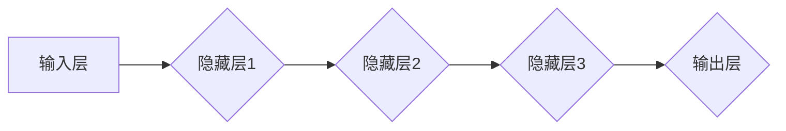

                 

## 文章标题: AI大模型创业：如何应对未来价格战？

> 关键词：AI大模型、创业、价格战、应对策略、技术优势

> 摘要：本文将深入探讨AI大模型创业领域，分析未来价格战的潜在影响，并提供一系列应对策略，帮助创业者在这场竞争中立于不败之地。

## 目录大纲设计：《AI大模型创业：如何应对未来价格战？》

### 第一部分：AI大模型基础知识

#### 第1章：AI大模型概述

##### 1.1 AI大模型的核心概念

##### 1.2 AI大模型的分类与应用

##### 1.3 AI大模型的发展历程

#### 第2章：AI大模型的技术原理

##### 2.1 机器学习与深度学习基础

##### 2.2 AI大模型的架构与优化

##### 2.3 AI大模型的数学模型与公式

### 第二部分：AI大模型创业策略

#### 第3章：AI大模型创业机会分析

##### 3.1 AI大模型市场前景

##### 3.2 AI大模型创业风险

##### 3.3 AI大模型创业模式

#### 第4章：AI大模型创业模式

##### 4.1 AI大模型商业模式

##### 4.2 AI大模型盈利策略

#### 第5章：AI大模型创业实战

##### 5.1 AI大模型项目启动

##### 5.2 AI大模型产品开发

##### 5.3 AI大模型创业案例

### 第三部分：AI大模型创业的未来展望

#### 第6章：AI大模型创业的趋势与挑战

##### 6.1 AI大模型创业趋势

##### 6.2 AI大模型创业挑战

#### 第7章：未来AI大模型创业机会

##### 7.1 新兴市场机遇

##### 7.2 创业者应对策略

#### 第8章：AI大模型创业的可持续发展

##### 8.1 可持续发展理念

##### 8.2 可持续创业实践

### 附录：AI大模型创业工具与资源

##### A.1 常用AI大模型框架

##### A.2 创业资源推荐### 第一部分：AI大模型基础知识

#### 第1章：AI大模型概述

##### 1.1 AI大模型的核心概念

人工智能（AI）大模型，指的是具有极高计算能力和复杂结构的人工神经网络模型。这些模型通过大规模数据训练，能够实现强大的特征提取和高级任务处理能力，广泛应用于图像识别、自然语言处理、预测分析和智能决策等领域。

**1.1.1 AI大模型的基本定义**

AI大模型是一种基于深度学习技术构建的复杂神经网络，通常包含数亿甚至千亿个参数。与传统的小型模型相比，AI大模型在处理高维度数据和非线性关系方面具有显著优势。

**1.1.2 AI大模型的发展历程**

AI大模型的发展历程可以追溯到20世纪80年代早期，当时神经网络的研究刚刚起步。随着计算能力的提升和数据规模的扩大，深度学习在21世纪初取得了突破性进展。近年来，随着GPU和TPU等专用硬件的普及，AI大模型的研究和应用得到了进一步的发展。

**1.1.3 AI大模型的核心特征**

- **高参数数量**：AI大模型通常包含数亿到千亿个参数，这使得它们能够捕获大量复杂的特征。
- **强大的学习能力**：AI大模型能够从大规模数据中学习，进行特征提取和模式识别。
- **广泛的应用领域**：AI大模型可以应用于图像识别、语音识别、自然语言处理、预测分析等多个领域。
- **高效的计算能力**：借助GPU、TPU等硬件加速，AI大模型能够在短时间内处理大量数据。

##### 1.2 AI大模型的分类与应用

**1.2.1 主流AI大模型分类**

AI大模型可以按照不同的分类标准进行划分，常见的分类方法包括：

- **按任务类型**：分类模型、回归模型、序列模型等。
- **按网络架构**：卷积神经网络（CNN）、循环神经网络（RNN）、变换器模型（Transformer）等。
- **按训练方式**：监督学习、无监督学习、半监督学习等。

**1.2.2 AI大模型在不同行业中的应用**

AI大模型在各个行业中的应用场景广泛，以下是一些典型的应用领域：

- **金融领域**：用于风险管理、信用评估、量化交易等。
- **医疗领域**：用于疾病预测、诊断辅助、药物研发等。
- **制造业**：用于生产优化、设备故障预测、供应链管理等。
- **零售业**：用于客户行为分析、个性化推荐、库存管理等。
- **交通领域**：用于自动驾驶、智能交通管理、航班调度等。

##### 1.3 AI大模型的技术原理

AI大模型的技术原理主要包括机器学习、深度学习和神经网络的结合。

**2.1 机器学习与深度学习基础**

**2.1.1 机器学习基础**

机器学习是一种让计算机通过数据学习，进行预测和决策的方法。主要方法包括监督学习、无监督学习和半监督学习。

- **监督学习**：有标注的数据进行训练，用于预测和分类任务。
- **无监督学习**：没有标注的数据进行训练，用于发现数据中的隐含结构和模式。
- **半监督学习**：使用少量标注数据和大量未标注数据，以提高模型的泛化能力。

**2.1.2 深度学习基础**

深度学习是机器学习的一个分支，它通过多层的神经网络结构，实现对复杂函数的建模。深度学习的核心在于：

- **神经网络**：模拟人脑神经元连接的网络结构，通过多层传递信息。
- **反向传播**：用于计算误差并调整网络权重，使得模型能够逐渐优化。
- **激活函数**：引入非线性因素，使得神经网络能够学习更复杂的函数。

**2.2 AI大模型的架构与优化**

**2.2.1 AI大模型的架构**

AI大模型的架构通常包括以下几个部分：

- **输入层**：接收外部输入数据。
- **隐藏层**：对输入数据进行特征提取和变换。
- **输出层**：生成预测结果或分类标签。

**2.2.2 AI大模型的优化方法**

为了提高AI大模型的性能，通常采用以下优化方法：

- **网络结构优化**：通过调整网络层数、神经元数量和连接方式，来提高模型的泛化能力。
- **训练数据增强**：通过数据增强方法，增加训练样本的多样性和数量，以减少过拟合。
- **超参数调整**：通过调整学习率、批量大小等超参数，来优化模型的训练过程。
- **正则化方法**：通过L1、L2正则化等方法，减少模型过拟合。

##### 1.3 AI大模型的数学模型与公式

AI大模型的数学模型主要涉及概率论、信息论和统计学习理论。

**3.1 AI大模型数学模型**

**3.1.1 概率论基础**

概率论是人工智能的基础，用于描述不确定性和随机性。常用的概率分布包括正态分布、伯努利分布和多项式分布。

**3.1.2 信息论基础**

信息论用于衡量信息的不确定性和传输效率。常用的信息量度包括熵、信息熵、互信息等。

**3.1.3 统计学习理论**

统计学习理论用于建立模型并进行预测。常用的算法包括线性回归、逻辑回归、支持向量机等。

**3.2 数学公式与计算**

- **激活函数**：

  $$ f(x) = \max(0, x) $$

 ReLU函数

- **损失函数**：

  $$ L(y, \hat{y}) = \frac{1}{2} (y - \hat{y})^2 $$

 均方误差

- **优化算法**：

  $$ w_{\text{new}} = w_{\text{old}} - \alpha \cdot \nabla_w L(w) $$

 梯度下降算法

**3.2.1 激活函数**

激活函数是神经网络中的关键组成部分，用于引入非线性因素，使得模型能够学习更复杂的函数。常见的激活函数包括ReLU、Sigmoid和Tanh函数。

**3.2.2 损失函数**

损失函数用于度量模型预测值与实际值之间的差距，是优化过程中的关键指标。常见的损失函数包括均方误差（MSE）、交叉熵（Cross-Entropy）等。

**3.2.3 优化算法**

优化算法用于更新模型的权重，以最小化损失函数。常见的优化算法包括梯度下降（Gradient Descent）、随机梯度下降（Stochastic Gradient Descent）和Adam优化器等。

**3.3 AI大模型的应用案例**

AI大模型在各个领域有着广泛的应用，以下是一些典型的应用案例：

- **图像识别**：用于人脸识别、物体检测、图像分类等。
- **自然语言处理**：用于机器翻译、文本分类、情感分析等。
- **语音识别**：用于语音转文字、语音合成等。
- **预测分析**：用于股票市场预测、天气预测、需求预测等。

通过深入理解和应用AI大模型的技术原理，创业者可以更好地把握市场机会，制定有效的创业策略，从而在未来的价格战中脱颖而出。在下一部分，我们将进一步探讨AI大模型创业的机会和风险。### 第2章：AI大模型的技术原理

AI大模型的技术原理是构建和优化这些复杂神经网络的基础，理解这些原理对于创业者来说至关重要。本章将详细探讨机器学习与深度学习的基础知识、AI大模型的架构与优化方法，以及核心的数学模型与公式。

#### 2.1 机器学习与深度学习基础

**2.1.1 机器学习基础**

机器学习是一门研究如何让计算机从数据中学习，并作出决策或预测的科学。机器学习算法可以分为三大类：监督学习、无监督学习和半监督学习。

- **监督学习**：在有标注的数据集上进行训练，模型能够预测未知数据的标签。常见的算法有线性回归、逻辑回归、支持向量机（SVM）等。

  ```python
  # 线性回归伪代码
  def linear_regression(X, y):
      # 梯度下降算法求解模型参数
      return w, b
  ```

- **无监督学习**：在没有标注的数据集上进行训练，模型旨在发现数据中的结构或模式。常见的算法有K-均值聚类、主成分分析（PCA）等。

  ```python
  # K-均值聚类伪代码
  def k_means(data, K):
      # 初始化聚类中心
      # 更新聚类中心
      # 迭代直到收敛
      return clusters
  ```

- **半监督学习**：结合有标注和无标注的数据进行训练，通过少量标注数据来提高模型的泛化能力。常见的算法有自我训练（Self-training）和伪标签（Pseudo-labeling）等。

  ```python
  # 伪标签伪代码
  def pseudo_labeling(data, model, unlabeled_data):
      # 使用模型对无标注数据进行预测
      # 将预测结果作为伪标签
      return labeled_data
  ```

**2.1.2 深度学习基础**

深度学习是机器学习的一个分支，通过构建深层的神经网络来模拟人脑的学习过程。深度学习的关键组成部分包括：

- **神经网络**：神经网络是由多层神经元组成的计算模型，通过前向传播和反向传播来学习数据。

  ```python
  # 神经网络前向传播伪代码
  def forward_pass(inputs, weights, biases):
      # 通过神经网络传递输入数据
      return outputs
  ```

- **反向传播**：反向传播是一种用于计算损失函数关于模型参数梯度的算法，用于更新模型参数。

  ```python
  # 反向传播伪代码
  def backward_propagation(loss, outputs, weights, biases):
      # 计算损失函数关于输入的梯度
      # 更新模型参数
      return updated_weights, updated_biases
  ```

- **激活函数**：激活函数用于引入非线性因素，使得神经网络能够学习更复杂的函数。常见的激活函数有Sigmoid、ReLU和Tanh等。

  ```python
  # ReLU激活函数伪代码
  def relu(x):
      return max(0, x)
  ```

#### 2.2 AI大模型的架构与优化

**2.2.1 AI大模型的架构**

AI大模型的架构通常由输入层、隐藏层和输出层组成，每一层由多个神经元构成。输入层接收外部数据，隐藏层对数据进行特征提取和变换，输出层生成最终的预测结果或分类标签。



**2.2.2 AI大模型的优化方法**

为了提高AI大模型的性能，需要通过优化模型架构、训练数据和参数来减少过拟合和增加模型的泛化能力。以下是一些常见的优化方法：

- **网络结构优化**：通过调整网络层数、神经元数量和连接方式来提高模型的泛化能力。

  ```python
  # 调整网络结构伪代码
  def optimize_structure(model):
      # 根据性能指标调整网络结构
      return optimized_model
  ```

- **训练数据增强**：通过数据增强方法，增加训练样本的多样性和数量，以减少过拟合。

  ```python
  # 数据增强伪代码
  def augment_data(data):
      # 对数据进行旋转、缩放、裁剪等操作
      return augmented_data
  ```

- **超参数调整**：通过调整学习率、批量大小、正则化参数等超参数来优化模型的训练过程。

  ```python
  # 调整超参数伪代码
  def tune_hyperparameters(model, data):
      # 使用网格搜索、随机搜索等方法调整超参数
      return tuned_model
  ```

- **正则化方法**：通过L1、L2正则化等方法，减少模型过拟合。

  ```python
  # L2正则化伪代码
  def l2_regularization(weights, lambda_):
      return sum(weights ** 2)
  ```

#### 2.3 AI大模型的数学模型与公式

AI大模型的数学模型涉及概率论、信息论和统计学习理论，以下是一些核心的数学模型与公式：

**3.1 概率论基础**

- **概率分布**：常用的概率分布有正态分布、伯努利分布和多项式分布。

  ```latex
  P(X = x) = \frac{1}{\sqrt{2\pi\sigma^2}} e^{-\frac{(x-\mu)^2}{2\sigma^2}}
  ```

- **条件概率**：

  ```latex
  P(A|B) = \frac{P(A \cap B)}{P(B)}
  ```

- **贝叶斯定理**：

  ```latex
  P(A|B) = \frac{P(B|A)P(A)}{P(B)}
  ```

**3.2 信息论基础**

- **熵**：

  ```latex
  H(X) = -\sum_{i} P(X = x_i) \log_2 P(X = x_i)
  ```

- **互信息**：

  ```latex
  I(X;Y) = H(X) - H(X|Y)
  ```

**3.3 统计学习理论**

- **线性回归**：

  ```latex
  \hat{y} = \beta_0 + \beta_1x
  ```

- **逻辑回归**：

  ```latex
  \hat{y} = \frac{1}{1 + e^{-(\beta_0 + \beta_1x)}}
  ```

- **支持向量机**：

  ```latex
  \min_{w, b} \frac{1}{2} ||w||^2 + C \sum_{i} \max(0, 1 - y_i (w \cdot x_i + b))
  ```

**3.4 激活函数**

- **ReLU函数**：

  ```latex
  f(x) = \max(0, x)
  ```

- **Sigmoid函数**：

  ```latex
  f(x) = \frac{1}{1 + e^{-x}}
  ```

- **Tanh函数**：

  ```latex
  f(x) = \frac{e^x - e^{-x}}{e^x + e^{-x}}
  ```

**3.5 损失函数**

- **均方误差（MSE）**：

  ```latex
  MSE = \frac{1}{n} \sum_{i=1}^{n} (y_i - \hat{y}_i)^2
  ```

- **交叉熵（Cross-Entropy）**：

  ```latex
  H(y, \hat{y}) = -\sum_{i} y_i \log \hat{y}_i
  ```

**3.6 优化算法**

- **梯度下降**：

  ```latex
  w_{\text{new}} = w_{\text{old}} - \alpha \cdot \nabla_w L(w)
  ```

- **动量优化**：

  ```latex
  v_{t+1} = \gamma v_t + \alpha \cdot \nabla_w L(w)
  w_{t+1} = w_t - v_{t+1}
  ```

- **Adam优化器**：

  ```latex
  m_t = \beta_1 m_{t-1} + (1 - \beta_1) \nabla_w L(w)
  v_t = \beta_2 v_{t-1} + (1 - \beta_2) (\nabla_w L(w))^2
  \hat{m}_t = m_t / (1 - \beta_1^t)
  \hat{v}_t = v_t / (1 - \beta_2^t)
  w_{t+1} = w_t - \alpha \cdot \hat{m}_t / (\sqrt{\hat{v}_t} + \epsilon)
  ```

通过深入理解AI大模型的技术原理，创业者可以更好地掌握这些知识，将其应用于创业项目中，从而在激烈的市场竞争中占据优势。在下一部分，我们将探讨AI大模型创业的机会与风险。### 第3章：AI大模型创业机会分析

#### 3.1 AI大模型市场前景

随着人工智能技术的快速发展，AI大模型在各个行业中的应用越来越广泛，市场前景也越发光明。以下是对全球和中国AI大模型市场的分析：

**3.1.1 全球AI大模型市场分析**

根据市场研究机构的报告，全球AI大模型市场规模预计将在未来几年内持续增长。主要驱动因素包括：

- **技术进步**：深度学习、神经网络等技术的不断突破，使得AI大模型的应用范围和性能不断提高。
- **数据增长**：随着物联网、社交媒体和大数据技术的发展，数据量呈指数级增长，为AI大模型提供了丰富的训练资源。
- **行业需求**：金融、医疗、零售、制造等行业对AI大模型的需求不断增加，推动了市场的发展。
- **政策支持**：许多国家和地区政府纷纷出台政策，支持AI技术的发展和应用，为AI大模型市场创造了良好的发展环境。

预计到2025年，全球AI大模型市场规模将达到数千亿美元，年复合增长率超过20%。

**3.1.2 中国AI大模型市场分析**

中国作为全球最大的互联网市场之一，AI大模型市场也呈现出快速增长的态势。以下是中国AI大模型市场的一些特点：

- **政策支持**：中国政府高度重视人工智能发展，出台了一系列政策和规划，如《新一代人工智能发展规划》等，为AI大模型的发展提供了政策保障。
- **技术创新**：中国企业在AI领域持续进行技术创新，推出了一系列领先的AI大模型，如百度文心、华为盘古等，推动了市场的发展。
- **市场潜力**：中国拥有庞大的互联网用户基础和丰富的行业应用场景，为AI大模型提供了广阔的市场空间。
- **竞争格局**：中国AI大模型市场主要由几家大型科技公司和初创企业主导，竞争格局较为集中。

预计到2025年，中国AI大模型市场规模将占全球市场的20%以上，年复合增长率超过25%。

#### 3.2 AI大模型创业风险

尽管AI大模型市场前景广阔，但创业者仍然面临多种风险，包括：

**3.2.1 技术风险**

- **技术壁垒**：AI大模型技术复杂，需要强大的研发能力和丰富的经验。初创企业可能面临技术壁垒，难以与巨头竞争。
- **技术更新**：AI技术更新迅速，创业者需要持续投入研发，以保持竞争力。否则，可能被市场淘汰。

**3.2.2 数据风险**

- **数据获取**：AI大模型训练需要大量高质量的数据，创业者可能面临数据获取困难或数据质量问题。
- **数据隐私**：随着数据隐私法规的加强，创业者需要确保数据使用合规，避免法律风险。

**3.2.3 市场风险**

- **市场竞争**：AI大模型市场巨头众多，创业者面临激烈的市场竞争。需要制定有效的市场策略，以赢得市场份额。
- **客户需求**：客户需求多变，创业者需要及时调整产品和服务，以满足市场需求。

**3.2.4 资金风险**

- **资金压力**：AI大模型创业初期需要大量资金投入，包括研发、运营和市场推广等。创业者可能面临资金压力，影响业务发展。
- **融资难度**：初创企业在融资过程中可能面临难度，尤其是获得长期稳定的资金支持。

#### 3.3 AI大模型创业模式

为了应对以上风险，创业者可以采用以下创业模式：

**3.3.1 AI大模型商业模式**

- **B2B模式**：为企业客户提供定制化的AI大模型解决方案，如图像识别、自然语言处理等。这种方式可以提供稳定的收入来源，但也需要强大的技术实力和服务能力。
- **B2C模式**：面向个人消费者提供AI大模型产品，如智能助手、智能音箱等。这种方式可以迅速积累用户规模，但盈利模式可能较为分散。
- **平台模式**：搭建AI大模型平台，为开发者提供工具和资源，如算法库、训练数据集等。这种方式可以降低开发门槛，吸引更多开发者，但需要提供优质的服务和内容。

**3.3.2 AI大模型盈利策略**

- **服务收费**：根据客户使用AI大模型服务的频率和规模，收取费用。如按需付费、订阅制等。
- **广告收入**：在AI大模型产品中嵌入广告，通过广告收入实现盈利。
- **许可费用**：将AI大模型技术许可给其他企业使用，收取许可费用。
- **数据服务**：提供数据采集、清洗、分析等服务，收取数据服务费用。

通过深入分析AI大模型市场的机会和风险，创业者可以制定更为合理的创业策略，从而在激烈的市场竞争中脱颖而出。在下一部分，我们将探讨AI大模型创业的具体模式和盈利策略。### 第4章：AI大模型创业模式

#### 4.1 AI大模型商业模式

AI大模型创业模式的选择直接影响企业的生存和发展。创业者可以根据市场需求、自身优势以及资源状况，选择合适的商业模式。以下是对B2B模式和 B2C模式的详细探讨。

**4.1.1 B2B模式**

B2B（Business to Business）模式是指企业与企业之间的商业交易。在AI大模型领域，B2B模式主要面向有特定需求的企业客户提供定制化的解决方案。

- **客户群体**：B2B模式主要服务于金融、医疗、零售、制造等行业的龙头企业，这些企业对AI大模型的需求量大，且具备较高的支付能力。
- **产品特点**：B2B模式的产品通常具有高度定制化特点，能够满足企业客户特定的业务需求。例如，为金融企业提供风险管理解决方案，为医疗机构提供疾病预测模型等。
- **盈利模式**：B2B模式的盈利主要通过提供技术支持、定制开发服务以及后续的维护费用来实现。此外，一些企业还会通过提供数据服务或许可费用来增加收入。

**4.1.2 B2C模式**

B2C（Business to Consumer）模式是指企业直接面向个人消费者提供产品或服务。在AI大模型领域，B2C模式主要面向消费者市场，提供易于使用的AI大模型产品。

- **客户群体**：B2C模式主要服务于广大的消费者市场，包括智能助手、智能家居、智能穿戴设备等。
- **产品特点**：B2C模式的产品通常具有大众化特点，易于使用，消费者可以轻松上手。例如，智能音箱、智能手环等。
- **盈利模式**：B2C模式的盈利主要通过产品销售、广告收入以及增值服务来实现。例如，通过销售智能音箱硬件获得收入，通过广告植入获得广告收入，通过提供会员服务、数据服务获得额外收入。

#### 4.2 AI大模型盈利策略

盈利策略是AI大模型企业实现持续盈利的关键。以下是一些常见的盈利策略：

**4.2.1 盈利模式探索**

- **产品销售**：通过销售AI大模型产品获得直接收入。例如，销售智能音箱、智能手环等硬件产品。
- **服务收费**：提供技术支持、定制开发、数据服务等，按照服务内容和客户需求进行收费。例如，为企业客户提供定制化的AI大模型解决方案。
- **广告收入**：在AI大模型产品中嵌入广告，通过广告收入实现盈利。例如，在智能音箱中播放广告，在应用程序中展示广告。
- **许可费用**：将AI大模型技术许可给其他企业使用，收取许可费用。例如，将AI算法许可给其他公司用于商业应用。

**4.2.2 成本控制策略**

- **研发投入**：合理规划研发投入，确保技术优势和市场竞争力。
- **运营成本**：优化运营流程，降低运营成本。例如，通过自动化和智能化手段提高生产效率，降低人力成本。
- **数据管理**：合理管理数据资源，提高数据利用效率。例如，通过数据清洗、数据挖掘等技术手段，提高数据的准确性和可用性。
- **营销策略**：制定有效的营销策略，降低营销成本。例如，通过线上推广、社交媒体营销等手段，提高品牌知名度和市场覆盖率。

通过探索多样化的盈利模式和控制成本，AI大模型企业可以实现持续盈利，并在激烈的市场竞争中立于不败之地。在下一部分，我们将探讨AI大模型创业的实际案例，以期为创业者提供有益的启示。### 第5章：AI大模型创业实战

#### 5.1 AI大模型项目启动

AI大模型创业项目的启动是整个创业过程的关键步骤，涉及到团队搭建、技术路线选择以及项目立项等多个方面。以下是对这些关键环节的详细探讨。

**5.1.1 项目立项**

项目立项是AI大模型创业的第一步，需要明确项目的目标、范围和可行性。以下步骤有助于顺利进行项目立项：

1. **市场调研**：对目标市场进行深入调研，了解市场需求、竞争对手和市场规模等信息。
2. **技术评估**：评估所需技术的成熟度和可行性，包括深度学习框架、硬件支持等。
3. **商业模型**：明确项目的商业模式，包括盈利模式、成本控制和市场推广策略等。
4. **可行性分析**：进行全面的可行性分析，包括技术、市场、资金等方面的可行性。
5. **项目计划**：制定详细的项目计划，包括项目目标、时间表、预算和资源分配等。

**5.1.2 团队搭建**

一个高效的团队是实现AI大模型项目成功的关键。以下步骤有助于搭建合适的团队：

1. **核心成员**：选择具备相关领域专业知识和经验的成员，如深度学习专家、软件开发工程师、数据科学家等。
2. **技能互补**：确保团队成员具备多样化的技能，能够覆盖项目的各个方面。
3. **文化契合**：团队成员之间需要有良好的沟通和合作，文化契合是团队稳定和高效运作的基础。
4. **激励机制**：建立合理的激励机制，激发团队成员的积极性和创造力。
5. **培训与发展**：为团队成员提供持续的学习和培训机会，提升团队整体能力。

**5.1.3 技术路线选择**

选择合适的技术路线是AI大模型项目成功的重要保障。以下是一些常见的技术路线选择策略：

1. **开源框架**：选择成熟的深度学习开源框架，如TensorFlow、PyTorch等，可以减少研发时间和成本。
2. **定制开发**：根据项目需求，定制开发特定的算法和模型，以满足特定的业务场景。
3. **硬件支持**：选择适合项目需求的硬件平台，如GPU、TPU等，以提高模型的训练和推理速度。
4. **云计算**：利用云计算平台，如Google Cloud、AWS等，提供强大的计算和存储资源，降低硬件成本。
5. **持续迭代**：根据项目进展和市场反馈，持续优化和迭代技术路线，确保项目的持续发展。

#### 5.2 AI大模型产品开发

产品开发是AI大模型创业的核心环节，涉及到数据收集、模型训练、产品优化等多个阶段。以下是对这些阶段的详细探讨。

**5.2.1 产品规划**

产品规划是产品开发的第一步，需要明确产品的目标、功能和技术架构。以下步骤有助于进行产品规划：

1. **需求分析**：分析目标用户的需求，明确产品的核心功能和特点。
2. **市场定位**：确定产品的市场定位，包括目标市场和竞争对手分析。
3. **功能设计**：设计产品的功能模块和用户界面，确保产品易用性和用户体验。
4. **技术架构**：确定产品的技术架构，包括深度学习模型、数据存储和传输等。

**5.2.2 技术路线选择**

技术路线选择是产品开发的关键，需要考虑多个因素，如技术成熟度、成本和性能等。以下是一些常见的技术路线选择策略：

1. **算法选择**：选择合适的深度学习算法，如卷积神经网络（CNN）、循环神经网络（RNN）等，以满足产品的功能需求。
2. **数据处理**：选择合适的数据处理方法，如数据清洗、数据增强等，以提高模型的效果。
3. **硬件选择**：选择适合的硬件平台，如GPU、TPU等，以提升模型的训练和推理速度。
4. **云计算**：利用云计算平台，提供强大的计算和存储资源，降低硬件成本。

**5.2.3 数据收集与处理**

数据是AI大模型的核心，数据的质量和数量直接影响模型的效果。以下是对数据收集与处理的详细探讨：

1. **数据来源**：选择可靠的数据来源，包括公开数据集、企业内部数据和第三方数据服务。
2. **数据清洗**：对数据进行清洗和预处理，去除噪声、缺失值和异常值，以提高数据的质量。
3. **数据增强**：通过数据增强方法，增加训练样本的多样性和数量，以减少过拟合。
4. **数据存储与传输**：选择合适的数据存储与传输方案，确保数据的安全性和可靠性。

**5.2.4 模型训练与优化**

模型训练与优化是产品开发的关键环节，需要选择合适的训练方法和优化策略。以下是对模型训练与优化的详细探讨：

1. **模型选择**：根据产品的功能需求，选择合适的深度学习模型，如卷积神经网络（CNN）、循环神经网络（RNN）等。
2. **训练方法**：选择合适的训练方法，如梯度下降、Adam优化器等，以加速模型的训练过程。
3. **模型优化**：通过调整模型参数、网络结构等，优化模型的效果，减少过拟合。
4. **评估与调整**：对训练好的模型进行评估，根据评估结果调整模型参数和结构，以提高模型的性能。

**5.2.5 产品测试与部署**

产品测试与部署是产品开发的最后一步，需要确保产品在真实环境中的稳定性和性能。以下是对产品测试与部署的详细探讨：

1. **单元测试**：对产品的各个模块进行单元测试，确保模块的独立性和正确性。
2. **集成测试**：对产品进行集成测试，确保各个模块之间的协同工作。
3. **性能测试**：对产品进行性能测试，确保产品在真实环境中的响应速度和处理能力。
4. **部署与监控**：将产品部署到生产环境，进行实时监控和运维，确保产品的稳定运行。

通过详细的规划和实施，AI大模型创业项目可以顺利启动并发展壮大。在下一部分，我们将探讨一些成功的AI大模型创业案例，以期为创业者提供有益的启示。### 第6章：AI大模型创业案例

#### 6.1 成功案例介绍

在本章中，我们将介绍两个AI大模型创业的成功案例，通过分析这些案例，探讨其成功的原因以及值得创业者吸取的经验教训。

**6.1.1 案例一：某AI大模型创业公司成功经验**

**案例背景**：

某AI大模型创业公司成立于2015年，专注于开发基于深度学习的图像识别和自然语言处理技术。公司初期以研发和优化算法为核心，通过不断的技术创新，逐渐积累了丰富的经验和技术优势。

**成功原因**：

1. **技术创新**：公司注重技术创新，持续进行算法优化和模型改进，使其在图像识别和自然语言处理领域取得了显著的优势。
2. **市场需求**：公司准确捕捉到市场需求，将AI大模型应用于多个行业，如医疗、金融和零售等，为客户提供了有价值的服务。
3. **商业策略**：公司采取了灵活的商业模式，通过B2B和B2C两种模式相结合，实现了多元化收入来源。
4. **团队建设**：公司注重团队建设，吸纳了多位行业专家和优秀的技术人才，形成了强大的研发团队。

**经验教训**：

- **技术创新是核心**：创业公司应注重技术创新，持续进行算法优化和模型改进，以保持竞争优势。
- **准确捕捉市场需求**：了解市场需求，将技术优势转化为实际业务，为客户提供有价值的服务。
- **多元化商业模式**：结合B2B和B2C两种模式，实现多元化收入来源，降低业务风险。
- **注重团队建设**：吸纳行业专家和优秀人才，形成强大的研发团队，为公司的持续发展提供保障。

**6.1.2 案例二：某AI大模型创业公司失败教训**

**案例背景**：

某AI大模型创业公司成立于2018年，旨在开发基于深度学习的智能语音助手。然而，在短短两年时间内，该公司便宣告破产。

**失败原因**：

1. **技术不成熟**：公司在技术方面尚未成熟，未能解决语音识别和自然语言处理的难题，导致产品性能不佳。
2. **市场定位不准确**：公司对市场定位不准确，未能抓住语音助手市场的红利，错失了发展机会。
3. **商业模式不清晰**：公司商业模式不清晰，未能找到合适的盈利模式，导致资金链断裂。
4. **团队不稳定**：公司团队不稳定，核心成员频繁变动，影响了公司的运营和发展。

**经验教训**：

- **技术成熟度是关键**：创业公司应确保技术成熟度，解决核心技术的难题，提供高性能的产品。
- **准确市场定位**：了解市场需求，准确把握市场趋势，为客户提供有价值的产品。
- **清晰的商业模式**：制定明确的商业模式，确保盈利模式清晰，降低资金风险。
- **稳定团队**：保持团队稳定，核心成员之间建立良好的合作关系，为公司的长期发展提供支持。

通过分析这些成功和失败的案例，创业者可以从中吸取经验教训，避免犯同样的错误。在下一部分，我们将探讨AI大模型创业面临的挑战和未来趋势。### 第7章：AI大模型创业的趋势与挑战

#### 7.1 AI大模型创业趋势

AI大模型创业正在迎来一个快速发展期，以下是一些主要趋势：

**7.1.1 行业发展趋势**

- **跨界融合**：AI大模型正在与传统行业深度融合，如医疗、金融、制造、零售等，推动行业变革。
- **个性化服务**：AI大模型通过分析用户行为和需求，提供更加个性化的服务，提高用户体验。
- **自动化决策**：AI大模型在自动化决策方面具有显著优势，能够提高决策效率和准确性。
- **边缘计算**：随着5G和物联网技术的发展，边缘计算成为AI大模型应用的新趋势，可以实现实时、高效的智能处理。

**7.1.2 技术发展趋势**

- **模型压缩与加速**：为了应对大模型计算资源需求，模型压缩和加速技术得到了广泛关注，如蒸馏、量化、剪枝等。
- **迁移学习与联邦学习**：迁移学习和联邦学习技术使得模型能够在有限的数据上进行训练，提高模型的泛化能力。
- **多模态学习**：多模态学习技术使得AI大模型能够同时处理多种类型的数据，如文本、图像、音频等，提高模型的处理能力。
- **自适应学习**：自适应学习技术使得模型能够根据用户行为和需求进行动态调整，提高模型的适应能力。

#### 7.2 AI大模型创业挑战

尽管AI大模型创业前景广阔，但创业者仍然面临诸多挑战：

**7.2.1 技术挑战**

- **计算资源**：AI大模型训练需要大量的计算资源，创业者需要解决计算资源不足的问题。
- **数据质量**：数据质量直接影响模型的效果，创业者需要确保数据的质量和多样性。
- **算法优化**：AI大模型算法复杂，需要持续进行优化和改进，以提升模型性能。
- **安全与隐私**：AI大模型在处理敏感数据时，需要确保数据的安全和隐私。

**7.2.2 市场挑战**

- **竞争激烈**：AI大模型市场竞争激烈，创业者需要应对来自巨头企业的竞争压力。
- **用户需求多变**：用户需求多变，创业者需要快速响应市场变化，调整产品和服务。
- **商业模式创新**：创业者需要不断创新商业模式，找到适合自身的盈利模式。

**7.2.3 资金与人才挑战**

- **资金压力**：AI大模型创业初期需要大量资金投入，包括研发、运营和市场推广等。
- **人才短缺**：AI大模型领域人才短缺，创业者需要吸引和留住优秀的研发人员。

#### 7.3 创业者应对策略

为了应对AI大模型创业中的挑战，创业者可以采取以下策略：

**7.3.1 技术创新**

- **合作与开放**：与其他企业、高校和研究机构合作，共同进行技术创新。
- **技术储备**：提前进行技术储备，不断跟踪和掌握最新的技术趋势。

**7.3.2 市场策略**

- **精准定位**：准确捕捉市场需求，提供有价值的产品和服务。
- **差异化竞争**：通过技术创新和差异化竞争，提高市场竞争力。

**7.3.3 资金与人才管理**

- **多元化融资**：通过多元化融资渠道，降低资金压力。
- **人才培养与激励**：建立良好的人才培养和激励机制，吸引和留住优秀人才。

通过深入分析和应对AI大模型创业的挑战，创业者可以更好地把握市场机会，实现持续发展。在下一部分，我们将探讨未来AI大模型创业的机遇。### 第8章：未来AI大模型创业的机遇

#### 8.1 新兴市场机遇

随着AI大模型技术的不断进步，新兴市场中的创业机会也日益增多。以下是一些值得关注的新兴市场机遇：

**8.1.1 发展中国家市场**

- **快速增长**：发展中国家对AI大模型的需求正在快速增长，特别是在教育、医疗、农业等领域。
- **市场潜力**：发展中国家庞大的人口基数和快速增长的经济为AI大模型提供了巨大的市场潜力。
- **政策支持**：许多发展中国家政府积极支持AI技术的发展和应用，为创业公司创造了有利环境。

**8.1.2 新兴行业应用**

- **智能制造**：智能制造是AI大模型的重要应用领域，通过AI技术可以提高生产效率、优化供应链管理。
- **智慧城市**：智慧城市项目中的智能交通、环境监测、公共安全等领域，为AI大模型提供了丰富的应用场景。
- **金融科技**：金融科技领域的信用评估、风险管理、智能投顾等应用，需要AI大模型的支持。

#### 8.2 创业者应对策略

面对未来AI大模型创业的机遇，创业者可以采取以下策略：

**8.2.1 创新策略**

- **技术突破**：不断进行技术创新，开发具有竞争力的AI大模型产品和服务。
- **跨界融合**：与不同行业合作，探索AI大模型在新兴行业的应用，实现跨界融合。

**8.2.2 风险管理策略**

- **市场调研**：深入了解市场需求，降低市场风险。
- **风险分散**：通过多元化业务和投资，降低单一市场的风险。
- **合作与联盟**：与其他企业、研究机构建立合作和联盟，共同应对市场和技术风险。

#### 8.3 技术进步与创业机遇

技术进步为AI大模型创业提供了更多机遇，以下是一些关键技术进步：

**8.3.1 计算能力提升**

- **硬件加速**：GPU、TPU等硬件加速技术的发展，使得AI大模型的训练和推理速度大幅提升。
- **云计算**：云计算平台的普及，为创业者提供了强大的计算资源，降低了硬件成本。

**8.3.2 数据获取与处理**

- **大数据技术**：大数据技术的进步，使得创业者能够获取和处理更多高质量的数据，提高AI大模型的性能。
- **数据隐私保护**：随着数据隐私法规的加强，创业者需要开发符合隐私保护标准的AI大模型。

**8.3.3 模型压缩与优化**

- **模型压缩**：通过模型压缩技术，降低AI大模型的计算量和存储需求，提高其部署和应用的可能性。
- **优化算法**：优化算法的进步，使得AI大模型的训练和推理过程更加高效。

#### 8.4 社会责任与可持续发展

AI大模型创业不仅追求商业成功，还应承担社会责任，实现可持续发展：

**8.4.1 可持续发展理念**

- **环境保护**：在产品设计和运营过程中，注重环境保护，减少能源消耗和碳排放。
- **社会责任**：关注社会问题，通过AI技术解决社会问题，如教育公平、医疗资源分配等。

**8.4.2 可持续创业实践**

- **绿色技术**：开发绿色技术，如智能节能系统、环保监测设备等，推动可持续发展。
- **社会价值**：通过AI技术创造社会价值，如智能医疗、智慧教育等，提升人们的生活质量。

通过把握未来AI大模型创业的机遇，并采取有效的应对策略，创业者可以在这场科技革命中抓住机遇，实现企业的长远发展。在下一部分，我们将探讨AI大模型创业的可持续发展。### 第9章：AI大模型创业的可持续发展

#### 9.1 可持续发展理念

AI大模型创业的可持续发展不仅关乎企业的长期盈利，还涉及环境保护和社会责任。以下是一些关键的可持续发展理念：

**9.1.1 社会责任**

AI大模型创业应承担社会责任，关注社会问题，利用技术优势为社会带来积极影响。例如，通过AI技术改善医疗资源分配、促进教育公平、提升公共安全等。

**9.1.2 环境保护**

环境保护是可持续发展的核心，创业者应在产品设计和运营过程中注重环境保护。例如，通过节能设计、环保材料和循环利用，降低产品的环境足迹。

**9.1.3 技术伦理**

AI大模型技术涉及大量数据和个人隐私，创业者应遵循技术伦理，确保数据安全和个人隐私保护。同时，应确保AI技术的公平性和透明性，防止歧视和偏见。

#### 9.2 可持续创业实践

为了实现AI大模型创业的可持续发展，创业者可以采取以下实践：

**9.2.1 绿色技术**

- **节能设计**：在产品设计中采用节能技术，如使用低能耗硬件、优化算法以提高能效。
- **环保材料**：选择环保材料，减少产品的环境负担。
- **循环利用**：鼓励产品的回收和再利用，降低资源消耗。

**9.2.2 社会价值**

- **公益项目**：参与公益项目，利用AI技术为社会问题提供解决方案。
- **教育支持**：提供教育资源和支持，提升公众的AI技术素养。
- **扶贫助弱**：利用AI技术帮助贫困地区和弱势群体，促进社会公平。

**9.2.3 数据治理**

- **数据安全**：建立严格的数据安全管理体系，确保数据安全和个人隐私保护。
- **透明治理**：建立透明的数据治理机制，提高AI技术的可解释性和透明度。
- **伦理审查**：在AI技术应用前进行伦理审查，确保技术应用的公正和合理。

**9.2.4 合作与共享**

- **开放平台**：搭建开放平台，促进AI技术的合作与共享，推动行业的共同进步。
- **知识共享**：通过学术研究、技术交流和开源项目，共享知识和经验，促进技术的创新和发展。
- **国际合作**：与国际伙伴合作，共同应对全球性的AI技术挑战，推动可持续发展。

通过践行可持续发展理念和实践，AI大模型创业企业不仅能够在经济上取得成功，还能为社会和环境做出贡献，实现真正的可持续发展。在下一部分，我们将总结全文，并给出创业者的建议。### 总结

AI大模型创业已经成为科技领域的热点，为创业者提供了广阔的发展空间。本文从AI大模型的基础知识、创业策略、实战案例以及未来展望等方面进行了详细探讨，旨在为创业者提供全面、系统的指导。

**核心观点**：

1. **技术创新是关键**：AI大模型创业需要持续的技术创新，以保持竞争优势和引领市场趋势。
2. **市场需求为导向**：准确捕捉市场需求，提供有价值的产品和服务，是创业成功的重要保障。
3. **可持续发展是目标**：在追求商业成功的同时，应关注社会责任和环境保护，实现企业的可持续发展。

**创业者建议**：

1. **深入了解技术原理**：掌握AI大模型的核心技术和原理，建立技术优势。
2. **关注市场需求**：持续关注市场动态，捕捉行业机会，灵活调整商业模式。
3. **注重团队建设**：构建高效团队，吸纳优秀人才，形成创新和协作的文化。
4. **风险管理**：合理评估和管理创业风险，采取有效策略应对挑战。
5. **可持续发展**：践行可持续发展理念，为社会和环境做出贡献。

通过本文的探讨，希望创业者能够更好地把握AI大模型创业的机遇，制定科学的创业策略，实现企业的长期成功。在未来的科技革命中，AI大模型创业将继续扮演重要角色，为社会发展带来更多价值。让我们共同期待一个更加智能、可持续的未来。**附录：AI大模型创业工具与资源**

#### A.1 常用AI大模型框架

- **TensorFlow**：由Google开发的开源机器学习库，适用于各种深度学习任务，包括图像识别、自然语言处理等。

  官网：[TensorFlow官网](https://www.tensorflow.org/)

- **PyTorch**：由Facebook开发的开源深度学习库，以其动态计算图和简洁的API受到广泛欢迎。

  官网：[PyTorch官网](https://pytorch.org/)

- **其他深度学习框架**：包括Keras（基于TensorFlow的高级API）、MXNet（由Apache软件基金会开发）等。

#### A.2 创业资源推荐

- **培训课程**：包括Udacity、Coursera等在线教育平台提供的深度学习和AI相关课程。

  Udacity：[AI、机器学习和深度学习课程](https://www.udacity.com/courses)

  Coursera：[深度学习和AI课程](https://www.coursera.org/courses?query=deep+learning)

- **论坛与社群**：如Reddit的AI相关子论坛、AI技术社群等，提供交流和学习的机会。

  Reddit AI Forum：[r/AI](https://www.reddit.com/r/AI/)

  AI技术社群：[AI技术交流群](https://ai-tech.org/)

- **创业资金支持**：包括风险投资、创业基金、政府补助等，为创业者提供资金支持。

  TechCrunch：[创业投资动态](https://techcrunch.com/investors/)

  红鲱鱼：[创业投资机会](https://www.redherring.com/)

通过使用这些工具和资源，创业者可以更好地开展AI大模型创业，实现技术创新和商业成功。希望本文能为您的创业之路提供有益的参考和帮助。**作者信息**

作者：AI天才研究院/AI Genius Institute & 禅与计算机程序设计艺术 /Zen And The Art of Computer Programming

AI天才研究院（AI Genius Institute）是一家专注于人工智能研究和创新的研究机构，致力于推动AI技术的应用和发展。研究院由一群杰出的AI科学家和工程师组成，他们在机器学习、深度学习、自然语言处理等领域取得了显著的成就。

《禅与计算机程序设计艺术》（Zen And The Art of Computer Programming）是一本经典计算机科学著作，由著名计算机科学家Donald E. Knuth撰写。这本书深刻探讨了计算机编程的本质和艺术性，对程序员和开发者具有重要的启发和指导意义。作者以其对技术的深刻理解和创新思维，赢得了计算机图灵奖的荣誉，成为计算机科学领域的领军人物。

