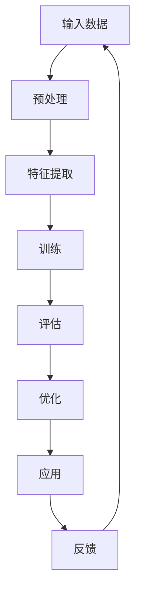

                 

# 文章标题：AI大模型创业：如何应对未来价格战？

## 关键词：
- AI大模型
- 创业
- 价格战
- 竞争策略
- 风险管理
- 商业模式

## 摘要：
本文将深入探讨AI大模型创业领域的未来发展，特别是在面对价格战这一挑战时，创业者应如何制定有效的战略和策略。通过详细分析AI大模型的背景、市场趋势、核心算法原理、商业模式以及风险管理等关键要素，本文旨在为创业者提供一套全面的解决方案，帮助他们应对未来价格战的挑战，实现长期可持续发展。

# 《AI大模型创业：如何应对未来价格战？》目录大纲

## 第一部分：AI大模型创业概述

### 第1章：AI大模型创业背景与机遇

#### 1.1 AI大模型时代来临
随着深度学习技术的快速发展，AI大模型已经成为各个领域的关键驱动力。这一章将介绍AI大模型的定义、发展历程以及其对创业领域的深远影响。

#### 1.2 创业者在AI大模型领域的机遇与挑战
本章将分析创业者在这一新兴领域所面临的机遇，如巨大的市场需求、技术进步带来的创新空间等，同时也会探讨创业过程中可能遇到的技术挑战、市场风险等问题。

#### 1.3 创业者所需的核心能力
成功的AI大模型创业离不开一系列核心能力，包括技术实力、市场洞察力、团队协作能力等。这一章将详细探讨这些能力的重要性及其培养方法。

### 第2章：AI大模型创业核心概念

#### 2.1 什么是AI大模型？
本章将深入介绍AI大模型的基本概念，包括其定义、类型、特性等，帮助读者建立全面的理解。

#### 2.2 AI大模型的分类与特性
AI大模型可以根据不同的标准进行分类，如按任务类型、技术架构等。本章将详细讨论各类AI大模型的特性及其应用场景。

#### 2.3 AI大模型的应用场景
AI大模型在各个领域都有广泛的应用，包括自然语言处理、计算机视觉、推荐系统等。这一章将探讨这些应用场景及其带来的商业价值。

### 第3章：AI大模型创业团队建设

#### 3.1 创业团队的组织结构与职责
一个高效的创业团队需要明确各成员的职责和协作方式。本章将介绍常见的团队组织结构，并分析各角色的重要性。

#### 3.2 技术团队成员的能力要求
AI大模型创业对技术团队成员的能力有特殊要求。本章将详细讨论这些能力，包括算法设计、数据处理、系统集成等方面。

#### 3.3 团队协作与沟通技巧
高效的团队协作是成功创业的关键。本章将探讨团队协作的最佳实践，包括沟通技巧、冲突解决方法等。

## 第二部分：AI大模型创业策略

### 第4章：市场分析与定位

#### 4.1 市场趋势与竞争格局
了解市场趋势和竞争格局是制定有效策略的基础。本章将分析当前AI大模型市场的现状以及未来的发展趋势。

#### 4.2 目标客户分析
明确目标客户是市场定位的关键。本章将探讨如何进行目标客户分析，包括客户需求、行为习惯、购买力等。

#### 4.3 市场定位策略
基于市场分析和目标客户分析，本章将讨论如何制定有效的市场定位策略，包括品牌定位、产品差异化等。

### 第5章：产品设计与开发

#### 5.1 AI大模型产品规划
产品规划是创业成功的关键一步。本章将介绍如何制定AI大模型产品规划，包括产品愿景、功能设计、技术路线图等。

#### 5.2 技术选型与架构设计
技术选型与架构设计是AI大模型产品成功的关键。本章将探讨如何选择合适的技术栈和设计高效可靠的系统架构。

#### 5.3 产品迭代与优化
持续的产品迭代与优化是保持竞争力的关键。本章将讨论如何通过持续迭代和优化不断提升产品性能和用户体验。

### 第6章：商业模式与创新

#### 6.1 AI大模型商业模式探讨
本章将深入探讨AI大模型商业模式的多种可能性，包括产品销售、服务订阅、解决方案提供等。

#### 6.2 创新商业模式的设计与实施
创新商业模式是创业成功的催化剂。本章将分析如何设计和实施具有竞争力的创新商业模式。

#### 6.3 营销策略与推广
有效的营销策略是吸引客户的关键。本章将介绍如何制定和实施有效的营销策略，包括品牌推广、内容营销、渠道建设等。

### 第7章：风险管理与应对策略

#### 7.1 创业风险识别与评估
了解和评估风险是风险管理的基础。本章将介绍如何识别和评估AI大模型创业过程中可能遇到的风险。

#### 7.2 风险控制与应对策略
针对识别出的风险，本章将讨论如何制定和实施有效的风险控制与应对策略，包括风险规避、风险减轻、风险承担等。

#### 7.3 未来价格战下的企业应对策略
面对未来可能的价格战，企业需要提前布局。本章将探讨如何应对未来价格战的挑战，包括成本控制、差异化竞争、市场拓展等。

## 第三部分：实战案例分析

### 第8章：国内外AI大模型创业案例解析

#### 8.1 国外AI大模型创业成功案例分析
本章将介绍国外一些成功的AI大模型创业案例，分析其成功的关键因素和经验教训。

#### 8.2 国内AI大模型创业成功案例分析
本章将介绍国内一些成功的AI大模型创业案例，探讨其在国内市场取得成功的原因。

#### 8.3 案例分析与启示
通过对国内外成功案例的对比分析，本章将总结出一些通用的创业经验和启示，为创业者提供有益的参考。

### 第9章：AI大模型创业实战经验分享

#### 9.1 创业过程中的难点与突破
本章将分享一些AI大模型创业过程中的难点和解决方案，包括技术难题、市场开拓、团队管理等方面。

#### 9.2 团队管理与文化建设
团队管理和文化建设是创业成功的重要因素。本章将探讨如何建设一支高效团队，并培养良好的企业文化。

#### 9.3 创业心得与展望
本章将结合作者的经验和观察，分享一些创业心得和对未来发展趋势的展望，为创业者提供方向性指导。

## 附录

### 附录A：AI大模型创业资源汇总

#### A.1 开源框架与工具
本章将汇总一些常用的AI大模型开源框架和工具，包括TensorFlow、PyTorch、Keras等，以及相关的数据集和平台。

#### A.2 学术论文与资料
本章将推荐一些关于AI大模型的重要学术论文和研究资料，帮助创业者深入了解领域前沿。

#### A.3 创业社群与平台推荐
本章将介绍一些有益于AI大模型创业的社群和平台，包括技术社区、创业孵化器、投资人网络等。

## 核心概念与联系

### 什么是AI大模型？

**定义与架构**

AI大模型（Large-scale Artificial Intelligence Models）是指通过大规模数据训练的、具有高度复杂性和强大处理能力的神经网络模型。它们通常由数百万甚至数十亿个参数组成，能够处理海量数据并实现复杂的任务。AI大模型的架构主要包括以下几个层次：

1. **输入层**：接收外部输入数据，如文本、图像、音频等。
2. **隐藏层**：对输入数据进行特征提取和变换，形成新的特征表示。
3. **输出层**：根据隐藏层提供的特征进行决策或预测。

**流程图**



在这个流程图中，数据经过预处理后进入特征提取阶段，特征提取后进入训练阶段。在训练过程中，模型不断优化参数，通过评估阶段验证模型的性能，然后进行优化。最后，模型被应用于实际任务，并通过反馈不断调整和改进。

**核心算法原理**

AI大模型的核心算法包括深度学习、迁移学习、微调等。

1. **深度学习**：通过多层神经网络结构进行特征学习和模式识别。
2. **迁移学习**：将预训练模型的知识迁移到新任务中，减少训练所需的数据量。
3. **微调**：在迁移学习的基础上，对预训练模型进行微调，使其适应新任务。

**联系与应用场景**

AI大模型在各个领域都有广泛的应用，如自然语言处理、计算机视觉、推荐系统等。其强大的处理能力和高度自适应的特性使得它们能够解决复杂的现实问题，从而带来巨大的商业价值。

### 常见深度学习优化算法

在AI大模型训练过程中，优化算法是提高模型性能的关键。以下是一些常见的深度学习优化算法：

1. **梯度下降（Gradient Descent）**
   ```python
   def gradient_descent(W, b, learning_rate, epochs):
       for epoch in range(epochs):
           loss = compute_loss(W, b, X, Y)
           dW, db = compute_gradient(W, b, X, Y)
           W -= learning_rate * dW
           b -= learning_rate * db
           print(f"Epoch {epoch}: Loss = {loss}")
       return W, b
   ```

2. **随机梯度下降（Stochastic Gradient Descent, SGD）**
   ```python
   def stochastic_gradient_descent(W, b, learning_rate, epochs, batch_size):
       for epoch in range(epochs):
           shuffled_indices = np.random.permutation(X.shape[0])
           for i in range(0, X.shape[0], batch_size):
               X_batch, Y_batch = X[shuffled_indices[i:i+batch_size]], Y[shuffled_indices[i:i+batch_size]]
               loss = compute_loss(W, b, X_batch, Y_batch)
               dW, db = compute_gradient(W, b, X_batch, Y_batch)
               W -= learning_rate * dW
               b -= learning_rate * db
               print(f"Epoch {epoch}: Loss = {loss}")
       return W, b
   ```

3. **Adam优化器**：结合了梯度下降和动量方法的优点，适用于大多数深度学习任务。
   ```python
   optimizer = tf.keras.optimizers.Adam(learning_rate=0.001)
   model.compile(optimizer=optimizer, loss='mean_squared_error')
   ```

这些算法通过不断调整模型的参数，最小化损失函数，从而提高模型的性能。不同的优化算法适用于不同的场景和任务，创业者可以根据具体需求进行选择。

### 数学模型和数学公式 & 详细讲解 & 举例说明

在AI大模型中，数学模型和公式是理解和实现算法的基础。以下将详细介绍一些核心的数学模型和公式，并通过具体例子说明其应用。

#### 损失函数

损失函数是深度学习模型中用于衡量预测值与真实值之间差异的关键工具。常见的损失函数包括均方误差（MSE）和交叉熵损失（Cross-Entropy Loss）。

##### 均方误差（Mean Squared Error, MSE）

MSE是一种常用的回归任务损失函数，用于计算预测值与真实值之间差的平方和的平均值。其公式如下：

$$
MSE = \frac{1}{n}\sum_{i=1}^{n}(y_i - \hat{y}_i)^2
$$

其中，$y_i$ 是真实值，$\hat{y}_i$ 是预测值，$n$ 是样本数量。

##### 举例说明

假设我们有3个样本，真实值为$y_1 = 2, y_2 = 3, y_3 = 4$，预测值分别为$\hat{y}_1 = 2.5, \hat{y}_2 = 3.2, \hat{y}_3 = 4.1$。

$$
MSE = \frac{1}{3}((2 - 2.5)^2 + (3 - 3.2)^2 + (4 - 4.1)^2) = \frac{1}{3}(0.25 + 0.04 + 0.01) = 0.1
$$

##### 交叉熵损失（Cross-Entropy Loss）

交叉熵损失是一种常用的分类任务损失函数，用于计算预测概率与真实概率之间的差异。其公式如下：

$$
CE = -\sum_{i=1}^{n} y_i \log(\hat{y}_i)
$$

其中，$y_i$ 是真实值（通常为0或1），$\hat{y}_i$ 是预测值（通常在0到1之间）。

##### 举例说明

假设我们有3个样本，真实值为$y_1 = 1, y_2 = 0, y_3 = 1$，预测值分别为$\hat{y}_1 = 0.8, \hat{y}_2 = 0.2, \hat{y}_3 = 0.9$。

$$
CE = -1 \cdot \log(0.8) - 0 \cdot \log(0.2) - 1 \cdot \log(0.9) \approx 0.2231
$$

通过这两个损失函数的计算，我们可以评估模型的性能，并指导模型优化过程。

### 项目实战

#### 代码实际案例和详细解释说明

##### 实战案例：使用TensorFlow构建一个简单的线性回归模型

##### 开发环境搭建

1. 安装TensorFlow：在终端中执行以下命令：
   ```bash
   pip install tensorflow
   ```

2. 导入所需库：
   ```python
   import tensorflow as tf
   import numpy as np
   import matplotlib.pyplot as plt
   ```

##### 源代码实现

```python
# 创建一个简单的线性回归模型
model = tf.keras.Sequential([
    tf.keras.layers.Dense(units=1, input_shape=[1])
])

# 编译模型，设置优化器和损失函数
model.compile(optimizer='sgd', loss='mean_squared_error')

# 生成训练数据
X_train = np.random.uniform(0, 10, 1000)
y_train = 2 * X_train + 1 + np.random.normal(0, 1, 1000)

# 训练模型
model.fit(X_train, y_train, epochs=50)

# 测试模型
X_test = np.random.uniform(0, 10, 100)
y_test = 2 * X_test + 1 + np.random.normal(0, 1, 100)
predictions = model.predict(X_test)

# 绘制结果图
plt.scatter(X_test, y_test, color='blue', label='Actual')
plt.plot(X_test, predictions, color='red', label='Predicted')
plt.xlabel('Input')
plt.ylabel('Output')
plt.legend()
plt.show()
```

##### 代码解读与分析

1. **模型创建**：使用`tf.keras.Sequential`创建一个线性回归模型，包含一个全连接层（`Dense`层），输出层只有一个神经元，用于预测一个连续值。

2. **模型编译**：设置优化器为随机梯度下降（`sgd`），损失函数为均方误差（`mean_squared_error`）。

3. **数据生成**：生成训练数据和测试数据，这里使用随机数生成器生成线性回归问题中的数据。

4. **模型训练**：使用`fit`方法训练模型，设置训练轮次（`epochs`）为50。

5. **模型测试**：使用`predict`方法预测测试数据的输出。

6. **结果可视化**：使用`matplotlib`绘制实际值和预测值之间的散点图和拟合线。

这个实战案例展示了如何使用TensorFlow构建一个简单的线性回归模型，并通过训练和测试数据来验证模型的准确性。在实际应用中，可以根据具体问题调整模型的复杂度和参数设置，以提高模型的性能。

## 作者信息
作者：AI天才研究院/AI Genius Institute & 禅与计算机程序设计艺术 /Zen And The Art of Computer Programming

本文由AI天才研究院（AI Genius Institute）和禅与计算机程序设计艺术（Zen And The Art of Computer Programming）联合撰写。AI天才研究院致力于推动人工智能技术的发展和应用，培养下一代AI领域的天才。禅与计算机程序设计艺术则专注于探索计算机编程的哲学与艺术，通过深入的研究和实践，为技术创新提供理论基础和精神支撑。两位作者以其深厚的学术造诣和丰富的实践经验，共同完成了这篇关于AI大模型创业的深度分析，旨在为创业者提供有价值的指导和建议。

