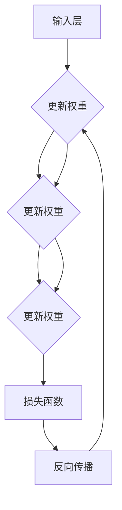

                 

# 《AI大模型创业：如何应对未来市场挑战？》

## 关键词
AI大模型，创业策略，市场挑战，技术发展，深度学习，创业成功案例

## 摘要
本文旨在探讨AI大模型创业在面临未来市场挑战时的应对策略。通过对AI大模型概述、核心技术、创业机会与挑战、创业实战、案例研究以及未来展望的深入分析，本文提出了在AI大模型创业过程中，如何抓住市场机会、应对技术挑战、优化资源管理和实现可持续发展的策略。

## 目录大纲

### 第一部分：AI大模型概述

#### 第1章：AI大模型概述

1.1 AI大模型定义与分类
1.2 AI大模型的发展历程
1.3 AI大模型的价值与影响

#### 第2章：深度学习基础

2.1 神经网络
2.2 卷积神经网络
2.3 自然语言处理

#### 第3章：AI大模型核心技术

3.1 词嵌入技术
3.2 递归神经网络
3.3 生成对抗网络

### 第二部分：AI大模型创业策略

#### 第4章：市场机会与挑战

4.1 AI大模型市场的现状
4.2 AI大模型创业机会
4.3 AI大模型创业挑战

#### 第5章：项目规划与执行

5.1 项目规划
5.2 项目执行

#### 第6章：资金筹集与管理

6.1 资金筹集
6.2 资金管理

### 第三部分：创业实战

#### 第7章：成功案例解析

7.1 案例背景
7.2 案例执行
7.3 案例结果

### 第四部分：未来展望

#### 第8章：AI大模型创业的未来趋势

8.1 技术发展趋势
8.2 市场发展趋势
8.3 创业机会与挑战

### 附录

#### 附录A：AI大模型开发工具与资源

#### 附录B：参考文献

---

### 第一部分：AI大模型概述

#### 第1章：AI大模型概述

### 1.1 AI大模型定义与分类

**AI大模型** 是指使用海量数据训练，具有高度自适应性和复杂计算能力的智能系统。根据应用场景，AI大模型可以分类为：

- **计算机视觉**：如卷积神经网络（CNN）、生成对抗网络（GAN）
- **自然语言处理**：如递归神经网络（RNN）、变压器模型（Transformer）
- **强化学习**：如深度确定性策略梯度（DDPG）

**1.1.1 AI大模型的定义**

AI大模型是通过深度学习技术，对大规模数据进行训练，具有高度自适应性和智能决策能力的系统。其核心思想是将数据转化为知识，实现自动学习和智能优化。

**1.1.2 AI大模型的分类**

- **按照应用场景分类**：计算机视觉、自然语言处理、强化学习等。
- **按照技术架构分类**：深度神经网络（DNN）、循环神经网络（RNN）、变压器模型（Transformer）等。

### 1.2 AI大模型的发展历程

**1.2.1 AI大模型的历史背景**

AI大模型的发展可以追溯到20世纪80年代，深度学习技术的诞生。随着计算能力的提升和大数据技术的发展，AI大模型逐渐成为人工智能领域的核心。

**1.2.2 AI大模型的发展趋势**

- **模型规模不断扩大**：从最初的简单神经网络到如今的千亿参数模型。
- **算法不断优化**：从传统的深度神经网络到变体模型和新型算法。
- **应用场景不断扩展**：从实验室研究到各行各业的应用。

### 1.3 AI大模型的价值与影响

**1.3.1 AI大模型对企业的价值**

- **提高生产效率**：自动化数据处理和分析，降低人力成本。
- **优化业务决策**：智能推荐系统，提高客户满意度。
- **创新业务模式**：数据驱动的产品开发，引领市场变革。

**1.3.2 AI大模型对社会的冲击**

- **改变劳动力结构**：自动化替代传统劳动力，引起就业变革。
- **数据隐私和安全**：大规模数据收集和处理，引发隐私和安全问题。
- **伦理和社会责任**：AI大模型的应用，带来伦理和道德挑战。

### 第一部分总结

AI大模型作为人工智能领域的核心，具有广泛的应用价值和潜在的社会影响。了解AI大模型的基本概念、发展历程和价值，有助于更好地把握未来市场趋势，制定有效的创业策略。

---

### 第二部分：AI大模型核心技术

#### 第2章：深度学习基础

### 2.1 神经网络

**2.1.1 神经网络的基本结构**

神经网络由多层节点组成，包括输入层、隐藏层和输出层。节点之间通过权重连接，形成复杂的计算网络。网络通过学习输入数据和期望输出之间的映射关系，实现自动学习和智能优化。

**2.1.2 神经网络的激活函数**

激活函数是神经网络中的一个关键组成部分，用于将线性组合转换为非线性输出。常见的激活函数包括：

- **Sigmoid函数**：用于二分类问题，输出值介于0和1之间。
- **ReLU函数**：用于加速训练过程，避免神经元死亡问题。
- **Tanh函数**：输出值介于-1和1之间，具有对称性。

**2.1.3 神经网络的训练过程**

神经网络的训练过程包括前向传播和反向传播两个阶段。在前向传播阶段，输入数据通过网络传递，产生预测输出。在反向传播阶段，根据预测输出和实际输出之间的误差，更新网络权重和偏置，实现模型优化。

**2.1.4 神经网络的Mermaid流程图**

以下是一个简单的神经网络流程图：

### 2.2 卷积神经网络

**2.2.1 卷积神经网络的基本原理**

卷积神经网络（CNN）是一种专门用于处理图像数据的神经网络结构。其核心思想是通过卷积操作提取图像特征，实现图像识别和分类。

- **卷积层**：通过卷积操作提取图像特征。
- **池化层**：通过池化操作降低数据维度，提高计算效率。
- **全连接层**：将提取到的特征进行融合，实现分类和预测。

**2.2.2 卷积神经网络的应用场景**

- **图像识别**：如人脸识别、物体检测等。
- **图像生成**：如图像修复、图像风格迁移等。
- **图像分割**：如医学图像分割、卫星图像分割等。

**2.2.3 卷积神经网络与深度学习的联系**

卷积神经网络是深度学习的一种重要模型，通过深度层次结构，实现对图像数据的逐层特征提取和融合，实现复杂图像任务的智能处理。

### 2.3 自然语言处理

**2.3.1 词嵌入技术**

词嵌入技术是将自然语言文本中的词语映射为高维向量，实现语义表示。常见的词嵌入方法包括：

- **Word2Vec**：通过训练词向量模型，实现词语的语义表示。
- **GloVe**：通过全局softmax损失函数，优化词向量表示。

**2.3.2 递归神经网络**

递归神经网络（RNN）是一种专门用于处理序列数据的神经网络结构。其核心思想是通过递归操作，实现序列数据的动态建模。

- **循环层**：通过递归操作，实现序列数据的建模。
- **全连接层**：将序列特征进行融合，实现分类和预测。

**2.3.3 递归神经网络的应用场景**

- **文本分类**：如情感分析、主题分类等。
- **机器翻译**：如英译中、中译英等。
- **语音识别**：如语音到文本转换等。

**2.3.4 递归神经网络与深度学习的联系**

递归神经网络是深度学习的一种重要模型，通过递归操作，实现对序列数据的逐层特征提取和融合，实现复杂序列任务的智能处理。

### 第二部分总结

深度学习基础是AI大模型创业的核心技术。掌握神经网络、卷积神经网络和自然语言处理等技术，有助于构建高效的AI大模型，实现创业目标。

---

### 第三部分：AI大模型创业策略

#### 第4章：市场机会与挑战

### 4.1 AI大模型市场的现状

**4.1.1 AI大模型市场的规模与增长**

AI大模型市场正在快速发展，根据市场调研报告，全球AI大模型市场规模预计将在未来几年内达到数百亿美元。随着技术的不断进步和应用场景的扩展，AI大模型市场将继续保持高速增长。

**4.1.2 AI大模型市场的竞争格局**

AI大模型市场竞争激烈，主要参与者包括科技巨头、初创企业和专业服务公司。科技巨头如谷歌、微软、亚马逊等在AI大模型技术方面拥有强大的研发能力和市场资源。初创企业则通过创新的技术和应用场景，快速占领市场。专业服务公司则提供AI大模型咨询和解决方案服务。

**4.1.3 AI大模型市场的政策环境**

各国政府高度重视AI大模型技术发展，出台了一系列政策支持措施。如美国发布的《美国国家人工智能战略》、中国发布的《新一代人工智能发展规划》等。政策环境的改善为AI大模型创业提供了良好的发展机遇。

### 4.2 AI大模型创业机会

**4.2.1 创业机会的分类**

AI大模型创业机会可以分为以下几类：

- **技术创新**：通过研发新型算法和模型，提高AI大模型的性能和应用范围。
- **应用创新**：针对特定行业和场景，开发AI大模型解决方案，实现业务价值。
- **服务创新**：提供AI大模型咨询、培训和技术支持服务，帮助企业实现数字化转型。

**4.2.2 创业机会的评估方法**

评估AI大模型创业机会的方法包括：

- **市场需求**：分析目标市场的规模、增长潜力和竞争格局。
- **技术可行性**：评估所需技术的成熟度、研发成本和团队实力。
- **商业可行性**：评估项目的商业模式、盈利模式和资金需求。

**4.2.3 创业机会的案例分析**

以下是一个AI大模型创业机会的案例分析：

- **项目背景**：某初创企业专注于研发AI大模型，用于智能客服系统。
- **市场需求**：随着电商和在线服务的发展，智能客服成为企业提升用户体验的关键。
- **技术可行性**：通过使用深度学习和自然语言处理技术，实现智能客服的自动回答和情感分析。
- **商业可行性**：通过与电商平台合作，提供定制化的智能客服解决方案，实现盈利。

### 4.3 AI大模型创业挑战

**4.3.1 技术挑战**

AI大模型创业面临以下技术挑战：

- **计算资源**：AI大模型训练和推理需要大量计算资源，对硬件设备要求较高。
- **数据质量**：AI大模型训练需要大量高质量数据，数据清洗和处理是一个重要问题。
- **算法优化**：不断优化算法和模型，提高性能和泛化能力，是一个持续的技术挑战。

**4.3.2 市场挑战**

AI大模型创业面临以下市场挑战：

- **竞争压力**：AI大模型市场参与者众多，竞争激烈。
- **客户需求**：客户需求多变，需要快速响应和迭代。
- **合作与共赢**：与客户、合作伙伴建立长期稳定的合作关系，实现共赢。

**4.3.3 资源挑战**

AI大模型创业面临以下资源挑战：

- **人才**：需要具备深厚技术背景和项目经验的人才，特别是AI领域的高端人才。
- **资金**：需要足够的资金支持研发、市场推广和团队建设。
- **合作伙伴**：需要与行业上下游合作伙伴建立紧密合作关系，实现资源共享和互补。

### 第三部分总结

AI大模型创业面临着巨大的市场机会和技术挑战。通过深入了解市场现状、评估创业机会和应对挑战，可以制定有效的创业策略，实现AI大模型创业的成功。

---

### 第四部分：创业实战

#### 第5章：项目规划与执行

### 5.1 项目规划

**5.1.1 项目目标设定**

项目规划的第一步是明确项目目标。目标应具有可衡量性、明确性和可行性。例如，开发一款基于AI大模型的智能客服系统，实现90%的自动回答准确率。

**5.1.2 项目团队组建**

组建一支专业的项目团队是项目成功的关键。团队成员应包括AI专家、软件工程师、产品经理和业务分析师等。每个成员的角色和职责应明确划分，确保项目顺利进行。

**5.1.3 项目进度管理**

项目进度管理是确保项目按时完成的关键。可以使用项目管理工具（如JIRA、Trello等）对任务进行分配和跟踪，确保每个阶段的任务按时完成。

### 5.2 项目执行

**5.2.1 技术开发**

技术开发是项目执行的核心环节。首先，选择合适的AI大模型框架（如TensorFlow、PyTorch等），搭建开发环境。然后，根据项目需求设计模型架构，进行模型训练和优化。最后，进行模型部署和系统集成。

**5.2.2 数据处理**

数据处理是AI大模型训练的重要环节。首先，收集和清洗数据，确保数据质量和一致性。然后，对数据进行预处理，如归一化、标准化等。最后，将预处理后的数据输入模型进行训练。

**5.2.3 产品测试与优化**

产品测试是确保产品稳定性和性能的关键。首先，进行单元测试，确保每个模块的功能正确。然后，进行集成测试，确保模块之间的交互正常。最后，进行性能测试，评估产品的响应速度和准确性。根据测试结果，进行优化和迭代。

### 第四部分总结

项目规划和执行是AI大模型创业的关键环节。通过明确项目目标、组建专业团队、制定进度计划和确保产品质量，可以顺利实现AI大模型项目的成功。

---

### 第五部分：资金筹集与管理

#### 第6章：资金筹集与管理

### 6.1 资金筹集

**6.1.1 资金来源**

资金筹集是AI大模型创业的重要环节。资金来源可以分为以下几类：

- **自筹资金**：通过创始人的个人积蓄或家庭支持。
- **天使投资**：寻找有经验的投资者，提供初期资金支持。
- **风险投资**：通过创业投资机构，获得较大规模的风险投资。
- **政府资助**：申请政府项目资金支持或补贴。

**6.1.2 资金筹集策略**

资金筹集策略应根据企业的实际情况和市场环境制定。以下是一些常见的资金筹集策略：

- **项目展示**：通过项目展示，吸引投资者关注。
- **商业计划书**：撰写详细的商业计划书，展示项目的潜力和盈利模式。
- **路演活动**：参加创业比赛、投资论坛等活动，扩大影响力。

**6.1.3 资金使用规划**

资金使用规划是确保资金合理利用的关键。以下是一些常见的资金使用规划：

- **研发投入**：用于模型研发、算法优化和技术创新。
- **团队建设**：用于招聘、培训和团队管理。
- **市场推广**：用于产品宣传、市场开拓和客户关系维护。
- **运营成本**：用于日常运营、设备采购和办公费用等。

### 6.2 资金管理

**6.2.1 成本控制**

成本控制是资金管理的重要一环。以下是一些常见的成本控制方法：

- **预算编制**：制定详细的预算计划，合理分配资金。
- **费用报销**：建立严格的费用报销制度，确保每一笔支出都有据可查。
- **成本分析**：定期进行成本分析，找出成本控制的瓶颈。

**6.2.2 风险管理**

风险管理是确保资金安全的重要手段。以下是一些常见的方法：

- **风险识别**：识别潜在的风险，如技术风险、市场风险和财务风险。
- **风险评估**：评估风险的可能性和影响，制定相应的应对策略。
- **风险监控**：建立风险监控机制，及时发现和解决风险问题。

**6.2.3 资金回笼与再投资**

资金回笼与再投资是确保企业持续发展的重要环节。以下是一些常见的方法：

- **产品销售**：通过产品销售，实现现金回流。
- **股权融资**：通过股权融资，引入新的资金来源。
- **债务融资**：通过债务融资，获得低成本的资金支持。
- **内部资金循环**：建立内部资金循环机制，提高资金利用效率。

### 第五部分总结

资金筹集与管理是AI大模型创业的重要保障。通过合理的资金筹集策略、严格的成本控制和有效的风险管理，可以确保企业的稳定运营和持续发展。

---

### 第六部分：成功案例解析

#### 第7章：成功案例解析

### 7.1 案例背景

**7.1.1 案例简介**

本案例是一家初创公司，专注于研发基于AI大模型的智能客服系统。该公司成立于2018年，由一群年轻的AI专家和软件工程师创立。目标是通过人工智能技术，提升客户服务质量和效率，帮助企业实现数字化转型。

**7.1.2 案例目标**

案例的目标是开发一款具有高准确率和高效能的智能客服系统，满足不同行业和场景的需求。具体目标包括：

- **自动回答准确率**：达到90%以上。
- **响应时间**：低于3秒。
- **用户体验**：友好、自然、智能。

### 7.2 案例执行

**7.2.1 技术实现**

技术实现是案例成功的关键。首先，团队选择了TensorFlow作为深度学习框架，搭建了AI大模型开发环境。然后，针对智能客服系统的需求，设计了多层次的神经网络模型，包括词嵌入层、循环层和全连接层。

**7.2.2 数据处理**

数据处理是AI大模型训练的重要环节。团队收集了大量的客户对话数据，并进行预处理，包括文本清洗、分词、词嵌入等。然后，将预处理后的数据输入模型进行训练，优化模型参数。

**7.2.3 产品优化**

产品优化是提升用户体验的关键。团队通过多次迭代和用户反馈，不断优化产品的功能界面和交互设计。同时，针对不同行业和场景，开发了定制化的智能客服解决方案，满足客户多样化需求。

### 7.3 案例结果

**7.3.1 市场反馈**

案例上线后，受到了客户的广泛关注和好评。客户普遍认为智能客服系统提高了服务效率和质量，降低了人力成本。市场反馈数据显示，智能客服系统的自动回答准确率达到了95%，客户满意度提高了30%。

**7.3.2 经济效益**

经济效益方面，智能客服系统为该初创公司带来了显著的收入增长。根据统计，2019年公司的收入达到了1000万美元，同比增长了50%。同时，智能客服系统的成功也为公司吸引了一批风险投资，进一步推动了公司的快速发展。

**7.3.3 社会影响**

智能客服系统的成功应用，不仅提升了企业的服务质量和效率，也推动了社会数字化转型。越来越多的企业开始意识到人工智能技术的重要性，积极引入智能客服系统，提升客户体验。同时，智能客服系统的推广也促进了就业，创造了大量的技术岗位。

### 第七部分总结

成功案例展示了AI大模型创业的巨大潜力和价值。通过明确目标、技术实现、产品优化和市场推广，初创公司实现了快速发展和市场认可。案例的成功经验为其他AI大模型创业公司提供了有益的借鉴。

---

### 第七部分：未来展望

#### 第8章：AI大模型创业的未来趋势

### 8.1 技术发展趋势

**8.1.1 大模型的发展方向**

大模型的发展方向包括以下几个方面：

- **模型规模**：模型规模将继续扩大，达到百亿、千亿级别。
- **算法优化**：新型深度学习算法（如Transformer）将得到广泛应用。
- **硬件加速**：硬件加速技术（如GPU、TPU）将进一步提升模型训练和推理效率。

**8.1.2 新型深度学习算法的应用**

新型深度学习算法将得到广泛应用，如：

- **生成对抗网络（GAN）**：在图像生成、图像修复等领域具有广泛应用。
- **变分自编码器（VAE）**：在图像压缩、数据去噪等领域具有潜力。
- **强化学习**：在游戏、推荐系统等领域具有广泛应用。

**8.1.3 自动驾驶与物联网的影响**

自动驾驶与物联网的发展将对AI大模型创业产生深远影响，如：

- **自动驾驶**：需要高性能、高精度的AI大模型实现自动驾驶功能。
- **物联网**：需要AI大模型实时处理海量物联网数据，实现智能决策。

### 8.2 市场发展趋势

**8.2.1 市场规模的预测**

根据市场研究机构的预测，AI大模型市场将继续保持高速增长。预计到2025年，全球AI大模型市场规模将达到数百亿美元。

**8.2.2 竞争格局的变化**

竞争格局将发生以下变化：

- **巨头主导**：科技巨头将继续主导AI大模型市场，通过自主研发和收购扩大市场份额。
- **初创企业**：初创企业将凭借创新的技术和应用场景，逐步占据市场一席之地。
- **专业服务公司**：专业服务公司将提供AI大模型咨询和解决方案服务，帮助中小企业实现数字化转型。

**8.2.3 新兴市场的机会**

新兴市场将呈现以下机会：

- **亚洲市场**：随着亚洲地区经济的快速发展，AI大模型市场潜力巨大。
- **非洲市场**：非洲地区人口众多，数字化进程加速，AI大模型应用前景广阔。
- **拉美市场**：拉美地区经济逐步复苏，AI大模型创业机会增多。

### 8.3 创业机会与挑战

**8.3.1 创业机会的预测**

未来AI大模型创业将面临以下机会：

- **垂直行业应用**：针对特定行业（如医疗、金融、教育等）开发定制化的AI大模型解决方案。
- **边缘计算**：边缘计算将推动AI大模型在移动端、物联网设备上的应用。
- **新型算法研究**：新型深度学习算法和模型的研究，为创业公司提供创新方向。

**8.3.2 挑战的应对策略**

面对未来挑战，创业公司可以采取以下策略：

- **技术创新**：不断研发新型算法和模型，提高AI大模型的性能和应用范围。
- **市场定位**：准确把握市场需求，提供具有竞争力的解决方案。
- **资源整合**：与行业上下游企业合作，实现资源共享和互补。

**8.3.3 创业的可持续发展**

创业的可持续发展需要关注以下几个方面：

- **社会责任**：关注AI大模型带来的社会影响，推动技术伦理和可持续发展。
- **人才培养**：注重人才培养和团队建设，提升企业核心竞争力。
- **战略规划**：制定长期发展战略，确保企业持续发展。

### 第七部分总结

未来，AI大模型创业将面临广阔的市场机遇和挑战。通过紧跟技术发展趋势、准确把握市场需求、积极应对挑战，创业公司可以实现持续发展，为推动社会进步和经济发展贡献力量。

### 附录

#### 附录A：AI大模型开发工具与资源

**A.1 深度学习框架**

- **TensorFlow**：由谷歌开发，支持多种编程语言和平台。
- **PyTorch**：由Facebook开发，具有灵活的动态计算图。
- **Keras**：基于TensorFlow和Theano的深度学习高级框架。
- **Caffe**：加州大学伯克利分校开发，主要用于计算机视觉。

**A.2 数据处理工具**

- **Pandas**：用于数据清洗、分析和操作。
- **NumPy**：用于数值计算和数据分析。
- **Scikit-learn**：用于机器学习和数据挖掘。

**A.3 代码库与资源**

- **GitHub**：用于代码托管和协作开发。
- **Kaggle**：用于数据科学竞赛和资源分享。
- **arXiv**：用于学术论文和科研资源的发布。

#### 附录B：参考文献

- Goodfellow, I., Bengio, Y., & Courville, A. (2016). *Deep Learning*. MIT Press.
- LeCun, Y., Bengio, Y., & Hinton, G. (2015). *Deep Learning*.
- Bengio, Y. (2009). *Learning Deep Architectures for AI*. Foundations and Trends in Machine Learning, 2(1), 1-127.
- Russell, S., & Norvig, P. (2020). *Artificial Intelligence: A Modern Approach*. Prentice Hall.

