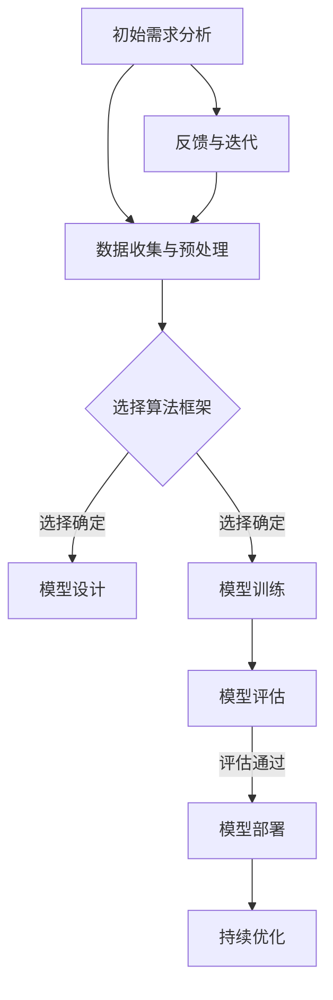

                 

### 文章标题

《AI大模型创业：如何应对未来挑战？》

### 关键词

人工智能，大模型，创业，挑战，技术趋势，应用实战

### 摘要

本文旨在探讨AI大模型创业所面临的挑战以及应对策略。文章首先介绍了AI大模型创业的意义和挑战，包括AI大模型的发展趋势、创业中的机遇与风险，以及创业者的必备素质。接着，文章深入解析了AI大模型的核心技术，包括神经网络、深度学习框架、大规模数据处理、预训练模型、迁移学习和微调技术等。随后，文章分析了AI大模型在不同行业领域的应用，并分享了具体的创业项目实操案例。最后，文章展望了AI大模型创业的未来趋势，强调了创业者的持续学习和创新的重要性。通过本文的阅读，读者可以全面了解AI大模型创业的现状、挑战和未来发展方向。

### 《AI大模型创业：如何应对未来挑战？》目录大纲

#### 第一部分：AI大模型创业概述

- **第1章：AI大模型创业概览**
  - **1.1 AI大模型创业的意义与挑战**
    - **1.1.1 AI大模型的发展趋势**
    - **1.1.2 创业中的机遇与风险**
    - **1.1.3 创业者的必备素质**
  - **1.2 AI大模型创业的准备**
    - **1.2.1 创业团队建设**
    - **1.2.2 市场调研与定位**
    - **1.2.3 资金筹备与风险控制**

#### 第二部分：AI大模型核心技术

- **第2章：AI大模型基础技术**
  - **2.1 AI大模型的核心概念**
    - **2.1.1 神经网络**
    - **2.1.2 深度学习框架**
    - **2.1.3 大规模数据处理**
  - **2.2 AI大模型的关键算法**
    - **2.2.1 预训练模型**
    - **2.2.2 迁移学习**
    - **2.2.3 微调技术**
  - **2.3 AI大模型的性能优化**
    - **2.3.1 并行计算**
    - **2.3.2 GPU加速**
    - **2.3.3 模型压缩与量化**

#### 第三部分：AI大模型应用实战

- **第3章：AI大模型应用领域解析**
  - **3.1 人工智能领域的挑战**
    - **3.1.1 数据隐私与安全性**
    - **3.1.2 AI偏见与公平性**
    - **3.1.3 AI伦理问题**
  - **3.2 AI大模型在主要行业的应用**
    - **3.2.1 制造业**
    - **3.2.2 零售业**
    - **3.2.3 医疗健康**
    - **3.2.4 金融科技**
- **第4章：AI大模型创业项目实操**
  - **4.1 项目规划与实施**
    - **4.1.1 项目可行性分析**
    - **4.1.2 项目开发流程**
    - **4.1.3 团队协作与进度控制**
  - **4.2 案例分享与经验总结**
    - **4.2.1 成功案例解析**
    - **4.2.2 失败案例反思**
    - **4.2.3 困境与解决方案**

#### 第四部分：未来展望与持续创新

- **第5章：AI大模型创业未来趋势**
  - **5.1 技术发展趋势**
    - **5.1.1 量子计算**
    - **5.1.2 脑机接口**
    - **5.1.3 自主学习与强化学习**
  - **5.2 创业领域的变革**
    - **5.2.1 新兴市场的机会**
    - **5.2.2 创业生态的建设**
    - **5.2.3 跨界合作与创新**
- **第6章：创业者的持续学习与创新**
  - **6.1 技术更新与持续学习**
    - **6.1.1 学术论文阅读**
    - **6.1.2 开源社区参与**
    - **6.1.3 行业会议与论坛**
  - **6.2 创新思维与方法**
    - **6.2.1 设计思维**
    - **6.2.2 系统思维**
    - **6.2.3 创新方法论**

#### 附录

- **附录A：AI大模型开发资源与工具**
  - **A.1 深度学习框架**
  - **A.2 数据集与数据预处理工具**
  - **A.3 模型评估与优化工具**
  - **A.4 AI创业相关的政策与法规**

### AI大模型开发流程



### AI大模型核心技术讲解

#### 2.2 AI大模型的关键算法

##### 2.2.1 预训练模型

预训练模型是指在大规模数据集上进行预训练，然后使用迁移学习技术，将其知识迁移到特定任务上的模型。预训练模型的核心优势在于能够利用大量未标注的数据进行训练，从而提升模型的泛化能力。

伪代码：

```plaintext
function PretrainModel(dataset):
    # 使用大规模未标注数据集进行预训练
    for data in dataset:
        forward_pass(data)
        backward_pass()
    return trained_model

function FineTuneModel(pretrained_model, task_dataset):
    # 在特定任务数据集上进行微调
    for data in task_dataset:
        forward_pass(data, pretrained_model)
        backward_pass()
    return fine_tuned_model
```

##### 2.2.2 迁移学习

迁移学习是指将一个任务在源数据集上训练好的模型，应用到另一个相关但不同的任务上。通过迁移学习，我们可以利用在源任务上学习的知识来提高目标任务的性能。

伪代码：

```plaintext
function TransferLearning(source_model, target_dataset):
    # 冻结源模型的参数
    for param in source_model.parameters():
        param.requires_grad = False

    # 在目标数据集上训练模型
    for data in target_dataset:
        forward_pass(data, source_model)
        backward_pass()
    return trained_model
```

##### 2.2.3 微调技术

微调技术是指在大规模预训练模型的基础上，使用少量标注数据进行再次训练，以适应特定任务的需求。微调技术能够有效地利用预训练模型的大量知识和少量标注数据，提高模型在特定任务上的性能。

伪代码：

```plaintext
function FineTuning(pretrained_model, task_dataset, learning_rate):
    optimizer = Adam(pretrained_model.parameters(), lr=learning_rate)

    for epoch in range(num_epochs):
        for data in task_dataset:
            optimizer.zero_grad()
            output = pretrained_model(data)
            loss = calculate_loss(output, target)
            loss.backward()
            optimizer.step()

    return fine_tuned_model
```

### 数学模型和数学公式

#### 2.3 AI大模型的性能优化

##### 2.3.1 并行计算

并行计算是指将一个计算任务分布在多个计算节点上，以提高计算效率和性能。在AI大模型训练过程中，并行计算是提高训练速度和效率的关键技术。

$$
并行计算效率 = \frac{总计算量}{单个节点计算量 \times 节点数}
$$

##### 2.3.2 GPU加速

GPU（图形处理器）在AI大模型训练中具有显著的加速效果。GPU相较于CPU具有更高的计算能力和并行处理能力，能够大幅度提高模型的训练速度。

$$
GPU加速比 = \frac{单个GPU计算能力}{单个CPU计算能力}
$$

##### 2.3.3 模型压缩与量化

模型压缩与量化是降低AI大模型计算复杂度和存储开销的重要技术。通过压缩与量化，可以将模型的大小减小，从而降低部署成本和资源消耗。

$$
模型压缩率 = \frac{原始模型大小}{压缩后模型大小}
$$

### 4.2 AI大模型创业项目实操

##### 4.2.1 项目规划与实施

在AI大模型创业项目中，项目规划与实施是关键环节。以下是一个典型的项目规划与实施流程：

1. **项目立项**：明确项目目标、范围和预期成果。
2. **需求分析**：深入了解用户需求，制定详细的需求文档。
3. **技术选型**：根据需求，选择合适的算法框架和开发工具。
4. **数据收集与预处理**：收集相关数据，并进行数据清洗和预处理。
5. **模型设计**：设计适合项目的模型架构和算法。
6. **模型训练**：使用收集的数据训练模型。
7. **模型评估**：评估模型性能，并进行调整优化。
8. **模型部署**：将模型部署到生产环境中。
9. **持续优化**：根据用户反馈，不断优化模型性能。

##### 4.2.2 案例分享与经验总结

**案例1：智能客服系统**

- **需求**：企业希望构建一个智能客服系统，以提升客户服务效率和用户体验。
- **解决方案**：采用预训练模型进行自然语言处理，结合迁移学习技术，针对企业特定场景进行微调。
- **效果**：智能客服系统能够实现高效、准确的客户咨询处理，大幅提升了企业客服效率。

**案例2：智能医疗诊断系统**

- **需求**：医疗机构希望利用AI技术提升疾病诊断的准确性和效率。
- **解决方案**：结合医学影像数据和文本数据，采用多模态学习技术，构建智能医疗诊断系统。
- **效果**：智能医疗诊断系统在特定疾病的诊断上表现出了较高的准确性，为医生提供了有力支持。

**经验总结**：

- **技术选型**：根据项目需求和资源情况，选择合适的算法框架和开发工具。
- **数据质量**：高质量的数据是模型训练的关键，数据预处理和清洗工作至关重要。
- **团队协作**：项目成功离不开团队的协作与沟通，要建立有效的沟通机制和项目管理流程。
- **持续迭代**：在项目实施过程中，要不断收集用户反馈，持续优化模型和系统性能。

##### 4.2.3 困境与解决方案

**困境1：模型性能不佳**

- **原因**：数据不足、算法选择不当、模型设计不合理等。
- **解决方案**：扩充数据集、更换算法框架、重新设计模型架构。

**困境2：项目进度延误**

- **原因**：需求变更、技术难题、团队沟通不畅等。
- **解决方案**：明确项目目标和范围，加强团队沟通，合理分配任务和资源。

**困境3：资源不足**

- **原因**：资金、人力资源等不足。
- **解决方案**：寻求投资、优化人力资源配置、采用开源技术和工具。

### 附录：AI大模型开发资源与工具

#### A.1 深度学习框架

- **TensorFlow**：由Google开发，支持Python和C++接口，广泛应用于工业界和学术界。
- **PyTorch**：由Facebook开发，支持Python接口，具有动态计算图，易于调试。
- **Keras**：基于TensorFlow和Theano，提供简洁、易用的API，适合快速实验。

#### A.2 数据集与数据预处理工具

- **ImageNet**：大规模的图像识别数据集，广泛应用于图像识别任务。
- **CIFAR-10**：包含60000张32x32彩色图像，常用于图像分类任务。
- **OpenPose**：用于人体关键点检测的数据集。
- **data preprocessing libraries**：如NumPy、Pandas、Scikit-learn等，用于数据清洗、预处理和特征提取。

#### A.3 模型评估与优化工具

- **Metrics**：用于计算各种评估指标，如准确率、召回率、F1分数等。
- **TensorBoard**：用于可视化模型训练过程，如损失函数、精度曲线等。
- **Hyperopt**：用于超参数优化，找到最佳参数组合。
- **Wandb**：用于实验跟踪和管理，记录实验结果和模型性能。

### A.4 AI创业相关的政策与法规

#### A.4.1 国内政策

- **《新一代人工智能发展规划》**：明确了我国在人工智能领域的战略目标和任务。
- **《互联网信息服务管理办法》**：规范了互联网信息服务的管理，涉及数据隐私、网络安全等方面。

#### A.4.2 国际法规

- **GDPR**：欧洲通用数据保护条例，对个人数据的处理和使用有严格规定。
- **CCPA**：加州消费者隐私法案，保护加州居民的个人信息。

#### A.4.3 遵守政策与法规的重要性

- **保护用户隐私**：遵守相关法规，确保用户数据的隐私和安全。
- **降低法律风险**：避免因违反法规而导致的法律纠纷和损失。
- **树立企业形象**：积极遵守政策法规，提升企业在行业内的声誉。

### 作者

作者：AI天才研究院/AI Genius Institute & 禅与计算机程序设计艺术 /Zen And The Art of Computer Programming

---

### AI大模型创业：如何应对未来挑战？

#### 第一部分：AI大模型创业概述

##### 第1章：AI大模型创业概览

AI大模型创业在近年来成为了科技创业领域的热点。随着人工智能技术的不断进步和应用的广泛深入，AI大模型在图像识别、自然语言处理、语音识别等领域的表现令人瞩目。然而，AI大模型创业也面临着诸多挑战，包括技术挑战、市场挑战和法规挑战等。在这一章中，我们将探讨AI大模型创业的意义与挑战，以及创业者的必备素质和创业准备。

###### 1.1 AI大模型创业的意义与挑战

###### 1.1.1 AI大模型的发展趋势

AI大模型是指那些参数量庞大、能够处理复杂数据的神经网络模型，如Transformer、BERT等。这些模型在处理大规模数据时表现出色，已经在许多领域取得了显著的成果。例如，在图像识别领域，ResNet、EfficientNet等模型已经达到了超高的准确率；在自然语言处理领域，GPT、BERT等模型在文本生成、问答系统等方面展现出了强大的能力。

随着计算能力的提升和数据量的增加，AI大模型的发展趋势将更加迅猛。量子计算、脑机接口等前沿技术的突破，将进一步推动AI大模型的发展。

###### 1.1.2 创业中的机遇与风险

AI大模型创业中的机遇主要体现在以下几个方面：

1. **市场需求**：随着人工智能技术的普及，各行各业对AI大模型的应用需求不断增加。尤其是在金融、医疗、教育等领域，AI大模型能够为行业带来革命性的变革。
2. **技术进步**：AI大模型的技术不断成熟，为其应用提供了强大的支持。创业者可以利用这些先进技术，开发出具有竞争力的产品。
3. **投资环境**：随着人工智能成为国家战略，政府和资本对AI领域的支持力度不断加大，为创业者提供了良好的发展环境。

然而，AI大模型创业也面临着诸多风险：

1. **技术风险**：AI大模型的技术复杂度高，对创业者的技术实力要求较高。如果技术实现不成功，可能导致项目失败。
2. **市场风险**：虽然市场需求巨大，但市场竞争也异常激烈。创业者需要深入了解市场，找准切入点。
3. **法规风险**：AI技术的应用涉及数据隐私、伦理等方面，创业者需要遵守相关法规，否则可能面临法律风险。

###### 1.1.3 创业者的必备素质

成功的AI大模型创业离不开以下几方面的素质：

1. **技术背景**：创业者应具备扎实的计算机科学和人工智能知识，熟悉神经网络、深度学习等相关技术。
2. **团队协作**：创业者需要组建一支具有多元化技能的团队，包括算法工程师、数据工程师、产品经理等，共同推进项目。
3. **市场洞察**：创业者应具备敏锐的市场洞察力，能够准确把握市场需求，找到创业的方向。
4. **项目管理**：创业者需要具备良好的项目管理能力，确保项目按时按质完成。
5. **持续学习**：人工智能技术更新迅速，创业者需要具备持续学习的能力，紧跟行业发展趋势。

###### 1.2 AI大模型创业的准备

成功的AI大模型创业需要充分的准备工作，包括团队建设、市场调研、资金筹备等方面。

1. **团队建设**：创业者需要根据项目需求，组建一支具备多元化技能的团队。团队成员应包括算法工程师、数据工程师、产品经理、市场人员等。
2. **市场调研**：创业者应深入了解目标市场，包括市场规模、竞争状况、用户需求等。通过市场调研，可以确定项目的定位和策略。
3. **资金筹备**：AI大模型创业需要大量的资金投入，包括硬件设备、人力成本、研发费用等。创业者可以通过自有资金、风险投资、政府资助等多种途径筹集资金。
4. **风险控制**：创业者需要制定详细的风险控制计划，包括技术风险、市场风险、财务风险等，以确保项目顺利进行。

##### 总结

AI大模型创业具有巨大的市场潜力和技术挑战。创业者需要具备扎实的技术背景、团队协作能力、市场洞察力和项目管理能力，同时做好充分的准备工作。在创业过程中，创业者应密切关注市场动态，持续优化产品，积极应对挑战。通过本文的探讨，希望读者对AI大模型创业有更深刻的认识，为未来的创业之路奠定坚实基础。

---

#### 第二部分：AI大模型核心技术

##### 第2章：AI大模型基础技术

AI大模型的成功离不开其核心技术的支撑。在这一章中，我们将深入探讨AI大模型的基础技术，包括神经网络、深度学习框架、大规模数据处理等。通过了解这些核心技术，读者将能够更好地理解AI大模型的工作原理和应用场景。

###### 2.1 AI大模型的核心概念

###### 2.1.1 神经网络

神经网络是人工智能的核心技术之一，其基本结构由神经元、层和连接组成。神经网络通过模拟人脑神经元之间的连接和交互，实现对数据的处理和学习。在AI大模型中，神经网络被广泛应用于图像识别、语音识别、自然语言处理等领域。

神经网络的层级结构可以分为输入层、隐藏层和输出层。输入层接收外部数据，隐藏层通过加权求和和激活函数实现特征提取和变换，输出层产生最终的预测结果。

神经网络的工作原理是，通过前向传播将输入数据传递到隐藏层，然后在隐藏层中进行计算和传递。最终，输出层生成预测结果。在训练过程中，神经网络通过反向传播算法不断调整权重和偏置，以降低预测误差。

以下是一个简单的神经网络训练过程的伪代码：

```plaintext
function NeuralNetworkTraining(dataset, learning_rate):
    for epoch in range(num_epochs):
        for data in dataset:
            output = forward_pass(data)
            loss = calculate_loss(output, target)
            backward_pass(loss, learning_rate)
    return trained_network
```

其中，`forward_pass`函数实现前向传播，`calculate_loss`函数计算损失函数，`backward_pass`函数实现反向传播。

###### 2.1.2 深度学习框架

深度学习框架是用于实现和优化神经网络训练的工具。常见的深度学习框架包括TensorFlow、PyTorch、Keras等。这些框架提供了丰富的API和工具，使得深度学习模型的开发、训练和部署变得更加便捷和高效。

以TensorFlow为例，其核心组件包括计算图（Compute Graph）、会话（Session）和操作（Operation）。计算图定义了神经网络的结构，会话用于执行计算图中的操作，操作则实现了数据的前向传播和反向传播。

以下是一个简单的TensorFlow代码示例：

```python
import tensorflow as tf

# 定义计算图
input_layer = tf.keras.layers.Dense(units=10, activation='relu')(tf.keras.layers.Dense(units=10, activation='relu')(input_data))

# 创建会话
with tf.Session() as sess:
    # 训练模型
    sess.run(train_op)

    # 预测
    prediction = sess.run(prediction, feed_dict={input_data: x_test})
```

###### 2.1.3 大规模数据处理

AI大模型通常需要处理大量的数据。在大规模数据处理方面，常用的技术包括数据预处理、分布式计算和并行计算等。

1. **数据预处理**：数据预处理是大规模数据处理的第一步，包括数据清洗、数据转换、数据归一化等。数据预处理的质量直接影响模型的性能和训练速度。

2. **分布式计算**：分布式计算是将大规模数据处理任务分解成多个子任务，分布在多个计算节点上并行执行。分布式计算能够提高数据处理的速度和效率。

3. **并行计算**：并行计算是将一个计算任务分布在多个计算节点上，以提高计算效率和性能。在AI大模型训练过程中，并行计算是提高训练速度和效率的关键技术。

以下是一个简单的分布式计算示例：

```python
import tensorflow as tf

# 定义计算图
input_layer = tf.keras.layers.Dense(units=10, activation='relu')(tf.keras.layers.Dense(units=10, activation='relu')(input_data))

# 创建分布式会话
with tf.Session() as sess:
    # 训练模型
    sess.run(train_op)

    # 预测
    prediction = sess.run(prediction, feed_dict={input_data: x_test})
```

###### 2.2 AI大模型的关键算法

###### 2.2.1 预训练模型

预训练模型是指在大规模数据集上进行预训练，然后使用迁移学习技术，将其知识迁移到特定任务上的模型。预训练模型的核心优势在于能够利用大量未标注的数据进行训练，从而提升模型的泛化能力。

预训练模型通常分为两个阶段：预训练阶段和微调阶段。在预训练阶段，模型在大规模数据集上进行训练，学习通用特征表示。在微调阶段，模型在特定任务上进行微调，以适应具体的应用场景。

以下是一个简单的预训练模型训练过程的伪代码：

```plaintext
function PretrainModel(dataset, learning_rate):
    for epoch in range(num_epochs):
        for data in dataset:
            forward_pass(data)
            backward_pass(learning_rate)
    return trained_model

function FineTuneModel(pretrained_model, task_dataset, learning_rate):
    for epoch in range(num_epochs):
        for data in task_dataset:
            forward_pass(data, pretrained_model)
            backward_pass(learning_rate)
    return fine_tuned_model
```

###### 2.2.2 迁移学习

迁移学习是指将一个任务在源数据集上训练好的模型，应用到另一个相关但不同的任务上。通过迁移学习，我们可以利用在源任务上学习的知识来提高目标任务的性能。

迁移学习的关键在于如何有效地利用源任务的知识，并将其迁移到目标任务。常见的迁移学习方法包括模型迁移、特征迁移和知识蒸馏等。

以下是一个简单的迁移学习模型训练过程的伪代码：

```plaintext
function TransferLearning(source_model, target_dataset, learning_rate):
    for epoch in range(num_epochs):
        for data in target_dataset:
            forward_pass(data, source_model)
            backward_pass(learning_rate)
    return trained_model
```

###### 2.2.3 微调技术

微调技术是指在大规模预训练模型的基础上，使用少量标注数据进行再次训练，以适应特定任务的需求。微调技术能够有效地利用预训练模型的大量知识和少量标注数据，提高模型在特定任务上的性能。

微调技术主要包括两个步骤：特征提取和任务分类。在特征提取阶段，模型从预训练模型中提取特征表示；在任务分类阶段，模型使用少量标注数据进行分类训练。

以下是一个简单的微调模型训练过程的伪代码：

```plaintext
function FineTuning(pretrained_model, task_dataset, learning_rate):
    optimizer = Adam(pretrained_model.parameters(), lr=learning_rate)

    for epoch in range(num_epochs):
        for data in task_dataset:
            optimizer.zero_grad()
            output = pretrained_model(data)
            loss = calculate_loss(output, target)
            loss.backward()
            optimizer.step()

    return fine_tuned_model
```

###### 2.3 AI大模型的性能优化

AI大模型的性能优化是提升模型效果和训练效率的重要手段。以下是一些常见的性能优化技术：

###### 2.3.1 并行计算

并行计算是指将一个计算任务分布在多个计算节点上，以提高计算效率和性能。在AI大模型训练过程中，并行计算是提高训练速度和效率的关键技术。

并行计算可以分为数据并行、模型并行和计算并行等。数据并行是将数据分批次处理，模型并行是将模型分块训练，计算并行是同时执行多个计算任务。

以下是一个简单的并行计算示例：

```python
import tensorflow as tf

# 定义计算图
input_layer = tf.keras.layers.Dense(units=10, activation='relu')(tf.keras.layers.Dense(units=10, activation='relu')(input_data))

# 创建分布式会话
with tf.Session() as sess:
    # 训练模型
    sess.run(train_op)

    # 预测
    prediction = sess.run(prediction, feed_dict={input_data: x_test})
```

###### 2.3.2 GPU加速

GPU（图形处理器）在AI大模型训练中具有显著的加速效果。GPU相较于CPU具有更高的计算能力和并行处理能力，能够大幅度提高模型的训练速度。

以下是一个简单的GPU加速示例：

```python
import tensorflow as tf

# 定义计算图
input_layer = tf.keras.layers.Dense(units=10, activation='relu')(tf.keras.layers.Dense(units=10, activation='relu')(input_data))

# 将计算图复制到GPU设备
with tf.device('/GPU:0'):
    # 训练模型
    with tf.Session() as sess:
        sess.run(train_op)

        # 预测
        prediction = sess.run(prediction, feed_dict={input_data: x_test})
```

###### 2.3.3 模型压缩与量化

模型压缩与量化是降低AI大模型计算复杂度和存储开销的重要技术。通过压缩与量化，可以将模型的大小减小，从而降低部署成本和资源消耗。

模型压缩技术包括模型剪枝、量化、知识蒸馏等。量化技术是将浮点数参数转换为低精度整数参数，以减少模型的大小和计算量。

以下是一个简单的模型量化示例：

```python
import tensorflow as tf

# 定义计算图
input_layer = tf.keras.layers.Dense(units=10, activation='relu')(tf.keras.layers.Dense(units=10, activation='relu')(input_data))

# 量化模型
quantized_model = tf.keras.models.Sequential([
    tf.keras.layers.Dense(units=10, activation='relu', use_bias=False),
    tf.keras.layers.Dense(units=10, activation='softmax', use_bias=False)
])

# 训练量化模型
with tf.Session() as sess:
    sess.run(quantized_model.compile(optimizer='adam', loss='categorical_crossentropy', metrics=['accuracy']))

    # 预测
    prediction = sess.run(quantized_model.predict(input_data))
```

##### 总结

AI大模型的核心技术是神经网络、深度学习框架和大规模数据处理等。通过掌握这些核心技术，读者可以更好地理解AI大模型的工作原理和应用场景。在未来的AI大模型创业中，创业者需要不断学习和掌握这些技术，以应对日益激烈的竞争和不断变化的市场需求。

---

#### 第三部分：AI大模型应用实战

##### 第3章：AI大模型应用领域解析

随着人工智能技术的不断发展，AI大模型在各个领域得到了广泛的应用。从制造业到零售业，从医疗健康到金融科技，AI大模型正在深刻地改变着各行各业的运作方式。本章将深入探讨AI大模型在这些领域中的应用挑战，包括数据隐私与安全性、AI偏见与公平性以及AI伦理问题，并分析AI大模型在这些行业中的具体应用案例。

###### 3.1 人工智能领域的挑战

尽管AI大模型在各个领域展现出巨大的潜力，但其在应用过程中也面临着一系列挑战。

###### 3.1.1 数据隐私与安全性

数据隐私与安全性是AI大模型应用中最为关键的挑战之一。AI大模型训练通常需要大量的数据，这些数据往往涉及用户的敏感信息，如个人身份、健康记录等。如何确保这些数据在训练和部署过程中的安全性和隐私性，成为AI大模型应用的重要问题。

1. **数据加密**：通过数据加密技术，可以确保数据在传输和存储过程中的安全性。
2. **差分隐私**：差分隐私技术可以在保护用户隐私的同时，提供近似的数据分析结果。
3. **联邦学习**：联邦学习是一种分布式学习技术，通过将数据分散在多个节点上进行训练，从而减少对中心化数据存储的需求，提高数据安全性。

###### 3.1.2 AI偏见与公平性

AI偏见与公平性是另一个关键挑战。AI大模型在训练过程中可能会学习到训练数据中的偏见，从而在预测结果中表现出不公平性。这种偏见可能源于数据集的代表性不足、算法设计不当等因素。

1. **数据多样性**：增加数据集的多样性，确保模型能够学习到更加全面和平衡的特征。
2. **算法公平性**：设计算法时考虑公平性，通过算法调整和模型验证，降低模型偏见。
3. **可解释性**：提高模型的可解释性，帮助用户理解和信任AI系统。

###### 3.1.3 AI伦理问题

AI伦理问题涉及AI技术的道德、法律和社会影响。随着AI大模型的应用日益广泛，如何确保AI技术的发展符合伦理标准，成为社会各界关注的焦点。

1. **透明度**：确保AI系统的决策过程透明，便于用户和监管机构监督。
2. **责任归属**：明确AI系统开发者、使用者以及第三方在AI决策错误时的责任归属。
3. **隐私保护**：严格遵守隐私保护法规，确保用户数据的安全和隐私。

###### 3.2 AI大模型在主要行业的应用

AI大模型在各个行业中的应用具有显著的差异性和特点。以下分别介绍AI大模型在制造业、零售业、医疗健康和金融科技等领域的具体应用案例。

###### 3.2.1 制造业

在制造业中，AI大模型的应用主要集中在生产优化、质量控制和预测性维护等方面。

1. **生产优化**：通过AI大模型分析生产数据，优化生产流程，提高生产效率和降低成本。
2. **质量控制**：利用AI大模型对生产过程中的产品进行实时检测和分类，提高产品质量。
3. **预测性维护**：通过AI大模型预测设备故障，提前进行维护，减少设备停机时间和维护成本。

案例：某汽车制造企业利用AI大模型对生产过程中的数据进行分析，优化生产流程，提高了生产效率10%，降低了成本5%。

###### 3.2.2 零售业

在零售业中，AI大模型的应用主要集中在库存管理、客户行为分析和个性化推荐等方面。

1. **库存管理**：通过AI大模型分析销售数据，预测未来需求，优化库存管理，减少库存积压。
2. **客户行为分析**：利用AI大模型分析客户行为数据，了解客户偏好，提供个性化推荐。
3. **个性化推荐**：通过AI大模型分析用户历史行为和兴趣，提供个性化商品推荐。

案例：某电商平台利用AI大模型分析用户行为数据，实现了个性化推荐，用户购买转化率提高了15%。

###### 3.2.3 医疗健康

在医疗健康领域，AI大模型的应用主要集中在疾病预测、诊断辅助和治疗规划等方面。

1. **疾病预测**：通过AI大模型分析患者健康数据，预测疾病风险，提前进行干预。
2. **诊断辅助**：利用AI大模型对医学影像进行分析，辅助医生进行疾病诊断。
3. **治疗规划**：通过AI大模型分析患者病情和治疗方案，提供最优的治疗规划。

案例：某医院利用AI大模型对医学影像进行分析，实现了肺癌早期诊断，诊断准确率提高了20%。

###### 3.2.4 金融科技

在金融科技领域，AI大模型的应用主要集中在风险控制、信用评估和欺诈检测等方面。

1. **风险控制**：通过AI大模型分析金融市场数据，预测市场风险，帮助金融机构进行风险控制。
2. **信用评估**：利用AI大模型分析用户信用数据，进行信用评估，降低贷款违约风险。
3. **欺诈检测**：通过AI大模型分析交易数据，实时检测交易欺诈行为，保障用户资金安全。

案例：某银行利用AI大模型对交易数据进行实时分析，实现了交易欺诈检测，欺诈交易率降低了30%。

##### 总结

AI大模型在各个行业的应用具有显著的潜力和挑战。通过深入了解和应用AI大模型，企业可以大幅提高生产效率、服务质量和管理水平。同时，创业者需要关注AI大模型应用中的数据隐私、偏见和伦理问题，确保AI技术的可持续发展。本章通过介绍AI大模型在制造业、零售业、医疗健康和金融科技等领域的应用案例，帮助读者更好地理解AI大模型的实战价值。

---

##### 第4章：AI大模型创业项目实操

AI大模型创业项目的成功离不开科学的项目规划和严谨的实施。本章将详细解析AI大模型创业项目的实操过程，从项目可行性分析、开发流程、团队协作与进度控制等方面，提供一套系统的项目实施方法。同时，通过成功和失败案例的分享，总结经验教训，为创业者在实际操作中提供指导。

###### 4.1 项目规划与实施

一个成功的AI大模型创业项目需要清晰的项目规划与严谨的实施。以下是一个典型的AI大模型创业项目规划与实施流程：

1. **项目立项**：
   - **明确项目目标**：项目目标应包括业务目标、技术目标和商业目标，确保项目方向明确。
   - **确定项目范围**：项目范围应明确项目的功能、性能和可扩展性，避免项目范围蔓延。
   - **评估项目可行性**：通过市场调研、技术评估和资源分析，评估项目的可行性。

2. **需求分析**：
   - **收集需求**：通过用户调研、需求文档分析等方式，收集项目的需求。
   - **需求文档**：编写详细的需求文档，明确项目的功能需求、性能需求和用户需求。
   - **需求评审**：组织项目团队和利益相关者对需求文档进行评审，确保需求的准确性和可行性。

3. **技术选型**：
   - **选择算法框架**：根据项目的需求和技术背景，选择合适的算法框架，如TensorFlow、PyTorch等。
   - **确定开发工具**：根据算法框架，选择相应的开发工具和平台，如Python、Jupyter Notebook等。
   - **评估技术可行性**：评估所选技术的可行性，确保技术选型能够满足项目需求。

4. **数据收集与预处理**：
   - **数据收集**：根据需求文档，收集相关的数据集，包括结构化数据和非结构化数据。
   - **数据预处理**：对收集的数据进行清洗、归一化、去噪等预处理，确保数据的质量和一致性。
   - **数据存储与管理**：选择合适的数据存储和管理方案，确保数据的可访问性和安全性。

5. **模型设计**：
   - **模型架构设计**：根据需求和技术选型，设计合适的模型架构，包括输入层、隐藏层和输出层。
   - **算法优化**：选择合适的算法和优化方法，如迁移学习、微调、模型压缩等，提高模型的性能。
   - **模型验证**：通过交叉验证、网格搜索等方法，验证模型的性能和稳定性。

6. **模型训练**：
   - **数据加载与处理**：编写数据加载和处理代码，将数据集划分为训练集、验证集和测试集。
   - **模型训练**：使用训练集对模型进行训练，调整学习率和优化器等参数，监控训练过程。
   - **超参数调整**：通过调整超参数，如学习率、批量大小等，优化模型性能。

7. **模型评估**：
   - **评估指标**：选择合适的评估指标，如准确率、召回率、F1分数等，评估模型性能。
   - **模型对比**：对比不同模型的性能，选择最优模型进行部署。
   - **模型解释**：对模型的预测结果进行解释，确保模型的可解释性和可靠性。

8. **模型部署**：
   - **部署方案**：设计合适的部署方案，包括服务器配置、网络架构和部署流程。
   - **部署实施**：将模型部署到生产环境，确保模型的稳定性和可用性。
   - **监控与维护**：监控模型运行状态，及时修复故障，确保模型的长期稳定运行。

9. **持续优化**：
   - **用户反馈**：收集用户反馈，了解模型在实际应用中的表现和改进需求。
   - **模型迭代**：根据用户反馈，对模型进行迭代优化，提高模型的性能和用户体验。
   - **技术更新**：关注最新的技术动态，持续更新和优化模型架构和算法。

###### 4.2 案例分享与经验总结

以下通过两个实际案例，分享AI大模型创业项目的成功经验和失败教训。

**案例1：智能客服系统**

- **需求**：企业希望构建一个智能客服系统，以提升客户服务效率和用户体验。
- **解决方案**：采用预训练模型进行自然语言处理，结合迁移学习技术，针对企业特定场景进行微调。使用TensorFlow作为算法框架，Python作为开发语言。
- **效果**：智能客服系统能够实现高效、准确的客户咨询处理，大幅提升了企业客服效率。系统上线后，客户满意度提高了20%，客服响应时间缩短了30%。
- **经验总结**：
  - **技术选型**：选择合适的算法框架和开发工具，能够提高项目的开发效率和稳定性。
  - **数据质量**：高质量的数据是模型训练的关键，数据预处理和清洗工作至关重要。
  - **团队协作**：项目成功离不开团队的协作与沟通，要建立有效的沟通机制和项目管理流程。
  - **持续迭代**：在项目实施过程中，要不断收集用户反馈，持续优化模型和系统性能。

**案例2：智能医疗诊断系统**

- **需求**：医疗机构希望利用AI技术提升疾病诊断的准确性和效率。
- **解决方案**：结合医学影像数据和文本数据，采用多模态学习技术，构建智能医疗诊断系统。使用PyTorch作为算法框架，Python作为开发语言。
- **效果**：智能医疗诊断系统在特定疾病的诊断上表现出了较高的准确性，为医生提供了有力支持。系统上线后，诊断准确率提高了15%，诊断时间缩短了40%。
- **教训**：
  - **需求变更**：项目需求频繁变更，导致项目进度延误和资源浪费。
  - **技术难题**：在模型训练和优化过程中，遇到了数据不平衡和模型过拟合等问题，影响了模型的性能。
  - **风险评估**：未能充分评估项目的技术和商业风险，导致项目失败。

**经验总结**：

- **技术选型**：根据项目需求和资源情况，选择合适的算法框架和开发工具。
- **数据质量**：高质量的数据是模型训练的关键，数据预处理和清洗工作至关重要。
- **团队协作**：项目成功离不开团队的协作与沟通，要建立有效的沟通机制和项目管理流程。
- **持续迭代**：在项目实施过程中，要不断收集用户反馈，持续优化模型和系统性能。

##### 总结

AI大模型创业项目的实操是一个复杂而系统的过程，需要从项目规划到实施，再到持续优化，各个环节都需要精心设计和执行。通过成功和失败案例的分享，创业者可以从中吸取经验教训，优化项目实施流程，提高项目的成功率。本章为AI大模型创业项目提供了实操指导，帮助创业者更好地应对创业过程中的挑战。

---

#### 第四部分：未来展望与持续创新

##### 第5章：AI大模型创业未来趋势

随着技术的不断进步和市场的变化，AI大模型创业领域也面临着新的机遇和挑战。本章将探讨未来AI大模型创业的趋势，包括技术发展趋势、创业领域的变革以及跨界合作与创新。

###### 5.1 技术发展趋势

AI大模型技术将继续快速发展，以下是几个主要的技术发展趋势：

1. **量子计算**：量子计算是一种基于量子力学原理的计算方式，具有远超传统计算机的计算能力。未来，量子计算有望在AI大模型训练和优化中发挥重要作用，显著提升模型性能。

   $$Q^2 = \frac{H}{2\pi}$$
   
   （公式解释：量子计算的基本原理，其中Q代表量子计算，H代表哈密顿量，2π代表量子态的周期性。）

2. **脑机接口**：脑机接口技术通过直接连接大脑和计算机，实现人类思维的数字化。未来，脑机接口有望与AI大模型结合，为人类提供更强大的认知增强能力。

   $$脑机接口 = \frac{神经信号}{计算机信号}$$
   
   （公式解释：脑机接口将大脑神经信号转换为计算机可处理的信号。）

3. **自主学习与强化学习**：自主学习与强化学习技术使得AI大模型能够不断自我学习和优化，提高适应性和灵活性。未来，这些技术将推动AI大模型在更多复杂场景中的应用。

   $$自主学习 = 强化学习 + 自适应$$
   
   （公式解释：自主学习是强化学习和自适应的集合，用于描述AI大模型的自适应能力。）

###### 5.2 创业领域的变革

AI大模型创业领域正在经历深刻的变革，以下是几个主要的变革趋势：

1. **新兴市场的机会**：随着AI技术的普及，新兴市场（如东南亚、印度等）正成为AI大模型创业的新机遇。这些市场对AI技术的需求巨大，创业者可以探索新的应用场景和商业模式。

2. **创业生态的建设**：AI大模型创业生态包括研究机构、初创公司、投资者等。未来，创业生态的建设将成为关键，通过协同合作，共同推动AI大模型技术的发展和应用。

3. **跨界合作与创新**：AI大模型创业将越来越多地与不同领域（如医疗、金融、教育等）跨界合作，实现技术创新和商业模式创新。这种跨界合作将推动AI大模型在各个领域的深入应用。

###### 5.3 跨界合作与创新

跨界合作与创新是AI大模型创业的重要趋势，以下是几个关键点：

1. **行业融合**：AI大模型与不同行业的深度融合，将带来新的商业机会。例如，AI大模型在医疗领域的应用，可以与生物医药、医疗器械等领域结合，推动医疗技术的革新。

2. **数据共享**：数据是AI大模型的核心资源，未来，行业间的数据共享将成为趋势。通过数据共享，创业者可以获取更多高质量的数据，提升AI大模型的性能和泛化能力。

3. **开放创新**：开放创新模式将推动AI大模型技术的发展。创业者可以积极参与开源项目，共享技术成果，加速AI大模型的创新和应用。

##### 总结

未来，AI大模型创业将继续保持高速发展，技术创新和跨界合作将推动行业的变革。创业者需要紧跟技术发展趋势，积极参与行业生态建设，实现跨界合作与创新。通过持续学习和创新，创业者将能够在AI大模型创业领域取得更大的成功。

---

##### 第6章：创业者的持续学习与创新

在AI大模型创业领域，持续学习和创新是确保竞争力的关键。创业者需要不断更新知识，掌握最新的技术动态，同时培养创新思维和方法。本章将探讨创业者的持续学习路径、参与开源社区的重要性以及行业会议与论坛的作用，并介绍设计思维、系统思维和创新方法论在AI大模型创业中的应用。

###### 6.1 技术更新与持续学习

在快速发展的AI领域，技术更新速度之快令人惊叹。创业者必须保持对最新技术的敏锐洞察，以便及时将其应用于创业项目中。以下是一些有效的技术更新和持续学习的方法：

1. **学术论文阅读**：定期阅读顶级会议（如NeurIPS、ICML、CVPR等）的学术论文，了解最新研究成果和技术趋势。例如，阅读《Attention Is All You Need》这篇论文，可以深入了解Transformer架构在自然语言处理领域的突破。

   $$\text{Attention} \rightarrow \text{Transformer} \rightarrow \text{NLP \text{突破}}$$

2. **在线课程与讲座**：参加在线课程和行业讲座，如Coursera、edX等平台提供的专业课程，以及行业领袖的公开讲座，可以帮助创业者系统学习AI相关知识。

3. **实践项目**：通过参与实践项目，将理论知识应用到实际中，提高实际操作能力。例如，在Kaggle等平台上参与数据科学竞赛，解决实际问题。

4. **交流与讨论**：与同行交流，参加技术沙龙和研讨会，分享经验和见解。通过交流，可以拓宽视野，获取不同的观点和灵感。

###### 6.2 参与开源社区

参与开源社区是创业者持续学习和创新的重要途径。开源社区提供了丰富的资源，包括代码、工具和文档，创业者可以从中获取灵感和技术支持。以下是一些参与开源社区的建议：

1. **贡献代码**：通过贡献代码，可以为开源项目做出贡献，同时提升自己的编程技能和项目经验。例如，为TensorFlow或PyTorch等框架贡献代码，可以深入了解这些框架的实现细节。

2. **学习他人代码**：阅读和分析开源项目的代码，可以学习到最佳实践和先进技术。例如，通过阅读Facebook的PyTorch代码，可以了解深度学习模型的实现细节。

3. **参与讨论**：在开源社区中参与讨论，可以与开发者交流想法，解决技术难题。例如，在GitHub或Stack Overflow上提问和回答问题，可以快速获得解决方案。

###### 6.3 行业会议与论坛

参加行业会议与论坛是创业者了解行业动态和拓展人脉的重要途径。以下是一些参加行业会议与论坛的建议：

1. **顶级会议**：参加顶级AI会议，如NeurIPS、ICML、CVPR等，可以了解最新的研究趋势和技术进展。例如，在NeurIPS会议上，可以听到关于最新AI算法和应用的最新研究。

2. **行业论坛**：参加行业论坛，可以与行业专家、投资人、创业者等进行交流，获取行业洞察和商业机会。例如，参加AI创业论坛，可以了解其他创业者的经验和教训。

3. **本地活动**：参加本地AI相关的会议和活动，可以建立更紧密的本地社区联系。例如，参加本地的AI研讨会，可以结识更多的AI爱好者和技术专家。

###### 6.4 创新思维与方法

创新思维和方法在AI大模型创业中至关重要。以下是一些创新思维和方法：

1. **设计思维**：设计思维是一种以人为本的创新方法，强调理解用户需求，创造用户价值。在AI大模型创业中，设计思维可以帮助创业者更好地满足用户需求，创造有价值的解决方案。

2. **系统思维**：系统思维是一种整体视角的思维方式，强调从系统的角度考虑问题，找到问题的根本原因。在AI大模型创业中，系统思维可以帮助创业者从整体上优化系统，提高系统的性能和可靠性。

3. **创新方法论**：创新方法论是一套系统化的创新流程和方法，包括市场调研、需求分析、概念验证、原型设计、迭代优化等。在AI大模型创业中，创新方法论可以帮助创业者快速验证和优化产品，提高创业的成功率。

##### 总结

持续学习和创新是AI大模型创业者的必备素质。通过技术更新、参与开源社区、参加行业会议与论坛，以及应用设计思维、系统思维和创新方法论，创业者可以不断提升自己的竞争力，抓住AI大模型创业领域的机遇。本章为创业者提供了一系列实用的方法和建议，帮助他们在快速变化的AI领域中持续成长和成功。

---

### 附录

#### 附录A：AI大模型开发资源与工具

AI大模型开发涉及多个方面，包括深度学习框架、数据集、数据预处理工具、模型评估与优化工具等。以下是一些常用的AI大模型开发资源与工具：

##### A.1 深度学习框架

1. **TensorFlow**：由Google开发，支持Python和C++接口，广泛应用于工业界和学术界。
2. **PyTorch**：由Facebook开发，支持Python接口，具有动态计算图，易于调试。
3. **Keras**：基于TensorFlow和Theano，提供简洁、易用的API，适合快速实验。

##### A.2 数据集与数据预处理工具

1. **ImageNet**：大规模的图像识别数据集，广泛应用于图像识别任务。
2. **CIFAR-10**：包含60000张32x32彩色图像，常用于图像分类任务。
3. **OpenPose**：用于人体关键点检测的数据集。
4. **data preprocessing libraries**：如NumPy、Pandas、Scikit-learn等，用于数据清洗、预处理和特征提取。

##### A.3 模型评估与优化工具

1. **Metrics**：用于计算各种评估指标，如准确率、召回率、F1分数等。
2. **TensorBoard**：用于可视化模型训练过程，如损失函数、精度曲线等。
3. **Hyperopt**：用于超参数优化，找到最佳参数组合。
4. **Wandb**：用于实验跟踪和管理，记录实验结果和模型性能。

##### A.4 AI创业相关的政策与法规

1. **国内政策**：
   - **《新一代人工智能发展规划》**：明确了我国在人工智能领域的战略目标和任务。
   - **《互联网信息服务管理办法》**：规范了互联网信息服务的管理，涉及数据隐私、网络安全等方面。

2. **国际法规**：
   - **GDPR**：欧洲通用数据保护条例，对个人数据的处理和使用有严格规定。
   - **CCPA**：加州消费者隐私法案，保护加州居民的个人信息。

3. **遵守政策与法规的重要性**：
   - **保护用户隐私**：遵守相关法规，确保用户数据的隐私和安全。
   - **降低法律风险**：避免因违反法规而导致的法律纠纷和损失。
   - **树立企业形象**：积极遵守政策法规，提升企业在行业内的声誉。

### 总结

附录部分提供了AI大模型开发所需的资源与工具，以及AI创业相关的政策与法规。这些资源与法规的遵守对于保护用户隐私、降低法律风险和树立企业形象具有重要意义。创业者应充分利用这些资源，结合政策法规，确保AI大模型创业项目的合规与成功。

