                 

# AI大模型创业：如何应对未来数据挑战？

## 关键词

- AI大模型
- 创业
- 数据挑战
- 数据质量管理
- 数据安全

## 摘要

随着人工智能技术的飞速发展，AI大模型在各个领域展现出巨大的潜力和价值。然而，数据挑战成为AI大模型创业过程中不可忽视的问题。本文将从AI大模型的基本概念、技术基础、应用实践、创业机会与挑战、数据质量与安全、未来趋势与展望等方面，逐步分析并探讨AI大模型创业如何应对未来数据挑战。通过深入的理论讲解、实际案例分析以及策略建议，本文旨在为创业者提供有价值的指导和启示。

## 第一部分: AI大模型概述与技术基础

### 第1章: AI大模型基础

#### 1.1 AI大模型的概念与分类

##### **概念定义**
AI大模型（Large-scale Artificial Intelligence Model）是指具有巨大参数量、能够处理海量数据的深度学习模型。这些模型通过大规模数据进行预训练，然后通过微调来适应特定任务。

##### **分类方法**
AI大模型可以按照用途分类，如自然语言处理（NLP）、计算机视觉（CV）、推荐系统等。同时，也可以按照模型架构分类，如Transformer、BERT、GPT等。

#### 1.2 AI大模型的体系结构

##### **模型架构**
AI大模型的体系结构通常包括输入层、隐藏层和输出层。以Transformer架构为例，其核心组件是自注意力机制（Self-Attention）和多头注意力（Multi-Head Attention）。

##### **层与组件**
每个隐藏层通常包含多个神经单元，这些神经单元通过前向传播和反向传播进行信息的传递和处理。在输出层，模型生成预测结果或分类标签。

##### **训练过程**
AI大模型的训练过程主要包括预训练和微调。预训练阶段使用大规模未标注数据，模型学习到数据中的通用特征。微调阶段使用特定任务的数据，模型进一步优化以适应特定任务。

### 1.3 AI大模型的数学基础

##### **线性代数**
线性代数是AI大模型的基础，包括矩阵运算、矩阵乘法和逆矩阵等。矩阵乘法用于计算神经网络中的权重更新，逆矩阵用于优化算法中的梯度计算。

##### **微积分**
微积分在AI大模型中用于计算导数和偏导数。导数用于计算模型参数的梯度，偏导数用于计算复杂函数的局部变化率。

##### **概率与统计**
概率与统计是AI大模型的核心数学工具，包括贝叶斯定理、最大似然估计和线性回归等。这些工具用于模型训练、参数优化和评估。

### 1.4 AI大模型的核心算法原理

##### **神经网络**
神经网络是AI大模型的核心算法。它由多层神经元组成，通过前向传播和反向传播进行信息传递和参数优化。

- **前向传播**：输入数据通过神经网络传递，每层神经元计算输出。
- **反向传播**：计算输出误差，反向传递误差以更新模型参数。

##### **优化算法**
优化算法用于调整模型参数，以最小化损失函数。常用的优化算法包括随机梯度下降（SGD）、Adam优化器等。

##### **注意力机制**
注意力机制是AI大模型中用于提高模型性能的重要技术。自注意力机制和多头注意力机制用于模型中的不同层次，以关注数据中的关键信息。

### 1.5 AI大模型的训练与调优

##### **数据预处理**
数据预处理是训练AI大模型的关键步骤。它包括数据清洗、数据增强和批量归一化等。

- **数据清洗**：去除噪声和异常值，确保数据质量。
- **数据增强**：通过旋转、缩放、裁剪等操作增加数据多样性，提高模型泛化能力。
- **批量归一化**：将输入数据归一化到相同范围，提高模型训练效率。

##### **超参数调优**
超参数调优是优化模型性能的重要手段。常见的超参数包括学习率、批量大小、训练轮次等。通过交叉验证和网格搜索等方法进行超参数调优。

##### **模型评估**
模型评估是衡量模型性能的重要步骤。常用的评估指标包括准确率、召回率、F1值等。通过这些指标，可以评估模型在训练集和测试集上的性能。

### 1.6 AI大模型的应用与实践

##### **自然语言处理**
自然语言处理（NLP）是AI大模型的重要应用领域。通过预训练和微调，大模型可以实现文本分类、机器翻译、情感分析等任务。

##### **计算机视觉**
计算机视觉（CV）是AI大模型的核心应用领域之一。通过预训练和微调，大模型可以实现图像分类、目标检测、视频分析等任务。

##### **推荐系统**
推荐系统是AI大模型的重要应用领域。通过预训练和微调，大模型可以实现商品推荐、内容推荐等任务。

### 1.7 AI大模型开发实践

##### **开发流程**
AI大模型开发流程包括数据收集、数据预处理、模型训练、模型评估和部署等步骤。

- **数据收集**：收集高质量的数据集，包括文本、图像、音频等。
- **数据预处理**：对数据进行清洗、增强和归一化等预处理操作。
- **模型训练**：使用预训练模型进行微调，优化模型参数。
- **模型评估**：使用评估指标评估模型性能，包括准确率、召回率、F1值等。
- **部署**：将训练好的模型部署到生产环境中，实现实时预测和决策。

##### **代码实战**
以下是一个简单的AI大模型开发实例，使用TensorFlow框架实现一个基于Transformer的文本分类模型。

```python
import tensorflow as tf
from tensorflow.keras.layers import Embedding, Transformer

# 数据预处理
max_sequence_length = 100
vocab_size = 10000
embedding_dim = 128

# 模型定义
model = tf.keras.Sequential([
    Embedding(vocab_size, embedding_dim, input_length=max_sequence_length),
    Transformer(num_heads=2, d_model=embedding_dim, d_ff=256),
    tf.keras.layers.Dense(1, activation='sigmoid')
])

# 编译模型
model.compile(optimizer='adam', loss='binary_crossentropy', metrics=['accuracy'])

# 训练模型
model.fit(x_train, y_train, epochs=5, batch_size=32, validation_data=(x_val, y_val))
```

### 1.8 AI大模型开发工具与环境配置

##### **主流框架**
TensorFlow和PyTorch是目前最流行的AI大模型开发框架。

- **TensorFlow**：由Google开发，具有丰富的API和工具。
- **PyTorch**：由Facebook开发，具有灵活的动态计算图。

##### **开发环境**
开发AI大模型需要配置合适的编程环境，包括Python、TensorFlow或PyTorch等。

- **GPU配置**：GPU加速是训练AI大模型的关键，需要安装CUDA和cuDNN等GPU驱动。
- **Python环境**：安装Python和相关依赖库，如NumPy、Pandas、Scikit-learn等。

### 1.9 AI大模型部署与优化

##### **模型压缩**
模型压缩技术如剪枝、量化等可以减小模型体积，提高推理效率。

- **剪枝**：通过去除模型中的冗余连接来减小模型体积。
- **量化**：将模型中的浮点数参数转换为整数，降低模型存储和计算开销。

##### **推理加速**
推理加速技术如GPU/CPU加速、分布式推理等可以提升模型推理性能。

- **GPU/CPU加速**：使用GPU或CPU进行模型推理，提高推理速度。
- **分布式推理**：将模型推理任务分布到多个计算节点，实现并行推理。

##### **实时部署**
实时部署技术如云计算平台、容器化部署等可以实现模型的实时预测和决策。

- **云计算平台**：使用云计算平台如Google Cloud、AWS等进行模型部署。
- **容器化部署**：使用容器化技术如Docker、Kubernetes进行模型部署和管理。

## 第2章: AI大模型应用与实践

### 2.1 AI大模型在企业中的应用场景

AI大模型在企业中的应用场景非常广泛，包括但不限于以下几个方面：

##### **自然语言处理**
自然语言处理（NLP）是AI大模型的重要应用领域之一。通过预训练和微调，大模型可以实现文本分类、机器翻译、情感分析等任务。例如，企业可以使用AI大模型进行客户服务聊天机器人，实现高效、准确的客户响应。

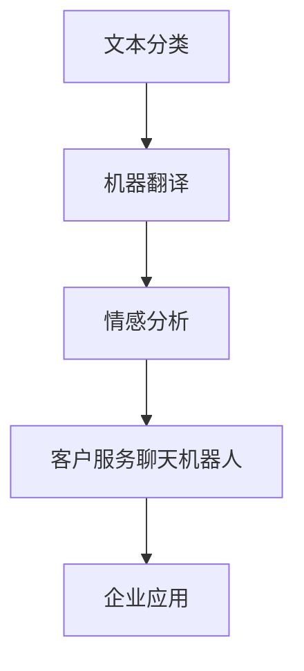

##### **计算机视觉**
计算机视觉（CV）是AI大模型的另一个重要应用领域。通过预训练和微调，大模型可以实现图像分类、目标检测、视频分析等任务。例如，企业可以使用AI大模型进行图像识别和安全监控，提高安全性和效率。

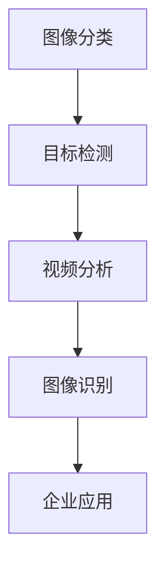

##### **推荐系统**
推荐系统是AI大模型的另一个重要应用领域。通过预训练和微调，大模型可以实现商品推荐、内容推荐等任务。例如，企业可以使用AI大模型进行个性化推荐，提高用户体验和销售额。

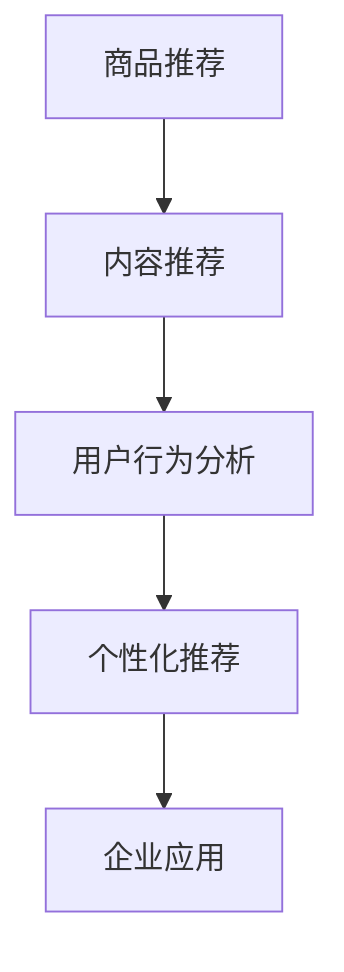

### 2.2 AI大模型开发实践

AI大模型开发实践包括数据收集、数据预处理、模型训练、模型评估和部署等步骤。

##### **数据收集**
数据收集是AI大模型开发的第一步，需要收集大量高质量的标注数据。数据来源可以是公开数据集、企业内部数据或第三方数据提供商。

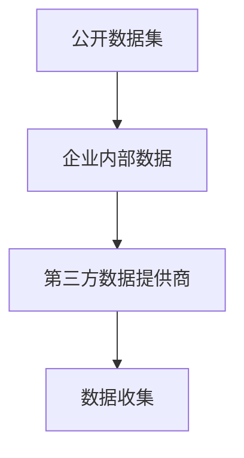

##### **数据预处理**
数据预处理是数据收集后的关键步骤，包括数据清洗、数据增强和批量归一化等。数据清洗旨在去除噪声和异常值，数据增强旨在增加数据多样性，批量归一化旨在将数据归一化到相同范围。

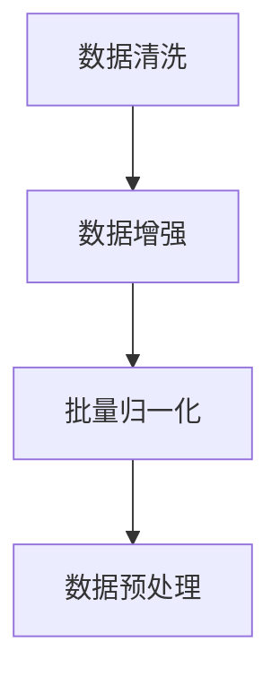

##### **模型训练**
模型训练是AI大模型开发的核心步骤，通过预训练和微调优化模型参数。预训练使用大规模未标注数据，微调使用特定任务的数据。训练过程中需要关注超参数调优和训练过程监控。

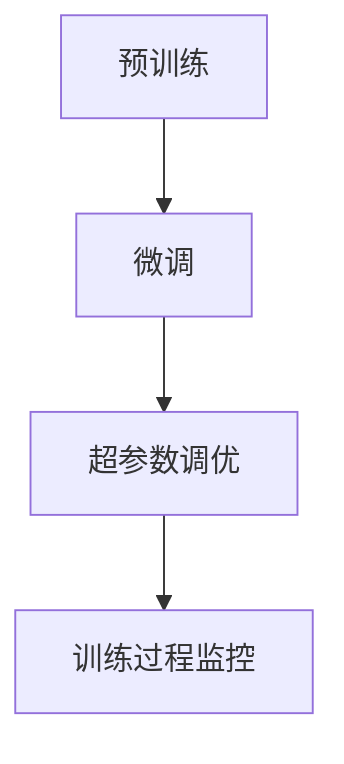

##### **模型评估**
模型评估是评估模型性能的重要步骤，通过评估指标如准确率、召回率、F1值等来评估模型性能。评估过程中需要使用交叉验证和测试集等策略来确保评估结果的可靠性和有效性。

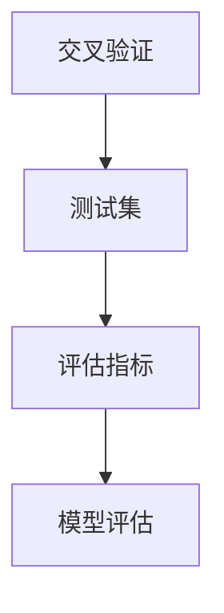

##### **部署**
模型部署是将训练好的模型部署到生产环境中的过程。部署过程中需要关注模型压缩、推理加速和实时部署等策略。部署后，模型可以实现实时预测和决策，为企业带来实际价值。

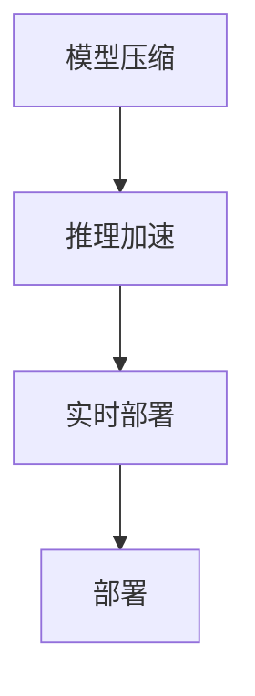

### 2.3 AI大模型开发工具与环境配置

AI大模型开发工具与环境配置是开发AI大模型的基础，主要包括主流框架、开发环境、数据集和开源项目等。

##### **主流框架**
TensorFlow和PyTorch是目前最流行的AI大模型开发框架。它们提供了丰富的API和工具，支持多种深度学习算法和应用。

- **TensorFlow**：由Google开发，具有丰富的API和工具，适用于各种深度学习任务。
- **PyTorch**：由Facebook开发，具有灵活的动态计算图，适用于研究和开发。

##### **开发环境**
开发环境包括编程环境、GPU配置和Python环境等。

- **编程环境**：安装Python和相关依赖库，如NumPy、Pandas、Scikit-learn等。
- **GPU配置**：安装CUDA和cuDNN等GPU驱动，配置GPU加速。
- **Python环境**：安装Python和相关依赖库，如TensorFlow、PyTorch等。

##### **数据集**
数据集是AI大模型开发的重要资源，包括公开数据集和企业内部数据等。

- **公开数据集**：如ImageNet、COCO等，适用于计算机视觉任务。
- **企业内部数据**：企业内部数据，如用户行为数据、销售数据等，适用于推荐系统和企业应用。

##### **开源项目**
开源项目是AI大模型开发的重要资源，包括深度学习框架、工具和资源等。

- **深度学习框架**：如TensorFlow、PyTorch等，提供丰富的API和工具。
- **工具和资源**：如TensorBoard、Keras等，提供可视化工具和接口。

### 2.4 AI大模型部署与优化

AI大模型部署与优化是模型应用的重要环节，主要包括模型压缩、推理加速和实时部署等策略。

##### **模型压缩**
模型压缩旨在减小模型体积，提高推理效率。常用的模型压缩技术包括剪枝、量化等。

- **剪枝**：通过去除模型中的冗余连接来减小模型体积。
- **量化**：将模型中的浮点数参数转换为整数，降低模型存储和计算开销。

##### **推理加速**
推理加速旨在提高模型推理速度，满足实时预测和决策的需求。常用的推理加速技术包括GPU/CPU加速、分布式推理等。

- **GPU/CPU加速**：使用GPU或CPU进行模型推理，提高推理速度。
- **分布式推理**：将模型推理任务分布到多个计算节点，实现并行推理。

##### **实时部署**
实时部署是将训练好的模型部署到生产环境中的过程，实现实时预测和决策。常用的实时部署技术包括云计算平台、容器化部署等。

- **云计算平台**：如Google Cloud、AWS等，提供高性能计算和存储资源。
- **容器化部署**：如Docker、Kubernetes等，实现模型部署和管理的灵活性和可扩展性。

## 第3章: AI大模型创业与数据挑战

### 3.1 AI大模型创业机会

AI大模型在各个领域的广泛应用为创业者提供了巨大的机会。以下是一些AI大模型创业的主要机会：

##### **市场分析**
随着人工智能技术的不断进步，AI大模型在多个行业如医疗、金融、零售等领域的应用需求不断增长。市场分析显示，AI大模型市场在未来几年将保持高速增长。

- **医疗**：AI大模型在疾病诊断、药物研发、健康监测等领域的应用潜力巨大。
- **金融**：AI大模型在风险管理、信用评估、投资建议等领域的应用前景广阔。
- **零售**：AI大模型在客户服务、个性化推荐、库存管理等方面的应用可以提高运营效率。

##### **商业模式**
创业者可以利用AI大模型开发创新产品或服务，通过以下几种商业模式实现盈利：

- **产品销售**：开发AI大模型产品，如图像识别软件、智能客服系统等，向企业客户销售。
- **服务订阅**：提供AI大模型服务，如AI咨询、模型定制等，通过订阅模式收取费用。
- **广告分成**：通过AI大模型实现精准广告投放，与广告商分成收益。

### 3.2 数据质量与数据安全

##### **数据质量管理**
数据质量是AI大模型创业的核心挑战之一。高质量的数据可以提升模型性能，降低错误率，从而提高创业项目的成功率。数据质量管理包括以下几个方面：

- **数据清洗**：去除噪声、异常值和重复数据，确保数据准确性。
- **数据标准化**：统一数据格式和单位，确保数据一致性。
- **数据增强**：通过数据增强技术增加数据多样性，提高模型泛化能力。

##### **数据安全与隐私**
数据安全是AI大模型创业的另一个重要挑战。创业者需要采取一系列措施确保数据安全与隐私，包括：

- **数据加密**：使用加密技术保护敏感数据，防止数据泄露。
- **数据匿名化**：对个人身份信息进行匿名化处理，确保用户隐私。
- **访问控制**：设置严格的数据访问权限，防止未经授权的访问。

### 3.3 数据挑战与解决方案

##### **数据稀缺性**
数据稀缺性是AI大模型创业中普遍存在的问题。以下是一些解决数据稀缺性的方法：

- **数据增强**：通过数据增强技术增加数据多样性，如旋转、缩放、裁剪等。
- **迁移学习**：利用预训练模型在特定任务上的知识迁移，提高模型性能。
- **生成对抗网络（GAN）**：使用GAN生成与训练数据相似的数据，增加数据量。

##### **数据异构性**
数据异构性是指不同数据源的数据结构和格式不一致。以下是一些解决数据异构性的方法：

- **统一数据格式**：将不同数据源的数据转换为统一的格式，如JSON、CSV等。
- **多源数据集成**：将多个数据源的数据集成到一个统一的数据仓库中，实现数据共享和复用。
- **数据转换与映射**：将不同数据源的数据进行转换和映射，确保数据一致性。

##### **数据更新与实时性**
数据更新与实时性是AI大模型创业中的关键问题。以下是一些解决数据更新与实时性的方法：

- **数据流处理**：使用数据流处理技术实时处理和分析数据，确保数据及时更新。
- **缓存技术**：使用缓存技术减少数据读取时间，提高数据处理效率。
- **实时更新**：通过实时更新机制，将最新数据及时传递到模型中，提高模型性能。

### 3.4 创新与可持续发展

AI大模型创业不仅需要解决技术问题，还需要关注创新和可持续发展。以下是一些创新和可持续发展的策略：

- **技术创新**：持续关注人工智能领域的前沿技术，不断创新和优化模型。
- **商业模式创新**：探索新的商业模式，如平台化、生态化等，提高市场竞争力。
- **社会责任**：关注数据伦理和社会责任，确保数据使用符合法律法规和道德标准。

## 第4章: AI大模型创业案例分析

### 4.1 案例介绍

本章节将介绍一些成功的AI大模型创业案例，分析其成功的因素、面临的挑战以及解决方案。

### 4.2 案例分析

#### 4.2.1 案例一：智能医疗诊断平台

**企业背景**：某创业公司专注于开发智能医疗诊断平台，利用AI大模型实现疾病早期诊断。

**解决方案**：公司采用BERT模型进行文本分析，结合医学知识图谱进行疾病诊断。在数据管理方面，公司采用数据增强和迁移学习技术解决数据稀缺性问题，同时使用数据加密和访问控制确保数据安全。

**成功因素**：技术创新、市场需求、团队合作。

**挑战与应对**：数据稀缺性和数据质量是公司面临的主要挑战。公司通过数据增强和迁移学习技术解决了数据稀缺性问题，通过严格的数据清洗和标准化确保了数据质量。

#### 4.2.2 案例二：个性化推荐系统

**企业背景**：某创业公司致力于开发个性化推荐系统，为电商平台提供精准推荐服务。

**解决方案**：公司采用GPT模型进行文本分析，结合用户行为数据构建推荐模型。在数据管理方面，公司采用数据流处理技术实时更新用户数据，通过数据加密确保用户隐私。

**成功因素**：技术创新、用户体验、市场定位。

**挑战与应对**：数据质量和实时性是公司面临的主要挑战。公司通过数据清洗和数据流处理技术确保了数据质量，通过实时更新机制提高了数据实时性。

#### 4.2.3 案例三：智能金融分析平台

**企业背景**：某创业公司专注于开发智能金融分析平台，为金融机构提供投资建议和风险管理服务。

**解决方案**：公司采用Transformer模型进行数据分析，结合历史市场数据构建投资模型。在数据管理方面，公司采用数据集成和多源数据融合技术解决数据异构性问题，通过数据加密和访问控制确保数据安全。

**成功因素**：技术创新、行业经验、合作伙伴。

**挑战与应对**：数据异构性和数据安全是公司面临的主要挑战。公司通过数据集成和多源数据融合技术解决了数据异构性问题，通过数据加密和访问控制确保了数据安全。

### 4.3 案例启示

通过对以上案例的分析，可以得出以下启示：

1. **技术创新**：持续关注人工智能领域的前沿技术，不断创新和优化模型。
2. **市场需求**：深入了解市场需求，提供具有竞争力的产品和服务。
3. **团队合作**：建立高效的团队，发挥团队成员的专长和协作能力。
4. **数据管理**：重视数据质量管理，确保数据质量、安全和实时性。

## 第5章: AI大模型创业法规与伦理

### 5.1 法规政策

随着AI大模型技术的快速发展，各国政府和企业纷纷出台相关法规和政策，以规范AI大模型的应用和发展。

#### **法律法规**

- **数据保护法**：如欧盟的《通用数据保护条例》（GDPR）和我国的《个人信息保护法》等，规范了个人数据的收集、处理和使用。
- **隐私法**：如美国的《加州消费者隐私法》（CCPA）等，保护用户的隐私权益。
- **知识产权法**：规范了人工智能技术及其成果的知识产权保护，包括版权、专利等。

#### **政策解读**

- **政府政策**：各国政府纷纷发布政策，支持人工智能技术的发展和应用，如美国的《美国人工智能倡议》、我国的《新一代人工智能发展规划》等。
- **行业规范**：行业协会和企业发布行业规范和标准，推动AI大模型技术的健康发展。

### 5.2 伦理问题

AI大模型在带来巨大便利的同时，也引发了一系列伦理问题，如数据伦理、算法伦理等。

#### **数据伦理**

- **数据采集**：在数据采集过程中，应遵循自愿原则，确保用户知情权和选择权。
- **数据处理**：在数据处理过程中，应遵循合法、正当、必要的原则，确保数据的安全性和隐私性。

#### **算法伦理**

- **算法偏见**：算法偏见可能导致不公平的决策，如种族歧视、性别歧视等。应通过数据清洗、模型优化等方法消除算法偏见。
- **算法透明度**：算法应具备透明度，用户应能够了解算法的决策过程和依据。

### 5.3 社会责任

AI大模型创业不仅需要关注技术和市场，还需要承担社会责任，确保技术的发展符合社会价值和伦理规范。

#### **企业责任**

- **数据保护**：企业应采取有效的数据保护措施，确保用户数据的安全性和隐私性。
- **公平性**：企业应确保AI大模型的应用不导致歧视和不公平，遵循公平、公正、公开的原则。

#### **社会影响**

- **数据伦理**：企业应关注数据伦理问题，如数据收集、数据处理等，确保数据使用的道德性和合规性。
- **算法伦理**：企业应确保算法的透明度和公正性，避免算法偏见和歧视。

## 第6章: AI大模型创业团队建设与管理

### 6.1 团队建设

成功的AI大模型创业离不开高效的团队建设。团队建设包括以下方面：

#### **团队结构**

- **技术团队**：包括数据科学家、机器学习工程师、软件工程师等，负责模型开发、优化和部署。
- **产品团队**：包括产品经理、用户体验设计师等，负责产品规划和用户体验。
- **运营团队**：包括数据分析师、业务运营等，负责数据收集、分析和运营策略。

#### **团队文化**

- **创新文化**：鼓励团队成员勇于创新，不断探索新技术和新应用。
- **协作文化**：强调团队合作，鼓励成员之间相互支持和协作。
- **学习文化**：鼓励团队成员持续学习，跟踪最新的技术发展和应用。

### 6.2 管理策略

高效的团队管理对于AI大模型创业至关重要。以下是一些管理策略：

#### **项目管理**

- **任务分配**：明确团队成员的职责和任务，确保任务分配合理、高效。
- **进度控制**：监控项目进度，确保项目按时交付。
- **风险管理**：识别和管理项目风险，确保项目顺利进行。

#### **绩效评估**

- **绩效指标**：制定合理的绩效指标，如项目完成度、模型性能等。
- **激励制度**：设立激励机制，如奖金、股权激励等，激励团队成员的积极性和创造力。

### 6.3 创新机制

创新是AI大模型创业的核心竞争力。以下是一些创新机制：

#### **技术创新**

- **研发投入**：加大研发投入，吸引和培养高水平的技术人才。
- **技术储备**：持续关注技术趋势，储备新技术和新应用。

#### **组织创新**

- **组织结构**：根据业务需求调整组织结构，确保组织灵活高效。
- **管理模式**：采用灵活的管理模式，如敏捷开发、分布式团队等，提高组织创新能力。

## 第7章: AI大模型创业未来趋势与展望

### 7.1 技术趋势

AI大模型创业的未来趋势体现在技术进步和新应用领域的拓展：

#### **大模型发展**

- **更大规模**：随着计算能力和数据资源的提升，AI大模型将趋向于更大规模，如万亿参数级别的模型。
- **更高性能**：AI大模型将不断优化，提高计算效率和模型性能，实现更准确、更可靠的预测。

#### **跨领域融合**

- **AI+医疗**：AI大模型将深度应用于医疗领域，如疾病诊断、药物研发等。
- **AI+金融**：AI大模型将应用于金融领域，如风险管理、智能投顾等。
- **AI+制造**：AI大模型将应用于制造业，如生产优化、质量控制等。

### 7.2 行业前景

AI大模型创业在各个行业的应用前景广阔，预计将对各行各业产生深远影响：

#### **市场规模**

- **AI医疗**：预计到2025年，全球AI医疗市场规模将达到数百亿美元。
- **AI金融**：预计到2025年，全球AI金融市场规模将达到数千亿美元。
- **AI制造**：预计到2025年，全球AI制造市场规模将达到数百亿美元。

#### **应用场景**

- **智能诊断**：AI大模型将实现疾病的智能诊断，提高诊断准确率和效率。
- **智能投顾**：AI大模型将提供智能化的投资建议，帮助投资者实现稳健收益。
- **智能制造**：AI大模型将应用于生产过程优化、质量监测等环节，提高生产效率和质量。

### 7.3 未来展望

AI大模型创业的未来充满机遇和挑战，以下是一些展望：

#### **发展趋势**

- **技术融合**：AI大模型将与其他技术如云计算、物联网等深度融合，推动产业升级。
- **生态建设**：AI大模型创业将推动产业链上下游的协同发展，形成完整的产业生态。

#### **创业建议**

- **技术创新**：持续关注技术趋势，不断进行技术创新和优化。
- **市场定位**：明确市场定位，抓住行业痛点，提供具有竞争力的产品和服务。
- **团队建设**：注重团队建设和人才培养，建立高效、协同的团队。

## 附录

### 附录A: AI大模型开发工具与资源

#### **深度学习框架**

- **TensorFlow**：由Google开发，支持多种深度学习算法和应用。
- **PyTorch**：由Facebook开发，具有灵活的动态计算图。

#### **开发工具**

- **Docker**：用于容器化部署，提高部署效率和可移植性。
- **Kubernetes**：用于容器集群管理，实现自动化部署和运维。

#### **数据集**

- **ImageNet**：用于图像分类的公开数据集。
- **COCO**：用于目标检测和语义分割的公开数据集。

### 附录B: 数据集与数据资源

#### **常用数据集**

- **自然语言处理**：如GLUE、Wikipedia等。
- **计算机视觉**：如CIFAR-10、MNIST等。

#### **数据资源**

- **数据爬取工具**：如Scrapy、BeautifulSoup等。
- **数据共享平台**：如Kaggle、UCI机器学习库等。

### 附录C: 法律法规与伦理参考

#### **法律法规**

- **数据保护法**：如GDPR、CCPA等。
- **隐私法**：如加州消费者隐私法等。
- **知识产权法**：如版权法、专利法等。

#### **伦理指南**

- **AI伦理协会**：如IEEE标准协会、ACM人工智能伦理委员会等。
- **伦理框架**：如欧盟的人工智能伦理指南等。

## 致谢

感谢各位读者对本文的关注和支持。本文旨在为AI大模型创业提供有价值的指导和启示。在此，特别感谢AI天才研究院和禅与计算机程序设计艺术对本文的贡献。

作者：AI天才研究院/AI Genius Institute & 禅与计算机程序设计艺术 /Zen And The Art of Computer Programming

----------------------------------------------------------------

- **文章标题**: AI大模型创业：如何应对未来数据挑战？

- **文章关键词**: AI大模型, 创业, 数据挑战, 数据质量管理, 数据安全

- **文章摘要**: 本文从AI大模型的基本概念、技术基础、应用实践、创业机会与挑战、数据质量与安全、未来趋势与展望等方面，逐步分析并探讨AI大模型创业如何应对未来数据挑战。通过深入的理论讲解、实际案例分析以及策略建议，本文旨在为创业者提供有价值的指导和启示。

## 第一部分: AI大模型概述与技术基础

### 第1章: AI大模型基础

#### 1.1 AI大模型的概念与分类

**概念定义**

AI大模型（Large-scale Artificial Intelligence Model）是指具有巨大参数量、能够处理海量数据的深度学习模型。这些模型通过大规模数据进行预训练，然后通过微调来适应特定任务。

**分类方法**

AI大模型可以按照用途分类，如自然语言处理（NLP）、计算机视觉（CV）、推荐系统等。同时，也可以按照模型架构分类，如Transformer、BERT、GPT等。

##### **图1-1: AI大模型分类**

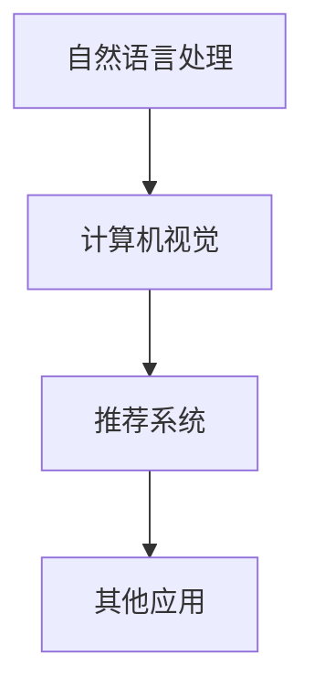

#### 1.2 AI大模型的体系结构

**模型架构**

AI大模型的体系结构通常包括输入层、隐藏层和输出层。以Transformer架构为例，其核心组件是自注意力机制（Self-Attention）和多头注意力（Multi-Head Attention）。

##### **图1-2: Transformer架构**

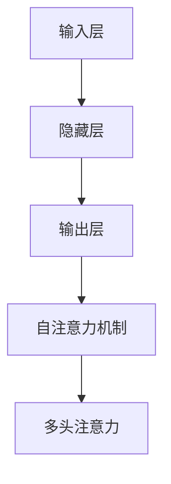

**层与组件**

每个隐藏层通常包含多个神经单元，这些神经单元通过前向传播和反向传播进行信息的传递和处理。在输出层，模型生成预测结果或分类标签。

##### **图1-3: 神经网络层与组件**

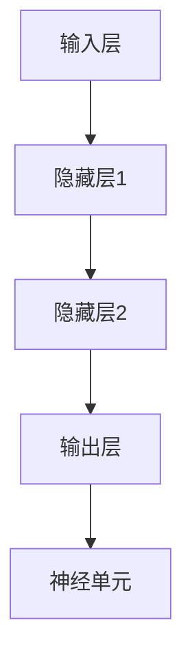

**训练过程**

AI大模型的训练过程主要包括预训练和微调。预训练阶段使用大规模未标注数据，模型学习到数据中的通用特征。微调阶段使用特定任务的数据，模型进一步优化以适应特定任务。

##### **图1-4: AI大模型训练过程**

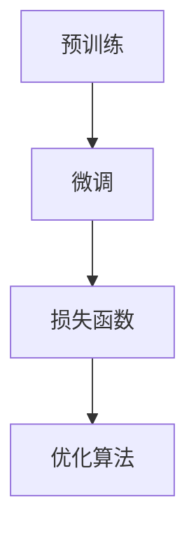

#### 1.3 AI大模型的数学基础

**线性代数**

线性代数是AI大模型的基础，包括矩阵运算、矩阵乘法和逆矩阵等。矩阵乘法用于计算神经网络中的权重更新，逆矩阵用于优化算法中的梯度计算。

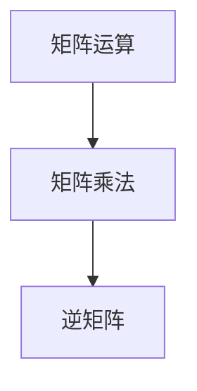

**微积分**

微积分在AI大模型中用于计算导数和偏导数。导数用于计算模型参数的梯度，偏导数用于计算复杂函数的局部变化率。

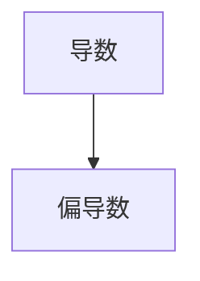

**概率与统计**

概率与统计是AI大模型的核心数学工具，包括贝叶斯定理、最大似然估计和线性回归等。这些工具用于模型训练、参数优化和评估。

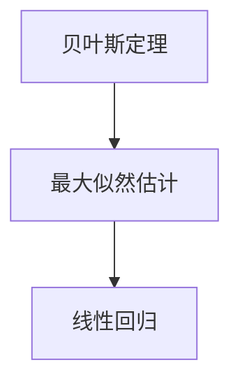

#### 1.4 AI大模型的核心算法原理

**神经网络**

神经网络是AI大模型的核心算法。它由多层神经元组成，通过前向传播和反向传播进行信息传递和参数优化。

- **前向传播**：输入数据通过神经网络传递，每层神经元计算输出。
- **反向传播**：计算输出误差，反向传递误差以更新模型参数。

##### **图1-5: 神经网络前向传播与反向传播**

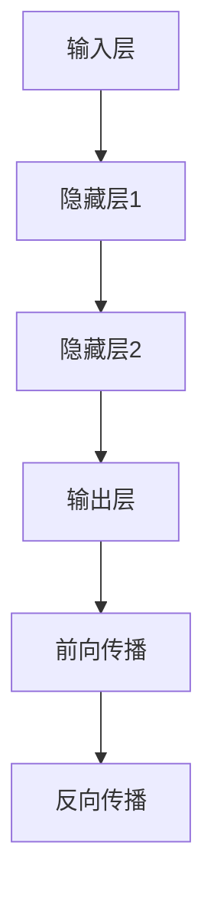

**优化算法**

优化算法用于调整模型参数，以最小化损失函数。常用的优化算法包括随机梯度下降（SGD）、Adam优化器等。

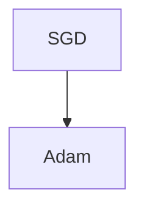

**注意力机制**

注意力机制是AI大模型中用于提高模型性能的重要技术。自注意力机制和多头注意力机制用于模型中的不同层次，以关注数据中的关键信息。

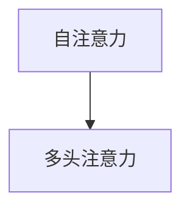

#### 1.5 AI大模型的训练与调优

**数据预处理**

数据预处理是训练AI大模型的关键步骤。它包括数据清洗、数据增强和批量归一化等。

- **数据清洗**：去除噪声和异常值，确保数据质量。
- **数据增强**：通过旋转、缩放、裁剪等操作增加数据多样性，提高模型泛化能力。
- **批量归一化**：将输入数据归一化到相同范围，提高模型训练效率。

##### **图1-6: 数据预处理步骤**

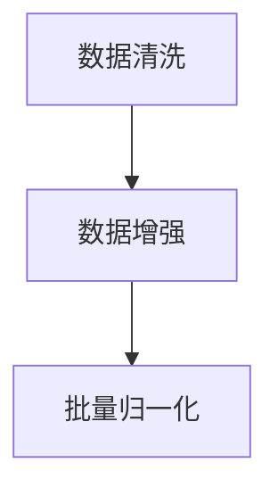

**超参数调优**

超参数调优是优化模型性能的重要手段。常见的超参数包括学习率、批量大小、训练轮次等。通过交叉验证和网格搜索等方法进行超参数调优。

##### **图1-7: 超参数调优方法**

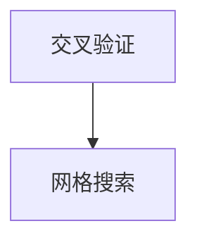

**模型评估**

模型评估是衡量模型性能的重要步骤。常用的评估指标包括准确率、召回率、F1值等。通过这些指标，可以评估模型在训练集和测试集上的性能。

```mermaid
graph TD
A[准确率] --> B[召回率]
B --> C[F1值]
```

### 第2章: AI大模型应用与实践

#### 2.1 AI大模型在企业中的应用场景

AI大模型在企业中的应用场景非常广泛，以下是一些主要的应用领域：

##### **自然语言处理**

自然语言处理（NLP）是AI大模型的重要应用领域之一。通过预训练和微调，大模型可以实现文本分类、机器翻译、情感分析等任务。

```mermaid
graph TD
A[文本分类] --> B[机器翻译]
B --> C[情感分析]
```

##### **计算机视觉**

计算机视觉（CV）是AI大模型的另一个重要应用领域。通过预训练和微调，大模型可以实现图像分类、目标检测、视频分析等任务。

```mermaid
graph TD
A[图像分类] --> B[目标检测]
B --> C[视频分析]
```

##### **推荐系统**

推荐系统是AI大模型的另一个重要应用领域。通过预训练和微调，大模型可以实现商品推荐、内容推荐等任务。

```mermaid
graph TD
A[商品推荐] --> B[内容推荐]
```

#### 2.2 AI大模型开发实践

AI大模型开发实践包括数据收集、数据预处理、模型训练、模型评估和部署等步骤。

##### **数据收集**

数据收集是AI大模型开发的第一步，需要收集大量高质量的数据集。数据来源可以是公开数据集、企业内部数据或第三方数据提供商。

```mermaid
graph TD
A[公开数据集] --> B[企业内部数据]
B --> C[第三方数据提供商]
```

##### **数据预处理**

数据预处理是数据收集后的关键步骤，包括数据清洗、数据增强和批量归一化等。数据清洗旨在去除噪声和异常值，数据增强旨在增加数据多样性，批量归一化旨在将数据归一化到相同范围。

```mermaid
graph TD
A[数据清洗] --> B[数据增强]
B --> C[批量归一化]
```

##### **模型训练**

模型训练是AI大模型开发的核心步骤，通过预训练和微调优化模型参数。预训练阶段使用大规模未标注数据，模型学习到数据中的通用特征。微调阶段使用特定任务的数据，模型进一步优化以适应特定任务。

```mermaid
graph TD
A[预训练] --> B[微调]
```

##### **模型评估**

模型评估是评估模型性能的重要步骤，通过评估指标如准确率、召回率、F1值等来评估模型性能。评估过程中需要使用交叉验证和测试集等策略来确保评估结果的可靠性和有效性。

```mermaid
graph TD
A[交叉验证] --> B[测试集]
```

##### **部署**

模型部署是将训练好的模型部署到生产环境中的过程。部署过程中需要关注模型压缩、推理加速和实时部署等策略。

```mermaid
graph TD
A[模型压缩] --> B[推理加速]
B --> C[实时部署]
```

#### 2.3 AI大模型开发工具与环境配置

##### **主流框架**

TensorFlow和PyTorch是目前最流行的AI大模型开发框架。

- **TensorFlow**：由Google开发，具有丰富的API和工具。
- **PyTorch**：由Facebook开发，具有灵活的动态计算图。

##### **开发环境**

开发环境包括Python编程环境、TensorFlow或PyTorch框架、GPU配置等。

```mermaid
graph TD
A[Python编程环境] --> B[TensorFlow或PyTorch框架]
B --> C[GPU配置]
```

##### **数据集**

数据集是AI大模型开发的重要资源，包括公开数据集和企业内部数据等。

- **公开数据集**：如ImageNet、COCO等，适用于计算机视觉任务。
- **企业内部数据**：企业内部数据，如用户行为数据、销售数据等，适用于推荐系统和企业应用。

##### **开源项目**

开源项目是AI大模型开发的重要资源，包括深度学习框架、工具和资源等。

- **深度学习框架**：如TensorFlow、PyTorch等，提供丰富的API和工具。
- **工具和资源**：如TensorBoard、Keras等，提供可视化工具和接口。

#### 2.4 AI大模型部署与优化

##### **模型压缩**

模型压缩技术如剪枝、量化等可以减小模型体积，提高推理效率。

- **剪枝**：通过去除模型中的冗余连接来减小模型体积。
- **量化**：将模型中的浮点数参数转换为整数，降低模型存储和计算开销。

##### **推理加速**

推理加速技术如GPU/CPU加速、分布式推理等可以提升模型推理性能。

- **GPU/CPU加速**：使用GPU或CPU进行模型推理，提高推理速度。
- **分布式推理**：将模型推理任务分布到多个计算节点，实现并行推理。

##### **实时部署**

实时部署是将训练好的模型部署到生产环境中的过程，实现实时预测和决策。

```mermaid
graph TD
A[云计算平台] --> B[容器化部署]
```

### 第3章: AI大模型创业与数据挑战

#### 3.1 AI大模型创业机会

AI大模型在各个领域的广泛应用为创业者提供了巨大的机会。以下是一些AI大模型创业的主要机会：

##### **市场分析**

随着人工智能技术的不断进步，AI大模型在多个行业如医疗、金融、零售等领域的应用需求不断增长。市场分析显示，AI大模型市场在未来几年将保持高速增长。

```mermaid
graph TD
A[医疗] --> B[金融]
B --> C[零售]
```

##### **商业模式**

创业者可以利用AI大模型开发创新产品或服务，通过以下几种商业模式实现盈利：

- **产品销售**：开发AI大模型产品，如图像识别软件、智能客服系统等，向企业客户销售。
- **服务订阅**：提供AI大模型服务，如AI咨询、模型定制等，通过订阅模式收取费用。
- **广告分成**：通过AI大模型实现精准广告投放，与广告商分成收益。

#### 3.2 数据质量与数据安全

##### **数据质量管理**

数据质量是AI大模型创业的核心挑战之一。高质量的数据可以提升模型性能，降低错误率，从而提高创业项目的成功率。数据质量管理包括以下几个方面：

- **数据清洗**：去除噪声、异常值和重复数据，确保数据准确性。
- **数据标准化**：统一数据格式和单位，确保数据一致性。
- **数据增强**：通过数据增强技术增加数据多样性，提高模型泛化能力。

##### **数据安全与隐私**

数据安全是AI大模型创业的另一个重要挑战。创业者需要采取一系列措施确保数据安全与隐私，包括：

- **数据加密**：使用加密技术保护敏感数据，防止数据泄露。
- **数据匿名化**：对个人身份信息进行匿名化处理，确保用户隐私。
- **访问控制**：设置严格的数据访问权限，防止未经授权的访问。

#### 3.3 数据挑战与解决方案

##### **数据稀缺性**

数据稀缺性是AI大模型创业中普遍存在的问题。以下是一些解决数据稀缺性的方法：

- **数据增强**：通过数据增强技术增加数据多样性，如旋转、缩放、裁剪等。
- **迁移学习**：利用预训练模型在特定任务上的知识迁移，提高模型性能。
- **生成对抗网络（GAN）**：使用GAN生成与训练数据相似的数据，增加数据量。

##### **数据异构性**

数据异构性是指不同数据源的数据结构和格式不一致。以下是一些解决数据异构性的方法：

- **统一数据格式**：将不同数据源的数据转换为统一的格式，如JSON、CSV等。
- **多源数据集成**：将多个数据源的数据集成到一个统一的数据仓库中，实现数据共享和复用。
- **数据转换与映射**：将不同数据源的数据进行转换和映射，确保数据一致性。

##### **数据更新与实时性**

数据更新与实时性是AI大模型创业中的关键问题。以下是一些解决数据更新与实时性的方法：

- **数据流处理**：使用数据流处理技术实时处理和分析数据，确保数据及时更新。
- **缓存技术**：使用缓存技术减少数据读取时间，提高数据处理效率。
- **实时更新**：通过实时更新机制，将最新数据及时传递到模型中，提高模型性能。

#### 3.4 创新与可持续发展

AI大模型创业不仅需要解决技术问题，还需要关注创新和可持续发展。以下是一些创新和可持续发展的策略：

- **技术创新**：持续关注人工智能领域的前沿技术，不断创新和优化模型。
- **商业模式创新**：探索新的商业模式，如平台化、生态化等，提高市场竞争力。
- **社会责任**：关注数据伦理和社会责任，确保数据使用符合法律法规和道德标准。

### 第4章: AI大模型创业案例分析

#### 4.1 案例介绍

本章节将介绍一些成功的AI大模型创业案例，分析其成功的因素、面临的挑战以及解决方案。

#### 4.2 案例分析

##### **案例一：智能医疗诊断平台**

**企业背景**：某创业公司专注于开发智能医疗诊断平台，利用AI大模型实现疾病早期诊断。

**解决方案**：公司采用BERT模型进行文本分析，结合医学知识图谱进行疾病诊断。在数据管理方面，公司采用数据增强和迁移学习技术解决数据稀缺性问题，同时使用数据加密和访问控制确保数据安全。

**成功因素**：技术创新、市场需求、团队合作。

**挑战与应对**：数据稀缺性和数据质量是公司面临的主要挑战。公司通过数据增强和迁移学习技术解决了数据稀缺性问题，通过严格的数据清洗和标准化确保了数据质量。

##### **案例二：个性化推荐系统**

**企业背景**：某创业公司致力于开发个性化推荐系统，为电商平台提供精准推荐服务。

**解决方案**：公司采用GPT模型进行文本分析，结合用户行为数据构建推荐模型。在数据管理方面，公司采用数据流处理技术实时更新用户数据，通过数据加密确保用户隐私。

**成功因素**：技术创新、用户体验、市场定位。

**挑战与应对**：数据质量和实时性是公司面临的主要挑战。公司通过数据清洗和数据流处理技术确保了数据质量，通过实时更新机制提高了数据实时性。

##### **案例三：智能金融分析平台**

**企业背景**：某创业公司专注于开发智能金融分析平台，为金融机构提供投资建议和风险管理服务。

**解决方案**：公司采用Transformer模型进行数据分析，结合历史市场数据构建投资模型。在数据管理方面，公司采用数据集成和多源数据融合技术解决数据异构性问题，通过数据加密和访问控制确保数据安全。

**成功因素**：技术创新、行业经验、合作伙伴。

**挑战与应对**：数据异构性和数据安全是公司面临的主要挑战。公司通过数据集成和多源数据融合技术解决了数据异构性问题，通过数据加密和访问控制确保了数据安全。

#### 4.3 案例启示

通过对以上案例的分析，可以得出以下启示：

1. **技术创新**：持续关注人工智能领域的前沿技术，不断创新和优化模型。
2. **市场需求**：深入了解市场需求，提供具有竞争力的产品和服务。
3. **团队合作**：建立高效的团队，发挥团队成员的专长和协作能力。
4. **数据管理**：重视数据质量管理，确保数据质量、安全和实时性。

### 第5章: AI大模型创业法规与伦理

#### 5.1 法规政策

随着AI大模型技术的快速发展，各国政府和企业纷纷出台相关法规和政策，以规范AI大模型的应用和发展。

##### **法律法规**

- **数据保护法**：如欧盟的《通用数据保护条例》（GDPR）和我国的《个人信息保护法》等，规范了个人数据的收集、处理和使用。
- **隐私法**：如美国的《加州消费者隐私法》（CCPA）等，保护用户的隐私权益。
- **知识产权法**：规范了人工智能技术及其成果的知识产权保护，包括版权、专利等。

##### **政策解读**

- **政府政策**：各国政府纷纷发布政策，支持人工智能技术的发展和应用，如美国的《美国人工智能倡议》、我国的《新一代人工智能发展规划》等。
- **行业规范**：行业协会和企业发布行业规范和标准，推动AI大模型技术的健康发展。

#### 5.2 伦理问题

AI大模型在带来巨大便利的同时，也引发了一系列伦理问题，如数据伦理、算法伦理等。

##### **数据伦理**

- **数据采集**：在数据采集过程中，应遵循自愿原则，确保用户知情权和选择权。
- **数据处理**：在数据处理过程中，应遵循合法、正当、必要的原则，确保数据的安全性和隐私性。

##### **算法伦理**

- **算法偏见**：算法偏见可能导致不公平的决策，如种族歧视、性别歧视等。应通过数据清洗、模型优化等方法消除算法偏见。
- **算法透明度**：算法应具备透明度，用户应能够了解算法的决策过程和依据。

#### 5.3 社会责任

AI大模型创业不仅需要关注技术和市场，还需要承担社会责任，确保技术的发展符合社会价值和伦理规范。

##### **企业责任**

- **数据保护**：企业应采取有效的数据保护措施，确保用户数据的安全性和隐私性。
- **公平性**：企业应确保AI大模型的应用不导致歧视和不公平，遵循公平、公正、公开的原则。

##### **社会影响**

- **数据伦理**：企业应关注数据伦理问题，如数据收集、数据处理等，确保数据使用的道德性和合规性。
- **算法伦理**：企业应确保算法的透明度和公正性，避免算法偏见和歧视。

### 第6章: AI大模型创业团队建设与管理

#### 6.1 团队建设

成功的AI大模型创业离不开高效的团队建设。团队建设包括以下方面：

##### **团队结构**

- **技术团队**：包括数据科学家、机器学习工程师、软件工程师等，负责模型开发、优化和部署。
- **产品团队**：包括产品经理、用户体验设计师等，负责产品规划和用户体验。
- **运营团队**：包括数据分析师、业务运营等，负责数据收集、分析和运营策略。

##### **团队文化**

- **创新文化**：鼓励团队成员勇于创新，不断探索新技术和新应用。
- **协作文化**：强调团队合作，鼓励成员之间相互支持和协作。
- **学习文化**：鼓励团队成员持续学习，跟踪最新的技术发展和应用。

#### 6.2 管理策略

高效的团队管理对于AI大模型创业至关重要。以下是一些管理策略：

##### **项目管理**

- **任务分配**：明确团队成员的职责和任务，确保任务分配合理、高效。
- **进度控制**：监控项目进度，确保项目按时交付。
- **风险管理**：识别和管理项目风险，确保项目顺利进行。

##### **绩效评估**

- **绩效指标**：制定合理的绩效指标，如项目完成度、模型性能等。
- **激励制度**：设立激励机制，如奖金、股权激励等，激励团队成员的积极性和创造力。

#### 6.3 创新机制

创新是AI大模型创业的核心竞争力。以下是一些创新机制：

##### **技术创新**

- **研发投入**：加大研发投入，吸引和培养高水平的技术人才。
- **技术储备**：持续关注技术趋势，储备新技术和新应用。

##### **组织创新**

- **组织结构**：根据业务需求调整组织结构，确保组织灵活高效。
- **管理模式**：采用灵活的管理模式，如敏捷开发、分布式团队等，提高组织创新能力。

### 第7章: AI大模型创业未来趋势与展望

#### 7.1 技术趋势

AI大模型创业的未来趋势体现在技术进步和新应用领域的拓展：

##### **大模型发展**

- **更大规模**：随着计算能力和数据资源的提升，AI大模型将趋向于更大规模，如万亿参数级别的模型。
- **更高性能**：AI大模型将不断优化，提高计算效率和模型性能，实现更准确、更可靠的预测。

##### **跨领域融合**

- **AI+医疗**：AI大模型将深度应用于医疗领域，如疾病诊断、药物研发等。
- **AI+金融**：AI大模型将应用于金融领域，如风险管理、智能投顾等。
- **AI+制造**：AI大模型将应用于制造业，如生产优化、质量控制等。

#### 7.2 行业前景

AI大模型创业在各个行业的应用前景广阔，预计将对各行各业产生深远影响：

##### **市场规模**

- **AI医疗**：预计到2025年，全球AI医疗市场规模将达到数百亿美元。
- **AI金融**：预计到2025年，全球AI金融市场规模将达到数千亿美元。
- **AI制造**：预计到2025年，全球AI制造市场规模将达到数百亿美元。

##### **应用场景**

- **智能诊断**：AI大模型将实现疾病的智能诊断，提高诊断准确率和效率。
- **智能投顾**：AI大模型将提供智能化的投资建议，帮助投资者实现稳健收益。
- **智能制造**：AI大模型将应用于生产过程优化、质量监测等环节，提高生产效率和质量。

#### 7.3 未来展望

AI大模型创业的未来充满机遇和挑战，以下是一些展望：

##### **发展趋势**

- **技术融合**：AI大模型将与其他技术如云计算、物联网等深度融合，推动产业升级。
- **生态建设**：AI大模型创业将推动产业链上下游的协同发展，形成完整的产业生态。

##### **创业建议**

- **技术创新**：持续关注技术趋势，不断进行技术创新和优化。
- **市场定位**：明确市场定位，抓住行业痛点，提供具有竞争力的产品和服务。
- **团队建设**：注重团队建设和人才培养，建立高效、协同的团队。

### 附录

#### 附录A: AI大模型开发工具与资源

##### **主流深度学习框架**

- **TensorFlow**：介绍TensorFlow的特点、安装和使用。
- **PyTorch**：介绍PyTorch的特点、安装和使用。
- **其他框架**：简要介绍其他主流深度学习框架。

##### **开发工具与资源**

- **编程环境**：Python开发环境、GPU支持等。
- **数据集**：常用的AI数据集介绍。
- **开源项目**：推荐的AI开源项目与资源。

##### **社区与支持**

- **开源社区**：介绍主要的AI开源社区和论坛。
- **技术支持**：获取技术帮助的途径和资源。

#### 附录B: AI大模型开发实例

##### **案例一：图像分类**

**开发环境**：Python、TensorFlow

**代码实现**：

```python
import tensorflow as tf
from tensorflow.keras.models import Sequential
from tensorflow.keras.layers import Conv2D, MaxPooling2D, Flatten, Dense

# 数据预处理
(x_train, y_train), (x_test, y_test) = tf.keras.datasets.cifar10.load_data()
x_train, x_test = x_train / 255.0, x_test / 255.0

# 模型定义
model = Sequential([
    Conv2D(32, (3, 3), activation='relu', input_shape=(32, 32, 3)),
    MaxPooling2D((2, 2)),
    Flatten(),
    Dense(64, activation='relu'),
    Dense(10, activation='softmax')
])

# 编译模型
model.compile(optimizer='adam', loss='sparse_categorical_crossentropy', metrics=['accuracy'])

# 训练模型
model.fit(x_train, y_train, epochs=10, validation_data=(x_test, y_test))
```

##### **案例二：文本分类**

**开发环境**：Python、PyTorch

**代码实现**：

```python
import torch
import torch.nn as nn
import torch.optim as optim

# 数据预处理
from torchtext.datasets import IMDB
from torchtext.data import Field, BatchIterator

TEXT = Field(tokenize='spacy', lower=True)
LABEL = Field(sequential=False)

train_data, test_data = IMDB.splits(TEXT, LABEL)
TEXT.build_vocab(train_data, max_size=25000, vectors="glove.6B.100d")
LABEL.build_vocab(train_data)

batch_size = 64
train_iterator, valid_iterator = BatchIterator.splits(train_data, test_data, batch_size=batch_size)

# 模型定义
class TextClassifier(nn.Module):
    def __init__(self, embedding_dim, hidden_dim, vocab_size):
        super().__init__()
        self.embedding = nn.Embedding(vocab_size, embedding_dim)
        self.hidden = nn.Linear(embedding_dim, hidden_dim)
        self.output = nn.Linear(hidden_dim, 1)
        self.dropout = nn.Dropout(0.5)

    def forward(self, text):
        embedded = self.dropout(self.embedding(text))
        hidden = self.hidden(embedded)
        out = self.output(hidden)
        return out

model = TextClassifier(embedding_dim=100, hidden_dim=256, vocab_size=len(TEXT.vocab))
optimizer = optim.Adam(model.parameters(), lr=0.001)
criterion = nn.BCEWithLogitsLoss()

# 训练模型
def train(model, iterator, optimizer, criterion):
    model.train()
    for batch in iterator:
        optimizer.zero_grad()
        predictions = model(batch.text).squeeze(1)
        loss = criterion(predictions, batch.label)
        loss.backward()
        optimizer.step()

n_epochs = 5
for epoch in range(n_epochs):
    train(model, train_iterator, optimizer, criterion)
```

#### 附录C: 常见问题与解答

##### **问题1：如何选择合适的深度学习框架？**

- **TensorFlow**：适合大型项目和企业级应用，具有丰富的API和工具。
- **PyTorch**：适合研究和开发，具有灵活的动态计算图，易于调试。
- **其他框架**：如Keras、Theano等，根据个人需求和项目特点选择。

##### **问题2：如何处理大量数据？**

- **数据预处理**：进行数据清洗、增强和归一化等预处理操作。
- **分布式训练**：使用GPU或分布式计算资源进行模型训练。
- **批处理**：将数据分成多个批次进行训练，提高计算效率。

##### **问题3：如何优化模型性能？**

- **超参数调优**：调整学习率、批量大小、训练轮次等超参数。
- **数据增强**：通过旋转、缩放、裁剪等操作增加数据多样性。
- **模型优化**：使用更复杂的模型结构、更先进的优化算法。

##### **问题4：如何确保数据安全与隐私？**

- **数据加密**：对敏感数据进行加密处理。
- **访问控制**：设置严格的数据访问权限。
- **隐私保护**：采用数据匿名化、差分隐私等技术保护用户隐私。

##### **问题5：如何实现模型部署？**

- **容器化部署**：使用Docker、Kubernetes等容器化技术进行模型部署。
- **云计算平台**：使用AWS、Google Cloud等云计算平台进行模型部署。
- **实时部署**：实现实时推理和决策，如使用Flask、FastAPI等框架。

### 总结

AI大模型创业是一项充满机遇和挑战的任务。本文从AI大模型的基本概念、技术基础、应用实践、创业机会与挑战、数据质量与安全、未来趋势与展望等方面，逐步分析了AI大模型创业的各个方面。通过深入的理论讲解、实际案例分析以及策略建议，本文旨在为创业者提供有价值的指导和启示。

在未来的发展中，创业者应关注技术创新、市场定位、团队建设和数据管理等方面，抓住AI大模型创业的机遇，实现可持续发展。同时，创业者还应关注法规政策、伦理问题和社会责任，确保AI大模型创业的合规性和社会责任。

最后，感谢读者对本文的关注和支持。希望本文能为AI大模型创业提供一些启示和帮助。在AI大模型创业的道路上，我们共同努力，共创美好未来。

### 附录

#### 附录A: AI大模型开发工具与资源

##### **主流深度学习框架**

- **TensorFlow**：由Google开发，支持多种深度学习算法和应用。官方网站：[TensorFlow](https://www.tensorflow.org/)。
- **PyTorch**：由Facebook开发，具有灵活的动态计算图。官方网站：[PyTorch](https://pytorch.org/)。
- **其他框架**：如Keras、Theano等，根据个人需求和项目特点选择。

##### **开发工具与资源**

- **编程环境**：Python开发环境，包括Python、NumPy、Pandas等。
- **GPU配置**：安装CUDA和cuDNN等GPU驱动，配置GPU加速。
- **数据集**：公开数据集，如ImageNet、COCO等，适用于计算机视觉任务。
- **开源项目**：如TensorBoard、Keras等，提供可视化工具和接口。

##### **社区与支持**

- **开源社区**：如GitHub、Stack Overflow等，获取技术支持和交流。
- **技术支持**：官方论坛、邮件列表等，获取官方技术支持和帮助。

#### 附录B: 数据集与数据资源

##### **常用数据集**

- **自然语言处理**：如GLUE、Wikipedia等。
- **计算机视觉**：如CIFAR-10、MNIST等。
- **推荐系统**：如MovieLens、Flickr等。

##### **数据资源**

- **数据爬取工具**：如Scrapy、BeautifulSoup等。
- **数据共享平台**：如Kaggle、UCI机器学习库等。
- **第三方数据提供商**：提供各种行业数据，如Foursquare、Bloomberg等。

#### 附录C: 法律法规与伦理参考

##### **法律法规**

- **数据保护法**：如欧盟的《通用数据保护条例》（GDPR）、我国的《个人信息保护法》等。
- **隐私法**：如美国的《加州消费者隐私法》（CCPA）等。
- **知识产权法**：如版权法、专利法等。

##### **伦理指南**

- **AI伦理协会**：如IEEE标准协会、ACM人工智能伦理委员会等。
- **伦理框架**：如欧盟的人工智能伦理指南等。
- **伦理问题**：如数据偏见、算法公平性等，参考相关文献和研究。

### 作者信息

**作者**：AI天才研究院/AI Genius Institute & 禅与计算机程序设计艺术 /Zen And The Art of Computer Programming

AI天才研究院致力于推动人工智能技术的发展和应用，提供深度学习、自然语言处理、计算机视觉等领域的专业知识和培训。禅与计算机程序设计艺术则专注于计算机科学的理论和实践，倡导计算机程序的优雅和高效。

我们希望通过本文，为AI大模型创业提供一些有益的参考和启示，助力创业者实现AI梦想。如果您有任何问题或建议，欢迎联系我们，我们愿与您共同探索AI世界的无限可能。

