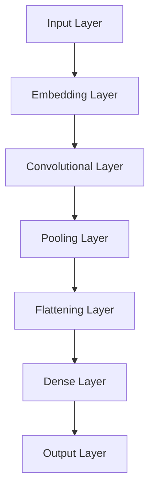

                 

# AI大模型创业：如何应对未来用户需求？

> 关键词：AI大模型、创业、用户需求、技术演进、行业融合、伦理影响

> 摘要：本文旨在探讨AI大模型创业中的关键问题，包括技术原理、企业应用、创业实践和未来展望。通过分析AI大模型的发展趋势和行业应用，本文提出了一系列应对未来用户需求的策略和方法，为创业者和企业提供了有益的参考。

### 第一部分：AI大模型基础

#### 第1章：AI大模型概述

**1.1 AI大模型的概念与演变**

**1.1.1 AI大模型的基本定义**

AI大模型是指具有海量参数、能够在大规模数据集上训练并具有高度泛化能力的深度学习模型。这类模型通常用于自然语言处理、计算机视觉、语音识别等领域，能够处理复杂的数据和任务。

**1.1.2 从传统AI到AI大模型的演变**

传统AI主要依赖规则和符号推理，如专家系统和决策树。随着大数据和深度学习技术的发展，AI进入了数据驱动的时代。AI大模型的出现，标志着AI进入了一个新的阶段，能够处理更复杂的问题，具备更高的泛化能力和更强的业务应用价值。

**1.1.3 AI大模型的核心特点**

- **参数量大**：AI大模型通常具有数十亿甚至千亿个参数，使其能够学习更复杂的模式和知识。
- **数据需求大**：训练AI大模型需要大量高质量的标注数据，以及海量的未标注数据。
- **计算资源需求大**：AI大模型训练和推理过程需要大量的计算资源，尤其是GPU或TPU等专用硬件。
- **泛化能力强**：AI大模型通过大规模数据和复杂的网络结构，能够学习到更广泛的通用知识和技能。

**1.1.4 AI大模型与传统AI的区别**

- **训练方式**：传统AI通常采用符号推理或规则匹配，而AI大模型基于数据驱动，通过大规模数据训练神经网络。
- **应用范围**：传统AI通常应用于特定领域，如金融、医疗等，而AI大模型可以应用于更广泛的领域，如自然语言处理、计算机视觉等。
- **性能和效果**：传统AI的性能和效果受限于规则和算法，而AI大模型通过大规模数据训练，可以达到更优秀的性能和效果。

**1.2 主流AI大模型介绍**

- **GPT系列模型**：GPT（Generative Pre-trained Transformer）系列模型是自然语言处理领域的重要模型，具有强大的文本生成和理解能力。
- **BERT及其变体**：BERT（Bidirectional Encoder Representations from Transformers）是一种预训练语言表示模型，通过双向编码器结构捕捉文本的上下文信息。
- **其他知名AI大模型**：如TuringML、AlphaGo等，这些模型在不同的领域取得了显著的成果。

**1.3 AI大模型的应用前景**

- **AI大模型在不同领域的应用**：AI大模型在医疗、金融、零售、教育等领域具有广泛的应用前景，能够提高业务效率和用户体验。
- **AI大模型带来的商业价值**：AI大模型能够为企业带来显著的商业价值，如提高运营效率、降低成本、创造新的商业模式等。
- **AI大模型的发展挑战与机遇**：随着AI大模型技术的不断发展，面临着数据隐私、算法公平性、可解释性等挑战，同时也为创业者提供了广阔的发展机遇。

#### 第2章：AI大模型技术原理

**2.1 深度学习基础**

**2.1.1 神经网络结构**

神经网络是深度学习的基础，由大量神经元组成，通过层层堆叠形成深度神经网络。每个神经元接收多个输入信号，通过激活函数产生输出。

**2.1.2 深度学习算法**

深度学习算法包括前向传播和反向传播两个过程。前向传播过程将输入信号通过神经网络逐层传递，反向传播过程通过计算损失函数梯度，更新网络参数，优化模型性能。

**2.1.3 训练与优化**

深度学习模型的训练过程涉及参数初始化、学习率设置、优化算法选择等。优化算法如梯度下降、Adam等，用于调整网络参数，降低损失函数值，提高模型性能。

**2.2 自然语言处理技术**

**2.2.1 词嵌入**

词嵌入是将自然语言中的单词映射到高维向量空间，用于表示词与词之间的语义关系。常见词嵌入方法包括Word2Vec、GloVe等。

**2.2.2 序列模型**

序列模型用于处理序列数据，如文本、语音等。常见序列模型包括循环神经网络（RNN）、长短期记忆网络（LSTM）等。

**2.2.3 注意力机制**

注意力机制是一种用于捕捉序列数据中长距离依赖关系的技术，通过加权不同的输入信息，提高模型的序列建模能力。常见注意力模型包括Self-Attention、Transformer等。

**2.3 大规模预训练模型原理**

**2.3.1 预训练的概念**

预训练是指在大规模语料库上进行模型训练，使得模型能够掌握大量的语言知识和规律。预训练模型通常分为两个阶段：第一阶段是预训练阶段，第二阶段是微调阶段。

**2.3.2 自监督学习方法**

自监督学习是一种无需人工标注数据，仅利用未标注数据进行训练的方法。常见自监督学习方法包括掩码语言模型（MLM）、预测下一个句子（NSP）等。

**2.3.3 迁移学习与微调技术**

迁移学习是指将预训练模型在特定任务上进行微调，从而适应新的任务。微调技术包括全量微调、局部微调、动态微调等。

### 第二部分：AI大模型在企业应用

#### 第3章：企业AI战略规划

**3.1 企业AI价值评估**

**3.1.1 AI能力评估框架**

企业AI能力评估框架包括技术能力、业务理解能力、团队协作能力等方面。通过评估，企业可以了解自身的AI能力水平，明确提升方向。

**3.1.2 AI项目ROI分析**

AI项目ROI分析是评估AI项目经济效益的重要手段。通过分析投资成本和预期收益，企业可以制定合理的AI投资策略。

**3.1.3 AI对业务流程的影响**

AI技术可以对企业的业务流程进行优化，提高效率、降低成本。企业需要根据自身业务特点，制定相应的AI应用方案。

**3.2 企业AI项目规划**

**3.2.1 项目选型与立项**

企业需要根据业务需求和AI技术发展趋势，选择合适的AI项目进行立项。立项过程包括需求分析、技术评估、项目立项等环节。

**3.2.2 项目风险评估与管理**

AI项目在研发过程中可能面临技术风险、市场风险、资金风险等。企业需要建立完善的风险评估和管理机制，确保项目顺利进行。

**3.2.3 项目执行与监控**

项目执行过程包括项目计划、资源调配、进度控制等。企业需要建立有效的监控机制，确保项目按计划进行，及时调整项目策略。

**3.3 企业AI组织与管理**

**3.3.1 AI团队组建与角色分工**

企业需要根据项目需求，组建具备技术能力和业务理解能力的AI团队。明确团队成员的角色和职责，提高团队协作效率。

**3.3.2 AI人才培养与激励**

企业需要加强AI人才培养，提高团队的技术水平和创新能力。通过合理的激励机制，激发团队成员的工作积极性和创造力。

**3.3.3 AI与企业文化的融合**

企业需要将AI技术与企业文化相结合，打造创新、协作、开放的工作氛围。通过企业文化引导，推动AI技术在企业中的应用和发展。

#### 第4章：AI大模型在企业应用案例

**4.1 案例研究：电商推荐系统**

**4.1.1 系统架构与数据流程**

电商推荐系统主要包括数据采集、数据预处理、模型训练、模型部署等环节。系统架构采用分布式计算框架，确保数据处理的高效性和稳定性。

**4.1.2 模型设计**

电商推荐系统采用基于深度学习的推荐算法，如基于Transformer的序列模型。模型设计包括输入层、编码器、解码器等模块。

**4.1.3 模型优化与效果评估**

通过实验验证，电商推荐系统在商品推荐准确性、用户满意度等方面取得了显著效果。模型优化包括参数调整、数据增强等策略。

**4.2 案例研究：智能客服系统**

**4.2.1 系统设计与实现**

智能客服系统采用基于BERT的自然语言处理模型，实现文本分类、意图识别、自动回复等功能。系统设计包括前端界面、后端服务、数据库等模块。

**4.2.2 模型应用与效果分析**

智能客服系统在实际应用中，显著提高了客户服务质量，降低了人力成本。效果分析包括响应时间、准确率、用户满意度等指标。

**4.2.3 持续改进与优化**

通过用户反馈和数据分析，智能客服系统不断优化模型和功能，提升用户体验。持续改进包括模型更新、功能扩展等。

#### 第5章：AI大模型开发实战

**5.1 开发环境搭建**

**5.1.1 硬件环境配置**

配置高性能GPU服务器，如NVIDIA V100或A100，确保模型训练的效率。

**5.1.2 软件环境配置**

安装Linux操作系统、深度学习框架（如TensorFlow、PyTorch）和相关依赖库。

**5.1.3 数据集准备**

从公开数据集或企业内部数据中收集数据，进行清洗、归一化、去重等预处理。

**5.1.4 模型训练与优化**

选择合适的模型架构（如BERT、GPT），调整学习率、批次大小等参数，优化模型性能。

**5.2 模型设计与实现**

**5.2.1 模型架构设计**

根据任务需求，设计合适的模型架构，包括输入层、编码器、解码器等模块。

**5.2.2 模型参数调整**

通过实验和调参，优化模型参数，提高模型性能。

**5.2.3 模型训练与评估**

使用训练集和验证集，训练模型并评估模型性能，调整模型参数，优化模型效果。

**5.3 模型部署与运维**

**5.3.1 模型部署策略**

将训练好的模型部署到生产环境，确保模型的高效运行。

**5.3.2 模型性能监控**

实时监控模型性能，包括响应时间、准确率等指标，确保模型稳定运行。

**5.3.3 持续优化与更新**

根据用户反馈和数据分析，持续优化模型和功能，提升用户体验。

#### 第6章：AI大模型创业实践

**6.1 创业机会与挑战**

**6.1.1 AI行业趋势分析**

分析AI行业的发展趋势，了解市场需求和竞争态势。

**6.1.2 创业者所需能力**

掌握计算机科学、机器学习等专业知识，具备业务理解和团队协作能力。

**6.1.3 创业风险与应对策略**

识别创业过程中的风险，如技术风险、市场风险、资金风险等，并制定相应的应对策略。

**6.2 创业模式与商业模式**

**6.2.1 AI产品开发**

根据市场需求，设计和开发符合用户需求的AI产品。

**6.2.2 用户需求分析与挖掘**

通过用户调研、行为分析等方法，深入了解用户需求，为产品优化提供依据。

**6.2.3 营销策略与市场拓展**

制定有效的营销策略，拓展目标市场，提高产品销量和市场份额。

**6.3 创业团队建设与管理**

**6.3.1 团队组建**

根据项目需求，组建具备技术能力和业务理解能力的团队。

**6.3.2 团队协作与沟通**

建立有效的团队协作机制，提高团队工作效率。

**6.3.3 团队激励与成长**

制定合理的激励机制，激发团队成员的积极性和创造力，推动团队持续成长。

### 第三部分：AI大模型未来展望

#### 第7章：AI大模型发展趋势

**7.1 AI大模型技术演进**

**7.1.1 新型算法与应用**

介绍新型算法（如GAN、VAE）在AI大模型中的应用，探讨其在不同领域的潜在价值。

**7.1.2 大模型的可解释性**

探讨如何提高AI大模型的可解释性，使模型决策过程更加透明和可信。

**7.1.3 大模型的隐私保护**

介绍大模型隐私保护技术（如联邦学习、差分隐私），确保用户数据的安全和隐私。

**7.2 AI大模型与行业融合**

**7.2.1 AI在医疗领域的应用**

探讨AI大模型在医疗领域的应用，如医学图像分析、药物研发等。

**7.2.2 AI在金融领域的应用**

分析AI大模型在金融领域的应用，如风险管理、智能投顾等。

**7.2.3 AI在教育领域的应用**

探讨AI大模型在教育领域的应用，如个性化学习、教育测评等。

**7.2.4 AI与物联网、区块链等技术的结合**

介绍AI与物联网、区块链等技术的结合，探讨其在智慧城市、智能制造等领域的应用。

**7.2.5 AI赋能传统产业升级**

探讨AI大模型在传统产业升级中的应用，如智能制造、智慧农业等。

**7.3 AI大模型的伦理与社会影响**

**7.3.1 AI伦理问题探讨**

分析AI大模型在数据隐私、算法公平性等方面的伦理问题，探讨解决方法。

**7.3.2 AI大模型的社会影响**

分析AI大模型对就业、教育、社会治理等方面的影响，探讨应对策略。

**7.3.3 AI治理与法规制定**

探讨AI大模型的治理与法规制定，确保AI技术的健康、可持续发展。

### 附录

#### 附录A：AI大模型开发资源

**A.1 开发工具与框架**

介绍常见的AI大模型开发工具与框架，如TensorFlow、PyTorch等。

**A.2 数据集与案例**

介绍常用的AI大模型数据集和案例，供开发者参考。

**A.3 常见问题与解决方案**

分析AI大模型开发过程中常见的问题和解决方案，帮助开发者解决实际困难。

**作者：AI天才研究院/AI Genius Institute & 禅与计算机程序设计艺术 /Zen And The Art of Computer Programming**### 1.1 AI大模型的概念与演变

AI大模型，顾名思义，是指具有大规模参数、能够在海量数据集上进行训练并具备高度泛化能力的深度学习模型。这类模型的出现，标志着人工智能领域的一个重要转折点，从传统AI走向了数据驱动、模型驱动的全新阶段。

#### **1.1.1 AI大模型的基本定义**

AI大模型通常具有数十亿甚至千亿个参数，这使得它们能够捕捉和表达复杂的数据特征和模式。例如，GPT系列模型和BERT模型就是典型的大模型代表。GPT系列模型中的GPT-3拥有超过1750亿个参数，而BERT模型也拥有超过3.4亿个参数。

**1.1.2 从传统AI到AI大模型的演变**

传统AI主要依赖符号推理和规则匹配，这种方法在处理简单问题时表现良好，但面对复杂任务时，其能力受限。随着计算能力的提升和大数据技术的发展，AI进入了数据驱动的时代。这一时期，基于数据驱动的深度学习技术逐渐成为主流。

在小模型时代，模型的规模相对较小，通常在GB级别。然而，随着深度学习技术的发展，模型规模逐渐增大，出现了AI大模型。AI大模型的核心特点在于其能够通过大规模数据训练，学习到更复杂的模式和知识，从而提升模型在复杂任务上的性能。

**1.1.3 AI大模型的核心特点**

AI大模型具有以下核心特点：

- **参数量大**：AI大模型通常具有数十亿甚至千亿个参数，使其能够学习更复杂的模式和知识。
- **数据需求大**：训练AI大模型需要大量高质量的标注数据，以及海量的未标注数据。
- **计算资源需求大**：AI大模型训练和推理过程需要大量的计算资源，尤其是GPU或TPU等专用硬件。
- **泛化能力强**：AI大模型通过大规模数据和复杂的网络结构，能够学习到更广泛的通用知识和技能。

**1.1.4 AI大模型与传统AI的区别**

AI大模型与传统AI在多个方面存在显著区别：

- **训练方式**：传统AI主要依赖符号推理和规则匹配，而AI大模型基于数据驱动，通过大规模数据训练神经网络。
- **应用范围**：传统AI通常应用于特定领域，如金融、医疗等，而AI大模型可以应用于更广泛的领域，如自然语言处理、计算机视觉等。
- **性能和效果**：传统AI的性能和效果受限于规则和算法，而AI大模型通过大规模数据训练，可以达到更优秀的性能和效果。

**1.1.5 AI大模型的发展历程**

AI大模型的发展历程可以分为以下几个阶段：

1. **初期阶段**：以神经网络为代表的深度学习技术在学术界和工业界得到广泛关注，但模型规模较小，无法处理复杂任务。
2. **快速发展阶段**：随着计算能力和数据量的提升，模型规模逐渐增大，AI大模型逐渐出现，并在多个领域取得突破性成果。
3. **当前阶段**：AI大模型已经成为人工智能领域的研究热点和应用方向，不断有新的模型和算法被提出。

**1.1.6 AI大模型在行业中的应用**

AI大模型在各个行业中的应用日益广泛，以下是几个典型的应用场景：

- **自然语言处理**：AI大模型在自然语言处理领域取得了显著成果，如文本分类、机器翻译、文本生成等。
- **计算机视觉**：AI大模型在图像识别、目标检测、图像生成等领域具有广泛应用，如自动驾驶、医疗影像分析等。
- **语音识别与合成**：AI大模型在语音识别、语音合成、对话系统等领域得到了广泛应用，如智能客服、语音助手等。

### **1.2 主流AI大模型介绍**

AI大模型的发展离不开一系列主流模型的推动，以下介绍几个在学术界和工业界具有广泛影响力的AI大模型。

**1.2.1 GPT系列模型**

GPT（Generative Pre-trained Transformer）系列模型是自然语言处理领域的重要模型。GPT-3是GPT系列模型中的最新版本，拥有超过1750亿个参数，具有强大的文本生成和理解能力。GPT-3可以生成高质量的文章、代码、对话等，被广泛应用于自动写作、智能客服等领域。

**1.2.2 BERT及其变体**

BERT（Bidirectional Encoder Representations from Transformers）是一种预训练语言表示模型，通过双向编码器结构捕捉文本的上下文信息。BERT在自然语言处理任务中取得了显著的成果，如文本分类、问答系统、机器翻译等。BERT的变体，如RoBERTa、ALBERT等，也在不同程度上提升了模型的性能。

**1.2.3 其他知名AI大模型**

除了GPT和BERT，还有许多其他知名的AI大模型，如TuringML、AlphaGo等。TuringML是一种用于机器学习的深度神经网络框架，具有强大的推理和生成能力。AlphaGo是深度学习和强化学习结合的典范，通过自我对弈不断优化，最终在围棋领域取得了惊人的成绩。

**1.2.4 AI大模型的优势与挑战**

AI大模型在多个领域展现了强大的优势，但也面临着一些挑战：

- **优势**：
  - **强大的表征能力**：通过大规模数据和复杂的网络结构，AI大模型能够学习到更广泛的通用知识和技能。
  - **高效的性能**：AI大模型在图像识别、自然语言处理等任务上取得了显著的效果，大幅提高了任务完成效率。
  - **广泛的应用场景**：AI大模型可以应用于多个领域，如医疗、金融、零售、教育等，为各个行业带来了新的技术变革。

- **挑战**：
  - **数据需求大**：训练AI大模型需要大量高质量的数据，这给数据收集和标注带来了巨大挑战。
  - **计算资源需求大**：AI大模型训练和推理过程需要大量的计算资源，这对硬件设备提出了更高的要求。
  - **模型可解释性**：AI大模型的决策过程复杂，如何提高模型的可解释性，使其更加透明和可信，是当前研究的一个重要方向。

**1.2.5 AI大模型的发展趋势**

随着人工智能技术的不断进步，AI大模型的发展也呈现出一些趋势：

- **模型压缩与优化**：为了降低计算资源和存储成本，研究者不断探索模型压缩与优化技术，如量化、剪枝、蒸馏等。
- **迁移学习与微调**：通过迁移学习和微调技术，AI大模型可以更好地适应不同任务和领域，提高模型的泛化能力。
- **联邦学习与隐私保护**：联邦学习和隐私保护技术的不断发展，使得AI大模型在数据隐私和安全性方面取得了重要突破。
- **多模态学习**：AI大模型在多模态学习方面具有巨大潜力，能够同时处理图像、文本、语音等多种数据类型，为复

**1.3 AI大模型的应用前景**

AI大模型的出现，不仅改变了人工智能领域的格局，也为各行各业带来了前所未有的机遇。以下是AI大模型在不同领域的应用前景：

**1.3.1 在医疗领域的应用**

在医疗领域，AI大模型可以应用于疾病诊断、药物研发、健康管理等各个方面。例如，通过深度学习算法，AI大模型可以分析医学影像数据，辅助医生进行疾病诊断，提高诊断准确率和效率。此外，AI大模型还可以用于药物研发，通过分析大规模生物数据，预测药物的作用效果和副作用，加速新药研发进程。

**1.3.2 在金融领域的应用**

在金融领域，AI大模型可以用于风险管理、信用评估、投资决策等方面。例如，通过分析客户的交易数据和行为特征，AI大模型可以预测客户的信用风险，帮助金融机构更好地进行风险控制。此外，AI大模型还可以用于投资决策，通过分析市场数据，预测股票价格走势，为投资者提供有价值的投资建议。

**1.3.3 在零售领域的应用**

在零售领域，AI大模型可以用于商品推荐、库存管理、客户服务等方面。例如，通过分析客户的购物行为和偏好，AI大模型可以推荐个性化的商品，提高销售额。此外，AI大模型还可以用于库存管理，通过预测市场需求和库存状况，优化库存水平，降低库存成本。

**1.3.4 在教育领域的应用**

在教育领域，AI大模型可以用于个性化学习、教育测评、教学辅助等方面。例如，通过分析学生的学习行为和成绩数据，AI大模型可以为学生提供个性化的学习路径，提高学习效果。此外，AI大模型还可以用于教育测评，通过分析学生的答题数据，评估学生的学习效果，为教师提供教学反馈。

**1.3.5 在智慧城市和交通领域的应用**

在智慧城市和交通领域，AI大模型可以用于交通流量预测、智能调度、环境监测等方面。例如，通过分析交通数据，AI大模型可以预测交通流量，优化交通信号控制，提高交通效率。此外，AI大模型还可以用于环境监测，通过分析空气质量和水质数据，预测环境污染情况，为政府和居民提供决策支持。

**1.3.6 在其他领域的应用**

除了上述领域，AI大模型还可以应用于广告推荐、娱乐内容生成、自动化写作、语音识别等多个领域。例如，通过分析用户的行为数据和兴趣偏好，AI大模型可以推荐个性化的广告和娱乐内容，提高用户体验。此外，AI大模型还可以用于自动化写作，通过分析大量文本数据，生成高质量的文章和报告。

**1.3.7 AI大模型带来的商业价值**

AI大模型的应用，不仅为各行各业带来了技术变革，也创造了巨大的商业价值。以下是AI大模型在商业领域的一些潜在价值：

- **提高生产效率**：AI大模型可以自动化处理大量数据，提高生产效率，降低人力成本。
- **降低运营成本**：AI大模型可以帮助企业优化业务流程，降低运营成本，提高盈利能力。
- **创造新的商业模式**：AI大模型可以为企业提供新的服务方式和商业模式，如智能客服、个性化推荐等。
- **提高用户体验**：AI大模型可以为企业提供更智能、个性化的服务，提高用户满意度和忠诚度。

**1.3.8 AI大模型的发展挑战与机遇**

虽然AI大模型在各个领域展现出了巨大的潜力，但其在发展过程中也面临着一些挑战。以下是AI大模型发展过程中的一些挑战和机遇：

- **数据需求**：AI大模型需要大量高质量的数据进行训练，这给数据收集和标注带来了巨大挑战。但随着大数据技术的发展，数据获取和处理能力也在不断提升，为AI大模型的发展提供了机遇。
- **计算资源**：AI大模型训练和推理过程需要大量的计算资源，这对硬件设备提出了更高的要求。随着云计算和GPU技术的发展，计算资源的供给也在不断增长，为AI大模型的发展提供了机遇。
- **模型可解释性**：AI大模型决策过程复杂，如何提高模型的可解释性，使其更加透明和可信，是当前研究的一个重要方向。随着对AI模型的理解不断深入，模型可解释性技术也在不断发展，为AI大模型的应用提供了机遇。

### **2.1 深度学习基础**

深度学习是人工智能领域的一个重要分支，它通过模拟人脑的神经网络结构，实现数据的自动特征提取和模式识别。在本节中，我们将介绍深度学习的基础知识，包括神经网络结构、深度学习算法以及训练与优化过程。

#### **2.1.1 神经网络结构**

神经网络（Neural Network，NN）是深度学习的基础。它由大量神经元（Neurons）组成，通过层层堆叠形成深度神经网络（Deep Neural Network，DNN）。每个神经元接收多个输入信号，通过加权求和后，经过激活函数产生输出。

**1. 神经元的基本结构**

一个基本的神经元可以表示为以下数学模型：

$$
a_i = \sigma(\sum_{j=0}^{n} w_{ij} x_j + b_i)
$$

其中，$a_i$ 是神经元的输出，$\sigma$ 是激活函数，$w_{ij}$ 是输入信号的权重，$x_j$ 是输入信号，$b_i$ 是偏置。

常见的激活函数包括：

- **线性激活函数**（$f(x) = x$）：在多层神经网络中，线性激活函数通常用于隐藏层，以保持数据的线性可分性。
- **Sigmoid激活函数**（$f(x) = \frac{1}{1 + e^{-x}}$）：用于输出层，将输出映射到[0,1]区间，常用于分类问题。
- **ReLU激活函数**（$f(x) = \max(0, x)$）：在隐藏层中使用，可以加速梯度消失问题，提高模型训练效率。

**2. 多层神经网络**

多层神经网络通过多个隐藏层实现数据的非线性变换。一个典型的多层神经网络可以表示为：

$$
h_l = \sigma(W_l h_{l-1} + b_l)
$$

其中，$h_l$ 是第$l$层的输出，$W_l$ 和$b_l$ 分别是权重和偏置。

多层神经网络能够学习到更复杂的模式和特征，提高模型的泛化能力。

**3. 神经网络的前向传播和反向传播**

- **前向传播**：将输入信号通过神经网络逐层传递，直到输出层，得到预测结果。
- **反向传播**：计算输出层预测结果与实际标签之间的误差，通过反向传播更新网络参数。

反向传播过程是深度学习训练的核心，通过不断迭代优化，使模型达到更好的性能。

#### **2.1.2 深度学习算法**

深度学习算法主要分为两类：监督学习（Supervised Learning）和无监督学习（Unsupervised Learning）。

**1. 监督学习**

监督学习是有标签数据驱动的学习方式，通过已知输入和输出，训练模型预测未知输入的输出。常见的监督学习算法包括：

- **回归分析（Regression Analysis）**：用于预测连续值输出，如线性回归、多项式回归等。
- **分类算法（Classification Algorithms）**：用于预测离散值输出，如逻辑回归、决策树、随机森林、支持向量机等。
- **神经网络（Neural Networks）**：通过多层神经网络，实现复杂的非线性映射。

**2. 无监督学习**

无监督学习是利用未标记的数据进行训练，目的是发现数据中的隐含结构。常见的无监督学习算法包括：

- **聚类算法（Clustering Algorithms）**：如K均值聚类、层次聚类等，用于将数据分为多个类别。
- **降维算法（Dimensionality Reduction Algorithms）**：如主成分分析（PCA）、自编码器（Autoencoder）等，用于降低数据维度，提取主要特征。
- **生成模型（Generative Models）**：如生成对抗网络（GAN）、变分自编码器（VAE）等，用于生成新的数据样本。

#### **2.1.3 训练与优化**

深度学习模型的训练与优化过程包括以下几个关键步骤：

**1. 模型初始化**

模型初始化是训练的第一步，包括初始化网络参数、学习率等。常用的参数初始化方法包括：

- **随机初始化**：随机初始化模型参数，确保模型具有随机性。
- **He初始化**：基于高斯分布初始化模型参数，使得激活值的方差保持一致。

**2. 损失函数**

损失函数是衡量模型预测结果与实际标签之间差距的指标。常见的损失函数包括：

- **均方误差（MSE，Mean Squared Error）**：用于回归问题，计算预测值与实际值之间差的平方的平均值。
- **交叉熵（Cross-Entropy）**：用于分类问题，计算预测概率与实际标签之间差异的交叉熵。

**3. 优化算法**

优化算法用于更新模型参数，以最小化损失函数。常见的优化算法包括：

- **梯度下降（Gradient Descent）**：通过计算损失函数关于模型参数的梯度，反向更新模型参数。
- **Adam优化器**：结合了梯度下降和动量项，提高了优化过程的收敛速度。

**4. 模型训练与评估**

模型训练过程是通过迭代更新模型参数，直到满足特定的停止条件。评估过程是使用验证集或测试集，评估模型在未见数据上的性能。

**5. 模型优化**

在模型训练过程中，可能会出现过拟合（Overfitting）问题。为了防止过拟合，可以采用以下方法：

- **正则化（Regularization）**：如L1正则化、L2正则化，通过添加惩罚项，降低模型复杂度。
- **dropout**：在训练过程中，随机丢弃部分神经元，减少模型对特定训练样本的依赖。
- **数据增强（Data Augmentation）**：通过旋转、缩放、裁剪等操作，增加训练数据多样性。

#### **2.1.4 深度学习算法的优化方向**

随着深度学习技术的不断发展，算法优化方向也在不断拓展。以下是几个深度学习算法的优化方向：

**1. 模型压缩与加速**

- **模型剪枝（Model Pruning）**：通过删除网络中不重要或冗余的神经元和连接，减小模型体积。
- **量化（Quantization）**：将模型的权重和激活值从浮点数转换为低比特宽度的整数，降低计算复杂度。

**2. 多模态学习**

- **融合不同模态的数据**：如将文本、图像、音频等多模态数据融合，提高模型在复杂数据上的表征能力。

**3. 自适应学习率**

- **自适应学习率方法**：如Adadelta、AdaGrad等，根据训练过程动态调整学习率，提高模型收敛速度。

**4. 可解释性**

- **可解释性方法**：通过可视化、特征提取等技术，提高模型的可解释性，使模型决策过程更加透明和可信。

**5. 集成学习**

- **集成学习方法**：如随机森林、梯度提升机等，通过结合多个模型的优势，提高模型的预测性能。

通过不断优化和改进，深度学习算法在各个领域取得了显著的成果，为人工智能技术的发展奠定了坚实基础。

### **2.2 自然语言处理技术**

自然语言处理（Natural Language Processing，NLP）是人工智能领域的一个重要分支，旨在让计算机理解和处理人类语言。在本节中，我们将介绍NLP的核心技术，包括词嵌入、序列模型和注意力机制。

#### **2.2.1 词嵌入**

词嵌入（Word Embedding）是将自然语言中的单词映射到高维向量空间的一种技术。通过词嵌入，我们可以将语义丰富的单词表示为密集的向量，从而便于计算机处理和计算。

**1. 词嵌入的基本原理**

词嵌入的基本原理是将单词映射到一个低维的稠密向量空间，使得语义相似的单词在向量空间中距离较近。常见的词嵌入方法包括：

- **基于计数的方法**：如TF-IDF（Term Frequency-Inverse Document Frequency），通过统计单词在文档中的出现频率和逆文档频率，为每个单词分配权重。
- **基于神经网络的方法**：如Word2Vec、GloVe（Global Vectors for Word Representation），通过训练神经网络模型，将单词映射到高维向量空间。

**2. Word2Vec算法**

Word2Vec算法是一种基于神经网络的词嵌入方法，主要分为两种模型：

- **连续词袋模型（Continuous Bag of Words，CBOW）**：输入一个单词，预测其上下文窗口中的单词。
- **Skip-Gram模型**：输入一个单词，预测其所有可能的上下文单词。

Word2Vec算法的核心思想是通过训练神经网络，使得输入单词的上下文单词在向量空间中距离较近。

**3. GloVe算法**

GloVe（Global Vectors for Word Representation）是一种基于全局矩阵分解的词嵌入方法。GloVe通过优化全局矩阵，使得相似单词的向量距离较小。

**4. 词嵌入的应用**

词嵌入在NLP中具有广泛的应用，包括：

- **文本分类**：通过词嵌入，将文本转换为向量表示，用于文本分类任务。
- **情感分析**：通过词嵌入，计算文本中每个单词的向量，从而判断文本的情感倾向。
- **问答系统**：通过词嵌入，将问题中的单词转换为向量，用于匹配答案。

#### **2.2.2 序列模型**

序列模型（Sequence Model）是处理序列数据的常用方法，如文本、语音、时间序列等。序列模型通过捕捉数据序列中的时间依赖关系，实现对序列数据的建模和预测。

**1. 循环神经网络（Recurrent Neural Network，RNN）**

RNN是一种基于时间序列数据的神经网络，通过循环结构捕捉序列数据中的时间依赖关系。RNN的核心思想是在每个时间步，将当前输入和上一时间步的隐藏状态进行结合，生成当前时间步的隐藏状态。

$$
h_t = \sigma(W_h h_{t-1} + W_x x_t + b_h)
$$

其中，$h_t$ 是第$t$个时间步的隐藏状态，$x_t$ 是第$t$个时间步的输入，$W_h$ 和$W_x$ 分别是隐藏状态和输入的权重矩阵，$b_h$ 是偏置。

**2. 长短期记忆网络（Long Short-Term Memory，LSTM）**

LSTM是RNN的一种改进，通过引入门控机制，解决了传统RNN在长序列建模中出现的梯度消失和梯度爆炸问题。LSTM的核心结构包括输入门、遗忘门和输出门。

$$
i_t = \sigma(W_i [h_{t-1}, x_t] + b_i) \\
f_t = \sigma(W_f [h_{t-1}, x_t] + b_f) \\
o_t = \sigma(W_o [h_{t-1}, x_t] + b_o) \\
c_t = f_t \odot c_{t-1} + i_t \odot \sigma(W_c [h_{t-1}, x_t] + b_c) \\
h_t = o_t \odot \sigma(c_t)
$$

其中，$i_t$、$f_t$、$o_t$ 分别是输入门、遗忘门和输出门的激活值，$c_t$ 是当前时间步的细胞状态，$h_t$ 是当前时间步的隐藏状态。

**3. 双向RNN（Bidirectional RNN）**

双向RNN通过同时处理正向和反向序列数据，进一步提高了序列建模能力。双向RNN的输出是正向RNN和反向RNN输出的拼接。

$$
h_t = [h_t^{(f)}, h_t^{(b)}]
$$

其中，$h_t^{(f)}$ 和$h_t^{(b)}$ 分别是正向RNN和反向RNN在第$t$个时间步的隐藏状态。

**2.2.3 注意力机制**

注意力机制（Attention Mechanism）是一种用于捕捉序列数据中长距离依赖关系的技术。注意力机制通过加权不同的输入信息，提高模型的序列建模能力。

**1. 自注意力机制（Self-Attention）**

自注意力机制（Self-Attention）是一种在序列数据内部进行注意力分配的方法，通过计算序列中每个单词与其他单词之间的相似度，为每个单词分配权重。

$$
\text{Attention}(Q, K, V) = \text{softmax}(\frac{QK^T}{\sqrt{d_k}})V
$$

其中，$Q$、$K$ 和$V$ 分别是查询向量、关键向量和价值向量，$d_k$ 是关键向量的维度。

**2. 多头注意力机制（Multi-Head Attention）**

多头注意力机制（Multi-Head Attention）通过多个独立的自注意力机制，提取不同类型的特征。多头注意力机制通过并行计算，提高了模型的表示能力。

$$
\text{MultiHead}(Q, K, V) = \text{ Concat }(_d^h \text{ heads } \text{ } \text{Attention}(QW^Q, KW^K, VW^V))W^O
$$

其中，$W^Q$、$W^K$ 和$W^V$ 分别是查询、关键和价值向量的权重矩阵，$W^O$ 是输出权重矩阵，$_d^h$ 是每个头向量的维度。

**2.2.4 注意力机制的应用**

注意力机制在NLP领域具有广泛的应用，包括：

- **机器翻译**：通过注意力机制，模型可以更好地捕捉源语言和目标语言之间的长距离依赖关系，提高翻译质量。
- **文本生成**：通过注意力机制，模型可以更好地捕捉文本中的上下文信息，生成连贯、自然的文本。
- **问答系统**：通过注意力机制，模型可以更好地捕捉问题中的关键信息，提高答案的准确性和相关性。

### **2.3 大规模预训练模型原理**

大规模预训练模型（Large-scale Pre-trained Model）是一种通过在大规模语料库上进行预训练，然后针对特定任务进行微调的深度学习模型。这种模型在自然语言处理、计算机视觉等领域取得了显著的成果，提升了模型的性能和应用效果。在本节中，我们将介绍大规模预训练模型的基本原理，包括预训练的概念、自监督学习方法和迁移学习与微调技术。

#### **2.3.1 预训练的概念**

预训练（Pre-training）是指在大规模语料库上进行模型训练，使得模型能够掌握大量的语言知识和规律。预训练模型通常分为两个阶段：第一阶段是预训练阶段，第二阶段是微调阶段。

**1. 预训练阶段**

在预训练阶段，模型通过在大规模语料库上进行无监督学习，学习到语言的一般特征和规律。预训练模型通常使用自监督学习方法，如掩码语言模型（Masked Language Model，MLM）和预测下一个句子（Next Sentence Prediction，NSP）。

**2. 微调阶段**

在微调阶段，预训练模型在特定任务上通过有监督学习进行微调，以适应特定任务的需求。微调阶段通过调整模型参数，使得模型能够更好地处理特定任务。

#### **2.3.2 自监督学习方法**

自监督学习（Self-supervised Learning）是一种无需人工标注数据，仅利用未标注数据进行训练的方法。自监督学习方法通过利用数据的内在结构，为模型提供监督信号，从而提高模型的性能。

**1. 掩码语言模型（Masked Language Model，MLM）**

掩码语言模型是一种常见的自监督学习方法，它通过在输入序列中随机掩码一部分单词，然后让模型预测这些被掩码的单词。掩码语言模型能够使模型学习到单词之间的依赖关系，提高模型的语义理解能力。

$$
\text{Given a sequence } x_1, x_2, ..., x_n, \text{ mask some of the tokens and predict them:}
$$

$$
\text{Predict } x_i \text{ given } x_{i-m}, x_{i-m+1}, ..., x_{i-1}, x_{i+1}, ..., x_{i+m}
$$

**2. 预测下一个句子（Next Sentence Prediction，NSP）**

预测下一个句子是一种用于训练序列建模能力的自监督学习方法。它通过预测给定句子后可能出现的下一个句子，使模型学习到句子之间的关联性和上下文信息。

$$
\text{Given a pair of sentences } s_1 \text{ and } s_2, \text{ predict if } s_2 \text{ follows } s_1:
$$

$$
\text{IsNextSentence}(s_1, s_2) = \text{Binary Classification}
$$

#### **2.3.3 迁移学习与微调技术**

迁移学习（Transfer Learning）是一种将预训练模型在特定任务上进行微调，从而适应新的任务的方法。迁移学习的优势在于，通过预训练阶段的学习，模型已经掌握了一般性的知识，从而降低了新任务的学习成本。

**1. 迁移学习的优势**

- **减少训练数据需求**：预训练模型已经在大规模数据上进行了训练，从而减少了新任务对训练数据的依赖。
- **提高模型性能**：预训练模型已经在大规模数据上取得了较好的性能，通过微调可以进一步提高模型在新任务上的性能。

**2. 微调技术**

微调技术包括全量微调和局部微调：

- **全量微调**：在预训练模型的基础上，对所有参数进行微调，适用于新任务与预训练任务相似的情况。
- **局部微调**：仅对部分参数进行微调，通常针对模型中特定层或特定模块，适用于新任务与预训练任务差异较大的情况。

**3. 微调策略**

在进行微调时，可以采用以下策略：

- **学习率调整**：根据任务和数据规模调整学习率，以避免模型过拟合。
- **数据增强**：通过数据增强技术，增加训练数据的多样性，提高模型泛化能力。
- **迭代次数**：根据任务复杂度和数据规模，确定合适的迭代次数，以确保模型达到最佳性能。

#### **2.3.4 大规模预训练模型的应用**

大规模预训练模型在多个领域取得了显著的成果，以下是几个典型的应用场景：

- **自然语言处理**：预训练模型在文本分类、机器翻译、问答系统等自然语言处理任务中取得了优异的性能。
- **计算机视觉**：预训练模型在图像分类、目标检测、图像生成等计算机视觉任务中发挥了重要作用。
- **语音识别**：预训练模型在语音识别和语音合成等任务中，提高了语音信号的处理和理解能力。

通过大规模预训练模型，我们可以更好地利用数据，提升模型性能，推动人工智能技术在各个领域的应用和发展。

### **3.1 企业AI价值评估**

企业AI价值评估是企业制定AI战略和规划的重要步骤。通过全面评估企业的AI能力、项目ROI以及AI对业务流程的影响，企业可以更好地理解AI技术带来的潜在价值，为未来的发展提供有力支持。

**3.1.1 AI能力评估框架**

为了准确评估企业的AI能力，我们可以采用以下框架：

- **技术能力**：评估企业在AI领域的知识储备、技术水平以及研发能力。包括对深度学习、机器学习、自然语言处理、计算机视觉等技术的掌握程度。
- **业务理解能力**：评估企业对业务流程的理解程度，包括对业务数据的熟悉程度、业务需求的识别和解决能力等。
- **团队协作能力**：评估企业AI团队的协作效率、沟通能力和项目管理能力。一个高效的团队是AI项目成功的关键。

**3.1.2 AI项目ROI分析**

AI项目的ROI（Return on Investment）分析是评估AI项目经济效益的重要手段。以下是一个AI项目ROI分析的基本步骤：

1. **项目成本**：计算项目在硬件、软件、人力等方面的投入成本。
2. **预期收益**：分析项目实施后可能带来的直接和间接收益。直接收益包括提高生产效率、降低运营成本等；间接收益包括提升用户体验、扩大市场份额等。
3. **投资回收期**：计算项目的投资回收期，即项目投入成本回收的时间。

$$
\text{投资回收期} = \frac{\text{项目总成本}}{\text{预期年均收益}}
$$

**3.1.3 AI对业务流程的影响**

AI技术可以对企业的业务流程进行优化，提高效率、降低成本。以下是AI技术可能对企业业务流程产生的影响：

1. **数据驱动决策**：通过数据分析，企业可以更好地了解业务运营情况，优化决策过程。
2. **自动化**：AI技术可以实现业务流程的自动化，减少人工干预，提高工作效率。
3. **个性化服务**：通过用户数据分析，企业可以提供更加个性化的服务，提升用户满意度和忠诚度。
4. **风险控制**：AI技术可以帮助企业识别潜在风险，提前采取措施，降低业务风险。

**3.1.4 AI能力评估案例分析**

以某电商企业为例，该企业希望通过AI技术提升商品推荐系统的性能。以下是该企业的AI能力评估和分析过程：

1. **技术能力**：企业已经具备一定的AI技术储备，能够进行数据预处理、模型训练和评估等操作。
2. **业务理解能力**：企业对电商业务流程有深入了解，能够识别商品推荐系统中的关键问题，如用户行为分析、商品关联规则等。
3. **团队协作能力**：企业拥有经验丰富的数据科学家和开发人员，能够高效地完成项目任务。

通过对AI能力的评估，企业可以确定是否具备实施AI项目的条件。如果评估结果显示企业存在技术短板或团队协作问题，企业可以采取相应的措施进行改进。

**3.1.5 AI项目ROI分析**

1. **项目成本**：项目成本主要包括硬件投入（如GPU服务器）、软件投入（如深度学习框架）和人力成本（如数据科学家、开发人员）等。假设项目总成本为100万元。
2. **预期收益**：通过优化商品推荐系统，企业预计可以提高销售额10%，降低运营成本5%。假设年均收益为200万元。
3. **投资回收期**：根据投资回收期公式，计算得到投资回收期为5年。

$$
\text{投资回收期} = \frac{100\text{万元}}{200\text{万元/年}} = 5\text{年}
$$

通过ROI分析，企业可以判断该项目具有较好的经济效益，值得投资。

**3.1.6 AI对业务流程的影响**

1. **数据驱动决策**：企业通过分析用户购买行为数据，优化商品推荐策略，提高用户满意度。
2. **自动化**：商品推荐系统自动化运作，减少人工干预，提高工作效率。
3. **个性化服务**：根据用户兴趣和行为，提供个性化商品推荐，提升用户满意度和忠诚度。
4. **风险控制**：通过预测用户流失风险，提前采取措施，降低用户流失率。

通过以上分析和案例，企业可以更好地评估AI项目的价值，制定合理的AI战略和规划。

### **3.2 企业AI项目规划**

企业AI项目规划是成功实施AI项目的重要环节。通过合理的项目选型与立项、全面的风险评估与管理，以及有效的项目执行与监控，企业可以确保AI项目的顺利进行，实现预期目标。

**3.2.1 项目选型与立项**

项目选型与立项是企业AI项目规划的首要步骤，直接关系到项目的成功与否。以下是企业AI项目选型与立项的几个关键环节：

1. **需求分析**：深入了解企业的业务需求，明确AI项目要解决的问题。需求分析可以采用用户调研、业务访谈等方法，确保项目目标的准确性和可行性。
2. **技术评估**：根据需求分析结果，评估现有技术的可行性，包括算法选择、技术成熟度等。技术评估可以参考行业内外的成功案例和经验。
3. **立项决策**：综合考虑需求、技术和资源等因素，做出立项决策。立项决策应确保项目目标明确、资源充足、风险可控。

**3.2.2 项目风险评估与管理**

AI项目在研发过程中可能面临多种风险，如技术风险、市场风险、资金风险等。有效的风险评估与管理是确保项目顺利进行的关键。以下是企业AI项目风险评估与管理的几个步骤：

1. **风险识别**：识别项目过程中可能遇到的风险，如算法失效、数据泄露、市场竞争等。
2. **风险评估**：评估每个风险的发生概率和影响程度，确定风险优先级。风险评估可以采用定性或定量方法，如风险矩阵、蒙特卡洛模拟等。
3. **风险应对**：制定相应的风险应对策略，包括风险规避、风险转移、风险缓解等。针对不同类型的风险，采取不同的应对措施，确保项目持续进展。
4. **风险监控**：建立风险监控机制，定期评估项目风险状况，及时调整风险应对策略，确保项目风险处于可控状态。

**3.2.3 项目执行与监控**

项目执行与监控是确保项目按计划进行，实现预期目标的重要环节。以下是企业AI项目执行与监控的几个关键步骤：

1. **项目计划**：制定详细的项目计划，包括任务分解、时间安排、资源分配等。项目计划应确保项目目标明确、任务可量化、时间合理。
2. **资源调配**：根据项目计划，合理调配人力、资金、技术等资源，确保项目顺利推进。资源调配应充分考虑项目需求和资源限制，确保资源最大化利用。
3. **进度控制**：建立进度控制机制，定期检查项目进展，确保项目按计划进行。进度控制可以采用里程碑、关键路径等方法，及时发现和解决问题。
4. **质量监控**：建立质量监控机制，确保项目产出符合预期质量标准。质量监控可以采用测试、评审等方法，确保项目各阶段产出满足要求。
5. **项目汇报**：定期向管理层汇报项目进展、问题和风险，确保项目透明度，获取必要的支持和资源。

**3.2.4 项目案例研究**

以某企业的智能客服系统项目为例，该项目旨在通过AI技术提升客服服务质量，降低人工成本。以下是该项目规划的关键环节：

1. **需求分析**：通过用户调研和业务访谈，明确智能客服系统要实现的功能，如自动回复、意图识别、情感分析等。
2. **技术评估**：评估现有AI技术和算法的可行性，选择合适的算法和框架，如基于BERT的NLP模型。
3. **立项决策**：确定项目目标、预算和时间表，立项决策基于需求分析和技术评估结果。

1. **风险评估**：识别项目风险，如算法不稳定、数据隐私问题、市场竞争等，评估风险的概率和影响程度。
2. **风险应对**：针对算法不稳定风险，制定模型优化和测试策略；针对数据隐私问题，采用加密和数据匿名化技术；针对市场竞争，制定差异化竞争策略。

1. **项目计划**：制定详细的项目计划，包括数据收集、模型训练、系统开发、测试与上线等任务，明确每个任务的时间节点和责任人。
2. **资源调配**：根据项目计划，配置开发团队、测试团队等，确保项目资源充足。
3. **进度控制**：建立进度控制机制，定期检查项目进展，确保项目按计划进行。
4. **质量监控**：制定质量标准，进行模型测试和系统测试，确保项目产出符合质量要求。
5. **项目汇报**：定期向管理层汇报项目进展，获取必要的支持和资源。

通过以上项目规划，企业可以确保智能客服系统项目的成功实施，提升客服服务质量，降低运营成本。

### **3.3 企业AI组织与管理**

企业AI组织与管理是企业成功实施AI项目的重要保障。一个高效、协作的AI团队是AI项目成功的关键。以下从团队组建、人才培养、团队协作、激励机制等方面探讨企业AI组织与管理。

**3.3.1 AI团队组建**

AI团队的组建是企业AI组织与管理的第一步。一个高效的AI团队应包括以下角色：

1. **数据科学家**：负责数据分析和模型设计，具备深度学习和机器学习专业知识。
2. **软件开发工程师**：负责AI系统的开发、测试和部署，具备良好的编程能力。
3. **算法工程师**：专注于算法研究和模型优化，提高AI模型的性能和可解释性。
4. **项目经理**：负责项目规划、执行和监控，确保项目按时按质完成。
5. **业务分析师**：负责业务需求分析，确保AI项目与业务目标一致。

**3.3.2 AI人才培养**

AI人才的培养是企业长期发展的关键。以下是一些人才培养策略：

1. **内部培训**：定期组织内部培训，提高团队成员的专业技能和团队协作能力。培训内容可以包括最新技术趋势、项目实战经验等。
2. **外部合作**：与高校、研究机构等建立合作关系，共同培养AI人才。通过合作项目、实习机会等，为团队成员提供更广阔的发展平台。
3. **激励制度**：建立合理的激励机制，如绩效奖金、股权激励等，激发团队成员的工作积极性和创造力。

**3.3.3 团队协作与沟通**

团队协作与沟通是确保AI项目顺利进行的重要因素。以下是一些建议：

1. **明确角色与职责**：确保每个团队成员明确自己的角色和职责，避免职责重叠和责任模糊。
2. **定期会议**：定期组织项目会议，讨论项目进展、问题和解决方案。会议形式可以包括周会、月度总结会等。
3. **文档管理**：建立完善的文档管理制度，确保项目文档的及时更新和共享。文档内容可以包括项目计划、技术文档、测试报告等。
4. **团队文化建设**：培养团队协作精神，建立积极、开放、包容的团队文化。通过团队建设活动、团队旅行等，增强团队凝聚力。

**3.3.4 激励机制**

激励机制是调动团队成员积极性的关键。以下是一些激励机制：

1. **绩效奖金**：根据团队成员的工作表现，发放绩效奖金，奖励优秀员工。
2. **股权激励**：通过股权激励，让团队成员共享企业成长的红利，增强归属感和责任感。
3. **培训与发展**：提供充足的培训资源和发展机会，帮助团队成员提升技能和职业素养。
4. **工作环境**：营造良好的工作环境，包括舒适的工作空间、先进的硬件设备等，提高团队成员的工作舒适度和满意度。

**3.3.5 AI组织与管理的最佳实践**

以下是几个企业AI组织与管理的最佳实践：

1. **跨部门合作**：推动跨部门合作，促进不同职能部门之间的信息共享和资源整合，提高项目效率。
2. **敏捷开发**：采用敏捷开发方法，快速响应业务变化，提高项目交付质量。
3. **持续学习与改进**：鼓励团队成员持续学习和创新，不断改进AI技术和管理方法，保持企业竞争力。
4. **数据治理**：建立完善的数据治理体系，确保数据的质量、安全和合规性，为AI项目提供可靠的数据支持。

通过以上措施，企业可以构建一个高效、协作的AI团队，推动AI技术在企业中的应用和发展，实现商业价值。

### **4.1 案例研究：电商推荐系统**

电商推荐系统是AI技术在零售行业的重要应用之一，通过个性化推荐，提升用户满意度和购买转化率。以下是对电商推荐系统架构、模型设计和优化与效果评估的详细分析。

**4.1.1 系统架构与数据流程**

电商推荐系统通常采用分布式架构，主要包括数据采集、数据预处理、模型训练、模型部署和实时推荐等模块。以下是系统架构和数据流程的详细描述：

1. **数据采集**：电商推荐系统需要从多个数据源采集用户行为数据，包括用户浏览、购买、收藏、评价等。这些数据可以通过日志文件、数据库接口等方式进行收集。
2. **数据预处理**：采集到的原始数据通常包含噪声和不完整的信息，需要进行清洗和预处理。预处理步骤包括数据去重、缺失值填充、数据规范化等。例如，将用户购买行为时间转换为时间戳，将商品类别映射为数字编码。
3. **特征工程**：特征工程是推荐系统的重要环节，通过提取和构造用户和商品的潜在特征，提升模型性能。常见的特征包括用户历史浏览记录、购买频率、购买金额、商品属性（如类别、品牌、价格等）等。
4. **模型训练**：使用训练集数据，训练推荐模型。推荐模型可以采用基于协同过滤（Collaborative Filtering）、基于内容的推荐（Content-Based Recommendation）或深度学习（Deep Learning）等方法。协同过滤方法包括矩阵分解、K-近邻等；基于内容的推荐方法包括基于商品属性的相似度计算；深度学习方法包括基于Transformer的序列模型。
5. **模型部署**：训练好的模型需要部署到生产环境，实现实时推荐。部署过程中，需要考虑模型的计算效率和稳定性，如使用在线学习（Online Learning）和异步训练（Asynchronous Training）等方法。
6. **实时推荐**：根据用户实时行为，如页面浏览、搜索关键词等，实时生成推荐结果。推荐结果可以通过API接口、前端页面等方式展示给用户。

**4.1.2 模型设计**

电商推荐系统的模型设计是系统的核心，以下是对几种常用推荐模型的详细描述：

1. **基于协同过滤的推荐模型**

   基于协同过滤的推荐模型主要通过用户和商品之间的相似度来生成推荐列表。协同过滤方法可以分为两种：

   - **用户基于的协同过滤（User-Based Collaborative Filtering）**：通过计算用户之间的相似度，为用户推荐与相似用户喜欢的商品。常见的方法包括K-近邻（K-Nearest Neighbors，KNN）和基于用户的最近邻平均（User-Based Nearest Neighbor Average，UBNA）。
   - **商品基于的协同过滤（Item-Based Collaborative Filtering）**：通过计算商品之间的相似度，为用户推荐与用户已购买或浏览过的商品相似的其他商品。常见的方法包括基于物品的最近邻平均（Item-Based Nearest Neighbor Average，IBNA）。

   伪代码如下：

   ```
   # 基于K-近邻的用户协同过滤
   def user_based_collaborative_filtering(user, k):
       similar_users = find_k_nearest_users(user, k)
       recommended_items = []
       for similar_user in similar_users:
           recommended_items.extend(find_recommended_items(user, similar_user))
       return unique(recommended_items)

   # 基于物品的协同过滤
   def item_based_collaborative_filtering(user, k):
       similar_items = find_k_nearest_items(user, k)
       recommended_users = []
       for similar_item in similar_items:
           recommended_users.extend(find_recommended_users(user, similar_item))
       return unique(recommended_users)
   ```

2. **基于内容的推荐模型**

   基于内容的推荐模型通过分析商品和用户特征的相似性来生成推荐列表。该方法利用商品的属性（如类别、品牌、价格等）和用户的历史行为特征（如浏览记录、购买记录等）进行相似度计算。

   伪代码如下：

   ```
   # 基于商品属性的推荐
   def content_based_recommendation(user, item_features, k):
       similar_items = []
       for item in items:
           similarity = calculate_similarity(item_features, user_features)
           similar_items.append((item, similarity))
       sorted(similar_items, key=lambda x: x[1], reverse=True)
       return [item for item, _ in similar_items[:k]]

   # 基于用户特征的推荐
   def content_based_recommendation(user, user_features, k):
       similar_users = []
       for other_user in users:
           similarity = calculate_similarity(user_features, other_user_features)
           similar_users.append((other_user, similarity))
       sorted(similar_users, key=lambda x: x[1], reverse=True)
       return [other_user for other_user, _ in similar_users[:k]]
   ```

3. **基于深度学习的推荐模型**

   基于深度学习的推荐模型通过学习用户和商品之间的复杂关系，生成推荐列表。深度学习方法包括基于神经网络的序列模型（如RNN、LSTM）、图神经网络（Graph Neural Network，GNN）等。

   伪代码如下：

   ```
   # 基于Transformer的序列模型
   def transformer_based_model(user_sequence, item_sequence, d_model):
       # 编码器
       encoder = TransformerModel(d_model)
       user_representation = encoder(user_sequence)
       item_representation = encoder(item_sequence)

       # 计算相似度
       similarity = dot(user_representation, item_representation.T)

       # 生成推荐列表
       recommended_items = softmax(similarity)
       return recommended_items
   ```

**4.1.3 模型优化与效果评估**

电商推荐系统的模型优化和效果评估是确保推荐质量的关键步骤。以下是对模型优化和效果评估的方法和指标：

1. **模型优化方法**

   - **正则化**：通过添加L1或L2正则化项，防止模型过拟合，提高泛化能力。
   - **学习率调整**：使用自适应学习率方法（如Adam优化器），根据训练过程动态调整学习率，提高收敛速度。
   - **数据增强**：通过数据增强方法，如随机噪声添加、数据缩放等，增加训练数据多样性，提高模型鲁棒性。
   - **dropout**：在神经网络训练过程中，随机丢弃部分神经元，减少模型对特定训练样本的依赖，防止过拟合。

2. **效果评估指标**

   - **准确率（Accuracy）**：用于分类任务，表示模型预测正确的样本比例。
   - **召回率（Recall）**：表示模型能够召回所有正例样本的比例。
   - **F1值（F1 Score）**：综合考虑准确率和召回率，平衡二者的优缺点。
   - **平均绝对误差（Mean Absolute Error，MAE）**：用于回归任务，表示预测值与实际值之间的平均绝对误差。
   - **均方误差（Mean Squared Error，MSE）**：用于回归任务，表示预测值与实际值之间的平均平方误差。
   - **精确率（Precision）**：表示模型预测为正例的样本中实际为正例的比例。
   - **推荐覆盖率（Coverage）**：表示推荐列表中包含的商品种类数与所有商品种类数的比例。
   - **推荐多样性（Novelty）**：表示推荐列表中不同类型商品的比例，防止推荐结果过于集中。

   以下是一个效果评估示例：

   ```
   # 评估模型性能
   def evaluate_model(model, X_test, y_test):
       predictions = model.predict(X_test)
       accuracy = accuracy_score(y_test, predictions)
       f1_score = f1_score(y_test, predictions, average='weighted')
       mae = mean_absolute_error(y_test, predictions)
       mse = mean_squared_error(y_test, predictions)
       return accuracy, f1_score, mae, mse
   ```

通过以上模型优化和效果评估方法，电商推荐系统可以不断改进推荐质量，提高用户满意度和购买转化率。

### **4.2 案例研究：智能客服系统**

智能客服系统是AI技术在客户服务领域的重要应用，通过自然语言处理、机器学习等技术，实现自动化客户服务，提高服务效率和质量。以下是对智能客服系统的系统设计、模型应用与效果分析以及持续改进与优化的详细分析。

**4.2.1 系统设计与实现**

智能客服系统的设计主要包括前端界面、后端服务、数据库和数据存储等模块。以下是对各模块的详细描述：

1. **前端界面**：前端界面是用户与智能客服系统交互的入口，包括文本聊天界面、语音聊天界面等。前端界面需要支持实时消息推送、图片上传、语音识别等功能，以提高用户体验。

2. **后端服务**：后端服务是智能客服系统的核心，包括自然语言处理、语音识别、对话管理、知识库管理等模块。自然语言处理模块负责解析用户输入，提取关键信息，生成响应内容；语音识别模块负责将语音输入转换为文本，供自然语言处理模块处理；对话管理模块负责管理对话流程，确保对话连贯性和流畅性；知识库管理模块负责存储和管理知识点，提供智能客服系统查询和引用。

3. **数据库**：数据库用于存储用户信息、聊天记录、知识点等数据。数据库设计应考虑数据的安全性、可靠性和可扩展性，如使用关系数据库（如MySQL）或NoSQL数据库（如MongoDB）。

4. **数据存储**：数据存储包括用户数据、聊天记录、模型参数等。用户数据存储应遵循隐私保护原则，确保用户数据安全；聊天记录存储用于后续分析和学习；模型参数存储用于模型更新和迁移。

**4.2.2 模型应用与效果分析**

智能客服系统的效果取决于模型的性能和应用效果。以下是对智能客服系统中应用的关键模型以及效果分析的详细描述：

1. **自然语言处理模型**：自然语言处理模型是智能客服系统的核心，用于解析用户输入，提取关键信息，生成响应内容。常用的自然语言处理模型包括：

   - **词嵌入模型**：用于将自然语言中的单词映射到高维向量空间，便于计算机处理。常见的词嵌入模型包括Word2Vec、GloVe等。
   - **序列到序列模型**：如Transformer、BERT等，用于处理序列数据，实现自然语言之间的翻译和转换。
   - **对话生成模型**：用于生成自然语言响应，如生成对抗网络（GAN）、变分自编码器（VAE）等。

   模型效果评估指标包括：

   - **BLEU分数**：用于评估文本生成的质量，表示生成文本与目标文本的相似度。
   - **BERT分数**：用于评估对话生成模型在对话任务中的性能，包括语法、语义、连贯性等。

   以下是一个自然语言处理模型的应用示例：

   ```
   # 使用Transformer模型进行对话生成
   def generate_response(input_text, model, tokenizer, max_length=50):
       input_ids = tokenizer.encode(input_text, return_tensors='pt')
       input_ids = input_ids[:, :-1]
       outputs = model.generate(input_ids, max_length=max_length, pad_token_id=tokenizer.eos_token_id)
       generated_text = tokenizer.decode(outputs[:, 1:], skip_special_tokens=True)
       return generated_text
   ```

2. **语音识别模型**：语音识别模型用于将语音输入转换为文本，供自然语言处理模块处理。常用的语音识别模型包括：

   - **深度神经网络（DNN）**：基于神经网络的结构，用于提取语音特征。
   - **循环神经网络（RNN）**：用于处理时间序列数据，如语音信号。
   - **卷积神经网络（CNN）**：用于提取语音信号的局部特征。
   - **长短时记忆网络（LSTM）**：用于处理长序列数据，提高语音识别性能。

   语音识别模型效果评估指标包括：

   - **词错误率（Word Error Rate，WER）**：表示语音识别错误单词的比例。
   - **字符错误率（Character Error Rate，CER）**：表示语音识别错误字符的比例。

   以下是一个语音识别模型的应用示例：

   ```
   # 使用RNN进行语音识别
   def recognize_speech(input_audio, model, audio_processor):
       processed_audio = audio_processor.preprocess(input_audio)
       outputs = model(processed_audio)
       predicted_text = decode_output(outputs)
       return predicted_text
   ```

3. **对话管理模型**：对话管理模型用于管理对话流程，确保对话连贯性和流畅性。常用的对话管理模型包括：

   - **规则驱动模型**：基于预定义的规则，进行对话决策。
   - **机器学习模型**：通过学习对话历史数据，进行对话决策。
   - **多任务学习模型**：同时处理对话生成、对话分类、意图识别等任务。

   对话管理模型效果评估指标包括：

   - **对话连贯性**：表示对话过程中回答的连贯性和流畅性。
   - **意图识别准确率**：表示模型识别用户意图的准确率。

   以下是一个对话管理模型的应用示例：

   ```
   # 使用规则驱动模型进行对话管理
   def handle_conversation(input_text, rules):
       for rule in rules:
           if matches(input_text, rule['pattern']):
               return rule['response']
       return "I'm sorry, I don't understand."
   ```

**4.2.3 模型优化与效果提升**

智能客服系统的模型优化和效果提升是持续改进的重要方向。以下是一些模型优化方法和效果提升策略：

1. **数据增强**：通过数据增强方法，如随机噪声添加、数据缩放、数据混合等，增加训练数据多样性，提高模型鲁棒性和泛化能力。

2. **迁移学习**：利用预训练模型，通过迁移学习技术，将预训练模型的知识迁移到具体任务上，减少训练数据需求，提高模型性能。

3. **注意力机制**：在对话生成模型中引入注意力机制，提高模型对对话历史信息的关注能力，生成更自然的对话内容。

4. **多模态融合**：结合文本、语音、图像等多模态数据，提高模型对用户意图的理解能力，生成更准确的响应内容。

5. **在线学习**：通过在线学习技术，实时更新模型参数，适应用户需求和对话环境的变化。

6. **反馈机制**：建立用户反馈机制，根据用户评价和反馈，调整模型参数和对话策略，提高用户满意度。

**4.2.4 持续改进与优化**

智能客服系统的持续改进和优化是提高系统性能和用户体验的重要保障。以下是一些持续改进和优化的方法：

1. **定期评估**：定期对智能客服系统进行性能评估，分析模型效果和用户反馈，发现潜在问题和改进方向。

2. **迭代更新**：根据评估结果和用户反馈，迭代更新模型和系统功能，优化对话流程和用户体验。

3. **用户调研**：定期进行用户调研，了解用户需求和期望，为系统改进提供依据。

4. **数据分析**：利用大数据分析方法，挖掘用户行为数据，为系统改进和决策提供支持。

5. **跨部门协作**：加强与业务部门的协作，确保智能客服系统与业务需求的紧密对接，提高系统实用性和业务价值。

通过以上持续改进和优化方法，智能客服系统可以不断提升性能和用户体验，为企业创造更大的价值。

### **5.1 开发环境搭建**

在开始AI大模型的开发之前，搭建一个合适的环境是至关重要的。这包括硬件配置、软件安装和依赖管理等方面。以下是一个详细的开发环境搭建步骤：

**5.1.1 硬件环境配置**

为了高效地训练和推理AI大模型，硬件配置需要满足以下要求：

1. **GPU服务器**：高性能的GPU服务器是训练和推理AI大模型的关键。推荐使用NVIDIA的GPU，如Tesla V100或A100。这些GPU具有高计算能力，能够显著提升训练速度。
2. **CPU服务器**：除了GPU，高性能的多核CPU服务器也至关重要，以确保并行计算能力。推荐使用具有至少16个核心的CPU。
3. **内存**：AI大模型训练过程中需要大量的内存。推荐配置至少128GB的内存，以确保模型训练的顺利进行。

**5.1.2 软件环境配置**

完成硬件配置后，需要安装操作系统和深度学习框架等软件。以下是一个基本的软件环境配置步骤：

1. **操作系统**：推荐使用Linux操作系统，如Ubuntu 18.04或20.04。Linux操作系统具有更好的稳定性和性能，适合大规模数据处理和计算。
2. **深度学习框架**：选择一个合适的深度学习框架，如TensorFlow或PyTorch。这两个框架都是广泛使用的深度学习工具，具有丰富的功能和良好的社区支持。
   - **TensorFlow**：安装TensorFlow GPU版本，可以使用以下命令：
     ```
     pip install tensorflow-gpu==<版本号>
     ```
   - **PyTorch**：安装PyTorch GPU版本，可以使用以下命令：
     ```
     pip install torch torchvision torchaudio -f https://download.pytorch.org/whl/torch_stable.html
     ```

3. **依赖库**：除了深度学习框架，还需要安装其他依赖库，如NumPy、Pandas、Scikit-learn等。可以使用以下命令进行安装：
   ```
   pip install numpy pandas scikit-learn
   ```

**5.1.3 数据集准备**

在搭建开发环境时，还需要准备训练和测试数据集。以下是一些数据集准备步骤：

1. **数据收集**：从公开数据集或企业内部数据中收集数据。公开数据集可以来自Kaggle、UCI机器学习库等，而企业内部数据则需要通过数据接口进行获取。
2. **数据预处理**：对收集到的数据进行清洗、归一化和去重等处理。清洗步骤包括去除无效数据、填补缺失值等；归一化步骤包括将数据缩放到特定范围；去重步骤包括去除重复数据，确保数据质量。
3. **数据存储**：将预处理后的数据存储在本地文件系统或分布式存储系统中。常用的存储系统包括HDFS、Amazon S3等。可以使用Python的Pandas库进行数据读写和存储。

**5.1.4 模型训练与优化**

完成开发环境搭建和数据集准备后，可以开始模型训练和优化。以下是一个基本的模型训练和优化步骤：

1. **模型选择**：根据任务需求，选择一个合适的模型架构，如BERT、GPT等。这些模型具有强大的表征能力和泛化能力，适用于多种自然语言处理任务。
2. **模型训练**：使用训练集数据，训练模型。在训练过程中，需要设置合适的训练参数，如学习率、批次大小、迭代次数等。可以使用深度学习框架提供的API进行模型训练。
3. **模型优化**：在训练过程中，需要监控模型性能，如准确率、损失函数等。根据性能指标，调整模型参数，优化模型性能。可以使用交叉验证、网格搜索等方法，找到最佳模型参数。

**5.1.5 模型部署与推理**

完成模型训练和优化后，可以将模型部署到生产环境，实现实时推理和应用。以下是一个基本的模型部署和推理步骤：

1. **模型部署**：将训练好的模型转换为可部署的格式，如TensorFlow Lite、PyTorch JIT等。这些格式可以在生产环境中高效地加载和执行模型。
2. **模型推理**：使用部署的模型，对输入数据进行推理，生成预测结果。可以使用深度学习框架提供的API进行模型推理，如TensorFlow Serving、PyTorch Inference Server等。
3. **性能监控**：在生产环境中，需要对模型性能进行实时监控，如响应时间、准确率等。根据性能指标，调整模型和系统参数，优化模型性能。

通过以上步骤，可以搭建一个完整的AI大模型开发环境，实现模型训练、优化和部署，为企业提供高效、可靠的智能服务。

### **5.2 模型设计与实现**

在AI大模型开发过程中，模型设计是至关重要的一步。一个优秀的模型设计不仅能够提高任务的性能，还能够降低计算资源和存储成本。本节将介绍模型设计的基本流程，包括模型架构设计、参数调整和训练与评估。

#### **5.2.1 模型架构设计**

模型架构设计是模型开发的基础，决定了模型的学习能力和泛化能力。以下是一个典型的模型架构设计流程：

1. **需求分析**：明确任务需求和目标，如分类、回归、生成等。了解任务特点，如数据规模、特征类型等，为模型设计提供依据。
2. **选择基础模型**：根据任务需求和现有技术，选择一个合适的基础模型。常见的基础模型包括卷积神经网络（CNN）、循环神经网络（RNN）、Transformer等。
3. **模块设计**：在基础模型上，根据任务需求添加或修改模块。例如，对于文本分类任务，可以在基础模型前添加嵌入层（Embedding Layer），在基础模型后添加分类层（Classification Layer）。
4. **网络结构优化**：根据任务特点和数据特性，对模型结构进行优化。例如，对于大型文本数据，可以使用多层Transformer结构；对于图像数据，可以使用卷积神经网络。
5. **可视化与验证**：使用Mermaid流程图或其他可视化工具，展示模型架构。确保模型设计合理，易于理解和实现。

以下是一个使用Mermaid绘制的模型架构图：



#### **5.2.2 参数调整**

模型参数的调整是优化模型性能的关键步骤。以下是一些常见的参数调整方法和技巧：

1. **学习率调整**：学习率是模型训练中的一个重要参数，影响模型收敛速度和稳定性。常见的方法包括固定学习率、自适应学习率（如Adam）、学习率衰减等。
2. **批量大小调整**：批量大小影响模型的计算效率和收敛速度。较小的批量大小可以提高模型的学习能力，但计算成本较高；较大的批量大小可以提高计算效率，但可能降低模型性能。
3. **权重初始化**：合理的权重初始化可以加快模型收敛速度，减少振荡。常见的方法包括随机初始化、He初始化、Xavier初始化等。
4. **优化器选择**：选择合适的优化器可以加快模型收敛速度。常见的优化器包括梯度下降（SGD）、Adam、RMSprop等。
5. **正则化**：正则化技术可以防止模型过拟合。常见的方法包括L1正则化、L2正则化、Dropout等。

以下是一个参数调整的示例代码：

```python
import tensorflow as tf

# 设置学习率、批量大小和优化器
learning_rate = 0.001
batch_size = 64
optimizer = tf.keras.optimizers.Adam(learning_rate=learning_rate)

# 构建模型
model = tf.keras.models.Sequential([
    tf.keras.layers.Embedding(input_dim=vocab_size, output_dim=embedding_dim),
    tf.keras.layers.Conv1D(filters=128, kernel_size=5, activation='relu'),
    tf.keras.layers.GlobalMaxPooling1D(),
    tf.keras.layers.Dense(units=1, activation='sigmoid')
])

# 编译模型
model.compile(optimizer=optimizer, loss='binary_crossentropy', metrics=['accuracy'])
```

#### **5.2.3 模型训练与评估**

模型训练和评估是模型开发的重要环节。以下是一个基本的模型训练和评估流程：

1. **数据准备**：准备好训练集和测试集，并进行预处理。预处理步骤包括数据清洗、归一化、编码等。
2. **模型训练**：使用训练集数据，训练模型。在训练过程中，监控模型性能，如损失函数、准确率等。根据性能指标，调整模型参数，优化模型性能。
3. **模型评估**：使用测试集数据，评估模型性能。评估指标包括准确率、召回率、F1值等。根据评估结果，判断模型是否达到预期性能。
4. **模型保存**：将训练好的模型保存到文件中，以便后续使用。

以下是一个模型训练和评估的示例代码：

```python
from tensorflow.keras.preprocessing.sequence import pad_sequences
from tensorflow.keras.models import load_model

# 准备数据
X_train = pad_sequences(train_data, maxlen=max_length)
X_test = pad_sequences(test_data, maxlen=max_length)
y_train = to_categorical(train_labels)
y_test = to_categorical(test_labels)

# 训练模型
model.fit(X_train, y_train, epochs=10, batch_size=batch_size, validation_split=0.1)

# 评估模型
loss, accuracy = model.evaluate(X_test, y_test)
print(f"Test accuracy: {accuracy:.2f}")

# 保存模型
model.save("model.h5")
```

#### **5.2.4 模型优化与调参**

在模型训练过程中，可能需要不断优化和调整模型参数，以提高模型性能。以下是一些模型优化和调参的方法：

1. **网格搜索**：通过遍历多个参数组合，找到最优参数组合。网格搜索适用于参数较少的情况。
2. **随机搜索**：随机选择参数组合进行训练，根据模型性能调整参数。随机搜索适用于参数较多的情况。
3. **贝叶斯优化**：基于贝叶斯理论，寻找最优参数组合。贝叶斯优化适用于高维参数空间。
4. **迁移学习**：使用预训练模型，迁移学习技术，将预训练模型的知识迁移到具体任务上，减少训练数据需求，提高模型性能。
5. **数据增强**：通过数据增强技术，增加训练数据多样性，提高模型鲁棒性和泛化能力。

以下是一个使用网格搜索进行模型调参的示例代码：

```python
from sklearn.model_selection import GridSearchCV
from tensorflow.keras.wrappers.scikit_learn import KerasClassifier

# 定义模型
def create_model(learning_rate=0.001):
    model = tf.keras.models.Sequential([
        tf.keras.layers.Embedding(input_dim=vocab_size, output_dim=embedding_dim),
        tf.keras.layers.Conv1D(filters=128, kernel_size=5, activation='relu'),
        tf.keras.layers.GlobalMaxPooling1D(),
        tf.keras.layers.Dense(units=1, activation='sigmoid')
    ])
    model.compile(optimizer=tf.keras.optimizers.Adam(learning_rate=learning_rate), loss='binary_crossentropy', metrics=['accuracy'])
    return model

# 设置参数网格
param_grid = {
    'learning_rate': [0.001, 0.01, 0.1],
    'batch_size': [32, 64, 128]
}

# 创建Keras分类器
model = KerasClassifier(build_fn=create_model, verbose=0)

# 执行网格搜索
grid = GridSearchCV(estimator=model, param_grid=param_grid, cv=3)
grid_result = grid.fit(X_train, y_train)

# 输出最佳参数
print(f"Best: {grid_result.best_score_} using {grid_result.best_params_}")
```

通过以上模型设计与实现步骤，可以构建一个高效、可靠的AI大模型，为企业提供智能解决方案。

### **5.3 模型部署与运维**

在完成AI大模型的开发与训练后，将模型部署到生产环境是一个关键步骤。这一过程涉及模型部署策略、性能监控以及持续优化和更新等方面。以下是对这些关键环节的详细探讨。

#### **5.3.1 模型部署策略**

模型部署策略是指将训练好的AI大模型转化为可以实际运行的生产环境中的服务。以下是几种常见的模型部署策略：

1. **本地部署**：将模型部署到本地服务器或个人电脑上，通过API接口提供服务。这种方式适用于小型项目和实验环境，但可能无法满足大规模生产和实时性的需求。

2. **云服务部署**：将模型部署到云平台，如Amazon Web Services (AWS)、Microsoft Azure、Google Cloud Platform (GCP) 等。这种方式具有高扩展性和可靠性，适用于大规模生产环境。

3. **边缘计算部署**：将模型部署到靠近数据源或用户的边缘设备上，如物联网设备、智能手机等。这种方式可以降低延迟，提高响应速度，适用于实时性要求较高的应用场景。

4. **容器化部署**：使用容器技术（如Docker）将模型及其依赖打包，实现模型的一致性和可移植性。容器化部署可以方便地在不同的环境中部署和运行模型，提高部署的灵活性和可维护性。

#### **5.3.2 模型性能监控**

模型性能监控是确保模型在生产环境中稳定运行的重要环节。以下是模型性能监控的几个关键指标：

1. **响应时间**：监控模型处理请求的时间，确保响应速度满足业务需求。

2. **准确率与召回率**：评估模型在测试数据集上的表现，确保模型性能达到预期。

3. **错误率**：监控模型预测错误的数量和比例，识别潜在问题。

4. **资源利用率**：监控模型运行过程中CPU、GPU、内存等资源的利用率，确保系统资源得到合理利用。

5. **系统稳定性**：监控模型服务的可用性和稳定性，确保服务不中断。

以下是一个简单的性能监控脚本示例：

```python
import time
import requests
from statistics import mean

def measure_performance(url, num_requests=10):
    response_times = []
    for _ in range(num_requests):
        start_time = time.time()
        response = requests.get(url)
        response_times.append(time.time() - start_time)
    
    avg_response_time = mean(response_times)
    print(f"Average response time: {avg_response_time:.2f} seconds")
    return avg_response_time

# 测试性能监控
url = "http://your-model-service-url.com/predict"
measure_performance(url)
```

#### **5.3.3 持续优化与更新**

在生产环境中，AI大模型需要不断优化和更新，以适应数据和环境的变化。以下是几个关键点：

1. **定期评估**：定期评估模型性能，识别潜在问题，如性能下降、过拟合等。

2. **数据反馈**：收集用户反馈和实际应用中的数据，分析模型预测的准确性和效率。

3. **模型更新**：根据评估结果和反馈，更新模型结构和参数，提高模型性能。模型更新可以采用在线学习（Online Learning）或批量更新（Batch Update）策略。

4. **模型版本控制**：采用版本控制策略，管理不同版本的模型，确保生产和测试环境的稳定性。

5. **自动化部署**：使用自动化工具（如Jenkins、Kubernetes）实现模型的持续集成和持续部署（CI/CD），提高部署效率。

以下是一个简单的模型更新流程：

1. **数据收集**：收集用户反馈和实际应用中的数据，生成新的训练数据。

2. **模型训练**：使用新的训练数据进行模型训练，生成新的模型版本。

3. **评估与测试**：在测试环境中评估新模型的性能，确保达到预期标准。

4. **部署**：将新的模型部署到生产环境中，替换旧版本模型。

5. **监控与反馈**：持续监控新模型的性能，收集用户反馈，为后续优化提供依据。

通过以上策略，可以确保AI大模型在生产环境中稳定运行，满足业务需求，同时持续优化和更新，保持模型的竞争力。

### **6.1 创业机会与挑战**

AI大模型技术的迅速发展，为创业者带来了前所未有的机遇，同时也伴随着一系列挑战。在这一部分，我们将分析AI行业的趋势，探讨创业者所需的能力，识别创业过程中可能面临的风险，并提出相应的应对策略。

#### **6.1.1 AI行业趋势分析**

AI行业的快速发展为创业者提供了广阔的市场空间。以下是AI行业的一些主要趋势：

1. **人工智能的普及**：随着技术的成熟和成本的降低，人工智能正在从实验室走向实际应用，渗透到各行各业，如医疗、金融、零售、教育等。

2. **数据驱动的决策**：企业越来越重视数据的价值，通过数据分析和挖掘，实现更精准的决策和更高效的运营。

3. **个性化服务**：AI大模型能够处理大量用户数据，实现个性化推荐、个性化营销，提升用户体验和满意度。

4. **跨界融合**：AI技术与物联网、区块链、云计算等技术的融合，创造出新的商业模式和应用场景。

5. **智能化升级**：传统产业正在通过AI技术实现智能化升级，提高生产效率、降低成本，推动产业转型。

#### **6.1.2 创业者所需能力**

成为一名成功的AI创业者，需要具备以下几方面的能力：

1. **技术能力**：深入了解AI领域的前沿技术，包括深度学习、自然语言处理、计算机视觉等，掌握相关算法和工具。

2. **业务理解能力**：了解目标行业的业务流程、痛点和需求，能够将AI技术与实际业务相结合，提供有针对性的解决方案。

3. **团队协作能力**：能够组建和管理高效团队，激发团队成员的创新能力，推动项目进展。

4. **市场洞察力**：具备敏锐的市场洞察力，能够捕捉市场趋势，识别商业机会。

5. **项目管理能力**：具备项目规划、执行和监控的能力，确保项目按时按质完成。

#### **6.1.3 创业风险与应对策略**

在AI创业过程中，创业者需要面对多种风险，以下是一些常见风险及应对策略：

1. **技术风险**：AI技术更新迅速，创业者需要不断跟进技术动态，以避免技术过时。应对策略包括建立技术团队、与高校和研究机构合作等。

2. **市场风险**：市场需求的不确定性可能导致产品销售困难。应对策略包括市场调研、用户反馈、灵活调整产品策略等。

3. **资金风险**：AI项目通常需要大量的资金投入，创业者需要制定合理的融资策略，确保项目的持续发展。应对策略包括多元化融资渠道、优化成本结构等。

4. **人才风险**：AI项目对人才需求高，创业者需要吸引和留住优秀的人才。应对策略包括提供有竞争力的薪酬福利、职业发展机会等。

5. **法律与伦理风险**：AI技术的应用涉及隐私保护、数据安全、算法公平性等问题。应对策略包括遵循相关法律法规、加强数据安全和隐私保护等。

#### **6.1.4 创业案例分析**

以某电商平台的AI推荐系统为例，以下是对其创业过程中的关键环节的分析：

1. **市场调研**：通过用户调研和市场分析，明确用户对个性化推荐的需求，确定产品的核心功能和特性。

2. **技术实现**：采用深度学习技术，设计并实现个性化推荐算法。通过数据分析，提取用户行为特征和商品属性，构建推荐模型。

3. **产品迭代**：根据用户反馈和业务需求，不断优化推荐算法，提高推荐准确率和用户满意度。

4. **市场推广**：通过线上线下渠道，开展市场推广活动，提高产品知名度和用户转化率。

5. **融资与发展**：通过天使轮、A轮等融资，获取资金支持，扩大团队和业务规模。

通过以上分析，可以看出，AI创业者在面对机遇的同时，也需要具备应对各种挑战的能力，以确保创业项目的成功。

### **6.2 创业模式与商业模式**

在AI大模型创业过程中，选择合适的创业模式和商业模式是关键。创业模式决定了企业如何创建和运营，而商业模式则决定了企业如何创造和获取价值。以下是几种常见的创业模式和商业模式的探讨。

#### **6.2.1 AI产品开发**

AI产品的开发是AI创业的核心。创业者在开发AI产品时需要考虑以下几个方面：

1. **市场需求**：深入了解目标用户的需求，确定产品的核心功能和特性。通过用户调研和市场分析，确保产品具有市场需求。

2. **技术实现**：选择合适的技术框架和算法，实现AI产品的核心功能。创业者需要具备一定的技术能力，或者组建技术团队。

3. **用户体验**：设计直观、易用的用户界面，提高用户满意度。用户体验是影响产品成功的重要因素。

4. **产品迭代**：根据用户反馈和市场变化，不断优化产品功能，提高产品竞争力。

以下是一个AI产品开发的示例流程：

```
1. 需求分析：通过用户调研，确定产品功能需求。
2. 技术选型：选择合适的深度学习框架和算法，如TensorFlow或PyTorch。
3. 产品设计：设计用户界面和交互逻辑，确保用户体验。
4. 开发实现：编写代码，实现产品功能。
5. 测试与优化：进行功能测试和性能优化，确保产品稳定可靠。
6. 上线与推广：将产品上线，通过市场推广，提高用户覆盖率。
```

#### **6.2.2 用户需求分析与挖掘**

用户需求分析与挖掘是确保AI产品满足市场需求的关键。以下是一些用户需求分析与挖掘的方法：

1. **用户调研**：通过问卷调查、用户访谈等方式，收集用户对产品的看法和建议。

2. **用户行为分析**：分析用户行为数据，如浏览记录、购买记录等，挖掘用户的潜在需求。

3. **市场分析**：研究市场趋势、竞争对手和用户群体，确定产品的市场定位。

4. **数据分析**：使用数据分析工具，如Excel、Python等，对用户数据进行分析，识别用户需求和偏好。

以下是一个用户需求分析与挖掘的示例流程：

```
1. 用户调研：设计问卷，收集用户反馈。
2. 用户行为分析：分析用户行为数据，识别用户需求。
3. 市场分析：研究市场趋势，确定产品定位。
4. 数据分析：使用数据分析工具，识别用户需求和偏好。
5. 需求报告：撰写需求分析报告，为产品开发提供依据。
```

#### **6.2.3 营销策略与市场拓展**

营销策略和市场拓展是确保AI产品成功的关键。以下是一些常见的营销策略和市场拓展方法：

1. **品牌建设**：通过品牌宣传和推广，提高产品知名度和美誉度。可以利用社交媒体、线上广告、线下活动等方式进行品牌建设。

2. **市场推广**：通过线上线下渠道，推广产品。可以与合作伙伴合作，开展联合营销活动，提高市场覆盖率。

3. **用户互动**：与用户建立互动，收集用户反馈，提升用户满意度。可以开展用户调研、用户论坛等活动，与用户保持紧密联系。

4. **市场拓展**：开拓新的市场，扩大用户群体。可以通过扩大产品线、进入新市场等方式，实现市场拓展。

以下是一个营销策略与市场拓展的示例流程：

```
1. 品牌建设：设计品牌形象，开展品牌宣传。
2. 市场推广：开展线上线下活动，推广产品。
3. 用户互动：建立用户社区，收集用户反馈。
4. 市场拓展：开拓新市场，扩大用户群体。
5. 营销分析：分析营销效果，调整营销策略。
```

#### **6.2.4 商业模式探讨**

商业模式是创业企业如何创造和获取价值的关键。以下是一些常见的商业模式：

1. **产品销售**：通过直接销售AI产品，获取收益。适用于产品具有高附加值和独特性的情况。

2. **订阅服务**：通过提供订阅服务，如AI云服务、数据分析服务等，获取持续收益。适用于提供持续价值的场景。

3. **广告收益**：通过在AI产品中嵌入广告，获取广告收益。适用于用户量大的场景。

4. **合作分成**：与合作伙伴合作，通过合作分成获取收益。适用于跨界合作和资源整合的场景。

以下是一个商业模式探讨的示例流程：

```
1. 分析市场需求：确定目标市场和用户需求。
2. 确定产品定位：明确产品的核心功能和特点。
3. 设计商业模式：根据市场需求和产品特点，设计合适的商业模式。
4. 融资与扩张：根据商业模式，进行融资和业务扩张。
5. 持续优化：根据市场反馈和业务数据，持续优化商业模式。
```

通过以上创业模式和商业模式的探讨，创业者可以更好地制定创业计划，实现AI技术的商业价值。

### **6.3 创业团队建设与管理**

创业团队是AI大模型创业成功的关键因素。一个高效、协作的团队能够推动项目进展，实现商业目标。以下从团队组建、团队协作、激励机制等方面探讨创业团队建设与管理。

**6.3.1 团队组建**

团队组建是创业团队建设的第一步，需要明确团队成员的角色和职责。以下是团队组建的几个关键环节：

1. **核心团队**：组建一个核心团队，包括数据科学家、算法工程师、产品经理、项目经理等。核心团队成员应具备相关领域的专业知识和技能，能够承担项目的核心任务。

2. **团队成员角色**：
   - **数据科学家**：负责数据分析和模型设计，具备深度学习和机器学习专业知识。
   - **算法工程师**：负责算法研究和模型优化，提高AI模型的性能和可解释性。
   - **产品经理**：负责产品规划、设计和用户体验，确保产品满足市场需求。
   - **项目经理**：负责项目规划、执行和监控，确保项目按计划进行。

3. **招聘策略**：通过招聘平台、人才市场、社交媒体等渠道，寻找合适的团队成员。招聘时，注重候选人的技术能力、团队合作能力和创新思维。

**6.3.2 团队协作与沟通**

团队协作与沟通是确保项目顺利进行的重要因素。以下是一些团队协作与沟通的建议：

1. **明确分工**：明确团队成员的角色和职责，确保每个成员都清楚自己的工作任务和目标。

2. **定期会议**：定期组织团队会议，讨论项目进展、问题和解决方案。会议形式可以包括周会、月度总结会等。

3. **文档管理**：建立完善的文档管理制度，确保项目文档的及时更新和共享。文档内容可以包括项目计划、技术文档、测试报告等。

4. **信息共享**：鼓励团队成员之间分享知识和经验，提高团队整体技能水平。可以建立内部知识库，方便成员随时查阅。

5. **反馈机制**：建立有效的反馈机制，鼓励团队成员提出意见和建议，共同改进项目。

**6.3.3 激励机制**

激励机制是调动团队成员积极性和创造力的重要手段。以下是一些激励机制：

1. **绩效奖金**：根据团队成员的工作表现，发放绩效奖金，奖励优秀员工。

2. **股权激励**：通过股权激励，让团队成员共享企业成长的红利，增强归属感和责任感。

3. **培训与发展**：提供充足的培训资源和发展机会，帮助团队成员提升技能和职业素养。

4. **工作环境**：营造良好的工作环境，包括舒适的工作空间、先进的硬件设备等，提高团队成员的工作舒适度和满意度。

**6.3.4 团队文化建设**

团队文化建设是增强团队凝聚力、提高团队效率的重要手段。以下是一些团队文化建设的建议：

1. **共同价值观**：确立共同的价值观，如创新、协作、诚信等，引导团队成员行为。

2. **团队精神**：培养团队精神，鼓励团队成员相互支持、共同进步。

3. **团队活动**：定期组织团队活动，如团建活动、团队聚餐等，增强团队凝聚力。

4. **开放式沟通**：鼓励团队成员之间进行开放式沟通，消除隔阂，提高沟通效果。

通过以上团队建设与管理措施，可以打造一个高效、协作的创业团队，推动AI大模型创业项目的成功。

### **7.1 AI大模型技术演进**

AI大模型技术的演进是人工智能领域的一个重要方向，它不仅推动了人工智能的发展，也为各个行业带来了前所未有的变革。在本节中，我们将探讨AI大模型技术的演进趋势，包括新型算法的应用、大模型的可解释性和隐私保护等方面。

#### **7.1.1 新型算法与应用**

随着AI技术的不断发展，新型算法不断涌现，为AI大模型的应用提供了更多可能性。以下是一些具有代表性的新型算法和应用：

1. **生成对抗网络（GAN）**：

   生成对抗网络（GAN）是一种通过对抗性训练生成逼真图像和数据的方法。GAN由生成器和判别器两个网络组成，生成器试图生成逼真的数据，而判别器则试图区分真实数据和生成数据。通过这种对抗性训练，生成器能够不断优化其生成能力，生成越来越真实的数据。GAN在计算机视觉、图像生成、数据增强等领域具有广泛应用。

   以下是一个生成对抗网络的简化伪代码：

   ```python
   # 生成器
   def generate(Z):
       # 输入随机噪声，生成图像
       return G(Z)

   # 判别器
   def discriminate(X):
       # 输入真实图像，返回概率
       return D(X)

   # 训练过程
   for epoch in range(num_epochs):
       for batch in data_loader:
           X, _ = batch
           Z = np.random.normal(size=(batch_size, z_dim))

           G_loss = -np.mean(discriminate(X)) + np.mean(discriminate(generate(Z)))
           D_loss = np.mean(discriminate(X)) - np.mean(discriminate(generate(Z)))

           # 更新生成器和判别器
           optimizer_G.zero_grad()
           G_loss.backward()
           optimizer_G.step()

           optimizer_D.zero_grad()
           D_loss.backward()
           optimizer_D.step()
   ```

2. **变分自编码器（VAE）**：

   变分自编码器（VAE）是一种生成模型，通过概率模型进行数据生成和去噪。VAE通过引入潜在变量，将编码和解码过程进行概率化，从而实现数据的生成和去噪。VAE在图像处理、数据压缩、生成对抗网络等领域具有广泛应用。

   以下是一个变分自编码器的简化伪代码：

   ```python
   # 编码器
   def encode(X):
       # 输入数据，输出潜在变量的均值和方差
       z_mean, z_log_var = E(X)
       z = z_mean + z_log_var * np.random.randn(batch_size, z_dim)

   # 解码器
   def decode(z):
       # 输入潜在变量，输出重构的数据
       return D(z)

   # 训练过程
   for epoch in range(num_epochs):
       for batch in data_loader:
           X = batch

           z_mean, z_log_var = E(X)
           z = z_mean + z_log_var * np.random.randn(batch_size, z_dim)
           X_recon = D(z)

           recon_loss = -np.mean(np.log(np.sum(np.exp(np.sum(X_recon - X)**2, axis=1))))
           kl_loss = -0.5 * np.mean(1 + z_log_var - np.square(z_mean) - np.exp(z_log_var))

           loss = recon_loss + kl_loss

           # 更新编码器和解码器
           optimizer.zero_grad()
           loss.backward()
           optimizer.step()
   ```

3. **自注意力机制（Self-Attention）**：

   自注意力机制是一种用于捕捉序列数据中长距离依赖关系的方法。自注意力机制通过计算序列中每个元素与其他元素之间的相似度，为每个元素分配权重，从而提高模型的序列建模能力。自注意力机制在自然语言处理、文本生成、机器翻译等领域具有广泛应用。

   以下是一个自注意力机制的简化伪代码：

   ```python
   # 自注意力机制
   def self_attention(Q, K, V, d_model):
       # 计算注意力权重
       attention_weights = softmax(Q @ K.T / np.sqrt(d_model))

       # 计算注意力得分
       attention_scores = attention_weights @ V

       # 使用层归一化和残差连接
       output = attention_scores
       output = LayerNorm(1, d_model)(output)
       output = output + x

   # 应用自注意力机制
   self_attention(Q, K, V, d_model)
   ```

4. **多模态学习（Multimodal Learning）**：

   多模态学习是一种结合不同类型数据（如文本、图像、音频等）的方法，通过多模态特征融合，提高模型的表征能力。多模态学习在图像识别、语音识别、跨模态检索等领域具有广泛应用。

   以下是一个多模态学习的简化伪代码：

   ```python
   # 编码图像和文本
   image_embedding = CNN(image)
   text_embedding = LSTM(text)

   # 融合多模态特征
   fused_embedding = Concatenate([image_embedding, text_embedding])

   # 使用融合特征进行分类
   logits = Dense(num_classes)(fused_embedding)
   prediction = softmax(logits)

   # 训练过程
   for epoch in range(num_epochs):
       for batch in data_loader:
           images, texts, labels = batch
           logits = model([images, texts])
           loss = loss_fn(logits, labels)
           optimizer.zero_grad()
           loss.backward()
           optimizer.step()
   ```

通过以上新型算法的应用，AI大模型在各个领域取得了显著的成果，推动了人工智能技术的发展。

#### **7.1.2 大模型的可解释性**

随着AI大模型在各个领域中的应用越来越广泛，模型的可解释性（Explainability）变得越来越重要。可解释性是指用户能够理解和解释模型决策过程和结果的能力。以下是提高AI大模型可解释性的几种方法：

1. **特征可视化**：

   特征可视化是一种简单有效的方法，通过可视化模型中的特征，帮助用户理解模型决策过程。例如，在图像识别任务中，可以使用热力图（Heatmap）显示模型关注的关键区域。

   以下是一个特征可视化的简化伪代码：

   ```python
   # 计算模型关注的关键区域
   attention_map = model.feature_map(image)

   # 可视化特征图
   plt.imshow(attention_map, cmap='hot')
   plt.show()
   ```

2. **模型拆解**：

   模型拆解是将复杂模型分解为更简单的组件，从而提高其可解释性。例如，将一个深度神经网络拆解为多层感知器（Perceptron），帮助用户理解每个层次的作用。

   以下是一个模型拆解的简化伪代码：

   ```python
   # 拆解深度神经网络
   layers = model.layers

   # 遍历每个层
   for layer in layers:
       if isinstance(layer, Dense):
           print(f"Layer {layer.name}: {layer.summary()}")

   # 拆解多层感知器
   def perceptron(weights, bias, x):
       return sigmoid(np.dot(x, weights) + bias)

   # 计算模型输出
   output = perceptron(weights, bias, x)
   print(f"Output: {output}")
   ```

3. **决策路径跟踪**：

   决策路径跟踪是一种跟踪模型决策过程的方法，通过记录每个决策节点的信息，帮助用户理解模型如何从输入到输出。例如，在决策树中，可以记录每个节点的特征值和决策路径。

   以下是一个决策路径跟踪的简化伪代码：

   ```python
   # 计算决策路径
   def decision_path(model, x):
       path = []
       while not model.is_leaf_node():
           feature_index = model.feature_index
           feature_value = x[feature_index]
           next_node = model.decision_node(feature_value)
           path.append(next_node)
           x = next_node.input
       return path

   # 跟踪决策路径
   path = decision_path(model, x)
   print(f"Decision Path: {path}")
   ```

4. **解释性模型**：

   解释性模型是一种专门设计用于提高模型可解释性的模型。这些模型在训练过程中关注可解释性，通过显式地建模决策过程，提高用户对模型的理解。例如，LIME（Local Interpretable Model-agnostic Explanations）是一种解释性模型，通过局部线性化模型，解释模型在特定输入下的决策过程。

   以下是一个LIME的简化伪代码：

   ```python
   # 计算LIME解释
   def lime_explanation(model, x, y):
       explanation = LIMEExplainer(model, x, y)
       return explanation.explain()

   # 获取LIME解释
   explanation = lime_explanation(model, x, y)
   print(f"Explanations: {explanation}")
   ```

通过以上方法，可以提高AI大模型的可解释性，使用户能够更好地理解和信任模型。

#### **7.1.3 大模型的隐私保护**

随着AI大模型在各个领域的应用，用户数据的隐私保护变得越来越重要。以下是几种大模型隐私保护的方法：

1. **联邦学习（Federated Learning）**：

   联邦学习是一种在分布式设备上进行训练的方法，通过本地训练模型，避免数据集中存储和传输。联邦学习能够保护用户数据的隐私，同时实现模型的协同训练。

   以下是一个联邦学习的简化伪代码：

   ```python
   # 联邦学习训练过程
   for epoch in range(num_epochs):
       for client in clients:
           # 在本地训练模型
           client.train(model)

       # 更新全局模型
       global_model = aggregate_models(clients.models)

   # 使用全局模型进行推理
   prediction = global_model(x)
   ```

2. **差分隐私（Differential Privacy）**：

   差分隐私是一种在数据处理过程中引入随机噪声，保护用户隐私的方法。通过差分隐私，即使攻击者获得部分数据，也无法推断出特定用户的隐私信息。

   以下是一个差分隐私的简化伪代码：

   ```python
   # 差分隐私计算
   def differentially_private_function(x):
       noise = np.random.normal(scale=epsilon)
       result = f(x) + noise
       return result

   # 获取差分隐私结果
   result = differentially_private_function(x)
   ```

3. **同态加密（Homomorphic Encryption）**：

   同态加密是一种在加密数据上直接进行计算的方法，保护数据在传输和处理过程中的隐私。同态加密使数据在传输过程中保持加密状态，防止数据泄露。

   以下是一个同态加密的简化伪代码：

   ```python
   # 同态加密计算
   def homomorphic_encrypt(function, x):
       encrypted_x = encrypt(x)
       encrypted_result = function(encrypted_x)
       return decrypt(encrypted_result)

   # 使用同态加密进行计算
   result = homomorphic_encrypt(add, x) + homomorphic_encrypt(multiply, y)
   ```

通过以上隐私保护方法，可以确保AI大模型在应用过程中保护用户数据的隐私，提高用户信任度。

### **7.2 AI大模型与行业融合**

AI大模型在各个行业的应用日益广泛，推动了传统产业的升级和新兴产业的崛起。在这一部分，我们将探讨AI大模型在医疗、金融、教育、物联网、区块链等领域的应用，以及AI赋能传统产业升级的实例。

#### **7.2.1 AI在医疗领域的应用**

AI大模型在医疗领域的应用具有巨大的潜力，可以提升医疗诊断的准确性、优化治疗方案、提高医疗服务效率。以下是AI大模型在医疗领域的几个应用场景：

1. **医学图像分析**：

   AI大模型可以通过深度学习算法，对医学图像（如X光片、CT扫描、MRI等）进行分析，辅助医生进行疾病诊断。例如，AI大模型可以用于肺癌检测、乳腺癌检测等。

   **示例算法**：使用卷积神经网络（CNN）进行医学图像分类。

   ```python
   model = Sequential([
       Conv2D(32, (3, 3), activation='relu', input_shape=(64, 64, 3)),
       MaxPooling2D((2, 2)),
       Conv2D(64, (3, 3), activation='relu'),
       MaxPooling2D((2, 2)),
       Flatten(),
       Dense(128, activation='relu'),
       Dense(1, activation='sigmoid')
   ])

   model.compile(optimizer='adam', loss='binary_crossentropy', metrics=['accuracy'])
   model.fit(X_train, y_train, epochs=10, batch_size=32, validation_data=(X_test, y_test))
   ```

2. **药物研发**：

   AI大模型可以加速药物研发过程，通过分析大量的生物数据和化学结构，预测药物的效果和副作用。例如，AI大模型可以用于药物分子设计、药物筛选等。

   **示例算法**：使用生成对抗网络（GAN）进行药物分子生成。

   ```python
   # 生成器
   generator = Sequential([
       Dense(128, input_shape=(100,)),
       Activation('relu'),
       Dense(256),
       Activation('relu'),
       Dense(512),
       Activation('relu'),
       Dense(128 * 3 * 3, activation='relu')
   ])

   # 判别器
   discriminator = Sequential([
       Conv2D(32, (3, 3), activation='relu', input_shape=(64, 64, 3)),
       MaxPooling2D((2, 2)),
       Conv2D(64, (3, 3), activation='relu'),
       MaxPooling2D((2, 2)),
       Flatten(),
       Dense(1, activation='sigmoid')
   ])

   # GAN模型
   model = Sequential([
       generator,
       discriminator
   ])

   # 训练过程
   for epoch in range(num_epochs):
       for batch in data_loader:
           x, _ = batch
           noise = np.random.normal(size=(batch_size, z_dim))

           g_loss = generator

