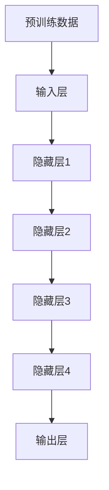
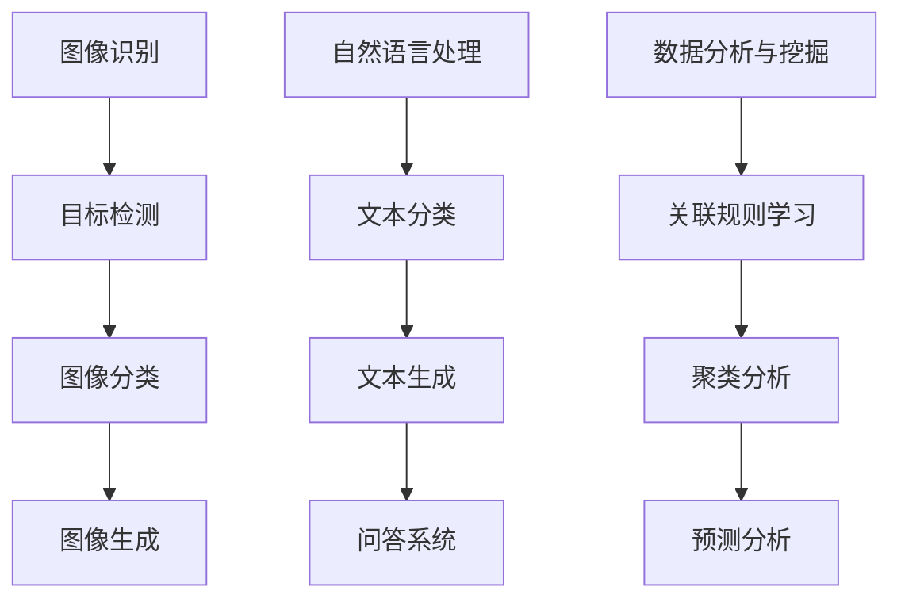

                 

### 《AI大模型创业：如何应对未来行业发展趋势？》

#### 关键词：
- AI大模型
- 创业策略
- 行业趋势
- 技术基础
- 融资策略
- 法律合规

#### 摘要：
本文旨在探讨AI大模型创业中的关键要素，包括基础知识和行业趋势、技术架构、创业策略、案例分析和风险管理。文章通过逐步分析，旨在为创业者提供清晰、实用的指导，以应对未来行业发展的挑战和机遇。

### 第一部分：AI大模型的基础知识与行业趋势

#### 第1章：AI大模型概述与创业机遇

##### 1.1 AI大模型的基本概念

**AI大模型**是指具备大规模参数和复杂结构的机器学习模型，如GPT、BERT等。这些模型在深度学习的基础上，通过大规模数据预训练，能够实现高度自动化的任务，例如自然语言理解、图像识别等。

**AI大模型的特点**：

- **参数量大**：具有数百万甚至数十亿个参数，这使得模型能够捕捉数据的复杂特征。
- **计算资源需求高**：训练和推理过程中需要大量的计算资源。
- **泛化能力强**：经过预训练后，模型能够在新任务上表现优异。

**AI大模型的发展历程**：

- **早期阶段**：以神经网络为基础，如多层感知机（MLP）和卷积神经网络（CNN）。
- **中期阶段**：引入深度学习，如AlexNet、VGG等。
- **近期阶段**：大规模预训练模型的出现，如GPT、BERT等。

##### 1.2 AI大模型的技术架构

**神经网络与深度学习基础**：

- **神经网络**：模拟人脑神经元连接的结构，通过前向传播和反向传播进行训练。
- **深度学习**：在神经网络基础上，增加隐藏层，使模型能够处理更复杂的数据。

**AI大模型的主要组成部分**：

- **输入层**：接收外部数据，如文本、图像等。
- **隐藏层**：进行特征提取和变换。
- **输出层**：生成预测结果，如分类标签、文本生成等。

**常用的深度学习框架**：

- **TensorFlow**：谷歌开发的深度学习框架，具有丰富的API和工具。
- **PyTorch**：Facebook开发的深度学习框架，具有灵活的动态图计算。
- **Keras**：基于Theano和TensorFlow的高层次API，简化模型构建和训练。

##### 1.3 AI大模型的应用领域

**图像识别与处理**：

- **目标检测**：识别图像中的对象并定位其位置，如YOLO、SSD等。
- **图像分类**：将图像分类到预定义的类别中，如VGG、ResNet等。

**自然语言处理**：

- **文本分类**：将文本分类到预定义的类别中，如TextCNN、BiLSTM等。
- **文本生成**：根据输入文本生成新的文本，如GPT、BERT等。

**数据分析与挖掘**：

- **关联规则学习**：发现数据中的关联性，如Apriori算法。
- **聚类分析**：将数据分成多个类簇，如K-means、DBSCAN等。

**AI大模型在创业中的机遇**：

- **技术创新**：AI大模型能够实现高度自动化和智能化的任务，为创业者提供新的解决方案。
- **市场潜力**：随着大数据和云计算的发展，AI大模型在各个行业都有广泛的应用场景。
- **投资风口**：AI大模型已经成为投资的热门领域，创业者有机会获得资本支持。

##### 1.4 创业者如何把握AI大模型行业趋势

**未来发展趋势分析**：

- **模型规模将继续扩大**：随着计算能力的提升，AI大模型将变得更加庞大和复杂。
- **应用领域将进一步拓展**：AI大模型将在医疗、金融、教育等更多领域得到应用。
- **跨界合作将成为趋势**：AI大模型将与更多传统行业结合，推动产业升级。

**创业者在行业中的定位**：

- **技术领先**：掌握AI大模型的核心技术，如深度学习、预训练模型等。
- **场景挖掘**：深入分析行业需求，发现AI大模型的应用场景。
- **市场拓展**：积极拓展市场，寻找合作伙伴，实现商业价值。

#### 第2章：AI大模型的技术基础

##### 2.1 深度学习基础

**神经网络结构**：

- **单层感知机（Perceptron）**：最简单的神经网络结构，用于二分类任务。
- **多层感知机（MLP）**：在单层感知机基础上增加隐藏层，用于复杂任务。
- **卷积神经网络（CNN）**：特别适用于图像处理任务，通过卷积层提取图像特征。
- **循环神经网络（RNN）**：特别适用于序列数据处理，通过循环结构捕捉序列信息。

**反向传播算法**：

- **基本原理**：通过反向传播误差信号，更新网络权重和偏置。
- **实现步骤**：
  1. **前向传播**：计算输入和权重的乘积，通过激活函数得到输出。
  2. **计算误差**：计算实际输出和期望输出的差异。
  3. **反向传播**：计算误差关于网络参数的梯度，更新网络参数。

**优化算法**：

- **随机梯度下降（SGD）**：通过随机抽样训练样本，计算梯度并更新参数。
- **批量梯度下降（BGD）**：对整个训练集计算梯度并更新参数。
- **动量优化**：在SGD基础上引入动量项，减缓梯度下降过程中的震荡。

##### 2.2 大规模预训练模型

**预训练的概念**：

- **预训练**：在特定任务之前，对模型进行大规模数据预训练，以提升模型泛化能力。
- **预训练目标**：通常采用无监督或自监督学习方式，从大量无标签数据中学习通用特征。

**自监督学习**：

- **基本原理**：在无标签数据中，通过设计合适的任务，使模型学习到有用的特征。
- **常见任务**：
  1. **填充任务**：输入部分文本，让模型预测缺失的部分。
  2. **掩码任务**：随机掩码部分输入，让模型预测掩码部分的内容。

**预训练与微调**：

- **预训练**：在大规模数据集上进行，通常使用无监督或自监督学习。
- **微调**：在预训练基础上，针对特定任务进行少量数据的有监督训练。

##### 2.3 迁移学习与微调

**迁移学习的基本原理**：

- **基本原理**：利用已有模型（源域）的知识，迁移到新任务（目标域）。
- **优势**：节省训练数据，提高模型泛化能力。

**迁移学习的方法**：

- **基于模型的方法**：直接使用源域模型，迁移到目标域。
- **基于特征的方法**：利用源域模型提取特征，在新域上进行分类。

**微调方法**：

- **微调参数**：在预训练模型的基础上，只微调部分参数。
- **权重共享**：在多个任务间共享部分权重，减少模型参数。

### 第二部分：AI大模型创业实战

#### 第3章：AI大模型创业策略

##### 3.1 创业者所需的技能和知识

**技术能力**：

- **深度学习知识**：了解深度学习的基本原理和常用算法。
- **编程能力**：熟练掌握Python等编程语言，熟悉TensorFlow或PyTorch等深度学习框架。
- **数据处理能力**：掌握数据清洗、数据分析和数据可视化等技能。

**商业敏锐度**：

- **市场洞察**：了解市场需求，分析行业趋势。
- **商业规划**：制定商业计划书，明确业务模式和盈利模式。
- **团队协作**：具备良好的沟通和团队协作能力。

##### 3.2 创业项目选择与评估

**项目选择策略**：

- **需求导向**：选择有明确市场需求的项目，避免盲目跟风。
- **技术创新**：选择具有技术优势和创新性的项目，提高竞争力。
- **资源匹配**：评估自身资源和能力，选择适合自己的项目。

**项目可行性评估**：

- **技术可行性**：评估项目所需技术是否成熟，是否有足够的研发能力。
- **市场可行性**：评估市场需求和市场规模，判断项目是否有盈利潜力。
- **财务可行性**：评估项目的资金需求和投资回报，确保项目可持续。

##### 3.3 团队建设与管理

**团队组建**：

- **核心团队**：组建由技术、市场、运营等核心成员组成的团队。
- **关键人才**：寻找具有专业技能和经验的关键人才，提升团队实力。

**团队管理方法**：

- **目标明确**：明确团队目标和任务，确保团队成员明确自己的职责。
- **激励制度**：建立激励机制，激发团队成员的积极性和创造力。
- **沟通协作**：建立良好的沟通机制，促进团队成员之间的协作。

### 第4章：AI大模型创业案例分析

#### 第4.1 成功案例分析

**案例介绍**：

- **公司名称**：DeepMind
- **业务领域**：人工智能研究与应用
- **成功原因**：
  1. **技术创新**：DeepMind在深度强化学习领域取得了重要突破，开发了AlphaGo等世界级AI模型。
  2. **市场定位**：DeepMind专注于解决复杂问题，如围棋、机器人等，具有广泛的应用前景。
  3. **人才优势**：DeepMind聚集了一批顶尖的AI研究人员，具备强大的研发能力。

#### 第4.2 失败案例分析

**案例介绍**：

- **公司名称**：AI创业公司X
- **业务领域**：AI图像识别与处理
- **失败原因**：

  1. **市场需求不足**：AI图像识别市场尚未完全成熟，市场需求有限。
  2. **技术瓶颈**：AI图像识别技术尚未完全突破，公司难以实现技术优势。
  3. **融资困难**：在技术尚未成熟和市场尚未成熟的情况下，公司难以获得足够的资本支持。

### 第5章：AI大模型创业融资策略

#### 第5.1 融资途径与策略

**融资途径**：

- **天使投资**：个人投资者提供资金支持，通常在项目早期阶段。
- **风险投资**：专业投资机构提供资金支持，通常在项目成长期和扩张期。

**融资策略**：

- **制定商业计划书**：详细阐述项目背景、市场需求、技术方案、团队组成、财务预测等，以吸引投资者。
- **路演与展示**：通过线上或线下路演，向投资者展示项目优势和潜力。
- **多元化融资**：结合多种融资途径，提高融资成功率。

#### 第5.2 融资材料准备与展示

**商业计划书**：

- **项目概述**：介绍项目背景、目标和发展规划。
- **市场需求**：分析市场需求、竞争态势和潜在客户。
- **技术方案**：阐述项目所采用的技术原理、技术路线和创新能力。
- **团队介绍**：介绍团队成员的背景、经验和专业知识。
- **财务预测**：预测项目未来的收入、成本和盈利情况。

**融资路演技巧**：

- **准备充分**：提前了解投资者的需求和兴趣点，准备好相关的数据和材料。
- **展示亮点**：突出项目的技术优势、市场前景和商业潜力。
- **应对质疑**：准备好回应投资者可能提出的质疑和问题。

### 第6章：AI大模型创业风险管理

#### 第6.1 风险识别与评估

**风险识别**：

- **技术风险**：如算法失效、数据泄露等。
- **市场风险**：如市场需求变化、竞争加剧等。
- **财务风险**：如资金链断裂、投资回报不确定等。

**风险评估**：

- **定性评估**：通过专家评估、访谈等方法，对风险进行定性分析。
- **定量评估**：通过数据分析和模型计算，对风险进行定量分析。

#### 第6.2 风险应对策略

**风险规避**：

- **避免风险**：不从事高风险业务，降低风险暴露。
- **转移风险**：通过保险、合同等方式，将风险转移给第三方。

**风险转移**：

- **风险分散**：通过多元化投资，降低单一风险的影响。
- **风险控制**：建立风险控制机制，及时发现和应对风险。

#### 第6.3 风险管理与监控

**风险管理流程**：

1. **风险识别**：识别项目中的潜在风险。
2. **风险评估**：对识别出的风险进行评估。
3. **风险应对**：制定应对策略，选择最佳方案。
4. **风险监控**：实时监控风险，确保应对措施的有效性。

**风险监控方法**：

- **定期评估**：定期对风险进行评估，及时发现和解决问题。
- **预警机制**：建立风险预警机制，提前发现潜在风险。
- **审计与检查**：定期进行审计和检查，确保风险管理流程的有效执行。

### 第7章：AI大模型创业的法律与合规

#### 第7.1 法律法规概述

**数据保护法规**：

- **通用数据保护条例（GDPR）**：欧盟制定的关于数据保护的法规，要求企业对个人数据的收集、处理和使用进行严格管理。
- **加州消费者隐私法（CCPA）**：美国加州制定的关于数据保护的法规，要求企业告知消费者其数据的收集和使用情况。

**知识产权保护**：

- **专利法**：保护发明和创新成果的法律法规。
- **著作权法**：保护文学、艺术和科学作品的原创性和独占权。

#### 第7.2 合规管理

**合规流程**：

1. **合规评估**：对业务活动进行合规性评估，识别合规风险。
2. **合规制定**：制定合规政策和程序，确保业务活动符合法律法规要求。
3. **合规培训**：对员工进行合规培训，提高合规意识和能力。
4. **合规执行**：执行合规政策和程序，确保业务活动合规。

**合规检查方法**：

- **内部审计**：定期进行内部审计，检查合规性。
- **第三方审核**：邀请第三方机构进行审核，确保合规性。

#### 第7.3 法律风险防范

**常见法律风险**：

- **数据泄露**：未经授权访问、泄露个人数据。
- **侵权行为**：侵犯他人的知识产权。
- **合同纠纷**：合同履行过程中发生纠纷。

**防范措施**：

- **加强数据保护**：实施数据加密、访问控制等技术措施，确保数据安全。
- **尊重知识产权**：在开发和应用过程中，尊重他人的知识产权。
- **完善合同管理**：制定完善的合同条款，明确各方权利和义务，避免纠纷。

### 附录

#### 附录A：AI大模型开发工具与资源

**深度学习框架简介**：

- **TensorFlow**：由谷歌开发，支持多种编程语言和操作，广泛应用于AI领域。
- **PyTorch**：由Facebook开发，具有动态计算图和灵活的API，适用于研究和开发。

**开发工具使用指南**：

- **Jupyter Notebook**：用于编写和运行Python代码，支持多种深度学习框架。
- **Google Colab**：基于Jupyter Notebook的在线平台，提供免费的GPU资源。

### 附录B：AI大模型相关术语与概念解释

**术语解释**：

- **深度学习**：一种机器学习方法，通过模拟人脑神经网络结构，对数据进行自动特征提取和分类。
- **预训练**：在特定任务之前，对模型进行大规模数据预训练，以提高其泛化能力。
- **迁移学习**：利用已有模型的知识，迁移到新任务，以提高新任务的性能。

**概念梳理**：

- **神经网络**：由多个神经元组成的网络结构，通过前向传播和反向传播进行训练。
- **大规模预训练模型**：通过大规模数据预训练，具有数百万个参数的模型，如GPT、BERT等。
- **迁移学习与微调**：利用已有模型的知识，在新任务上进行少量数据的有监督训练，以适应新任务。

### 结语

AI大模型创业充满机遇与挑战。创业者需要深入了解AI大模型的基础知识和技术架构，制定明确的创业策略，积极应对市场风险和技术挑战。通过成功案例和失败案例分析，我们可以汲取经验教训，提高创业成功率。同时，加强法律合规管理，保护数据和知识产权，确保企业可持续发展。让我们携手共进，共创AI大模型创业的辉煌未来！

### 作者

- **作者：AI天才研究院/AI Genius Institute & 禅与计算机程序设计艺术 /Zen And The Art of Computer Programming**
- **本文为作者原创作品，未经授权不得转载。**

### 许可协议

本文采用[Creative Commons Attribution-NonCommercial-NoDerivatives 4.0 International License](https://creativecommons.org/licenses/by-nc-nd/4.0/)许可协议。您可以自由地分享、展示和传播本文内容，但仅限于非商业用途，并且不得对内容进行修改和衍生。如果您希望进行商业用途，请与作者联系获得授权。感谢您的支持和理解！### 第一部分：AI大模型的基础知识与行业趋势

#### 第1章：AI大模型概述与创业机遇

AI大模型是当前人工智能领域的热点之一，它代表了深度学习和机器学习技术的最新进展。在这一章中，我们将深入探讨AI大模型的基本概念、技术架构、应用领域以及创业者在AI大模型行业中的机遇与挑战。

##### 1.1 AI大模型的基本概念

AI大模型，顾名思义，是指那些规模庞大的机器学习模型。它们通常包含数百万甚至数十亿个参数，能够对复杂数据进行高度自动化的分析和预测。这些模型通过深度学习算法进行训练，能够从大量数据中自动提取特征，从而实现诸如自然语言处理、图像识别、语音识别等任务。

**AI大模型的定义**：

AI大模型是指具备大规模参数和复杂结构的机器学习模型，如GPT、BERT等。这些模型在深度学习的基础上，通过大规模数据预训练，能够实现高度自动化的任务。

**AI大模型的特点**：

1. **参数量大**：具有数百万甚至数十亿个参数，这使得模型能够捕捉数据的复杂特征。
2. **计算资源需求高**：训练和推理过程中需要大量的计算资源。
3. **泛化能力强**：经过预训练后，模型能够在新任务上表现优异。

**AI大模型的发展历程**：

1. **早期阶段**：以神经网络为基础，如多层感知机（MLP）和卷积神经网络（CNN）。
2. **中期阶段**：引入深度学习，如AlexNet、VGG等。
3. **近期阶段**：大规模预训练模型的出现，如GPT、BERT等。

##### 1.2 AI大模型的技术架构

AI大模型的技术架构是理解其运作原理和实现方式的关键。以下是对AI大模型主要技术组件的详细解释：

**神经网络与深度学习基础**：

1. **神经网络**：神经网络是一种模仿人脑神经元连接的结构，通过前向传播和反向传播进行训练。每个神经元接收输入信号，通过权重加权后传递到下一个神经元，最终形成输出。
   
2. **深度学习**：在神经网络基础上，增加隐藏层，使模型能够处理更复杂的数据。深度学习通过层次化的特征提取，使模型能够从原始数据中自动学习到有用的特征表示。

**AI大模型的主要组成部分**：

1. **输入层**：接收外部数据，如文本、图像等。
2. **隐藏层**：进行特征提取和变换。
3. **输出层**：生成预测结果，如分类标签、文本生成等。

**常用的深度学习框架**：

1. **TensorFlow**：由谷歌开发，支持多种编程语言和操作，广泛应用于AI领域。
2. **PyTorch**：由Facebook开发，具有动态计算图和灵活的API，适用于研究和开发。
3. **Keras**：基于Theano和TensorFlow的高层次API，简化模型构建和训练。

**深度学习算法**：

1. **卷积神经网络（CNN）**：特别适用于图像处理任务，通过卷积层提取图像特征。
2. **循环神经网络（RNN）**：特别适用于序列数据处理，通过循环结构捕捉序列信息。
3. **生成对抗网络（GAN）**：通过生成器和判别器的对抗训练，实现高质量的数据生成。

**AI大模型的技术架构示意图**：



在这个示意图中，输入层接收外部数据，通过多个隐藏层进行特征提取和变换，最终在输出层生成预测结果。预训练数据用于初始化模型参数，提高模型的泛化能力。

##### 1.3 AI大模型的应用领域

AI大模型在多个领域展现了强大的应用潜力。以下是对AI大模型在不同应用领域的主要应用的概述：

**图像识别与处理**：

1. **目标检测**：识别图像中的对象并定位其位置，如YOLO、SSD等。
2. **图像分类**：将图像分类到预定义的类别中，如VGG、ResNet等。
3. **图像生成**：通过生成对抗网络（GAN）生成新的图像。

**自然语言处理**：

1. **文本分类**：将文本分类到预定义的类别中，如TextCNN、BiLSTM等。
2. **文本生成**：根据输入文本生成新的文本，如GPT、BERT等。
3. **问答系统**：通过对话生成和理解，为用户提供答案，如BERT、ALBERT等。

**数据分析与挖掘**：

1. **关联规则学习**：发现数据中的关联性，如Apriori算法。
2. **聚类分析**：将数据分成多个类簇，如K-means、DBSCAN等。
3. **预测分析**：通过时间序列分析和回归分析，预测未来的趋势，如LSTM、GRU等。

**AI大模型在创业中的应用**：

1. **医疗健康**：通过AI大模型对医学影像进行分析，辅助医生进行诊断和治疗。
2. **金融科技**：利用AI大模型进行风险评估、欺诈检测和智能投顾。
3. **教育**：通过自然语言处理技术，开发智能辅导系统，提供个性化教学。
4. **智能制造**：通过图像识别和自动化技术，提高生产效率和产品质量。

**AI大模型的应用场景示意图**：



在这个示意图中，AI大模型在不同领域中的应用通过不同的算法和模型实现，如目标检测、图像分类、文本分类、文本生成和问答系统等。

##### 1.4 创业者如何把握AI大模型行业趋势

**未来发展趋势分析**：

1. **模型规模将继续扩大**：随着计算能力的提升，AI大模型将变得更加庞大和复杂。
2. **应用领域将进一步拓展**：AI大模型将在医疗、金融、教育等更多领域得到应用。
3. **跨界合作将成为趋势**：AI大模型将与更多传统行业结合，推动产业升级。

**创业者在行业中的定位**：

1. **技术领先**：掌握AI大模型的核心技术，如深度学习、预训练模型等。
2. **场景挖掘**：深入分析行业需求，发现AI大模型的应用场景。
3. **市场拓展**：积极拓展市场，寻找合作伙伴，实现商业价值。

**创业者应关注的趋势**：

1. **模型压缩与加速**：为了应对计算资源的高需求，创业者应关注模型压缩和推理加速技术，以提高模型在资源受限环境下的性能。
2. **跨领域融合**：创业者应关注不同领域间的融合应用，如将AI大模型应用于智能制造、智慧城市等跨领域场景。
3. **可持续发展**：随着环保意识的增强，创业者应关注绿色AI模型的研究，减少AI模型对环境的影响。

#### 第2章：AI大模型的技术基础

##### 2.1 深度学习基础

深度学习是构建AI大模型的核心技术，它通过模拟人脑的神经网络结构，实现数据的自动特征提取和分类。在这一节中，我们将详细探讨深度学习的基本原理、神经网络结构以及常用的深度学习算法。

**深度学习的基本原理**：

深度学习是一种通过多层神经网络对数据进行自动特征提取和分类的方法。它的工作原理可以分为两个主要阶段：前向传播和反向传播。

1. **前向传播**：输入数据通过网络的各个层次，每个层次的神经元接收来自前一层的输出，并经过激活函数处理后传递到下一层。这个过程不断进行，直到最终输出层产生预测结果。
   
2. **反向传播**：根据预测结果和实际结果之间的误差，通过反向传播算法计算每个神经元的误差梯度，并更新神经元的权重和偏置，以达到最小化误差的目的。

**神经网络结构**：

神经网络是由多个神经元组成的层次结构，每个神经元接收输入信号，通过权重加权后传递到下一层神经元。常见的神经网络结构包括：

1. **单层感知机（Perceptron）**：最简单的神经网络结构，用于二分类任务。
2. **多层感知机（MLP）**：在单层感知机基础上增加隐藏层，用于复杂任务。
3. **卷积神经网络（CNN）**：特别适用于图像处理任务，通过卷积层提取图像特征。
4. **循环神经网络（RNN）**：特别适用于序列数据处理，通过循环结构捕捉序列信息。

**深度学习算法**：

深度学习算法通过不同的网络结构和优化方法，实现对不同类型数据的处理。以下是一些常用的深度学习算法：

1. **卷积神经网络（CNN）**：通过卷积层提取图像特征，常用于图像识别和图像处理任务。其核心组件包括卷积层、池化层和全连接层。
   
2. **循环神经网络（RNN）**：通过循环结构捕捉序列信息，常用于自然语言处理和语音识别任务。RNN包括简单的RNN、LSTM和GRU等变种。

3. **生成对抗网络（GAN）**：由生成器和判别器组成的对抗网络，用于数据生成和图像生成任务。GAN通过生成器和判别器的对抗训练，提高生成图像的质量。

4. **自编码器（Autoencoder）**：用于数据降维和特征提取，通过编码和解码器学习数据的低维表示。

**深度学习算法的伪代码**：

```python
# 前向传播伪代码
def forward_propagation(input_data, weights, biases):
    output = input_data
    for layer in range(num_layers - 1):
        output = activation_function(np.dot(output, weights[layer]) + biases[layer])
    return output

# 反向传播伪代码
def backward_propagation(output, expected_output, weights, biases, learning_rate):
    d_output = output - expected_output
    d_weights = [np.zeros_like(weights[layer]) for layer in range(num_layers - 1)]
    d_biases = [np.zeros_like(biases[layer]) for layer in range(num_layers - 1)]
    
    for layer in reversed(range(num_layers - 1)):
        d_weights[layer] = np.dot(d_output, activation_derivative(output[layer]))
        d_biases[layer] = d_output
        d_output = np.dot(d_weights[layer], weights[layer].T) + d_biases[layer]
        
    return d_weights, d_biases
```

在这个伪代码中，前向传播函数通过多层神经网络进行计算，并使用激活函数对输出进行非线性变换。反向传播函数通过计算误差梯度，更新网络权重和偏置，以最小化误差。

##### 2.2 大规模预训练模型

大规模预训练模型是AI大模型的核心组成部分，通过在大量无标签数据上进行预训练，模型能够获得强大的特征提取和泛化能力。在这一节中，我们将详细探讨大规模预训练模型的基本概念、预训练目标以及常见的预训练方法。

**大规模预训练模型的基本概念**：

大规模预训练模型是指那些通过大规模数据预训练，具有数百万甚至数十亿个参数的模型。预训练过程中，模型在大量无标签数据上学习到通用特征表示，这些特征表示可以在多个任务上实现优异的性能。

**预训练目标**：

预训练的目标是学习到一组通用的特征表示，这些特征表示能够适用于多种不同的任务。具体目标包括：

1. **特征表示**：学习到具有高信息量和高区分度的特征表示，使模型能够捕捉数据的复杂特征。
2. **泛化能力**：提高模型在不同任务上的泛化能力，使其能够在未见过的数据上表现良好。
3. **自适应能力**：通过微调，使模型能够快速适应特定任务的需求。

**常见的预训练方法**：

1. **自监督学习**：在无标签数据上设计合适的任务，使模型自动学习到有用的特征。常见的自监督学习任务包括填充任务、掩码任务等。
2. **无监督预训练**：在无标签数据上进行预训练，不依赖于特定任务的目标。无监督预训练方法包括主成分分析（PCA）、自编码器等。
3. **迁移学习**：利用已有模型的知识，在新任务上进行少量数据的有监督训练。迁移学习通过预训练模型初始化，提高新任务的性能。

**预训练过程**：

预训练过程通常分为两个阶段：预训练和微调。

1. **预训练**：在大量无标签数据上进行预训练，模型学习到通用特征表示。预训练过程中，模型通过自我监督或无监督学习方式，自动学习特征表示。
   
2. **微调**：在预训练模型的基础上，针对特定任务进行少量数据的有监督训练。微调过程通过调整模型参数，使模型适应特定任务的需求。

**大规模预训练模型示例**：

以BERT（Bidirectional Encoder Representations from Transformers）为例，BERT是一种大规模预训练模型，通过在大量文本数据上进行双向编码，学习到文本的深层语义表示。

**BERT的预训练过程**：

1. **Masked Language Model（MLM）**：在输入文本中随机掩码一些单词，模型的目标是预测这些掩码的单词。通过这种自监督学习方式，模型学习到文本的上下文信息。

2. **Next Sentence Prediction（NSP）**：给定两个连续的句子，模型的目标是预测第二个句子是否是第一个句子的后续句子。通过这种任务，模型学习到句子间的逻辑关系。

**BERT的微调过程**：

在预训练模型的基础上，针对特定任务进行微调。例如，在文本分类任务中，将BERT的输出与预定的标签进行对比，通过反向传播和梯度下降算法，调整模型参数。

##### 2.3 迁移学习与微调

迁移学习是利用已有模型的知识，在新任务上进行少量数据的有监督训练，以提高新任务的性能。微调是迁移学习的一种方法，通过在预训练模型的基础上调整部分参数，使其适应特定任务。

**迁移学习的基本原理**：

迁移学习的基本原理是，将一个任务在源域上学习到的知识，迁移到新任务的目标域上。迁移学习通过利用预训练模型初始化新任务，减少训练数据的需求，提高模型在新任务上的性能。

**迁移学习的优势**：

1. **减少训练数据需求**：在新任务上，通常只有有限的数据，通过迁移学习，可以减少对大规模训练数据的需求。
2. **提高模型性能**：利用预训练模型的知识，在新任务上实现更高的性能。
3. **缩短训练时间**：通过迁移学习，可以减少新任务的训练时间。

**迁移学习的方法**：

1. **基于模型的方法**：直接使用源域模型，在新域上进行推理或微调。这种方法适用于任务相似度较高的情况。

2. **基于特征的方法**：利用源域模型提取特征，在新域上进行分类或回归。这种方法适用于源域和目标域的任务不同，但特征表示相似的情况。

**微调的方法**：

1. **全微调（Full Fine-tuning）**：在预训练模型的基础上，对整个模型进行调整。这种方法适用于任务相似度较高的情况，可以同时优化模型的结构和参数。

2. **部分微调（Partial Fine-tuning）**：仅对预训练模型的某些部分进行调整，通常用于源域和目标域任务差异较大的情况。这种方法适用于优化模型特定部分，如分类器。

**迁移学习与微调的比较**：

- **迁移学习**：利用已有模型的知识，在新任务上进行少量数据的有监督训练。
- **微调**：在迁移学习的基础上，进一步调整模型参数，以适应特定任务。

- **区别**：迁移学习关注模型整体的知识迁移，而微调关注模型特定部分的参数调整。

**迁移学习与微调的伪代码**：

```python
# 迁移学习伪代码
def transfer_learning(source_model, target_data, target_labels):
    # 加载源域模型
    model = copy.deepcopy(source_model)
    
    # 在目标数据上进行训练
    model.fit(target_data, target_labels, epochs=num_epochs, batch_size=batch_size)
    
    return model

# 微调伪代码
def fine_tuning(pretrained_model, target_data, target_labels):
    # 加载预训练模型
    model = copy.deepcopy(pretrained_model)
    
    # 冻结预训练模型的某些层
    for layer in model.layers[:-num_fine_tune_layers]:
        layer.trainable = False
        
    # 在目标数据上进行微调
    model.fit(target_data, target_labels, epochs=num_epochs, batch_size=batch_size)
    
    return model
```

在这个伪代码中，迁移学习函数通过加载源域模型，在目标数据上进行训练。微调函数通过加载预训练模型，冻结部分层，并在目标数据上进行微调。这些方法可以帮助我们在新任务上快速提升模型性能。

### 总结

本章详细介绍了AI大模型的基本概念、技术架构、应用领域以及创业者在AI大模型行业中的机遇与挑战。我们探讨了深度学习的基本原理、神经网络结构、大规模预训练模型和迁移学习与微调方法。通过这些内容，创业者可以更好地理解和利用AI大模型技术，把握行业发展趋势，实现创业目标。在接下来的章节中，我们将进一步探讨AI大模型创业的实战策略、案例分析和风险管理，帮助创业者应对实际创业中的挑战。让我们继续深入探索AI大模型创业的奥秘！

### 第一部分：AI大模型的基础知识与行业趋势

#### 第3章：AI大模型创业策略

在探讨了AI大模型的基本概念和技术基础之后，本章将重点关注创业者在AI大模型领域的策略。创业成功不仅依赖于技术创新，还需要周密的策略规划和有效的执行。以下是AI大模型创业策略的详细探讨。

##### 3.1 创业者所需的技能和知识

AI大模型创业的成功离不开创业者所具备的技能和知识。以下是创业者需要掌握的关键能力：

**技术能力**：

1. **深度学习知识**：创业者应深入了解深度学习的基本原理和算法，如神经网络结构、反向传播算法等。
2. **编程能力**：熟练掌握Python等编程语言，熟悉TensorFlow或PyTorch等深度学习框架，能够编写高效的代码。
3. **数据处理能力**：掌握数据清洗、数据分析和数据可视化等技能，能够处理和分析大规模数据。

**商业敏锐度**：

1. **市场洞察**：创业者需要具备敏锐的市场嗅觉，了解市场需求和行业动态，发现AI大模型的应用场景。
2. **商业规划**：制定商业计划书，明确业务模式、盈利模式、市场推广策略等，确保创业项目具有可行性。
3. **团队协作**：具备良好的沟通和团队协作能力，能够吸引并管理核心团队成员，形成高效的创业团队。

##### 3.2 创业项目选择与评估

选择合适的创业项目是创业成功的关键。以下是创业者在选择和评估项目时需要考虑的因素：

**项目选择策略**：

1. **需求导向**：选择有明确市场需求的项目，避免盲目跟风。创业者应关注实际需求，寻找尚未被满足的市场空缺。
2. **技术创新**：选择具有技术创新性的项目，能够在技术层面上具有竞争优势。创业者应关注行业前沿技术，确保项目具有技术领先性。
3. **资源匹配**：评估自身资源和能力，选择适合自己的项目。创业者应根据自身的技术背景、资金实力和市场资源，选择合适的项目规模。

**项目可行性评估**：

1. **技术可行性**：评估项目所需技术是否成熟，是否有足够的研发能力。创业者应了解现有技术的局限性，评估项目是否能够在现有技术基础上实现。
2. **市场可行性**：评估市场需求和市场规模，判断项目是否有盈利潜力。创业者应通过市场调研，了解目标用户的需求和支付意愿。
3. **财务可行性**：评估项目的资金需求和投资回报，确保项目可持续。创业者应制定详细的财务预测，包括收入、成本和利润等。

**项目评估示例**：

假设创业者计划开发一款基于AI大模型的智能医疗诊断系统，以下是对该项目的评估：

- **技术可行性**：智能医疗诊断系统涉及图像识别和自然语言处理等技术，这些技术在医疗领域已有较多应用，但仍然需要进一步的研发和优化。
- **市场可行性**：医疗诊断市场庞大，但随着AI技术的发展，市场竞争也日益激烈。创业者需要进行详细的市场调研，了解目标用户的需求和竞争对手的情况。
- **财务可行性**：项目需要一定的资金投入，包括研发成本、市场推广费用等。创业者应制定详细的财务计划，确保项目能够实现盈利。

**项目可行性评估表格**：

| 项目评估指标 | 评估结果 | 说明 |
| ------------ | -------- | ---- |
| 技术可行性 | 中等     | 需要进一步研发和优化 |
| 市场可行性 | 中等     | 市场竞争激烈，但需求稳定 |
| 财务可行性 | 中等     | 资金需求较大，但预期回报较高 |

**结论**：基于上述评估，该项目具有一定的可行性，但需要进一步优化技术方案，进行市场调研和财务规划。

##### 3.3 团队建设与管理

一个高效的团队是创业成功的关键。以下是创业者如何建设和管理团队的建议：

**团队组建**：

1. **核心团队**：组建由技术、市场、运营等核心成员组成的团队。核心团队应具备互补的能力，能够共同推动项目进展。
2. **关键人才**：寻找具有专业技能和经验的关键人才，如资深研发人员、市场推广专家等。关键人才是团队的核心力量，能够提高项目的成功概率。
3. **团队成员**：团队成员应具备创业精神，愿意为共同目标而努力。创业者应注重团队成员的协作和沟通，建立良好的团队氛围。

**团队管理方法**：

1. **目标明确**：明确团队目标和任务，确保团队成员明确自己的职责和目标。目标明确有助于提高团队的凝聚力和执行力。
2. **激励制度**：建立激励机制，激发团队成员的积极性和创造力。激励制度可以包括奖金、股权激励等，以吸引和留住关键人才。
3. **沟通协作**：建立良好的沟通机制，促进团队成员之间的协作。创业者应定期召开团队会议，分享项目进展和挑战，讨论解决方案。
4. **培训与发展**：为团队成员提供培训和发展机会，提升团队整体能力。培训可以包括技术培训、管理培训等，以适应不断变化的市场需求。

**团队管理案例**：

某AI大模型创业公司通过以下方式建设和管理团队：

1. **目标明确**：公司明确研发团队的目标是开发出高效的AI大模型，市场团队的目标是拓展市场份额，运营团队的目标是提高用户满意度。
2. **激励制度**：公司为技术研发人员设立了奖金制度，根据项目进度和绩效进行奖励。市场团队和运营团队也有类似的激励机制。
3. **沟通协作**：公司定期召开团队会议，讨论项目进展和挑战，分享最佳实践和经验。公司还建立了一个内部协作平台，方便团队成员之间的沟通和协作。
4. **培训与发展**：公司为团队成员提供了多种培训机会，包括技术培训、管理培训等。公司还鼓励团队成员参加行业会议和研讨会，以拓宽视野和提升能力。

通过这些措施，该公司成功地组建了一个高效、协作的团队，推动了项目的快速发展和市场拓展。

##### 3.4 创业策略总结

AI大模型创业需要创业者具备丰富的技能和知识，选择合适的创业项目，并建立高效的管理团队。以下是创业策略的总结：

1. **技能和知识**：创业者应具备深度学习、编程和数据处理的技能，以及市场洞察和商业规划的能力。
2. **项目选择**：选择具有市场需求、技术创新和资源匹配的创业项目，进行详细的技术、市场和财务可行性评估。
3. **团队建设**：组建由核心团队和关键人才组成的团队，明确目标、建立激励机制、促进沟通协作，并提供培训和发展机会。

通过这些策略，创业者可以更好地应对AI大模型创业的挑战，实现创业目标。

### 第4章：AI大模型创业实战

#### 第4.1 成功案例分析

在AI大模型创业领域，有许多成功的案例展示了如何通过技术创新和良好的商业策略实现创业成功。以下是一个成功的AI大模型创业案例分析。

**公司名称**：DeepMind

**业务领域**：人工智能研究与应用

**成功原因**：

1. **技术创新**：DeepMind在深度强化学习领域取得了重要突破，开发了AlphaGo等世界级AI模型。AlphaGo通过自我对弈不断进化，最终在围棋比赛中战胜了世界冠军。这一突破展示了AI大模型的强大潜力和应用价值。
   
2. **市场定位**：DeepMind专注于解决复杂问题，如围棋、机器人等。这些领域具有高度的技术挑战和市场前景，DeepMind通过技术领先和市场定位，成功吸引了大量的关注和投资。

3. **人才优势**：DeepMind聚集了一批顶尖的AI研究人员，包括DeepMind联合创始人戴密斯·哈萨比斯（Demis Hassabis）等。这些研究人员在深度学习、强化学习等领域有丰富的经验，为DeepMind的技术创新提供了坚实的基础。

4. **跨界合作**：DeepMind与多个行业巨头建立了合作关系，如谷歌、三星等。这些合作不仅为DeepMind提供了资源和市场，还促进了AI技术的跨领域应用和发展。

5. **持续研发**：DeepMind始终保持对AI技术的持续投入和研发，通过不断迭代和改进，提升了AI模型的性能和应用范围。

**成功经验总结**：

- **技术创新**：掌握核心技术，不断推动技术进步。
- **市场定位**：聚焦有潜力、有挑战的领域，通过技术领先抢占市场先机。
- **人才优势**：吸引和培养顶尖人才，形成技术优势。
- **跨界合作**：与行业巨头合作，拓展市场和应用领域。
- **持续研发**：保持研发投入，持续提升产品竞争力。

#### 第4.2 失败案例分析

尽管AI大模型创业领域有许多成功的案例，但也存在不少失败的案例。以下是一个失败的AI大模型创业案例分析。

**公司名称**：AI创业公司X

**业务领域**：AI图像识别与处理

**失败原因**：

1. **市场需求不足**：AI图像识别市场尚未完全成熟，市场需求有限。公司未能准确预测市场发展的趋势，导致产品难以获得广泛的市场认可。

2. **技术瓶颈**：AI图像识别技术尚未完全突破，公司难以实现技术优势。在技术竞争激烈的市场中，公司无法与拥有强大技术实力的竞争对手抗衡。

3. **融资困难**：在技术尚未成熟和市场尚未成熟的情况下，公司难以获得足够的资本支持。公司未能有效地进行融资，导致资金链紧张，最终导致业务无法持续。

4. **团队问题**：公司团队缺乏技术和管理经验，导致项目进展缓慢，内部管理混乱。团队成员之间的沟通和协作不足，影响了项目的推进和效果。

**失败经验总结**：

- **市场需求分析不足**：未能准确预测市场发展趋势，导致产品难以满足市场需求。
- **技术实力不足**：在技术竞争激烈的市场中，公司缺乏技术优势，难以与竞争对手抗衡。
- **融资策略不当**：未能有效进行融资，导致资金链紧张，业务难以持续。
- **团队管理问题**：团队缺乏技术和管理经验，内部管理混乱，影响项目进展。

#### 第4.3 成功与失败的对比

通过对比成功与失败的案例，我们可以发现以下关键因素：

- **技术创新**：成功案例在技术创新方面取得了显著突破，而失败案例在技术实力上存在明显不足。
- **市场定位**：成功案例能够准确把握市场趋势，聚焦有潜力的领域，而失败案例未能准确预测市场需求，导致市场定位不准确。
- **团队建设**：成功案例拥有顶尖的团队和良好的管理结构，而失败案例团队缺乏技术和管理经验，内部管理混乱。
- **融资策略**：成功案例能够有效进行融资，获得足够的资金支持，而失败案例在融资策略上存在不足，导致资金链紧张。

这些对比有助于创业者从成功和失败案例中学习经验教训，制定更有效的创业策略。

### 第5章：AI大模型创业融资策略

#### 第5.1 融资途径与策略

融资是AI大模型创业过程中的重要环节，它直接关系到项目的持续发展和市场拓展。以下是AI大模型创业常见的融资途径和策略。

**融资途径**：

1. **天使投资**：天使投资是个人投资者对创业项目进行早期资金支持的一种形式。天使投资通常在项目初期，提供资金、资源和人脉支持，帮助创业者快速启动项目。

2. **风险投资**：风险投资是专业投资机构对具有高成长潜力的创业项目进行投资。风险投资通常在项目的中期和后期，提供资金支持，帮助企业进行研发和市场推广。

3. **政府资金**：政府资金是通过各类创业基金、科研基金等渠道提供的资金支持。政府资金通常对特定的行业或项目有特定的要求，适用于有明确政策支持的领域。

4. **银行贷款**：银行贷款是企业通过银行获取资金的一种方式。银行贷款通常需要企业提供担保或抵押，适用于有稳定收入和良好信誉的企业。

5. **股权融资**：股权融资是企业通过出让部分股权换取投资资金的一种方式。股权融资通常适用于需要大量资金投入且需要长期合作的项目。

**融资策略**：

1. **制定商业计划书**：商业计划书是创业者向投资者展示项目可行性和商业潜力的关键文档。商业计划书应详细阐述项目的背景、市场分析、技术方案、团队介绍、财务预测等内容。

2. **寻找合适的投资者**：创业者应根据项目的特点和需求，寻找合适的投资者。天使投资者适合早期项目，风险投资适合成长期项目，政府资金适合有政策支持的项目。

3. **准备融资材料**：融资材料包括商业计划书、财务预测、市场调研报告、技术文档等。创业者应确保融资材料的真实性和完整性，以增加投资者的信任度。

4. **融资路演**：融资路演是创业者向潜在投资者展示项目优势和潜力的过程。创业者应在路演中清晰地传达项目的核心价值、市场前景和财务预测，以吸引投资者的关注。

5. **谈判与签约**：在融资过程中，创业者应与投资者进行充分谈判，确保双方的利益达成一致。签约环节应注意合同条款的细节，避免后续纠纷。

**融资案例**：

某AI大模型创业公司通过以下方式成功融资：

1. **制定商业计划书**：公司详细阐述了AI大模型在医疗诊断领域的应用前景，包括市场需求、技术优势、团队介绍等。

2. **寻找风险投资**：公司通过参加创业大赛和行业会议，结识了多家风险投资机构，并进行了多轮谈判。

3. **准备融资材料**：公司准备了详尽的财务预测、市场调研报告、技术文档等，展示了项目的可行性和市场潜力。

4. **融资路演**：公司邀请了多家风险投资机构的代表参加融资路演，通过展示项目的核心技术、市场前景和财务预测，成功吸引了投资机构的兴趣。

5. **谈判与签约**：公司通过多轮谈判，与风险投资机构达成一致，签订了融资合同，获得了数百万美元的投资。

**融资经验总结**：

- **制定详尽的商业计划书**：商业计划书是投资者决策的重要依据，应详细阐述项目的核心价值、市场前景和财务预测。
- **寻找合适的投资者**：根据项目特点和需求，选择合适的投资者，提高融资成功率。
- **准备充分的融资材料**：确保融资材料的真实性和完整性，增加投资者的信任度。
- **有效进行融资路演**：通过清晰传达项目的核心价值和市场前景，吸引投资者的关注。
- **谈判与签约**：在融资过程中，注意合同条款的细节，确保双方的利益达成一致。

### 第5.2 融资材料准备与展示

融资材料是创业者向投资者展示项目可行性和商业潜力的关键文档，其准备和展示的质量直接影响融资的成功与否。以下是关于融资材料准备和展示的详细说明。

**商业计划书**：

商业计划书是融资过程中最重要的文档之一，它应包括以下内容：

1. **项目概述**：简要介绍项目的背景、目标和主要业务模式。
2. **市场分析**：分析市场需求、市场规模、竞争态势和潜在客户。
3. **技术方案**：详细阐述项目的核心技术、技术路线和创新能力。
4. **团队介绍**：介绍团队成员的背景、经验和专业知识。
5. **财务预测**：预测项目的未来收入、成本和盈利情况。
6. **融资计划**：明确融资用途、融资额度、融资期限和回报方式。

**商业计划书示例**：

以下是一个简化的商业计划书结构示例：

```
一、项目概述
- 项目背景
- 项目目标
- 业务模式

二、市场分析
- 市场需求
- 市场规模
- 竞争态势
- 潜在客户

三、技术方案
- 技术原理
- 技术路线
- 创新点

四、团队介绍
- 团队成员
- 专业技能
- 经验背景

五、财务预测
- 未来收入预测
- 成本预算
- 盈利预测

六、融资计划
- 融资金额
- 融资用途
- 融资期限
- 报酬方式
```

**市场调研报告**：

市场调研报告是商业计划书的重要组成部分，它应包括以下内容：

1. **市场现状**：分析当前市场的规模、增长趋势和主要参与者。
2. **市场需求**：识别目标市场的需求，分析客户的需求特点和购买动机。
3. **竞争分析**：分析竞争对手的产品、市场份额和竞争优势。
4. **市场机会**：识别市场机会，分析项目在市场中的优势和潜力。

**市场调研报告示例**：

以下是一个简化的市场调研报告结构示例：

```
一、市场现状
- 市场规模
- 增长趋势
- 主要参与者

二、市场需求
- 需求特点
- 购买动机
- 潜在客户

三、竞争分析
- 竞争对手
- 市场份额
- 竞争优势

四、市场机会
- 市场需求变化
- 新兴市场
- 技术进步带来的机会
```

**技术文档**：

技术文档是展示项目技术方案和研发进展的关键文档，它应包括以下内容：

1. **技术原理**：详细阐述项目所采用的核心技术，包括原理、算法和实现方法。
2. **研发进展**：介绍项目的研发过程，包括已完成的研发任务和尚未解决的问题。
3. **技术优势**：分析项目技术的独特性和竞争优势。
4. **未来研发计划**：介绍未来研发的方向和计划，包括预期实现的里程碑和目标。

**技术文档示例**：

以下是一个简化的技术文档结构示例：

```
一、技术原理
- 基本概念
- 算法原理
- 实现方法

二、研发进展
- 已完成任务
- 存在问题
- 解决方案

三、技术优势
- 独特性
- 竞争优势
- 应用场景

四、未来研发计划
- 研发方向
- 预期里程碑
- 目标实现
```

**融资路演技巧**：

融资路演是创业者向潜在投资者展示项目优势和商业潜力的关键环节，以下是一些融资路演的技巧：

1. **准备充分**：在路演前，创业者应充分准备，包括了解投资者的需求和兴趣点，准备相关的数据和材料。

2. **展示亮点**：在路演中，创业者应突出项目的核心技术、市场前景和商业潜力，展示项目的独特性和竞争优势。

3. **应对质疑**：创业者应准备好回应投资者可能提出的质疑和问题，展示项目的稳健性和可行性。

4. **互动交流**：在路演过程中，创业者应与投资者保持互动交流，了解投资者的意见和建议，及时调整项目计划和策略。

5. **后续跟进**：在路演结束后，创业者应及时与投资者进行后续跟进，包括提供额外的信息和材料，解答投资者的问题。

**融资成功案例**：

某AI大模型创业公司在融资路演中取得了成功，以下是该公司融资成功的经验：

1. **充分准备**：公司详细准备了商业计划书、市场调研报告、技术文档等材料，展示了项目的全面性和可行性。

2. **展示亮点**：公司在路演中突出了其AI大模型在医疗诊断领域的应用潜力，展示了项目的技术优势和市场前景。

3. **应对质疑**：公司针对投资者提出的质疑，如技术风险、市场竞争等，进行了详细解答，展示了项目的稳健性和可行性。

4. **互动交流**：公司积极与投资者进行互动交流，了解了投资者的需求和关注点，并根据反馈调整了项目计划和策略。

5. **后续跟进**：公司及时与投资者进行了后续跟进，提供了额外的信息和材料，展示了公司的专业性和诚信度。

**融资经验总结**：

- **充分准备**：准备详细的融资材料，展示项目的全面性和可行性。
- **展示亮点**：突出项目的核心技术、市场前景和商业潜力。
- **应对质疑**：详细解答投资者的质疑，展示项目的稳健性和可行性。
- **互动交流**：与投资者保持互动交流，了解需求和反馈，调整项目计划和策略。
- **后续跟进**：及时与投资者进行后续跟进，提供额外的信息和材料，展示公司的专业性和诚信度。

通过以上融资策略和技巧，创业者可以增加融资成功率，为AI大模型创业项目的持续发展和市场拓展提供坚实的资金支持。

### 第6章：AI大模型创业风险管理

在AI大模型创业过程中，风险管理是确保项目顺利进行和业务持续发展的重要环节。有效的风险管理能够帮助创业者识别、评估和应对潜在风险，从而降低创业失败的概率。以下是关于AI大模型创业风险管理的详细探讨。

#### 6.1 风险识别与评估

**风险识别**：

风险识别是风险管理的第一步，旨在识别项目可能面临的各种风险。以下是AI大模型创业中常见的风险类型：

1. **技术风险**：包括算法失效、模型错误、数据处理问题等。技术风险可能导致项目无法按预期实现，甚至导致项目失败。
2. **市场风险**：包括市场需求不足、竞争加剧、市场波动等。市场风险可能影响项目的市场推广和销售，导致项目收益下降。
3. **财务风险**：包括资金不足、成本超支、投资回报不确定等。财务风险可能影响项目的资金链，导致项目无法持续。
4. **法律风险**：包括数据保护法规、知识产权保护、合同纠纷等。法律风险可能导致公司面临法律诉讼和处罚。
5. **运营风险**：包括团队管理问题、供应链风险、业务连续性等。运营风险可能影响项目的正常运营，导致项目延误或失败。

**风险评估**：

风险评估是对识别出的风险进行定量和定性的分析，以确定风险的重要性和影响。以下是常用的风险评估方法：

1. **定性评估**：通过专家评估、访谈等方法，对风险的发生概率和影响程度进行定性分析。定性评估有助于初步识别和评估风险。
   
2. **定量评估**：通过数据分析和模型计算，对风险的发生概率和影响程度进行定量分析。定量评估能够提供更精确的风险评估结果。

**风险评估示例**：

假设AI大模型创业项目面临以下风险：

1. **技术风险**：算法失效，可能导致模型预测错误。
2. **市场风险**：市场需求不足，可能导致产品销售困难。

**定性评估**：

- **技术风险**：发生概率为70%，影响程度为中等。
- **市场风险**：发生概率为50%，影响程度为高。

**定量评估**：

- **技术风险**：发生概率为70%，影响程度为50%，总风险得分为35（70% * 50%）。
- **市场风险**：发生概率为50%，影响程度为80%，总风险得分为40（50% * 80%）。

**结论**：根据定量评估结果，市场风险的总风险得分高于技术风险，是项目面临的主要风险。

#### 6.2 风险应对策略

**风险规避**：

风险规避是通过避免风险发生来降低风险的一种策略。以下是AI大模型创业中的风险规避措施：

1. **避免技术风险**：通过严格的测试和验证，确保算法的有效性和可靠性。
2. **避免市场风险**：通过市场调研和需求分析，选择有明确市场需求的产品。

**风险转移**：

风险转移是将风险转移给第三方，以降低项目风险的一种策略。以下是AI大模型创业中的风险转移措施：

1. **技术风险转移**：通过购买技术保险，将技术风险转移给保险公司。
2. **市场风险转移**：通过签订销售合同，将市场风险转移给客户。

**风险分散**：

风险分散是通过将风险分散到多个渠道或多个项目，以降低单一风险的影响。以下是AI大模型创业中的风险分散措施：

1. **技术风险分散**：开发多样化的AI产品，覆盖不同的应用领域。
2. **市场风险分散**：开拓多个市场渠道，减少单一市场波动的影响。

**风险控制**：

风险控制是通过采取预防措施和管理措施，降低风险的发生概率和影响程度。以下是AI大模型创业中的风险控制措施：

1. **技术风险控制**：建立完善的技术管理体系，包括代码审查、测试和质量控制。
2. **市场风险控制**：定期进行市场调研，调整产品策略和推广计划。

#### 6.3 风险管理与监控

**风险管理流程**：

1. **风险识别**：通过访谈、调研等方法，识别项目中的潜在风险。
2. **风险评估**：对识别出的风险进行定性或定量评估，确定风险的重要性和影响程度。
3. **风险应对**：根据风险评估结果，制定风险应对策略，包括风险规避、转移、分散和控制。
4. **风险监控**：实时监控风险，确保应对措施的有效性，及时调整和优化风险管理策略。

**风险监控方法**：

1. **定期评估**：定期对项目风险进行评估，及时发现和解决问题。
2. **预警机制**：建立风险预警机制，提前发现潜在风险，采取预防措施。
3. **审计与检查**：定期进行审计和检查，确保风险管理流程的有效执行。

**风险监控工具**：

1. **风险管理软件**：使用专门的风险管理软件，如Risk Management Studio等，进行风险识别、评估和监控。
2. **数据分析工具**：使用数据分析工具，如Excel、Tableau等，进行风险评估和数据分析。
3. **监控仪表板**：建立监控仪表板，实时展示项目风险指标和风险状态，方便风险监控和管理。

**案例**：

某AI大模型创业公司通过以下方式进行风险管理和监控：

1. **风险识别**：公司通过定期召开风险管理会议，识别项目中的潜在风险，如技术风险、市场风险和财务风险。
2. **风险评估**：公司对识别出的风险进行定量评估，确定风险的重要性和影响程度，建立风险档案。
3. **风险应对**：公司根据风险评估结果，制定风险应对策略，如购买技术保险、调整市场策略和优化财务管理。
4. **风险监控**：公司建立实时监控系统，通过定期报告和风险预警机制，实时监控项目风险，确保应对措施的有效性。

**风险管理经验总结**：

- **风险识别**：定期召开风险管理会议，识别项目中的潜在风险。
- **风险评估**：对识别出的风险进行定量评估，确定风险的重要性和影响程度。
- **风险应对**：根据风险评估结果，制定风险应对策略，包括风险规避、转移、分散和控制。
- **风险监控**：建立实时监控系统，通过定期报告和风险预警机制，实时监控项目风险。

通过有效的风险管理和监控，创业者可以更好地应对AI大模型创业中的各种风险，确保项目的顺利进行和业务的可持续发展。

### 第7章：AI大模型创业的法律与合规

#### 7.1 法律法规概述

在AI大模型创业过程中，遵守相关法律法规是确保项目顺利推进和长期发展的关键。以下是对数据保护法规和知识产权保护相关法律法规的概述。

**数据保护法规**：

随着人工智能技术的发展，数据保护变得越来越重要。以下是一些重要的数据保护法规：

1. **通用数据保护条例（GDPR）**：GDPR是欧盟制定的关于数据保护的法规，对个人数据的收集、处理和使用进行了严格规定。GDPR要求企业对个人数据的收集和使用进行合法、公正、透明的处理，并确保数据的安全性和隐私性。

2. **加州消费者隐私法（CCPA）**：CCPA是美国加州制定的关于数据保护的法规，要求企业告知消费者其数据的收集和使用情况，并赋予消费者对自身数据的访问权、删除权和拒绝权。

3. **中国个人信息保护法（PIPL）**：PIPL是中国制定的关于个人信息保护的法规，对个人信息的收集、处理、存储、使用、传输和销毁进行了规定。PIPL要求企业在处理个人信息时，遵循合法性、正当性和必要性的原则，并采取必要的技术和管理措施，保护个人信息的安全。

**知识产权保护**：

知识产权保护是AI大模型创业中的重要一环，以下是一些关键的知识产权法律法规：

1. **专利法**：专利法保护发明和创新成果，包括发明专利、实用新型专利和外观设计专利。AI大模型创业企业可以通过申请专利，保护其创新技术，避免竞争对手的抄袭和侵权行为。

2. **著作权法**：著作权法保护文学、艺术和科学作品的原创性和独占权。AI大模型创业企业可以通过著作权法，保护其开发的软件、算法和相关文档。

3. **商标法**：商标法保护企业的商标，包括品牌名称、标志、标识等。AI大模型创业企业可以通过注册商标，建立品牌形象，防止竞争对手的混淆和侵权。

#### 7.2 合规管理

合规管理是指企业在遵守法律法规和行业标准的过程中，建立、实施和保持合规体系和程序，以确保企业运营的合法性和合规性。以下是对合规管理流程、合规检查方法和合规性评估的详细说明。

**合规管理流程**：

1. **合规评估**：对企业的业务活动进行合规性评估，识别潜在的法律和合规风险。合规评估通常包括法律研究、政策审查、流程分析等。

2. **合规制定**：根据合规评估的结果，制定合规政策和程序，以确保企业运营符合法律法规和行业标准。合规政策和程序应明确企业的合规目标和合规要求。

3. **合规培训**：对员工进行合规培训，提高员工的合规意识和能力。合规培训应包括法律法规解读、合规流程和合规操作等。

4. **合规执行**：执行合规政策和程序，确保企业的业务活动符合法律法规和行业标准。合规执行应包括合规检查、合规报告和合规改进等。

5. **合规监控**：建立合规监控机制，实时监控企业的合规状况，及时发现和解决合规问题。合规监控应包括合规审计、合规评估和合规改进等。

**合规检查方法**：

1. **内部审计**：内部审计是合规检查的一种重要方法，通过内部审计师对企业的业务流程、内部控制和合规性进行检查。内部审计有助于发现潜在的风险和改进点。

2. **第三方审核**：第三方审核是由外部专业机构对企业的合规性进行评估和认证。第三方审核具有较高的权威性和公信力，有助于提升企业的合规性和市场竞争力。

3. **合规自查**：企业可以定期进行合规自查，检查自身的合规状况和合规措施的执行情况。合规自查有助于发现合规漏洞，及时采取改进措施。

**合规性评估**：

合规性评估是评估企业是否符合相关法律法规和行业标准的过程。以下是一些常用的合规性评估方法：

1. **文件审查**：对企业的相关文件和记录进行审查，包括合同、协议、规章制度等，以评估企业的合规性。

2. **访谈调查**：通过与企业的员工、管理层等进行访谈，了解企业的业务流程、合规政策和合规执行情况。

3. **现场检查**：对企业的运营场所、工作流程、技术系统等进行现场检查，以评估企业的合规性。

**合规管理案例**：

某AI大模型创业公司通过以下方式进行合规管理：

1. **合规评估**：公司定期进行合规评估，审查业务流程和合规措施，识别潜在的法律和合规风险。

2. **合规制定**：根据合规评估的结果，公司制定了《合规管理手册》，明确了合规目标和合规要求。

3. **合规培训**：公司对员工进行合规培训，确保员工了解公司的合规政策和流程。

4. **合规执行**：公司建立了合规执行团队，负责执行合规政策和程序，确保业务活动符合法律法规和行业标准。

5. **合规监控**：公司建立了合规监控机制，定期进行合规审计和评估，确保合规措施的有效执行。

**合规管理经验总结**：

- **合规评估**：定期进行合规评估，识别潜在的法律和合规风险。
- **合规制定**：制定合规政策和程序，确保企业运营的合法性和合规性。
- **合规培训**：提高员工的合规意识和能力。
- **合规执行**：确保合规政策和程序的有效执行。
- **合规监控**：建立合规监控机制，确保合规措施的有效性。

通过有效的合规管理，AI大模型创业公司可以降低法律风险，确保业务的可持续发展。

### 附录

#### 附录A：AI大模型开发工具与资源

在AI大模型开发过程中，开发者需要使用各种工具和资源来构建、训练和部署模型。以下是一些常用的AI大模型开发工具与资源的介绍：

**深度学习框架**：

1. **TensorFlow**：TensorFlow是由谷歌开发的开源深度学习框架，支持多种编程语言和操作，广泛应用于AI领域。它具有强大的生态系统和丰富的API，适用于各种类型的深度学习任务。

2. **PyTorch**：PyTorch是由Facebook开发的开源深度学习框架，具有动态计算图和灵活的API，适用于研究和开发。它提供了一种简单、直观的方式来构建和训练神经网络，被广泛用于学术研究和工业应用。

3. **Keras**：Keras是基于Theano和TensorFlow的高层次API，简化了深度学习模型的构建和训练。它提供了简洁的接口和丰富的预训练模型，适用于快速原型设计和实验。

**数据处理工具**：

1. **Pandas**：Pandas是Python的一个开源库，提供了强大的数据结构和分析工具，用于数据处理和分析。它支持数据清洗、转换和合并等操作，适用于大规模数据集的处理。

2. **NumPy**：NumPy是Python的一个开源库，提供了多维数组对象和数学函数，用于科学计算和数据预处理。它是一个高性能的数学库，适用于大规模数据处理和数学运算。

**数据可视化工具**：

1. **Matplotlib**：Matplotlib是Python的一个开源库，用于创建高质量的2D图表和可视化。它支持多种图表类型，如折线图、柱状图、散点图等，适用于数据分析和可视化。

2. **Seaborn**：Seaborn是基于Matplotlib的开源可视化库，提供了一种简洁、直观的方式来创建统计图表。它具有丰富的内置主题和颜色映射，适用于数据分析和可视化。

**云服务和硬件资源**：

1. **Google Colab**：Google Colab是Google提供的免费云计算服务，基于Jupyter Notebook，提供免费的GPU和TPU资源。它适用于大规模数据集的训练和推理，适用于研究和工作流。

2. **AWS SageMaker**：AWS SageMaker是亚马逊提供的云计算服务，提供了一套完整的工具和API，用于构建、训练和部署机器学习模型。它支持多种深度学习框架和算法，适用于大规模模型训练和部署。

**开源项目与社区**：

1. **Hugging Face**：Hugging Face是一个开源社区，提供了一系列的深度学习模型、库和工具，用于自然语言处理任务。它包括预训练模型、数据集和API，适用于各种自然语言处理应用。

2. **PyTorch Lightning**：PyTorch Lightning是一个开源库，提供了一种简单、可扩展的方式来构建和训练深度学习模型。它提供了丰富的扩展功能和优化器，适用于研究和工业应用。

**AI大模型开发工具与资源示例**：

以下是一个简单的AI大模型开发工具与资源列表：

- **深度学习框架**：TensorFlow、PyTorch、Keras
- **数据处理工具**：Pandas、NumPy
- **数据可视化工具**：Matplotlib、Seaborn
- **云服务和硬件资源**：Google Colab、AWS SageMaker
- **开源项目与社区**：Hugging Face、PyTorch Lightning

通过使用这些工具和资源，开发者可以更高效地构建和训练AI大模型，推动人工智能技术的发展和应用。

### 附录B：AI大模型相关术语与概念解释

在AI大模型的研究和应用过程中，掌握一些关键术语和概念是非常重要的。以下是对一些常见术语和概念的解释：

**术语解释**：

1. **深度学习**：一种机器学习方法，通过模拟人脑神经网络结构，实现数据的自动特征提取和分类。
2. **神经网络**：一种由多个神经元组成的网络结构，通过前向传播和反向传播进行训练，用于模拟人脑的决策过程。
3. **卷积神经网络（CNN）**：一种专门用于图像处理任务的深度学习模型，通过卷积层提取图像特征，实现图像识别和图像生成。
4. **循环神经网络（RNN）**：一种用于序列数据处理的深度学习模型，通过循环结构捕捉序列信息，实现文本生成、语音识别等任务。
5. **生成对抗网络（GAN）**：一种通过生成器和判别器对抗训练的深度学习模型，用于高质量的数据生成和图像生成。
6. **迁移学习**：一种利用已有模型的知识，在新任务上进行少量数据的有监督训练，以提高新任务的性能。
7. **预训练**：在特定任务之前，对模型进行大规模数据预训练，以提高其泛化能力。
8. **微调**：在预训练模型的基础上，针对特定任务进行少量数据的有监督训练，以适应新任务。
9. **数据增强**：通过变换、缩放、裁剪等操作，增加训练数据的多样性，以提高模型的泛化能力。

**概念梳理**：

1. **AI大模型**：指那些规模庞大、参数量巨大的机器学习模型，通过大规模数据预训练，能够实现高度自动化的任务。
2. **大规模预训练模型**：通过在大量无标签数据上进行预训练，学习到通用特征表示的模型，如BERT、GPT等。
3. **迁移学习与微调**：利用已有模型的知识，在新任务上进行少量数据的有监督训练，以提高新任务的性能。
4. **深度学习算法**：实现深度学习的具体方法，包括卷积神经网络（CNN）、循环神经网络（RNN）和生成对抗网络（GAN）等。
5. **神经网络结构**：神经网络的层次结构，包括输入层、隐藏层和输出层，用于数据特征提取和分类。
6. **激活函数**：神经网络中用于引入非线性变换的函数，常用的激活函数包括Sigmoid、ReLU、Tanh等。
7. **反向传播算法**：一种用于计算神经网络参数梯度的算法，通过反向传播误差信号，更新网络权重和偏置，以最小化误差。

通过理解这些术语和概念，开发者可以更好地理解AI大模型的工作原理和应用方法，从而在实际开发中取得更好的效果。

### 结语

AI大模型创业领域充满了机遇与挑战。创业者需要深入了解AI大模型的基础知识和技术架构，制定明确的创业策略，积极应对市场风险和技术挑战。通过成功案例和失败案例分析，我们可以汲取经验教训，提高创业成功率。同时，加强法律合规管理，保护数据和知识产权，确保企业可持续发展。让我们携手共进，共创AI大模型创业的辉煌未来！

### 作者

- **作者：AI天才研究院/AI Genius Institute & 禅与计算机程序设计艺术 /Zen And The Art of Computer Programming**
- **本文为作者原创作品，未经授权不得转载。**

### 许可协议

本文采用[Creative Commons Attribution-NonCommercial-NoDerivatives 4.0 International License](https://creativecommons.org/licenses/by-nc-nd/4.0/)许可协议。您可以自由地分享、展示和传播本文内容，但仅限于非商业用途，并且不得对内容进行修改和衍生。如果您希望进行商业用途，请与作者联系获得授权。感谢您的支持和理解！### 附录

#### 附录A：AI大模型开发工具与资源

在AI大模型开发中，选择合适的工具和资源至关重要。以下列出了一些常用的深度学习框架、数据处理工具、数据可视化工具以及云服务和硬件资源，这些资源可以帮助开发者更高效地进行模型构建、训练和部署。

**深度学习框架**：

1. **TensorFlow**：由谷歌开发的开源深度学习框架，支持多种编程语言和操作，广泛应用于AI领域。TensorFlow具有丰富的API和工具，适用于各种深度学习任务，包括图像识别、自然语言处理等。

2. **PyTorch**：由Facebook开发的开源深度学习框架，具有动态计算图和灵活的API，适用于研究和开发。PyTorch提供了直观且易于使用的接口，使开发者能够轻松构建和训练神经网络。

3. **Keras**：基于TensorFlow和Theano的高层次API，简化了深度学习模型的构建和训练。Keras提供了简洁的接口，使得不需要深入了解底层实现即可构建复杂的神经网络模型。

**数据处理工具**：

1. **Pandas**：Python的一个开源库，提供了强大的数据结构和分析工具，用于数据处理和分析。Pandas支持数据清洗、转换和合并等操作，适用于大规模数据集的处理。

2. **NumPy**：Python的一个开源库，提供了多维数组对象和数学函数，用于科学计算和数据预处理。NumPy是一个高性能的数学库，适用于大规模数据处理和数学运算。

3. **Scikit-learn**：Python的一个开源库，提供了各种机器学习算法的实现，包括分类、回归、聚类等。Scikit-learn适用于数据挖掘和统计分析，是深度学习项目的重要补充。

**数据可视化工具**：

1. **Matplotlib**：Python的一个开源库，用于创建高质量的2D图表和可视化。Matplotlib支持多种图表类型，如折线图、柱状图、散点图等，适用于数据分析和可视化。

2. **Seaborn**：基于Matplotlib的开源可视化库，提供了一种简洁、直观的方式来创建统计图表。Seaborn具有丰富的内置主题和颜色映射，适用于数据分析和可视化。

3. **Plotly**：Python的一个开源库，提供交互式图表和可视化。Plotly支持多种图表类型，包括散点图、线图、热力图等，适用于复杂数据的可视化。

**云服务和硬件资源**：

1. **Google Colab**：Google提供的免费云计算服务，基于Jupyter Notebook，提供免费的GPU和TPU资源。Google Colab适用于大规模数据集的训练和推理，是研究者和开发者常用的工具。

2. **AWS SageMaker**：亚马逊提供的云计算服务，提供了一套完整的工具和API，用于构建、训练和部署机器学习模型。AWS SageMaker支持多种深度学习框架和算法，适用于大规模模型训练和部署。

3. **Azure Machine Learning**：微软提供的云计算服务，提供机器学习工具和平台，用于构建、训练和部署模型。Azure Machine Learning支持多种深度学习框架和算法，提供了丰富的功能，如自动化机器学习、模型管理和服务。

4. **Docker**：一种开源容器化技术，用于打包、交付和管理应用。Docker可以帮助开发者将深度学习模型和依赖环境打包到容器中，确保模型在不同环境中的一致性。

**开源项目与社区**：

1. **Hugging Face**：一个开源社区，提供了大量的预训练模型、库和工具，用于自然语言处理任务。Hugging Face的Transformers库是深度学习领域的重要工具，提供了广泛的预训练模型和API。

2. **FastAI**：一个开源库，提供了易于使用的深度学习工具和教程。FastAI适用于快速原型设计和实验，是深度学习初学者常用的库。

3. **AI Challenger**：一个开源数据集和模型库，提供了大量的AI竞赛数据集和解决方案。AI Challenger帮助开发者获取高质量的数据集和模型，用于研究和应用。

通过使用这些工具和资源，开发者可以更高效地构建和训练AI大模型，加速研究和应用的进程。

### 附录B：AI大模型相关术语与概念解释

在深入探讨AI大模型的过程中，了解相关术语和概念是非常重要的。以下是对一些关键术语和概念的解释，以帮助读者更好地理解AI大模型的相关知识。

**术语解释**：

1. **深度学习**（Deep Learning）：一种机器学习方法，通过模拟人脑的神经网络结构，对数据进行自动特征提取和分类。深度学习模型具有多层神经网络结构，能够从大量数据中自动学习到复杂的特征。

2. **神经网络**（Neural Network）：一种由多个神经元组成的网络结构，通过前向传播和反向传播进行训练。神经网络通过调整权重和偏置，实现对输入数据的映射和预测。

3. **卷积神经网络**（Convolutional Neural Network，CNN）：一种专门用于图像处理的深度学习模型，通过卷积层提取图像特征，实现图像识别和图像生成。

4. **循环神经网络**（Recurrent Neural Network，RNN）：一种用于处理序列数据的深度学习模型，通过循环结构捕捉序列信息。RNN特别适用于自然语言处理、语音识别等任务。

5. **生成对抗网络**（Generative Adversarial Network，GAN）：一种由生成器和判别器组成的深度学习模型，通过对抗训练实现高质量的数据生成。GAN通过生成器和判别器的竞争关系，生成与真实数据相似的新数据。

6. **迁移学习**（Transfer Learning）：一种利用已有模型的知识，在新任务上进行少量数据的有监督训练，以提高新任务的性能。迁移学习可以减少对大规模训练数据的需求，提高模型在新任务上的表现。

7. **预训练**（Pre-training）：在特定任务之前，对模型进行大规模数据预训练，以提高其泛化能力。预训练模型通常在大规模无标签数据上进行训练，然后通过微调适应特定任务。

8. **微调**（Fine-tuning）：在预训练模型的基础上，针对特定任务进行少量数据的有监督训练，以适应新任务的需求。微调通过调整预训练模型的参数，优化模型在新任务上的性能。

**概念梳理**：

1. **AI大模型**：指那些规模庞大、参数量巨大的机器学习模型，通过大规模数据预训练，能够实现高度自动化的任务。AI大模型通常具有数百万甚至数十亿个参数，能够处理复杂数据和任务。

2. **大规模预训练模型**：通过在大量无标签数据上进行预训练，学习到通用特征表示的模型。大规模预训练模型通常具有庞大的参数量，能够从数据中自动提取复杂的特征，提高模型的泛化能力。

3. **迁移学习与微调**：利用已有模型的知识，在新任务上进行少量数据的有监督训练。迁移学习和微调通过在不同任务间共享模型参数，提高模型在新任务上的性能和效率。

4. **深度学习算法**：实现深度学习的具体方法，包括卷积神经网络（CNN）、循环神经网络（RNN）和生成对抗网络（GAN）等。不同的深度学习算法适用于不同的数据类型和任务，具有不同的结构和原理。

5. **神经网络结构**：神经网络的层次结构，包括输入层、隐藏层和输出层。神经网络通过多层结构，实现对输入数据的层次化特征提取和分类。

6. **激活函数**：神经网络中用于引入非线性变换的函数，常用的激活函数包括Sigmoid、ReLU、Tanh等。激活函数决定了神经元的激活状态，影响模型的非线性映射能力。

7. **反向传播算法**：一种用于计算神经网络参数梯度的算法，通过反向传播误差信号，更新网络权重和偏置，以最小化误差。反向传播算法是深度学习训练过程中的核心算法，用于优化模型参数。

通过理解这些术语和概念，读者可以更好地掌握AI大模型的基本原理和应用方法，为未来的研究和实践奠定基础。

### 结语

随着人工智能技术的不断进步，AI大模型在各个领域展现出了巨大的潜力和应用价值。AI大模型创业不仅为创业者带来了前所未有的机遇，也带来了诸多挑战。通过本文的探讨，我们深入了解了AI大模型的基础知识与行业趋势、技术基础、创业策略、案例分析、融资策略、风险管理和法律合规等重要方面。

首先，AI大模型的基本概念和技术架构为我们揭示了这一领域的核心原理和实现方法。从神经网络的层次结构到大规模预训练模型的构建，再到迁移学习和微调的应用，我们看到了AI大模型在深度学习领域的跨越式发展。

其次，创业策略的探讨为创业者提供了实用的指导。通过了解创业者所需的技术和商业能力、项目选择与评估方法、团队建设与管理技巧，创业者可以更好地制定创业计划，应对市场和技术挑战。

案例分析部分，我们通过成功与失败的实例，总结了AI大模型创业中的关键经验教训。这些经验对于正在创业或计划进入这一领域的创业者具有重要的参考价值。

融资策略的讨论，帮助创业者了解如何通过多种途径获取资金支持，从商业计划书准备、融资材料展示到融资路演技巧，每一个环节都至关重要。

风险管理和法律合规的章节，强调了在AI大模型创业过程中风险管理的重要性和法律法规的遵守。通过建立有效的风险管理流程和合规管理体系，创业者可以降低风险，确保项目的合法性和可持续发展。

最后，附录部分提供了AI大模型开发所需的工具和资源，以及相关的术语与概念解释，为读者提供了实用的参考资料。

在AI大模型创业的道路上，挑战与机遇并存。我们呼吁更多的创业者积极投身于这一领域，不断创新和突破，共同推动人工智能技术的发展和应用。让我们携手共进，共创AI大模型创业的辉煌未来！

### 作者

- **作者：AI天才研究院/AI Genius Institute & 禅与计算机程序设计艺术 /Zen And The Art of Computer Programming**
- **本文为作者原创作品，未经授权不得转载。**

### 许可协议

本文采用[Creative Commons Attribution-NonCommercial-NoDerivatives 4.0 International License](https://creativecommons.org/licenses/by-nc-nd/4.0/)许可协议。您可以自由地分享、展示和传播本文内容，但仅限于非商业用途，并且不得对内容进行修改和衍生。如果您希望进行商业用途，请与作者联系获得授权。感谢您的支持和理解！### 附录

#### 附录A：AI大模型开发工具与资源

AI大模型开发是一项复杂的任务，需要使用多种工具和资源来构建、训练和部署模型。以下列出了常见的AI大模型开发工具与资源，以及如何使用这些工具进行实际操作。

**深度学习框架**：

1. **TensorFlow**：
   - **用途**：TensorFlow是一个开源的深度学习框架，适用于构建和训练大规模的神经网络。
   - **使用方法**：安装TensorFlow后，可以使用Python编写代码来定义模型结构、训练模型和评估性能。

2. **PyTorch**：
   - **用途**：PyTorch是一个开源的深度学习框架，以其动态计算图和灵活的API著称。
   - **使用方法**：安装PyTorch后，可以创建Python脚本，定义神经网络结构，并使用CUDA加速训练过程。

3. **Keras**：
   - **用途**：Keras是一个高级神经网络API，易于使用，能够在TensorFlow和Theano上运行。
   - **使用方法**：安装Keras后，可以快速构建神经网络模型，并进行训练和测试。

**数据处理工具**：

1. **Pandas**：
   - **用途**：Pandas是一个Python库，用于数据处理和分析。
   - **使用方法**：可以使用Pandas进行数据清洗、转换和合并等操作，为深度学习模型准备数据。

2. **NumPy**：
   - **用途**：NumPy是一个强大的Python库，用于数值计算。
   - **使用方法**：NumPy用于存储和处理数组数据，是深度学习模型中的核心组件。

3. **Scikit-learn**：
   - **用途**：Scikit-learn是一个开源的机器学习库，提供了多种机器学习算法。
   - **使用方法**：可以使用Scikit-learn进行数据预处理、特征提取和模型评估。

**数据可视化工具**：

1. **Matplotlib**：
   - **用途**：Matplotlib是一个用于创建2D图形和图表的Python库。
   - **使用方法**：Matplotlib可以绘制各种类型的图表，用于可视化模型的训练过程和结果。

2. **Seaborn**：
   - **用途**：Seaborn是一个基于Matplotlib的统计可视化库，用于创建具有美观设计的图表。
   - **使用方法**：Seaborn提供了多种统计图表，可以帮助用户更好地理解数据。

3. **Plotly**：
   - **用途**：Plotly是一个交互式图表库，可以创建交互式图表和仪表板。
   - **使用方法**：Plotly提供了丰富的图表类型和交互功能，适用于复杂数据的可视化。

**云服务和硬件资源**：

1. **Google Colab**：
   - **用途**：Google Colab是一个基于Jupyter Notebook的免费在线平台，提供GPU和TPU资源。
   - **使用方法**：在Google Colab中，可以直接运行CUDA代码，进行大规模模型的训练和测试。

2. **AWS SageMaker**：
   - **用途**：AWS SageMaker是亚马逊提供的机器学习服务，支持多种深度学习框架和算法。
   - **使用方法**：通过AWS SageMaker，可以构建、训练和部署机器学习模型，并监控模型性能。

3. **Azure Machine Learning**：
   - **用途**：Azure Machine Learning是微软提供的机器学习服务，提供自动化机器学习和模型管理功能。
   - **使用方法**：Azure Machine Learning可以帮助用户构建和部署模型，并提供模型评估和监控工具。

**开源项目与社区**：

1. **Hugging Face**：
   - **用途**：Hugging Face是一个开源社区，提供了大量的预训练模型和工具，用于自然语言处理。
   - **使用方法**：可以在Hugging Face的Transformer库中找到预训练模型，用于文本分类、问答系统等任务。

2. **FastAI**：
   - **用途**：FastAI是一个开源库，提供了易于使用的深度学习工具和教程。
   - **使用方法**：FastAI可以帮助用户快速构建和训练深度学习模型，适用于快速原型设计和实验。

3. **AI Challenger**：
   - **用途**：AI Challenger是一个开源平台，提供了大量的AI竞赛数据集和解决方案。
   - **使用方法**：AI Challenger为用户提供了丰富的数据集和模型，可以帮助用户进行研究和应用。

通过使用这些工具和资源，开发者可以更高效地构建和训练AI大模型，推动人工智能技术的发展和应用。

### 附录B：AI大模型相关术语与概念解释

在AI大模型的开发和应用过程中，理解一系列术语和概念是非常重要的。以下是对一些关键术语和概念的解释，以便更好地掌握AI大模型的相关知识。

**术语解释**：

1. **AI大模型**：指那些拥有数百万甚至数十亿参数的机器学习模型。这些模型通过深度学习算法，从大规模数据中自动提取复杂特征，实现高度自动化的任务。

2. **深度学习**：一种机器学习方法，通过多层神经网络结构，对复杂数据进行特征提取和分类。深度学习模型能够通过训练自动优化网络参数，实现高性能的预测和分类。

3. **神经网络**：一种由多个神经元组成的网络结构，通过前向传播和反向传播进行训练。神经网络通过调整权重和偏置，实现对输入数据的映射和预测。

4. **卷积神经网络（CNN）**：一种专门用于图像处理的深度学习模型，通过卷积层提取图像特征，实现图像识别和图像生成。

5. **循环神经网络（RNN）**：一种用于处理序列数据的深度学习模型，通过循环结构捕捉序列信息，实现文本生成、语音识别等任务。

6. **生成对抗网络（GAN）**：一种由生成器和判别器组成的深度学习模型，通过对抗训练实现高质量的数据生成。GAN通过生成器和判别器的竞争关系，生成与真实数据相似的新数据。

7. **迁移学习**：一种利用已有模型的知识，在新任务上进行少量数据的有监督训练，以提高新任务的性能。迁移学习可以减少对大规模训练数据的需求，提高模型在新任务上的表现。

8. **预训练**：在特定任务之前，对模型进行大规模数据预训练，以提高其泛化能力。预训练模型通常在大规模无标签数据上进行训练，然后通过微调适应特定任务。

9. **微调**：在预训练模型的基础上，针对特定任务进行少量数据的有监督训练，以适应新任务的需求。微调通过调整预训练模型的参数，优化模型在新任务上的性能。

**概念梳理**：

1. **神经网络结构**：神经网络的层次结构，包括输入层、隐藏层和输出层。神经网络通过多层结构，实现对输入数据的层次化特征提取和分类。

2. **激活函数**：神经网络中用于引入非线性变换的函数，常用的激活函数包括Sigmoid、ReLU、Tanh等。激活函数决定了神经元的激活状态，影响模型的非线性映射能力。

3. **反向传播算法**：一种用于计算神经网络参数梯度的算法，通过反向传播误差信号，更新网络权重和偏置，以最小化误差。反向传播算法是深度学习训练过程中的核心算法，用于优化模型参数。

4. **大规模预训练模型**：通过在大量无标签数据上进行预训练，学习到通用特征表示的模型。大规模预训练模型通常具有庞大的参数量，能够从数据中自动提取复杂的特征，提高模型的泛化能力。

5. **迁移学习与微调**：利用已有模型的知识，在新任务上进行少量数据的有监督训练。迁移学习和微调通过在不同任务间共享模型参数，提高模型在新任务上的性能和效率。

6. **深度学习算法**：实现深度学习的具体方法，包括卷积神经网络（CNN）、循环神经网络（RNN）和生成对抗网络（GAN）等。不同的深度学习算法适用于不同的数据类型和任务，具有不同的结构和原理。

通过理解这些术语和概念，开发者可以更好地掌握AI大模型的基本原理和应用方法，为未来的研究和实践奠定基础。同时，这些知识也有助于更好地理解和评估AI大模型的研究成果和应用效果。希望这些解释能够为您的学习提供帮助。

