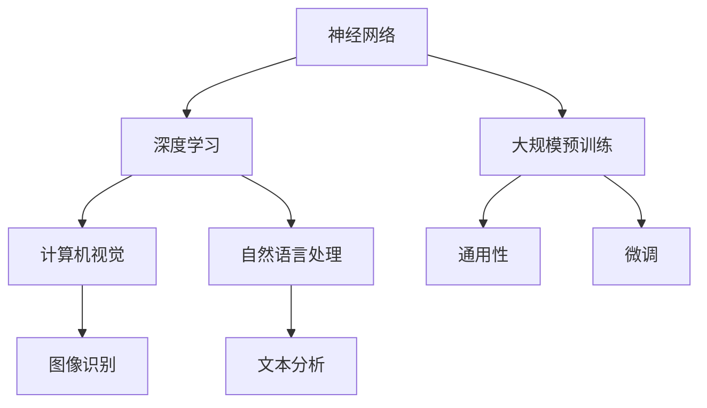

                 

### 文章标题

《AI大模型创业：如何抓住未来机遇？》

### 文章关键词

- AI大模型
- 创业
- 深度学习
- 自然语言处理
- 计算机视觉
- 商业应用
- 风险管理

### 摘要

本文旨在探讨AI大模型创业的机遇与挑战，通过分析AI大模型的基本概念、核心技术、市场趋势、创业实践、成功与失败案例，为创业者提供一条清晰的发展路径。文章首先介绍了AI大模型的基础知识，随后探讨了市场动态和创业机会，然后深入创业实践，最后通过具体案例进行剖析。通过这篇技术博客，读者将能够了解到AI大模型创业的潜在价值以及如何实现成功。

---

# 第一部分: AI大模型概述

## 第1章: AI大模型基础

### 1.1 AI大模型的概念与重要性

AI大模型，通常指的是在深度学习和机器学习领域中使用的大型神经网络模型。这些模型拥有数十亿甚至千亿级别的参数，能够处理庞大的数据集，从而实现高度复杂的任务。AI大模型的重要性主要体现在以下几个方面：

1. **提高预测精度**：通过训练大规模的数据集，AI大模型能够学习到更加复杂的特征，从而提高预测精度。例如，在图像识别、自然语言处理和语音识别等领域，大模型通常能够达到比传统模型更高的准确率。
   
2. **处理复杂数据**：AI大模型能够处理高维、非结构化数据，如文本、图像和声音。这使得它们在诸如医疗诊断、金融风控和零售推荐等需要处理复杂数据的领域具有重要应用价值。

3. **自动化与智能化**：AI大模型的应用可以大幅提升自动化水平，实现智能化决策，减少人工干预。这对于提高生产效率、降低成本和优化服务具有重要意义。

4. **推动科技进步**：AI大模型的发展推动了计算机视觉、自然语言处理和机器人技术等领域的进步，促进了人工智能技术的整体发展。

AI大模型的基本概念包括：

- **神经网络**：神经网络是由大量简单处理单元（神经元）组成的网络，通过前向传播和反向传播算法进行训练。
- **深度学习**：深度学习是神经网络的一种形式，特别适合处理复杂数据，通过多层神经网络进行特征提取和模型训练。
- **大规模预训练**：大规模预训练是指使用大量数据预先训练模型，使其具有通用性，然后再针对特定任务进行微调。

Mermaid流程图：



### 1.2 AI大模型的核心技术

AI大模型的核心技术包括以下几个方面：

1. **深度学习与神经网络基础**：
   - **神经网络**：由大量神经元组成，每个神经元接受多个输入，通过权重进行加权求和，最后通过激活函数输出结果。
   - **反向传播算法**：用于计算网络参数的梯度，以优化网络性能。

   伪代码：

   ```python
   def forward propagation(x, weights, biases):
       # 计算前向传播的输出
       z = dot_product(x, weights) + biases
       a = activation_function(z)
       return a
   
   def backward propagation(a, z, dA):
       # 计算反向传播的梯度
       dZ = dA * activation_function_derivative(z)
       dW = dot_product(dZ, x_transpose())
       db = sum(dZ)
       return dW, db
   ```

2. **自然语言处理与图像处理技术**：
   - **自然语言处理**：用于处理文本数据，包括词嵌入、序列模型和注意力机制。
   - **图像处理技术**：用于处理图像数据，包括卷积神经网络（CNN）和生成对抗网络（GAN）。

   伪代码：

   ```python
   def word_embedding(vocabulary, embedding_size):
       # 词嵌入
       embedding_matrix = [random_vector(embedding_size) for _ in vocabulary]
       return embedding_matrix
   
   def attention机制(input_sequence, hidden_states, attention_weights):
       # 注意力机制
       attention_scores = [dot_product(hidden_states, attention_weights) for hidden_state in hidden_states]
       attention_weights = softmax(attention_scores)
       context_vector = [weighted_sum(input_sequence, attention_weights) for input_sequence]
       return context_vector
   ```

3. **大规模预训练模型原理**：
   - **预训练**：使用大量未标注的数据对模型进行预训练，使其具有通用性。
   - **微调**：在特定任务上对预训练模型进行微调，提高其在任务上的性能。

   伪代码：

   ```python
   def pretrain_model(data, model, optimizer):
       for epoch in range(num_epochs):
           for batch in data:
               model.zero_grad()
               output = model(batch)
               loss = loss_function(output, batch_labels)
               loss.backward()
               optimizer.step()
       return model
   ```

### 1.3 AI大模型的架构与实现

AI大模型的架构通常包括以下几个关键部分：

1. **模型架构**：常用的模型架构包括卷积神经网络（CNN）、循环神经网络（RNN）、长短期记忆网络（LSTM）和Transformer模型等。

   伪代码：

   ```python
   class ConvolutionalNeuralNetwork:
       def __init__(self, input_shape, num_filters, filter_size):
           self.weights = create_weights(input_shape, num_filters, filter_size)
           self.biases = create_biases(num_filters)
       
       def forward(self, x):
           # 前向传播
           z = conv2d(x, self.weights, self.biases)
           a = activation_function(z)
           return a
   ```

2. **训练与优化**：训练过程通常包括前向传播、计算损失函数、反向传播和参数更新。

   伪代码：

   ```python
   def train_model(model, data, labels, epochs, learning_rate):
       for epoch in range(epochs):
           for x, y in data:
               model.zero_grad()
               output = model.forward(x)
               loss = loss_function(output, y)
               loss.backward()
               update_params(model.weights, model.biases, learning_rate)
   ```

3. **部署与维护**：部署AI大模型通常涉及将模型转换为可以高效运行的生产环境，并进行持续监控和优化。

   伪代码：

   ```python
   def deploy_model(model, environment):
       # 将模型部署到生产环境
       model.save(environment.model_path)
       monitor_performance(model, environment)
   ```

## 第2章: AI大模型的市场趋势

### 2.1 AI大模型行业动态

AI大模型行业近年来呈现出快速增长的趋势，主要受到以下几个因素的推动：

1. **计算能力的提升**：随着计算资源的增加，特别是GPU和TPU等专用硬件的发展，大规模模型的训练和优化变得更加高效和经济。

2. **数据的爆炸性增长**：随着物联网、社交媒体和移动互联网的普及，数据量呈指数级增长，为AI大模型提供了丰富的训练数据。

3. **算法的进步**：深度学习算法的不断创新，尤其是自监督学习和迁移学习技术的应用，提高了AI大模型的效果和泛化能力。

4. **商业需求的驱动**：从金融、医疗到零售、制造，各行各业都在寻求通过AI大模型实现自动化和智能化，以提升效率和服务质量。

AI大模型市场的现状和未来发展趋势如下：

- **现状**：目前，AI大模型已经在多个领域取得了显著的应用成果，包括自动驾驶、智能客服、医疗诊断和金融分析等。

- **未来趋势**：预计未来几年，AI大模型将向更多领域渗透，如智能农业、环境监测和智慧城市等，同时，模型的可解释性和透明度也将成为重要研究方向。

关键驱动因素包括：

1. **技术创新**：包括新型神经网络架构、更高效的训练算法和优化技术等。

2. **政策支持**：政府对于人工智能发展的重视和扶持政策，为AI大模型的研究和应用提供了良好的外部环境。

3. **商业机会**：随着AI大模型技术的成熟，越来越多的创业公司和传统企业开始探索AI大模型在业务中的应用，带来了巨大的市场潜力。

### 2.2 AI大模型在不同领域的应用

AI大模型在多个领域的应用正迅速扩大，以下是一些关键领域：

1. **金融领域**：
   - **风险控制**：AI大模型可以分析海量的金融数据，预测市场趋势和风险。
   - **客户服务**：智能客服机器人通过自然语言处理技术，提供24/7的在线服务。

2. **医疗领域**：
   - **诊断辅助**：AI大模型在医学影像分析中可以帮助医生进行早期诊断，如癌症筛查。
   - **个性化治疗**：基于患者的基因组数据和临床数据，AI大模型可以提供个性化的治疗方案。

3. **零售和物流领域**：
   - **推荐系统**：通过分析用户行为和偏好，AI大模型可以实现精准营销和个性化推荐。
   - **供应链优化**：AI大模型可以帮助企业优化库存管理和物流配送。

### 2.3 AI大模型创业的机会与挑战

AI大模型创业面临着巨大的机遇，同时也伴随着诸多挑战：

1. **机遇**：
   - **技术创新**：创业公司有机会通过创新的技术和商业模式，颠覆传统行业。
   - **市场潜力**：AI大模型在各个行业的应用前景广阔，市场潜力巨大。
   - **资本支持**：随着AI技术的热潮，越来越多的风险投资开始关注AI大模型创业公司。

2. **挑战**：
   - **数据获取**：高质量的训练数据是AI大模型成功的基石，但获取和处理大量数据是一个挑战。
   - **计算资源**：训练大规模模型需要大量的计算资源，成本高昂。
   - **技术壁垒**：AI大模型技术复杂，对创业者来说，掌握相关技术和经验是一个挑战。
   - **监管合规**：AI大模型的应用涉及隐私和数据安全，需要遵守相关法规和标准。

创业者如何抓住AI大模型的机会：

1. **定位明确**：明确目标市场和业务定位，避免泛泛而谈。
2. **技术创新**：持续进行技术创新，保持竞争力。
3. **团队建设**：组建具有跨学科背景的团队，包括AI专家、数据科学家和业务分析师。
4. **合作共赢**：与行业巨头和研究机构建立合作关系，共享资源和技术。
5. **风险管理**：提前识别潜在风险，制定应对策略。

### 2.4 AI大模型创业案例分析

#### 6.1 案例一：谷歌的Transformer模型

谷歌的Transformer模型是自然语言处理领域的一项重大突破。它由Vaswani等人于2017年提出，通过引入自注意力机制，成功解决了序列到序列学习中的长距离依赖问题。Transformer模型在多个自然语言处理任务中取得了当时的最优性能，包括机器翻译、文本生成和问答系统等。

- **发展历程**：
  - 2017年：Vaswani等人提出Transformer模型。
  - 2018年：谷歌发布BERT模型，基于Transformer架构进行预训练。
  - 2019年：谷歌发布T5模型，将Transformer应用于更广泛的文本处理任务。

- **应用场景**：
  - **机器翻译**：Transformer模型在机器翻译任务中表现出色，尤其在大规模数据集上。
  - **文本生成**：包括文章生成、诗歌创作等。
  - **问答系统**：通过理解和生成自然语言回答，提升智能客服和问答系统的用户体验。

- **商业价值**：
  - **谷歌搜索**：通过引入BERT模型，谷歌的搜索结果更加准确和丰富。
  - **谷歌助手**：利用Transformer模型，谷歌助手在自然语言理解和交互能力上有了显著提升。

#### 6.2 案例二：OpenAI的GPT模型

OpenAI的GPT（Generative Pre-trained Transformer）模型是另一项重要的自然语言处理技术突破。GPT系列模型通过自监督预训练和微调，实现了高度先进的文本生成和语言理解能力。

- **技术突破**：
  - **预训练**：GPT模型使用未标注的文本数据进行大规模预训练，使其具有通用语言理解能力。
  - **微调**：在特定任务上对预训练模型进行微调，以适应不同的应用场景。

- **应用领域**：
  - **文本生成**：包括文章写作、代码生成和对话系统等。
  - **语言理解**：在问答系统、搜索引擎和智能客服等场景中应用。

- **商业模式**：
  - **API服务**：OpenAI提供GPT模型的API服务，允许开发者利用其强大的语言处理能力。
  - **产品合作**：与多家企业合作，将GPT模型应用于实际产品中。

#### 6.3 案例三：微软的BERT模型

微软的BERT（Bidirectional Encoder Representations from Transformers）模型是基于Transformer架构的一种双向编码表示模型，旨在提升自然语言处理任务的效果。

- **研究背景**：
  - BERT模型由Google AI团队提出，并在多个自然语言处理任务中取得了显著成果。
  - 微软随后对其进行了改进和优化，并在多个应用场景中取得成功。

- **特点与应用**：
  - **双向编码**：BERT模型通过双向编码器，能够同时理解文本的前后关系，提升语言理解能力。
  - **广泛应用**：在搜索引擎、智能客服、文本分类和问答系统中得到广泛应用。

- **商业化探索**：
  - **Azure AI服务**：微软将BERT模型集成到Azure AI服务中，为企业提供先进的自然语言处理能力。
  - **产品优化**：通过BERT模型，微软优化了其多个产品，如Office 365和微软小冰。

### 7.1 案例一：创业公司A

创业公司A致力于利用AI大模型技术优化医疗影像诊断。其核心产品是一种基于深度学习的癌症筛查系统。

- **业务模式**：
  - **产品销售**：公司通过销售癌症筛查系统，为客户提供自动化诊断服务。
  - **数据合作**：与多家医疗机构合作，获取大量的医学影像数据，用于模型训练和优化。

- **失败原因**：
  - **数据不足**：由于获取高质量医学影像数据困难，导致模型训练数据不足，影响诊断效果。
  - **技术挑战**：深度学习模型在处理复杂的医学影像时，遇到了许多技术难题，如模型过拟合和计算资源不足。

- **教训**：
  - **数据积累**：在创业初期，应重视数据的积累和获取，确保模型有足够的训练数据。
  - **技术储备**：掌握先进的技术和算法，应对复杂的业务场景。

### 7.2 案例二：创业公司B

创业公司B专注于利用AI大模型优化供应链管理。其核心产品是一种智能库存管理系统。

- **业务领域**：
  - **供应链优化**：通过分析历史销售数据和市场需求，优化库存水平，减少库存成本。

- **失败原因**：
  - **市场需求不足**：公司未能准确预测市场需求，导致产品销售不佳。
  - **技术局限**：AI大模型在处理实时数据和快速变化的业务场景时，表现不佳，影响了用户体验。

- **影响**：
  - **资金链断裂**：由于销售不佳，公司资金链断裂，导致运营困难。
  - **团队解散**：公司最终解散，团队解散，创业失败。

### 7.3 案例三：创业公司C

创业公司C专注于利用AI大模型优化零售推荐系统。其核心产品是一种智能推荐引擎。

- **技术优势**：
  - **深度学习算法**：公司采用先进的深度学习算法，实现了高精度的用户行为分析和推荐。

- **失败原因**：
  - **商业模型不清晰**：公司对商业模式的探索不够深入，未能找到有效的盈利模式。
  - **市场竞争激烈**：公司未能迅速占领市场，在激烈的竞争中逐渐失去优势。

- **转型尝试**：
  - **技术服务**：公司尝试将核心算法转化为技术服务，为企业提供定制化的解决方案。
  - **业务拓展**：公司拓展了业务范围，尝试进入新的市场领域，以寻求新的增长点。

## 附录A: AI大模型创业工具与资源

### AI大模型开发工具介绍

- **TensorFlow**：谷歌开发的开源机器学习框架，适用于各种深度学习和机器学习任务。
- **PyTorch**：由Facebook AI研究院开发的深度学习框架，支持动态计算图，易于使用。
- **Keras**：基于Theano和TensorFlow的高层神经网络API，简化了深度学习模型构建。

### AI大模型学习资源推荐

- **在线课程**：
  - Andrew Ng的《深度学习》课程（Coursera）
  - Fast.ai的《深度学习实战》课程
  - Udacity的《AI工程师纳米学位》

- **书籍**：
  - 《深度学习》（Goodfellow、Bengio和Courville著）
  - 《Python深度学习》（François Chollet著）
  - 《AI大模型：原理与应用》（AI天才研究院著）

### 开源AI大模型代码库

- **GPT-2**：OpenAI开源的预训练语言模型，适用于文本生成和语言理解任务。
- **BERT**：Google开源的双向编码表示模型，广泛应用于自然语言处理任务。
- **Transformer**：谷歌开源的自注意力机制模型，用于机器翻译和文本生成。

## 附录B: AI大模型创业手册

### 创业前的准备工作

- **市场调研**：了解目标市场，分析竞争对手，确定产品定位。
- **技术储备**：掌握必要的深度学习和机器学习技术，确保能够实现创新。
- **团队建设**：组建具有跨学科背景的团队，包括AI专家、数据科学家和业务分析师。

### 创业过程中的关键节点

- **原型开发**：构建产品原型，验证技术可行性和市场需求。
- **数据积累**：获取高质量的训练数据，为模型训练提供数据支持。
- **商业模式探索**：明确商业模式，制定盈利策略。

### 创业后的持续发展策略

- **产品迭代**：持续优化产品，增加新功能和改进用户体验。
- **市场拓展**：拓展市场份额，寻求新的业务机会。
- **技术创新**：关注前沿技术，持续进行技术创新，保持竞争力。

