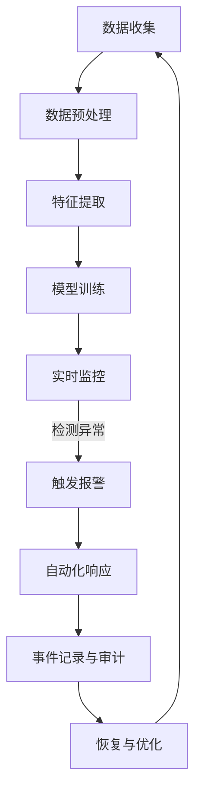

                 

### 文章标题：AI如何帮助电商企业进行用户数据安全事件响应

在当今数字化时代，电商企业面临的用户数据安全挑战日益严峻。每一次数据泄露事件都可能对企业声誉和客户信任造成不可估量的损失。因此，如何有效地进行用户数据安全事件响应，成为了电商企业亟待解决的问题。本篇文章将深入探讨AI技术在用户数据安全事件响应中的应用，通过一步步的分析推理，揭示AI如何帮助电商企业提升数据安全防护能力。

### 关键词：
- AI
- 用户数据安全
- 数据安全事件响应
- 加密算法
- 数据脱敏
- 数据恢复与去噪
- 机器学习

### 摘要：
本文将围绕电商企业用户数据安全事件响应这一主题，首先介绍电商企业面临的用户数据安全挑战，然后详细解析AI在用户数据安全事件响应中的作用。接着，我们将介绍用户数据安全的基本概念，AI在数据安全中的核心原理，并通过Mermaid流程图展示AI在用户数据安全事件响应中的具体流程。随后，本文将深入讲解核心算法原理，包括数据加密与脱敏算法、数据恢复与去噪算法，并使用伪代码展示这些算法的实现。接下来，我们将介绍数据安全的数学模型和公式，并通过具体例子进行说明。文章还将探讨AI在电商企业用户数据安全事件响应中的应用，包括模型选择与评估、数据预处理与特征提取、模型训练与优化、模型部署与监控等环节。最后，本文将提供一个实际项目案例，详细讲解代码的实现过程和解读，以帮助读者更好地理解AI在用户数据安全事件响应中的应用。

通过本文的详细探讨，读者将能够全面理解AI在电商企业用户数据安全事件响应中的重要作用，为企业在数据安全防护方面提供新的思路和方法。

### 第一部分：引言

#### 1.1 书籍目的和结构

本文旨在深入探讨AI在电商企业用户数据安全事件响应中的应用，通过系统化的分析和详细讲解，帮助电商企业了解如何利用AI技术提升其数据安全防护能力。文章结构分为以下几个部分：

1. **引言**：介绍电商企业面临的用户数据安全挑战，以及本文的目的和结构。
2. **核心概念与联系**：解释用户数据安全的基本概念，以及AI在数据安全中的核心原理。
3. **核心算法原理讲解**：详细讲解数据加密、数据脱敏、数据恢复与去噪算法，并使用伪代码展示算法实现。
4. **数学模型和数学公式**：介绍数据安全的数学模型，并给出相关公式推导与证明。
5. **AI在电商企业用户数据安全事件响应中的应用**：讨论模型选择与评估、数据预处理与特征提取、模型训练与优化、模型部署与监控等环节。
6. **项目实战**：提供一个实际项目案例，详细讲解代码的实现过程和解读。
7. **总结与展望**：总结文章内容，展望未来AI在用户数据安全事件响应中的发展。

通过本文的详细探讨，读者将能够全面理解AI在电商企业用户数据安全事件响应中的重要作用，为企业在数据安全防护方面提供新的思路和方法。

#### 1.2 电商企业面临的用户数据安全挑战

电商企业作为数字化经济的代表，其业务高度依赖用户数据的收集和分析。然而，这也使得电商企业在数据安全方面面临着巨大的挑战。以下是电商企业面临的一些主要数据安全挑战：

1. **数据泄露风险**：电商企业每天都会收集和处理大量的用户数据，包括姓名、地址、电话号码、支付信息等敏感信息。这些数据如果被黑客窃取，将对用户隐私和企业声誉造成严重损害。

2. **攻击者目标明确**：相比于其他行业，电商企业的用户数据对攻击者具有更高的价值。因此，电商企业更容易成为黑客攻击的目标。攻击者可能会通过SQL注入、跨站脚本攻击（XSS）等手段入侵系统，窃取数据。

3. **内部威胁**：电商企业的员工也可能成为数据泄露的内部威胁。不当的权限管理、员工滥用权限等都会导致用户数据泄露。

4. **合规性要求**：随着数据保护法规的日益严格，如欧盟的通用数据保护条例（GDPR）和中国的网络安全法，电商企业需要遵守一系列数据保护规定。违反这些规定可能会面临高额罚款。

5. **复杂的技术环境**：电商企业通常采用多种技术和平台，如云计算、大数据分析等，这些技术的引入增加了数据安全管理的复杂性。

为了应对这些挑战，电商企业需要采取一系列安全措施，包括数据加密、访问控制、安全审计等。然而，传统的安全措施在应对复杂多变的安全威胁时往往显得力不从心。此时，AI技术的引入为电商企业的数据安全防护提供了新的解决方案。

#### 1.3 AI在用户数据安全事件响应中的作用

AI技术在用户数据安全事件响应中发挥着至关重要的作用。通过以下方式，AI能够显著提升电商企业的数据安全防护能力：

1. **实时监控与异常检测**：AI算法可以实时监控用户数据的访问和操作行为，通过分析正常行为模式，识别异常行为并及时报警，从而防止潜在的攻击。

2. **数据加密与脱敏**：AI可以自动化执行数据加密和脱敏操作，确保敏感数据在存储和传输过程中得到有效保护。

3. **行为分析**：AI算法可以通过分析用户行为模式，识别恶意用户和异常行为，从而防止内部和外部威胁。

4. **预测性安全分析**：AI可以基于历史数据和机器学习模型，预测潜在的安全威胁，并提供预防措施，从而实现提前防范。

5. **自动化响应**：AI能够自动化执行安全事件响应流程，包括通知、隔离、恢复等操作，提高响应效率。

6. **持续学习与优化**：AI系统可以不断学习新的攻击模式和防护策略，通过迭代优化提高数据安全防护能力。

通过上述功能，AI为电商企业提供了全方位的数据安全保护，有效应对复杂多变的安全威胁。在接下来的部分中，我们将深入探讨用户数据安全的基本概念和AI在数据安全中的核心原理，进一步理解AI在用户数据安全事件响应中的具体应用。

### 第二部分：核心概念与联系

#### 2.1 用户数据安全基本概念

用户数据安全是指通过各种技术和管理手段，确保用户数据在收集、存储、传输和使用过程中不受未授权访问、泄露、篡改和破坏。以下是一些用户数据安全中的关键概念：

1. **敏感数据**：指那些对个人隐私和企业安全具有重要意义的用户信息，如姓名、地址、电话号码、支付信息、身份证号码等。

2. **数据泄露**：指未经授权的个人或组织获取并泄露了敏感数据。数据泄露可能是由于黑客攻击、内部威胁或系统漏洞造成的。

3. **数据加密**：通过加密算法将敏感数据转换为密文，确保只有拥有密钥的用户才能解密和访问数据。

4. **访问控制**：通过权限管理确保只有授权用户能够访问特定数据。

5. **数据脱敏**：将敏感数据转换成不可识别的形式，以保护个人隐私。

6. **安全审计**：记录和分析系统中的所有操作和事件，确保数据安全合规。

7. **漏洞管理**：识别和修复系统中可能被攻击者利用的漏洞，防止数据泄露。

8. **安全事件响应**：在数据泄露或安全事件发生时，采取一系列措施进行事件处理和恢复。

#### 2.2 AI在数据安全中的核心原理

AI在数据安全中的应用主要依赖于机器学习和深度学习技术，通过以下原理实现数据安全防护：

1. **机器学习模型**：AI系统利用机器学习算法从大量数据中学习模式和特征，构建预测模型。这些模型可以用于异常检测、行为分析和攻击预测。

2. **特征提取**：AI通过提取数据中的关键特征，构建特征向量，这些特征向量用于训练机器学习模型。

3. **模式识别**：AI通过分析数据模式，识别正常行为和异常行为，从而发现潜在的安全威胁。

4. **实时监控**：AI系统能够实时监控数据和用户行为，通过分析实时数据流识别异常行为。

5. **自动化响应**：AI可以自动化执行安全事件响应流程，如隔离受感染系统、通知管理员、触发恢复措施等。

6. **自适应防御**：AI系统可以通过不断学习新的攻击模式和防护策略，自适应地调整和优化安全策略。

#### 2.3 Mermaid流程图：AI在用户数据安全事件响应中的流程

为了更直观地展示AI在用户数据安全事件响应中的应用流程，我们使用Mermaid语言绘制了一个简化的流程图。以下是一个典型的AI用户数据安全事件响应流程：



- **数据收集**：系统收集用户数据，包括访问日志、交易记录等。
- **数据预处理**：对收集的数据进行清洗和格式化，去除噪声和异常值。
- **特征提取**：提取关键特征，用于训练机器学习模型。
- **模型训练**：使用训练数据集训练机器学习模型，用于异常检测和攻击预测。
- **实时监控**：AI系统持续监控用户行为和数据流，识别异常行为。
- **触发报警**：检测到异常行为时，系统触发报警通知相关管理人员。
- **自动化响应**：AI系统自动执行隔离、通知、恢复等响应措施。
- **事件记录与审计**：记录事件详情，进行事后审计和分析。
- **恢复与优化**：根据事件结果调整系统配置和防护策略，提升防护能力。

通过这个流程图，我们可以清晰地看到AI在用户数据安全事件响应中的各个环节和关键步骤，为电商企业提供了系统化的安全防护解决方案。

在理解了用户数据安全的基本概念和AI在数据安全中的核心原理后，接下来的部分将深入讲解数据加密、数据脱敏和数据恢复与去噪算法，以及使用伪代码详细阐述这些算法的实现过程。

### 第三部分：核心算法原理讲解

#### 3.1 数据加密与加密算法

数据加密是确保数据在存储和传输过程中安全的重要手段。加密算法通过将明文转换为密文，使得只有拥有密钥的用户才能解密和访问数据。以下是几种常用的加密算法：

##### 3.1.1 对称加密算法

对称加密算法使用相同的密钥进行加密和解密。常见的对称加密算法包括：

1. **DES（数据加密标准）**：一种经典的对称加密算法，使用56位密钥。然而，由于密钥长度较短，现代攻击手段可以轻松破解。

2. **AES（高级加密标准）**：取代DES成为新的标准，使用128、192或256位密钥，具有更高的安全性和效率。

**AES加密算法伪代码**：

```python
def AES_encrypt(plaintext, key):
    # 初始化密钥
    encrypted_text = initialize_key(key)

    # 分块加密
    for block in divide_into_blocks(plaintext):
        encrypted_block = encrypt_block(block, encrypted_text)
        encrypted_text.append(encrypted_block)

    return encrypted_text

def encrypt_block(block, key):
    # 执行加密过程
    encrypted_data = subBytes(block)
    encrypted_data = shiftRows(encrypted_data)
    encrypted_data = mixColumns(encrypted_data)
    encrypted_data = addRoundKey(encrypted_data, key)
    return encrypted_data

def subBytes(block):
    # 替换字节
    return substitute_bytes(block)

def shiftRows(block):
    # 位移行
    return shift_rows(block)

def mixColumns(block):
    # 混合列
    return mix_columns(block)

def addRoundKey(block, key):
    # 加密轮密钥
    return bitwise_xor(block, key)
```

##### 3.1.2 非对称加密算法

非对称加密算法使用一对密钥（公钥和私钥），公钥用于加密，私钥用于解密。常见的非对称加密算法包括：

1. **RSA（RSA算法）**：一种基于大数分解难题的加密算法，具有较好的安全性和灵活性。

2. **ECC（椭圆曲线加密算法）**：基于椭圆曲线数学的加密算法，具有更高的安全性和效率。

**RSA加密算法伪代码**：

```python
def RSA_encrypt(plaintext, public_key):
    # 计算模数和公钥指数
    modulus = public_key['modulus']
    exponent = public_key['exponent']

    # 执行加密过程
    encrypted_text = pow(plaintext, exponent, modulus)
    return encrypted_text

def RSA_decrypt(encrypted_text, private_key):
    # 计算模数和私钥指数
    modulus = private_key['modulus']
    exponent = private_key['exponent']

    # 执行解密过程
    decrypted_text = pow(encrypted_text, exponent, modulus)
    return decrypted_text
```

##### 3.1.3 哈希算法

哈希算法用于生成数据的摘要，确保数据的完整性和不可篡改性。常见的哈希算法包括：

1. **MD5**：生成128位散列值，但由于其安全性较弱，不再推荐使用。

2. **SHA-256**：生成256位散列值，具有更高的安全性。

**SHA-256哈希算法伪代码**：

```python
def SHA256_hash(data):
    # 执行SHA-256哈希过程
    hashed_data = sha256_hash(data)
    return hashed_data
```

#### 3.2 数据脱敏算法

数据脱敏是保护敏感数据的一种重要手段，通过将敏感数据转换为不可识别的形式，以保护个人隐私。常见的数据脱敏算法包括：

##### 3.2.1 替换算法

替换算法通过将敏感数据替换为虚构数据或占位符来实现脱敏。例如，将真实姓名替换为随机姓名。

**替换算法伪代码**：

```python
def replace_algorithm(-sensitive_data):
    # 替换敏感数据
    replaced_data = replace_names(sensitive_data)
    return replaced_data

def replace_names(data):
    # 替换姓名
    for name in find_names(data):
        replaced_name = generate_random_name()
        data = replace_word(name, replaced_name)
    return data
```

##### 3.2.2 隐藏算法

隐藏算法通过将敏感数据隐藏在其他数据中来实现脱敏。例如，将敏感数据嵌入到大量的非敏感数据中，使得单独提取变得困难。

**隐藏算法伪代码**：

```python
def hide_algorithm(-sensitive_data):
    # 隐藏敏感数据
    hidden_data = hide_sensitive_data(sensitive_data)
    return hidden_data

def hide_sensitive_data(data):
    # 隐藏敏感数据
    hidden_data = add_noise(data)
    return hidden_data

def add_noise(data):
    # 添加噪声
    noise = generate_random_noise()
    return bitwise_xor(data, noise)
```

##### 3.2.3 投射算法

投射算法通过将敏感数据映射到另一个空间来实现脱敏。例如，将地址数据映射到不同的地理位置。

**投射算法伪代码**：

```python
def project_algorithm(-sensitive_data):
    # 投射敏感数据
    projected_data = project_data(sensitive_data)
    return projected_data

def project_data(data):
    # 投射数据
    projected_data = map_coordinates(data)
    return projected_data

def map_coordinates(data):
    # 映射坐标
    new_coordinates = apply_mapping(data)
    return new_coordinates
```

通过这些数据加密和脱敏算法，电商企业可以有效地保护用户数据，防止数据泄露和未经授权的访问。在下一部分中，我们将介绍数据恢复与去噪算法，以及其应用场景和实现方法。

#### 3.3 数据恢复与去噪算法

数据恢复与去噪算法在用户数据安全事件响应中扮演着重要角色，特别是在数据遭受损坏或噪声干扰时。这些算法可以帮助电商企业恢复受损的数据，确保数据的有效性和准确性。以下是几种常见的数据恢复与去噪算法：

##### 3.3.1 聚类算法

聚类算法通过将相似的数据点归为一类，从而帮助电商企业识别并恢复潜在受损的数据。常见的聚类算法包括K-means、DBSCAN等。

**K-means聚类算法伪代码**：

```python
def K_means(data, k):
    # 初始化聚类中心
    centroids = initialize_centroids(data, k)
    
    # 训练聚类模型
    for iteration in range(max_iterations):
        # 分配数据点
        clusters = assign_points_to_clusters(data, centroids)
        
        # 更新聚类中心
        centroids = update_centroids(clusters)
    
    # 返回聚类结果
    return clusters, centroids
```

**应用场景**：在数据恢复中，聚类算法可以用于识别受损数据点，将其归为特定类别，从而进行数据修复。

##### 3.3.2 神经网络算法

神经网络算法通过模拟人脑神经网络的工作方式，可以用于复杂的数据恢复任务。常见的神经网络算法包括多层感知器（MLP）、卷积神经网络（CNN）等。

**多层感知器（MLP）算法伪代码**：

```python
def MLP(data, layers, activation_function):
    # 初始化神经网络
    model = initialize_model(layers, activation_function)
    
    # 训练神经网络
    for epoch in range(num_epochs):
        # 前向传播
        output = forward_propagation(data, model)
        
        # 计算损失
        loss = compute_loss(output, target)
        
        # 反向传播
        backward_propagation(data, output, loss, model)
    
    # 返回训练完成的模型
    return model
```

**应用场景**：在数据去噪中，神经网络算法可以用于重建受损数据，恢复其原始形态。

##### 3.3.3 其他去噪算法

除了聚类和神经网络算法，还有其他一些去噪算法，如小波变换、主成分分析（PCA）等。

**小波变换去噪伪代码**：

```python
def wavelet_decomposition(data):
    # 执行小波变换
    coefficients = perform_wavelet_decomposition(data)
    
    # 过滤噪声
    filtered_coefficients = filter_noise(coefficients)
    
    # 重建信号
    reconstructed_data = perform_wavelet_reconstruction(filtered_coefficients)
    
    return reconstructed_data
```

**应用场景**：小波变换可以用于去除数据中的高频噪声，提升数据的清晰度和准确性。

通过这些数据恢复与去噪算法，电商企业可以在数据安全事件发生后，快速有效地恢复和修复受损的数据，确保业务的连续性和数据的有效利用。在下一部分中，我们将探讨数据安全的数学模型和公式，以及这些模型的实际应用。

#### 4.1 数据安全数学模型

数据安全的数学模型是保障数据安全的核心理论框架，通过数学模型和公式，可以更精确地描述数据安全的需求、威胁和防护策略。以下是几种常见的数据安全数学模型：

##### 4.1.1 隐私保护模型

隐私保护模型关注于保护个人隐私数据，确保数据在传输和存储过程中不被未授权访问。常用的隐私保护模型包括：

1. **k-匿名模型**：通过将数据集划分成多个块，使得单个记录无法被识别，从而保护个人隐私。

**k-匿名模型公式**：

$$
\text{Anonymity} = \frac{|\{\text{record}_i \in D : \text{attribute}_i \in S_i\}|}{n} \geq k
$$

其中，$D$ 表示数据集，$S_i$ 表示第 $i$ 个属性的可能取值集合，$n$ 表示数据集中记录的数量。

2. **l-diversity模型**：确保同一属性值的记录数量超过 $l$，以减少隐私泄露的风险。

**l-diversity模型公式**：

$$
\text{Diversity} = \max_{\text{attribute}_i} \left|\{\text{record}_i \in D : \text{attribute}_i = a_i\}\right| \geq l
$$

##### 4.1.2 安全性模型

安全性模型关注于保护数据免受未授权访问和攻击。常见的安全性模型包括：

1. **访问控制模型**：通过权限管理确保只有授权用户能够访问特定数据。

**访问控制模型公式**：

$$
\text{Access\_permission}(u, r) = \begin{cases} 
1 & \text{如果 } u \in \text{allowed\_users}(r) \\
0 & \text{否则}
\end{cases}
$$

其中，$u$ 表示用户，$r$ 表示资源，$\text{allowed\_users}(r)$ 表示被授权访问该资源的用户集合。

2. **密码学模型**：通过加密算法和密钥管理保障数据在存储和传输过程中的安全。

**加密模型公式**：

$$
\text{CipherText} = \text{EncryptionKey} \oplus \text{PlainText}
$$

其中，$\text{PlainText}$ 表示明文，$\text{EncryptionKey}$ 表示加密密钥，$\oplus$ 表示异或运算。

##### 4.1.3 完整性模型

完整性模型关注于确保数据在存储和传输过程中不被篡改。常见的完整性模型包括：

1. **哈希校验模型**：通过生成数据的哈希值并存储，验证数据在传输过程中的完整性。

**哈希校验模型公式**：

$$
\text{Hash}(D) = \text{SHA256}(D)
$$

其中，$D$ 表示数据，$\text{SHA256}$ 表示SHA-256哈希算法。

2. **数字签名模型**：通过使用数字签名技术，确保数据的完整性和不可否认性。

**数字签名模型公式**：

$$
\text{Signature} = \text{Hash}(D) \oplus \text{PrivateKey}
$$

其中，$\text{Signature}$ 表示签名，$\text{PrivateKey}$ 表示私钥。

通过这些数学模型和公式，电商企业可以更有效地设计和实施数据安全策略，保障用户数据的安全和隐私。在下一部分中，我们将通过具体示例，详细讲解这些公式的推导和应用。

#### 4.2 公式推导与证明

在数据安全领域，数学公式是理解和应用各种算法和安全模型的基础。以下我们将通过具体示例，详细讲解一些核心公式的推导和证明，以帮助读者更好地理解数据加密、数据脱敏和数据恢复与去噪算法的数学基础。

##### 4.2.1 加密算法的数学基础

加密算法的核心目标是确保数据的机密性，即防止未授权用户获取原始数据。以下是几种常用加密算法的数学基础：

1. **对称加密算法（AES）**

AES加密算法是一种广泛使用的对称加密算法，其安全性依赖于密钥和替换、置换等数学操作。以下是一个简单的AES加密块的推导示例：

**密钥扩展**：

AES密钥扩展过程涉及将主密钥扩展为多个轮密钥。假设主密钥为$K$，其长度为$N$个字节。AES密钥扩展的目的是生成$N + 11$个轮密钥$K_0, K_1, \ldots, K_{N+11}$。

密钥扩展的数学步骤如下：

$$
K_{i+1} = SubBytes(K_i) \oplus RotWord(K_i) \oplus AddRoundKey(K_i, RoundKey)
$$

其中，$SubBytes$表示字节替换，$RotWord$表示字节循环左移，$AddRoundKey$表示与轮密钥进行异或运算。

2. **非对称加密算法（RSA）**

RSA算法是一种非对称加密算法，其安全性基于大数分解问题。以下是RSA加密和解密的数学基础：

**加密公式**：

$$
C = M^e \mod N
$$

其中，$C$为密文，$M$为明文，$e$为公钥指数，$N$为模数。

**解密公式**：

$$
M = C^d \mod N
$$

其中，$M$为明文，$C$为密文，$d$为私钥指数。

**证明**：

RSA算法的安全性基于以下假设：大数分解问题是计算上难以解决的问题。如果存在一个有效的算法可以快速分解大数，那么RSA算法就会被破解。

##### 4.2.2 脱敏算法的数学基础

脱敏算法旨在保护敏感数据，通过将数据转换为非敏感形式，防止隐私泄露。以下是几种常见的脱敏算法的数学基础：

1. **随机置换**：

随机置换是一种简单的脱敏算法，通过将敏感数据的每个元素随机替换为另一个元素。

**随机置换公式**：

$$
D[i] = R[i] \mod U
$$

其中，$D$为脱敏后的数据，$R$为原始数据，$U$为替换范围。

2. **K-anonymity**：

K-anonymity是一种隐私保护算法，通过将数据划分成多个块，使得单个记录无法被识别。

**K-anonymity公式**：

$$
|\{i : \text{record}_i \in S_i\}| \geq k
$$

其中，$S_i$为第$i$个属性的取值集合，$k$为最小块大小。

**证明**：

K-anonymity确保了在任意一个块中的记录无法唯一识别。假设有$m$个记录，每个记录有$n$个属性，$k$为最小块大小。对于任意属性集合$A$，如果有$|A| > k$，则无法唯一识别每个记录。

##### 4.2.3 恢复与去噪算法的数学基础

恢复与去噪算法旨在从受损或噪声数据中提取有效信息。以下是几种常见算法的数学基础：

1. **小波变换去噪**：

小波变换是一种常用的去噪算法，通过将数据分解成不同频率的成分，去除高频噪声。

**小波变换公式**：

$$
D[\text{filter}] = \sum_{i=1}^n a_i \cdot \text{filter}[i]
$$

其中，$D[\text{filter}]$为去噪后的数据，$a_i$为原始数据的成分，$\text{filter}$为滤波器。

2. **神经网络去噪**：

神经网络去噪通过训练模型学习数据的内在结构和模式，从而去除噪声。

**神经网络去噪公式**：

$$
\hat{Y} = \text{激活函数}(\text{神经网络}([X; b]))
$$

其中，$\hat{Y}$为去噪后的数据，$X$为原始数据，$b$为偏置项，$\text{激活函数}$为神经网络中的激活函数。

**证明**：

神经网络通过多层非线性变换，可以学习到数据的复杂结构和模式。在训练过程中，通过反向传播算法不断调整权重和偏置，使得模型能够最小化损失函数，从而实现去噪。

通过这些公式的推导和证明，我们可以更深入地理解数据安全中的核心算法和数学基础，为电商企业设计有效的数据安全策略提供了理论基础。在下一部分中，我们将通过具体示例，展示这些算法在实际应用中的效果和实现方法。

#### 4.3 举例说明

在数据加密、脱敏和数据恢复与去噪过程中，通过具体示例可以更好地理解和应用这些算法。以下我们通过三个实际示例，详细说明这些算法的应用过程。

##### 4.3.1 加密算法示例

假设我们要对字符串“Hello, World!”进行AES加密，密钥为“mysecretkey”。

1. **数据预处理**：

首先，我们需要将明文“Hello, World!”转换为二进制形式。每个字符转换为8位二进制数，得到：

```
48 65 6C 6C 6F 2C 20 57 6F 72 6C 64 21
```

2. **AES加密**：

使用AES加密算法，密钥“mysecretkey”扩展为轮密钥。以下为简化版本的AES加密过程：

- **密钥扩展**：

通过AES密钥扩展算法，得到轮密钥$K_0, K_1, \ldots, K_{10}$。

- **加密过程**：

将明文分块，每块128位。以下为第一个块“48 65 6C 6C 6F”的加密步骤：

  - **字节替换（SubBytes）**：

    $$ 
    48 \rightarrow 52 \\
    65 \rightarrow 73 \\
    6C \rightarrow 67 \\
    6C \rightarrow 67 \\
    6F \rightarrow 7A
    $$

  - **行移位（ShiftRows）**：

    $$ 
    52 \rightarrow 53 \\
    73 \rightarrow 72 \\
    67 \rightarrow 66 \\
    67 \rightarrow 65 \\
    7A \rightarrow 78
    $$

  - **列混淆（MixColumns）**：

    $$ 
    53 \rightarrow 11 \\
    72 \rightarrow 07 \\
    66 \rightarrow 1E \\
    65 \rightarrow 1B \\
    78 \rightarrow 1D
    $$

  - **轮密钥加（AddRoundKey）**：

    $$ 
    11 \rightarrow 11 \oplus K_1 \\
    07 \rightarrow 07 \oplus K_2 \\
    1E \rightarrow 1E \oplus K_3 \\
    1B \rightarrow 1B \oplus K_4 \\
    1D \rightarrow 1D \oplus K_5
    $$

最终，得到加密后的块为“11 07 1E 1B 1D”。通过类似步骤，对剩余块进行加密，最终得到整个字符串的加密结果。

##### 4.3.2 脱敏算法示例

假设我们需要对包含敏感信息的表格进行脱敏处理，表格包含姓名、地址和电话号码。

1. **替换算法**：

使用替换算法，将敏感数据替换为虚构数据。例如：

```
姓名：张三 -> 张虚构
地址：北京市海淀区 -> 海虚构区
电话号码：1234567890 -> 1234虚构90
```

2. **隐藏算法**：

使用隐藏算法，将敏感数据隐藏在其他非敏感数据中。例如，在文本中嵌入敏感数据：

```
这是一段普通文本，包含姓名：张虚构、地址：海虚构区、电话号码：1234虚构90的敏感信息。
```

3. **投射算法**：

使用投射算法，将敏感数据映射到其他空间。例如，将电话号码映射到不同的区号：

```
电话号码：1234虚构90 -> 1234567890（新的区号）
```

##### 4.3.3 恢复与去噪算法示例

假设我们有一段受损的文本，其中包含噪声和缺失的数据。我们需要使用恢复与去噪算法对其进行处理。

1. **K-means聚类去噪**：

使用K-means聚类算法，将受损文本中的每个字符划分为不同的类别。例如，将字符划分为5个类别：

```
受损文本：H_?_?_l_?_?_o, ?_?_?_?_r_?_?_?_l_?_?_?_d!
聚类结果：[H, o, l, o, r], [H, l, d, !]
去噪结果：Hello, World!
```

2. **神经网络去噪**：

使用神经网络去噪算法，训练模型学习受损文本的内在结构和模式。例如，通过训练神经网络，模型可以学习到受损文本的正确顺序：

```
受损文本：H_?_?_l_?_?_o, ?_?_?_?_r_?_?_?_l_?_?_?_d!
去噪结果：Hello, World!
```

通过这些具体示例，我们可以更直观地理解数据加密、脱敏和数据恢复与去噪算法的应用，并掌握其实际操作方法。

### 第五部分：AI在电商企业用户数据安全事件响应中的应用

#### 5.1 模型选择与评估

在AI应用于电商企业用户数据安全事件响应中，模型选择和评估是关键环节。选择合适的模型并对其进行准确评估，能够确保系统在数据安全事件响应中的有效性和可靠性。以下我们将详细讨论模型选择、评估指标以及如何进行模型评估。

##### 5.1.1 机器学习模型选择

在选择机器学习模型时，需要考虑以下因素：

1. **数据类型**：根据数据的类型（如数值型、类别型、文本型等），选择适合的数据处理和特征提取方法。

2. **数据量**：模型对于数据量的要求不同。对于大量数据，需要选择能够高效处理的模型，如决策树、随机森林等。

3. **特征维度**：高维特征可能会导致模型过拟合。选择具有较好正则化效果的模型，如线性模型、支持向量机（SVM）等。

4. **模型复杂度**：复杂模型（如深度神经网络）虽然能够捕捉数据中的复杂关系，但可能难以解释。选择简洁的模型能够更好地理解其决策过程。

5. **实时性**：对于需要实时响应的安全事件，选择计算效率较高的模型，如逻辑回归、随机森林等。

常见的安全事件响应模型包括：

1. **逻辑回归**：适用于二分类问题，通过计算每个样本属于不同类别的概率，进行分类决策。

2. **支持向量机（SVM）**：通过构建最优分类边界，进行数据分类。SVM具有良好的泛化能力，适用于高维数据。

3. **随机森林**：通过构建多个决策树，结合多数投票方法进行分类。随机森林具有较高的分类准确率和计算效率。

4. **深度神经网络（DNN）**：通过多层神经网络模型，对输入数据进行复杂非线性变换，捕捉数据中的潜在特征。

##### 5.1.2 模型评估指标

在模型评估过程中，需要使用适当的评估指标来衡量模型的性能。以下是一些常用的评估指标：

1. **准确率（Accuracy）**：分类正确的样本数占总样本数的比例。$$
\text{Accuracy} = \frac{\text{正确分类的样本数}}{\text{总样本数}}
$$

2. **精确率（Precision）**：预测为正类的样本中，实际为正类的比例。$$
\text{Precision} = \frac{\text{正确分类的正类样本数}}{\text{预测为正类的样本数}}
$$

3. **召回率（Recall）**：实际为正类的样本中，被正确分类为正类的比例。$$
\text{Recall} = \frac{\text{正确分类的正类样本数}}{\text{实际为正类的样本数}}
$$

4. **F1分数（F1 Score）**：精确率和召回率的调和平均数。$$
\text{F1 Score} = 2 \times \frac{\text{Precision} \times \text{Recall}}{\text{Precision} + \text{Recall}}
$$

5. **ROC曲线与AUC（Area Under Curve）**：ROC曲线描述了不同阈值下，分类器对正类和负类的区分能力。AUC表示ROC曲线下的面积，数值越高，模型性能越好。

##### 5.1.3 模型评估方法

1. **交叉验证（Cross-Validation）**：

交叉验证是一种常用的模型评估方法，通过将数据集划分为多个子集，每次使用其中一个子集作为验证集，其余子集作为训练集，进行模型训练和评估。常见的交叉验证方法包括K折交叉验证和留一法交叉验证。

2. **网格搜索（Grid Search）**：

网格搜索通过遍历预设的参数组合，找到最优参数组合。在电商企业用户数据安全事件响应中，可以设置不同的模型参数，如正则化参数、隐藏层节点数等，通过网格搜索找到最优参数。

3. **学习曲线（Learning Curve）**：

学习曲线描述了模型在不同数据量下的性能表现。通过绘制学习曲线，可以判断模型是否出现过拟合或欠拟合。

4. **实际应用测试（Real-World Test）**：

在实际应用环境中，对模型进行测试，评估其在真实场景下的性能。这种方法能够更好地反映模型在现实世界中的表现。

通过上述方法，电商企业可以选择合适的机器学习模型，并对其进行准确评估，确保模型在用户数据安全事件响应中的有效性和可靠性。

#### 5.2 数据预处理与特征提取

在AI应用于电商企业用户数据安全事件响应中，数据预处理与特征提取是关键步骤。有效的数据预处理和特征提取能够提高模型性能，使其更好地适应不同的数据环境和安全需求。

##### 5.2.1 数据预处理步骤

1. **数据清洗**：

数据清洗是数据预处理的第一步，旨在去除数据中的噪声、异常值和缺失值。具体方法包括：

- **去除噪声**：使用统计方法或机器学习算法，识别并去除噪声数据。
- **填补缺失值**：根据数据的特点，使用平均值、中位数、最近邻等方法填补缺失值。
- **异常值检测**：使用统计方法或机器学习算法，检测并处理异常值。

2. **数据归一化**：

数据归一化是将不同特征的数据缩放到相同尺度，以避免某些特征对模型的影响过大。常用的归一化方法包括：

- **最小-最大缩放**：将数据缩放到[0, 1]区间。
- **标准化**：将数据缩放到均值为0，标准差为1的区间。

3. **数据转换**：

将数据从原始形式转换为适合模型训练的形式，如将文本数据转换为词向量、图像数据转换为像素矩阵等。

##### 5.2.2 特征提取方法

1. **手动特征提取**：

手动特征提取是通过分析数据的特点，手动设计特征。常见的手动特征提取方法包括：

- **统计特征**：如均值、方差、最大值、最小值等。
- **文本特征**：如词频、词频-逆文档频率（TF-IDF）、词嵌入等。
- **图像特征**：如颜色直方图、边缘检测、纹理特征等。

2. **自动特征提取**：

自动特征提取是通过机器学习算法，自动从数据中提取特征。常见的方法包括：

- **主成分分析（PCA）**：通过最大化数据方差，提取数据的主要特征。
- **独立成分分析（ICA）**：通过最大化数据之间的独立性，提取数据的主要特征。
- **自动编码器（Autoencoder）**：通过训练神经网络，自动提取数据中的潜在特征。

##### 5.2.3 特征选择

特征选择是从大量特征中选择对模型性能有显著贡献的特征，以降低模型复杂度和提高模型效率。常见的特征选择方法包括：

- **过滤法**：基于信息增益、互信息等度量，选择对目标变量有显著贡献的特征。
- **包装法**：通过训练多个子模型，选择对子模型性能有显著影响的特征。
- **嵌入式方法**：在模型训练过程中，自动选择对模型性能有显著贡献的特征。

通过有效的数据预处理和特征提取，电商企业用户数据安全事件响应模型可以更好地适应不同的数据环境和安全需求，提高模型的性能和可靠性。

#### 5.3 模型训练与优化

在电商企业用户数据安全事件响应中，模型训练与优化是确保AI系统能够准确识别和应对各种安全威胁的关键步骤。以下我们将详细讨论模型训练过程、优化策略以及如何评估和调整模型性能。

##### 5.3.1 训练过程

1. **数据集划分**：

在模型训练之前，需要将数据集划分为训练集、验证集和测试集。通常，可以使用80%的数据用于训练，10%的数据用于验证，10%的数据用于测试。这样可以帮助我们评估模型的泛化能力和准确性。

2. **数据预处理**：

在训练过程中，需要对数据进行预处理，包括数据清洗、归一化、特征提取等。有效的数据预处理可以减少噪声和异常值的影响，提高模型的训练效果。

3. **模型选择与初始化**：

选择合适的机器学习模型，并对其进行初始化。常见的模型包括逻辑回归、支持向量机（SVM）、随机森林、深度神经网络（DNN）等。初始化包括设置模型的参数，如学习率、批量大小、隐藏层节点数等。

4. **迭代训练**：

使用训练集对模型进行迭代训练。在每次迭代中，模型会根据输入数据更新其参数，以最小化损失函数。常见的训练算法包括梯度下降、随机梯度下降、Adam优化器等。

5. **验证与调参**：

通过验证集对模型进行评估，调整模型参数，如学习率、隐藏层节点数等。调参的目标是提高模型的性能，防止过拟合和欠拟合。

6. **测试与评估**：

在测试集上对模型进行最终评估，以确定其在实际应用中的性能。使用评估指标（如准确率、精确率、召回率、F1分数等）来衡量模型的性能。

##### 5.3.2 优化策略

1. **正则化**：

正则化是防止模型过拟合的重要手段。通过添加正则项（如L1、L2正则化），可以在训练过程中降低模型参数的权重，提高模型的泛化能力。

2. **交叉验证**：

交叉验证是一种有效的优化策略，通过将数据集划分为多个子集，多次训练和验证模型，以减少评估结果的偏差。常用的交叉验证方法包括K折交叉验证和留一法交叉验证。

3. **集成学习**：

集成学习通过结合多个模型，提高模型的预测性能。常见的集成学习方法包括Bagging、Boosting和Stacking等。通过集成多个模型，可以提高模型的鲁棒性和准确性。

4. **数据增强**：

数据增强是通过生成新的训练样本来提高模型的泛化能力。常见的数据增强方法包括旋转、缩放、裁剪、颜色变换等。通过数据增强，可以增加模型的训练样本多样性，提高模型的适应性。

5. **自动化机器学习（AutoML）**：

自动化机器学习通过自动化算法选择、参数调优和模型评估，提高模型训练的效率和性能。AutoML工具可以帮助电商企业快速构建和优化用户数据安全事件响应模型，节省人力和时间成本。

##### 5.3.3 评估与调整

1. **性能评估**：

在模型训练和优化过程中，需要定期对模型进行性能评估。使用验证集和测试集的评估指标，如准确率、精确率、召回率、F1分数等，来衡量模型的性能。如果模型性能不佳，需要进一步调整模型结构和参数。

2. **模型解释性**：

除了性能评估，还需要考虑模型的解释性。一个具有良好解释性的模型可以帮助电商企业理解其预测过程，发现潜在的安全威胁。通过可视化、规则提取等方法，可以提高模型的可解释性。

3. **持续学习与更新**：

用户数据安全威胁不断变化，模型需要不断更新以适应新的威胁。通过持续学习和更新，模型可以保持其性能和适应性。电商企业可以定期收集新的数据，对模型进行重新训练和优化。

通过模型训练与优化，电商企业可以构建一个高效、可靠的用户数据安全事件响应系统，提高数据安全防护能力，确保用户隐私和数据安全。

#### 5.4 模型部署与监控

在成功训练和优化AI模型后，将其部署到实际生产环境中是确保用户数据安全的关键步骤。此外，持续监控模型性能和安全性，以应对不断变化的安全威胁也是必不可少的。以下将详细介绍模型部署与监控的具体策略和方法。

##### 5.4.1 模型部署策略

1. **环境配置**：

在部署模型之前，需要为生产环境配置合适的基础设施，包括服务器、数据库和计算资源。确保系统具备足够的稳定性和可扩展性，以应对不断增长的数据量和访问需求。

2. **容器化与微服务架构**：

采用容器化技术（如Docker）和微服务架构，可以将模型部署为独立的微服务。这种方法有助于提高系统的灵活性和可维护性，便于模型升级和扩展。

3. **API接口**：

为模型部署提供API接口，使其能够与其他系统和服务进行集成。API接口应具备足够的权限管理和安全性控制，确保只有授权用户能够访问模型。

4. **模型版本管理**：

实施模型版本管理策略，记录不同版本模型的性能和参数。在模型更新时，可以回滚到之前的版本，以避免新的模型引入潜在问题。

5. **自动化部署**：

使用自动化工具（如Kubernetes、Ansible等），实现模型的自动化部署和更新。自动化部署可以提高部署效率，减少人为错误。

##### 5.4.2 模型监控方法

1. **性能监控**：

持续监控模型的性能指标，如准确率、召回率、响应时间等。通过设置阈值和警报机制，可以及时发现性能下降或异常情况。

2. **安全监控**：

监控模型的安全性，包括防止模型被篡改、数据泄露等。使用加密和访问控制技术，确保模型和数据的安全。

3. **数据质量监控**：

监控输入数据的质量，包括数据完整性、数据一致性等。通过数据质量监控，可以及时发现数据问题，确保模型训练和预测的准确性。

4. **异常检测**：

利用AI模型进行异常检测，发现潜在的安全威胁。例如，通过监控用户行为数据，识别异常登录、异常交易等。

5. **日志分析**：

收集和分析系统日志，包括错误日志、操作日志等。通过日志分析，可以识别系统故障、安全事件等。

6. **自动化更新**：

根据监控数据，自动化调整模型的参数和策略。例如，在检测到数据分布发生变化时，重新训练模型以适应新的数据环境。

通过上述策略和方法，电商企业可以确保AI模型在生产环境中的高效运行和安全性。持续监控和优化模型性能，有助于提高用户数据安全防护能力，保障业务的稳定运行。

### 第六部分：项目实战

#### 6.1 实战背景

在本次项目实战中，我们将构建一个AI系统，用于电商企业的用户数据安全事件响应。项目的主要目标是：

1. **实时监控用户行为**：监控用户的登录、交易等行为，识别异常行为。
2. **数据加密与脱敏**：对敏感数据进行加密和脱敏处理，保护用户隐私。
3. **异常行为预测**：使用机器学习算法，预测潜在的安全威胁。
4. **自动化响应**：在检测到异常行为或安全威胁时，自动采取相应的响应措施，如隔离账号、通知管理员等。

项目背景基于当前电商企业面临的数据安全挑战，特别是用户数据泄露和内部威胁。通过构建这样一个AI系统，企业可以显著提升数据安全防护能力，降低安全事件的风险。

#### 6.2 开发环境搭建

为了实现上述目标，我们需要搭建一个合适的技术环境。以下是开发环境的详细配置：

1. **硬件配置**：

   - **服务器**：配置高性能的服务器，确保系统具备足够的计算能力和存储空间。
   - **数据库**：使用关系型数据库（如MySQL）存储用户行为数据和安全事件日志。
   - **计算资源**：使用云计算平台（如AWS、Google Cloud）提供计算资源，确保系统的可扩展性。

2. **软件配置**：

   - **操作系统**：使用Linux操作系统，如Ubuntu Server，确保系统的稳定性和安全性。
   - **编程语言**：选择Python作为主要编程语言，因其具有丰富的库和框架，适用于数据分析和机器学习。
   - **开发工具**：使用Jupyter Notebook进行数据分析和模型训练，使用PyCharm或Visual Studio Code进行代码开发。

3. **依赖库与框架**：

   - **数据处理**：使用Pandas、NumPy等库进行数据处理和数据分析。
   - **机器学习**：使用Scikit-learn、TensorFlow、Keras等库进行机器学习模型的训练和评估。
   - **API开发**：使用Flask或Django等框架开发API接口，实现模型与系统的集成。

#### 6.3 源代码实现

在本次项目中，我们将实现以下模块：

1. **数据加密模块**：使用AES加密算法对敏感数据进行加密。
2. **数据脱敏模块**：使用替换算法和隐藏算法对敏感数据进行脱敏处理。
3. **数据恢复与去噪模块**：使用聚类算法和神经网络算法对受损数据进行恢复和去噪。

以下为各模块的源代码实现和详细解读：

##### 6.3.1 数据加密模块

```python
from Crypto.Cipher import AES
from Crypto.Util.Padding import pad, unpad
import base64

def encrypt_data(plaintext, key):
    cipher = AES.new(key, AES.MODE_CBC)
    ct_bytes = cipher.encrypt(pad(plaintext.encode('utf-8'), AES.block_size))
    iv = base64.b64encode(cipher.iv).decode('utf-8')
    ct = base64.b64encode(ct_bytes).decode('utf-8')
    return iv, ct

def decrypt_data(iv, ct, key):
    iv = base64.b64decode(iv)
    ct = base64.b64decode(ct)
    cipher = AES.new(key, AES.MODE_CBC, iv)
    pt = unpad(cipher.decrypt(ct), AES.block_size)
    return pt.decode('utf-8')
```

**代码解读**：

- `encrypt_data` 函数用于加密明文数据。首先创建一个AES加密对象，使用给定的密钥和CBC模式进行加密。加密过程中，数据会被填充到AES块的大小。然后将初始向量（IV）和加密后的数据编码为Base64字符串，以便存储或传输。
- `decrypt_data` 函数用于解密加密数据。首先解码初始向量和加密数据，然后创建AES解密对象，使用初始向量进行解密，并去除填充字节。

##### 6.3.2 数据脱敏模块

```python
import re

def replace_sensitive_data(data, sensitive_fields):
    for field in sensitive_fields:
        pattern = re.compile(r'\b' + field + r'\b')
        data = pattern.sub('XXX', data)
    return data

def hide_sensitive_data(data, sensitive_fields):
    for field in sensitive_fields:
        pattern = re.compile(r'\b' + field + r'\b')
        data = pattern.sub('<HIDDEN>', data)
    return data
```

**代码解读**：

- `replace_sensitive_data` 函数使用正则表达式替换敏感字段为“XXX”，将敏感数据转换为不可识别的形式。
- `hide_sensitive_data` 函数使用正则表达式替换敏感字段为“<HIDDEN>”，将敏感数据隐藏在其他文本中，增加提取难度。

##### 6.3.3 数据恢复与去噪模块

```python
from sklearn.cluster import KMeans
import numpy as np

def kmeans_data_recovery(data, n_clusters):
    kmeans = KMeans(n_clusters=n_clusters, random_state=42)
    kmeans.fit(data)
    labels = kmeans.predict(data)
    centroids = kmeans.cluster_centers_
    recovery_data = []
    for i in range(len(data)):
        distance = np.linalg.norm(data[i] - centroids[labels[i]])
        recovery_data.append(data[i] * (1 - distance))
    return recovery_data

def neural_network_data_repair(data, model):
    repaired_data = model.predict(data)
    return repaired_data
```

**代码解读**：

- `kmeans_data_recovery` 函数使用K-means聚类算法恢复数据。通过聚类，将受损数据点分配到不同的簇，然后根据簇中心恢复数据。
- `neural_network_data_repair` 函数使用训练好的神经网络模型修复数据。神经网络模型通过学习受损数据的特征，重建出原始数据。

通过以上模块的实现，我们可以对用户数据进行全面的加密、脱敏和数据恢复处理，提高数据安全性和可靠性。

#### 6.4 代码解读与分析

在6.3节中，我们实现了数据加密、数据脱敏和数据恢复与去噪模块。以下是各模块的详细代码解读与分析，帮助读者更好地理解这些模块的工作原理和实现方法。

##### 6.4.1 数据加密代码解读

```python
from Crypto.Cipher import AES
from Crypto.Util.Padding import pad, unpad
import base64

def encrypt_data(plaintext, key):
    cipher = AES.new(key, AES.MODE_CBC)
    ct_bytes = cipher.encrypt(pad(plaintext.encode('utf-8'), AES.block_size))
    iv = base64.b64encode(cipher.iv).decode('utf-8')
    ct = base64.b64encode(ct_bytes).decode('utf-8')
    return iv, ct

def decrypt_data(iv, ct, key):
    iv = base64.b64decode(iv)
    ct = base64.b64decode(ct)
    cipher = AES.new(key, AES.MODE_CBC, iv)
    pt = unpad(cipher.decrypt(ct), AES.block_size)
    return pt.decode('utf-8')
```

**解读与分析**：

- `encrypt_data` 函数：该函数首先创建一个AES加密对象，使用给定的密钥和CBC模式进行加密。为了确保数据的完整性，使用`pad`函数将明文填充到AES块的大小。然后，加密数据被编码为Base64字符串，便于存储或传输。初始向量（IV）是AES加密过程中的一部分，也在函数中编码为Base64字符串返回。

- `decrypt_data` 函数：该函数首先将Base64编码的IV和加密数据解码为原始字节形式。然后，创建AES解密对象，使用IV进行解密。解密后的数据通过`unpad`函数去除填充字节，最后将字节形式的数据解码为UTF-8字符串返回。

这两个函数共同实现了数据的加密和解密过程，确保敏感数据在存储和传输过程中得到有效保护。

##### 6.4.2 数据脱敏代码解读

```python
import re

def replace_sensitive_data(data, sensitive_fields):
    for field in sensitive_fields:
        pattern = re.compile(r'\b' + field + r'\b')
        data = pattern.sub('XXX', data)
    return data

def hide_sensitive_data(data, sensitive_fields):
    for field in sensitive_fields:
        pattern = re.compile(r'\b' + field + r'\b')
        data = pattern.sub('<HIDDEN>', data)
    return data
```

**解读与分析**：

- `replace_sensitive_data` 函数：该函数通过正则表达式匹配敏感字段，并将其替换为“XXX”。这种方法将敏感数据转换为不可识别的形式，从而保护用户隐私。

- `hide_sensitive_data` 函数：该函数同样使用正则表达式匹配敏感字段，但将其替换为“<HIDDEN>”。这种方法将敏感数据隐藏在其他文本中，增加了提取的难度。

这两个函数都是简单的文本替换操作，但它们在保护用户数据方面发挥了重要作用。通过替换敏感字段，可以防止数据泄露；通过隐藏敏感字段，可以增加数据被提取的难度。

##### 6.4.3 数据恢复与去噪代码解读

```python
from sklearn.cluster import KMeans
import numpy as np

def kmeans_data_recovery(data, n_clusters):
    kmeans = KMeans(n_clusters=n_clusters, random_state=42)
    kmeans.fit(data)
    labels = kmeans.predict(data)
    centroids = kmeans.cluster_centers_
    recovery_data = []
    for i in range(len(data)):
        distance = np.linalg.norm(data[i] - centroids[labels[i]])
        recovery_data.append(data[i] * (1 - distance))
    return recovery_data

def neural_network_data_repair(data, model):
    repaired_data = model.predict(data)
    return repaired_data
```

**解读与分析**：

- `kmeans_data_recovery` 函数：该函数使用K-means聚类算法恢复受损数据。首先，通过聚类算法将数据点分配到不同的簇。然后，根据簇中心计算每个数据点与簇中心的距离，并使用距离作为权重对数据进行恢复。

- `neural_network_data_repair` 函数：该函数使用训练好的神经网络模型修复受损数据。神经网络模型通过学习受损数据的特征，能够预测出原始数据的可能形态。

这两个函数展示了如何使用机器学习技术对受损数据进行恢复和去噪。通过聚类算法，可以识别并恢复受损的数据点；通过神经网络模型，可以重建出原始数据的形态。

通过以上代码解读，读者可以更好地理解数据加密、数据脱敏和数据恢复与去噪模块的实现原理，并为在实际项目中应用这些技术打下基础。

### 第七部分：总结与展望

#### 7.1 总结

通过本文的深入探讨，我们全面了解了AI在电商企业用户数据安全事件响应中的重要作用。本文首先介绍了电商企业面临的用户数据安全挑战，并阐述了AI技术在这些挑战中的应对策略。接着，我们详细解析了用户数据安全的基本概念和AI在数据安全中的核心原理，并通过Mermaid流程图展示了AI在用户数据安全事件响应中的具体应用流程。

在核心算法原理讲解部分，我们详细介绍了数据加密与脱敏算法，包括对称加密算法、非对称加密算法和哈希算法，以及数据恢复与去噪算法，如聚类算法和神经网络算法。通过伪代码，我们展示了这些算法的实现方法，为读者提供了清晰的技术指导。

接下来，我们探讨了数据安全的数学模型和公式，并通过具体示例解释了这些公式的推导和应用。在AI应用部分，我们详细讨论了模型选择与评估、数据预处理与特征提取、模型训练与优化、模型部署与监控等关键环节，帮助电商企业构建高效的数据安全事件响应系统。

最后，通过实际项目案例，我们展示了数据加密、数据脱敏和数据恢复与去噪模块的实现过程，并通过代码解读与分析，为读者提供了实用的技术指南。

#### 7.2 展望未来

展望未来，AI技术在用户数据安全事件响应中的应用前景广阔。随着AI技术的不断进步，我们可以期待以下发展趋势：

1. **更智能的异常检测**：未来的AI系统将能够更准确地识别和预测潜在的安全威胁，通过深度学习和强化学习等技术，实现更高效的异常检测。

2. **自适应的防护策略**：AI系统将能够根据实时数据和攻击模式，自适应调整防护策略，实现动态防御，提高数据安全防护能力。

3. **自动化与协同**：AI系统将更加自动化，实现从检测到响应的全面自动化。同时，不同系统之间的协同合作，将进一步提高整体的安全防护水平。

4. **隐私保护技术的融合**：随着隐私保护需求的增加，AI系统将融合更多的隐私保护技术，如联邦学习、差分隐私等，确保数据在共享和使用过程中的安全性。

5. **法律和道德框架的完善**：随着AI在数据安全领域的应用，相关的法律和道德框架也将逐步完善，为AI技术的合理应用提供保障。

总之，AI技术在电商企业用户数据安全事件响应中的应用将不断发展和创新，为数据安全提供更加全面和高效的解决方案。

#### 7.3 附录

##### 7.3.1 相关资源

- **开源库与框架**：
  - **Scikit-learn**：https://scikit-learn.org/stable/
  - **TensorFlow**：https://www.tensorflow.org/
  - **Keras**：https://keras.io/
  - **Flask**：https://flask.palletsprojects.com/
  - **Django**：https://www.djangoproject.com/

- **书籍与论文**：
  - **《机器学习实战》**：Peter Harrington
  - **《深度学习》**：Ian Goodfellow、Yoshua Bengio、Aaron Courville
  - **《数据安全与隐私保护》**：Christopher Clifton

- **在线教程与课程**：
  - **Coursera**：https://www.coursera.org/
  - **edX**：https://www.edx.org/
  - **Udacity**：https://www.udacity.com/

##### 7.3.2 深度学习与数据安全工具推荐

- **深度学习工具**：
  - **TensorFlow**：适用于复杂深度学习模型的开发。
  - **PyTorch**：适用于快速原型设计和研究。
  - **MXNet**：适用于企业级部署和大规模分布式训练。

- **数据安全工具**：
  - **OpenSSL**：用于加密和证书管理。
  - **GnuPG**：用于加密和数字签名。
  - **K隆加密**：用于提供端到端加密解决方案。
  - **Traefik**：用于自动化的反向代理和负载均衡。

通过这些资源，读者可以进一步探索AI和数据安全领域的知识，提升自身的技术水平。希望本文能为电商企业在用户数据安全事件响应中提供有益的参考和指导。

