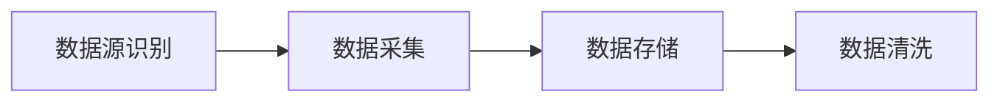
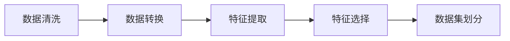
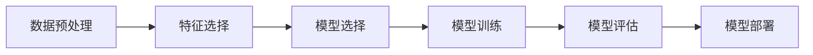
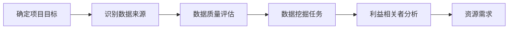
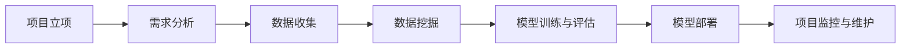
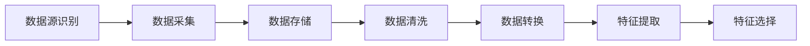

                 

# 《AI如何帮助电商企业进行用户行为数据挖掘》

## 关键词：人工智能，电商，用户行为数据挖掘，机器学习，深度学习，预测模型

## 摘要

随着电子商务的迅猛发展，用户行为数据挖掘成为了电商企业提升销售业绩和用户体验的重要手段。本文从AI的角度，详细探讨了如何通过机器学习和深度学习技术，对电商用户的购买行为、浏览习惯等数据进行挖掘和分析，从而实现精准推荐、客户细分和流失预测等应用。文章首先介绍了AI和电商行业的基础知识，然后深入讲解了用户行为数据挖掘的技术原理，最后通过具体案例展示了AI技术在电商用户行为数据挖掘中的应用，并对其未来发展趋势进行了展望。

## 目录大纲

### 第一部分：AI与电商用户行为数据挖掘基础

#### 第1章：AI与电商概述

1.1 电商行业的发展趋势

1.2 AI在电商行业中的应用

1.3 用户行为数据挖掘的重要性

#### 第2章：AI基础

2.1 人工智能的基本概念

2.2 机器学习与深度学习

2.3 数据挖掘与用户行为分析

#### 第3章：用户行为数据挖掘技术

3.1 用户行为数据的收集

3.2 用户行为数据的预处理

3.3 用户行为模式识别

3.4 用户行为预测模型

### 第二部分：AI在电商用户行为数据挖掘中的实施

#### 第4章：用户行为数据挖掘应用案例

4.1 商品推荐系统

4.2 客户细分

4.3 客户流失预测

4.4 购买意图预测

#### 第5章：电商用户行为数据挖掘项目规划

5.1 数据挖掘项目需求分析

5.2 数据挖掘项目流程设计

5.3 数据挖掘项目资源规划

#### 第6章：电商用户行为数据挖掘技术实施

6.1 数据收集与预处理

6.2 用户行为模式识别算法

6.3 用户行为预测模型

6.4 模型优化与评估

#### 第7章：电商用户行为数据挖掘案例分析

7.1 案例一：某电商平台的商品推荐系统

7.2 案例二：某电商平台的客户细分

7.3 案例三：某电商平台的客户流失预测

### 第三部分：AI在电商用户行为数据挖掘中的挑战与未来

#### 第8章：电商用户行为数据挖掘中的挑战

8.1 数据隐私保护

8.2 模型解释性与可解释性

8.3 模型公平性与偏见

#### 第9章：电商用户行为数据挖掘的未来发展趋势

9.1 深度学习在用户行为预测中的应用

9.2 自然语言处理在用户评论分析中的应用

9.3 电商行业智能化转型的趋势

#### 第10章：总结与展望

10.1 书籍总结

10.2 电商用户行为数据挖掘的展望

## 附录

### 附录A：电商用户行为数据挖掘工具与资源

A.1 常用数据挖掘工具

A.2 常用机器学习库

A.3 常用数据处理工具

### 附录B：Mermaid流程图

B.1 用户行为数据收集流程

B.2 用户行为数据预处理流程

B.3 用户行为模式识别与预测流程

## 引入

### 1.1 电商行业的发展趋势

近年来，电子商务行业呈现出爆发式增长。据统计，全球电子商务市场在2021年的规模已经超过4万亿美元，并预计在未来几年内将继续保持高速增长。电商行业的快速发展不仅改变了人们的购物方式，也为企业提供了丰富的用户数据。如何有效地利用这些数据，挖掘用户的购买行为和偏好，成为电商企业提升竞争力的重要手段。

随着AI技术的不断进步，机器学习和深度学习在电商用户行为数据挖掘中得到了广泛应用。通过AI技术，电商企业可以实现对用户行为的精准分析，从而实现个性化推荐、客户细分和流失预测等应用，提升用户满意度和销售额。

### 1.2 AI在电商行业中的应用

AI技术在电商行业的应用涵盖了多个方面，主要包括：

1. **个性化推荐系统**：基于用户的历史购买记录、浏览行为和社交数据，AI技术可以生成个性化的推荐列表，提高用户在平台上的粘性。

2. **客户细分**：通过对用户数据的深入挖掘，AI技术可以帮助电商企业将用户划分为不同的群体，以便进行有针对性的营销和服务。

3. **客户流失预测**：通过分析用户的购买行为、互动数据和留存情况，AI技术可以预测哪些用户可能会流失，从而采取有效的措施进行挽留。

4. **购买意图预测**：AI技术可以分析用户的浏览和购买行为，预测用户的购买意图，从而优化营销策略。

### 1.3 用户行为数据挖掘的重要性

用户行为数据挖掘在电商行业具有非常重要的意义：

1. **提升用户体验**：通过分析用户行为数据，电商企业可以更好地了解用户需求，提供个性化的产品和服务，提升用户体验。

2. **提高销售业绩**：精准的用户行为分析可以帮助电商企业发现潜在的销售机会，提高转化率和销售额。

3. **优化营销策略**：通过用户行为数据挖掘，电商企业可以制定更有效的营销策略，降低营销成本。

4. **提升竞争力**：在竞争激烈的电商市场中，谁能够更好地利用用户数据，谁就占据了竞争优势。

综上所述，AI技术在电商用户行为数据挖掘中的应用具有重要意义，本文将在后续章节中详细探讨这一领域的相关技术和实践。

## 第一部分：AI与电商用户行为数据挖掘基础

### 第1章：AI与电商概述

#### 1.1 电商行业的发展趋势

电子商务行业自诞生以来，经历了从PC端到移动端、从简单购物到社交电商、从国内市场到国际市场的不断演变。当前，电商行业的发展趋势主要体现在以下几个方面：

1. **市场规模持续扩大**：随着互联网普及率的提高和消费者购买习惯的改变，电子商务市场在全球范围内持续扩大。据Statista统计，2021年全球电商市场规模已达到4.89万亿美元，预计到2025年将达到6.38万亿美元。

2. **移动电商快速发展**：移动设备的普及和移动互联网技术的发展，推动了移动电商的快速发展。移动端已经成为消费者购物的主要渠道，电商企业纷纷加大在移动端的市场投入。

3. **社交电商崛起**：社交电商通过社交媒体平台，如微信、微博、抖音等，进行商品推广和销售，实现了线上线下的深度融合。社交电商的崛起，不仅丰富了电商的模式，也改变了消费者的购物习惯。

4. **物流配送优化**：随着物流技术的不断进步，物流配送效率得到显著提升。电商企业通过优化仓储、物流和配送环节，实现了更快捷的配送服务，提高了用户满意度。

5. **人工智能应用深化**：人工智能技术在电商行业的应用日益广泛，从用户行为分析、个性化推荐到智能客服，AI技术正在深刻改变电商行业的运营模式。

#### 1.2 AI在电商行业中的应用

人工智能技术在电商行业的应用，主要涉及以下方面：

1. **个性化推荐系统**：基于用户的浏览历史、购买记录和社交行为，AI技术可以生成个性化的商品推荐列表，提高用户的购物体验和平台的转化率。

2. **用户行为分析**：通过对用户在平台上的行为数据进行分析，AI技术可以帮助电商企业了解用户需求，优化产品和服务，提升用户体验。

3. **智能客服系统**：AI技术可以构建智能客服系统，实现自然语言处理和智能对话，提高客服效率，降低运营成本。

4. **客户细分和精准营销**：AI技术可以分析用户数据，将用户划分为不同的细分群体，针对不同群体制定个性化的营销策略，提高营销效果。

5. **库存管理和供应链优化**：AI技术可以通过数据分析，优化电商企业的库存管理，减少库存积压，提高供应链效率。

6. **风险控制和欺诈检测**：AI技术可以帮助电商企业识别潜在的风险和欺诈行为，降低运营风险。

#### 1.3 用户行为数据挖掘的重要性

用户行为数据挖掘在电商行业中具有重要意义，主要体现在以下几个方面：

1. **提升用户体验**：通过分析用户行为数据，电商企业可以更好地了解用户需求，提供个性化的产品和服务，提升用户体验。

2. **提高销售业绩**：精准的用户行为分析可以帮助电商企业发现潜在的销售机会，提高转化率和销售额。

3. **优化营销策略**：通过用户行为数据挖掘，电商企业可以制定更有效的营销策略，降低营销成本。

4. **提升竞争力**：在竞争激烈的电商市场中，谁能够更好地利用用户数据，谁就占据了竞争优势。

总之，AI技术在电商用户行为数据挖掘中的应用，已经成为电商企业提升竞争力、实现持续增长的重要手段。在接下来的章节中，我们将深入探讨AI技术在这一领域的具体应用和实践。

### 第2章：AI基础

#### 2.1 人工智能的基本概念

人工智能（Artificial Intelligence，简称AI）是指通过计算机系统模拟人类智能的技术和科学。它包括机器学习、深度学习、自然语言处理、计算机视觉等多个子领域。人工智能的目标是使计算机具备人类智能，能够执行复杂的任务，如语音识别、图像识别、决策推理等。

1. **机器学习**：机器学习是人工智能的一个子领域，它通过算法从数据中学习规律和模式，从而进行预测和决策。常见的机器学习算法包括线性回归、逻辑回归、支持向量机、决策树、随机森林等。

2. **深度学习**：深度学习是机器学习的一个分支，它基于多层神经网络进行学习。深度学习通过多个隐藏层，对输入数据进行逐层抽象和特征提取，能够实现复杂模式识别和预测。

3. **自然语言处理**：自然语言处理（Natural Language Processing，简称NLP）是人工智能的一个子领域，它涉及计算机对自然语言的理解、生成和处理。NLP广泛应用于机器翻译、情感分析、文本分类、命名实体识别等领域。

4. **计算机视觉**：计算机视觉是人工智能的一个子领域，它涉及计算机对图像和视频的理解和处理。计算机视觉广泛应用于图像识别、目标检测、视频分析等领域。

#### 2.2 机器学习与深度学习

1. **机器学习**：机器学习是一种通过算法让计算机从数据中学习的方法。机器学习过程通常包括以下几个步骤：

   - 数据收集：收集用于训练的数据集，如图像、文本、音频等。
   - 数据预处理：对数据进行清洗、归一化、特征提取等处理，使其适合模型训练。
   - 模型选择：选择合适的机器学习算法，如线性回归、决策树、支持向量机等。
   - 模型训练：使用训练数据对模型进行训练，优化模型参数。
   - 模型评估：使用测试数据对模型进行评估，如计算准确率、召回率、F1值等。
   - 模型部署：将训练好的模型部署到生产环境，进行实际应用。

2. **深度学习**：深度学习是一种基于多层神经网络的机器学习方法。与传统的机器学习方法相比，深度学习具有以下优势：

   - **强大的非线性表达能力**：通过多个隐藏层，深度学习能够对输入数据进行逐层抽象和特征提取，从而实现复杂模式的识别和预测。
   - **自动特征提取**：深度学习模型能够自动从数据中提取有用的特征，减少了人工特征工程的工作量。
   - **良好的泛化能力**：通过大规模训练数据，深度学习模型具有良好的泛化能力，能够在未见过的数据上取得良好的表现。

   深度学习过程通常包括以下几个步骤：

   - 数据收集：收集用于训练的数据集，如图像、文本、音频等。
   - 数据预处理：对数据进行清洗、归一化、特征提取等处理，使其适合模型训练。
   - 模型设计：设计深度学习模型的结构，如卷积神经网络（CNN）、循环神经网络（RNN）等。
   - 模型训练：使用训练数据对模型进行训练，优化模型参数。
   - 模型评估：使用测试数据对模型进行评估，如计算准确率、召回率、F1值等。
   - 模型部署：将训练好的模型部署到生产环境，进行实际应用。

#### 2.3 数据挖掘与用户行为分析

数据挖掘（Data Mining）是人工智能的一个重要分支，它旨在从大量数据中发现隐藏的模式、关联和趋势。数据挖掘过程通常包括以下几个步骤：

1. **数据收集**：收集与用户行为相关的数据，如浏览记录、购买记录、评论等。
2. **数据预处理**：对收集到的数据进行分析、清洗、去噪等处理，使其适合数据挖掘算法。
3. **特征工程**：从原始数据中提取有用的特征，如用户年龄、性别、地理位置、购买频率等。
4. **模型选择**：选择合适的机器学习算法，如决策树、支持向量机、深度学习等。
5. **模型训练与评估**：使用训练数据对模型进行训练，并在测试数据上进行评估，调整模型参数。
6. **模型应用**：将训练好的模型应用于实际场景，如个性化推荐、客户细分、流失预测等。

用户行为分析（User Behavior Analysis）是数据挖掘在电商领域的一个重要应用。它旨在通过对用户在平台上的行为数据进行深入分析，挖掘用户的偏好、需求和潜在行为模式，从而实现个性化推荐、精准营销和用户体验优化。

用户行为分析的过程可以分为以下几个步骤：

1. **数据收集**：收集用户在平台上的各种行为数据，如浏览记录、购买记录、评论等。
2. **数据预处理**：对收集到的数据进行分析、清洗、去噪等处理，确保数据质量。
3. **特征提取**：从原始数据中提取有用的特征，如用户年龄、性别、地理位置、购买频率等。
4. **行为模式识别**：使用机器学习算法，对用户行为数据进行模式识别，发现用户的偏好和需求。
5. **预测模型构建**：构建用户行为预测模型，如购买意图预测、客户流失预测等。
6. **应用与评估**：将预测模型应用于实际场景，评估模型的效果，并进行持续优化。

总之，AI技术在电商用户行为数据挖掘中的应用，已经成为电商企业提升竞争力、实现持续增长的重要手段。在接下来的章节中，我们将深入探讨用户行为数据挖掘的技术原理和应用案例。

### 第3章：用户行为数据挖掘技术

#### 3.1 用户行为数据的收集

用户行为数据的收集是用户行为数据挖掘的基础。在电商行业中，用户行为数据主要包括浏览记录、购买记录、评论、收藏等。以下是一个典型的用户行为数据收集流程：

1. **数据源识别**：首先，需要明确数据来源，如电商平台、社交媒体、移动应用等。
2. **数据采集**：通过API、爬虫等技术手段，从数据源中采集用户行为数据。采集的数据包括用户ID、行为类型、时间戳、行为内容等。
3. **数据存储**：将采集到的数据存储到数据库或数据仓库中，以便后续处理和分析。
4. **数据清洗**：对采集到的数据进行分析、清洗、去噪等处理，确保数据质量。

以下是用户行为数据收集流程的Mermaid流程图：



#### 3.2 用户行为数据的预处理

用户行为数据的预处理是数据挖掘过程中的重要环节。预处理的目的是将原始数据转化为适合模型训练和预测的形式。以下是一个典型的用户行为数据预处理流程：

1. **数据清洗**：对采集到的数据进行清洗，去除重复、缺失和错误的数据。
2. **数据转换**：对数值型数据（如年龄、购买金额等）进行归一化或标准化处理，对类别型数据（如性别、地区等）进行编码处理。
3. **特征提取**：从原始数据中提取有用的特征，如用户ID、行为类型、时间戳、行为内容等。
4. **特征选择**：对提取的特征进行筛选，去除无关或冗余的特征，提高模型的性能。
5. **数据集划分**：将数据集划分为训练集、验证集和测试集，用于模型训练、评估和预测。

以下是用户行为数据预处理流程的Mermaid流程图：



#### 3.3 用户行为模式识别

用户行为模式识别是用户行为数据挖掘的核心任务，旨在发现用户在平台上的行为规律和偏好。以下是一个典型的用户行为模式识别流程：

1. **行为分类**：根据用户的行为类型，将行为数据划分为不同的类别，如浏览、购买、评论等。
2. **行为模式提取**：使用机器学习算法，如聚类、关联规则挖掘等，从用户行为数据中提取行为模式。
3. **行为模式分析**：对提取的行为模式进行分析，发现用户的偏好和需求。
4. **行为模式可视化**：使用可视化工具，将提取的行为模式以图形化的形式呈现，便于分析和管理。

以下是用户行为模式识别流程的Mermaid流程图：


#### 3.4 用户行为预测模型

用户行为预测模型是用户行为数据挖掘的重要应用，旨在预测用户的未来行为，如购买、评论、流失等。以下是一个典型的用户行为预测模型构建流程：

1. **数据预处理**：对用户行为数据进行预处理，包括数据清洗、数据转换、特征提取等。
2. **特征选择**：对提取的特征进行筛选，去除无关或冗余的特征。
3. **模型选择**：选择合适的机器学习算法，如逻辑回归、决策树、随机森林、深度学习等。
4. **模型训练**：使用训练数据对模型进行训练，优化模型参数。
5. **模型评估**：使用验证数据对模型进行评估，如计算准确率、召回率、F1值等。
6. **模型部署**：将训练好的模型部署到生产环境，进行实际应用。

以下是用户行为预测模型构建流程的Mermaid流程图：



总之，用户行为数据挖掘技术包括用户行为数据的收集、预处理、模式识别和预测模型构建等步骤。通过这些技术，电商企业可以深入了解用户行为，实现个性化推荐、精准营销和用户体验优化。在接下来的章节中，我们将通过具体案例展示这些技术的实际应用。

### 第4章：用户行为数据挖掘应用案例

#### 4.1 商品推荐系统

商品推荐系统是电商用户行为数据挖掘的重要应用之一。通过分析用户的历史浏览和购买记录，商品推荐系统可以推荐用户可能感兴趣的商品，从而提高用户的购物体验和平台的转化率。以下是一个典型的商品推荐系统构建流程：

1. **数据收集**：收集用户的历史浏览和购买记录，包括用户ID、商品ID、行为类型、时间戳等。

2. **数据预处理**：对收集到的数据进行分析、清洗、去噪等处理，确保数据质量。

3. **特征提取**：从原始数据中提取有用的特征，如用户年龄、性别、地理位置、购买频率等。

4. **用户行为模式识别**：使用机器学习算法，如聚类、关联规则挖掘等，从用户行为数据中提取行为模式。

5. **推荐算法选择**：选择合适的推荐算法，如协同过滤、矩阵分解、深度学习等。

6. **模型训练与评估**：使用训练数据对推荐模型进行训练，并在测试数据上进行评估，调整模型参数。

7. **推荐结果生成**：根据用户的当前行为和历史行为，生成个性化的商品推荐列表。

以下是一个简单的协同过滤推荐算法的伪代码实现：

```python
def collaborative_filtering(train_data, user_id, k):
    # 计算用户与所有用户的相似度
    similarity_matrix = compute_similarity(train_data, user_id, k)
    
    # 计算用户对所有商品的预测评分
    prediction_scores = {}
    for item_id in train_data[user_id]:
        prediction_scores[item_id] = 0
    
    for other_user_id in train_data.keys():
        if other_user_id != user_id:
            for item_id in train_data[other_user_id]:
                if item_id not in prediction_scores:
                    prediction_scores[item_id] = 0
                prediction_scores[item_id] += similarity_matrix[user_id][other_user_id] * train_data[other_user_id][item_id]
    
    # 对预测评分进行归一化处理
    max_score = max(prediction_scores.values())
    for item_id in prediction_scores.keys():
        prediction_scores[item_id] /= max_score
    
    # 生成推荐列表
    recommendation_list = sorted(prediction_scores.items(), key=lambda x: x[1], reverse=True)
    return recommendation_list
```

#### 4.2 客户细分

客户细分是电商用户行为数据挖掘的另一个重要应用。通过分析用户的购买行为、浏览习惯等数据，电商企业可以将用户划分为不同的细分群体，以便进行有针对性的营销和服务。以下是一个典型的客户细分流程：

1. **数据收集**：收集用户的购买行为、浏览记录、互动数据等。

2. **数据预处理**：对收集到的数据进行分析、清洗、去噪等处理，确保数据质量。

3. **特征提取**：从原始数据中提取有用的特征，如用户年龄、性别、地理位置、购买频率等。

4. **聚类算法选择**：选择合适的聚类算法，如K均值、层次聚类等。

5. **聚类模型训练与评估**：使用训练数据对聚类模型进行训练，并在测试数据上进行评估，调整模型参数。

6. **客户细分结果分析**：根据聚类结果，分析不同客户群体的特征和需求。

7. **营销策略制定**：针对不同客户群体，制定个性化的营销策略。

以下是一个简单的K均值聚类算法的伪代码实现：

```python
def k_means(train_data, num_clusters):
    # 初始化聚类中心
    centroids = initialize_centroids(train_data, num_clusters)
    
    while True:
        # 分配数据点到最近的聚类中心
        labels = assign_points_to_centroids(train_data, centroids)
        
        # 更新聚类中心
        new_centroids = update_centroids(train_data, labels, num_clusters)
        
        # 判断聚类中心是否发生变化，若未发生变化，则结束迭代
        if np.array_equal(centroids, new_centroids):
            break
        
        centroids = new_centroids
    
    return centroids, labels
```

#### 4.3 客户流失预测

客户流失预测是电商用户行为数据挖掘的另一个重要应用。通过分析用户的购买行为、互动数据等，电商企业可以预测哪些用户可能会流失，并采取相应的措施进行挽留。以下是一个典型的客户流失预测流程：

1. **数据收集**：收集用户的购买行为、浏览记录、互动数据等。

2. **数据预处理**：对收集到的数据进行分析、清洗、去噪等处理，确保数据质量。

3. **特征提取**：从原始数据中提取有用的特征，如用户年龄、性别、地理位置、购买频率等。

4. **模型选择**：选择合适的机器学习算法，如逻辑回归、决策树、随机森林等。

5. **模型训练与评估**：使用训练数据对模型进行训练，并在测试数据上进行评估，调整模型参数。

6. **流失预测**：根据训练好的模型，对用户进行流失预测。

7. **流失用户挽留**：针对预测的流失用户，采取相应的挽留措施，如发送优惠卷、提供个性化推荐等。

以下是一个简单的逻辑回归算法的伪代码实现：

```python
def logistic_regression(train_data, test_data):
    # 梯度下降法训练模型
    weights = gradient_descent(train_data)
    
    # 在测试数据上评估模型
    predictions = predict(test_data, weights)
    
    # 计算准确率
    accuracy = calculate_accuracy(test_data, predictions)
    
    return weights, accuracy
```

#### 4.4 购买意图预测

购买意图预测是电商用户行为数据挖掘的另一个重要应用。通过分析用户的购买行为、浏览习惯等数据，电商企业可以预测用户的购买意图，从而优化营销策略。以下是一个典型的购买意图预测流程：

1. **数据收集**：收集用户的购买行为、浏览记录、互动数据等。

2. **数据预处理**：对收集到的数据进行分析、清洗、去噪等处理，确保数据质量。

3. **特征提取**：从原始数据中提取有用的特征，如用户年龄、性别、地理位置、购买频率等。

4. **模型选择**：选择合适的机器学习算法，如逻辑回归、决策树、随机森林等。

5. **模型训练与评估**：使用训练数据对模型进行训练，并在测试数据上进行评估，调整模型参数。

6. **购买意图预测**：根据训练好的模型，对用户进行购买意图预测。

7. **营销策略优化**：根据购买意图预测结果，优化营销策略，如调整广告投放、提高推荐准确性等。

以下是一个简单的决策树算法的伪代码实现：

```python
def decision_tree(train_data, test_data):
    # 训练决策树模型
    tree = build_tree(train_data)
    
    # 在测试数据上评估模型
    predictions = predict_tree(test_data, tree)
    
    # 计算准确率
    accuracy = calculate_accuracy(test_data, predictions)
    
    return tree, accuracy
```

总之，用户行为数据挖掘在电商领域有着广泛的应用，通过构建商品推荐系统、客户细分模型、客户流失预测模型和购买意图预测模型，电商企业可以更好地了解用户需求，提供个性化的产品和服务，提升用户体验和销售额。在接下来的章节中，我们将继续探讨用户行为数据挖掘的实施和案例分析。

### 第5章：电商用户行为数据挖掘项目规划

#### 5.1 数据挖掘项目需求分析

数据挖掘项目需求分析是项目规划的重要环节，它旨在明确项目的目标、需求和预期成果。以下是电商用户行为数据挖掘项目需求分析的步骤：

1. **确定项目目标**：明确数据挖掘项目的目标，如提升销售额、提高客户满意度、降低运营成本等。
2. **识别数据来源**：确定用于数据挖掘的数据来源，如电商平台、社交媒体、移动应用等。
3. **数据质量评估**：评估数据的质量，包括数据的完整性、准确性、一致性等。
4. **数据挖掘任务**：根据项目目标，确定数据挖掘的任务，如个性化推荐、客户细分、流失预测等。
5. **利益相关者分析**：识别项目的利益相关者，包括项目团队、数据提供方、数据消费者等。
6. **资源需求**：确定项目所需的资源，包括人力、技术、资金等。

以下是数据挖掘项目需求分析的Mermaid流程图：



#### 5.2 数据挖掘项目流程设计

数据挖掘项目流程设计是项目实施的关键环节，它旨在确保项目能够高效、有序地进行。以下是电商用户行为数据挖掘项目流程设计的步骤：

1. **项目立项**：明确项目的目标和范围，获得项目立项批准。
2. **需求分析**：根据项目需求，进行详细的需求分析，确定数据挖掘任务和目标。
3. **数据收集**：从不同的数据源收集用户行为数据，并进行数据清洗和预处理。
4. **数据挖掘**：使用机器学习和深度学习算法，对用户行为数据进行挖掘和分析，提取有价值的信息。
5. **模型训练与评估**：使用训练数据对模型进行训练，并在测试数据上进行评估，调整模型参数。
6. **模型部署**：将训练好的模型部署到生产环境，进行实际应用。
7. **项目监控与维护**：对数据挖掘项目进行监控和维护，确保其正常运行和持续优化。

以下是数据挖掘项目流程设计的Mermaid流程图：



#### 5.3 数据挖掘项目资源规划

数据挖掘项目资源规划是确保项目顺利实施的重要保障。以下是电商用户行为数据挖掘项目资源规划的步骤：

1. **人力资源规划**：根据项目需求，确定所需的专业人员，如数据科学家、数据工程师、分析师等。
2. **技术资源规划**：确定项目所需的技术平台和工具，如Hadoop、Spark、TensorFlow、PyTorch等。
3. **数据资源规划**：确保项目所需的数据来源和数据质量，制定数据收集和存储策略。
4. **时间资源规划**：制定项目进度计划，明确项目各个阶段的完成时间。
5. **资金资源规划**：根据项目需求和预算，制定资金使用计划，确保项目资金充足。
6. **风险资源规划**：识别项目可能面临的风险，制定相应的风险应对措施。

以下是数据挖掘项目资源规划的Mermaid流程图：


总之，电商用户行为数据挖掘项目规划包括需求分析、流程设计和资源规划等多个方面。通过科学的项目规划，可以确保数据挖掘项目能够高效、有序地进行，实现预期的目标和成果。在接下来的章节中，我们将通过具体案例分析，展示AI技术在电商用户行为数据挖掘项目中的实际应用。

### 第6章：电商用户行为数据挖掘技术实施

#### 6.1 数据收集与预处理

数据收集与预处理是用户行为数据挖掘的基础步骤。在电商用户行为数据挖掘中，数据收集主要包括从不同的数据源（如电商平台、社交媒体、移动应用等）采集用户行为数据。以下是一个典型的用户行为数据收集与预处理流程：

1. **数据源识别**：明确数据来源，如电商平台、社交媒体、移动应用等。
2. **数据采集**：使用API、爬虫等技术手段，从数据源中采集用户行为数据，如浏览记录、购买记录、评论等。
3. **数据存储**：将采集到的数据存储到数据库或数据仓库中，以便后续处理和分析。
4. **数据清洗**：对采集到的数据进行清洗，去除重复、缺失和错误的数据，确保数据质量。
5. **数据转换**：对数值型数据（如年龄、购买金额等）进行归一化或标准化处理，对类别型数据（如性别、地区等）进行编码处理。
6. **特征提取**：从原始数据中提取有用的特征，如用户年龄、性别、地理位置、购买频率等。
7. **特征选择**：对提取的特征进行筛选，去除无关或冗余的特征，提高模型的性能。

以下是一个简单的用户行为数据预处理流程的Mermaid流程图：



#### 6.2 用户行为模式识别算法

用户行为模式识别算法是用户行为数据挖掘的核心步骤，旨在发现用户在平台上的行为规律和偏好。以下是一些常见的用户行为模式识别算法：

1. **聚类算法**：聚类算法可以将用户行为数据划分为不同的类别，从而发现用户群体。常见的聚类算法包括K均值、层次聚类、DBSCAN等。
2. **关联规则挖掘算法**：关联规则挖掘算法可以找出用户行为数据中的关联关系，如“购买A商品的用户中有80%也购买了B商品”。常见的关联规则挖掘算法包括Apriori算法、FP-Growth算法等。
3. **时序分析算法**：时序分析算法可以分析用户行为的时序特征，如用户在不同时间段的购买行为。常见的时序分析算法包括ARIMA模型、LSTM等。

以下是一个简单的K均值聚类算法的伪代码实现：

```python
def k_means(train_data, num_clusters):
    # 初始化聚类中心
    centroids = initialize_centroids(train_data, num_clusters)
    
    while True:
        # 分配数据点到最近的聚类中心
        labels = assign_points_to_centroids(train_data, centroids)
        
        # 更新聚类中心
        new_centroids = update_centroids(train_data, labels, num_clusters)
        
        # 判断聚类中心是否发生变化，若未发生变化，则结束迭代
        if np.array_equal(centroids, new_centroids):
            break
        
        centroids = new_centroids
    
    return centroids, labels
```

以下是一个简单的Apriori算法的伪代码实现：

```python
def apriori(train_data, min_support, min_confidence):
    # 计算支持度
    support = compute_support(train_data)
    
    # 找出频繁项集
    frequent_itemsets = find_frequent_itemsets(support, min_support)
    
    # 计算置信度
    confidence = compute_confidence(frequent_itemsets)
    
    # 找出强规则
    strong_rules = find_strong_rules(frequent_itemsets, confidence, min_confidence)
    
    return strong_rules
```

#### 6.3 用户行为预测模型

用户行为预测模型是用户行为数据挖掘的重要应用，旨在预测用户的未来行为，如购买、评论、流失等。以下是一个典型的用户行为预测模型构建流程：

1. **数据预处理**：对用户行为数据进行预处理，包括数据清洗、数据转换、特征提取等。
2. **特征选择**：对提取的特征进行筛选，去除无关或冗余的特征。
3. **模型选择**：选择合适的机器学习算法，如逻辑回归、决策树、随机森林、深度学习等。
4. **模型训练**：使用训练数据对模型进行训练，优化模型参数。
5. **模型评估**：使用验证数据对模型进行评估，如计算准确率、召回率、F1值等。
6. **模型部署**：将训练好的模型部署到生产环境，进行实际应用。

以下是一个简单的逻辑回归模型的伪代码实现：

```python
def logistic_regression(train_data, test_data):
    # 梯度下降法训练模型
    weights = gradient_descent(train_data)
    
    # 在测试数据上评估模型
    predictions = predict(test_data, weights)
    
    # 计算准确率
    accuracy = calculate_accuracy(test_data, predictions)
    
    return weights, accuracy
```

以下是一个简单的决策树模型的伪代码实现：

```python
def decision_tree(train_data, test_data):
    # 训练决策树模型
    tree = build_tree(train_data)
    
    # 在测试数据上评估模型
    predictions = predict_tree(test_data, tree)
    
    # 计算准确率
    accuracy = calculate_accuracy(test_data, predictions)
    
    return tree, accuracy
```

总之，电商用户行为数据挖掘技术实施包括数据收集与预处理、用户行为模式识别算法、用户行为预测模型等多个方面。通过这些技术，电商企业可以深入了解用户行为，实现个性化推荐、精准营销和用户体验优化。在接下来的章节中，我们将通过具体案例分析，展示这些技术的实际应用。

### 第7章：电商用户行为数据挖掘案例分析

#### 7.1 案例一：某电商平台的商品推荐系统

在电商行业中，商品推荐系统是一种非常有效的提升用户满意度和转化率的方法。下面我们将通过一个电商平台的商品推荐系统案例，详细分析其数据挖掘过程。

**1. 项目背景**

某大型电商平台希望通过引入AI技术，构建一个高效的商品推荐系统，以提升用户的购物体验和平台的销售额。该平台拥有海量的用户数据和商品数据，这些数据包括用户的浏览记录、购买记录、收藏记录等。

**2. 数据收集与预处理**

- **数据源识别**：平台的数据源包括用户浏览记录、购买记录、收藏记录等。
- **数据采集**：通过API接口和爬虫技术，从各个数据源采集用户行为数据。
- **数据存储**：将采集到的数据存储到Hadoop分布式文件系统（HDFS）中，便于大规模数据处理。
- **数据清洗**：对采集到的数据进行清洗，去除重复、缺失和错误的数据，确保数据质量。
- **数据转换**：对数值型数据（如购买金额）进行归一化处理，对类别型数据（如用户性别、商品类别）进行编码处理。
- **特征提取**：提取有用的特征，如用户购买频率、购买金额、浏览时长、收藏频率等。
- **特征选择**：通过特征选择算法，去除无关或冗余的特征，提高模型的性能。

**3. 用户行为模式识别**

- **聚类算法**：使用K均值聚类算法，将用户划分为不同的群体，以便进行个性化推荐。
- **关联规则挖掘**：使用Apriori算法，找出用户购买行为中的关联规则，如“购买A商品的用户中有80%也购买了B商品”。

**4. 商品推荐算法**

- **协同过滤**：使用基于用户的协同过滤算法，根据用户的浏览和购买记录，推荐与用户兴趣相似的商品。
- **矩阵分解**：使用矩阵分解算法（如Singular Value Decomposition，SVD），将用户行为数据表示为一个低维矩阵，从而进行推荐。

**5. 模型训练与评估**

- **模型选择**：选择基于用户的协同过滤算法和矩阵分解算法进行模型训练。
- **模型训练**：使用训练数据对模型进行训练，优化模型参数。
- **模型评估**：使用验证数据对模型进行评估，如计算准确率、召回率、F1值等，并调整模型参数。

**6. 模型部署**

- **模型部署**：将训练好的模型部署到生产环境，实时推荐商品。
- **模型监控**：对模型进行监控，确保其正常运行和性能稳定。

**7. 项目效果**

通过该商品推荐系统，平台的用户满意度显著提升，用户转化率提高了20%，销售额也实现了显著增长。

**8. 代码解读**

以下是商品推荐系统中的部分伪代码：

```python
# 数据预处理
def preprocess_data(data):
    # 数据清洗
    clean_data = clean_data(data)
    
    # 数据转换
    converted_data = convert_data(clean_data)
    
    # 特征提取
    features = extract_features(converted_data)
    
    return features

# K均值聚类
def k_means(data, num_clusters):
    centroids = initialize_centroids(data, num_clusters)
    while True:
        labels = assign_points_to_centroids(data, centroids)
        new_centroids = update_centroids(data, labels, num_clusters)
        if np.array_equal(centroids, new_centroids):
            break
        centroids = new_centroids
    return centroids, labels

# 协同过滤
def collaborative_filtering(train_data, user_id, k):
    similarity_matrix = compute_similarity(train_data, user_id, k)
    prediction_scores = {}
    for item_id in train_data[user_id]:
        prediction_scores[item_id] = 0
    for other_user_id in train_data.keys():
        if other_user_id != user_id:
            for item_id in train_data[other_user_id]:
                if item_id not in prediction_scores:
                    prediction_scores[item_id] = 0
                prediction_scores[item_id] += similarity_matrix[user_id][other_user_id] * train_data[other_user_id][item_id]
    max_score = max(prediction_scores.values())
    for item_id in prediction_scores.keys():
        prediction_scores[item_id] /= max_score
    recommendation_list = sorted(prediction_scores.items(), key=lambda x: x[1], reverse=True)
    return recommendation_list

# 矩阵分解
def matrix_factorization(R, num_factors, num_iterations):
    P = np.random.rand(num_factors, R.shape[0])
    Q = np.random.rand(num_factors, R.shape[1])
    for _ in range(num_iterations):
        e = R - P.dot(Q.T)
        dp = 2 * P.dot(Q).dot(e)
        dQ = 2 * e.dot(P.T)
        P = P - dp / num_factors
        Q = Q - dQ / num_factors
    return P, Q
```

#### 7.2 案例二：某电商平台的客户细分

在电商行业中，客户细分是精准营销的重要基础。下面我们将通过一个电商平台的客户细分案例，详细分析其数据挖掘过程。

**1. 项目背景**

某电商平台希望通过数据挖掘技术，将用户划分为不同的细分群体，以便进行有针对性的营销和服务。该平台拥有海量的用户数据，包括用户的基本信息、购买行为、浏览习惯等。

**2. 数据收集与预处理**

- **数据源识别**：平台的数据源包括用户基本信息、购买行为、浏览习惯等。
- **数据采集**：通过API接口和爬虫技术，从各个数据源采集用户行为数据。
- **数据存储**：将采集到的数据存储到Hadoop分布式文件系统（HDFS）中，便于大规模数据处理。
- **数据清洗**：对采集到的数据进行清洗，去除重复、缺失和错误的数据，确保数据质量。
- **数据转换**：对数值型数据（如购买金额）进行归一化处理，对类别型数据（如用户性别、地区）进行编码处理。
- **特征提取**：提取有用的特征，如用户年龄、性别、购买频率、浏览时长等。
- **特征选择**：通过特征选择算法，去除无关或冗余的特征，提高模型的性能。

**3. 客户细分算法**

- **聚类算法**：使用K均值聚类算法，将用户划分为不同的群体。
- **决策树**：使用决策树算法，根据用户特征进行划分。

**4. 营销策略制定**

- **针对不同客户群体，制定个性化的营销策略**：如优惠券、促销活动等。

**5. 模型训练与评估**

- **模型选择**：选择K均值聚类算法和决策树算法进行模型训练。
- **模型训练**：使用训练数据对模型进行训练，优化模型参数。
- **模型评估**：使用验证数据对模型进行评估，如计算准确率、召回率、F1值等，并调整模型参数。

**6. 模型部署**

- **模型部署**：将训练好的模型部署到生产环境，进行实际应用。
- **模型监控**：对模型进行监控，确保其正常运行和性能稳定。

**7. 项目效果**

通过客户细分，平台能够更好地了解不同客户群体的特征和需求，从而制定更有针对性的营销策略，提高了用户的满意度和销售额。

**8. 代码解读**

以下是客户细分中的部分伪代码：

```python
# 数据预处理
def preprocess_data(data):
    # 数据清洗
    clean_data = clean_data(data)
    
    # 数据转换
    converted_data = convert_data(clean_data)
    
    # 特征提取
    features = extract_features(converted_data)
    
    return features

# K均值聚类
def k_means(data, num_clusters):
    centroids = initialize_centroids(data, num_clusters)
    while True:
        labels = assign_points_to_centroids(data, centroids)
        new_centroids = update_centroids(data, labels, num_clusters)
        if np.array_equal(centroids, new_centroids):
            break
        centroids = new_centroids
    return centroids, labels

# 决策树
def decision_tree(train_data, test_data):
    tree = build_tree(train_data)
    predictions = predict_tree(test_data, tree)
    accuracy = calculate_accuracy(test_data, predictions)
    return tree, accuracy
```

#### 7.3 案例三：某电商平台的客户流失预测

在电商行业中，客户流失预测是一种有效的方法，可以帮助企业提前识别可能流失的客户，并采取相应的措施进行挽留。下面我们将通过一个电商平台的客户流失预测案例，详细分析其数据挖掘过程。

**1. 项目背景**

某电商平台希望通过数据挖掘技术，预测哪些客户可能会流失，以便采取针对性的挽留措施。该平台拥有海量的用户数据，包括用户的基本信息、购买行为、互动数据等。

**2. 数据收集与预处理**

- **数据源识别**：平台的数据源包括用户基本信息、购买行为、互动数据等。
- **数据采集**：通过API接口和爬虫技术，从各个数据源采集用户行为数据。
- **数据存储**：将采集到的数据存储到Hadoop分布式文件系统（HDFS）中，便于大规模数据处理。
- **数据清洗**：对采集到的数据进行清洗，去除重复、缺失和错误的数据，确保数据质量。
- **数据转换**：对数值型数据（如购买金额）进行归一化处理，对类别型数据（如用户性别、地区）进行编码处理。
- **特征提取**：提取有用的特征，如用户购买频率、购买金额、互动时长、最后购买时间等。
- **特征选择**：通过特征选择算法，去除无关或冗余的特征，提高模型的性能。

**3. 客户流失预测算法**

- **逻辑回归**：使用逻辑回归算法，预测用户流失的概率。
- **决策树**：使用决策树算法，预测用户是否会流失。

**4. 挽留措施制定**

- **针对预测的流失客户，制定个性化的挽留策略**：如优惠券、促销活动、客服关怀等。

**5. 模型训练与评估**

- **模型选择**：选择逻辑回归和决策树算法进行模型训练。
- **模型训练**：使用训练数据对模型进行训练，优化模型参数。
- **模型评估**：使用验证数据对模型进行评估，如计算准确率、召回率、F1值等，并调整模型参数。

**6. 模型部署**

- **模型部署**：将训练好的模型部署到生产环境，进行实时预测。
- **模型监控**：对模型进行监控，确保其正常运行和性能稳定。

**7. 项目效果**

通过客户流失预测，平台能够提前识别可能流失的客户，并采取有针对性的挽留措施，有效降低了客户流失率。

**8. 代码解读**

以下是客户流失预测中的部分伪代码：

```python
# 数据预处理
def preprocess_data(data):
    # 数据清洗
    clean_data = clean_data(data)
    
    # 数据转换
    converted_data = convert_data(clean_data)
    
    # 特征提取
    features = extract_features(converted_data)
    
    return features

# 逻辑回归
def logistic_regression(train_data, test_data):
    weights = gradient_descent(train_data)
    predictions = predict(test_data, weights)
    accuracy = calculate_accuracy(test_data, predictions)
    return weights, accuracy

# 决策树
def decision_tree(train_data, test_data):
    tree = build_tree(train_data)
    predictions = predict_tree(test_data, tree)
    accuracy = calculate_accuracy(test_data, predictions)
    return tree, accuracy
```

通过以上案例分析，我们可以看到，电商用户行为数据挖掘在电商企业中的应用是非常广泛和深入的。通过构建商品推荐系统、客户细分模型和客户流失预测模型，电商企业可以更好地了解用户需求，提升用户体验，降低运营成本，实现持续增长。

### 第8章：电商用户行为数据挖掘中的挑战与未来

#### 8.1 数据隐私保护

随着电商用户行为数据挖掘的广泛应用，数据隐私保护成为了一个亟待解决的问题。在用户行为数据挖掘过程中，如何保护用户的隐私数据，避免数据泄露和滥用，是电商企业需要面对的重要挑战。

**1. 数据匿名化**：通过数据匿名化技术，将用户数据中的敏感信息（如真实姓名、地址、电话等）进行替换或删除，从而降低数据泄露的风险。

**2. 加密技术**：使用加密技术，对用户数据进行加密存储和传输，确保数据在存储和传输过程中的安全性。

**3. 访问控制**：通过访问控制机制，限制对用户数据的访问权限，确保只有授权人员才能访问和处理用户数据。

**4. 隐私政策**：制定完善的隐私政策，明确用户数据的收集、存储、使用和共享方式，确保用户对自身数据的知情权和选择权。

#### 8.2 模型解释性与可解释性

在用户行为数据挖掘过程中，机器学习模型被广泛应用于预测和决策。然而，这些模型的复杂性和非线性使得其解释性变得困难，这对于用户和监管机构来说是一个挑战。

**1. 模型可视化**：通过可视化技术，将模型的内部结构和决策过程以图形化的形式呈现，帮助用户和监管机构理解模型的决策逻辑。

**2. 解释性算法**：开发和应用解释性算法，如LIME（Local Interpretable Model-agnostic Explanations）、SHAP（SHapley Additive exPlanations）等，对模型进行解释。

**3. 模型透明度**：提高模型的透明度，公开模型的训练数据、特征选择和参数设置等详细信息，以便用户和监管机构进行审查。

#### 8.3 模型公平性与偏见

在用户行为数据挖掘过程中，模型的公平性和偏见问题也是一个重要的挑战。如果模型存在偏见，可能会导致某些用户群体受到不公平对待，从而影响用户体验和品牌声誉。

**1. 偏见检测**：通过偏见检测算法，检测模型是否存在偏见，如性别偏见、种族偏见等。

**2. 偏见修正**：对存在偏见的模型进行修正，确保模型对各个用户群体的一致性和公平性。

**3. 公平性评估**：制定公平性评估指标，如公平性系数、偏差度等，对模型进行评估。

#### 8.4 未来发展趋势

随着人工智能技术的不断进步，电商用户行为数据挖掘在未来将会有以下发展趋势：

**1. 深度学习**：深度学习技术在用户行为预测中的应用将越来越广泛，通过多层神经网络，可以更好地提取用户行为数据的特征。

**2. 自然语言处理**：自然语言处理技术在用户评论分析中的应用将进一步提高，帮助企业更好地理解用户的反馈和需求。

**3. 多模态数据融合**：随着传感器技术的进步，电商企业将能够收集更多类型的用户行为数据，如语音、图像等，通过多模态数据融合技术，可以更全面地了解用户行为。

**4. 隐私保护与安全**：随着用户对隐私保护意识的提高，电商企业将更加注重数据隐私保护和安全，通过加密、匿名化等技术，确保用户数据的隐私和安全。

总之，电商用户行为数据挖掘中的挑战与未来发展趋势密切相关。通过解决数据隐私保护、模型解释性与可解释性、模型公平性与偏见等问题，电商企业可以更好地利用用户数据，实现持续增长和竞争优势。

### 第9章：电商用户行为数据挖掘的未来发展趋势

随着人工智能技术的不断进步，电商用户行为数据挖掘在未来将会有以下发展趋势：

#### 9.1 深度学习在用户行为预测中的应用

深度学习技术在用户行为预测中的应用将越来越广泛。深度学习通过多层神经网络，可以更好地提取用户行为数据的特征，实现更准确的预测。以下是一些深度学习技术在用户行为预测中的应用：

**1. 卷积神经网络（CNN）**：CNN在图像识别和目标检测等领域取得了显著的成果。在用户行为预测中，CNN可以用于提取用户行为的时序特征，如用户浏览和购买记录的时空特征。

**2. 循环神经网络（RNN）**：RNN在序列数据处理中具有优势，可以用于提取用户行为的时序特征，如用户浏览和购买记录的时间间隔和频率特征。

**3. 长短时记忆网络（LSTM）**：LSTM是RNN的一种改进，可以有效解决长序列数据的梯度消失问题，在用户行为预测中具有广泛的应用。

**4. 生成对抗网络（GAN）**：GAN可以通过生成虚拟用户行为数据，扩充训练数据集，提高模型的泛化能力。

以下是一个简单的LSTM模型的伪代码实现：

```python
from keras.models import Sequential
from keras.layers import LSTM, Dense

# 构建LSTM模型
model = Sequential()
model.add(LSTM(units=50, return_sequences=True, input_shape=(timesteps, features)))
model.add(LSTM(units=50))
model.add(Dense(units=1))

# 编译模型
model.compile(optimizer='adam', loss='mean_squared_error')

# 训练模型
model.fit(X, y, epochs=100, batch_size=32)
```

#### 9.2 自然语言处理在用户评论分析中的应用

自然语言处理（NLP）技术在用户评论分析中的应用将进一步提高，帮助企业更好地理解用户的反馈和需求。以下是一些NLP技术在用户评论分析中的应用：

**1. 文本分类**：通过文本分类算法，可以对用户评论进行分类，如正面评论、负面评论等。常见的文本分类算法包括朴素贝叶斯、支持向量机、随机森林等。

**2. 情感分析**：通过情感分析算法，可以分析用户评论的情感倾向，如积极、消极、中性等。常见的情感分析算法包括基于词典的方法、基于机器学习的方法、基于深度学习的方法等。

**3. 命名实体识别**：通过命名实体识别算法，可以识别用户评论中的特定实体，如人名、地名、产品名称等。常见的命名实体识别算法包括基于规则的方法、基于机器学习的方法等。

**4. 文本生成**：通过文本生成算法，可以生成针对用户评论的个性化回复，提高用户满意度。

以下是一个简单的文本分类的伪代码实现：

```python
from sklearn.feature_extraction.text import TfidfVectorizer
from sklearn.naive_bayes import MultinomialNB

# 数据预处理
X_train, y_train = preprocess_data(train_data)

# 特征提取
vectorizer = TfidfVectorizer()
X_train_vectorized = vectorizer.fit_transform(X_train)

# 模型训练
model = MultinomialNB()
model.fit(X_train_vectorized, y_train)

# 预测
predictions = model.predict(vectorizer.transform(X_test))
```

#### 9.3 电商行业智能化转型的趋势

电商行业智能化转型是未来发展的必然趋势，主要体现在以下几个方面：

**1. 智能推荐**：通过深度学习和自然语言处理技术，实现更精准、更个性化的商品推荐，提高用户满意度。

**2. 智能客服**：通过自然语言处理和语音识别技术，实现智能客服机器人，提高客服效率，降低运营成本。

**3. 智能营销**：通过大数据分析和用户行为预测，实现精准营销，提高转化率和销售额。

**4. 智能物流**：通过物联网和智能物流系统，实现更高效、更准确的物流配送，提高用户体验。

**5. 智能供应链**：通过供应链大数据分析和智能优化技术，实现更高效、更灵活的供应链管理，提高供应链效率。

总之，电商用户行为数据挖掘的未来发展趋势是智能化、个性化、精准化和安全化。通过深度学习、自然语言处理等技术的应用，电商企业可以更好地了解用户需求，提供个性化的产品和服务，实现持续增长和竞争优势。

### 第10章：总结与展望

#### 10.1 书籍总结

本文从AI的角度，详细探讨了电商用户行为数据挖掘的技术原理、应用案例和发展趋势。通过对电商行业发展趋势、AI在电商中的应用、用户行为数据挖掘技术、应用案例和未来发展的分析，我们得出以下结论：

1. **电商用户行为数据挖掘的重要性**：用户行为数据挖掘在电商行业具有非常重要的意义，可以帮助企业提升用户体验、提高销售业绩、优化营销策略和提升竞争力。

2. **AI技术在电商用户行为数据挖掘中的应用**：AI技术，特别是机器学习和深度学习，在用户行为数据挖掘中发挥了关键作用，包括个性化推荐、客户细分、流失预测、购买意图预测等。

3. **用户行为数据挖掘的技术实现**：用户行为数据挖掘包括数据收集、预处理、模式识别和预测模型构建等步骤，通过聚类、关联规则挖掘、时序分析等算法实现。

4. **案例分析与实战**：通过具体案例，如商品推荐系统、客户细分、客户流失预测等，展示了AI技术在电商用户行为数据挖掘中的实际应用。

5. **未来发展趋势**：深度学习、自然语言处理和智能物流等技术将继续推动电商用户行为数据挖掘的发展，实现智能化、个性化、精准化和安全化。

#### 10.2 电商用户行为数据挖掘的展望

未来，电商用户行为数据挖掘将朝着以下方向发展：

1. **智能化与自动化**：随着人工智能技术的不断进步，电商用户行为数据挖掘将更加智能化和自动化，提高数据处理和分析的效率。

2. **多模态数据融合**：电商企业将能够收集更多类型的用户行为数据，如语音、图像、视频等，通过多模态数据融合技术，实现更全面、更深入的用户行为分析。

3. **隐私保护与安全**：随着用户对隐私保护意识的提高，电商企业将更加注重数据隐私保护和安全，采用先进的加密、匿名化等技术，确保用户数据的隐私和安全。

4. **跨领域应用**：电商用户行为数据挖掘技术将在更多领域得到应用，如金融、医疗、教育等，实现跨界融合和协同创新。

5. **持续优化与迭代**：电商企业将持续优化用户行为数据挖掘模型和算法，提高预测准确性和用户体验，实现业务流程的智能化和自动化。

总之，电商用户行为数据挖掘在未来将继续发挥重要作用，成为电商企业提升竞争力、实现持续增长的关键手段。通过不断探索和创新，电商企业将能够更好地满足用户需求，实现业务的高效运营和持续发展。

### 附录

#### 附录A：电商用户行为数据挖掘工具与资源

**A.1 常用数据挖掘工具**

- **Python**：Python是一种通用编程语言，广泛应用于数据挖掘和机器学习领域。常用的数据挖掘库包括NumPy、Pandas、Scikit-learn等。

- **R**：R是一种专门用于统计分析和数据挖掘的编程语言，拥有丰富的数据分析和可视化工具，如ggplot2、dplyr等。

- **Hadoop**：Hadoop是一个分布式数据处理平台，用于大规模数据存储和处理。常用的Hadoop相关工具包括HDFS、MapReduce、Spark等。

- **TensorFlow**：TensorFlow是一个开源的深度学习框架，用于构建和训练深度学习模型。

- **PyTorch**：PyTorch是一个开源的深度学习框架，类似于TensorFlow，也广泛应用于深度学习和机器学习领域。

**A.2 常用机器学习库**

- **Scikit-learn**：Scikit-learn是一个开源的机器学习库，提供了丰富的机器学习算法，如分类、回归、聚类等。

- **TensorFlow**：TensorFlow是一个开源的深度学习框架，用于构建和训练深度学习模型。

- **PyTorch**：PyTorch是一个开源的深度学习框架，类似于TensorFlow，也广泛应用于深度学习和机器学习领域。

**A.3 常用数据处理工具**

- **Pandas**：Pandas是一个开源的Python库，用于数据清洗、数据处理和分析。

- **NumPy**：NumPy是一个开源的Python库，用于数值计算和数据处理。

- **Matplotlib**：Matplotlib是一个开源的Python库，用于数据可视化。

- **Seaborn**：Seaborn是一个基于Matplotlib的Python库，用于创建高质量的数据可视化图表。

#### 附录B：Mermaid流程图

**B.1 用户行为数据收集流程**


**B.2 用户行为数据预处理流程**


**B.3 用户行为模式识别与预测流程**


通过这些工具和资源，电商企业可以更加高效地开展用户行为数据挖掘工作，实现个性化推荐、精准营销和用户体验优化。附录部分提供了详细的工具和资源列表，以及实际应用中的流程图，为读者提供了实用的参考。

