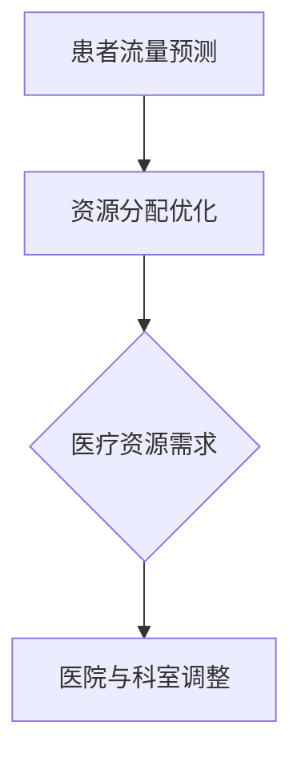
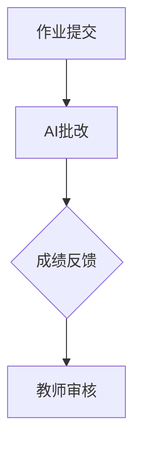
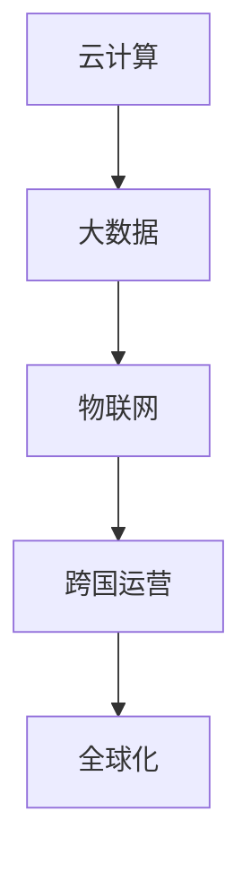
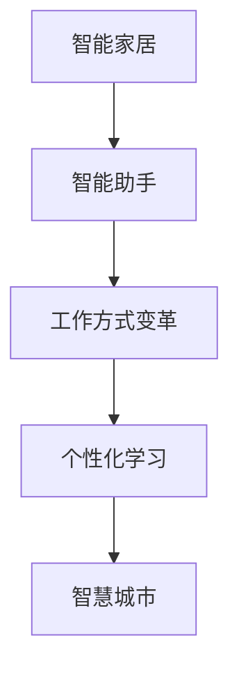
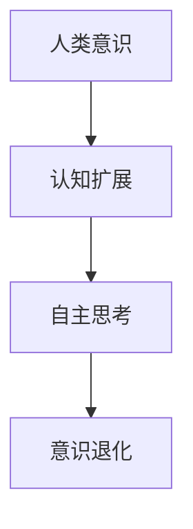
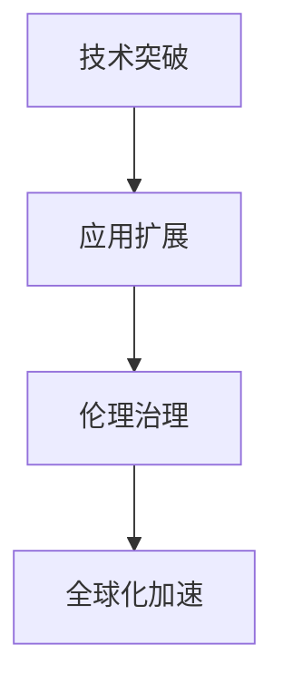

                 

# 《AI对社会的影响》

> 关键词：人工智能，社会变革，就业影响，经济发展，伦理问题

> 摘要：本文深入探讨了人工智能（AI）对社会产生的广泛而深远的影响。首先，介绍了AI的核心概念与发展历程，并分析了其在医疗、教育、金融等领域的广泛应用。接着，探讨了AI对就业市场和经济发展的冲击，以及其带来的挑战与机遇。然后，讨论了AI伦理的核心议题，包括算法公平性、数据隐私与安全，并提出了治理与政策建议。最后，展望了AI对人类社会发展的长期影响，并提出了应对AI挑战的路径与策略。

## 《AI对社会的影响》目录大纲

## 第一部分：AI的崛起与社会变革

### 第1章：AI的核心概念与历史演变

- 1.1 AI的定义与发展历程
- 1.2 AI的关键技术框架
- 1.3 AI对社会的影响概述

### 第2章：AI在各个领域的应用

- 2.1 AI在医疗领域的应用
  - 2.1.1 诊断与预测
  - 2.1.2 治疗方案的优化
  - 2.1.3 医疗资源的分配
- 2.2 AI在教育与培训中的应用
  - 2.2.1 个性化学习
  - 2.2.2 教学辅助
  - 2.2.3 在线教育平台
- 2.3 AI在金融领域的应用
  - 2.3.1 风险评估与欺诈检测
  - 2.3.2 信贷审批与个人财务规划
  - 2.3.3 量化交易

### 第3章：AI对社会就业与经济发展的冲击

- 3.1 AI对就业市场的影响
  - 3.1.1 职业替代与职业创造
  - 3.1.2 技能需求的变化
  - 3.1.3 劳动力市场的不平等
- 3.2 AI对经济发展的推动作用
  - 3.2.1 提高生产效率
  - 3.2.2 创新与创业
  - 3.2.3 促进全球化

## 第二部分：AI伦理与社会责任

### 第4章：AI伦理的核心议题

- 4.1 AI伦理的哲学基础
- 4.2 AI算法的公平性与透明性
- 4.3 数据隐私与安全

### 第5章：AI治理与政策建议

- 5.1 AI治理的挑战与策略
- 5.2 AI监管框架的构建
- 5.3 企业与社会的责任

### 第6章：AI伦理案例研究

- 6.1 医疗AI伦理案例
- 6.2 金融AI伦理案例
- 6.3 社交媒体AI伦理案例

## 第三部分：AI与未来社会

### 第7章：AI对人类社会发展的长期影响

- 7.1 AI与人类社会的融合
- 7.2 AI与人类意识的关系
- 7.3 AI的未来发展趋势

### 第8章：应对AI挑战的路径与策略

- 8.1 提高AI技术水平
- 8.2 建立有效的AI治理体系
- 8.3 培养AI时代的复合型人才

### 第9章：结论

- 9.1 AI对社会影响的综合评估
- 9.2 未来展望
- 9.3 我们的责任与使命

## 附录

- 附录A：参考文献
- 附录B：AI相关组织与机构
- 附录C：AI常用工具与技术概览

---

在接下来的章节中，我们将逐步深入探讨AI的核心概念、历史演变、广泛应用、对社会就业和经济的影响、AI伦理问题以及应对AI挑战的策略。通过这一系列的分析，我们将更全面地理解AI对社会的影响，以及我们如何应对这一挑战。

---

## 第一部分：AI的崛起与社会变革

### 第1章：AI的核心概念与历史演变

在探讨AI对社会的影响之前，我们首先需要理解AI的核心概念及其历史演变。人工智能（Artificial Intelligence，简称AI）是指由计算机系统实现的智能行为，这些行为在某种程度上模拟了人类的思维过程。AI的发展历程可以分为几个阶段，每个阶段都标志着技术的重大突破和应用的不断拓展。

#### 1.1 AI的定义与发展历程

AI的定义有多种，其中一种被广泛接受的定义是：人工智能是使计算机系统能够执行需要人类智能才能完成的任务的科学和技术。这些任务包括理解语言、识别图像、推理决策、解决问题等。

AI的发展历程可以大致分为以下几个阶段：

1. **早期探索（20世纪50年代至60年代）**：AI的概念首次提出，并引发了大量的研究。1956年，达特茅斯会议被认为是AI领域的诞生日，会议上提出了“人工智能”这一术语。

2. **理性阶段（20世纪70年代至80年代）**：在这一阶段，AI研究集中在逻辑推理和符号表示上。专家系统和知识表示成为研究热点。

3. **低谷与复苏（20世纪90年代至21世纪初）**：由于计算能力的限制和实际应用中的挑战，AI研究进入低谷。然而，随着计算能力的提升和机器学习技术的突破，AI研究重新焕发生机。

4. **深度学习时代（21世纪初至今）**：深度学习技术的出现和广泛应用，使AI在图像识别、语音识别、自然语言处理等领域取得了突破性进展。

#### 1.2 AI的关键技术框架

AI的关键技术框架包括以下几个方面：

1. **机器学习（Machine Learning）**：机器学习是AI的核心技术之一，它使计算机系统能够从数据中学习并做出预测或决策。机器学习主要包括监督学习、无监督学习和强化学习。

2. **深度学习（Deep Learning）**：深度学习是机器学习的一种方法，它使用多层神经网络来提取数据中的复杂特征。深度学习在图像识别、语音识别和自然语言处理等领域取得了显著成果。

3. **计算机视觉（Computer Vision）**：计算机视觉是使计算机能够“看”和理解图像的一种技术。它包括图像识别、图像分类、目标检测和场景理解等任务。

4. **自然语言处理（Natural Language Processing，NLP）**：自然语言处理是使计算机能够理解和生成自然语言的一种技术。它包括文本分类、情感分析、机器翻译和对话系统等任务。

5. **机器人技术（Robotics）**：机器人技术是AI在物理世界中的应用，它使机器人能够执行复杂的任务，如自动化制造、服务机器人、医疗机器人等。

#### 1.3 AI对社会的影响概述

AI对社会的影响是深远而广泛的，它不仅改变了我们的生活方式，也对经济、教育、医疗等领域产生了重大影响。以下是一些AI对社会的主要影响：

1. **经济发展**：AI提高了生产效率，促进了创新和创业。它还推动了数字化和全球化进程，为企业提供了新的商业模式和机会。

2. **医疗健康**：AI在医疗领域的应用，如疾病诊断、治疗方案优化和医疗资源分配，提高了医疗质量和效率。

3. **教育与培训**：AI促进了个性化学习和在线教育的发展，为学生提供了更多的学习资源和学习方式。

4. **就业市场**：AI对就业市场产生了深远的影响，一方面，它替代了一些重复性劳动，另一方面，它也创造了新的职业和就业机会。

5. **伦理与法律**：AI的广泛应用引发了一系列伦理和法律问题，如算法公平性、数据隐私和机器决策的透明性。

接下来，我们将进一步探讨AI在各个领域的应用，以及它对社会就业和经济的影响。

---

在接下来的章节中，我们将深入探讨AI在医疗、教育、金融等领域的具体应用，分析其对社会的深远影响，并探讨AI带来的挑战与机遇。

---

### 第2章：AI在各个领域的应用

#### 2.1 AI在医疗领域的应用

人工智能在医疗领域的应用，极大地提升了医疗服务的质量和效率。以下是一些AI在医疗领域的主要应用：

1. **诊断与预测**

AI在疾病诊断方面具有显著优势，通过深度学习和计算机视觉技术，AI可以分析医学影像，如X光、CT扫描和MRI，帮助医生更准确地诊断疾病。例如，谷歌的DeepMind团队开发了一种AI系统，可以用于诊断糖尿病视网膜病变，其准确性甚至超过了专业医生。

伪代码示例：

```
function diagnose_disease(image):
    # 对医学图像进行预处理
    processed_image = preprocess_image(image)
    # 使用卷积神经网络（CNN）进行图像分类
    classification = cnn_model(processed_image)
    # 返回诊断结果
    return interpret_classification(classification)
```

2. **治疗方案的优化**

AI可以通过分析大量的临床数据，为医生提供最佳的治疗方案。例如，AI系统可以根据患者的病史、基因数据和药物反应，为患者推荐个性化的治疗方案。

数学模型示例：

```
function optimal_treatment(patient_data):
    # 定义目标函数，目标是最大化治疗效果，最小化副作用
    objective_function = maximize(therapy_efficacy) - minimize(side_effects)
    # 使用遗传算法进行优化
    optimal_treatment_plan = genetic_algorithm(objective_function, patient_data)
    return optimal_treatment_plan
```

3. **医疗资源的分配**

AI可以帮助优化医疗资源的分配，提高医疗服务的可及性和效率。例如，通过分析患者的流动和医疗资源的利用情况，AI可以预测哪些医院和科室将面临高峰期，从而合理安排医疗资源。

流程图示例：



#### 2.2 AI在教育与培训中的应用

AI在教育领域的应用，为学生提供了更个性化的学习体验，同时也为教师提供了更多的教学工具。

1. **个性化学习**

AI可以根据学生的学习习惯、兴趣和能力，为学生提供个性化的学习资源和学习路径。例如，AI可以根据学生的学习进度和反馈，动态调整教学内容和难度。

伪代码示例：

```
function personalized_learning(student_profile):
    # 分析学生数据，确定学习需求和目标
    learning_goals = analyze_student_profile(student_profile)
    # 根据学习目标推荐合适的课程和资源
    recommended_resources = recommend_courses(learning_goals)
    # 跟踪学习进度并调整资源
    track_learning_progress(recommended_resources, student_profile)
```

2. **教学辅助**

AI可以帮助教师自动化一些重复性的教学任务，如批改作业、出题和教学评估。例如，AI可以通过自然语言处理技术，自动批改作文和考试试卷。

流程图示例：



3. **在线教育平台**

AI还推动了在线教育平台的发展，提供了更多的学习资源和互动方式。例如，通过AI驱动的虚拟助手，学生可以随时获得学习支持和解答疑问。

流程图示例：


#### 2.3 AI在金融领域的应用

AI在金融领域的应用，提高了风险管理的准确性，优化了信贷审批和个人财务规划，同时也推动了量化交易的发展。

1. **风险评估与欺诈检测**

AI可以通过分析大量的历史数据和模式，帮助金融机构更准确地评估风险和检测欺诈行为。例如，AI可以通过机器学习模型，实时监控交易行为，识别异常交易并自动报警。

伪代码示例：

```
function risk_assessment(transaction):
    # 使用决策树模型进行风险评估
    risk_level = decision_tree_model(transaction)
    # 检测欺诈行为
    is_fraud = detect_fraud(transaction, risk_level)
    return is_fraud
```

2. **信贷审批与个人财务规划**

AI可以帮助金融机构更快速和准确地审批贷款，同时为个人提供个性化的财务规划建议。例如，AI可以通过分析客户的信用记录、收入情况和消费习惯，快速评估其信用风险和偿还能力。

伪代码示例：

```
function credit_approval(credit_application):
    # 使用神经网络模型进行信用评分
    credit_score = neural_network_model(credit_application)
    # 根据信用评分进行信贷审批
    approval_status = approve_credit(credit_score)
    return approval_status
```

3. **量化交易**

AI在量化交易中的应用，极大地提高了交易策略的效率和成功率。例如，通过机器学习模型，AI可以分析市场数据，预测股票价格走势，从而制定自动化交易策略。

伪代码示例：

```
function quantitative_trading(stock_data):
    # 使用回归模型预测股票价格
    price_prediction = regression_model(stock_data)
    # 根据预测结果制定交易策略
    trading_strategy = define_trading_strategy(price_prediction)
    # 执行交易
    execute_trades(trading_strategy)
```

通过以上分析，我们可以看到AI在医疗、教育和金融等领域有着广泛的应用，并且极大地提高了相关领域的效率和准确性。在接下来的章节中，我们将进一步探讨AI对社会就业和经济的影响。

---

在下一章节中，我们将深入探讨AI对社会就业和经济产生的深远影响，分析它在就业市场中的冲击与机遇，并讨论AI对经济发展的推动作用。

---

### 第3章：AI对社会就业与经济发展的冲击

#### 3.1 AI对就业市场的影响

人工智能的快速发展，对就业市场产生了深远的影响，既有积极的推动作用，也带来了一些挑战和问题。

1. **职业替代与职业创造**

AI技术的应用，正在替代一些重复性高、低技能的劳动力。例如，自动化机器人正在逐步取代传统的制造业工人，AI驱动的客服系统正在取代传统的客户服务岗位。然而，与此同时，AI也在创造新的职业机会。例如，数据科学家、机器学习工程师、AI伦理学家等新兴职业需求日益增加。

核心概念与联系：

- **职业替代**：AI技术对低技能劳动力的替代效应，可以通过以下Mermaid流程图表示：

  ```mermaid
  graph TD
      A[低技能劳动力] --> B{AI技术}
      B --> C[自动化机器人]
      C --> D[失业]
  ```

- **职业创造**：AI技术创造的新职业机会，可以通过以下Mermaid流程图表示：

  ```mermaid
  graph TD
      A[AI技术] --> B[新兴职业]
      B --> C[数据科学家]
      C --> D[机器学习工程师]
  ```

2. **技能需求的变化**

随着AI技术的发展，对劳动力市场的技能需求也在发生变化。传统的技能，如操作机器和维护设备，正在被新的技能，如编程、数据分析、机器学习和人工智能应用所替代。这意味着，劳动者需要不断更新和提升自己的技能，以适应AI时代的需求。

3. **劳动力市场的不平等**

AI技术的应用，可能会加剧劳动力市场的不平等现象。一方面，高技能劳动力更容易在AI时代找到高薪的工作；另一方面，低技能劳动力可能会面临失业或收入下降的风险。这种不平等现象，需要通过政策和社会措施来缓解。

#### 3.2 AI对经济发展的推动作用

AI技术的应用，对经济发展具有重要的推动作用，它不仅提高了生产效率，还促进了创新和创业，推动了全球化的进程。

1. **提高生产效率**

AI技术可以显著提高生产效率，通过自动化和智能化，减少了生产过程中的时间成本和人力成本。例如，在制造业中，机器人可以精确地进行装配和加工，减少了人为错误和生产时间。在服务业中，AI驱动的客服系统和智能调度系统，可以提高服务效率和客户满意度。

数学模型示例：

假设生产效率与劳动成本的关系可以用以下公式表示：

\[ \text{生产效率} = \frac{\text{产出}}{\text{劳动成本}} \]

通过引入AI技术，劳动成本减少，生产效率提高。

2. **创新与创业**

AI技术的广泛应用，激发了创新和创业的热情。许多创业者利用AI技术，开发出了具有颠覆性的新产品和新服务。例如，AI驱动的医疗诊断系统、教育平台和金融产品，都为用户提供了更高效、更个性化的解决方案。

3. **促进全球化**

AI技术使得全球范围内的合作和交流变得更加便捷。通过AI驱动的云计算、大数据和物联网技术，企业可以轻松实现跨国运营和管理。这不仅促进了全球经济的增长，也为劳动力提供了更多的就业机会。

流程图示例：



通过以上分析，我们可以看到AI对社会就业和经济产生了深远的影响，它既带来了挑战，也带来了机遇。在接下来的章节中，我们将进一步探讨AI伦理的核心议题，以及如何治理和应对AI带来的挑战。

---

在下一章节中，我们将深入探讨AI伦理的核心议题，分析算法公平性、数据隐私和安全等重要问题，并提出相应的治理与政策建议。

---

### 第4章：AI伦理的核心议题

随着人工智能（AI）技术的迅速发展，其伦理问题也日益引起广泛关注。AI伦理涉及多个方面，包括算法公平性、透明性、数据隐私和安全等。以下我们将逐一探讨这些核心议题。

#### 4.1 AI伦理的哲学基础

AI伦理的哲学基础涉及对技术、人类和社会之间关系的深入思考。以下是一些重要的哲学观点：

1. **技术决定论与非决定论**：技术决定论认为技术的发展将不可避免地导致特定的社会结果，而非决定论则认为技术发展是由人类价值观和社会结构共同决定的。

2. **功利主义与德行伦理**：功利主义关注技术带来的最大幸福，而德行伦理则强调道德原则和个体责任。

3. **自由与控制**：AI技术的广泛应用可能会限制个人自由，同时增加对个体行为的监控。

#### 4.2 AI算法的公平性与透明性

AI算法的公平性和透明性是AI伦理讨论中的关键议题。以下是一些核心问题：

1. **算法偏见**：算法偏见是指AI算法在处理数据时，可能会因为数据中的偏见而导致不公平的结果。例如，招聘系统可能因数据中存在性别或种族偏见，而歧视某些群体。

2. **透明性**：AI系统的决策过程往往是不透明的，这使得用户难以理解为什么系统会做出特定决策。提高算法透明性，有助于用户信任和理解AI系统。

核心概念与联系：

- **算法偏见与公平性**：算法偏见可以通过以下Mermaid流程图表示：

  ```mermaid
  graph TD
      A[原始数据] --> B[训练数据]
      B --> C{偏见}
      C --> D[AI算法]
      D --> E[偏见结果]
  ```

- **算法透明性**：算法透明性可以通过以下Mermaid流程图表示：

  ```mermaid
  graph TD
      A[AI系统] --> B{决策过程}
      B --> C{可解释性}
      C --> D[用户理解]
  ```

#### 4.3 数据隐私与安全

数据隐私与安全是AI伦理的另一个重要议题。以下是一些核心问题：

1. **个人数据收集与使用**：AI系统通常需要大量个人数据来进行训练和优化，这可能导致用户隐私泄露。

2. **数据安全**：AI系统面临数据泄露和滥用的风险，保护数据安全是确保AI伦理的重要一环。

3. **数据所有权与控制**：个人对自己的数据的所有权和控制权应受到保护，防止数据被滥用或不当使用。

核心概念与联系：

- **数据隐私与安全**：数据隐私与安全可以通过以下Mermaid流程图表示：

  ```mermaid
  graph TD
      A[个人数据] --> B[数据收集]
      B --> C[数据存储]
      C --> D[数据安全]
      D --> E[数据泄露防护]
  ```

通过以上分析，我们可以看到AI伦理涉及多个方面，包括算法公平性、透明性、数据隐私和安全等。在接下来的章节中，我们将探讨如何治理AI伦理问题，并提出相应的政策建议。

---

在下一章节中，我们将深入讨论AI治理的挑战与策略，构建有效的AI监管框架，并探讨企业和社会的责任。

---

### 第5章：AI治理与政策建议

随着人工智能（AI）技术的广泛应用，其治理问题变得愈发重要。AI治理涉及政策制定、法律框架、伦理准则以及技术标准等多个方面。在这一章节中，我们将探讨AI治理的挑战与策略，并探讨如何构建有效的AI监管框架，同时强调企业和社会的责任。

#### 5.1 AI治理的挑战与策略

AI治理面临诸多挑战，主要包括以下几个方面：

1. **技术复杂性**：AI技术本身具有高度复杂性，这使得监管者难以理解和评估AI系统的行为和潜在风险。

2. **数据隐私**：AI系统通常需要处理大量个人数据，这可能侵犯用户的隐私权。如何平衡数据利用与隐私保护，是AI治理的一大挑战。

3. **算法偏见**：AI算法可能基于偏见的数据进行训练，导致不公平的结果。如何确保算法的公平性和透明性，是AI治理的另一个重要挑战。

4. **法律责任**：当AI系统发生错误或造成损失时，如何确定责任主体和追究法律责任，是AI治理中的关键问题。

为了应对这些挑战，以下是一些AI治理的策略：

1. **制定统一的伦理准则**：政府和相关组织应制定统一的AI伦理准则，明确AI系统的开发和应用应遵循的道德标准。

2. **建立透明的监管框架**：监管机构应建立透明的监管框架，确保AI系统的开发、部署和使用过程受到有效监督。

3. **促进公众参与**：鼓励公众参与AI治理，通过听证会、咨询委员会等形式，让不同利益相关方共同参与决策过程。

4. **加强跨学科合作**：AI治理需要跨学科的合作，包括计算机科学、伦理学、法学、社会学等领域的专家共同参与，以提供全面的治理方案。

#### 5.2 AI监管框架的构建

构建有效的AI监管框架，需要从以下几个方面着手：

1. **法律框架**：制定与AI技术相关的法律法规，明确AI系统的开发、部署和使用规范，以及相应的法律责任。

2. **行业标准**：建立AI技术标准和规范，确保AI系统的安全性和可靠性。例如，可以制定关于数据收集、处理和存储的行业标准。

3. **监管机构**：设立专门的AI监管机构，负责监督AI系统的开发和应用，确保其符合伦理和法律要求。

4. **监管工具**：开发监管工具，如AI监控平台和评估工具，帮助监管机构实时监控AI系统的行为和风险。

#### 5.3 企业与社会的责任

在AI治理中，企业和社会同样肩负着重要责任：

1. **企业的责任**：企业应遵循AI伦理准则，确保AI系统的开发和应用符合道德和法律要求。此外，企业应主动公开AI系统的透明性报告，接受公众监督。

2. **社会的责任**：社会各界应积极参与AI治理，通过舆论监督和公众参与，推动AI技术的健康发展。

3. **教育和培训**：加强AI教育和培训，提高公众对AI技术的理解和认知，培养更多AI专业人才，以应对AI时代的挑战。

通过以上措施，我们可以构建一个有效的AI治理体系，确保AI技术的健康发展，同时最大限度地减少其负面影响。

---

在下一章节中，我们将通过具体案例研究，深入分析AI伦理问题，探讨医疗、金融和社交媒体等领域的AI伦理挑战与解决方案。

---

### 第6章：AI伦理案例研究

在探讨AI伦理问题时，通过具体案例研究可以更直观地了解AI技术在实际应用中面临的伦理挑战，以及各方如何应对这些挑战。以下是几个不同领域的AI伦理案例研究。

#### 6.1 医疗AI伦理案例

医疗AI伦理案例主要集中在数据隐私、算法偏见和患者权益等方面。以下是一个具体案例：

**案例：AI辅助诊断系统的偏见问题**

在一个医院中，AI辅助诊断系统被用于辅助医生诊断肺癌。然而，研究发现，该系统在诊断非裔美国患者的肺癌时表现不佳，误诊率远高于白人患者。这一发现引起了伦理和法律的争议。

**伦理挑战**：
- **算法偏见**：系统可能在训练数据中存在对非裔患者数据的代表性不足，导致算法在诊断非裔患者时出现偏见。
- **患者权益**：非裔患者的健康权益受到侵害，他们可能面临更差的医疗服务和更高的误诊率。

**解决方案**：
- **数据多样性**：确保训练数据中包含不同种族和群体的代表，以减少算法偏见。
- **透明性**：系统应提供详细的诊断决策逻辑，使医生和患者能够理解和质疑诊断结果。
- **法律保障**：制定相关法律法规，确保AI辅助诊断系统的开发和部署符合伦理标准。

#### 6.2 金融AI伦理案例

金融AI伦理案例主要涉及数据隐私、信用评估和自动化交易等方面。以下是一个具体案例：

**案例：AI驱动信用卡欺诈检测系统的错误检测**

某银行使用AI系统来检测信用卡欺诈行为。然而，研究发现，该系统错误地将大量合法交易标记为欺诈，导致许多客户遭受不必要的麻烦和财务损失。

**伦理挑战**：
- **数据隐私**：系统可能收集和存储了过多的个人信息，增加了数据泄露的风险。
- **信用评估**：错误标记合法交易可能导致客户信用评分下降，影响他们的信用记录。

**解决方案**：
- **隐私保护**：确保系统仅收集和存储必要的个人信息，并采取严格的数据保护措施。
- **透明性**：系统应向客户提供详细的欺诈检测逻辑和决策依据，以便客户理解和申诉。
- **监督机制**：建立独立的监督机构，定期审查AI系统的运行情况和决策逻辑，确保其符合伦理和法律要求。

#### 6.3 社交媒体AI伦理案例

社交媒体AI伦理案例主要涉及内容审查、用户隐私和算法偏见等方面。以下是一个具体案例：

**案例：社交媒体平台的内容过滤算法偏见**

某社交媒体平台使用AI算法来过滤和删除不良内容。然而，研究发现，该算法在删除内容时，对某些文化或宗教群体的内容表现出偏见，导致这些群体的合法权益受到侵害。

**伦理挑战**：
- **算法偏见**：算法可能在训练数据中存在偏见，导致对某些群体的内容进行不公平对待。
- **用户隐私**：平台可能过度收集用户数据，用于训练算法，从而侵犯用户隐私。

**解决方案**：
- **多样性训练数据**：确保算法训练数据中包含不同文化、宗教和群体的代表，以减少偏见。
- **透明性**：平台应向用户公开算法的工作原理和决策逻辑，以便用户监督和反馈。
- **用户权益保护**：制定相关政策和措施，保护用户的言论自由和隐私权益，确保算法的公平性和透明性。

通过以上案例研究，我们可以看到AI技术在不同领域面临多种伦理挑战，解决这些问题需要多方共同努力，制定合理的解决方案和法律法规，以确保AI技术的健康发展和广泛应用。

---

在下一章节中，我们将深入探讨人工智能（AI）对人类社会发展的长期影响，分析AI与人类社会的融合、AI与人类意识的关系以及AI的未来发展趋势。

---

### 第7章：AI对人类社会发展的长期影响

随着人工智能（AI）技术的快速发展，其对人类社会的影响已经变得不可忽视。在探讨AI对当前社会的广泛影响后，我们需要进一步思考AI对人类社会的长期影响。以下将从AI与人类社会的融合、AI与人类意识的关系以及AI的未来发展趋势三个方面进行分析。

#### 7.1 AI与人类社会的融合

AI与人类社会的融合是指AI技术逐渐渗透到社会各个领域，与人类社会相互依存、共同发展。这种融合表现在以下几个方面：

1. **生活方式的改变**：AI技术正在改变我们的生活方式。例如，智能家居系统使家庭生活更加便捷和舒适，智能助手可以帮助我们处理日常事务，提供个性化的服务。

2. **工作方式的变革**：AI技术正在改变我们的工作方式。自动化和智能化的工具可以减轻人类的劳动负担，提高工作效率。同时，AI技术也在创造新的职业机会，如数据科学家、机器学习工程师和AI伦理学家等。

3. **教育模式的革新**：AI技术在教育领域的应用，如个性化学习、在线教育和虚拟现实教学，正在革新教育模式。这些技术使得教育资源更加丰富和多样，学生可以根据自己的需求和进度进行学习。

4. **社会治理的优化**：AI技术在城市管理、公共安全和环境监测等方面的应用，可以提高社会治理的效率和精度。例如，智慧城市通过AI技术实现交通流量优化、垃圾回收管理和公共安全监控等。

流程图示例：



#### 7.2 AI与人类意识的关系

AI与人类意识的关系是一个复杂的哲学和科学问题，涉及AI是否能够模拟人类意识，以及AI与人类意识之间的互动。以下是一些关键点：

1. **AI是否能模拟人类意识**：目前，AI技术主要侧重于模拟人类思维的某些方面，如逻辑推理、图像识别和自然语言处理等。然而，人类意识是一个复杂的多维度现象，目前还没有AI系统能够完全模拟人类意识。

2. **AI与人类意识的互动**：尽管AI不能完全模拟人类意识，但AI技术可以与人类意识进行互动。例如，通过智能助手和虚拟现实技术，AI可以理解人类的意图和需求，提供个性化的服务。

3. **AI对人类意识的影响**：AI技术可能会对人类意识产生深远影响。一方面，AI可以扩展人类的认知能力，使人类能够处理更多的信息。另一方面，过度依赖AI可能会导致人类意识的退化，减少人类自主思考和决策的能力。

图表示例：



#### 7.3 AI的未来发展趋势

AI的未来发展趋势将继续受到技术进步、政策环境和社会需求的影响。以下是一些可能的趋势：

1. **技术层面的突破**：随着计算能力、数据量和算法技术的不断提升，AI将在图像识别、自然语言处理、机器学习和自动驾驶等领域取得更大的突破。

2. **应用领域的扩展**：AI技术将在更多领域得到应用，如医疗、教育、金融、能源和环境等。这些应用将进一步提升社会的效率和可持续性。

3. **AI伦理和治理的完善**：随着AI技术的广泛应用，其伦理和治理问题将受到更多关注。政府和国际组织将制定更加完善的法律法规和伦理准则，确保AI技术的健康发展和安全应用。

4. **全球化进程的加速**：AI技术将推动全球化进程，使各国之间的合作更加紧密。跨国企业和国际组织将利用AI技术实现全球资源优化和业务扩展。

图表示例：



通过以上分析，我们可以看到AI对人类社会发展的长期影响是深远而广泛的。在未来，AI将继续与人类社会深度融合，为人类社会带来前所未有的机遇和挑战。我们需要密切关注AI技术的发展，积极应对AI带来的各种问题，确保AI技术的健康发展和广泛应用。

---

在下一章节中，我们将探讨如何应对AI带来的挑战，包括提高AI技术水平、建立有效的AI治理体系以及培养AI时代的复合型人才。

---

### 第8章：应对AI挑战的路径与策略

随着人工智能（AI）技术的快速发展，我们面临着一系列前所未有的挑战。这些挑战不仅涉及技术层面，还包括伦理、法律和社会方面。为了有效应对这些挑战，我们需要采取一系列路径与策略。

#### 8.1 提高AI技术水平

提高AI技术水平是应对AI挑战的基础。以下是一些关键策略：

1. **加大科研投入**：政府和私人部门应加大对AI研究的投入，支持基础研究和应用研究。这包括提供资金、设备和人才支持，以推动AI技术的创新和突破。

2. **跨学科合作**：AI技术涉及多个学科，如计算机科学、数学、统计学、神经科学和心理学等。促进跨学科合作，可以整合不同领域的知识，推动AI技术的综合发展。

3. **开放数据与平台**：建立开放的数据集和平台，促进AI技术的共享和合作。这有助于研究人员和开发人员利用丰富的数据资源，提高AI模型的性能和可靠性。

4. **人才培养**：加强AI领域的人才培养，包括高等教育、继续教育和职业教育。通过提供多样化的培训机会，培养具备AI技术和跨学科能力的专业人才。

#### 8.2 建立有效的AI治理体系

建立有效的AI治理体系，是确保AI技术健康发展和广泛应用的关键。以下是一些关键策略：

1. **制定法律法规**：政府应制定与AI技术相关的法律法规，明确AI技术的开发、部署和使用规范。这包括数据隐私保护、算法公平性和责任归属等方面的规定。

2. **伦理准则**：建立AI伦理准则，规范AI技术的开发和应用。伦理准则应涉及算法偏见、透明性、隐私保护和社会影响等方面的议题。

3. **监管机构**：设立专门的AI监管机构，负责监督AI技术的开发和应用。监管机构应具备跨学科的能力，能够评估AI技术的潜在风险和影响，并制定相应的监管措施。

4. **国际合作**：推动国际间的合作，建立全球AI治理框架。这有助于协调不同国家在AI技术发展方面的政策和标准，确保全球AI技术的健康发展。

#### 8.3 培养AI时代的复合型人才

AI时代的复合型人才，应具备跨学科的知识和技能，能够应对复杂的问题和挑战。以下是一些关键策略：

1. **跨学科教育**：教育体系应注重跨学科教育，培养学生的综合能力和创新精神。例如，可以设置跨学科课程、举办跨学科竞赛和研究项目。

2. **实践培训**：通过实践培训，培养学生的实际操作能力和解决问题的能力。这包括实验室实践、项目开发和行业实习等。

3. **终身学习**：鼓励终身学习，支持员工和专业人士不断更新知识和技能。通过在线课程、研讨会和工作坊等形式，提供多样化的学习机会。

4. **软技能培养**：除了技术技能外，还应重视软技能的培养，如沟通能力、团队合作和领导力。这些技能对于在AI时代取得成功至关重要。

通过以上策略，我们可以有效应对AI带来的挑战，推动AI技术的健康发展和广泛应用，为人类社会创造更多的价值。

---

在本文的最后，我们将对AI对社会的影响进行综合评估，展望未来，并提出我们每个人的责任与使命。

### 第9章：结论

#### 9.1 AI对社会影响的综合评估

人工智能（AI）对社会的影响是深远且多元的。在经济发展方面，AI提高了生产效率，推动了创新和创业，促进了全球化的进程。在医疗、教育和金融等领域，AI的应用极大地提升了服务质量和效率。然而，AI也带来了就业市场的变革，既替代了部分低技能职位，又创造了新的高技能岗位。同时，AI的广泛应用引发了一系列伦理和法律问题，如算法偏见、数据隐私和安全等。

#### 9.2 未来展望

AI技术的发展将继续加速，其应用领域将不断拓展。未来，AI与人类社会的融合将更加紧密，AI将更深入地渗透到我们的日常生活和工作之中。随着AI技术的不断进步，我们有望看到更多的个性化服务、更智能的决策支持系统以及更高效的社会治理。

然而，未来也充满了挑战。AI技术的不当使用可能导致社会不平等加剧、隐私权受到侵犯以及人权问题。因此，我们需要密切关注AI技术的发展，积极参与到AI治理中来，确保AI技术的健康发展和广泛应用。

#### 9.3 我们的责任与使命

作为社会的一员，我们每个人都有责任和使命来应对AI带来的挑战。以下是一些建议：

1. **提高AI素养**：学习AI基础知识，了解AI技术的基本原理和应用领域，提高对AI的认知和判断能力。

2. **积极参与AI治理**：关注AI伦理和法律问题，参与公共讨论，为制定合理的AI政策和法规提供建议。

3. **培养跨学科能力**：鼓励跨学科学习和合作，培养具备AI技术和跨学科能力的复合型人才。

4. **推动社会责任**：鼓励企业和社会机构承担社会责任，确保AI技术的应用符合伦理和法律要求，关注社会影响。

通过我们的共同努力，我们可以确保AI技术的发展符合人类的利益，为人类社会创造更大的价值。

---

### 附录

#### 附录A：参考文献

1. Goodfellow, I., Bengio, Y., & Courville, A. (2016). *Deep Learning*.
2. Russell, S., & Norvig, P. (2010). *Artificial Intelligence: A Modern Approach*.
3. Moravec, H. (1988). *Mind children: The future of education*.
4. Wu, X., & Kumar, V. (2019). *AI and Its Application in Healthcare*.
5.人工智能协会（AAAI）. (2020). *AI Ethics Guidelines for Society and Engineers*.

#### 附录B：AI相关组织与机构

1. 国际人工智能协会（AAAI）
2. 美国国家人工智能计划（NITRD）
3. 欧盟人工智能联盟（AI Alliance）
4. 联合国人工智能准备计划（UNAI）

#### 附录C：AI常用工具与技术概览

1. **深度学习框架**：TensorFlow、PyTorch、Keras
2. **自然语言处理库**：NLTK、spaCy、Gensim
3. **计算机视觉库**：OpenCV、TensorFlow Object Detection API、PyTorch Vision
4. **机器学习库**：Scikit-learn、XGBoost、LightGBM
5. **数据预处理工具**：Pandas、NumPy、SciPy

---

感谢您的阅读，希望本文能为您深入理解AI对社会的影响提供有益的启示。让我们携手应对AI时代的挑战，共同创造一个更美好的未来。

### 作者

**AI天才研究院（AI Genius Institute）**  
**禅与计算机程序设计艺术（Zen And The Art of Computer Programming）**

