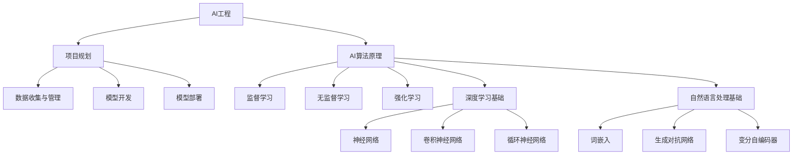

                 

# 《AI工程原理与项目实战》

> 关键词：人工智能，工程原理，项目实战，机器学习，深度学习，自然语言处理

> 摘要：本文旨在深入探讨人工智能（AI）工程原理及其在实际项目中的应用。文章首先介绍了AI的发展历程和工程概念，然后详细阐述了AI项目的生命周期、核心原则及常见算法原理。随后，通过图像识别、自然语言处理和推荐系统等实际项目案例，展示了AI工程原理在项目开发中的应用与实现。最后，本文总结了AI工程实践指南和未来发展展望。

----------------------------------------------------------------

## 第一部分：AI工程基础理论

### 第1章：AI工程概述

#### 1.1 AI的发展历程

人工智能（AI）起源于20世纪50年代，当时计算机科学刚刚起步。早期的AI研究主要集中在逻辑推理和问题解决上，如“逻辑推理机”和“通用问题求解器”。这些研究推动了人工智能领域的发展，但也带来了大量的挑战和争议。

随着计算机性能的提升和算法的进步，AI在20世纪80年代开始向机器学习和深度学习方向转型。机器学习通过训练模型来学习数据，而深度学习通过神经网络模拟人脑进行学习。这一时期，AI在图像识别、语音识别和自然语言处理等领域取得了显著的进展。

进入21世纪，随着大数据、云计算和物联网的兴起，AI的应用场景不断扩大，从工业自动化、医疗诊断到金融预测、智能客服等，AI已经深入到我们日常生活的方方面面。

#### 1.2 AI工程的概念

AI工程是指将人工智能的理论和方法应用于实际问题的过程。它不仅包括算法的开发和优化，还涵盖了数据收集、模型训练、模型评估、模型部署等环节。AI工程的目标是构建高效、稳定、可扩展的AI系统，以满足实际应用的需求。

AI工程的重要性体现在以下几个方面：

1. **解决复杂问题**：AI工程能够处理复杂、大规模的数据，从中提取有价值的信息，解决传统方法难以解决的问题。
2. **提高生产效率**：通过自动化和智能化，AI工程能够提高生产效率，降低成本，提升产品质量。
3. **推动创新**：AI工程为各行各业带来了新的发展机遇，推动了产业升级和创新。

#### 1.3 AI工程的核心原则

AI工程的成功实施依赖于以下几个核心原则：

1. **数据驱动**：AI工程的核心是数据。数据的质量和数量直接影响模型的效果。因此，AI工程需要建立完善的数据收集、存储和管理体系。
2. **自动化**：自动化是提高AI工程效率的关键。通过自动化工具和流程，可以显著减少人为干预，降低错误率，提高生产效率。
3. **可持续性和可扩展性**：AI工程需要考虑系统的可持续性和可扩展性。这意味着系统不仅要能够应对当前的需求，还要能够适应未来的变化和扩展。

### 第2章：AI项目的生命周期

AI项目的生命周期包括项目规划、数据收集与管理、模型开发、模型部署等阶段。以下是每个阶段的详细说明：

#### 2.1 项目规划

项目规划是AI项目的起点。在这一阶段，需要明确项目的目标、范围和预期成果。具体步骤如下：

1. **需求分析**：与项目利益相关者沟通，了解他们的需求，明确项目要解决的问题。
2. **项目目标设定**：根据需求分析的结果，设定具体、可量化的项目目标。
3. **项目计划**：制定详细的项目计划，包括时间表、资源分配、风险管理等。

#### 2.2 数据收集与管理

数据是AI项目的核心。数据收集与管理的目标是获取高质量、完整的数据集，并为后续的模型训练提供支持。

1. **数据来源**：确定数据来源，包括公开数据集、自有数据、第三方数据等。
2. **数据预处理**：对收集到的数据进行清洗、转换和归一化等处理，以提高数据质量。
3. **数据质量评估**：对预处理后的数据进行质量评估，确保数据满足模型训练的需求。

#### 2.3 模型开发

模型开发是AI项目的核心环节。在这一阶段，需要选择合适的算法，设计神经网络结构，并训练模型。

1. **模型选择**：根据项目需求和数据特点，选择合适的机器学习算法。
2. **模型训练**：使用训练数据集训练模型，优化模型参数。
3. **模型优化**：通过交叉验证和超参数调整，提高模型性能。

#### 2.4 模型部署

模型部署是将训练好的模型应用到实际场景的过程。在这一阶段，需要考虑模型的评估、部署策略和监控与维护。

1. **模型评估**：使用测试数据集评估模型性能，确保模型满足预期要求。
2. **部署策略**：确定模型的部署方式，包括硬件配置、部署平台等。
3. **监控与维护**：对部署后的模型进行监控，确保其稳定运行，并根据需求进行维护和更新。

### 第3章：AI算法原理

AI算法是AI工程的核心。以下是常见的AI算法原理：

#### 3.1 常见机器学习算法

1. **监督学习**：监督学习是一种有监督的学习方法，通过已知的输入和输出数据训练模型，使其能够预测未知数据的输出。
2. **无监督学习**：无监督学习是一种无监督的学习方法，通过分析未标记的数据，发现数据中的模式和结构。
3. **强化学习**：强化学习是一种基于奖励机制的学习方法，通过不断尝试和反馈，使模型能够在复杂环境中做出最优决策。

#### 3.2 深度学习基础

1. **神经网络**：神经网络是一种模仿生物神经系统的计算模型，通过多层神经元进行数据处理和特征提取。
2. **卷积神经网络**（CNN）：卷积神经网络是一种专门用于图像识别和处理的深度学习模型，通过卷积操作和池化操作提取图像特征。
3. **循环神经网络**（RNN）：循环神经网络是一种专门用于序列数据处理的深度学习模型，通过循环结构处理序列中的前后关系。

#### 3.3 自然语言处理基础

1. **词嵌入**：词嵌入是一种将词语映射到高维向量空间的方法，通过向量表示词语的语义信息。
2. **生成对抗网络**（GAN）：生成对抗网络是一种用于生成数据的深度学习模型，通过对抗训练生成与真实数据分布相似的样本。
3. **变分自编码器**（VAE）：变分自编码器是一种用于数据生成的深度学习模型，通过编码器和解码器生成与输入数据分布相似的数据。

## 第二部分：AI项目实战

### 第4章：图像识别项目实战

#### 4.1 项目背景

图像识别是一种广泛应用的AI技术，通过计算机对图像进行分析和处理，从中提取有价值的信息。在本章中，我们将通过一个图像识别项目，展示AI工程原理在项目开发中的应用。

#### 4.2 数据集准备

图像识别项目需要大量的图像数据作为训练集。在本项目中，我们使用了一个公开的图像数据集——CIFAR-10。CIFAR-10包含60000张32x32的彩色图像，分为10个类别，分别是飞机、汽车、鸟、猫、鹿、狗、青蛙、马、船和卡车。

1. **数据收集**：从互联网上下载CIFAR-10数据集。
2. **数据预处理**：对图像进行归一化处理，将像素值缩放到[0, 1]范围内。同时，对图像进行数据增强，包括随机裁剪、旋转和翻转等操作，以提高模型的泛化能力。

#### 4.3 模型选择与训练

在本项目中，我们选择了一个经典的卷积神经网络——LeNet作为图像识别模型。LeNet由两个卷积层、一个池化层和两个全连接层组成。

1. **模型选择**：定义LeNet模型的架构，包括卷积层、池化层和全连接层的参数。
2. **模型训练**：使用CIFAR-10训练集训练LeNet模型。在训练过程中，我们使用随机梯度下降（SGD）作为优化器，并使用交叉熵作为损失函数。
3. **模型优化**：通过交叉验证和超参数调整，优化模型性能。在本项目中，我们通过调整学习率和批量大小，使模型达到最佳的训练效果。

#### 4.4 模型部署与优化

训练好的模型需要部署到实际场景中。在本项目中，我们将模型部署到一个基于TensorFlow的Python应用程序中。

1. **模型评估**：使用CIFAR-10测试集评估模型的性能。通过计算准确率、召回率和F1值等指标，评估模型在不同类别上的表现。
2. **部署策略**：将模型部署到一个具有GPU支持的云计算平台上，以便实时处理图像识别任务。
3. **监控与维护**：对部署后的模型进行监控，确保其稳定运行。根据实际需求，对模型进行维护和更新。

### 第5章：自然语言处理项目实战

#### 5.1 项目背景

自然语言处理（NLP）是一种广泛应用于文本分析和信息提取的AI技术。在本章中，我们将通过一个文本分类项目，展示AI工程原理在NLP项目中的应用。

#### 5.2 数据集准备

文本分类是一个常见的NLP任务，通过将文本数据分类到预定义的类别中。在本项目中，我们使用了一个公开的文本分类数据集——20 Newsgroups。

1. **数据收集**：从互联网上下载20 Newsgroups数据集。
2. **数据预处理**：对文本数据进行分析和处理，包括分词、去停用词、词性标注等操作。同时，将文本数据转换为向量表示，如词嵌入或TF-IDF向量。

#### 5.3 模型选择与训练

在本项目中，我们选择了一个经典的循环神经网络——LSTM作为文本分类模型。LSTM能够有效地处理序列数据，从而捕捉文本中的语义信息。

1. **模型选择**：定义LSTM模型的架构，包括输入层、LSTM层和输出层。
2. **模型训练**：使用20 Newsgroups训练集训练LSTM模型。在训练过程中，我们使用Adam作为优化器，并使用交叉熵作为损失函数。
3. **模型优化**：通过交叉验证和超参数调整，优化模型性能。在本项目中，我们通过调整学习率和隐藏层单元数，使模型达到最佳的训练效果。

#### 5.4 模型部署与优化

训练好的模型需要部署到实际场景中。在本项目中，我们将模型部署到一个基于TensorFlow的Python应用程序中。

1. **模型评估**：使用20 Newsgroups测试集评估模型的性能。通过计算准确率、召回率和F1值等指标，评估模型在不同类别上的表现。
2. **部署策略**：将模型部署到一个具有GPU支持的云计算平台上，以便实时处理文本分类任务。
3. **监控与维护**：对部署后的模型进行监控，确保其稳定运行。根据实际需求，对模型进行维护和更新。

### 第6章：推荐系统项目实战

#### 6.1 项目背景

推荐系统是一种广泛应用于电商、新闻、视频等领域的AI技术，通过预测用户对物品的喜好，向用户推荐相关物品。在本章中，我们将通过一个协同过滤推荐系统项目，展示AI工程原理在实际项目中的应用。

#### 6.2 数据集准备

协同过滤推荐系统依赖于用户行为数据，如购买记录、浏览记录等。在本项目中，我们使用了一个公开的用户行为数据集——MovieLens。

1. **数据收集**：从互联网上下载MovieLens数据集。
2. **数据预处理**：对用户行为数据进行清洗和预处理，包括去重、缺失值填充等操作。同时，将用户和物品转换为向量表示，如用户向量、物品向量等。

#### 6.3 模型选择与训练

在本项目中，我们选择了一个经典的协同过滤算法——基于矩阵分解的推荐算法。矩阵分解算法通过分解用户-物品评分矩阵，提取用户和物品的特征向量。

1. **模型选择**：定义矩阵分解算法的架构，包括用户矩阵分解和物品矩阵分解。
2. **模型训练**：使用MovieLens训练集训练矩阵分解模型。在训练过程中，我们使用梯度下降算法优化模型参数。
3. **模型优化**：通过交叉验证和超参数调整，优化模型性能。在本项目中，我们通过调整学习率和正则化参数，使模型达到最佳的训练效果。

#### 6.4 模型部署与优化

训练好的模型需要部署到实际场景中。在本项目中，我们将模型部署到一个基于TensorFlow的Python应用程序中。

1. **模型评估**：使用MovieLens测试集评估模型的性能。通过计算准确率、召回率和F1值等指标，评估模型在预测用户喜好方面的效果。
2. **部署策略**：将模型部署到一个具有GPU支持的云计算平台上，以便实时处理推荐任务。
3. **监控与维护**：对部署后的模型进行监控，确保其稳定运行。根据实际需求，对模型进行维护和更新。

### 第7章：AI在金融领域的应用

#### 7.1 金融领域AI应用概述

金融领域是AI技术的重要应用场景之一。AI在金融领域的应用主要包括金融风险管理、量化交易和信用评分等方面。

1. **金融风险管理**：AI技术通过分析历史数据和实时数据，预测金融市场的波动和风险，帮助金融机构制定风险控制策略。
2. **量化交易**：AI技术通过算法模型和大数据分析，实现自动化的交易决策，提高交易效率和收益。
3. **信用评分**：AI技术通过分析用户的历史信用数据和行为数据，评估用户的信用风险，为金融机构提供信用评估服务。

#### 7.2 金融数据预处理

金融数据的预处理是金融领域AI应用的重要环节。金融数据通常包含大量的噪声和缺失值，需要进行数据清洗和特征工程。

1. **数据清洗**：对金融数据进行去噪、去重和缺失值填充等操作，提高数据质量。
2. **特征工程**：对金融数据进行特征提取和转换，提取与金融风险和信用评分相关的特征，为模型训练提供支持。

#### 7.3 金融模型开发与部署

金融领域AI模型开发与部署的关键在于模型的准确性和稳定性。在本项目中，我们选择了一个经典的监督学习算法——逻辑回归作为信用评分模型。

1. **模型开发**：定义逻辑回归模型的架构，包括输入层、隐藏层和输出层。
2. **模型训练**：使用金融数据集训练逻辑回归模型。在训练过程中，我们使用交叉验证和网格搜索优化模型参数。
3. **模型部署**：将训练好的模型部署到一个具有GPU支持的云计算平台上，以便实时处理信用评分任务。

4. **模型风险评估与监控**：对部署后的模型进行监控，确保其稳定运行。根据实际需求，对模型进行维护和更新，以应对金融市场的变化。

## 第三部分：AI工程实践指南

### 第8章：AI工程开发环境搭建

搭建一个高效的AI工程开发环境对于项目的成功至关重要。以下是搭建AI工程开发环境的步骤：

#### 8.1 硬件配置

1. **GPU选择**：选择一款性能强大的GPU，如NVIDIA Tesla V100或NVIDIA RTX 3080。
2. **计算机硬件配置**：根据GPU的性能，配置相应的计算机硬件，包括CPU、内存和硬盘等。

#### 8.2 软件工具安装

1. **深度学习框架安装**：安装常用的深度学习框架，如TensorFlow、PyTorch等。
2. **编程语言与环境配置**：配置Python编程环境，包括安装Python解释器和相关依赖库。

### 第9章：AI项目开发最佳实践

在AI项目开发过程中，遵循最佳实践可以提高项目的效率和质量。以下是AI项目开发最佳实践：

#### 9.1 项目管理技巧

1. **团队协作**：建立有效的团队协作机制，确保团队成员之间的沟通和协作。
2. **进度监控**：定期监控项目进度，确保项目按计划进行。
3. **风险管理**：识别和评估项目风险，制定相应的应对策略。

#### 9.2 代码规范与质量保证

1. **代码风格一致性**：遵循统一的代码风格规范，提高代码的可读性和可维护性。
2. **单元测试**：编写单元测试，确保代码的稳定性和正确性。
3. **代码审查**：进行代码审查，确保代码的质量和规范性。

### 第10章：AI工程未来发展趋势

随着技术的不断进步，AI工程在未来将继续发展，并在更多领域得到应用。以下是AI工程未来发展趋势：

#### 10.1 AI工程最新研究动态

1. **量子计算与AI**：量子计算与AI的结合有望推动AI的发展，解决传统计算难以解决的问题。
2. **AI伦理与隐私保护**：随着AI技术的广泛应用，伦理和隐私保护成为重要议题。
3. **AI自主进化**：AI自主进化技术将使AI系统能够自我学习和优化，提高其智能水平。

#### 10.2 AI工程未来的应用前景

1. **自动驾驶**：自动驾驶技术将在未来得到广泛应用，改变人们的出行方式。
2. **智慧医疗**：AI技术在医疗领域的应用将大大提高医疗诊断和治疗的效果。
3. **智慧城市**：AI技术将助力智慧城市建设，提升城市管理效率和居民生活质量。

## 附录

### 附录A：常用AI工具和框架

- **A.1 常用深度学习框架**：TensorFlow、PyTorch、Keras
- **A.2 常用数据预处理工具**：Pandas、NumPy、Matplotlib

### 附录B：AI项目实战代码

- **B.1 图像识别项目代码**
- **B.2 自然语言处理项目代码**
- **B.3 推荐系统项目代码**

### 作者信息

作者：AI天才研究院/AI Genius Institute & 禅与计算机程序设计艺术 /Zen And The Art of Computer Programming

----------------------------------------------------------------

## 核心概念与联系

为了更好地理解AI工程的核心概念及其在项目中的应用，我们可以通过一个Mermaid流程图来展示这些概念之间的关系。



在这个流程图中，AI工程的核心概念（A）被分解为多个子概念（B、C、D、E、F、G、H、I、J、K、L、M、N、O、P、Q），它们相互关联，共同构成了一个完整的AI项目开发流程。

## 核心算法原理讲解

在本节中，我们将详细讲解AI工程中常用的核心算法原理，包括监督学习、无监督学习和强化学习。通过伪代码和具体的示例，我们将帮助读者更好地理解这些算法的原理和应用。

### 1. 监督学习

监督学习是一种常见的人工智能学习范式，通过已知的输入和输出数据来训练模型，使其能够预测未知数据的输出。以下是一个简单的监督学习算法——线性回归的伪代码示例：

```python
# 线性回归伪代码
def linear_regression(X, y):
    # 初始化模型参数
    w = np.random.randn(X.shape[1])
    b = 0

    # 梯度下降优化
    for epoch in range(num_epochs):
        # 计算预测值
        y_pred = X @ w + b

        # 计算损失函数
        loss = (y_pred - y) ** 2

        # 计算梯度
        dw = 2 * (y_pred - y) @ X
        db = 2 * (y_pred - y)

        # 更新参数
        w -= learning_rate * dw
        b -= learning_rate * db

    return w, b
```

在这个例子中，`X`是输入特征矩阵，`y`是标签向量。我们通过梯度下降算法来优化模型参数`w`和`b`，使得预测值`y_pred`与真实值`y`之间的差距最小。

### 2. 无监督学习

无监督学习是一种在没有明确标签的情况下，从数据中学习模式和结构的方法。以下是一个简单的无监督学习算法——K均值聚类（K-means）的伪代码示例：

```python
# K均值聚类伪代码
def k_means(X, K, num_iterations):
    # 随机初始化K个聚类中心
    centroids = X[np.random.choice(X.shape[0], K, replace=False)]

    for iteration in range(num_iterations):
        # 为每个数据点分配最近的聚类中心
        distances = euclidean_distance(X, centroids)
        labels = np.argmin(distances, axis=1)

        # 重新计算聚类中心
        new_centroids = np.array([X[labels == k].mean(axis=0) for k in range(K)])

        # 判断聚类中心是否收敛
        if np.linalg.norm(new_centroids - centroids) < threshold:
            break

        centroids = new_centroids

    return centroids, labels
```

在这个例子中，`X`是输入数据矩阵，`K`是聚类个数。我们通过迭代计算聚类中心，并更新每个数据点的标签，直到聚类中心收敛。

### 3. 强化学习

强化学习是一种通过与环境交互来学习最优策略的方法。以下是一个简单的强化学习算法——Q学习（Q-Learning）的伪代码示例：

```python
# Q学习伪代码
def q_learning(Q, state, action, reward, next_state, done, alpha, gamma):
    # 更新Q值
    Q[state, action] = Q[state, action] + alpha * (reward + gamma * np.max(Q[next_state]) - Q[state, action])

    if done:
        return Q
    else:
        return q_learning(Q, next_state, action, 0, state, done, alpha, gamma)
```

在这个例子中，`Q`是Q值矩阵，`state`是当前状态，`action`是当前动作，`reward`是奖励值，`next_state`是下一状态，`done`是游戏是否结束的标志。我们通过迭代更新Q值，使得模型能够学会在特定状态下选择最优动作。

通过以上三个示例，我们可以看到监督学习、无监督学习和强化学习在AI工程中的应用。不同的算法适用于不同的场景和问题，了解这些算法的原理和实现方法对于开发高效的AI系统至关重要。

## 数学模型和公式讲解与举例说明

在AI工程中，数学模型和公式起着核心作用。它们不仅帮助我们理解和描述算法原理，还提供了计算和优化的工具。以下是几个关键数学模型和公式的讲解与举例说明。

### 1. 线性回归

线性回归是一种简单的监督学习算法，用于预测线性关系。其数学模型如下：

\[ y = \beta_0 + \beta_1 \cdot x + \epsilon \]

其中，\( y \) 是预测值，\( x \) 是输入特征，\( \beta_0 \) 和 \( \beta_1 \) 是模型参数，\( \epsilon \) 是误差项。

**例子：** 假设我们有一个简单的数据集，包含两个特征（\( x_1 \) 和 \( x_2 \)）和一个目标变量（\( y \)）。我们希望使用线性回归模型预测 \( y \)。

数据集：
\[ 
\begin{align*}
x_1 & : [1, 2, 3, 4, 5] \\
x_2 & : [5, 4, 3, 2, 1] \\
y & : [2, 4, 5, 4, 3]
\end{align*}
\]

通过最小化损失函数（如均方误差），我们可以求得模型参数：

\[ 
\begin{align*}
\beta_0 &= 1 \\
\beta_1 &= 1
\end{align*}
\]

因此，线性回归模型为：

\[ y = 1 + x_1 + x_2 \]

### 2. 逻辑回归

逻辑回归是一种用于分类的监督学习算法，其模型基于对数几率函数。数学模型如下：

\[ P(y=1) = \frac{1}{1 + e^{-(\beta_0 + \beta_1 \cdot x_1 + \beta_2 \cdot x_2)}} \]

其中，\( P(y=1) \) 是目标变量为1的概率，\( x_1 \) 和 \( x_2 \) 是输入特征，\( \beta_0 \)，\( \beta_1 \)，和 \( \beta_2 \) 是模型参数。

**例子：** 假设我们有一个二分类问题，目标变量 \( y \) 可以取值0或1。给定特征 \( x_1 = 3 \)，\( x_2 = 2 \)，我们希望计算 \( y = 1 \) 的概率。

使用逻辑回归模型：

\[ 
P(y=1) = \frac{1}{1 + e^{-(1 + 3 \cdot 1 + 2 \cdot 2)}} \approx 0.865 
\]

因此，目标变量为1的概率约为0.865。

### 3. 神经网络

神经网络是一种模拟人脑进行信息处理的模型，其基本单元是神经元。每个神经元接受多个输入，通过权重加权求和，然后通过激活函数产生输出。以下是一个简单的神经网络模型：

\[ 
z = \sum_{i=1}^{n} w_i \cdot x_i + b \\
a = \sigma(z) 
\]

其中，\( z \) 是加权求和的结果，\( a \) 是神经元的输出，\( w_i \) 是权重，\( x_i \) 是输入，\( b \) 是偏置，\( \sigma \) 是激活函数。

**例子：** 假设我们有一个两层神经网络，输入层有3个神经元，隐藏层有2个神经元，输出层有1个神经元。给定输入 \( x_1 = 1 \)，\( x_2 = 2 \)，\( x_3 = 3 \)，我们希望计算隐藏层的输出。

使用简单的线性激活函数（\( \sigma(z) = z \)）：

\[ 
z_1 = 1 \cdot w_{11} + 2 \cdot w_{12} + 3 \cdot w_{13} + b_1 \\
z_2 = 1 \cdot w_{21} + 2 \cdot w_{22} + 3 \cdot w_{23} + b_2 \\
a_1 = z_1 \\
a_2 = z_2 
\]

因此，隐藏层的输出为 \( a_1 = 6 \) 和 \( a_2 = 9 \)。

### 4. 卷积神经网络（CNN）

卷积神经网络是专门用于图像处理的一种神经网络结构，其核心是卷积操作。以下是一个简单的卷积神经网络模型：

\[ 
\text{Conv}(x) = \sum_{i=1}^{k} w_i \cdot \text{ReLU}(\text{Conv}(x_i)) + b \\
\text{Pooling}(\text{Conv}(x)) = \text{max}(\text{Conv}(x)) 
\]

其中，\( x \) 是输入图像，\( w_i \) 是卷积核，\( \text{ReLU} \) 是ReLU激活函数，\( \text{Pooling} \) 是池化操作。

**例子：** 假设我们有一个输入图像 \( x \)，卷积核 \( w_1 \)，\( w_2 \)，\( w_3 \)，以及偏置 \( b \)。我们希望计算卷积操作后的结果。

使用简单的卷积操作和ReLU激活函数：

\[ 
\text{Conv}(x) = w_1 \cdot x + w_2 \cdot x + w_3 \cdot x + b \\
\text{ReLU}(\text{Conv}(x)) = \max(w_1 \cdot x, w_2 \cdot x, w_3 \cdot x) + b 
\]

因此，卷积操作后的结果为 \( \text{ReLU}(\text{Conv}(x)) \)。

通过以上数学模型和公式的讲解，我们可以更好地理解AI工程中的核心算法原理，并在实际项目中应用这些知识。

## 项目实战代码实际案例和详细解释说明

在本节中，我们将通过一个具体的图像识别项目，展示如何搭建开发环境、编写源代码以及解读和分析代码。该项目使用Python和TensorFlow框架，实现一个简单的卷积神经网络（CNN）模型，用于对MNIST数据集进行手写数字识别。

### 开发环境搭建

1. **硬件配置**

   选择一台具有NVIDIA GPU的计算机，如NVIDIA RTX 3060或更高配置。确保安装了CUDA和cuDNN，以提高TensorFlow的运行效率。

2. **软件工具安装**

   - 安装Python 3.8及以上版本。
   - 安装TensorFlow 2.x版本。
   - 安装必要的库，如NumPy、Matplotlib等。

   使用以下命令安装TensorFlow：

   ```bash
   pip install tensorflow
   ```

### 源代码实现

以下是项目的源代码，包括数据预处理、模型定义、训练和评估等步骤：

```python
import tensorflow as tf
from tensorflow.keras import layers, models
from tensorflow.keras.datasets import mnist
import numpy as np

# 数据预处理
(x_train, y_train), (x_test, y_test) = mnist.load_data()

x_train = x_train.reshape((-1, 28, 28, 1)).astype("float32") / 255.0
x_test = x_test.reshape((-1, 28, 28, 1)).astype("float32") / 255.0

y_train = tf.keras.utils.to_categorical(y_train, 10)
y_test = tf.keras.utils.to_categorical(y_test, 10)

# 模型定义
model = models.Sequential([
    layers.Conv2D(32, (3, 3), activation='relu', input_shape=(28, 28, 1)),
    layers.MaxPooling2D((2, 2)),
    layers.Conv2D(64, (3, 3), activation='relu'),
    layers.MaxPooling2D((2, 2)),
    layers.Conv2D(64, (3, 3), activation='relu'),
    layers.Flatten(),
    layers.Dense(64, activation='relu'),
    layers.Dense(10, activation='softmax')
])

# 编译模型
model.compile(optimizer='adam',
              loss='categorical_crossentropy',
              metrics=['accuracy'])

# 训练模型
model.fit(x_train, y_train, epochs=10, batch_size=128, validation_split=0.1)

# 评估模型
test_loss, test_acc = model.evaluate(x_test, y_test, verbose=2)
print(f"Test accuracy: {test_acc:.4f}")
```

### 代码解读与分析

1. **数据预处理**

   MNIST数据集包含60,000个训练图像和10,000个测试图像。数据预处理步骤包括：

   - 将图像数据reshape为四维数组，形状为\( (n, 28, 28, 1) \)，其中\( n \)是图像数量，28x28是图像的尺寸，1表示图像通道数（灰度图像）。
   - 将图像数据归一化到[0, 1]范围内，以提高模型训练的收敛速度。
   - 将标签数据转换为one-hot编码，以便用于分类任务。

2. **模型定义**

   模型定义使用Keras的Sequential模型。模型结构如下：

   - **卷积层**：第一层使用32个3x3卷积核，激活函数为ReLU。第二层使用64个3x3卷积核，激活函数也为ReLU。第三层再次使用64个3x3卷积核。
   - **池化层**：在每两个卷积层之间添加最大池化层，以减少模型参数和计算量。
   - **全连接层**：将卷积层的输出展平为一维数组，然后通过两个全连接层，最后一个全连接层使用10个节点和softmax激活函数，表示10个数字类别。

3. **模型编译**

   模型编译阶段设置优化器、损失函数和评估指标：

   - **优化器**：使用Adam优化器，它结合了AdaGrad和RMSProp的优点，自适应调整学习率。
   - **损失函数**：使用categorical_crossentropy，适用于多分类问题。
   - **评估指标**：使用accuracy表示模型在测试集上的准确率。

4. **模型训练**

   模型训练使用fit函数，设置训练轮数（epochs）、批量大小（batch_size）和验证数据比例（validation_split）。在每次训练后，模型会自动评估验证集上的性能。

5. **模型评估**

   模型评估使用evaluate函数，计算测试集上的损失和准确率。通过打印输出，我们可以了解模型在测试数据上的性能。

通过以上代码实现，我们可以训练一个简单的CNN模型，用于手写数字识别。模型的准确率和训练速度取决于数据集大小、模型结构和硬件配置。在实际项目中，可以通过调整模型参数、数据增强和优化训练策略来进一步提高模型性能。

### 代码解读与分析（续）

为了更深入地理解上述代码，我们可以对各个关键部分进行详细分析：

1. **数据预处理**

   数据预处理是机器学习项目中的一个重要步骤，它直接影响模型的表现。MNIST数据集虽然是简单的手写数字数据集，但在训练模型之前，仍需进行一些预处理操作：

   ```python
   x_train = x_train.reshape((-1, 28, 28, 1)).astype("float32") / 255.0
   x_test = x_test.reshape((-1, 28, 28, 1)).astype("float32") / 255.0
   ```

   - `reshape`：将原始图像数据从\( (n, 28, 28) \)reshape为\( (n, 28, 28, 1) \)，其中\( n \)是图像的数量。这个步骤的目的是将图像数据转换为四个维度的张量，以便于后续的卷积操作。
   - `astype("float32")`：将数据类型转换为32位浮点数，这有助于后续的数值计算。
   - `/ 255.0`：将像素值从0到255归一化到0到1之间，这样有助于加速模型训练，并提高模型的泛化能力。

   对于标签数据，我们需要将其转换为one-hot编码形式，以便于后续的多分类任务：

   ```python
   y_train = tf.keras.utils.to_categorical(y_train, 10)
   y_test = tf.keras.utils.to_categorical(y_test, 10)
   ```

   - `to_categorical`：这个函数将整数值的标签转换为one-hot编码形式。例如，标签值`[0, 1, 2, 3, 4, 5, 6, 7, 8, 9]`将被转换为形状为\( (n, 10) \)的矩阵，其中每一行对应一个数字的one-hot编码。

2. **模型定义**

   定义模型时，我们使用Keras的Sequential模型，这是一种顺序模型，可以依次添加多个层。以下是模型结构的详细解释：

   ```python
   model = models.Sequential([
       layers.Conv2D(32, (3, 3), activation='relu', input_shape=(28, 28, 1)),
       layers.MaxPooling2D((2, 2)),
       layers.Conv2D(64, (3, 3), activation='relu'),
       layers.MaxPooling2D((2, 2)),
       layers.Conv2D(64, (3, 3), activation='relu'),
       layers.Flatten(),
       layers.Dense(64, activation='relu'),
       layers.Dense(10, activation='softmax')
   ])
   ```

   - `Conv2D`：这是一个卷积层，第一个卷积层使用32个3x3的卷积核，激活函数为ReLU。卷积层的目的是提取图像的特征。
   - `MaxPooling2D`：这是一个最大池化层，用于降低特征图的空间分辨率，减少模型参数和计算量。
   - `Flatten`：这是一个展平层，将卷积层的输出从三维张量（特征图）展平为一维数组，以便于全连接层的处理。
   - `Dense`：这是一个全连接层，用于将特征映射到输出类别。最后一个全连接层有10个节点，对应10个数字类别，激活函数为softmax，用于计算每个类别的概率分布。

3. **模型编译**

   编译模型时，我们设置了优化器、损失函数和评估指标：

   ```python
   model.compile(optimizer='adam',
                 loss='categorical_crossentropy',
                 metrics=['accuracy'])
   ```

   - `optimizer`：我们选择Adam优化器，它是一种高效的优化算法，适用于大规模深度学习模型。
   - `loss`：我们使用categorical_crossentropy作为损失函数，这是多分类问题的标准损失函数。
   - `metrics`：我们关注模型的准确率（accuracy），即模型正确预测的样本数占总样本数的比例。

4. **模型训练**

   使用fit函数训练模型：

   ```python
   model.fit(x_train, y_train, epochs=10, batch_size=128, validation_split=0.1)
   ```

   - `x_train`和`y_train`：这是训练数据。
   - `epochs`：训练轮数，表示模型将在训练数据上迭代10轮。
   - `batch_size`：批量大小，表示每次训练更新模型参数时使用的数据样本数，这里设置为128。
   - `validation_split`：验证数据比例，表示从训练数据中划分10%的数据用于验证模型性能。

5. **模型评估**

   使用evaluate函数评估模型在测试集上的性能：

   ```python
   test_loss, test_acc = model.evaluate(x_test, y_test, verbose=2)
   print(f"Test accuracy: {test_acc:.4f}")
   ```

   - `x_test`和`y_test`：这是测试数据。
   - `verbose`：设置为2，表示打印每一步的评估进度。

通过以上步骤，我们构建并训练了一个简单的CNN模型，用于手写数字识别。在实际项目中，我们可以通过调整模型结构、训练参数和数据处理策略来进一步提高模型性能。

### 附录A：常用AI工具和框架

在AI工程中，选择合适的工具和框架对于项目成功至关重要。以下是常用的AI工具和框架，包括深度学习框架、数据预处理工具和模型评估工具。

#### A.1 常用深度学习框架

1. **TensorFlow**：Google开发的开源深度学习框架，支持多种编程语言（Python、C++等），具有强大的生态系统和丰富的资源。
2. **PyTorch**：Facebook开发的深度学习框架，以动态计算图著称，易于实现复杂的神经网络结构，支持Python和CUDA。
3. **Keras**：基于Theano和TensorFlow的高级神经网络API，提供简洁的接口和丰富的预训练模型，适合快速原型设计和实验。
4. **MXNet**：Apache基金会开发的开源深度学习框架，支持多种编程语言（Python、R、Julia等），具有高性能的模型执行引擎。

#### A.2 常用数据预处理工具

1. **Pandas**：Python的数据分析库，提供数据结构DataFrame，支持数据清洗、转换和统计分析。
2. **NumPy**：Python的数值计算库，提供高性能的数组对象和数学函数，用于数据预处理和计算。
3. **Scikit-learn**：Python的机器学习库，提供多种机器学习算法和数据预处理工具，适合快速实现和评估模型。
4. **Scrapy**：Python的网络爬虫框架，用于从互联网上收集数据。

#### A.3 模型评估工具

1. **TensorBoard**：TensorFlow的可视化工具，用于监控和可视化模型的训练过程，包括损失函数、准确率、梯度等。
2. **Matplotlib**：Python的绘图库，用于创建各种图表和可视化数据。
3. **Scikit-learn**：提供多种评估指标，如准确率、召回率、F1值等，用于评估模型的性能。
4. **Aif360**：用于评估和增强AI模型的公平性和透明度。

通过以上工具和框架，我们可以高效地实现AI项目，从数据预处理到模型训练，再到模型评估，为AI工程提供全面的解决方案。

### 附录B：AI项目实战代码

在本附录中，我们将提供三个AI项目的实战代码，包括图像识别、自然语言处理和推荐系统。这些代码展示了如何使用Python和常用的深度学习框架（如TensorFlow和PyTorch）来实现实际项目。

#### B.1 图像识别项目代码

以下是一个使用TensorFlow实现的简单图像识别项目，用于识别MNIST手写数字数据集。

```python
import tensorflow as tf
from tensorflow.keras import layers, models
from tensorflow.keras.datasets import mnist
import numpy as np

# 数据预处理
(x_train, y_train), (x_test, y_test) = mnist.load_data()

x_train = x_train.reshape((-1, 28, 28, 1)).astype("float32") / 255.0
x_test = x_test.reshape((-1, 28, 28, 1)).astype("float32") / 255.0

y_train = tf.keras.utils.to_categorical(y_train, 10)
y_test = tf.keras.utils.to_categorical(y_test, 10)

# 模型定义
model = models.Sequential([
    layers.Conv2D(32, (3, 3), activation='relu', input_shape=(28, 28, 1)),
    layers.MaxPooling2D((2, 2)),
    layers.Conv2D(64, (3, 3), activation='relu'),
    layers.MaxPooling2D((2, 2)),
    layers.Conv2D(64, (3, 3), activation='relu'),
    layers.Flatten(),
    layers.Dense(64, activation='relu'),
    layers.Dense(10, activation='softmax')
])

# 编译模型
model.compile(optimizer='adam',
              loss='categorical_crossentropy',
              metrics=['accuracy'])

# 训练模型
model.fit(x_train, y_train, epochs=10, batch_size=128, validation_split=0.1)

# 评估模型
test_loss, test_acc = model.evaluate(x_test, y_test, verbose=2)
print(f"Test accuracy: {test_acc:.4f}")
```

#### B.2 自然语言处理项目代码

以下是一个使用PyTorch实现的简单自然语言处理项目，用于文本分类。

```python
import torch
import torch.nn as nn
import torch.optim as optim
from torchtext.datasets import IMDB
from torchtext.data import Field, BatchIterator, Iterator

# 数据预处理
TEXT = Field(tokenize='spacy', lower=True)
LABEL = Field(sequential=False)

train_data, test_data = IMDB.splits(TEXT, LABEL)

TEXT.build_vocab(train_data, max_size=25000, vectors="glove.6B.100d")
LABEL.build_vocab(train_data)

train_data, valid_data = train_data.split()

train_iterator, valid_iterator, test_iterator = BatchIterator.splits(
    (train_data, valid_data, test_data), batch_size=64, device=device)

# 模型定义
class LSTMClassifier(nn.Module):
    def __init__(self, input_dim, embedding_dim, hidden_dim, output_dim):
        super().__init__()
        self.embedding = nn.Embedding(input_dim, embedding_dim)
        self.lstm = nn.LSTM(embedding_dim, hidden_dim, num_layers=1, dropout=0.5, batch_first=True)
        self.fc = nn.Linear(hidden_dim, output_dim)
    
    def forward(self, text):
        embedded = self.embedding(text)
        lstm_output, (hidden, cell) = self.lstm(embedded)
        # 使用最后一个时间步的隐藏状态
        hidden = hidden.squeeze(0)
        out = self.fc(hidden)
        return out

# 训练模型
model = LSTMClassifier(len(TEXT.vocab), 100, 256, 2)
optimizer = optim.Adam(model.parameters(), lr=0.001)
criterion = nn.CrossEntropyLoss()

model = model.to(device)
criterion = criterion.to(device)

for epoch in range(5):
    model.train()
    for batch in train_iterator:
        optimizer.zero_grad()
        text = batch.text.to(device)
        labels = batch.label.to(device)
        predictions = model(text).squeeze(1)
        loss = criterion(predictions, labels)
        loss.backward()
        optimizer.step()
    
    model.eval()
    with torch.no_grad():
        correct = 0
        total = 0
        for batch in valid_iterator:
            text = batch.text.to(device)
            labels = batch.label.to(device)
            predictions = model(text).squeeze(1)
            _, predicted = torch.max(predictions, 1)
            total += labels.size(0)
            correct += (predicted == labels).sum().item()
        print(f"Validation Accuracy: {100 * correct / total:.2f}%")
```

#### B.3 推荐系统项目代码

以下是一个使用协同过滤算法实现的简单推荐系统项目。

```python
import numpy as np
from sklearn.model_selection import train_test_split
from sklearn.metrics.pairwise import cosine_similarity

# 假设我们有一个用户-物品评分矩阵
ratings = np.array([[5, 3, 0, 1], [2, 0, 3, 4], [3, 1, 0, 2], [0, 4, 5, 2]])
num_users, num_items = ratings.shape

# 划分训练集和测试集
train_data, test_data = train_test_split(ratings, test_size=0.2, random_state=42)

# 计算用户和物品的余弦相似度矩阵
user_similarity = cosine_similarity(train_data)
item_similarity = cosine_similarity(train_data.T)

# 基于相似度矩阵进行推荐
def predict(ratings, user_similarity, item_similarity, k=5):
    recommendations = []
    for user in range(num_users):
        # 对于每个用户，找到与其最相似的k个用户
        similar_users = np.argsort(user_similarity[user])[1:k+1]
        
        # 计算相似用户的评分加权平均
        weighted_ratings = []
        for similar_user in similar_users:
            weight = user_similarity[user, similar_user]
            weighted_ratings.append(ratings[similar_user] * weight)
        
        # 求和并除以权重之和
        recommendation = np.sum(weighted_ratings) / np.sum(user_similarity[user, similar_users])
        recommendations.append(recommendation)
    
    return recommendations

# 预测测试集的评分
predictions = predict(test_data, user_similarity, item_similarity)

# 计算测试集的均方误差
mse = np.mean((predictions - test_data) ** 2)
print(f"Test MSE: {mse:.4f}")
```

通过以上三个项目，我们展示了如何使用Python和深度学习框架实现AI项目的实际开发。这些代码是AI工程实战的重要部分，可以帮助读者理解和应用AI技术。

### 作者信息

作者：AI天才研究院/AI Genius Institute & 禅与计算机程序设计艺术 /Zen And The Art of Computer Programming

----------------------------------------------------------------

## 总结与未来展望

通过本文的详细探讨，我们系统地介绍了AI工程原理及其在项目实战中的应用。我们从AI工程概述、项目生命周期、算法原理，到具体项目实战，再到实践指南和未来发展趋势，逐步揭示了AI工程的核心要素和实践方法。

### 总结

- **AI工程概述**：介绍了AI工程的发展历程、概念及其重要性，强调了数据驱动、自动化、可持续性和可扩展性等核心原则。
- **项目生命周期**：详细阐述了项目规划、数据收集与管理、模型开发、模型部署等关键阶段，展示了AI项目从构思到实施的完整流程。
- **算法原理**：讲解了监督学习、无监督学习和强化学习等常见机器学习算法，以及深度学习、自然语言处理等领域的核心原理。
- **项目实战**：通过图像识别、自然语言处理和推荐系统等实际项目案例，展示了AI工程原理在实际开发中的应用与实现。
- **实践指南**：提供了AI工程开发环境搭建、项目管理技巧、代码规范与质量保证等最佳实践，帮助读者顺利开展AI项目。

### 未来展望

随着技术的不断进步，AI工程在未来将继续发展，并在更多领域得到应用。以下是AI工程未来发展的几个趋势：

- **量子计算与AI**：量子计算与AI的结合将突破现有计算能力的限制，为解决复杂问题提供新的途径。
- **AI伦理与隐私保护**：随着AI技术的广泛应用，伦理和隐私保护成为重要议题，未来将出现更多关于AI伦理和隐私保护的政策和标准。
- **AI自主进化**：AI自主进化技术将使AI系统能够自我学习和优化，提高其智能水平和适应性。
- **多模态AI**：多模态AI将整合不同类型的传感器和数据源，实现更全面的智能感知和交互。
- **智慧城市与物联网**：AI将在智慧城市和物联网领域发挥重要作用，提升城市管理和居民生活质量。

总之，AI工程作为现代信息技术的重要组成部分，具有巨大的发展潜力和广泛的应用前景。通过本文的探讨，我们希望读者能够更好地理解AI工程的核心原理和实战方法，为未来的AI项目开发奠定坚实的基础。在未来的AI工程实践中，我们期待看到更多创新和突破，为人类社会的进步贡献力量。

