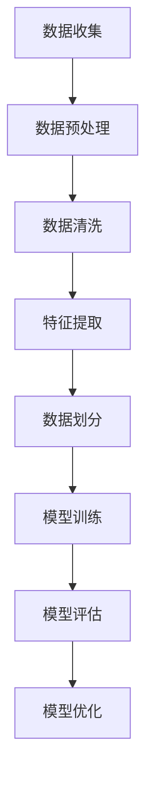

                 

## 文章标题

《AI工程学：大模型应用开发实战：数据集工程》

## 关键词

人工智能，大模型，数据集工程，应用开发，实战，数据预处理，模型训练，优化，文本分类，图像识别，推荐系统，对话系统

## 摘要

本文深入探讨了人工智能（AI）领域中的大模型应用开发实战，重点介绍了数据集工程的重要性及其在AI工程学中的应用。通过详细解析核心概念、算法原理，以及实际项目案例，本文旨在为读者提供系统化的理论知识和实践经验，帮助他们掌握大模型在各个领域的应用开发技巧。文章分为两部分：第一部分为基础理论，包括AI与工程学概述、大模型与数据集工程、数据集工程流程与工具、大模型训练与优化；第二部分为实战案例，涵盖文本分类、图像识别、推荐系统和对话系统的应用案例，通过具体的项目实战，展示大模型应用开发的完整流程和关键技巧。

---

## 第一部分：AI工程学基础理论

### 第1章：AI与工程学概述

#### 1.1 AI的发展历程

人工智能（AI）作为计算机科学的一个重要分支，起源于20世纪50年代。从最初的规则推理、知识表示，到后来的机器学习、深度学习，AI经历了多个发展阶段。随着计算能力的提升和大数据的涌现，大模型时代到来，AI在语音识别、图像处理、自然语言处理等领域取得了显著进展。

#### 1.2 工程学的定义与作用

工程学是一门应用科学，它涉及将科学原理和数学方法应用于实际问题的解决。在AI领域，工程学起着至关重要的作用。它不仅包括算法的设计和优化，还包括系统的架构设计、性能优化、测试与验证等。

#### 1.3 AI工程学的核心概念

AI工程学的核心概念包括：

- **数据集工程**：涉及数据收集、预处理、标注、清洗和划分等步骤，是模型训练的基础。
- **模型训练**：通过大量数据进行训练，使模型学会识别特征和生成预测。
- **模型优化**：通过调整模型参数和架构，提高模型性能。
- **应用开发**：将训练好的模型部署到实际应用场景中，如文本分类、图像识别、推荐系统和对话系统等。

### 第2章：大模型与数据集工程

#### 2.1 大模型的概述与特点

大模型通常指具有数百万到数十亿参数的深度学习模型，如BERT、GPT等。它们具有以下特点：

- **参数规模巨大**：能够捕捉大量特征。
- **计算资源需求高**：需要高性能的计算设备和大量的数据。
- **训练时间长**：需要大量的时间和计算资源。

#### 2.2 数据集工程的定义与重要性

数据集工程是指为了满足模型训练需求，对数据进行的一系列处理过程。数据集工程的重要性体现在：

- **数据质量**：高质量的训练数据是模型性能的关键。
- **数据规模**：大模型的训练需要大规模的数据集。
- **数据多样性**：多样的数据有助于模型泛化。

#### 2.3 大模型应用中的数据集工程挑战

在大模型应用中，数据集工程面临以下挑战：

- **数据收集与标注**：收集大量标注数据困难且成本高。
- **数据预处理**：预处理步骤繁多，包括去噪、归一化、特征提取等。
- **数据平衡**：避免数据集中某些类别的过度或不足表示。
- **数据隐私**：保护数据隐私是重要考虑因素。

### 第3章：数据集工程流程与工具

#### 3.1 数据收集与处理

数据收集是数据集工程的第一步，包括以下步骤：

- **数据源选择**：选择合适的数据源，如公共数据集、数据库或传感器数据。
- **数据获取**：通过API、爬虫或数据库连接等方式获取数据。
- **数据预处理**：包括数据清洗、去重、格式转换等。

#### 3.2 数据预处理方法

数据预处理方法包括：

- **去噪**：去除噪声数据，如缺失值、异常值等。
- **归一化**：将数据缩放到同一尺度，如使用Min-Max缩放或Z-Score归一化。
- **特征提取**：从原始数据中提取有意义的特征，如文本中的词向量、图像中的特征向量等。

#### 3.3 数据集划分与评估

数据集划分包括以下步骤：

- **训练集与测试集划分**：通常将数据集划分为80%的训练集和20%的测试集。
- **交叉验证**：通过K折交叉验证评估模型性能。
- **评估指标**：使用准确率、召回率、F1分数等评估指标评估模型性能。

#### 3.4 数据集工程工具介绍

常用的数据集工程工具包括：

- **Pandas**：用于数据清洗和预处理。
- **NumPy**：用于数值计算和数据处理。
- **Scikit-learn**：提供数据预处理和模型评估的相关函数。
- **TensorFlow和PyTorch**：用于构建和训练深度学习模型。

---

以上为第一部分的基础理论，接下来将进入第二部分的实战案例。在实战案例中，我们将通过具体的应用场景，展示大模型应用开发的完整流程和关键技巧。

---

## 第二部分：大模型应用开发实战

### 第6章：文本分类应用案例

#### 6.1 文本分类背景与挑战

文本分类是将文本数据按照特定的类别进行划分的过程，如情感分析、新闻分类等。文本分类面临的主要挑战包括：

- **词汇多样性**：文本数据中包含大量不同的词汇，如何有效地提取特征是关键。
- **长文本处理**：长文本的处理通常需要更复杂的模型。
- **数据不平衡**：某些类别可能存在数据不平衡，需要采取数据增强或调整模型结构等方法。

#### 6.2 数据集准备

以情感分析为例，数据集准备包括以下步骤：

- **数据收集**：收集包含情感标签的文本数据，如评论、新闻等。
- **数据预处理**：包括文本清洗、分词、去除停用词等。
- **数据标注**：对文本进行情感标注，如正面、负面等。
- **数据划分**：将数据集划分为训练集和测试集。

#### 6.3 模型设计与训练

文本分类的模型设计通常包括以下步骤：

- **模型选择**：选择合适的文本分类模型，如朴素贝叶斯、支持向量机、卷积神经网络等。
- **特征提取**：使用词袋模型、TF-IDF、Word2Vec等方法提取文本特征。
- **模型训练**：使用训练数据进行模型训练，并通过调整超参数优化模型性能。

#### 6.4 模型评估与优化

模型评估与优化包括以下步骤：

- **评估指标**：使用准确率、召回率、F1分数等评估模型性能。
- **模型优化**：通过调整模型结构、增加训练数据或使用更复杂的模型来提高性能。
- **超参数调优**：使用网格搜索、随机搜索等方法优化超参数。

#### 6.5 应用部署与维护

文本分类的应用部署包括以下步骤：

- **模型部署**：将训练好的模型部署到服务器或云端。
- **API接口**：为外部系统提供API接口，方便调用模型。
- **性能监控**：监控模型性能，及时发现并解决性能问题。
- **维护更新**：定期更新模型和数据，以保持模型的有效性。

---

### 第7章：图像识别应用案例

#### 7.1 图像识别背景与挑战

图像识别是计算机视觉领域的重要任务，旨在通过图像获取视觉信息。图像识别面临的主要挑战包括：

- **图像多样性**：图像数据具有很高的多样性，模型需要能够处理不同类型的图像。
- **复杂背景**：图像中可能包含复杂的背景和遮挡，这增加了识别难度。
- **低质量图像**：实际应用中可能遇到低质量图像，如模糊、噪声等。

#### 7.2 数据集准备

图像识别的数据集准备包括以下步骤：

- **数据收集**：收集包含标签的图像数据，如物体识别、场景分类等。
- **数据预处理**：包括图像清洗、缩放、裁剪等。
- **数据标注**：对图像进行标注，如物体边界框、类别标签等。

#### 7.3 模型设计与训练

图像识别的模型设计通常包括以下步骤：

- **模型选择**：选择合适的图像识别模型，如卷积神经网络（CNN）、循环神经网络（RNN）等。
- **特征提取**：使用CNN等网络结构提取图像特征。
- **模型训练**：使用训练数据进行模型训练，并通过调整超参数优化模型性能。

#### 7.4 模型评估与优化

模型评估与优化包括以下步骤：

- **评估指标**：使用准确率、召回率、F1分数等评估模型性能。
- **模型优化**：通过调整模型结构、增加训练数据或使用更复杂的模型来提高性能。
- **超参数调优**：使用网格搜索、随机搜索等方法优化超参数。

#### 7.5 应用部署与维护

图像识别的应用部署包括以下步骤：

- **模型部署**：将训练好的模型部署到服务器或云端。
- **API接口**：为外部系统提供API接口，方便调用模型。
- **性能监控**：监控模型性能，及时发现并解决性能问题。
- **维护更新**：定期更新模型和数据，以保持模型的有效性。

---

### 第8章：推荐系统应用案例

#### 8.1 推荐系统背景与挑战

推荐系统旨在根据用户的兴趣和行为为用户推荐相关内容，如商品、音乐、新闻等。推荐系统面临的主要挑战包括：

- **冷启动问题**：新用户或新商品缺乏历史数据，如何为它们推荐内容是难点。
- **数据稀疏性**：用户行为数据往往稀疏，如何利用这些数据推荐是关键。
- **实时性**：推荐系统需要快速响应用户的行为变化。

#### 8.2 数据集准备

推荐系统的数据集准备包括以下步骤：

- **用户行为数据收集**：收集用户的浏览、购买、评分等行为数据。
- **商品数据收集**：收集商品的相关信息，如名称、类别、标签等。
- **数据预处理**：包括数据清洗、去重、缺失值处理等。

#### 8.3 模型设计与训练

推荐系统的模型设计通常包括以下步骤：

- **模型选择**：选择合适的推荐算法，如协同过滤、基于内容的推荐、深度学习等。
- **特征提取**：从用户行为数据和商品数据中提取特征。
- **模型训练**：使用训练数据进行模型训练，并通过调整超参数优化模型性能。

#### 8.4 模型评估与优化

模型评估与优化包括以下步骤：

- **评估指标**：使用准确率、召回率、F1分数、MRR（平均倒数排名）等评估模型性能。
- **模型优化**：通过调整模型结构、增加训练数据或使用更复杂的模型来提高性能。
- **超参数调优**：使用网格搜索、随机搜索等方法优化超参数。

#### 8.5 应用部署与维护

推荐系统的应用部署包括以下步骤：

- **模型部署**：将训练好的模型部署到服务器或云端。
- **API接口**：为外部系统提供API接口，方便调用模型。
- **性能监控**：监控模型性能，及时发现并解决性能问题。
- **维护更新**：定期更新模型和数据，以保持模型的有效性。

---

### 第9章：对话系统应用案例

#### 9.1 对话系统背景与挑战

对话系统（Chatbot）旨在通过自然语言与用户进行交互，提供信息查询、客户服务、娱乐等。对话系统面临的主要挑战包括：

- **自然语言理解**：如何准确地理解用户的语言意图是关键。
- **语言多样性**：支持多种语言和方言。
- **对话连贯性**：保持对话的连贯性和流畅性。
- **实时性**：快速响应用户的输入。

#### 9.2 数据集准备

对话系统的数据集准备包括以下步骤：

- **对话数据收集**：收集真实对话数据，如客服对话、社交聊天等。
- **数据预处理**：包括对话文本清洗、分词、去停用词等。
- **数据标注**：对对话文本进行意图和实体标注。

#### 9.3 模型设计与训练

对话系统的模型设计通常包括以下步骤：

- **模型选择**：选择合适的对话系统模型，如基于规则、基于机器学习、基于深度学习等。
- **特征提取**：从对话文本中提取特征，如词向量、词嵌入等。
- **模型训练**：使用训练数据进行模型训练，并通过调整超参数优化模型性能。

#### 9.4 模型评估与优化

模型评估与优化包括以下步骤：

- **评估指标**：使用准确率、召回率、F1分数、用户满意度等评估模型性能。
- **模型优化**：通过调整模型结构、增加训练数据或使用更复杂的模型来提高性能。
- **超参数调优**：使用网格搜索、随机搜索等方法优化超参数。

#### 9.5 应用部署与维护

对话系统的应用部署包括以下步骤：

- **模型部署**：将训练好的模型部署到服务器或云端。
- **API接口**：为外部系统提供API接口，方便调用模型。
- **性能监控**：监控模型性能，及时发现并解决性能问题。
- **维护更新**：定期更新模型和数据，以保持模型的有效性。

---

## 附录

### 附录A：常用工具与资源汇总

#### A.1 数据集来源与处理工具

- 数据集来源：[Kaggle](https://www.kaggle.com/), [UCI Machine Learning Repository](https://archive.ics.uci.edu/ml/index.php), [TensorFlow Datasets](https://www.tensorflow.org/api_docs/python/tf/keras/datasets)
- 数据处理工具：[Pandas](https://pandas.pydata.org/), [NumPy](https://numpy.org/), [Scikit-learn](https://scikit-learn.org/stable/)

#### A.2 模型训练与优化工具

- 模型训练工具：[TensorFlow](https://www.tensorflow.org/), [PyTorch](https://pytorch.org/)
- 模型优化工具：[Hyperopt](https://hyperopt.github.io/hyperopt/), [Optuna](https://github.com/optuna/optuna)

#### A.3 应用部署与维护工具

- 部署工具：[TensorFlow Serving](https://www.tensorflow.org/tfx/serving), [Kubernetes](https://kubernetes.io/)
- 维护工具：[Grafana](https://grafana.com/), [Prometheus](https://prometheus.io/)

#### A.4 学习资源推荐

- 书籍推荐：《深度学习》（Goodfellow, Bengio, Courville 著），《机器学习实战》（Peter Harrington 著）
- 在线课程推荐：[Coursera](https://www.coursera.org/)，[edX](https://www.edx.org/)，[Udacity](https://www.udacity.com/)

### 作者

**作者：AI天才研究院/AI Genius Institute & 禅与计算机程序设计艺术 /Zen And The Art of Computer Programming** 

---

通过本文的详细阐述，我们不仅探讨了AI工程学的核心理论，还通过实战案例展示了大模型应用开发的实际操作。希望本文能够为从事AI领域的研究人员和开发者提供有价值的参考和指导。

---

以下是一个示例的Mermaid流程图，用于展示数据集工程流程：



以下是一个示例的伪代码，用于说明K-Means聚类算法：

```python
# 伪代码：K-Means聚类算法

initialize centroids
while not converged:
    for each data point x:
        assign x to the nearest centroid
    update centroids
    check for convergence
```

以下是一个示例的LaTeX数学公式，用于展示线性回归模型的表达式：

```latex
$$
y = \beta_0 + \beta_1x + \epsilon
$$
```

在撰写文章时，您可以根据实际需要嵌入这些元素，以确保文章内容的丰富性和可读性。以下是一个示例的markdown格式，展示了如何嵌入这些元素：

```markdown
### 数据集工程流程

使用Mermaid流程图展示数据集工程流程：


### 算法原理

使用伪代码展示K-Means聚类算法：

```python
# 伪代码：K-Means聚类算法

initialize centroids
while not converged:
    for each data point x:
        assign x to the nearest centroid
    update centroids
    check for convergence
```

### 数学模型

使用LaTeX格式展示线性回归模型的表达式：

$$
y = \beta_0 + \beta_1x + \epsilon
$$
```

请注意，markdown格式的代码块和LaTeX公式的书写方式，确保在生成文档时能够正确显示。在撰写文章时，您可以根据实际需要嵌入这些元素，以确保文章内容的丰富性和可读性。

