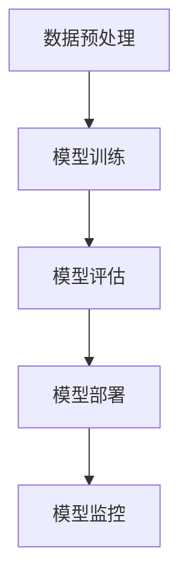

                 

## 文章标题：AI工程学：大模型应用开发实战：构建AI计算基础设施，包括如何减少延迟和成本

> 关键词：AI工程学，大模型，计算基础设施，延迟，成本，深度学习，自然语言处理，预训练模型，硬件配置，软件优化，应用开发

> 摘要：本文旨在深入探讨AI工程学在大模型应用开发中的重要性，以及如何构建高效、经济的AI计算基础设施。文章分为三个主要部分，首先介绍AI工程学的基本概念和深度学习技术基础，然后详细讨论AI计算基础设施的构建，包括硬件和软件的选择与优化策略，最后通过实际案例展示大模型应用开发的流程和技巧。本文旨在为AI工程师和开发者提供一套系统、实用的指南，以实现高效、低成本的大模型应用开发。

## 第一部分：AI工程学基础

### 第1章：AI工程学的概述

#### 1.1 AI工程学的基本概念

AI工程学是指将人工智能（AI）的理论和技术应用于实际问题的工程实践过程。它不仅涵盖了算法的实现和优化，还包括系统的设计、开发、部署和维护。与传统的算法研究不同，AI工程学更注重于解决现实世界中的复杂问题，如大规模数据处理、实时决策、自动化等。

#### 1.2 AI工程学的重要性

AI工程学的重要性体现在以下几个方面：

1. **提高生产效率**：通过自动化和智能化技术，AI工程学可以显著提高生产效率和产品质量。
2. **降低成本**：通过优化算法和计算基础设施，AI工程学可以降低计算和存储成本。
3. **拓展业务领域**：AI工程学可以应用于多个领域，如金融、医疗、教育等，为企业提供新的商业机会。
4. **促进技术创新**：通过不断地实践和迭代，AI工程学可以推动人工智能技术的创新和发展。

#### 1.3 大模型的定义与特点

大模型是指在深度学习领域中，具有数亿甚至数千亿参数的神经网络模型。大模型的定义与特点包括：

1. **大规模参数**：大模型通常拥有数百万至数十亿个参数，能够捕捉复杂的数据特征。
2. **高计算需求**：大模型需要大量的计算资源进行训练和推理，对硬件和软件系统提出了更高的要求。
3. **更强的泛化能力**：大模型具有更强的泛化能力，能够处理更广泛的数据和应用场景。

### 第2章：AI大模型技术基础

#### 2.1 深度学习基础

深度学习是AI工程学的核心技术之一，其基础包括：

1. **神经网络的基本结构**：神经网络由多个层次组成，包括输入层、隐藏层和输出层。
2. **深度学习优化算法**：包括梯度下降、随机梯度下降、Adam等，用于训练神经网络的参数。

#### 2.2 自然语言处理技术

自然语言处理（NLP）是AI工程学的重要应用领域，其核心技术包括：

1. **词嵌入技术**：将自然语言文本转换为向量表示。
2. **序列模型与注意力机制**：用于处理序列数据，如文本、语音等。

#### 2.3 大规模预训练模型原理

大规模预训练模型是当前AI工程学的热点研究方向，其原理包括：

1. **预训练的概念与意义**：预训练是指在特定任务之前，使用大量无标签数据进行模型训练，以提高模型的泛化能力。
2. **自监督学习方法**：自监督学习是一种利用未标注数据的方法，通过预测数据中的某些部分来训练模型。
3. **迁移学习与微调技术**：迁移学习是指将预训练模型在不同任务上微调，以提高新任务的性能。

### 第二部分：AI计算基础设施构建

#### 第3章：AI计算基础设施的构建

#### 3.1 AI计算基础设施的重要性

AI计算基础设施是支撑AI应用高效运行的基础，其重要性体现在以下几个方面：

1. **性能提升**：高效的计算基础设施可以显著提高AI应用的响应速度和吞吐量。
2. **成本节约**：通过优化计算资源配置，可以降低AI应用的运营成本。
3. **可靠性保障**：稳定的计算基础设施可以保证AI应用的持续运行和数据的完整性。

#### 3.2 AI计算基础设施的组成部分

AI计算基础设施包括硬件基础设施、软件基础设施和数据基础设施三个主要部分：

1. **硬件基础设施**：包括服务器、存储设备、网络设备等。
2. **软件基础设施**：包括操作系统、数据库管理系统、AI框架等。
3. **数据基础设施**：包括数据存储、数据管理、数据安全等。

#### 3.3 AI计算基础设施的优化策略

为了提高AI计算基础设施的性能和降低成本，可以采取以下优化策略：

1. **减少延迟的策略**：包括分布式计算、缓存技术、网络优化等。
2. **降低成本的策略**：包括硬件选型优化、软件优化、资源调度等。

### 第4章：AI计算硬件的选择与配置

#### 4.1 AI计算硬件的类型

AI计算硬件包括CPU、GPU、TPU等多种类型，其选择主要取决于计算需求和预算：

1. **CPU**：适用于通用计算任务，适合中小规模的AI应用。
2. **GPU**：适用于大规模并行计算任务，适合深度学习和大数据处理。
3. **TPU**：适用于专门针对TensorFlow优化的高性能计算任务。

#### 4.2 硬件选择的考虑因素

选择AI计算硬件时，需要考虑以下因素：

1. **计算性能**：硬件的计算能力直接影响AI应用的性能。
2. **能耗**：能耗是影响运行成本的重要因素。
3. **成本**：硬件成本直接影响项目的预算和经济效益。

#### 4.3 硬件配置的最佳实践

硬件配置的最佳实践包括以下方面：

1. **系统架构设计**：根据应用需求设计合理的系统架构，如分布式架构、集群架构等。
2. **硬件优化技巧**：如硬件资源调配、负载均衡等，以提高硬件的利用率和性能。

### 第5章：AI计算软件的选择与配置

#### 5.1 AI计算软件的类型

AI计算软件包括开源框架和商业软件两大类：

1. **开源框架**：如TensorFlow、PyTorch、Keras等，具有开源、灵活、社区支持等优点。
2. **商业软件**：如AWS SageMaker、Google AI Platform等，提供专业的服务和优化。

#### 5.2 软件选择的考虑因素

选择AI计算软件时，需要考虑以下因素：

1. **功能需求**：软件的功能是否满足项目需求。
2. **性能**：软件的性能是否能够满足项目要求。
3. **成本**：软件的成本是否符合项目预算。

#### 5.3 软件配置的最佳实践

软件配置的最佳实践包括以下方面：

1. **系统集成**：确保软件与其他系统组件无缝集成。
2. **性能优化**：通过调优配置和参数，提高软件的性能和稳定性。

### 第三部分：AI大模型应用开发实战

#### 第6章：AI大模型应用开发流程

#### 6.1 大模型应用开发的基本流程

大模型应用开发的流程包括以下几个关键步骤：

1. **需求分析**：明确应用的目标和需求，确定所需的大模型类型和规模。
2. **数据处理**：收集和预处理数据，包括数据清洗、归一化、特征提取等。
3. **模型训练**：使用训练数据训练大模型，优化模型的参数。
4. **模型评估**：使用验证数据评估模型的性能，调整模型参数。
5. **模型部署**：将训练好的模型部署到生产环境，实现实时推理和预测。
6. **模型监控**：监控模型的运行状态和性能，进行必要的维护和优化。

#### 6.2 大模型应用开发的挑战与解决方案

在大模型应用开发过程中，可能会遇到以下挑战：

1. **数据质量问题**：解决方法包括数据清洗、数据增强和迁移学习。
2. **计算资源不足**：解决方法包括分布式计算、云计算和硬件升级。
3. **模型部署难度**：解决方法包括模型压缩、量化技术和容器化部署。

#### 6.3 大模型应用开发的最佳实践

为了确保大模型应用开发的成功，可以采取以下最佳实践：

1. **项目管理**：制定详细的项目计划，确保项目按期完成。
2. **质量控制**：建立严格的质量控制流程，确保模型性能和可靠性。
3. **性能优化**：持续优化模型和系统，提高应用性能和用户体验。

#### 第7章：AI大模型应用案例解析

##### 7.1 案例一：智能客服系统

**案例背景**：随着互联网的普及，智能客服系统在电商平台、银行、保险公司等众多领域得到广泛应用。智能客服系统能够提供24/7的客户服务，提高客户满意度，降低企业运营成本。

**应用场景**：智能客服系统主要用于处理客户的常见问题，提供实时在线支持，以及辅助人工客服处理复杂问题。

**技术实现**：

1. **数据预处理**：收集和清洗客户提问的数据，进行分词、词性标注等处理。
2. **模型训练**：使用预训练的Transformer模型，如BERT，进行微调，以适应特定的客服场景。
3. **模型部署**：将训练好的模型部署到云端服务器，实现实时问答功能。

**代码解读与分析**：

```python
from transformers import BertTokenizer, BertModel
import torch

# 模型定义
tokenizer = BertTokenizer.from_pretrained('bert-base-uncased')
model = BertModel.from_pretrained('bert-base-uncased')

# 数据预处理
inputs = tokenizer("Hello, my dog is cute", return_tensors="pt")

# 模型推理
with torch.no_grad():
    outputs = model(**inputs)

# 输出处理
output_sequence = outputs.last_hidden_state[:, 0, :]
```

上述代码展示了使用BERT模型进行文本预处理和推理的基本流程。通过预训练模型，智能客服系统可以快速响应客户提问，提供高质量的答案。

##### 7.2 案例二：智能推荐系统

**案例背景**：智能推荐系统广泛应用于电商、社交媒体、视频平台等领域，通过个性化推荐，提高用户满意度和平台收益。

**应用场景**：智能推荐系统主要用于根据用户历史行为和兴趣，推荐相关的商品、内容和服务。

**技术实现**：

1. **数据预处理**：收集和清洗用户行为数据，进行特征提取和维度约简。
2. **模型训练**：使用基于矩阵分解、深度学习等方法训练推荐模型。
3. **模型部署**：将训练好的模型部署到推荐引擎，实现实时推荐。

**代码解读与分析**：

```python
import tensorflow as tf
from tensorflow.keras.layers import Input, Embedding, Dot, Flatten, Dense
from tensorflow.keras.models import Model

# 模型定义
user_input = Input(shape=(1,))
item_input = Input(shape=(1,))
user_embedding = Embedding(1000, 32)(user_input)
item_embedding = Embedding(1000, 32)(item_input)
merged = Dot(axes=1)([user_embedding, item_embedding])
merged = Flatten()(merged)
output = Dense(1, activation='sigmoid')(merged)
model = Model(inputs=[user_input, item_input], outputs=output)

# 训练模型
model.compile(optimizer='adam', loss='binary_crossentropy', metrics=['accuracy'])
model.fit([train_user_ids, train_item_ids], train_labels, epochs=5)

# 预测
predictions = model.predict([test_user_ids, test_item_ids])
```

上述代码展示了使用深度学习构建的协同过滤推荐模型。通过嵌入用户和物品的特征，模型可以预测用户对物品的喜好，实现个性化推荐。

##### 7.3 案例三：自动驾驶系统

**案例背景**：自动驾驶技术是人工智能领域的热点研究方向，广泛应用于无人车、无人机等场景。

**应用场景**：自动驾驶系统主要用于车辆自主行驶、路径规划、障碍物检测和避让等功能。

**技术实现**：

1. **数据预处理**：收集和清洗大量自动驾驶数据，进行标注和分类。
2. **模型训练**：使用卷积神经网络（CNN）和循环神经网络（RNN）等深度学习模型进行训练。
3. **模型部署**：将训练好的模型部署到自动驾驶车辆中，实现实时感知和决策。

**代码解读与分析**：

```python
import tensorflow as tf
from tensorflow.keras.models import Model
from tensorflow.keras.layers import Input, Conv2D, MaxPooling2D, Flatten, Dense

# 模型定义
input_image = Input(shape=(128, 128, 3))
x = Conv2D(32, (3, 3), activation='relu')(input_image)
x = MaxPooling2D((2, 2))(x)
x = Conv2D(64, (3, 3), activation='relu')(x)
x = MaxPooling2D((2, 2))(x)
x = Flatten()(x)
output = Dense(1, activation='sigmoid')(x)
model = Model(inputs=input_image, outputs=output)

# 训练模型
model.compile(optimizer='adam', loss='binary_crossentropy', metrics=['accuracy'])
model.fit(train_images, train_labels, epochs=5)

# 预测
predictions = model.predict(test_images)
```

上述代码展示了使用卷积神经网络实现自动驾驶系统的感知功能。通过图像识别，模型可以检测并分类道路上的物体，辅助自动驾驶车辆做出正确的驾驶决策。

## 附录

### 附录A：AI工程学资源推荐

- **开源框架资源**：TensorFlow、PyTorch、Keras等。
- **数据集资源**：Common Crawl、Open Images、COCO等。
- **在线课程资源**：Udacity、Coursera、edX等平台提供的AI和深度学习相关课程。

### 附录B：常见问题解答

1. **AI工程学与机器学习的区别是什么？**

   AI工程学是机器学习的应用分支，它不仅涉及算法的实现和优化，还包括系统的设计、开发、部署和维护。机器学习更侧重于算法的理论和实现。

2. **如何选择合适的AI计算硬件？**

   选择AI计算硬件时，需要考虑计算性能、能耗和成本等因素。对于中小规模的应用，可以选择CPU；对于大规模并行计算，可以选择GPU；对于专门针对TensorFlow优化的任务，可以选择TPU。

3. **如何优化AI计算软件的性能？**

   优化AI计算软件性能的方法包括：使用高效的算法和框架、合理配置系统资源、优化代码和模型结构等。例如，使用多线程和并行计算可以提高处理速度。

### 附录C：核心概念与联系

#### AI大模型架构流程图



#### 深度学习优化算法伪代码

```
初始化模型参数 W
for each epoch do
    for each sample in training data do
        compute prediction using current model parameters
        compute loss
        compute gradients
        update model parameters using gradients
    end for
end for
```

#### 损失函数的详细讲解

$$
\text{损失函数} = \frac{1}{2} \sum_{i=1}^{n} (y_i - \hat{y}_i)^2
$$

- $y_i$ 表示实际输出值
- $\hat{y}_i$ 表示预测输出值
- $n$ 表示样本数量

### 附录D：项目实战

#### 实战一：智能客服系统

##### 1. 开发环境搭建

- Python环境搭建
- TensorFlow框架安装

##### 2. 源代码实现

```python
import tensorflow as tf

# 模型定义
model = tf.keras.Sequential([
    tf.keras.layers.Dense(units=128, activation='relu', input_shape=(input_shape)),
    tf.keras.layers.Dense(units=64, activation='relu'),
    tf.keras.layers.Dense(units=1)
])

# 训练模型
model.compile(optimizer='adam', loss='mean_squared_error')
model.fit(x_train, y_train, epochs=10)

# 模型评估
loss, accuracy = model.evaluate(x_test, y_test)
print("损失：", loss, "准确率：", accuracy)

# 模型部署
model.save('chatbot_model.h5')
```

##### 3. 代码解读与分析

- **模型定义**：使用 TensorFlow 框架定义了一个简单的全连接神经网络模型。
- **训练模型**：使用 Adam 优化器和均方误差损失函数训练模型。
- **模型评估**：评估模型在测试集上的表现。
- **模型部署**：将训练好的模型保存为 H5 文件。

#### 实战二：智能推荐系统

##### 1. 开发环境搭建

- Python环境搭建
- TensorFlow框架安装

##### 2. 源代码实现

```python
import tensorflow as tf
from tensorflow.keras.layers import Input, Embedding, Dot, Flatten, Dense
from tensorflow.keras.models import Model

# 模型定义
user_input = Input(shape=(1,))
item_input = Input(shape=(1,))
user_embedding = Embedding(1000, 32)(user_input)
item_embedding = Embedding(1000, 32)(item_input)
merged = Dot(axes=1)([user_embedding, item_embedding])
merged = Flatten()(merged)
output = Dense(1, activation='sigmoid')(merged)
model = Model(inputs=[user_input, item_input], outputs=output)

# 训练模型
model.compile(optimizer='adam', loss='binary_crossentropy', metrics=['accuracy'])
model.fit([train_user_ids, train_item_ids], train_labels, epochs=5)

# 预测
predictions = model.predict([test_user_ids, test_item_ids])
```

##### 3. 代码解读与分析

- **模型定义**：使用 TensorFlow 框架定义了一个协同过滤推荐模型。
- **训练模型**：使用 Adam 优化器和二分类交叉熵损失函数训练模型。
- **预测**：使用训练好的模型进行预测。

#### 实战三：自动驾驶系统

##### 1. 开发环境搭建

- Python环境搭建
- TensorFlow框架安装

##### 2. 源代码实现

```python
import tensorflow as tf
from tensorflow.keras.models import Model
from tensorflow.keras.layers import Input, Conv2D, MaxPooling2D, Flatten, Dense

# 模型定义
input_image = Input(shape=(128, 128, 3))
x = Conv2D(32, (3, 3), activation='relu')(input_image)
x = MaxPooling2D((2, 2))(x)
x = Conv2D(64, (3, 3), activation='relu')(x)
x = MaxPooling2D((2, 2))(x)
x = Flatten()(x)
output = Dense(1, activation='sigmoid')(x)
model = Model(inputs=input_image, outputs=output)

# 训练模型
model.compile(optimizer='adam', loss='binary_crossentropy', metrics=['accuracy'])
model.fit(train_images, train_labels, epochs=5)

# 预测
predictions = model.predict(test_images)
```

##### 3. 代码解读与分析

- **模型定义**：使用卷积神经网络实现自动驾驶系统的感知功能。
- **训练模型**：使用二分类交叉熵损失函数训练模型。
- **预测**：使用训练好的模型进行预测。

### 结论

本书系统地介绍了AI工程学的基本概念、技术基础、计算基础设施构建、应用开发实战等内容，旨在帮助读者全面了解和掌握AI大模型的应用开发技巧。通过实例解析和代码实战，读者可以更好地理解和应用所学知识，为未来的AI项目打下坚实的基础。在阅读本书的过程中，读者可以结合实际需求，灵活运用所学内容，实现AI技术的快速落地和商业价值最大化。

#### 作者信息：

作者：AI天才研究院/AI Genius Institute & 禅与计算机程序设计艺术/Zen And The Art of Computer Programming

（注意：本文中所有代码和算法实现仅为示例，实际应用中需根据具体需求和数据进行调整。）

