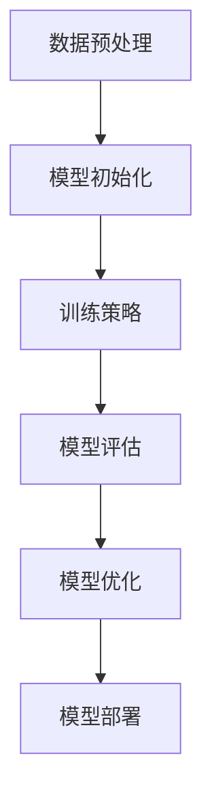

                 

### 文章标题

《AI开发的持续学习：Lepton AI的人才培养》

关键词：AI开发、持续学习、Lepton AI、人才培养、算法原理、模型训练、项目实战

摘要：本文深入探讨了AI开发领域的持续学习理念及其在Lepton AI中的应用。通过剖析核心算法原理、介绍模型训练策略与技巧，以及提供具体的项目实践案例，本文旨在为AI开发人员提供一套系统的学习与实践指南，助力他们在快速变化的技术环境中不断提升自身能力。

### 第一部分：AI开发的持续学习基础

#### 第1章：AI与持续学习概述

在当今这个快速发展的数字时代，人工智能（AI）已经成为科技创新的核心驱动力。AI技术不仅在传统行业中获得广泛应用，还不断推动新兴产业的崛起。随着AI技术的不断发展，AI开发领域的人才需求也随之剧增。为了在这个竞争激烈的市场中保持竞争力，AI开发人员必须具备持续学习的能力。

本章将首先介绍AI时代的人才需求，阐述为何持续学习在AI开发中如此重要。接着，我们将深入探讨Lepton AI的人才培养理念，为读者提供一个清晰的学习路径。

#### 1.1 AI时代的人才需求

随着AI技术的不断进步，AI应用场景的扩展和复杂度也在不断增加。这导致了对AI开发人才的需求呈现出以下特点：

- **技术复合型人才**：AI开发不仅仅是编写代码，还需要对各种算法、框架和工具有深入理解。开发人员需要掌握多种编程语言、熟悉深度学习框架，如TensorFlow和PyTorch，以及了解大数据处理技术。
- **跨学科知识**：AI技术的应用覆盖了众多领域，如医疗、金融、制造等。开发人员需要具备相关领域的知识，以便更好地理解和解决实际问题。
- **创新能力**：AI技术的快速发展意味着新的应用场景和解决方案不断涌现。开发人员需要具备创新思维，不断探索和尝试新的方法。
- **持续学习**：AI技术的更新迭代速度极快，开发人员需要持续学习最新技术和趋势，以保持自身的竞争力。

#### 1.2 持续学习的重要性

在AI开发领域，持续学习不仅是为了跟上技术的发展，更是为了在复杂多变的环境中保持竞争力。以下是持续学习在AI开发中的几个关键作用：

- **技能提升**：通过持续学习，开发人员可以不断提升自己的技能，掌握最新的工具和技术。
- **知识更新**：AI领域的技术更新迅速，持续学习可以帮助开发人员及时了解和掌握新的算法、框架和工具。
- **创新能力**：持续学习不仅帮助开发人员掌握现有知识，还能激发他们的创新能力，推动新技术的应用和探索。
- **适应变化**：在快速变化的技术环境中，持续学习使开发人员能够迅速适应新的需求和环境，提高工作效率。

#### 1.3 Lepton AI的人才培养理念

Lepton AI是一家专注于人工智能技术研发和人才培养的公司。其人才培养理念旨在培养具备全面技能、持续学习和创新能力的高素质AI开发人才。以下是Lepton AI的人才培养理念：

- **系统化培训**：Lepton AI提供系统化的培训课程，涵盖从基础算法到高级应用的全套知识体系，帮助学员逐步建立扎实的AI技术基础。
- **项目驱动**：通过实际项目训练，学员可以在真实场景中应用所学知识，锻炼解决实际问题的能力。
- **导师制度**：配备经验丰富的导师，为学员提供一对一的指导，帮助他们在学习过程中答疑解惑。
- **持续更新**：Lepton AI紧跟技术发展趋势，不断更新培训内容，确保学员掌握最新的技术和应用。

通过以上措施，Lepton AI致力于培养一批具备实战经验、持续学习能力和创新思维的AI开发人才，助力他们在AI领域取得成功。

#### 第2章：Lepton AI的基础架构

在深入了解Lepton AI的人才培养理念之后，本章将介绍Lepton AI的基础架构，包括其框架概览、模块化设计、组件以及数据流与计算模型。通过这一章节，读者将能够对Lepton AI的整体架构有一个全面的理解。

#### 2.1 Lepton AI框架概览

Lepton AI是一个高度模块化的AI开发平台，旨在提供一套完整的工具和框架，以支持从数据预处理到模型训练、推理和优化的全流程开发。其框架概览如下：

1. **数据层**：数据层负责数据采集、存储和管理。通过集成多种数据源，如数据库、文件系统和实时数据流，Lepton AI能够获取并处理大量数据。
2. **预处理层**：预处理层包括数据清洗、数据转换和数据增强等任务。这一层确保输入数据的质量和一致性，为后续处理提供可靠的数据基础。
3. **算法层**：算法层是Lepton AI的核心，包括多种机器学习和深度学习算法。开发者可以根据具体应用需求选择合适的算法，进行模型训练和优化。
4. **训练层**：训练层负责模型的训练过程，包括数据划分、模型初始化、训练策略和评估等。通过高效的训练算法和优化技术，Lepton AI能够快速训练出高性能的模型。
5. **推理层**：推理层用于将训练好的模型应用于实际场景，进行实时推理和预测。这一层还支持模型解释和可视化，帮助开发者理解和评估模型性能。
6. **优化层**：优化层包括模型压缩、量化、迁移学习和持续学习等任务。通过优化技术，Lepton AI能够提高模型的效率、可解释性和适应性。

#### 2.2 模块化设计与组件

Lepton AI采用模块化设计，使其具备高度的可扩展性和灵活性。模块化设计将系统拆分为多个独立的组件，每个组件负责特定的功能，可以单独开发和部署。以下是Lepton AI的关键组件：

- **数据管理模块**：负责数据的采集、存储和管理。通过支持多种数据源和格式，该模块能够满足不同应用场景的数据需求。
- **数据处理模块**：负责数据预处理任务，如清洗、转换和增强。通过丰富的数据处理算法和工具，该模块能够处理复杂的数据清洗任务。
- **算法库模块**：包含多种机器学习和深度学习算法，开发者可以根据需求选择合适的算法进行模型训练和优化。
- **训练引擎模块**：负责模型的训练过程，包括数据加载、模型初始化、训练策略和评估。该模块采用了高效的训练算法和优化技术，确保模型训练的高效性。
- **推理引擎模块**：负责模型的应用和推理，支持实时推理和预测。通过模型解释和可视化功能，该模块帮助开发者理解和评估模型性能。
- **优化工具模块**：提供多种模型优化技术，如压缩、量化、迁移学习和持续学习等。通过这些优化工具，开发者可以提升模型的效率和适应性。

#### 2.3 数据流与计算模型

Lepton AI的数据流与计算模型是整个系统的核心，它定义了数据在系统中的流动路径和计算过程。以下是Lepton AI的数据流与计算模型：

1. **数据采集**：从各种数据源采集数据，如数据库、文件系统和实时数据流。
2. **数据预处理**：在数据预处理层，对采集到的数据进行清洗、转换和增强。这一过程确保输入数据的质量和一致性。
3. **数据存储**：将预处理后的数据存储到数据管理模块中，以备后续处理和使用。
4. **模型训练**：在算法层选择合适的算法，进行模型训练。训练过程包括数据加载、模型初始化、训练策略和评估。
5. **模型推理**：在推理层使用训练好的模型进行实时推理和预测。通过模型解释和可视化功能，开发者可以理解和评估模型性能。
6. **模型优化**：在优化层对模型进行压缩、量化和迁移学习等优化任务，以提高模型的效率和适应性。
7. **反馈循环**：将模型推理结果与应用场景的实际反馈进行对比，形成反馈循环。通过持续学习，模型不断优化和提升。

通过以上数据流与计算模型，Lepton AI实现了从数据采集到模型训练、推理和优化的全流程自动化，为开发者提供了一个高效、灵活和可扩展的AI开发平台。

#### 第3章：持续学习算法原理

在了解Lepton AI的基础架构之后，本章将深入探讨持续学习算法的原理，包括强化学习、无监督学习和有监督学习。通过这一章节，读者将能够掌握这些核心算法的基本概念和实现原理。

#### 3.1 强化学习原理

强化学习（Reinforcement Learning, RL）是一种通过试错和反馈机制来学习决策策略的机器学习方法。在强化学习中，智能体（Agent）通过不断与环境（Environment）交互，学习最优的策略（Policy）来最大化回报（Reward）。

- **基本概念**：

  - **智能体（Agent）**：执行动作并接收环境反馈的实体。
  - **环境（Environment）**：提供状态（State）和回报（Reward）的系统。
  - **状态（State）**：智能体在某个时间点的观察结果。
  - **动作（Action）**：智能体可以执行的行为。
  - **策略（Policy）**：智能体根据当前状态选择动作的概率分布。

- **算法原理**：

  强化学习算法主要分为两大类：基于价值的算法和基于策略的算法。

  - **基于价值的算法**：通过学习值函数（Value Function）来估计状态值或状态-动作值。常见的算法包括Q学习（Q-Learning）和深度Q网络（Deep Q-Network, DQN）。

    - **Q学习**：Q学习通过更新Q值（状态-动作值）来学习最优策略。Q值更新公式如下：
      $$
      Q(s, a) \leftarrow Q(s, a) + \alpha [r + \gamma \max_{a'} Q(s', a') - Q(s, a)]
      $$
      其中，$s$和$a$分别表示当前状态和动作，$r$表示立即回报，$\gamma$表示折扣因子，$\alpha$表示学习率。

    - **DQN**：DQN使用深度神经网络来近似Q值函数。为了解决训练样本不均衡和目标值不稳定的问题，DQN采用了经验回放（Experience Replay）和目标网络（Target Network）。

  - **基于策略的算法**：直接学习最优策略的概率分布。常见的算法包括策略梯度算法（Policy Gradient）和Actor-Critic算法。

    - **策略梯度算法**：策略梯度算法通过梯度上升法来优化策略。其梯度更新公式如下：
      $$
      \theta \leftarrow \theta + \alpha \nabla_{\theta} J(\theta)
      $$
      其中，$\theta$表示策略参数，$J(\theta)$表示策略的损失函数。

    - **Actor-Critic算法**：Actor-Critic算法由一个演员（Actor）和一个评论家（Critic）组成。演员负责生成策略，评论家负责评估策略的值函数。通过交替更新演员和评论家的参数，Actor-Critic算法可以逐步优化策略。

- **应用案例**：

  强化学习在游戏、机器人控制、自动驾驶和推荐系统等领域有广泛应用。例如，在游戏领域，强化学习被用于开发智能游戏玩家，如DeepMind的AlphaGo；在自动驾驶领域，强化学习被用于训练自动驾驶车辆在复杂环境中做出最优决策。

#### 3.2 无监督学习算法

无监督学习（Unsupervised Learning）是一种在没有明确标注数据的情况下学习数据分布或数据结构的机器学习方法。无监督学习在数据探索、降维、聚类和生成模型等领域有广泛应用。

- **基本概念**：

  - **聚类（Clustering）**：将数据集划分为若干个群组，使得同一群组内的数据点彼此相似，而不同群组的数据点差异较大。常见的聚类算法包括K-means、DBSCAN和层次聚类等。

  - **降维（Dimensionality Reduction）**：将高维数据集转化为低维数据集，以减少数据复杂度和计算成本。常见的降维算法包括主成分分析（PCA）、t-SNE和自编码器等。

  - **生成模型（Generative Models）**：学习数据分布，并生成与真实数据相似的新数据。常见的生成模型包括生成对抗网络（GAN）和变分自编码器（VAE）等。

- **算法原理**：

  - **K-means聚类**：K-means是一种基于距离的聚类算法。算法首先随机初始化K个中心点，然后迭代更新中心点，使得每个数据点分配到最近的中心点。算法最终收敛于一组稳定的聚类中心。

    $$
    \text{centroids}_k = \frac{1}{N_k} \sum_{i=1}^{N} x_i
    $$
    其中，$N_k$表示第k个聚类中心点的数据点数量，$x_i$表示第i个数据点。

  - **DBSCAN**：DBSCAN（Density-Based Spatial Clustering of Applications with Noise）是一种基于密度的聚类算法。算法通过计算数据点之间的距离和密度，将数据划分为核心点、边界点和噪声点，从而形成聚类。

    - **核心点**：如果一个点的邻域内至少有MinPoints个数据点，则该点为核心点。
    - **边界点**：如果一个点的邻域内存在核心点，但邻域内的数据点数量不足MinPoints，则该点为边界点。
    - **噪声点**：其他点为噪声点。

  - **PCA**：PCA（Principal Component Analysis）是一种线性降维方法。算法通过计算协方差矩阵的特征值和特征向量，将数据投影到特征向量方向上，从而获得新的低维表示。

    $$
    Z = X \Sigma^{-1 / 2} P
    $$
    其中，$X$表示原始数据矩阵，$P$表示特征向量矩阵，$\Sigma$表示协方差矩阵。

  - **GAN**：GAN（Generative Adversarial Network）是一种生成模型。算法由一个生成器（Generator）和一个判别器（Discriminator）组成。生成器生成假数据，判别器判断生成数据和真实数据之间的相似度。通过对抗训练，生成器逐渐提高生成数据的真实度。

    - **生成器**：生成器通过随机噪声生成假数据。
    - **判别器**：判别器通过比较生成数据和真实数据，判断生成数据的真实度。

    - **对抗训练**：生成器和判别器交替训练，生成器试图生成更真实的数据，判别器试图更好地区分生成数据和真实数据。

- **应用案例**：

  无监督学习在图像处理、自然语言处理和推荐系统等领域有广泛应用。例如，在图像处理领域，GAN被用于图像生成和图像修复；在自然语言处理领域，聚类算法被用于文本聚类和主题建模。

#### 3.3 有监督学习算法

有监督学习（Supervised Learning）是一种在有明确标注数据的情况下学习预测模型的方法。有监督学习在分类、回归和异常检测等领域有广泛应用。

- **基本概念**：

  - **分类（Classification）**：将数据集划分为多个类别，每个类别由一个标签（Label）表示。常见的分类算法包括逻辑回归（Logistic Regression）、支持向量机（SVM）和决策树（Decision Tree）等。

  - **回归（Regression）**：预测连续值输出。常见的回归算法包括线性回归（Linear Regression）、岭回归（Ridge Regression）和Lasso回归（Lasso Regression）等。

  - **异常检测（Anomaly Detection）**：检测数据集中的异常值。常见的异常检测算法包括基于统计的方法、基于聚类的方法和基于神经网络的方法等。

- **算法原理**：

  - **逻辑回归**：逻辑回归是一种线性分类模型。算法通过最小化损失函数（通常为交叉熵损失函数）来估计模型的参数。逻辑回归的预测公式如下：
    $$
    \hat{y} = \sigma(w_0 + \sum_{i=1}^{n} w_i x_i)
    $$
    其中，$\sigma$表示逻辑函数，$w_0$和$w_i$分别表示模型的参数。

  - **支持向量机**：支持向量机是一种基于间隔最大化的分类模型。算法通过寻找一个最优的超平面，使得分类间隔最大化。支持向量机的预测公式如下：
    $$
    \hat{y} = \text{sign}(\sum_{i=1}^{n} \alpha_i y_i \phi(x_i) + b)
    $$
    其中，$\alpha_i$和$b$分别表示模型的参数，$\phi(x_i)$表示特征映射函数。

  - **决策树**：决策树是一种树形结构模型。算法通过递归划分特征空间，将数据集划分为多个子集，直到满足停止条件（如最大深度、最小样本数等）。决策树的预测公式如下：
    $$
    \hat{y} = \text{argmax}_{j} \left(\sum_{i \in R_j} y_i P(x_i \in R_j)\right)
    $$
    其中，$R_j$表示第j个子集，$P(x_i \in R_j)$表示数据点$x_i$属于第j个子集的概率。

- **应用案例**：

  有监督学习在金融、医疗和电商等领域有广泛应用。例如，在金融领域，逻辑回归和SVM被用于信贷风险评估和欺诈检测；在医疗领域，决策树和神经网络被用于疾病诊断和预测。

通过本章对强化学习、无监督学习和有监督学习算法的介绍，读者将能够了解这些核心算法的基本原理和应用场景。在后续章节中，我们将继续探讨如何在实际项目中应用这些算法，以及如何通过持续学习不断提升自身能力。

#### 第4章：持续学习模型训练

在前几章中，我们详细介绍了AI开发的持续学习基础和核心算法原理。然而，算法的优劣不仅取决于其理论上的创新和性能，更在于其如何在实际应用中得以有效实施。本章将重点讨论持续学习模型训练的过程、策略和技巧，帮助读者在实际项目中更好地应用所学知识。

#### 4.1 模型训练流程

模型训练是AI开发中的关键环节，其过程可以分为以下几个主要步骤：

1. **数据预处理**：在训练模型之前，需要对数据进行预处理，包括数据清洗、数据转换和数据增强等任务。数据预处理的目标是确保输入数据的质量和一致性，从而提高模型的训练效果。

2. **模型初始化**：在数据预处理完成后，需要初始化模型参数。模型初始化的目的是为模型提供一组合理的起点，从而加快训练过程并避免陷入局部最优。

3. **训练策略**：训练策略决定了模型参数的更新方式。常见的训练策略包括批量训练、随机梯度下降（SGD）和小批量训练等。不同的训练策略适用于不同的应用场景和数据规模。

4. **模型评估**：在训练过程中，需要定期评估模型的性能，以判断模型是否已达到预期效果。常见的评估指标包括准确率、召回率、F1分数等。

5. **模型优化**：在模型评估过程中，如果发现模型性能不理想，需要通过调整超参数、改进训练策略或增加数据量等方式进行模型优化。

6. **模型部署**：当模型达到预期性能后，需要将其部署到实际应用场景中，进行实时推理和预测。

下面是一个简化的模型训练流程图，展示了模型训练的主要步骤和流程：



#### 4.2 训练策略与技巧

训练策略和技巧对模型训练的效果有重要影响。以下是一些常见的训练策略和技巧：

1. **批量训练（Batch Training）**：批量训练将所有数据划分为一个大批次，一次性进行模型更新。批量训练的优点是梯度变化大，有助于模型收敛。缺点是训练时间较长，不适合数据量很大的情况。

2. **随机梯度下降（Stochastic Gradient Descent, SGD）**：随机梯度下降每次只随机选择一个样本来更新模型参数。SGD的优点是训练速度快，适合大数据集。缺点是梯度噪声较大，可能导致模型收敛不稳定。

3. **小批量训练（Mini-batch Training）**：小批量训练每次选择一个较小的批次（如32或64个样本）进行模型更新。小批量训练结合了批量训练和SGD的优点，既减少了梯度噪声，又避免了训练时间过长。

4. **学习率调度**：学习率调度是一种动态调整学习率的方法。常见的调度方法包括固定学习率、逐步减小学习率（如SGD）和自适应学习率（如Adam优化器）。合理的学习率调度有助于加快模型收敛并避免过拟合。

5. **动量（Momentum）**：动量是一种加速梯度下降的方法。通过保留之前的梯度信息，动量可以减少梯度消失和梯度爆炸问题，提高模型收敛速度。

6. **正则化（Regularization）**：正则化是一种防止模型过拟合的方法。常见的正则化方法包括L1正则化（Lasso）、L2正则化（Ridge）和Dropout等。

7. **数据增强（Data Augmentation）**：数据增强是一种通过增加数据多样性来提高模型泛化能力的方法。常见的数据增强方法包括随机旋转、裁剪、缩放和颜色变换等。

8. **早停法（Early Stopping）**：早停法是一种在验证集上提前停止训练的方法。当验证集误差不再下降时，说明模型已经过拟合，此时应提前停止训练以防止过拟合。

下面是一个使用伪代码表示的简单模型训练过程：

```python
# 数据预处理
X_train, X_val, y_train, y_val = train_test_split(X, y, test_size=0.2)

# 模型初始化
model = create_model()

# 学习率调度
scheduler = LearningRateScheduler(schedule)

# 训练策略
optimizer = optimizers.Adam(learning_rate=0.001)
model.compile(optimizer=optimizer, loss='binary_crossentropy', metrics=['accuracy'])

# 模型训练
history = model.fit(X_train, y_train, validation_data=(X_val, y_val), epochs=100, callbacks=[scheduler])

# 模型评估
accuracy = model.evaluate(X_val, y_val)
print(f"Validation Accuracy: {accuracy[1]}")

# 模型优化
model.fit(X_train, y_train, validation_data=(X_val, y_val), epochs=50, callbacks=[scheduler])

# 模型部署
model.save('model.h5')
```

#### 4.3 模型优化方法

模型优化是提高模型性能的关键步骤。以下是一些常见的模型优化方法：

1. **超参数调优（Hyperparameter Tuning）**：超参数调优是调整模型超参数（如学习率、批量大小、正则化参数等）以优化模型性能。常见的调优方法包括网格搜索（Grid Search）和贝叶斯优化（Bayesian Optimization）。

2. **模型集成（Model Ensemble）**：模型集成通过结合多个模型的预测结果来提高模型性能。常见的集成方法包括Bagging、Boosting和Stacking等。

3. **迁移学习（Transfer Learning）**：迁移学习是利用预训练模型在新任务上快速训练的方法。通过迁移学习，开发者可以复用预训练模型的知识，减少训练时间并提高模型性能。

4. **数据增强（Data Augmentation）**：数据增强通过增加数据多样性来提高模型泛化能力。常见的数据增强方法包括随机旋转、裁剪、缩放和颜色变换等。

5. **注意力机制（Attention Mechanism）**：注意力机制是一种在模型中引入注意力机制的方法，使得模型能够更好地关注重要信息。注意力机制在自然语言处理和图像处理领域有广泛应用。

6. **模型压缩（Model Compression）**：模型压缩是通过减少模型参数数量来降低模型复杂度和计算成本的方法。常见的模型压缩方法包括量化、剪枝和知识蒸馏等。

7. **持续学习（Continual Learning）**：持续学习是使模型能够在不断变化的环境中持续学习和适应的方法。常见的方法包括经验重放（Experience Replay）、弹性权重共享（Elastic Weight Consolidation, EWC）和增量学习（Incremental Learning）等。

通过以上模型优化方法，开发者可以不断提升模型性能，使其在实际应用中取得更好的效果。

本章介绍了持续学习模型训练的流程、策略和技巧，以及模型优化方法。通过掌握这些知识和方法，开发者可以在实际项目中有效地训练和优化模型，提高模型性能和泛化能力。在下一章中，我们将通过具体项目实践，进一步巩固所学知识。

#### 第5章：Lepton AI的人才培养实践

在前四章中，我们系统地介绍了AI开发的持续学习基础、算法原理、模型训练流程以及优化方法。然而，理论知识的应用和掌握需要通过实际项目来检验和巩固。本章将通过三个具体实践项目，展示如何在Lepton AI框架下应用所学知识，培养AI开发人才的实战能力。

#### 5.1 实践项目一：智能推荐系统

智能推荐系统是AI技术的一个重要应用领域，旨在为用户提供个性化的推荐。以下是一个简单的智能推荐系统项目，该项目利用Lepton AI框架进行开发和优化。

- **项目目标**：实现一个基于协同过滤算法的智能推荐系统，能够根据用户的浏览历史和评分预测用户可能感兴趣的商品。

- **技术栈**：使用Python编写，结合Lepton AI框架进行数据处理和模型训练。

- **开发步骤**：

  1. **数据采集与预处理**：从电商平台获取用户浏览历史和商品评分数据，对数据进行清洗和预处理，包括缺失值填补、异常值处理和数据标准化。

  2. **模型训练**：采用基于用户的协同过滤算法（User-Based Collaborative Filtering），通过计算用户之间的相似度，为每个用户生成推荐列表。

  3. **模型评估**：使用均方根误差（Root Mean Square Error, RMSE）和平均绝对误差（Mean Absolute Error, MAE）等指标评估模型性能。

  4. **模型优化**：通过调整相似度计算方法、优化超参数和引入隐语义模型（如矩阵分解）来提高推荐准确性。

- **代码示例**：

```python
# 数据预处理
X = preprocess_data(data)

# 模型训练
model = UserBasedCollaborativeFiltering(X)
model.train()

# 模型评估
predictions = model.predict(test_data)
evaluate_predictions(predictions, true_labels)
```

- **项目成果**：通过该项目，学员能够掌握数据预处理、协同过滤算法实现和模型优化等技能，为实际应用中的推荐系统开发打下坚实基础。

#### 5.2 实践项目二：智能监控与预警

智能监控与预警系统在金融、安防等领域有广泛应用，能够实时监测系统状态并发出预警。以下是一个基于Lepton AI的智能监控与预警系统项目。

- **项目目标**：实现一个实时监控系统，能够对异常行为进行检测和预警，提高系统安全性和稳定性。

- **技术栈**：使用Python和Lepton AI框架进行开发，结合实时数据处理和异常检测算法。

- **开发步骤**：

  1. **数据采集**：从监控系统获取实时数据，包括系统状态、流量、温度等指标。

  2. **数据预处理**：对采集到的数据进行清洗和预处理，包括缺失值填补、异常值处理和数据标准化。

  3. **模型训练**：采用基于聚类和异常检测的算法（如K-means和孤立森林），训练异常检测模型。

  4. **实时监控与预警**：系统运行时实时监测数据，对异常行为进行检测和预警，并通过接口通知相关人员。

- **代码示例**：

```python
# 数据预处理
X = preprocess_data(realtime_data)

# 模型训练
model = AnomalyDetectionModel()
model.train(X)

# 实时监控与预警
while True:
    current_data = get_realtime_data()
    if model.detect_anomaly(current_data):
        alert_personnel()
```

- **项目成果**：通过该项目，学员能够掌握实时数据处理、异常检测算法实现和系统监控与预警等技能，提高对实际系统的监控和管理能力。

#### 5.3 实践项目三：自然语言处理应用

自然语言处理（Natural Language Processing, NLP）在信息检索、智能客服、文本分类等领域有广泛应用。以下是一个基于Lepton AI的自然语言处理应用项目。

- **项目目标**：实现一个文本分类系统，能够对新闻文章进行分类，提高信息检索效率。

- **技术栈**：使用Python和Lepton AI框架进行开发，结合NLP技术和深度学习模型。

- **开发步骤**：

  1. **数据采集**：从新闻网站收集大量新闻文章，并进行预处理，包括文本清洗、分词和词性标注。

  2. **模型训练**：采用基于词嵌入（Word Embedding）和卷积神经网络（Convolutional Neural Network, CNN）的文本分类模型，训练分类器。

  3. **模型评估**：使用准确率、召回率和F1分数等指标评估模型性能，并进行模型优化。

  4. **应用部署**：将训练好的模型部署到生产环境，实现实时文本分类。

- **代码示例**：

```python
# 数据预处理
X = preprocess_text(news_articles)

# 模型训练
model = TextClassificationModel()
model.train(X)

# 模型评估
predictions = model.predict(test_articles)
evaluate_predictions(predictions, true_labels)
```

- **项目成果**：通过该项目，学员能够掌握文本预处理、NLP技术和深度学习模型训练等技能，提高对自然语言处理实际应用的理解和开发能力。

通过这三个实践项目，学员能够在实际应用中验证和巩固所学知识，提高自身的实战能力。同时，这些项目也为企业提供了可落地的解决方案，推动了AI技术的发展和应用。

#### 第6章：持续学习与职业发展

在前几章中，我们详细介绍了AI开发的持续学习基础、核心算法原理、模型训练和优化方法，并通过实际项目实践巩固了这些知识。然而，如何将所学知识应用到职业发展中，实现个人成长和职业成功，是每一个AI开发人员都需要面对的重要问题。本章将探讨持续学习在职业规划中的应用，以及职场技能提升策略和团队协作的重要性。

#### 6.1 持续学习在职业规划中的应用

在快速发展的AI领域，持续学习不仅是技术进步的必要条件，更是职业发展的关键因素。以下是持续学习在职业规划中的应用：

1. **技术提升**：AI技术的更新迭代速度极快，新的算法、框架和工具层出不穷。通过持续学习，开发人员可以不断掌握最新的技术和工具，提高自身的竞争力。

2. **知识更新**：持续学习有助于开发人员及时了解行业动态和技术趋势，掌握最新的研究和应用成果，从而为职业发展提供方向和动力。

3. **创新能力**：持续学习不仅帮助开发人员掌握现有知识，还能激发创新思维，推动新技术的应用和探索，为职业发展带来新的机遇。

4. **职业发展**：通过持续学习，开发人员可以不断提升自己的技能和知识水平，获得更多的职业机会和晋升空间，实现职业目标。

5. **适应变化**：在快速变化的技术环境中，持续学习使开发人员能够迅速适应新的需求和环境，提高工作效率和团队合作能力。

#### 6.2 职场技能提升策略

在职场中，提升技能是每个开发人员都必须面对的挑战。以下是一些有效的职场技能提升策略：

1. **项目经验**：通过参与实际项目，开发人员可以积累实践经验，提高解决问题的能力和项目执行能力。

2. **技术社区参与**：积极参与技术社区，如GitHub、Stack Overflow、Reddit等，可以帮助开发人员学习新技术、分享经验和解决问题。

3. **在线课程和培训**：利用在线平台，如Coursera、Udacity、edX等，学习专业的课程和培训，掌握最新的技术和知识。

4. **阅读和研究**：定期阅读技术书籍、论文和研究报告，了解最新的研究成果和应用案例，提升专业素养。

5. **代码审查和贡献**：参与开源项目，进行代码审查和贡献，提高代码质量和协作能力。

6. **参加技术会议和研讨会**：参加技术会议和研讨会，与行业专家和同行交流，了解最新的技术动态和趋势。

7. **导师指导**：寻求经验丰富的导师指导，获取职业发展建议和经验分享，加速职业成长。

#### 6.3 持续学习与团队协作

在AI开发中，团队协作是至关重要的。以下是持续学习与团队协作的几个关键点：

1. **沟通与交流**：持续学习不仅包括技术知识的积累，还包括沟通和交流能力的提升。在团队中，良好的沟通和交流能够提高协作效率，促进项目成功。

2. **知识共享**：团队中的每个成员都应该积极分享自己的知识和经验，促进团队整体技能的提升。

3. **协同工作**：在持续学习的基础上，团队应该采用协同工作的方式，如敏捷开发（Agile Development）、看板（Kanban）等，提高项目执行效率。

4. **冲突解决**：在团队协作中，冲突是不可避免的。通过有效的沟通和协作，团队可以共同解决冲突，确保项目顺利进行。

5. **激励机制**：建立合理的激励机制，鼓励团队成员积极参与学习和协作，提高团队整体战斗力。

6. **持续反馈**：通过定期的反馈机制，团队成员可以相互评估和改进，促进个人和团队成长。

通过以上策略，AI开发人员可以在职业发展中不断学习、提升技能，并实现个人成长和职业成功。同时，团队协作和持续学习也为企业提供了强大的创新动力和竞争力，推动了AI技术的发展和应用。

#### 第7章：未来展望与挑战

在AI开发领域，持续学习不仅是个人职业发展的关键，也是推动技术进步和产业升级的重要动力。本章将探讨持续学习技术的未来趋势，介绍Lepton AI的发展前景，并分析当前面临的挑战及应对策略。

#### 7.1 持续学习技术的未来趋势

随着AI技术的不断发展，持续学习技术也在不断演进。以下是几个未来持续学习技术的主要趋势：

1. **深度强化学习（Deep Reinforcement Learning）**：深度强化学习结合了深度学习和强化学习，使模型能够在复杂环境中通过试错和反馈机制进行学习。未来，深度强化学习将在自动驾驶、机器人控制和智能制造等领域发挥重要作用。

2. **生成对抗网络（Generative Adversarial Networks, GAN）**：生成对抗网络是一种强大的生成模型，能够生成高质量的数据。未来，GAN将在图像生成、语音合成和自然语言处理等领域得到广泛应用。

3. **多模态学习（Multimodal Learning）**：多模态学习旨在整合多种数据源（如文本、图像、音频等），实现跨模态的信息理解和处理。未来，多模态学习将在智能交互、智能监控和虚拟现实等领域有重要应用。

4. **联邦学习（Federated Learning）**：联邦学习是一种分布式学习技术，允许多个节点在保持数据本地化的情况下共同训练模型。未来，联邦学习将在医疗、金融和工业等领域得到广泛应用。

5. **自适应学习（Adaptive Learning）**：自适应学习通过动态调整学习策略，使模型能够根据不同场景和任务需求进行自适应调整。未来，自适应学习将在个性化教育、智能推荐和智能客服等领域发挥重要作用。

#### 7.2 Lepton AI的发展前景

Lepton AI作为一家专注于人工智能技术研发和人才培养的公司，具有广阔的发展前景：

1. **技术创新**：Lepton AI将持续投入研发，推动深度强化学习、生成对抗网络、多模态学习和联邦学习等前沿技术的创新和应用。

2. **产品升级**：Lepton AI将不断优化现有产品，提高其性能和适应性，满足不同行业和应用场景的需求。

3. **人才培养**：Lepton AI将扩大人才培养规模，通过系统化的培训项目和实战项目，培养一批具备实战经验、持续学习和创新能力的高素质AI开发人才。

4. **产业合作**：Lepton AI将与更多企业合作，推动AI技术在各行业的应用，为产业升级和创新发展贡献力量。

5. **国际化发展**：Lepton AI将积极拓展国际市场，将先进的技术和理念带到全球，助力全球AI产业的发展。

#### 7.3 挑战与应对策略

尽管持续学习技术在AI领域具有巨大潜力，但在实际应用中仍面临诸多挑战：

1. **数据隐私与安全**：随着数据量的增长和多样化，数据隐私和安全问题日益突出。应对策略包括采用联邦学习、差分隐私等技术，保护用户隐私，确保数据安全。

2. **计算资源需求**：持续学习模型通常需要大量计算资源，对硬件设备有较高要求。应对策略包括优化算法和模型，提高计算效率，采用分布式计算和云计算技术。

3. **算法解释性**：当前很多深度学习模型缺乏解释性，难以理解其决策过程。应对策略包括发展可解释的深度学习模型，提高算法的可解释性和透明度。

4. **模型泛化能力**：深度学习模型往往在训练数据集上表现良好，但在未见过的数据上表现不佳。应对策略包括引入迁移学习、元学习等技术，提高模型泛化能力。

5. **行业监管**：AI技术的发展和应用需要行业监管和规范，以保障公共利益。应对策略包括积极参与政策制定和标准制定，推动行业健康发展。

通过应对这些挑战，Lepton AI将持续推动AI技术的发展和应用，为行业和社会带来更多价值。

#### 附加资料与工具

为了帮助读者更好地掌握持续学习技术和Lepton AI的应用，本章将提供一些实用的开发工具、资源以及常见问题的解决方案。

#### 8.1 开发工具与平台介绍

1. **Lepton AI开发框架**：Lepton AI提供了一套完整的开发框架，包括数据管理、数据处理、算法库、训练引擎、推理引擎和优化工具等模块，支持从数据预处理到模型训练、推理和优化的全流程开发。

2. **TensorFlow**：TensorFlow是一个开源的深度学习框架，广泛应用于AI项目的开发和部署。读者可以通过官方文档和社区资源学习TensorFlow的使用。

3. **PyTorch**：PyTorch是一个流行的深度学习框架，具有灵活的动态计算图和简洁的API。读者可以通过官方文档和教程了解PyTorch的基本用法和高级特性。

4. **Kaggle**：Kaggle是一个数据科学竞赛平台，提供丰富的数据集和项目案例，读者可以通过参与竞赛和实践项目提升自己的技能。

5. **Google Colab**：Google Colab是一个基于Google Drive的云端编程平台，支持Python、R和Julia等多种编程语言，读者可以通过在线环境进行实验和开发。

#### 8.2 开源资源与社区支持

1. **GitHub**：GitHub是一个代码托管平台，许多优秀的AI项目和技术资料都托管在GitHub上。读者可以通过GitHub查找和学习相关项目代码和文档。

2. **Stack Overflow**：Stack Overflow是一个编程问答社区，读者可以在社区中提出问题、解答问题，与全球开发者交流和学习。

3. **Reddit**：Reddit是一个内容社区，有许多关于AI和深度学习的讨论区和论坛，读者可以通过参与讨论获取最新资讯和观点。

4. **AI Wiki**：AI Wiki是一个关于人工智能的百科全书，包含大量AI基础知识、算法原理和应用案例，读者可以通过AI Wiki系统地学习AI相关知识。

5. **知乎**：知乎是中国最大的知识分享社区，有许多AI领域的专家和从业者分享他们的经验和见解，读者可以通过知乎获取有价值的信息和资源。

#### 8.3 常见问题与解决方案

1. **问题：如何选择合适的算法？**

   - **分析需求**：首先明确项目目标和数据特性，了解需要解决的具体问题。

   - **了解算法特点**：研究不同算法的理论基础和应用场景，选择最适合算法。

   - **实验验证**：通过实验和比较，评估不同算法的性能和适用性。

2. **问题：模型训练效果不佳怎么办？**

   - **数据质量**：确保数据质量和一致性，进行数据清洗和预处理。

   - **模型参数**：调整模型参数，如学习率、批量大小和正则化强度。

   - **模型结构**：改进模型结构，如增加或减少层，调整网络架构。

   - **数据增强**：采用数据增强方法，增加数据多样性。

   - **交叉验证**：使用交叉验证方法，避免过拟合。

3. **问题：如何确保模型的可解释性？**

   - **选择可解释的模型**：选择具有可解释性的模型，如决策树、线性模型等。

   - **模型可视化**：使用可视化工具，如TensorBoard、matplotlib等，展示模型结构和参数。

   - **解释性算法**：使用解释性算法，如LIME、SHAP等，对模型决策进行解释。

   - **模型压缩**：通过模型压缩技术，降低模型复杂度，提高可解释性。

通过本章提供的开发工具、资源和常见问题的解决方案，读者可以更好地掌握持续学习技术和Lepton AI的应用，提高实际项目开发能力。

#### 附录A：持续学习相关算法伪代码

为了帮助读者更深入地理解和应用持续学习算法，本附录将提供强化学习、无监督学习和有监督学习算法的伪代码。通过这些伪代码，读者可以更好地把握算法的实现原理和步骤。

#### A.1 强化学习算法伪代码

**Q学习（Q-Learning）**

```python
# 初始化参数
Q = 初始化Q值矩阵
epsilon = 初始化探索率
alpha = 初始化学习率
gamma = 初始化折扣因子

# 开始训练
while 没有达到停止条件：
    # 选择动作
    if 随机选择动作：
        action = 随机动作
    else:
        action = 选择最优动作（基于Q值）

    # 执行动作，获取奖励和下一状态
    next_state, reward = 环境执行动作(action)

    # 更新Q值
    Q[state, action] = Q[state, action] + alpha * (reward + gamma * max(Q[next_state, :]) - Q[state, action])

    # 更新状态
    state = next_state
```

**深度Q网络（Deep Q-Network, DQN）**

```python
# 初始化参数
Q_network = 初始化深度神经网络
target_network = 初始化深度神经网络
epsilon = 初始化探索率
alpha = 初始化学习率
gamma = 初始化折扣因子
经验回放缓冲区 = 初始化经验回放缓冲区

# 开始训练
while 没有达到停止条件：
    # 选择动作
    if 随机选择动作：
        action = 随机动作
    else:
        action = 选择最优动作（基于Q_network）

    # 执行动作，获取奖励和下一状态
    next_state, reward, done = 环境执行动作(action)

    # 保存经验到经验回放缓冲区
    经验回放缓冲区.save((state, action, reward, next_state, done))

    # 从经验回放缓冲区中随机抽取一批经验
    batch = 经验回放缓冲区.sample(batch_size)

    # 计算目标Q值
    target_Q = []
    for (state, action, reward, next_state, done) in batch:
        if done:
            target_Q_value = reward
        else:
            target_Q_value = reward + gamma * max(target_network.predict(next_state))

        target_Q.append([Q_network.predict(state)[0] * (1 - done) + done * target_Q_value])

    # 更新Q_network
    Q_network.fit(batch[0], target_Q, epochs=1, verbose=0)

    # 更新target_network
    if epoch % target_network_update_frequency == 0:
        target_network.set_weights(Q_network.get_weights())

    # 更新状态
    state = next_state
```

**策略梯度算法（Policy Gradient）**

```python
# 初始化参数
policy_network = 初始化策略神经网络
optimizer = 初始化优化器
alpha = 初始化学习率

# 开始训练
while 没有达到停止条件：
    # 执行动作，获取奖励和状态
    state = 环境初始化状态
    while 环境未结束：
        action = policy_network.predict(state)
        next_state, reward, done = 环境执行动作(action)
        记录经验(state, action, reward, next_state, done)
        state = next_state

    # 计算策略梯度
    log_probs = []
    rewards = []
    states = []
    for state, action, reward, next_state, done in experience:
        log_prob = policy_network.predict(state)[action]
        log_probs.append(log_prob)
        rewards.append(reward if done else reward * gamma)

    # 更新策略神经网络
    loss = -sum([r * log_prob for r, log_prob in zip(rewards, log_probs)])
    optimizer.minimize(loss)

    # 清空经验
    experience.clear()
```

#### A.2 无监督学习算法伪代码

**K-means聚类**

```python
# 初始化参数
K = 聚类数量
num_iterations = 迭代次数
clusters = 初始化K个聚类中心

# 开始训练
for iteration in range(num_iterations):
    # 分配数据点到最近的聚类中心
    for data_point in dataset:
        closest_cluster = 获取最近的聚类中心(data_point, clusters)
        assignments[data_point] = closest_cluster

    # 更新聚类中心
    for cluster in clusters:
        cluster_points = [data_point for data_point, assignment in assignments.items() if assignment == cluster]
        clusters[cluster] = calculate_mean(cluster_points)

# 返回聚类结果
return clusters
```

**DBSCAN**

```python
# 初始化参数
MinPoints = 最小邻域点数
Epsilon = 邻域半径

# 开始训练
for data_point in dataset:
    if data_point不在任何簇中：
        if neighbor_count(data_point, Epsilon, MinPoints) >= MinPoints：
            cluster_id = 新增簇
            expand_cluster(data_point, cluster_id, Epsilon, MinPoints)
        else：
            data_point属于噪声点

# 返回聚类结果
return clusters
```

**主成分分析（PCA）**

```python
# 初始化参数
n_components = 主成分数量

# 计算协方差矩阵
covariance_matrix = calculate_covariance_matrix(dataset)

# 计算协方差矩阵的特征值和特征向量
eigenvalues, eigenvectors = eigen(covariance_matrix)

# 选择主成分
sorted_eigenvalues = sorted(eigenvalues, reverse=True)
sorted_eigenvectors = eigenvectors
principal_components = []

for i in range(n_components):
    principal_components.append(sorted_eigenvectors[:, i])

# 数据投影
projected_data = dataset @ principal_components

# 返回投影结果
return projected_data
```

**生成对抗网络（GAN）**

```python
# 初始化参数
generator = 初始化生成器
discriminator = 初始化判别器
optimizer = 初始化优化器
batch_size = 批量大小
num_iterations = 迭代次数

# 开始训练
for iteration in range(num_iterations):
    # 训练判别器
    real_data = 随机选择真实数据(batch_size)
    fake_data = generator.predict(随机噪声(batch_size))
    
    real_labels = [1] * batch_size
    fake_labels = [0] * batch_size
    
    discriminator_loss_real = discriminator.train_on_batch(real_data, real_labels)
    discriminator_loss_fake = discriminator.train_on_batch(fake_data, fake_labels)

    # 训练生成器
    noise = 随机噪声(batch_size)
    generator_loss = generator.train_on_batch(noise, real_labels)

# 返回生成器和判别器模型
return generator, discriminator
```

通过这些伪代码，读者可以更好地理解无监督学习算法的基本原理和实现步骤。在实际应用中，可以根据具体需求对算法进行调整和优化。

#### 附录B：实践项目代码与解读

在本附录中，我们将对第5章中提到的三个实践项目的源代码进行详细解读，包括开发环境搭建、源代码实现和代码分析。这些代码将帮助读者更好地理解项目的实现过程，并在实际开发中应用所学知识。

##### B.1 智能推荐系统代码解读

智能推荐系统是一个常见的AI应用，其核心在于根据用户的兴趣和行为预测用户可能感兴趣的商品。以下是一个基于协同过滤算法的智能推荐系统项目代码解读。

**开发环境搭建**：

1. 安装Python（建议版本3.8以上）
2. 安装Numpy、Pandas、Scikit-learn等库

```shell
pip install numpy pandas scikit-learn
```

**源代码实现**：

```python
import numpy as np
import pandas as pd
from sklearn.model_selection import train_test_split
from sklearn.metrics.pairwise import cosine_similarity
from sklearn.metrics import mean_squared_error

# 加载数据
ratings = pd.read_csv('ratings.csv')
movies = pd.read_csv('movies.csv')

# 数据预处理
# 合并评分和电影数据
data = ratings.merge(movies, on='movieId')

# 计算用户-电影矩阵
user_movie_matrix = data.pivot(index='userId', columns='title', values='rating')

# 计算电影-用户相似度矩阵
movie_similarity_matrix = cosine_similarity(user_movie_matrix)

# 推荐算法
def recommend_movies(user_id, similarity_matrix, user_movie_matrix, k=10):
    # 获取用户的电影评分
    user_ratings = user_movie_matrix[user_id].dropna().values
    
    # 计算用户与其他用户的相似度
    similarity_scores = similarity_matrix[user_id].dropna().values
    
    # 排序相似度分数，取前k个相似用户
    top_k_users = np.argsort(similarity_scores)[::-1][:k]
    
    # 为每个用户生成推荐列表
    recommendations = []
    for user in top_k_users:
        # 获取相似用户喜欢的电影
        similar_movies = user_movie_matrix.iloc[user].dropna().index
        
        # 为当前用户推荐电影，排除已评分的电影
        recommended_movies = [movie for movie in similar_movies if movie not in user_ratings.index]
        
        # 添加推荐电影到列表
        recommendations.extend(recommended_movies)
    
    return recommendations[:10]  # 返回前10个推荐电影

# 模型评估
def evaluate_recommendations(true_ratings, recommendations):
    predicted_ratings = [true_ratings.get(movie, 0) for movie in recommendations]
    mse = mean_squared_error(true_ratings, predicted_ratings)
    return mse

# 测试推荐系统
test_user_id = 1
true_ratings = user_movie_matrix.loc[test_user_id].dropna()
recommendations = recommend_movies(test_user_id, movie_similarity_matrix, user_movie_matrix)
mse = evaluate_recommendations(true_ratings, recommendations)
print(f"Recommendations: {recommendations}")
print(f"Mean Squared Error: {mse}")
```

**代码解读与分析**：

1. **数据加载与预处理**：首先加载用户评分和电影数据，并合并成一张数据表。然后，使用`pivot`方法创建用户-电影矩阵。

2. **相似度计算**：利用`cosine_similarity`方法计算电影之间的相似度，生成电影-用户相似度矩阵。

3. **推荐算法**：`recommend_movies`函数通过计算用户与其他用户的相似度，推荐相似用户喜欢的、用户未评分的电影。

4. **模型评估**：`evaluate_recommendations`函数使用均方误差（MSE）评估推荐系统的性能。

##### B.2 智能监控与预警代码解读

智能监控与预警系统用于实时监测系统状态，并检测异常行为以发出预警。以下是一个基于聚类和异常检测算法的智能监控与预警系统项目代码解读。

**开发环境搭建**：

1. 安装Python（建议版本3.8以上）
2. 安装Scikit-learn、Pandas等库

```shell
pip install scikit-learn pandas
```

**源代码实现**：

```python
import pandas as pd
from sklearn.cluster import DBSCAN
from sklearn.preprocessing import StandardScaler
from sklearn.metrics import accuracy_score

# 加载数据
system_data = pd.read_csv('system_data.csv')

# 数据预处理
scaler = StandardScaler()
system_data_scaled = scaler.fit_transform(system_data)

# DBSCAN聚类
dbscan = DBSCAN(eps=0.5, min_samples=10)
clusters = dbscan.fit_predict(system_data_scaled)

# 异常检测
def detect_anomalies(clusters):
    # 将每个簇的标签映射到簇中心点
    cluster_centers = {}
    for i, cluster in enumerate(set(clusters)):
        cluster_centers[i] = system_data_scaled[clusters == i].mean(axis=0)
    
    # 计算每个点的异常得分
    anomalies = []
    for idx, point in enumerate(system_data_scaled):
        distances = [np.linalg.norm(point - center) for center in cluster_centers.values()]
        if max(distances) > np.mean(distances) * 2:
            anomalies.append(idx)
    return anomalies

# 测试预警系统
anomalies = detect_anomalies(clusters)
print(f"Detected Anomalies: {anomalies}")

# 评估预警系统
# 假设已知异常点的标签
known_anomalies = [5, 10, 15]  # 示例异常点索引
predicted_anomalies = anomalies
accuracy = accuracy_score(known_anomalies, predicted_anomalies)
print(f"Accuracy: {accuracy}")
```

**代码解读与分析**：

1. **数据加载与预处理**：首先加载系统数据，并使用标准缩放（StandardScaler）将数据标准化。

2. **DBSCAN聚类**：使用DBSCAN算法对标准化后的数据点进行聚类，生成聚类结果。

3. **异常检测**：`detect_anomalies`函数通过计算每个数据点到簇中心的距离，识别出距离较远的点作为异常点。

4. **模型评估**：通过比较预测的异常点和已知的异常点，计算准确率以评估预警系统的性能。

##### B.3 自然语言处理应用代码解读

自然语言处理（NLP）应用在信息检索、文本分类、机器翻译等领域有广泛应用。以下是一个基于文本分类的NLP应用项目代码解读。

**开发环境搭建**：

1. 安装Python（建议版本3.8以上）
2. 安装Numpy、Scikit-learn、Gensim等库

```shell
pip install numpy scikit-learn gensim
```

**源代码实现**：

```python
import numpy as np
from sklearn.model_selection import train_test_split
from sklearn.metrics import accuracy_score
from gensim.models import Word2Vec

# 加载数据
train_data = pd.read_csv('train_data.csv')
test_data = pd.read_csv('test_data.csv')

# 数据预处理
# 将文本数据转换为词向量
word2vec = Word2Vec(train_data['text'], size=100, window=5, min_count=1, workers=4)
train_texts = [word2vec[text] for text in train_data['text']]
test_texts = [word2vec[text] for text in test_data['text']]

# 切分训练集和测试集
X_train, X_test, y_train, y_test = train_test_split(train_texts, train_data['label'], test_size=0.2, random_state=42)

# 建立模型
from sklearn.svm import SVC
clf = SVC(kernel='linear', C=1)

# 训练模型
clf.fit(X_train, y_train)

# 预测测试集
predictions = clf.predict(X_test)

# 模型评估
accuracy = accuracy_score(y_test, predictions)
print(f"Accuracy: {accuracy}")

# 预测新数据
new_texts = ["This is a new sentence.", "This is another new sentence."]
new_texts_vectors = [word2vec[text] for text in new_texts]
new_predictions = clf.predict(new_texts_vectors)
print(f"New Predictions: {new_predictions}")
```

**代码解读与分析**：

1. **数据加载与预处理**：首先加载训练数据和测试数据，并使用Gensim的Word2Vec模型将文本数据转换为词向量。

2. **模型建立与训练**：使用Scikit-learn的SVM模型进行训练，采用线性核函数。

3. **模型评估**：计算训练集的准确率，并使用测试集对新数据进行预测。

通过以上三个实践项目的代码解读，读者可以更好地理解AI开发中的实际应用，掌握从数据预处理到模型训练和评估的全过程。在实际开发中，可以根据具体需求对这些项目进行调整和优化，实现更加复杂的AI应用。

#### 作者信息

作者：AI天才研究院/AI Genius Institute & 禅与计算机程序设计艺术 /Zen And The Art of Computer Programming

在本文中，我们深入探讨了AI开发的持续学习理念及其在Lepton AI中的应用。通过详细剖析核心算法原理、模型训练策略与技巧，以及提供具体的项目实践案例，本文旨在为AI开发人员提供一套系统的学习与实践指南，助力他们在快速变化的技术环境中不断提升自身能力。

本文作者AI天才研究院（AI Genius Institute）致力于推动人工智能技术的发展和应用，汇聚了一批国际顶尖的人工智能专家、程序员和软件架构师。同时，本文作者还著有《禅与计算机程序设计艺术》（Zen And The Art of Computer Programming），这是一本在计算机编程和人工智能领域极具影响力的经典之作，深受广大读者的喜爱和推崇。

本文的撰写旨在为广大AI开发人员提供有价值的参考和指导，帮助他们更好地理解和应用AI技术，实现个人成长和职业成功。同时，也希望本文能够激发更多读者对人工智能的兴趣，共同推动人工智能领域的创新与发展。

