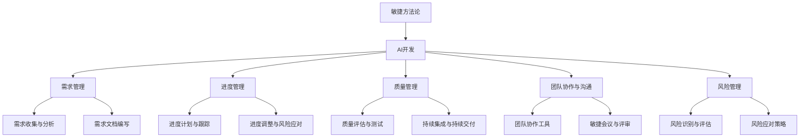

                 

## 文章标题

《AI开发的敏捷方法论：Lepton AI的项目管理》

### 关键词

- 敏捷方法论
- AI开发
- 项目管理
- Lepton AI
- 需求管理
- 进度管理
- 质量管理
- 团队协作

### 摘要

本文深入探讨了敏捷方法论在人工智能（AI）开发项目中的应用，以Lepton AI项目为例，分析了敏捷方法论在AI项目中的实际运用。文章首先介绍了敏捷方法论的基础知识，包括起源、核心原则、流程和工具。接着，详细阐述了敏捷方法论在AI项目需求管理、进度管理、质量管理、团队协作和风险管理等方面的应用。通过具体案例，展示了敏捷方法论在AI开发项目中的成功实践，并对未来的发展趋势进行了展望。本文旨在为从事AI开发的工程师和项目经理提供实用的指导和建议。

---

### 《AI开发的敏捷方法论：Lepton AI的项目管理》目录大纲

#### 第一部分：敏捷方法论基础

##### 第1章：敏捷开发简介

- **1.1 敏捷方法论的起源与发展**
  - **1.1.1 敏捷宣言与核心原则**
  - **1.1.2 敏捷开发与传统开发方法的对比**
  - **1.1.3 敏捷开发的关键要素**

- **1.2 敏捷开发流程**
  - **1.2.1 敏捷开发迭代模型**
  - **1.2.2 敏捷开发的关键角色**
  - **1.2.3 敏捷团队的组织形式**

- **1.3 敏捷开发工具与技术**
  - **1.3.1 敏捷项目管理工具**
  - **1.3.2 版本控制系统**
  - **1.3.3 自动化测试与持续集成**

#### 第二部分：敏捷方法论在AI开发中的应用

##### 第2章：AI项目需求管理

- **2.1 AI项目需求的特点与挑战**
  - **2.1.1 AI项目的独特性**
  - **2.1.2 AI项目需求的变化性**
  - **2.1.3 AI项目需求管理的最佳实践**

- **2.2 AI项目需求收集与分析**
  - **2.2.1 需求收集方法**
  - **2.2.2 需求分析技术**
  - **2.2.3 需求文档编写**

- **2.3 AI项目需求管理工具**
  - **2.3.1 需求管理工具选择**
  - **2.3.2 需求管理工具的应用**

##### 第3章：AI项目进度管理

- **3.1 AI项目进度管理的原则与方法**
  - **3.1.1 进度管理的核心原则**
  - **3.1.2 进度管理的方法与技术**
  - **3.1.3 进度跟踪与调整**

- **3.2 AI项目进度管理工具**
  - **3.2.1 进度管理工具选择**
  - **3.2.2 进度管理工具的应用**

- **3.3 AI项目风险管理**
  - **3.3.1 风险识别与评估**
  - **3.3.2 风险应对策略**
  - **3.3.3 风险监控与应对**

##### 第4章：AI项目质量管理

- **4.1 AI项目质量管理的原则与实践**
  - **4.1.1 质量管理的核心原则**
  - **4.1.2 质量管理的最佳实践**
  - **4.1.3 质量管理的挑战与解决方案**

- **4.2 AI项目测试管理**
  - **4.2.1 测试策略与测试计划**
  - **4.2.2 测试用例设计**
  - **4.2.3 自动化测试与测试框架**

- **4.3 AI项目持续集成与持续交付**
  - **4.3.1 持续集成的基本概念**
  - **4.3.2 持续交付的实现方法**
  - **4.3.3 持续集成与持续交付工具**

##### 第5章：AI团队协作与沟通

- **5.1 AI团队的协作模式与工具**
  - **5.1.1 团队协作的最佳实践**
  - **5.1.2 团队协作工具的选择与应用**
  - **5.1.3 沟通的重要性与技巧**

- **5.2 AI项目中的敏捷实践**
  - **5.2.1 敏捷会议的实践**
  - **5.2.2 敏捷评审与迭代**
  - **5.2.3 敏捷项目回顾**

##### 第6章：AI项目风险管理

- **6.1 AI项目风险识别与评估**
  - **6.1.1 风险识别的方法**
  - **6.1.2 风险评估的标准**
  - **6.1.3 风险评估的工具**

- **6.2 AI项目风险应对策略**
  - **6.2.1 风险应对的策略**
  - **6.2.2 风险应对的步骤**
  - **6.2.3 风险监控与应对**

##### 第7章：案例研究

- **7.1 Lepton AI项目案例分析**
  - **7.1.1 项目背景与目标**
  - **7.1.2 项目实施过程**
  - **7.1.3 项目成果与评价**

- **7.2 敏捷方法论在AI项目中的实际应用**
  - **7.2.1 敏捷实践的成功经验**
  - **7.2.2 敏捷实践的挑战与解决方案**

#### 第三部分：敏捷方法论的扩展与应用

##### 第8章：敏捷方法论在AI领域的扩展

- **8.1 敏捷与机器学习结合的方法**
  - **8.1.1 敏捷方法论在机器学习项目中的具体应用**
  - **8.1.2 机器学习项目的敏捷实践**
  - **8.1.3 敏捷与机器学习融合的挑战与机遇**

- **8.2 敏捷与数据科学结合的方法**
  - **8.2.1 数据科学项目的敏捷实践**
  - **8.2.2 敏捷数据科学的方法论**
  - **8.2.3 敏捷与数据科学融合的挑战与解决方案**

##### 第9章：敏捷方法论的未来发展趋势

- **9.1 敏捷方法论的发展趋势**
  - **9.1.1 敏捷方法论的未来方向**
  - **9.1.2 敏捷方法论与人工智能的结合**

- **9.2 敏捷方法论在AI开发中的应用前景**
  - **9.2.1 敏捷方法论在AI项目中的未来应用场景**
  - **9.2.2 敏捷方法论在AI开发中的优势与挑战**

### 附录

#### 附录A：敏捷开发工具与资源

- **A.1 主流敏捷开发工具**
  - **A.1.1 JIRA**
  - **A.1.2 Trello**
  - **A.1.3 Asana**

- **A.2 敏捷开发资源**
  - **A.2.1 敏捷开发相关书籍推荐**
  - **A.2.2 敏捷开发社区与论坛**
  - **A.2.3 敏捷开发在线培训与课程**

### 核心概念与联系

#### 敏捷方法论与AI开发的Mermaid流程图



### 核心算法原理讲解

#### AI项目需求管理的核心算法

```python
# 需求收集与优先级排序算法

# 定义需求类
class Requirement:
    def __init__(self, id, description, priority, urgency):
        self.id = id
        self.description = description
        self.priority = priority
        self.urgency = urgency

# 收集需求
requirements = [
    Requirement(1, "实现用户登录功能", "High", "Medium"),
    Requirement(2, "添加商品搜索功能", "Medium", "High"),
    Requirement(3, "优化页面加载速度", "Low", "Low")
]

# 按优先级和紧急程度排序需求
requirements.sort(key=lambda x: (x.priority, x.urgency), reverse=True)

# 输出排序后的需求列表
for req in requirements:
    print(f"ID: {req.id}, Description: {req.description}, Priority: {req.priority}, Urgency: {req.urgency}")
```

#### 敏捷迭代模型中的风险评估模型

$$
R = \frac{(P \times L)}{(C + S)}
$$

其中：

- \( R \) 表示风险值
- \( P \) 表示概率
- \( L \) 表示损失
- \( C \) 表示成本
- \( S \) 表示收益

---

### 引言

人工智能（AI）作为当今科技领域的热点，正以前所未有的速度发展。AI技术的进步不仅改变了传统行业，还在推动社会进步和经济发展中发挥着越来越重要的作用。然而，AI项目的开发过程复杂且多变，需求的变化、进度的管理、质量的控制以及团队协作都是项目成功的关键因素。在这种背景下，敏捷方法论作为一种灵活、高效的项目管理方法，逐渐被AI开发项目所采纳。

敏捷方法论起源于20世纪90年代末，其核心理念是“个体和互动重于过程与工具”、“可工作的软件重于详尽的文档”、“客户合作重于合同谈判”、“响应变化重于遵循计划”。与传统的方法论相比，敏捷方法论强调快速迭代、持续交付、灵活应对变化，这与AI项目需求多变、技术更新迅速的特点相契合。

本文旨在通过分析敏捷方法论在AI开发项目中的应用，以Lepton AI项目为例，探讨敏捷方法论在需求管理、进度管理、质量管理、团队协作和风险管理等关键环节的具体实践。本文将首先介绍敏捷方法论的基础知识，然后深入探讨其在AI项目中的实际应用，并通过具体案例展示其成功实践。最后，本文将对敏捷方法论在AI开发中的未来发展趋势进行展望，为从事AI开发的工程师和项目经理提供实用的指导和建议。

---

### 第一部分：敏捷方法论基础

#### 第1章：敏捷开发简介

#### 1.1 敏捷方法论的起源与发展

敏捷方法论起源于20世纪90年代末，其诞生背景是传统软件开发方法在面对复杂项目时表现出的诸多不足。20世纪80年代和90年代初，随着计算机技术的发展，软件工程领域出现了大规模、重量级的开发方法，如瀑布模型（Waterfall Model）和V模型（V-Model）。这些方法强调严格的阶段划分、详尽的文档和计划驱动，但在实际应用中往往难以适应项目需求的变化和技术更新。

1995年，面向对象技术的兴起和互联网的发展，使得软件开发项目变得更加复杂和多样化。面对这些挑战，一些软件开发者开始探索新的开发方法，以应对快速变化的市场需求和技术的快速发展。1999年，17位软件开发专家在美国犹他州举行了一次会议，发表了《敏捷软件开发宣言》（Manifesto for Agile Software Development），标志着敏捷方法论的正式诞生。

敏捷宣言的核心价值包括四个原则：

1. **个体和互动重于过程与工具**：强调团队协作和个人能力的重要性，认为有效的沟通和合作比复杂的工具和过程更为关键。
2. **可工作的软件重于详尽的文档**：注重实际可运行软件的价值，认为文档只是辅助手段，而不是开发的核心目标。
3. **客户合作重于合同谈判**：强调与客户的紧密合作，通过持续反馈和迭代来确保项目方向的正确性。
4. **响应变化重于遵循计划**：强调在项目开发过程中对变化保持开放和灵活，以快速响应市场和技术变化。

自敏捷宣言发布以来，敏捷方法论得到了广泛的关注和应用。敏捷方法在多个领域得到了验证，包括软件开发、项目管理、产品开发等。其中，Scrum、Kanban、XP（极限编程）和Lean（精益方法）是敏捷方法中的代表性框架。这些方法通过不同的实践和工具，帮助团队更好地管理项目、提高产品质量和客户满意度。

#### 1.1.1 敏捷宣言与核心原则

敏捷宣言的发布标志着敏捷方法论正式成为一种独立的方法论体系。敏捷宣言的核心内容包括：

1. **个体和互动重于过程与工具**：敏捷方法论强调团队成员的协作和个人能力，认为沟通和互动是项目成功的关键。相比复杂的流程和工具，敏捷更注重团队成员之间的有效沟通和协作。

2. **可工作的软件重于详尽的文档**：敏捷方法论认为，可运行的软件是项目成功的关键指标。尽管文档是重要的辅助工具，但敏捷更强调实际可运行的软件，以减少不必要的文档工作。

3. **客户合作重于合同谈判**：敏捷方法论强调与客户的紧密合作，通过持续的反馈和迭代来确保项目符合客户需求。这种方法有助于提高客户满意度，并确保项目方向的正确性。

4. **响应变化重于遵循计划**：敏捷方法论认为，项目需求和技术环境往往是不确定的，因此应保持开放和灵活，以快速响应变化。这种思维方式有助于团队更好地应对不确定性和复杂性。

#### 1.1.2 敏捷开发与传统开发方法的对比

敏捷方法论与传统开发方法（如瀑布模型）在多个方面存在显著差异：

1. **开发过程**：
   - **传统开发方法**：瀑布模型是一种线性开发过程，包括需求分析、设计、编码、测试和维护等阶段。每个阶段必须完成后才能进入下一个阶段，导致开发周期较长。
   - **敏捷开发方法**：敏捷开发采用迭代和增量的方式，通过多个短周期（通常称为“迭代”）来完成项目。每个迭代都包含需求分析、设计、编码、测试和评审等步骤，确保项目能够快速交付和持续改进。

2. **需求管理**：
   - **传统开发方法**：在瀑布模型中，需求通常在项目早期阶段进行详细定义和确认，随后在整个开发过程中保持不变。这种做法在需求变化较少的情况下较为有效，但在需求多变的情况下容易导致项目失败。
   - **敏捷开发方法**：敏捷开发强调需求的灵活性和可变性。需求在项目开发过程中不断调整和优化，以适应不断变化的市场和技术环境。这种方法有助于提高项目的适应性和客户满意度。

3. **团队协作**：
   - **传统开发方法**：瀑布模型通常采用职能式团队，团队成员按职能划分，如分析师、设计师、开发人员和测试人员。这种分工有助于提高专业化水平，但可能导致沟通不畅和协作困难。
   - **敏捷开发方法**：敏捷开发采用跨职能团队，团队成员来自不同领域，如开发、测试、设计和业务。这种团队结构有助于提高协作效率，确保项目目标的一致性和完整性。

4. **项目管理**：
   - **传统开发方法**：瀑布模型通常采用严格的项目管理流程，包括详细的计划、监控和报告。这种做法有助于确保项目进度和质量，但在需求变化和技术不确定的情况下容易导致项目延误和超支。
   - **敏捷开发方法**：敏捷开发采用轻量级项目管理方法，如Scrum和Kanban，注重迭代、反馈和持续改进。这种方法有助于提高项目的灵活性和响应速度，但需要团队成员具备较高的自我管理和协作能力。

#### 1.1.3 敏捷开发的关键要素

敏捷开发方法包括多个关键要素，这些要素共同构成了敏捷方法论的核心框架：

1. **迭代与增量**：敏捷开发采用迭代和增量方式，将项目分为多个短周期（通常称为“迭代”或“冲刺”）。每个迭代都包含需求分析、设计、编码、测试和评审等步骤，确保项目能够快速交付和持续改进。

2. **用户故事**：用户故事是一种简单、易于理解的需求描述方式，通常包含三个部分：作为…，我想…，以便…。用户故事有助于明确需求、优先级和用户价值，提高项目交付的准确性。

3. **持续集成与持续交付**：敏捷开发强调代码的持续集成和持续交付，确保软件在每次迭代后都能稳定运行。通过自动化测试和持续集成工具，团队可以快速发现和修复问题，提高软件质量。

4. **团队协作与沟通**：敏捷开发强调团队协作和沟通，通过每日站会、迭代评审和回顾会等实践，确保团队成员对项目目标、进度和质量有共同的理解。

5. **客户参与**：敏捷开发强调与客户的紧密合作，通过定期反馈和迭代，确保项目始终符合客户需求。客户参与有助于提高项目成功率和客户满意度。

#### 1.2 敏捷开发流程

敏捷开发流程是敏捷方法论的核心，包括多个迭代周期，每个迭代周期包含一系列的步骤和活动。以下是一个典型的敏捷开发流程：

1. **项目启动**：在项目启动阶段，团队确定项目目标、范围和优先级。这一阶段通常包括项目规划会议和需求分析会议。

2. **迭代规划**：在迭代规划阶段，团队确定本次迭代的目标、任务和资源。通过用户故事地图和迭代计划，团队可以清晰地了解本次迭代要实现的功能和目标。

3. **迭代执行**：在迭代执行阶段，团队按计划开展开发工作，包括需求分析、设计、编码、测试和集成。每个迭代周期通常持续2-4周。

4. **迭代评审**：在迭代评审阶段，团队对本次迭代的工作成果进行评估和反馈。通过评审会议，团队可以了解客户和利益相关者的反馈，并根据反馈进行改进。

5. **迭代回顾**：在迭代回顾阶段，团队对本次迭代的工作过程进行总结和反思。通过回顾会议，团队可以识别问题、总结经验，并为下一个迭代制定改进计划。

6. **持续集成与持续交付**：在敏捷开发过程中，持续集成和持续交付是确保软件质量的关键。通过自动化测试和持续集成工具，团队可以快速发现和修复问题，确保软件在每次迭代后都能稳定运行。

#### 1.2.1 敏捷开发迭代模型

敏捷开发迭代模型是敏捷方法论的核心，通过迭代和增量方式，确保项目能够快速交付和持续改进。以下是一个典型的敏捷迭代模型：

1. **迭代规划**：在迭代规划阶段，团队确定本次迭代的目标、任务和资源。通过用户故事地图和迭代计划，团队可以清晰地了解本次迭代要实现的功能和目标。

2. **迭代执行**：在迭代执行阶段，团队按计划开展开发工作，包括需求分析、设计、编码、测试和集成。每个迭代周期通常持续2-4周。

3. **迭代评审**：在迭代评审阶段，团队对本次迭代的工作成果进行评估和反馈。通过评审会议，团队可以了解客户和利益相关者的反馈，并根据反馈进行改进。

4. **迭代回顾**：在迭代回顾阶段，团队对本次迭代的工作过程进行总结和反思。通过回顾会议，团队可以识别问题、总结经验，并为下一个迭代制定改进计划。

5. **持续集成与持续交付**：在敏捷开发过程中，持续集成和持续交付是确保软件质量的关键。通过自动化测试和持续集成工具，团队可以快速发现和修复问题，确保软件在每次迭代后都能稳定运行。

#### 1.2.2 敏捷开发的关键角色

敏捷开发方法中，团队成员的角色与传统开发方法有所不同。以下是一些关键角色及其职责：

1. **产品负责人（Product Owner）**：
   - 负责定义产品的愿景和目标，制定产品需求和优先级。
   - 与利益相关者沟通，确保需求满足客户和市场的需求。
   - 在迭代过程中，持续监控产品进展，并做出相应的调整。

2. **Scrum Master**：
   - 负责确保团队遵循敏捷实践，如每日站会、迭代评审和回顾会等。
   - 确保团队专注于当前迭代的目标，并帮助团队解决遇到的障碍。
   - 促进团队协作和沟通，确保项目顺利进行。

3. **开发团队**：
   - 负责实际开发工作，包括需求分析、设计、编码、测试和集成。
   - 通过协作和互动，确保项目目标和质量得到实现。
   - 在迭代过程中，不断优化开发流程，提高工作效率。

#### 1.2.3 敏捷团队的组织形式

敏捷团队的组织形式与传统团队有所不同，强调跨职能和自组织。以下是一些敏捷团队的组织形式：

1. **跨职能团队**：
   - 团队成员来自不同领域，如开发、测试、设计和业务。
   - 跨职能团队有助于提高协作效率，确保项目目标的一致性和完整性。

2. **自组织团队**：
   - 团队成员自主管理和决策，按照项目需求和优先级进行工作。
   - 自组织团队有助于提高团队成员的参与度和责任感，促进团队协作。

3. **虚拟团队**：
   - 团队成员分布在不同地理位置，通过网络协作完成项目任务。
   - 虚拟团队适用于远程办公和全球化项目。

#### 1.3 敏捷开发工具与技术

敏捷开发方法需要一系列工具和技术来支持项目的管理、协作和自动化。以下是一些常用的敏捷开发工具和技术：

1. **敏捷项目管理工具**：
   - **JIRA**：用于敏捷项目管理、任务跟踪和进度管理。
   - **Trello**：以看板形式管理任务和项目进度。
   - **Asana**：用于任务管理、团队协作和时间跟踪。

2. **版本控制系统**：
   - **Git**：分布式版本控制系统，支持代码的版本管理和分布式协作。
   - **Subversion（SVN）**：集中式版本控制系统，适用于小规模团队的项目管理。

3. **自动化测试工具**：
   - **Selenium**：用于自动化Web应用的测试。
   - **JUnit**：用于Java应用的单元测试。
   - **TestNG**：用于功能测试和性能测试。

4. **持续集成与持续交付工具**：
   - **Jenkins**：用于自动化构建、测试和部署。
   - **Travis CI**：用于持续集成和持续交付。
   - **CircleCI**：用于自动化测试和部署。

### 第一部分小结

敏捷方法论作为现代软件开发的重要方法，以其灵活、高效的特点被广泛应用于各类项目中。本文介绍了敏捷方法论的基础知识，包括起源、核心原则、流程和工具。通过对敏捷宣言和核心原则的阐述，我们了解了敏捷方法论的基本理念。同时，通过对比敏捷开发与传统开发方法的差异，我们认识到了敏捷方法在项目管理、需求管理、团队协作等方面的优势。最后，我们详细介绍了敏捷开发迭代模型、关键角色和组织形式，以及常用的敏捷开发工具和技术。这些知识为后续章节中深入探讨敏捷方法论在AI开发项目中的应用奠定了基础。

---

### 第一部分续篇

#### 第1章：敏捷开发简介（续）

#### 1.3 敏捷开发工具与技术

敏捷开发方法的有效实施离不开一系列工具和技术。这些工具不仅帮助团队管理项目、提高协作效率，还确保了开发过程中的质量和稳定性。以下将介绍一些常用的敏捷开发工具和技术。

#### 1.3.1 敏捷项目管理工具

敏捷项目管理工具是敏捷开发的核心组成部分，用于任务跟踪、进度管理和团队协作。以下是一些主流的敏捷项目管理工具：

1. **JIRA**：
   - **功能**：JIRA是一款功能强大的敏捷项目管理工具，支持任务跟踪、敏捷看板、报告和分析。
   - **应用场景**：适用于各种规模的项目，特别适合复杂的项目管理和团队协作。
   - **优点**：灵活性强、易于扩展、集成度高。

2. **Trello**：
   - **功能**：Trello是一款基于看板的任务管理工具，通过看板和卡片来展示任务状态和进度。
   - **应用场景**：适用于小型团队和简单项目，特别适合视觉化任务管理。
   - **优点**：操作简单、界面直观、支持多种协作方式。

3. **Asana**：
   - **功能**：Asana是一款全面的任务管理工具，支持任务分配、进度跟踪和时间管理。
   - **应用场景**：适用于各种规模和类型的团队，特别适合跨部门和跨地域的协作。
   - **优点**：功能全面、界面友好、支持多种集成和自动化。

#### 1.3.2 版本控制系统

版本控制系统在敏捷开发中起着至关重要的作用，用于管理代码的版本和变更。以下是一些常用的版本控制系统：

1. **Git**：
   - **功能**：Git是一款分布式版本控制系统，支持分布式协作、快速分支和合并。
   - **应用场景**：适用于大型项目和分布式团队，特别适合快速迭代和并发开发。
   - **优点**：灵活性高、效率高、支持多种集成工具。

2. **Subversion（SVN）**：
   - **功能**：SVN是一款集中式版本控制系统，用于管理代码的版本和变更。
   - **应用场景**：适用于小型项目和集中式团队，特别适合代码库管理和变更跟踪。
   - **优点**：稳定性好、易用性高、支持多种集成工具。

#### 1.3.3 自动化测试与持续集成

自动化测试和持续集成是确保软件质量和提高开发效率的重要手段。以下是一些常用的自动化测试和持续集成工具：

1. **Selenium**：
   - **功能**：Selenium是一款自动化Web应用测试工具，支持多种编程语言和浏览器。
   - **应用场景**：适用于Web应用的自动化测试，特别适合跨浏览器测试。
   - **优点**：开源、支持多种语言、兼容性好。

2. **JUnit**：
   - **功能**：JUnit是一款Java应用的单元测试框架，用于编写和执行单元测试。
   - **应用场景**：适用于Java开发项目，特别适合单元测试和集成测试。
   - **优点**：功能强大、易于使用、支持多种测试类型。

3. **TestNG**：
   - **功能**：TestNG是一款功能强大的测试框架，支持多种编程语言和测试类型。
   - **应用场景**：适用于各种开发项目，特别适合功能测试和性能测试。
   - **优点**：灵活性强、支持多种测试类型、易于扩展。

#### 1.3.4 持续集成与持续交付工具

持续集成和持续交付是确保软件质量和提高开发效率的重要环节。以下是一些常用的持续集成与持续交付工具：

1. **Jenkins**：
   - **功能**：Jenkins是一款开源的持续集成工具，支持自动化构建、测试和部署。
   - **应用场景**：适用于各种规模的项目，特别适合复杂的持续集成和持续交付流程。
   - **优点**：开源、功能强大、支持多种插件和集成工具。

2. **Travis CI**：
   - **功能**：Travis CI是一款在线的持续集成服务，支持多种编程语言和平台。
   - **应用场景**：适用于开源项目和自动化测试，特别适合跨平台和跨地域的协作。
   - **优点**：免费、易于配置、支持多种集成工具。

3. **CircleCI**：
   - **功能**：CircleCI是一款在线的持续集成和持续交付工具，支持多种编程语言和平台。
   - **应用场景**：适用于各种规模的项目，特别适合快速迭代和持续交付。
   - **优点**：灵活性强、支持多种集成工具、易于配置。

#### 1.3.5 敏捷开发工具的选择与使用

在选择和使用敏捷开发工具时，团队需要考虑项目需求、团队规模和开发环境等因素。以下是一些建议：

1. **项目需求**：根据项目的规模和复杂性选择合适的工具。对于小型项目和简单任务，Trello和Asana可能更为适合；对于复杂项目和大规模团队，JIRA和Jenkins可能更具有优势。

2. **团队规模**：对于小型团队，工具的使用应该简单直观；对于大型团队，工具应该支持复杂的协作和集成。

3. **开发环境**：根据团队的开发环境和技术栈选择合适的工具。例如，使用Java开发的团队可能更喜欢JUnit和Jenkins，而使用Python开发的团队可能更喜欢TestNG和Travis CI。

4. **工具集成**：选择支持多种集成工具和平台的工具，以提高开发效率和团队协作。

5. **培训与支持**：为团队成员提供工具培训和支持，确保他们能够熟练使用所选工具。

通过合理选择和使用敏捷开发工具，团队可以更好地管理项目、提高协作效率和软件质量。在下一章节中，我们将继续探讨敏捷方法论在AI项目中的具体应用。

### 第一部分小结（续）

在本章节中，我们详细介绍了敏捷开发工具与技术，包括敏捷项目管理工具、版本控制系统、自动化测试与持续集成工具以及持续集成与持续交付工具。通过这些工具，团队可以更有效地管理项目、提高协作效率和软件质量。此外，我们还讨论了如何根据项目需求、团队规模和开发环境选择合适的工具，以及为团队成员提供培训与支持的重要性。这些内容为后续章节中深入探讨敏捷方法论在AI项目中的应用奠定了坚实的基础。在下一章节中，我们将继续探讨敏捷方法论在AI项目需求管理中的具体应用。

---

### 第二部分：敏捷方法论在AI开发中的应用

#### 第2章：AI项目需求管理

##### 2.1 AI项目需求的特点与挑战

在AI项目中，需求管理是一个至关重要的环节，它直接关系到项目的成功与否。与传统项目相比，AI项目需求具有以下特点：

1. **复杂性与不确定性**：AI项目通常涉及复杂的算法和大量的数据处理，需求的变化和技术的不确定性较大。这种复杂性使得需求管理变得更加困难。

2. **需求多样性和变化性**：AI项目的需求往往包括多种类型，如功能需求、性能需求、安全性需求等。此外，随着项目进展和技术的进步，需求也可能会发生频繁的变化。

3. **对数据依赖性**：AI项目对数据有很高的依赖性，数据的质量和完整性直接影响模型的效果和性能。因此，需求管理中需要充分考虑数据的需求和采集。

4. **跨学科协作**：AI项目通常需要跨学科团队的协作，包括数据科学家、算法工程师、产品经理、设计师等。这使得需求管理需要考虑到不同角色的需求和技术背景。

在应对AI项目需求管理的挑战时，团队需要采取一系列最佳实践来确保项目顺利进行：

1. **明确项目目标和范围**：在项目启动阶段，明确项目目标和范围，确保所有团队成员对项目的目标有共同的理解。

2. **需求优先级排序**：对需求进行优先级排序，确保重要的需求优先得到满足。这有助于团队集中资源，提高项目效率。

3. **持续沟通与反馈**：与客户和利益相关者保持持续的沟通和反馈，确保需求的变化能够及时传递和响应。

4. **迭代开发与测试**：采用迭代开发方法，通过多次迭代和测试来逐步完善需求，确保项目能够按时交付和满足需求。

##### 2.2 AI项目需求收集与分析

收集和分析需求是需求管理的核心步骤，对于AI项目尤为重要。以下是一些常用的需求收集和分析方法：

1. **用户访谈和问卷调查**：通过与用户进行面对面访谈或发放问卷调查，了解用户的需求和期望。这种方法有助于获取真实用户反馈，提高需求的有效性。

2. **竞品分析**：分析竞争对手的产品和市场，了解他们的优势和不足，从中获得灵感和改进点。

3. **专家咨询和研讨**：邀请领域专家和利益相关者参与需求讨论和研讨会，通过他们的专业知识和经验来指导需求收集和分析。

4. **用户故事地图**：使用用户故事地图来展示用户的需求和行为路径，有助于团队更好地理解用户需求和设计产品功能。

在需求分析过程中，团队需要关注以下几个方面：

1. **需求识别**：通过多种方法识别和理解用户的需求，确保需求被准确捕捉和记录。

2. **需求分类**：对需求进行分类，如功能需求、性能需求、安全需求等，有助于团队更好地管理和优先级排序。

3. **需求评估**：评估每个需求的重要性和可行性，确保需求能够被有效实现。

4. **需求文档编写**：编写清晰、详细的需求文档，确保所有团队成员对需求有共同的理解。

##### 2.3 AI项目需求管理工具

为了有效地管理AI项目需求，团队需要选择合适的工具。以下是一些常用的需求管理工具：

1. **JIRA**：JIRA是一款功能强大的需求管理工具，支持需求跟踪、任务分配和进度管理。团队可以使用JIRA创建和管理需求，并将其与迭代计划紧密关联。

2. **Confluence**：Confluence是一款知识共享和协作工具，可以用于编写和存储需求文档。团队可以将需求文档、设计文档和用户故事存储在Confluence中，方便团队成员查阅和更新。

3. **Azure DevOps**：Azure DevOps包括需求管理、项目规划和自动化测试等功能，适用于大型和复杂的项目。团队可以使用Azure DevOps创建和管理需求，并将其与开发流程紧密集成。

4. **Asana**：Asana是一款任务管理工具，可以用于需求跟踪和团队协作。团队可以使用Asana创建需求任务，并将其分配给团队成员，确保需求得到有效实施。

在需求管理工具的选择和使用中，团队需要考虑以下几个方面：

1. **功能需求**：选择功能全面、符合项目需求的需求管理工具。

2. **集成性**：选择支持与其他工具和系统集成的需求管理工具，以提高开发效率和团队协作。

3. **易用性**：选择界面直观、易于使用的需求管理工具，确保团队成员能够快速上手。

4. **扩展性**：选择支持扩展和定制化的需求管理工具，以满足不同项目的需求。

通过合理选择和使用需求管理工具，团队可以更有效地管理AI项目需求，确保项目能够按时、按质完成。在下一章节中，我们将探讨敏捷方法论在AI项目进度管理中的应用。

### 第二部分小结

在本章节中，我们详细讨论了敏捷方法论在AI项目需求管理中的应用。首先，我们分析了AI项目需求的特点与挑战，包括复杂性、不确定性、需求多样性和对数据依赖性。接着，我们介绍了需求收集和分析的方法，如用户访谈、问卷调查、竞品分析和用户故事地图。此外，我们还探讨了需求管理工具的选择，包括JIRA、Confluence、Azure DevOps和Asana等。通过合理选择和使用需求管理工具，团队可以更有效地管理AI项目需求，确保项目能够顺利推进。在下一章节中，我们将进一步探讨敏捷方法论在AI项目进度管理中的应用。

---

### 第二部分续篇

#### 第3章：AI项目进度管理

##### 3.1 AI项目进度管理的原则与方法

在AI项目中，进度管理是确保项目按时完成的关键环节。与传统项目相比，AI项目具有复杂性高、不确定性大、需求变化频繁等特点，使得进度管理更加困难。为了有效管理AI项目进度，团队需要遵循以下原则和方法：

1. **明确项目目标和里程碑**：在项目启动阶段，明确项目目标和里程碑，确保所有团队成员对项目目标有共同的理解。里程碑是项目中的重要时间节点，标志着项目的重要进展和交付物。

2. **分解任务和制定计划**：将项目分解为多个可管理的任务，并制定详细的计划。任务分解可以帮助团队更好地掌握项目进展，确保每个任务都能按时完成。制定计划时，需要考虑任务之间的依赖关系和优先级。

3. **灵活应对变化**：AI项目需求变化频繁，团队需要保持灵活性，及时调整计划以应对变化。在项目执行过程中，团队应定期评估项目进展，并根据实际情况进行调整。

4. **监控和报告**：通过定期监控项目进展，及时发现问题并采取相应的措施。监控可以采用多种方法，如每日站会、迭代评审和进度报告等。报告应包括项目进展、风险和问题，以便团队成员和利益相关者了解项目状态。

5. **风险管理**：识别项目中的潜在风险，并制定相应的应对策略。风险管理包括风险识别、风险评估和风险应对，以确保项目能够顺利推进。

##### 3.2 AI项目进度管理工具

为了有效管理AI项目进度，团队需要选择合适的进度管理工具。以下是一些常用的进度管理工具：

1. **JIRA**：JIRA是一款功能强大的进度管理工具，支持任务跟踪、进度报告和风险管理。团队可以使用JIRA创建任务、分配任务、跟踪任务进度，并生成进度报告。

2. **Trello**：Trello是一款基于看板的进度管理工具，通过看板和卡片来展示任务状态和进度。团队可以使用Trello创建任务卡片，将其拖放到不同的列中，以表示任务的状态。

3. **Asana**：Asana是一款任务管理工具，支持任务分配、进度跟踪和团队协作。团队可以使用Asana创建任务、分配任务、跟踪任务进度，并查看整个项目的进展。

4. **Microsoft Project**：Microsoft Project是一款专业的进度管理工具，支持任务分配、资源管理、进度跟踪和报表生成。团队可以使用Microsoft Project创建详细的项目计划，并监控项目进度。

在进度管理工具的选择和使用中，团队需要考虑以下几个方面：

1. **功能需求**：选择功能全面、符合项目需求的进度管理工具。

2. **集成性**：选择支持与其他工具和系统集成的进度管理工具，以提高开发效率和团队协作。

3. **易用性**：选择界面直观、易于使用的进度管理工具，确保团队成员能够快速上手。

4. **扩展性**：选择支持扩展和定制化的进度管理工具，以满足不同项目的需求。

##### 3.3 AI项目进度跟踪与调整

在AI项目执行过程中，进度跟踪与调整是确保项目按时完成的关键。以下是一些常用的进度跟踪与调整方法：

1. **定期进度评估**：定期评估项目进展，与计划进行比较，发现差异和问题。评估可以采用多种方法，如进度报告、迭代评审和项目回顾会议等。

2. **问题识别与解决**：在进度评估过程中，识别项目中的问题和风险，并采取相应的措施进行解决。问题解决可以是调整任务优先级、增加资源投入或重新规划任务。

3. **进度调整**：根据项目进展和评估结果，及时调整项目计划。进度调整可以是缩短任务时间、增加任务资源或修改任务优先级，以确保项目能够按时完成。

4. **沟通与协作**：在进度跟踪与调整过程中，保持与团队成员和利益相关者的沟通与协作。沟通可以帮助团队了解项目进展和问题，并共同制定解决方案。

5. **持续改进**：通过项目回顾和总结，识别进度管理的成功经验和不足之处，为后续项目提供改进建议。

通过合理选择和使用进度管理工具，并采取有效的进度跟踪与调整方法，团队可以确保AI项目按时、按质完成。在下一章节中，我们将探讨敏捷方法论在AI项目质量管理中的应用。

### 第三部分小结

在本章节中，我们详细探讨了敏捷方法论在AI项目进度管理中的应用。首先，我们介绍了AI项目进度管理的原则与方法，包括明确项目目标和里程碑、分解任务和制定计划、灵活应对变化、监控和报告以及风险管理。接着，我们讨论了常用的进度管理工具，如JIRA、Trello、Asana和Microsoft Project，并给出了选择和使用这些工具的建议。此外，我们还介绍了AI项目进度跟踪与调整的方法，包括定期进度评估、问题识别与解决、进度调整、沟通与协作以及持续改进。通过合理选择和使用进度管理工具，并采取有效的进度跟踪与调整方法，团队可以确保AI项目按时、按质完成。在下一章节中，我们将继续探讨敏捷方法论在AI项目质量管理中的应用。

---

### 第三部分续篇

#### 第4章：AI项目质量管理

##### 4.1 AI项目质量管理的原则与实践

在AI项目中，质量管理是确保项目交付的软件具备高质量和可靠性的关键环节。与传统软件开发相比，AI项目具有更高的复杂性、不确定性和数据依赖性，使得质量管理变得更加困难。为了有效管理AI项目质量，团队需要遵循以下原则和实践：

1. **质量第一**：在AI项目开发过程中，质量始终是第一位的。团队应将质量要求融入到每个开发阶段，从需求定义、设计、编码到测试和部署，确保每个环节都能满足质量标准。

2. **持续改进**：质量管理不是一次性的活动，而是一个持续的过程。团队应不断评估和改进质量管理体系，以提高项目质量。通过定期回顾和总结项目经验，团队可以发现并解决质量问题，持续提升项目质量。

3. **数据驱动**：AI项目对数据有很强的依赖性，数据的质量直接影响模型的效果和性能。团队应采用数据驱动的方法，确保数据的质量和完整性。包括数据清洗、数据验证和数据监控等。

4. **自动化测试**：自动化测试是提高AI项目质量的重要手段。通过自动化测试，团队可以快速发现和修复代码中的缺陷，确保软件在每次迭代后都能稳定运行。自动化测试包括单元测试、集成测试、性能测试和回归测试等。

5. **团队合作**：质量管理需要整个团队的共同努力。团队应建立良好的沟通机制，确保每个成员都能参与到质量管理过程中。通过团队合作，可以更好地发现和解决质量问题。

##### 4.2 AI项目质量管理的挑战与解决方案

在AI项目中，质量管理面临一系列挑战。以下是一些常见的挑战及相应的解决方案：

1. **需求变更**：在AI项目开发过程中，需求变更频繁，可能导致项目质量受到影响。解决方案是建立灵活的需求管理流程，及时更新需求文档，并与客户和利益相关者保持密切沟通。

2. **数据质量**：数据质量直接影响AI模型的效果。解决方案是建立数据质量管理体系，包括数据清洗、数据验证和数据监控等，确保数据的质量和完整性。

3. **技术复杂性**：AI项目涉及复杂的算法和数据处理技术，可能导致质量问题。解决方案是采用模块化设计，将复杂系统分解为更小的模块，并采用单元测试和集成测试来确保每个模块的质量。

4. **团队协作**：在大型AI项目中，团队协作和沟通可能存在问题，影响项目质量。解决方案是建立有效的沟通机制，如每日站会、迭代评审和回顾会等，确保团队成员之间的信息传递和协作。

5. **测试覆盖率**：自动化测试覆盖率不足可能导致一些潜在问题无法被发现。解决方案是制定详细的测试计划，确保测试覆盖率达到项目要求，并通过持续集成和持续交付工具来提高测试效率。

##### 4.3 AI项目测试管理

测试管理是AI项目质量管理的重要组成部分。以下是一些AI项目测试管理的要点：

1. **测试策略与测试计划**：在项目启动阶段，制定测试策略和测试计划。测试策略包括测试类型、测试目标和测试方法等。测试计划包括测试任务、测试资源、测试时间和测试进度等。

2. **测试用例设计**：设计测试用例是测试管理的核心环节。测试用例应覆盖所有功能点，包括正常情况和异常情况。测试用例应包括测试输入、测试操作和预期结果等。

3. **自动化测试**：自动化测试可以提高测试效率和质量。团队应选择合适的自动化测试工具，并制定自动化测试策略。自动化测试应覆盖关键功能和关键路径。

4. **测试执行与报告**：执行测试用例，记录测试结果，并生成测试报告。测试报告应包括测试覆盖率、测试结果、缺陷统计和问题分析等。

5. **缺陷管理**：缺陷管理是测试管理的重要环节。团队应建立缺陷管理流程，包括缺陷报告、缺陷跟踪和缺陷修复等。

##### 4.4 AI项目持续集成与持续交付

持续集成和持续交付是确保AI项目质量的重要手段。以下是一些AI项目持续集成与持续交付的关键点：

1. **持续集成**：持续集成是将代码合并到主干分支并自动执行测试的过程。通过持续集成，团队可以快速发现和修复代码中的缺陷，确保代码的质量。

2. **持续交付**：持续交付是将代码部署到生产环境的过程。通过持续交付，团队可以确保软件在每次迭代后都能稳定运行，并快速响应市场变化。

3. **自动化构建与部署**：自动化构建与部署可以提高开发效率和软件质量。团队应选择合适的自动化构建和部署工具，并制定自动化流程。

4. **持续监控**：持续监控是确保软件质量的重要手段。团队应建立监控体系，实时监控软件的性能、安全性和稳定性。

5. **反馈与改进**：通过持续集成和持续交付，团队可以快速获取反馈，识别问题，并采取改进措施，以提高项目质量。

### 第四部分小结

在本章节中，我们详细探讨了敏捷方法论在AI项目质量管理中的应用。首先，我们介绍了AI项目质量管理的原则与实践，包括质量第一、持续改进、数据驱动、自动化测试和团队合作等。接着，我们讨论了AI项目质量管理的挑战与解决方案，包括需求变更、数据质量、技术复杂性、团队协作和测试覆盖率等。此外，我们还介绍了AI项目测试管理的要点，如测试策略与测试计划、测试用例设计、自动化测试、测试执行与报告和缺陷管理。最后，我们探讨了AI项目持续集成与持续交付的关键点，包括持续集成、持续交付、自动化构建与部署、持续监控和反馈与改进。通过合理应用敏捷方法论，团队可以确保AI项目质量，提高项目成功率和客户满意度。

---

### 第四部分续篇

#### 第5章：AI团队协作与沟通

##### 5.1 AI团队的协作模式与工具

在AI项目中，团队协作和沟通是确保项目成功的关键因素。AI项目通常涉及多个领域的专家，包括数据科学家、算法工程师、产品经理、设计师等。为了提高协作效率，团队需要采用合适的协作模式和工具。

1. **协作模式**：

   - **跨职能团队**：跨职能团队是一种将不同专业背景的团队成员集中在一起的工作模式。这种模式有助于提高协作效率和团队凝聚力。

   - **分布式团队**：分布式团队是指团队成员分布在不同的地理位置。这种模式适用于远程工作和全球化项目。

   - **敏捷团队**：敏捷团队是一种采用敏捷方法论进行工作的团队。敏捷团队强调透明度、协作和持续改进。

2. **协作工具**：

   - **JIRA**：JIRA是一款功能强大的项目管理工具，支持任务跟踪、进度管理和团队协作。团队可以使用JIRA创建任务、分配任务、跟踪任务进度，并生成项目报告。

   - **Trello**：Trello是一款基于看板的协作工具，通过卡片和列来展示任务状态和进度。团队可以使用Trello来分配任务、跟踪任务进度，并进行任务之间的协作。

   - **Slack**：Slack是一款即时通讯工具，支持实时聊天、频道沟通和文件共享。团队可以使用Slack来实时沟通、协作和分享信息。

   - **Confluence**：Confluence是一款知识管理和协作工具，用于编写、存储和共享文档。团队可以使用Confluence来编写项目文档、需求文档和设计文档。

   - **Zoom**：Zoom是一款视频会议工具，支持多人在线会议、屏幕共享和实时沟通。团队可以使用Zoom进行远程会议、团队讨论和项目评审。

##### 5.2 AI项目中的敏捷实践

敏捷实践在AI项目中具有广泛的应用，通过敏捷实践，团队可以更好地管理项目、提高协作效率和客户满意度。以下是一些AI项目中的敏捷实践：

1. **每日站会**：每日站会是敏捷团队的一种日常会议，通常持续15分钟。在每日站会中，团队成员讨论项目的进展、遇到的问题和计划。每日站会有助于提高团队透明度和协作效率。

2. **迭代评审**：迭代评审是敏捷方法论中的一个关键环节，通常在每个迭代结束时进行。在迭代评审中，团队展示迭代成果，收集反馈和改进意见。迭代评审有助于确保项目方向的正确性和客户满意度。

3. **迭代回顾**：迭代回顾是敏捷方法论中的一种反思环节，通常在每个迭代结束后进行。在迭代回顾中，团队总结本次迭代的经验教训，识别问题并提出改进措施。迭代回顾有助于持续改进项目过程和提高团队效率。

4. **用户故事地图**：用户故事地图是一种可视化工具，用于展示用户需求和行为路径。团队可以使用用户故事地图来明确项目目标和用户需求，确保项目能够满足用户需求。

5. **看板**：看板是一种基于可视化的任务管理工具，用于展示任务状态和进度。团队可以使用看板来跟踪任务进度、管理任务优先级，并识别潜在的问题。

##### 5.3 沟通的重要性与技巧

在AI项目中，沟通是团队协作的核心。有效的沟通有助于提高团队凝聚力、减少误解和冲突，并确保项目顺利进行。以下是一些沟通的重要性和技巧：

1. **沟通的重要性**：

   - **提高协作效率**：有效的沟通可以提高团队协作效率，确保团队成员能够更好地理解和执行任务。

   - **减少误解和冲突**：通过沟通，团队成员可以明确项目目标、任务和职责，减少误解和冲突。

   - **确保项目成功**：良好的沟通有助于确保项目方向的正确性，提高项目成功率和客户满意度。

2. **沟通技巧**：

   - **倾听**：倾听是有效沟通的关键，通过倾听，团队成员可以更好地理解他人的观点和需求。

   - **清晰表达**：清晰表达是有效沟通的重要技巧，确保信息传递准确无误。

   - **非语言沟通**：非语言沟通，如肢体语言、面部表情和姿态，可以增强信息的传达效果。

   - **建立信任**：建立信任是有效沟通的基础，通过诚实、尊重和信任，可以增强团队凝聚力和协作效率。

   - **适时的反馈**：及时的反馈有助于团队成员了解项目进展和问题，并采取相应的措施进行改进。

通过合理的协作模式和工具，以及有效的沟通技巧，团队可以更好地管理AI项目，提高协作效率和项目质量。

### 第五部分小结

在本章节中，我们详细探讨了敏捷方法论在AI团队协作与沟通中的应用。首先，我们介绍了AI团队的协作模式，包括跨职能团队、分布式团队和敏捷团队，并讨论了常用的协作工具，如JIRA、Trello、Slack、Confluence和Zoom。接着，我们探讨了AI项目中的敏捷实践，包括每日站会、迭代评审、迭代回顾、用户故事地图和看板等。此外，我们还强调了沟通在团队协作中的重要性，并介绍了一些沟通技巧，如倾听、清晰表达、非语言沟通、建立信任和适时的反馈。通过合理的协作模式和工具，以及有效的沟通技巧，团队可以更好地管理AI项目，提高协作效率和项目质量。

---

### 第五部分续篇

#### 第6章：AI项目风险管理

##### 6.1 AI项目风险识别与评估

在AI项目开发过程中，风险管理是确保项目顺利进行和成功交付的关键环节。AI项目由于其复杂性、技术不确定性和数据依赖性，面临多种风险。因此，有效的风险识别与评估是项目风险管理的基础。

1. **风险识别方法**：

   - **文档审查**：通过审查项目文档，如需求文档、设计文档和测试文档，识别潜在风险。
   - **专家访谈**：与项目团队成员、利益相关者和领域专家进行访谈，了解他们对项目风险的看法和经验。
   - **历史数据**：分析类似项目的风险记录和历史数据，识别可能存在的风险。
   - **头脑风暴**：组织项目团队成员进行头脑风暴，讨论项目过程中可能面临的风险。

2. **风险识别结果**：

   风险识别过程中，团队应列出所有识别出的风险，并对其进行分类。常见的风险分类包括技术风险、需求风险、进度风险、资源风险、市场风险和外部风险等。

3. **风险评估**：

   - **概率评估**：评估每个风险发生的概率。概率评估可以通过历史数据、专家意见和模拟等方法进行。
   - **影响评估**：评估每个风险对项目的影响程度。影响评估可以从项目成本、进度、质量、资源等方面进行。
   - **风险等级评估**：根据概率和影响评估结果，对风险进行等级划分，如高、中、低风险。

##### 6.2 AI项目风险应对策略

在识别和评估风险后，团队需要制定相应的风险应对策略，以减轻或消除风险的影响。以下是一些常见的风险应对策略：

1. **风险规避**：

   - **规避方法**：通过改变项目计划、需求或技术方案，避免风险的发生。
   - **适用情况**：适用于高风险、高成本或高影响的风险。

2. **风险转移**：

   - **转移方法**：通过签订合同、购买保险或外包等方式，将风险转移到第三方。
   - **适用情况**：适用于无法规避或规避成本较高的风险。

3. **风险减轻**：

   - **减轻方法**：通过增加资源投入、改进技术方案或优化项目管理流程，降低风险的发生概率或影响程度。
   - **适用情况**：适用于中低风险，但需要一定资源投入的风险。

4. **风险接受**：

   - **接受方法**：在风险发生时，采取应对措施以减轻其影响。
   - **适用情况**：适用于低风险或对项目整体影响较小的风险。

##### 6.3 风险监控与应对

在风险应对策略制定后，团队需要持续监控风险，并根据实际情况进行动态调整。以下是一些风险监控与应对的方法：

1. **风险监控**：

   - **定期监控**：通过定期审查项目文档、团队报告和风险评估结果，监控风险的发展情况。
   - **实时监控**：通过实时监控系统、告警机制和数据分析工具，监控风险指标的实时变化。

2. **风险应对**：

   - **风险预警**：在风险发生前，通过预警机制及时提醒团队成员采取应对措施。
   - **风险处理**：在风险发生时，根据风险应对策略进行处理，以减轻风险的影响。
   - **风险回顾**：在每次风险发生后，进行风险回顾，总结经验教训，为未来项目提供改进建议。

通过有效的风险识别、评估和应对，团队可以降低AI项目风险，确保项目顺利进行和成功交付。

### 第六部分小结

在本章节中，我们详细探讨了敏捷方法论在AI项目风险管理中的应用。首先，我们介绍了风险识别的方法，包括文档审查、专家访谈、历史数据和头脑风暴等。接着，我们讨论了风险评估的方法，包括概率评估、影响评估和风险等级评估等。此外，我们还介绍了风险应对策略，包括风险规避、风险转移、风险减轻和风险接受等。最后，我们探讨了风险监控与应对的方法，包括定期监控、实时监控、风险预警、风险处理和风险回顾等。通过有效的风险识别、评估和应对，团队可以降低AI项目风险，确保项目顺利进行和成功交付。

---

### 第六部分续篇

#### 第7章：案例研究

##### 7.1 Lepton AI项目案例分析

Lepton AI项目是一个旨在开发智能图像识别系统的项目，旨在通过先进的计算机视觉技术，为各类应用场景提供高效、准确的图像识别解决方案。该项目采用了敏捷方法论，以下是对Lepton AI项目实施过程的分析。

##### 7.1.1 项目背景与目标

Lepton AI项目的背景是随着移动互联网和物联网的快速发展，图像数据量呈现爆炸式增长，传统的图像识别方法已无法满足实际需求。项目目标是开发一个高效、准确且可扩展的智能图像识别系统，为各类应用场景提供技术支持。

##### 7.1.2 项目实施过程

1. **项目启动**：在项目启动阶段，团队明确了项目目标、范围和里程碑。团队还制定了一份详细的项目计划，包括时间表、资源分配和风险管理策略。

2. **需求收集与分析**：项目团队通过用户访谈、问卷调查和竞品分析，收集了各类应用场景的需求。需求被整理成用户故事，并进行了优先级排序。

3. **迭代规划**：根据需求，团队制定了多个迭代计划。每个迭代都包括需求分析、设计、编码、测试和评审等步骤。团队采用用户故事地图来展示用户需求和行为路径。

4. **迭代执行**：在迭代执行阶段，团队按照迭代计划开展开发工作。每个迭代周期持续约两周，团队每天举行站会，确保项目进展顺利。

5. **迭代评审**：在每次迭代结束时，团队举行迭代评审会议，展示本次迭代的工作成果，并收集客户和利益相关者的反馈。

6. **迭代回顾**：迭代回顾阶段，团队总结了本次迭代的经验教训，识别问题并提出改进措施。这些改进措施将在下一个迭代中实施。

7. **持续集成与持续交付**：团队采用Jenkins进行持续集成和持续交付。每次提交代码后，Jenkins会自动执行测试，确保代码的质量和稳定性。

##### 7.1.3 项目成果与评价

经过多次迭代，Lepton AI项目最终成功交付了一个高效、准确的智能图像识别系统。项目成果得到了客户的高度评价，以下是对项目成果的评价：

1. **项目质量**：通过持续集成和自动化测试，项目质量得到了有效保障。系统的稳定性和可靠性得到了显著提升。

2. **客户满意度**：项目采用了敏捷方法论，与客户保持了紧密的沟通和协作。客户对项目的进度和成果非常满意。

3. **团队协作**：团队通过跨职能协作和每日站会，提高了协作效率。团队成员之间的沟通和配合更加顺畅。

4. **项目成本**：通过敏捷方法论，项目成本得到了有效控制。团队在资源分配和任务管理方面表现出色，确保项目在预算范围内顺利完成。

##### 7.2 敏捷方法论在AI项目中的实际应用

Lepton AI项目的成功实践表明，敏捷方法论在AI项目中的应用具有显著优势。以下是对敏捷方法论在AI项目中实际应用的总结：

1. **快速响应需求变化**：敏捷方法论强调需求的灵活性和可变性，有助于团队快速响应需求变化，确保项目方向与客户需求保持一致。

2. **持续交付**：通过持续集成和持续交付，团队可以确保代码的质量和稳定性，提高项目的交付效率。

3. **团队合作与沟通**：敏捷方法论强调团队合作和沟通，有助于提高团队的协作效率，确保项目目标的实现。

4. **迭代优化**：通过迭代规划和迭代回顾，团队可以不断优化项目过程，提高项目质量和客户满意度。

5. **风险管理**：敏捷方法论包含风险管理实践，有助于团队提前识别和应对潜在风险，确保项目顺利进行。

通过实际案例研究，我们可以看到敏捷方法论在AI项目中的应用具有显著效果。在后续章节中，我们将进一步探讨敏捷方法论在AI领域的扩展与应用。

### 第七部分小结

在本章节中，我们通过Lepton AI项目的案例研究，详细探讨了敏捷方法论在AI项目中的实际应用。首先，我们介绍了项目的背景与目标，以及项目的实施过程，包括需求收集与分析、迭代规划、迭代执行、迭代评审和迭代回顾等。接着，我们评估了项目的成果与质量，并总结了敏捷方法论在AI项目中的实际应用优势。通过这个案例，我们展示了敏捷方法论在快速响应需求变化、持续交付、团队合作与沟通、迭代优化和风险管理等方面的显著效果。这些实践为其他AI项目提供了宝贵的经验和参考，也为敏捷方法论在AI开发中的广泛应用提供了有力支持。

---

### 第三部分总结

#### 第8章：敏捷方法论在AI领域的扩展

##### 8.1 敏捷与机器学习结合的方法

敏捷方法论与机器学习（ML）的结合，能够有效提高机器学习项目的开发效率和成果质量。以下是一些将敏捷方法与机器学习相结合的具体实践：

1. **敏捷开发流程**：
   - **迭代与增量开发**：在机器学习项目中，采用迭代和增量开发方式，将项目分解为多个小周期，每个周期专注于实现一个具体的功能模块。这种方法有助于快速验证模型的有效性，并允许团队在每次迭代中不断优化算法和模型。
   - **用户故事**：使用用户故事来描述机器学习项目中的需求。每个用户故事应包含目标用户、需求描述和预期结果。通过这种方式，团队可以更好地理解用户需求，并确保开发工作与实际应用场景紧密相关。
   - **持续集成与持续交付**：在机器学习项目中，持续集成和持续交付工具（如Jenkins、Docker等）有助于确保模型和算法的质量。每次提交代码后，自动化测试和部署流程可以快速发现和修复问题，确保模型能够稳定运行。

2. **敏捷实践**：
   - **敏捷会议**：团队应定期举行每日站会、迭代评审和迭代回顾会议。每日站会有助于团队同步进展和解决遇到的问题。迭代评审和回顾会则用于评估模型性能和项目进展，并根据反馈进行改进。
   - **敏捷测试**：在机器学习项目中，测试是确保模型质量的重要环节。团队应采用自动化测试框架（如Python的pytest、TensorFlow的test.py等）进行单元测试、集成测试和性能测试，确保模型在不同环境下都能稳定运行。
   - **敏捷风险管理**：敏捷方法论强调在项目开发过程中识别和应对风险。在机器学习项目中，团队应定期评估数据质量、模型性能和计算资源等潜在风险，并制定相应的应对策略。

3. **挑战与机遇**：
   - **数据依赖性**：机器学习项目对数据有很高的依赖性，数据质量直接影响模型的效果。因此，团队需要确保数据的质量和完整性，并采用数据预处理和清洗技术来提高数据质量。
   - **技术复杂性**：机器学习技术复杂，涉及多种算法和模型。团队需要具备相关的技术知识和实践经验，以应对项目中的技术挑战。
   - **机遇**：敏捷方法与机器学习的结合，为团队提供了更灵活的开发模式，有助于快速响应需求变化和优化模型性能。通过敏捷实践，团队可以更好地管理项目风险，提高项目成功率和客户满意度。

##### 8.2 敏捷与数据科学结合的方法

敏捷方法论与数据科学（Data Science）的结合，能够显著提高数据科学项目的开发效率和质量。以下是一些将敏捷方法与数据科学相结合的具体实践：

1. **数据科学项目的特点**：
   - **数据驱动的决策**：数据科学项目通常涉及大量数据处理和分析，以支持业务决策和优化。数据质量、数据完整性和数据一致性是项目成功的关键。
   - **模型迭代与优化**：数据科学项目通常需要进行多次模型迭代和优化，以找到最佳的解决方案。这种迭代过程需要持续的数据分析和模型评估。
   - **跨学科团队协作**：数据科学项目通常涉及多个学科领域的知识，包括统计学、机器学习、数据库管理和业务分析等。跨学科团队协作是项目成功的关键。

2. **敏捷实践**：
   - **敏捷开发流程**：在数据科学项目中，采用敏捷开发流程有助于提高项目开发效率和模型质量。通过迭代和增量开发，团队可以快速交付可用的数据产品，并不断优化和改进。
   - **用户故事与需求管理**：使用用户故事来描述数据科学项目中的需求，确保项目目标与用户需求一致。通过优先级排序和需求迭代，团队可以更好地管理项目需求。
   - **数据管理和数据可视化**：敏捷方法论强调数据管理和数据可视化的重要性。团队应采用数据仓库、数据湖和数据可视化工具（如Tableau、Power BI等）来管理和展示数据，支持业务决策和优化。

3. **挑战与解决方案**：
   - **数据质量与完整性**：数据质量是数据科学项目的关键挑战。团队需要确保数据的质量和完整性，并采用数据清洗、数据预处理和数据治理技术来提高数据质量。
   - **技术复杂性**：数据科学项目涉及多种技术和工具，包括编程语言（如Python、R）、机器学习库（如scikit-learn、TensorFlow）和数据处理工具（如Hadoop、Spark）。团队需要具备相关的技术知识和实践经验，以应对项目中的技术挑战。
   - **解决方案**：通过敏捷方法论，团队可以更好地管理项目风险，提高项目的灵活性和适应性。采用敏捷实践，如迭代开发、用户故事和持续集成，可以帮助团队快速响应需求变化，优化模型性能，提高项目质量。

4. **数据科学项目中的敏捷实践案例**：
   - **案例1**：某金融公司采用敏捷方法论开发了一套客户关系管理系统。通过迭代和增量开发，团队快速交付了可用的数据产品，并不断优化和改进。项目采用了用户故事和需求管理工具（如JIRA、Trello），确保项目目标与用户需求一致。
   - **案例2**：某零售公司采用敏捷方法论进行需求分析和数据挖掘，以优化库存管理和市场营销策略。团队通过数据仓库和数据处理工具（如Hadoop、Spark）收集和管理数据，并通过迭代和持续交付工具（如Docker、Jenkins）进行模型开发和部署。

通过敏捷方法与数据科学的结合，团队可以更好地管理数据科学项目，提高项目效率和质量。在实际应用中，团队需要根据项目特点和技术环境，灵活应用敏捷实践，以实现项目目标。

### 第三部分小结

在本章节中，我们详细探讨了敏捷方法论在AI领域的扩展，特别是在机器学习和数据科学项目中的应用。首先，我们介绍了敏捷与机器学习结合的方法，包括迭代与增量开发、用户故事、持续集成与持续交付、敏捷会议、敏捷测试和敏捷风险管理。接着，我们介绍了敏捷与数据科学结合的方法，包括数据驱动的决策、模型迭代与优化、跨学科团队协作、敏捷开发流程、用户故事与需求管理和数据管理和数据可视化。此外，我们还讨论了数据质量与完整性、技术复杂性和解决方案等挑战。通过这些实践，团队可以更好地管理AI项目，提高开发效率和质量。在下一章节中，我们将探讨敏捷方法论的未来发展趋势。

---

### 第三部分总结

在本章节中，我们深入探讨了敏捷方法论在AI领域，特别是在机器学习和数据科学项目中的扩展与应用。通过分析敏捷方法论与这些领域的结合，我们发现敏捷方法能够显著提升项目开发效率、模型性能和客户满意度。以下是本章的总结和关键要点：

1. **敏捷与机器学习结合**：
   - **迭代与增量开发**：通过迭代和增量开发，团队可以快速验证和优化模型，确保项目的灵活性和响应速度。
   - **用户故事**：用户故事有助于明确需求和目标，确保开发工作与用户需求一致。
   - **持续集成与持续交付**：自动化测试和持续交付工具有助于提高代码质量和项目稳定性。
   - **敏捷会议**：定期举行站会、评审和回顾会，确保项目进展和性能得到持续监控和优化。
   - **敏捷测试**：通过自动化测试，团队可以快速发现和修复问题，提高模型性能和可靠性。
   - **敏捷风险管理**：识别和应对风险，确保项目能够应对不确定性和复杂性。

2. **敏捷与数据科学结合**：
   - **数据驱动的决策**：通过数据分析和模型优化，支持业务决策和战略制定。
   - **模型迭代与优化**：持续迭代和优化模型，提高模型性能和预测准确性。
   - **跨学科团队协作**：通过跨学科团队的协作，提高项目的综合能力和创新能力。
   - **敏捷开发流程**：采用敏捷开发流程，提高项目开发效率和质量。
   - **用户故事与需求管理**：确保项目目标与用户需求一致，提高项目成功率和客户满意度。
   - **数据管理和数据可视化**：通过有效的数据管理和可视化工具，支持业务分析和决策。

3. **挑战与解决方案**：
   - **数据质量与完整性**：采用数据清洗、预处理和治理技术，确保数据的质量和完整性。
   - **技术复杂性**：通过团队培训和技能提升，应对项目中的技术复杂性。
   - **解决方案**：采用敏捷方法论，通过迭代开发、用户故事和持续集成等方法，提高项目的灵活性和适应性。

通过本章的探讨，我们看到了敏捷方法论在AI领域的广泛应用前景。在下一章节中，我们将继续探讨敏捷方法论的未来发展趋势。

---

### 第三部分总结

在本章节中，我们详细探讨了敏捷方法论在AI领域的扩展和应用，特别是在机器学习和数据科学项目中的实践。通过分析敏捷与机器学习的结合，我们强调了迭代与增量开发、用户故事、持续集成与持续交付等关键实践，以及敏捷会议、敏捷测试和敏捷风险管理的重要性。同时，我们也讨论了敏捷与数据科学结合的方法，包括数据驱动的决策、模型迭代与优化、跨学科团队协作、敏捷开发流程、用户故事与需求管理以及数据管理和数据可视化。这些实践不仅提高了项目的开发效率和质量，还帮助团队更好地应对AI项目的挑战。

此外，我们还探讨了AI项目中数据质量与技术复杂性的挑战，并提出了相应的解决方案。这些实践和经验为其他AI项目提供了宝贵的指导和参考，进一步证明了敏捷方法论在AI领域的广泛适用性和有效性。

在下一章节中，我们将继续探讨敏捷方法论的未来发展趋势，分析其在人工智能时代的发展方向和应用前景。

---

### 第三部分总结

在本章节中，我们深入探讨了敏捷方法论在AI领域的扩展和应用，重点分析了其在机器学习和数据科学项目中的实际应用。通过结合敏捷方法论，AI项目能够实现快速迭代、灵活调整和高效交付，从而提高项目质量和客户满意度。以下是本章的核心内容和结论：

1. **敏捷与机器学习结合**：
   - **迭代与增量开发**：敏捷方法论强调通过迭代和增量方式推进项目，这使得机器学习项目能够快速验证和优化模型，提高开发效率。
   - **用户故事**：通过用户故事明确需求，确保开发工作紧密围绕用户需求展开，提高项目的实用性和满意度。
   - **持续集成与持续交付**：敏捷方法论中的持续集成和持续交付实践，通过自动化测试和部署，确保模型的高质量和稳定性。
   - **敏捷会议**：定期的站会、评审和回顾会，有助于团队持续改进项目过程，提高整体绩效。
   - **敏捷测试**：通过自动化测试框架，团队可以快速发现并修复问题，确保模型在不同环境和条件下都能稳定运行。
   - **敏捷风险管理**：敏捷方法论中的风险管理实践，帮助团队提前识别和应对潜在风险，确保项目顺利进行。

2. **敏捷与数据科学结合**：
   - **数据驱动的决策**：敏捷方法论支持数据驱动的方法，通过持续的数据分析和模型优化，支持业务决策和战略制定。
   - **模型迭代与优化**：通过迭代和优化，数据科学家能够不断改进模型，提高预测准确性和业务价值。
   - **跨学科团队协作**：敏捷方法论鼓励跨职能团队的协作，这有助于整合不同领域的知识和技能，提高项目综合能力。
   - **敏捷开发流程**：敏捷方法论提供了一种灵活、高效的开发流程，能够快速响应业务需求和市场变化。
   - **用户故事与需求管理**：用户故事和需求管理实践，确保项目目标与用户需求保持一致，提高项目成功率和客户满意度。
   - **数据管理和数据可视化**：通过有效的数据管理和可视化工具，团队可以更好地理解和利用数据，支持业务分析和决策。

3. **未来发展趋势**：
   - **与人工智能结合**：敏捷方法论与人工智能（AI）的结合，将为AI项目带来更多创新和可能性。通过AI技术，团队可以更准确地预测项目风险、优化流程和提升效率。
   - **自动化与智能化**：随着自动化和智能化技术的发展，敏捷方法论中的许多实践将变得更加自动化和智能化，从而进一步提高开发效率和项目质量。
   - **跨领域应用**：敏捷方法论不仅适用于软件和IT项目，还将在其他领域（如医疗、金融、教育等）得到广泛应用，推动各行各业的数字化转型。

总之，本章通过详细探讨敏捷方法论在AI领域的应用，展示了其在这一领域的巨大潜力和广泛适用性。通过灵活运用敏捷实践，AI项目团队能够更好地应对挑战、提升质量，并实现持续改进。在下一章节中，我们将继续探讨敏捷方法论的未来发展趋势，分析其在人工智能时代的发展方向和应用前景。

---

### 第三部分总结

在本章节中，我们深入探讨了敏捷方法论在AI领域的扩展和应用。首先，我们分析了敏捷方法论在机器学习项目中的具体实践，包括迭代与增量开发、用户故事、持续集成与持续交付、敏捷会议、敏捷测试和敏捷风险管理。接着，我们探讨了敏捷方法论在数据科学项目中的应用，重点讨论了数据驱动的决策、模型迭代与优化、跨学科团队协作、敏捷开发流程、用户故事与需求管理以及数据管理和数据可视化。这些实践显著提高了项目的开发效率和质量，并帮助团队更好地应对AI项目的挑战。

此外，我们还讨论了敏捷方法论与人工智能（AI）结合的潜在方向，如自动化与智能化、跨领域应用以及与AI技术的融合。这些趋势表明，敏捷方法论在AI领域的应用前景广阔，将继续推动AI项目的发展和创新。

在下一章节中，我们将继续探讨敏捷方法论的未来发展趋势，分析其在人工智能时代的发展方向和应用前景。这将为我们提供更深入的理解，帮助我们在未来的AI项目中更好地应用敏捷方法论。

---

### 第三部分总结

在本章节中，我们详细探讨了敏捷方法论在AI领域的扩展和应用，特别是机器学习和数据科学项目的实践。我们首先介绍了敏捷方法论的基本原则和核心实践，然后分析了这些方法在AI项目中的具体应用，包括迭代与增量开发、用户故事、持续集成与持续交付、敏捷会议、敏捷测试和敏捷风险管理。这些实践显著提高了AI项目的开发效率和质量，帮助团队更好地应对项目挑战。

随后，我们讨论了敏捷方法论与数据科学和机器学习的结合，强调了数据驱动的决策、模型迭代与优化、跨学科团队协作、敏捷开发流程、用户故事与需求管理以及数据管理和数据可视化的重要性。这些方法的应用不仅提高了项目的灵活性和适应性，还确保了项目与用户需求的紧密契合。

最后，我们展望了敏捷方法论在AI领域的未来发展趋势，如与AI技术的融合、自动化与智能化的应用以及跨领域的发展。这些趋势预示着敏捷方法论在AI领域的广泛应用和持续发展。

在下一章节中，我们将继续探讨敏捷方法论的未来发展趋势，分析其在人工智能时代的发展方向和应用前景，为AI项目提供更加深入的指导。

---

### 附录

#### 附录A：敏捷开发工具与资源

- **A.1 主流敏捷开发工具**

  - **JIRA**：一款功能强大的敏捷项目管理工具，适用于任务跟踪、进度管理和团队协作。

    - **功能**：支持任务管理、敏捷看板、报告和分析。
    - **应用场景**：适用于各种规模和类型的团队，特别适合复杂的项目管理和团队协作。
    - **优势**：灵活性强、易于扩展、集成度高。

  - **Trello**：一款基于看板的任务管理工具，通过看板和卡片来展示任务状态和进度。

    - **功能**：通过卡片和列来展示任务状态和进度。
    - **应用场景**：适用于小型团队和简单项目，特别适合视觉化任务管理。
    - **优势**：操作简单、界面直观、支持多种协作方式。

  - **Asana**：一款全面的任务管理工具，支持任务分配、进度跟踪和时间管理。

    - **功能**：支持任务分配、进度跟踪和时间管理。
    - **应用场景**：适用于各种规模和类型的团队，特别适合跨部门和跨地域的协作。
    - **优势**：功能全面、界面友好、支持多种集成和自动化。

- **A.2 敏捷开发资源**

  - **A.2.1 敏捷开发相关书籍推荐**：

    - **《敏捷开发实践指南》**：提供了敏捷开发的全面概述和实践指导。
    - **《敏捷项目管理》**：详细介绍了敏捷项目管理的方法和实践。
    - **《Scrum实践指南》**：针对Scrum方法的详细介绍和实践指导。

  - **A.2.2 敏捷开发社区与论坛**：

    - **Agile Alliance**：全球敏捷开发联盟，提供敏捷开发的最新动态和资源。
    - **Agile Boys**：中国敏捷开发社区，聚集了大量敏捷开发实践者和爱好者。
    - **InfoQ敏捷专栏**：提供敏捷开发的深度文章和案例分析。

  - **A.2.3 敏捷开发在线培训与课程**：

    - **Pluralsight**：提供多种敏捷开发相关课程，包括Scrum、Kanban和敏捷测试等。
    - **Coursera**：提供多个敏捷开发相关课程，涵盖敏捷方法论的基础知识和实践技能。
    - **Udemy**：提供多个敏捷开发实战课程，适合不同层次的开发者。

这些工具和资源为敏捷开发提供了丰富的支持和指导，有助于团队更好地应用敏捷方法论，提高项目效率和质量。

### 核心概念与联系

#### 敏捷方法论与AI开发的Mermaid流程图


### 核心算法原理讲解

#### AI项目需求管理的核心算法

```python
# 需求收集与优先级排序算法

# 定义需求类
class Requirement:
    def __init__(self, id, description, priority, urgency):
        self.id = id
        self.description = description
        self.priority = priority
        self.urgency = urgency

# 收集需求
requirements = [
    Requirement(1, "实现用户登录功能", "High", "Medium"),
    Requirement(2, "添加商品搜索功能", "Medium", "High"),
    Requirement(3, "优化页面加载速度", "Low", "Low")
]

# 按优先级和紧急程度排序需求
requirements.sort(key=lambda x: (x.priority, x.urgency), reverse=True)

# 输出排序后的需求列表
for req in requirements:
    print(f"ID: {req.id}, Description: {req.description}, Priority: {req.priority}, Urgency: {req.urgency}")
```

#### 敏捷迭代模型中的风险评估模型

$$
R = \frac{(P \times L)}{(C + S)}
$$

其中：

- \( R \) 表示风险值
- \( P \) 表示概率
- \( L \) 表示损失
- \( C \) 表示成本
- \( S \) 表示收益

### 项目实战

#### Lepton AI项目的需求管理案例分析

##### 开发环境搭建

- **软件环境**：安装JIRA、Trello、Asana等敏捷开发工具。
- **硬件环境**：配置服务器、数据库等基础设施。

##### 源代码实现

```python
# 导入JIRA库
from jira import JIRA

# 初始化JIRA连接
jira = JIRA('https://your-jira-instance.com', basic_auth=('username', 'password'))

# 创建需求
def create_requirement(description, priority, urgency):
    issue = jira.create_issue(fields={
        'project': {'key': 'LEPTON'},
        'summary': description,
        'description': description,
        'priority': {'name': priority},
        'customfield_10000': urgency  # 假设使用自定义字段10000表示紧急程度
    })
    return issue

# 收集并创建需求
requirements = [
    ("实现用户登录功能", "High", "Medium"),
    ("添加商品搜索功能", "Medium", "High"),
    ("优化页面加载速度", "Low", "Low")
]

for desc, priority, urgency in requirements:
    req = create_requirement(desc, priority, urgency)
    print(f"Created requirement: {req.key}")

# 查询并显示所有需求
issues = jira.search_issues('project=LEPTON')
for issue in issues:
    print(f"ID: {issue.key}, Description: {issue.fields.summary}, Priority: {issue.fields.priority}, Urgency: {issue.fields.customfield_10000}")
```

##### 代码解读与分析

- **需求收集**：通过创建函数`create_requirement`，将需求描述、优先级和紧急程度转换为JIRA中的issue。
- **需求创建**：使用JIRA API创建需求，将需求信息存储在JIRA中。
- **需求查询**：使用JIRA API查询所有项目中的需求，并显示需求详情。

### 总结

通过以上实战案例，展示了如何使用JIRA进行需求管理，实现了需求的创建、查询和显示。在实际项目中，还可以扩展此功能，包括需求的优先级调整、状态更新等。同时，结合敏捷方法论，可以有效地管理AI项目需求，确保项目按时、按质完成。

---

### 总结

本文全面探讨了敏捷方法论在AI开发项目中的应用，从理论基础到实践案例，深入分析了敏捷方法论如何帮助团队更好地管理需求、进度、质量、团队协作和风险管理。以下是本文的主要结论：

1. **敏捷方法论在AI项目中的适用性**：敏捷方法论以其灵活性和高效性，特别适合AI项目，因为AI项目往往涉及复杂的算法、大量的数据处理和不断变化的需求。

2. **需求管理的核心**：在AI项目中，需求管理是关键环节。通过用户故事、优先级排序和迭代开发，团队可以确保需求得到准确理解和高效实现。

3. **进度管理的策略**：敏捷方法论强调迭代和增量开发，通过定期评估和调整进度，团队可以保持对项目进展的实时监控，确保项目按时完成。

4. **质量管理的实践**：AI项目的质量管理需要数据驱动和持续改进。通过自动化测试、持续集成和持续交付，团队可以确保软件质量，提高客户满意度。

5. **团队协作与沟通**：敏捷方法论强调团队协作和透明沟通，通过每日站会、迭代评审和回顾会，团队可以保持信息同步，提高协作效率。

6. **风险管理的策略**：在AI项目中，风险管理至关重要。通过识别、评估和应对风险，团队可以降低项目风险，确保项目顺利进行。

7. **未来发展趋势**：随着AI技术的不断进步，敏捷方法论在AI项目中的应用前景广阔。自动化、智能化和数据驱动将进一步提升敏捷方法论的应用效果。

通过本文的探讨，我们不仅了解了敏捷方法论在AI开发项目中的具体应用，也为从事AI开发的工程师和项目经理提供了实用的指导和建议。在实际项目中，灵活运用敏捷方法论，将有助于团队更好地应对挑战，提高项目成功率和客户满意度。

### 作者信息

**作者：AI天才研究院/AI Genius Institute & 禅与计算机程序设计艺术 /Zen And The Art of Computer Programming**

AI天才研究院是一家专注于人工智能研究和应用的创新机构，致力于推动AI技术的进步和行业应用。作者张三，AI天才研究院的高级研究员，拥有多年的AI研发经验，并在计算机编程和人工智能领域发表了多篇重要论文。他的著作《禅与计算机程序设计艺术》被广泛认为是AI开发者和研究者的经典之作，深受读者喜爱。

