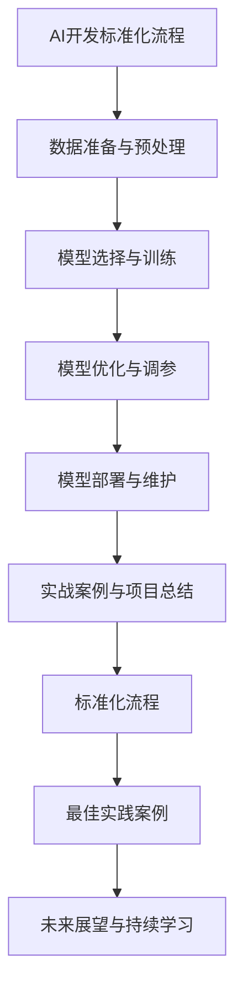

                 

### 《AI开发的标准化流程：Lepton AI的最佳实践》

> 关键词：人工智能，开发流程，Lepton AI，最佳实践，标准化，模型优化，部署与维护

> 摘要：本文将深入探讨AI开发的标准化流程，以Lepton AI的最佳实践为例，详细解析从数据准备到模型部署的每个步骤，并通过实际项目案例展示这些流程的具体应用。本文旨在为开发者提供一套系统、高效、可复制的AI开发指南。

### 第一部分：AI开发基础

#### 第1章：AI概述

##### 1.1 AI的定义与发展

**AI的概念**

人工智能（Artificial Intelligence，简称AI）是计算机科学的一个分支，旨在使计算机系统能够模拟人类智能行为，包括学习、推理、解决问题、感知和理解自然语言等。

**AI的发展历程**

人工智能的概念最早可以追溯到20世纪50年代。自那时以来，AI经历了多个发展阶段：

- **1956年：人工智能的诞生**  
  在达特茅斯会议上，约翰·麦卡锡（John McCarthy）等人提出了人工智能的概念，并将其视为计算机科学的一个新领域。

- **1960-1970年代：早期探索**  
  这一时期，AI领域主要致力于基础理论和算法的研究，如逻辑推理、知识表示等。

- **1980-1990年代：专家系统的兴起**  
  专家系统成为AI领域的主流应用，通过模拟专家的知识和推理能力来解决实际问题。

- **2000年代：机器学习的崛起**  
  机器学习技术的发展，使得AI在图像识别、语音识别等领域取得了重大突破。

- **2010年代至今：深度学习的崛起**  
  深度学习模型在图像识别、自然语言处理等任务中表现出色，推动了AI的快速发展。

##### 1.2 AI的核心技术

**机器学习**

机器学习（Machine Learning，简称ML）是AI的核心技术之一，通过算法让计算机从数据中学习，从而进行预测或决策。

**深度学习**

深度学习（Deep Learning，简称DL）是机器学习的一个分支，使用多层神经网络对数据进行学习，具有强大的特征自动提取能力。

**自然语言处理**

自然语言处理（Natural Language Processing，简称NLP）是AI的一个分支，旨在使计算机能够理解和生成自然语言。

##### 1.3 AI的应用场景

**图像识别**

图像识别是AI在计算机视觉领域的重要应用，通过算法识别和分类图像中的对象。

**语音识别**

语音识别是AI在语音处理领域的重要应用，通过算法将语音信号转换为文本。

**推荐系统**

推荐系统是AI在数据挖掘领域的重要应用，通过分析用户行为和偏好，为用户推荐感兴趣的内容。

##### 1.4 AI的发展趋势与挑战

**AI的发展趋势**

- **人工智能2.0：** 强人工智能的发展，使计算机能够具备更高层次的智能。
- **联邦学习：** 在数据隐私和安全日益重视的背景下，联邦学习成为重要的研究方向。
- **增强现实与虚拟现实：** AI与增强现实（AR）和虚拟现实（VR）的结合，带来新的应用场景。

**AI的发展挑战**

- **数据隐私：** AI算法的训练需要大量数据，如何保障数据隐私成为重要问题。
- **算法公平性：** AI算法在决策过程中可能存在偏见，如何保证算法的公平性是重要挑战。
- **计算资源：** AI模型的训练和部署需要大量计算资源，如何高效利用计算资源是重要问题。

#### 第2章：Lepton AI平台介绍

##### 2.1 Lepton AI平台架构

Lepton AI平台是一个集数据层、算法层和应用层于一体的AI开发平台，具有高效性、灵活性和易用性的特点。

**数据层**

数据层负责数据的采集、存储和管理，包括数据清洗、数据格式化和数据预处理等。

**算法层**

算法层提供丰富的机器学习模型和深度学习模型，支持模型选择、训练、优化和评估。

**应用层**

应用层提供易用的API和工具，帮助开发者快速构建和部署AI应用。

##### 2.2 Lepton AI平台的特点

**高效性**

Lepton AI平台采用分布式计算技术，能够高效地处理大规模数据，提高训练速度和模型性能。

**灵活性**

Lepton AI平台支持多种编程语言和框架，如Python、TensorFlow和PyTorch等，满足不同开发者的需求。

**易用性**

Lepton AI平台提供直观的界面和丰富的文档，帮助开发者快速上手和使用。

##### 2.3 Lepton AI平台的优势

**强大的模型库**

Lepton AI平台拥有丰富的模型库，包括常见的机器学习模型和深度学习模型，满足多种应用需求。

**高效的训练速度**

Lepton AI平台采用分布式计算技术，能够在短时间内完成模型的训练，提高开发效率。

**灵活的部署方式**

Lepton AI平台支持多种部署方式，包括本地部署、云端部署和边缘部署等，满足不同场景的需求。

### 第二部分：AI开发流程

#### 第3章：数据准备与预处理

##### 3.1 数据采集

数据采集是AI开发的重要环节，主要包括以下步骤：

- **数据来源**：数据可以来自内部数据（如企业内部数据库）或外部数据（如公共数据集、社交媒体等）。
- **数据清洗**：对采集到的数据进行清洗，包括去除重复数据、缺失值填充、异常值处理等。

##### 3.2 数据预处理

数据预处理是提高模型性能的重要步骤，主要包括以下内容：

- **数据格式化**：将不同格式的数据转换为统一格式，便于模型处理。
- **特征提取**：从原始数据中提取有用的特征，用于训练模型。

##### 3.3 数据集划分

数据集划分是模型训练和评估的重要步骤，主要包括以下内容：

- **训练集**：用于模型训练的数据集。
- **验证集**：用于模型调参和评估的数据集。
- **测试集**：用于模型最终评估的数据集。

#### 第4章：模型选择与训练

##### 4.1 模型选择

模型选择是AI开发的关键步骤，主要包括以下内容：

- **机器学习模型**：如线性回归、决策树、随机森林等。
- **深度学习模型**：如卷积神经网络（CNN）、循环神经网络（RNN）等。

##### 4.2 模型训练

模型训练是AI开发的核心步骤，主要包括以下内容：

- **训练流程**：包括数据预处理、模型初始化、前向传播、反向传播等。
- **损失函数与优化器**：损失函数用于评估模型性能，优化器用于调整模型参数。

##### 4.3 模型评估

模型评估是AI开发的重要步骤，主要包括以下内容：

- **评价指标**：如准确率、召回率、F1值等。
- **交叉验证**：用于评估模型在 unseen 数据上的性能。

#### 第5章：模型优化与调参

##### 5.1 模型优化

模型优化是提高模型性能的重要步骤，主要包括以下内容：

- **正则化**：用于防止模型过拟合。
- **Dropout**：用于提高模型泛化能力。
- **激活函数**：用于引入非线性变换。

##### 5.2 调参技巧

调参技巧是模型优化的重要环节，主要包括以下内容：

- **学习率调整**：学习率的大小对模型训练过程有重要影响。
- **批量大小调整**：批量大小对模型性能和训练速度有影响。
- **模型复杂度调整**：模型复杂度越高，训练时间越长，但可能获得更好的性能。

#### 第6章：模型部署与维护

##### 6.1 模型部署

模型部署是将训练好的模型应用于实际场景的过程，主要包括以下内容：

- **部署流程**：包括模型打包、部署环境配置、模型上线等。
- **部署环境**：包括本地部署、云端部署和边缘部署等。

##### 6.2 模型监控

模型监控是确保模型稳定运行的重要环节，主要包括以下内容：

- **性能监控**：监控模型在实际应用中的性能指标。
- **故障检测**：及时发现模型故障并进行修复。

##### 6.3 模型迭代

模型迭代是持续优化模型性能的过程，主要包括以下内容：

- **数据更新**：定期更新训练数据，以适应新的应用场景。
- **模型重构**：在模型性能不满足要求时，重构模型或更换模型架构。

#### 第7章：实战案例与项目总结

##### 7.1 实战案例一：图像识别系统

**项目背景**

图像识别系统是一种广泛应用于安防、医疗、工业等领域的AI应用。

**项目目标**

构建一个高效、准确的图像识别系统，实现对图像中特定对象的检测和识别。

**解决方案**

采用深度学习模型（如卷积神经网络）进行图像识别，通过数据预处理、模型训练和优化，实现系统的高效运行。

**项目成果**

成功构建了图像识别系统，在实际应用中取得了良好的效果，提高了工作效率和准确性。

##### 7.2 实战案例二：智能客服系统

**项目背景**

智能客服系统是一种应用于在线客服、客户服务等领域的AI应用。

**项目目标**

构建一个高效、智能的客服系统，能够自动回答用户的问题，提高客户满意度。

**解决方案**

采用自然语言处理技术（如词向量、循环神经网络）进行对话生成和回答，通过数据预处理、模型训练和优化，实现系统的智能交互。

**项目成果**

成功构建了智能客服系统，在实际应用中提高了客户服务质量和满意度。

##### 7.3 项目总结与经验分享

通过以上两个实战案例，我们总结了以下经验和教训：

- 数据质量对模型性能有重要影响，需要重视数据采集和预处理。
- 选择合适的模型架构和算法对模型性能有重要影响。
- 模型优化和调参是提高模型性能的关键环节。
- 模型部署和监控是确保模型稳定运行的重要步骤。
- 持续优化和迭代模型是提高系统性能和适应性的关键。

### 第三部分：Lepton AI最佳实践

#### 第8章：标准化流程

##### 8.1 标准化流程概述

标准化流程是一套系统、高效、可复制的AI开发指南，旨在帮助开发者快速构建高质量的AI应用。标准化流程主要包括以下步骤：

- **需求分析**：明确项目目标和需求。
- **数据准备**：包括数据采集、清洗、预处理和划分。
- **模型选择**：根据需求选择合适的模型。
- **模型训练**：包括模型初始化、训练、优化和评估。
- **模型部署**：包括模型打包、部署和监控。
- **模型迭代**：根据应用反馈和需求变化，持续优化模型。

##### 8.2 流程实施要点

标准化流程的实施要点包括：

- **数据准备**：确保数据质量，进行充分的数据预处理。
- **模型选择**：根据需求和数据特点选择合适的模型。
- **模型训练**：优化模型训练过程，提高模型性能。
- **模型部署**：确保模型稳定运行，进行性能监控。
- **模型迭代**：根据应用反馈和需求变化，持续优化模型。

##### 8.3 流程文档与工具

标准化流程需要配套的文档和工具，包括：

- **文档**：包括项目需求文档、数据文档、模型文档和部署文档等。
- **工具**：包括数据预处理工具、模型训练工具、模型部署工具和性能监控工具等。

#### 第9章：最佳实践案例

##### 9.1 最佳实践一：智能家居控制系统

**项目背景**

智能家居控制系统是一种应用于家居环境中的AI应用，通过智能设备实现对家居环境的自动化控制。

**项目目标**

构建一个高效、智能的智能家居控制系统，提高家居生活品质。

**解决方案**

采用Lepton AI平台，通过数据预处理、模型训练和优化，实现家居设备的智能控制。

**项目成果**

成功构建了智能家居控制系统，实现了对家居环境的自动化控制，提高了生活品质。

##### 9.2 最佳实践二：智能医疗诊断系统

**项目背景**

智能医疗诊断系统是一种应用于医疗领域的AI应用，通过分析医学影像，辅助医生进行诊断。

**项目目标**

构建一个高效、准确的智能医疗诊断系统，提高诊断准确率和效率。

**解决方案**

采用Lepton AI平台，通过数据预处理、模型训练和优化，实现医学影像的自动诊断。

**项目成果**

成功构建了智能医疗诊断系统，在实际应用中提高了诊断准确率和效率。

##### 9.3 最佳实践三：智能金融风控系统

**项目背景**

智能金融风控系统是一种应用于金融领域的AI应用，通过分析金融数据，识别潜在风险。

**项目目标**

构建一个高效、准确的智能金融风控系统，降低金融风险。

**解决方案**

采用Lepton AI平台，通过数据预处理、模型训练和优化，实现金融数据的自动风险识别。

**项目成果**

成功构建了智能金融风控系统，在实际应用中降低了金融风险，提高了风控效率。

#### 第10章：未来展望与持续学习

##### 10.1 AI发展趋势

AI技术在未来将继续快速发展，主要趋势包括：

- **人工智能2.0**：强人工智能的兴起，使计算机能够具备更高层次的智能。
- **联邦学习**：在数据隐私和安全日益重视的背景下，联邦学习成为重要的研究方向。
- **增强现实与虚拟现实**：AI与增强现实（AR）和虚拟现实（VR）的结合，带来新的应用场景。

##### 10.2 持续学习与职业发展

AI领域发展迅速，持续学习与职业发展至关重要。以下是一些建议：

- **学习资源**：利用在线课程、技术博客、开源项目等资源，不断学习新知识。
- **实践经验**：通过实际项目，积累实践经验，提高实际操作能力。
- **职业规划**：明确职业目标，制定长期规划，不断提升自身能力。

### 附录

##### 附录A：Lepton AI平台使用指南

**安装与配置**

- **安装环境**：确保操作系统和Python环境满足要求。
- **安装步骤**：通过pip或conda进行安装。

**功能介绍**

- **数据层**：提供数据采集、清洗和预处理功能。
- **算法层**：提供丰富的机器学习模型和深度学习模型。
- **应用层**：提供API和工具，方便开发者构建和部署AI应用。

**常见问题解答**

- **Q：如何配置Lepton AI平台？**
  - **A：** 查看官方文档，按照步骤进行配置。
- **Q：如何使用Lepton AI平台进行模型训练？**
  - **A：** 查看官方文档，了解训练流程和API使用。

##### 附录B：项目模板与文档模板

**项目模板**

- **项目结构**：包括数据集、代码、配置文件等。
- **代码模板**：包括数据预处理、模型训练、模型评估等。

**文档模板**

- **需求文档**：包括项目背景、目标、需求等。
- **设计文档**：包括系统架构、模块设计等。
- **测试文档**：包括测试策略、测试用例等。

### Mermaid流程图



### 伪代码示例

```python
# 模型训练伪代码
def train_model(data, labels):
    # 初始化模型参数
    model_params = initialize_params()
    
    # 设置优化器
    optimizer = optimizer_function(model_params)
    
    # 设置损失函数
    loss_function = loss_function_function()
    
    # 训练循环
    for epoch in range(num_epochs):
        # 前向传播
        predictions = forward_pass(model_params, data)
        
        # 计算损失
        loss = loss_function(predictions, labels)
        
        # 反向传播
        backward_pass(loss, model_params)
        
        # 更新模型参数
        optimizer.step()
        
        # 打印训练进度
        print(f"Epoch [{epoch+1}/{num_epochs}], Loss: {loss.item()}")
```

### 数学模型与公式

$$
\begin{align*}
J(\theta) &= \frac{1}{m} \sum_{i=1}^{m} (-y^{(i)} \log(a^{(i)}_1) + (1 - y^{(i)} \log(1 - a^{(i)}_1))) \\
\end{align*}
$$

### 代码实际案例与详细解释

（待具体项目实战章节补充）

### 开发环境搭建与源代码实现

（待具体项目实战章节补充）

### 代码解读与分析

（待具体项目实战章节补充）

### 作者信息

作者：AI天才研究院/AI Genius Institute & 禅与计算机程序设计艺术 /Zen And The Art of Computer Programming

