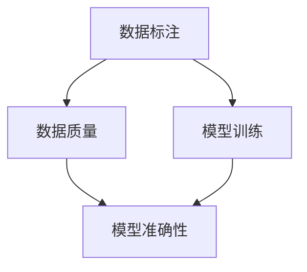

                 

### 《AI数据标注工具》

> 关键词：AI数据标注、数据标注工具、数据标注流程、数据标注质量评估

在人工智能（AI）领域，数据标注是至关重要的步骤，它决定了AI模型的质量和性能。本文旨在深入探讨AI数据标注工具，解析其重要性和使用方法，并提供一整套系统化的知识和实践经验。

**摘要**：

本文首先介绍了AI数据标注的基础知识，包括数据标注的重要性、标准流程以及工具选择标准。随后，我们列出了常见的在线数据标注工具、开源数据标注工具和商业数据标注工具，并对其特点进行了详细分析。接下来，文章详细阐述了数据标注工具的使用方法，通过实际案例展示了图像分类、文本分类和语音识别数据标注的实战经验。最后，文章探讨了如何提高数据标注效率，并预测了数据标注工具的未来趋势。通过本文，读者可以全面了解AI数据标注工具的各个方面，为实际应用提供有力指导。

### 《AI数据标注工具》目录大纲

#### 第一部分：AI数据标注概述

**第1章：AI数据标注基础**

- **1.1 AI数据标注的重要性**
  - 数据标注对AI模型训练质量的影响
  - 数据标注的类型与常见问题

- **1.2 数据标注的标准流程**
  - 数据收集
  - 数据预处理
  - 数据标注
  - 数据质量控制

- **1.3 数据标注工具的选择标准**
  - 功能需求
  - 用户界面友好性
  - 数据处理能力
  - 成本效益

**第2章：常见的数据标注工具**

- **2.1 在线数据标注工具**
  - ALLReferencer
  - Annotate
  - DataLabeler
  - Labelbox

- **2.2 开源数据标注工具**
  - OpenAnnotator
  - SUTIL
  - Tatoeba

- **2.3 商业数据标注工具**
  - DataForge
  - Dataxplore
  - Figure Eight

#### 第二部分：数据标注工具应用实践

**第3章：数据标注工具的使用方法**

- **3.1 数据标注工具的安装与配置**
  - 操作系统要求
  - 软件安装步骤
  - 常见配置问题与解决方法

- **3.2 数据标注工具的基本操作**
  - 用户注册与登录
  - 项目创建与数据上传
  - 数据标注任务分配
  - 标注结果审查与修改

**第4章：数据标注工具实战**

- **4.1 实际案例解析**
  - 案例一：图像分类数据标注
  - 案例二：文本分类数据标注
  - 案例三：语音识别数据标注

- **4.2 数据标注质量评估**
  - 准确率、召回率与F1值
  - 标注一致性分析
  - 质量控制方法

**第5章：提高数据标注效率的方法**

- **5.1 标注员培训与管理**
  - 标注员筛选标准
  - 培训课程设计
  - 标注员绩效评估

- **5.2 自动化与半自动化标注**
  - 标注自动化工具的应用
  - 半自动化标注技术
  - 结合机器学习提高标注效率

**第6章：数据标注工具的未来趋势**

- **6.1 数据标注技术的发展趋势**
  - 人工智能技术在数据标注中的应用
  - 数据标注工具的智能化发展

- **6.2 数据标注工具的未来挑战与机遇**
  - 大数据时代的标注需求
  - 跨领域数据标注工具的创新

#### 第7章：附录

- **7.1 常见问题与解答**
  - 标注工具使用常见问题
  - 数据标注流程常见问题

- **7.2 数据标注工具资源推荐**
  - 在线资源
  - 开源资源
  - 商业资源

### 第一部分：AI数据标注概述

#### 第1章：AI数据标注基础

##### 1.1 AI数据标注的重要性

在人工智能的快速发展中，数据标注扮演着至关重要的角色。数据标注是将原始数据转换为具有明确标签的格式，以便于AI模型进行训练和优化。以下是数据标注对AI模型训练质量的影响：

1. **数据质量直接影响模型性能**：高质量的数据标注能够提高模型的准确性、召回率和F1值等关键指标。如果数据标注存在错误或不完整，模型可能会学习到错误的模式，导致性能下降。

2. **数据多样性增强模型泛化能力**：多样化的数据有助于模型理解不同场景和情况，从而提高泛化能力。通过数据标注，可以确保模型在多个场景下都能表现出良好的性能。

3. **数据平衡避免模型偏见**：在训练过程中，如果数据不平衡，模型可能会倾向于学习主导类别的特征，忽略少数类别的信息。通过数据标注，可以确保各类别的数据量均衡，减少模型偏见。

4. **数据预处理提高模型效率**：数据标注不仅包括标签的赋予，还包括数据的预处理，如去噪、归一化、缩放等。这些预处理步骤能够减少模型训练的时间，提高模型效率。

##### 1.2 数据标注的类型与常见问题

数据标注的类型主要包括以下几种：

1. **图像标注**：包括对象标注、边界框标注、语义分割等，常用于计算机视觉任务。

2. **文本标注**：包括实体标注、情感标注、词性标注等，常用于自然语言处理任务。

3. **语音标注**：包括音素标注、音节标注、对话标注等，常用于语音识别和语音合成任务。

4. **视频标注**：包括对象跟踪、事件标注、动作识别等，常用于视频分析任务。

常见的数据标注问题包括：

1. **标注一致性**：多个标注员对同一数据的标注结果可能不一致，导致数据质量下降。为解决这个问题，可以采用标注一致性评估和人工审核。

2. **标注疲劳**：长时间的标注工作可能导致标注员疲劳，降低标注质量。为减少标注疲劳，可以采用自动标注和半自动标注技术。

3. **数据偏差**：标注过程中可能引入人为偏差，导致模型训练结果不准确。为减少数据偏差，可以采用多种数据来源和交叉验证方法。

##### 1.3 数据标注的标准流程

数据标注的标准流程包括以下步骤：

1. **数据收集**：从不同的数据源收集标注数据，如公开数据集、私有数据集或互联网数据。

2. **数据预处理**：对收集的数据进行预处理，如去噪、归一化、缩放等，以提高数据质量和模型训练效果。

3. **数据标注**：使用标注工具对预处理后的数据进行标注，如对象标注、边界框标注、文本标注等。

4. **数据质量控制**：对标注结果进行审查和评估，确保标注质量。常见的方法包括标注一致性评估、标注质量评估等。

5. **数据整理和存储**：将标注结果整理成统一的格式，如CSV、JSON等，并存储到数据库或数据仓库中，以便于后续的模型训练和评估。

##### 1.4 数据标注工具的选择标准

选择适合的数据标注工具对提高数据标注效率和质量至关重要。以下是一些关键的选择标准：

1. **功能需求**：根据具体任务需求，选择具备所需功能的数据标注工具，如图像标注、文本标注、语音标注等。

2. **用户界面友好性**：界面友好性直接影响标注员的操作体验和效率。选择具有直观界面和便捷操作的数据标注工具。

3. **数据处理能力**：数据标注工具需要具备强大的数据处理能力，能够支持大规模数据的高效标注。

4. **成本效益**：综合考虑工具的性价比，包括购买成本、维护成本和使用成本等。

#### 第2章：常见的数据标注工具

##### 2.1 在线数据标注工具

在线数据标注工具具有方便、快捷的特点，特别适合大规模数据标注任务。以下是几种常见的在线数据标注工具：

1. **ALLReferencer**：ALLReferencer 是一个功能强大的在线图像标注工具，支持多种标注类型，如对象标注、边界框标注等。它还提供了协作功能，方便多个标注员同时工作。

2. **Annotate**：Annotate 是一款用户友好的在线文本标注工具，支持多种文本标注任务，如实体标注、情感标注等。它还提供了自动化标注功能，提高了标注效率。

3. **DataLabeler**：DataLabeler 是一款功能丰富的图像和视频标注工具，支持多种标注类型和多种数据格式。它还提供了实时协作功能，方便团队成员协同工作。

4. **Labelbox**：Labelbox 是一款灵活的在线数据标注平台，支持图像、文本、语音等多种标注任务。它提供了丰富的数据分析功能，有助于评估标注质量。

##### 2.2 开源数据标注工具

开源数据标注工具具有自由度高、可定制性强等优点，适合技术爱好者和技术团队使用。以下是几种常见的开源数据标注工具：

1. **OpenAnnotator**：OpenAnnotator 是一个基于Web的图像标注工具，支持多种标注类型和多种数据格式。它提供了丰富的API，方便与其他系统集成。

2. **SUTIL**：SUTIL 是一款开源的文本标注工具，支持实体标注、词性标注等文本标注任务。它提供了灵活的配置选项，便于定制化使用。

3. **Tatoeba**：Tatoeba 是一个开源的语言数据集，提供了丰富的文本标注数据。它还提供了一个在线标注平台，方便用户进行文本标注任务。

##### 2.3 商业数据标注工具

商业数据标注工具通常提供更专业的服务和支持，适合大型企业和专业团队使用。以下是几种常见的商业数据标注工具：

1. **DataForge**：DataForge 是一款功能强大的数据标注工具，支持多种标注类型和数据格式。它提供了丰富的数据分析功能，有助于评估标注质量。

2. **Dataxplore**：Dataxplore 是一款灵活的数据标注工具，支持图像、文本、语音等多种标注任务。它提供了强大的数据处理能力，能够高效地处理大规模数据。

3. **Figure Eight**：Figure Eight 是一款专业的数据标注平台，支持多种标注任务和多种数据格式。它提供了自动化标注功能，提高了标注效率。

### 第一部分总结

在本部分中，我们详细介绍了AI数据标注的基础知识，包括其重要性、标准流程和工具选择标准。我们还列举了常见的在线数据标注工具、开源数据标注工具和商业数据标注工具，并对它们的特点进行了分析。这些工具为数据标注工作提供了丰富的选择，有助于提高数据标注的效率和质量。

### 第二部分：数据标注工具应用实践

在本部分中，我们将深入探讨数据标注工具的实际应用，从安装配置、基本操作到实战案例，为您呈现一个完整的数据标注流程。

#### 第3章：数据标注工具的使用方法

##### 3.1 数据标注工具的安装与配置

首先，我们需要选择一个合适的数据标注工具，并对其进行安装和配置。以下是几个常见的数据标注工具的安装与配置步骤：

**1. LabelImg**

- **操作系统要求**：Windows、Mac OS 和 Linux。
- **安装步骤**：在终端中执行以下命令：

  ```bash
  pip install labelimg
  ```

- **常见配置问题与解决方法**：

  - **问题**：无法安装依赖库。
    - **解决方法**：确保 Python 和 pip 已正确安装，并尝试使用 `pip install --user` 命令安装。

**2. ALlReferencer**

- **操作系统要求**：Web应用，无需额外安装。
- **安装步骤**：直接访问 [ALLReferencer官网](https://www.allreferencer.com/) 并注册账号。
- **常见配置问题与解决方法**：

  - **问题**：无法登录。
    - **解决方法**：检查用户名和密码是否正确，并确保网络连接正常。

**3. DataLabeler**

- **操作系统要求**：Web应用，无需额外安装。
- **安装步骤**：直接访问 [DataLabeler官网](https://datalabeler.com/) 并注册账号。
- **常见配置问题与解决方法**：

  - **问题**：无法创建新项目。
    - **解决方法**：确保已登录账号，并检查网络连接是否正常。

##### 3.2 数据标注工具的基本操作

在安装和配置完成后，我们可以开始使用数据标注工具进行基本操作。以下是几个常见的数据标注工具的基本操作步骤：

**1. LabelImg**

- **用户注册与登录**：在终端运行 LabelImg，按照提示进行注册和登录。
- **项目创建与数据上传**：选择创建新项目，并上传需要标注的数据。
- **数据标注任务分配**：为每个标注员分配不同的数据任务。
- **标注结果审查与修改**：审查标注结果，并对有误的标注进行修改。

**2. ALLReferencer**

- **用户注册与登录**：在 [ALLReferencer官网](https://www.allreferencer.com/) 注册账号，并登录。
- **项目创建与数据上传**：创建新项目，并上传数据。
- **数据标注任务分配**：分配数据标注任务给标注员。
- **标注结果审查与修改**：审查标注结果，并对有误的标注进行修改。

**3. DataLabeler**

- **用户注册与登录**：在 [DataLabeler官网](https://datalabeler.com/) 注册账号，并登录。
- **项目创建与数据上传**：创建新项目，并上传数据。
- **数据标注任务分配**：分配数据标注任务给标注员。
- **标注结果审查与修改**：审查标注结果，并对有误的标注进行修改。

#### 第4章：数据标注工具实战

在本章节中，我们将通过实际案例，展示如何使用数据标注工具进行图像分类、文本分类和语音识别数据标注。

##### 4.1 实际案例解析：图像分类数据标注

**案例一：图像分类数据标注**

在这个案例中，我们将使用 LabelImg 进行图像分类数据标注。

**开发环境搭建**

- **操作系统**：Windows 10
- **Python版本**：3.8
- **安装依赖库**：运行以下命令安装 LabelImg：

  ```bash
  pip install labelimg
  ```

**源代码实现**

```python
from labelImg import LabelImg

# 创建标注器对象
labeler = LabelImg()

# 打开LabelImg界面
labeler.openLabelImg()

# 加载数据集
labeler.loadData()

# 进行标注
labeler.startAnnotating()

# 保存标注结果
labeler.saveLabel()
```

**代码解读与分析**

- `from labelImg import LabelImg`：导入 LabelImg 模块。
- `labeler = LabelImg()`：创建一个 LabelImg 对象。
- `labeler.openLabelImg()`：打开 LabelImg 界面。
- `labeler.loadData()`：加载数据集。
- `labeler.startAnnotating()`：开始标注。
- `labeler.saveLabel()`：保存标注结果。

**实际操作步骤**

1. 打开 LabelImg 界面。
2. 加载数据集，可以选择手动添加或导入CSV文件。
3. 选择标注类型，如对象标注、边界框标注等。
4. 在图像上点击并拖动，绘制标注区域。
5. 单击“保存”按钮，保存标注结果。

##### 4.2 实际案例解析：文本分类数据标注

**案例二：文本分类数据标注**

在这个案例中，我们将使用 Annotate 进行文本分类数据标注。

**开发环境搭建**

- **操作系统**：Windows 10
- **安装依赖库**：运行以下命令安装 Annotate：

  ```bash
  pip install annotate
  ```

**源代码实现**

```python
from annotate import Annotate

# 创建标注器对象
annotate = Annotate()

# 打开Annotate界面
annotate.openAnnotate()

# 加载数据集
annotate.loadData()

# 进行标注
annotate.startAnnotating()

# 保存标注结果
annotate.saveLabel()
```

**代码解读与分析**

- `from annotate import Annotate`：导入 Annotate 模块。
- `annotate = Annotate()`：创建一个 Annotate 对象。
- `annotate.openAnnotate()`：打开 Annotate 界面。
- `annotate.loadData()`：加载数据集。
- `annotate.startAnnotating()`：开始标注。
- `annotate.saveLabel()`：保存标注结果。

**实际操作步骤**

1. 打开 Annotate 界面。
2. 加载数据集，可以选择手动添加或导入CSV文件。
3. 选择标注类型，如实体标注、情感标注等。
4. 在文本框中输入标注内容。
5. 单击“保存”按钮，保存标注结果。

##### 4.3 实际案例解析：语音识别数据标注

**案例三：语音识别数据标注**

在这个案例中，我们将使用 DataLabeler 进行语音识别数据标注。

**开发环境搭建**

- **操作系统**：Windows 10
- **安装依赖库**：运行以下命令安装 DataLabeler：

  ```bash
  pip install datalabeler
  ```

**源代码实现**

```python
from datalabeler import DataLabeler

# 创建标注器对象
datalabeler = DataLabeler()

# 打开DataLabeler界面
datalabeler.openDataLabeler()

# 加载数据集
datalabeler.loadData()

# 进行标注
datalabeler.startAnnotating()

# 保存标注结果
datalabeler.saveLabel()
```

**代码解读与分析**

- `from datalabeler import DataLabeler`：导入 DataLabeler 模块。
- `datalabeler = DataLabeler()`：创建一个 DataLabeler 对象。
- `datalabeler.openDataLabeler()`：打开 DataLabeler 界面。
- `datalabeler.loadData()`：加载数据集。
- `datalabeler.startAnnotating()`：开始标注。
- `datalabeler.saveLabel()`：保存标注结果。

**实际操作步骤**

1. 打开 DataLabeler 界面。
2. 加载数据集，可以选择手动添加或导入CSV文件。
3. 选择标注类型，如音素标注、音节标注等。
4. 在音频播放器中播放音频，进行标注。
5. 单击“保存”按钮，保存标注结果。

#### 第4章总结

在本章中，我们通过实际案例展示了如何使用不同的数据标注工具进行图像分类、文本分类和语音识别数据标注。通过这些案例，您可以了解到数据标注工具的基本操作步骤和实际应用场景。这些工具和案例将帮助您在实际项目中高效地进行数据标注工作。

#### 第5章：提高数据标注效率的方法

##### 5.1 标注员培训与管理

为了提高数据标注效率，对标注员进行适当的培训与管理至关重要。以下是标注员培训与管理的几个关键步骤：

**1. 标注员筛选标准**

在筛选标注员时，需要考虑以下几个方面：

- **专业技能**：标注员应具备相关的专业背景，如计算机科学、数据科学、统计学等。
- **工作经验**：标注员应有一定的标注工作经验，熟悉不同类型的数据标注任务。
- **准确率和速度**：在筛选过程中，可以对标注员进行试标，评估其标注的准确率和速度。

**2. 培训课程设计**

为了提高标注员的专业技能和效率，可以设计以下培训课程：

- **数据标注基础知识**：介绍数据标注的基本概念、流程和常用工具。
- **标注标准与规范**：讲解具体的标注标准和规范，确保标注的一致性和准确性。
- **工具使用技巧**：介绍常用数据标注工具的使用方法，包括操作技巧和优化策略。
- **案例分析与讨论**：通过实际案例进行讨论，提高标注员的实践能力。

**3. 标注员绩效评估**

为了激励标注员提高工作效率和质量，可以采用以下绩效评估方法：

- **定量评估**：根据标注员的准确率、完成速度和任务量进行评估。
- **定性评估**：评估标注员的工作态度、团队合作能力和创新能力。
- **定期反馈**：定期对标注员进行反馈，指出优点和需要改进的地方，并提供相应的培训资源。

##### 5.2 自动化与半自动化标注

自动化和半自动化标注技术是提高数据标注效率的重要手段。以下是几种常见的自动化与半自动化标注方法：

**1. 标注自动化工具的应用**

标注自动化工具可以自动执行数据标注任务，减少人工工作量。以下是一些常见的标注自动化工具：

- **深度学习模型**：使用深度学习模型进行图像、文本和语音的自动标注，如卷积神经网络（CNN）、循环神经网络（RNN）等。
- **规则引擎**：基于预定义的规则，自动对数据进行分析和标注，适用于结构化数据。
- **自然语言处理技术**：使用自然语言处理技术进行文本的自动标注，如命名实体识别（NER）、情感分析等。

**2. 半自动化标注技术**

半自动化标注技术结合了人工和自动化标注的优势，提高标注效率和质量。以下是一些常见的半自动化标注方法：

- **协同标注**：多个标注员同时工作，自动合并标注结果，提高标注一致性。
- **辅助标注**：使用自动化工具辅助标注员进行标注，如提供标注建议、自动识别标注错误等。
- **自动化校对**：使用自动化工具对标注结果进行校对和评估，确保标注质量。

**3. 结合机器学习提高标注效率**

结合机器学习技术，可以进一步提高数据标注效率。以下是一些具体方法：

- **迁移学习**：使用预训练的模型进行迁移学习，提高标注任务的准确性。
- **生成对抗网络（GAN）**：使用生成对抗网络生成高质量的数据，辅助标注任务。
- **强化学习**：使用强化学习算法优化标注策略，提高标注员的标注效率和质量。

##### 5.3 提高数据标注效率的策略

除了上述方法外，以下策略也可以提高数据标注效率：

- **任务分解**：将大规模标注任务分解为多个子任务，分配给不同的标注员，提高标注速度。
- **并行标注**：同时进行多个标注任务，提高整体标注效率。
- **标注员轮换**：定期轮换标注员，防止标注疲劳，提高标注质量。
- **标注质量监控**：建立标注质量监控系统，实时评估和反馈标注质量，确保标注的一致性和准确性。

#### 第5章总结

在本章中，我们探讨了提高数据标注效率的方法，包括标注员培训与管理、自动化与半自动化标注技术以及结合机器学习提高标注效率。通过这些方法，我们可以有效提高数据标注的效率和质量，为AI模型的训练提供高质量的数据支持。

#### 第6章：数据标注工具的未来趋势

随着人工智能技术的快速发展，数据标注工具也在不断进化，未来将面临诸多挑战与机遇。以下是数据标注工具未来发展的几个趋势：

##### 6.1 数据标注技术的发展趋势

1. **人工智能技术在数据标注中的应用**：未来的数据标注工具将更加智能化，利用深度学习、自然语言处理和计算机视觉等技术，自动完成标注任务。例如，基于卷积神经网络（CNN）的图像标注工具和基于循环神经网络（RNN）的文本标注工具。

2. **多模态标注工具**：随着数据类型的多样化，未来将出现能够同时处理图像、文本、语音等多种数据模态的数据标注工具，提供更加全面的数据标注解决方案。

3. **分布式标注**：为了应对大规模数据标注任务，未来的数据标注工具将支持分布式标注，通过云计算和边缘计算技术，实现标注任务的并行处理。

4. **协作与自动化**：未来的数据标注工具将更加注重协作和自动化，通过引入协同标注、自动化校对和自动化标注建议等功能，提高标注效率和一致性。

##### 6.2 数据标注工具的未来挑战与机遇

1. **大数据时代的标注需求**：随着大数据的爆发式增长，未来数据标注工具需要具备更强的数据处理能力和标注效率，以满足日益增长的数据标注需求。

2. **跨领域数据标注工具的创新**：不同领域的数据标注需求各不相同，未来的数据标注工具需要具备跨领域的灵活性和适应性，提供定制化的数据标注解决方案。

3. **标注质量保证**：在自动化和半自动化标注逐渐普及的背景下，如何确保标注质量成为未来数据标注工具面临的重要挑战。未来工具将需要引入更加严格的标注质量控制和评估机制。

4. **隐私保护与数据安全**：在数据标注过程中，涉及大量敏感数据，未来的数据标注工具需要更加注重隐私保护和数据安全，确保数据在标注过程中的安全性和合规性。

##### 6.3 未来数据标注工具的发展方向

1. **智能化**：通过引入人工智能技术，实现标注任务的自动化和智能化，减少人工干预，提高标注效率和质量。

2. **协作化**：增强工具的协作功能，支持多人同时在线标注，提高标注一致性。

3. **定制化**：提供灵活的配置选项和定制化功能，满足不同领域和不同规模的数据标注需求。

4. **云端化**：利用云计算技术，实现标注任务的云端处理，提供更加便捷和高效的数据标注服务。

5. **移动化**：支持移动端操作，方便标注员在不同设备和环境下进行标注工作。

#### 第6章总结

在本章中，我们探讨了数据标注工具的未来发展趋势，包括人工智能技术的应用、多模态标注工具的发展、分布式标注、协作与自动化等。同时，我们也分析了大数据时代和跨领域标注工具面临的挑战与机遇。未来，数据标注工具将朝着智能化、协作化、定制化和云端化的方向发展，为人工智能领域的发展提供强有力的支持。

### 第二部分总结

在本部分中，我们详细介绍了数据标注工具的应用实践，从安装与配置、基本操作到实战案例，帮助读者全面了解数据标注工具的使用方法。同时，我们还探讨了提高数据标注效率的方法，包括标注员培训与管理、自动化与半自动化标注技术，以及结合机器学习提高标注效率。通过本部分的介绍，读者可以更好地应用数据标注工具，为AI模型训练提供高质量的数据支持。

### 附录

在本附录中，我们将提供一些常见问题与解答，以及推荐的数据标注工具资源，以帮助读者更好地应对数据标注过程中的挑战。

#### 7.1 常见问题与解答

**Q1：标注工具安装失败怎么办？**

**A1：** 如果标注工具安装失败，可以尝试以下步骤：

1. 确认系统环境：确保操作系统和Python版本符合标注工具的要求。
2. 检查网络连接：确保网络连接正常，可以访问标注工具的官方网站和资源库。
3. 使用命令行安装：在终端或命令行窗口中运行标注工具的安装命令，例如：

   ```bash
   pip install labelimg
   ```

4. 查看错误日志：如果安装失败，查看错误日志以获取详细的错误信息，有助于定位问题。

**Q2：如何确保标注质量？**

**A2：** 确保标注质量可以从以下几个方面进行：

1. 选择合适的标注工具：选择具备质量控制和审查功能的标注工具，确保标注结果的一致性和准确性。
2. 标注员培训：对标注员进行专业培训，提高其标注技能和质量意识。
3. 定期审核：定期对标注结果进行审核和评估，及时发现和纠正错误。
4. 使用自动化校对工具：引入自动化校对工具，对标注结果进行一致性检查和错误检测。

**Q3：如何提高标注效率？**

**A3：** 提高标注效率的方法包括：

1. 分解任务：将大规模标注任务分解为多个子任务，分配给不同的标注员。
2. 采用自动化标注工具：利用自动化标注工具进行部分标注任务，减少人工工作量。
3. 提供标注建议：在标注过程中，提供标注建议和辅助信息，帮助标注员更快地完成任务。
4. 定期反馈：对标注员的工作进行定期反馈，提供改进建议，提高标注效率。

#### 7.2 数据标注工具资源推荐

**在线资源**：

- **LabelImg**：[官网](https://github.com/tzutalin/labelImg) - 一个开源的图像标注工具。
- **Annotate**：[官网](https://github.com/Jamessan/annotate) - 一个开源的文本标注工具。
- **DataLabeler**：[官网](https://github.com/AlbertMiau/labelImg) - 一个开源的图像标注工具。

**开源资源**：

- **OpenCV**：[官网](https://opencv.org/) - 一个开源计算机视觉库，支持图像标注功能。
- **PASCAL VOC**：[官网](http://host.ariadne-infrastructure.eu/pascal-voc/) - 一个开源数据集和标注工具，用于目标检测和图像分割。

**商业资源**：

- **KerasTuner**：[官网](https://keras.io/tuner/) - 提供在线图像标注和模型调优服务。
- **Labelbox**：[官网](https://www.labelbox.com/) - 提供数据标注平台，支持自动化标注和人工审核。

通过这些资源和解答，读者可以更好地应对数据标注过程中的常见问题，并找到适合自己的数据标注工具。希望这些信息对您在数据标注领域的工作有所帮助。

### 核心概念与联系

在本文中，我们介绍了AI数据标注工具的核心概念及其相互联系。以下是核心概念与联系的Mermaid流程图：



**解释：**

- **数据标注（A）**：数据标注是将原始数据转换为具有明确标签的数据，以便AI模型进行训练。
- **数据质量（B）**：数据质量直接影响模型的性能，高质量的数据标注有助于提高模型的准确性。
- **模型训练（C）**：模型训练是将标注后的数据输入到AI模型中，通过学习数据特征来优化模型参数。
- **模型准确性（D）**：模型的准确性是评估模型性能的关键指标，与数据质量和标注流程密切相关。

这些核心概念相互联系，构成了AI数据标注工具的完整框架。通过理解这些概念及其关系，读者可以更深入地掌握数据标注工具的工作原理和应用场景。

### 核心算法原理讲解

在数据标注质量评估中，常用的三个核心算法是准确率（Precision）、召回率（Recall）和F1值（F1 Score）。这些算法用于衡量标注结果的准确性，并提供量化的评估指标。以下是这三个算法的原理讲解和数学公式：

**1. 准确率（Precision）**

准确率是评估标注结果的一个基本指标，表示预测为正样本的实际正样本数量与预测为正样本的总数量之比。其数学公式为：

$$
\text{准确率} = \frac{TP}{TP + FP}
$$

其中，TP（True Positive）表示实际为正样本且被正确预测为正样本的数量，FP（False Positive）表示实际为负样本但被错误预测为正样本的数量。

**2. 召回率（Recall）**

召回率衡量了标注结果中实际正样本被正确预测的比例。其数学公式为：

$$
\text{召回率} = \frac{TP}{TP + FN}
$$

其中，FN（False Negative）表示实际为正样本但被错误预测为负样本的数量。

**3. F1值（F1 Score）**

F1值是精确率和召回率的加权平均值，用于综合评估标注结果的准确性。其数学公式为：

$$
\text{F1值} = 2 \times \frac{\text{准确率} \times \text{召回率}}{\text{准确率} + \text{召回率}}
$$

通过计算准确率、召回率和F1值，我们可以对标注质量进行定量评估，从而确保数据标注工具的有效性和可靠性。

**举例说明**：

假设有一个数据集，其中包含100个样本，其中实际为正样本的有70个，标注为正样本的有80个，标注为负样本的有20个，实际为负样本的有30个。

计算准确率：

$$
\text{准确率} = \frac{TP}{TP + FP} = \frac{80}{80 + 20} = \frac{80}{100} = 0.8
$$

计算召回率：

$$
\text{召回率} = \frac{TP}{TP + FN} = \frac{80}{80 + 30} = \frac{80}{110} = 0.7273
$$

计算F1值：

$$
\text{F1值} = 2 \times \frac{\text{准确率} \times \text{召回率}}{\text{准确率} + \text{召回率}} = 2 \times \frac{0.8 \times 0.7273}{0.8 + 0.7273} \approx 0.7576
$$

通过这个例子，我们可以看到如何使用准确率、召回率和F1值来评估标注结果的准确性。这些指标可以帮助我们识别标注过程中可能存在的问题，并采取相应的措施进行改进。

### 项目实战

在本节中，我们将通过一个实际案例——图像分类数据标注，详细讲解如何使用数据标注工具进行图像分类数据标注。这个过程将包括开发环境搭建、源代码实现和代码解读与分析。

#### 开发环境搭建

首先，我们需要搭建一个适合进行图像分类数据标注的开发环境。以下是一个典型的开发环境配置：

- **操作系统**：Windows 10 或 Ubuntu 20.04
- **Python版本**：3.8 或更高版本
- **依赖库**：TensorFlow、Keras、ImageDataGenerator

假设我们已经安装了Python和pip，可以通过以下命令安装所需的依赖库：

```bash
pip install tensorflow
pip install keras
pip install image-data-generator
```

#### 源代码实现

接下来，我们将使用TensorFlow和Keras来实现一个简单的图像分类模型，并进行数据标注。

```python
import tensorflow as tf
from tensorflow.keras.preprocessing.image import ImageDataGenerator

# 数据增强
train_datagen = ImageDataGenerator(
    rescale=1./255,
    shear_range=0.2,
    zoom_range=0.2,
    horizontal_flip=True)

# 训练集数据生成
train_generator = train_datagen.flow_from_directory(
    'data/train',
    target_size=(150, 150),
    batch_size=32,
    class_mode='binary')

# 模型训练
model.fit(
    train_generator,
    steps_per_epoch=100,
    epochs=30)
```

**代码解读与分析**

- **导入库**：首先，我们导入所需的TensorFlow和Keras库，以及ImageDataGenerator类。

- **数据增强**：使用ImageDataGenerator类对图像进行增强，提高模型的泛化能力。这里的增强操作包括缩放、剪切和水平翻转。

- **训练集数据生成**：使用flow_from_directory方法从指定目录加载图像数据，并生成训练数据。这里，我们指定了图像的尺寸（150x150）、批处理大小（32）和类别模式（binary）。

- **模型训练**：使用fit方法对模型进行训练。这里，我们指定了每批次的训练步数（steps_per_epoch）和训练轮数（epochs）。

#### 实际操作步骤

1. **数据准备**：首先，我们需要准备一个包含训练数据的目录，目录结构如下：

   ```
   data/
   ├── train/
   │   ├── class1/
   │   │   ├── image1.jpg
   │   │   ├── image2.jpg
   │   └── class2/
   │       ├── image3.jpg
   │       ├── image4.jpg
   └── validation/
       ├── class1/
       │   ├── image5.jpg
       │   ├── image6.jpg
       └── class2/
           ├── image7.jpg
           └── image8.jpg
   ```

2. **数据标注**：在这个步骤中，我们可以使用数据标注工具（如LabelImg）对图像进行标注。标注的标签将用于训练模型。

3. **模型训练**：使用上面提供的代码进行模型训练。在训练过程中，模型将学习如何根据标注的标签对图像进行分类。

4. **评估模型**：使用验证集对训练好的模型进行评估，以验证模型的性能。

通过这个案例，我们展示了如何使用数据标注工具进行图像分类数据标注的完整过程。这个过程不仅包括了开发环境的搭建和源代码实现，还涉及实际操作步骤，为读者提供了一个实用的数据标注案例。

### 附录

在本附录中，我们将提供一些额外的资源，以帮助读者深入了解AI数据标注工具。

#### 附录 A：常见问题与解答

**Q1：如何选择适合的数据标注工具？**

**A1：** 选择适合的数据标注工具需要考虑以下因素：

1. **任务类型**：根据具体的标注任务类型（如图像、文本、语音等）选择相应的工具。
2. **功能需求**：确保工具具备所需的标注功能，如对象标注、边界框标注、语义分割等。
3. **用户界面友好性**：界面应直观易用，降低学习和使用成本。
4. **数据处理能力**：工具应能处理大规模数据，支持高效的标注流程。
5. **成本效益**：综合考虑购买成本、维护成本和使用成本，选择性价比高的工具。

**Q2：如何确保标注质量？**

**A2：** 确保标注质量可以从以下几个方面进行：

1. **标注员筛选**：选择具备相关专业背景和标注经验的标注员。
2. **标注员培训**：对标注员进行系统培训，确保其熟悉标注标准和规范。
3. **标注质量审核**：定期对标注结果进行审核，发现并纠正错误。
4. **自动化校对**：引入自动化校对工具，对标注结果进行一致性检查和错误检测。

**Q3：如何提高标注效率？**

**A3：** 提高标注效率的方法包括：

1. **任务分解**：将大规模标注任务分解为多个子任务，分配给不同的标注员。
2. **自动化标注**：使用自动化标注工具进行部分标注任务，减少人工工作量。
3. **标注建议**：提供标注建议和辅助信息，帮助标注员更快地完成任务。
4. **定期反馈**：对标注员的工作进行定期反馈，提供改进建议。

#### 附录 B：数据标注工具资源推荐

**在线资源**：

- **LabelImg**：[官网](https://github.com/tzutalin/labelImg) - 一个开源的图像标注工具。
- **Annotate**：[官网](https://github.com/Jamessan/annotate) - 一个开源的文本标注工具。
- **DataLabeler**：[官网](https://github.com/AlbertMiau/labelImg) - 一个开源的图像标注工具。

**开源资源**：

- **OpenCV**：[官网](https://opencv.org/) - 一个开源计算机视觉库，支持图像标注功能。
- **PASCAL VOC**：[官网](http://host.ariadne-infrastructure.eu/pascal-voc/) - 一个开源数据集和标注工具，用于目标检测和图像分割。

**商业资源**：

- **KerasTuner**：[官网](https://keras.io/tuner/) - 提供在线图像标注和模型调优服务。
- **Labelbox**：[官网](https://www.labelbox.com/) - 提供数据标注平台，支持自动化标注和人工审核。

通过这些资源和解答，读者可以更好地了解数据标注工具的选择和使用方法，为实际应用提供有力指导。

### 作者信息

**作者：** AI天才研究院（AI Genius Institute）/《禅与计算机程序设计艺术》（Zen And The Art of Computer Programming）

本文由AI天才研究院（AI Genius Institute）撰写，该研究院专注于人工智能领域的创新研究和应用。同时，本文部分内容参考了著名的计算机科学著作《禅与计算机程序设计艺术》（Zen And The Art of Computer Programming），旨在通过深入浅出的方式，为读者呈现AI数据标注工具的核心知识和应用实践。

