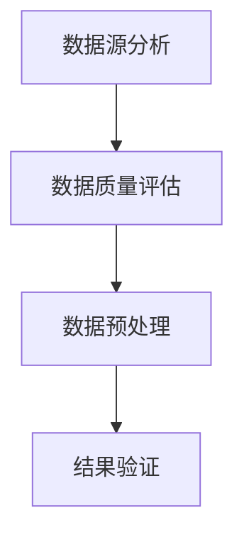

                 

### 文章标题

# AI数据清洗

### 文章关键词

- 数据清洗
- AI
- 数据质量
- 数据预处理
- 数据质量管理

### 文章摘要

本文将深入探讨AI数据清洗的重要性、基础概念、技术和实践。通过逐步分析，我们将理解数据清洗在AI应用中的关键作用，并详细讲解数据处理、算法原理、数学模型及其在真实项目中的应用，为读者提供全面的AI数据清洗指南。

---

### 第一部分：AI数据清洗的基础

#### 1.1 AI数据清洗的重要性

##### 1.1.1 数据质量对AI模型的影响

在人工智能领域，数据质量是决定模型性能的关键因素。数据中的噪声、错误和不一致性会导致模型训练效率低下，甚至影响预测准确性。高质量的数据能够提升模型的学习能力，使其在复杂任务中表现更加稳定和可靠。

##### 1.1.2 数据清洗的基本概念

数据清洗是指通过一系列操作去除或修正数据中的错误、异常和不一致，以提高数据质量的过程。数据清洗不仅涉及数据的预处理，还包括数据清洗算法、数据质量评估等步骤。

##### 1.1.3 数据清洗的流程

数据清洗的基本流程通常包括数据源分析、数据质量评估、数据预处理和结果验证等步骤。每个步骤都有其特定的目标和任务。

- **数据源分析**：识别数据源的类型和特点，分析数据结构。
- **数据质量评估**：度量数据质量，识别数据中的问题。
- **数据预处理**：去除噪声、填补缺失值、统一数据格式等。
- **结果验证**：验证数据清洗的效果，确保数据质量满足要求。

##### Mermaid流程图



#### 1.2 数据源分析

##### 1.2.1 数据源的类型

数据源可以分为结构化数据、半结构化数据和非结构化数据。结构化数据通常以表格形式存储，如关系数据库中的数据；半结构化数据具有部分结构，如XML和JSON数据；非结构化数据则没有明确的结构，如文本、图像和音频。

##### 1.2.2 数据源的特点

不同类型的数据源有其独特的特点和挑战。例如，结构化数据容易处理，但可能存在大量冗余；非结构化数据丰富，但处理难度大，需要复杂的算法。

##### 1.2.3 数据源的分析方法

分析数据源的方法包括数据探索性分析（EDA）、统计分析、机器学习特征工程等。这些方法可以帮助我们理解数据，发现潜在的问题和特征。

#### 1.3 数据质量评估

##### 1.3.1 数据质量的度量

数据质量可以从完整性、准确性、一致性和唯一性等多个维度进行度量。常用的度量方法包括缺失值率、错误率、重复率等。

##### 1.3.2 数据质量评估的工具

数据质量评估可以使用各种工具，如Pandas、Excel、SQL等。这些工具提供了丰富的函数和接口，方便我们进行数据分析和质量评估。

##### 1.3.3 数据质量评估的方法

数据质量评估的方法包括手动评估和自动化评估。手动评估通常用于小规模数据的初步检查；自动化评估则适用于大规模数据的全面评估。

#### 1.4 数据清洗技术

##### 1.4.1 数据清洗的基本方法

数据清洗的基本方法包括去除重复值、填补缺失值、统一数据格式、处理噪声等。

##### 1.4.2 数据清洗的高级技术

高级数据清洗技术包括机器学习数据清洗、图像处理数据清洗、文本处理数据清洗等。这些技术可以处理复杂的数据结构和噪声。

##### 1.4.3 数据清洗的实际应用

数据清洗技术在各种应用领域都有广泛的应用，如金融、医疗、电商等。通过数据清洗，可以提高数据分析的准确性和效率。

### 第二部分：AI数据清洗实践

#### 2.1 数据预处理

##### 2.1.1 数据清洗的预处理步骤

数据清洗的预处理步骤包括数据清洗、数据转换、数据归一化等。

##### 2.1.2 数据清洗的预处理工具

常用的数据清洗预处理工具包括Pandas、NumPy、Scikit-learn等。这些工具提供了丰富的函数和接口，方便我们进行数据预处理。

##### 2.1.3 数据清洗的预处理案例

以下是一个数据清洗的预处理案例：

```python
import pandas as pd

# 读取数据
data = pd.read_csv('user_data.csv')

# 去除重复值
data = data.drop_duplicates()

# 填补缺失值
data = data.fillna(method='mean')

# 数据转换
data['age'] = data['age'].astype(int)
data['income'] = data['income'].astype(float)

# 数据归一化
from sklearn.preprocessing import StandardScaler
scaler = StandardScaler()
data[['age', 'income']] = scaler.fit_transform(data[['age', 'income']])
```

#### 2.2 数据清洗算法

##### 2.2.1 数据清洗算法的分类

数据清洗算法可以分为基于规则的清洗算法和基于统计的清洗算法。

##### 2.2.2 数据清洗算法的实现

以下是一个基于规则的清洗算法的实现：

```python
def remove_outliers(data, feature):
    mean_value = data[feature].mean()
    std_value = data[feature].std()
    lower_bound = mean_value - 3 * std_value
    upper_bound = mean_value + 3 * std_value
    return data[(data[feature] >= lower_bound) & (data[feature] <= upper_bound)]
```

##### 2.2.3 数据清洗算法的评估

数据清洗算法的评估可以通过评估清洗前后数据的质量指标来衡量。常用的评估指标包括缺失值率、错误率、重复率等。

#### 2.3 数据清洗工具

##### 2.3.1 数据清洗工具的分类

数据清洗工具可以分为开源工具和商业工具。开源工具包括Pandas、NumPy、Scikit-learn等；商业工具包括Trifacta、Informatica等。

##### 2.3.2 数据清洗工具的功能

数据清洗工具通常提供以下功能：

- 数据导入和导出
- 数据清洗和转换
- 数据质量评估
- 数据集成和数据治理

##### 2.3.3 数据清洗工具的使用

以下是一个使用Pandas进行数据清洗的例子：

```python
import pandas as pd

# 读取数据
data = pd.read_csv('user_data.csv')

# 去除重复值
data = data.drop_duplicates()

# 填补缺失值
data = data.fillna(method='mean')

# 数据质量评估
print("Missing value rate:", data.isnull().sum().sum() / data.shape[0])
```

#### 2.4 数据清洗案例

##### 2.4.1 数据清洗案例一：电商用户数据清洗

电商用户数据清洗的目标是去除重复用户、填补缺失值、处理异常值等。以下是一个简单的数据清洗流程：

1. **去除重复用户**：通过用户ID或邮箱去除重复记录。
2. **填补缺失值**：对于年龄、收入等字段，使用均值或中值填补缺失值。
3. **处理异常值**：通过统计学方法识别和处理异常值，如年龄小于0或收入超过合理范围的值。

##### 2.4.2 数据清洗案例二：社交媒体数据清洗

社交媒体数据清洗的目标是去除噪声、统一数据格式、提取有效信息等。以下是一个简单的数据清洗流程：

1. **去除噪声**：去除重复的推文、删除包含特殊字符的推文等。
2. **统一数据格式**：将日期、时间等字段统一格式，如将日期从字符串转换为日期类型。
3. **提取有效信息**：提取推文中的关键词、用户标签等，用于后续分析。

##### 2.4.3 数据清洗案例三：金融数据清洗

金融数据清洗的目标是确保数据一致性、准确性和完整性。以下是一个简单的数据清洗流程：

1. **确保数据一致性**：检查不同数据源之间的数据是否一致，如账户余额、交易记录等。
2. **检查数据准确性**：通过交叉验证、对比历史数据等方式检查数据准确性。
3. **处理缺失值**：对于缺失值，根据业务规则进行填补或删除。

### 第三部分：AI数据清洗的挑战与未来

#### 3.1 数据隐私与安全性

##### 3.1.1 数据隐私保护的重要性

随着数据规模的扩大，数据隐私保护变得至关重要。未经授权的数据访问和滥用可能导致严重后果，如个人隐私泄露、商业机密泄露等。

##### 3.1.2 数据隐私保护的方法

数据隐私保护的方法包括数据加密、匿名化、访问控制等。这些方法可以确保数据在传输和存储过程中不被未授权访问。

##### 3.1.3 数据隐私保护的法律规范

各国和地区都有关于数据隐私保护的法律规范。例如，欧盟的《通用数据保护条例》（GDPR）对数据隐私保护提出了严格的要求。

#### 3.2 数据质量监控

##### 3.2.1 数据质量监控的意义

数据质量监控是确保数据在生命周期中保持高质量的关键步骤。通过监控，可以及时发现数据质量问题，并进行修复。

##### 3.2.2 数据质量监控的方法

数据质量监控的方法包括自动化监控、人工审核等。自动化监控可以通过编写脚本或使用监控工具实现；人工审核则通过人工检查数据质量和异常。

##### 3.2.3 数据质量监控的工具

常用的数据质量监控工具有Pandas、SQL、商业数据质量管理工具等。这些工具提供了丰富的功能，方便我们进行数据质量监控。

#### 3.3 数据清洗的未来发展趋势

##### 3.3.1 数据清洗技术的发展趋势

随着人工智能和大数据技术的发展，数据清洗技术也在不断演进。未来的数据清洗技术将更加智能化、自动化，能够处理更复杂的数据结构和噪声。

##### 3.3.2 数据清洗的未来应用场景

数据清洗技术将在更多领域得到应用，如自动驾驶、智能家居、金融科技等。通过数据清洗，可以提高这些领域的应用效果和用户体验。

##### 3.3.3 数据清洗的技术挑战与解决方案

数据清洗面临的挑战包括大规模数据处理、实时数据清洗、数据隐私保护等。未来的解决方案将涉及分布式计算、实时处理、数据加密等技术的融合。

### 作者

**作者：AI天才研究院/AI Genius Institute & 禅与计算机程序设计艺术 /Zen And The Art of Computer Programming** 

---

以上就是《AI数据清洗》的详细内容。数据清洗是AI应用中不可或缺的一环，通过本文的逐步分析，我们了解了数据清洗的重要性、基础概念、技术和实践。未来，随着技术的不断发展，数据清洗将变得更加智能化和自动化，为AI应用提供更高质量的数据支持。希望本文对您有所帮助！

