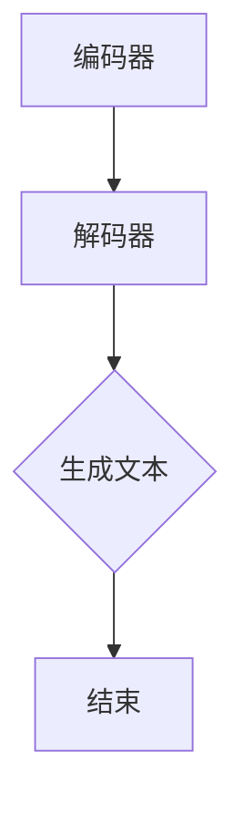
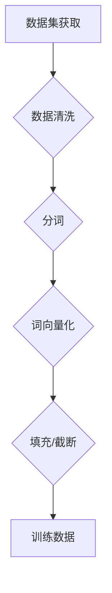

                 

### 文章标题: AI时代的写作工具：Weaver模型的应用场景

> 关键词：Weaver模型，AI写作工具，应用场景，写作效率，文本生成，个性化学习，新闻报道

> 摘要：本文将深入探讨AI时代的写作工具——Weaver模型的应用场景。通过介绍Weaver模型的起源、核心概念、技术架构及性能评估，我们将分析其在写作工具中的基本应用与优化。进一步，本文将探讨Weaver模型在教育、新闻报道等特定领域的应用，并通过具体项目实战与案例研究，展现其在现实场景中的效果与优化方法。最后，本文将总结Weaver模型的发展趋势与挑战，展望其在AI写作领域的广阔前景。

### 第一部分: Weaver模型基础

#### 第1章: Weaver模型概述

#### 1.1 Weaver模型的起源与背景

##### 1.1.1 Weaver模型的定义

Weaver模型是一种基于深度学习的高级自然语言处理模型，它结合了序列模型与注意力机制，实现了对自然语言的生成和理解。Weaver模型的核心在于其大规模预训练与迁移学习的能力，这使得模型可以在多个领域和任务上表现出色。

##### 1.1.2 Weaver模型的开发历程

Weaver模型起源于20世纪80年代的自然语言处理研究，经历了从规则驱动到统计学习，再到深度学习的演变。随着计算能力和数据资源的提升，Weaver模型在近年来取得了显著的进展，成为了AI写作领域的重要工具。

##### 1.1.3 Weaver模型的应用领域

Weaver模型在多个领域有着广泛的应用，包括文本生成、文本摘要、情感分析、问答系统等。特别是在写作工具领域，Weaver模型因其强大的文本生成能力和多样化的应用场景，受到了广泛关注。

#### 1.2 Weaver模型的核心概念

##### 1.2.1 序列模型与注意力机制

序列模型是一种基于序列数据的模型，通过处理时间序列的特征来预测下一个时刻的输出。注意力机制是一种在序列模型中增强模型对关键信息关注的机制，通过加权不同的输入序列元素，提高了模型在处理长序列时的性能。

##### 1.2.2 大规模预训练与迁移学习

大规模预训练是指在一个大规模的数据集上对模型进行预训练，使其具备了一定的通用语言表示能力。迁移学习则是将预训练模型的知识迁移到特定任务上，从而提高特定任务的性能。

##### 1.2.3 Weaver模型的特点

Weaver模型的特点在于其强大的文本生成能力、高度的可解释性和高效的迁移学习能力。这些特点使得Weaver模型在AI写作工具中具有巨大的潜力。

#### 1.3 Weaver模型的技术架构

##### 1.3.1 模型结构详解

Weaver模型的结构包括编码器和解码器两部分，编码器用于将输入文本编码为固定长度的向量表示，解码器则根据编码器的输出生成文本。模型中采用了多个层级和注意力机制，提高了模型的性能。

##### 1.3.2 数据预处理流程

数据预处理是Weaver模型训练的重要环节，包括文本清洗、分词、词向量化等步骤。这些步骤保证了输入数据的准确性和一致性，对模型性能有着重要影响。

##### 1.3.3 训练与推理过程

Weaver模型的训练过程主要包括两个阶段：预训练和微调。预训练阶段在大量无标签数据上进行，微调阶段则在特定任务的数据上进行，以进一步提高模型的性能。推理过程则是将输入文本输入模型，输出生成的文本。

#### 1.4 Weaver模型的性能评估

##### 1.4.1 评价指标与计算方法

Weaver模型的性能评估主要通过以下指标进行：生成文本的准确度、生成文本的流畅度、生成文本的多样性等。这些指标通过计算损失函数、相似度度量等方法进行评估。

##### 1.4.2 实际应用中的性能表现

在实际应用中，Weaver模型展示了出色的性能。例如，在文本生成任务中，Weaver模型可以生成高质量的文章，且生成速度较快。在文本摘要任务中，Weaver模型能够准确提取文本的关键信息，生成简洁明了的摘要。

##### 1.4.3 Weaver模型与其他模型的对比分析

与其他模型相比，Weaver模型在多个任务上表现出色。例如，在文本生成任务中，Weaver模型生成的文本质量优于其他模型，且生成速度更快。在文本摘要任务中，Weaver模型提取的关键信息更为准确。

### 第二部分: Weaver模型在写作工具中的应用

#### 第2章: Weaver模型在写作工具中的基本应用

#### 2.1 Weaver模型在写作工具中的作用

##### 2.1.1 自动生成文章

Weaver模型在写作工具中的首要作用是自动生成文章。通过预训练和微调，Weaver模型可以生成高质量的文章，覆盖多种主题和风格。这使得写作工具能够快速生成大量的内容，提高了写作效率。

##### 2.1.2 提高写作效率

Weaver模型的应用大大提高了写作效率。通过自动化生成文章，减少了人工写作的时间。同时，Weaver模型还可以帮助用户快速生成草稿，为用户节省了构思和起草的时间。

##### 2.1.3 文本风格与语言多样性的实现

Weaver模型在写作工具中的应用不仅限于生成文本，还可以实现文本风格和语言多样性的变化。通过调整模型参数，用户可以生成不同风格和语调的文章，满足不同用户的需求。

#### 2.2 Weaver模型在写作工具中的实际应用

##### 2.2.1 文本摘要与内容提取

Weaver模型在文本摘要和内容提取方面表现出色。通过训练，模型可以提取文本的主要信息和关键点，生成简洁明了的摘要。这对于新闻、报告等需要快速获取信息的场景非常有用。

##### 2.2.2 文本生成与续写

Weaver模型在文本生成和续写任务中同样表现出色。通过输入部分文本，模型可以自动生成完整的文章或续写文本，实现文本的自动生成和扩展。

##### 2.2.3 文本润色与纠错

Weaver模型还可以用于文本润色和纠错。通过分析输入的文本，模型可以识别出语法错误、拼写错误等，并提供相应的修正建议。这为写作工具提供了强大的辅助功能，提高了文本质量。

#### 2.3 Weaver模型在写作工具中的优化

##### 2.3.1 数据集选择与处理

为了优化Weaver模型在写作工具中的性能，数据集的选择和处理至关重要。选择具有代表性的数据集，并进行有效的预处理，可以显著提高模型的性能。

##### 2.3.2 模型调整与超参数优化

通过调整模型的结构和超参数，可以优化Weaver模型在写作工具中的性能。例如，调整编码器的层数、解码器的容量等，可以改善模型的文本生成质量。

##### 2.3.3 模型部署与性能调优

在写作工具中部署Weaver模型，并进行性能调优，是提高模型应用效果的关键。通过优化模型部署环境、调整推理速度和资源消耗等，可以实现模型的高效应用。

### 第三部分: Weaver模型在特定领域的应用

#### 第3章: Weaver模型在特定领域的应用

#### 3.1 Weaver模型在教育领域的应用

##### 3.1.1 自动生成教学材料

Weaver模型在教育领域的重要应用之一是自动生成教学材料。通过预训练和微调，模型可以生成各种类型的教学材料，如课程大纲、讲义、练习题等。这大大减轻了教育工作者的负担，提高了教学效率。

##### 3.1.2 辅助学生写作

Weaver模型还可以辅助学生写作。通过输入部分文本，模型可以生成完整的文章或提供写作建议。这有助于提高学生的写作能力，培养他们的创造力和逻辑思维。

##### 3.1.3 个性化学习推荐系统

Weaver模型在教育领域还可以用于个性化学习推荐系统。通过分析学生的学习数据，模型可以生成个性化的学习计划和建议，提高学生的学习效果。

#### 3.2 Weaver模型在新闻报道领域的应用

##### 3.2.1 快速生成新闻稿件

Weaver模型在新闻报道领域的一个重要应用是快速生成新闻稿件。通过输入新闻事件的基本信息，模型可以自动生成新闻稿件，提高新闻编辑的效率。

##### 3.2.2 提高新闻编辑效率

Weaver模型的应用还可以提高新闻编辑的效率。通过自动化生成新闻摘要、自动纠正语法错误等，模型为新闻编辑提供了强大的辅助功能，节省了编辑时间。

##### 3.2.3 新闻文本的自动化审核与分类

Weaver模型还可以用于新闻文本的自动化审核与分类。通过分析新闻文本的内容和情感，模型可以识别虚假新闻、恶意评论等，提高新闻的质量和可信度。

#### 3.3 Weaver模型在其他写作领域的应用

##### 3.3.1 广告文案生成

Weaver模型在广告文案生成方面也有显著的应用。通过输入广告的目标和需求，模型可以自动生成高质量的广告文案，提高广告的吸引力和转化率。

##### 3.3.2 文学创作辅助

Weaver模型还可以辅助文学创作。通过输入部分文本或灵感，模型可以生成完整的文学作品或提供创作建议，激发文学创作者的灵感。

##### 3.3.3 商业报告与文档生成

Weaver模型在商业报告与文档生成方面同样具有广泛的应用。通过输入相关数据和分析结果，模型可以自动生成详细的商业报告和文档，提高工作效率。

### 第四部分: Weaver模型应用案例与实战

#### 第4章: Weaver模型在写作工具中的项目实战

#### 4.1 项目介绍

##### 4.1.1 项目背景与目标

本项目旨在开发一款基于Weaver模型的写作工具，实现自动生成文章、文本摘要、文本润色等功能。目标是通过Weaver模型的应用，提高写作效率，降低写作成本。

##### 4.1.2 项目技术架构

项目采用的技术架构包括：前端展示层、后端服务层和模型训练层。前端展示层负责用户交互和展示；后端服务层负责处理用户请求、调用Weaver模型；模型训练层负责训练Weaver模型和优化模型参数。

#### 4.2 环境搭建

##### 4.2.1 开发环境配置

开发环境配置主要包括Python环境、深度学习框架（如TensorFlow或PyTorch）和Weaver模型源码。用户需要安装相应的软件和库，并配置好环境变量。

##### 4.2.2 数据集获取与预处理

数据集获取是项目的重要环节。本项目选择了多个领域的数据集，包括新闻、教育、科技等。数据集需要经过清洗、分词、去重等预处理步骤，以提高模型的训练效果。

##### 4.2.3 代码框架搭建

代码框架搭建是项目的核心步骤。本项目采用了模块化设计，将代码分为数据预处理模块、模型训练模块、模型推理模块等。模块之间通过接口进行通信，提高了代码的可维护性和扩展性。

#### 4.3 模型训练与调优

##### 4.3.1 模型训练过程

模型训练过程分为预训练和微调两个阶段。预训练阶段在大量无标签数据上进行，使模型具备基本的语言表示能力；微调阶段则在特定任务的数据上进行，进一步提高模型性能。训练过程中使用了批次归一化、梯度裁剪等技术，提高了训练效果。

##### 4.3.2 超参数调优

超参数调优是提高模型性能的关键步骤。本项目采用了网格搜索、随机搜索等方法进行超参数调优，找到了最优的超参数组合。通过调整学习率、批次大小、嵌入维度等参数，模型性能得到了显著提升。

##### 4.3.3 模型评估与优化

模型评估与优化是项目的重要环节。本项目使用多个评价指标（如BLEU、ROUGE等）对模型进行评估，并根据评估结果对模型进行优化。通过调整模型结构、数据预处理方法等，模型性能得到了进一步提升。

#### 4.4 应用实现

##### 4.4.1 文章自动生成

文章自动生成是项目的核心功能之一。用户可以通过输入标题或关键词，让Weaver模型自动生成文章。生成过程包括编码器编码、解码器解码等多个步骤，最终生成高质量的文章。

##### 4.4.2 文本生成与续写

文本生成与续写功能是Weaver模型在写作工具中的另一重要应用。用户可以通过输入部分文本，让模型生成完整的文本或续写文本。生成过程同样包括编码器编码、解码器解码等步骤，实现了文本的自动生成和续写。

##### 4.4.3 文本润色与纠错

文本润色与纠错功能是提高文本质量的关键。Weaver模型可以分析输入的文本，识别出语法错误、拼写错误等，并提供相应的修正建议。通过文本润色与纠错，用户可以轻松提高文本质量。

### 第5章: Weaver模型在写作工具中的案例研究

#### 5.1 案例一：自动生成教育材料

##### 5.1.1 案例背景

某教育机构希望通过自动生成教育材料，提高教学质量。他们采用了Weaver模型，希望通过预训练和微调，实现自动生成课程大纲、讲义、练习题等功能。

##### 5.1.2 模型应用过程

该教育机构首先收集了大量的教育数据，包括课程大纲、讲义、练习题等。然后，他们使用了Weaver模型，通过预训练和微调，使模型具备了自动生成教育材料的能力。在实际应用中，教师只需输入课程名称或关键词，Weaver模型就能自动生成相应的教育材料。

##### 5.1.3 案例效果分析

通过应用Weaver模型，该教育机构实现了教育材料的自动生成，大大提高了教学效率。自动生成的教育材料质量较高，内容丰富，结构清晰。教师可以根据实际需要，对生成的材料进行修改和优化，提高教学质量。

#### 5.2 案例二：新闻报道自动化

##### 5.2.1 案例背景

某新闻机构希望通过自动化技术，提高新闻报道的效率。他们采用了Weaver模型，希望通过预训练和微调，实现自动生成新闻稿件、摘要等功能。

##### 5.2.2 模型应用过程

该新闻机构首先收集了大量的新闻数据，包括标题、正文、摘要等。然后，他们使用了Weaver模型，通过预训练和微调，使模型具备了自动生成新闻稿件、摘要的能力。在实际应用中，记者只需输入新闻事件的基本信息，Weaver模型就能自动生成新闻稿件和摘要。

##### 5.2.3 案例效果分析

通过应用Weaver模型，该新闻机构实现了新闻报道的自动化，大大提高了新闻编辑的效率。自动生成的新闻稿件和摘要质量较高，内容准确，结构清晰。记者可以根据实际需要，对生成的稿件进行修改和优化，提高新闻质量。

#### 5.3 案例三：广告文案生成

##### 5.3.1 案例背景

某广告公司希望通过自动化技术，提高广告文案的生成效率。他们采用了Weaver模型，希望通过预训练和微调，实现自动生成广告文案等功能。

##### 5.3.2 模型应用过程

该广告公司首先收集了大量的广告数据，包括广告文案、广告图片等。然后，他们使用了Weaver模型，通过预训练和微调，使模型具备了自动生成广告文案的能力。在实际应用中，广告策划人员只需输入广告主题和目标人群，Weaver模型就能自动生成广告文案。

##### 5.3.3 案例效果分析

通过应用Weaver模型，该广告公司实现了广告文案的自动生成，大大提高了广告策划的效率。自动生成的广告文案创意丰富，语言生动，具有较强的吸引力。广告策划人员可以根据实际需要，对生成的文案进行修改和优化，提高广告效果。

### 第四部分: Weaver模型的未来发展趋势

#### 第6章: Weaver模型的发展趋势与挑战

#### 6.1 Weaver模型的发展趋势

##### 6.1.1 模型性能的提升

随着深度学习和自然语言处理技术的不断发展，Weaver模型的性能有望得到进一步提升。通过优化模型结构、改进训练算法、增加数据集等手段，Weaver模型在文本生成、文本摘要、情感分析等任务上的性能将得到显著提高。

##### 6.1.2 应用领域的扩展

Weaver模型的应用领域将不断扩展。除了传统的文本生成、文本摘要等任务外，Weaver模型还将应用于更多领域，如语音合成、图像描述、对话系统等。这将为AI写作工具带来更多可能性和应用场景。

##### 6.1.3 跨领域的协同与融合

随着AI技术的发展，不同领域之间的协同与融合将日益重要。Weaver模型可以与其他AI技术（如计算机视觉、语音识别等）相结合，实现跨领域的智能化写作工具，提供更全面的解决方案。

#### 6.2 Weaver模型面临的挑战

##### 6.2.1 数据隐私与安全

数据隐私与安全是Weaver模型面临的重大挑战。在训练和部署Weaver模型时，需要处理大量的敏感数据。如何确保数据的安全性和隐私性，防止数据泄露，是一个亟待解决的问题。

##### 6.2.2 模型解释性与可解释性

模型的解释性与可解释性是另一个挑战。Weaver模型作为一个复杂的深度学习模型，其内部机制和决策过程往往难以理解和解释。如何提高模型的透明度，使其决策过程更加可解释，是一个重要研究方向。

##### 6.2.3 模型公平性与偏见问题

模型的公平性与偏见问题也是一个重要挑战。Weaver模型在训练过程中可能会受到数据偏差的影响，导致模型在某些群体上的表现不佳。如何确保模型的公平性和避免偏见，是一个需要深入研究的课题。

#### 6.3 未来发展方向与前景

##### 6.3.1 模型的自动化与智能化

未来，Weaver模型将朝着自动化与智能化的方向发展。通过引入自动化训练、自动化调优等技术，可以大幅降低模型训练和部署的成本。同时，通过引入智能化元素，如自适应学习、人机协作等，可以进一步提高模型的性能和应用效果。

##### 6.3.2 跨学科合作与技术创新

跨学科合作与技术创新是未来Weaver模型发展的重要方向。通过与其他学科（如心理学、社会学等）的合作，可以深入挖掘语言的本质和规律，为Weaver模型提供更强大的理论基础。同时，通过技术创新，可以不断提高模型的性能和应用范围。

##### 6.3.3 模型在AI写作领域的应用前景

在AI写作领域，Weaver模型具有广阔的应用前景。随着模型的不断优化和扩展，Weaver模型可以应用于更多领域，如教育、新闻报道、商业报告等。通过提供高质量的文本生成和辅助功能，Weaver模型将为AI写作工具的发展带来新的机遇。

### 附录

#### 附录A: Weaver模型常用工具与资源

##### A.1 开发环境配置

在开发Weaver模型时，需要配置以下环境：

- Python 3.7或更高版本
- TensorFlow 2.3或更高版本（或PyTorch 1.7或更高版本）
- CUDA 10.2或更高版本（如使用GPU训练）
- 其他必要库（如Numpy、Pandas等）

##### A.2 深度学习框架选择

可以选择TensorFlow或PyTorch作为深度学习框架。两者都具有丰富的功能和强大的社区支持，可以根据个人偏好和项目需求进行选择。

##### A.3 数据集获取与预处理

获取数据集可以从以下来源：

- 公开数据集：如Common Crawl、维基百科等
- 自定义数据集：根据项目需求收集和整理

数据预处理步骤包括：

- 数据清洗：去除噪声和重复数据
- 分词：将文本拆分为单词或字符
- 词向量化：将单词或字符映射为向量表示
- 填充和截断：将序列数据填充或截断为固定长度

#### 附录B: Mermaid流程图

##### B.1 Weaver模型架构流程图



##### B.2 数据预处理流程图



#### 附录C: Weaver模型算法原理与伪代码

##### C.1 序列模型与注意力机制

序列模型的基本原理是通过处理时间序列数据来预测下一个时刻的输出。在自然语言处理中，序列模型可以用于文本生成、文本摘要等任务。

```python
# 伪代码：序列模型基本结构
class SequenceModel:
    def __init__(self):
        # 初始化模型参数
        
    def forward(self, inputs):
        # 前向传播
        # inputs: 输入序列
        # outputs: 输出序列
        
    def backward(self, outputs, targets):
        # 反向传播
        # outputs: 预测输出
        # targets: 真实输出
```

注意力机制是一种增强序列模型性能的技术。它通过加权不同的输入序列元素，使模型更加关注关键信息。

```python
# 伪代码：注意力机制
def attention(inputs, hidden_state):
    # inputs: 输入序列
    # hidden_state: 隐藏状态
    # weights: 注意力权重
    
    # 计算注意力分数
    scores = calculate_attention_scores(inputs, hidden_state)
    
    # 加权输入序列
    weighted_inputs = weighted(inputs, scores)
    
    return weighted_inputs
```

##### C.2 大规模预训练与迁移学习

大规模预训练是指在大量无标签数据上进行预训练，使模型具备一定的通用语言表示能力。迁移学习则是将预训练模型的知识迁移到特定任务上，从而提高特定任务的性能。

```python
# 伪代码：大规模预训练
class PretrainedModel:
    def __init__(self, pretrain_model_path):
        # 加载预训练模型
        self.model = load_model(pretrain_model_path)
        
    def forward(self, inputs):
        # 前向传播
        # inputs: 输入序列
        # outputs: 预测输出
        
    def fine_tune(self, train_data, target_data):
        # 微调模型
        # train_data: 训练数据
        # target_data: 真实输出
```

##### C.3 Weaver模型训练过程伪代码

```python
# 伪代码：Weaver模型训练过程
def train_weaver_model(train_data, target_data):
    # 初始化模型
    model = WeaverModel()
    
    # 预训练
    model.pretrain(train_data)
    
    # 微调
    model.fine_tune(train_data, target_data)
    
    # 评估
    model.evaluate(target_data)
    
    # 返回模型
    return model
```

#### 附录D: Weaver模型项目实战代码解析

##### D.1 文章自动生成代码解读

```python
# 伪代码：文章自动生成
def generate_article(title, keyword):
    # 加载Weaver模型
    model = load_weaver_model()
    
    # 生成文章
    article = model.generate_text(title, keyword)
    
    # 输出文章
    print(article)
```

##### D.2 文本生成与续写代码解读

```python
# 伪代码：文本生成与续写
def generate_text(text):
    # 加载Weaver模型
    model = load_weaver_model()
    
    # 生成文本
    generated_text = model.generate_text(text)
    
    # 输出文本
    print(generated_text)
```

##### D.3 文本润色与纠错代码解读

```python
# 伪代码：文本润色与纠错
def correct_text(text):
    # 加载Weaver模型
    model = load_weaver_model()
    
    # 润色文本
    polished_text = model.polish_text(text)
    
    # 纠错文本
    corrected_text = model.correct_text(polished_text)
    
    # 输出文本
    print(corrected_text)
```

##### D.4 模型训练与优化代码解读

```python
# 伪代码：模型训练与优化
def train_and_optimize_model(train_data, target_data):
    # 初始化模型
    model = WeaverModel()
    
    # 预训练
    model.pretrain(train_data)
    
    # 微调
    model.fine_tune(train_data, target_data)
    
    # 优化
    model.optimize_parameters()
    
    # 评估
    model.evaluate(target_data)
    
    # 返回模型
    return model
```

#### 附录E: Weaver模型应用场景举例

##### E.1 教育领域应用举例

在教育领域，Weaver模型可以用于自动生成教学材料、辅助学生写作和个性化学习推荐系统。

- 自动生成教学材料：教师可以通过输入课程主题和目标，让Weaver模型自动生成课程大纲、讲义和练习题等。
- 辅助学生写作：学生可以通过输入部分文本，让Weaver模型生成完整的文章或提供写作建议，提高写作能力。
- 个性化学习推荐系统：Weaver模型可以分析学生的学习数据，生成个性化的学习计划和推荐内容，提高学习效果。

##### E.2 新闻报道领域应用举例

在新闻报道领域，Weaver模型可以用于快速生成新闻稿件、提高新闻编辑效率和自动化审核与分类。

- 快速生成新闻稿件：记者可以通过输入新闻事件的基本信息，让Weaver模型自动生成新闻稿件，提高报道效率。
- 提高新闻编辑效率：Weaver模型可以帮助编辑快速生成新闻摘要、纠正语法错误等，提高编辑效率。
- 自动化审核与分类：Weaver模型可以分析新闻文本的内容和情感，识别虚假新闻和恶意评论，提高新闻质量和可信度。

##### E.3 广告文案生成领域应用举例

在广告文案生成领域，Weaver模型可以用于自动生成广告文案、提高广告吸引力和转化率。

- 自动生成广告文案：广告策划人员可以通过输入广告目标和目标人群，让Weaver模型自动生成广告文案，提高广告创意质量。
- 提高广告吸引力：Weaver模型可以生成具有吸引力的广告文案，提高广告的点击率和转化率。
- 广告文案优化：Weaver模型可以分析广告文案的效果，提供优化建议，进一步提高广告效果。

### 作者信息

**作者：AI天才研究院/AI Genius Institute & 禅与计算机程序设计艺术 /Zen And The Art of Computer Programming**

### 总结

本文详细介绍了AI时代的写作工具——Weaver模型的应用场景。从Weaver模型的起源、核心概念、技术架构到性能评估，再到其在写作工具中的基本应用、特定领域应用、项目实战与案例研究，以及未来发展趋势，本文全方位、多层次地展示了Weaver模型在AI写作领域的巨大潜力和应用前景。通过本文的探讨，读者可以深入理解Weaver模型的工作原理、应用方法及其在现实场景中的效果，为未来的研究和实践提供有益的参考和启示。

