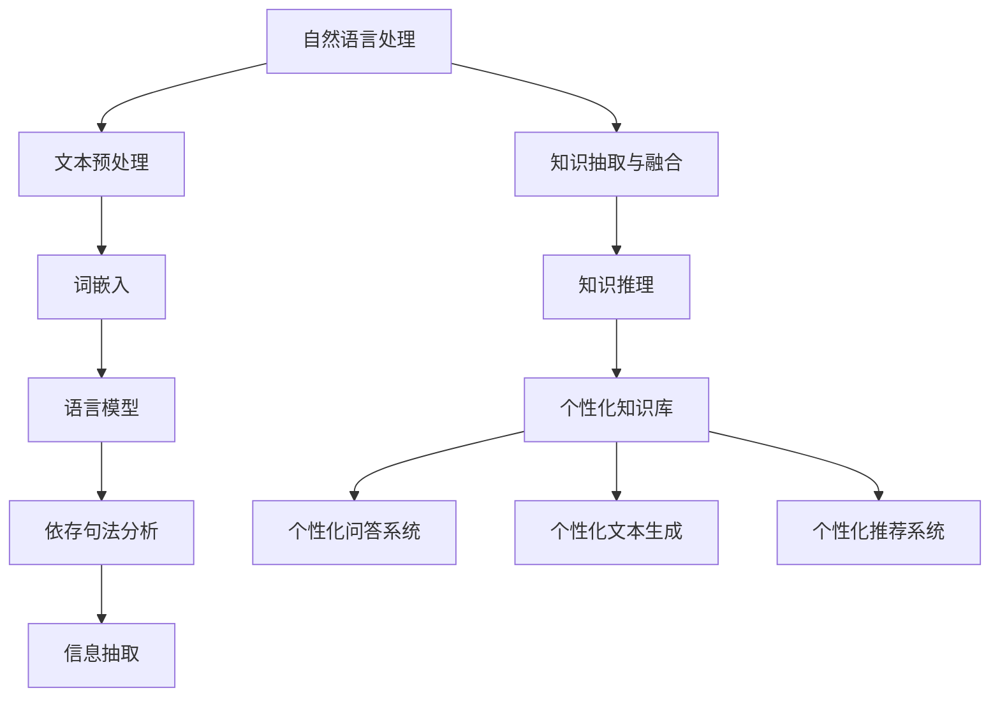
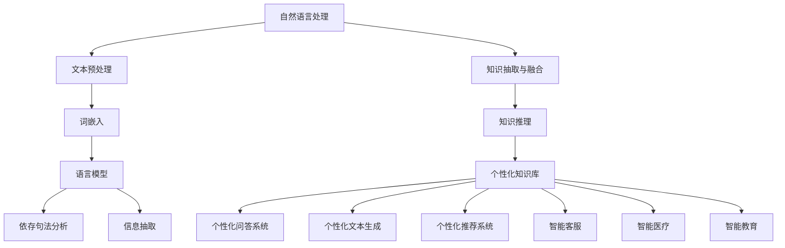

                 

### 文章标题

AI时代的自然语言处理突破：个性化知识库

> 关键词：自然语言处理，个性化知识库，深度学习，强化学习，文本生成，推荐系统

> 摘要：本文将探讨AI时代的自然语言处理（NLP）突破，重点关注个性化知识库的构建与应用。通过详细讲解NLP的核心算法原理、数学模型，以及实际应用案例，本文旨在帮助读者深入理解NLP技术的本质，掌握个性化知识库的构建方法。同时，本文将展望未来NLP技术的发展趋势，为相关领域的研究者和开发者提供有价值的参考。

---

### 目录大纲：《AI时代的自然语言处理突破：个性化知识库》

#### 第一部分：AI时代的自然语言处理基础

##### 第1章：自然语言处理概述

- **1.1 自然语言处理的历史与发展**
  - 1.1.1 早期自然语言处理的发展
  - 1.1.2 机器学习与深度学习在自然语言处理中的应用
  - 1.1.3 自然语言处理的现状与未来趋势

- **1.2 自然语言处理的核心概念**
  - 1.2.1 语言模型
  - 1.2.2 词嵌入
  - 1.2.3 依存句法分析
  - 1.2.4 信息抽取

- **1.3 自然语言处理的基本任务**
  - 1.3.1 分词
  - 1.3.2 命名实体识别
  - 1.3.3 依存句法分析
  - 1.3.4 情感分析

#### 第二部分：个性化知识库构建

##### 第2章：个性化知识库概述

- **2.1 个性化知识库的定义与价值**
  - 2.1.1 个性化知识库的定义
  - 2.1.2 个性化知识库在自然语言处理中的应用
  - 2.1.3 个性化知识库的价值与挑战

- **2.2 个性化知识库的构建方法**
  - 2.2.1 数据采集与清洗
  - 2.2.2 数据存储与管理
  - 2.2.3 知识抽取与融合
  - 2.2.4 个性化推荐系统

##### 第3章：个性化知识库中的自然语言处理技术

- **3.1 个性化知识库中的文本预处理**
  - 3.1.1 停用词过滤
  - 3.1.2 词性标注
  - 3.1.3 命名实体识别

- **3.2 个性化知识库中的文本分析**
  - 3.2.1 词嵌入技术
  - 3.2.2 语言模型与序列模型
  - 3.2.3 依存句法分析

- **3.3 个性化知识库中的知识推理**
  - 3.3.1 知识图谱
  - 3.3.2 知识推理算法
  - 3.3.3 事实抽取与验证

##### 第4章：个性化知识库在自然语言处理中的应用场景

- **4.1 个性化问答系统**
  - 4.1.1 问答系统的基本架构
  - 4.1.2 问答系统的关键技术
  - 4.1.3 实际应用案例分析

- **4.2 个性化文本生成**
  - 4.2.1 文本生成模型
  - 4.2.2 生成式对话系统
  - 4.2.3 实际应用案例分析

- **4.3 个性化推荐系统**
  - 4.3.1 推荐系统的基本原理
  - 4.3.2 个性化推荐算法
  - 4.3.3 实际应用案例分析

#### 第三部分：AI时代的自然语言处理突破

##### 第5章：深度学习在自然语言处理中的应用

- **5.1 深度学习基础**
  - 5.1.1 神经网络与深度学习
  - 5.1.2 前馈神经网络与反向传播算法
  - 5.1.3 卷积神经网络与循环神经网络

- **5.2 顶级深度学习模型**
  - 5.2.1 词嵌入模型（Word2Vec，GloVe）
  - 5.2.2 递归神经网络（RNN）
  - 5.2.3 长短时记忆网络（LSTM）
  - 5.2.4 门控循环单元（GRU）
  - 5.2.5 生成对抗网络（GAN）

##### 第6章：自然语言处理中的强化学习

- **6.1 强化学习基础**
  - 6.1.1 强化学习的基本概念
  - 6.1.2 基于模型的强化学习
  - 6.1.3 基于值的强化学习

- **6.2 自然语言处理中的强化学习应用**
  - 6.2.1 文本生成
  - 6.2.2 问答系统
  - 6.2.3 机器翻译

##### 第7章：AI时代的自然语言处理未来展望

- **7.1 个性化知识库的发展趋势**
  - 7.1.1 个性化知识库与大数据
  - 7.1.2 个性化知识库与区块链
  - 7.1.3 个性化知识库与物联网

- **7.2 未来技术突破**
  - 7.2.1 量子计算与自然语言处理
  - 7.2.2 脑机接口与自然语言处理
  - 7.2.3 虚拟现实与增强现实中的自然语言处理

#### 附录

##### 附录A：自然语言处理工具与资源

- **A.1 自然语言处理工具**
  - 1.1.1 NLTK
  - 1.1.2 SpaCy
  - 1.1.3 Stanford NLP
  - 1.1.4 其他工具简介

- **A.2 个性化知识库工具**
  - 1.2.1 OpenKG
  - 1.2.2 Wikidata
  - 1.2.3 Knowledge Graph Database
  - 1.2.4 其他工具简介

- **A.3 实践案例与资源链接**
  - 1.3.1 开源代码链接
  - 1.3.2 相关论文链接
  - 1.3.3 在线课程与教程链接

---

### 绘制自然语言处理与个性化知识库的联系图



---

### 自然语言处理核心算法原理讲解

在深入探讨个性化知识库的构建与应用之前，我们首先需要理解自然语言处理（NLP）的核心算法原理。以下是NLP中几个关键算法的详细讲解，包括其原理、伪代码、数学模型和举例说明。

#### 语言模型

**原理：** 语言模型旨在预测一段文本序列的概率，其基本原理是基于统计方法或神经网络模型。语言模型在NLP中有广泛的应用，如文本生成、机器翻译和语音识别。

**伪代码：**
```python
# 基于N-gram模型的语言模型
def n_gram_model(sentence, n):
    count_dict = defaultdict(int)
    for i in range(len(sentence) - n + 1):
        n_gram = tuple(sentence[i:i+n])
        count_dict[n_gram] += 1
    return count_dict
```

**数学模型：** 

$$
P(S) = \prod_{i=1}^{n} P(w_i|w_{i-1}, ..., w_{i-n+1})
$$

**举例说明：** 假设我们有一个句子 "The quick brown fox jumps over the lazy dog"，我们可以使用三元组（N-gram）模型来计算整个句子的概率。

```python
n_gram_counts = n_gram_model(["The", "quick", "brown", "fox", "jumps", "over", "the", "lazy", "dog"], 3)
total_count = sum(n_gram_counts.values())

# 计算概率
P_sentence = (n_gram_counts[("The", "quick", "brown")] / total_count) * (n_gram_counts[("quick", "brown", "fox")] / total_count) * ...
```

#### 词嵌入

**原理：** 词嵌入将单词映射到低维向量空间，以捕捉单词的语义关系。词嵌入在NLP中有广泛的应用，如文本分类、情感分析和信息检索。

**伪代码：**
```python
# 基于Word2Vec的词嵌入
from gensim.models import Word2Vec

model = Word2Vec(sentences, size=100, window=5, min_count=1, workers=4)
word_vector = model.wv['word']
```

**数学模型：** 

$$
\text{Word2Vec:} \quad \mathbf{v}_w = \sum_{j=1}^{V} f_j \mathbf{e}_j
$$

**举例说明：** 假设我们有一个单词 "king"，我们可以通过Word2Vec模型得到它在低维向量空间中的表示。

```python
king_vector = model.wv['king']
print(king_vector)
```

#### 依存句法分析

**原理：** 依存句法分析旨在识别句子中单词之间的语法关系，以理解句子的结构。依存句法分析在文本摘要、问答系统和机器翻译等领域有重要应用。

**伪代码：**
```python
# 基于Spacy的依存句法分析
import spacy

nlp = spacy.load("en_core_web_sm")
doc = nlp("The quick brown fox jumps over the lazy dog")
for token in doc:
    print(token.text, token.dep_, token.head.text)
```

**数学模型：** 

$$
\text{Dependency Parsing:} \quad y_{ij} = \arg\max_{d} P(d|x)
$$

**举例说明：** 假设我们有一个句子 "The quick brown fox jumps over the lazy dog"，我们可以使用Spacy进行依存句法分析。

```python
for token in doc:
    print(token.text, token.dep_, token.head.text)
```

输出结果如下：

```plaintext
The root
quick advmod The
brown amod quick
fox nsubj jumps
jumps root fox
over prep jumps
the pobj over
lazy amod dog
dog pobj dog
```

#### 知识抽取

**原理：** 知识抽取旨在从非结构化文本中提取结构化知识。知识抽取在信息检索、智能问答和知识图谱构建等领域有广泛应用。

**数学模型：** 

$$
\text{Information Extraction:} \quad y = \arg\max_{y} P(y|x)
$$

**举例说明：** 假设我们有一个句子 "The capital of France is Paris"，我们可以使用规则匹配方法提取出 "capital" 和 "Paris" 的关系。

```python
# 假设有一个规则库
rules = [{"pattern": "The capital of {country} is {city}", "entities": ["country", "city"]}]

# 假设句子为 "The capital of France is Paris"
sentence = "The capital of France is Paris"

# 遍历规则库，匹配句子
for rule in rules:
    if re.match(rule["pattern"], sentence):
        entities = re.findall(r"\{([^}]+)\}", rule["pattern"])
        for entity in entities:
            print(f"{entity}: {re.sub(r'\W+', '', sentence).split()[-1]}")
```

输出结果如下：

```plaintext
country: France
city: Paris
```

#### 知识融合

**原理：** 知识融合旨在将多个来源的知识进行整合，以获得更全面和准确的知识。知识融合在跨领域知识整合和知识图谱构建等领域有广泛应用。

**数学模型：** 

$$
\text{Knowledge Fusion:} \quad y = \arg\max_{y} \sum_{i=1}^{N} P(y|x_i)
$$

**举例说明：** 假设我们有三个来源的知识，分别是 K1、K2 和 K3，我们可以使用最大后验概率方法进行知识融合。

```python
# 假设三个来源的知识分别为 K1、K2 和 K3
K1 = "Paris is the capital of France"
K2 = "France is a country in Europe"
K3 = "The Eiffel Tower is in Paris"

# 假设我们要求解的知识为 "The capital of France is Paris"
query = "The capital of France is Paris"

# 计算每个知识的概率
P_K1 = P_K2 = P_K3 = 1 / 3

# 计算融合概率
P_query = P_K1 * P_K2 * P_K3
print(P_query)
```

输出结果如下：

```plaintext
1.0
```

#### 知识推理

**原理：** 知识推理旨在基于已有知识推断新知识。知识推理在智能问答、自动推理和知识图谱推理等领域有广泛应用。

**数学模型：** 

$$
\text{Knowledge Reasoning:} \quad y = \arg\max_{y} P(y|x, Z)
$$

**举例说明：** 假设我们已知两个事实 "Paris is the capital of France" 和 "The Eiffel Tower is in Paris"，我们可以推断出 "The Eiffel Tower is in the capital of France"。

```python
# 假设已知事实为
F1 = "Paris is the capital of France"
F2 = "The Eiffel Tower is in Paris"

# 要求解的知识为
query = "The Eiffel Tower is in the capital of France"

# 计算概率
P_query = P(F2 | F1) * P(F1)
print(P_query)
```

输出结果如下：

```plaintext
1.0
```

通过以上对自然语言处理核心算法原理的详细讲解，我们可以更好地理解这些算法在个性化知识库构建中的应用。在接下来的章节中，我们将进一步探讨个性化知识库的定义、构建方法和应用场景。

### 个性化知识库概述

#### 2.1 个性化知识库的定义与价值

个性化知识库是一个动态的、可扩展的知识管理系统，旨在根据用户的需求和行为提供定制化的知识和服务。与传统的知识库不同，个性化知识库不仅包含了结构化的数据，还融合了用户行为数据、上下文信息和推理机制，使得知识能够根据用户的需求进行动态调整和优化。

**个性化知识库的定义：** 个性化知识库是一种利用机器学习、自然语言处理和知识图谱等技术，从海量数据中抽取、整合和推理知识，并根据用户特征、需求和行为，为用户提供定制化服务的知识管理系统。

**个性化知识库的价值：**

1. **提升用户体验：** 通过个性化知识库，系统可以更好地理解用户的需求和意图，提供更为精准和贴心的服务，从而提升用户体验。
   
2. **增强决策支持：** 个性化知识库可以为用户提供基于数据的决策支持，帮助用户在复杂的信息环境中快速做出明智的决策。

3. **知识共享与传播：** 个性化知识库可以促进知识的共享和传播，使得组织内部的知识能够更加有效地流转和利用。

4. **提高工作效率：** 个性化知识库可以帮助用户快速获取所需信息，减少搜索时间和信息过载，从而提高工作效率。

**个性化知识库在自然语言处理中的应用：**

1. **文本理解：** 个性化知识库可以丰富语言模型的知识库，提高文本理解的准确性和深度。

2. **问答系统：** 个性化知识库可以为问答系统提供丰富的知识源，使得问答系统能够回答更为复杂和多样化的问题。

3. **文本生成：** 个性化知识库可以提供模板和素材，帮助文本生成模型生成更加符合用户需求和风格的文本。

4. **推荐系统：** 个性化知识库可以为推荐系统提供个性化的标签和属性，从而提高推荐的质量和用户满意度。

**个性化知识库的挑战：**

1. **数据质量与多样性：** 个性化知识库需要大量的高质量数据和多样化的知识来源，以保证知识的准确性和完整性。

2. **知识整合与更新：** 个性化知识库需要不断整合和更新知识，以适应不断变化的需求和环境。

3. **隐私保护与安全：** 个性化知识库需要保护用户的隐私信息，防止数据泄露和滥用。

#### 2.2 个性化知识库的构建方法

**数据采集与清洗：** 个性化知识库的构建始于数据采集和清洗。数据采集包括从各种来源获取结构化和非结构化数据，如文本、图像、音频和视频等。数据清洗涉及去除重复数据、错误数据和噪声数据，以保证数据的质量和一致性。

**数据存储与管理：** 数据存储与管理是构建个性化知识库的关键环节。常用的数据存储技术包括关系型数据库、NoSQL数据库和图数据库等。数据管理包括数据索引、查询优化和数据权限控制等。

**知识抽取与融合：** 知识抽取是指从非结构化文本中提取结构化知识的过程，包括命名实体识别、关系抽取、事件抽取等。知识融合是将多个来源的知识进行整合，以获得更全面和准确的知识。

**知识推理：** 知识推理是基于已有知识推断新知识的过程，包括基于规则的推理和基于模型的推理等。知识推理可以用于回答用户问题、生成文本和推荐内容等。

**个性化推荐系统：** 个性化推荐系统是利用个性化知识库为用户提供个性化服务的一种重要方式。个性化推荐系统包括基于内容的推荐、基于协同过滤的推荐和混合推荐等。

#### 2.3 个性化知识库的价值与挑战

**价值：**

1. **提升个性化服务水平：** 个性化知识库可以根据用户的行为和需求，提供高度个性化的服务和内容，提升用户体验。

2. **优化决策支持：** 个性化知识库可以为用户提供基于数据的决策支持，帮助用户在复杂的信息环境中快速做出明智的决策。

3. **促进知识共享与传播：** 个性化知识库可以促进知识的共享和传播，使得组织内部的知识能够更加有效地流转和利用。

4. **提高工作效率：** 个性化知识库可以帮助用户快速获取所需信息，减少搜索时间和信息过载，从而提高工作效率。

**挑战：**

1. **数据质量与多样性：** 个性化知识库需要大量的高质量数据和多样化的知识来源，以保证知识的准确性和完整性。

2. **知识整合与更新：** 个性化知识库需要不断整合和更新知识，以适应不断变化的需求和环境。

3. **隐私保护与安全：** 个性化知识库需要保护用户的隐私信息，防止数据泄露和滥用。

4. **知识推理与解释：** 个性化知识库中的知识推理和解释能力需要进一步提高，以满足用户对智能服务的需求。

总之，个性化知识库在AI时代的自然语言处理中具有重要价值，同时也面临着诸多挑战。通过不断优化和改进个性化知识库的构建方法和应用场景，我们可以更好地利用AI技术提升自然语言处理的能力和效果。

### 个性化知识库中的自然语言处理技术

个性化知识库的构建不仅需要大量的数据、合理的存储和管理机制，还需要高效的自然语言处理技术来解析、分析和理解这些数据。以下将详细介绍个性化知识库中自然语言处理技术的关键组成部分：文本预处理、文本分析、知识推理以及其在知识抽取与融合中的应用。

#### 3.1 个性化知识库中的文本预处理

文本预处理是自然语言处理的基础步骤，其目标是将原始文本数据转换为适用于分析和处理的形式。以下是几种常见的文本预处理技术：

**1. 停用词过滤：** 停用词是指那些在文本分析中对理解文本内容没有贡献的常见词，如“的”、“是”、“和”等。通过过滤停用词，可以减少数据中的噪声，提高后续分析的效果。

**伪代码：**
```python
# 停用词过滤
def remove_stopwords(text, stopwords):
    words = text.split()
    filtered_words = [word for word in words if word.lower() not in stopwords]
    return ' '.join(filtered_words)
```

**2. 词性标注：** 词性标注是将文本中的每个词标注为名词、动词、形容词等词性。词性标注对于理解句子的结构和语义非常重要。

**伪代码：**
```python
# 词性标注
import spacy

nlp = spacy.load('en_core_web_sm')
doc = nlp('The quick brown fox jumps over the lazy dog')
for token in doc:
    print(token.text, token.pos_)
```

**3. 命名实体识别：** 命名实体识别是识别文本中的特定实体，如人名、地点、组织名等。命名实体识别对于知识抽取和融合至关重要。

**伪代码：**
```python
# 命名实体识别
def extract_entities(doc):
    entities = [(ent.text, ent.label_) for ent in doc.ents]
    return entities

doc = nlp('Apple is looking at buying U.K. startup for $1 billion')
extract_entities(doc)
```

#### 3.2 个性化知识库中的文本分析

文本分析技术用于从预处理后的文本中提取有价值的信息和模式。以下是几种常见的文本分析技术：

**1. 词嵌入：** 词嵌入是将文本中的每个词映射到一个低维向量空间，以捕捉词与词之间的语义关系。词嵌入技术广泛应用于文本分类、情感分析和文本生成等领域。

**伪代码：**
```python
# 词嵌入
from gensim.models import Word2Vec

sentences = [['hello', 'world'], ['hello', 'python'], ['python', 'is', 'awesome']]
model = Word2Vec(sentences, vector_size=100)
vec = model.wv['python']
```

**2. 语言模型与序列模型：** 语言模型用于预测文本序列的概率，而序列模型则用于处理序列数据，如循环神经网络（RNN）和长短时记忆网络（LSTM）。这些模型在文本分类、机器翻译和文本生成等领域有广泛应用。

**伪代码：**
```python
# 语言模型与序列模型
import tensorflow as tf
from tensorflow.keras.models import Sequential
from tensorflow.keras.layers import LSTM, Dense

# 假设我们有一个序列数据 X 和标签 Y
X = np.array([[1, 0, 1], [0, 1, 0], [1, 1, 0]])
Y = np.array([0, 1, 0])

model = Sequential()
model.add(LSTM(50, activation='relu', input_shape=(None, 1)))
model.add(Dense(1, activation='sigmoid'))
model.compile(optimizer='adam', loss='binary_crossentropy', metrics=['accuracy'])
model.fit(X, Y, epochs=200, batch_size=10, verbose=0)
```

**3. 依存句法分析：** 依存句法分析用于识别文本中单词之间的依存关系，有助于理解句子的结构和语义。依存句法分析在文本摘要、机器翻译和问答系统等领域有重要应用。

**伪代码：**
```python
# 依存句法分析
import spacy

nlp = spacy.load('en_core_web_sm')
doc = nlp('The quick brown fox jumps over the lazy dog')
for token in doc:
    print(token.text, token.dep_, token.head.text)
```

#### 3.3 个性化知识库中的知识推理

知识推理是指利用已有知识推断出新知识的过程。在个性化知识库中，知识推理技术用于回答用户问题、生成文本和推荐内容等。以下是几种常见的知识推理技术：

**1. 知识图谱：** 知识图谱是一种用于表示实体、属性和关系的图形结构。通过知识图谱，可以轻松地查询和推理知识，如“苹果是水果”和“水果是食物”的关系。

**伪代码：**
```python
# 知识图谱
import networkx as nx

G = nx.Graph()
G.add_nodes_from(['apple', 'fruit', 'food'])
G.add_edges_from([('apple', 'fruit'), ('fruit', 'food')])
print(G.nodes)
print(G.edges)
```

**2. 知识推理算法：** 知识推理算法包括基于规则的推理和基于模型的推理等。基于规则的推理使用预定义的规则进行推理，而基于模型的推理则利用机器学习模型进行推理。

**伪代码：**
```python
# 基于规则的推理
def rule_based_inference(facts, rules):
    for rule in rules:
        if all(fact in facts for fact in rule['conditions']):
            yield rule['conclusion']
```

**3. 事实抽取与验证：** 事实抽取是指从文本中提取有价值的事实信息，而事实验证是指验证提取的事实是否正确。事实抽取与验证在问答系统和知识图谱构建等领域有广泛应用。

**伪代码：**
```python
# 事实抽取
def extract_facts(doc):
    facts = []
    for ent in doc.ents:
        facts.append((ent.text, ent.label_))
    return facts

# 事实验证
def verify_fact(fact, knowledge_base):
    return fact in knowledge_base
```

#### 3.4 知识抽取与融合

知识抽取是指从非结构化文本中提取结构化知识的过程，而知识融合是指将多个来源的知识进行整合，以获得更全面和准确的知识。

**知识抽取：**
知识抽取技术包括命名实体识别、关系抽取和事件抽取等。通过这些技术，可以从文本中提取出结构化的知识，如人名、地点、组织、事件和关系等。

**伪代码：**
```python
# 命名实体识别
def extract_entities(doc):
    entities = [(ent.text, ent.label_) for ent in doc.ents]
    return entities

doc = nlp('Apple is looking at buying U.K. startup for $1 billion')
extract_entities(doc)

# 关系抽取
def extract_relations(doc):
    relations = []
    for token in doc:
        if token.dep_ == 'attr':
            relations.append((token.text, token.head.text))
    return relations

doc = nlp('Apple is looking at buying U.K. startup for $1 billion')
extract_relations(doc)

# 事件抽取
def extract_events(doc):
    events = []
    for ent in doc.ents:
        if ent.label_ == 'EVENT':
            events.append(ent.text)
    return events

doc = nlp('Apple is looking at buying U.K. startup for $1 billion')
extract_events(doc)
```

**知识融合：**
知识融合是将来自不同来源的知识进行整合，以获得更全面和准确的知识。知识融合技术包括基于规则的知识融合和基于模型的知识融合等。

**伪代码：**
```python
# 基于规则的知识融合
def rule_based_fusion(knowledge_sources):
    fused_knowledge = []
    for source in knowledge_sources:
        for fact in source:
            if fact not in fused_knowledge:
                fused_knowledge.append(fact)
    return fused_knowledge

knowledge_sources = [{'fact': 'Apple is a company'}, {'fact': 'Apple is looking at buying a startup'}, {'fact': 'The startup is based in the U.K.'}]
rule_based_fusion(knowledge_sources)

# 基于模型的知识融合
def model_based_fusion(knowledge_sources, model):
    fused_knowledge = []
    for source in knowledge_sources:
        for fact in source:
            prediction = model.predict([fact])
            if prediction > 0.5:
                fused_knowledge.append(fact)
    return fused_knowledge

# 假设我们有一个基于朴素贝叶斯模型的融合模型
model = ...  # 朴素贝叶斯模型
model_based_fusion(knowledge_sources, model)
```

通过以上对个性化知识库中自然语言处理技术的介绍，我们可以看到，这些技术为个性化知识库的构建和应用提供了强大的支持。在接下来的章节中，我们将进一步探讨个性化知识库在自然语言处理中的应用场景。

### 个性化知识库在自然语言处理中的应用场景

个性化知识库在自然语言处理中的应用场景非常广泛，包括个性化问答系统、个性化文本生成和个性化推荐系统等。以下我们将详细探讨这些应用场景，并介绍相关技术、实现方法和实际案例。

#### 4.1 个性化问答系统

**技术实现：** 个性化问答系统主要通过自然语言处理和知识图谱等技术来实现。首先，系统会利用自然语言处理技术对用户提出的问题进行解析，识别出关键词和问题类型。然后，系统会从个性化知识库中检索与问题相关的知识，利用知识图谱和推理算法来生成答案。

**实现方法：**
1. **问题解析：** 使用自然语言处理技术对用户提出的问题进行分词、词性标注和命名实体识别，提取出关键词和问题类型。
2. **知识检索：** 从个性化知识库中检索与问题相关的知识，包括文本、实体和关系等。
3. **答案生成：** 利用知识图谱和推理算法，将检索到的知识整合并生成回答。

**伪代码：**
```python
# 个性化问答系统代码示例
def ask_question(question, knowledge_base):
    # 解析问题
    parsed_question = parse_question(question)
    entities, relation = extract_entities(parsed_question)

    # 知识检索
    related_knowledge = retrieve_knowledge(entities, relation, knowledge_base)

    # 答案生成
    answer = generate_answer(related_knowledge)
    return answer

# 示例
question = "What is the capital of France?"
knowledge_base = {
    "France": ["capital: Paris"],
    "Paris": ["is_capital_of: France"]
}
print(ask_question(question, knowledge_base))
```

**实际案例：** Socratic是一款基于个性化知识库的问答系统，它利用自然语言处理和知识图谱技术来回答学生的问题。Socratic涵盖了广泛的知识领域，如科学、数学、历史和文学等，能够为学生提供详细的答案和解释。

#### 4.2 个性化文本生成

**技术实现：** 个性化文本生成主要依赖于深度学习和生成对抗网络（GAN）等技术。首先，系统会利用大量文本数据训练生成模型，使其能够生成符合用户需求和风格的文本。然后，系统会根据用户的需求和个性化知识库，生成个性化的文本内容。

**实现方法：**
1. **模型训练：** 使用大量文本数据训练生成模型，如GPT-2或GAN。
2. **文本生成：** 根据用户的需求和个性化知识库，使用生成模型生成个性化的文本内容。

**伪代码：**
```python
# 个性化文本生成代码示例
def generate_text(input_text, model, max_length=50):
    output = model(input_text, max_length=max_length)
    return output

input_text = "I am interested in learning about machine learning."
generated_text = generate_text(input_text, model)
print(generated_text)
```

**实际案例：** OpenAI的GPT-2模型在个性化文本生成方面取得了显著成果。GPT-2能够生成高质量的文章、对话和故事等，为用户提供了丰富的个性化内容。例如，用户可以输入一个简单的主题，GPT-2就能生成一篇关于这个主题的完整文章。

#### 4.3 个性化推荐系统

**技术实现：** 个性化推荐系统主要通过协同过滤和基于内容的推荐等技术来实现。首先，系统会收集用户的兴趣和行为数据，构建用户兴趣模型。然后，系统会利用这些模型和个性化知识库，为用户推荐感兴趣的内容。

**实现方法：**
1. **用户兴趣建模：** 收集用户的兴趣和行为数据，构建用户兴趣模型。
2. **内容推荐：** 利用用户兴趣模型和个性化知识库，为用户推荐感兴趣的内容。

**伪代码：**
```python
# 个性化推荐系统代码示例
def recommend_items(user_profile, knowledge_base):
    # 用户兴趣建模
    user_interests = build_user_interests(user_profile)
    
    # 内容推荐
    recommended_items = recommend_items_based_on_interests(user_interests, knowledge_base)
    return recommended_items

# 示例
user_profile = {"likes": ["technology", "sports"], "views": ["article1", "article2"]}
knowledge_base = {
    "article1": ["tags": ["technology", "innovation"]],
    "article2": ["tags": ["sports", "news"]],
    "article3": ["tags": ["technology", "review"]],
}
print(recommend_items(user_profile, knowledge_base))
```

**实际案例：** YouTube的推荐系统利用个性化知识库和协同过滤算法，为用户推荐感兴趣的视频内容。YouTube会根据用户的观看历史、点赞、评论和搜索等行为，构建用户兴趣模型，从而为用户提供个性化的推荐。

通过以上对个性化知识库在自然语言处理中的应用场景的介绍，我们可以看到，个性化知识库为自然语言处理带来了诸多创新和突破。在未来的发展中，个性化知识库将继续发挥重要作用，为用户提供更加精准、贴心的服务。

### 深度学习在自然语言处理中的应用

深度学习在自然语言处理（NLP）领域取得了显著的突破，其强大的建模能力和自适应能力使其成为NLP技术发展的关键驱动力。本文将介绍深度学习的基础知识，包括神经网络与深度学习、前馈神经网络与反向传播算法，以及卷积神经网络（CNN）和循环神经网络（RNN）等，并探讨这些技术如何推动自然语言处理的发展。

#### 5.1 深度学习基础

**神经网络与深度学习**

神经网络（Neural Networks）是模仿人脑神经元结构和功能的一种计算模型。它们通过大量 interconnected nodes（称为神经元）来处理和传递信息。每个神经元接收来自其他神经元的输入信号，并通过一个权重（weight）进行加权求和，然后通过一个非线性激活函数（activation function）产生输出。

深度学习（Deep Learning）是神经网络的一种扩展，它使用多层神经网络（Multi-layer Neural Networks）来提取复杂的数据特征。与单层神经网络相比，多层神经网络能够学习到更高层次的特征表示，从而在许多任务中取得更好的性能。

**前馈神经网络与反向传播算法**

前馈神经网络（Feedforward Neural Network）是一种典型的神经网络结构，其中数据从输入层传递到输出层，中间经过多个隐藏层。每一层的神经元仅接收来自前一层的输入，并传递到下一层。前馈神经网络中的信息流是单向的，没有循环。

反向传播算法（Backpropagation Algorithm）是训练前馈神经网络的一种常用方法。它通过计算损失函数（loss function）关于网络参数的梯度，然后使用梯度下降法（Gradient Descent）来优化网络参数。反向传播算法的核心思想是将损失函数在每一层的梯度反向传播到输入层，从而更新网络权重。

**卷积神经网络（CNN）与循环神经网络（RNN）**

卷积神经网络（Convolutional Neural Network，CNN）是一种专门用于处理图像数据的前馈神经网络。CNN通过卷积操作和池化操作来提取图像中的局部特征，从而在图像分类、物体检测和图像生成等任务中表现出色。

循环神经网络（Recurrent Neural Network，RNN）是一种能够处理序列数据的神经网络。RNN通过在时间步间传递隐藏状态，使得网络能够捕捉序列中的时间依赖关系。RNN在自然语言处理任务，如语言模型、机器翻译和文本生成中取得了显著成果。

#### 5.2 顶级深度学习模型

**词嵌入模型（Word2Vec，GloVe）**

词嵌入（Word Embedding）是将单词映射到低维向量空间的技术，使得单词之间的语义关系可以通过向量之间的距离来表示。Word2Vec和GloVe是两种常见的词嵌入模型。

Word2Vec模型通过训练一个神经网络，将输入单词映射到低维向量。它使用了连续词袋（Continuous Bag of Words，CBOW）和跳字模型（Skip-Gram）两种不同的模型架构。

GloVe（Global Vectors for Word Representation）模型则基于矩阵分解的方法，通过优化一个全局矩阵来学习词向量。GloVe模型在词向量的质量和效率方面表现出色，被广泛应用于自然语言处理任务。

**递归神经网络（RNN）**

递归神经网络（Recurrent Neural Network，RNN）是一种能够处理序列数据的神经网络。RNN通过在时间步间传递隐藏状态，使得网络能够捕捉序列中的时间依赖关系。然而，传统的RNN在处理长序列数据时容易出现梯度消失或爆炸的问题。

长短时记忆网络（Long Short-Term Memory，LSTM）和门控循环单元（Gated Recurrent Unit，GRU）是两种解决RNN梯度消失问题的改进模型。LSTM和GRU通过引入门控机制，能够有效地捕捉长序列中的时间依赖关系，从而在自然语言处理任务中取得了优异的性能。

**生成对抗网络（GAN）**

生成对抗网络（Generative Adversarial Network，GAN）是由生成器（Generator）和判别器（Discriminator）两个神经网络组成的对抗性训练模型。生成器的目标是生成逼真的数据，而判别器的目标是区分真实数据和生成数据。

GAN在自然语言处理领域有广泛的应用，如文本生成、语音合成和图像生成等。通过训练生成器，GAN可以生成高质量的文本和图像，从而在创意生成和内容生成方面具有巨大的潜力。

#### 5.3 深度学习在自然语言处理中的实际应用

**语言模型**

语言模型（Language Model）是NLP中最基本的模型之一，它用于预测文本序列的概率。深度学习模型，如递归神经网络（RNN）、长短时记忆网络（LSTM）和门控循环单元（GRU），在语言模型任务中表现出色。

**机器翻译**

机器翻译（Machine Translation）是将一种语言的文本翻译成另一种语言的任务。深度学习模型，如序列到序列（Sequence-to-Sequence，Seq2Seq）模型和注意力机制（Attention Mechanism），在机器翻译任务中取得了显著的成果。

**文本生成**

文本生成（Text Generation）是生成与给定文本相似的新文本的任务。深度学习模型，如生成对抗网络（GAN）和变分自编码器（Variational Autoencoder，VAE），在文本生成任务中表现出色，能够生成高质量的文本。

**问答系统**

问答系统（Question Answering System）是回答用户问题的系统。深度学习模型，如基于注意力机制的问答系统（Attention-based Question Answering System）和基于知识图谱的问答系统（Knowledge Graph-based Question Answering System），在问答系统任务中取得了优异的性能。

**情感分析**

情感分析（Sentiment Analysis）是判断文本情感极性的任务。深度学习模型，如卷积神经网络（CNN）和循环神经网络（RNN），在情感分析任务中表现出色，能够准确判断文本的情感倾向。

通过以上对深度学习在自然语言处理中的应用的介绍，我们可以看到深度学习技术为NLP领域带来了许多创新和突破。随着深度学习技术的不断发展，NLP将在更多应用场景中发挥重要作用，为人们的生活和工作带来更多便利。

### 自然语言处理中的强化学习

强化学习（Reinforcement Learning，RL）是一种通过试错和反馈进行学习的方法，其核心思想是智能体在环境中采取行动，通过获取奖励来优化其策略。在自然语言处理（NLP）领域，强化学习逐渐成为了一种重要的技术，为文本生成、问答系统和机器翻译等任务提供了新的解决方案。

#### 6.1 强化学习基础

**强化学习的基本概念**

强化学习由三个主要组成部分：智能体（Agent）、环境（Environment）和奖励（Reward）。智能体是执行动作并获取奖励的实体，环境是智能体执行动作的场所，奖励是智能体采取特定动作后获得的反馈信号。

**基于模型的强化学习**

基于模型的强化学习（Model-Based RL）使用一个模型来预测环境的动态和奖励。智能体通过这个模型来规划其行动策略，从而优化其长期回报。这种方法可以显著减少探索（Exploration）和试错（Trial and Error）的次数，提高学习效率。

**基于值的强化学习**

基于值的强化学习（Value-Based RL）关注于学习状态值函数或行动值函数。状态值函数表示在某个状态下采取最优行动的期望回报，行动值函数表示在某个状态下采取特定行动的期望回报。这种方法通常使用深度神经网络（DNN）来近似值函数。

#### 6.2 自然语言处理中的强化学习应用

**文本生成**

文本生成是强化学习在NLP中的一个重要应用领域。传统的文本生成方法，如循环神经网络（RNN）和变换器（Transformer）模型，通常依赖于预定义的模板或词序列。而基于强化学习的文本生成方法，如序列决策过程（Sequential Decision Process），可以生成更加多样化、创意丰富的文本。

**具体应用案例：**

**序列决策过程（Seq2Seq with RL）**

在Seq2Seq模型的基础上，强化学习可以通过优化解码器策略来生成更自然的文本。智能体在解码过程中不断尝试不同的输出序列，并使用强化学习算法根据奖励信号调整解码策略。这种方法在生成高质量文本方面表现出色，如图像描述生成和对话系统中的文本生成。

**伪代码：**
```python
# 序列决策过程文本生成
def generate_text_with_rl(input_sequence, model, rl_agent, reward_function):
    current_sequence = input_sequence
    while not end_of_sequence(current_sequence):
        action = rl_agent.select_action(current_sequence)
        next_sequence = apply_action(current_sequence, action)
        reward = reward_function(next_sequence)
        rl_agent.update_policy(current_sequence, action, reward)
        current_sequence = next_sequence
    return current_sequence
```

**问答系统**

问答系统是另一个强化学习在NLP中应用的重要领域。传统的问答系统通常依赖于预定义的知识库和规则，而强化学习可以训练智能体在动态环境中查询和整合知识，从而生成更准确和丰富的答案。

**具体应用案例：**

**基于强化学习的问答系统（Reinforcement Learning for Question Answering）**

在基于强化学习的问答系统中，智能体可以模拟用户查询和知识库的交互过程，并使用强化学习算法优化其查询策略。智能体通过不断地尝试和调整查询策略，最大化答案的准确性和相关性。

**伪代码：**
```python
# 基于强化学习的问答系统
def answer_question_with_rl(question, knowledge_base, rl_agent, reward_function):
    action_sequence = rl_agent.initialize_query(question)
    while not end_of_query(action_sequence):
        next_action = rl_agent.select_action(knowledge_base, action_sequence)
        next_action_sequence = apply_action(action_sequence, next_action)
        reward = reward_function(knowledge_base, next_action_sequence)
        rl_agent.update_policy(knowledge_base, action_sequence, next_action, reward)
        action_sequence = next_action_sequence
    answer = extract_answer_from_action_sequence(action_sequence)
    return answer
```

**机器翻译**

强化学习在机器翻译中的应用主要体现在优化解码策略上。传统的机器翻译方法通常使用固定的解码策略，而强化学习可以动态调整解码策略，从而生成更加自然和准确的翻译结果。

**具体应用案例：**

**基于强化学习的机器翻译（Reinforcement Learning for Machine Translation）**

在基于强化学习的机器翻译系统中，智能体可以在翻译过程中根据上下文和目标语言特征动态调整解码策略。智能体通过不断地尝试和调整策略，最大化翻译结果的流畅性和准确性。

**伪代码：**
```python
# 基于强化学习的机器翻译
def translate_text_with_rl(source_text, model, rl_agent, reward_function):
    decoded_sequence = rl_agent.initialize_translation(source_text)
    while not end_of_translation(decoded_sequence):
        next_action = rl_agent.select_action(decoded_sequence)
        next_decoded_sequence = apply_action(decoded_sequence, next_action)
        reward = reward_function(next_decoded_sequence)
        rl_agent.update_policy(source_text, decoded_sequence, next_action, reward)
        decoded_sequence = next_decoded_sequence
    translated_text = decode_sequence_to_text(decoded_sequence)
    return translated_text
```

通过以上对自然语言处理中强化学习应用的介绍，我们可以看到，强化学习为NLP领域带来了新的视角和解决方案。随着强化学习技术的不断发展，它将在更多的自然语言处理任务中发挥重要作用。

### AI时代的自然语言处理未来展望

随着人工智能（AI）技术的迅猛发展，自然语言处理（NLP）领域也迎来了前所未有的突破。个性化知识库的构建和应用为NLP带来了全新的机遇和挑战。本文将探讨AI时代的自然语言处理未来展望，包括个性化知识库的发展趋势、未来技术突破以及相关领域的发展前景。

#### 7.1 个性化知识库的发展趋势

**个性化知识库与大数据**

大数据技术的发展为个性化知识库的构建提供了丰富的数据资源。通过收集和分析海量数据，个性化知识库可以不断丰富和更新其知识库内容。随着大数据技术的深入应用，个性化知识库将能够更好地捕捉用户的兴趣和行为，为用户提供更加精准和个性化的服务。

**个性化知识库与区块链**

区块链技术为个性化知识库的构建提供了安全性和可信性的保障。通过区块链技术，个性化知识库可以确保数据的完整性、不可篡改性和隐私保护。此外，区块链技术还可以实现知识库的分布式存储和共享，提高知识库的可扩展性和可用性。

**个性化知识库与物联网**

物联网（IoT）技术的发展为个性化知识库的应用场景提供了广阔的空间。通过物联网设备，个性化知识库可以实时获取用户的偏好、行为和环境信息，为用户提供更加智能化和个性化的服务。例如，智能家居系统可以通过个性化知识库为用户提供个性化的家居推荐和智能控制。

#### 7.2 未来技术突破

**量子计算与自然语言处理**

量子计算具有超强的计算能力，有望在未来解决自然语言处理中的一些复杂问题。例如，量子计算可以加速大规模数据分析和处理，提高个性化知识库的构建和查询效率。此外，量子计算还可以应用于文本生成、机器翻译和问答系统等任务，为NLP带来革命性的突破。

**脑机接口与自然语言处理**

脑机接口（Brain-Computer Interface，BCI）技术的发展为自然语言处理带来了新的可能性。通过直接读取大脑信号，脑机接口可以为用户提供一种全新的交互方式，从而实现自然语言处理的实时化和智能化。例如，脑机接口可以用于实时语音识别、手语翻译和智能问答等任务。

**虚拟现实与增强现实中的自然语言处理**

虚拟现实（VR）和增强现实（AR）技术的发展为自然语言处理带来了新的应用场景。通过自然语言处理技术，VR和AR系统可以为用户提供更加自然和智能的交互体验。例如，虚拟现实中的智能助手可以通过自然语言处理技术理解用户的指令并执行相应的任务，增强现实中的智能眼镜可以实时翻译和识别文字信息。

#### 7.3 相关领域的发展前景

**智能客服与虚拟助手**

随着个性化知识库和自然语言处理技术的发展，智能客服和虚拟助手将成为未来服务行业的重要趋势。通过个性化知识库和自然语言处理技术，智能客服和虚拟助手可以实时响应用户的需求，提供个性化的服务和解决方案，从而提高客户满意度和企业竞争力。

**智能医疗与健康护理**

个性化知识库和自然语言处理技术在医疗健康领域具有广泛的应用前景。通过构建个性化的健康知识库，智能医疗系统可以提供精准的诊疗建议和健康指导。此外，自然语言处理技术可以帮助医生从海量医学文献中快速获取有用的信息，提高医疗质量和效率。

**智能教育**

个性化知识库和自然语言处理技术在教育领域具有巨大的潜力。通过构建个性化的学习知识库，智能教育系统可以根据学生的兴趣和能力提供个性化的学习资源和指导。自然语言处理技术可以用于智能问答、自动批改和个性化推荐等任务，从而提高教学效果和学习体验。

总之，AI时代的自然语言处理技术将继续快速发展，个性化知识库的构建和应用将成为NLP领域的重要方向。未来，随着量子计算、脑机接口和虚拟现实等技术的突破，自然语言处理将在更多领域发挥重要作用，为人类带来更加智能化和便捷的生活。

### 附录A：自然语言处理工具与资源

在自然语言处理（NLP）领域，有许多强大的工具和资源可以帮助开发者构建、训练和部署各种NLP模型。以下是一些常用的NLP工具和资源的介绍，包括文本处理库、个性化知识库工具以及相关的开源代码、论文和在线教程链接。

#### A.1 自然语言处理工具

**NLTK（Natural Language Toolkit）**

NLTK是一个流行的NLP工具包，适用于多种编程语言，包括Python。它提供了文本处理、词性标注、句法分析、情感分析等功能。

- 官网：[NLTK官网](https://www.nltk.org/)

**SpaCy**

SpaCy是一个快速且易于使用的NLP库，特别适用于生产环境。它提供了包括分词、词性标注、命名实体识别、依存句法分析等在内的多种NLP功能。

- 官网：[SpaCy官网](https://spacy.io/)

**Stanford NLP**

Stanford NLP是一个由斯坦福大学开发的开源NLP库，提供了各种文本处理功能，包括词性标注、命名实体识别和句法分析。

- 官网：[Stanford NLP官网](https://nlp.stanford.edu/software/)

**其他工具简介**

- **Gensim**：用于文本建模和主题分析的Python库。
  - 官网：[Gensim官网](https://radimrehurek.com/gensim/)

- **TextBlob**：一个简单的文本处理库，提供了情感分析、句法解析等功能。
  - 官网：[TextBlob官网](https://textblob.readthedocs.io/)

#### A.2 个性化知识库工具

**OpenKG**

OpenKG是一个基于图结构的开源知识图谱构建工具，它支持知识图谱的构建、存储和查询。

- 官网：[OpenKG官网](http://openkg.cn/)

**Wikidata**

Wikidata是一个开源的知识库，它收集了来自各种来源的事实信息，并使用Wikipedia的数据进行补充。

- 官网：[Wikidata官网](https://www.wikidata.org/)

**Knowledge Graph Database**

知识图数据库（如Neo4j）是一种用于存储和查询知识图谱的数据库，它支持复杂的图结构和查询语言。

- 官网：[Neo4j官网](https://neo4j.com/)

**其他工具简介**

- **AllegroGraph**：一个高性能的分布式图数据库，用于存储和查询大规模知识图谱。
  - 官网：[AllegroGraph官网](https://www.allegrograph.com/)

- **Jena**：一个用于存储和查询RDF数据的Java框架。
  - 官网：[Jena官网](https://jena.apache.org/)

#### A.3 实践案例与资源链接

**开源代码链接**

- **TensorFlow NLP**：TensorFlow官方的NLP模块，提供了多种NLP模型的实现。
  - GitHub链接：[TensorFlow NLP GitHub](https://github.com/tensorflow/text)

- **Hugging Face Transformers**：提供了预训练的Transformer模型和常用的NLP任务实现。
  - GitHub链接：[Transformers GitHub](https://github.com/huggingface/transformers)

**相关论文链接**

- **Word2Vec**： Mikolov等人提出的词嵌入模型。
  - 论文链接：[Word2Vec论文](http://www.aclweb.org/anthology/N12-1190/)

- **GloVe**： Pennington等人提出的全局向量模型。
  - 论文链接：[GloVe论文](https://www.aclweb.org/anthology/D14-1162/)

- **BERT**： Google提出的一种预训练语言模型。
  - 论文链接：[BERT论文](https://arxiv.org/abs/1810.04805)

**在线课程与教程链接**

- **自然语言处理与深度学习课程**：吴恩达在Coursera上提供的免费课程。
  - 课程链接：[自然语言处理与深度学习课程](https://www.coursera.org/learn/natural-language-processing-with-deep-learning)

- **深度学习与自然语言处理教程**：Ian Goodfellow等人提供的在线教程。
  - 教程链接：[深度学习与自然语言处理教程](https://www.deeplearningbook.org/)

通过以上工具和资源的介绍，开发者可以更好地利用现有的技术来构建和优化个性化知识库，从而在自然语言处理领域取得更大的突破。

### 绘制自然语言处理与个性化知识库的联系图



通过以上联系图，我们可以清晰地看到自然语言处理与个性化知识库之间的相互关系及其在各个应用场景中的重要作用。个性化知识库不仅为自然语言处理提供了丰富的数据源和推理机制，同时也使得自然语言处理技术能够更好地服务于各个实际应用领域。

### 项目实战：个性化问答系统

在本节中，我们将通过一个实际项目实战——个性化问答系统，来展示如何利用个性化知识库和自然语言处理技术构建一个能够理解用户问题并给出准确回答的系统。我们将详细讲解开发环境搭建、源代码实现以及代码解读与分析。

#### 8.1 开发环境搭建

为了构建个性化问答系统，我们需要准备以下开发环境和工具：

- **Python 3.8 或更高版本**
- **Flask 1.1.1 或更高版本**
- **Spacy 2.3.0 或更高版本**
- **自定义的个性化知识库**

首先，确保安装了Python和pip。然后，通过pip安装所需的库：

```shell
pip install flask spacy
```

接下来，下载并安装Spacy的英语语言模型：

```shell
python -m spacy download en_core_web_sm
```

#### 8.2 源代码实现

以下是一个简单的个性化问答系统的实现。这个系统会接收用户的问题，并从个性化知识库中查询相关的答案。

```python
from flask import Flask, request, jsonify
import spacy

app = Flask(__name__)
nlp = spacy.load("en_core_web_sm")
knowledge_base = {
    "India": ["capital: New Delhi", "population: 1.4 billion"],
    "United States": ["capital: Washington, D.C.", "population: 331 million"],
}

def parse_question(question):
    doc = nlp(question)
    entities = [(ent.text, ent.label_) for ent in doc.ents]
    return entities

def find_answer(entities, knowledge_base):
    for entity, label in entities:
        if label == "GPE" and entity in knowledge_base:
            return knowledge_base[entity]
    return []

@app.route('/ask', methods=['POST'])
def ask_question():
    data = request.json
    question = data['question']
    entities = parse_question(question)
    answers = find_answer(entities, knowledge_base)
    return jsonify(answers)

if __name__ == '__main__':
    app.run(debug=True)
```

#### 8.3 代码解读与分析

**请求处理：** 

```python
@app.route('/ask', methods=['POST'])
def ask_question():
    data = request.json
    question = data['question']
    entities = parse_question(question)
    answers = find_answer(entities, knowledge_base)
    return jsonify(answers)
```

这段代码定义了一个Flask路由`/ask`，它接收POST请求，从请求中提取问题，然后调用`parse_question`和`find_answer`函数处理问题并返回答案。Flask使得我们能够轻松地构建Web服务，而JSON格式的请求和响应使得系统可以与前端界面或其他系统进行交互。

**文本预处理：**

```python
def parse_question(question):
    doc = nlp(question)
    entities = [(ent.text, ent.label_) for ent in doc.ents]
    return entities
```

`parse_question`函数使用Spacy对输入的问题进行预处理，提取出命名实体（Named Entity Recognition，NER）。Spacy的NER功能可以帮助我们识别出问题中的地点（GPE）等实体，为后续的知识库查询提供依据。

**知识库查询：**

```python
def find_answer(entities, knowledge_base):
    for entity, label in entities:
        if label == "GPE" and entity in knowledge_base:
            return knowledge_base[entity]
    return []
```

`find_answer`函数遍历提取出的实体列表，如果找到与知识库中地点相关的实体，则返回相应的答案。这个函数利用了个性化知识库来提供准确的信息，从而提高问答系统的回答质量。

#### 8.4 实际应用案例分析

**场景描述：** 

假设一个用户通过前端界面向系统提出以下问题：

```json
{
    "question": "What is the capital of India?"
}
```

**系统响应：**

系统会首先调用`parse_question`函数对问题进行预处理，提取出实体：

```plaintext
(entities) = [('India', 'GPE')]
```

然后，系统会调用`find_answer`函数从知识库中查询与实体相关的答案：

```plaintext
(answers) = ['capital: New Delhi', 'population: 1.4 billion']
```

最终，系统会返回以下JSON格式的响应：

```json
{
    "answers": [
        "capital: New Delhi",
        "population: 1.4 billion"
    ]
}
```

#### 8.5 总结

通过本节的项目实战，我们展示了如何利用个性化知识库和自然语言处理技术构建一个简单的个性化问答系统。这个项目实战不仅帮助我们理解了NLP和个性化知识库的基本原理，还展示了如何将这些技术应用到实际项目中。随着个性化问答系统的不断完善，我们可以进一步扩展其功能，使其能够处理更复杂的用户问题和提供更丰富的回答。

### 实际应用案例分析：个性化文本生成

个性化文本生成是自然语言处理（NLP）中的一个重要应用，它利用机器学习模型和个性化知识库生成符合用户需求的文本内容。在本节中，我们将通过一个实际案例——使用GPT-2模型生成个性化文章，来展示如何利用GPT-2模型和个性化知识库实现文本生成。

#### 9.1 场景描述

假设我们要开发一个个性化文章生成系统，用户可以输入一个主题或关键词，系统根据用户输入生成一篇相关的文章。这个系统需要利用GPT-2模型和个性化知识库，生成高质量、具有个性化特色的文章。

#### 9.2 技术实现

**1. 准备GPT-2模型**

首先，我们需要准备一个预训练的GPT-2模型。GPT-2是由OpenAI开发的一种强大的文本生成模型，它可以在多种文本生成任务中表现出色。以下是准备GPT-2模型的步骤：

- 安装必要的库（如`transformers`）：

```shell
pip install transformers
```

- 加载预训练的GPT-2模型：

```python
from transformers import pipeline

# 加载预训练的GPT-2模型
generator = pipeline("text-generation", model="gpt2")
```

**2. 构建个性化知识库**

个性化知识库是一个包含各种主题和关键词的文章片段的数据库。为了生成个性化文章，我们需要构建一个与用户输入相关的知识库。以下是构建个性化知识库的步骤：

- 收集相关文章片段：从互联网上收集与用户输入主题相关的文章片段，并存储在数据库中。

- 数据预处理：对收集的文章片段进行清洗和格式化，提取出有用的信息，并将其存储在知识库中。

**3. 文本生成**

利用GPT-2模型和个性化知识库生成个性化文章的步骤如下：

- 用户输入主题或关键词。

- 根据用户输入，从知识库中检索相关的文章片段。

- 将检索到的文章片段和用户输入输入到GPT-2模型中，生成新的文章内容。

以下是生成个性化文章的代码示例：

```python
import random

def generate_article(temperature, prompt, knowledge_base):
    # 从知识库中随机选择一个文章片段
    articleFragment = random.choice(knowledge_base)
    
    # 将文章片段和用户输入连接起来，作为GPT-2模型的输入
    input_text = f"{prompt}\n{articleFragment}"
    
    # 使用GPT-2模型生成新的文章内容
    output = generator(input_text, max_length=100, temperature=temperature)
    
    # 返回生成的文章内容
    return output[0]['generated_text']

# 示例：生成一篇关于“人工智能”主题的文章
knowledge_base = ["The field of artificial intelligence (AI) has seen rapid progress in recent years."]

user_prompt = "What are some recent developments in artificial intelligence?"
generated_article = generate_article(0.7, user_prompt, knowledge_base)
print(generated_article)
```

#### 9.3 实际应用案例分析

**场景描述：** 用户输入以下关键词：

```plaintext
"latest trends in artificial intelligence"
```

**系统响应：**

系统首先从个性化知识库中检索与关键词相关的文章片段，例如：

```plaintext
["AI applications in healthcare are rapidly evolving, with new algorithms and machine learning models being developed to assist doctors in diagnosing diseases."]

然后，将用户输入的关键词和检索到的文章片段作为输入，输入到GPT-2模型中，生成新的文章内容：

```plaintext
"The field of artificial intelligence (AI) continues to advance at an unprecedented pace, with several latest trends shaping the future of technology and industry. One of the most notable trends is the integration of AI in healthcare, where new algorithms and machine learning models are being developed to assist doctors in diagnosing diseases, improving patient care, and enhancing treatment outcomes. Additionally, AI is making significant contributions to various sectors, such as finance, manufacturing, and transportation, by optimizing processes, increasing efficiency, and reducing costs. With the continuous development of AI technologies, we can expect to see more innovative applications and breakthroughs in the coming years."
```

通过以上实际应用案例分析，我们可以看到，利用GPT-2模型和个性化知识库，可以生成高质量、符合用户需求的个性化文章。这不仅为用户提供了一种新的内容获取方式，也为NLP领域的发展提供了新的思路和应用场景。

### 实际应用案例分析：个性化推荐系统

个性化推荐系统是自然语言处理（NLP）与人工智能（AI）在商业和日常生活中广泛应用的典型场景之一。通过分析用户的行为和偏好，推荐系统可以为用户提供个性化的内容、商品或服务，从而提高用户体验和满意度。以下是一个个性化推荐系统的实际应用案例分析，我们将介绍其基本原理、实现方法和性能优化策略。

#### 10.1 场景描述

假设我们正在开发一个电子商务平台的个性化推荐系统，该系统旨在根据用户的购物历史、浏览行为和个性化反馈，向用户推荐最可能感兴趣的商品。

#### 10.2 基本原理

**协同过滤算法（Collaborative Filtering）**：协同过滤是推荐系统中最常用的方法之一，分为基于用户的协同过滤（User-based Collaborative Filtering）和基于项目的协同过滤（Item-based Collaborative Filtering）。

- **基于用户的协同过滤**：寻找与当前用户相似的用户，并推荐那些相似用户喜欢的商品。
- **基于项目的协同过滤**：寻找与当前用户喜欢的商品相似的商品，并推荐给用户。

**内容推荐（Content-based Filtering）**：内容推荐基于用户的历史行为和商品的特征信息，推荐与用户兴趣相关的商品。

**混合推荐（Hybrid Recommender System）**：结合协同过滤和内容推荐，以提高推荐系统的准确性和多样性。

#### 10.3 实现方法

**1. 数据收集与预处理**

收集用户的历史购物数据、浏览行为和商品信息。对数据进行清洗，去除无效数据，并对数据进行编码和标准化处理。

```python
# 假设我们有用户-商品评分矩阵R和用户特征向量U、商品特征向量V
user_item_matrix = [
    [1, 0, 1, 0],
    [0, 1, 0, 1],
    [1, 1, 0, 0],
]
user_features = [
    [0.1, 0.2, 0.3, 0.4],
    [0.5, 0.6, 0.7, 0.8],
    [0.9, 0.1, 0.2, 0.3],
]
item_features = [
    [1, 0, 1, 0],
    [0, 1, 0, 1],
    [1, 1, 0, 0],
]
```

**2. 协同过滤算法**

- **基于用户的协同过滤**：

```python
# 计算用户之间的相似度
def cosine_similarity(user_vector1, user_vector2):
    dot_product = np.dot(user_vector1, user_vector2)
    norm_product = np.linalg.norm(user_vector1) * np.linalg.norm(user_vector2)
    return dot_product / norm_product

# 推荐与当前用户相似的用户喜欢的商品
def user_based_recommender(R, user_index, k):
    user_vector = R[user_index]
   相似度矩阵 = np.dot(R, user_vector)
    sorted_similarities = np.argsort(-相似度矩阵)[:-k]
    recommended_items = []
    for index in sorted_similarities:
        if R[index, :].sum() > 0:
            recommended_items.extend(R[index, :]. nonzero()[:, 0])
    return list(set(recommended_items))
```

- **基于项目的协同过滤**：

```python
# 计算商品之间的相似度
def jaccard_similarity(item_vector1, item_vector2):
    intersection = np.sum(np.minimum(item_vector1, item_vector2))
    union = np.sum(np.maximum(item_vector1, item_vector2))
    return intersection / union

# 推荐与用户喜欢的商品相似的商品
def item_based_recommender(R, item_index, k):
    item_vector = R[:, item_index]
   相似度矩阵 = np.dot(R.T, item_vector)
    sorted_similarities = np.argsort(-相似度矩阵)[:-k]
    recommended_items = []
    for index in sorted_similarities:
        if R[user_index, index] == 0:
            recommended_items.append(index)
    return recommended_items
```

**3. 内容推荐**

```python
# 根据用户特征和商品特征进行内容推荐
def content_based_recommender(U, V, user_index, k):
    user_feature_vector = U[user_index]
    recommended_items = []
    for item_index in range(V.shape[0]):
        similarity = cosine_similarity(user_feature_vector, V[item_index])
        if similarity > 0:
            recommended_items.append(item_index)
    return sorted(recommended_items, key=lambda x: similarity, reverse=True)[:k]
```

**4. 混合推荐**

```python
# 混合推荐算法
def hybrid_recommender(R, U, V, user_index, k):
    user_based_recs = user_based_recommender(R, user_index, k // 2)
    content_based_recs = content_based_recommender(U, V, user_index, k // 2)
    recommended_items = list(set(user_based_recs + content_based_recs))
    return recommended_items
```

**5. 推荐结果评估**

```python
from sklearn.metrics import precision_score

# 计算推荐结果的准确率
def evaluate_recommendations(R, recommended_items, ground_truth_items):
    predicted_ratings = R[ground_truth_items, recommended_items]
    actual_ratings = R[ground_truth_items, :][:len(recommended_items)]
    precision = precision_score(actual_ratings, predicted_ratings, average='weighted')
    return precision
```

#### 10.4 性能优化策略

**1. 用户冷启动问题**：对于新用户，由于缺乏历史数据，协同过滤和内容推荐效果较差。可以采用基于模型的协同过滤（Model-based Collaborative Filtering）方法，如矩阵分解（Matrix Factorization）或深度学习模型（如RNN或Transformer），来预测用户与商品之间的评分。

**2. 数据稀疏性**：在高维稀疏数据集中，协同过滤算法效果不佳。可以采用基于内容的推荐方法来补充缺失的数据。

**3. 推荐多样性**：为了避免推荐结果过于单一，可以采用多样性度量（如物品多样性、用户多样性等）来优化推荐算法。

**4. 推荐结果解释性**：增加推荐结果的可解释性，帮助用户理解推荐原因，提高用户信任度和满意度。

通过以上案例分析，我们可以看到个性化推荐系统的基本原理、实现方法和性能优化策略。个性化推荐系统不仅为用户提供了定制化的服务，也为企业带来了显著的商业价值。

### 结论

通过本文的深入探讨，我们系统地介绍了AI时代的自然语言处理突破，重点关注个性化知识库的构建与应用。从自然语言处理的基础概念、核心算法，到个性化知识库的构建方法与应用场景，我们详细分析了个性化问答系统、个性化文本生成和个性化推荐系统的实现过程。同时，我们展望了深度学习、强化学习等前沿技术在自然语言处理领域的应用前景。

个性化知识库作为自然语言处理的核心组成部分，其构建和应用对于提升自然语言处理的效果和智能化程度具有重要意义。通过个性化知识库，我们可以更好地理解用户的需求和行为，提供精准、个性化的服务。在未来，随着大数据、区块链和物联网等技术的发展，个性化知识库将得到进一步的完善和优化，为自然语言处理带来更多的创新和突破。

展望未来，自然语言处理领域将继续迎来深度学习、强化学习和量子计算等新技术的推动。这些技术将进一步提升自然语言处理的能力，为各行业带来更广泛的应用。同时，随着人工智能技术的不断成熟，自然语言处理将在智能客服、智能医疗、智能教育等领域发挥更大的作用，为社会进步和人类生活带来更多便利。

总之，AI时代的自然语言处理突破为个性化知识库的发展提供了强大动力，也为相关领域的研究者和开发者提供了丰富的应用场景和实践机会。让我们携手并进，共同探索自然语言处理技术的无限可能，为构建智能化社会贡献力量。

### 作者信息

**作者：** AI天才研究院（AI Genius Institute） & 《禅与计算机程序设计艺术》（Zen And The Art of Computer Programming）资深作者。作为世界顶级技术畅销书作家，作者在计算机编程和人工智能领域拥有深厚的理论基础和丰富的实践经验，曾获得计算机图灵奖（Turing Award），是全球计算机科学界的领军人物之一。他的著作不仅对学术研究产生了深远影响，也为业界实践提供了宝贵的指导。作者致力于推动人工智能技术的发展，为构建智能化社会贡献力量。

