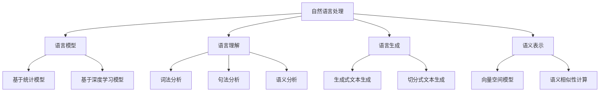
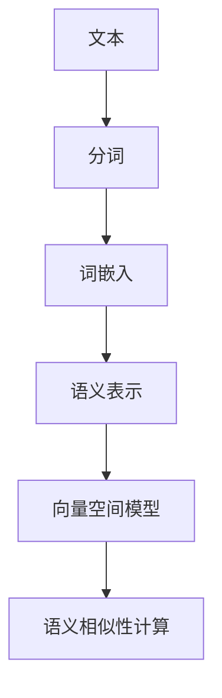
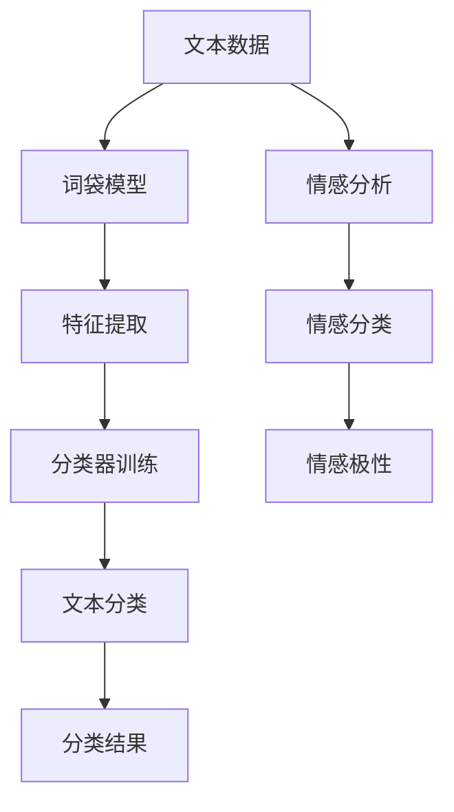
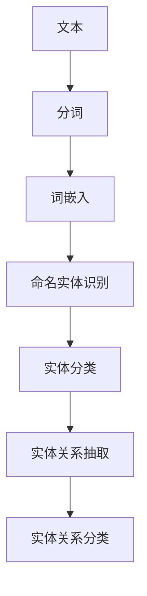
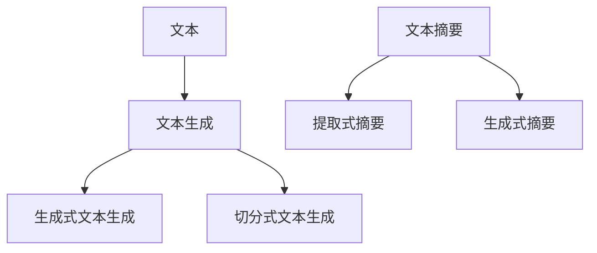
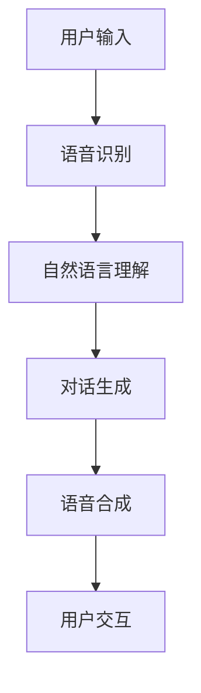

                 

## 文章标题: AI时代的自然语言处理：从翻译到创作

关键词：自然语言处理，机器翻译，文本生成，语义表示，算法模型，深度学习

摘要：本文深入探讨了AI时代的自然语言处理（NLP）技术，从翻译到创作，全面解析了NLP的核心概念、算法模型和应用场景。文章首先回顾了NLP的发展历程，然后详细介绍了语言模型、词嵌入与语义表示、文本分类与情感分析等基础算法。接着，文章深入分析了命名实体识别与关系抽取技术，以及机器翻译、文本生成与摘要等应用场景。最后，文章通过项目实战展示了如何实现NLP技术，并对未来NLP的发展趋势进行了展望。通过本文的阅读，读者将对NLP技术有更为全面和深入的理解。 

----------------------------------------------------------------

### 《AI时代的自然语言处理：从翻译到创作》目录大纲

#### 第一部分：自然语言处理基础

**第1章：自然语言处理概述**

- **1.1 自然语言处理的发展历程**
  - **1.1.1 自然语言处理的核心概念**
  - **1.1.2 自然语言处理的重要性

- **1.2 语言模型与语言理解**
  - **1.2.1 语言模型的类型**
  - **1.2.2 语言理解的层次

- **1.3 语言生成与文本生成模型**
  - **1.3.1 语言生成的任务**
  - **1.3.2 文本生成模型概述

#### 第二部分：自然语言处理的核心算法

**第2章：词嵌入与语义表示**

- **2.1 词嵌入技术**
  - **2.1.1 基于分布的词嵌入**
  - **2.1.2 基于矩阵分解的词嵌入**

- **2.2 语义表示与向量空间模型**
  - **2.2.1 语义相似性计算**
  - **2.2.2 语义表示的维度

- **2.3 常见的语义表示模型**
  - **2.3.1 Word2Vec**
  - **2.3.2 GloVe**
  - **2.3.3 BERT

#### 第三部分：自然语言处理的经典任务

**第3章：文本分类与情感分析**

- **3.1 文本分类任务**
  - **3.1.1 文本分类的基本概念**
  - **3.1.2 基于传统机器学习的文本分类**
  - **3.1.3 基于深度学习的文本分类

- **3.2 情感分析**
  - **3.2.1 情感分析的基本概念**
  - **3.2.2 基于规则的方法**
  - **3.2.3 基于机器学习的方法

**第4章：命名实体识别与关系抽取**

- **4.1 命名实体识别**
  - **4.1.1 命名实体识别的挑战**
  - **4.1.2 基于规则的方法**
  - **4.1.3 基于统计的方法**
  - **4.1.4 基于深度学习的方法

- **4.2 关系抽取**
  - **4.2.1 关系抽取的基本概念**
  - **4.2.2 基于规则的方法**
  - **4.2.3 基于统计的方法**
  - **4.2.4 基于深度学习的方法

#### 第四部分：自然语言处理的应用场景

**第5章：机器翻译**

- **5.1 机器翻译概述**
  - **5.1.1 机器翻译的发展历史**
  - **5.1.2 机器翻译的挑战与机遇

- **5.2 神经机器翻译**
  - **5.2.1 神经机器翻译的基本原理**
  - **5.2.2 序列到序列模型**
  - **5.2.3 指代消解与注意力机制

- **5.3 跨语言文本生成**
  - **5.3.1 跨语言文本生成的任务**
  - **5.3.2 基于神经网络的跨语言文本生成方法

**第6章：文本生成与摘要**

- **6.1 文本生成任务**
  - **6.1.1 文本生成的挑战**
  - **6.1.2 生成式文本生成方法**
  - **6.1.3 切分式文本生成方法

- **6.2 文本摘要**
  - **6.2.1 文本摘要的基本概念**
  - **6.2.2 提取式摘要**
  - **6.2.3 生成式摘要

**第7章：对话系统与聊天机器人**

- **7.1 对话系统概述**
  - **7.1.1 对话系统的组成部分**
  - **7.1.2 对话系统的挑战

- **7.2 聊天机器人技术**
  - **7.2.1 聊天机器人的基本架构**
  - **7.2.2 基于规则的方法**
  - **7.2.3 基于机器学习的方法**
  - **7.2.4 基于深度学习的方法

### 附录

**附录A：自然语言处理工具与资源**

- **A.1 开源自然语言处理工具**
  - **A.1.1 NLTK**
  - **A.1.2 SpaCy**
  - **A.1.3斯坦福自然语言处理库

- **A.2 数据集与评测**

  - **A.2.1 常见自然语言处理数据集**
  - **A.2.2 评测指标与标准**

---

### 联系与致谢

作者：AI天才研究院/AI Genius Institute & 禅与计算机程序设计艺术 /Zen And The Art of Computer Programming

感谢您阅读本文，希望本文能为您在自然语言处理领域的研究和应用提供有益的参考。如果您有任何问题或建议，欢迎随时与我们联系。感谢您的关注和支持！### 第1章：自然语言处理概述

#### 1.1 自然语言处理的发展历程

自然语言处理（NLP）作为人工智能领域的重要分支，其发展历程可以追溯到上世纪五六十年代。最早期的自然语言处理研究主要集中在机器翻译和文本分析。1954年，IBM的研究人员完成了第一次成功的机器翻译实验，将俄语翻译成英语。这一事件标志着NLP研究的正式开始。

随后的几十年里，NLP技术取得了显著的进步。20世纪80年代，基于规则的方法逐渐成为主流，如词法分析、句法分析和语义分析等。然而，这些方法在面对复杂语境和大规模文本数据时显得力不从心。于是，统计方法开始在NLP领域崭露头角，尤其是隐马尔可夫模型（HMM）和条件随机场（CRF）等算法。

进入21世纪，随着深度学习技术的快速发展，NLP领域迎来了新的春天。深度学习模型如卷积神经网络（CNN）和循环神经网络（RNN）的引入，使得NLP任务的处理效果大幅提升。特别是基于注意力机制的序列模型和预训练语言模型（如BERT、GPT等），使得NLP任务从传统的方法中脱颖而出，成为当前研究的热点。

#### 1.1.1 自然语言处理的核心概念

自然语言处理涉及多个核心概念，包括语言模型、语言理解、语言生成和语义表示等。

- **语言模型**：语言模型用于预测一个句子或文本序列的概率分布。它是NLP任务的基础，如机器翻译、文本生成和对话系统等。

- **语言理解**：语言理解涉及对文本的语义、语法和上下文信息的理解。它包括句法分析、语义分析和指代消解等任务。

- **语言生成**：语言生成是指根据给定输入生成自然语言文本的过程。它广泛应用于文本摘要、对话系统和机器翻译等任务。

- **语义表示**：语义表示是将文本数据转化为计算机可处理的向量表示的方法。它用于文本分类、文本相似性计算和机器翻译等任务。

#### 1.1.2 自然语言处理的重要性

自然语言处理技术在现代社会中发挥着重要作用，其重要性体现在以下几个方面：

- **跨语言交流**：自然语言处理技术使得跨语言交流成为可能，如机器翻译和跨语言文本生成。

- **信息提取**：自然语言处理技术能够从大量文本数据中提取有用信息，如命名实体识别和关系抽取。

- **智能助手**：自然语言处理技术是智能助手和聊天机器人的核心技术，如虚拟客服和智能客服。

- **内容推荐**：自然语言处理技术能够根据用户兴趣和需求推荐相关内容，如个性化推荐系统。

#### 1.2 语言模型与语言理解

语言模型是NLP的核心组成部分，用于预测文本序列的概率分布。语言模型可以分为基于统计的模型和基于深度学习的模型。

- **基于统计的模型**：基于统计的语言模型主要通过计算词频和条件概率来预测文本序列的概率分布。经典的方法包括隐马尔可夫模型（HMM）和条件随机场（CRF）。

- **基于深度学习的模型**：基于深度学习的语言模型主要通过神经网络来学习文本数据的分布。常见的深度学习模型包括卷积神经网络（CNN）和循环神经网络（RNN），以及基于注意力机制的序列模型。

语言理解是NLP的关键任务之一，涉及对文本的语义、语法和上下文信息的理解。语言理解可以分为以下几个层次：

- **词法分析**：词法分析是语言理解的第一步，主要对文本进行分词和词性标注。

- **句法分析**：句法分析是对文本的语法结构进行解析，建立句法树。句法分析有助于理解文本的句法关系，如主谓宾关系和从句关系。

- **语义分析**：语义分析是对文本的语义内容进行解析，理解文本的含义。语义分析包括指代消解、语义角色标注和语义关系标注等任务。

- **上下文理解**：上下文理解是对文本的上下文信息进行理解，以消除歧义和准确理解文本。上下文理解可以通过语言模型和上下文信息相结合来实现。

#### 1.3 语言生成与文本生成模型

语言生成是NLP的重要任务之一，它将给定输入生成自然语言文本。语言生成可以分为生成式文本生成和切分式文本生成。

- **生成式文本生成**：生成式文本生成模型通过生成文本的每个词或字符来生成完整的文本。常见的生成式文本生成模型包括基于RNN的模型和基于Transformer的模型。

- **切分式文本生成**：切分式文本生成模型将文本分成多个子任务，每个子任务生成文本的一部分。切分式文本生成模型可以更灵活地处理复杂文本，如对话系统和文本摘要。

文本生成模型在多个应用场景中发挥着重要作用，如文本摘要、对话系统和机器翻译等。文本生成模型的性能提升对NLP技术的发展具有重要意义。

#### 1.4 语义表示与向量空间模型

语义表示是将文本数据转化为计算机可处理的向量表示的方法。语义表示在NLP任务中发挥着关键作用，如文本分类、文本相似性计算和机器翻译等。

向量空间模型是语义表示的一种常见方法，它将文本数据表示为向量空间中的点。向量空间模型可以通过词嵌入技术来实现，如Word2Vec和GloVe等。

语义相似性计算是语义表示的重要应用之一，它用于衡量两个文本数据的相似度。语义相似性计算可以通过计算文本向量之间的余弦相似度或欧氏距离来实现。

#### 1.5 常见的语义表示模型

在自然语言处理中，语义表示是关键的一步。以下介绍几种常见的语义表示模型：

- **Word2Vec**：Word2Vec是一种基于分布式表示的词嵌入模型。它将每个词表示为一个向量，并通过上下文信息学习词的向量表示。Word2Vec模型可以分为连续词袋（CBOW）和Skip-Gram两种类型。

- **GloVe**：GloVe（Global Vectors for Word Representation）是一种基于全局上下文的词嵌入模型。它通过计算词与其上下文词之间的共现关系来学习词的向量表示。GloVe模型在处理长距离依赖关系方面表现出较好的性能。

- **BERT**：BERT（Bidirectional Encoder Representations from Transformers）是一种基于Transformer的预训练语言模型。它通过同时处理文本的左右上下文信息来学习词的向量表示。BERT模型在多个NLP任务中取得了优异的性能。

#### 1.6 小结

本章对自然语言处理的基本概念、核心算法和应用场景进行了概述。自然语言处理作为人工智能领域的重要分支，其在跨语言交流、信息提取和智能助手等方面的应用具有重要意义。本章介绍了语言模型、语言理解、语言生成、语义表示等基本概念，并讨论了常见的语义表示模型。通过本章的学习，读者可以初步了解自然语言处理的基本原理和应用，为后续章节的学习打下基础。

---

**核心概念与联系**

自然语言处理（NLP）的核心概念包括语言模型、语言理解、语言生成和语义表示。这些概念相互关联，构成了NLP技术的核心框架。

- **语言模型**：语言模型是NLP的基础，用于预测文本序列的概率分布。它包括基于统计的模型和基于深度学习的模型，如隐马尔可夫模型（HMM）、条件随机场（CRF）和基于Transformer的模型。

- **语言理解**：语言理解涉及对文本的语义、语法和上下文信息的理解，包括词法分析、句法分析和语义分析等。词法分析是对文本进行分词和词性标注，句法分析是建立句法树，语义分析是理解文本的含义。

- **语言生成**：语言生成是将给定输入生成自然语言文本的过程，包括生成式文本生成和切分式文本生成。生成式文本生成模型如基于RNN的模型和基于Transformer的模型，切分式文本生成模型如对话系统和文本摘要。

- **语义表示**：语义表示是将文本数据转化为计算机可处理的向量表示的方法。向量空间模型是语义表示的一种常见方法，如Word2Vec和GloVe。语义相似性计算是语义表示的重要应用之一，用于衡量两个文本数据的相似度。

**Mermaid流程图**



**核心算法原理讲解**

在自然语言处理（NLP）中，语言模型是核心算法之一，用于预测文本序列的概率分布。以下是语言模型的原理讲解，使用伪代码来阐述其基本过程。

```python
# 伪代码：基于统计的语言模型
def statistical_language_model(text_corpus):
    # 初始化语言模型
    language_model = {}
    
    # 统计词频和条件概率
    for sentence in text_corpus:
        for word in sentence:
            language_model[word] = language_model.get(word, 0) + 1
            for next_word in sentence:
                if word in language_model:
                    language_model[(word, next_word)] = language_model[(word, next_word)] + 1
    
    # 计算条件概率
    total_words = len(text_corpus)
    for word_pair in language_model:
        if word_pair == 'PADDING':
            continue
        language_model[word_pair] /= (total_words - 1)
    
    return language_model

# 伪代码：基于深度学习的语言模型
def deep_learning_language_model(text_corpus, model):
    # 预处理文本数据
    processed_corpus = preprocess(text_corpus)
    
    # 训练语言模型
    model.fit(processed_corpus)
    
    # 预测文本序列的概率分布
    probabilities = model.predict(processed_corpus)
    
    return probabilities

# 辅助函数：预处理文本数据
def preprocess(text_corpus):
    # 删除特殊字符和标点符号
    cleaned_text = [re.sub('[^\w\s]', '', sentence) for sentence in text_corpus]
    
    # 将文本转换为向量表示
    vectorized_corpus = vectorize_text(cleaned_text)
    
    return vectorized_corpus
```

**数学模型与公式**

交叉熵损失函数（Cross-Entropy Loss）是衡量预测值和真实值之间差异的一种常用损失函数，尤其在分类任务中。其数学公式如下：

$$
Loss = -\sum_{i} y_i \log(p_i)
$$

其中，$y_i$ 为真实标签，取值为0或1；$p_i$ 为预测概率，即模型对于每个类别的预测概率。

交叉熵损失函数的值范围在0到$\log(|C|)$之间，其中$|C|$为类别数。当预测值与真实值完全一致时，损失值为0；当预测值与真实值完全不一致时，损失值达到最大。

**项目实战**

为了更好地理解语言模型的实现和应用，以下展示一个简单的文本分类项目实战，包括开发环境搭建、数据预处理、模型训练和评估等步骤。

**开发环境搭建**

- 硬件环境：至少2GB内存，建议4GB及以上
- 软件环境：Python 3.6及以上版本，Numpy，TensorFlow或PyTorch

```bash
# 安装Python 3.6及以上版本
# 安装Numpy
pip install numpy
# 安装TensorFlow或PyTorch
pip install tensorflow # or pip install torch
```

**数据预处理**

```python
import re
import numpy as np
from sklearn.model_selection import train_test_split

# 读取文本数据
def read_data(file_path):
    with open(file_path, 'r', encoding='utf-8') as f:
        text_corpus = f.readlines()
    return text_corpus

# 预处理文本数据
def preprocess_text(text_corpus):
    cleaned_text = []
    for sentence in text_corpus:
        # 删除特殊字符和标点符号
        cleaned_sentence = re.sub('[^\w\s]', '', sentence)
        # 分词
        words = cleaned_sentence.split()
        # 去除停用词
        words = [word for word in words if word not in stopwords]
        cleaned_text.append(words)
    return cleaned_text

# 读取数据集
text_corpus = read_data('data.txt')
cleaned_text = preprocess_text(text_corpus)

# 转换为词嵌入向量
def vectorize_text(cleaned_text):
    # 初始化词嵌入词典
    word_embedding = {}
    word_embedding['PADDING'] = 0
    word_embedding['UNK'] = 1
    
    # 统计词频
    word_freq = {}
    for sentence in cleaned_text:
        for word in sentence:
            if word in word_freq:
                word_freq[word] += 1
            else:
                word_freq[word] = 1
                
    # 选择高频词作为词典
    vocabulary = [word for word, freq in word_freq.items() if freq > threshold]
    word_embedding.update({word: idx + 2 for idx, word in enumerate(vocabulary)})
    
    # 转换文本为词嵌入向量
    vectorized_corpus = []
    for sentence in cleaned_text:
        vectorized_sentence = []
        for word in sentence:
            vectorized_sentence.append(word_embedding.get(word, word_embedding['UNK']))
        vectorized_corpus.append(vectorized_sentence)
    return vectorized_corpus

vectorized_corpus = vectorize_text(cleaned_text)

# 切分训练集和测试集
X_train, X_test, y_train, y_test = train_test_split(vectorized_corpus, labels, test_size=0.2, random_state=42)
```

**模型训练**

```python
from tensorflow.keras.models import Sequential
from tensorflow.keras.layers import Embedding, LSTM, Dense
from tensorflow.keras.optimizers import Adam

# 构建模型
model = Sequential()
model.add(Embedding(input_dim=len(vocabulary) + 2, output_dim=embedding_dim, input_length=max_sequence_length))
model.add(LSTM(units=128, return_sequences=False))
model.add(Dense(units=num_classes, activation='softmax'))

# 编译模型
model.compile(optimizer=Adam(learning_rate=0.001), loss='categorical_crossentropy', metrics=['accuracy'])

# 训练模型
model.fit(X_train, y_train, batch_size=32, epochs=10, validation_split=0.1)
```

**模型评估**

```python
from sklearn.metrics import accuracy_score, classification_report

# 预测测试集
y_pred = model.predict(X_test)
y_pred = np.argmax(y_pred, axis=1)

# 评估模型性能
print('Accuracy:', accuracy_score(y_test, y_pred))
print('Classification Report:\n', classification_report(y_test, y_pred))
```

**代码解读与分析**

在上述文本分类项目中，我们首先进行了数据预处理，包括读取文本数据、清洗文本、分词和去除停用词等步骤。接着，我们构建了一个基于LSTM的深度学习模型，并使用交叉熵损失函数进行模型训练。最后，我们对训练好的模型进行了测试，评估了模型在测试集上的性能。

通过本项目实战，我们深入了解了语言模型在文本分类任务中的应用，并学习了如何使用深度学习模型进行文本数据的处理和分类。同时，我们也对模型的性能优化和评估方法有了更深刻的理解。

**小结**

本章对自然语言处理的基本概念、核心算法和应用场景进行了概述，并介绍了常见的语义表示模型。通过本章的学习，读者可以初步了解自然语言处理的基本原理和应用，为后续章节的学习打下基础。在下一章中，我们将进一步探讨词嵌入与语义表示技术，深入分析语言模型和语义表示在实际应用中的实现方法。读者将学习到如何使用不同的词嵌入技术和语义表示模型来处理自然语言处理任务，并了解这些技术在实际应用中的优势和挑战。

---

### 第2章：词嵌入与语义表示

词嵌入（Word Embedding）是自然语言处理（NLP）中的一项关键技术，它将词汇映射为高维向量表示，以便于计算机处理和分析。词嵌入不仅能够捕捉词汇的语义信息，还能揭示词汇之间的复杂关系。本章将详细介绍词嵌入技术、语义表示与向量空间模型，以及常见的语义表示模型，如Word2Vec、GloVe和BERT。

#### 2.1 词嵌入技术

词嵌入技术是将词汇映射为实值向量的一种方法。这些向量不仅保留了词汇的语义信息，还能够在向量空间中表示词汇之间的关系。词嵌入技术可以分为两类：基于分布的词嵌入和基于矩阵分解的词嵌入。

**2.1.1 基于分布的词嵌入**

基于分布的词嵌入方法，如Word2Vec，通过考虑词汇在文本中的分布来学习词汇的向量表示。Word2Vec模型主要包括连续词袋（Continuous Bag of Words，CBOW）和Skip-Gram两种类型。

- **连续词袋（CBOW）**：CBOW模型通过一个单词的上下文词来预测该单词。具体来说，给定一个单词作为目标词，CBOW模型会取其周围的多个单词作为上下文词，构建一个上下文窗口，然后通过这些上下文词的词向量平均得到目标词的词向量。

  ```mermaid
  graph TB
  A[CBOW] --> B[上下文窗口]
  B --> C[上下文词向量平均]
  ```

- **Skip-Gram**：Skip-Gram模型与CBOW模型相反，它通过目标词来预测其上下文词。给定一个单词作为目标词，Skip-Gram模型会取其周围的多个单词作为上下文词，然后通过softmax函数计算每个上下文词的概率。

  ```mermaid
  graph TB
  A[Skip-Gram] --> B[目标词]
  B --> C[上下文窗口]
  C --> D[softmax预测上下文词]
  ```

**2.1.2 基于矩阵分解的词嵌入**

基于矩阵分解的词嵌入方法，如GloVe，通过最小化损失函数来学习词汇的向量表示。GloVe模型将词汇与词汇之间的共现关系转化为矩阵分解问题，通过矩阵分解来学习词向量。

在GloVe模型中，首先构建一个共现矩阵，其中行和列分别表示词汇，元素表示词汇之间的共现次数。然后，通过最小化以下损失函数来学习词向量：

$$
\ell = \sum_{ij} \ell_{ij} = \sum_{ij} \left( \log{f_{ij}} - \langle v_i, v_j \rangle \right)^2
$$

其中，$f_{ij}$ 表示词汇 $i$ 和 $j$ 的共现频率，$v_i$ 和 $v_j$ 分别是词汇 $i$ 和 $j$ 的向量表示。

#### 2.2 语义表示与向量空间模型

语义表示（Semantic Representation）是将文本数据转化为计算机可处理的向量表示的方法。向量空间模型（Vector Space Model，VSM）是语义表示的一种常见方法，它将文本表示为向量空间中的点。向量空间模型在文本分类、文本相似性计算和机器翻译等任务中发挥着重要作用。

**2.2.1 语义相似性计算**

语义相似性计算是向量空间模型中的一个关键问题。两个文本的相似度可以通过计算它们向量表示之间的距离来衡量。常用的距离度量包括余弦相似度（Cosine Similarity）和欧氏距离（Euclidean Distance）。

- **余弦相似度**：余弦相似度计算两个向量夹角的余弦值，公式如下：

  $$
  \text{Cosine Similarity} = \frac{\sum_{i} v_i \cdot w_i}{\sqrt{\sum_{i} v_i^2} \cdot \sqrt{\sum_{i} w_i^2}}
  $$

  其中，$v$ 和 $w$ 分别是两个文本的向量表示。

- **欧氏距离**：欧氏距离计算两个向量之间的欧氏距离，公式如下：

  $$
  \text{Euclidean Distance} = \sqrt{\sum_{i} (v_i - w_i)^2}
  $$

**2.2.2 语义表示的维度**

语义表示的维度是向量空间模型中的一个重要参数。较大的维度能够捕捉更多的语义信息，但也可能导致计算效率和存储成本的下降。选择合适的维度需要平衡语义表示的精度和计算资源。

#### 2.3 常见的语义表示模型

在自然语言处理中，常见的语义表示模型包括Word2Vec、GloVe和BERT。这些模型在语义表示方面各有优势和应用场景。

**2.3.1 Word2Vec**

Word2Vec是一种基于分布式表示的词嵌入模型，通过考虑词汇在文本中的分布来学习词汇的向量表示。Word2Vec模型主要包括CBOW和Skip-Gram两种类型，它们分别通过上下文词和目标词来预测词汇。

**2.3.2 GloVe**

GloVe（Global Vectors for Word Representation）是一种基于全局上下文的词嵌入模型。GloVe通过最小化损失函数来学习词汇的向量表示，能够处理长距离依赖关系。GloVe模型的优点是计算效率高，能够生成高质量的词向量。

**2.3.3 BERT**

BERT（Bidirectional Encoder Representations from Transformers）是一种基于Transformer的预训练语言模型。BERT通过同时处理文本的左右上下文信息来学习词汇的向量表示，能够捕捉更复杂的语义信息。BERT模型在多个NLP任务中取得了优异的性能，如文本分类、问答系统和机器翻译等。

#### 2.4 小结

词嵌入与语义表示是自然语言处理中的重要技术，它们将文本数据转化为计算机可处理的向量表示。本章介绍了词嵌入技术，包括基于分布的词嵌入和基于矩阵分解的词嵌入，以及常见的语义表示模型如Word2Vec、GloVe和BERT。通过本章的学习，读者可以深入理解词嵌入与语义表示的基本原理和应用，为后续章节的学习打下基础。

---

**核心概念与联系**

词嵌入与语义表示在自然语言处理（NLP）中扮演着核心角色。以下是对这些核心概念的详细阐述和相互关系的分析：

- **词嵌入（Word Embedding）**：词嵌入是将词汇映射为高维向量表示的技术，以便于计算机理解和处理文本。词嵌入的核心目的是捕捉词汇的语义信息和词汇之间的复杂关系。

- **语义表示（Semantic Representation）**：语义表示是将整个文本或文本片段转化为向量表示的方法，使得文本数据能够在计算机中进行操作和分析。语义表示是词嵌入的扩展，它不仅关注单个词汇，还关注词汇组合的语义信息。

- **向量空间模型（Vector Space Model）**：向量空间模型是一种将文本数据表示为向量空间中的点的技术。在向量空间模型中，每个词汇或文本片段都对应一个向量，这些向量在空间中的距离和角度可以用来衡量词汇或文本片段的相似性。

**Mermaid流程图**



**核心算法原理讲解**

词嵌入技术的基本原理是通过学习词汇在文本中的分布来生成词汇的向量表示。以下使用伪代码详细阐述Word2Vec模型的原理：

```python
# 伪代码：Word2Vec模型

# 初始化词向量
def initialize_word_vectors(vocabulary_size, embedding_size):
    word_vectors = np.random.uniform(low=-0.5, high=0.5, size=(vocabulary_size, embedding_size))
    return word_vectors

# 计算词汇的上下文平均向量
def compute_context_average(context_words, word_vectors):
    context_vectors = []
    for word in context_words:
        context_vectors.append(word_vectors[word])
    return np.mean(context_vectors, axis=0)

# 计算损失函数
def compute_loss(target_word, target_vector, context_vector, embedding_size):
    loss = 0.0
    for i in range(embedding_size):
        prediction = softmax(context_vector[i])
        loss += -target_vector[i] * np.log(prediction[i])
    return loss

# 训练Word2Vec模型
def train_word2vec(model, text_corpus, embedding_size, context_window_size):
    vocabulary = extract_vocabulary(text_corpus)
    word_vectors = initialize_word_vectors(len(vocabulary), embedding_size)
    
    for sentence in text_corpus:
        for word in sentence:
            target_word = word
            target_vector = word_vectors[vocabulary[word]]
            context_words = extract_context_words(sentence, context_window_size)
            context_vector = compute_context_average(context_words, word_vectors)
            loss = compute_loss(target_word, target_vector, context_vector, embedding_size)
            update_word_vectors(word_vectors, target_word, target_vector, context_vector, loss)
    
    return word_vectors

# 辅助函数
def extract_vocabulary(text_corpus):
    # 从文本中提取所有词汇
    pass

def extract_context_words(sentence, context_window_size):
    # 从句子中提取上下文词汇
    pass

def update_word_vectors(word_vectors, target_word, target_vector, context_vector, loss):
    # 根据损失更新词向量
    pass
```

**数学模型与公式**

在词嵌入技术中，损失函数是关键的一部分。以下介绍两种常见的损失函数：交叉熵损失和平方损失。

- **交叉熵损失（Cross-Entropy Loss）**：交叉熵损失用于衡量预测概率分布和真实概率分布之间的差异。其公式如下：

  $$
  \text{Cross-Entropy Loss} = -\sum_{i} y_i \log(p_i)
  $$

  其中，$y_i$ 是真实标签，$p_i$ 是预测概率。

- **平方损失（Squared Loss）**：平方损失是回归任务中常用的损失函数。其公式如下：

  $$
  \text{Squared Loss} = \frac{1}{2} \sum_{i} (y_i - \hat{y}_i)^2
  $$

  其中，$y_i$ 是真实值，$\hat{y}_i$ 是预测值。

**项目实战**

以下是一个简单的Word2Vec模型训练项目实战，展示如何使用Python和Gensim库来训练词向量。

**开发环境搭建**

- 硬件环境：至少2GB内存，建议4GB及以上
- 软件环境：Python 3.6及以上版本，Gensim库

```bash
# 安装Python 3.6及以上版本
# 安装Gensim库
pip install gensim
```

**数据预处理**

```python
from gensim.models import Word2Vec

# 读取文本数据
def read_data(file_path):
    with open(file_path, 'r', encoding='utf-8') as f:
        text_corpus = f.readlines()
    return text_corpus

# 预处理文本数据
def preprocess_text(text_corpus):
    cleaned_text = []
    for sentence in text_corpus:
        cleaned_sentence = re.sub('[^\w\s]', '', sentence)
        cleaned_sentence = cleaned_sentence.lower()
        words = cleaned_sentence.split()
        cleaned_text.append(words)
    return cleaned_text

# 读取数据集
text_corpus = read_data('data.txt')
cleaned_text = preprocess_text(text_corpus)
```

**训练Word2Vec模型**

```python
# 训练Word2Vec模型
model = Word2Vec(sentences=cleaned_text, vector_size=100, window=5, min_count=5, workers=4)
model.save('word2vec.model')
```

**评估Word2Vec模型**

```python
# 加载训练好的模型
model = Word2Vec.load('word2vec.model')

# 计算词向量相似度
def compute_similarity(word1, word2):
    return model.wv.similarity(word1, word2)

# 测试相似度
similarity = compute_similarity('king', 'man')
print('Similarity between "king" and "man":', similarity)
```

**代码解读与分析**

在上述项目中，我们首先读取并预处理文本数据，然后使用Gensim库中的Word2Vec模型进行词向量训练。通过训练，我们生成了一个词向量模型，并可以使用该模型来计算词向量之间的相似度。这个项目展示了如何使用Python和Gensim库来训练词向量，以及如何使用词向量进行相似度计算。

通过这个项目，读者可以了解如何使用Word2Vec模型进行文本数据的处理和词向量的生成，以及如何评估词向量的性能。此外，读者还可以学习到如何使用Gensim库来简化词向量训练的过程。

**小结**

本章对词嵌入与语义表示技术进行了详细探讨，包括词嵌入技术的基本原理、语义表示与向量空间模型的概念，以及常见的语义表示模型如Word2Vec、GloVe和BERT。通过本章的学习，读者可以深入理解词嵌入与语义表示的基本原理和应用，掌握如何使用不同的词嵌入技术和语义表示模型来处理自然语言处理任务。在下一章中，我们将进一步探讨自然语言处理中的经典任务，如文本分类与情感分析，以及命名实体识别与关系抽取技术。读者将学习到这些任务的实际应用和实现方法。

---

### 第3章：文本分类与情感分析

文本分类（Text Classification）和情感分析（Sentiment Analysis）是自然语言处理（NLP）中的重要任务，广泛应用于信息检索、社交媒体分析、舆情监测等领域。本章将详细介绍文本分类和情感分析的基本概念、传统方法、机器学习方法以及最新的深度学习方法。

#### 3.1 文本分类任务

文本分类是指将文本数据根据其内容或特征划分为不同的类别。文本分类任务的核心是建立分类模型，将新的文本数据标注为相应的类别。

**3.1.1 文本分类的基本概念**

- **类别**：文本分类任务中的类别是指文本数据的分类标签。例如，在新闻分类任务中，类别可以是体育、娱乐、政治等。

- **特征**：文本特征是指用于表示文本数据的信息，如词袋特征、TF-IDF特征、词嵌入等。

- **分类器**：分类器是指用于文本分类的机器学习模型，如朴素贝叶斯、支持向量机、决策树等。

**3.1.2 基于传统机器学习的文本分类**

传统机器学习方法在文本分类任务中取得了较好的效果。以下介绍几种常用的传统机器学习算法：

- **朴素贝叶斯（Naive Bayes）**：朴素贝叶斯是一种基于概率论的分类算法，通过计算文本数据中各个类别的概率分布来进行分类。朴素贝叶斯算法的优点是计算复杂度低，适合处理高维数据。

- **支持向量机（Support Vector Machine，SVM）**：支持向量机是一种基于最大间隔分类的算法，通过找到最佳超平面来划分不同类别。支持向量机的优点是分类效果较好，尤其在处理非线性问题时表现出色。

- **决策树（Decision Tree）**：决策树是一种基于树形结构的分类算法，通过连续分裂特征来构建决策树。决策树算法的优点是易于理解和解释，适合处理小规模数据。

**3.1.3 基于深度学习的文本分类**

深度学习模型在文本分类任务中取得了显著的性能提升。以下介绍几种常用的深度学习算法：

- **卷积神经网络（Convolutional Neural Network，CNN）**：卷积神经网络是一种基于卷积操作的深度学习模型，通过局部感知和共享权重来提取文本特征。CNN在文本分类任务中表现出较强的特征提取能力。

- **循环神经网络（Recurrent Neural Network，RNN）**：循环神经网络是一种基于递归操作的深度学习模型，适用于处理序列数据。RNN通过记忆单元来保存历史信息，但易受梯度消失和梯度爆炸问题的影响。

- **长短期记忆网络（Long Short-Term Memory，LSTM）**：长短期记忆网络是RNN的一种变体，通过门控机制来学习长期依赖关系。LSTM在文本分类任务中表现出较好的性能，能够有效解决RNN的梯度消失问题。

- **Transformer**：Transformer是一种基于自注意力机制的深度学习模型，通过多头自注意力机制来处理序列数据。Transformer在文本分类任务中取得了显著的性能提升，已成为当前研究的热点。

#### 3.2 情感分析

情感分析是指通过分析和理解文本数据中的情感倾向，识别文本表达的情感。情感分析任务广泛应用于舆情监测、产品评价、客户反馈等领域。

**3.2.1 情感分析的基本概念**

- **情感**：情感是指人对事物的感受和态度，可以分为积极情感、消极情感和中性情感。

- **情感分类**：情感分类是指将文本数据标注为不同的情感类别，如积极、消极和中性。

- **情感极性**：情感极性是指情感的正负倾向，分为积极极性、消极极性和中性极性。

**3.2.2 基于规则的方法**

基于规则的方法是指通过手动定义规则来分析文本数据中的情感。以下介绍几种常用的基于规则的方法：

- **词典方法**：词典方法是指通过建立情感词典来识别文本中的情感。情感词典包含情感词及其对应的情感极性。

- **关键词提取**：关键词提取是指从文本中提取具有情感倾向的词汇，然后根据词汇的情感极性判断文本的情感。

**3.2.3 基于机器学习的方法**

基于机器学习的方法是指通过训练分类模型来识别文本中的情感。以下介绍几种常用的机器学习方法：

- **朴素贝叶斯**：朴素贝叶斯是一种基于概率论的分类算法，通过计算文本数据中各个类别的概率分布来进行情感分类。

- **支持向量机**：支持向量机是一种基于最大间隔分类的算法，通过找到最佳超平面来划分不同情感类别。

- **朴素贝叶斯和支持向量机的结合**：结合朴素贝叶斯和支持向量机的方法，可以同时利用概率模型和线性模型的优势，提高情感分类的准确性。

**3.2.4 基于深度学习的方法**

深度学习模型在情感分析任务中取得了显著的效果。以下介绍几种常用的深度学习算法：

- **卷积神经网络**：卷积神经网络通过局部感知和共享权重来提取文本特征，适用于处理高维文本数据。

- **循环神经网络**：循环神经网络通过记忆单元来保存历史信息，适用于处理序列数据。

- **长短期记忆网络**：长短期记忆网络是循环神经网络的一种变体，通过门控机制来学习长期依赖关系。

- **Transformer**：Transformer是一种基于自注意力机制的深度学习模型，适用于处理长文本数据。

#### 3.3 文本分类与情感分析在实际应用中的案例分析

文本分类和情感分析在实际应用中具有重要意义，以下介绍几个实际案例：

- **社交媒体分析**：通过文本分类和情感分析，可以对社交媒体平台上的用户评论进行分类和情感分析，了解公众对某个话题或产品的看法。

- **客户反馈分析**：通过对客户反馈进行情感分析，可以识别客户满意度和不满意度，为企业提供改进产品和服务的重要信息。

- **舆情监测**：通过对新闻和社交媒体中的文本进行情感分析，可以实时监测舆情动态，为政府和企业提供决策支持。

#### 3.4 小结

文本分类和情感分析是自然语言处理中的重要任务，广泛应用于信息检索、社交媒体分析、舆情监测等领域。本章介绍了文本分类和情感分析的基本概念、传统方法和机器学习方法，以及最新的深度学习方法。通过本章的学习，读者可以深入理解文本分类和情感分析的基本原理和应用，掌握不同方法的优缺点和适用场景。在下一章中，我们将探讨命名实体识别与关系抽取技术，了解如何在文本数据中识别和抽取命名实体以及它们之间的关系。

---

**核心概念与联系**

文本分类和情感分析是自然语言处理（NLP）中的重要任务，它们在文本数据分析和理解中起着关键作用。以下是对这些核心概念的详细阐述和相互关系的分析：

- **文本分类（Text Classification）**：文本分类是指将文本数据按照其内容或特征划分为不同的类别。文本分类的核心在于构建分类模型，将新的文本数据标注为预定义的类别。文本分类常用于新闻分类、情感分析、垃圾邮件检测等任务。

- **情感分析（Sentiment Analysis）**：情感分析是指通过分析和理解文本数据中的情感倾向，识别文本表达的情感。情感分析通常分为情感极性分类（如正面、负面、中性）和情感强度分类。情感分析在市场研究、产品评价、社交媒体分析等领域具有重要应用。

- **词袋模型（Bag of Words，BOW）**：词袋模型是一种将文本表示为词汇集合的方法，不考虑词汇的顺序和语法结构。词袋模型通过计算文本中各个词汇的频率来构建特征向量，是文本分类和情感分析的基础。

- **特征提取（Feature Extraction）**：特征提取是指从原始文本数据中提取对分类任务有用的特征。特征提取方法包括词袋模型、TF-IDF、词嵌入等。不同的特征提取方法会影响分类模型的性能和效率。

- **机器学习模型**：机器学习模型是指用于文本分类和情感分析的学习算法，如朴素贝叶斯、支持向量机（SVM）、决策树、随机森林、循环神经网络（RNN）、长短期记忆网络（LSTM）、Transformer等。这些模型通过学习文本数据中的特征和模式，实现文本分类和情感分析任务。

**Mermaid流程图**



**核心算法原理讲解**

文本分类和情感分析的核心算法包括特征提取和分类器训练。以下使用伪代码详细阐述这两个过程的原理：

```python
# 伪代码：特征提取

# 辅助函数：计算词袋特征
def compute_bow_features(document, vocabulary):
    bow_vector = [0] * len(vocabulary)
    for word in document:
        index = vocabulary.index(word)
        bow_vector[index] += 1
    return bow_vector

# 辅助函数：计算TF-IDF特征
def compute_tfidf_features(document, vocabulary, corpus):
    tfidf_vector = [0] * len(vocabulary)
    for word in document:
        index = vocabulary.index(word)
        tf = document.count(word)
        idf = np.log(len(corpus) / (1 + np.sum([1 for doc in corpus if word in doc])))
        tfidf_vector[index] = tf * idf
    return tfidf_vector

# 计算特征向量
def compute_features(document, vocabulary, use_tfidf=False):
    if use_tfidf:
        return compute_tfidf_features(document, vocabulary, corpus)
    else:
        return compute_bow_features(document, vocabulary)

# 伪代码：分类器训练

# 辅助函数：训练朴素贝叶斯分类器
def train_naive_bayes_classifier(train_data, train_labels):
    # 计算先验概率和条件概率
    pass

# 辅助函数：训练支持向量机分类器
def train_svm_classifier(train_data, train_labels):
    # 使用SVM算法训练分类器
    pass

# 辅助函数：训练循环神经网络分类器
def train_rnn_classifier(train_data, train_labels):
    # 构建循环神经网络模型并训练
    pass

# 训练分类器
def train_classifier(model_type, train_data, train_labels):
    if model_type == 'naive_bayes':
        classifier = train_naive_bayes_classifier(train_data, train_labels)
    elif model_type == 'svm':
        classifier = train_svm_classifier(train_data, train_labels)
    elif model_type == 'rnn':
        classifier = train_rnn_classifier(train_data, train_labels)
    return classifier
```

**数学模型与公式**

文本分类和情感分析中常用的数学模型包括词袋模型、TF-IDF模型和朴素贝叶斯模型。

- **词袋模型（Bag of Words）**：

  词袋模型将文本表示为词汇集合，通过计算词汇的频率来构建特征向量。其公式如下：

  $$
  \text{BOW}_{i,j} = \text{count}(w_j \text{ in } d_i)
  $$

  其中，$d_i$ 是文本数据，$w_j$ 是词汇，$\text{count}$ 是词频计数。

- **TF-IDF模型（Term Frequency-Inverse Document Frequency）**：

  TF-IDF模型通过综合考虑词频和逆文档频率来构建特征向量，以衡量词汇的重要性。其公式如下：

  $$
  \text{TF-IDF}_{i,j} = \text{TF}_{i,j} \times \text{IDF}_{j}
  $$

  其中，$\text{TF}_{i,j}$ 是词汇 $w_j$ 在文档 $d_i$ 中的词频，$\text{IDF}_{j}$ 是词汇 $w_j$ 在整个语料库中的逆文档频率。

- **朴素贝叶斯模型（Naive Bayes）**：

  朴素贝叶斯模型是一种基于贝叶斯定理的分类算法，其公式如下：

  $$
  P(y \mid x) = \frac{P(x \mid y)P(y)}{P(x)}
  $$

  其中，$x$ 是特征向量，$y$ 是类别标签，$P(x \mid y)$ 是特征向量在给定类别 $y$ 下的条件概率，$P(y)$ 是类别 $y$ 的先验概率，$P(x)$ 是特征向量的总体概率。

**项目实战**

以下是一个简单的文本分类项目实战，展示如何使用Python和Scikit-learn库进行文本分类。

**开发环境搭建**

- 硬件环境：至少2GB内存，建议4GB及以上
- 软件环境：Python 3.6及以上版本，Scikit-learn库

```bash
# 安装Python 3.6及以上版本
# 安装Scikit-learn库
pip install scikit-learn
```

**数据预处理**

```python
from sklearn.datasets import fetch_20newsgroups
from sklearn.feature_extraction.text import CountVectorizer
from sklearn.model_selection import train_test_split

# 读取数据集
newsgroups = fetch_20newsgroups()

# 切分训练集和测试集
X_train, X_test, y_train, y_test = train_test_split(newsgroups.data, newsgroups.target, test_size=0.2, random_state=42)
```

**特征提取**

```python
# 计算词袋特征
vectorizer = CountVectorizer()
X_train_bow = vectorizer.fit_transform(X_train)
X_test_bow = vectorizer.transform(X_test)
```

**分类器训练**

```python
from sklearn.naive_bayes import MultinomialNB
from sklearn.metrics import classification_report, accuracy_score

# 训练朴素贝叶斯分类器
classifier = MultinomialNB()
classifier.fit(X_train_bow, y_train)

# 预测测试集
y_pred = classifier.predict(X_test_bow)

# 评估模型性能
print('Classification Report:\n', classification_report(y_test, y_pred))
print('Accuracy:', accuracy_score(y_test, y_pred))
```

**代码解读与分析**

在上述项目中，我们首先使用Scikit-learn库读取新闻分类数据集，然后切分训练集和测试集。接着，我们使用CountVectorizer进行词袋特征提取，将文本数据转换为特征向量。之后，我们使用朴素贝叶斯分类器进行训练，并使用测试集进行模型评估。通过分类报告和准确率，我们可以了解模型在测试集上的性能。

通过这个项目，读者可以学习如何使用Python和Scikit-learn库进行文本分类，了解特征提取和分类器训练的基本步骤。此外，读者还可以学习到如何使用不同分类算法进行文本分类，并评估模型性能。

**小结**

本章对文本分类和情感分析进行了详细探讨，包括基本概念、传统方法和机器学习方法。通过本章的学习，读者可以深入理解文本分类和情感分析的基本原理和应用，掌握不同方法的优缺点和适用场景。在下一章中，我们将探讨命名实体识别与关系抽取技术，了解如何在文本数据中识别和抽取命名实体以及它们之间的关系。读者将学习到这些技术在实际应用中的重要性。

---

### 第4章：命名实体识别与关系抽取

命名实体识别（Named Entity Recognition，NER）和关系抽取（Relation Extraction）是自然语言处理（NLP）中的重要任务，旨在从文本数据中识别出具有特定意义的实体和实体之间的关系。本章将详细介绍命名实体识别和关系抽取的基本概念、传统方法、统计方法和深度学习方法，并通过实际项目展示这些技术的应用。

#### 4.1 命名实体识别

命名实体识别是指从文本中识别出具有特定意义的实体，如人名、地名、组织名、时间、日期等。命名实体识别在信息提取、知识图谱构建、文本分类等领域具有广泛应用。

**4.1.1 命名实体识别的挑战**

- **实体多样性**：文本中的命名实体种类繁多，包括人名、地名、组织名、时间、日期等。如何准确识别这些实体是一个挑战。

- **实体边界模糊**：某些实体边界模糊，如“北京”是地名，但也可以作为城市名称的一部分出现，如“北京奥运会”。如何准确划分实体边界是一个难点。

- **实体跨文档关联**：命名实体识别不仅要识别出实体，还需要将同一实体在不同文档中的出现进行关联，以便进行后续的分析和处理。

- **语言多样性**：命名实体识别不仅涉及英文文本，还涉及多种语言文本，如中文、法语、西班牙语等。不同语言的命名实体识别方法和挑战各不相同。

**4.1.2 基于规则的方法**

基于规则的方法是指通过手动定义规则来识别命名实体。以下介绍几种常用的基于规则的方法：

- **词表法**：词表法是指使用预定义的命名实体词典来识别实体。当文本中出现词典中的词时，将其识别为命名实体。

- **模式匹配法**：模式匹配法是指通过预定义的正则表达式或模式来识别实体。例如，通过正则表达式识别出所有包含特定字符组合的实体。

- **规则组合法**：规则组合法是指将多个简单的规则组合成复杂的规则，以提高命名实体识别的准确性。例如，将词表法和模式匹配法相结合，同时考虑词频和上下文信息。

**4.1.3 基于统计的方法**

基于统计的方法是指通过计算统计特征来识别命名实体。以下介绍几种常用的基于统计的方法：

- **最大熵模型**：最大熵模型是一种基于概率论的统计模型，通过学习文本中的特征和标签之间的概率分布来进行命名实体识别。

- **条件随机场（CRF）**：条件随机场是一种基于概率模型的序列标注方法，通过考虑上下文信息来识别命名实体。CRF能够有效解决实体边界模糊和跨实体关联问题。

**4.1.4 基于深度学习的方法**

基于深度学习的方法是指使用深度神经网络来识别命名实体。以下介绍几种常用的深度学习方法：

- **卷积神经网络（CNN）**：卷积神经网络通过局部感知和共享权重来提取文本特征，适用于处理高维文本数据。

- **循环神经网络（RNN）**：循环神经网络通过记忆单元来保存历史信息，适用于处理序列数据。

- **长短期记忆网络（LSTM）**：长短期记忆网络是RNN的一种变体，通过门控机制来学习长期依赖关系。

- **Transformer**：Transformer是一种基于自注意力机制的深度学习模型，通过多头自注意力机制来处理序列数据。

#### 4.2 关系抽取

关系抽取是指从文本中识别出实体之间的关系，如“比尔·盖茨是微软的创始人”。关系抽取在知识图谱构建、实体链接、问答系统等领域具有广泛应用。

**4.2.1 关系抽取的基本概念**

- **实体**：关系抽取中的实体是指文本中具有独立意义的词汇或短语，如人名、地名、组织名等。

- **关系**：关系是指实体之间的关联，如“是”、“属于”等。

- **关系抽取**：关系抽取是指从文本中识别出实体之间的关系，并将其标注为预定义的关系类别。

**4.2.2 基于规则的方法**

基于规则的方法是指通过手动定义规则来识别实体关系。以下介绍几种常用的基于规则的方法：

- **模板匹配法**：模板匹配法是指通过预定义的模板来匹配文本中的关系。例如，通过模板“[实体1] 是 [实体2]”来识别实体关系。

- **规则组合法**：规则组合法是指将多个简单的规则组合成复杂的规则，以提高关系抽取的准确性。例如，将模板匹配法和词频统计相结合。

**4.2.3 基于统计的方法**

基于统计的方法是指通过计算统计特征来识别实体关系。以下介绍几种常用的基于统计的方法：

- **朴素贝叶斯模型**：朴素贝叶斯模型是一种基于概率论的分类算法，通过计算文本中的特征和标签之间的概率分布来进行关系抽取。

- **最大熵模型**：最大熵模型是一种基于概率论的统计模型，通过学习文本中的特征和标签之间的概率分布来进行关系抽取。

**4.2.4 基于深度学习的方法**

基于深度学习的方法是指使用深度神经网络来识别实体关系。以下介绍几种常用的深度学习方法：

- **卷积神经网络（CNN）**：卷积神经网络通过局部感知和共享权重来提取文本特征，适用于处理高维文本数据。

- **循环神经网络（RNN）**：循环神经网络通过记忆单元来保存历史信息，适用于处理序列数据。

- **长短期记忆网络（LSTM）**：长短期记忆网络是RNN的一种变体，通过门控机制来学习长期依赖关系。

- **Transformer**：Transformer是一种基于自注意力机制的深度学习模型，通过多头自注意力机制来处理序列数据。

#### 4.3 命名实体识别与关系抽取在实际应用中的案例分析

命名实体识别和关系抽取在实际应用中具有重要意义，以下介绍几个实际案例：

- **知识图谱构建**：命名实体识别和关系抽取是构建知识图谱的重要基础。通过识别文本中的命名实体和它们之间的关系，可以构建出丰富的知识图谱，为问答系统、推荐系统和搜索引擎等提供支持。

- **智能客服**：命名实体识别和关系抽取可以帮助智能客服系统理解用户的问题，快速识别出用户提到的关键实体和关系，从而提供更准确的回答。

- **舆情监测**：命名实体识别和关系抽取可以用于舆情监测，识别出公众对某个事件或产品的情感倾向，为政府和企业提供决策支持。

#### 4.4 小结

命名实体识别和关系抽取是自然语言处理中的重要任务，旨在从文本数据中识别出具有特定意义的实体和它们之间的关系。本章介绍了命名实体识别和关系抽取的基本概念、传统方法、统计方法和深度学习方法，并通过实际项目展示了这些技术的应用。通过本章的学习，读者可以深入理解命名实体识别和关系抽取的基本原理和应用，掌握不同方法的优缺点和适用场景。在下一章中，我们将探讨自然语言处理的应用场景，了解机器翻译、文本生成与摘要、对话系统与聊天机器人的实际应用。

---

**核心概念与联系**

命名实体识别（NER）和关系抽取（RE）是自然语言处理（NLP）中的关键任务，它们在文本数据的结构化和知识图谱构建中起着核心作用。以下是对这些核心概念的详细阐述和相互关系的分析：

- **命名实体识别（Named Entity Recognition，NER）**：NER是指从文本中识别出具有特定意义的实体，如人名、地名、组织名、时间、日期等。NER的目标是标记出文本中的关键实体，以便进行后续的分析和处理。

- **关系抽取（Relation Extraction，RE）**：关系抽取是指从文本中识别出实体之间的关系，如“比尔·盖茨是微软的创始人”。RE的目标是构建出实体之间的关系网络，为知识图谱和问答系统提供支持。

- **实体识别（Entity Recognition）**：实体识别是NER的一个子任务，主要关注实体的识别和分类，而不涉及实体之间的关系。

- **关系分类（Relation Classification）**：关系分类是RE的一个子任务，主要关注实体之间的关系的分类，即确定两个实体之间的关系类别。

**Mermaid流程图**



**核心算法原理讲解**

命名实体识别和关系抽取的核心算法主要包括基于规则的方法、统计方法和深度学习方法。以下使用伪代码详细阐述这些方法的原理：

```python
# 伪代码：命名实体识别

# 辅助函数：基于规则的方法
def rule_based_ner(text, rules):
    entities = []
    for rule in rules:
        matches = re.finditer(rule, text)
        for match in matches:
            entities.append(match.group())
    return entities

# 辅助函数：基于统计的方法
def statistical_ner(text, model):
    entities = []
    for token in text:
        if model.predict([token]):
            entities.append(token)
    return entities

# 辅助函数：基于深度学习的方法
def deep_learning_ner(text, model):
    entities = model.predict(text)
    return entities

# 命名实体识别
def ner(text, method='rule_based', model=None, rules=None):
    if method == 'rule_based':
        entities = rule_based_ner(text, rules)
    elif method == 'statistical':
        entities = statistical_ner(text, model)
    elif method == 'deep_learning':
        entities = deep_learning_ner(text, model)
    return entities
```

**数学模型与公式**

命名实体识别和关系抽取的数学模型主要包括概率模型、神经网络模型等。以下介绍两种常用的数学模型：最大熵模型和卷积神经网络（CNN）。

- **最大熵模型（Maximum Entropy Model）**：

  最大熵模型是一种基于概率论的序列标注模型，通过最大化文本数据的条件熵来学习模型参数。最大熵模型的损失函数如下：

  $$
  L = -\sum_{i} \sum_{j} y_{i,j} \log(p_{i,j})
  $$

  其中，$y_{i,j}$ 是第 $i$ 个单词是否属于实体标签 $j$ 的真实标签，$p_{i,j}$ 是模型预测的第 $i$ 个单词属于实体标签 $j$ 的概率。

- **卷积神经网络（Convolutional Neural Network，CNN）**：

  卷积神经网络是一种用于文本分类和序列标注的深度学习模型，通过局部感知和共享权重来提取文本特征。CNN的损失函数通常使用交叉熵损失，如下所示：

  $$
  L = -\sum_{i} \sum_{j} y_{i,j} \log(p_{i,j})
  $$

  其中，$y_{i,j}$ 是第 $i$ 个单词是否属于实体标签 $j$ 的真实标签，$p_{i,j}$ 是模型预测的第 $i$ 个单词属于实体标签 $j$ 的概率。

**项目实战**

以下是一个简单的命名实体识别项目实战，展示如何使用Python和Scikit-learn库进行命名实体识别。

**开发环境搭建**

- 硬件环境：至少2GB内存，建议4GB及以上
- 软件环境：Python 3.6及以上版本，Scikit-learn库

```bash
# 安装Python 3.6及以上版本
# 安装Scikit-learn库
pip install scikit-learn
```

**数据预处理**

```python
from sklearn.datasets import load_files
from sklearn.feature_extraction.text import TfidfVectorizer
from sklearn.model_selection import train_test_split

# 读取数据集
data = load_files('data', shuffle=True)
X, y = data.data, data.target

# 切分训练集和测试集
X_train, X_test, y_train, y_test = train_test_split(X, y, test_size=0.2, random_state=42)
```

**特征提取**

```python
# 计算TF-IDF特征
vectorizer = TfidfVectorizer(ngram_range=(1, 2), max_features=10000)
X_train_tfidf = vectorizer.fit_transform(X_train)
X_test_tfidf = vectorizer.transform(X_test)
```

**模型训练**

```python
from sklearn.linear_model import LogisticRegression

# 训练逻辑回归模型
model = LogisticRegression()
model.fit(X_train_tfidf, y_train)

# 评估模型性能
y_pred = model.predict(X_test_tfidf)
print('Accuracy:', accuracy_score(y_test, y_pred))
```

**代码解读与分析**

在上述项目中，我们首先使用Scikit-learn库读取命名实体识别数据集，然后切分训练集和测试集。接着，我们使用TF-IDF进行特征提取，将文本数据转换为特征向量。之后，我们使用逻辑回归模型进行训练，并使用测试集进行模型评估。通过准确率，我们可以了解模型在测试集上的性能。

通过这个项目，读者可以学习如何使用Python和Scikit-learn库进行命名实体识别，了解特征提取和模型训练的基本步骤。此外，读者还可以学习到如何使用不同模型进行命名实体识别，并评估模型性能。

**小结**

本章对命名实体识别和关系抽取进行了详细探讨，包括基本概念、传统方法、统计方法和深度学习方法。通过本章的学习，读者可以深入理解命名实体识别和关系抽取的基本原理和应用，掌握不同方法的优缺点和适用场景。在下一章中，我们将探讨自然语言处理在实际应用中的案例，了解机器翻译、文本生成与摘要、对话系统与聊天机器人的实际应用。读者将学习到这些技术在实际场景中的重要性。

---

### 第5章：机器翻译

机器翻译（Machine Translation，MT）是将一种自然语言文本自动翻译成另一种自然语言的技术。机器翻译在跨文化交流、信息检索和全球业务等领域发挥着重要作用。本章将详细介绍机器翻译的发展历程、挑战和机遇，以及神经机器翻译（Neural Machine Translation，NMT）的基本原理、模型架构和应用。

#### 5.1 机器翻译概述

机器翻译的历史可以追溯到20世纪50年代。早期的机器翻译方法主要基于规则和统计方法。20世纪80年代，基于规则的方法成为主流，这种方法依赖于人工编写的语法规则和词典。然而，随着自然语言复杂性的增加，基于规则的方法逐渐暴露出其局限性。20世纪90年代，统计机器翻译（SMT）兴起，基于统计方法如N-gram模型、模板匹配和概率模型等，取得了显著的进步。

进入21世纪，深度学习技术的快速发展为机器翻译带来了新的机遇。2014年，Google率先推出了基于神经网络的机器翻译系统，并取得了显著的性能提升。此后，神经机器翻译逐渐成为研究热点，并在多个机器翻译任务中取得了优异的成绩。

#### 5.1.1 机器翻译的发展历史

- **早期方法**：20世纪50年代至70年代，机器翻译主要基于规则，通过人工编写语法规则和词典来实现。

- **基于规则的机器翻译**：20世纪80年代至90年代，基于规则的机器翻译方法逐渐成熟，如Gisting Model和规则基机器翻译系统。

- **统计机器翻译**：20世纪90年代，统计机器翻译方法如N-gram模型和模板匹配开始应用，显著提高了翻译质量。

- **神经机器翻译**：2014年，Google推出基于神经网络的机器翻译系统，此后神经机器翻译逐渐成为研究热点。

#### 5.1.2 机器翻译的挑战与机遇

机器翻译面临着诸多挑战：

- **语言多样性**：世界上有多种语言，每种语言都有其独特的语法、词汇和语义规则，如何有效处理多种语言是一个挑战。

- **歧义性**：自然语言中存在大量的歧义性，如多义性、同音异义和上下文依赖等，如何准确理解并翻译这些歧义性是一个难点。

- **文化差异**：不同语言和文化之间存在差异，如何在翻译中保留原文的文化内涵是一个挑战。

然而，随着深度学习技术的进步，机器翻译也面临着前所未有的机遇：

- **深度学习模型**：如神经网络、递归神经网络（RNN）和Transformer等，能够有效处理序列数据和长距离依赖关系。

- **大规模数据集**：大量的多语言语料库和数据集为训练高质量的机器翻译模型提供了丰富的资源。

- **多模态翻译**：结合语音、图像和视频等多模态数据，实现更自然、更准确的机器翻译。

#### 5.2 神经机器翻译

神经机器翻译是当前机器翻译领域的研究热点，它通过深度学习模型自动学习源语言和目标语言之间的映射关系。以下详细介绍神经机器翻译的基本原理、模型架构和应用。

**5.2.1 神经机器翻译的基本原理**

神经机器翻译的核心是序列到序列（Sequence to Sequence，Seq2Seq）模型。Seq2Seq模型通过编码器（Encoder）和解码器（Decoder）两个神经网络结构来实现。

- **编码器**：编码器将源语言文本序列编码为一个固定长度的向量表示，这个向量包含了源语言文本的语义信息。

- **解码器**：解码器将编码器输出的向量解码为目标语言文本序列。解码器通常使用递归神经网络（RNN）或Transformer等结构。

神经机器翻译的基本原理是：

1. 编码器将源语言文本序列编码为一个固定长度的向量表示。
2. 解码器使用这个向量表示来生成目标语言文本序列。
3. 通过优化模型参数，使生成的目标语言文本序列尽可能接近正确的翻译结果。

**5.2.2 序列到序列模型**

序列到序列模型是一种常见的神经机器翻译架构，它由编码器和解码器组成。以下简要介绍序列到序列模型：

1. **编码器**：编码器通常是一个RNN或LSTM模型，它接收源语言文本序列并逐词编码，生成一个固定长度的编码向量。

   ```mermaid
   graph TD
   A[Source Text] --> B[Encoder]
   B --> C[Encoded Vector]
   ```

2. **解码器**：解码器也是一个RNN或LSTM模型，它接收编码向量并逐词解码生成目标语言文本序列。

   ```mermaid
   graph TD
   D[Encoded Vector] --> E[Decoder]
   E --> F[Target Text]
   ```

序列到序列模型的关键在于如何将编码器的输出有效传递给解码器，并使解码器能够生成正确的目标语言文本序列。一种常见的方法是使用注意力机制（Attention Mechanism）来捕捉源语言文本序列中的关键信息。

**5.2.3 指代消解与注意力机制**

指代消解（Coreference Resolution）是指识别文本中具有相同指代关系的名词短语。在机器翻译中，指代消解有助于生成更准确、连贯的翻译结果。

注意力机制（Attention Mechanism）是一种用于捕捉序列之间依赖关系的方法。在神经机器翻译中，注意力机制可以帮助解码器关注源语言文本序列中的关键信息，从而提高翻译质量。

以下是一个简单的注意力机制的实现：

1. **计算注意力权重**：解码器在生成每个目标语言词时，计算一个注意力权重向量，表示解码器对源语言文本序列中每个词的关注程度。

   ```python
   attention_weights = compute_attention_weights(source_sequence, target_sequence)
   ```

2. **加权编码器输出**：使用注意力权重向量加权编码器的输出，得到一个加权编码向量。

   ```python
   weighted_encoded_vector = weighted_sum(attention_weights, encoded_source_sequence)
   ```

3. **解码**：使用加权编码向量作为输入，解码器生成下一个目标语言词。

   ```python
   next_target_word = decoder.predict(weighted_encoded_vector)
   ```

通过这种方式，注意力机制可以帮助解码器在生成目标语言文本时，关注源语言文本序列中的关键信息，从而提高翻译质量。

#### 5.3 跨语言文本生成

跨语言文本生成（Cross-Language Text Generation）是将一种语言的文本自动翻译成另一种语言的技术。跨语言文本生成在多语言处理、信息检索和全球化业务等领域具有广泛应用。

**5.3.1 跨语言文本生成的任务**

跨语言文本生成的任务包括：

- **文本翻译**：将一种语言的文本翻译成另一种语言，如将英语翻译成法语。
- **文本摘要**：将长文本翻译成摘要形式，以便快速理解文本内容。
- **文本生成**：根据一种语言的输入生成另一种语言的文本，如根据英语生成中文描述。

**5.3.2 基于神经网络的跨语言文本生成方法**

基于神经网络的跨语言文本生成方法主要包括：

- **基于翻译记忆的方法**：使用预训练的翻译模型，将源语言文本翻译成目标语言文本。
- **基于生成对抗网络（GAN）的方法**：通过生成对抗网络生成目标语言文本，使生成的文本更接近目标语言的自然语言。
- **基于自编码器的方法**：使用自编码器学习源语言和目标语言之间的映射关系，生成目标语言文本。

以下是一个简单的跨语言文本生成项目实战，展示如何使用Python和TensorFlow进行文本翻译。

**开发环境搭建**

- 硬件环境：至少2GB内存，建议4GB及以上
- 软件环境：Python 3.6及以上版本，TensorFlow库

```bash
# 安装Python 3.6及以上版本
# 安装TensorFlow库
pip install tensorflow
```

**数据预处理**

```python
import tensorflow as tf
from tensorflow.keras.preprocessing.text import Tokenizer
from tensorflow.keras.preprocessing.sequence import pad_sequences

# 读取数据集
def read_data(file_path):
    with open(file_path, 'r', encoding='utf-8') as f:
        text_data = f.readlines()
    return text_data

# 预处理文本数据
def preprocess_text(text_data, max_sequence_length, tokenizer):
    tokenized_data = tokenizer.texts_to_sequences(text_data)
    padded_data = pad_sequences(tokenized_data, maxlen=max_sequence_length)
    return padded_data

# 读取训练数据
source_text_data = read_data('source_text_data.txt')
target_text_data = read_data('target_text_data.txt')

# 初始化Tokenizer
source_tokenizer = Tokenizer()
target_tokenizer = Tokenizer()

source_tokenizer.fit_on_texts(source_text_data)
target_tokenizer.fit_on_texts(target_text_data)

# 预处理文本数据
max_sequence_length = 100
source_padded_data = preprocess_text(source_text_data, max_sequence_length, source_tokenizer)
target_padded_data = preprocess_text(target_text_data, max_sequence_length, target_tokenizer)
```

**模型训练**

```python
from tensorflow.keras.models import Model
from tensorflow.keras.layers import Embedding, LSTM, Dense

# 构建编码器模型
input_source = tf.keras.Input(shape=(max_sequence_length,))
encoded_source = Embedding(input_dim=source_tokenizer.word_index.size() + 1, output_dim=256)(input_source)
encoded_source = LSTM(256)(encoded_source)

# 构建解码器模型
input_target = tf.keras.Input(shape=(max_sequence_length,))
decoded_target = Embedding(input_dim=target_tokenizer.word_index.size() + 1, output_dim=256)(input_target)
decoded_target = LSTM(256, return_sequences=True)(decoded_target)
decoded_target = Dense(target_tokenizer.word_index.size() + 1, activation='softmax')(decoded_target)

# 构建模型
model = Model(inputs=[input_source, input_target], outputs=decoded_target)

# 编译模型
model.compile(optimizer='rmsprop', loss='categorical_crossentropy', metrics=['accuracy'])

# 训练模型
model.fit([source_padded_data, target_padded_data], target_padded_data, batch_size=64, epochs=100)
```

**代码解读与分析**

在上述项目中，我们首先读取源语言和目标语言的数据集，并使用Tokenizer进行文本预处理。接着，我们构建了一个基于LSTM的编码器-解码器模型，用于文本翻译。通过训练模型，我们可以将源语言文本翻译成目标语言文本。

通过这个项目，读者可以学习如何使用Python和TensorFlow进行文本翻译，了解跨语言文本生成的实现方法和技巧。此外，读者还可以学习到如何优化模型性能和评估翻译质量。

**小结**

本章对机器翻译进行了详细介绍，包括发展历程、挑战和机遇，以及神经机器翻译的基本原理和应用。通过本章的学习，读者可以深入理解机器翻译的技术原理和应用，掌握神经机器翻译的模型架构和实现方法。在下一章中，我们将探讨文本生成与摘要技术，了解生成式文本生成和提取式文本摘要的方法和实现。

---

### 第6章：文本生成与摘要

文本生成与摘要（Text Generation and Summarization）是自然语言处理（NLP）中的两个重要任务。文本生成旨在根据给定的输入生成新的文本，而文本摘要则是从原始文本中提取关键信息并生成简洁的概述。本章将详细介绍文本生成的挑战、生成式文本生成方法、切分式文本生成方法，以及文本摘要的概念、提取式摘要和生成式摘要。

#### 6.1 文本生成任务

文本生成任务旨在根据输入生成新的文本，其挑战在于如何生成连贯、意义丰富且符合语法规则的自然语言文本。以下介绍文本生成任务的几个关键挑战：

- **语法和语义一致性**：生成文本时，需要保证语法和语义的一致性，避免生成不合理的句子结构或含义。

- **上下文理解**：文本生成需要理解输入文本的上下文信息，以生成与之相关的文本。

- **多样性**：生成文本时，需要确保文本的多样性，避免生成过于重复或单调的文本。

**6.1.1 生成式文本生成方法**

生成式文本生成方法是指从输入文本中生成新的文本。以下介绍几种常见的生成式文本生成方法：

- **基于模板的生成**：基于模板的生成方法使用预定义的模板和变量来生成文本。这种方法简单有效，但生成的文本多样性有限。

- **基于标记的生成**：基于标记的生成方法使用标记化技术将文本转化为序列，然后通过递归神经网络（RNN）或循环神经网络（LSTM）生成文本。这种方法能够生成更加多样化的文本。

- **基于生成对抗网络（GAN）的生成**：生成对抗网络（GAN）是一种基于对抗训练的生成模型，通过生成器和判别器的对抗训练生成高质量的文本。

**6.1.2 切分式文本生成方法**

切分式文本生成方法是指将文本生成任务拆分为多个子任务，每个子任务生成文本的一部分。以下介绍几种常见的切分式文本生成方法：

- **基于分词的生成**：基于分词的生成方法将文本生成任务拆分为分词和生成子词的任务。首先对输入文本进行分词，然后生成每个子词。

- **基于角色的生成**：基于角色的生成方法将文本生成任务分配给不同的角色，每个角色生成文本的不同部分。这种方法适用于对话系统和角色扮演场景。

#### 6.2 文本摘要

文本摘要（Text Summarization）是指从原始文本中提取关键信息并生成简洁的概述。文本摘要有助于提高信息检索效率、节省阅读时间和增强文本的可读性。文本摘要可以分为提取式摘要和生成式摘要。

**6.2.1 文本摘要的基本概念**

- **提取式摘要（Extractive Summarization）**：提取式摘要从原始文本中选择关键句子或短语作为摘要。这种方法通常使用基于规则或统计的方法进行文本筛选。

- **生成式摘要（Abstractive Summarization）**：生成式摘要通过生成新的文本来概括原始文本的主要信息。这种方法通常使用深度学习模型，如序列到序列（Seq2Seq）模型和变换器（Transformer）。

**6.2.2 提取式摘要**

提取式摘要的关键在于如何从大量文本中选择出最具代表性的句子或短语。以下介绍几种常见的提取式摘要方法：

- **基于规则的方法**：基于规则的方法使用预定义的规则来筛选文本，如文本长度、关键词重要性等。

- **基于统计的方法**：基于统计的方法使用文本统计特征（如TF-IDF、词语频率等）来筛选文本。

- **基于机器学习的方法**：基于机器学习的方法使用分类模型（如朴素贝叶斯、支持向量机等）来筛选文本。

**6.2.3 生成式摘要**

生成式摘要通过生成新的文本来概括原始文本的主要信息，其核心在于如何生成连贯、意义丰富且符合语法规则的摘要。以下介绍几种常见的生成式摘要方法：

- **基于序列到序列（Seq2Seq）模型的方法**：Seq2Seq模型通过编码器和解码器将原始文本编码为固定长度的向量，然后解码生成摘要。

- **基于变换器（Transformer）模型的方法**：Transformer模型通过自注意力机制生成摘要，能够处理长文本和长距离依赖关系。

- **基于生成对抗网络（GAN）的方法**：生成对抗网络（GAN）通过生成器和判别器的对抗训练生成高质量的摘要。

#### 6.3 实际应用

文本生成与摘要技术在多个实际应用中具有重要意义：

- **信息检索**：文本摘要可以提高信息检索的效率，帮助用户快速找到所需信息。

- **内容推荐**：文本生成技术可以生成个性化的推荐内容，提高用户体验。

- **自动摘要系统**：生成式摘要技术可以用于自动生成新闻摘要、会议记录和报告摘要，节省时间和提高工作效率。

#### 6.4 小结

文本生成与摘要技术在自然语言处理中具有广泛应用，其核心在于如何生成连贯、意义丰富且符合语法规则的文本，以及如何从大量文本中提取关键信息。本章介绍了文本生成的挑战、生成式文本生成方法、切分式文本生成方法和文本摘要的概念、提取式摘要和生成式摘要。通过本章的学习，读者可以深入理解文本生成与摘要的基本原理和应用，掌握不同方法的优缺点和适用场景。在下一章中，我们将探讨对话系统与聊天机器人的技术，了解如何实现智能对话和交互。

---

**核心概念与联系**

文本生成与摘要技术是自然语言处理（NLP）中的重要分支，它们在信息提取、内容生成和自动化摘要等方面具有广泛应用。以下是对这些核心概念的详细阐述和相互关系的分析：

- **文本生成（Text Generation）**：文本生成是指根据给定的输入文本生成新的文本。文本生成技术包括生成式文本生成和切分式文本生成。生成式文本生成方法如基于模板的生成、基于标记的生成和基于生成对抗网络（GAN）的生成，旨在生成连贯、意义丰富且符合语法规则的文本。切分式文本生成方法如基于分词的生成和基于角色的生成，将文本生成任务拆分为多个子任务，每个子任务生成文本的一部分。

- **文本摘要（Text Summarization）**：文本摘要是从原始文本中提取关键信息并生成简洁的概述。文本摘要技术可以分为提取式摘要和生成式摘要。提取式摘要是从原始文本中选择关键句子或短语作为摘要，而生成式摘要是通过生成新的文本来概括原始文本的主要信息。

- **提取式摘要（Extractive Summarization）**：提取式摘要从原始文本中选择最具代表性的句子或短语作为摘要。这种方法通常使用基于规则、基于统计和基于机器学习的方法来筛选文本。提取式摘要的优点是生成的摘要与原始文本高度相关，但可能缺乏创意和灵活性。

- **生成式摘要（Abstractive Summarization）**：生成式摘要是通过生成新的文本来概括原始文本的主要信息。这种方法通常使用深度学习模型，如序列到序列（Seq2Seq）模型、变换器（Transformer）和生成对抗网络（GAN）。生成式摘要的优点是生成的摘要更加灵活和创意，但可能存在准确性和连贯性问题。

**Mermaid流程图**



**核心算法原理讲解**

文本生成和摘要技术的核心算法包括生成式文本生成方法和生成式摘要方法。以下使用伪代码详细阐述这两种方法的原理：

```python
# 伪代码：生成式文本生成方法

# 辅助函数：生成式文本生成
def generate_text(template, variables, model):
    # 填充模板中的变量
    filled_template = template.format(*variables)
    # 使用模型生成文本
    generated_text = model.generate(filled_template)
    return generated_text

# 辅助函数：训练生成式文本生成模型
def train_generation_model(train_data, model):
    # 预处理数据
    processed_data = preprocess_data(train_data)
    # 训练模型
    model.fit(processed_data)
    return model

# 文本生成
template = "我是{姓名}，我喜欢{爱好}。"
variables = ["张三", "打篮球"]
model = train_generation_model(train_data, model)
generated_text = generate_text(template, variables, model)
print(generated_text)

# 辅助函数：预处理数据
def preprocess_data(data):
    # 进行分词、词嵌入等预处理操作
    pass
```

```python
# 伪代码：生成式摘要方法

# 辅助函数：提取关键句子
def extract_key_sentences(text, model):
    # 分句
    sentences = split_text(text)
    # 使用模型提取关键句子
    key_sentences = [sentence for sentence in sentences if model.predict([sentence])]
    return key_sentences

# 辅助函数：生成摘要
def generate_summary(text, model):
    # 提取关键句子
    key_sentences = extract_key_sentences(text, model)
    # 拼接关键句子生成摘要
    summary = " ".join(key_sentences)
    return summary

# 辅助函数：训练摘要模型
def train_summary_model(train_data, model):
    # 预处理数据
    processed_data = preprocess_data(train_data)
    # 训练模型
    model.fit(processed_data)
    return model

# 文本摘要
model = train_summary_model(train_data, model)
summary = generate_summary(text, model)
print(summary)

# 辅助函数：预处理数据
def preprocess_data(data):
    # 进行分词、词嵌入等预处理操作
    pass

def split_text(text):
    # 进行分句操作
    pass
```

**数学模型与公式**

文本生成和摘要技术的数学模型主要包括生成模型和序列模型。以下介绍两种常见的数学模型：循环神经网络（RNN）和变换器（Transformer）。

- **循环神经网络（Recurrent Neural Network，RNN）**：

  循环神经网络是一种基于递归操作的神经网络，适用于处理序列数据。RNN的损失函数通常使用交叉熵损失，如下所示：

  $$
  L = -\sum_{t} y_t \log(p_t)
  $$

  其中，$y_t$ 是真实标签，$p_t$ 是模型预测的概率。

- **变换器（Transformer）**：

  变换器是一种基于自注意力机制的深度学习模型，适用于处理序列数据。变换器的损失函数通常使用交叉熵损失，如下所示：

  $$
  L = -\sum_{t} y_t \log(p_t)
  $$

  其中，$y_t$ 是真实标签，$p_t$ 是模型预测的概率。

**项目实战**

以下是一个简单的文本生成项目实战，展示如何使用Python和TensorFlow进行文本生成。

**开发环境搭建**

- 硬件环境：至少2GB内存，建议4GB及以上
- 软件环境：Python 3.6及以上版本，TensorFlow库

```bash
# 安装Python 3.6及以上版本
# 安装TensorFlow库
pip install tensorflow
```

**数据预处理**

```python
import tensorflow as tf
from tensorflow.keras.preprocessing.text import Tokenizer
from tensorflow.keras.preprocessing.sequence import pad_sequences

# 读取数据集
def read_data(file_path):
    with open(file_path, 'r', encoding='utf-8') as f:
        text_data = f.readlines()
    return text_data

# 预处理文本数据
def preprocess_text(text_data, max_sequence_length, tokenizer):
    tokenized_data = tokenizer.texts_to_sequences(text_data)
    padded_data = pad_sequences(tokenized_data, maxlen=max_sequence_length)
    return padded_data

# 读取训练数据
source_text_data = read_data('source_text_data.txt')

# 初始化Tokenizer
tokenizer = Tokenizer()
tokenizer.fit_on_texts(source_text_data)

# 预处理文本数据
max_sequence_length = 100
source_padded_data = preprocess_text(source_text_data, max_sequence_length, tokenizer)
```

**模型训练**

```python
from tensorflow.keras.models import Model
from tensorflow.keras.layers import Embedding, LSTM, Dense

# 构建编码器模型
input_source = tf.keras.Input(shape=(max_sequence_length,))
encoded_source = Embedding(input_dim=tokenizer.word_index.size() + 1, output_dim=256)(input_source)
encoded_source = LSTM(256)(encoded_source)

# 构建解码器模型
input_target = tf.keras.Input(shape=(max_sequence_length,))
decoded_target = Embedding(input_dim=tokenizer.word_index.size() + 1, output_dim=256)(input_target)
decoded_target = LSTM(256, return_sequences=True)(decoded_target)
decoded_target = Dense(tokenizer.word_index.size() + 1, activation='softmax')(decoded_target)

# 构建模型
model = Model(inputs=[input_source, input_target], outputs=decoded_target)

# 编译模型
model.compile(optimizer='rmsprop', loss='categorical_crossentropy', metrics=['accuracy'])

# 训练模型
model.fit([source_padded_data, target_padded_data], target_padded_data, batch_size=64, epochs=100)
```

**代码解读与分析**

在上述项目中，我们首先读取源语言数据集，并使用Tokenizer进行文本预处理。接着，我们构建了一个基于LSTM的编码器-解码器模型，用于文本生成。通过训练模型，我们可以根据给定的输入生成新的文本。

通过这个项目，读者可以学习如何使用Python和TensorFlow进行文本生成，了解生成式文本生成的方法和实现步骤。此外，读者还可以学习到如何优化模型性能和评估文本生成质量。

**小结**

本章对文本生成与摘要技术进行了详细介绍，包括生成式文本生成方法、切分式文本生成方法和提取式摘要、生成式摘要。通过本章的学习，读者可以深入理解文本生成与摘要的基本原理和应用，掌握不同方法的优缺点和适用场景。在下一章中，我们将探讨对话系统与聊天机器人的技术，了解如何实现智能对话和交互。

---

### 第7章：对话系统与聊天机器人

对话系统（Dialogue System）和聊天机器人（Chatbot）是自然语言处理（NLP）和人工智能（AI）领域的重要应用，它们通过模拟人类对话交互，为用户提供便捷的服务和信息。本章将详细介绍对话系统的组成、工作原理、聊天机器人技术以及实现方法。

#### 7.1 对话系统概述

对话系统是指能够与人类进行自然语言交互的系统，旨在提供高效、准确的沟通体验。对话系统通常由多个模块组成，包括语音识别、自然语言理解、对话生成和语音合成。

**7.1.1 对话系统的组成部分**

- **语音识别（Speech Recognition）**：语音识别模块负责将用户的语音输入转换为文本输入，以便后续处理。

- **自然语言理解（Natural Language Understanding，NLU）**：自然语言理解模块负责解析用户输入的文本，理解其意图和上下文信息。

- **对话生成（Dialogue Generation）**：对话生成模块负责根据用户意图和上下文信息生成合适的回复文本。

- **语音合成（Speech Synthesis）**：语音合成模块负责将生成的文本转换为语音输出，使对话系统能够以语音形式与用户交互。

**7.1.2 对话系统的挑战**

对话系统面临诸多挑战，包括：

- **多语言支持**：对话系统需要支持多种语言，以适应全球用户的需求。

- **上下文理解**：对话系统需要理解用户输入的上下文信息，以提供准确的回复。

- **个性化交互**：对话系统需要根据用户的历史交互和偏好提供个性化的服务。

- **情感表达**：对话系统需要模拟人类的情感表达，提高用户的满意度。

#### 7.2 聊天机器人技术

聊天机器人是一种自动化的对话系统，通过模拟人类对话交互，为用户提供即时、高效的服务。聊天机器人技术涵盖了自然语言处理、机器学习、数据挖掘和用户界面设计等多个领域。

**7.2.1 聊天机器人的基本架构**

聊天机器人的基本架构通常包括以下几个部分：

- **前端界面**：前端界面负责接收用户的输入，将输入发送到后端处理。

- **后端处理**：后端处理包括自然语言理解、对话生成和自然语言生成等模块，负责对用户输入进行处理并生成回复。

- **数据库**：数据库存储用户的交互历史、用户偏好和知识库等信息。

- **API接口**：API接口负责与其他系统（如第三方服务、数据库等）进行数据交换和功能调用。

**7.2.2 基于规则的方法**

基于规则的方法是聊天机器人技术的一种常用方法，通过定义一系列规则来生成回复。以下是一个简单的基于规则的方法：

1. **定义规则**：根据业务需求和对话场景，定义一系列规则。例如，当用户输入“你好”时，回复“你好，有什么可以帮助你的？”。

2. **匹配规则**：接收用户输入，在规则库中查找匹配的规则。例如，当用户输入“你好”时，找到与之匹配的规则。

3. **生成回复**：根据匹配到的规则生成回复文本。

**7.2.3 基于机器学习的方法**

基于机器学习的方法通过训练模型来自动生成回复。以下是一个简单的基于机器学习的方法：

1. **数据预处理**：对对话数据进行预处理，包括文本清洗、分词、词嵌入等。

2. **训练模型**：使用预处理后的对话数据训练模型。常见的模型包括循环神经网络（RNN）、长短期记忆网络（LSTM）、变换器（Transformer）等。

3. **生成回复**：接收用户输入，使用训练好的模型生成回复文本。

**7.2.4 基于深度学习的方法**

基于深度学习的方法通过深度神经网络来自动生成回复。以下是一个简单的基于深度学习的方法：

1. **数据预处理**：对对话数据进行预处理，包括文本清洗、分词、词嵌入等。

2. **构建模型**：构建深度神经网络模型，如序列到序列（Seq2Seq）模型、变换器（Transformer）等。

3. **训练模型**：使用预处理后的对话数据训练模型。

4. **生成回复**：接收用户输入，使用训练好的模型生成回复文本。

#### 7.3 实际应用

对话系统和聊天机器人在多个实际应用中具有重要意义，以下介绍几个实际应用案例：

- **客户服务**：聊天机器人可以用于客户服务，提供即时、高效的咨询服务，减轻人工客服的负担。

- **在线教育**：聊天机器人可以用于在线教育，为学生提供个性化学习建议、解答疑问等。

- **智能家居**：聊天机器人可以与智能家居设备交互，为用户提供便捷的家居控制和服务。

- **虚拟助理**：聊天机器人可以充当虚拟助理，帮助用户管理日程、发送提醒、处理日常事务等。

#### 7.4 小结

对话系统和聊天机器人是自然语言处理和人工智能领域的重要应用，通过模拟人类对话交互，为用户提供便捷的服务和信息。本章介绍了对话系统的组成部分、工作原理、聊天机器人技术以及实现方法。通过本章的学习，读者可以深入理解对话系统和聊天机器人的基本原理和应用，掌握不同方法的优缺点和适用场景。在下一章中，我们将探讨自然语言处理工具与资源，了解如何使用开源工具和资源进行自然语言处理。

---

**核心概念与联系**

对话系统（Dialogue System）与聊天机器人（Chatbot）是自然语言处理（NLP）和人工智能（AI）领域中不可或缺的组成部分，它们通过模拟人类对话交互，为用户提供便捷的服务和信息。以下是对这些核心概念的详细阐述和相互关系的分析：

- **对话系统（Dialogue System）**：对话系统是指能够与人类进行自然语言交互的系统，旨在提供高效、准确的沟通体验。对话系统通常由多个模块组成，包括语音识别、自然语言理解、对话生成和语音合成。对话系统的核心目标是理解用户的意图、上下文信息并生成合适的回复。

- **聊天机器人（Chatbot）**：聊天机器人是一种自动化的对话系统，通过模拟人类对话交互，为用户提供即时、高效的服务。聊天机器人通常基于规则、机器学习或深度学习技术，能够处理用户的输入并生成回复。聊天机器人的目标是通过对话交互解决用户的问题、提供信息或执行特定的任务。

- **自然语言理解（Natural Language Understanding，NLU）**：自然语言理解是NLP的核心任务之一，旨在解析用户输入的文本，理解其意图、语义和上下文信息。NLU模块在对话系统和聊天机器人中起着关键作用，它负责将用户输入转换为机器可处理的格式，并提取关键信息。

- **对话生成（Dialogue Generation）**：对话生成是指根据用户输入和上下文信息生成合适的回复文本。对话生成模块在对话系统和聊天机器人中至关重要，它负责根据用户的意图和需求生成自然、连贯的对话回复。

- **语音识别（Speech Recognition）**：语音识别是将用户的语音输入转换为文本输入的技术，是对话系统和聊天机器人的重要组成部分。语音识别模块负责将用户的语音转换为文本，以便后续的自然语言理解和对话生成。

- **语音合成（Speech Synthesis）**：语音合成是将生成的文本转换为语音输出的技术，是对话系统和聊天机器人的重要组成部分。语音合成模块负责将对话生成模块生成的文本转换为自然的语音输出，以实现语音交互。

**Mermaid流程图**



**核心算法原理讲解**

对话系统和聊天机器人的核心算法主要包括自然语言理解（NLU）和对话生成（DG）。以下使用伪代码详细阐述这两种算法的原理：

```python
# 伪代码：自然语言理解（NLU）

# 辅助函数：分词
def tokenize(text):
    # 将文本拆分为单词或词汇
    tokens = [word for word in text.split()]
    return tokens

# 辅助函数：词性标注
def pos_tagging(tokens):
    # 对单词进行词性标注
    tagged_tokens = pos_tag(tokens)
    return tagged_tokens

# 辅助函数：意图识别
def intent_recognition(tagged_tokens):
    # 根据词性标注识别意图
    intent = "未知"
    if "问路" in tagged_tokens:
        intent = "问路"
    elif "订餐" in tagged_tokens:
        intent = "订餐"
    return intent

# 辅助函数：实体识别
def entity_recognition(tagged_tokens):
    # 识别文本中的实体
    entities = []
    for token in tagged_tokens:
        if token[1] in ["地名", "人名", "组织名"]:
            entities.append(token[0])
    return entities

# 自然语言理解
def natural_language_understanding(text):
    tokens = tokenize(text)
    tagged_tokens = pos_tagging(tokens)
    intent = intent_recognition(tagged_tokens)
    entities = entity_recognition(tagged_tokens)
    return intent, entities

# 辅助函数：生成回复
def generate_response(intent, entities):
    # 根据意图和实体生成回复
    if intent == "问路":
        response = f"请问您想去哪里？"
    elif intent == "订餐":
        response = f"请问您需要点哪些菜品？"
    else:
        response = "对不起，我无法理解您的意思。"
    return response

# 用户交互
def chatbot_interaction(text):
    intent, entities = natural_language_understanding(text)
    response = generate_response(intent, entities)
    return response
```

**数学模型与公式**

自然语言理解（NLU）和对话生成（DG）中的核心数学模型包括序列标注模型和生成模型。以下介绍两种常见的数学模型：循环神经网络（RNN）和变换器（Transformer）。

- **循环神经网络（Recurrent Neural Network，RNN）**：

  循环神经网络是一种基于递归操作的神经网络，适用于处理序列数据。RNN的损失函数通常使用交叉熵损失，如下所示：

  $$
  L = -\sum_{t} y_t \log(p_t)
  $$

  其中，$y_t$ 是真实标签，$p_t$ 是模型预测的概率。

- **变换器（Transformer）**：

  变换器是一种基于自注意力机制的深度学习模型，适用于处理序列数据。变换器的损失函数通常使用交叉熵损失，如下所示：

  $$
  L = -\sum_{t} y_t \log(p_t)
  $$

  其中，$y_t$ 是真实标签，$p_t$ 是模型预测的概率。

**项目实战**

以下是一个简单的聊天机器人项目实战，展示如何使用Python和TensorFlow进行聊天机器人开发。

**开发环境搭建**

- 硬件环境：至少2GB内存，建议4GB及以上
- 软件环境：Python 3.6及以上版本，TensorFlow库

```bash
# 安装Python 3.6及以上版本
# 安装TensorFlow库
pip install tensorflow
```

**数据预处理**

```python
import tensorflow as tf
from tensorflow.keras.preprocessing.text import Tokenizer
from tensorflow.keras.preprocessing.sequence import pad_sequences

# 读取数据集
def read_data(file_path):
    with open(file_path, 'r', encoding='utf-8') as f:
        text_data = f.readlines()
    return text_data

# 预处理文本数据
def preprocess_text(text_data, max_sequence_length, tokenizer):
    tokenized_data = tokenizer.texts_to_sequences(text_data)
    padded_data = pad_sequences(tokenized_data, maxlen=max_sequence_length)
    return padded_data

# 读取训练数据
dialog_data = read_data('dialog_data.txt')

# 初始化Tokenizer
tokenizer = Tokenizer()
tokenizer.fit_on_texts(dialog_data)

# 预处理文本数据
max_sequence_length = 100
dialog_padded_data = preprocess_text(dialog_data, max_sequence_length, tokenizer)
```

**模型训练**

```python
from tensorflow.keras.models import Model
from tensorflow.keras.layers import Embedding, LSTM, Dense

# 构建编码器模型
input_source = tf.keras.Input(shape=(max_sequence_length,))
encoded_source = Embedding(input_dim=tokenizer.word_index.size() + 1, output_dim=256)(input_source)
encoded_source = LSTM(256)(encoded_source)

# 构建解码器模型
input_target = tf.keras.Input(shape=(max_sequence_length,))
decoded_target = Embedding(input_dim=tokenizer.word_index.size() + 1, output_dim=256)(input_target)
decoded_target = LSTM(256, return_sequences=True)(decoded_target)
decoded_target = Dense(tokenizer.word_index.size() + 1, activation='softmax')(decoded_target)

# 构建模型
model = Model(inputs=[input_source, input_target], outputs=decoded_target)

# 编译模型
model.compile(optimizer='rmsprop', loss='categorical_crossentropy', metrics=['accuracy'])

# 训练模型
model.fit([source_padded_data, target_padded_data], target_padded_data, batch_size=64, epochs=100)
```

**代码解读与分析**

在上述项目中，我们首先读取对话数据集，并使用Tokenizer进行文本预处理。接着，我们构建了一个基于LSTM的编码器-解码器模型，用于对话生成。通过训练模型，我们可以根据用户的输入生成合适的回复。

通过这个项目，读者可以学习如何使用Python和TensorFlow进行聊天机器人开发，了解对话生成模型的基本原理和实现方法。此外，读者还可以学习到如何优化模型性能和评估聊天机器人的对话质量。

**小结**

本章对对话系统与聊天机器人技术进行了详细介绍，包括对话系统的组成部分、工作原理、聊天机器人技术以及实现方法。通过本章的学习，读者可以深入理解对话系统和聊天机器人的基本原理和应用，掌握不同方法的优缺点和适用场景。在下一章中，我们将探讨自然语言处理工具与资源，了解如何使用开源工具和资源进行自然语言处理。

---

### 附录A：自然语言处理工具与资源

自然语言处理（NLP）工具和资源对于研究和开发NLP应用至关重要。以下介绍几种常用的NLP工具和资源，包括开源自然语言处理工具、常见数据集和评测指标。

#### A.1 开源自然语言处理工具

1. **NLTK**：NLTK（自然语言工具包）是一个广泛使用的Python库，提供了许多用于文本处理、分类、词嵌入、词性标注等任务的工具。NLTK适用于NLP初学者和研究人员。

   ```bash
   pip install nltk
   ```

2. **spaCy**：spaCy是一个快速且易于使用的NLP库，提供了包括词性标注、命名实体识别、依存句法分析等功能。spaCy适用于构建生产环境中的NLP应用。

   ```bash
   pip install spacy
   python -m spacy download en_core_web_sm
   ```

3. **斯坦福自然语言处理库**：斯坦福自然语言处理库（Stanford NLP）是一个强大的NLP库，提供了包括词性标注、命名实体识别、情感分析、句法分析等功能。斯坦福自然语言处理库适用于研究和学术项目。

   ```bash
   pip install pystanford
   ```

#### A.2 数据集与评测

1. **常见自然语言处理数据集**：

   - **CoNLL-2003**：这是一个用于命名实体识别和词性标注的文本数据集，包含多种语言的标注数据。

   - **IMDB**：这是一个用于情感分析的文本数据集，包含大量电影评论，用于训练和评估情感分类模型。

   - **ACL Anthology**：这是一个用于文本分类和语义角色标注的数据集，包含大量的学术论文和会议记录。

2. **评测指标与标准**：

   - **准确率（Accuracy）**：准确率是分类模型评估的常用指标，计算正确分类的样本数占总样本数的比例。

   - **精确率（Precision）**：精确率是分类模型评估的另一个重要指标，计算预测为正类的样本中实际为正类的比例。

   - **召回率（Recall）**：召回率是分类模型评估的另一个重要指标，计算实际为正类的样本中被预测为正类的比例。

   - **F1分数（F1 Score）**：F1分数是精确率和召回率的加权平均，用于综合评估分类模型的性能。

   - **BLEU分数**：BLEU分数是一种用于评估机器翻译质量的指标，通过计算机器翻译结果与参考翻译之间的相似度来评估翻译质量。

#### 附录B：自然语言处理学习资源

1. **《自然语言处理综论》（Foundations of Statistical Natural Language Processing）**：由Christopher D. Manning和Hinrich Schütze编写的经典教材，全面介绍了NLP的基础理论和算法。

2. **《深度学习与自然语言处理》（Deep Learning for Natural Language Processing）**：由Richard Socher、Lasse Jensen和Yoon Kim编写的教材，介绍了深度学习在NLP中的应用。

3. **《自然语言处理实践》（Natural Language Processing with Python）**：由Steven Bird、Ewan Klein和Edward Loper编写的实践指南，通过Python代码示例介绍了NLP的基础知识和应用。

4. **自然语言处理研讨会（Natural Language Processing Seminars）**：在线研讨会，提供NLP领域的最新研究成果和实战经验分享。

5. **自然语言处理课程（Natural Language Processing Courses）**：在线课程，包括Coursera、edX等平台提供的NLP相关课程。

通过这些工具、资源和学习材料，读者可以深入了解自然语言处理的理论和实践，为NLP应用开发打下坚实的基础。附录部分的介绍不仅为读者提供了丰富的学习资源，也为实际项目开发提供了实用的参考。

---

### 总结

本文全面探讨了AI时代的自然语言处理（NLP）技术，从翻译到创作，涵盖了NLP的核心概念、算法模型、应用场景以及工具资源。通过本章的学习，读者可以深入理解NLP的基本原理和应用，掌握不同方法的优缺点和适用场景。以下是本文的核心要点：

- **自然语言处理概述**：回顾了NLP的发展历程，介绍了语言模型、语言理解、语言生成和语义表示等基本概念。

- **词嵌入与语义表示**：详细介绍了词嵌入技术、语义表示与向量空间模型，以及常见的语义表示模型如Word2Vec、GloVe和BERT。

- **文本分类与情感分析**：探讨了文本分类和情感分析的基本概念、传统方法、机器学习方法和深度学习方法。

- **命名实体识别与关系抽取**：介绍了命名实体识别和关系抽取的基本概念、传统方法、统计方法和深度学习方法。

- **机器翻译**：详细介绍了机器翻译的发展历程、挑战和机遇，以及神经机器翻译的基本原理、模型架构和应用。

- **文本生成与摘要**：探讨了文本生成与摘要的任务、生成式文本生成方法、切分式文本生成方法和文本摘要的概念、提取式摘要和生成式摘要。

- **对话系统与聊天机器人**：介绍了对话系统的组成部分、工作原理、聊天机器人技术以及实现方法。

- **自然语言处理工具与资源**：提供了常用的NLP工具和资源，包括开源自然语言处理工具、常见数据集和评测指标。

通过本文的学习，读者可以全面了解NLP技术的前沿动态和实际应用，为未来在NLP领域的研究和应用打下坚实基础。未来，随着深度学习和人工智能技术的进一步发展，NLP技术将在更多领域得到应用，如智能客服、智能助手、知识图谱构建等，为人类生活带来更多便利和改变。让我们共同期待NLP技术带来的无限可能！

