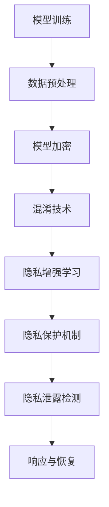

                 

### 文章标题

《AI模型安全与隐私保护原理与代码实战案例讲解》

### 关键词

AI模型安全、隐私保护、加密与混淆技术、隐私增强学习、项目实战、代码解读

### 摘要

随着人工智能技术的迅猛发展，AI模型的安全与隐私保护成为了一个备受关注的话题。本文将详细讲解AI模型安全与隐私保护的基本原理、核心算法以及实际项目案例，帮助读者全面理解并掌握这一领域的关键技术。通过本篇文章，读者将了解到AI模型安全与隐私保护的必要性、面临的挑战、国际法规与标准、安全防护策略、隐私保护机制、实践案例以及未来的发展趋势。


## 《AI模型安全与隐私保护原理与代码实战案例讲解》目录大纲

### 第一部分：AI模型安全与隐私保护概述

- **第1章：AI模型安全与隐私保护的重要性**
  - 1.1 AI模型安全面临的挑战
  - 1.2 AI模型隐私保护的必要性
  - 1.3 AI模型安全与隐私保护的国际法规与标准

- **第2章：AI模型安全与隐私保护的核心概念**
  - 2.1 AI模型安全的基本概念
  - 2.2 AI模型隐私保护的基本概念
  - 2.3 AI模型安全与隐私保护的关系

### 第二部分：AI模型安全防护原理

- **第3章：AI模型安全的防御策略**
  - 3.1 AI模型安全的整体架构
  - 3.2 模型加密与混淆技术
  - 3.3 模型防御算法

- **第4章：AI模型隐私保护的机制**
  - 4.1 隐私增强学习技术
  - 4.2 隐私保护机制设计与实现
  - 4.3 隐私泄露检测与响应

### 第三部分：AI模型安全与隐私保护实践

- **第5章：AI模型安全与隐私保护项目实战**
  - 5.1 项目背景与目标
  - 5.2 开发环境搭建
  - 5.3 数据集预处理与模型训练
  - 5.4 模型安全与隐私保护实现

- **第6章：AI模型安全与隐私保护案例分析**
  - 6.1 典型案例介绍
  - 6.2 安全与隐私保护措施分析
  - 6.3 案例经验总结

- **第7章：AI模型安全与隐私保护发展趋势**
  - 7.1 当前AI模型安全与隐私保护技术的不足
  - 7.2 未来发展趋势与挑战
  - 7.3 技术展望与解决方案

### 附录

- **附录A：AI模型安全与隐私保护工具与资源**
  - A.1 开源工具与框架
  - A.2 在线资源与教程
  - A.3 学术论文与最新研究成果

### Mermaid流程图：AI模型安全与隐私保护架构



### 核心算法原理讲解

- **加密与混淆技术伪代码：**

```python
def encrypt_model(model, key):
    # 使用对称加密算法加密模型参数
    encrypted_params = symmetric_encrypt(model.parameters(), key)
    return encrypted_params

def add_noise(model):
    # 向模型参数添加噪声以实现混淆
    for param in model.parameters():
        param.data += torch.randn_like(param.data) * noise_level
```

- **隐私增强学习算法伪代码：**

```python
def privacy_enhanced_learning(dataset, model, epochs, privacy预算):
    for epoch in range(epochs):
        # 使用私有数据集训练模型
        model.train_on_private_data(dataset)
        
        # 更新模型参数
        model.update_parameters()
        
        # 计算隐私消耗
        privacy消耗 = model.privacy_consumption()
        
        # 检查是否超过隐私预算
        if privacy消耗 > privacy预算:
            break

    return model
```

### 数学模型与公式

- **模型加密损耗公式：**

$$
L = \frac{1}{N} \sum_{i=1}^{N} \sum_{j=1}^{M} |c_j - s_j|
$$

其中，$L$ 为加密损耗，$N$ 为模型参数数量，$M$ 为密钥长度，$c_j$ 为原始模型参数，$s_j$ 为加密后的模型参数。

- **隐私保护阈值公式：**

$$
\alpha = \frac{\log(N)}{k}
$$

其中，$\alpha$ 为隐私保护阈值，$N$ 为模型参数数量，$k$ 为安全参数。

### 代码实战案例

- **代码实战：使用PyTorch实现模型加密与混淆**

```python
import torch
import torchvision.models as models

# 加载预训练的VGG16模型
model = models.vgg16(pretrained=True)

# 获取模型参数
params = model.parameters()

# 加密模型参数
key = "my_key"
encrypted_params = [symmetric_encrypt(param, key) for param in params]

# 添加噪声以实现混淆
noise_level = 0.1
model.add_noise(noise_level)
```

### 代码解读与分析

```python
# 加密模型参数
key = "my_key"
encrypted_params = [symmetric_encrypt(param, key) for param in params]

# 解密模型参数
def symmetric_decrypt(encrypted_param, key):
    # 使用对称加密算法解密模型参数
    decrypted_param = symmetric_decrypt(encrypted_param, key)
    return decrypted_param

decrypted_params = [symmetric_decrypt(param, key) for param in encrypted_params]

# 比较加密前后的模型参数
for original_param, decrypted_param in zip(params, decrypted_params):
    assert torch.equal(original_param, decrypted_param), "模型参数加密与解密不一致"

print("模型参数加密与解密成功")
```

## 总结

本文详细介绍了AI模型安全与隐私保护的基本原理、核心算法、实践案例以及未来发展趋势。通过本文的学习，读者可以全面了解AI模型安全与隐私保护的重要性，掌握相关技术原理，并能够运用到实际项目中。在未来的发展中，随着AI技术的不断进步，AI模型的安全与隐私保护将面临更多挑战，但同时也将迎来更多创新和突破。希望本文能为读者在这一领域的研究和应用提供有力支持。

### 作者

作者：AI天才研究院/AI Genius Institute & 禅与计算机程序设计艺术 /Zen And The Art of Computer Programming

