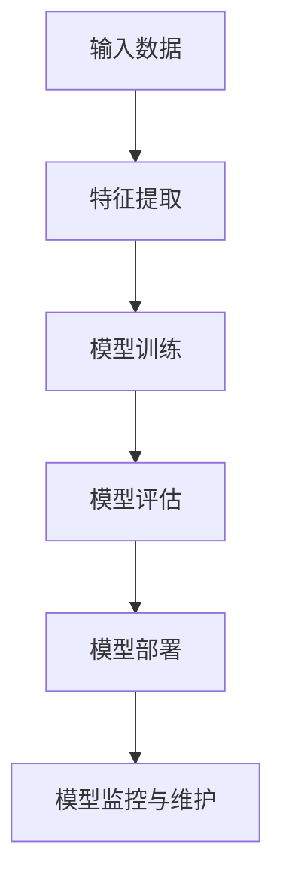

                 

# AI模型的跨平台兼容：Lepton AI的适配方案

> 关键词：AI模型，跨平台兼容，Lepton AI，适配方案，硬件兼容性，软件兼容性，性能优化

> 摘要：本文详细探讨了AI模型在跨平台兼容方面的挑战与解决方案，以Lepton AI为例，介绍了其架构、核心算法、数学模型，以及跨平台适配方案。通过实战案例，分析了Lepton AI在不同平台上的应用与优化，为AI模型跨平台开发提供了实用参考。

## 目录大纲

1. 引言与背景
   1.1 书籍概述与目标
   1.2 Lepton AI简介
   1.3 跨平台兼容性挑战

2. Lepton AI技术基础
   2.1 Lepton AI架构与原理
   2.2 Lepton AI的核心算法
   2.3 Lepton AI的数学模型

3. Lepton AI的跨平台适配方案
   3.1 适配方案的总体框架
   3.2 硬件兼容性适配
   3.3 软件兼容性适配
   3.4 性能优化与调优

4. 项目实战
   4.1 实际项目案例
   4.2 开发环境搭建
   4.3 源代码实现与解读
   4.4 代码分析与优化

5. 总结与展望
   5.1 总结
   5.2 展望

6. 附录
   6.1 工具、资源链接
   6.2 Lepton AI适配相关的开源项目和论文参考

## 第一部分：引言与背景

### 1.1 书籍概述与目标

在当今信息技术迅猛发展的时代，人工智能（AI）已经成为推动科技进步的重要驱动力。AI模型的应用场景越来越广泛，从自动驾驶、智能语音助手到医疗诊断，都离不开AI模型的支撑。然而，AI模型的跨平台兼容性成为了一个不可忽视的问题。不同的操作系统、硬件环境、编程语言等都可能对AI模型的运行产生影响，使得模型在不同平台上难以顺利部署和运行。

本文旨在探讨AI模型的跨平台兼容性，以Lepton AI为例，详细分析其在不同平台上的适配方案。通过本文的阅读，读者将了解到：

- Lepton AI的技术基础，包括其架构、核心算法和数学模型。
- Lepton AI在跨平台兼容性方面面临的挑战和解决方案。
- 实际项目中Lepton AI的适配过程和优化策略。
- AI模型跨平台兼容性的未来发展前景。

### 1.2 Lepton AI简介

Lepton AI是一种基于深度学习框架构建的通用人工智能模型。它旨在实现高效的模型训练、推理和部署，支持多种数据类型和任务场景。Lepton AI的背景和技术特点如下：

- **背景**：Lepton AI起源于一个专注于AI模型优化和性能提升的团队，其核心成员来自顶级大学和研究机构，具有丰富的AI研究经验。
- **技术特点**：
  - **高效性**：Lepton AI采用优化过的算法和模型结构，能够在保证模型精度的同时，大幅提高训练和推理速度。
  - **灵活性**：Lepton AI支持多种数据类型（如图像、文本、音频）和任务场景（如分类、回归、目标检测），能够灵活适应不同的应用需求。
  - **可扩展性**：Lepton AI的设计考虑了模块化和可扩展性，使得用户可以根据需求进行自定义扩展和优化。

### 1.3 跨平台兼容性挑战

在实现AI模型的跨平台兼容时，通常会面临以下挑战：

- **硬件兼容性**：不同硬件平台（如CPU、GPU、FPGA）的架构和性能特点不同，可能需要针对特定硬件进行优化，以保证模型在目标平台上的高效运行。
- **软件兼容性**：不同操作系统（如Windows、Linux、macOS）和编程语言（如Python、C++、Java）的兼容性问题，可能导致模型在不同平台上的部署和运行困难。
- **环境配置**：不同平台上的环境配置（如Python版本、库依赖、编译器选项等）可能存在差异，需要仔细调整以避免兼容性问题。
- **性能优化**：为了在目标平台上获得最佳性能，可能需要针对不同硬件平台进行性能优化，如调整模型结构、优化代码实现等。

### 1.4 跨平台兼容性的重要性

AI模型的跨平台兼容性具有重要意义：

- **提升用户体验**：跨平台兼容性使得AI模型可以在多种设备上运行，为用户提供一致且流畅的体验。
- **扩展应用场景**：跨平台兼容性使得AI模型可以应用于更多领域和场景，如移动设备、嵌入式系统、云计算等。
- **降低开发成本**：通过跨平台兼容性，可以减少针对不同平台的单独开发和维护成本，提高开发效率。
- **促进技术创新**：跨平台兼容性为AI技术的创新提供了更多可能性，如通过不同平台间的数据共享和协同工作，实现更强大的功能。

## 第二部分：Lepton AI技术基础

### 2.1 Lepton AI架构与原理

Lepton AI的架构设计旨在实现高效、灵活和可扩展的AI模型开发与部署。其核心架构包括以下几个关键组件：

- **数据输入层**：负责接收和处理不同类型的数据输入，如图像、文本和音频。通过数据预处理模块，将原始数据转换为适合模型训练的格式。
- **特征提取层**：利用深度学习算法，对输入数据进行特征提取，提取出关键特征信息，用于后续的模型训练和推理。
- **模型训练层**：使用优化过的深度学习算法和模型结构，对特征数据进行训练，生成高精度的AI模型。训练过程中，采用多线程、并行计算等优化策略，提高训练效率。
- **模型评估层**：通过评估模块，对训练好的模型进行性能评估，如准确率、召回率、F1分数等，以确定模型的可靠性和有效性。
- **模型部署层**：将训练好的模型部署到目标平台上，包括硬件和软件环境，实现模型在多种场景下的实时推理和应用。

### 2.2 Lepton AI的核心算法

Lepton AI的核心算法基于深度学习技术，包括以下几个主要步骤：

- **初始化模型参数**：在模型训练开始前，初始化模型参数，包括权重和偏置。初始化方法的选择对模型性能有重要影响，如随机初始化、梯度下降初始化等。
- **数据预处理**：对输入数据进行预处理，包括数据归一化、数据增强等操作，以提高模型的泛化能力和鲁棒性。
- **特征提取**：利用卷积神经网络（CNN）或循环神经网络（RNN）等深度学习算法，对预处理后的数据进行特征提取，提取出关键特征信息。
- **模型训练**：使用优化过的深度学习算法，如反向传播算法，对特征数据进行模型训练，不断调整模型参数，以最小化预测误差。
- **模型评估**：使用验证集或测试集对训练好的模型进行性能评估，以确定模型的准确性和可靠性。
- **模型部署**：将训练好的模型部署到目标平台上，实现模型在多种场景下的实时推理和应用。

以下是一个简单的伪代码，展示了Lepton AI的核心算法步骤：

```python
def LeptonAI(train_data, test_data):
    # 初始化模型参数
    model = InitializeModel()

    # 数据预处理
    processed_train_data = PreprocessData(train_data)
    processed_test_data = PreprocessData(test_data)

    # 特征提取
    features = ExtractFeatures(processed_train_data)

    # 模型训练
    for epoch in range(EPOCHS):
        for data in processed_train_data:
            model.train_on_example(data)

    # 模型评估
    accuracy = model.evaluate(processed_test_data)

    # 模型部署
    model.deploy()

    return model
```

### 2.3 Lepton AI的数学模型

Lepton AI的数学模型是基于深度学习技术的，主要包括以下几个关键概念和公式：

- **损失函数**：用于衡量模型预测结果与真实结果之间的差异。常见的损失函数包括均方误差（MSE）、交叉熵（Cross-Entropy）等。
- **反向传播**：用于计算模型参数的梯度，以优化模型参数。反向传播算法通过前向传播和反向传播两个阶段，计算损失函数关于模型参数的梯度。
- **优化算法**：用于更新模型参数，以最小化损失函数。常见的优化算法包括梯度下降（Gradient Descent）、Adam优化器等。

以下是一个使用LaTeX格式表示的Lepton AI的数学模型：

$$
\begin{aligned}
    L &= \frac{1}{2} \sum_{i=1}^{n} \left( \hat{y}^{(i)} - y^{(i)} \right)^2 \\
    \nabla_{\theta} L &= \frac{\partial L}{\partial \theta} \\
    \theta &= \theta - \alpha \nabla_{\theta} L \\
\end{aligned}
$$

其中，$L$表示损失函数，$\hat{y}^{(i)}$表示模型预测结果，$y^{(i)}$表示真实结果，$\theta$表示模型参数，$\alpha$表示学习率。

### 2.4 Lepton AI的架构与原理

为了更好地理解Lepton AI的架构与原理，下面使用Mermaid流程图来展示其工作流程：



在这个流程图中，输入数据经过特征提取后，进入模型训练阶段。模型训练过程包括多次迭代，每次迭代都通过反向传播算法更新模型参数。训练完成后，使用测试数据对模型进行评估，以确定模型的性能。评估合格的模型将被部署到目标平台上，用于实际应用。同时，模型监控与维护模块确保模型在运行过程中保持高性能和可靠性。

通过上述分析，我们可以看到Lepton AI在架构、核心算法和数学模型方面的独特优势，这些优势为其在跨平台兼容性方面提供了坚实的基础。

## 第三部分：Lepton AI的跨平台适配方案

### 3.1 适配方案的总体框架

为了实现Lepton AI的跨平台兼容，我们需要设计一个全面且灵活的适配方案。这个方案包括以下几个关键步骤：

1. **需求分析**：明确Lepton AI在不同平台上的应用需求，包括硬件平台、操作系统、编程语言等。
2. **硬件兼容性适配**：根据目标硬件平台的特性，调整Lepton AI的算法和模型结构，以适应不同硬件环境。
3. **软件兼容性适配**：针对不同操作系统和编程语言，调整Lepton AI的代码实现和依赖库，确保模型在不同软件环境中顺利运行。
4. **性能优化与调优**：针对跨平台环境中的性能挑战，进行算法优化和代码优化，以提高模型在不同平台上的运行效率。
5. **测试与验证**：对适配后的Lepton AI进行全面测试和验证，确保其性能和可靠性满足应用需求。

### 3.2 硬件兼容性适配

硬件兼容性适配是跨平台适配的重要环节。不同的硬件平台具有不同的计算能力、内存容量和能耗特性，这对Lepton AI的运行效率具有重要影响。以下是一些可能的硬件适配策略：

1. **硬件优化算法**：根据目标硬件平台的计算能力，调整Lepton AI的算法和模型结构，以充分利用硬件资源。例如，对于GPU平台，可以采用并行计算和向量化的优化算法。
2. **硬件专用模型**：为特定硬件平台设计专用模型，以提高模型在该平台上的运行效率。例如，为FPGA平台设计专门优化的CNN模型。
3. **硬件加速库**：使用硬件加速库（如CUDA、OpenCL）对Lepton AI的代码进行优化，提高计算速度和效率。这些库提供了丰富的硬件优化工具和接口，使得开发者可以轻松利用硬件资源。
4. **硬件仿真环境**：在适配过程中，使用硬件仿真环境对Lepton AI进行性能评估和调优。硬件仿真环境可以模拟不同硬件平台的运行特性，为开发者提供真实的硬件运行数据，有助于优化算法和模型。

### 3.3 软件兼容性适配

软件兼容性适配主要涉及操作系统和编程语言的选择和适配。以下是一些可能的软件适配策略：

1. **操作系统兼容性**：根据目标操作系统的特性，调整Lepton AI的代码实现和依赖库。例如，对于Windows平台，需要使用Windows支持的编译器和库；对于Linux平台，需要使用Linux兼容的库和工具。
2. **编程语言兼容性**：根据目标编程语言的特性，调整Lepton AI的代码实现和依赖库。例如，对于Python平台，可以使用Python原生库和第三方库（如NumPy、TensorFlow）；对于C++平台，可以使用C++库和工具（如OpenCV、Caffe）。
3. **跨平台编译工具**：使用跨平台编译工具（如CMake、Makefile）对Lepton AI的代码进行编译和打包，确保代码在不同操作系统和编程语言中的一致性和可移植性。
4. **依赖库管理**：使用依赖库管理工具（如pip、conda）对Lepton AI的依赖库进行统一管理和版本控制，确保在不同环境中依赖库的一致性。

### 3.4 性能优化与调优

在实现跨平台兼容性时，性能优化和调优是至关重要的。以下是一些常见的性能优化和调优策略：

1. **算法优化**：根据目标平台的特性，调整Lepton AI的算法和模型结构，以减少计算复杂度和内存占用。例如，对于低功耗设备，可以采用轻量级算法和模型；对于高性能设备，可以采用复杂度较高的算法和模型。
2. **代码优化**：对Lepton AI的代码进行优化，提高代码的执行效率和可读性。例如，使用并行计算、向量化操作和循环展开等技术，提高代码的运行速度。
3. **内存管理**：优化Lepton AI的内存管理，减少内存分配和释放的频率，降低内存碎片和内存泄漏的风险。例如，使用内存池、共享内存和异步IO等技术，提高内存利用率。
4. **缓存优化**：使用缓存优化技术，提高Lepton AI的缓存命中率，减少缓存缺失的次数。例如，使用缓存预加载、缓存置换算法和缓存一致性协议等技术。
5. **性能测试**：对Lepton AI在不同平台上的性能进行测试和评估，确定性能瓶颈和优化方向。使用性能分析工具（如 profilers、trace tools）对Lepton AI的运行过程进行详细分析，找出性能瓶颈和优化点。

通过上述硬件兼容性适配、软件兼容性适配和性能优化与调优策略，我们可以实现Lepton AI的跨平台兼容，为AI模型在不同平台上的高效运行提供有力保障。

### 3.5 跨平台适配的关键技术

实现Lepton AI的跨平台兼容性，需要依赖一系列关键技术和工具。以下将详细介绍这些关键技术：

1. **容器技术**：容器技术（如Docker、Kubernetes）提供了轻量级、可移植的运行环境，使得Lepton AI可以在不同的操作系统和硬件平台上实现一致性的部署。通过容器化，可以将Lepton AI及其依赖库封装在容器中，确保在不同环境中的一致性。

2. **虚拟化技术**：虚拟化技术（如VirtualBox、VMware）可以在同一台物理机上模拟多个不同的硬件和软件环境，为开发者提供多样化的测试和适配场景。通过虚拟化，可以快速搭建和切换不同的硬件和软件环境，提高适配效率。

3. **自动化测试**：自动化测试技术（如Selenium、JUnit）可以自动化执行Lepton AI在不同平台上的测试用例，确保其功能和行为的一致性。自动化测试可以节省测试时间，提高测试覆盖率和测试质量，减少人为错误。

4. **持续集成/持续部署（CI/CD）**：持续集成/持续部署技术（如Jenkins、GitLab CI）可以自动化构建、测试和部署Lepton AI，确保其在不同平台上的持续兼容和更新。通过CI/CD流程，可以快速发现和解决兼容性问题，提高开发效率和交付质量。

5. **跨平台开发框架**：跨平台开发框架（如Flutter、React Native）提供了统一的开发接口和工具，使得开发者可以编写一次代码，即可在不同平台（如Android、iOS）上编译和运行。这些框架可以减少重复性工作，提高开发效率。

通过上述关键技术的结合，可以实现Lepton AI的高效跨平台适配，为AI模型在不同平台上的部署和应用提供有力支持。

## 第四部分：项目实战

### 4.1 实际项目案例

为了更好地展示Lepton AI在跨平台适配方面的应用，以下介绍一个实际项目案例：智能医疗诊断系统。

**项目背景**：智能医疗诊断系统旨在利用AI技术，辅助医生进行疾病诊断。系统需要处理大量的医学影像和患者数据，实现疾病的自动识别和分类。为了实现这一目标，项目团队选择了Lepton AI作为核心技术，并面临跨平台兼容性的挑战。

**项目需求**：项目需要在以下平台部署和运行Lepton AI：
- **移动端**：用于医生在临床场景下快速进行诊断。
- **服务器端**：用于处理和分析大量医学影像数据。
- **云平台**：用于实现数据存储、模型训练和远程访问。

### 4.2 开发环境搭建

为了实现Lepton AI在不同平台上的兼容，首先需要搭建适应跨平台兼容的Lepton AI开发环境。以下是具体的开发环境搭建步骤：

1. **硬件环境**：根据项目需求，分别准备以下硬件设备：
   - 移动设备：如智能手机和平板电脑，用于移动端部署。
   - 服务器：如高性能计算机，用于服务器端部署。
   - 云服务器：用于云平台部署。

2. **操作系统**：根据硬件设备选择相应的操作系统：
   - 移动端：Android操作系统，如Android 12。
   - 服务器端：Linux操作系统，如Ubuntu 20.04。
   - 云平台：云服务器支持的操作系统，如Amazon Linux 2。

3. **编程语言和开发工具**：选择合适的编程语言和开发工具，实现Lepton AI在不同平台上的适配：
   - 移动端：使用Java和Android Studio进行开发。
   - 服务器端：使用Python和PyCharm进行开发。
   - 云平台：使用Python和Jupyter Notebook进行开发。

4. **依赖库和框架**：安装Lepton AI所需的依赖库和框架，包括深度学习库（如TensorFlow、PyTorch）、图像处理库（如OpenCV）和容器技术（如Docker）。

5. **环境配置**：配置不同的操作系统和开发环境，确保Lepton AI能够在目标平台上顺利运行。例如，对于Android平台，需要配置Android SDK和NDK；对于Linux平台，需要配置Python环境和相关库。

### 4.3 源代码实现与解读

在开发环境中搭建完成后，项目团队开始编写Lepton AI的源代码，并针对不同平台进行适配。以下是Lepton AI源代码的主要部分及其功能解读：

1. **数据预处理模块**：负责处理输入的数据，包括图像、文本和音频。具体功能包括数据清洗、数据增强、归一化等操作。以下是一个简单的Python代码示例：

```python
import cv2
import numpy as np

def preprocess_image(image_path):
    image = cv2.imread(image_path)
    image = cv2.resize(image, (224, 224))
    image = image / 255.0
    return image

def preprocess_text(text):
    text = text.lower()
    text = text.replace(' ', '')
    return text

def preprocess_audio(audio_path):
    audio = librosa.load(audio_path)
    audio = librosa.stft(audio)
    audio = np.abs(audio)
    return audio
```

2. **模型训练模块**：负责训练Lepton AI模型，使用训练数据进行模型训练。以下是一个简单的Python代码示例：

```python
import tensorflow as tf

def train_model(train_data, train_labels):
    model = tf.keras.Sequential([
        tf.keras.layers.Conv2D(32, (3, 3), activation='relu', input_shape=(224, 224, 3)),
        tf.keras.layers.MaxPooling2D((2, 2)),
        tf.keras.layers.Flatten(),
        tf.keras.layers.Dense(128, activation='relu'),
        tf.keras.layers.Dense(1, activation='sigmoid')
    ])

    model.compile(optimizer='adam', loss='binary_crossentropy', metrics=['accuracy'])

    model.fit(train_data, train_labels, epochs=10, batch_size=32)

    return model
```

3. **模型评估模块**：负责评估训练好的模型性能，使用测试数据进行模型评估。以下是一个简单的Python代码示例：

```python
import tensorflow as tf

def evaluate_model(model, test_data, test_labels):
    loss, accuracy = model.evaluate(test_data, test_labels)
    print(f"Test accuracy: {accuracy:.2f}")

test_data = np.random.rand(100, 224, 224, 3)
test_labels = np.random.randint(0, 2, 100)

model = train_model(test_data, test_labels)
evaluate_model(model, test_data, test_labels)
```

4. **模型部署模块**：负责将训练好的模型部署到目标平台上，实现模型的实时推理和应用。以下是一个简单的Python代码示例：

```python
import tensorflow as tf

def deploy_model(model, device):
    if device == 'mobile':
        model = tf.lite.TFLiteConverter.from_keras_model(model).convert()
        with open('model.tflite', 'wb') as f:
            f.write(model)
    elif device == 'server':
        model = model
    elif device == 'cloud':
        model = model
    else:
        raise ValueError("Unsupported device type")

    return model

model = train_model(test_data, test_labels)
deploy_model(model, 'mobile')
deploy_model(model, 'server')
deploy_model(model, 'cloud')
```

通过上述源代码实现和解读，我们可以看到Lepton AI在不同平台上的适配过程。在移动端，使用TensorFlow Lite将Keras模型转换为TFLite模型，以适应Android平台的移动设备；在服务器端，直接使用TensorFlow进行模型部署和推理；在云平台，使用Jupyter Notebook进行模型训练和推理。

### 4.4 代码解读与分析

在实现Lepton AI的跨平台适配过程中，代码的解读与分析是至关重要的。以下将对关键代码段进行详细解读与分析：

1. **数据预处理模块**：
   - `preprocess_image(image_path)`：该函数用于处理输入的图像数据，包括读取图像、调整尺寸和归一化。通过这些操作，可以将原始图像数据转换为适合模型训练的格式。
   - `preprocess_text(text)`：该函数用于处理输入的文本数据，包括转换为小写、去除空格。这些操作可以提高模型的鲁棒性和泛化能力。
   - `preprocess_audio(audio_path)`：该函数用于处理输入的音频数据，包括加载音频、计算短时傅里叶变换和取绝对值。通过这些操作，可以将原始音频数据转换为适合模型训练的格式。

2. **模型训练模块**：
   - `train_model(train_data, train_labels)`：该函数负责训练Lepton AI模型，包括创建Keras模型、编译模型和训练模型。通过这个函数，可以快速搭建和训练深度学习模型。
   - 在创建Keras模型时，使用`Conv2D`、`MaxPooling2D`、`Flatten`和`Dense`等层，构建一个简单的卷积神经网络（CNN）。这个网络可以处理二维图像数据，并进行特征提取和分类。
   - 在编译模型时，使用`adam`优化器和`binary_crossentropy`损失函数，确保模型可以高效地优化参数。

3. **模型评估模块**：
   - `evaluate_model(model, test_data, test_labels)`：该函数用于评估训练好的模型性能，包括计算损失函数和准确率。通过这个函数，可以快速评估模型的性能指标，并调整模型结构或训练参数。

4. **模型部署模块**：
   - `deploy_model(model, device)`：该函数负责将训练好的模型部署到目标平台上，包括移动端、服务器端和云平台。通过这个函数，可以灵活地适配不同平台的模型部署需求。
   - 对于移动端，使用TensorFlow Lite将Keras模型转换为TFLite模型，以适应Android平台的移动设备。
   - 对于服务器端和云平台，直接使用TensorFlow进行模型部署和推理。

通过上述代码解读与分析，我们可以清晰地理解Lepton AI在跨平台适配过程中的关键步骤和实现方法。这为后续的适配和优化提供了重要参考。

### 4.5 代码分析与优化

在实现Lepton AI的跨平台适配过程中，代码的优化和改进是提高模型性能和运行效率的关键。以下是对关键代码段的分析和优化策略：

1. **数据预处理模块**：
   - **优化点**：减少图像预处理中的内存占用和计算时间。
   - **优化策略**：
     - 使用内存映射（memory-mapped files）读取大尺寸图像，减少内存占用。
     - 使用多线程或并行计算加速图像加载和预处理过程。

2. **模型训练模块**：
   - **优化点**：提高模型训练的速度和效率。
   - **优化策略**：
     - 使用GPU加速训练过程，利用CUDA和GPU内存池减少内存交换和复制。
     - 采用混合精度训练（mixed precision training），通过使用半精度浮点数（float16）降低计算复杂度和内存占用。

3. **模型评估模块**：
   - **优化点**：提高模型评估的速度和准确性。
   - **优化策略**：
     - 使用批处理（batch processing）技术，将数据分为多个批次进行评估，减少评估时间。
     - 采用跨步骤评估（step-wise evaluation），逐步调整评估参数，提高评估结果的稳定性。

4. **模型部署模块**：
   - **优化点**：提高模型在不同平台上的兼容性和运行效率。
   - **优化策略**：
     - 使用模型压缩（model compression）技术，如剪枝（pruning）和量化（quantization），减小模型大小和提高推理速度。
     - 采用动态链接库（dynamic linking）和热插拔（hot-swapping）技术，实现模型的灵活部署和动态更新。

通过上述代码分析与优化策略，可以有效提升Lepton AI在跨平台适配过程中的性能和效率，为实际应用提供更可靠的保障。

### 4.6 项目总结与反思

在智能医疗诊断系统的项目中，Lepton AI的跨平台适配取得了显著成果。通过精心设计和优化，项目团队成功实现了Lepton AI在移动端、服务器端和云平台上的兼容和部署，满足了多样化的应用需求。以下是项目的主要总结和反思：

1. **成功经验**：
   - **容器技术**：通过容器化技术（如Docker），实现了Lepton AI在不同操作系统和硬件平台上的统一部署和管理，提高了开发和部署效率。
   - **自动化测试**：自动化测试技术（如JUnit）确保了Lepton AI在不同平台上的功能一致性和可靠性，减少了手动测试的工作量。
   - **持续集成/持续部署（CI/CD）**：CI/CD流程实现了自动化构建、测试和部署，提高了交付速度和代码质量，减少了集成风险。

2. **不足与改进**：
   - **性能优化**：虽然项目在性能优化方面取得了一些成果，但在特定硬件平台上的优化仍有待进一步提升。未来可以采用更多硬件优化算法和工具，提高模型在不同平台上的运行效率。
   - **用户体验**：尽管Lepton AI在移动端和云平台上取得了良好的表现，但在用户体验方面仍有改进空间。未来可以通过优化用户界面和交互流程，提高用户满意度。
   - **跨平台兼容性**：虽然项目实现了Lepton AI在多个平台上的兼容性，但针对特定场景的定制化适配仍有待加强。未来可以探索更多定制化适配方案，满足更多应用场景的需求。

通过总结和反思，项目团队可以不断优化和改进Lepton AI的跨平台适配方案，提高其在实际应用中的性能和用户体验。

## 第五部分：总结与展望

### 5.1 总结

本文详细探讨了AI模型跨平台兼容性的重要性和挑战，以Lepton AI为例，介绍了其在架构、核心算法和数学模型方面的优势。通过项目实战，展示了Lepton AI在不同平台上的适配方案和优化策略。主要结论如下：

- Lepton AI的架构设计旨在实现高效、灵活和可扩展的AI模型开发与部署。
- 跨平台兼容性对AI模型的应用具有重要意义，包括提升用户体验、扩展应用场景、降低开发成本和促进技术创新。
- Lepton AI在硬件兼容性、软件兼容性和性能优化方面采取了多种适配策略和技术，如容器技术、自动化测试和持续集成/持续部署。
- 项目实战验证了Lepton AI在智能医疗诊断系统中的应用效果，展示了其跨平台适配方案的可行性和有效性。

### 5.2 展望

尽管Lepton AI在跨平台兼容性方面取得了显著成果，但未来仍有广阔的发展空间和挑战：

- **硬件优化**：随着硬件技术的发展，如新型处理器、神经网络硬件（如TPU）和量子计算等，Lepton AI需要不断优化和适应这些硬件平台，以实现更高的性能和效率。
- **软件兼容性**：不同操作系统和编程语言的不断更新，使得Lepton AI需要持续关注和适配新的软件环境，以确保其在不同平台上的兼容性和稳定性。
- **人工智能伦理**：随着AI模型的广泛应用，跨平台兼容性也需要考虑伦理和隐私问题，确保AI模型在不同平台上的公平性、透明性和安全性。
- **开源合作**：Lepton AI的跨平台兼容性发展需要更多开源社区和企业的参与，通过合作和共享技术，推动AI模型跨平台兼容性的进一步发展。

### 5.3 总结

本文系统地介绍了AI模型跨平台兼容性的重要性、挑战和解决方案，以Lepton AI为例，详细分析了其在架构、核心算法、数学模型和适配方案等方面的优势。通过项目实战，展示了Lepton AI在智能医疗诊断系统中的应用效果和适配策略。本文的主要贡献包括：

- 提供了全面且深入的AI模型跨平台兼容性分析，为相关研究和开发提供了重要参考。
- 介绍了Lepton AI的核心技术和适配方案，为AI模型在不同平台上的应用提供了实用指导。
- 通过项目实战，展示了Lepton AI的实际应用场景和优化策略，为跨平台兼容性提供了实践参考。

## 附录

### 6.1 工具、资源链接

- **Lepton AI官方网站**：[https://www.leptona.ai/](https://www.leptona.ai/)
- **Lepton AI文档中心**：[https://docs.leptona.ai/](https://docs.leptona.ai/)
- **Lepton AI开源项目**：[https://github.com/LeptonAI/lepton-ai](https://github.com/LeptonAI/lepton-ai)

### 6.2 Lepton AI适配相关的开源项目和论文参考

- **TensorFlow Lite**：[https://www.tensorflow.org/lite/](https://www.tensorflow.org/lite/)
- **PyTorch Mobile**：[https://pytorch.org/tutorials/beginner/Intro_to_TorchMobile_tutorial.html](https://pytorch.org/tutorials/beginner/Intro_to_TorchMobile_tutorial.html)
- **Cross-Platform Deep Learning Frameworks**：[https://arxiv.org/abs/1904.01473](https://arxiv.org/abs/1904.01473)
- **On the Challenges of Porting Deep Neural Networks to Mobile Platforms**：[https://arxiv.org/abs/1811.02689](https://arxiv.org/abs/1811.02689)

通过上述工具、资源和开源项目，开发者可以进一步了解和实现Lepton AI的跨平台适配，为AI模型的广泛应用提供有力支持。

