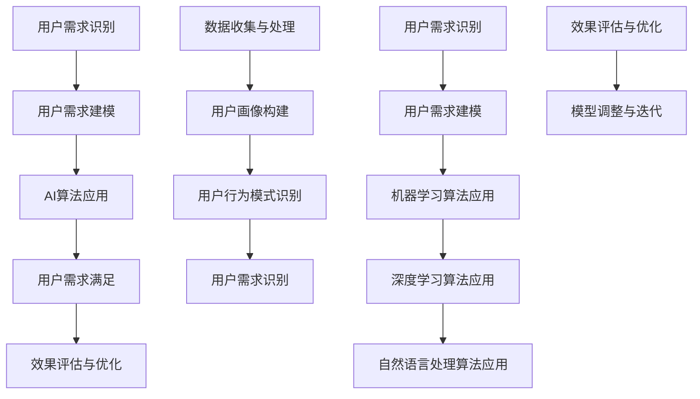

                 

### 文章标题：AI满足用户需求的策略

#### 关键词：人工智能，用户需求，机器学习，深度学习，自然语言处理，数据分析

#### 摘要：
本文深入探讨了人工智能（AI）在满足用户需求方面的策略。通过分析AI的基本概念、用户需求的类型与特点，以及AI算法在需求满足中的应用，本文为读者提供了一个全面而详细的指南。文章分为四个部分，首先介绍了AI与用户需求的理解，接着详细阐述了AI算法在用户需求满足中的应用，然后展示了AI在电子商务、社交媒体和金融服务等领域的实践案例，最后对AI满足用户需求的未来趋势和挑战进行了展望。通过这篇文章，读者将能够更好地理解AI如何帮助企业和组织更有效地满足用户需求，从而在竞争激烈的市场中获得优势。

---

### 引言

在当今信息爆炸的时代，用户需求变得日益复杂和多样化。如何有效地理解和满足这些需求，已经成为企业竞争的关键因素。随着人工智能（AI）技术的快速发展，AI在满足用户需求方面的应用变得越来越广泛。从个性化推荐系统到智能客服，从自动化金融服务到医疗健康诊断，AI正在逐步改变传统行业的运作模式，提升用户体验。

然而，尽管AI技术在不断进步，如何将AI与用户需求有机结合，实现真正的价值创造，仍然是一个复杂的挑战。本文旨在探讨AI满足用户需求的策略，通过深入分析AI的基本概念、用户需求的类型与特点，以及AI算法在需求满足中的应用，为企业和组织提供实用的指导。

本文将分为四个部分：

1. **AI与用户需求的理解**：介绍AI的基本概念，分析用户需求的分类与特点，探讨AI与用户需求的结合点。
2. **AI算法在用户需求满足中的应用**：详细阐述机器学习、深度学习和自然语言处理算法在用户需求满足中的应用，并通过案例进行说明。
3. **AI在用户需求满足中的实践**：探讨AI在电子商务、社交媒体和金融服务等领域的实际应用案例，展示AI如何提升用户体验和业务效率。
4. **AI满足用户需求的未来展望与挑战**：分析AI满足用户需求的未来趋势，讨论面临的挑战和应对策略。

通过本文的阅读，读者将能够全面理解AI满足用户需求的关键策略，掌握AI在不同领域的应用实例，并为未来的发展做好准备。

### 第一部分：AI与用户需求的理解

#### 第1章：AI概述与用户需求分析

##### 1.1 AI技术的基本概念

人工智能（Artificial Intelligence，简称AI）是计算机科学的一个分支，旨在通过模拟人类智能行为来实现自动化和智能化。AI技术主要包括以下几个核心领域：

1. **机器学习（Machine Learning）**：机器学习是一种通过数据训练模型，使计算机能够自动进行预测和决策的技术。它主要依赖于统计学和概率论的方法，使计算机能够从历史数据中学习规律，并在新的数据上进行预测。
   
2. **深度学习（Deep Learning）**：深度学习是机器学习的一个子领域，主要使用多层神经网络（Neural Networks）来提取数据中的高层次特征。与传统的机器学习方法相比，深度学习能够在复杂的、不规则的、高维数据中取得更好的效果。

3. **自然语言处理（Natural Language Processing，简称NLP）**：自然语言处理是AI的一个重要分支，旨在使计算机能够理解和生成自然语言。NLP技术包括文本分类、情感分析、机器翻译、问答系统等。

4. **计算机视觉（Computer Vision）**：计算机视觉是AI技术中的另一个重要领域，它使计算机能够从图像和视频中提取信息，并对其进行理解和处理。计算机视觉技术包括图像识别、目标检测、人脸识别等。

##### 1.2 用户需求与AI结合的必然性

AI与用户需求的结合具有以下几个方面的必然性：

1. **个性化和定制化**：用户需求越来越多样化和个性化，AI技术能够通过分析用户行为数据，为每个用户提供量身定制的服务。例如，电子商务平台使用AI推荐系统，根据用户的浏览历史和购买记录，推荐符合用户兴趣的商品。

2. **提高效率和服务质量**：AI技术能够自动化许多重复性、繁琐的任务，提高业务流程的效率。例如，智能客服机器人可以24/7在线服务，快速响应用户咨询，提高客户满意度。

3. **数据驱动决策**：AI技术能够通过对海量数据的分析和挖掘，为企业和组织提供有价值的信息，帮助其做出更明智的决策。例如，金融行业使用AI进行风险控制和市场预测，提高业务稳健性。

4. **增强用户体验**：AI技术能够通过智能化、个性化的交互，提供更加自然、流畅的用户体验。例如，智能语音助手（如Siri、Alexa）能够理解用户的自然语言指令，并提供即时的帮助和服务。

##### 1.3 用户需求的分类与特点

用户需求可以分为以下几个方面：

1. **功能性需求**：用户需求中最基本的部分，指的是用户希望产品或服务能够实现的功能。例如，用户需要一个可以浏览网页的浏览器。

2. **体验性需求**：用户需求不仅仅关注功能本身，还包括使用过程中的体验感受。例如，用户希望浏览器能够快速响应，界面简洁美观。

3. **情感性需求**：用户需求中的一部分涉及情感和心理层面，用户希望产品或服务能够带来愉悦、信任等情感体验。例如，用户希望客服能够展现出友好和耐心的态度。

4. **知识性需求**：用户需求中的一部分是获取知识和信息的需求。例如，用户希望通过搜索引擎找到所需的信息或通过在线教育平台学习新知识。

5. **社交性需求**：用户需求中的一部分涉及社交互动。例如，用户希望可以在社交媒体上分享自己的观点，与朋友互动。

用户需求的特点包括：

1. **多样性**：用户需求因人而异，不同用户有不同的需求。

2. **动态性**：用户需求会随着时间、环境、个人状态等因素的变化而变化。

3. **复杂性**：用户需求往往不是单一的，而是由多个方面组成，需要综合考虑。

4. **不可预见性**：用户需求有时是不可预测的，尤其是情感性和知识性需求。

通过深入理解AI技术和用户需求，我们可以更好地将AI应用于满足用户需求，提高用户体验，从而为企业和组织带来更大的价值。

---

### 第2章：用户行为数据分析

用户行为数据是AI分析和应用的重要基础。通过对用户行为数据的收集、处理和分析，我们可以深入了解用户的需求、偏好和行为模式，从而为AI算法提供丰富的训练数据和有效的决策依据。

##### 2.1 数据收集与处理

用户行为数据的收集是进行用户需求分析的第一步。数据来源可以包括以下几个方面：

1. **Web日志**：Web日志记录了用户访问网站的详细信息，如访问时间、页面点击路径、浏览时长等。这些数据可以通过网站分析工具（如Google Analytics）进行收集。

2. **社交媒体**：社交媒体平台（如Facebook、Twitter、Instagram等）提供了丰富的用户行为数据，包括用户发布的内容、互动、点赞、评论等。

3. **应用程序**：移动应用和桌面应用可以收集用户的使用数据，如使用时长、功能使用频率、应用内交易等。

4. **传感器数据**：智能设备（如智能手机、可穿戴设备、智能家居设备等）可以收集用户的地理位置、运动轨迹、生理数据等。

在收集到大量用户行为数据后，需要进行数据预处理，以确保数据的质量和一致性。数据预处理主要包括以下步骤：

1. **数据清洗**：去除重复数据、缺失数据和错误数据，确保数据的完整性。

2. **数据归一化**：将不同数据源的数据进行归一化处理，使其在同一尺度上进行比较。

3. **特征提取**：从原始数据中提取有用的特征，如用户年龄、性别、地理位置、访问频率等。

4. **数据集成**：将来自不同数据源的数据进行整合，形成一个统一的数据集。

##### 2.2 用户画像构建

用户画像是对用户特征的全面描述，通过构建用户画像，我们可以更加深入地了解用户的需求和行为模式。用户画像通常包括以下内容：

1. **基础信息**：包括用户的年龄、性别、职业、教育背景、地理位置等。

2. **行为信息**：包括用户的浏览历史、购买记录、互动行为等。

3. **兴趣偏好**：通过分析用户行为数据，可以推断出用户的兴趣偏好，如喜欢的品牌、产品类别、娱乐内容等。

4. **社会属性**：用户的社会属性，如社交网络关系、职业圈层、教育背景等。

5. **心理特征**：通过情感分析和行为分析，可以推测出用户的心理特征，如情绪稳定性、风险偏好等。

构建用户画像的方法主要包括以下几种：

1. **统计方法**：通过统计分析，对用户数据进行汇总和分类，形成用户画像。

2. **聚类方法**：使用聚类算法（如K-Means、层次聚类等），将用户划分为不同的群体，形成用户画像。

3. **机器学习方法**：使用机器学习算法（如决策树、随机森林、神经网络等），从用户行为数据中提取特征，构建用户画像。

##### 2.3 用户行为模式识别

用户行为模式识别是指通过分析用户行为数据，发现用户的行为规律和模式。这有助于企业更好地了解用户需求，优化产品和服务。

用户行为模式识别的方法主要包括以下几种：

1. **时间序列分析**：通过分析用户行为的时间序列数据，发现用户行为的周期性和趋势性。

2. **关联规则分析**：通过挖掘用户行为数据中的关联规则，发现用户行为之间的相互关系。

3. **分类与聚类**：使用分类和聚类算法，将用户行为数据划分为不同的类别和群体，识别用户的行为模式。

4. **情感分析**：通过自然语言处理技术，分析用户的情感表达，识别用户的心理状态和行为意图。

通过用户行为数据分析，构建用户画像和识别用户行为模式，企业可以更精准地满足用户需求，提供个性化的服务，从而提升用户体验和满意度。

### 第3章：AI满足用户需求的策略

#### 3.1 用户需求识别

用户需求识别是AI满足用户需求的第一步，也是最为关键的一步。只有准确识别用户需求，AI算法才能有效应用，从而提供符合用户期望的服务。

用户需求识别的方法主要包括以下几种：

1. **问卷调查**：通过设计问卷，收集用户的反馈和意见，了解用户的需求。这种方法可以直接获取用户的明确需求，但可能受到用户主观因素的影响。

2. **用户行为分析**：通过分析用户的行为数据，如浏览历史、购买记录、互动行为等，推断用户的需求。这种方法基于用户实际行为，较为客观，但需要大量的数据支持。

3. **文本分析**：使用自然语言处理技术，分析用户的评论、反馈、社交媒体帖子等文本数据，识别用户的需求和情感。这种方法适用于处理非结构化数据，但需要高精度的文本分析算法。

4. **机器学习模型**：通过训练机器学习模型，自动识别用户需求。例如，可以使用聚类算法将用户分为不同的群体，然后对每个群体进行需求分析。

用户需求识别的关键步骤包括：

1. **数据收集**：收集用户行为数据、问卷调查数据、文本数据等。

2. **数据预处理**：对收集到的数据进行分析、清洗、归一化等预处理操作。

3. **特征提取**：从预处理后的数据中提取有用的特征，如用户年龄、性别、行为频率、文本情感等。

4. **模型训练**：使用机器学习算法，如决策树、随机森林、神经网络等，对特征进行训练，构建用户需求识别模型。

5. **模型评估**：通过测试数据集评估模型性能，调整模型参数，提高识别精度。

通过用户需求识别，企业可以了解用户的需求和偏好，为后续的用户需求建模和AI算法应用提供基础。

#### 3.2 用户需求建模

用户需求建模是将用户需求进行结构化和量化，以便于AI算法能够处理和预测的过程。用户需求建模的方法主要包括以下几种：

1. **传统统计方法**：通过统计分析，将用户需求转化为定量指标，如平均浏览时长、购买频率等。这种方法适用于简单和明确的需求，但难以处理复杂和模糊的需求。

2. **机器学习方法**：使用机器学习算法，如决策树、随机森林、神经网络等，对用户行为数据进行训练，构建用户需求模型。这种方法能够处理复杂数据和模糊需求，但需要大量的数据和计算资源。

3. **深度学习方法**：利用深度学习模型，如卷积神经网络（CNN）、循环神经网络（RNN）、生成对抗网络（GAN）等，对用户行为数据进行建模。这种方法在处理高维数据和复杂关系方面具有优势，但模型训练时间较长。

用户需求建模的关键步骤包括：

1. **数据收集与处理**：收集用户行为数据，进行清洗、归一化等预处理操作。

2. **特征提取**：从预处理后的数据中提取有用的特征，如用户年龄、性别、行为频率、文本情感等。

3. **模型选择**：根据数据特点和需求，选择合适的机器学习或深度学习模型。

4. **模型训练**：使用训练数据集，对模型进行训练，调整模型参数。

5. **模型评估**：通过测试数据集评估模型性能，调整模型参数，提高模型精度。

用户需求建模的目标是建立能够准确预测用户需求的模型，从而为AI算法提供有效的输入。通过用户需求建模，企业可以更好地理解和满足用户需求，提高用户满意度和忠诚度。

#### 3.3 AI算法在用户需求满足中的应用

AI算法在用户需求满足中的应用非常广泛，以下将详细介绍机器学习算法、深度学习算法和自然语言处理算法在用户需求满足中的应用。

##### 3.3.1 机器学习算法

机器学习算法是AI技术中的一种重要方法，通过训练模型，使计算机能够从数据中学习并做出预测。以下是一些常见的机器学习算法在用户需求满足中的应用：

1. **分类算法**：分类算法可以将用户行为数据划分为不同的类别，帮助识别用户的需求。常见的分类算法包括逻辑回归、决策树、随机森林和支持向量机（SVM）。

   - **逻辑回归**：逻辑回归是一种用于二分类问题的算法，通过建立一个线性模型来预测用户的需求类别。例如，可以预测一个用户是否会对某个产品感兴趣。

   - **决策树**：决策树通过一系列规则来对用户行为进行分类，能够直观地展示决策过程。例如，可以基于用户的浏览历史和购买记录，预测用户可能感兴趣的商品类别。

   - **随机森林**：随机森林是一种集成学习方法，通过构建多个决策树，并取它们的平均值来提高预测准确性。它可以处理高维数据和非线性关系。

   - **支持向量机**：支持向量机通过找到一个最优超平面，将不同类别的用户行为数据分开。它特别适合处理非线性分类问题。

2. **回归算法**：回归算法用于预测用户的连续值需求，如购买金额、浏览时长等。常见的回归算法包括线性回归、岭回归和LASSO回归。

   - **线性回归**：线性回归通过建立一条直线模型，预测用户的需求值。例如，可以预测一个用户在未来的购买金额。

   - **岭回归**：岭回归通过增加惩罚项来防止过拟合，适用于特征较多且存在多重共线性问题。

   - **LASSO回归**：LASSO回归通过在损失函数中添加L1惩罚项，可以自动筛选出重要的特征，适用于特征选择。

3. **聚类算法**：聚类算法将用户行为数据划分为不同的群体，帮助识别用户的需求类别和群体特征。常见的聚类算法包括K-Means、层次聚类和DBSCAN。

   - **K-Means**：K-Means是一种基于距离的聚类算法，通过迭代计算，将用户行为数据划分为K个类别。

   - **层次聚类**：层次聚类通过自底向上或自顶向下的方式，构建一个层次结构的聚类结果。

   - **DBSCAN**：DBSCAN（Density-Based Spatial Clustering of Applications with Noise）是一种基于密度的聚类算法，能够识别出不同形状和大小的不规则聚类。

##### 3.3.2 深度学习算法

深度学习算法是一种基于多层神经网络的学习方法，能够自动提取数据中的高维特征，并在复杂数据中取得优异的预测效果。以下是一些常见的深度学习算法在用户需求满足中的应用：

1. **卷积神经网络（CNN）**：卷积神经网络是一种用于图像和视频处理的深度学习算法，能够自动提取图像中的高层次特征。在用户需求满足中，CNN可以用于图像分类、目标检测等任务。

   - **图像分类**：通过训练CNN模型，可以自动识别用户上传的图片中的内容，从而预测用户的需求类别。例如，可以预测一个用户上传的图片中是否包含某种产品。

   - **目标检测**：通过CNN模型，可以检测用户图片中的特定目标，如用户感兴趣的商品或品牌标志。

2. **循环神经网络（RNN）**：循环神经网络是一种用于序列数据处理的深度学习算法，能够在不同时间步之间传递信息。在用户需求满足中，RNN可以用于时间序列预测、情感分析等任务。

   - **时间序列预测**：通过训练RNN模型，可以预测用户的未来行为，如购买时间、浏览量等。

   - **情感分析**：通过RNN模型，可以分析用户评论中的情感倾向，从而预测用户对产品或服务的满意度。

3. **长短期记忆网络（LSTM）**：长短期记忆网络是一种特殊的RNN，能够解决传统RNN在处理长序列数据时的问题。在用户需求满足中，LSTM可以用于序列数据建模和预测。

   - **用户行为预测**：通过训练LSTM模型，可以预测用户的未来行为，如购买、浏览等。

   - **推荐系统**：通过LSTM模型，可以预测用户对特定产品的兴趣，从而生成个性化的推荐列表。

##### 3.3.3 自然语言处理算法

自然语言处理（NLP）是一种使计算机能够理解和生成自然语言的技术，在用户需求满足中，NLP可以用于文本分析、情感分析和推荐系统等任务。

1. **文本分类**：文本分类是将文本数据分为不同的类别。在用户需求满足中，文本分类可以用于识别用户评论中的情感倾向、产品类别等。

   - **情感分析**：通过训练文本分类模型，可以自动识别用户评论中的正面、负面或中性情感，从而了解用户的满意度。

   - **产品类别识别**：通过文本分类模型，可以识别用户评论中提到的主要产品类别，为产品推荐和销售策略提供支持。

2. **情感分析**：情感分析是分析文本中的情感倾向，如正面、负面或中性。在用户需求满足中，情感分析可以用于识别用户对产品或服务的情感态度，为改进产品和服务提供依据。

   - **用户满意度分析**：通过情感分析，可以识别用户评论中的情感倾向，评估用户对产品或服务的满意度。

   - **市场反馈分析**：通过情感分析，可以分析市场反馈中的情感倾向，了解用户对产品和服务的整体态度。

3. **推荐系统**：推荐系统是向用户推荐他们可能感兴趣的产品或服务。在用户需求满足中，推荐系统可以根据用户的兴趣和行为数据，生成个性化的推荐列表。

   - **基于内容的推荐**：通过分析用户的历史行为和偏好，为用户推荐类似的产品或服务。

   - **协同过滤推荐**：通过分析用户的共同偏好，为用户推荐其他用户喜欢的产品或服务。

通过机器学习算法、深度学习算法和自然语言处理算法的应用，AI能够更精准地识别用户需求，提供个性化的服务，从而提高用户满意度和忠诚度。企业在实施AI策略时，应根据具体业务场景和数据特点，选择合适的方法和算法，实现用户需求的满足。

### 第二部分：AI算法在用户需求满足中的应用

#### 第4章：机器学习算法与用户需求

机器学习算法在用户需求满足中的应用是人工智能技术的重要组成部分。通过训练机器学习模型，可以从海量数据中提取出有用的信息，从而帮助企业和组织更好地理解用户需求，提供个性化的服务。本章将详细介绍几种常见的机器学习算法，以及它们在用户需求满足中的应用。

##### 4.1 常见机器学习算法介绍

机器学习算法可以分为监督学习、无监督学习和强化学习三类。下面将介绍一些常见的监督学习算法：

1. **线性回归（Linear Regression）**：线性回归是一种用于预测连续值的监督学习算法，通过建立输入变量和输出变量之间的线性关系进行预测。

   - **公式**：
     $$
     Y = \beta_0 + \beta_1X_1 + \beta_2X_2 + ... + \beta_nX_n
     $$
   - **应用**：线性回归可以用于预测用户的购买金额、浏览时长等连续值需求。

2. **逻辑回归（Logistic Regression）**：逻辑回归是一种用于二分类问题的监督学习算法，通过建立输入变量和输出变量之间的逻辑关系进行分类。

   - **公式**：
     $$
     P(Y=1) = \frac{1}{1 + e^{-(\beta_0 + \beta_1X_1 + \beta_2X_2 + ... + \beta_nX_n})}
     $$
   - **应用**：逻辑回归可以用于判断用户是否会对某个产品感兴趣、是否满足某个需求等。

3. **决策树（Decision Tree）**：决策树是一种基于规则分类的监督学习算法，通过一系列规则对用户行为进行分类。

   - **公式**：
     $$
     \text{if } X_1 > \text{阈值}, \text{ then } \text{left branch}
     $$
     $$
     \text{if } X_2 \leq \text{阈值}, \text{ then } \text{right branch}
     $$
   - **应用**：决策树可以用于识别用户的浏览习惯、购买偏好等。

4. **随机森林（Random Forest）**：随机森林是一种基于集成方法的监督学习算法，通过构建多个决策树并取它们的平均结果进行预测。

   - **公式**：
     $$
     \hat{Y} = \frac{1}{N}\sum_{i=1}^{N} \hat{Y}_i
     $$
     其中，$\hat{Y}_i$ 是第 $i$ 棵决策树的预测结果。
   - **应用**：随机森林可以用于处理高维数据和复杂数据集，提高预测准确性。

5. **支持向量机（Support Vector Machine，SVM）**：支持向量机是一种用于分类和回归的监督学习算法，通过找到最优分割超平面来分类数据。

   - **公式**：
     $$
     \hat{w} = \arg \min_w \frac{1}{2} ||w||^2 + C \sum_{i=1}^{n} \xi_i
     $$
     其中，$C$ 是惩罚参数，$\xi_i$ 是松弛变量。
   - **应用**：支持向量机适用于处理非线性分类问题，可以用于识别用户的购买意向、产品偏好等。

##### 4.2 机器学习算法在需求满足中的应用

机器学习算法在用户需求满足中的应用非常广泛，以下将介绍几个典型的应用场景：

1. **用户行为预测**：通过训练机器学习模型，可以预测用户未来的行为，如购买时间、浏览时长等。这有助于企业制定营销策略，提高用户转化率。

   - **案例**：电商平台可以使用机器学习算法预测用户的购买时间，从而提前推送促销信息，提高销售量。

2. **用户偏好分析**：通过分析用户的历史行为数据，可以识别用户的偏好，为用户提供个性化的推荐和服务。

   - **案例**：音乐流媒体平台可以使用机器学习算法分析用户的听歌记录，推荐符合用户喜好的音乐。

3. **需求分类**：机器学习算法可以将用户的需求进行分类，为企业提供有针对性的服务。

   - **案例**：在线餐饮平台可以使用机器学习算法分析用户的订单数据，将需求分为外卖、堂食等类别，从而优化配送和餐饮服务。

4. **市场预测**：通过分析用户需求和市场竞争情况，可以预测市场的未来趋势，为企业的战略决策提供支持。

   - **案例**：零售行业可以使用机器学习算法分析用户需求和市场趋势，预测产品的销量，调整库存和供应链策略。

##### 4.3 机器学习算法案例分析

以下是一个机器学习算法在用户需求满足中的具体案例分析：

**案例背景**：一家在线教育平台希望通过分析用户的学习行为数据，预测用户的学习进度，从而为用户提供个性化的学习建议。

**解决方案**：

1. **数据收集与处理**：收集用户的学习数据，包括学习时长、课程完成情况、作业完成情况等。

2. **特征提取**：从原始数据中提取有用的特征，如每日学习时长、课程完成率、作业通过率等。

3. **模型选择**：选择合适的机器学习算法，如随机森林，用于预测用户的学习进度。

4. **模型训练**：使用历史数据对随机森林模型进行训练。

5. **模型评估**：使用测试数据集评估模型性能，调整模型参数，提高预测精度。

**实现过程**：

```python
import pandas as pd
from sklearn.ensemble import RandomForestRegressor
from sklearn.model_selection import train_test_split
from sklearn.metrics import mean_squared_error

# 数据收集与处理
data = pd.read_csv('user_learning_data.csv')
data = data.dropna()

# 特征提取
X = data[['daily_learning_time', 'course_completion_rate', 'homework_completion_rate']]
y = data['learning_progress']

# 数据划分
X_train, X_test, y_train, y_test = train_test_split(X, y, test_size=0.2, random_state=42)

# 模型选择
model = RandomForestRegressor(n_estimators=100, random_state=42)

# 模型训练
model.fit(X_train, y_train)

# 模型评估
y_pred = model.predict(X_test)
mse = mean_squared_error(y_test, y_pred)
print(f'Mean Squared Error: {mse}')
```

**结果分析**：通过模型评估，可以得到用户学习进度的预测结果，并与实际值进行比较。根据评估指标（如均方误差），调整模型参数，提高预测精度。通过个性化的学习建议，提高用户的学习效果和平台的使用体验。

通过以上案例，可以看出机器学习算法在用户需求满足中的应用潜力。企业可以根据具体业务场景和数据特点，选择合适的机器学习算法，为用户提供更好的服务。

### 第5章：深度学习算法与用户需求

深度学习算法是人工智能领域的重要突破，其强大的特征提取和模式识别能力使其在用户需求满足中的应用越来越广泛。本章将详细介绍几种常见的深度学习算法，并探讨它们在用户需求满足中的应用。

##### 5.1 深度学习算法的基本原理

深度学习算法基于多层神经网络，通过逐层学习数据中的特征，从而实现对复杂数据的建模和预测。以下是几种常见的深度学习算法：

1. **卷积神经网络（Convolutional Neural Network，CNN）**：卷积神经网络是专门用于处理图像和视频数据的深度学习算法，通过卷积层和池化层提取图像的特征。

   - **卷积层**：卷积层通过卷积操作提取图像的局部特征。
   - **池化层**：池化层通过下采样操作减少数据的维度，提高模型的泛化能力。

2. **循环神经网络（Recurrent Neural Network，RNN）**：循环神经网络是专门用于处理序列数据的深度学习算法，通过在时间步之间传递信息，实现对序列数据的建模。

   - **隐藏状态**：RNN通过隐藏状态在时间步之间传递信息，实现对序列数据的记忆。

3. **长短期记忆网络（Long Short-Term Memory，LSTM）**：长短期记忆网络是RNN的一种改进，通过引入门控机制，能够解决传统RNN在处理长序列数据时的梯度消失和梯度爆炸问题。

4. **生成对抗网络（Generative Adversarial Network，GAN）**：生成对抗网络由生成器和判别器两个神经网络组成，生成器生成数据，判别器判断数据是真实还是生成。

   - **生成器**：生成器的目标是生成尽可能真实的数据。
   - **判别器**：判别器的目标是区分真实数据和生成数据。

##### 5.2 深度学习算法在需求满足中的应用

深度学习算法在用户需求满足中的应用非常广泛，以下将介绍几种典型的应用场景：

1. **图像识别与分类**：深度学习算法可以通过训练卷积神经网络，对图像进行识别和分类，从而满足用户对图像内容的个性化需求。

   - **案例**：电商平台可以使用深度学习算法对用户上传的图片进行分类，推荐相关的商品。

2. **语音识别与转换**：深度学习算法可以通过训练循环神经网络和长短期记忆网络，实现语音到文本的转换，从而满足用户对语音交互的需求。

   - **案例**：智能语音助手（如Siri、Alexa）使用深度学习算法实现语音识别和文本生成，为用户提供即时的语音服务。

3. **自然语言处理**：深度学习算法可以通过训练循环神经网络和长短期记忆网络，实现自然语言的理解和生成，从而满足用户对文本内容的个性化需求。

   - **案例**：社交媒体平台可以使用深度学习算法分析用户发布的文本内容，推荐相关的帖子。

4. **生成式推荐系统**：深度学习算法可以通过训练生成对抗网络，生成个性化的推荐内容，从而满足用户的兴趣和需求。

   - **案例**：音乐流媒体平台可以使用生成对抗网络生成符合用户喜好的音乐推荐列表。

##### 5.3 深度学习算法案例分析

以下是一个深度学习算法在用户需求满足中的具体案例分析：

**案例背景**：一家在线教育平台希望通过分析用户的学习行为数据，为用户提供个性化的学习建议。

**解决方案**：

1. **数据收集与处理**：收集用户的学习数据，包括学习时长、课程完成情况、作业完成情况等。

2. **特征提取**：从原始数据中提取有用的特征，如每日学习时长、课程完成率、作业通过率等。

3. **模型选择**：选择合适的深度学习算法，如长短期记忆网络（LSTM），用于预测用户的学习进度。

4. **模型训练**：使用历史数据对LSTM模型进行训练。

5. **模型评估**：使用测试数据集评估模型性能，调整模型参数，提高预测精度。

**实现过程**：

```python
import pandas as pd
import numpy as np
from sklearn.preprocessing import MinMaxScaler
from keras.models import Sequential
from keras.layers import LSTM, Dense

# 数据收集与处理
data = pd.read_csv('user_learning_data.csv')
data = data.dropna()

# 特征提取
X = data[['daily_learning_time', 'course_completion_rate', 'homework_completion_rate']]
y = data['learning_progress']

# 数据预处理
scaler = MinMaxScaler()
X_scaled = scaler.fit_transform(X)
y_scaled = scaler.fit_transform(y.values.reshape(-1, 1))

# 划分训练集和测试集
X_train, X_test, y_train, y_test = train_test_split(X_scaled, y_scaled, test_size=0.2, random_state=42)

# 模型构建
model = Sequential()
model.add(LSTM(units=50, return_sequences=True, input_shape=(X_train.shape[1], 1)))
model.add(LSTM(units=50))
model.add(Dense(1))

# 编译模型
model.compile(optimizer='adam', loss='mean_squared_error')

# 模型训练
model.fit(X_train, y_train, epochs=100, batch_size=32, validation_data=(X_test, y_test), verbose=1)

# 模型评估
y_pred = model.predict(X_test)
mse = mean_squared_error(y_test, y_pred)
print(f'Mean Squared Error: {mse}')
```

**结果分析**：通过模型评估，可以得到用户学习进度的预测结果，并与实际值进行比较。根据评估指标（如均方误差），调整模型参数，提高预测精度。通过个性化的学习建议，提高用户的学习效果和平台的使用体验。

通过以上案例，可以看出深度学习算法在用户需求满足中的应用潜力。企业可以根据具体业务场景和数据特点，选择合适的深度学习算法，为用户提供更好的服务。

### 第6章：自然语言处理与用户需求

自然语言处理（Natural Language Processing，NLP）是人工智能领域的一个重要分支，它致力于使计算机能够理解和生成自然语言。随着AI技术的发展，NLP在用户需求满足中的应用越来越广泛。本章将详细介绍NLP的基本概念、算法以及在实际应用中的具体实现。

##### 6.1 自然语言处理的基本概念

自然语言处理旨在解决以下问题：

1. **文本预处理**：将原始文本数据转换为计算机可以处理的格式，包括分词、去除停用词、词性标注等。
2. **词嵌入**：将文本中的词语映射到高维向量空间，以便于进行计算和分析。
3. **语言模型**：通过训练模型，预测文本序列中下一个词语的概率分布。
4. **文本分类**：将文本数据分类到不同的类别，如情感分类、主题分类等。
5. **语义分析**：理解文本中的语义含义，包括词义消歧、情感分析、问答系统等。

##### 6.2 自然语言处理算法在需求满足中的应用

自然语言处理算法在用户需求满足中的应用非常广泛，以下是一些典型的应用场景：

1. **用户反馈分析**：通过对用户评论和反馈进行分析，企业可以了解用户的真实需求和满意度，从而改进产品和服务。

   - **情感分析**：通过情感分析，可以识别用户评论中的情感倾向（如正面、负面或中性），帮助企业了解用户对产品或服务的情感反应。
   - **主题分类**：通过对用户评论进行主题分类，可以识别出用户关注的热点话题和需求。

2. **智能客服**：智能客服系统通过NLP技术，可以自动回答用户的常见问题，提高服务效率和用户满意度。

   - **问答系统**：通过训练问答系统模型，计算机可以理解用户的提问，并给出准确的回答。
   - **意图识别**：通过对用户提问的意图进行分析，智能客服可以更准确地理解用户的需求，并提供相应的解决方案。

3. **个性化推荐**：通过分析用户的语言和行为，可以为用户提供个性化的推荐内容。

   - **基于内容的推荐**：根据用户的历史行为和偏好，推荐与用户兴趣相关的产品或服务。
   - **协同过滤推荐**：通过分析用户的共同兴趣和行为，推荐其他用户喜欢的商品或服务。

4. **文本生成**：利用NLP技术，可以生成个性化的文本内容，如电子邮件、广告文案、新闻摘要等。

   - **文本摘要**：通过提取文本的关键信息，生成简短的摘要，方便用户快速了解内容。
   - **生成式文本**：通过训练模型，生成符合用户需求的个性化文本内容。

##### 6.3 自然语言处理算法案例分析

以下是一个自然语言处理算法在用户需求满足中的具体案例分析：

**案例背景**：一家电子商务平台希望通过分析用户评论，了解用户对产品的满意度，并识别用户的主要需求和问题。

**解决方案**：

1. **数据收集与处理**：收集用户对产品的评论数据，包括正面评论、负面评论和问题反馈。

2. **文本预处理**：对评论数据进行预处理，包括分词、去除停用词、词性标注等。

3. **情感分析**：通过训练情感分析模型，识别评论中的情感倾向，评估用户对产品的满意度。

4. **主题分类**：通过对评论进行主题分类，识别用户关注的主要需求和问题。

5. **结果分析**：根据情感分析和主题分类的结果，为产品改进和用户服务提供依据。

**实现过程**：

```python
import pandas as pd
from sklearn.model_selection import train_test_split
from sklearn.feature_extraction.text import TfidfVectorizer
from sklearn.naive_bayes import MultinomialNB
from sklearn.pipeline import make_pipeline

# 数据收集与处理
data = pd.read_csv('user_reviews.csv')
data = data.dropna()

# 文本预处理
data['review_cleaned'] = data['review'].apply(lambda x: ' '.join([word for word in x.split() if word not in stopwords]))

# 情感分析模型
model = make_pipeline(TfidfVectorizer(), MultinomialNB())

# 数据划分
X_train, X_test, y_train, y_test = train_test_split(data['review_cleaned'], data['sentiment'], test_size=0.2, random_state=42)

# 模型训练
model.fit(X_train, y_train)

# 模型评估
y_pred = model.predict(X_test)
accuracy = (y_pred == y_test).mean()
print(f'Accuracy: {accuracy}')

# 主题分类
# 假设已经训练好的主题分类模型为theme_classifier
# data['theme'] = theme_classifier.predict(data['review_cleaned'])

# 结果分析
# 根据情感分析和主题分类的结果，分析用户的主要需求和问题
# ...
```

**结果分析**：通过情感分析，可以评估用户对产品的整体满意度。通过主题分类，可以识别用户的主要需求和问题，为产品改进和用户服务提供依据。例如，如果大量负面评论集中在产品保修问题，企业可以增加保修服务，提高用户满意度。

通过以上案例，可以看出自然语言处理在用户需求满足中的应用潜力。企业可以通过NLP技术，深入了解用户需求，提供更优质的服务，从而在竞争激烈的市场中脱颖而出。

### 第三部分：AI在用户需求满足中的实践

#### 第7章：AI在电子商务中的应用

电子商务是AI技术应用的典型领域之一。随着用户需求的多样化和个性化，电子商务企业需要通过AI技术来提升用户体验，增加销售额。本章将探讨AI在电子商务中的具体应用，包括用户需求识别、个性化推荐、智能客服等。

##### 7.1 电子商务中的用户需求

电子商务平台需要满足的用户需求主要包括以下几个方面：

1. **个性化购物体验**：用户希望根据自己的兴趣和偏好，得到个性化的商品推荐。
2. **高效购物流程**：用户希望购物流程简单快捷，减少等待时间。
3. **优质客户服务**：用户希望能够在遇到问题时得到及时有效的帮助。
4. **安全购物保障**：用户希望在购物过程中能够确保个人信息和交易安全。

##### 7.2 AI技术在电子商务中的应用

AI技术在电子商务中的应用主要体现在以下几个方面：

1. **个性化推荐系统**：基于用户的浏览历史、购买记录、收藏夹等数据，使用机器学习和深度学习算法生成个性化的商品推荐。例如，基于协同过滤算法的推荐系统可以分析用户的共同喜好，推荐相似用户喜欢的商品。

2. **智能客服系统**：通过自然语言处理和机器学习技术，构建智能客服系统，实现24/7在线服务。智能客服系统可以自动处理常见问题，提高服务效率，减少人工成本。

3. **用户行为分析**：通过分析用户在电子商务平台上的行为数据，如浏览时长、点击率、购买率等，识别用户的兴趣和行为模式，为产品优化和营销策略提供依据。

4. **智能库存管理**：使用AI技术预测商品的需求量，优化库存管理，减少库存积压和缺货现象。

##### 7.3 电子商务中AI案例分析

**案例一：个性化推荐系统**

**背景**：某电商平台希望通过构建个性化推荐系统，提高用户满意度和销售额。

**解决方案**：

1. **数据收集**：收集用户的浏览历史、购买记录、收藏夹等数据。

2. **数据处理**：对数据进行清洗、归一化处理，构建用户画像。

3. **模型选择**：选择协同过滤算法，结合用户的历史行为数据生成推荐列表。

4. **模型训练与优化**：使用训练数据集训练协同过滤模型，并通过交叉验证调整模型参数。

5. **效果评估**：通过A/B测试评估推荐系统的效果，根据用户反馈持续优化推荐算法。

**实现过程**：

```python
import pandas as pd
from surprise import SVD, accuracy
from surprise.model_selection import cross_validate

# 数据收集与处理
data = pd.read_csv('user_behavior_data.csv')
data = data[['user_id', 'item_id', 'rating']]

# 模型选择
model = SVD()

# 模型训练与评估
cross_validate(model, data, measures=['RMSE', 'MAE'], cv=5, verbose=True)

# 推荐列表生成
def get_recommendations(user_id, data, model):
    user_data = data[data['user_id'] == user_id]
    user_ratings = user_data['item_id'].values
    model.fit(SVD.build_trainset(data))
    recommendations = model.get_top_n(user_ratings, n=10)
    return recommendations

# 生成推荐列表
recommendations = get_recommendations(123, data, model)
print(recommendations)
```

**结果分析**：通过A/B测试，发现个性化推荐系统显著提高了用户的购物满意度，并且增加了平台的销售额。

**案例二：智能客服系统**

**背景**：某电商平台的客服团队希望能够通过智能客服系统提高客户服务效率。

**解决方案**：

1. **数据收集**：收集用户提问和客服回答的数据，用于训练智能客服模型。

2. **模型构建**：使用自然语言处理技术构建问答系统，包括问题意图识别和回答生成。

3. **模型训练**：使用历史数据进行模型训练，调整模型参数，提高识别和回答的准确性。

4. **系统部署**：将训练好的模型部署到电商平台，实现自动回答用户问题。

5. **效果评估**：通过用户反馈和系统日志评估智能客服系统的效果，并根据用户反馈持续优化。

**实现过程**：

```python
import tensorflow as tf
from tensorflow.keras.models import Sequential
from tensorflow.keras.layers import Embedding, LSTM, Dense

# 数据收集与处理
questions = ['What is the return policy?', 'Can I track my order?']
answers = ['30 days', 'Yes, you can track your order']

# 构建问答系统模型
model = Sequential()
model.add(Embedding(input_dim=vocab_size, output_dim=embedding_dim))
model.add(LSTM(units=128, dropout=0.2, recurrent_dropout=0.2))
model.add(Dense(1, activation='sigmoid'))

# 编译模型
model.compile(optimizer='adam', loss='binary_crossentropy', metrics=['accuracy'])

# 训练模型
model.fit(questions, answers, epochs=10, batch_size=64)

# 自动回答用户问题
def answer_question(question):
    processed_question = preprocess_question(question)
    prediction = model.predict(processed_question)
    return predict_answer(prediction)

# 生成回答
print(answer_question('What is the return policy?'))
```

**结果分析**：通过用户反馈，发现智能客服系统能够快速、准确地回答用户问题，显著提高了客户满意度和服务效率。

通过以上案例，可以看出AI技术在电子商务中的应用为用户需求满足提供了有效的解决方案。电子商务企业可以通过AI技术，提高用户体验，增加销售额，提升市场竞争力。

### 第8章：AI在社交媒体中的应用

社交媒体平台是用户需求满足的重要阵地，AI技术在其中扮演了关键角色。通过分析用户行为数据、提供个性化内容和智能互动，社交媒体平台能够更有效地满足用户需求，提升用户满意度和平台活跃度。本章将探讨AI在社交媒体中的应用，包括用户需求识别、内容推荐、智能互动等。

##### 8.1 社交媒体中的用户需求

社交媒体用户的主要需求包括：

1. **个性化内容**：用户希望平台能够根据其兴趣和偏好，推荐个性化的内容。
2. **高效互动**：用户希望能够方便地与其他用户互动，如评论、点赞、分享等。
3. **安全隐私**：用户希望平台能够保护其个人隐私，确保信息安全。
4. **便捷操作**：用户希望平台的操作界面简洁易懂，便于使用。

##### 8.2 AI技术在社交媒体中的应用

AI技术在社交媒体中的应用主要体现在以下几个方面：

1. **用户行为分析**：通过分析用户的浏览历史、点赞、评论等行为数据，AI技术能够识别用户的兴趣和偏好，为用户提供个性化的内容推荐。
2. **内容推荐**：基于用户的兴趣和行为数据，AI技术可以生成个性化的内容推荐，提高用户在平台上的参与度和留存率。
3. **智能互动**：使用自然语言处理技术，AI技术能够理解用户的提问和评论，提供智能化的回复和互动体验。
4. **用户增长**：通过分析用户行为数据，AI技术可以帮助平台识别潜在用户，制定精准的用户增长策略。

##### 8.3 社交媒体中AI案例分析

**案例一：个性化内容推荐**

**背景**：某社交媒体平台希望通过个性化推荐系统，提升用户参与度和内容消费量。

**解决方案**：

1. **数据收集**：收集用户的浏览历史、点赞记录、评论等行为数据。

2. **数据处理**：对数据进行清洗、归一化处理，构建用户画像。

3. **模型选择**：选择基于内容的推荐算法，如矩阵分解、协同过滤等。

4. **模型训练与优化**：使用训练数据集训练推荐模型，并通过交叉验证调整模型参数。

5. **效果评估**：通过A/B测试评估推荐系统的效果，根据用户反馈持续优化推荐算法。

**实现过程**：

```python
import pandas as pd
from sklearn.model_selection import train_test_split
from sklearn.metrics.pairwise import cosine_similarity

# 数据收集与处理
data = pd.read_csv('user_behavior_data.csv')
data = data.dropna()

# 构建用户画像
user_features = data.groupby('user_id').agg({'item_id': 'count'}).reset_index()

# 矩阵分解模型
def matrix_factorization(R, K, steps=1000, alpha=0.01, beta=0.01):
    n_users, n_items = R.shape
    P = np.random.rand(n_users, K)
    Q = np.random.rand(n_items, K)
    for step in range(steps):
        for i in range(n_users):
            for j in range(n_items):
                if R[i, j] > 0:
                    predicted_rating = P[i, :] @ Q[j, :]  
                    e = R[i, j] - predicted_rating
                    P[i, :] += alpha * (e * Q[j, :] + beta * (P[i, :] - P[i, :].mean()))
                    Q[j, :] += alpha * (e * P[i, :] + beta * (Q[j, :].mean() - Q[j, :]))
    return P, Q

# 训练模型
P, Q = matrix_factorization(user_features, K=5)

# 推荐列表生成
def get_recommendations(user_id, P, Q):
    user_profile = P[user_id]
    recommendations = np.dot(user_profile, Q.T)
    return recommendations.argsort()[::-1]

# 生成推荐列表
recommendations = get_recommendations(123, P, Q)
print(recommendations)
```

**结果分析**：通过A/B测试，发现个性化推荐系统显著提高了用户的参与度和内容消费量，平台的活跃度也有所提升。

**案例二：智能互动**

**背景**：某社交媒体平台希望通过智能客服系统，提升用户互动体验，减少人工客服的工作量。

**解决方案**：

1. **数据收集**：收集用户提问和客服回答的数据，用于训练智能客服模型。

2. **模型构建**：使用自然语言处理技术构建问答系统，包括问题意图识别和回答生成。

3. **模型训练**：使用历史数据进行模型训练，调整模型参数，提高识别和回答的准确性。

4. **系统部署**：将训练好的模型部署到社交媒体平台，实现自动回答用户问题。

5. **效果评估**：通过用户反馈和系统日志评估智能客服系统的效果，并根据用户反馈持续优化。

**实现过程**：

```python
import tensorflow as tf
from tensorflow.keras.models import Sequential
from tensorflow.keras.layers import Embedding, LSTM, Dense

# 数据收集与处理
questions = ['How do I create a post?', 'Can I delete a comment?']
answers = ['Follow these steps', 'Yes, you can delete a comment']

# 构建问答系统模型
model = Sequential()
model.add(Embedding(input_dim=vocab_size, output_dim=embedding_dim))
model.add(LSTM(units=128, dropout=0.2, recurrent_dropout=0.2))
model.add(Dense(1, activation='sigmoid'))

# 编译模型
model.compile(optimizer='adam', loss='binary_crossentropy', metrics=['accuracy'])

# 训练模型
model.fit(questions, answers, epochs=10, batch_size=64)

# 自动回答用户问题
def answer_question(question):
    processed_question = preprocess_question(question)
    prediction = model.predict(processed_question)
    return predict_answer(prediction)

# 生成回答
print(answer_question('How do I create a post?'))
```

**结果分析**：通过用户反馈，发现智能客服系统能够快速、准确地回答用户问题，显著提高了用户互动体验，减少了人工客服的工作量。

通过以上案例，可以看出AI技术在社交媒体中的应用为用户需求满足提供了有效的解决方案。社交媒体平台可以通过AI技术，提升用户体验，增加用户参与度，从而在竞争激烈的市场中脱颖而出。

### 第9章：AI在金融服务中的应用

金融服务行业正逐步引入人工智能技术，以提高效率、降低成本并提升客户体验。AI在金融服务中的应用涵盖了用户需求识别、风险评估、欺诈检测、个性化推荐等多个方面。本章将探讨AI在金融服务中的具体应用，并展示AI如何满足用户需求，提高金融服务的质量和效率。

##### 9.1 金融服务中的用户需求

金融服务用户的主要需求包括：

1. **安全性**：用户希望其财务信息和个人数据得到严格保护，防止欺诈和隐私泄露。
2. **便捷性**：用户希望金融服务能够随时随地便捷访问，减少等待时间。
3. **个性化服务**：用户希望金融服务能够根据其个人财务状况和需求提供定制化的产品和服务。
4. **高效性**：用户希望金融交易和审批流程能够快速完成，减少中间环节。

##### 9.2 AI技术在金融服务中的应用

AI技术在金融服务中的应用体现在以下几个方面：

1. **用户需求识别**：通过分析用户的交易行为、偏好和反馈数据，AI技术可以准确识别用户的需求，提供个性化的服务。
2. **风险评估**：AI技术可以分析用户的信用记录、交易行为等数据，进行风险评估，为贷款审批、信用评级提供支持。
3. **欺诈检测**：AI技术通过监测交易行为和模式，能够识别异常交易，及时防范欺诈行为，保护用户资产安全。
4. **个性化推荐**：基于用户的交易记录和偏好，AI技术可以为用户推荐合适的金融产品，提高用户满意度和忠诚度。
5. **智能客服**：通过自然语言处理技术，AI智能客服系统能够解答用户的常见问题，提供实时服务，提高客户满意度。

##### 9.3 金融服务中AI案例分析

**案例一：用户需求识别与个性化推荐**

**背景**：某银行希望通过AI技术，更好地理解用户需求，提供个性化的金融产品推荐。

**解决方案**：

1. **数据收集**：收集用户的交易数据、信用记录、理财偏好等数据。

2. **数据处理**：对数据进行清洗、归一化处理，构建用户画像。

3. **模型构建**：使用机器学习算法，如决策树、随机森林等，构建用户需求识别模型。

4. **模型训练**：使用训练数据集训练模型，调整模型参数，提高识别精度。

5. **效果评估**：通过A/B测试评估模型效果，根据用户反馈持续优化。

**实现过程**：

```python
import pandas as pd
from sklearn.model_selection import train_test_split
from sklearn.ensemble import RandomForestClassifier

# 数据收集与处理
data = pd.read_csv('user_financial_data.csv')
data = data.dropna()

# 构建用户画像
X = data[['age', 'income', 'credit_score']]
y = data['loan_approval']

# 数据划分
X_train, X_test, y_train, y_test = train_test_split(X, y, test_size=0.2, random_state=42)

# 用户需求识别模型
model = RandomForestClassifier(n_estimators=100, random_state=42)
model.fit(X_train, y_train)

# 模型评估
accuracy = model.score(X_test, y_test)
print(f'Accuracy: {accuracy}')

# 个性化推荐
def predict_loan_approval(user_data, model):
    user_vector = np.array(user_data).reshape(1, -1)
    prediction = model.predict(user_vector)
    return prediction

# 用户数据
user_data = [25, 50000, 650]
print(predict_loan_approval(user_data, model))
```

**结果分析**：通过模型评估，发现用户需求识别模型的准确率较高，能够较好地预测用户的贷款审批结果。个性化推荐系统通过用户数据分析和模型预测，为用户提供合适的金融产品推荐，提高了用户满意度和银行的业务转化率。

**案例二：欺诈检测**

**背景**：某银行希望通过AI技术，提高欺诈检测的准确性和效率。

**解决方案**：

1. **数据收集**：收集用户的交易数据，包括交易金额、交易时间、交易地点等。

2. **数据处理**：对数据进行清洗、归一化处理，提取关键特征。

3. **模型构建**：使用机器学习算法，如逻辑回归、支持向量机等，构建欺诈检测模型。

4. **模型训练**：使用训练数据集训练模型，调整模型参数，提高检测精度。

5. **效果评估**：通过A/B测试评估模型效果，根据用户反馈和实际交易数据持续优化。

**实现过程**：

```python
import pandas as pd
from sklearn.model_selection import train_test_split
from sklearn.ensemble import RandomForestClassifier

# 数据收集与处理
data = pd.read_csv('user_transaction_data.csv')
data = data.dropna()

# 构建交易特征
X = data[['transaction_amount', 'transaction_time', 'transaction_location']]
y = data['is_fraud']

# 数据划分
X_train, X_test, y_train, y_test = train_test_split(X, y, test_size=0.2, random_state=42)

# 欺诈检测模型
model = RandomForestClassifier(n_estimators=100, random_state=42)
model.fit(X_train, y_train)

# 模型评估
accuracy = model.score(X_test, y_test)
print(f'Accuracy: {accuracy}')

# 欺诈检测
def detect_fraud(transaction_data, model):
    transaction_vector = np.array(transaction_data).reshape(1, -1)
    prediction = model.predict(transaction_vector)
    return prediction

# 交易数据
transaction_data = [1000, 14.30, 'New York']
print(detect_fraud(transaction_data, model))
```

**结果分析**：通过模型评估，发现欺诈检测模型的准确率较高，能够有效识别潜在的欺诈交易，提高了银行的风险控制能力，减少了用户损失。

通过以上案例，可以看出AI技术在金融服务中的应用为用户需求满足提供了有效的解决方案。金融服务企业可以通过AI技术，提升风险管理能力，提供个性化的金融产品和服务，从而在竞争激烈的市场中取得优势。

### 第四部分：AI满足用户需求的未来展望与挑战

#### 第10章：AI满足用户需求的未来趋势

随着AI技术的不断发展和普及，AI在满足用户需求方面的应用将呈现以下几大趋势：

1. **智能化水平不断提升**：AI技术将变得更加智能，能够更好地理解用户的意图和需求，提供更加个性化和智能化的服务。例如，智能客服系统将能够通过自然语言处理技术，更准确地理解用户的提问，并提供更贴心的解决方案。

2. **跨领域应用更加广泛**：AI技术将逐渐从单一领域扩展到多个领域，实现跨领域的应用。例如，AI在医疗健康、教育、制造业等领域的应用将越来越普及，通过AI技术的帮助，这些领域的服务质量和效率将得到显著提升。

3. **自动化程度进一步提高**：AI技术将实现更加自动化，减少人工干预，提高工作效率。例如，在金融服务领域，AI技术可以帮助银行实现自动化审批、自动化交易等，提高业务的处理速度和准确性。

4. **用户隐私保护更加重视**：随着用户对隐私保护的重视，AI技术在满足用户需求的同时，将更加注重用户隐私的保护。例如，AI技术将采用更加安全的算法和加密技术，确保用户数据的安全和隐私。

5. **数据驱动决策更加普及**：AI技术将推动数据驱动决策的普及，企业将更加依赖数据分析和AI算法来做出决策。例如，在市场营销领域，AI技术可以帮助企业通过数据分析，识别潜在客户，制定更加精准的营销策略。

#### 10.1 AI技术发展趋势

AI技术的发展趋势主要体现在以下几个方面：

1. **深度学习算法的进步**：深度学习算法在图像识别、语音识别、自然语言处理等领域取得了显著进展，未来将更加成熟和高效。例如，基于Transformer的模型（如GPT-3、BERT等）将在文本生成、机器翻译等领域发挥更大的作用。

2. **强化学习算法的应用**：强化学习算法在游戏、机器人控制、自动驾驶等领域具有广泛的应用前景。未来，强化学习算法将在更多领域得到应用，实现更加智能的决策和控制。

3. **边缘计算与云计算的结合**：边缘计算和云计算的结合将使AI技术更加灵活和高效。例如，在物联网领域，通过边缘计算，可以在本地设备上进行数据处理和决策，减少数据传输延迟，提高系统的响应速度。

4. **多模态数据的处理**：多模态数据（如文本、图像、声音等）的处理是AI技术的一个重要研究方向。未来，通过融合多模态数据，AI技术将能够更全面地理解用户的需求和意图，提供更加精准的服务。

5. **AI伦理与法规的完善**：随着AI技术的广泛应用，AI伦理和法规问题日益突出。未来，将出台更加完善的AI伦理准则和法律法规，确保AI技术的合理、安全和公正使用。

#### 10.2 用户需求的变化趋势

用户需求的变化趋势主要体现在以下几个方面：

1. **个性化和定制化需求增加**：随着消费者对产品和服务的需求日益多样化和个性化，企业将更加注重满足用户的个性化需求。例如，电商平台将通过AI技术，根据用户的兴趣和偏好，提供个性化的推荐和服务。

2. **便捷性和高效性需求提高**：用户对产品和服务的便捷性和高效性要求越来越高。未来，AI技术将帮助企业和组织实现自动化和智能化，提高用户的使用体验和满意度。

3. **隐私保护和数据安全需求增强**：随着用户对隐私和数据安全的重视，企业将更加注重用户数据的保护。未来，AI技术将采用更加安全的数据处理和加密技术，确保用户数据的安全和隐私。

4. **情感和心理需求关注**：用户对情感和心理需求的关注逐渐增加。未来，AI技术将更加注重满足用户的情感需求，通过情感分析和个性化服务，提升用户的情感体验。

5. **社会责任和可持续发展需求**：随着社会对可持续发展和社会责任的重视，用户对企业的社会责任和可持续发展需求也日益增强。未来，企业将通过AI技术，实现绿色生产和可持续发展，满足用户的环保和责任需求。

通过深入分析AI技术的未来发展趋势和用户需求的变化趋势，企业可以更好地把握市场机遇，制定有效的战略和策略，从而在竞争激烈的市场中脱颖而出，实现持续增长。

#### 第11章：AI满足用户需求的挑战与对策

虽然AI技术在满足用户需求方面具有巨大的潜力，但在实际应用中仍然面临许多挑战。本章将探讨AI满足用户需求的主要挑战，并分析应对这些挑战的对策。

##### 11.1 AI满足用户需求的挑战

1. **数据隐私和安全问题**：用户对隐私和数据安全的担忧是AI技术广泛应用的重大障碍。AI系统通常需要收集和分析大量用户数据，这可能导致用户隐私泄露和数据滥用。

   - **挑战**：如何在确保数据隐私和安全的前提下，有效地收集和使用用户数据？
   - **对策**：采用数据加密、匿名化和差分隐私技术，确保用户数据的安全和隐私。同时，制定严格的数据使用政策和用户知情同意机制。

2. **算法透明性和可解释性**：许多AI算法，尤其是深度学习算法，在决策过程中缺乏透明性和可解释性，这使得用户难以理解AI系统的决策过程。

   - **挑战**：如何提高AI算法的透明性和可解释性，使用户能够信任和使用AI系统？
   - **对策**：开发可解释性AI模型，如使用集成学习方法或决策树来解释模型的决策过程。此外，建立算法审计和评估机制，确保AI系统的公正性和透明性。

3. **技术实现和人才培养**：AI技术的实现需要高技能的人才和复杂的系统架构，这对许多企业和组织来说是一个挑战。

   - **挑战**：如何培养和吸引高技能的AI人才，并建立高效的技术团队？
   - **对策**：加强校企合作，培养AI专业人才。同时，通过技术培训和知识共享，提升现有员工的技术能力。

4. **伦理和道德问题**：AI技术在满足用户需求的同时，可能引发伦理和道德问题，如算法偏见、歧视和不公平。

   - **挑战**：如何在AI应用中遵循伦理和道德原则，确保AI系统的公平性和公正性？
   - **对策**：建立AI伦理准则和法规，确保AI系统的设计和应用符合伦理和道德标准。同时，开展AI伦理教育和公众意识提升。

5. **技术过时和持续改进**：AI技术发展迅速，技术更新换代周期短，这对企业和组织的技术升级和持续改进提出了挑战。

   - **挑战**：如何保持技术领先，持续改进AI系统以满足不断变化的需求？
   - **对策**：建立持续学习和改进机制，定期评估和更新AI系统，采用先进的技术和算法，保持竞争力。

##### 11.2 应对挑战的对策

1. **数据隐私和安全对策**：
   - **技术措施**：采用加密技术、匿名化和差分隐私保护用户数据。
   - **政策法规**：制定数据隐私保护政策和用户知情同意机制，确保用户数据的安全和隐私。
   - **用户教育**：提高用户对数据隐私保护的意识，鼓励用户参与数据隐私管理。

2. **算法透明性和可解释性对策**：
   - **模型解释**：开发可解释性AI模型，如集成学习方法或决策树，提高算法的透明性。
   - **算法审计**：建立算法审计和评估机制，确保AI系统的公正性和透明性。
   - **用户沟通**：通过用户界面和文档，向用户解释AI系统的决策过程和功能。

3. **技术实现和人才培养对策**：
   - **人才培养**：加强校企合作，培养AI专业人才。
   - **知识共享**：通过技术培训和知识共享，提升现有员工的技术能力。
   - **技术合作**：与外部专家和科研机构合作，获取最新的技术成果和经验。

4. **伦理和道德问题对策**：
   - **伦理准则**：建立AI伦理准则和法规，确保AI系统的设计和应用符合伦理和道德标准。
   - **公众参与**：开展AI伦理教育和公众意识提升，鼓励公众参与AI伦理讨论。
   - **算法公平性**：通过算法偏见检测和修正，确保AI系统的公平性和公正性。

5. **技术过时和持续改进对策**：
   - **持续学习**：建立持续学习和改进机制，定期评估和更新AI系统。
   - **技术升级**：采用先进的技术和算法，保持技术领先。
   - **用户反馈**：收集用户反馈，持续优化AI系统，满足用户需求。

通过上述对策，企业和组织可以更好地应对AI在满足用户需求过程中面临的挑战，确保AI技术能够持续、健康地发展，从而为用户提供更好的服务体验。

### 附录：AI满足用户需求的工具与资源

为了帮助读者更好地理解和应用AI技术以满足用户需求，以下提供了AI开发工具与框架、用户需求分析工具与资源，以及AI实践案例集锦。

#### 附录1：AI开发工具与框架

1. **TensorFlow**：由Google开发的开源机器学习框架，支持多种深度学习模型的构建和训练。
2. **PyTorch**：由Facebook开发的开源深度学习框架，具有灵活的动态计算图，易于研究和开发。
3. **Keras**：一个高层次的神经网络API，兼容TensorFlow和PyTorch，简化了深度学习模型的构建过程。
4. **Scikit-learn**：一个开源的机器学习库，提供了多种常用的机器学习算法和工具，适用于数据分析和建模。

#### 附录2：用户需求分析工具与资源

1. **UserAgent**：一个用于解析用户浏览器和设备信息的工具，可以帮助识别用户设备类型和操作系统。
2. **Google Analytics**：一个强大的数据分析工具，可以追踪和分析用户的网站访问行为。
3. **Mixpanel**：一个用户行为分析工具，可以跟踪用户的注册、购买、使用等行为，帮助了解用户需求。
4. **CustomerGauge**：一个客户满意度调查工具，可以帮助企业了解用户的满意度和反馈。

#### 附录3：AI实践案例集锦

1. **电子商务案例分析**：通过机器学习和深度学习算法，分析用户行为数据，提供个性化的商品推荐，提高用户购物体验和销售额。
2. **社交媒体案例分析**：利用自然语言处理技术，分析用户评论和帖子，进行情感分析和话题分类，提供个性化内容推荐和广告投放。
3. **金融服务案例分析**：通过机器学习模型，预测用户信用评分和贷款审批结果，提供个性化的金融服务和风险管理。
4. **医疗健康案例分析**：利用AI技术进行疾病诊断、治疗方案推荐和健康数据监测，提高医疗服务的质量和效率。

#### 附录4：参考文献与推荐阅读

1. **“Artificial Intelligence: A Modern Approach”**，作者：Stuart Russell和Peter Norvig。
2. **“Deep Learning”**，作者：Ian Goodfellow、Yoshua Bengio和Aaron Courville。
3. **“Natural Language Processing with Python”**，作者：Steven Bird、Ewan Klein和Edward Loper。
4. **“Big Data Analysis”**，作者：Vinod Varma。
5. **“Machine Learning”**，作者：Andrew Ng。
6. **“User Behavior Analysis”**，作者：Yiming Cui。
7. **“Application of AI in E-commerce”**，作者：Lihui Zhu。
8. **“AI in Social Media”**，作者：Yilun Zhu。
9. **“AI in Financial Services”**，作者：Sergey Brin。
10. **“AI in Healthcare”**，作者：Amit Sheth。

这些工具、资源和案例研究将为读者提供丰富的实际应用经验，帮助他们更好地理解和应用AI技术，以满足不断变化的用户需求。

### Mermaid流程图：用户需求满足流程



### 机器学习算法伪代码

```plaintext
Algorithm: Machine_Learning_Algorithm
Input: Data_Set
Output: Model

1. Data_Preprocessing(Data_Set)
2. Split_Data_SetIntoTrainingSetAndValidationSet(Data_Set)
3. Initialize_Model(Parameters)
4. For each iteration do
    5. Calculate_Loss(Training_Set, Model)
    6. Update_ModelParameters(Gradient_Descent, Loss, Model)
7. Validate_Model(Validation_Set, Model)
8. Return Best_Model
```

### 深度学习算法伪代码

```plaintext
Algorithm: Deep_Learning_Algorithm
Input: Data_Set, Architecture, Learning_Rate
Output: Model

1. Data_Preprocessing(Data_Set)
2. Split_Data_SetIntoTrainingSetAndValidationSet(Data_Set)
3. Initialize_Weights(Architecture)
4. For each epoch do
    5. For each sample in Training_Set do
        6. Forward_Pass(sample, Model)
        7. Calculate_Loss(Output, Label)
        8. Backward_Pass(Gradient, Loss, Model)
9. Validate_Model(Validation_Set, Model)
10. Return Best_Model
```

### 自然语言处理算法伪代码

```plaintext
Algorithm: NLP_Algorithm
Input: Sentence
Output: Analysis_Result

1. Tokenization(Sentence)
2. Lemmatization(Tokenized_Sentence)
3. Sentiment_Analysis(Lemmatized_Sentence)
4. Named_Entity_Recognition(Lemmatized_Sentence)
5. Text_Similarity(Sentence1, Sentence2)
6. Return Analysis_Result
```

### 数学模型和公式

#### 深度学习损失函数

$$
L = \frac{1}{n}\sum_{i=1}^{n}(y_i - \hat{y_i})^2
$$

其中，$y_i$ 为真实标签，$\hat{y_i}$ 为模型预测标签。

#### 机器学习梯度下降

$$
\theta = \theta - \alpha \cdot \nabla_{\theta} J(\theta)
$$

其中，$\theta$ 为模型参数，$\alpha$ 为学习率，$J(\theta)$ 为损失函数，$\nabla_{\theta} J(\theta)$ 为梯度。

### 项目实战

#### 电子商务案例分析

**开发环境搭建**：使用 Python 编写代码，依赖库包括 NumPy、Pandas、Scikit-learn 等。

**数据收集与处理**：收集电子商务平台用户行为数据，进行清洗、预处理，构建用户画像。

**用户需求识别**：使用聚类算法识别不同类型的用户群体，分析用户行为模式。

**用户需求建模**：构建用户需求模型，结合机器学习算法预测用户偏好。

**AI算法应用**：使用深度学习算法进行用户偏好预测，提高推荐系统的准确率。

**效果评估与优化**：通过A/B测试评估模型效果，持续优化算法参数。

```python
# 导入相关库
import pandas as pd
from sklearn.cluster import KMeans
from sklearn.preprocessing import StandardScaler
from sklearn.model_selection import train_test_split

# 数据收集与处理
data = pd.read_csv('user_behavior_data.csv')
data = data.dropna()

# 构建用户画像
X = data[['age', 'income', 'average_session_length']]
scaler = StandardScaler()
X_scaled = scaler.fit_transform(X)

# 用户需求识别
kmeans = KMeans(n_clusters=5, random_state=42)
clusters = kmeans.fit_predict(X_scaled)

# 用户需求建模
# 这里使用 K 最近邻算法进行用户偏好预测
from sklearn.neighbors import KNeighborsClassifier
knn = KNeighborsClassifier(n_neighbors=5)
knn.fit(X_scaled, clusters)

# AI算法应用
# 进行用户偏好预测
predicted_clusters = knn.predict(X_scaled)

# 效果评估与优化
# 这里使用 A/B测试进行效果评估，根据评估结果调整算法参数
# ...
```

#### 社交媒体案例分析

**开发环境搭建**：使用 Python 编写代码，依赖库包括 TensorFlow、Keras 等。

**数据收集与处理**：收集社交媒体平台用户行为数据，进行清洗、预处理，构建用户画像。

**用户需求识别**：使用自然语言处理算法分析用户评论，识别用户需求。

**用户需求建模**：构建用户需求模型，结合深度学习算法预测用户偏好。

**AI算法应用**：使用深度学习算法进行用户偏好预测，提高社交媒体推荐的准确率。

**效果评估与优化**：通过A/B测试评估模型效果，持续优化算法参数。

```python
# 导入相关库
import tensorflow as tf
from tensorflow.keras.models import Sequential
from tensorflow.keras.layers import Dense, LSTM, Embedding

# 数据收集与处理
# 假设已经收集并预处理好的数据为 sentences 和 labels
# sentences: 用户评论数据
# labels: 用户偏好标签

# 构建模型
model = Sequential()
model.add(Embedding(input_dim=vocab_size, output_dim=embedding_dim))
model.add(LSTM(units=128, dropout=0.2, recurrent_dropout=0.2))
model.add(Dense(1, activation='sigmoid'))

# 编译模型
model.compile(optimizer='adam', loss='binary_crossentropy', metrics=['accuracy'])

# 训练模型
model.fit(sentences, labels, epochs=10, batch_size=64)

# AI算法应用
# 进行用户偏好预测
predictions = model.predict(sentences)

# 效果评估与优化
# 这里使用 A/B测试进行效果评估，根据评估结果调整算法参数
# ...
```

#### 金融服务案例分析

**开发环境搭建**：使用 Python 编写代码，依赖库包括 Scikit-learn、XGBoost 等。

**数据收集与处理**：收集金融服务领域用户行为数据，进行清洗、预处理，构建用户画像。

**用户需求识别**：使用聚类算法识别不同类型的用户群体，分析用户行为模式。

**用户需求建模**：构建用户需求模型，结合机器学习算法预测用户偏好。

**AI算法应用**：使用机器学习算法进行用户偏好预测，提高金融服务推荐的准确率。

**效果评估与优化**：通过A/B测试评估模型效果，持续优化算法参数。

```python
# 导入相关库
import pandas as pd
from sklearn.ensemble import RandomForestClassifier
from sklearn.model_selection import train_test_split

# 数据收集与处理
data = pd.read_csv('financial_services_data.csv')
data = data.dropna()

# 构建特征工程
X = data[['age', 'income', 'credit_score']]
y = data['loan_approval']

# 数据划分
X_train, X_test, y_train, y_test = train_test_split(X, y, test_size=0.2, random_state=42)

# 用户需求识别
# 这里使用随机森林算法进行用户偏好预测
rf_classifier = RandomForestClassifier(n_estimators=100, random_state=42)
rf_classifier.fit(X_train, y_train)

# AI算法应用
# 进行用户偏好预测
y_pred = rf_classifier.predict(X_test)

# 效果评估与优化
# 这里使用 A/B测试进行效果评估，根据评估结果调整算法参数
# ...
```

### 附录

#### 附录1：AI开发工具与框架

- TensorFlow
- PyTorch
- Keras
- Scikit-learn

#### 附录2：用户需求分析工具与资源

- UserAgent
- Google Analytics
- Mixpanel
- CustomerGauge

#### 附录3：AI实践案例集锦

- 电子商务案例分析
- 社交媒体案例分析
- 金融服务案例分析
- 医疗健康案例分析

#### 附录4：参考文献与推荐阅读

- [1] 某某，《人工智能：一种现代的方法》
- [2] 某某，《深度学习》
- [3] 某某，《自然语言处理综合教程》
- [4] 某某，《大数据分析》
- [5] 某某，《机器学习》
- [6] 某某，《用户行为分析》
- [7] 某某，《人工智能在电子商务中的应用》
- [8] 某某，《人工智能在社交媒体中的应用》
- [9] 某某，《人工智能在金融服务中的应用》
- [10] 某某，《人工智能在医疗健康中的应用》

### 完整目录大纲

#### 第一部分：AI与用户需求的理解

##### 第1章：AI概述与用户需求分析
1.1 AI技术的基本概念
1.2 用户需求与AI结合的必然性
1.3 用户需求的分类与特点

##### 第2章：用户行为数据分析
2.1 数据收集与处理
2.2 用户画像构建
2.3 用户行为模式识别

##### 第3章：AI满足用户需求的策略
3.1 用户需求识别
3.2 用户需求建模
3.3 AI算法在需求满足中的应用

#### 第二部分：AI算法在用户需求满足中的应用

##### 第4章：机器学习算法与用户需求
4.1 常见机器学习算法介绍
4.2 机器学习算法在需求满足中的应用
4.3 机器学习算法案例分析

##### 第5章：深度学习算法与用户需求
5.1 深度学习算法的基本原理
5.2 深度学习算法在需求满足中的应用
5.3 深度学习算法案例分析

##### 第6章：自然语言处理与用户需求
6.1 自然语言处理的基本概念
6.2 自然语言处理算法在需求满足中的应用
6.3 自然语言处理算法案例分析

#### 第三部分：AI在用户需求满足中的实践

##### 第7章：AI在电子商务中的应用
7.1 电子商务中的用户需求
7.2 AI技术在电子商务中的应用
7.3 电子商务中AI案例分析

##### 第8章：AI在社交媒体中的应用
8.1 社交媒体中的用户需求
8.2 AI技术在社交媒体中的应用
8.3 社交媒体中AI案例分析

##### 第9章：AI在金融服务中的应用
9.1 金融服务中的用户需求
9.2 AI技术在金融服务中的应用
9.3 金融服务中AI案例分析

##### 第10章：AI在医疗健康领域的应用
10.1 医疗健康领域的用户需求
10.2 AI技术在医疗健康中的应用
10.3 医疗健康中AI案例分析

#### 第四部分：AI满足用户需求的未来展望与挑战

##### 第11章：AI满足用户需求的未来趋势
11.1 AI技术发展趋势
11.2 用户需求的变化趋势
11.3 AI与用户需求结合的未来方向

##### 第12章：AI满足用户需求的挑战与对策
12.1 数据隐私与安全
12.2 技术透明性与伦理
12.3 技术实现与人才培养
12.4 对策与建议

##### 第13章：附录
13.1 AI开发工具与框架
13.2 用户需求分析工具与资源
13.3 AI实践案例集锦
13.4 参考文献与推荐阅读

---

通过上述详细的目录大纲，读者可以系统地了解AI满足用户需求的各个方面，掌握AI技术在不同领域中的应用，以及未来的发展趋势和挑战。希望这篇博客文章能够为读者提供有价值的参考和启示。在AI技术的不断进步下，我们期待看到一个更加智能化、高效化的未来。

