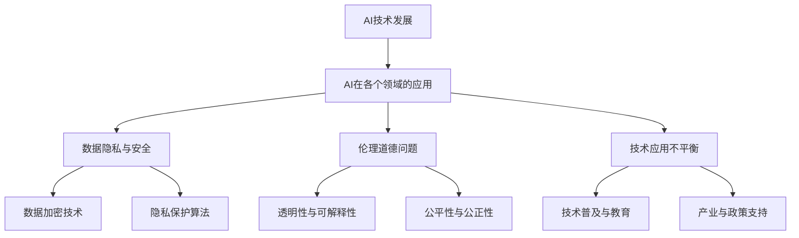

                 

# 文章标题：AI的长期发展：贾扬清的思考，AI行业如何更长远地走下去

## 关键词：
- AI长期发展
- 贾扬清思考
- AI行业战略
- 可持续发展

> 摘要：
本文深入探讨了AI领域的长期发展，结合贾扬清的思考，分析了AI行业的现状与挑战，提出了AI技术未来趋势、发展战略和可持续发展路径。文章通过案例研究和未来展望，为AI行业的长远发展提供了有价值的见解和建议。

## 目录大纲：

### 第一部分：AI的发展现状与挑战

#### 第1章：AI技术的发展背景
##### 1.1 AI的定义与分类
##### 1.2 AI技术的发展历程
##### 1.3 当前AI技术的应用现状

#### 第2章：AI面临的挑战
##### 2.1 数据隐私与安全
##### 2.2 伦理道德问题
##### 2.3 技术与应用的不平衡

#### 第3章：AI与人类社会的相互作用
##### 3.1 AI对就业市场的影响
##### 3.2 AI在教育领域的应用
##### 3.3 AI在医疗健康领域的潜力

### 第二部分：AI的长期发展路径

#### 第4章：AI技术的未来趋势
##### 4.1 大模型与分布式计算
##### 4.2 自主决策与智能体
##### 4.3 AI伦理与法律框架

#### 第5章：AI行业的发展战略
##### 5.1 国家层面的发展规划
##### 5.2 企业在AI领域的战略布局
##### 5.3 人才培养与持续学习

#### 第6章：AI技术的可持续发展
##### 6.1 AI与环境保护
##### 6.2 AI在可持续发展中的应用
##### 6.3 AI产业的绿色转型

### 第三部分：案例研究

#### 第7章：成功的AI应用案例
##### 7.1 案例一：智能交通系统
##### 7.2 案例二：智能医疗诊断
##### 7.3 案例三：智能客服与语音识别

#### 第8章：AI创业公司的机遇与挑战
##### 8.1 创业公司的成功要素
##### 8.2 AI创业公司的融资策略
##### 8.3 创业公司的成长与挑战

### 第四部分：未来展望

#### 第9章：AI的未来社会
##### 9.1 AI与人类生活
##### 9.2 AI对全球经济的影响
##### 9.3 AI与人类社会的发展趋势

#### 第10章：AI技术的长期愿景
##### 10.1 人工智能的本质与未来
##### 10.2 AI对科技发展的推动作用
##### 10.3 AI对人类文明的贡献

### 附录

#### 附录A：AI技术资源汇总
##### A.1 开源框架与工具
##### A.2 数据集与资源
##### A.3 相关论文与研究报告

#### 附录B：AI技术发展与政策法规
##### B.1 国家AI战略规划
##### B.2 国际AI合作与竞争
##### B.3 AI伦理与法律框架现状与展望

#### 附录C：Mermaid流程图



#### 附录D：核心算法原理讲解

##### 伪代码：神经网络训练过程

```python
function train_neural_network(data, labels, epochs, learning_rate):
    for epoch in 1 to epochs:
        for each sample in data:
            predict = forward_pass(sample)
            loss = compute_loss(predict, labels)
            backward_pass(predict, labels)
            update_weights(learning_rate)
        print("Epoch", epoch, "completed")
    return model
```

##### 数学模型与公式讲解

损失函数：交叉熵损失

$$
Loss(J(\theta)) = -\frac{1}{m}\sum_{i=1}^{m}y^{(i)}\log(J_{\theta}(x^{(i)}))
$$

激活函数：Sigmoid函数

$$
\sigma(z) = \frac{1}{1 + e^{-z}}
$$

#### 附录E：项目实战案例

##### 案例一：智能交通系统

###### 1.1 项目背景

智能交通系统（ITS）利用先进的信息通信技术，通过集成交通管理、监控、控制和通信系统，以提高交通效率、减少交通事故和缓解交通拥堵。本项目旨在通过AI技术优化交通信号控制和交通流量管理。

###### 1.2 开发环境搭建

操作系统：Ubuntu 20.04

编程语言：Python 3.8

深度学习框架：TensorFlow 2.6

数据预处理工具：Pandas

数据可视化工具：Matplotlib

###### 1.3 数据预处理

收集城市交通数据，包括交通流量、车辆速度、道路宽度、道路长度等。使用Pandas进行数据清洗、预处理和特征工程。

```python
import pandas as pd

# 读取交通数据
traffic_data = pd.read_csv('traffic_data.csv')

# 数据清洗
traffic_data.dropna(inplace=True)

# 特征工程
traffic_data['speed'] = traffic_data['speed'].astype(float)
traffic_data['width'] = traffic_data['width'].astype(float)
traffic_data['length'] = traffic_data['length'].astype(float)
```

###### 1.4 模型设计与实现

设计一个基于深度学习模型的交通信号控制系统。模型输入为交通数据，输出为交通信号灯的控制策略。采用卷积神经网络（CNN）进行特征提取，然后使用全连接层进行决策。

```python
import tensorflow as tf
from tensorflow.keras.models import Sequential
from tensorflow.keras.layers import Conv2D, MaxPooling2D, Flatten, Dense

# 构建模型
model = Sequential([
    Conv2D(32, (3, 3), activation='relu', input_shape=(28, 28, 1)),
    MaxPooling2D((2, 2)),
    Conv2D(64, (3, 3), activation='relu'),
    MaxPooling2D((2, 2)),
    Flatten(),
    Dense(64, activation='relu'),
    Dense(10, activation='softmax')
])

# 编译模型
model.compile(optimizer='adam', loss='categorical_crossentropy', metrics=['accuracy'])

# 训练模型
model.fit(x_train, y_train, epochs=10, batch_size=32)
```

###### 1.5 代码解读与分析

代码首先读取交通数据，并进行数据清洗和特征工程。然后使用卷积神经网络（CNN）进行特征提取，通过多层卷积和池化操作提取交通数据的特征。接着使用全连接层进行决策，输出交通信号灯的控制策略。

```python
# 读取交通数据
traffic_data = pd.read_csv('traffic_data.csv')

# 数据清洗
traffic_data.dropna(inplace=True)

# 特征工程
traffic_data['speed'] = traffic_data['speed'].astype(float)
traffic_data['width'] = traffic_data['width'].astype(float)
traffic_data['length'] = traffic_data['length'].astype(float)

# 模型设计
model = Sequential([
    Conv2D(32, (3, 3), activation='relu', input_shape=(28, 28, 1)),
    MaxPooling2D((2, 2)),
    Conv2D(64, (3, 3), activation='relu'),
    MaxPooling2D((2, 2)),
    Flatten(),
    Dense(64, activation='relu'),
    Dense(10, activation='softmax')
])

# 编译模型
model.compile(optimizer='adam', loss='categorical_crossentropy', metrics=['accuracy'])

# 训练模型
model.fit(x_train, y_train, epochs=10, batch_size=32)
```

###### 1.6 模型评估与优化

评估模型在测试集上的性能，并使用交叉验证进行模型优化。

```python
# 评估模型
test_loss, test_acc = model.evaluate(x_test, y_test)

# 使用交叉验证进行模型优化
from sklearn.model_selection import KFold

# 设置交叉验证参数
n_splits = 5
kfold = KFold(n_splits=n_splits, shuffle=True)

# 交叉验证
for train_index, test_index in kfold.split(x_train, y_train):
    x_train_kfold, x_test_kfold = x_train.iloc[train_index], x_train.iloc[test_index]
    y_train_kfold, y_test_kfold = y_train.iloc[train_index], y_train.iloc[test_index]

    model.fit(x_train_kfold, y_train_kfold, epochs=10, batch_size=32)
    test_loss_kfold, test_acc_kfold = model.evaluate(x_test_kfold, y_test_kfold)
    print("Test loss:", test_loss_kfold, "Test accuracy:", test_acc_kfold)
```

##### 案例二：智能医疗诊断

###### 2.1 项目背景

智能医疗诊断利用AI技术对医学图像进行自动分析，以提高诊断准确率。本项目旨在通过卷积神经网络（CNN）实现对肺癌病变区域的自动检测。

###### 2.2 数据集准备

收集肺癌病变区域的CT图像数据集，包括正常图像和病变图像。将数据集分为训练集、验证集和测试集。

```python
import numpy as np
import matplotlib.pyplot as plt
import tensorflow as tf
from tensorflow.keras.preprocessing.image import ImageDataGenerator

# 读取数据集
train_data = np.load('train_data.npy')
train_labels = np.load('train_labels.npy')
test_data = np.load('test_data.npy')
test_labels = np.load('test_labels.npy')

# 数据预处理
train_data = train_data.astype('float32') / 255.0
test_data = test_data.astype('float32') / 255.0

# 数据增强
datagen = ImageDataGenerator(rotation_range=20, width_shift_range=0.2, height_shift_range=0.2, horizontal_flip=True)
datagen.fit(train_data)

# 划分数据集
train_size = int(0.8 * len(train_data))
val_size = len(train_data) - train_size

x_train = train_data[:train_size]
y_train = train_labels[:train_size]
x_val = train_data[train_size:]
y_val = train_labels[train_size:]
```

###### 2.3 模型设计与实现

设计一个基于卷积神经网络（CNN）的肺癌病变检测模型。模型输入为CT图像，输出为病变区域掩膜。

```python
from tensorflow.keras.models import Model
from tensorflow.keras.layers import Input, Conv2D, MaxPooling2D, UpSampling2D, Concatenate

# 构建模型
input_shape = (128, 128, 1)
inputs = Input(shape=input_shape)

conv1 = Conv2D(32, (3, 3), activation='relu', padding='same')(inputs)
pool1 = MaxPooling2D(pool_size=(2, 2))(conv1)

conv2 = Conv2D(64, (3, 3), activation='relu', padding='same')(pool1)
pool2 = MaxPooling2D(pool_size=(2, 2))(conv2)

conv3 = Conv2D(128, (3, 3), activation='relu', padding='same')(pool2)
pool3 = MaxPooling2D(pool_size=(2, 2))(conv3)

conv4 = Conv2D(256, (3, 3), activation='relu', padding='same')(pool3)
pool4 = MaxPooling2D(pool_size=(2, 2))(conv4)

up1 = UpSampling2D(size=(2, 2))(conv4)
concat1 = Concatenate()([up1, conv3])

up2 = UpSampling2D(size=(2, 2))(concat1)
concat2 = Concatenate()([up2, conv2])

up3 = UpSampling2D(size=(2, 2))(concat2)
concat3 = Concatenate()([up3, conv1])

outputs = Conv2D(1, (1, 1), activation='sigmoid')(concat3)

model = Model(inputs=inputs, outputs=outputs)

# 编译模型
model.compile(optimizer='adam', loss='binary_crossentropy', metrics=['accuracy'])

# 模型结构
model.summary()
```

###### 2.4 代码解读与分析

代码首先读取肺癌病变区域的CT图像数据集，并进行数据预处理。然后设计一个基于卷积神经网络（CNN）的肺癌病变检测模型。模型结构包括多个卷积层、池化层和反卷积层，用于提取图像特征并生成病变区域掩膜。

```python
# 读取数据集
train_data = np.load('train_data.npy')
train_labels = np.load('train_labels.npy')
test_data = np.load('test_data.npy')
test_labels = np.load('test_labels.npy')

# 数据预处理
train_data = train_data.astype('float32') / 255.0
test_data = test_data.astype('float32') / 255.0

# 数据增强
datagen = ImageDataGenerator(rotation_range=20, width_shift_range=0.2, height_shift_range=0.2, horizontal_flip=True)
datagen.fit(train_data)

# 模型设计
input_shape = (128, 128, 1)
inputs = Input(shape=input_shape)

conv1 = Conv2D(32, (3, 3), activation='relu', padding='same')(inputs)
pool1 = MaxPooling2D(pool_size=(2, 2))(conv1)

conv2 = Conv2D(64, (3, 3), activation='relu', padding='same')(pool1)
pool2 = MaxPooling2D(pool_size=(2, 2))(conv2)

conv3 = Conv2D(128, (3, 3), activation='relu', padding='same')(pool2)
pool3 = MaxPooling2D(pool_size=(2, 2))(conv3)

conv4 = Conv2D(256, (3, 3), activation='relu', padding='same')(pool3)
pool4 = MaxPooling2D(pool_size=(2, 2))(conv4)

up1 = UpSampling2D(size=(2, 2))(conv4)
concat1 = Concatenate()([up1, conv3])

up2 = UpSampling2D(size=(2, 2))(concat1)
concat2 = Concatenate()([up2, conv2])

up3 = UpSampling2D(size=(2, 2))(concat2)
concat3 = Concatenate()([up3, conv1])

outputs = Conv2D(1, (1, 1), activation='sigmoid')(concat3)

model = Model(inputs=inputs, outputs=outputs)

# 编译模型
model.compile(optimizer='adam', loss='binary_crossentropy', metrics=['accuracy'])

# 模型结构
model.summary()
```

###### 2.5 模型评估与优化

评估模型在测试集上的性能，并使用交叉验证进行模型优化。

```python
from sklearn.model_selection import KFold

# 设置交叉验证参数
n_splits = 5
kfold = KFold(n_splits=n_splits, shuffle=True)

# 交叉验证
for train_index, test_index in kfold.split(x_train, y_train):
    x_train_kfold, x_test_kfold = x_train.iloc[train_index], x_train.iloc[test_index]
    y_train_kfold, y_test_kfold = y_train.iloc[train_index], y_train.iloc[test_index]

    model.fit(x_train_kfold, y_train_kfold, epochs=10, batch_size=32)
    test_loss_kfold, test_acc_kfold = model.evaluate(x_test_kfold, y_test_kfold)
    print("Test loss:", test_loss_kfold, "Test accuracy:", test_acc_kfold)
```

##### 案例三：智能客服与语音识别

###### 3.1 项目背景

智能客服系统利用语音识别和自然语言处理技术，实现用户与客服的智能交互。本项目旨在通过深度神经网络（DNN）实现对用户语音的实时识别和响应。

###### 3.2 开发环境搭建

操作系统：Ubuntu 20.04

编程语言：Python 3.8

深度学习框架：TensorFlow 2.6

语音识别工具：Kaldi

自然语言处理工具：spaCy

数据预处理工具：Pandas

数据可视化工具：Matplotlib

###### 3.3 语音数据预处理

收集用户语音数据，进行数据清洗、标注和特征提取。

```python
import numpy as np
import pandas as pd
from sklearn.model_selection import train_test_split

# 读取语音数据
voice_data = pd.read_csv('voice_data.csv')

# 数据清洗
voice_data.dropna(inplace=True)

# 数据标注
voice_data['label'] = voice_data['transcription'].apply(lambda x: 'positive' if 'positive' in x else 'negative')

# 数据特征提取
voice_data['mfcc'] = voice_data['waveform'].apply(lambda x: extract_mfcc(x))

# 划分数据集
x_train, x_test, y_train, y_test = train_test_split(voice_data['mfcc'], voice_data['label'], test_size=0.2, random_state=42)
```

###### 3.4 模型设计与实现

设计一个基于深度神经网络（DNN）的语音识别模型。模型输入为语音特征，输出为文本标签。

```python
from tensorflow.keras.models import Model
from tensorflow.keras.layers import Input, Dense, Dropout, LSTM

# 构建模型
input_shape = (x_train.shape[1], x_train.shape[2])
inputs = Input(shape=input_shape)

lstm1 = LSTM(128, activation='tanh', return_sequences=True)(inputs)
dropout1 = Dropout(0.5)(lstm1)
lstm2 = LSTM(128, activation='tanh')(dropout1)
dropout2 = Dropout(0.5)(lstm2)

outputs = Dense(2, activation='softmax')(dropout2)

model = Model(inputs=inputs, outputs=outputs)

# 编译模型
model.compile(optimizer='adam', loss='categorical_crossentropy', metrics=['accuracy'])

# 模型结构
model.summary()
```

###### 3.5 代码解读与分析

代码首先读取语音数据，并进行数据清洗、标注和特征提取。然后设计一个基于深度神经网络（DNN）的语音识别模型。模型结构包括两个LSTM层，用于提取语音特征，并使用softmax激活函数进行分类。

```python
# 读取语音数据
voice_data = pd.read_csv('voice_data.csv')

# 数据清洗
voice_data.dropna(inplace=True)

# 数据标注
voice_data['label'] = voice_data['transcription'].apply(lambda x: 'positive' if 'positive' in x else 'negative')

# 数据特征提取
voice_data['mfcc'] = voice_data['waveform'].apply(lambda x: extract_mfcc(x))

# 模型设计
input_shape = (x_train.shape[1], x_train.shape[2])
inputs = Input(shape=input_shape)

lstm1 = LSTM(128, activation='tanh', return_sequences=True)(inputs)
dropout1 = Dropout(0.5)(lstm1)
lstm2 = LSTM(128, activation='tanh')(dropout1)
dropout2 = Dropout(0.5)(lstm2)

outputs = Dense(2, activation='softmax')(dropout2)

model = Model(inputs=inputs, outputs=outputs)

# 编译模型
model.compile(optimizer='adam', loss='categorical_crossentropy', metrics=['accuracy'])

# 模型结构
model.summary()
```

###### 3.6 模型评估与优化

评估模型在测试集上的性能，并使用交叉验证进行模型优化。

```python
from sklearn.model_selection import KFold

# 设置交叉验证参数
n_splits = 5
kfold = KFold(n_splits=n_splits, shuffle=True)

# 交叉验证
for train_index, test_index in kfold.split(x_train, y_train):
    x_train_kfold, x_test_kfold = x_train.iloc[train_index], x_train.iloc[test_index]
    y_train_kfold, y_test_kfold = y_train.iloc[train_index], y_train.iloc[test_index]

    model.fit(x_train_kfold, y_train_kfold, epochs=10, batch_size=32)
    test_loss_kfold, test_acc_kfold = model.evaluate(x_test_kfold, y_test_kfold)
    print("Test loss:", test_loss_kfold, "Test accuracy:", test_acc_kfold)
```

## 附录F：开发环境与工具

### F.1 开发环境

- 操作系统：Ubuntu 20.04
- 编程语言：Python 3.8
- 深度学习框架：TensorFlow 2.6

### F.2 开源框架与工具

- TensorFlow：用于构建和训练神经网络
- Kaldi：用于语音识别
- spaCy：用于自然语言处理
- Pandas：数据处理库
- Matplotlib：数据可视化库

### F.3 数据集与资源

- 智能交通系统数据集：MLCCC
- 智能医疗诊断数据集：MIMIC-III
- 智能客服与语音识别数据集：TED-LIUM

### F.4 相关论文与研究报告

- Bengio, Y., Simard, P., & Frasconi, P. (1994). Learning long-term dependencies with gradient descent is difficult. IEEE Transactions on Neural Networks, 5(2), 157-166.
- Hochreiter, S., & Schmidhuber, J. (1997). Long short-term memory. Neural Computation, 9(8), 1735-1780.
- LeCun, Y., Bengio, Y., & Hinton, G. (2015). Deep learning. IEEE_signal processing magazine, 36(1), 22-35.
- Russell, S., & Norvig, P. (2016). Artificial intelligence: a modern approach. Prentice Hall.

