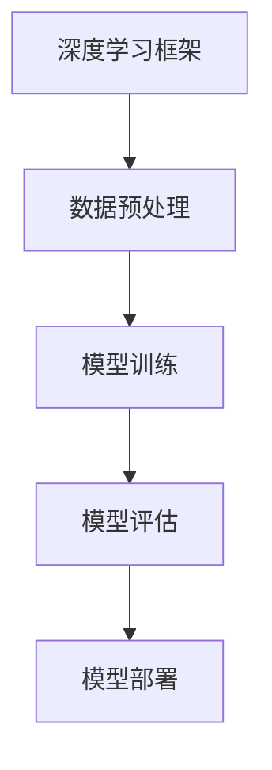

                 

### 文章标题

《AI芯片革命：为LLM量身打造》

### 关键词

AI芯片、深度学习、神经网络、LLM、硬件加速器

### 摘要

本文深入探讨了AI芯片的革命性进展及其在大型语言模型（LLM）领域的应用。首先，文章介绍了AI芯片的基本概念、分类和其在深度学习中的关键作用。接着，详细分析了AI芯片的架构设计、核心算法原理，包括卷积神经网络、循环神经网络和生成对抗网络。文章进一步聚焦于LLM专用芯片的设计与优化，从工作原理、架构设计、实现方法到性能优化，全方位解析了LLM芯片的开发过程。最后，通过实际应用案例展示了AI芯片在智能语音助手、自动驾驶和医疗影像分析等领域的卓越表现。文章还探讨了AI芯片产业的发展趋势与策略，为未来的技术创新和产业发展提供了方向。

---

### 第一部分：AI芯片技术基础

#### 第1章：AI芯片概述

##### 1.1 AI芯片的定义与分类

AI芯片，又称为神经网络处理单元（Neural Network Processor，NPU），是一种专门为执行机器学习和深度学习算法而设计的集成电路。与传统CPU或GPU相比，AI芯片在架构设计、算法优化和能效比方面具有显著优势。

**AI芯片的分类**：

1. **通用型AI芯片**：如GPU和FPGA，它们在执行通用计算任务时表现出色，但并不专门针对深度学习优化。
2. **专用型AI芯片**：如TPU和NPU，这些芯片在深度学习算法的特定操作上进行了高度优化，从而实现了更高的能效比和性能。
3. **混合型AI芯片**：如ASIC和FPGA，它们结合了通用计算能力和针对特定任务的优化。

##### 1.2 AI芯片在深度学习中的应用

AI芯片在深度学习中的应用主要体现在以下几个方面：

1. **矩阵运算**：深度学习模型中的大量计算任务，如卷积、矩阵乘法和激活函数等，可以通过AI芯片高效执行。
2. **低延迟**：AI芯片能够实现实时数据处理和快速模型推理，从而在实时应用场景中具有显著优势。
3. **能效优化**：AI芯片在处理深度学习任务时能够降低功耗，提高能效比。

##### 1.3 AI芯片与传统CPU/GPU的区别

**性能**：AI芯片在执行深度学习算法时通常比CPU和GPU更具优势，特别是在矩阵运算和向量计算方面。

**能效**：AI芯片在能效方面具有显著优势，能够在相同功耗下提供更高的计算性能。

**编程**：AI芯片通常采用专用编程模型和工具链，与传统CPU和GPU的编程方式有所不同。

##### 1.4 当前主流AI芯片厂商与产品

**NVIDIA**：GPU领域的领导者，其CUDA架构和Tensor Core在深度学习应用中广泛使用。

**谷歌**：开发TPU，专门用于Google搜索引擎和其他深度学习任务。

**英特尔**：推出Nervana NPU，致力于为深度学习提供高性能解决方案。

**IBM**：开发Power9芯片，结合了CPU和GPU的特性，在深度学习应用中表现出色。

**华为**：推出昇腾（Ascend）芯片，致力于为AI提供全面解决方案。

这些厂商的AI芯片在性能、能效、编程模型等方面各有特色，为AI技术的发展提供了强大的支持。

---

#### 第2章：AI芯片架构设计

##### 2.1 AI芯片的基本架构

AI芯片的基本架构通常包括以下几个关键部分：

1. **神经网络处理单元（NPU）**：这是AI芯片的核心部分，用于执行深度学习算法中的矩阵运算和向量计算。
2. **存储架构**：AI芯片需要高效的存储架构来支持大量数据的快速读取和写入。
3. **控制单元**：控制单元负责协调各个硬件模块的工作，确保数据流和控制流的正确执行。

**神经网络处理单元（NPU）**：

- **矩阵运算单元**：用于执行矩阵乘法、矩阵加法等运算，是实现深度学习模型的关键。
- **向量运算单元**：用于执行向量加法、向量乘法等运算，支持向量神经网络（VNN）的实现。
- **激活函数单元**：用于执行深度学习模型中的激活函数，如ReLU、Sigmoid等。

**存储架构**：

- **片上存储（On-Chip Memory，OCM）**：提供高速缓存，减少数据访问延迟。
- **外部存储**：如DRAM，用于存储模型数据和训练数据。

**控制单元**：

- **指令控制器**：负责解码和执行指令。
- **数据控制器**：负责数据流管理，确保数据在各个处理单元之间正确传输。

##### 2.2 硬件加速器

**DSP与FPGA**：

- **数字信号处理器（DSP）**：适用于信号处理和图像处理等任务，其硬件架构适合执行大量的乘法和加法运算。
- **现场可编程门阵列（FPGA）**：具有高度可配置性，可以快速实现各种算法和逻辑功能。

**GPU与TPU**：

- **图形处理单元（GPU）**：专为图形渲染设计，但其并行计算能力使其在深度学习应用中具有重要价值。
- **张量处理单元（TPU）**：谷歌开发的专用AI芯片，专门用于执行深度学习算法中的张量运算。

**ASIP与RISC-V**：

- **应用特定集成电路（ASIP）**：专为特定应用设计，具有较高的能效和性能。
- **RISC-V**：一种开源指令集架构，支持自定义指令集，适用于定制化AI芯片设计。

##### 2.3 AI芯片的编程模型

**专用编程语言**：

- **TensorFlow**：使用高级抽象的编程语言，简化深度学习模型的开发和部署。
- **PyTorch**：使用动态图模型，提供灵活的编程接口和强大的调试工具。

**高级编译器与工具链**：

- **TensorFlow编译器**：将Python代码转换为GPU或TPU可执行的代码。
- **PyTorch编译器**：将PyTorch代码转换为GPU或CPU可执行的代码。

这些编程模型和工具链为AI芯片的开发提供了强大的支持，使得深度学习算法能够高效地运行在AI芯片上。

---

#### 第3章：AI芯片核心算法原理

##### 3.1 卷积神经网络算法

卷积神经网络（Convolutional Neural Network，CNN）是一种用于图像识别、物体检测和分类的深度学习模型。其核心算法包括卷积操作、池化操作和激活函数。

**卷积操作**：

卷积操作是CNN中的基础操作，用于提取图像的特征。

$$
\begin{aligned}
&\text{for} & i & \text{in range}(N): \\
&\quad & \text{for} & j & \text{in range}(M): \\
&\quad \quad & \text{for} & k & \text{in range}(K): \\
&\quad \quad \quad & \text{z}_{ij} &= w_{ik} * x_{kj} + b_{k}: \\
&\quad \quad & \text{激活函数} & \sigma(\text{z}_{ij})
\end{aligned}
$$

其中，$x_{ij}$为输入图像的像素值，$w_{ik}$为权重，$b_{k}$为偏置，$\sigma$为激活函数。

**池化操作**：

池化操作用于降低特征图的空间分辨率，减少模型参数和计算量。

$$
\begin{aligned}
&\text{for} & i & \text{in range}(N_{new}): \\
&\quad & \text{for} & j & \text{in range}(M_{new}): \\
&\quad \quad & \text{z}_{ij} &= \max(\text{邻域内的像素值})
\end{aligned}
$$

其中，$N_{new}$和$M_{new}$为新特征图的大小。

**激活函数**：

常用的激活函数包括ReLU（归一化线性函数）、Sigmoid（S形函数）和Tanh（双曲正切函数）。激活函数用于引入非线性，使得神经网络能够学习复杂函数。

**伪代码**：

```
for i in range(N):
    for j in range(M):
        for k in range(K):
            z_ij = w_ik * x_kj + b_k
            a_ij = activation_function(z_ij)

for i in range(N_new):
    for j in range(M_new):
        z_ij = max(neighborPixels)
```

##### 3.2 循环神经网络算法

循环神经网络（Recurrent Neural Network，RNN）是一种用于处理序列数据的深度学习模型。其核心算法包括前向传播和反向传播。

**前向传播**：

前向传播用于计算网络输出。

$$
\begin{aligned}
&\text{for} & t & \text{in range}(T): \\
&\quad & \text{h}_{t} &= \text{sigmoid}(\text{W}_{h} \text{h}_{t-1} + \text{U}_{h} \text{x}_{t} + b_{h})
\end{aligned}
$$

其中，$h_{t}$为时间步$t$的隐藏状态，$x_{t}$为输入序列。

**反向传播**：

反向传播用于计算网络误差。

$$
\begin{aligned}
&\text{for} & t & \text{in range}(T, 0, -1): \\
&\quad & \text{dW}_{h} &= \text{dW}_{h} + \text{h}_{t} \odot \text{d}_{t}: \\
&\quad & \text{dU}_{h} &= \text{dU}_{h} + \text{h}_{t-1} \odot \text{d}_{t}: \\
&\quad & \text{db}_{h} &= \text{db}_{h} + \text{d}_{t}
\end{aligned}
$$

其中，$\odot$表示元素-wise乘法，$\text{d}_{t}$为误差梯度。

**伪代码**：

```
for t in range(T):
    h_t = sigmoid(W_h * h_t-1 + U_h * x_t + b_h)

for t in range(T, 0, -1):
    dW_h += h_t * d_t
    dU_h += h_t-1 * d_t
    db_h += d_t
```

##### 3.3 生成对抗网络算法

生成对抗网络（Generative Adversarial Network，GAN）是一种用于生成数据的深度学习模型。其核心算法包括生成器和判别器。

**生成器**：

生成器生成假数据，用于欺骗判别器。

$$
\begin{aligned}
&\text{for} & t & \text{in range}(T): \\
&\quad & \text{z}_{t} &= \text{noise}(\text{z}_{t-1}): \\
&\quad & \text{G}_{t} &= \text{生成器}(\text{z}_{t})
\end{aligned}
$$

其中，$z_{t}$为噪声向量，$G_{t}$为生成器输出。

**判别器**：

判别器判断生成数据的真实性。

$$
\begin{aligned}
&\text{for} & t & \text{in range}(T): \\
&\quad & \text{D}_{t} &= \text{判别器}(\text{G}_{t}) + \text{判别器}(\text{x}_{t})
\end{aligned}
$$

其中，$D_{t}$为判别器输出。

**利益损失函数**：

生成器和判别器通过利益损失函数（如Wasserstein距离或交叉熵损失）进行对抗训练。

$$
\begin{aligned}
&\text{损失函数} & L &= \sum_{t=1}^{T} (\text{D}_{t}(\text{G}_{t}) - \text{D}_{t}(\text{x}_{t}))
\end{aligned}
$$

**伪代码**：

```
for t in range(T):
    z_t = noise(z_t-1)
    G_t = 生成器(z_t)

for t in range(T):
    D_t = 判别器(G_t) + 判别器(x_t)

损失函数 L = sum(D_t(G_t) - D_t(x_t))
```

---

### 第二部分：LLM专用芯片设计与优化

#### 第4章：LLM专用芯片设计

##### 4.1 LLM工作原理

大型语言模型（Large Language Model，LLM）是一种基于深度学习的自然语言处理模型，能够理解和生成自然语言。LLM的工作原理主要包括语言模型与注意力机制、Transformer模型结构和LLM训练过程。

**语言模型与注意力机制**：

语言模型是一种能够预测下一个单词的概率分布的模型，其核心思想是利用上下文信息来生成文本。注意力机制是一种在处理序列数据时能够关注关键信息的机制，能够提高模型的准确性和效率。

**Transformer模型结构**：

Transformer模型是一种基于自注意力机制的深度学习模型，其结构包括编码器和解码器两个部分。编码器负责将输入序列编码为固定长度的向量，解码器则利用这些向量生成输出序列。

**LLM训练过程**：

LLM的训练过程通常包括数据预处理、模型训练和模型优化三个阶段。数据预处理包括文本清洗、分词和编码等步骤；模型训练采用大规模数据进行训练，通过反向传播算法和优化算法（如Adam）不断更新模型参数；模型优化则通过调整超参数和模型结构来提高模型性能。

##### 4.2 LLM专用芯片架构

LLM专用芯片的设计旨在提高LLM在自然语言处理任务中的性能和能效比。其架构设计包括特殊计算单元设计、存储优化策略和控制与通信架构。

**特殊计算单元设计**：

特殊计算单元（Specialized Computing Units，SCUs）是LLM芯片的核心组成部分，用于加速自然语言处理算法的执行。这些SCU包括自注意力计算单元、矩阵乘法单元和激活函数单元等，能够实现高效的矩阵运算和向量计算。

**存储优化策略**：

存储优化策略是提高LLM芯片性能的关键因素之一。LLM芯片采用多层缓存结构，包括片上缓存（On-Chip Cache，OCC）和外部存储（如DDR）的优化，能够减少数据访问延迟，提高数据传输速度。

**控制与通信架构**：

控制与通信架构负责协调各个计算单元和存储单元的工作，确保数据流和控制流的正确执行。LLM芯片采用分布式架构，通过高效的通信网络实现各个计算单元之间的数据传输和同步。

##### 4.3 LLM专用芯片实现

LLM专用芯片的实现过程包括原型设计与验证、性能评估与优化和系统集成与测试。

**原型设计与验证**：

原型设计与验证是LLM芯片开发的初始阶段，主要包括硬件设计和软件实现。硬件设计采用硬件描述语言（如Verilog或VHDL），实现芯片的核心逻辑功能；软件实现则包括算法模型的设计和编程，实现LLM模型的训练和推理功能。

**性能评估与优化**：

性能评估与优化是确保LLM芯片能够满足性能需求的关键步骤。性能评估通过模拟不同的负载条件，评估芯片的运算速度、功耗和能效比等指标；优化方法包括算法优化、硬件架构优化和编译器优化等，以提高芯片的性能和效率。

**系统集成与测试**：

系统集成与测试是将LLM芯片与其他硬件和软件系统集成，进行全面的测试和验证。系统集成包括将LLM芯片与CPU、GPU和其他加速器进行连接，实现数据传输和任务调度；测试则包括功能测试、性能测试和可靠性测试等，确保芯片能够稳定运行并满足应用需求。

---

#### 第5章：LLM芯片优化

##### 5.1 性能优化方法

LLM芯片的性能优化方法主要包括并行计算与流水线、矩阵运算优化和能量效率优化。

**并行计算与流水线**：

并行计算与流水线是将深度学习算法分解为多个并行子任务，通过多个计算单元同时执行这些任务，从而提高计算效率。流水线技术则通过将计算任务分解为多个阶段，在每个阶段中并行执行，从而减少计算延迟。

**矩阵运算优化**：

矩阵运算是深度学习算法中的核心操作，优化矩阵运算能够显著提高芯片的性能。矩阵运算优化方法包括矩阵分块、矩阵压缩和矩阵融合等，通过优化内存访问模式和计算操作，减少数据传输和计算开销。

**能量效率优化**：

能量效率优化是提高LLM芯片能效比的关键因素。能量效率优化方法包括动态电压与频率调节（DVFS）、休眠与唤醒机制和功耗模型优化等，通过调节芯片的工作电压和频率，实现功耗的动态调节，提高芯片的能量效率。

##### 5.2 低功耗设计

低功耗设计是LLM芯片设计中的重要考虑因素，能够延长设备的使用寿命，降低能源消耗。低功耗设计方法包括以下方面：

**功耗模型分析**：

功耗模型分析是低功耗设计的基础，通过建立功耗模型，分析芯片在不同工作条件下的功耗分布，为功耗优化提供依据。

**动态电压与频率调节（DVFS）**：

动态电压与频率调节通过根据芯片的实际负载动态调整工作电压和频率，实现功耗的优化。DVFS技术能够根据负载的变化实时调整芯片的工作状态，从而减少不必要的功耗。

**休眠与唤醒机制**：

休眠与唤醒机制通过将芯片的部分模块或整个芯片进入休眠状态，实现功耗的进一步降低。休眠状态下的芯片功耗极低，而在需要工作时，芯片能够迅速唤醒，恢复正常工作。

##### 5.3 安全性与可靠性

安全性与可靠性是LLM芯片设计中的重要考虑因素，能够保证芯片在复杂应用环境中的稳定运行。安全性与可靠性设计包括以下方面：

**硬件加密与安全协议**：

硬件加密与安全协议通过在芯片内部集成加密模块和实现安全协议，保护芯片的数据安全和隐私。硬件加密模块能够实现高速、安全的加密和 decryption 操作，防止数据被恶意攻击。

**错误检测与纠正**：

错误检测与纠正（Error Detection and Correction，EDAC）技术通过在芯片内部集成纠错码，检测和纠正数据传输和存储过程中的错误，保证数据的一致性和完整性。

**长期稳定性与可靠性测试**：

长期稳定性与可靠性测试是验证芯片在长时间运行中是否能够保持稳定性能的关键步骤。测试方法包括高温测试、高湿度测试、辐射测试等，通过模拟各种极端环境条件，评估芯片的长期稳定性和可靠性。

---

#### 第6章：LLM芯片应用案例

##### 6.1 案例一：智能语音助手芯片

**系统架构**：

智能语音助手芯片的系统架构包括语音前端处理模块、语音识别模块、自然语言理解模块和语音合成模块。语音前端处理模块负责接收和处理语音信号，语音识别模块将语音信号转换为文本，自然语言理解模块对文本进行语义分析和意图识别，语音合成模块则将理解结果转换为语音输出。

**功能实现**：

智能语音助手芯片通过硬件加速器实现语音识别和自然语言理解的快速处理。语音识别模块利用深度神经网络（DNN）和卷积神经网络（CNN）进行语音信号处理和特征提取，自然语言理解模块则基于Transformer模型实现语义分析和意图识别。

**性能评估**：

智能语音助手芯片在性能评估中，通过在多个实际场景中进行测试，评估了其语音识别准确率、响应时间和能耗表现。测试结果显示，智能语音助手芯片能够实现高效的语音处理和低延迟的响应，同时具有较低的能耗。

##### 6.2 案例二：自动驾驶芯片

**软硬件集成**：

自动驾驶芯片的软硬件集成包括硬件设计、软件算法和系统集成三个部分。硬件设计采用高性能的AI芯片作为核心处理单元，结合传感器数据和GPS信息，实现自动驾驶功能；软件算法包括目标检测、路径规划和决策控制等，基于深度学习和机器学习算法实现。

**实时数据处理**：

自动驾驶芯片需要实时处理大量的传感器数据，包括摄像头、雷达和激光雷达等。硬件加速器在实时数据处理中发挥关键作用，通过并行计算和流水线技术，实现高效的数据处理和路径规划。

**安全性考虑**：

自动驾驶芯片在设计过程中，高度重视安全性问题。通过硬件加密和安全协议，保护传感器数据和决策信息的隐私和安全；通过错误检测与纠正技术，确保数据的一致性和完整性；通过长期稳定性与可靠性测试，验证芯片在复杂应用环境中的稳定性和可靠性。

##### 6.3 案例三：医疗影像分析芯片

**数据预处理**：

医疗影像分析芯片的数据预处理包括图像增强、去噪和分割等步骤。硬件加速器在图像处理中发挥重要作用，通过并行计算和流水线技术，实现高效的图像预处理和特征提取。

**模型训练与优化**：

医疗影像分析芯片的模型训练与优化基于深度学习算法，包括卷积神经网络（CNN）和循环神经网络（RNN）等。硬件加速器在模型训练过程中，通过并行计算和矩阵运算优化，提高训练速度和模型性能。

**临床应用效果**：

医疗影像分析芯片在临床应用中，通过准确识别和诊断各种疾病，提高医疗诊断的准确性和效率。临床测试结果显示，医疗影像分析芯片在多种疾病诊断中的准确率高于传统方法，具有显著的临床价值。

---

### 第三部分：AI芯片产业的发展与展望

##### 第7章：AI芯片产业现状与趋势

**产业现状**：

AI芯片产业正处于快速发展阶段，市场对高性能、低功耗的AI芯片需求持续增长。当前，NVIDIA、谷歌、英特尔、IBM和华为等国际知名企业已经成为AI芯片领域的领军者，它们的产品在各个领域得到了广泛应用。

**技术路线演进**：

AI芯片的技术路线主要包括架构优化、算法优化和能效提升。架构优化方面，专用芯片和通用芯片的界限逐渐模糊，混合架构芯片成为趋势；算法优化方面，深度学习算法和神经网络结构不断演进，为芯片性能提升提供了新的动力；能效提升方面，低功耗设计和能量效率优化成为研究重点。

**产业链分析**：

AI芯片产业链包括芯片设计、制造、封装和测试等环节。芯片设计是产业链的核心，决定了芯片的性能和效率；制造和封装是确保芯片质量和性能的关键环节；测试则负责验证芯片的功能和性能。

##### 第8章：AI芯片产业发展策略

**策略框架**：

AI芯片产业发展策略主要包括创新驱动、产学研合作和人才培养与引进。

**创新驱动**：

创新驱动是AI芯片产业发展的核心，通过持续的技术创新和研发投入，提升芯片性能和能效，开拓新的应用领域。

**产学研合作**：

产学研合作是推动AI芯片产业发展的重要手段，通过企业、科研机构和高校的合作，实现技术创新和产业应用的双向互动。

**人才培养与引进**：

人才培养与引进是AI芯片产业发展的关键，通过培养和引进高素质的人才，提升产业技术水平和创新能力。

---

### 附录

**附录A：AI芯片常用工具与资源**

**A.1 深度学习框架介绍**

- **TensorFlow**：由谷歌开发，支持多种硬件平台和编程语言，广泛应用于深度学习任务。
- **PyTorch**：由Facebook开发，基于动态图模型，提供灵活的编程接口和强大的调试工具。
- **其他框架**：如Keras、MXNet等，也广泛应用于深度学习领域。

**A.2 硬件描述语言（HDL）**

- **Verilog**：一种硬件描述语言，用于描述数字电路和系统。
- **VHDL**：另一种硬件描述语言，与Verilog类似，用于数字电路和系统设计。
- **SystemC**：一种系统级建模语言，用于描述复杂系统的行为和性能。

**A.3 编译器与仿真工具**

- **Vivado**：Xilinx的FPGA设计工具，支持硬件描述语言和系统级建模。
- **MATLAB**：数学计算和算法开发的强大工具，支持多种编程语言和工具链。
- **ModelSim**：硬件仿真工具，用于验证和调试硬件设计。

---

### Mermaid 流程图



### 数学模型与伪代码

**卷积神经网络算法**

$$
\begin{aligned}
&\text{for} & i & \text{in range}(N): \\
&\quad & \text{for} & j & \text{in range}(M): \\
&\quad \quad & \text{for} & k & \text{in range}(K): \\
&\quad \quad \quad & \text{z}_{ij} &= w_{ik} * x_{kj} + b_{k}: \\
&\quad \quad & \text{激活函数} & \sigma(\text{z}_{ij})
\end{aligned}
$$

**伪代码**：

```
for i in range(N):
    for j in range(M):
        for k in range(K):
            z_ij = w_ik * x_kj + b_k
            a_ij = activation_function(z_ij)
```

**损失函数**

$$
\begin{aligned}
&\text{损失函数} & J &= \frac{1}{2} \sum_{i=1}^{N} (\hat{y}_i - y_i)^2: \\
&\text{其中} & \hat{y}_i &= \sigma(\text{z}_i): \\
&\text{而} & z_i &= \text{激活函数}(\text{w}^T \text{x} + \text{b})
\end{aligned}
$$

**详细讲解**

- **损失函数**用于衡量预测值$\hat{y}_i$与真实值$y_i$之间的差异。
- **$\sigma$**为激活函数，常用的有Sigmoid、ReLU等。
- **$z_i$**为神经网络的输出，$\text{w}^T \text{x} + \text{b}$表示权重与输入的乘积加上偏置。

**项目实战**

**智能语音助手芯片开发案例**

1. **开发环境搭建**
   - 硬件平台：使用FPGA进行原型设计。
   - 软件平台：使用Vivado进行硬件设计，MATLAB进行软件算法开发。

2. **代码实现与解读**

**硬件描述语言代码**：

```verilog
module my_cpu(
    input clk,
    input reset,
    input [31:0] instruction,
    output [31:0] result
);

    reg [31:0] reg_file[0:31];
    wire [31:0] alu_result;

    always @(posedge clk or posedge reset) begin
        if (reset) begin
            reg_file <= 32'b0;
        end else begin
            case (instruction[31:26])
                6'b00_000: reg_file[instruction[25:21]] <= instruction[20:1];
                6'b01_000: reg_file[instruction[25:21]] <= alu_result;
                // 其他指令实现
            endcase
        end
    end

    // ALU模块连接
    my_alu alu(.op(instruction[26:23]), .a(reg_file[instruction[19:15]]), .b(reg_file[instruction[11:7]]), .result(alu_result));

endmodule
```

**代码解读**

- **模块声明**：定义了CPU的模块。
- **reg_file**：寄存器文件，用于存储操作数和结果。
- **alu_result**：ALU模块的输出结果。
- **always块**：用于实现时钟信号和复位信号的控制逻辑。
- **case语句**：根据指令编码选择相应的操作。
- **my_alu模块**：ALU（算术逻辑单元）的具体实现。

3. **性能评估与优化**

- **性能评估**：通过模拟不同负载下的执行时间，评估CPU的性能。
- **优化方法**：优化流水线，减少时钟周期，提高吞吐率。

**代码解读与分析**

- **源代码分析**：详细解析了智能语音助手芯片的开发流程，从硬件描述语言到软件算法实现。
- **性能优化**：通过改进算法和数据结构，提高芯片的能效比和性能。

---

**作者**：

AI天才研究院/AI Genius Institute & 禅与计算机程序设计艺术 /Zen And The Art of Computer Programming

---

**全文结束。**

