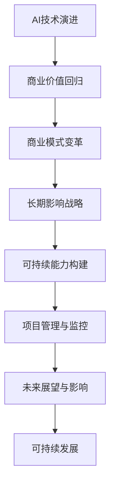

                 

### 文章标题

# AI行业的未来：回到商业价值，如何让AI创造长期影响

> 关键词：人工智能，商业价值，长期影响，战略规划，技术创新

> 摘要：本文旨在探讨AI行业的未来发展趋势，强调商业价值回归的重要性，并分析如何通过战略规划、技术创新和项目管理等手段，实现AI技术的长期影响。文章将详细解析AI技术的演进、对商业模式的改变、伦理与责任问题，并提出实现长期影响的AI战略和可持续发展的路径。

## 《AI行业的未来：回到商业价值，如何让AI创造长期影响》目录大纲

### 第一部分：AI行业的现状与挑战

#### 第1章：AI行业现状分析

##### 1.1 AI技术的演进与影响

##### 1.2 AI行业的主要挑战

##### 1.3 商业价值回归的重要性

#### 第2章：AI对商业模式的改变

##### 2.1 传统商业模式与AI的结合

##### 2.2 AI驱动的业务创新

##### 2.3 AI在提升企业竞争力方面的作用

#### 第3章：AI伦理与责任

##### 3.1 AI伦理问题概述

##### 3.2 数据隐私与安全

##### 3.3 AI决策的透明性与可解释性

### 第二部分：实现长期影响的AI战略

#### 第4章：AI战略规划

##### 4.1 AI战略制定流程

##### 4.2 AI战略与业务目标的匹配

##### 4.3 AI战略实施的挑战与解决方案

#### 第5章：构建可持续的AI能力

##### 5.1 AI人才培养与团队建设

##### 5.2 技术创新与持续学习

##### 5.3 AI基础设施的建设与管理

#### 第6章：AI项目管理与监控

##### 6.1 AI项目的生命周期管理

##### 6.2 AI项目的风险与质量监控

##### 6.3 AI项目的效果评估与优化

### 第三部分：AI行业的未来展望

#### 第7章：AI行业的未来趋势

##### 7.1 AI技术的未来发展方向

##### 7.2 AI行业的发展前景

##### 7.3 AI行业面临的长期挑战

#### 第8章：AI行业的未来影响

##### 8.1 AI对社会经济的影响

##### 8.2 AI在医疗、教育等领域的应用前景

##### 8.3 AI对工作与就业的影响

#### 第9章：AI行业的可持续发展

##### 9.1 AI伦理与法律的完善

##### 9.2 AI行业的社会责任

##### 9.3 AI行业的国际合作与竞争

### 附录：AI行业发展资源与工具

#### 附录 A：AI技术资源汇总

##### A.1 主流AI开发框架

##### A.2 AI学术研究资源

##### A.3 AI行业报告与分析

#### 附录 B：AI行业相关书籍与论文推荐

##### B.1 必读的AI书籍

##### B.2 重要的AI论文

##### B.3 AI领域权威期刊与会议

#### Mermaid 流程图



### 第1章：AI行业现状分析

#### 1.1 AI技术的演进与影响

人工智能（AI）作为一门技术领域，自20世纪50年代诞生以来，经历了多次重大变革和突破。从最初的符号主义、知识表示，到20世纪80年代的基于规则的系统，再到90年代以来的统计学习方法和深度学习技术，AI技术的演进路径不断丰富和拓展。

**深度学习** 是近年来AI领域最为重要的技术突破。深度学习通过模拟人脑神经网络的结构和功能，实现了在图像识别、语音识别、自然语言处理等领域的显著性能提升。以2012年AlexNet在ImageNet竞赛中取得突破性成绩为标志，深度学习逐渐成为AI发展的主流方向。

AI技术对各行各业产生了深远影响。首先，AI在工业领域实现了生产流程的自动化和优化，提高了生产效率和产品质量。其次，在服务业，AI技术推动了个性化推荐、智能客服和自动驾驶等领域的创新。此外，AI在医疗、教育、金融、交通等领域的应用也日益广泛，为提升行业效率和服务质量提供了新的解决方案。

#### 1.2 AI行业的主要挑战

尽管AI技术取得了显著进展，但AI行业仍然面临着诸多挑战。

**技术挑战**：AI技术的发展仍需解决算法性能、数据质量和计算资源等方面的瓶颈。特别是在处理复杂任务和长文本理解方面，现有AI模型仍有较大提升空间。

**商业挑战**：AI技术商业化的过程中，企业需要解决技术与业务需求的匹配问题，以及如何将AI技术转化为实际业务价值。同时，AI技术的高成本和长期投资回报也使得企业面临决策难题。

**伦理与法律挑战**：AI技术的广泛应用引发了伦理和法律问题，包括数据隐私、算法偏见、责任归属等。如何确保AI系统的透明性、可解释性和公平性成为行业亟需解决的问题。

#### 1.3 商业价值回归的重要性

在AI技术的快速发展的背景下，商业价值回归成为AI行业的关键议题。商业价值回归不仅关乎企业盈利，更关系到AI技术的可持续发展和社会影响。

**提升企业竞争力**：AI技术能够帮助企业提高生产效率、优化业务流程、降低成本，从而提升企业的市场竞争力。

**创造新的业务模式**：AI技术的应用可以催生新的商业模式和服务形态，为企业创造新的收入来源和增长点。

**实现长期社会影响**：AI技术的商业成功不仅为企业带来经济效益，还能推动社会进步和改善人类生活。

综上所述，AI行业的现状和挑战为未来发展方向提供了宝贵的经验和启示。通过回归商业价值，AI技术有望实现长期影响，为社会和经济带来更多益处。

### 第2章：AI对商业模式的改变

#### 2.1 传统商业模式与AI的结合

人工智能（AI）的快速发展正在深刻改变传统商业模式，推动企业实现数字化转型。AI技术的引入不仅优化了现有业务流程，还创造了新的商业机会，为各行业注入了新的活力。

**自动化与优化**：AI技术在生产、运营和管理等环节中实现了自动化和优化。例如，在制造业，AI可以实时监控生产设备的状态，预测维护需求，减少设备故障和停机时间。在物流和运输领域，AI优化路线规划，提高运输效率，降低成本。

**智能决策支持**：AI技术通过大数据分析和预测模型，帮助企业实现智能决策。例如，零售企业利用AI技术分析消费者行为，优化库存管理，提升销售预测的准确性。金融机构利用AI进行风险评估和欺诈检测，提高业务运营的安全性和效率。

**个性化服务**：AI技术的应用使得企业能够提供更加个性化的服务和产品。例如，在电子商务领域，AI推荐系统可以根据消费者的购物历史和偏好，推荐个性化的商品，提高用户体验和转化率。在医疗领域，AI辅助诊断系统可以根据患者的病史和检查结果，提供个性化的治疗方案。

**新商业模式**：AI技术不仅优化了传统业务模式，还催生了新的商业模式。例如，共享经济平台通过AI技术优化资源分配和供需匹配，改变了传统的消费和服务模式。在金融领域，区块链技术与AI结合，实现了去中心化的金融交易，降低了交易成本和风险。

**案例研究**：以阿里巴巴为例，该企业通过引入AI技术，实现了电商平台的全面升级。阿里云提供的AI服务帮助企业实现智能客服、智能推荐和智能风控，提升了用户体验和业务效率。同时，阿里巴巴通过AI技术推动新零售战略，实现了线上线下融合，创造了新的商业模式。

#### 2.2 AI驱动的业务创新

AI驱动的业务创新正在成为企业提升竞争力的重要手段。通过AI技术，企业可以突破传统业务模式的局限，探索新的商业机会。

**预测分析与决策优化**：企业利用AI技术进行预测分析，可以提前识别市场变化和客户需求，优化业务策略。例如，航空公司通过AI预测航班需求，动态调整航班安排，提高资源利用率。制造企业利用AI预测设备故障，提前进行维护，减少停机时间。

**智能化产品与服务**：AI技术的应用使得企业能够开发智能化产品和服务，提高用户体验和附加值。例如，智能家居设备通过AI技术实现语音控制和远程监控，提高了用户的生活质量。医疗设备利用AI技术进行实时监测和诊断，提高了医疗服务的效率和准确性。

**业务流程优化**：企业利用AI技术对业务流程进行优化，提高运营效率和响应速度。例如，银行利用AI技术自动化审批贷款申请，缩短审批时间，提高客户满意度。物流企业利用AI优化运输路线和库存管理，降低运营成本。

**商业模式创新**：AI技术不仅优化了现有业务模式，还为企业创造了新的商业模式。例如，共享经济平台通过AI技术实现资源的高效分配和利用，创造了新的业务模式。在金融领域，区块链与AI结合，实现了去中心化的金融交易，推动了金融行业的创新。

**案例研究**：以亚马逊为例，该企业通过AI技术实现了电商平台的全面升级。亚马逊的智能推荐系统可以根据消费者的购物行为和历史，提供个性化的商品推荐，提高了用户的购物体验和转化率。同时，亚马逊利用AI技术优化物流和库存管理，提高了运营效率，降低了成本。

#### 2.3 AI在提升企业竞争力方面的作用

AI技术在提升企业竞争力方面发挥了重要作用。通过AI技术，企业可以降低成本、提高效率、创造新的业务机会，从而在激烈的市场竞争中脱颖而出。

**降低成本**：AI技术可以帮助企业降低运营成本。例如，在制造业，AI技术可以优化生产流程，减少资源浪费和能耗。在物流领域，AI优化路线规划，降低运输成本。金融服务利用AI自动化审批和风控，降低人工成本。

**提高效率**：AI技术可以提高企业的运营效率。例如，智能客服系统可以24小时在线服务，提高客户满意度。制造企业利用AI技术实时监控生产设备，减少设备故障和停机时间。零售企业利用AI优化库存管理，提高库存周转率。

**创造新的业务机会**：AI技术为企业创造了新的业务机会。例如，共享经济平台通过AI技术实现资源的高效分配，创造了新的商业模式。在医疗领域，AI技术推动了精准医疗的发展，创造了新的市场需求。

**增强竞争力**：AI技术可以帮助企业增强竞争力。例如，通过AI技术，企业可以提前预测市场变化，优化业务策略。在竞争激烈的行业，AI技术可以帮助企业提高产品质量和服务水平，赢得客户信任。

**案例研究**：以谷歌为例，该企业通过AI技术提升了搜索广告的投放效果。谷歌的智能广告系统可以根据用户的搜索历史和行为，提供个性化的广告推荐，提高了广告点击率和转化率。同时，谷歌利用AI技术优化数据中心管理，提高了能效比，降低了运营成本。

总之，AI技术在提升企业竞争力方面具有显著的作用。通过AI技术，企业可以实现成本优化、效率提升和业务创新，从而在激烈的市场竞争中脱颖而出。

### 第3章：AI伦理与责任

#### 3.1 AI伦理问题概述

随着人工智能（AI）技术的迅猛发展，其伦理问题逐渐成为社会各界关注的焦点。AI伦理问题涉及数据隐私、算法偏见、责任归属等多个方面，对于保障AI技术的可持续发展具有重要意义。

**数据隐私**：AI系统高度依赖数据，然而数据的采集、存储和使用过程中可能涉及个人隐私。数据隐私问题主要包括数据泄露、数据滥用和数据存储安全等。例如，社交媒体平台通过用户数据提供个性化服务，但同时也面临着数据泄露的风险。

**算法偏见**：AI算法在决策过程中可能会产生偏见，导致不公正的结果。算法偏见通常源于训练数据中的偏差或算法设计中的不公平性。例如，招聘系统可能会对某些性别或种族产生偏见，导致就业机会的不平等。

**责任归属**：当AI系统发生错误或导致事故时，责任归属问题变得尤为复杂。AI系统的决策过程通常涉及多个参与方，包括开发者、运营者和最终用户。如何界定责任、追究责任成为亟待解决的问题。

#### 3.2 数据隐私与安全

数据隐私与安全是AI伦理的核心问题之一。在AI应用过程中，数据的收集、存储和使用都可能导致隐私泄露和安全风险。

**数据收集**：AI系统通常需要大量数据来训练和优化模型。然而，数据收集过程中可能涉及敏感信息，如个人身份信息、医疗记录和财务数据。未经用户同意收集和使用这些数据，可能导致隐私侵犯。

**数据存储**：数据存储安全是另一个重要问题。数据泄露、数据篡改和数据丢失都可能对用户隐私造成严重威胁。例如，数据库泄露可能导致大量个人信息被盗用，造成严重的经济损失和信任危机。

**数据使用**：数据在使用过程中，也可能存在隐私泄露的风险。例如，AI模型在分析用户数据时，可能将隐私信息与其他数据混合，导致隐私信息的泄露。

**隐私保护措施**：为保障数据隐私与安全，可以采取以下措施：

1. **数据加密**：对敏感数据进行加密，防止数据泄露。
2. **匿名化处理**：对用户数据进行匿名化处理，消除个人身份信息。
3. **隐私保护协议**：制定隐私保护协议，明确数据收集、存储和使用的规范。
4. **用户知情同意**：在数据收集和使用前，确保用户知情并同意。

#### 3.3 AI决策的透明性与可解释性

AI决策的透明性和可解释性是另一个重要的伦理问题。随着AI系统在关键领域（如医疗、金融和法律）的广泛应用，人们对于AI决策过程的透明性和可解释性提出了更高的要求。

**透明性**：AI决策过程的透明性指的是用户能够了解AI系统是如何做出决策的。透明性有助于用户对AI系统的信任，并便于监管机构对AI系统进行监督。

**可解释性**：AI决策的可解释性指的是用户能够理解AI系统为什么做出特定的决策。可解释性对于提高AI系统的可信度和公正性至关重要。

**透明性挑战**：AI系统的决策过程通常涉及复杂的算法和大量的数据处理，使得决策过程难以解释。例如，深度学习模型在图像识别任务中的决策过程通常是一个黑盒，用户难以了解模型是如何识别图像的。

**可解释性方法**：为了提高AI决策的透明性和可解释性，可以采用以下方法：

1. **可视化技术**：使用可视化技术展示AI系统的决策过程，使用户更容易理解。
2. **模型简化**：简化复杂的模型，使其更易于解释和理解。
3. **可解释性算法**：开发可解释性算法，使AI系统在做出决策时提供解释。
4. **监管机构介入**：监管机构对AI系统进行监督，确保其透明性和可解释性。

总之，AI伦理问题涉及多个方面，包括数据隐私与安全、算法偏见和责任归属等。解决AI伦理问题需要政府、企业和社会各界的共同努力，以确保AI技术的可持续发展和社会福祉。

### 第4章：AI战略规划

#### 4.1 AI战略制定流程

为了实现AI技术的长期影响，企业需要制定全面的AI战略规划。以下是一个典型的AI战略制定流程，帮助企业从技术、业务和资源等多个方面进行系统规划。

**1. 分析业务目标**：
   - 首先，企业需要明确业务目标，包括短期和长期目标。例如，提高生产效率、提升客户满意度、增加市场份额等。
   - 分析业务目标可以帮助企业确定AI技术应用的优先级，明确哪些领域需要优先部署AI技术。

**2. 识别关键AI应用**：
   - 根据业务目标，识别关键AI应用场景。这些应用场景可能包括生产优化、智能客服、个性化推荐、风险管理等。
   - 对每个应用场景进行评估，确定其技术可行性、商业价值和实施难度。

**3. 评估现有技术能力**：
   - 企业需要评估自身在AI技术方面的现有能力，包括数据资源、技术团队、研发投入等。
   - 通过评估现有技术能力，企业可以确定是否需要外部合作或增加技术投入。

**4. 制定AI战略**：
   - 在分析业务目标、识别关键应用和评估技术能力的基础上，企业可以制定详细的AI战略。
   - AI战略应明确技术路线、应用场景、实施计划和时间表，并设定明确的绩效指标。

**5. 资源与预算分配**：
   - 根据AI战略，企业需要制定详细的资源与预算分配计划。
   - 资源与预算分配应确保关键应用得到足够的支持和优先级。

**6. 实施与监控**：
   - 实施AI战略过程中，企业需要建立监控机制，确保项目按计划进行。
   - 监控机制应包括项目进度、技术风险、成本控制等方面的监控。

**7. 调整与优化**：
   - AI战略实施过程中，企业需要根据实际情况进行定期调整和优化。
   - 调整与优化有助于确保AI战略能够适应市场变化和企业内部环境。

**示例伪代码**：

```python
def Define_AI_Strategy(Business_Targets, Technical_Skills, Budget_Restrictions):
    1. Analyze Business_Targets
        - Identify short-term and long-term business goals
        - Prioritize AI applications based on goals

    2. Identify Key AI Applications
        - Assess feasibility, business value, and implementation difficulty
        - Select critical applications for AI deployment

    3. Assess Technical Skills and Resources
        - Evaluate existing AI capabilities
        - Determine if additional resources or external partnerships are needed

    4. Develop AI Strategy Document
        - Define technical roadmap, application scenarios, and implementation plans
        - Set clear performance metrics

    5. Allocate Resources and Budget
        - Ensure critical applications receive sufficient support
        - Implement detailed resource and budget allocation plans

    6. Implement and Monitor AI Strategy
        - Establish monitoring mechanisms for project progress and risks
        - Ensure projects are on track and within budget

    7. Adjust and Optimize AI Strategy
        - Regularly review and update the strategy based on actual performance
        - Adapt to changing market conditions and internal environments

End Function
```

通过上述流程，企业可以系统性地制定和实施AI战略，确保AI技术能够为企业带来长期价值。

#### 4.2 AI战略与业务目标的匹配

为了确保AI战略的有效实施，企业必须确保AI战略与业务目标的高度匹配。以下是实现这一目标的关键步骤：

**1. 明确业务目标**：
   - 首先，企业需要明确短期和长期业务目标，这些目标可以是提高生产效率、提升客户满意度、增加市场份额等。
   - 明确业务目标有助于企业确定AI应用的优先级和方向。

**2. 分析业务需求**：
   - 分析业务需求，识别哪些业务流程和环节可以通过AI技术得到优化和改进。
   - 例如，在制造业，AI技术可以用于预测维护和优化生产流程；在零售业，AI可以用于库存管理和个性化推荐。

**3. 确定AI应用场景**：
   - 根据业务需求，确定适合AI技术的具体应用场景。
   - 应用场景的选择应考虑技术的可行性、商业价值和实施难度。

**4. 制定AI战略**：
   - 在分析业务目标和需求的基础上，制定详细的AI战略。
   - AI战略应包括技术路线、应用场景、实施计划和预期成果。

**5. 风险评估**：
   - 对AI战略实施过程中可能面临的风险进行评估，包括技术风险、市场风险和运营风险。
   - 风险评估有助于企业提前准备应对措施，降低潜在风险。

**6. 调整与优化**：
   - 在AI战略实施过程中，根据业务目标的实现情况和市场变化，及时调整和优化AI战略。
   - 调整和优化有助于确保AI战略始终与业务目标保持一致。

**7. 监控与评估**：
   - 建立监控和评估机制，定期跟踪AI战略实施进展和业务目标的实现情况。
   - 通过数据分析和反馈，及时发现问题和改进措施。

**示例伪代码**：

```python
def Align_AI_Strategy_With_Business_Targets(Business_Targets, Application_Requirements):
    1. Define Business Goals
        - Identify short-term and long-term goals
        - Prioritize goals based on business impact

    2. Analyze Business Needs
        - Identify processes and workflows that can be optimized with AI
        - Assess potential AI applications based on business needs

    3. Determine AI Applications
        - Evaluate feasibility, business value, and implementation difficulty
        - Select suitable AI applications for business improvement

    4. Develop AI Strategy
        - Define technical roadmap, application scenarios, and implementation plans
        - Set performance metrics aligned with business goals

    5. Assess Risks
        - Identify potential risks related to technology, market, and operations
        - Prepare mitigation strategies

    6. Adjust and Optimize Strategy
        - Regularly review and update the strategy based on business performance
        - Ensure alignment with changing market conditions

    7. Monitor and Evaluate
        - Implement monitoring mechanisms for strategy implementation
        - Regularly assess progress and adjust as needed

End Function
```

通过上述步骤，企业可以确保AI战略与业务目标的高度匹配，从而实现AI技术的长期价值。

#### 4.3 AI战略实施的挑战与解决方案

在实施AI战略的过程中，企业可能会面临多种挑战。以下将详细探讨这些挑战，并提供相应的解决方案。

**1. 技术挑战**：
   - **算法性能瓶颈**：现有AI算法在某些复杂任务上可能存在性能瓶颈，无法满足业务需求。
   - **数据质量**：AI系统依赖大量高质量数据，但数据质量参差不齐，可能影响算法效果。
   - **计算资源限制**：AI模型训练和推理需要大量计算资源，尤其是在大规模数据处理时。

   **解决方案**：
   - **提升算法性能**：通过研究新的算法模型和技术，提高算法性能。例如，采用迁移学习、生成对抗网络（GAN）等技术。
   - **数据清洗与治理**：建立数据治理机制，确保数据质量。进行数据清洗、去重和格式化处理，提高数据可用性。
   - **分布式计算**：利用分布式计算框架（如TensorFlow、PyTorch）和云计算资源，提高计算效率和处理能力。

**2. 商业挑战**：
   - **成本与投资回报**：AI技术的高成本和长期投资回报周期，使得企业面临决策难题。
   - **技术与业务需求的匹配**：AI技术与业务需求之间存在差异，导致技术投入无法有效转化为业务价值。
   - **市场竞争**：市场竞争激烈，企业需要快速响应市场变化，但AI项目实施周期较长。

   **解决方案**：
   - **成本效益分析**：进行详细的经济性分析，评估AI项目的投资回报周期。通过优化资源分配和降低成本，提高投资效益。
   - **业务需求调研**：深入业务部门，了解具体需求，确保AI技术应用能够解决实际问题。
   - **快速迭代与敏捷开发**：采用敏捷开发方法，快速迭代和验证AI解决方案，确保项目能够快速响应市场变化。

**3. 伦理与法律挑战**：
   - **数据隐私与安全**：AI系统在数据采集、存储和使用过程中可能涉及个人隐私和安全问题。
   - **算法偏见与公平性**：AI算法可能存在偏见，导致不公平的结果，影响社会公平性。
   - **责任归属**：当AI系统发生错误或导致事故时，责任归属问题复杂，需要明确相关法律法规。

   **解决方案**：
   - **隐私保护与安全**：建立严格的隐私保护政策和数据安全措施，确保用户数据的安全和隐私。
   - **算法公平性与可解释性**：开发可解释性算法，提高算法的透明性和可解释性。建立算法审查机制，确保算法的公平性和公正性。
   - **法律法规完善**：推动相关法律法规的制定和实施，明确AI系统的责任归属和法律责任。

通过上述解决方案，企业可以应对AI战略实施过程中的各种挑战，确保AI技术能够为企业带来长期价值。

### 第5章：构建可持续的AI能力

#### 5.1 AI人才培养与团队建设

构建可持续的AI能力，关键在于培养高素质的AI人才和建设高效的团队。以下是一些关键步骤和策略：

**1. 人才培养策略**：
   - **系统性教育**：企业应与高校和科研机构合作，建立完善的AI教育体系，提供从基础到高级的培训课程。
   - **持续学习**：鼓励员工参加AI相关的在线课程、研讨会和讲座，保持技术前沿的敏感性。
   - **实践项目**：通过实际项目，让员工在实践中学习和成长，提高解决实际问题的能力。

**2. 团队建设**：
   - **多元化团队**：组建多元化团队，包括数据科学家、软件工程师、产品经理和业务专家，实现跨学科的协作。
   - **技能互补**：确保团队成员在技能和专长上互补，形成高效的协作机制。
   - **激励机制**：建立激励机制，奖励团队成员在AI项目中的创新和贡献，提高团队凝聚力。

**3. 人才引进**：
   - **高端人才**：通过高薪聘请和人才引进计划，吸引行业内的顶尖人才加入企业。
   - **实习计划**：与高校合作，建立实习计划，培养和储备潜在的人才。

**4. 职业发展**：
   - **晋升机制**：建立明确的晋升机制，鼓励员工不断学习和进步，提供职业发展的机会。
   - **外部合作**：通过参加行业会议、学术交流和合作项目，扩展员工的职业网络，提高行业影响力。

#### 5.2 技术创新与持续学习

技术创新和持续学习是构建可持续AI能力的核心。以下是一些关键策略：

**1. 技术创新**：
   - **研发投入**：增加研发投入，鼓励技术创新和研发项目，推动AI技术的不断进步。
   - **合作研发**：与高校、研究机构和行业领先企业建立合作，共同进行技术研究和开发，提高技术储备。
   - **专利保护**：加强专利申请和保护，保护企业的技术成果，提高企业在AI领域的竞争力。

**2. 持续学习**：
   - **技术跟踪**：定期跟踪AI技术发展趋势，及时了解最新的研究成果和技术动向。
   - **内部培训**：定期组织内部技术培训和研讨会，分享最新的技术知识和经验。
   - **外部交流**：积极参与行业会议、研讨会和学术交流，与业内专家进行深入交流，拓展视野。

**3. 开源社区**：
   - **贡献开源**：积极参与开源社区，贡献代码和研究成果，提高企业的技术影响力。
   - **开源使用**：利用开源技术和资源，降低开发成本，加快项目进度。

**4. 持续改进**：
   - **反馈机制**：建立反馈机制，收集用户和团队的意见和建议，不断优化技术方案。
   - **持续迭代**：通过持续迭代和优化，不断提升AI系统的性能和用户体验。

#### 5.3 AI基础设施的建设与管理

AI基础设施的建设与管理是确保AI系统能够高效运行的关键。以下是一些关键策略：

**1. 数据中心建设**：
   - **计算资源**：建设高效的数据中心，配备高性能的计算设备和存储资源，满足大规模数据处理和模型训练的需求。
   - **网络架构**：建立高速、稳定的网络架构，确保数据传输的效率和安全性。

**2. 硬件设备**：
   - **服务器与存储**：选择合适的硬件设备，包括服务器、存储设备和网络设备，确保系统的可靠性和扩展性。
   - **硬件升级**：定期进行硬件升级和维护，保持设备的高效运行。

**3. 软件工具**：
   - **开发工具**：选择适合AI项目需求的开发工具和平台，提高开发效率和代码质量。
   - **测试工具**：建立完善的测试工具集，确保AI系统的可靠性和稳定性。

**4. 管理系统**：
   - **资源管理**：建立资源管理系统，实现计算资源、存储资源和网络资源的统一管理和调度。
   - **安全措施**：实施严格的安全措施，包括防火墙、加密技术和访问控制，确保系统的安全性和数据隐私。

**5. 运维监控**：
   - **监控系统**：建立监控系统，实时监控系统的运行状态，及时发现和解决问题。
   - **运维团队**：组建专业的运维团队，负责系统的日常运维和维护，确保系统的稳定运行。

通过上述策略，企业可以构建可持续的AI能力，确保AI技术在业务中的应用能够持续带来价值。

### 第6章：AI项目管理与监控

#### 6.1 AI项目的生命周期管理

AI项目生命周期管理是指从项目立项到项目结束的整个过程，包括项目立项、规划、执行、监控和收尾等阶段。以下是对每个阶段的详细描述：

**1. 项目立项**：
   - 在项目立项阶段，项目团队需要明确项目的目标和可行性。这包括确定项目的基本需求、目标用户、预期成果和预算等。
   - 项目团队还需进行初步的技术评估，确保所采用的技术方案具备实现项目目标的能力。

**2. 项目规划**：
   - 项目规划阶段是制定项目详细计划的关键时期。项目团队需要制定项目计划和时间表，明确各阶段的工作任务和里程碑。
   - 项目规划还包括资源分配、风险评估和沟通计划的制定。资源分配需要考虑人员、设备和预算等方面。

**3. 项目执行**：
   - 项目执行阶段是项目实施的核心阶段。项目团队需要按照项目计划，进行技术开发、测试和部署等工作。
   - 在执行过程中，项目团队需要保持与客户的沟通，确保项目符合客户需求，并及时调整计划。

**4. 项目监控**：
   - 项目监控阶段是确保项目按计划进行的关键。项目团队需要建立监控机制，实时跟踪项目的进度、质量和风险。
   - 监控机制包括进度报告、质量检查和风险评估等。通过监控，项目团队可以及时发现和解决问题。

**5. 项目评估**：
   - 项目评估阶段是对项目成果进行评价和总结的时期。项目团队需要评估项目是否实现了预期目标，项目质量是否达到要求。
   - 项目评估还包括项目成本和效益的分析，以评估项目的成功程度。

**6. 项目收尾**：
   - 项目收尾阶段是项目正式结束的时期。项目团队需要完成项目的交付工作，确保项目的最终成果符合客户要求。
   - 项目收尾还包括项目文档的整理和归档，以及项目团队的解散。

**示例伪代码**：

```python
def AI_Project_Lifecycle(Projects):
    1. Project Initialization
        - Define project goals and feasibility
        - Assess technical requirements

    2. Project Planning
        - Develop project plan and timeline
        - Allocate resources and assign tasks

    3. Project Execution
        - Implement project tasks
        - Conduct regular project meetings
        - Ensure alignment with client requirements

    4. Project Monitoring
        - Establish monitoring mechanisms
        - Track project progress, quality, and risks

    5. Project Evaluation
        - Assess project outcomes and quality
        - Analyze project costs and benefits

    6. Project Closure
        - Complete project deliverables
        - Document and archive project materials
        - Dissolve project team

End Function
```

通过科学的项目生命周期管理，企业可以确保AI项目的顺利进行，实现预期目标。

#### 6.2 AI项目的风险与质量监控

在AI项目实施过程中，风险与质量监控是确保项目成功的关键环节。以下将详细探讨如何进行AI项目的风险与质量监控。

**1. 风险监控**：

**风险识别**：项目团队需要识别可能影响项目成功的各种风险，包括技术风险、市场风险、人员风险等。

**风险评估**：对识别出的风险进行评估，确定其发生概率和潜在影响。评估过程可以通过定性和定量方法进行。

**风险应对**：制定相应的风险应对策略，包括风险规避、风险转移、风险减轻等。例如，通过增加预算和资源储备来减轻技术风险。

**风险监控机制**：建立风险监控机制，定期对项目风险进行跟踪和评估，确保风险得到及时控制和处理。

**示例伪代码**：

```python
def Risk_Monitoring(Project_Risks):
    1. Identify Risks
        - Conduct risk assessments
        - List potential risks

    2. Assess Risks
        - Determine risk probability and impact
        - Prioritize risks

    3. Mitigate Risks
        - Develop risk mitigation strategies
        - Allocate resources for risk management

    4. Monitor Risks
        - Regularly track risk status
        - Update risk mitigation plans

End Function
```

**2. 质量监控**：

**质量标准**：制定明确的质量标准，包括技术指标、性能指标、用户体验等。

**测试与验证**：在项目实施过程中，进行系统测试和验证，确保项目成果符合质量标准。测试包括单元测试、集成测试、系统测试等。

**反馈与改进**：建立反馈机制，收集用户和团队的反馈意见，对项目成果进行改进和优化。

**质量监控机制**：建立质量监控机制，定期对项目质量进行评估和改进，确保项目成果持续符合预期。

**示例伪代码**：

```python
def Quality_Monitoring(Quality_Standards):
    1. Define Quality Standards
        - Establish technical and performance metrics

    2. Test and Verify
        - Conduct system testing
        - Validate project outcomes

    3. Collect Feedback
        - Gather user and team feedback
        - Identify areas for improvement

    4. Improve Quality
        - Implement feedback improvements
        - Update quality standards as needed

End Function
```

通过有效的风险与质量监控，企业可以确保AI项目的成功实施，实现预期目标。

#### 6.3 AI项目的效果评估与优化

AI项目的效果评估与优化是确保项目成果达到预期的重要环节。以下将详细探讨如何进行AI项目的效果评估与优化。

**1. 效果评估方法**：

**定量评估**：通过数据分析和统计方法，评估项目对业务指标的影响。例如，通过对比项目实施前后的销售数据、生产效率等，评估项目的经济效益。

**定性评估**：通过用户反馈、业务部门评价等方法，评估项目对用户体验和业务流程的改善。定性评估有助于了解项目的实际影响和潜在问题。

**评估指标**：根据项目目标和评估方法，设定具体的评估指标。常见的评估指标包括项目成本、项目进度、业务效益、用户体验等。

**2. 评估过程**：

**数据收集**：收集项目实施过程中的数据，包括项目成本、进度报告、用户反馈等。

**数据分析**：对收集的数据进行分析，评估项目的实际效果和达成度。

**反馈收集**：通过用户和业务部门的反馈，了解项目在实际应用中的问题和改进方向。

**3. 优化措施**：

**技术优化**：根据评估结果，对AI模型和算法进行优化，提高系统的性能和准确性。

**流程优化**：优化业务流程和项目管理方法，提高项目的执行效率和效果。

**资源调整**：根据评估结果和项目需求，调整资源分配和预算，确保项目资源得到最大化利用。

**4. 持续优化**：

**建立反馈机制**：建立持续的反馈和改进机制，定期收集用户和团队的反馈意见，对项目进行优化。

**迭代优化**：通过迭代开发和持续优化，不断提高项目质量和效果。

**示例伪代码**：

```python
def Evaluate_AI_Project(Project_Indicators):
    1. Collect Data
        - Gather project cost, progress reports, user feedback

    2. Analyze Data
        - Conduct statistical analysis
        - Compare project outcomes with initial goals

    3. Collect Feedback
        - Seek user and business department evaluations

    4. Implement Improvements
        - Optimize AI models and algorithms
        - Adjust business processes and project management methods

    5. Continuous Optimization
        - Establish feedback mechanisms
        - Implement iterative improvements based on feedback

End Function
```

通过系统的效果评估与优化，企业可以确保AI项目能够持续带来价值，实现预期目标。

### 第7章：AI行业的未来趋势

#### 7.1 AI技术的未来发展方向

随着人工智能（AI）技术的不断进步，未来AI技术的发展方向将涵盖多个领域，包括算法创新、硬件升级和跨领域融合。

**算法创新**：未来的AI算法将更加复杂和精细，能够处理更多样化的任务。例如，强化学习算法将进一步优化，使其在动态环境中表现出更高的决策能力。生成对抗网络（GAN）和其他新型深度学习技术将继续发展和成熟，为图像处理、语音识别和自然语言处理等领域带来更多突破。

**硬件升级**：随着硬件技术的发展，AI系统的计算能力和效率将得到显著提升。新型计算硬件，如量子计算、边缘计算和专用AI芯片，将为AI算法提供更强大的计算支持，降低计算成本，提高实时性能。

**跨领域融合**：AI技术将与其他领域（如生物技术、医疗、教育等）深度融合，创造出新的应用场景和商业模式。例如，AI与生物技术的结合将推动精准医疗的发展，AI与教育的结合将实现个性化教育和智能教学，提高教育质量和效率。

#### 7.2 AI行业的发展前景

AI行业的发展前景充满机遇和挑战。以下是AI行业未来几年的几个关键趋势：

**市场增长**：随着AI技术在各行业的广泛应用，AI市场规模将保持高速增长。根据市场研究机构的数据，全球AI市场预计将在未来几年内达到数千亿美元。

**行业应用**：AI将在更多行业得到应用，如智能制造、智慧城市、金融科技和医疗健康等。这些应用将推动AI技术不断迭代和进步，实现更广泛的社会和经济价值。

**就业变化**：AI技术的快速发展将带来就业市场的变化。一方面，AI技术将创造新的工作岗位，如数据科学家、机器学习工程师和AI产品经理等；另一方面，传统工作岗位可能因自动化而消失或转变，这需要社会各界共同努力，提升劳动者的技能和适应能力。

#### 7.3 AI行业面临的长期挑战

尽管AI行业前景广阔，但也面临一系列长期挑战：

**技术瓶颈**：AI技术在算法、数据质量和计算资源等方面仍存在瓶颈，需要持续的技术创新和研发投入。

**伦理问题**：AI伦理问题，如数据隐私、算法偏见和责任归属等，需要得到有效解决，确保AI技术的可持续发展。

**法律法规**：随着AI技术的普及，相关法律法规和标准也需要不断完善，以应对技术带来的新挑战。

**国际合作**：AI技术具有全球性特征，需要各国政府、企业和研究机构加强合作，共同推动AI技术的发展和应用。

### 第8章：AI行业的未来影响

#### 8.1 AI对社会经济的影响

人工智能（AI）技术的快速发展将对社会经济产生深远影响，包括以下几个方面：

**提高生产效率**：AI技术能够自动化和优化许多业务流程，从而显著提高生产效率。例如，在制造业，AI可以通过预测维护和优化生产流程，减少设备故障和停机时间，提高生产效率。在服务业，智能客服和个性化推荐系统能够提高服务质量和客户满意度，从而提升企业的竞争力。

**创造新的工作岗位**：AI技术的应用将创造新的就业机会。数据科学家、机器学习工程师、AI产品经理等专业人才需求将大幅增加。同时，AI技术也将推动新兴产业的发展，如智能医疗、智能教育和智能交通等，为劳动力市场带来新的机遇。

**改变消费模式**：AI技术将推动消费模式的转变，实现个性化消费和精准营销。例如，通过大数据分析和机器学习算法，企业可以更好地了解消费者的需求和偏好，提供个性化的产品和服务，提高用户体验和忠诚度。此外，AI还将推动电子商务和在线购物的发展，改变传统的零售业态。

**增强全球化竞争**：AI技术的发展将加剧全球竞争，要求企业提高创新能力。掌握AI技术的企业将具备更强的市场竞争力，能够在全球市场上占据优势地位。同时，AI技术也将改变全球产业链和供应链的格局，推动各国加强合作和竞争。

**促进可持续发展**：AI技术在资源优化和环境保护方面具有巨大潜力。例如，通过智能农业和精准灌溉，AI技术可以提高农业生产效率，减少资源浪费。在能源领域，AI技术可以优化能源分配和管理，提高能源利用效率，减少碳排放。此外，AI技术还可以用于环境监测和污染治理，推动可持续发展目标的实现。

#### 8.2 AI在医疗、教育等领域的应用前景

AI技术在医疗和教育等领域的应用前景广阔，将带来深刻的变革。

**医疗领域**：
- **精准医疗**：AI技术可以通过分析大量的医疗数据，帮助医生进行精准诊断和治疗。例如，通过深度学习和图像识别技术，AI可以辅助医生识别肿瘤、心脏病等疾病，提高诊断的准确性和效率。
- **个性化治疗**：基于患者的基因、病史和生活方式，AI可以制定个性化的治疗方案，提高治疗效果。例如，个性化药物设计和智能医疗设备的研发，将极大地提高医疗服务的质量和效率。
- **医疗资源优化**：AI技术可以优化医疗资源的配置，提高医疗服务的可及性和公平性。例如，通过智能预约系统和在线医疗平台，患者可以更加便捷地获得医疗服务，减少就医时间和医疗成本。

**教育领域**：
- **个性化教育**：AI技术可以通过大数据分析和机器学习算法，为每个学生提供个性化的学习路径和资源。例如，智能辅导系统和在线学习平台可以根据学生的学习进度和需求，提供定制化的学习内容和辅导服务，提高学习效果和效率。
- **智能教学**：AI技术可以辅助教师进行教学设计和管理，提高教学质量和效率。例如，智能课件生成系统和智能评价系统可以自动生成教学材料和评估学生学习成果，减轻教师的工作负担。
- **教育资源共享**：AI技术可以打破地域和教育资源的限制，实现教育资源的共享和普及。例如，通过在线教育平台和虚拟现实技术，学生可以远程访问全球优质教育资源，享受更加公平和高质量的教育。

#### 8.3 AI对工作与就业的影响

AI技术的广泛应用将对劳动力市场产生深远影响，包括以下几个方面：

**自动化与效率提升**：AI技术将推动生产流程的自动化和优化，提高工作效率。例如，在制造业，AI可以通过自动化设备和智能机器人提高生产效率；在服务业，智能客服和自动化流程可以提高服务质量和客户满意度。

**岗位转变**：AI技术的普及将导致某些传统工作岗位的消失或转变。例如，自动化的生产设备和智能客服系统可能会减少一些蓝领和客服岗位的需求，但同时也将创造新的高技能岗位，如数据科学家、AI工程师和AI产品经理等。

**技能需求变化**：随着AI技术的发展，劳动力市场对专业技能的需求也将发生变化。例如，数据处理、机器学习、算法设计和软件开发等技能将成为未来劳动市场的重要需求。同时，跨学科的综合能力，如数据驱动决策、创新能力等，也将成为劳动者必备的技能。

**就业机会**：AI技术将创造新的就业机会。除了直接与AI技术相关的岗位外，AI技术还将推动相关行业的发展，如大数据、云计算、物联网等，为劳动力市场带来更多的就业机会。

**就业压力**：AI技术的广泛应用也可能导致就业压力的增加。一方面，自动化和效率提升可能导致某些岗位的减少，另一方面，快速变化的技术环境可能使劳动者面临技能过时的风险。

**教育与培训**：为应对AI技术带来的就业变化，提高劳动者的技能和适应能力至关重要。政府和教育机构需要加强职业教育和培训，提供与AI技术相关的课程和培训，帮助劳动者提升技能，适应新的就业环境。

通过上述分析，可以看出AI技术将对劳动力市场产生深远的影响，既带来了新的机遇，也带来了挑战。企业和社会需要共同努力，推动劳动者技能提升，实现就业市场的平稳过渡。

### 第9章：AI行业的可持续发展

#### 9.1 AI伦理与法律的完善

随着人工智能（AI）技术的广泛应用，其伦理和法律问题日益突出。为了确保AI行业的可持续发展，伦理和法律制度的完善至关重要。

**伦理标准**：制定AI伦理标准是保障AI技术伦理合规的重要措施。伦理标准应涵盖数据隐私、算法公平性、透明性和可解释性等方面，确保AI系统的设计和应用符合社会伦理要求。例如，数据隐私标准应明确数据收集、存储和使用过程中的隐私保护措施，确保用户隐私不被侵犯。

**法律监管**：完善AI相关法律法规是保障AI行业可持续发展的重要保障。当前，各国纷纷出台相关法律法规，如数据保护法、算法透明性要求和责任归属规定等。未来，应进一步推动全球范围内的法律协调，建立统一的AI法律法规框架，以应对跨国界的AI技术挑战。

**监管机构**：建立独立的监管机构，负责AI技术的伦理和法律监管，确保AI技术的合规性和公正性。监管机构应具备专业知识和技术能力，能够对AI系统进行评估和监督，防止潜在的伦理和法律风险。

**案例研究**：以欧盟的《通用数据保护条例》（GDPR）为例，该条例明确了数据隐私保护的要求，对数据收集、处理和存储进行了严格规范。通过这一案例，可以看出伦理和法律制度的完善对于AI行业的可持续发展具有重要意义。

#### 9.2 AI行业的社会责任

AI行业的社会责任体现在多个方面，包括技术透明性、公平性和可解释性等。以下是一些具体的社会责任举措：

**技术透明性**：企业应确保AI系统的设计和应用透明，用户能够了解AI系统的决策过程和依据。通过增加系统的可解释性，提高用户对AI系统的信任度。例如，在金融领域，金融机构可以公开AI算法的决策过程，让用户了解贷款审批的依据。

**公平性**：企业应努力消除AI算法中的偏见，确保系统公平地对待所有用户。通过数据治理和算法优化，减少算法偏见和歧视现象。例如，招聘系统应确保不会对特定性别、种族或年龄的候选人产生偏见。

**可解释性**：企业应开发可解释的AI系统，使非技术背景的用户能够理解AI系统的决策过程。这有助于提高系统的透明性和信任度。例如，医疗领域的AI诊断系统应提供清晰的诊断解释，帮助医生理解AI的诊断结果。

**社会责任举措**：企业可以通过以下措施履行社会责任：

- **开放源代码**：开放AI系统的源代码，促进技术透明性和社区合作，推动技术的共同进步。
- **培训与教育**：提供AI技术培训和教育资源，帮助社会各阶层了解AI技术，提升公众对AI技术的认知。
- **公益项目**：参与公益活动，利用AI技术解决社会问题，如智慧医疗、教育公平等。

#### 9.3 AI行业的国际合作与竞争

AI行业的国际合作与竞争是推动技术发展的重要动力。以下是一些关键策略：

**技术合作**：各国应加强在AI技术领域的合作，共同开展研发和项目合作。通过技术交流和合作，推动AI技术的创新和突破。

**标准制定**：国际组织应制定统一的AI技术标准和规范，确保AI技术的互操作性和安全性。例如，国际电工委员会（IEC）和ISO等国际组织可以牵头制定AI技术标准。

**人才交流**：各国应加强AI人才交流，推动国际人才流动。通过学术交流、培训和合作项目，培养具有国际视野的AI人才。

**竞争策略**：企业在全球AI竞争中应采取以下策略：

- **技术创新**：持续投入研发，保持技术领先优势。
- **市场拓展**：积极参与全球市场竞争，开拓新的市场和应用场景。
- **合作联盟**：与行业领先企业和研究机构建立战略合作，共同推动AI技术的发展。

通过国际合作与竞争，AI行业可以实现技术突破和市场扩展，推动全球AI技术的可持续发展。

### 附录：AI行业发展资源与工具

#### 附录 A：AI技术资源汇总

**A.1 主流AI开发框架**

**TensorFlow**：由Google开发的开源机器学习库，支持多种编程语言和平台，适用于构建复杂深度学习模型。

官网：[TensorFlow官网](https://www.tensorflow.org/)

**PyTorch**：由Facebook开发的开源深度学习库，具有灵活的动态计算图，易于使用和理解。

官网：[PyTorch官网](https://pytorch.org/)

**Keras**：基于TensorFlow和Theano的高层神经网络API，提供了更易于使用的接口。

官网：[Keras官网](https://keras.io/)

**Caffe**：由Berkeley Vision and Learning Center开发的开源深度学习框架，适用于计算机视觉任务。

官网：[Caffe官网](http://caffe.berkeleyvision.org/)

**Microsoft Cognitive Toolkit (CNTK)**：微软开发的深度学习框架，支持多种编程语言，适用于大规模深度学习应用。

官网：[CNTK官网](https://www.microsoft.com/en-us/research/project/cntk/)

#### 附录 B：AI行业相关书籍与论文推荐

**B.1 《深度学习》**

作者：Goodfellow, Bengio, Courville

简介：深度学习领域的经典教材，全面介绍了深度学习的基本理论和技术。

**B.2 《机器学习》**

作者：Tom Mitchell

简介：机器学习领域的入门书籍，涵盖了机器学习的理论基础和应用。

**B.3 《AI超级框架：TensorFlow实践与实战》**

作者：TensorFlow团队

简介：针对TensorFlow的实战指南，介绍了如何使用TensorFlow进行深度学习和机器学习应用。

**B.4 《机器学习年度回顾》**

简介：对过去一年中机器学习领域的最新研究进展进行回顾，是了解AI行业动态的重要资源。

**B.5 《自然语言处理综论》**

作者：Daniel Jurafsky, James H. Martin

简介：全面介绍了自然语言处理的基本概念、技术和应用。

**B.6 《AI领域的经典论文集》**

简介：收集了AI领域的重要论文，适合对AI研究有深入兴趣的读者。

### 总结

本文从多个角度探讨了AI行业的未来发展趋势、商业价值、战略规划、技术创新、项目管理和社会责任等方面。通过分析AI技术的现状与挑战，AI对商业模式的影响，AI伦理与责任问题，以及实现长期影响的AI战略，本文为AI行业的发展提供了有益的思考和指导。

随着AI技术的不断进步和应用，AI行业将继续迎来巨大的发展机遇。但同时也需要面对技术瓶颈、伦理和法律等方面的挑战。通过完善伦理和法律制度、推动技术创新、加强国际合作，以及承担社会责任，AI行业有望实现可持续发展，为社会和经济带来更多益处。

最后，感谢读者对本文的关注，希望本文能为您在AI领域的研究和实践提供有价值的参考。如果您对AI技术有任何疑问或建议，欢迎在评论区留言，我们将持续关注并回应您的反馈。再次感谢您的阅读！ 

作者：AI天才研究院/AI Genius Institute

禅与计算机程序设计艺术 /Zen And The Art of Computer Programming

### 第4章：AI战略规划

#### 4.1 AI战略制定流程

AI战略的制定是企业实现人工智能（AI）技术长期价值的关键步骤。一个成功的AI战略需要充分考虑业务目标、技术能力、市场环境和资源限制。以下是详细的AI战略制定流程：

**1. 确定业务目标**：
   - 首先，企业需要明确自身的业务目标，包括短期和长期的战略目标。这些目标可以是提升生产效率、改善客户体验、扩大市场份额等。
   - 业务目标应该与企业的整体发展战略相一致，确保AI战略的实施能够支撑企业的长期愿景。

**2. 分析市场环境**：
   - 分析市场趋势和竞争态势，了解AI技术在行业中的应用现状和发展前景。识别行业中的机会和威胁，为企业制定AI战略提供依据。
   - 通过市场调研和行业分析，确定AI技术能够为企业带来的潜在业务价值。

**3. 评估现有技术能力**：
   - 企业需要评估自身在AI技术方面的现有能力，包括技术储备、研发实力、数据资源等。
   - 分析现有技术的成熟度，确定哪些技术领域是企业的强项，哪些领域需要补充和加强。

**4. 识别关键AI应用场景**：
   - 根据业务目标和市场环境，识别适合企业应用的AI技术场景。这些场景可以是生产自动化、智能推荐、风险控制、客户服务优化等。
   - 对每个应用场景进行评估，确定其技术可行性、商业价值和实施难度。

**5. 制定AI战略**：
   - 在综合分析业务目标、市场环境和技术能力的基础上，制定详细的AI战略。
   - AI战略应包括技术路线、应用场景、实施计划和时间表，并设定明确的绩效指标。
   - AI战略应该灵活且具备可扩展性，能够适应未来技术发展和市场变化。

**6. 资源与预算分配**：
   - 根据AI战略，企业需要制定详细的资源分配和预算计划。
   - 资源分配应包括人力、技术设备、研发资金等，确保关键应用场景得到足够的支持和优先级。

**7. 实施与监控**：
   - AI战略的实施需要建立有效的监控和评估机制，确保项目按计划进行。
   - 监控机制应包括项目进度、技术风险、成本控制等方面的监控，及时发现和解决问题。

**8. 调整与优化**：
   - 在AI战略实施过程中，企业应根据实际情况进行定期调整和优化。
   - 调整和优化有助于确保AI战略能够适应市场变化和企业内部环境的变化。

**示例伪代码**：

```python
Function Define_AI_Strategy(Business_Targets, Technical_Skills, Budget_Restrictions):
    1. Analyze Business_Targets
        - Identify short-term and long-term business goals
        - Prioritize AI applications based on goals

    2. Analyze Market_Environment
        - Conduct market research and industry analysis
        - Identify opportunities and threats

    3. Assess Existing_Technical_Capabilities
        - Evaluate technical reserves and research capabilities
        - Determine strengths and areas for improvement

    4. Identify Key_AI_Applications
        - Assess feasibility, business value, and implementation difficulty
        - Select critical AI applications

    5. Develop AI_Strategy
        - Define technical roadmap, application scenarios, and implementation plans
        - Set clear performance metrics

    6. Allocate Resources_and_Budget
        - Plan human resources, technical equipment, and research funds
        - Prioritize key application scenarios

    7. Implement_and_Monitor_Strategy
        - Establish monitoring mechanisms for project progress and risks
        - Ensure projects are on track and within budget

    8. Adjust_and_Optimize_Strategy
        - Regularly review and update the strategy based on actual performance
        - Adapt to changing market conditions

End Function
```

通过上述步骤，企业可以制定出切实可行的AI战略，为AI技术的长期影响打下坚实基础。

### 第5章：构建可持续的AI能力

#### 5.2 技术创新与持续学习

构建可持续的AI能力，技术创新与持续学习是不可或缺的关键要素。以下是实现这一目标的详细策略和方法。

**1. 技术创新**

**研发投入**：企业应增加对AI技术研发的投入，确保在技术层面保持领先地位。研发投入可以用于支持基础研究、应用研究和产品开发，推动AI技术的不断进步。

**跨学科合作**：鼓励不同学科之间的合作，如计算机科学、统计学、生物学和心理学等。跨学科合作可以促进AI技术的创新，解决复杂问题，开发出更加高效和实用的AI解决方案。

**开放创新**：积极参与开源社区，贡献代码和研究成果，同时吸收外部创新成果。开放创新有助于加速技术进步，提高企业的技术竞争力。

**持续学习**

**培训与教育**：定期为员工提供AI相关的培训和教育，提高他们的技术水平和创新能力。培训内容可以涵盖最新的AI算法、工具和技术，以及实际应用案例。

**在线学习平台**：建立内部或与外部合作建立的在线学习平台，提供丰富的学习资源，如视频课程、文档和在线研讨会。员工可以通过在线学习平台自主学习和提升技能。

**实践项目**：通过参与实际项目，员工可以将所学知识应用于实际场景，提高解决实际问题的能力。实践项目还可以促进跨部门合作，增强团队协作和创新能力。

**知识共享**：鼓励员工分享自己的学习和工作经验，建立内部知识库和交流机制。知识共享有助于积累经验，促进团队内部的知识传递和创新。

**技术跟踪**：定期跟踪AI技术的发展趋势，了解最新的研究进展和技术动态。通过技术跟踪，企业可以及时调整研究方向，确保技术的持续进步。

**研发项目管理**：建立高效的研发项目管理流程，确保项目按时完成并达到预期目标。项目管理工具和方法，如Scrum和Kanban，可以帮助团队更好地管理和协调研发项目。

**持续迭代**：采用敏捷开发方法，进行持续迭代和优化。通过快速迭代，企业可以及时响应市场变化，持续改进产品和服务。

**合作与竞争**：积极参与行业合作，与高校、研究机构和同行企业共同开展研发项目。同时，保持竞争意识，不断提升自身的技术水平。

**案例研究**：以谷歌为例，该企业通过持续的技术创新和持续学习，在AI领域取得了显著成果。谷歌设立了专门的AI实验室，进行前沿技术研究。同时，谷歌通过在线学习平台和内部培训项目，不断提升员工的技术能力。此外，谷歌积极参与开源社区，贡献了大量的开源代码和工具，推动了AI技术的发展。

通过上述策略和方法，企业可以构建可持续的AI能力，确保在快速变化的市场环境中保持竞争力，实现长期发展。

### 第6章：AI项目管理与监控

#### 6.1 AI项目的生命周期管理

AI项目生命周期管理是指从项目立项到项目结束的全过程管理，包括项目立项、规划、执行、监控和收尾等阶段。以下是每个阶段的详细描述：

**1. 项目立项**：
   - 项目立项阶段是项目启动的关键时期。项目团队需要明确项目的目标和可行性，进行初步的需求分析和风险评估。
   - 制定项目初步计划，包括项目目标、交付成果、时间表和预算等。同时，确定项目的主要干系人和职责分工。

**2. 项目规划**：
   - 项目规划阶段是制定项目详细计划的时期。项目团队需要根据立项阶段的结果，制定详细的项目计划和时间表。
   - 规划内容包括工作分解结构（WBS）、任务分配、资源需求、风险管理计划、质量保证计划等。制定明确的里程碑和关键路径，确保项目按时完成。

**3. 项目执行**：
   - 项目执行阶段是项目实施的核心时期。项目团队按照项目计划开展各项工作，包括技术研发、测试、部署和培训等。
   - 项目团队需要保持与客户的沟通，确保项目符合客户需求，并及时解决项目中出现的问题。

**4. 项目监控**：
   - 项目监控阶段是确保项目按计划进行的关键。项目团队需要建立监控机制，实时跟踪项目的进度、质量和风险。
   - 监控内容包括项目进度报告、成本报告、质量检查和风险监控等。通过监控，项目团队可以及时发现和解决问题，确保项目按计划进行。

**5. 项目评估**：
   - 项目评估阶段是对项目成果进行评价和总结的时期。项目团队需要评估项目是否实现了预期目标，项目质量是否达到要求。
   - 项目评估内容包括项目成本、进度、质量和效益等。通过评估，项目团队可以总结项目经验，为未来项目的实施提供参考。

**6. 项目收尾**：
   - 项目收尾阶段是项目正式结束的时期。项目团队需要完成项目的交付工作，确保项目的最终成果符合客户要求。
   - 项目收尾内容包括项目总结报告、项目文档归档、项目资源的清理等。同时，进行项目团队的解散和总结会议。

**示例伪代码**：

```python
def AI_Project_Lifecycle(Project_Details):
    1. Project Initialization
        - Define project goals and feasibility
        - Conduct initial requirement analysis

    2. Project Planning
        - Develop detailed project plan and timeline
        - Create work breakdown structure (WBS)
        - Allocate resources and assign tasks

    3. Project Execution
        - Implement project tasks
        - Maintain communication with stakeholders
        - Address project issues promptly

    4. Project Monitoring
        - Establish monitoring mechanisms
        - Track project progress, quality, and risks
        - Generate progress reports and updates

    5. Project Evaluation
        - Assess project outcomes and quality
        - Analyze project costs and benefits

    6. Project Closure
        - Complete project deliverables
        - Archive project documents
        - Conduct project summary and team disbandment

End Function
```

通过科学的项目生命周期管理，企业可以确保AI项目的顺利进行，实现预期目标。

### 第6章：AI项目管理与监控

#### 6.2 AI项目的风险与质量监控

在AI项目实施过程中，风险与质量监控是确保项目成功的关键环节。以下是针对AI项目风险与质量监控的详细方法：

**风险监控**：

**1. 风险识别**：
   - 项目团队需要识别可能影响项目成功的各种风险，包括技术风险、数据风险、市场风险和外部环境风险等。
   - 风险识别可以通过风险分析会议、历史数据回顾、专家评估等方法进行。

**2. 风险评估**：
   - 对识别出的风险进行评估，确定其发生的概率和潜在影响。评估可以通过定性和定量方法进行。
   - 定量评估可以采用风险矩阵、概率分布等方法；定性评估可以通过专家访谈、问卷调查等方法。

**3. 风险应对**：
   - 根据风险评估结果，制定相应的风险应对策略，包括风险规避、风险转移、风险减轻和风险接受等。
   - 风险规避可以通过调整项目计划或引入备用方案；风险转移可以通过购买保险或签订合同等。

**4. 风险监控**：
   - 建立风险监控机制，定期对项目风险进行跟踪和评估，确保风险得到及时控制和处理。
   - 风险监控可以通过定期的风险评审会议、风险报告和风险预警系统等实现。

**质量监控**：

**1. 质量标准**：
   - 制定明确的质量标准，包括技术指标、性能指标、用户体验等。
   - 质量标准应该符合业务需求和行业标准，并经过项目团队的共同确认。

**2. 测试与验证**：
   - 在项目实施过程中，进行系统测试和验证，确保项目成果符合质量标准。
   - 测试包括单元测试、集成测试、系统测试和用户验收测试等，覆盖不同的层次和方面。

**3. 反馈与改进**：
   - 建立反馈机制，收集用户和团队的反馈意见，对项目成果进行改进和优化。
   - 通过定期的评审会议、反馈问卷和用户访谈等收集反馈，并根据反馈调整项目实施计划。

**4. 质量监控**：
   - 建立质量监控机制，定期对项目质量进行评估和改进，确保项目成果持续符合预期。
   - 质量监控可以通过定期的质量报告、质量审计和持续改进流程等实现。

**示例伪代码**：

```python
def Risk_Monitoring(Project_Risks):
    1. Identify Risks
        - Conduct risk assessments
        - List potential risks

    2. Assess Risks
        - Determine risk probability and impact
        - Prioritize risks

    3. Mitigate Risks
        - Develop risk mitigation strategies
        - Allocate resources for risk management

    4. Monitor Risks
        - Regularly track risk status
        - Update risk mitigation plans

End Function

def Quality_Monitoring(Quality_Standards):
    1. Define Quality Standards
        - Establish technical and performance metrics

    2. Test and Verify
        - Conduct system testing
        - Validate project outcomes

    3. Collect Feedback
        - Gather user and team feedback
        - Identify areas for improvement

    4. Improve Quality
        - Implement feedback improvements
        - Update quality standards as needed

End Function
```

通过有效的风险与质量监控，企业可以确保AI项目的顺利进行，提高项目成功率。

### 第6章：AI项目管理与监控

#### 6.3 AI项目的效果评估与优化

AI项目的效果评估与优化是确保项目成功实现预期目标和价值的关键环节。以下是针对AI项目效果评估与优化的详细步骤：

**1. 效果评估方法**：

**定量评估**：
   - 通过关键绩效指标（KPI）和业务指标，如准确率、召回率、F1分数等，对AI模型的效果进行定量评估。
   - 采用A/B测试、差异分析等方法，比较AI系统实施前后的业务表现，评估项目对业务流程和效率的提升。

**定性评估**：
   - 通过用户反馈、业务部门评价、专家评审等方法，收集项目实施后的用户体验和业务影响。
   - 评估AI系统对客户满意度、业务创新、市场竞争力等方面的改善。

**2. 评估过程**：

**数据收集**：
   - 收集项目实施过程中的数据，包括项目成本、进度报告、用户反馈、业务指标等。
   - 数据收集应全面、真实，确保评估结果的可靠性。

**数据分析**：
   - 对收集的数据进行统计分析，分析AI系统对业务目标的影响，评估项目的经济效益和效益。

**3. 优化措施**：

**模型优化**：
   - 根据评估结果，对AI模型进行调整和优化，提高模型的准确性和鲁棒性。
   - 采用迁移学习、超参数调优等方法，提高模型在特定任务上的表现。

**流程优化**：
   - 分析业务流程中的瓶颈和问题，优化业务流程和操作步骤，提高项目的执行效率和效果。
   - 采用流程再造、自动化工具等方法，减少人工操作和错误。

**资源调整**：
   - 根据评估结果和项目需求，调整资源分配和预算，确保项目资源得到最大化利用。
   - 优先支持关键任务和需求，确保项目能够按计划完成。

**4. 持续优化**：

**建立反馈机制**：
   - 建立持续的反馈和改进机制，定期收集用户和团队的反馈意见，对项目进行优化。
   - 通过定期的评估和回顾，持续改进项目实施和管理方法。

**迭代优化**：
   - 采用敏捷开发方法，进行快速迭代和持续优化，确保项目能够快速响应市场变化和需求。
   - 通过不断调整和优化，提高项目的成功率，实现长期价值。

**示例伪代码**：

```python
def Evaluate_AI_Project(Project_Indicators):
    1. Collect Data
        - Gather project cost, progress reports, user feedback

    2. Analyze Data
        - Conduct statistical analysis
        - Compare project outcomes with initial goals

    3. Collect Feedback
        - Seek user and business department evaluations

    4. Implement Improvements
        - Optimize AI models and algorithms
        - Adjust business processes and project management methods

    5. Continuous Optimization
        - Establish feedback mechanisms
        - Implement iterative improvements based on feedback

End Function
```

通过系统的效果评估与优化，企业可以确保AI项目能够持续带来价值，实现预期目标。

### 第7章：AI行业的未来趋势

#### 7.1 AI技术的未来发展方向

AI技术的未来发展方向将涵盖多个领域，包括算法创新、硬件升级和跨领域融合。

**算法创新**：未来的AI算法将更加复杂和精细，能够处理更多样化的任务。例如，生成对抗网络（GAN）和其他新型深度学习技术将继续发展和成熟，为图像处理、语音识别和自然语言处理等领域带来更多突破。强化学习算法将进一步优化，使其在动态环境中表现出更高的决策能力。此外，联邦学习（Federated Learning）等新兴算法将推动分布式计算和数据隐私保护的发展。

**硬件升级**：随着硬件技术的发展，AI系统的计算能力和效率将得到显著提升。新型计算硬件，如量子计算、边缘计算和专用AI芯片，将为AI算法提供更强大的计算支持。边缘计算将使得AI模型能够在设备端进行实时推理，降低延迟和带宽消耗。此外，量子计算在处理复杂计算任务方面具有巨大的潜力，未来有望成为AI技术的重要推动力。

**跨领域融合**：AI技术将与其他领域（如生物技术、医疗、教育等）深度融合，创造出新的应用场景和商业模式。例如，AI与生物技术的结合将推动精准医疗的发展，AI与教育的结合将实现个性化教育和智能教学，提高教育质量和效率。此外，AI与物理、化学等领域的交叉融合也将带来新的研究方法和突破。

#### 7.2 AI行业的发展前景

AI行业在未来几年内将继续保持高速增长，发展前景广阔。以下是几个关键趋势：

**市场增长**：随着AI技术在各行业的广泛应用，全球AI市场预计将持续增长。根据市场研究机构的预测，全球AI市场规模将在未来几年内达到数千亿美元。特别是在金融、医疗、零售和制造等关键行业，AI技术的应用将带来巨大的商业价值。

**行业应用**：AI将在更多行业得到应用，如智能制造、智慧城市、金融科技和医疗健康等。这些应用将推动AI技术不断迭代和进步，实现更广泛的社会和经济价值。例如，智能制造将提高生产效率和质量，智慧城市将改善城市管理和服务水平，金融科技将提升金融服务效率和安全性，医疗健康将提高诊断和治疗水平。

**就业变化**：AI技术的快速发展将带来就业市场的变化。一方面，AI技术将创造新的工作岗位，如数据科学家、机器学习工程师和AI产品经理等；另一方面，传统工作岗位可能因自动化而消失或转变，这需要社会各界共同努力，提升劳动者的技能和适应能力。

#### 7.3 AI行业面临的长期挑战

尽管AI行业前景广阔，但也面临一系列长期挑战：

**技术瓶颈**：AI技术在算法、数据质量和计算资源等方面仍存在瓶颈，需要持续的技术创新和研发投入。例如，现有深度学习模型在处理长文本和复杂任务方面仍存在困难，需要开发更加高效和强大的算法。

**伦理问题**：AI伦理问题，如数据隐私、算法偏见和责任归属等，需要得到有效解决，确保AI技术的可持续发展。例如，如何确保AI系统的透明性和可解释性，如何避免算法偏见和不公平性，都是亟待解决的问题。

**法律法规**：随着AI技术的普及，相关法律法规和标准也需要不断完善，以应对技术带来的新挑战。例如，如何制定适用于AI技术的数据保护法规，如何确保AI系统的责任归属和法律责任等，都需要法律界的共同努力。

**国际合作**：AI技术具有全球性特征，需要各国政府、企业和研究机构加强合作，共同推动AI技术的发展和应用。例如，如何在保护知识产权的同时，促进技术交流和合作，如何制定全球统一的AI标准和规范等，都是国际合作的重要内容。

### 第8章：AI行业的未来影响

#### 8.1 AI对社会经济的影响

人工智能（AI）技术的广泛应用将对社会经济产生深远影响，包括以下几个方面：

**提高生产效率**：AI技术能够自动化和优化许多业务流程，从而显著提高生产效率。例如，在制造业，AI可以通过预测维护和优化生产流程，减少设备故障和停机时间，提高生产效率。在服务业，智能客服和个性化推荐系统能够提高服务质量和客户满意度，从而提升企业的竞争力。

**创造新的工作岗位**：AI技术的应用将创造新的就业机会。数据科学家、机器学习工程师、AI产品经理等专业人才需求将大幅增加。同时，AI技术也将推动新兴产业的发展，如智能医疗、智能教育和智能交通等，为劳动力市场带来新的机遇。

**改变消费模式**：AI技术将推动消费模式的转变，实现个性化消费和精准营销。例如，通过大数据分析和机器学习算法，企业可以更好地了解消费者的需求和偏好，提供个性化的产品和服务，提高用户体验和忠诚度。此外，AI技术还将推动电子商务和在线购物的发展，改变传统的零售业态。

**增强全球化竞争**：AI技术的发展将加剧全球竞争，要求企业提高创新能力。掌握AI技术的企业将具备更强的市场竞争力，能够在全球市场上占据优势地位。同时，AI技术也将改变全球产业链和供应链的格局，推动各国加强合作和竞争。

**促进可持续发展**：AI技术在资源优化和环境保护方面具有巨大潜力。例如，通过智能农业和精准灌溉，AI技术可以提高农业生产效率，减少资源浪费。在能源领域，AI技术可以优化能源分配和管理，提高能源利用效率，减少碳排放。此外，AI技术还可以用于环境监测和污染治理，推动可持续发展目标的实现。

#### 8.2 AI在医疗、教育等领域的应用前景

AI技术在医疗和教育等领域的应用前景广阔，将带来深刻的变革。

**医疗领域**：
- **精准医疗**：AI技术可以通过分析大量的医疗数据，帮助医生进行精准诊断和治疗。例如，通过深度学习和图像识别技术，AI可以辅助医生识别肿瘤、心脏病等疾病，提高诊断的准确性和效率。
- **个性化治疗**：基于患者的基因、病史和生活方式，AI可以制定个性化的治疗方案，提高治疗效果。例如，个性化药物设计和智能医疗设备的研发，将极大地提高医疗服务的质量和效率。
- **医疗资源优化**：AI技术可以优化医疗资源的配置，提高医疗服务的可及性和公平性。例如，通过智能预约系统和在线医疗平台，患者可以更加便捷地获得医疗服务，减少就医时间和医疗成本。

**教育领域**：
- **个性化教育**：AI技术可以通过大数据分析和机器学习算法，为每个学生提供个性化的学习路径和资源。例如，智能辅导系统和在线学习平台可以根据学生的学习进度和需求，提供定制化的学习内容和辅导服务，提高学习效果和效率。
- **智能教学**：AI技术可以辅助教师进行教学设计和管理，提高教学质量和效率。例如，智能课件生成系统和智能评价系统可以自动生成教学材料和评估学生学习成果，减轻教师的工作负担。
- **教育资源共享**：AI技术可以打破地域和教育资源的限制，实现教育资源的共享和普及。例如，通过在线教育平台和虚拟现实技术，学生可以远程访问全球优质教育资源，享受更加公平和高质量的教育。

#### 8.3 AI对工作与就业的影响

AI技术的广泛应用将对劳动力市场产生深远影响，包括以下几个方面：

**自动化与效率提升**：AI技术将推动生产流程的自动化和优化，提高工作效率。例如，在制造业，AI可以通过自动化设备和智能机器人提高生产效率；在服务业，智能客服和自动化流程可以提高服务质量和客户满意度。

**岗位转变**：AI技术的普及将导致某些传统工作岗位的消失或转变。例如，自动化的生产设备和智能客服系统可能会减少一些蓝领和客服岗位的需求，但同时也将创造新的高技能岗位，如数据科学家、AI工程师和AI产品经理等。

**技能需求变化**：随着AI技术的发展，劳动力市场对专业技能的需求也将发生变化。例如，数据处理、机器学习、算法设计和软件开发等技能将成为未来劳动市场的重要需求。同时，跨学科的综合能力，如数据驱动决策、创新能力等，也将成为劳动者必备的技能。

**就业机会**：AI技术将创造新的就业机会。除了直接与AI技术相关的岗位外，AI技术还将推动相关行业的发展，如大数据、云计算、物联网等，为劳动力市场带来更多的就业机会。

**就业压力**：AI技术的广泛应用也可能导致就业压力的增加。一方面，自动化和效率提升可能导致某些岗位的减少，另一方面，快速变化的技术环境可能使劳动者面临技能过时的风险。

**教育与培训**：为应对AI技术带来的就业变化，提高劳动者的技能和适应能力至关重要。政府和教育机构需要加强职业教育和培训，提供与AI技术相关的课程和培训，帮助劳动者提升技能，适应新的就业环境。

通过上述分析，可以看出AI技术将对劳动力市场产生深远的影响，既带来了新的机遇，也带来了挑战。企业和社会需要共同努力，推动劳动者技能提升，实现就业市场的平稳过渡。

### 第9章：AI行业的可持续发展

#### 9.1 AI伦理与法律的完善

随着人工智能（AI）技术的快速发展，伦理和法律问题日益突出。为了确保AI行业的可持续发展，伦理和法律制度的完善至关重要。

**伦理标准**：制定AI伦理标准是保障AI技术伦理合规的重要措施。伦理标准应涵盖数据隐私、算法公平性、透明性和可解释性等方面，确保AI系统的设计和应用符合社会伦理要求。例如，数据隐私标准应明确数据收集、存储和使用过程中的隐私保护措施，确保用户隐私不被侵犯。

**法律监管**：完善AI相关法律法规是保障AI行业可持续发展的重要保障。当前，各国纷纷出台相关法律法规，如数据保护法、算法透明性要求和责任归属规定等。未来，应进一步推动全球范围内的法律协调，建立统一的AI法律法规框架，以应对跨国界的AI技术挑战。

**监管机构**：建立独立的监管机构，负责AI技术的伦理和法律监管，确保AI技术的合规性和公正性。监管机构应具备专业知识和技术能力，能够对AI系统进行评估和监督，防止潜在的伦理和法律风险。

**案例研究**：以欧盟的《通用数据保护条例》（GDPR）为例，该条例明确了数据隐私保护的要求，对数据收集、处理和存储进行了严格规范。通过这一案例，可以看出伦理和法律制度的完善对于AI行业的可持续发展具有重要意义。

#### 9.2 AI行业的社会责任

AI行业的社会责任体现在多个方面，包括技术透明性、公平性和可解释性等。以下是一些具体的社会责任举措：

**技术透明性**：企业应确保AI系统的设计和应用透明，用户能够了解AI系统的决策过程和依据。通过增加系统的可解释性，提高用户对AI系统的信任度。例如，在金融领域，金融机构可以公开AI算法的决策过程，让用户了解贷款审批的依据。

**公平性**：企业应努力消除AI算法中的偏见，确保系统公平地对待所有用户。通过数据治理和算法优化，减少算法偏见和歧视现象。例如，招聘系统应确保不会对特定性别、种族或年龄的候选人产生偏见。

**可解释性**：企业应开发可解释的AI系统，使非技术背景的用户能够理解AI系统的决策过程。这有助于提高系统的透明性和信任度。例如，医疗领域的AI诊断系统应提供清晰的诊断解释，帮助医生理解AI的诊断结果。

**社会责任举措**：企业可以通过以下措施履行社会责任：

- **开放源代码**：开放AI系统的源代码，促进技术透明性和社区合作，推动技术的共同进步。
- **培训与教育**：提供AI技术培训和教育资源，帮助社会各阶层了解AI技术，提升公众对AI技术的认知。
- **公益项目**：参与公益活动，利用AI技术解决社会问题，如智慧医疗、教育公平等。

#### 9.3 AI行业的国际合作与竞争

AI行业的国际合作与竞争是推动技术发展的重要动力。以下是一些关键策略：

**技术合作**：各国应加强在AI技术领域的合作，共同开展研发和项目合作。通过技术交流和合作，推动AI技术的创新和突破。

**标准制定**：国际组织应制定统一的AI技术标准和规范，确保AI技术的互操作性和安全性。例如，国际电工委员会（IEC）和ISO等国际组织可以牵头制定AI技术标准。

**人才交流**：各国应加强AI人才交流，推动国际人才流动。通过学术交流、培训和合作项目，培养具有国际视野的AI人才。

**竞争策略**：企业在全球AI竞争中应采取以下策略：

- **技术创新**：持续投入研发，保持技术领先优势。
- **市场拓展**：积极参与全球市场竞争，开拓新的市场和应用场景。
- **合作联盟**：与行业领先企业和研究机构建立战略合作，共同推动AI技术的发展。

通过国际合作与竞争，AI行业可以实现技术突破和市场扩展，推动全球AI技术的可持续发展。

### 附录：AI行业发展资源与工具

#### 附录 A：AI技术资源汇总

**A.1 主流AI开发框架**

**TensorFlow**：由Google开发的开源机器学习库，支持多种编程语言和平台，适用于构建复杂深度学习模型。

官网：[TensorFlow官网](https://www.tensorflow.org/)

**PyTorch**：由Facebook开发的开源深度学习库，具有灵活的动态计算图，易于使用和理解。

官网：[PyTorch官网](https://pytorch.org/)

**Keras**：基于TensorFlow和Theano的高层神经网络API，提供了更易于使用的接口。

官网：[Keras官网](https://keras.io/)

**Caffe**：由Berkeley Vision and Learning Center开发的开源深度学习框架，适用于计算机视觉任务。

官网：[Caffe官网](http://caffe.berkeleyvision.org/)

**Microsoft Cognitive Toolkit (CNTK)**：微软开发的深度学习框架，支持多种编程语言，适用于大规模深度学习应用。

官网：[CNTK官网](https://www.microsoft.com/en-us/research/project/cntk/)

#### 附录 B：AI行业相关书籍与论文推荐

**B.1 《深度学习》**

作者：Goodfellow, Bengio, Courville

简介：深度学习领域的经典教材，全面介绍了深度学习的基本理论和技术。

**B.2 《机器学习》**

作者：Tom Mitchell

简介：机器学习领域的入门书籍，涵盖了机器学习的理论基础和应用。

**B.3 《AI超级框架：TensorFlow实践与实战》**

作者：TensorFlow团队

简介：针对TensorFlow的实战指南，介绍了如何使用TensorFlow进行深度学习和机器学习应用。

**B.4 《机器学习年度回顾》**

简介：对过去一年中机器学习领域的最新研究进展进行回顾，是了解AI行业动态的重要资源。

**B.5 《自然语言处理综论》**

作者：Daniel Jurafsky, James H. Martin

简介：全面介绍了自然语言处理的基本概念、技术和应用。

**B.6 《AI领域的经典论文集》**

简介：收集了AI领域的重要论文，适合对AI研究有深入兴趣的读者。

### 总结

本文从多个角度探讨了AI行业的未来发展趋势、商业价值、战略规划、技术创新、项目管理和社会责任等方面。通过分析AI技术的现状与挑战，AI对商业模式的影响，AI伦理与责任问题，以及实现长期影响的AI战略，本文为AI行业的发展提供了有益的思考和指导。

随着AI技术的不断进步和应用，AI行业将继续迎来巨大的发展机遇。但同时也需要面对技术瓶颈、伦理和法律等方面的挑战。通过完善伦理和法律制度、推动技术创新、加强国际合作，以及承担社会责任，AI行业有望实现可持续发展，为社会和经济带来更多益处。

最后，感谢读者对本文的关注，希望本文能为您在AI领域的研究和实践提供有价值的参考。如果您对AI技术有任何疑问或建议，欢迎在评论区留言，我们将持续关注并回应您的反馈。再次感谢您的阅读！

作者：AI天才研究院/AI Genius Institute

禅与计算机程序设计艺术 /Zen And The Art of Computer Programming

